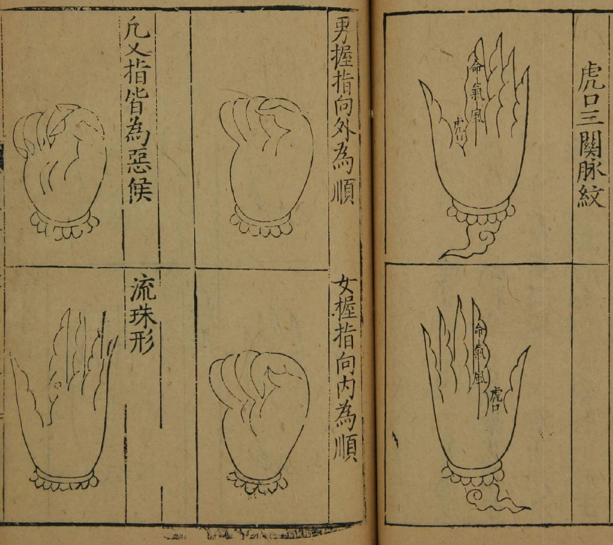
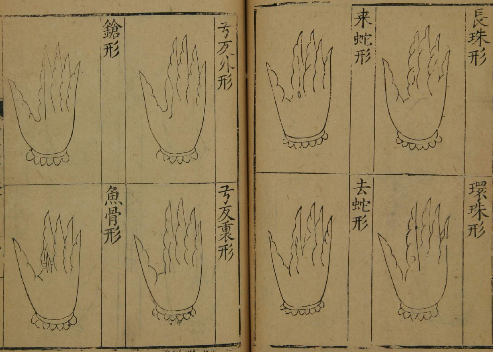
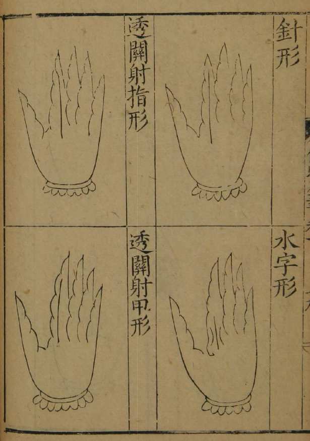

保婴撮要 明 薛铠  

## 序  

余一日过薛立斋先生，见先生蓬头执卷， 绎寻思，恍然如经生下帷之状。先生以余至，乃入户理衣冠。余缔观几案中，皆残编断简，皮壳脱落，及取一卷阅之，其点窜注释，较之经生下帷者倍之矣。余曰：先生苦心哉！先生曰：医之道不明，世之患夭扎者，将何所控诉为也？而婴儿为甚，夫婴儿不能言也。传曰：如保赤子，心诚求之。虽不中不远矣。夫中其欲非难也，尤须心诚求之，而况于疾痛痒 ，变幻百出者邪！今之医者，率执数方以求试，及其不效，则曰命也。夫按方以求病，非因病以处方，此与刻舟、胶柱者何异焉？顾卒委之命，悲夫！先生又曰：真精合而人生焉。是人之一身固五行之躯壳也，五行之中，土能生物，是人之身亦借脾土以生，兹盖主本之论云。今婴儿虽未能言，然声音之所悲号，形气之所宣扬，意欲之所指向，机未尝不可见也。虚之、实之、扶之、抑之，古人之成法俱在，或晦而难辨，或杂而不分，宜乎学医者之望洋矣。余曰：愿先生纂而约之，余将刻以传焉。先生唯唯。余又曰：频年以来，倭夷弗靖，丘墟村落之民，耕织之所根据者，十亡二三也。先生幸用心校之，倘是书的然可传，则今日之所生全者，即不必皆俊秀，固亦云汉之遗黎，桑榆之耕织也。先生有余仁矣。书成于丙辰年正月。余不佞，为之识其篇端。立斋先生名己，官太医院院使，盖三吴世家云。  

嘉靖丙辰岁春正月吉日  

赐进士第中宪大夫知苏州府事前工科给事中闽林懋举书  

## 卷一

### 卷一 初诞法  

小儿在胎，禀阴阳五行之气，以生脏腑百骸，借胎液以滋养，受气既足，自然生育。分娩之时，口含血块，啼声一出，随即咽下，而毒伏于命门，遇天行时气久热，或饮食停滞，或外感风寒，惊风发热等因发为疮疹。须急于未啼时，用软帛裹指，挖去其血，用黄连、豆豉、朱、蜜、甘草解之，后虽出痘亦轻矣。有咽入实时腹胀、呕吐、短气、不乳者，用茯苓丸治之。但黄连性寒，若禀母气膏粱积热者，宜服；若滋味淡薄，胎气元弱者，又不宜用。其朱砂固能解毒，恐金石镇坠，不若只以牛黄分许，蜜调与吮为佳。世多用犀角解毒丸，其胎气虚寒虚弱者，反伤脾胃生气，甚致不育。又有婴儿因其难产，或冒风寒而垂危者，切不可便断脐带，急烘绵絮包抱怀中，急以胎衣置火中煨烧，更用大纸捻于脐带上，往来燎之，使暖气入腹，须臾气复自苏。尤戒沐浴，恐腠理不密，元气发泄，而外邪乘之也。  

黄连法  
临月用黄连细切为末，绵裹百沸，汤拭口。  

甘草法  
预以甘草细切少许，临产时，以绵裹沸汤泡盏内覆温，收生之际，以软棉裹指，蘸甘草汁拭其口。次用黄连法、朱蜜法。  

朱蜜法  
用黄连细切，沸汤泡良久，滤净拭儿口中，吐去恶汁；更与朱砂一大豆许，细研以蜜一蚬壳抹于儿口。服之非独镇心定魄安神解毒，更能益肝胆除烦热辟邪气也。  
又牛黄法与朱蜜同，少加牛黄，能益肝胆，除热定精神，止惊邪，辟邪气，除小儿百病。  

茯苓丸  
赤茯苓 黄连（胎冷用芍药） 枳壳（炒。各等分）上为末炼蜜丸，如桐子大。每服一丸，乳汁化下。  

### 卷一 护养法  

巢氏云：小儿初生，肌肤未实，宜用旧絮护其背，不可太暖。更宜数见风日，则血气刚强，肌肉致密。若藏于重帏密室，或浓衣过暖，则筋骨软脆，不任风寒，多易致病。衣服当随寒热加减，但令背暖为佳。亦勿令出汗，恐表虚风邪易伤；乳哺亦不宜过饱，若宿滞不化，用消乳丸治之。陈氏所谓：忍三分寒，吃七分饱，频揉肚，少洗澡，要肚暖头凉心胸凉。皆至论也。须令乳母预慎七情六淫，浓味炙 ，则乳汁清宁，儿不致疾。否则阴阳偏胜，血气沸腾，乳汁败坏，必生诸症。若屡用药饵，则脏腑阴损，多致败症，可不慎欤！大抵保婴之法，未病则调治乳母，既病则审治婴儿，亦必兼治其母为善。  

消乳丸  
缩砂仁 陈皮 京三棱（煨） 蓬术（煨） 神曲 麦芽（各半两） 香附子（炒，一两）以上为末，面糊丸麻子大。每服二三丸，白汤下。  

### 卷一 噤风撮口脐风  

小儿初生噤风者，因胎中受热，毒流心脾，生下复为风邪所搏，致眼闭口噤，啼声不出，舌上如粟，口吐白沫。在百日内见撮口者，因胎热兼风，自脐入于心脾，致面目黄赤，气息喘急，啼声不出，舌强唇青，聚口撮面，腹胀青筋，吊肠牵痛，吐白沫者不救，法当疏利。脐风者，因断脐之后，为水湿风邪入于心脾，致腹胀脐肿，四肢柔直，啼不吮乳，甚者发搐，先用龙胆汤、天麻丸之类，以去痰涎；后用益脾散之类，补脾胃。若脐边青黑，手拳口噤，是为内搐，不治。受病之源，皆因乳母，七情气郁浓味积热所致。若爪甲黑，伸引努力脐突者，用大连翘饮子之类。又断脐不盈尺多患此者，以旧绵烧灰掺之，齿龈有泡如粟，以帛裹指蘸温水擦破，口即开。不用药，七日内患者，百无一生。古人治法，大率如此。又田氏治噤风，用天南星末一钱，片脑少许，以指蘸姜汁擦龈立开。丹溪用赤足蜈蚣去足炙为末，以猪乳调五分，徐徐灌之；或用牛黄以竹沥调服一字，随以猪乳滴于口中。《圣惠方》用郁金、藜芦、瓜蒂为末，水调搐鼻中。钱氏云：撮口因浴后拭脐，风邪所入而作，用益黄散补之。  
无择云：视其齿龈有泡，擦破口即开，用真白僵蚕为末，蜜调涂口内。《保婴集》云：小儿百日脐风马牙，当作胎毒，泻足阳明火，用针挑破，以桑树白汁涂之。又云：初生小儿，时时宜敷桑汁，不然，多有舌硬撮口之症。窃谓：脐风果因浴拭外伤皮肤者，用绵灰或枯矾抹擦之即愈。若因乳母肝脾郁怒，致儿为患，当治其母。若因剪脐短少，或因束缚不紧，或因牵动，风入脐中，或因铁器断脐，冷气传于脾络，以致前症者，口内有水泡急掐破，去其毒水，以艾炙脐中亦有生者。  

千金龙胆汤  
治月内脐风撮口，四肢惊掣发热吐乳，及变蒸客忤鬼气惊痫，加人参、当归。  
龙胆草（炒黑） 钩藤钩 柴胡 黄芩（炒） 桔梗 芍药（炒） 茯苓 甘草（各二钱五分） 蜣螂（二枚，去翅足） 大黄（煨，二钱五分）上为末，每服一二钱水煎，量儿加减。  

天麻丸  
治钩肠锁肚撮口。  
天南星（炮，二钱） 白附子 牙硝 天麻 五灵脂 全蝎（焙。各一钱） 轻粉（五分） 巴豆霜（一字）上为末，每服一字，薄荷汤调下。  

定命丹  
治天钓撮口，通利痰热。  
全蝎（七枚） 天麻 南星（炮） 白附子（各二钱五分） 朱砂 青黛（各一钱五分） 轻粉 麝香（各五分）上为末，米糊丸，绿豆大。每服一丸，荆芥薄荷汤下，先研半丸，吹入鼻中。  

银朱丸  
治胎风壮热，痰盛翻眼口噤，或胎中蕴毒。  
水银（和枣肉研） 全蝎 南星 朱砂（各一钱） 白附子（一钱五分） 芦荟 牛黄（各三分） 铅霜（五分，和水银研） 片脑（一字） 麝香（五分） 真僵蚕（炒，七个）上为末，米糊丸，芥子大。每服三丸，薄荷汤下。  

紫霜丸  
治变蒸发热不解或食痫，先寒后热，或乳哺失节，宿滞不化，腹痞呕吐，或大便酸代赭石（ 用醋淬七次） 赤石脂（各二两） 杏仁（五十个，面炒） 巴豆仁（三十枚，去膜油心）上先将杏仁、巴豆研成膏，入代赭、石脂末研匀，汤浸蒸饼丸，粟米大。每服三五丸，米饮  
消食丸  
（方见黄胆。）  

痰散  
治风噤，先用此药吐风涎，次与益胃散和胃；又与辰砂膏。利惊握拳噤口者，不治蝎尾 铜青（各五分） 朱砂（一钱） 腻粉（一字） 麝香（少许）上为末，每服一字，茶清调下，轻者勿用，或以甘草汤吐之。  

甘草汤  
治撮口。  
甘草（生，一钱）上水煎，以绵球蘸吮令出痰涎，却以猪乳点入口中即瘥。  

益胃散  
白茯苓 人参 甘草 木香（湿纸裹煨） 草果（煨） 陈皮 浓朴（姜制） 紫苏子（炒。各等分）上为末，每服一钱，姜枣水煎。  

辰砂膏  
治眼闭口噤，啼声不出，吮乳不得，口吐白沫。  
辰砂（三钱） 硼砂 马牙硝（各一钱五分） 玄明粉 全蝎 真珠（各一钱） 麝香（一分）上为末，每服一豆许，诸惊薄荷汤下；潮热甘草汤下；月内用乳汁调涂乳头令吮之。  

葱号散  
治初生小儿，七日不小便。  
葱白（三寸） 人乳共同捣如泥敷儿口内，即与吮乳。  

蚕号散  
治初生儿，七日不乳，名撮口。  
僵蚕（四个，去嘴略炒） 茯苓（少许）共为末，蜜调敷儿口内。  

僵蚕膏  
治撮口。用真僵蚕三枚，去嘴略炒为末，蜜调搽口中。  

撮风散  
治撮口。  
钩藤钩 朱砂 赤脚蜈蚣（半条） 真僵蚕（焙） 蝎稍（各一钱） 麝香（一字）上为末，每服一字，竹沥调下。  

瓜蒂散  
治脐风撮口。  
瓜蒂（七个） 赤小豆 秫米（各七粒）上为末，用一豆许，吹两鼻内令出黄水，更调服吐黄水即瘥。  

大连翘汤  
治胎热脐风，小便不通，及诸般疮毒。  
连翘 瞿麦 荆芥 木通 赤芍药 当归 防风 柴胡 滑石 蝉壳 甘草（炒。各一钱） 山栀子 黄芩（各五分）上为末，每服二钱，加紫草水煎，热甚加大黄，更详症加减。  

安脐散  
羚羊角（一钱，略炒） 乱发（一团烧令存性） 蜈蚣（一条，赤足者炙）上为末，断脐后即敷之，以绢帕紧束，恐犯风也。  

### 卷一 脉法  

钱仲阳云：小儿之脉，气不和则弦急，伤食则沉缓，虚惊则促，急风则浮，冷则沉细，脉乱者不治。《水镜诀》云：阴阳运合，男女成形，已分九窍四肢，乃生五脏六腑，部分既别，逆顺难明。若凭寸口之浮沉，必乃横亡于孩子，须明虎口辨别三关消详，用药始无差误。未至三岁，看虎口食指，第一节名风关脉，初见易治；第二节名气关脉，见病深难治；第三节名命关脉，见死不治。三关青是四足惊，赤是水惊，黑是人惊，紫色泻利，黄色雷惊，三关通度是极惊之症，必死。或青或红，有纹如线一直者，是乳食伤脾，必发惊热。左右一样者，是惊与积齐发。有三条，或散，是肺生风痰，或似 声。有赤是伤寒及嗽。如红火是泻，红黑相兼主下痢，青多白痢，红多赤痢。紫色相兼加渴，虎口脉纹乱，主胃气不和。青是惊与积，青黑发慢惊，脉入掌乃内钓。指纹曲里风盛，弯外食积，此论三岁以上之法。若三岁以下，更用一指按高骨，乃分三关，定其息数呼吸，八至为平脉，九至不安，十至危困。  

浮主风。沉迟主虚冷。实主有热。紧主癫痫。洪主热盛。沉缓主虚泻。微迟有积有虫。迟涩主胃脘不和。沉主乳食难化。沉细主乳食停滞。紧弦主腹中热痛。牢实主大便秘。沉而数者骨中有热。弦长是肝膈有风。紧数乃惊风为患，四肢掣颤。浮洪乃胃口有热。沉紧主腹痛有寒。虚濡者有气，又主慢惊。芤主大便利血。四岁以下，用一指根据转寻三部以关为准。七八岁移指少许。九岁次第根据三关部位寻取。十一、十二岁亦同。十四、十五岁根据大方脉部位诊视。凡看脉先定浮沉迟数、阴阳冷热，沉迟为阴，浮数为阳。更兼看部位，青主惊风，白主虚泻，赤主痰热，黑色病甚，黄主脾疳。以此相按，察病治疗，庶无误矣。又《全幼心鉴》云：小儿半岁之际，有病当于额前眉端发际之间，以名、中、食三指曲按之。儿头在左举右手，在右举左手，食指为上，中指为中，名指为下。三指俱热，主感风邪，鼻塞气粗，发热咳嗽；若三指俱冷，主外感风寒，内伤饮食，发热吐泻；若食、中二指热，主上热下冷；名、中二指热，主夹惊之疾；食指热，主胸满食滞，又当参辨脉形主之。  

流珠形：主饮食所伤，内热欲吐，或肠鸣自利，烦躁啼哭，用助胃膏消饮食分阴阳。若食消而病仍作，用香砂助胃膏以补脾胃。  

环珠形：主脾虚停食，胸膈胀满，烦渴发热，用五味异功散加山楂、枳实，健脾消食，后用六君子汤调养中气。  

长珠形：主脾伤饮食积滞，肚腹作痛，寒热不食，先用大安丸消其积滞，次以异功散健其脾来蛇形：主脾胃湿热，中脘不利，干呕不食，此疳邪内作，先用四味肥儿丸治疳，后用四君去蛇形：主脾虚食积，吐泻烦渴，气短喘急，不食困睡，先用六君子汤加枳实，健脾消积，次以七味白术散调补胃气。  

弓反里形：主感冒寒邪，哽气出气，惊悸倦怠，四肢稍冷，小便赤色，咳嗽吐涎，先用惺惺散助胃气祛外邪，后以五味异功散加茯神、当归，养心血，助胃气。若外邪既解，而惊悸指冷，脾气受伤也，宜用七味白术散补之。若闷乱气粗，喘促哽气者，难治，脾虚甚故也。  

弓反外形：主痰热，心神恍惚，夹惊夹食，风痫痰盛，先以天麻防风丸祛外邪，又用五味异枪形：主风热生痰发搐，先用抱龙丸，如未应，用牛黄清心丸。若传于脾肺，或过用风痰之药，而见一切诸症者，专调补脾胃。  

鱼骨形：主惊痰发热，先用抱龙丸治之，如未应，属肝火实热，少用抑青丸以清肝，随用六味丸以补肝。或发热少食，或痰盛发搐，乃肝木克脾土，用六君子汤加柴胡补脾土以制肝木水字形：主惊风，食积胸膈，烦躁顿闷，少食，或夜啼痰盛，口噤搐搦，此脾胃虚弱，饮食积滞，而木克土也。先用大安丸消导饮食，次以六君、钩藤钩补中清肝。若已服消食化痰等剂，而病不愈者，用四君、升麻、柴胡、钩藤钩，升补脾气，平制肝木。  

针形：主心肝热极生风，惊悸顿闷，困倦不食，痰盛搐搦。先用抱龙丸祛风化痰，次用六君子加钩藤钩平肝实脾。  

透关射指形：主惊风，痰热聚于胸膈，乃脾肺亏损，痰邪乘聚，先用牛黄清心丸清脾肺、化痰涎，次用六君子汤加桔梗、山药，补脾土，益肺金。  

透关射甲形：主惊风，肝木克制脾土之败症，急用六君、木香、钩藤钩、官桂，温补脾土。  

未应，即加附子以回阳气，多得生者。  

尝闻古人云：小儿为芽儿，如草之芽、水之沤。盖因脏腑脆嫩，口不能言，最难投剂。当首察面色，而知其所属；次验虎口，以辨其所因。实为治法之简要也。  

流珠只一点红色，环珠差大，长珠圆长，以上非谓圈子，总皆经脉贯气之如此。来蛇即是长珠散，一头大一头尖，去蛇亦如此分上下朝，故曰来去。角弓反张，向里为顺，向外为逆，枪形直上，鱼骨分开，水字即三脉并行。针形即过关一二粒米许，射甲命脉向外透指命脉曲里。虽然余常治之，亦有不专执其形脉而投剂者，盖但有是症即服是药，而亦多验。  

***治验:***  

●小儿发热吐泻，腹胀不乳，其纹如流珠。此脾胃气伤，先用香砂助胃膏，后用六君子汤痊一小儿寒热作呕，饮食不入，按其腹乃哭，脉纹如长珠，此饮食停滞也，用大安丸吐泻宿滞遂安；但唇目抽动，大便稀黄，此病邪去而虚热所迫也，用六君子汤加钩藤钩而愈。  

●小儿胸腹膨胀，发热顿闷，脉纹如环珠，以手按腹即哭，此属脾胃虚而饮食停滞也，先用保和丸一服，前症如失，更加烦渴，按其腹而不哭，此宿食去而脾胃复伤也，用五味异功散加柴胡治之顿瘳。  

●小儿不时干呕，乳食不进，肚腹膨胀，脉形如来蛇，此脾胃虚而成疳也。用四味肥儿丸治疳，佐以四君加芜荑健中而痊。后伤饮食吐泻完谷，形气甚困，四肢微搐，视其纹如去蛇，余曰：且勿用药。次日吐止，但搐而泻青黄，此脾土虚而肝木胜也，用六君子加钩藤钩而瘥。  

●小儿未及周岁，气短喘急，乳食少进，时或吐乳，视其形如去蛇，乃脾伤而食积。先用六君子加山楂、枳实，渐愈；后乳食复伤，吐泻作渴，先与胃苓膏，继与白术散而愈。  

●小儿睡卧惊悸，发热痰盛，脉形如弓之向外，此因惊木旺伤脾，而食不消也。先以天麻防风丸，祛风定惊；后用五味异功散，壮脾止搐全瘥。  

●小儿沉默昏倦，肢冷惊悸，其纹如弓之向里，此属胃气虚而外感寒邪也。先用惺惺散，以解外邪调胃气，诸症顿愈。但手足逆冷，又用六君子汤，调补元气而安。  

●小儿患咳嗽，服牛黄清心丸，加喘促腹胀。余视其右脸色赤，纹指如枪，属脾气复伤，用六君子汤顿安。  

●小儿沉困发热，惊搐不乳，视其脉纹如乱鱼骨，此风热急惊之症也。先用抱龙丸少许祛风化痰，后用六君子汤加柴胡，壮脾平肝而愈。  

●小儿咳嗽发热，右脸赤色，作渴烦闷，倦怠少食，肚腹作胀，脉纹如针，此风邪伤肺而饮食伤脾也。先用六君子汤加桔梗、杏仁、柴胡一剂，诸症少愈；后去杏仁、柴胡，再剂而安一小儿发热夜啼，乳食不进，昏迷抽搐，痰盛口噤，脉纹如水字，此脾肺气虚，风木所乘，痰食积于胸腹也。先用大安丸，后用六君子加钩藤钩而愈。  

●小儿发热，右脸赤，咳嗽痰盛，其脉纹透关射指，余以为风邪蕴结于肺而痰作也。用二陈加桑皮、杏仁、桔梗治之。自用发散降火之剂，风痰不退，发热益甚。余曰：此脾肺气虚，治失其宜。遂用五味异功散加炒桔梗渐愈，又用六君子汤而痊。  

●小儿停食发热，服芩、连、三棱、浓朴等剂，饮食日少，胸腹膨胀，其纹透至指甲。用补中益气汤加木香、钩藤钩，温补脾气，平制肝木，数剂渐效；又用六君子汤加炮姜治之而安。其间，间泛用金石脑麝祛逐之剂，变惊而殁者，不胜枚举。惜哉！  

香砂助胃膏  
（方见热吐）  

味异功散  

六君子汤  
（二方见内钓）  

安丸  
（方见虚羸）  

味肥儿丸  
（方见呕吐）  

君子汤  
（方见内钓）  

味白术散  
（方见腹痛）  

惺散  

天麻防风丸  
（二方见咳嗽）  

龙丸  
（方见伤寒）  

黄清心丸  
（方见急惊）  

青丸  
（方见惊啼）  

味丸  
（方见肾脏）  

和丸  
（方见虚羸）  

苓汤  
（方见霍乱吐泻）  

陈汤  
（方见寒冷呕吐）  

### 卷一 变蒸  

巢氏云：小儿变蒸者，以长气血也，变者上气，蒸者体热。仲阳云：变者易也。又云：变蒸者，自内而长，自下而上，又身热。故每变毕，即觉性情有异于前，何者？长生脏腑意智故也。何谓三十二日长骨添精神？人有三百六十五骨以象天数，以应期岁，以分十二经络。自初生至三十二日一变，生癸属足少阴经，肾藏精与志。六十四日二变一蒸，生壬属足太阳经膀胱腑，其发耳与 冷，肾与膀胱合，俱主于水，天一生水，地六成之。至九十六日三变，生丁属手少阴经，心藏神其性为喜。至一百二十八日四变二蒸，生丙属手太阳经小肠腑，其发汗出而微惊，心与小肠合为火，地二生火，天七成之。至一百六十日五变，生乙属足厥阴经，肝藏魂喜哭。至一百九十二日六变三蒸，生甲属足少阳经胆腑，其发目不闭（一作开）而赤，肝与胆合主木，天三生木，地八成之。至二百二十四日七变，生辛属手太阴经，肺藏魄主声。至二百五十六日八变四蒸，生庚属手阳明经大肠腑，其发肤热而汗或不汗，肺与大肠合主金，地四生金，天九成之。至二百八十八日九变，生己属足太阴经，脾藏意与智。至三百二十日十变五蒸，生戊属足阳明经胃腑，其发不食腹痛而吐乳，脾与胃主土，天五生土，地十成之。又手厥阴经心包络为脏，手少阳经三焦为腑。此一脏一腑俱无状，故不变而不蒸也。前十变五蒸，乃天地之数以生成之。此后如生齿能言知喜怒，故云始全也。太仓云：气入四肢，长碎骨于十变后六十四日为一大蒸，计三百八十四日，长其经脉，手受血故能持物；足受血故能行立。经云：变且蒸谓蒸毕而足一岁之日有余也。师曰：不汗而热者发其汗，大吐者微止不可别治。又六十四日为二大蒸，计四百四十八日。又六十四日为三大蒸，计五百一十二日，至五百七十六日，变蒸既毕，儿乃成人也。变者生五脏也，蒸者养六腑也，变者上气，蒸者发热，每经一变一蒸，情态即异，轻则发热微汗，其状似惊，重则壮热脉乱而数，或汗或吐，或烦啼躁渴，轻者五日解，重者七八日解，其候与伤寒相似。亦有变蒸之余，续感寒邪者，但变蒸则耳冷 冷，上唇发泡如浊珠，若寒邪搏之，则寒热交争，腹中作痛，而啼叫之声，日夜不绝。变者易也，蒸于肝则目眩微赤；蒸于肺则嚏咳毛耸。凡五脏六腑筋脉骨，循环各有证应，其治法平和者解表之，实热者微利之，可服紫霜丸、黑散子、柴胡汤。有寒无热并吐泻不乳多啼者，当归散、调气散主之。变蒸之外，小儿体貌情态，自然平和。大抵人得中和之道，以为纯粹，阴阳得所，刚柔兼济，气血和而百脉顺。所以心智益通，精神俱备，脏腑充实，形体固壮，齿细发黑，声洪睡稳，此乃受气充足，禀性得中，而无疾尔。前症盖小儿所不免者，虽勿药亦可也。前药峻烈，非惟脏腑之不胜，抑且反伤气血。余常见一小儿，至一变发热有痰，投抱龙丸一粒，卒至不救，观此可验，慎之慎之！其有不热不惊，略无症候而暗变者，盖受胎气壮实故也。  

紫霜丸  
（方见撮口）  

紫阳黑散  
治变蒸解利热气。  
麻黄（二两不去节） 大黄（半两） 杏仁（去皮，二分半，研）上以前三味和一处杵碎，略烧存性，后入杏仁膏和之，蜜盛贮，每用一豆许，乳汁和咽之。  

柴胡汤  
治变蒸骨热心烦，啼叫不已。  
人参（二钱） 甘草（微炙，二钱） 麦门冬（去心，二钱） 龙胆草（酒炒黑） 防风（各一钱） 柴胡（五分）上每服一钱，水煎。  

当归散  
治变蒸有寒无热。  
当归（二钱） 木香 官桂（辣者） 甘草（炙） 人参（各一钱）上每服一钱，姜枣水煎。  

调气散  
治变蒸吐泻，不乳多啼，欲发慢惊。  
木香 香附子 人参 橘皮 藿香 甘草（炙。各一钱）上为末，每服一钱，姜枣水煎服。  

### 卷一 肝脏  

钱仲阳云：肝主风，实则目直大叫，项急烦闷，虚则切牙呵欠，气热则外生风，气温则内生风，大青膏散之。若能食饮水不止，用大黄丸微下之，肝热则目直不搐，手寻衣领及乱捻物，泻青丸主之。壮热饮水喘闷，泻白散主之。肝病秋见，肺怯不能胜肝也，当用益黄散补脾，泻青丸治肝。肝有风则目连眨，得心热则搐，用泻青丸治肝，导赤散治心。甚则身反张，目直不搐，心不受热也，当用地黄丸补肾，泻青丸治肝，唇白者不治。又张洁古云：肝主风，自病则风搐拘急，若心乘肝为实邪，肺乘肝为贼邪，肾乘肝为虚邪。凡肝得病必先察其肺肾，肾者肝之母，肺者肝之贼，今肝之得病，若非肾水不能相生，必是肺金鬼邪来克，故其来在肺，先治其肺，攻其鬼也。其来在肾，先补其肾，滋其源也。然后审其本脏之虚实而寒温之。窃谓前症，若肝经实热而外生风者，宜用大青膏散之。若既服而前症仍作或益甚者，此邪气已去而脾气亏损也，宜用异功散加芎、归补之。若肝经虚热，或因克伐而内生风者，宜用异功散、地黄丸补之。若风邪入脏，能食饮冷，大便秘结者，此邪气内实也，宜用大黄丸下之。若既下而食少饮汤，或腹作胀者，此脾气内虚也，宜用白术散补之。气血素弱，或因病后，或服攻伐之剂，而手寻衣领，切牙呵欠，目淡青者乃肝经虚甚也，急用地黄丸以补肾肝。哽气、短气、长出气，乃肺经虚甚也，急用异功散以补脾肺。若申、酉时叫哭直视，呵欠顿闷，项急惊悸，手足摇动，发热饮水者，此风火相搏而胜肺金也，用柴胡栀子散以治肝火生肝血；用异功散补脾土生肺金，若唇白者为脾绝，不治。夫婴童之症，多因妊娠浓味七情，或儿乳哺失宜，或乳母饮食郁怒所致。病气既见，形气已虚，当推其所因用药，加漏芦以治其母，儿饮一二匙。后仿此。  

大青膏  
治伤风痰热发搐。  
天麻 青黛（各一钱） 白附子 乌蛇（酒浸取肉焙） 蝎尾（各五分） 天竺黄（煨） 麝香（各一字）上为末，生蜜丸豆大。每用半粒，薄荷汤化下。  

大黄丸  
治风热里实，口中气热，二便秘赤，饮水不止。  
黑牵牛（一半生，一半炒） 川芎（各半两） 甘草（一钱） 大黄（一两，酒洗饭上蒸）上为末，糊丸麻子大。每服数丸，温蜜水乳后服，以溏利为度，大小用。  
愚按前症，既属里实二便秘，法当疏下，若初服虽未通利，而病势已退，不可再服。如二便未利，病势未退，当减数丸研化服之，恐过剂则元气伤而变病也。  

泻青丸  
治急惊发搐，眼赤睛疼。  
当归 龙胆草（炒） 川芎 防风 大黄（炒） 羌活 栀仁（各等分）上为末，炼蜜丸芡实大。每服一丸，砂糖汤化下。  
愚按：前方足厥阴经解散肌表，疏通内热之药也。若大便秘结，烦渴饮冷，饮食如常者，属形病俱实，宜用此以泻之。若大便调和，烦渴饮冷，目淡青色，属病气实而形气虚，宜用抑肝散平之。若大便不实，作渴饮汤，饮食少思，肢体倦怠者，属形病俱虚，宜用地黄丸补之。大抵前症，若因肝经血虚风热，先用四物汤加钩藤钩以生肝血；次用四君子汤以补脾土。  
若因肝经血燥痰盛，用地黄丸滋肾水生肝木，四君加芍药实脾土以平肝木。若因攻伐而致脾土虚寒者，急用六君子汤加丁香、木香温补脾土，否则必变慢脾风也。  

抑肝散  
治肝经虚热发搐，或痰热切牙，或惊悸寒热，或木乘土而呕吐痰涎，腹胀少食，睡卧不安。  
软柴胡 甘草（各五分） 川芎（八分） 当归 白术（炒） 茯苓 钩藤钩（各一钱）上水煎，子母同服。如蜜丸，名抑青丸。  
小柴胡汤（加山栀、牡丹皮，名加味小柴胡） 治肝胆经风热瘰疬，寒热往来，口晡发热，潮热身热，不欲饮食，或怒火口苦，耳聋咳嗽，或胁痛胸满，小便不利，或泄泻吐酸苦水，或肢体搐动，唇目抽札，并宜用之。（方见变蒸）  

异功散  
（方见天钓）  

地黄丸  
（方见脏腑）  

白术散  
（方见积滞）  

柴胡栀子散  
（方见诸热）  

导赤散  
（方见心脏）  

四物汤  
（方见急惊）  

四君子汤  

六君子汤  
（二方见内钓）  

加味清胃散  
（方见天钓）  

补中益气汤  
（方见虚羸）  

### 卷一 心脏  

钱仲阳云：心主惊，实则叫哭发热饮水而搐，虚则困卧惊悸不安。又云：热则睡中口气温及上窜切牙，而合面卧有就冷之意，皆心热也，导赤散主之。若抑面卧者，乃心气实，气不得上下流通也，泻心散主之。心病冬见，火胜水也，当补肾治心，轻者病自愈，下窜不语者，肾虚怯也。又张洁古云：心主热，若肺乘心为微邪，肝乘心为虚邪，脾乘心为实邪，肾乘心为贼邪。凡心脏得病，必先调其肝肾，肝气通则心气和，肝气滞则心气乏，此心病先求其肝，清其源也。五脏受病必传其所胜，肾之邪必传于心，故先治其肾逐其邪也。若肝肾脉俱和，然后察其心家虚实治之。窃谓仰面卧者，因其心胸实热，故喜仰面而向虚也。合面卧者，因心胸虚热，故喜合卧而就实也。实则调治心肝，虚则调补脾肺，二者别之，尽其状矣。其切牙等症，多有雷同，不必拘泥。如用泻心、导赤等剂，邪气虽去而病仍作，当调补元气，或反甚，急温补元气。其心气冬见，或亥子时病益甚，或下窜不语者，乃肾水虚而心火甚也，用地黄丸。其乳下婴儿，须母服之。  

钱氏泻心散  
治心经实热。  
黄连上为末，每服五分，临卧温水化下。  
愚按：前症若叫哭发热，作渴饮水，抽搐有力，仰面而睡者，属心经实热，宜用泻心散或导赤散。若发热饮汤，抽搐乏力，惊窜切牙，合面而睡者，属心经虚热，用补心散。若喘嗽面赤，壮热饮水，肺乘心也，用泻白散。若摇头目札，身热抽搐，肝乘心也，用柴胡清肝散。  
若合目昏睡，泄泻身热，脾乘心也，用泻黄散。若窜视惊悸，切牙足热，肾乘心也，用安神丸。若因乳母致症，亦用前药，以治其母。  

导赤散  
治小肠实热，小便秘赤。  
生地黄 木通 甘草（等分）上为末，每服一钱，入淡竹叶水煎。  
愚按：泻心散、导赤散，泻心、小肠实火之剂。盖心为脾母，脾为心子，然心既病则脾土益虚矣。用者审之！  
钱氏生犀散  
治心经虚热。  
地骨皮 赤芍药 柴胡 干葛（各一两） 甘草（五钱） 犀角（二钱，镑）上为末，每服一二钱，水煎。（添加）愚按：前方云，治心经虚热，其所用药多属泻心、泻肝经之剂，虚热二字，恐鲁鱼也。如心经自病而血虚热者，用秘旨安神丸。脾虚夺心之气而热者，用秘旨补脾汤，肝木不能生心火，而虚热者用地黄丸。  

秘旨安神丸  
治心血虚而睡中惊悸，或受惊吓而作。  
人参 半夏（汤泡） 酸枣仁（炒） 茯神（各一钱） 当归（酒洗） 橘红 赤芍（炒。各七分） 五味子（五粒，杵） 甘草（炙，三分）上为末，姜汁糊丸芡实大。每服一丸，生姜汤下。  

地黄丸  
（方见肾症）  

补心散  
（方见惊啼）  

泻白散  
（方见肺脏）  

柴胡清肝散  
（方见热症）  

泻黄散  
（方见脾脏）  

秘旨补脾汤  
（方见惊啼）  

### 卷一 脾脏  

钱仲阳云：脾主困，实则困睡，身热饮水，或不饮水，虚则吐泻生风，脾胃虚寒，则面 白，目无精光，口鼻气冷，肌体瘦弱，吐水腹痛，不思乳食，用益黄散；下利用调中丸。伤风手足冷者，脾脏怯也，先用益黄散补脾；后用大青膏发散脾病，见四季皆仿此。顺者易治，逆者难治。脾怯当面赤黄，若兼五脏相胜，随症治之。又张洁古云：脾主湿，自病则泄泻多睡，体重昏倦。若肝乘脾为贼邪，心乘脾为虚邪，肺乘脾为实邪，肾乘脾为微邪。凡脾之得病，必先察其肝心二脏。盖肝是脾之鬼，心是脾之母，肝气盛则鬼邪有余，心气亏则生气不足，当用平肝气益心气。若诊其脉，肝心俱和，则脾家自病，察其虚实而治之。窃谓：前症实者病气实而形气虚也，若面色 白，吐泻腹痛，口鼻气冷，属寒水侮土，宜用益黄散。若面青唇黯吐泻，手足并冷，此脾土虚寒，用干姜理中汤。若面色痿黄，手足不冷，此脾土虚弱，用人参理中汤。若伤风手足并冷，吐痰咳嗽，吐泻腹胀，此脾肺气虚，用五味异功散实脾气，加防风、升麻散外邪。若发于寅卯之时，用六君、柴胡、升麻，补脾土平肝木。然面黄者脾之本色也，面赤者火生土为顺，面青者木克土为逆，当平其所胜，以补元气为善。  

大青膏  
（方见肝脏）  

调中丸  
（方见脾胃虚寒）  

人参安胃散  
治脾胃虚弱，伤热乳食，呕吐泻痢。  
人参（一钱） 黄 （二钱） 生甘草 炙甘草（各五分） 白芍药（酒炒，七分） 白茯苓（四分） 陈皮（三分上为末，每服二钱，水煎。  
愚按：东垣云：益黄散内有丁香、青皮之辛热，盖为寒水侮土而设也。若因热药巴豆之类，损其脾胃，或因暑热伤乳食而成吐泻，口鼻气热而致慢惊者，宜用前散。  

益黄散  
治脾虚吐泻不食，米谷不化，困倦力少，滑肠夜起，并疳虚盗汗，涎流口角。  
陈皮（一两） 丁香（二钱） 诃子（炮，去皮） 青皮（去白） 甘草（炙。各半两）上为末，每服一钱，水煎服。  
愚按：前症若脾土虚寒，或寒水侮土而呕吐泄泻，手足并冷，或痰涎上壅，睡而露睛，不思乳食，宜用此方。若因脾土虚弱吐泻者，用六君子汤加柴胡。如不应，或手足俱冷，属虚寒也，更加木香、炮姜。若因乳母脾虚肝侮，必治以前药。若乳母郁怒，致儿患前症，母服加味归脾汤。  

钱氏泻黄散  
（一名泻脾散） 治脾热吐舌。  
藿香叶 甘草（各七钱五分） 山栀仁（一两） 石膏（五钱） 防风（二两）上用蜜酒微炒为末，每服一二钱，水煎。  
愚按：前症若作渴饮冷，卧不露睛，手足热甚，或遍身发黄，属胃经实热，宜用泻黄散。若作渴饮汤，卧而露睛，手足并冷，属胃经虚热，宜用异功散。若面青搐搦，乳食少思，肝乘脾也，用秘旨补脾汤。若面赤惊悸，身热昏睡，心乘脾也，用秘旨安神丸。若面白喘嗽，肢体倦怠，肺乘脾也，用补中益气汤。若唇黑泄泻，手足指冷，肾乘脾也，用益黄散。病后津液不足，口干作渴，宜用七味白术散。若乳母膏粱浓味，七情郁火所致，当审其因而治其母。  

人参理中汤  
（方见伤寒表里）  

五味异功散  

六君子汤  
（二方见天钓、内钓）  

### 卷一 肺脏  

钱仲阳云：肺主喘，实则闷乱喘促或饮水，虚则哽气、出气、短气。若肺盛复感风寒，则胸满气急喘嗽，用泻白散。肺热则手掐眉目鼻面，用甘桔汤。肺虚热则唇色深红，少用泻白散。肺怯则唇色白，用阿胶散。若闷乱气粗喘促哽气者，难治。肺病久唇白者，此脾肺子母皆虚也，若白如猪脂者吉，白如枯骨者死。如肺病春见，肺胜肝也，用地黄丸补肝肾，泻白散以治肺。目淡青必发惊，更有赤者当搐，为肝怯也。又张洁古云：肺主燥，自病则喘嗽，燥则润之。若心乘肺为贼邪，肝乘肺为微邪，肾乘肺为实邪，脾乘肺为虚邪。凡肺之得邪必先观心脾二脏之虚实。若心火铄金，当抑心滋肺。若脾气虚冷不能相生，而肺气不足，则风邪易感，宜补脾肺。若脾实中痞热气上蒸于肺，宜泻脾气。若心脾平和而肺自病，当察虚实治之。窃谓：肺经郁热，用泻白散；肺气自虚，用四君子汤；外邪所乘，用参苏饮；心火炎烁，用人参平肺散；中焦实痞，用大承气；脾不能生肺，用异功散。夫肺气盛者，肺中之邪气盛也，其脉右寸必浮而有力，宜用泻白散以泻之。若肺虚而有热者，执肺热伤肺之说，而不用人参误矣，仍参某症治之。  

泻白散  
化痰止咳，宽气进食。  
地骨皮 桑白皮（炒。各一两） 甘草（炙，一钱）上为末，每服一二钱，入粳米百粒水煎。  
愚按：活人方云：喘者，肺气盛而有余，然气盛当认作气衰，有余当认作不足。盖肺气盛者，肺中之火盛也，有余者，肺中之邪有余也，其脉右寸必浮而有力，右颊色赤，用前药以泻之。前症若乳母感冒风寒，肺经蕴热，致儿为患，用参苏饮。若乳母膏粱醇酒积热，致儿是病，用清胃散。  

甘桔汤  
治风热上攻，咽喉疼痛，及喉痹妨闷。  
苦梗（一两） 甘草（炒，二两）上每服二钱，水煎。  

阿胶散  
治肺虚咳嗽喘急，或咳而哽气，喉中有声。  
阿胶（一两，蛤粉炒） 鼠粘子（二钱五分，炒香） 甘草（一钱，炙） 马兜铃（半两，炒） 杏仁（七个去皮尖） 糯米（一两）上每服一二钱，水煎。  
愚按：前方乃直治肺金之剂。经云：虚则补其母。若前药未应，当用五味异功散以补脾。  

地黄丸  
（方见肾脏）  

四君子汤  
（方见内钓）  

参苏饮  
（方见诸热）  

人参平肺散  
（方见咳嗽）  

大承气汤  
（方见伤寒表里）  

异功散  

清胃散  
（二方见天钓、内钓）  

### 卷一 肾脏  

钱仲阳云：肾主虚，无实症。惟痘疮实则黑陷，更当分别症之虚实。假如肺病又见肝症，咬牙呵欠者易治，肝虚不能胜肺也；若目直视大叫哭，项急烦闷者难治，盖肺病虚冷肝强实而胜肺也。视病新久虚实，虚则补其母，实则泻其子。夫肾虚者，由胎气不盛，则神短囟开，目多白睛，面色 白，此皆难养，纵长不过八八之数。若恣色欲，不及四旬而亡，或有因病而致肾虚者。又云：肾气不足则下窜。盖肾虚骨重，惟欲坠下而缩身也。肾水阴也，肾虚则目无精光畏明，皆用地黄丸。肾病见夏，水胜火也，轻者病自退，重者当惊发搐。又张洁古云：肾主寒，自病则足胫寒而逆。肾无实，疮疹黑陷乃实，是水制火也。若心乘肾为微邪，肺乘肾为虚邪，肝乘肾为实邪，脾乘肾为贼邪，本脏虚弱，正令不行，鬼贼克害，当补本脏之正气。假令肺病喘嗽，见于初春，当补肾；见于夏，救肺；见于秋，救脾；见于冬，补心泻本脏，乃名寒嗽。大抵五脏，各至本位，即气盛不可更补，到所克部位，不可更泻。然五行之中，惟肾水一脏，母盛而反受邪，何则？肺属金射于皮毛，所主者气。肾属水主于骨髓，所藏者精，气之轻浮能上而不能下，精之沉重能下而不能上，此物性之自能。今肺气得热而上蒸则不能下，生于肾而受邪矣，急服凉药解之。此肾病必先求肺。或脾经之湿刑克于肾，宜去脾湿，若脾肺平和而肾自病，则察其本脏而治之。窃谓：下窜等症，足不喜覆者，盖腰以下皆肾所主，乃心气下行于肾部也，法用地黄丸壮肾水以制心火。若因脾肺虚而不能生肾水者，用补中益气汤、六味地黄丸以滋化源。其疮疹黑陷，乃肾虚而邪气实也，尤当用地黄丸。  

地黄丸  
熟地黄（八钱，杵膏） 山茱萸（肉） 干山药（各四钱） 泽泻 牡丹皮 白茯苓（各三钱）上为末，入地黄膏量加米糊丸，桐子大。每服数丸，温水空心化下。行迟鹤膝加鹿茸、牛膝、五加皮。  
愚按：前丸治肾肝血虚，燥热作渴，小便淋秘，痰气上壅；或风客淫气，患瘰结核；或四肢发搐，眼目 动；或咳嗽吐血，头目眩晕；或咽喉燥痛，口舌疮裂；或自汗盗汗，便血诸血；或禀赋不足，肢体瘦弱，解颅失音；或畏明下窜，五迟五软，肾疳肝疳；或早近女色，精血亏耗，五脏齐损；或属肾肝诸症不足之症，宜用此以滋化源。其功不可尽述。  

补中益气汤  
（方见虚羸）  

## 卷二

### 卷二 面上症  

钱仲阳云：左腮为肝，右腮为肺，额为心，鼻为脾，颏为肾。色青主惊积不散，欲发风候。  
红主痰积惊悸。黄者食积症伤，欲作疳癖。白主泄泻水谷，更欲作呕。黑主脏腑欲绝。  
印堂：青主初患惊泻，红主大惊夜啼，黑主客忤。  
山根：青主二次惊，泻后发躁，黑黄甚者死。  
年寿：平陷主天，青主发热生惊，黑主利死，红主躁死，微黄曰平，黄甚曰霍乱。  
承浆：青主食时被惊，黄主吐逆亦主血利，黑主惊风。  
面眼：黑睛黄主有热，白睛黄主食积疳 ，白睛青主惊风，黑睛黄主伤寒。  
眉上：青吉，忽红主烦躁夜啼，黄主霍乱，久病红者死。  
风气二池：青主风候，紫主吐逆，或发热，黄主吐逆，赤主烦躁夜啼。  
两颧：赤主肺有客热。  
两太阳：青主二次受惊，青自太阳入耳者死，红主血淋。  
两脸：青主客忤，黄主痰溢，赤主风热。  
两颊：赤主伤寒，两颐青主吐虫。  
两金匮：青主第三次惊风，黑绕口三日死，青连目入耳七日死。  
两风门：红主风热，黑主疝，青主水惊，黑从眉入耳即日死，唇黑不食者死。  

面青眼青肝病，面赤心病，面白肺病，面黄脾病，面黑肾病。  

额间：赤色主心经有热，烦躁惊悸，若饮水或叫哭，属本经实热，用泻心散以清心火；微赤困卧惊悸，热渴饮汤，属虚热，用秘旨安神丸以生心血；青黑主惊风，腹痛或螈 啼叫，用五味异功散加木香、柴胡、钩藤钩补脾肝；青黑主心腹作痛，此寒水乘心，用益黄散；微黄主惊疳，用安神丸。  

左脸青或兼赤，主肝经风热，项强顿闷，目札螈 ，用柴胡清肝散。色微赤倏热切牙属虚热，用地黄丸。青黑主肝克脾而惊搐腹痛，用六君子加姜、桂。微赤主潮热血虚心躁，先用秘旨安神丸，次用地黄丸。  

右脸赤主风邪，气粗咳嗽，发热饮水，为实热，用泻白散。若哽气出气、唇白气短，属虚热，用五味异功散。若脾热所传，用清胃散。心火所刑，用人参平肺散。淡赤主潮热心躁，或大便坚秘，用宣明柴胡饮子以疏导。如潮热未止，更用钩藤饮以清肝。色青白主咳嗽恶心，先用惺惺散，解表邪健脾土，更以六君子汤调补中气。色青黑主惊风腹痛，盘肠内钓，用六君、钩藤钩平肝补脾。  

鼻微黄为平，赤主脾胃实热，身热饮水，乳食如常，用泻黄散清热理脾。微赤主脾经虚热，身凉饮汤，乳食少思，用五味异功散补中健脾。色深黄主小便不通，鼻中干燥，气粗衄血，乃脾热传于肺肾，先用济生犀角地黄汤，后用地黄丸。色淡白乃脾虚泄泻，乳食不化，用六君子汤调补中气。青色主脾土虚寒，肝木所胜，用五味异功散加木香、炮姜温中平肝。黑为死候。  

颏间色赤主肾与膀胱气滞热结，而小便不通，用五苓散以分利。鼻准微黄兼右腮微赤，乃脾肺燥热不能生化肾水，用黄芩清肺饮。膀胱阴虚，阳无所主，用滋肾丸。若颏间微赤，乃膀胱阳虚，阴无所化，用六味地黄丸。若小腹胀满，或阴囊肿胀，属阴虚湿热壅滞，用六味丸加车前、牛膝。脾肺气虚不能通调水道者，亦用前药。其小便赤色，久而尿血，亦属肝肾气虚有热，用六味地黄丸，如不应，则用补中益气汤益脾肺生肝肾。若小便后出白津，或茎中作痛，属肝经湿热，先用龙胆泻肝汤，后用六味地黄丸。  

印堂：青黑主腹痛夜啼，此脾气虚寒也，脾为至阴，故夜间腹痛而啼，用钩藤饮。色淡白主泄泻，乳食不化，属脾气虚弱，用五味异功散加木香。  

人中：黄主伤乳胃逆，青主下利，乳食不化，嗳气酸腐，此脾虚停滞，先用大安丸消食，后用异功散健脾。黑主蛔虫咬痛。  

唇：色白主吐涎呕逆，或吐血便血，乃脾气虚弱不能摄涎统血归源，急用六君子汤。色赤干燥而皱者，主脾经热渴，大便不通，烦热不寐，先以清胃散治其热，次以四君、黄连、山栀调其脾。黄主食积泄泻，乳食不化，以六君子汤健脾。色赤兼白主衄血，乃脾肺虚热，不能摄血归源，用圣济犀角地黄汤清热补血，用四君子汤以补脾气，如久不应，用麦门冬散，或人参安胃散。  

口畔：色黄主脾经积热，用清胃散；久病用四味肥儿丸以治疳热。唇口抽动主惊热不安，用异功散加山栀、钩藤钩，补脾平肝。若口流涎唇色紫，乃脾气虚寒，用异功散加炮姜、木香。若腹中痛口吐涎，乃虫作痛，先用芜荑散，后用调中丸。不吐涎是积痛也，用异功散。手足厥冷，用理中汤加乌梅温补中气而痛自止。或吐后，或大便去后而痛止者，先用下积丸，后用异功散。  

白主失血死，青主惊风死，黑色绕口者不治。耳后微赤，此少阳经风热，用柴胡饮子清肝生血。微黄主睡中惊悸切牙，用四君子加芎、归、升麻以调理脾气。  

耳：干燥主骨疳蒸热，作渴盗汗，用地黄丸。若小便后出白津，或玉茎痒痛，属肝经湿热，先用龙胆泻肝汤，后用地黄丸。若禀赋肾气不足，或早近女色，致小便湿滞，或作痛如淋者，急用地黄丸、补中益气汤滋其化源。或大小便去后，谷道牵痛者，其虚尤甚，用前丸加牛膝、车前、肉桂。如手足逆冷，或畏寒少食，阳气虚寒也，急加附子多可得生。大抵多因禀赋脏气不平，或乳食寒暑失节，或妊娠乳母饮食起居六淫七情所致。若初病元气无亏，乳食如常，发热壮热，二便秘结，作渴饮水，睡不露睛者，悉属形病俱实，当治邪气。若病久元气已亏，食少发热，口干饮汤，呕吐泄泻，肢体畏寒而露睛者，悉属形病俱虚，当补正气，更宜审胎气之虚实，脏腑之相胜而治之，庶无误矣。  

泻心散  
（方见心脏））  

秘旨安神丸  
（方见心脏））  

五味异功散  
（方见内钓）  

朱砂安神丸  
（方见发搐）  

柴胡清肝散  
（方见诸热）  

地黄丸  
（方见肾脏症）  

六君子汤  
（方见内钓）  

泻白散  
（方见肺脏）  

清胃散  
（方见内钓）  

补中益气汤  
（方见虚羸）  

人参安胃散  
（方见脾脏）  

宣明柴胡饮子  
（方见发热）  

钩藤饮  
（方见慢惊）  

惺惺散  
（方见咳嗽）  

泻黄散  
（方见脾脏）  

五淋散  
（方见五淋）  

济生犀角地黄汤  
（方见便血）  

### 卷二 发搐  

钱仲阳云：惊痫发搐，男左视无声，右视有声；女右视无声，左视有声，此相胜也。盖左为肝部，右为肺部，金木相胜故耳。若寅卯辰时身热，目上视，手足动，口流涎，项强急，此肝旺也。巳午未时身热发搐，心神惊悸，目上视，牙紧流涎，手足搐动，此心旺也。申酉戌时身热微搐而喘，目微斜，睡露睛，手足冷，大便淡黄水，此肺旺也。亥子丑时微搐，卧而不安，身微热，目紧斜，喉中有痰，大便色白，困睡流涎，此肾虚也。若握拳拇指在内女为顺，拇指在外男为顺。顺则易治，逆则难愈。若涎入心肝，则不能言，用凉心镇惊。下痰逆搐者不治，吐泻后变症者亦不治。如手足冷汗，搐眉搐肚，日夜不止，名真搐，当用人参汤、川乌、全蝎等药，平其胃气。伤风发搐，口中气热，呵欠，手足动者，名假搐，用大青膏发散风邪。伤食后发搐，身热困睡，呕吐不思乳食者，当先定搐，后用白丸子下之。百日内发搐，真者内生风，二三次必死，假者外生风，虽频发不死。外伤风者用大青膏涂囟门，及浴体法。  

寅卯辰时搐而发热作渴，饮冷便结，属肝胆经虚热，用柴芍参苓散；作渴引饮，自汗盗汗，属肝胆经血虚，用地黄丸；口吻流涎，属肝木克脾土，用六君子汤。  

巳午未时发搐，若兼作渴饮水，属风火相搏，以地黄丸补肝，导赤散、凉惊丸治心；若作渴饮汤，体倦不乳，土虚而木旺也，用地黄丸以补肾，六君子汤以补脾。  

申酉戌时微搐而喘，目微斜，身似熟睡而露睛，大便淡黄，属脾肺虚热，用异功散；手足逆冷，或喘泻不食，属脾肺虚寒，用六君、炮姜、木香；久病而元气虚者，用六君子、六味丸二药主之。  

亥子丑时，微搐身热，目睛紧斜，吐泻不乳，厥冷多睡，属寒水侮土，用益黄散，未应，用六君、姜、桂。伤风发搐，口气不热，肢体倦怠，用异功散补脾土；钩藤饮清肝木。若因风邪内郁发热而变诸症者，当理肺金，清风邪。若外邪既解，而内症未除，当理肺补脾。若脾经亏损而致惊搐等症者，当补脾肺以平肝心，则惊搐自止矣。若停食发搐，呕吐乳食者，宜用消食丸。若食既消而前症仍作，或变他症者，脾土伤而肝木乘之也，用六君子加钩藤钩以健脾平肝。若百日内搐者，因胎气所禀，亦有乳母七情浓味所致者，当兼治其母，而以固胃为先，不可迳治其儿也。  

***治验:***  
●小儿寅卯时发热痰搐，服抱龙丸而愈。后复患，因自用前药，更加咳嗽气喘，不时发搐，面赤或青黄，或浮肿，或流涎。余谓：咳嗽气喘乃脾肺气虚，不时发搐，乃木乘土位，面青而黄赤，乃肝助心脾，浮肿流涎乃脾气虚弱，用益智丸以补心神；补中益气汤以补脾肺，顿愈。  

少参王阳湖孙跌伤股骨，正体科已续。余视其面色青黄，口角微动，此肝木侮脾之症，且气血筋骨皆资脾土以生，但壮脾气则所伤自愈，遂用六君、钩藤、当归三十余剂，诸症悉痊。  

●小儿两目连札，手足发搐，服天麻防风丸之类，每发饥时益甚，得饮食稍定，此肝木制脾土也。用六君、升麻、柴胡、钩藤钩二剂而病痊；又用补中益气汤而全效。  

●小儿巳午时，搐热惊悸，发时形气倦怠，面黄懒食，流涎饮汤，此心火虚而不能生脾土也。不信，自服凉心之药，更加吐泻，睡而露睛，几成慢脾风，用六君、姜、桂，佐以地黄丸而愈。  

●小儿七岁，惊搐发热不已，巳午未时益甚，形气殊倦，热定饮汤，此心脾气虚。朝用补中益气汤加益智仁，夕用六君、当归、钩藤钩寻愈。后饮食过多，复作呕泻，或治以保和丸，反加寒热发搐，此脾土复伤，而肝木所侮也。用六君、柴胡，寒热止而饮食进，但午未时，仍泄，用补中益气汤加茯苓、半夏、钩藤钩而愈。  

●小儿百日内患搐，痰涎自流。用惊风药益甚，视其面色黄中隐白，乃脾虚不能摄涎也，用六君子、补中益气二汤而愈。后复患兼气喘，自欲表散行痰。余谓：此肺虚不能纳气归源耳，用五味异功散加钩藤钩、柴胡，调补脾肺清理肝火而安。  

●小儿患前症，面青黑或痿黄，审其母素有郁怒，用加味逍遥散、加味归脾汤，治其母而子亦愈矣。  

●小儿月内发搐鼻塞，乃风邪所伤，以六君子汤加桔梗、细辛，子母俱服，更以葱头七茎、生姜二片，细擂摊纸上，合置掌中令热，急贴囟门，少顷鼻利搐止。  

●小儿未盈月发搐呕乳，腹胀作泻，此乳伤脾胃，用五味异功散加漏芦，令母服之，子亦服匙许遂愈。  

●小儿惊悸痰盛，泻乳不消，此感风邪夹惊，肝侮脾而气虚，先以天麻防风丸祛风定惊，后用五味异功散壮脾止搐而愈。  

●小儿发搐啼叫，手足指冷，左腮青黑，此脾土虚弱肾水反所侮也。用六君、姜、桂一剂顿安，又以四君、芎、归及补肝散而愈。  

●小儿发热拘急，四肢螈 左腮赤，此心肝二经风热。先用柴胡清肝散，次用六味地黄丸而愈。  

●小儿发热作渴，用泻黄散，大便重坠，口角流涎，仍欲泻火。余曰：鼻准青白多而黄色少，属脾胃虚寒，肝木所侮，盖口角流涎，脾气虚而不能摄也，大便重坠，脾气陷而不能升也。不信，另用凉惊之剂，果眉唇微动，四肢微搐。余曰：此虚极而变慢风也。始用六君、当归、木香、炮姜、钩藤钩二剂，未效，意欲更药。余曰：此药力未至也。仍加附子一片，服之即安，后去附子，又二剂而愈。  

●小儿目内色青发搐，目直上视，叫哭不已，或用牛黄清心丸，更加切牙顿闷，小便自遗。  
余谓：此肝脾虚甚。用补中益气汤、六味地黄丸而愈。  

●小儿发搐目札，属肝胆经风热，先用柴胡清肝散以清肝，后用六味地黄丸以补肾而愈。  

凉惊丸  
治惊疳热搐，心神惊悸，白睛赤色，牙关紧急，潮热流涎，手足动搐。  
黄连（五钱） 龙脑（一钱研） 龙胆草（酒拌炒黑） 防风 青黛（三钱研） 钩藤钩子（二钱） 牛黄 麝香上各另为末，面糊丸粟米大，每服三五丸至一二十丸，煎金银汤下。  

愚按：前方治心肝二经风热。若心肝虚而见惊搐潮热，用秘旨安神丸。肝木乘脾者，用异功散加柴胡、钩藤钩。心脾虚弱而潮热流涎者，用异功散，若虚寒更加木香。不应，更加炮姜。（详见滞颐）  

擦牙通关散  
治风搐搦，关窍不通，痰塞中脘，留滞百节。  
南星（二钱） 麝香（一字） 牙皂（二铤，烧存性） 赤脚蜈蚣（一条） 僵蚕（一钱）上为末，姜汁蘸药少许擦牙，或调服二三点涎自出。  

至圣保命丹  
治胎惊内钓，腹肚紧硬，啼叫不安，及急慢惊风，眼目上视，手足抽掣，不省全蝎（十四个，去毒） 防风（二钱） 白附子 炮南星 蝉壳 僵蚕（去丝嘴，炒） 天麻 朱砂（各一钱） 麝香（五分） 金箔上为末，米糊和每两作四十丸，每服一丸，白汤化下，有热者以胆星易炮星。  

白饼子  
治伤食呕吐，肚疼嗳气，先用此药一服，推下食积，却用惺惺散加减参苏饮，不可服冷药。  
滑石 半夏 胆南星（各一钱） 轻粉 巴豆（二十四粒去皮膜，用水一升煮干研烂）上以三味为末，入巴豆、轻粉研匀，饭丸绿豆大，每服三五丸，紫苏汤下，忌热物，量儿加  

十味安神丸  
治惊人参 茯神 麦门冬 山药（各二钱） 片脑（二分） 龙齿（一钱） 朱砂 甘草 寒水石（各五分） 金箔（二片）上为末，蜜丸鸡头大，灯心汤调下，一方有马牙硝。  

浴体丸  
天麻（二钱） 蝎尾（去毒） 朱砂（各五分） 乌蛇（以酒浸焙） 白矾（各二钱） 麝香（一字） 青黛（二钱）上为末，每服三钱，水三碗，桃枝一握，煎至数沸，温浴之，勿浴背。  

涂囟法  
治发搐麝香（一字） 蝎尾（去毒 薄荷叶三分） 蜈蚣 青黛末 牛黄（各一字）上同研，用熟枣肉剂为膏，新绵上涂匀贴囟上，四方可出一指许，火上炙手频熨，百日里外小儿可用此。  

泻青丸  
（方见肝脏）  

导赤散  
（方见心脏）  

地黄丸  
（方见肾脏）  

益黄散  
（方见脾脏）  

苏青膏  
（方见慢惊）  

大青膏  
（方见肝脏）  

### 卷二 目睛动  

目者肝之窍也，肝胆属风木二经，兼为相火。肝藏血，血不足则风火内生，故目睛为之 动。经曰：曲直动摇风之象也。宜用四物益其血，柴胡、山栀清其肝，阴血内荣，则虚风自息矣。若因肝经血燥而目病者，用六味丸以滋其源。因肺金克肝木者，用泻白散以平金邪。若眼眶 动者，肝木乘脾土也，用抱龙丸。若愈后惊悸不寐，或寐中发搐切牙，目睛 动者，血虚不能荣筋脉也，用补中益气汤或归脾汤加茯苓、五味。盖有余者，邪气实也，不足者，真气虚也。凡病气有余当认为不足，况此症兼属肝脾，多为慢惊之渐，尤当审之。  

***治验:***  

●小儿三岁，因惊抽搐发热，久服抱龙丸等药，面色或赤或青。余曰：始因肝有实邪，故宜用前药，今面色青赤，乃肝经虚热传心矣。遂用六味丸以养肝肾，佐以六君、升麻、柴胡，以补脾胃，诸症顿痊。  
大尹周应昌子，患瘰疬，恪服化痰之剂，虚宜用六君子汤。  

泻青丸  
（方见肝脏）  

六味丸  
（方见肾脏）  

四君子汤  
（方见天钓）  

泻白散  
（方见肺脏）  

### 卷二 唇口蠕动  

唇为脾之华，口乃肺之窍，又阳明之脉，环唇口而交人中阳明胃也。是以脾胃虚者，多有此症，不独病后而已。夫脾主涎，脾虚则不能收摄，多兼流涎，或误认为痰，而用祛逐之药，则津液益枯，不能滋养筋脉，遂致四肢抽搐，病势愈甚。原其治法与慢脾风相同，当用大补脾胃之药，加升麻、柴胡，切勿用青皮、龙胆草之类。兼察其色，黄者脾弱也，青者肝胜也，青黄不泽，木来克土也，青赤相兼，木火风热也。黑为寒水反来侮土；白为气虚亡阳，凡此宜用六君子汤加小柴胡汤。若四肢微搐，或潮热往来，或泄泻呕吐，面色痿黄，皆脾胃有伤也，宜用白术、黄 、川芎、当归、人参、陈皮、肉豆蔻、神曲、甘葛、白芍药、黄连、炙甘草、白茯苓，以补胃气。若脾胃虚弱者，用五味异功散，虚寒加木香、炮姜。若脾气下陷者，用补中益气汤以升其阳。作渴者，用七味白术散以生津液。若肝木侮脾者，用补中益气汤加茯苓、半夏、芍药，以治肝补脾。  

***治验:***  
●小儿伤食发热唇动，或用养胃汤、枳实、黄连、山楂之类，更加腹胀，午后发热，按其腹不痛。余以为服前药，饮食虽化而脾胃复伤也，用六君子汤数剂而痊。  

●小儿伤食发热，呕吐唇动，服消导清热之剂，饮食已消，热亦如故。余曰：此胃经虚热耳。用四君子、升麻、柴胡，四剂而愈。  

●小儿素面白，忽然目唇微动，时面色黄青，良久其唇口、手足亦微动，此脾虚而肝侮之也，用五味异功散加钩藤钩、白附子一剂，而面青少退；再二剂，唇口动亦止；又用异功散加升麻、柴胡四剂而痊。  

●小儿暑月吐泻，目唇微动，面色青白，手足并冷，仍用玉露散。余谓：已变慢脾风也，当温补脾肾。不信，后果殁。  

五味异功散  
（方见天钓、内钓）  

补中益气汤  
（方见虚羸）  

七味白术散  
（方见积痛）  

六君子汤  
（方见天钓）  

小柴胡汤  
（方见 症）  

四君子汤  
（方见天钓）  

### 卷二 惊搐目直  

小儿忽然惊搐目直者，皆肝之风热也。若肝虚生风则目连札而不搐，及多欠、切牙。若肝经风实，则目直大叫，呵欠项急顿闷。若肝经有热，则目直视不搐，得心热则搐，气热则外生，气温则内生，其症手寻衣领及乱捻物。宜用泻青丸。壮热饮水喘闷，宜用泻白散。凡病之新久，皆能引肝风，风内动则上入于目，故目为之连札。若热入于目牵其筋脉，两 俱紧，不能转视，故目直也。亦有饮食停滞中焦，致清阳不升，浊阴不降，肝木生发之气不得升致生虚风者，须详审之。若胸满腹痛，呕吐恶食，轻则消导化痰，重则探吐滞积，更须审其所伤寒物热物。亦有因感冒吐泻，致使土败木侮而生虚风者，不可遽服惊药，宜用六君子加芍药、木香、柴胡，制肝补脾。若因脾土虚而自病者，用五味异功散。凡饮食停滞，痰涎壅满而见惊症者，实因脾土虚弱，不能生金，金虚不能平木，故木邪妄动也，宜健脾消食，其症自愈。若辄用惊风之药，反成其风而益其病也。况脏腑脆嫩，不可投以竣厉之剂，治者慎之。  

***治验:***  
姚仪部子每停食则身发赤晕，此饮食内停不消，郁热发外，用清中解郁汤而愈。后患摇头咬牙，痰盛发搐，吐出酸味，伺其吐尽，翌日少以七味白术散，调理脾胃，遂不复患。  

●小儿停食，服通利之剂作呕腹胀，此脾胃复伤也。用补中益气汤而愈。  

●小儿两目动札，手足发搐，数服天麻防风丸之类，前症不愈，其痰益甚，得饮食稍愈。视其准头及左颊色青黄。余曰：脾主涎，此肝木克脾土，不能统摄其涎，非痰盛也。遂用六君、升麻、柴胡、钩藤二剂，饮食渐进，诸症渐愈；又用补中益气汤而安。  

九味养脾汤  
治小儿大病后，面黄肌瘦，目动切牙发少，未能强步。因误服解表泻利伤克诸药而致者，宜长缓调理，全复胃气。  
白术（一钱二分） 白芍药（酒炒） 白茯苓（各八分） 人参 陈皮 川芎（各六分） 甘草（炙） 黄（蜜炙）上用姜、枣水煎服。  

六君子汤  

五味异功散  
（二方见天钓）  

清中解郁汤  
（方见丹毒）  

七味白术散  
（方见积痛）  

补中益气汤  

参苓白术散  
（二方见虚羸）  

天麻防风丸  
（方见伤风咳嗽）  

### 卷二 睡中惊动  

小儿睡中惊动，由心肾不足所致。盖心主血与神，肝藏血与魂，肺主气与魄，肾主精与恐。  
小儿脏腑脆弱，易为惊恐，恐则气下，惊则心无所根据，神无所归。且夫人之神气，寤则行于目，寐则栖于肾。今心肾既虚，则不能宁摄精神，故睡中惊动也。治宜清心安神，用茯苓补心汤加酸枣仁、茯神、五味。亦有惊吓而作者，因击动其肝，故魂不安也。治宜镇惊定魂，用安神镇惊丸。若饮食间因惊而停滞者，用六君子加神曲、浓朴，食既消而惊未定，用茯苓补心汤。若木火太过而心神不宁者，用导赤散。风热相搏者，用柴胡栀子散。食郁生痰惊动不安者，用四君以健脾；神曲、半夏以化痰；山栀、芍药以清热。  

***治验:***  
●小儿夜睡忽然惊动如搐，大便酸臭而色青，此饮食伤脾而肝旺也。先用异功散加柴胡、升麻、山栀，又用四味肥儿丸而愈。  

●小儿不时睡中惊动发搐，作渴饮冷，左腮青额间赤，先用柴胡清肝散，加钩藤钩四剂以治肝火，后用五味异功散以健脾，又用地黄丸补肾肝而安。  

导赤散  
（方见心脏）  

柴胡栀子散  
（方见诸热症，即栀子清肝散）  

六味丸  
（方见肾脏）  

四君子汤  

六君子汤  

五味异功散  
（三方见天钓）  

茯苓补心汤  
（方见喑）  

安神镇惊丸  
（方见急惊）  

### 卷二 目动咬牙  

小儿惊后目微动切牙者，皆病后亡津液，不能荣其筋脉也。亦有肝惊虚热而生风者，当审其气血有余不足而治之。其日中发热饮冷而动者，气有余也，用泻青丸。夜间盗汗及睡不宁而动者，血不足也，用地黄丸。或因肝经风邪传于脾肾者亦令切牙，先用柴胡清肝散，次用五味异功散，六味地黄丸。若因脾胃虚热，用补中益气汤加芍药、山栀，实热用泻黄散。盖牙床属手足阳明故也。若肝肾热用六味地黄丸。  

***治验:***  
奚氏女六岁，忽然发惊目动切牙，或睡中惊搐痰涎壅盛，或用化痰祛风等药，益甚。余曰：面青而见前症，乃属肝木克脾土，不能摄涎而上涌也。当滋肾水生肝血，则风自息而痰自消矣。遂用六味丸而愈。  
●小儿患前症，痰涎自流，用惊风之药，其症益甚，脾胃益虚，视其面色痿黄，口中吐痰，用六君子补中益气汤而愈。  

导赤散  
（方见心脏）  

地黄丸  
（方见肾脏）  

泻青丸  
（方见肝脏）  

补中益气汤  
（方见虚羸）  

六味地黄丸  
（方见肾脏）  

六君子汤  
（方见天钓）  

### 卷二 摇头便血  

经曰：诸风掉眩，皆属肝木。木得风则摇动，乃肝经火盛而生虚风也。汤氏治郑都承子摇头便血七年，用祛风药、止血药，百试无效。此肝经风热所乘，土受木克，不能摄血而溃入大肠，故便血不止，遂制清肝益胃汤，以平肝益脾祛风热，兼服胃风汤，旬余诸症悉愈。便血者风木摇动，则土受凌虐，而不能统血也。或食酸味过多，以益其肝致令阴结。经曰：结阴者便血一升，再结二升，三结三升。又邪在五脏，则阴脉不和，阴脉不和，则血留之，结阴之病，阴气内结不得外行，渗入肠间，故便血也。血亦有乳母恚怒，风热炽盛，或肝木伤脾，使清气不升。或风邪侵入大肠者。治法：若因风热，用柴胡清肝散。若因怒火，用加味小柴胡汤。若清气不升，脾气下陷者，用补中益气汤。若风邪侵于大肠者，用清肝益胃丸。肝经血热妄行者，用六味地黄丸。脾土不能培肝木者，用六君、柴胡、钩藤钩。肝木胜脾土者，用四君、芍药、钩藤钩。结阴者，用平胃地榆汤。  

***治验:***  
●小儿伤风咳嗽痰涌。余谓：脾虚肺弱，腠理不密，风邪外乘。用六君子汤加桔梗、桑皮、杏仁而愈；后饮食停滞，作泻腹胀，仍用六君子加山楂、浓朴而安。又停食作泻，服消导之药，更加咳嗽。余谓：当调补脾土。不信。自用发表克滞，前症益甚，更加摇头。余以天麻散倍加钩藤钩及异功散而愈。  

●小儿项间结核，面色痿黄，肌体消瘦，切牙抽搐，头摇目札，此肝木克脾土也。用六君子汤及九味芦荟丸顿愈。  

●小儿病后，遇惊即痰甚，切牙抽搐，摇头作泻，恪服脑、麝、朱砂等药，以致慢惊而卒。  

犀角屑 甘草 全蛇蜕（炙黄） 钩藤钩子 麻黄（去节，一钱） 黄 （蜜炙） 羌活 防风 白芍药上为末，枣肉杵丸桐子大。每服五十丸，食后薄荷汤下。  
《海藏食疗》云：蛇蜕主去风邪明目。治小儿一百二十种惊痫寒热等症，蛊毒安胎，炒用又治风痫、弄舌摇头。故前方用之。  

平胃地榆汤  
治结阴便血。  
白术 陈皮 茯苓 浓朴 葛根（各五分） 地榆（七分） 干姜（五分） 炙甘草 当归 炒神曲 白芍药 人参 益智（各三分） 升麻 附子（炮。各一钱）上每服一钱，水煎服。  

胃风汤  
（方见偏风口噤）  

柴胡清肝散  
（方见诸热症）  

加味小柴胡汤  
（方见肝脏）  

补中益气汤  
（方见虚羸）  

六味地黄丸  
（方见肾脏）  

泻白散  
（方见肺脏）  

六君子汤  

四君子汤  
（二方见天钓）  

天麻散  
（方见内嗽）  

异功散  
（方见天钓）  

九味芦荟丸  
（方见疳症）  

### 卷二 偏风口噤  

小儿偏风者，属少阳厥阴肝胆二经症也。噤者筋急，由风木太甚而乘于脾以胜水湿，则筋太燥。然燥金主于收敛劲切故也。又曰：风之为病，善行而数变，或左或右，其因一也。治须审而药之。若足阳明胃经气虚，风邪所乘，其筋脉偏急者属外因。若足厥阴肝经风热乘脾，筋脉偏急者属内因。若脾肺虚弱，腠理不密，外邪所乘，或服金石之剂耗损肝血，或吐泻后内亡津液不能养肝，致口眼歪斜，或半身不遂，诸症皆属肝血不足，肝火生风，宜滋肾水养肝血壮脾土。治法：脾胃虚而动风者，异功散加柴胡、钩藤钩。脾肺虚而外邪所乘者，用钩藤饮。肝火血燥者，用六味地黄丸。津液不足者，用白术散。若兼目紧上视，寒热往来，小便淋沥，面色青洁，两胁胀痛之类，皆肝经之本病也。或唇口歪斜，腹痛少食，目胞浮肿，面色青黄，肢体倦怠之类，皆肝木乘脾之症也，当审五脏相胜而主之。设执其见症概投风药，反成坏症者有矣。  

***治验:***  
●小儿口眼 斜，面色或青或赤，此肝心风火乘脾也。朝用柴胡清肝散，夕用异功散加钩藤钩而愈。其时有患前症，服祛风导痰之药者，皆不能起。  

●小儿痢后患前症发搐。面色痿黄，肢体倦怠，此元气虚克伐多矣。余用补中益气汤加钩藤钩子服而渐愈。后因乳母七情饮食失宜，或儿乳食过多，前症仍作。服补中益气汤、五味异功散而应。  

钱氏全蝎散  
治惊风口眼歪斜，言语不正，手足偏废不举。  
全蝎（去毒，炒） 僵蚕（直者，炒） 川芎 黄芩 甘草 桂枝 赤芍 麻黄（去节。各二钱） 天麻（六钱） 天南星（去脐，二钱）上为末，每服二三钱，姜五片，水煎服。  

胃风汤  
治风冷乘虚入客肠胃，水谷不化，泄泻注下，及肠胃湿毒，下如豆汁或瘀血，日夜人参 白茯苓 芎 桂 当归 白芍 白术（各等分）上散每服二钱，入粟米数粒同煎，食前服。  

异功散  
（方见天钓）  

六味丸  
（方见肾脏）  

白术散  
（方见积痛）  

柴胡清肝散  
（方见诸热）  

补中益气汤  
（方见虚羸）  

### 卷二 角弓反张  

钱仲阳曰：角弓反张者，由风邪客于太阳经也。经曰：风从上受。足太阳主周身之气，其脉起于目内 而行于背。肝属木主风，所以风邪易侵也。夫小儿肌肤未密，外邪易伤，肝为相火，其怒易发。若身反张强直发热不搐者，风伤太阳也，宜用人参羌活散、小续命汤。若因暴怒而击动其肝火者，宜用泻青丸。若饮前剂，其症益甚者，此邪气已去而脾气亏也，宜用异功散加芎、归补之。若因肝经虚热，或因克伐真气，虚热生风者，宜用异功散、地黄丸补之。若因下而脾气困备，腹肚膨胀者，此中气损也，宜用白术散补之。若气血素弱，或服攻伐之剂，而手寻衣领，切牙呵欠者，肝经虚甚也，急用地黄丸以补之，仍与肝脏参览。  

***治验:***  
●小儿忽腰背反张，目上视，面青赤，曰青属肝主风，赤属心主火，此风火相搏，用柴胡栀子散，倍加钩藤钩顿安，而痰如旧，又用抱龙丸而愈。  
●小儿忽腰背反张，服治惊之药后，不时举发，面色黄白，肢体甚倦。余用五味异功散，十余剂而愈。后因惊兼饮食不节，不时举发，随用前药即愈。遂日以参术末，每服五七分，炮姜、大枣煎汤调下，服至二两而不发，以上二症，元气虚而病气实也。若用攻邪之药皆误矣。  
●小儿素患前症，痰盛面色素白而兼青。余谓：肺气不能平肝，肝气乘脾，脾气虚而生痰耳。先用抱龙丸二服以平肝；随用六君子汤，以补脾肺，月余而痊。半载之后复发，谓非逐痰不能痊愈。遂用下剂，痰涎甚多，而咽喉如锯声。余曰：乃脾不能摄涎也，咽间鸣乃肺气虚甚也。遂用人参五钱、炮姜三分，水煎服而醒。至第四剂后，加枣二枚，人参服数两而愈。  
后每发非独参汤不应。若执常方，鲜不有误者。  

人参羌活散  
（方见惊风）  

小续命汤  
（方见五硬）  

## 卷三

### 卷三 急惊  

钱仲阳云：急惊者因闻大声，或惊而发搐，搐止如故，此热生于心，身热面赤引饮，口中气热，二便黄赤，甚则发搐。盖热甚生风，阳盛而阴虚也。宜以利惊丸除其痰热，不可用巴豆之药。盖急惊者阳症也，俱府受病而属实，乃少阳相火旺。经曰：热则生风，风生痰。痰热客于心膈间，则风火相搏，故抽搐发动。经所谓：木太过曰发生，其动掉眩颠疾是也。当用利惊丸、导赤散、泻青丸等药，搐止与安神镇惊丸。娄全善亦曰：急惊属木火土实。木实则搐而有力，及目上视动札频睫；土实则身热面赤，而不吐泻，偃睡合睛。治法宜凉宜泻，而用凉惊、利惊等丸。亦有因惊而发者，牙关紧急，壮热涎潮窜视，反张搐搦颤动，唇口眉眼眨引，口中热气，颊赤唇红，二便秘结，脉浮洪数紧，此内有实热，外挟风邪，当截风定搐。若痰热尚作仍微下之，痰热既泄，急宜调养胃气，搐定而痰热少退，即宜调补脾气。东垣云：若因外物惊者，宜黄连安神丸。因气动所惊者，宜安神镇惊丸之类，大忌防风丸。如因惊而泻青色，宜朱砂丸，大忌凉惊丸。盖急惊者，风木旺也，风木属肝，盛则必传克于脾，欲治其肝，当先实脾，后泻风木，若用益黄散则误矣。经曰：邪气盛则实，正气夺则虚。  

前所云实者，乃病气有余而形气不足也。当先泻而后补，虚甚急当补脾为先，少以攻邪之药佐之。其所云虚者，乃病气、形气俱不足也，当纯补真气为要。若肝经风火相搏，抽搐目，筋急痰盛者，当用四物汤以生肝血，加钩藤钩、山栀以清肝火，更用四君子以补脾，六味丸以滋肾。若肺金克木而兼呵欠者，用泻白散以泄肺邪，地黄丸以益肝血。若邪入肝，则用柴胡清肝散，加龙胆草亦可。邪入心，用栀子清肝散，加炒黄连亦通。邪入肾，用六味地黄丸。邪入肺，用地骨皮散。邪入脾，用六君子加柴胡、山栀。大抵此症属肝胆经血虚，风火相搏，而善行数变者为多，若不养肝血，不补脾气，纯用祛风化痰之药，则脾益虚，血益损，邪气延绵，必传慢惊矣。  

***治验:***  
●小儿九岁，因惊发热，抽搐顿闷，切牙作渴，饮冷便秘，面色青赤，而印堂左腮尤赤，此心脾二经风热相搏，乃形病俱实之症也，先用泻青丸料炒黄连一剂，大便随利，热搐顿减；继用抑青丸一服，诸症悉退。但面色痿黄，肢体倦怠，饮食少思，此病气去而脾气未复也，用补中益气汤及地黄丸而痊愈。  
●小儿发热抽搐，口噤痰涌，此胆经实火为惊风也。先用泻青丸一服，六味丸二服，诸症即退；又用小柴胡汤加芎、归、山栀、钩藤钩，次以补中益气汤而痊。  
●小儿忽然发热，目动切牙，惊搐痰盛，或与祛风化痰药益甚，面色青黄，乃肝木克脾，脾之液为涎，虚则涎不能摄，上涌而似痰也。法当生肝补脾，则风自息痰自愈矣。遂用六味丸及六君子汤而愈。  
●女子十二岁，善怒，睡中抽搐，遍身作痒，饮食少思。此肝经风热脾土受克也，用参术柴苓汤，以清肝健脾而愈。  
●小儿三岁患急惊，面赤发热，作渴饮冷，用泻青丸一服，热衰大半。因见得效，翌早又自制一服，反加吐泻发搐，面色青白，手足指冷，此热既去而妄自伤脾也。用六君子、姜、桂、升麻、柴胡一剂得安。是以前哲谓小儿易为虚实，攻伐之药衰其大半乃止，不可过之，罗谦甫约方约囊之论恪矣。  
●小儿三岁，因惊抽搐，发热痰盛，久服抱龙丸等药，面色或赤或青，此心肝二经血虚风热生痰也。用六味丸滋肾生血；用六君、柴胡、升麻调补脾胃而安。  
●小儿潮热发热，左腮青赤，此心肝二经血虚之症也。用秘旨安神丸及四物汤加防风、酸枣仁治之而愈。  
●小儿潮热发搐，痰涎上涌，手足指冷，申酉时左腮青色隐白。用补中益气汤调补脾肺，六味丸滋养肝肾而痊。  
嘉兴王一山女七岁，因跌伤腿膝，两 肿溃，面色青洁，左关无脉。余谓：惊则气散，而风热郁滞于肝，故其脉隐伏。用四君、升麻、柴胡、钩藤钩一剂，脉至随愈。  
●小儿印堂青黑，至夜啼搐。余谓：脾土虚寒也，用钩藤饮而安；后因惊发搐夜啼，仍用前药一剂，诸症复愈，又用异功散而痊。  
●小儿七岁，患急惊将愈，而发热惊悸，误服祛风化痰之剂，更加惊搐，吐痰喘嗽，腹胀少食恶寒。再用抱龙丸，大便似痢，寒热往来，殊类风症。先君治之以为脾气亏损，诸经无所滋养而然，用四君子汤为主，少加升麻、柴胡，以升补阳气而愈。  
●小儿惊风后痰嗽不止，睡卧不宁，诸药无效，余用牛黄清心丸少许顿止。后复伤风邪，痰盛喘急，饮食不下。仍用牛黄丸少许而安；再用异功散加桔梗而愈。  

利惊丸  
治急惊痰盛发热潮搐。  
青黛 轻粉（各二钱） 牵牛末（半两）上为末，面糊丸寒豆大。每服十丸，薄荷汤化下。  

安神镇惊丸  
惊退后调理，安心神养，气血和平预防之剂也。  
天竺黄（另研） 人参 茯神 南星（姜制。各五钱） 酸枣仁（炒） 麦门冬 当归（酒炒） 生地黄（酒洗）（。各二钱） 青黛（一钱，另研）上为末，蜜丸绿豆大。每服三五丸，量儿大小加减，淡姜汤送下。  

四物汤  
治血虚发热烦躁，或晡热作渴，头目不清，若因脾虚不能生血者，用四君子汤。  
当归 熟地黄（各二钱） 芍药 川芎（各一钱）上水煎服。  

参术柴苓汤  
人参 白术 茯苓 陈皮（各一钱） 柴胡 升麻（各七分） 山栀（炒，八分） 钩藤钩（一钱） 甘草（炒五分）每服一二钱，姜枣水煎。  

黄连安神丸  
治心经血虚头晕，神魂惊悸。  
黄连（酒洗，六钱） 甘草（炙五分） 生地黄 当归（各一钱五分） 朱砂（飞过，五钱）上为末，饭糊丸梧桐子大。每服十五丸，空心白滚汤下。如二三服不应，当服归脾汤补之。  
愦等症。或小儿风热上壅，抽搐发热，或急惊痰盛发搐，目反口噤。或大人伤寒，汗下之后，烦躁发热不解，并宜服之。  
牛黄（一钱二分半） 麝香 龙脑 羚羊角（各一钱） 当归 防风 黄芩 白术 麦门冬 白芍药（各一钱半） 柴胡 桔梗 白茯苓 杏仁（去皮尖） 芎 肉桂 大豆黄卷 阿胶（各一钱二分半）蒲黄 人参 神曲（各三钱半） 雄黄（八分） 甘草（五分） 白蔹（七分半） 犀角（二钱） 干山药（七钱干姜（三钱） 金箔（一百三十片） 大枣（十个，蒸熟烂研）上为末，炼蜜丸每两作十丸，金箔为衣。每服一丸，温水化下。  

朱砂丸  
（方见发搐）  

泻青丸  
（方见肝脏）  

导赤散  
（方见心脏）  

抑青丸  
（方见肝脏）  

补中益气汤  
（方见虚羸）  

地黄丸  
（方见肾脏）  

小柴胡汤  
（方见发痉）  

六君子汤  
（方见天钓）  

秘旨安神丸  
（方见心脏）  

异功散  
（方见天钓）  

### 卷三 慢惊  

钱仲阳云：慢惊因病后或吐泻或药饵伤损脾胃，肢体逆冷，口鼻气微，手足螈 ，昏睡露睛，此脾虚生风，无阳之症也，温白丸主之。盖慢惊者阴症也，俱脏受病而属虚，因吐泻脾肺俱虚，肝木所乘，而致螈 微搐。娄全善所谓：木虚则搐而无力。经所谓：木不及曰委和，其病摇头是也（谓手足搐动，泄泻心悸）。火虚则身寒，口中气冷。土虚则吐泻，睡面露睛。治宜温补脾胃，用六君子汤、五味异功散之类。徐用诚云：乙木属阴，乃肝脏病，故慢而难治。况有夹热、夹食、夹痰与外感症相似者，当宗钱氏方主之。《保婴集》云：急惊屡发而屡用直泻之药，则脾阴愈消，而变为慢惊多矣，大率吐泻痰鸣气喘，眼开神缓，昏睡露睛，惊跳搐搦，乍发乍静，或身热身冷，面淡青白，或眉唇青赤，其脉迟沉数缓是也，当温补脾气为主，而佐以安心制肝。东垣亦云：慢惊风由脾胃虚而生。脾虚者因火邪乘其土位，火旺能实其木，木旺故来克土。当于心经中以甘温补土之源，更于脾土中泻火，以甘寒补金以酸凉，致脾土中金旺火衰，风木自虚矣。禀赋不足，或久病脾虚，及常服克伐之药者，多致此症。若因土虚不能生金，金不能平木，木来侮土，而致前症者，以五味异功散加当归、酸枣仁，佐以钩藤饮子补土平木。若脾土虚寒者，用六君子加炮姜、木香，不应，急加附子以回阳气。盖阴血生于脾土，宜四君子、当归、酸枣仁。凡元气亏损而至昏愦者，急灸百会穴，若待下痰不愈而后灸之，则元气脱散而不救矣。此乃脏腑传变已极总归虚处，惟脾受之无风可逐，无惊可疗，因脾虚不能摄涎，故津液妄泛，而似痰者，当根据前法自效。若不审其因，泛用祛风化痰之剂，则脾气益伤，阴血益损，病邪益盛而危矣。  

***治验:***  
举人余时正子伤食发丹，服发表之剂，手足抽搐，服抱龙丸目 痰盛。余谓：脾胃亏损，而变慢惊也，无风可祛，无痰可逐，只宜温补胃气。遂用六君加附子一剂而愈。  
●小儿抽搐，痰涎自流。或用惊风之药益甚。视其面色黄白，余用六君、补中益气二汤，补脾肺而愈。  
●小儿伤风咳嗽痰涌。用六君、桔梗、桑皮、杏仁治之而愈。后饮食停滞作泻腹胀，用六君加山楂、浓朴而安。又复停食作呕，或用药下之，更加咳嗽。余谓：脾肺俱虚，宜用调补。  
彼以为缓，自服发表克滞，前症益甚，头项颤动。余用天南星散，倍加钩藤钩及异功散而愈。  
●小儿遇惊即痰盛切牙发搐，摇头作泻。恪服脑麝朱砂等药，以致慢惊而卒。  

术附汤  
治风湿相搏，身体烦疼，不能转侧，不呕不渴，大便坚硬，小便自利，及风症头目白术（四两） 甘草（炒，二两） 附子（炮去皮脐，一两）上为末，入附子每服三钱，姜五片，枣一枚，水煎服。  
愚按：附子温中回阳，为慢脾之圣药也。如元气未脱，用之无有不应，须用每只重一两三四钱，端正不尖底平，周遭如莲花瓣者佳。否则，误用川乌也。制法：切去皮尖，以童便浸之，秋冬七日，春夏五日，每日一换，浸毕切作四块，以湿草纸包数层，微火煨半日，取出切开，无白星为度，如急用炮至裂纹，即投童便中良久浸透切片，如色白，再微炙之。气脱甚者，急生用亦效。  

太乙保生丹  
治慢惊尚有阳症者。  
全蝎（青者十四个） 白附子（生用） 真僵蚕 牛胆南星 蝉壳 琥珀 防风 朱砂（各一钱） 麝香（五分）上为末，米糊丸桐子大，金箔为衣。每服一二丸，薄荷汤下。  

聚宝丹  
治慢惊。  
人参 茯苓 琥珀 天麻 真僵蚕 全蝎（炙） 防风 牛胆南星 白附子（生用） 乌蛇肉（酒洗砂（半钱） 麝香（少许）上为末，炼蜜丸桐子大。每服二丸，以菖蒲汤送下。  

金箔镇心丸  
治风壅痰热，心神不宁，惊悸烦渴，唇焦颊赤，夜卧不安，谵语狂妄。  
朱砂（一两） 白茯苓 人参 甘草（各半两） 山药（一两半） 片脑 牙硝（一钱半） 麝香（五分） 金箔（十二贴为衣） 草紫河车（二钱半，黑豆煎煮）上为末，炼蜜丸，每用五钱作五十丸，以金箔为衣。每服一丸，薄荷汤化下，含化亦得。  

温白丸  
治驱风豁痰定惊。  
人参 防风 白附子（生用） 真僵蚕 全蝎（各一钱，焙） 南星（汤洗七次，焙） 天麻（各二钱）上为末，水糊丸桐子大。每服三五丸，姜汤下。  

乌蝎四君子汤  
即四君子加川乌、全蝎各少许为末，每服半钱，姜枣水煎服，次服去川乌。  
南星（重八九钱者一个，掘地坑深尺许，先用炭五斤烧通红，以好米醋一碗洒坑中即投南星以覆，时许取出。）上为末，入琥珀、全蝎各一钱，每服二字，煎生姜、防风汤下。  

乌沉汤  
治慢惊驱风助胃。  
天麻（二钱） 人参 真川乌（生用） 全蝎（焙） 南星（焙） 木香 沉香（各一钱） 甘草（炒半钱）上右末，每服三五分，姜水煎服。  

沉香散  
治助胃气止吐泻。  
茯苓（二钱） 沉香 丁香 木香 藿香 浓朴（制） 甘草（炙。各一钱）上为末，每服一字，米饮汤调下。  

苏青丸  
苏合香丸（一分） 青州白丸子（二分）上和匀每服五分，姜汤调下。  

银白散  
治胃虚吐泻。  
糯米（炒，二两五钱） 扁豆（蒸，二两） 藿香（二钱） 白术（炒，一两） 丁香（二钱） 甘草（炙，三钱）上为末，紫苏米饮调下，直指方加炮白附子、全蝎、木香、石莲、姜水煎。  

钩藤散  
治吐利脾胃气虚生风。  
钩藤钩（二钱） 蝉壳 天麻 防风 蝎尾（去毒） 人参（各半两） 麻黄 僵蚕（炒） 甘草（炙） 川芎（各二钱五分） 麝香（五分）上为末，水煎服，虚寒加附子一钱。  

黑附子汤  
治慢脾风四肢厥冷。  
附子（炒，去皮三钱） 木香 人参（各一钱五分） 白附子（一钱） 甘草（炙五分）上为散，每服三钱，姜五片水煎，若手足既温，即止后服。  

生附四君子汤  
治吐泻不思乳食，凡虚冷病，先与数服，以正胃气。  
人参 白术 附子 木香 茯苓 橘红 甘草（各等分）上为末，每服五七分，姜、枣水煎服。  

辰砂膏  
治慢脾冷痰壅滞，手足冷而微搐者。  
黑附子（一枚重一两以上者去皮脐，顶上挖一孔入辰砂末一钱，仍用附子塞之，炭火烧存性）牛胆南星（半两） 白附子（炮） 五灵脂 蝎稍（各二钱半）上为末，炼蜜丸桐子大。每服二三钱，生姜汁泡汤下。  

七宝辰砂丹  
治风痰奇效，慢惊慢脾，以辰砂为主，木香佐之，用开元钱一个，背后上下有两月片者，放铁匙上炭火内烧，少顷成珠子，取入盏中，作一服，用木香煎汤送下，人参汤  

天麻防风丸  
（方见脐风）  

参苓白术散  
（方见虚羸）  

异功散  
（即五味异功散方见虚羸）  

四君子汤  
（方见天钓）  

益黄散  
（方见脾脏）  

六君子汤  
（方见天钓）  

补中益气汤  
（方见虚羸）  

### 卷三 惊痫  

钱仲阳云：小儿发痫，因血气未充，神气未实，或为风邪所伤，或为惊悸所触，亦有因妊娠七情惊怖所致者。若眼直目牵，口噤涎流，肚膨搐，背项反张，腰脊强劲，形如死状，终日不醒，则为 矣。如面赤目瞪，吐舌啮唇，心烦气短，其声如羊者，曰心痫。面青唇青两眼上窜，手足挛掣，反折其声如犬者，曰肝痫。面黑目振，吐涎沫，形体如尸，其声如猪者，曰肾痫。面如枯骨，目白反视，惊跳反折，摇头吐沫，其声如鸡者，曰肺痫。面色痿黄，目直腹满自利，四肢不收，其声如牛者，曰脾痫。五痫通用五色丸为主，仍参以各经之药。心痫属血虚者，用养心汤；发热饮冷为实热，用虎睛丸；发热饮汤为虚热，用妙香散。肝痫者，虚症用地黄丸；抽搐有力为实邪，用柴胡清肝散；大便不通，用泻青丸。肾痫者用地黄丸、生也，用五味异功散；面色赤者，阴火上冲于肺也，用地黄丸。脾痫者用五味异功散；若面青泻利，饮食少思，用六君子加木香、柴胡；若发热搐掣仰卧，面色光泽脉浮，病在腑为阳易治；身冷不搐覆卧，面色黯黑脉沉，病在脏为阴难治；凡有此症，先宜看耳后高骨间，先有青脉纹，抓破出血，可免其患，此皆元气不足之症也，须以紫河车（即小儿胞也）丸为主，而以补药佐之。设若泛行克伐，复伤元气，则必不时举发，久而变危，多至不救。又有惊风食痫三种，详见后方，仍参惊风胎风治之。  

***治验:***  
一老人生子方周岁，秋初暴冷，忽发搐似惊痫，过则气息奄奄，此元气虚弱所致，与补中益一小儿十岁，一小儿七岁各有痫症，岁发二次，后因出痘及饮食停滞，举发频数。用六君子一小儿患前症，每发吐痰困倦半晌而苏，诸药不应。年至十三而频发，用紫河车生研烂入人参、当归末，丸桐子大。每服三五十丸，日进三五服，乳化下，一月渐愈，又佐八珍汤痊愈一小儿七岁发惊痫，每作，先君令其恣饮人乳，后发渐疏而轻。至十四岁复发，仍用人乳，不应。余令用肥浓紫河车研烂人乳调如泥，日服二三次，至数具而愈。后常用加减八味丸而安；至二十三岁发，而手足厥冷，仍用前法，佐以八味丸、十全大补汤而痊。  

五痫丸  
治诸痫。  
雄黄 真珠（各一两，研细） 朱砂（水飞，半两） 水银（二钱半，用铅二两熔化入水银炒结候冷）上为末，炼蜜丸麻子大。每服二三丸，金银煎汤下。  

钱氏蛇黄丸  
治惊痫因震骇恐怖，叫号恍惚是也。  
蛇黄（真者三个，火 醋淬） 郁金（七分，一处为末） 麝香（另入一匙）上为末，饭丸桐子大。每服一二丸，煎金银磨刀水化下。  

牛黄丸  
治风痫因汗出解脱风邪乘虚，迷闷搐掣涎潮，屈指如计数是也。  
牛胆南星 全蝎（焙） 蝉蜕（各二钱半） 防风 白附子（生用） 天麻 真僵蚕（炒。各一钱半） 麝香（半字）上为末，枣肉和丸，水银半钱，研细入药丸绿豆大。每服一二丸，荆芥生姜汤下。  

妙圣丹  
治食痫因惊而停食吐乳寒热，大便酸臭是也。  
赭石（ 醋淬，二钱半） 巴豆（三个去心油，三钱） 雄黄 蝎稍 朱砂（各一钱） 轻粉 麝香（各一匙） 杏仁（微炒，二钱）上为末，枣肉丸梧子大。每服一二丸，木贼草煎汤送下。  

星苏散  
治诸风口噤不语。  
天南星（略炮锉）上每服五七分，姜四片紫苏五叶水煎，入雄猪胆少许温服。  

断痫丹  
治痫瘥后复作，症候多端，连绵不除者。  
黄 （蜜炙） 钩藤钩 细辛 甘草（炙。各半两） 蛇蜕（二寸，酒炙） 蝉蜕（四个） 牛黄（一钱，另研）上为末，煮枣肉丸麻子大，煎人参汤下，每服数丸，量儿加减。  

消风丸  
治风痫，先宜此药。  
牛胆南星（二钱） 羌活 独活 防风 天麻 人参 荆芥 川芎 细辛（各一钱）上为末，蜜丸桐子大。每服二丸，薄荷紫苏汤调化下。  

祛风保安丸  
诸风久远治之并验。  
川乌（去皮尖，二钱半，生用） 五灵脂（半两）上为末，猪心血丸桐子大。每服一二丸，姜汤化下。  

雌黄丸  
治颠痫搐掣恶声嚼舌。  
雌黄 黄丹（微炒。各五钱） 麝香（五分）上为末，用牛乳汁三合熬膏杵丸，麻子大。每服二三丸，以温熟水送下。  

比金丸  
治惊痫先用此药。  
人参 琥珀 白茯苓 远志（姜制取肉炒） 朱砂 天麻 石菖蒲（细蜜者） 川芎 南星 青黛（各一钱） 麝香（一匙）上为末，蜜丸桐子大。每服一二丸，金银薄荷汤送下。  

虎睛丸  
治惊痫邪气入心。  
虎睛（细研） 远志（姜汁浸） 犀角（锉屑） 大黄（湿纸包煨） 石菖蒲 麦门冬（各等分） 蜣螂（去足翅炒，三枚）上为末，米糊丸桐子大。每服一二丸，竹叶煎汤，或金银薄荷煎汤送下。  

清神汤  
治惊痫。  
犀角（锉屑） 远志（姜汁焙） 白藓皮 石菖蒲 人参 甘草（炒。各一钱半）上为末，每服五七分，麦门冬煎汤调下。  

密陀僧散  
治心痫不语，及诸惊失音，用密陀僧为末，每服一匙，米醋汤调下，大人服一钱  

蝎虎散  
治惊痫。  
褐色生蝎虎（一个，连血细研）上入朱砂、麝香末少许同研，用薄荷汤调作一服，数年者亦效。盖痫疾皆心血虚滞，生蝎虎管守其血。继服二陈汤，若无生蝎，以带性雄猪心血代用，入代赭石散大妙。  

代赭石散  
治阴阳痫。  
代赭石（ 醋淬，研为末水飞过晒干）上为末，每服半钱，以金银煎汤和金箔银箔调，连进二服。脚胫上有赤斑乃邪气发出可治，  

化风丹  
凉风化痰，退热定搐。  
牛胆南星 羌活 独活 防风 天麻 人参 川芎 荆芥 粉草（各一钱） 全蝎（一个）上为末，炼蜜丸皂角子大。每服一钱，薄荷汤化下。  

茯神汤  
治胆气虚寒，头痛目眩，心神恐惧，不能独处，或者惊痫。  
茯神 酸枣仁（炒） 黄 （炒） 柏子仁（炒） 白芍药（炒） 五味子（炒。各一两） 桂心 熟地黄（自制）人参 甘草（炒，五分）上每服二三钱，水煎。  

酸枣仁丸  
治胆气实热惊痫，或睡卧不安，惊悸怔忡。  
茯神 酸枣仁（炒） 远志 柏子仁（炒） 防风 枳壳（麸炒。各半两） 生地黄（杵膏，半两） 香竹茹（二钱五分）上各另为末，蜜丸粟米大。每服七八十丸，白滚汤送下。  

定志丸  
治心神虚怯，所患同前，或语言鬼神，喜笑惊悸。  
人参 茯苓（各一两五钱） 菖蒲 远志（各一两）上各另为末，蜜丸，如前服。  

养心汤  
治心血虚怯惊痫，或惊悸怔忡，盗汗无寐，发热烦躁。  
黄 白茯苓 茯神 半夏曲 当归 川芎 辣桂 柏子仁 酸枣仁 五味子 人参（各三钱）上每服一、二钱，姜枣水煎。  

妙香散  
治心气不足，惊痫或精神恍惚，虚烦少寐，盗汗等症。  
辰砂（三钱） 麝香（一钱） 木香（煨二钱五分） 茯苓 山药 茯神 远志 黄 （炒。各一两） 桔梗甘草（炒） 人参（各五钱）上各另为末，每服一钱，温酒或白汤调服。  

八味地黄丸  
（即六味地黄丸加附子、肉桂各一两） 治禀赋命门火衰，不能生土，以致脾土虚寒，也。或乳母命门火衰，儿饮其乳致前症者，子母并宜服之。（方见惊痫）  

加减八味丸  
治禀赋肾阴不足，或吐泻久病，津液亏损，口干作渴，或口舌生疮，两足发热，或痰气上涌，或手足厥冷等症。（即地黄丸加肉桂一两，五味子四两）  

黄丸  
治小儿肝经虚热血燥，或风客淫气而患瘰疬结核。或四肢发搐，眼目抽动，痰涎上涌，又治肾肝脑热，肢体消瘦，手足如冰，寒热往来，滑泄肚胀，口臭干渴，齿龈溃烂，爪黑面黧。或遍身两耳生疮，或耳内出水，或发热自汗盗汗，便血诸血失音等症。其功不能尽述。（即六味地黄丸，方见肾脏。）  

八珍汤  
治气血俱虚，阴火内热。或因克伐之剂，脾胃亏损，肌肤消瘦等症。（即四君、四物二汤，方见惊痫。）  

十全大补汤  
治气血虚弱，或禀赋不足，寒热自汗，食减体瘦，发热作渴，头痛眩晕。最宜用之。（方见热症。）  

补中益气汤  
（方见虚羸）  

六君子汤  
（方见内钓）  

紫霜丸  

天麻丸  
（二方见脐风）  

### 卷三 惊风  

惊风者，虚惕怔忡，气怯神散，痰涎来去，泄泻色青。若惊入心则面赤夜啼，用栀子清肝散加黄连。入肝则面青眼窜，用柴胡清肝散。入脾则面黄呕吐虚汗嗜卧，用六君加柴胡、山栀。入肺则面白喘急，用异功散加柴胡、桔梗。入肾则面黑啮奶切牙，用六味地黄丸。若因乳母恚怒肝火，或膏粱积热，遗儿为患，或儿吐泻伤脾，清气不升，风木陷入太阴传变等因，皆能致此，当随主治。否则必成慢脾也，须预慎防为善。  

***治验:***  
●小儿十五岁御女后，复劳役，考试失意，患痫症三年矣。遇劳则发，用十全大补汤、加味归脾汤之类，更以紫河车生研如膏，入蒸糯米为末，丸如桐子大。每服百丸，日三五服而痊。后患遗精盗汗发热，仍用前药及地黄丸而愈。此症治不拘男妇老幼皆效。  
●小儿周岁后，从桌上仆地，良久复苏。发搐吐痰沫，服定惊化痰等药，遇惊即复作。毕姻后，不时发而难愈，形气俱虚，面色痿黄，服十全大补、补中益气二汤而愈。  

至宝丹  
治诸惊痫心热，及卒中客忤烦躁，风涎搐搦，或伤寒狂语，伏热呕吐。  
生犀角（镑屑） 生玳瑁 琥珀 朱砂（水飞） 雄黄（水飞。各一两） 金箔（五十片半为衣） 银箔（五十片） 片脑（一匙） 麝香（一钱） 牛黄（半两） 安息香（一两半，为末酒掬去砂取一两酒煎成膏）上各另为末和匀，入安息香膏，如干入熟蜜少许，桐子大。每服一二丸，人参汤化下，量儿加减。  

神妙夺命丹  
七月内取青蒿节内虫，入朱砂、麝香为丸，麻子大。每服三五丸姜汤下。  

人参羌活散  
治伤风惊热。  
羌活 独活 前胡 柴胡 川芎 白茯苓 桔梗 枳壳 人参 地骨皮 天麻（各等分） 甘草（减半）上生姜、薄荷水煎，治惊热加蝉蜕。  

防风导赤散  
治初惊。  
生地黄 木通（去节） 防风 甘草（各等分）上每服三钱，竹叶少许，水煎。有热加黄芩、赤芍药、羌活。  

蝉蜕钩藤饮  
治肚疼惊啼。  
钩藤钩 天麻 茯苓 川芎 白芍药（各二钱） 甘草 蝉蜕（各一两）上入灯心水煎。  

七宝洗心散  
治烦热生疮，兼治惊风。  
生地黄 荆芥穗 防风 甘草 黄芩 羌活 赤芍药（各等分）上为末，每服一钱，灯心、薄荷汤调下。  

神芎丸  
治风热壅滞，头目昏眩，口舌生疮，牙齿疳蚀，或遍身疮疥切牙，惊惕怔忡，烦躁作渴，或大便涩滞，或积热腹满，惊风潮搐等症。  
大黄（生） 黄芩（各二两） 生牵牛末（二两） 滑石（四两） 黄连 薄荷叶 川芎（各半两）上为末，水糊丸桐子大。每服三四丸，温水下。  

清心丸  
治惊热烦躁。  
人参 茯神 防风 朱砂 柴胡（各三钱） 金箔（三十片）上为末，炼蜜丸桐子大。每服一二丸，竹沥调下。  

化风丹  
（方见惊痫）  

安神丸  
（方见心脏）  

辰砂膏  
（方见急惊）  

柴胡清肝散  
（方见热症）  

六味地黄丸  
（方见肾症）  

栀子清肝散  
（方见诸热）  

十全大补汤  
（即八珍汤加黄 、肉桂）  

异功散  
（方见天钓）  

补中益气汤  
（方见虚羸）  

六君子汤  
（方见天钓）  

### 卷三 天钓内钓  

天钓者，发时头目仰视，惊悸壮热，两目反张，泪出不流，手足搐掣，不时悲笑，如鬼祟所附，甚者爪甲皆青。盖因乳母浓味积毒在胃，致儿心肺生热痰郁滞，或外挟风邪为患。法当解利其邪，用钩藤饮。上气喘粗者，用乌蝎四君子汤。内钓者，腹痛多喘，唇黑囊肿，伛偻反张眼尾赤，此胎中受风及外惊所致。若五内抽掣，作痛狂叫，或泄泻缩脚，内症一作，外症亦然，极难调理。内症服聚宝丹，外症服钩藤饮，进乳食者可治。若腹痛唇黑囊肿之类，用聚宝丹。若外惊五内抽搐之类，用钩藤饮。若因乳母醇酒浓味积毒在胃，用加味清胃散。若因乳母郁怒积热，在肝用加味逍遥散，加味归脾汤，俱加漏芦，子母俱服。凡母食膏粱浓味，饲儿之时，先挤去宿乳，然后吮之。  

***治验:***  
●小儿因乳母受惊发搐，时目赤壮热，腹痛哭而曲腰。用四物加柴胡、防风，又用加味逍遥散加熟地黄以清肝热，生肝血；再用地黄丸滋肾水以生肝木，母子俱安。  
●小儿曲腰而啼，面青唇黑，此寒气所乘内钓腹痛也。用五味异功散加木香、干姜一剂，与母服之顿愈。后因母感寒腹痛而啼，用人参理中汤一剂，与母服其子亦安。  
●小儿曲腰干啼，手足并冷，用六君子加干姜、木香服之，未应，又加肉桂，母子俱服而安。  
●小儿忽干啼作泻，睡中搐，手足冷，此脾土虚寒，肝木侮之，而作发搐，乃内钓也。用益黄散一剂而安，用四君子加柴胡、升麻，乳食渐进而安。  
●小儿干啼，面青或赤，手足并热。或用清热之剂，久不愈。诊其乳母，有肝火气滞，用加味逍遥散、越鞠丸以治其母，时灌子数滴，不旬日，子母并愈。  
●小儿患前症，服魏香散而愈，后复作，服祛风镇惊之药，上气喘粗，此元气虚寒也。余先用乌蝎四君子汤，稍愈；但倦怠殊甚，用补中益气汤，及五味异功散而痊。  
●小儿因母每感寒腹痛，饮烧酒，发热痰盛，面赤，手足并热，属胃经实热之天钓也。用清胃散，子母服之并愈。后因伤乳吐泻，面色或青或白，手足并冷，属脾气虚寒，用六君子、木香、干姜而愈。三岁后伤食腹痛，唇黑作泻，数去后而无粪，或粪少而青，此元气虚寒下陷，用补中益气汤渐愈。  
●小儿啼哭，阴囊肿大，眼目上翻，赤脉流泪，此肝热内钓，用柴胡清肝散加钩藤钩治之，诸症渐愈，又用钩藤饮而痊。后复发，或用祛病根之药，致乳食日少，肚中胀痛，手足浮肿。余先用六君子、升麻、柴胡数剂，诸症稍愈，又伤乳食吐泻，用平胃散一服即愈。  
●小儿因乳母怀抱郁结，腹痛发搐，久而不愈，用加味归脾汤加漏芦，母子并服渐愈。又母大怒发厥而苏，儿遂食乳，腹痛作泻，面青作呕，先用小柴胡汤二剂，母子并服少愈；其母又咽酸腹胀，用越鞠丸、加味归脾汤，佐以加味逍遥散而痊。  

钩藤膏  
治腹痛干啼作呕，名盘肠内钓。  
乳香 没药 木香 姜黄（各一钱） 木鳖子（三个去油）上为末，蜜丸皂角子大，钩藤钩汤磨半丸入蜜服，未止再服魏香散。  

魏香散  
阿魏（二钱，先用温酒溶化） 蓬术（五钱）上将蓬术浸阿魏酒中一伏时，焙干为末，每服二三分，紫苏米饮调下。  

钩藤饮  
治小儿脏寒夜啼，阴极发躁，此方主之。  
钩藤 茯神 茯苓 川芎 当归 木香 甘草 芍药（各一钱）上为末，每服一钱，姜枣水煎。若心经热，脸红舌白，小便赤涩，用钩藤饮去木香，加朱砂末一钱，木通汤下。  

乳香丸  
治惊风内钓，腹痛惊啼。  
乳香（半钱） 没药 沉香（各一钱） 蝎稍（十四个） 鸡心槟榔（一钱半）上为末，蜜丸桐子大。每服二三钱，菖蒲钩藤钩煎汤送下。  

木香丸  
治病同前。  
木香 全蝎（各五分） 没药 茴香 钩藤钩（各一钱）上各别为末，以大蒜捣烂和丸桐子大，晒干，每服二丸，钩藤煎汤下。  

清胃散  
治胃火牙痛，或连头面。  
升麻（五分） 生地黄 牡丹皮 黄连 当归（各三分）上水煎服。加柴胡、山栀，即加味清胃散。  
愚按：前方治脾胃实火作渴，口舌生疮，或唇口肿痛，齿龈溃烂， 连头面，或恶寒发热，或重舌马牙，吐舌流涎等症，子母并宜服之。若因脾胃气虚，寒凉克伐，或虚热上行，口舌生疮，弄舌发热，饮食少思，或呕吐困睡，大便不实，流涎龈烂者，用五味异功散。  

四君子汤  
治脾气虚损，吐泻少食。  
人参 白术 茯苓 甘草（各等分）上每服二钱，姜枣水煎。（添加）愚按：前方若胃气虚弱，克伐伤脾，饮食少思，或食而难化，若作呕作泄，尤宜用之。如兼痰嗽气逆，肢体倦怠，面目浮肿者，宜六君子汤。  

六君子汤  
即四君子加陈皮、半夏。治脾胃气虚，吐泻不食，肌肉消瘦，或肺虚痰嗽，喘促恶寒，或肝虚惊搐，目眩自汗，诸症并宜服之，以滋化源。（方见内钓）  

钱氏异功散  
治吐泻不食，脾胃虚冷者，先与数服，以益中州之气。  
人参 茯苓 白术 甘草（炒） 陈皮（各等分）上为末，每服二三钱，姜枣水煎。  
愚按：前方治脾胃虚弱，吐泻不食，或惊搐痰盛，或睡而露睛，手足指冷，或脾肺虚弱，咳嗽吐痰，或虚热上攻，口舌生疮，弄舌流涎。若母有症致儿患此者，子母并服之。  

加味归脾汤  
去丹皮、山栀，即归脾汤治脾虚弱损，健忘惊悸等症。  
人参 黄 茯神（去木。各一钱） 甘草 白术（炒。各一钱） 木香（五分） 远志（去心） 酸枣仁龙眼肉 当归 牡丹皮 山栀（炒。各一钱）上水煎服。  
愚按：前方若乳母忧思伤脾，血虚发热，食少体倦；或脾虚不能统摄，以致阴血妄行；或健忘怔忡，惊悸少寐；或心脾作痛，自汗盗汗；或肢体肿痛，大便不调；或妇人经候不调，晡热内热；或茧唇流注等症，致儿为患者，令子母俱服之。  

加味逍遥散  
去牡丹皮、山栀，即逍遥散。治肝脾血虚等症。  
当归 甘草（炙） 芍药（酒炒） 茯苓 白术（炒） 柴胡（各一钱） 牡丹皮 山栀（炒。各七分）上水煎服。  
愚按：前方若乳母肝脾血虚，内热寒热，遍身搔痒，肢体作痛，头目昏重，怔忡颊赤，口燥咽干。或发热盗汗，食少不寐，或口舌生疮，耳内作痛，胸乳腹胀，小便不利，致儿为患，尤宜用之。又治妇人阴虚发热，儿饮其乳，以致患疮者。  

越鞠丸  
治六郁饮食少思，或胸满吐酸，齿痛疮疥等症。  
苍术 抚芎 香附 神曲（炒） 山栀（炒） 麦芽（炒） 山楂（各等分）上各为末，水煮神曲、麦芽末糊丸，粟米大。每服百丸，白汤送下。  

镇心丸  
治急惊化痰镇心。  
朱砂 龙齿 牛黄（各一钱） 铁粉 琥珀 人参 茯苓 防风（各二钱） 全蝎（七个，焙）上为末，蜜丸，桐子大。每服一二丸，薄荷汤送下。  

聚宝丹  

乌蝎四君子汤  
（二方见慢惊）  

平胃散  
（方见胃气虚寒）  

益黄散  
（方见噤风）  

人参理中汤  
（方见伤寒）  

补中益气汤  
（方见虚羸）  

六君子汤  
（方见内钓）  

钩藤散  
（方见慢惊）  

地黄丸  
（方见肾脏）  

柴胡清肝散  
（方见热症）  

四物汤  
（方见急惊）  

小柴胡汤  
（方见痉症）  

### 卷三 盘肠气痛  

小儿盘肠气者，痛则曲腰干啼，额上有汗，皆由肝经风邪所搏也。肝肾居下，故痛则曲腰。  
干啼者，风燥其液，故无泪也。额上有汗者，风木助心火也。口闭足冷者，脾气不营也。下利青粪者，肝木乘脾也，皆由产下澡洗受风冷所致，当服钩藤膏之类。若乳母及儿受寒邪者，用沉香汤之类。若儿额间有汗，口闭脚冷，乃虚寒也，用当归散或沉香降气汤之类。若面赤唇焦，小便不通，小腹胀痛者，乃小肠热也，用人参汤送下三黄丸。若痛不止，煎葱汤淋揉其腹，就以热葱熨脐腹间，良久尿出痛止；或以乳香、没药、木香各少许，水煎灌匙许。  
若因乳母饮食停滞者，用保和丸；怀抱气郁者，加味归脾汤；怒动肝火者，加味逍遥散；子母俱服之，并佳。  

***治验:***  
●小儿曲腰啼叫，右腮青黑，此脐腹内痛，因脾土虚寒，肝木乘之也。用六君子加木香、钩藤钩即愈。  
●小儿因乳母大怒，亦患前症，面赤而啼，小便不利，用加味逍遥散加木通、车前子，母子服之并愈。  
●小儿啼叫面赤，手足不冷，用钩藤饮随愈。后因其母饮酒浓味，仍作啼，手足发热，又用前药加生地黄而愈；后又面青，手足冷，啼叫吐泻，其粪腥秽，用助胃膏一服而安。  
●小儿患前症，曲腰而啼，额间出汗，足冷唇青粪青，先用钩藤膏治愈。后复患，仍用钩藤膏而痛减半，又煎葱汤熨洗其腹，腹痛遂安。  
●小儿唇青足冷，啼声不绝，用助胃膏一服稍安。又食生冷之物，前症仍作，更泄泻不止，先用六君子加木香、干姜一剂，乃去木香、干姜又二剂，其泻顿止，又用四君子少加升麻四剂，饮食加进。  
●小儿十四岁，腹痛吐泻，手足常冷，肌体瘦弱。余谓：所禀命门火虚也。用六君子汤、八味丸渐愈。毕姻后，因房劳勤读，感冒发汗，继以饮食劳倦，朝凉暮热，饮食不思，用六君子、十全大补二汤寻愈。后不慎饮食起居，午前脐下热起，则遍身如炙；午后自足寒至腰如冰，热时脉洪大，按之如无，两尺微甚，寒时则六脉微细如绝，汤粥稍离火，食之即腹中觉冷，此亦禀命门火衰之症也，用补中益气汤、八味丸，各百余服渐愈。后大吐血，别误服犀角地黄丸一剂，病益甚，饮食顿减，面色 白，手足厥冷，或时发热，寒时脉微细而短者，阳气虚微也。热时脉洪大而虚者，阴火虚旺也，余用十全大补及八珍汤、六君子之类，但能扶持而血不止，复因劳役吐血甚多，脉洪大鼓指，按之如无，而两寸脉短，此阳气大虚也。  
用人参一两、附子一钱，佐以补中益气汤数剂，诸症渐退。乃减附子五分，又各数剂，脉症悉退。乃每服人参五钱、炮姜五分，月余始愈。  

当归散  
治脏寒腹痛 面青手冷，夜啼不乳。  
当归 白芍药 人参 甘草（炙，二分） 桔梗 橘皮（去白。各一钱）上为末，水煎半盏，时时少与服。  

沉香降气汤  
治气不升降，胸膈痞塞，心腹胀满，喘促短气，干哕烦满，咳嗽痰涎，口中无味，嗜卧不食。  
香附子（二两半） 沉香 砂仁（各一钱） 甘草（七钱半）上为末，每服一钱，入盐少许，沸汤点，平旦空心服。  
愚按：前方若乳母中气郁滞，不能升降，患此症致儿作痛者，亦用之。  

三黄丸  
（方见疝气）  

加味归脾汤  

加味逍遥散  

钩藤膏  
（三方见内钓）  

助胃膏  
（方见热吐）  

魏香散  

六君子汤  
（二方见内钓）  

四神丸  
（方见脱肛）  

八味丸  

地黄丸  
（并见肾脏）  

补中益气汤  
（方见虚羸）  

### 卷三 胎惊  

小儿胎惊风者，因妊妇饮酒忿怒惊跌，或外挟风邪，内伤于胎，儿生下即病也。若月内壮热，翻眼握拳，噤口出涎，腰强搐掣，惊怖啼叫，腮缩囟开，颊赤面青眼合者，当散风利惊，化痰调气，及贴囟法；甚则以朱银丸下之。若面青拳搐，用保命丹、钩藤散之类，切不可误作脾风，妄用温药。若眉间色赤，或虎口指纹曲里者可治，用钩藤散、全蝎散。若眉间色黑，或指纹反出外者不治。大抵小儿脏腑脆弱，不可辄用银粉镇坠之剂，反伤真气，多致不救者。且妊娠每月各有经脉滋养，一月属肝，二月属胆，三月属心，四月属小肠，五月属脾，六月属胃，七月属肺，八月属大肠，九月属肾，十月属膀胱，多因妊娠时受患而作也。须察于某月受病，病在某经，和其阴阳，调其脾胃，兼以见症之药佐之，无有不愈。  

***治验:***  
●小儿患胎惊，诸药不应，用紫河车研烂如泥，每用钱许，乳化服之，更以十全大补汤加钩藤钩、漏芦，与母服。两月余举发渐轻，年余举发渐稀，服年余不再发，至出痘后复发。取紫河车研烂，入糯米粉丸小豆大，每服百丸以乳送下，服二具全瘥。毕姻又发，仍用前丸及十全大补汤、六味丸加当归、黄 、肉桂、五味子。年余喜其能远帷幕得痊。后因劳役更作，又用前丸及十全大补汤等药，不应，用大剂独参汤服数斤，然后举发稍缓，乃用人参二两、附子一钱，数服顿止，仍用前药，间用独参汤而痊。  
●小儿患胎惊，用紫河车丸及十全大补汤，及钩藤膏而愈。毕婚后复发，用大剂独参汤、六味丸，加五味子、黄 、当归煎服，半载举发稍轻，年余不再发。后每劳役怒气仍发，即用煎药随愈。又伤寒愈后复作，虚症悉具，莫能名状，用紫河车二具，独参煎汤十余斤而痊。  
后患伤风咳嗽，咽干内热，用六味地黄丸料加五味子煎服，及十全大补汤而痊。  

十全大补汤（即八珍汤加黄 、肉桂，四物、四君子合用，方见急惊）  

地黄丸  
（方见肾脏）  

朱银丸  
（方见噤风撮口）  

保命丹  
（方见发搐）  

钩藤散  
（方见慢惊）  

全蝎散  
（方见偏风口噤）  

贴囟法  
（方见发搐）  

钩藤膏  
（方见天钓）  

紫河车丸  
（方见前症）  

### 卷三 胎风  

小儿初生，其身有如汤泼火伤者，此皆乳母过食膏粱所致也。其母宜服清胃散及逍遥散，以清其气血，儿亦饮数滴可也。有身无皮肤而不 赤者，皆由产母脾气不足也，用粳米粉敷之。赤发热者，皆由产母胃中火盛也，用石膏敷之。经谓：脾主肌肉，肺主皮毛。故知病脾肺也。如脑额生疮者，火土相合，遂成湿热，下流攻击肾水也，难治。如脚上有疮者，阴虚火盛也，此不满五岁而毙。如未盈月而撮口握拳，腰软如随者，此肝肾中邪胜正弱所致也，三日内必不治。如男指向里，女指向外，尚可治。眉红亦不可治，可治者用全蝎散、钩藤散等类治之。若因大病亏损胃气，而诸脏虚弱所致者，用补中益气汤、钱氏地黄丸。若面唇赤色，正属肾水不足，肝经阴虚火动，而内生风热尔，当滋肾水以制阳光。其身软者，内禀气不足，肌肉未坚也，当参五软而施治之。  

清胃散  

逍遥散  
（二方见内钓）  

全蝎散  
（方见口噤）  

钩藤散  
（方见慢惊）  

补中益气汤  
（方见虚羸）  

钱氏地黄丸  
（方见肾脏）  

### 卷三 五软  

五软者，头项手足肉口是也。夫头软者脏腑骨脉皆虚，诸阳之气不足也。乃天柱骨弱，肾主骨，足少阴太阳经虚也。手足软者，脾主四肢，乃中州之气不足，不能营养四肢，故肉少皮宽，饮食不为肌肤也。口软者，口为脾之窍，上下龈属手足阳明，阳明主胃，脾胃气虚，舌不能藏，而常舒出也。夫心主血，肝主筋，脾主肉，肺主气，肾主骨，此五者皆因禀五脏之气，虚弱不能滋养充达，故骨脉不强，肢体痿弱，源其要总归于胃。盖胃水谷之海，为五脏之本，六腑之大源也。治法：必先以脾胃为主，俱用补中益气汤，以滋化源。头项手足三软，兼服地黄丸，凡此症必须多用二药。仍令壮年乳母饮之，兼慎风寒，调饮食，多能全角。  

***治验:***  
吴江史万湖子七岁，患吐泻，囟目顿陷，天柱骨倒，兼面赤色。余适在彼，先用补中益气汤加附子一剂，其泻止，而诸症愈。又用钱氏地黄丸料煎服顿安。  
●小儿七岁，夏间过食生冷之物，早间患吐泻，面赤作渴，手足并热，项软囟陷，午后面色顿白，手足并冷，脉微欲绝，急以六君子汤加附子一剂，诸症顿除，囟顶顿起而安。小儿易虚易实，故虽危症，若能速用对病之药，亦可回生者。  
●小儿九岁，因吐泻后，项软面白，手足并冷，脉微细，饮食喜热。余先用六君子汤加肉桂五剂，未应，更加炮姜四剂，诸症稍愈，面色未复，尺脉未起，佐以八味丸，月余面色微黄，稍有胃气矣。再用前药，又月余，饮食略增，热亦大减。乃朝用补中益气汤，食前用八味丸。又月余元气渐复，饮食举首如常。又月余而肌肉充盛，诸病悉愈。  
●小儿十二岁，疟疾后项软，手足冷，饮食少思，粥汤稍离火，食之即腹中觉冷。用六君子汤加肉桂、干姜，饮食渐加，每饮食中加茴香、胡椒之类，月余粥食稍可离火；又用前药百剂，饮食如常，而手足不冷；又月余其首能举。后饮食停滞，患吐泻，项乃痿软，朝用补中益气汤，夕用六君子汤，及加减八味丸，两月余而项复举。毕姻后眼目昏花，项骨无力，头自觉大。用八味丸、补中益气汤，三月余元气复而诸症退，后每入房劳役，形气殊倦，盗汗发热，服后二药即愈。  
●小儿十五岁，手足痿软，齿不能嚼坚物，内热晡热，小便涩滞如淋。服分利之剂，小便如淋；服滋阴之剂，内热益甚；服燥湿之剂，大便重坠。余谓：此禀肾气不足，早犯色欲所致。故《精血篇》云：男子精未满而御女以通其精，五脏有不满之处，异日有难状之疾；老人阴已痿，而思色以降其精，则精不出而内败，小便涩痛如淋。若阴已耗而复竭之，则大小便牵痛，愈痛则愈便，愈便则愈痛，正谓此也。遂朝用补中益气汤，夕用六味丸加五味子煎服，各三十余剂，诸症渐愈。后梦遗诸症复作，手足时冷，痰气上急，用十全大补汤、加味八味丸料各八剂，二便稍利，手足稍温，仍用前二药，三月余元气渐复，饮食如常。又饮食停滞，吐泻腹痛，按之不疼，此脾胃受伤也，用六君子汤加木香、肉豆蔻治之，其吐未已，左尺右关二脉轻诊浮大，按之如无。经云：肾开窍于二阴。用五味子散四服，大便顿止。后又伤食咽酸作泻，大便重坠，朝用补中益气汤，夕用六君子汤加木香、干姜而痊。  
一老年得子，四肢痿软，而恶风寒，见日则喜。余令乳母日服加减八味丸三次，十全大补汤一剂，兼与其子，年余肢体渐强，至二周而能行。  
●小儿五岁，禀父腿软，不便于行，早丧天真，年至十七，毕姻后，腿软头囟自觉开大，喜其自谨，寓居道舍，遂朝服补中益气汤，夕用地黄丸料加五味子、鹿茸煎服，年余而健。  
●小儿项软，服前二药而愈。毕姻后患解颅，作渴发热，以二药作大剂，煎熟代茶恣饮，两月余而渴热减，年余而颅囟合，又年余而肢体强，若非慎疾，虽药不起。  

星附膏  
治项软。  
天南星 附子（各等分）上为末，用生姜自然汁调敷项间，干则润之。  

六君子汤  
（方见天钓）  

加减八味丸  
（即六味丸加肉桂、五味子，方见肾脏）  

补中益气汤  
（方见虚羸）  

地黄丸  
（方见肾脏）  

五味子散  

### 卷三 五硬  

五硬者，仰头取气，难以动摇，气壅作痛，连于胸膈，脚手心冷而硬，此阳气不营于四末也。经曰：脾主四肢。又曰：脾主诸阴。今手足冷而硬者，独阴无阳也，故难治。若肚筋青急者，木乘土位也，急用六君、炮姜、肉桂、柴胡、升麻，以复其真气。若系风邪，当参惊风治之。此症从肝脾二脏受病，当补脾平肝，仍参痉症急慢惊风门治之。  

小续命汤  
治中风不省人事，涎鸣反张，失音厥冷。  
麻黄 人参 黄芩（炒） 川芎 芍药 甘草（炒） 杏仁（去皮尖炒） 汉防己 官桂（去皮。各半两）防风（七钱五分） 附子（炮，去皮脐，二钱）每服一钱，水煎服。  

六君子汤  
（方见天钓）  

## 卷四

### 卷四 风热风症  

中风之症，西北方有之。东南气温腠理疏泄，人患之者，皆类中风也。况小儿元气未充，皮毛不固，易虚易实，外邪乘之则壮热抽掣，气粗涎涌，甚至昏愦口噤，即似中风，误以续命等汤投之，多至不救。大人且无真中，况小儿乎！凡有前症，当辩其因：若阳明经气虚，风邪所乘，筋脉拘急者，为外因；足厥阴肝火炽盛，筋脉偏急者，为内因；脾肺虚弱，腠理不密，外邪乘入；或急惊风，过服金石之剂耗损肝血，或吐泻后内亡津液，不能养肝，致口眼斜者，皆肝血不足，肝火生风之类，中风之类症也。  

***治验:***  
药方（散见各症）  

### 卷四 痉症  

发痉之症，因伤风汗出，误发汗，或湿症汗多所致。若项背强直，腰背反张，摇头掣 ，噤口不语，发热腹痛，病在足太阳也。若面目赤色，无汗恶寒，牙关紧急，肢体反张，痰涎壅盛，昏愦烦渴，小便赤涩，先谵语而发者，名刚痉，当发汗。若大便滑泄，不语不渴，有汗而不恶寒，先手足厥冷而发者，名柔痉，并以小续命汤加减主之。刚痉去附子用麻黄；柔痉用附子去麻黄。若壮热谵语口干，手足微寒，大便滑泄，此兼刚柔，无汗用葛根汤，有汗用桂枝加葛根汤。若痰塞气盛，用南星、半夏、茯苓以消痰；枳实、陈皮、紫苏以顺气。更审其热，轻者用败毒散；热盛者用小柴胡汤；壮热有汗、胸满口噤、切牙便闭为内热，以大承气汤下之，后用大柴胡汤解之，过三日则难治。此皆治六淫外伤元气，形病俱实之法也。若小儿多因惊骇停食，或乳母六淫七情，饮食起居失宜所致，更当审之，兼治其母。大要因惊目直呵欠，项强顿闷，属肝经实热，用抑肝散。切牙呵欠，手寻衣领，属肝经虚热，用地黄丸。若肺金不能平木，用异功散。脾不能养肝，用六君子汤。水不能生木，用地黄丸。  

***治验:***  
●小儿感冒发热，咳嗽切牙。余以为脾肺气虚。不信，乃用解散之药，果项强口噤，汗出不止，手足并冷，遂用五味异功散加柴胡、木香治之，渐愈。但日晡微热，睡而露睛，用补中益气汤而痊。  
●小儿因惊发热，误行表散，出汗面白，日晡发痉。先兄谓脾肺气虚而肝胆邪盛，以六君子加柴胡、升麻治之，乃发于寅卯时，此肝邪自旺也。用加味逍遥散一剂，其热顿退，又用补中益气汤、六味地黄丸而愈。  
●小儿患瘰疬，溃而发痉，顿闷切牙寒热，此属肝经风热，先用柴胡栀子散一剂，寒热顿止；次用四物、参、 、白术、柴胡渐止；又用补中益气汤加芍药、茯苓而痊。  
●小儿头患疮，溃而发痉，或寒热作渴，或手足厥冷，其脉洪大浮缓，按之皆微细，此元气虚而邪气实也。用十全大补汤加柴胡、山栀，数剂诸症渐退而脉渐敛，又十余剂而愈。  
●小儿惊风，服抱龙丸、保生锭，吐涎甚多，又汗出发痉，仍欲祛痰。余曰：此肝脾血虚，而内生风耳。吐痰不止，脾肺气虚，不能摄涎也。汗出发痉，脾肺气虚而亡阳也。用六君子汤加炮姜、木香顿愈；又用四君子加归、 而安。  
●小儿伤风发热，服解散之药，汗出不止， 症悉具，其脉洪大鼓指，按之微细，此汗多亡阳，脾肺气虚之症也。用异功散加芎、归、黄 ，其汗顿止；又用补中益气汤而痊。  
●小儿停食腹痛，发热呕吐，服峻厉之剂，更吐泻汗多，手足并冷，发痉不止，其脉浮洪，按之如丝。用六君子汤加升麻、炮姜，痉症顿已，惟寒热往来，又用四君、升麻、柴胡而愈少参王阳湖孙女年八岁，发痉，服降火消导之剂，其脉浮洪，寒热如疟。余用四君子加升麻、柴胡、炮姜、钩藤钩，及补中益气汤，间服渐愈。但胁下作痛，去炮姜加木香、肉桂而痊一小儿因乳母大怒，发热胁痛，亦患前症，兼汗出作呕，先用小柴胡汤一剂，子母俱服顿愈。但日晡潮热，以异功散加升麻、柴胡治之，并愈。  
●小儿因乳母发热吐泻，一小儿因乳母食厥昏愦，同患前症。各治其母，而子悉愈。  

桂枝加干葛汤  
治头痛、项背强KT KT ，汗出恶风者。  
桂枝 芍药 甘草 葛根（四钱）上每服二钱，姜枣水煎。  

小柴胡汤  
治身热恶寒风痉，项强直急，胸胁满痛，呕哕烦渴，寒热往来；或身面皆黄，小便不利，大便秘涩；或惊过不解，潮热不除，及瘥后劳复，发热疼痛如疟，发作有时。（方见肝脏）  

加味小柴胡汤  
（即小柴胡汤加山栀、牡丹皮）  

保生锭子  
治慢惊，尚有阳症。  
全蝎 白附子（炮） 僵蚕 牛胆南星 蝉蜕 琥珀 辰砂（各一钱） 麝香（五分） 防风（一钱）上为末，糊搜和捏成锭子，金银箔为衣，用薄荷汤磨服。  

大柴胡汤  
治表里热，大便秘涩，胸满胁痛。  
柴胡 枳实（各二两二钱） 半夏（一两五钱） 赤芍药（一两八钱） 黄芩（二两） 大黄（三两七钱五分）上生姜、红枣煎，不拘时服。  

小续命汤  
（方见五硬）  

抑肝散  
（方见肝脏）  

地黄丸  
（方见肾脏）  

败毒散  
（方见发热）  

六君子汤  

五味异功散  
（二方见内钓）  

补中益气汤  
（方见虚羸）  

加味逍遥散  
（方见内钓）  

柴胡栀子散  
（方见发热）  

四物汤  
（方见急惊）  

十全大补汤  
（八珍汤加黄 、肉桂，即四君、四物二汤合用）  

抱龙丸  
（方见伤寒）  

四君子汤  
（方见内钓）  

大承气汤  
治刚痉，胸满内实，口噤切牙，大热发渴，大便秘涩。  
大黄 芒硝（各五钱） 浓朴（一两） 枳实  

葛根汤  
治太阳病，项强KT KT ，恶风无汗，及恶寒刚痉。  
葛根（四两） 麻黄（三钱） 桂（一两）上每服二钱，水煎。  

### 卷四 夜啼  

夜啼有二：曰脾寒，曰心热也。夜属阴，阴胜则脾脏之寒愈盛；脾为至阴，喜温而恶寒，寒则腹中作痛。故曲腰而啼，其候面青白，手腹俱冷，不思乳食是也，亦曰胎寒，用钩藤散。  

若见灯愈啼者，心热也，心属火，见灯则烦热内生，两阳相搏，故仰身而啼，其候面赤，手腹俱缓，口中气热是也，用导赤散。若面色白，黑睛少，属肾气不足，至夜阴虚而啼也，宜用六味丸。若兼泄泻不乳，脾肾虚弱也，用六神散。若兼吐泻少食，脾胃虚寒也，用六君、炮木香。大便不化，食少腹胀，脾气虚弱也，用异功散。心血不足者，秘旨安神丸。木火相搏者，柴胡栀子散。肝血不足者，地黄丸。大抵此症，或因吐泻内亡津液，或禀赋肾阴不足，不能滋养肝木，或乳母恚怒肝木侮金，当用六君子汤，补脾土，以生肺金。地黄丸，壮肾水，以滋肝木。若乳母郁闷而致者，用加味归脾汤。乳母暴怒者，加味小柴胡汤。乳母心肝热搏，柴胡栀子散。仍宜参客忤惊啼览之。  

***治验:***  
●小儿发热夜啼，乳食不进，昏迷抽搐，痰盛口噤，此脾肺气虚，风木所乘，痰食积于胸腹也。先用大安丸，后用六君、钩藤钩，而痊。  
●小儿三岁面白夜啼，小便青而数。此肺肾虚弱，朝用补中益气汤加肉桂一分，夕用地黄丸而愈。大凡小儿面色青黑，睛少，或解颅足热者，出痘多在肾经，预用地黄丸补肾气，多得一小儿二岁，夜啼，面色赤，黑睛色淡，小便频赤，朝用补中益气汤加山药、五味，夕用地  

龙齿散  
治拘哭肚痛惊热。  
龙齿 蝉蜕 钩藤钩 羌活 茯苓（各等分）上为末，每服一钱，水煎服。  

碧云散  
治浑身壮热夜啼。  
柏叶（二分） 南星 僵蚕 全蝎 郁金 雄黄（各一钱）上为末，每服一字，用薄荷汤入蜜调服。  

六神散  
治腹痛，面色青，口中气冷，及四肢俱冷，曲腰而啼，或泄泻不乳。  
人参 山药 白术（各五钱） 甘草（炒。二钱） 茯苓 扁豆（炒。各一两）上为末，每服二钱，姜二斤，枣水煎。一方有芍药、当归、人参各二钱五分，甘草、桔梗、愚按：前症悉属脾土虚寒，元气下陷。本方更加柴胡、升麻，升提元气，而补脾土为善。  

神绿散  
全蝎（去足翅不拘多少） 青薄荷（焙干）上为末，每服半钱，薄荷汤调下。  

无择灯花散  
治心燥夜啼。  
灯花（三二颗）上研细，用灯草煎汤，调涂口中，乳汁送下，日三服。一法用灯花涂乳上，令儿吮之，无灯花用灯草烧灰，辰砂少许，亦妙。或用灯花七枚、硼砂一字、辰砂少许，蜜调涂唇上立安。  

安神散  
治夜啼。  
蝉蜕（四十九枚，只用后半段，截去前半段并去足翅）上为末，分四服，用钩藤钩汤调下。  

人参黄连散  
治心经蕴热夜啼。  
人参（二钱五分） 黄连（一钱五分，炒 炙甘草五分） 竹叶（二十片）上姜水煎服。  

太乙丹  
治睡惊夜啼，青粪。  
桔梗（一两五钱） 藿香叶（五钱） 川芎（二钱五分） 白芷（三钱） 白扁豆（五钱，炒）上为末，炼蜜丸，樱桃大，辰砂、麝香为衣，每服半丸，薄荷汤送下。粪色青，枣汤下。夜啼，灯心、钩藤汤下，加白术、茯苓、白芍药尤妙。  

地黄散  
治身热口干，咳嗽心烦。  
生地黄（五钱） 麦门冬（去心，七钱） 杏仁（炮，去皮尖） 款冬花 陈皮（各三钱） 甘草（炙，二钱半）上为末，每服二三钱，水煎温服。  

钩藤散  
（方见慢惊）  

导赤散  
（方见心脏）  

地黄丸  
（方见肾脏）  

六君子汤  

五味异功散  
（二方见内钓）  

秘旨安神丸  
（方见发搐，即十味安神丸）  

柴胡栀子散  
（方见诸热症，即柴胡清肝散）  

加味归脾汤  
（方见内钓）  

小柴胡汤  
（方见痘症）  

大安丸  
（即保和丸加白术，方见内钓）  

补中益气汤  
（方见虚羸）  

### 卷四 悲哭  

悲哭者肺之声，泪者肝之液也。若六脉弦紧者，先以温汤浸其身取汗，次以凉膈散之类清其内热，此张子和治法如此。若因乳母怒火，遗热于肝，肝火炎炽，反侮肺金，金木相击，故悲哭有声者，宜用六君、柴胡、山栀，以补脾清肝；用六味丸，以壮水生木。有因惊风，过服祛风燥血之药而致者；有因吐泻，内亡津液而致者；及禀父肾阴不足，不能生肝者，治各审之。若小儿忽然大叫作声者，不治。此禀肾阴不足，虚火炎上故也，用六味丸，多有生者。仍参览夜啼、客忤、惊啼、重舌、口疮、天钓、内钓等症。  

***治验:***  
●小儿每忽哭白睛多，每悲面色赤。余谓：禀赋肾虚，火妄动而然也。用地黄丸。半载后，虽哭而面色不赤，诸症皆愈。  
一周岁儿，痰嗽哭不已，用抱龙丸，少止，良久亦然。余视其右腮洁白，左腮青赤，此肺肝二经，相击而作。先用泻白散祛肺邪；次用柴胡栀子散平肝木；后用地黄丸滋肾水，而痊。  
●小儿 啼叫，额间青黑，此惊风肝木乘脾，腹中作痛也。先用六君子汤加木香、柴胡、钩藤钩，啼叫渐缓；更加当归，又二剂而安。  
●小儿发热夜啼，乳食不进，昏迷抽搐，痰盛口噤，脉纹如水字，此脾肺气虚，风木所乘，痰食积于胸腹也。先用大安丸，后用六君子加钩藤钩，而痊。  

凉膈散  
（方见疮伤）  

防风通圣散  
（方见风症）  

六君子汤  
（方见内钓）  

六味地黄丸  
（方见肾脏）  

抱龙丸  
（方见伤寒）  

泻白散  
（方见肺脏）  

柴胡栀子散  
（方见发热）  

大安丸  
（即保和丸加白术，方见内钓）  

### 卷四 胎症  

小儿胎症：谓胎热、胎寒、胎黄、胎肥、胎弱是也。胎热者，初生旬日之间，目闭色赤，眼胞肿，啼叫惊烦，壮热溺黄。此在胎中受热，及膏粱内蕴，宜用清胃散之类。胎寒者，初生百日内，或手足挛屈，或口噤不开，此在胎母过食生冷，或感寒气，宜用五味异功散之类。  

胎黄者，体目俱黄，小便秘涩，不乳啼叫，或腹膨泄泻，此在胎母过食炙 辛辣，致生湿热，宜用生地黄汤之类，热盛者，泻黄散之类。胎肥者，肌肉禀浓，遍身血色，弥月后渐瘦，五心烦热，大便不利，口吻流涎，此受母胃热所致也。乳母服大连翘饮，儿用浴体法，以疏通其腠理。胎弱者面无精光，肌体瘦薄，身无血色，大便白水，时时哽气，目无精神，亦宜用浴体法。  

消风散  
治诸风上攻，头目昏眩，项背拘急，肢体烦疼，肌肉颤动，耳若蝉鸣，鼻塞多嚏，皮肤顽麻，瘙痒瘾疹，目涩昏困。  
白茯苓 芎 羌活 荆芥穗 防风 藿香叶 白僵蚕（炒，去丝嘴） 蝉蜕（微炒） 甘草 浓朴（去皮，姜汁制） 陈皮（炒）上为末，每服半钱，茶清或薄荷汤调下，荆芥汤亦可。  

生地黄汤  
治妊娠食酒面，五辛积热，小儿生下，遍体面目皆黄也。乳母仍忌酒面五辛等物。  
生地黄 芍药 川芎 当归（各等分）上每服五钱，水煎产妇服，仍滴儿口数滴。  

大连翘饮  
（方见噤风撮口）  

泻黄散  
（方见脾脏）  

清胃散  

异功散  
（二方见内钓）  

浴体法  
（方见发搐）  

### 卷四 解颅囟填囟陷  

钱仲阳云：小儿解颅，或久不合者，因肾气有亏，脑髓不足。故儿多愁少喜，目睛多白，而身瘦。盖人之脑髓，如木无根，有数岁而成废人者，服钱氏地黄丸。更用南星微炮为末，米醋调，敷绯帛，烘热贴之，其柏子仁散、三辛散、封囟散俱效。夫肾主骨，肾气实则脑髓充，而囟早合，骨脉盛而齿早生。肾气怯则脑髓虚，而囟不合，此由父母精血不足，宜用地黄丸补之。若在乳下，当兼补其母，更以软帛紧束其首，使其易合，皆虚火上冲，当调补脾肾为喜。囟填囟陷，亦因所禀肾气不足，及乳哺失宜，脾胃亏损所致。夫脾主肌肉，气逆上冲而为填胀，元气下陷而为囟陷也。并用补中益气汤、地黄丸，及用狗头骨炙黄为末，以鸡子清调敷囟门。亦有泻痢气血虚，脾胃不能上充者，亦用前法。若手足并冷，前汤加姜、桂，未应，虚寒甚也，急加附子，缓则多致不救。  

***治验:***  
●小儿颅解足软，两膝渐大，不能行履，用六味地黄丸加鹿茸治之，三月而起。  
●小儿十四岁，解囟自觉头大，视物昏大。畏日羞明，此禀赋肾气怯弱。用六味丸加鹿茸，及补中益气汤加山药、山茱萸，半载愈；二载而囟合。既婚之后，仍觉囟门开解，足心如炙。喜其断色欲，薄滋味，日服前药二剂，三载而愈。后入房两腿痿软，又教以服前丸，守前戒而愈。  
●小儿年十四岁，而近女色，发热吐痰。至有室，两目羞明，头觉胀大，仍不断欲，其头渐大，囟门忽开，用地黄丸、益气汤之类，断色欲年余，而愈。  
●小儿年十三岁，患前症，内热晡热，形体倦怠，食少作渴，用六味丸加鹿茸补之，不越月一小儿吐泻发热，囟陷作渴，用七味白术散，母子并服而愈。  
●小儿久病发热，其囟或陷或填，手足或温或冷。余用补中益气汤加蔓荆子、炮姜，治之而安。  
●小儿囟陷吐泻，手足并冷，用白术散加木香、炮姜，治之而愈。后伤食腹痛，手足复冷，用六君、炮姜治之，更加昏愦，口角流涎，此脾胃虚寒之甚也，急加附子遂愈。  
●小儿病后，其囟或陷或填，此脾胃虚热也，朝用补中益气汤加蔓荆子、炮姜、木香，治之而囟平。但作泻口干，用白术散以生胃气而愈。  

柏子仁散  
治囟门不合。  
防风（一两五钱） 柏子仁（一两）上为末，乳汁调涂囟门，十日自合。  

三辛散  
治脑角骨大，囟门不合。  
细辛 桂心（各五钱） 干姜（一钱）上为末，乳汁调涂囟上，干时再涂。  

玉乳丹  
治解颅。  
钟乳粉（如法制） 熟地黄（自法制杵膏） 柏子仁（研膏） 当归（各半两） 防风 补骨脂（各一钱）上各另为末，入二膏，加炼蜜，丸黍米大。每服一二十丸，煎茴香汤送下，加黄 、茯苓亦  

封囟散  
（方见发搐）  

地黄丸  
（方见肾脏）  

济生当归散  
（方见黄胆）  

### 卷四 目症  

经曰：目者，五脏六腑之精，荣卫魂魄之所常营也，神气之所常主也。又曰：诸脉者，皆属于目。目得血而能视，五脏六腑精气，皆上注于目而为之精。故白睛属肺，黑睛属肝，瞳人属肾，上下胞属脾，两 属心，而内 又属膀胱。五脏五色，各有所司，心主赤，赤甚心实热也，用导赤散；赤微者，心虚热也，用生犀散。肝主青，青甚者，肝热也，用泻青丸；淡青者，肝虚也，用地黄丸。脾主黄，黄甚者脾热也，用泻黄散；淡黄者，脾虚也，用异功散。目无睛光，及白睛多黑睛少者，肝肾俱不足也，用地黄丸加鹿茸。昼视通明，夜视罔见者，因禀阳气衰弱，遇夜阴盛，则阳愈衰，故不能视也，用冲和养胃汤。凡赤脉翳物，从上而下者，属足太阳经，用东垣选奇汤；从下而上者，属足阳明经，用局方流气饮。盖翳膜者，风热内蕴也，邪气未定，谓之热翳，而浮于外；邪气已定，谓之冰翳，而沉于内；邪气既深，谓之陷翳，宜升发之，退翳之药佐之。若上眼皮下，出黑白翳者，属太阳寒水；从外至内者，属少阳风热；从下至上绿色者，属足阳明，及肺肾合病也。疳眼者，因肝火湿热上冲，脾气有亏，不能上升清气，故生白翳，睫闭不开，眵泪如糊，久而脓流，遂至损目，用益气聪明汤、茯苓泻湿汤，及四味肥儿丸。目闭不开者，因乳食失节，或过服寒凉之药，使阳气下陷，不能升举，故目不开，用柴胡复生汤。若胃气亏损，眼睫无力而不能开者，用补中益气汤。暴赤肿痛者，肝火炽盛也，用龙胆泻肝汤。多泪羞明者，肝心积热也，用生犀散。亦有肝肾虚热者，用地黄丸。风沿烂眼者，膈有积热也，用清胃散。时时作痒者，脓溃生虫也，用点药紫苏膏。眼睫连札者，肝经风热也，用柴胡清肝散。若生下目黄壮热，大小便秘结，乳食不思，面赤眼闭者，皆由在胎时，感母热毒所致，儿服泻黄散，母服地黄丸。若乳母膏粱积热，致儿目黄者，令母服清胃散。若肢体面目爪甲皆黄，小便如屋尘色者，难治。又有痘疹后，余毒未尽，上侵于目者，属肾肝虚也，用滋阴肾气丸。前症多宜审治其母，兼调其儿。厥有未尽，悉详《原机启微》中，宜参考之。  

***治验:***  
●女子年十四，因恚怒，先月经不行，寒热胁痛，后两目生翳青绿色，从外至内。余谓：寒热胁痛，足厥阴之症也。翳从外 起，足少阳之症也。左关脉弦数，按之而涩，肝惊风热兼血滞也。遂以加味逍遥散加防风、龙胆草，四服而寒热胁痛顿减；用六味丸，月余而翳消。  
●小儿十五岁，两目白翳，腹膈遍身似疥非疥，晡热口干，形体骨立，此肝疳之症也，用六味肥儿丸而痊。后阴茎作痒，小便澄白，疮疥益 ，状如大风，用大芦荟四味肥儿丸，诸症渐愈，又用大芜荑汤而痊。  
●小儿白睛多，吐痰发搐，先用抑青丸，四服而痰搐止，后用地黄丸，年许而黑睛多。  
●小儿白睛多，三岁不能行，语声不畅，两足非热则冷，大便不实，朝用补中益气汤加五味子、干山药，以补脾肺，夕用地黄丸加五味子、牛膝、鹿茸，补肝肾，不三月而瘥。  
●小儿眼白腿软，两足热，面似愁容，服地黄丸，两月余渐健。服年余，白睛渐黑，出痘无一小儿雀盲眼札，服煮肝丸而目明，服四味肥儿丸，而目不札。  
●小儿目无光芒，视物不了了，饮食少思，大便不调，服大芜荑汤、九味芦荟丸而愈。后饮食停滞，妄用消导克伐之剂，目症仍作，至晚尤甚，用人参补胃汤渐愈，又用五味异功散、四味肥儿丸而痊。  
●小儿九岁，素有肝火，两目生翳。服芦荟、肥儿等丸随愈。至十四岁，后遇用心过度，饮食不节，即夜视不明。用补中益气汤、人参补胃汤、四味肥儿丸而愈。  
●小儿眼泡微肿，咳嗽恶心，小便泔白。余谓脾疳食积，以五味异功散为主，佐以四味肥儿丸而愈。后不节饮食，夜视不明。余曰：此脾胃复伤，须补养为主。不信。乃服峻厉之剂，后变风症，竟不起。  
●小儿因发热表散，出汗眼赤发搐。审其母，素有肝火发热。以异功散加柴胡、升麻，子母并服稍愈，又用加味逍遥散，其热顿退，继用补中益气汤、六味地黄丸，子母寻瘥。  
●小儿目赤作痛，切牙寒热。余谓肝经风热，用柴胡饮子一剂，而赤痛止。又用四物、参、、白术、柴胡，而寒热退。又用补中益气汤而饮食加。  
●小儿眼素白或青，患眼赤作痛，服降火之剂，眼如血贯，脉洪大或浮缓，按之皆微细。用十全大补汤加柴胡、山栀数剂，外症渐退，而脉渐敛，又数剂而愈。  
●小儿停食腹痛，服巴豆之药，更加目赤作痛，寒热往来，饮食少思，手足并冷，余用六君、升麻、炮姜，诸症顿愈。惟寒热未已，用四君、柴胡、升麻而安。  
●小儿眼赤痛，服大黄之药，更加寒热如疟。余谓脾胃复伤，用四君、升麻、柴胡、炮姜、钩藤钩，而寒热愈。又用补中益气汤，间服而目疾痊。  
●小儿因乳母恚怒患发热等症，儿患目痛，兼作呕吐，先用小柴胡汤，子母俱服顿安，但儿晡热仍呕。以异功散加升麻、柴胡，治之而瘥。  
●小儿生下目黄，三日面赤黄。一小儿旬日内目黄而渐至遍身。此二者，胎禀胃热，各用泻黄散，一服皆愈。  
●小儿旬日，面目青黄，此胃热胎黄也，用泻黄散，以乳调服少许，即愈。后复身黄吐舌，仍用前散而安。  
●小儿患目黄。知其乳母食郁身黄所致，以越鞠丸治母，泻黄散治子，并愈。  
●小儿面青寒热，形气瘦弱，眼目生翳。用九味芦荟丸、五味异功散，目翳渐退，乃以四味肥儿丸、五味异功散，而肌肉生。  
●小儿眼每生翳，皆因乳母恚怒而作，用九味芦荟丸、柴胡栀子散，母子服之，并愈。  
●小儿乳哺失节，服药过剂，腹胀少食，大便不调，两眼生花，服治眼之药，渐生浮翳，余用异功散加当归、柴胡，饮食渐进，便利渐调，少佐以九味芦荟丸，其眼渐明，乃用人参补胃汤、肥儿丸，而痊。  
●小儿未周岁，目内有翳。余谓：此禀母肝火所致。询其母果素多恚怒，现患瘰疬目疾，自乳其子。余用地黄丸治之，其母稍愈。后彼无此药，其子遂瞽。  
●小儿十二岁，伤寒咳嗽发热，服发散之药，目渐不明，服降火等药，饮食日少，目渐生翳，余谓中气虚，用人参补胃汤，饮食渐进，又用千金补肝丸，及熏眼之法而痊。  
●女子十二岁，目生白翳，面黄浮肿，口干便泄，用四味肥儿丸而痊。  
●小儿目羞明瘾涩，两足发热，大便不实，食少时咳，仍欲治肝祛风，余曰：两足发热，小便不调，肾肝虚也；大便不实，食少时咳，脾肺虚也。朝用补中益气汤，夕用六味地黄丸，元气渐复，乃佐以四味肥儿丸，又月余而瘥。  
●小儿目痛，恪服泻火治肝之药，反加羞明瘾涩，睡中惊悸悲啼。此肝经血虚，火动伤肺也，用五味异功散加山栀，补脾肺清肺金；用地黄丸滋肾水生肝血而安。乃兼服四味肥儿丸而一小儿目青发搐，直视叫哭，或用牛黄清心丸，加切牙顿闷，小便自遗。余谓：肝经血气虚甚也。用补中益气汤，及六味地黄丸，而痊。  
●小儿发搐目札，属肝胆经风热，先用柴胡清肝散治其肝，后用地黄丸补其肾，而愈。  
●小儿目痛兼痒，因膏粱积热，仍口渴饮冷便秘。先用泻青丸，疏导肝火；更用清胃散煎熟，磨生犀角服之，以解食毒；又用四味肥儿丸，以治肝症而瘥。  
●小儿目疾久不愈，用大芜荑汤五剂，蟾蜍丸数服，又用四味肥儿丸而愈。  
●小儿十四岁，用功劳苦，半载后自汗盗汗，形体殊倦，朝用补中益气汤加五味子、蔓荆子；夕用十全大补汤寻愈。毕姻后，因唾痰头晕，恪服清痰理气之药，忽目不能开，余用地黄丸、十全大补汤，三月余而痊。  
吴江史万湖之孙，自乳儿时，患目疾，年二十目札头摇，用金匮肾气丸，愈而复作，两目生翳，用聪明益气汤并前丸，既愈而复发，形体消瘦，脉数洪大，用补中益气汤，及前丸而瘥。  
●小儿因惊眼札或搐，先用加味小柴胡汤加芜荑、黄连，以清肝热，又用地黄丸，以滋肾生一小儿两目连札，或色赤，或时拭眉，此肝经风热，欲作肝疳也。用四味肥儿丸加龙胆草而一小儿白睛多，吐痰发搐，用地黄丸为主，佐以抑青丸而搐止。后用世传方地黄丸，而黑睛一女子十四岁，两目作痛，或发痒，或头晕，或头痛，或两胁作痛，或寒热内热，口渴少食，经候不调，此肝脾二经，气血虚而有热也。用补中益气汤、柴胡清肝散而愈。后左眉上结一核，如豆许渐大如栗，腐而作痛，此肝经火燥而血病也，用加味逍遥散，月余腐肉自脱，乃用八珍汤及前药而愈。  
●小儿十三岁，目久痛，渐生青绿翳，后赤烂，左关脉弦数，用九味芦荟丸、加味逍遥散而愈。毕姻后复发，用滋阴肾气丸为主，佐以加味逍遥散而痊。  
●小儿十五岁，因大劳，目赤作痛，发热作渴，脉洪大而虚，用八珍汤加炒黑山栀，一剂诸症顿退，又用补中益气汤而痊。后因梦遗，目仍赤痛，用六味地黄丸料加五味子，二剂而痛止，又三十余剂而复明。  

生犀散  
治心经虚热。  
生犀（取末二钱） 地骨皮 赤芍药 柴胡 干葛（各一两） 甘草（五钱）上每服二钱，水煎。  

生熟地黄散  
治眼初患之时，因误筑到蹙，肝受惊风，致目肿赤痛痒。  
生地黄（洗） 熟地黄（各一两） 麦门冬（五钱） 当归 甘草（炙） 枳壳（米泔水浸，面炒） 防风 杏仁（汤泡去皮尖，用面炒赤色） 赤芍药（各二钱五分）上每服一钱，黑豆七粒，水煎。  

犀角饮  
治脾火眼疼。  
犀角（一两） 射干 草龙胆（炒） 黄芩（炒。各五钱） 人参（二两） 茯苓（二钱五分） 钩藤钩（七钱五分）上每服一钱，水煎。  

牛黄丸  
治肝受惊，遂致患目。  
牛黄 白附子 肉桂 全蝎 芎 石膏（各三钱五分） 白芷 藿香（各五钱） 辰砂 麝香（各少上各另为末，炼蜜丸，桐子大。每服三丸，临卧薄荷汤化下。乳母亦忌热物之类。  

世传方地黄丸  
治肾虚，目睛多白。  
鹿茸（五钱） 泽泻 茯苓 山茱萸 熟地黄 牡丹皮 牛膝（各一两）上为末，蜜丸，桐子大。每服二十丸，盐汤下。  

罗氏煮肝丸  
治疳眼翳膜羞明，大人雀目，甚效。  
夜明砂 青蛤粉 谷精草（各一两）上为末，每服二钱，以猪肝批开，摊药在内，麻缠定，米泔水半碗煮肝，熟取出汤，倾碗内熏眼，候汤温，分肝三服，嚼吃，就用肝汤下，一日二服。  

龙胆饮子  
治疳眼流脓生翳，此湿热为病。  
青蛤粉（五钱） 羌活 草龙胆（各三钱） 炒黄芩（二钱） 蛇蜕（五分） 麻黄（二钱五分） 谷精草（五分）上为末，每服二钱，茶清调下。  

东垣人参补胃汤  
治劳役，饮食不节，内瘴眼痛，神效。  
黄 根 人参（各一两） 炙甘草（八钱） 蔓荆子（一钱） 白芍药（炒） 黄柏（各三钱，酒拌炒四次）上每服二三钱，水煎，稍热服，临卧三五服。  

《千金方》治雀盲。  
地肤子（五两） 决明子（一升）上为末，以米饮和丸，每服二三十丸。  

《世传方》治雀盲。  
苍术（四两米泔浸切片，四两焙）上为末，猪肝二两，批开掺药在内，用麻系定，粟米一合，水一碗，砂锅内煮熟，熏眼，候效。  

《圣惠方》治雀盲不计时月，用苍术一两，为末，每服一钱。  
《本事方》治小儿赤热肿眼。  
大黄 白矾（各等分）上为末，冷水调作饼子贴眼，立效。  

东垣广大重明汤  
治两睑或两 赤烂，热肿疼痛，及眼胞痒极，抓之至破烂赤肿，眼楞生疮涩难开。  
草龙胆 防风 生甘草根 细辛苗叶（各一钱）上水一碗半，煎龙胆至七分，入余药再煎，至半碗热洗，日五七次，洗毕合眼，须臾瘥。  

东垣助阳和血补气汤  
治发后热壅，白睛红多，眵泪瘾涩，此过服凉药，而真气不能通九窍防风（七分） 黄 （一钱） 蔓荆子（三分） 白芷（二分） 升麻（七分） 甘草（炙） 柴胡 当归身（酒洗。各上 咀，都作一服，水一盏半煎至一盏，去渣热服。临卧，避风处睡，忌风寒及食冷物。  

洁古方  
治眼赤暴发肿。  
防风 羌活 黄芩（炒） 黄连（炒。各等分）上每服一钱，水煎服。如大便秘，加大黄二分，痛甚，加川归、地黄各二分。烦躁不得卧，  

保命点眼药  
除昏退翳，截赤定痛。  
当归 黄连（各二钱） 防风（二钱五分） 细辛（五分） 甘草（一钱）上水一大碗，文武火熬，滴水中不散为度，入熟蜜少许，点用。  

千金补肝散  
治目失明。  
青羊肝（一，其去膜、薄切以新瓦炙干） 决明子 蓼香（一合，熬令香）上为末，每服方寸匕，日二服，久而有验。  

本事方  
治太阳寒水陷，翳膜遮睛。  
防风 白蒺藜（各一两） 羌活（一两半） 甘菊（三两）上为末，每服二钱，入盐少许，百沸汤点服。  

保命羚羊角散  
治水翳久不去。  
羚羊角 升麻 细辛（各等分） 甘草（减半）上为末，一半蜜丸，桐子大。每服五七十丸。一半泔水煎，吞送丸子。 发陷翳，亦羚羊角散之类用之，在人消息。若阴虚有热者，兼服神仙退云丸。  

东垣补阳汤  
治阳不胜其阴，乃阴盛阳虚，则九窍不通，令青白翳，见于大 ，乃足太阳少阴经中，郁遏厥阴肝经之阳气，不得上通于目，故青翳内阻也。当归太阳少阴经中，是九泉之下，以益肝中阳气，冲天上行，此乃先补其阳，后于足太阴标中，泻足厥阴之火，下伏于阳中。《内经》曰：阴盛阳虚，则当先补其阳，后泻其阴。每日空心服升阳汤，临卧服泻阴丸。须预期调养，体气和平，天气晴明服之，补其阳，使上升通于肝经之末，利空窍于目矣。  
羌活 独活 当归身（酒洗，焙干） 甘草稍 熟地黄 人参 黄 白术（各一两） 泽泻 橘红（各半两） 生地黄（炒） 白茯苓 知母（炒黄色。各三钱） 柴胡（二两） 防风 白芍药（各五钱） 肉桂（一钱）上每服五钱，水煎空心服，候药力行尽，方可饮食。  

东垣羌活退翳汤  
柴胡 甘草 黄 （各三钱） 羌活 黄连 五味子 升麻 当归身（各二钱） 防风（一钱五分） 黄芩黄柏（酒浸） 芍药 草龙胆（酒洗。各五钱） 石膏（二钱五分）上分二服，水煎入酒少许，临卧热服，忌言语。  

谦甫五秀重明丸  
治眼翳膜遮睛，隐涩昏花，常服清利头目。  
甘菊花（五百个） 荆芥（五百穗） 木贼（去节，五百根） 楮实（五百枚）上为末，蜜丸桐子大。每服五十丸，白汤化下。  

冲和养胃汤  
治内障初起，视觉微昏，空中有黑花，神水变淡绿色，次则视岐，睹则成二，神水变淡白色，久则不睹，神水变纯白。  
柴胡（七钱） 人参 当归 炙甘草 干生姜 升麻 葛根 白术 羌活（各一两） 防风（五钱） 黄（一两五钱） 白茯苓（三钱） 白芍药（六钱） 五味子（二钱）上每服二钱，水煎。  

滋阴肾气丸  
治神水宽大渐散，昏如雾露中行，渐睹空中有黑花，视物二体，久则光不收，及内障神水淡白色者。  
熟地黄（三两） 当归尾 牡丹皮 五味子 干山药 柴胡（各五钱） 茯苓 泽泻（各二钱半） 生地黄（酒炒，四两）上为末，蜜丸桐子大，辰砂为衣。每服十丸，空心滚汤化下。  

泻热黄连汤  
治内障有眵泪 。  
黄芩 黄连 生地黄（并酒洗） 柴胡（各一两） 升麻（五钱） 龙胆草（三钱）上每服一钱，水煎，午前服。  

柴胡复生汤  
治红赤羞明，泪多眵少，脑顶沉重，睛珠痛应太阳，眼睫无力，常欲垂闭，久视则酸疼，翳陷下者。  
本 蔓荆子 川芎 羌活 独活 白芷（各二分半） 白芍药（炒） 炙甘草 薄荷 桔梗（各四分）苍术 茯苓 黄芩（炒。各五分） 柴胡（六分） 五味子（十二粒，杵）上每服二钱，水煎食后服。  

黄连羊肝丸  
治目中赤，脉洪，甚眵泪。  
黄连（为末） 白羯羊肝（一具）先以羊肝竹刀刮下如糊，除去筋膜，再擂细入黄连，丸桐子大。每服十丸，茶清化下。  

茯苓燥湿汤  
治小儿易饥而渴，腹胀生疮，目痛生翳不开，眵泪如脓，俗谓疳毒眼。  
白术 人参 甘草（炒） 枳壳（麸炒） 茯苓 蔓荆子 薄荷（各二分） 苍术 前胡 独活（各三分）川芎 羌活（各三分半） 柴胡（四分） 泽泻（一分半）上每服二钱，水煎。  

局方菊睛丸  
治脾肾不足，眼花昏暗。  
枸杞子 苁蓉（酒浸炒） 巴戟（去心。各一两） 甘菊花（四两）上为末，蜜丸桐子大。每服十丸，空心白汤化下。  

抑青丸  
（方见惊啼）  

加味逍遥散  
（方见内钓）  

大芜荑汤  
（方见疳症）  

九味芦荟丸  
（方见诸症）  

异功散  
（方见内钓）  

小柴胡汤  
（方见痉症）  

柴胡栀子散  
（方见发热）  

蟾蜍丸  
（方见诸疳）  

### 卷四 耳症  

耳者心肾之窍，肝胆之经也。心肾主内症精血不足；肝胆主外症风热有余，或聋聩，或虚鸣者，禀赋虚也。或胀痛，或脓痒者，邪气客也。禀赋不足，宜用六味地黄丸。肝经风热，宜用柴胡清肝散。若因血燥，用栀子清肝散，未应，佐以六味丸，间服九味芦荟丸。若因肾肝疳热，朝用六味丸，夕用芦荟丸。若因食积内热，用四味肥儿丸。若因乳母膏粱积热而致者，宜加味清胃散；脾经郁结而致者，加味归脾汤；肝经怒火而致者，加味逍遥散，皆令乳母服之，兼与其儿少许。不可专于治外，不惟闭塞耳窍，抑亦变生他症，延留日久，遂成终身之聩矣。慎之！治验一小儿耳内出脓，秽不可近，连年不愈，口渴足热，或面色微黑，余谓肾疳症也。用六味地黄丸，令母服加味逍遥散而愈。后因别服伐肝之药，耳症复作，寒热面青，小便频数，此肝火血燥也。用柴胡栀子散以清肝，六味地黄丸以滋肾，遂痊。  

***治验:***  
●小儿耳内出脓，久不愈。视其母，两脸青黄，属乳母郁怒致之也，遂朝用加味归脾汤，夕用加味逍遥散，母子皆愈。  
●小儿十二岁，素虚羸，耳出脓水，或痛或痒，至十四，稍加用心，即发热倦怠，两腿乏力八年矣，用补中益气汤及六味地黄丸，稍愈。毕姻后，朝寒暮热，形气倦怠，两足心热，气喘唾痰，仍用前二药，佐以六君子汤而愈。因后不守禁忌，恶寒发热，头晕唾痰，余谓肾虚不能摄水而似痰，清气不能上升而头晕，阳气不能护守肌肤而寒热。遂用补中益气汤加蔓荆、附子一钱，四剂不应，遂用人参一两，附子一钱，二剂而应，乃用十全大补汤，百余剂而痊。又因大劳入房，喉喑痰涌，两腿不遂，用地黄饮子顿愈，仍用十全大补汤而安。后又起居失宜，朝寒暮热，四肢逆冷，气短痰盛，两寸脉短，用十全大补汤加附子一钱，数剂而愈，乃去附子，用人参三钱，常服始安。  
●小儿耳中流脓，项中结核，眼目或札或赤痛，小便或痒或赤涩，皆肝胆经风热之症也，用四味肥儿丸悉愈。  
●小儿因乳母恚怒，兼经行之后，多食炙 ，儿遂耳内作痛出脓，余先用加味小柴胡汤，次用加味逍遥散，令其母服之，子母并愈。  
●小儿耳出秽水，属肝肾不足，先用九味芦荟丸而痊。毕姻后，面黄发热多病，又用黄柏、知母等药，更胸膈痞满，饮食少思，痰涎上壅，又利气化痰，加噫气下气，余用六君子、补中益气二汤，干姜、木香等味，治之寻愈。  

田氏红玉散  
治小儿 耳。  
枯矾 麝香 干胭脂（各等分）上为末研匀，先以绵杖子捻脓净，掺入少许。  

汤氏龙黄散  
治如前。  
枯矾 龙骨 黄丹（各半两） 麝香（一钱）上制法同前。  
愚按：前二方可以治腑症之轻者，若系肝经风热血燥等症，必根据前方论内，服合宜之药，外用此以收脓湿，亦无不可。若专泥外攻，而失内治，谬矣。  

六味地黄丸  
（方见肾脏）  

柴胡清肝散  
（方见胁痈）  

栀子清肝散  
（方见热症）  

九味芦荟丸  
（方见疳症）  

四味肥儿丸  
（方见呕吐）  

加味清胃散  

加味归脾汤  

加味逍遥散  
（三方见内钓）  

加味栀子散  

加味小柴胡汤  
（方见痉症）  

六君子汤  

四君子汤  
（二方见内钓）  

地黄丸  
（方见肾脏）  

七味白术散  
（方见积滞）  

补中益气汤  
（方见虚羸）  

二陈汤  
（方见寒吐）  

### 卷四 鼻塞鼻衄  

巢氏云：鼻乃肺之窍，皮毛腠理，乃肺之主。此因风邪客于肺，而鼻塞不利者，宜用消风散，或用葱白七茎入油，腻粉少许，擂摊绢帛上，掌中护温贴囟门。因惊仆气散，血无所羁而鼻衄者，用异功散加柴胡、山栀。左脸青而兼赤者，先用柴胡清肝散；后用地黄丸。右脸赤，乃肺大肠实热也，用泻白散。鼻色赤，乃脾胃实热也，用泻黄散；微赤，乃脾经虚热也，用异功散加升麻、柴胡；色深黄，用济生犀角地黄汤，后用杨氏地黄丸；淡白色，用六君子汤。颏间色赤，用四物汤加山栀；赤甚，用五淋散；小便赤色，用六味丸、补中益气汤。唇色白，用六君子汤；久不愈，用麦门冬饮子。若初病元气未亏，乳食如常，发热壮热，二便秘结，作渴饮水，卧不露睛者，悉属形病俱实，当治邪气。若病久元气以亏，食少发热，口干饮汤，呕吐泄泻，肢体畏寒，卧而露睛者，悉属形病俱虚，当补正气为要。  

***治验:***  
●小儿咳嗽，恶心，鼻塞流涕，右腮青白，此乃脾肺气虚，而外邪所乘也，先用惺惺散，咳嗽顿愈。但饮食不思，手足指冷，用六君子少加升麻，一剂而痊。  
●小儿潮热鼻衄，烦渴便秘，气促咳嗽，右腮色赤，此肺与大肠有热也，用柴胡饮子，一服诸症顿退。后因惊复作，微搐顿闷，此肝脾气血虚也，用四君子加芎、归、钩藤钩而愈。  
●小儿遍身生疥，挖鼻出血，因肝脾有热，用四味肥儿丸而愈。后食炙 ，鼻血复出，疮疥复发，先用清胃散二剂，又用四味肥儿丸，月余而痊。  
●小儿鼻衄滞颐，作渴时汗，乃胃经实热也，先用泻黄散，二服而滞颐止，又用四味肥儿丸，数服而鼻血愈。后鼻不时作痒，发渴便血，用圣济犀角地黄汤四剂，母子并服，别令儿童更服四味肥儿丸，月余而愈。  
●小儿鼻衄，发热作渴，右腮色青。余谓肝火乘脾。先用加味逍遥散，母子并服，热渴渐止。另用五味异功散少加柴胡、升麻，与子服之而愈。  
●小儿鼻衄，服止血之剂，反见便血，右腮色黄或赤，此脾气虚热，不能统血也，用补中益气汤，又用五味异功散加柴胡、升麻而愈。  
●小儿鼻衄，久不愈，四肢倦怠，饮食少思，恶风寒，此脾肺虚也，先用五味异功散，而鼻血止，又用补中益气汤，而不畏风寒，继用四君，少加柴胡、升麻而痊愈。  
●小儿鼻衄，两颏赤。余谓：禀赋肾气不足，虚火上炎也。不信。别服清热凉血之药，病益甚。余用地黄丸果效。毕姻后，虚症悉至，用八珍渴、地黄丸料寻愈。  
●小儿鼻衄作渴，喘嗽面赤，此心火刑肺金也。用人参平肺散及地黄丸料加五味子、麦门冬煎服，而痊。  

杨氏地黄散  
治荣中有热，肺壅鼻衄。  
生地黄 赤芍药 当归身 川芎（各等分）上每服二、三钱，水煎熟，入蒲黄少许；春夏衄入地黄汁、蒲黄各少许；秋冬衄，用车前草汁少许。  

麦门冬饮子  
治吐血久不愈者。  
五味子（十粒） 麦门冬（去心） 黄 （各一钱） 当归身 人参 生地黄（各五分）上水煎服。  

补中益气汤  
（方见虚羸）  

胃散  

异功散  
（二方见内钓，即五味异功散）  

人参平肺散  
（方见咳嗽）  

柴胡清肝散  
（方见热症）  

泻白散  
（方见肺脏）  

泻黄散  
（方见脾脏）  

犀角地黄汤  
（即圣济犀角地黄汤，方见便血脏血）  

五淋散  
（方见五淋）  

四君子汤  
（方见内钓）  

八珍汤  
（即四君、四物二汤合服也，四君见天钓，四物见急惊）  

四物汤  
（方见急惊）  

惺惺散  

柴胡饮子  
（二方见热症）  

四味肥儿丸  
（方见呕吐）  

加味逍遥散  
（方见内钓）  

六味地黄丸  
（方见肾脏）  

### 卷四 龟胸龟背  

仲阳曰：龟胸者，肺热胀满，攻于胸膈，或乳母多食五辛，及儿食宿乳而成。当用龟胸丸，或松蕊丹、百合丹之类治之。龟背者，令儿早坐，因客风吹脊，入于骨髓所致。以龟尿点背间骨节（取龟尿之法：当置龟于荷叶上，候龟眼四顾，急用镜照之，其尿自出）。又法当灸肺俞穴（在第三椎骨下两傍各开一寸五分）、心俞穴在第五椎骨下两傍各开一寸五分）、膈俞穴（在第七椎骨下两傍各开一寸五分），用艾如小豆大，灸二五壮。此多因小儿元气未充，腠理不密，风邪所乘，或痰饮蕴结，风热交攻而致。法当调补脾肺为主，而以清热消痰佐之。若因乳儿膏粱浓味者，当以清胃散治其母，子亦服少许。  

龟胸丸  
大黄（一钱，煨） 天门冬（去心焙） 百合 杏仁（麸炒） 木通 枳壳（麸炒） 桑白皮（蜜炒） 甜葶苈（炒上为末，炼蜜丸，芡实大。每服一丸，温水食后化下。  

枳壳防风丸  
枳壳（麸炒） 防风 独活 大黄（煨） 前胡 当归（酒洗） 麻黄（去节。各一钱）上为末，面糊丸，黍米大。每服十丸，食后米汤下  
松蕊丹  
治龟背花松 枳壳 防风 独活（各一两） 麻黄 大黄 前胡 桂心（各半两）上为末，蜜丸，黍米大。每服数丸，粥饮下。量儿加减（添加）  

合丸  
治龟胸背百合（一两） 木通 朴硝 桑白皮（蜜炙） 杏仁（去皮尖炒，双仁不用） 大黄（煨） 天门冬（各半两）上为末，炼蜜丸，绿豆大。每服十丸，食前温酒化下。  

## 卷五

### 卷五 鹤膝行迟  

钱仲阳云：鹤膝者，乃禀受肾虚，血气不充，致肌肉瘦薄，骨节呈薄，如鹤之膝也。行迟者，亦因禀受肝肾气虚，肝主筋，肾主骨，肝藏血，肾藏精，血不足，则筋不荣，精不足，则骨不立，故不能行也。鹤膝用六味地黄丸加鹿茸以补其血气，血气既充，则其肌肉自生。行迟用地黄丸加牛膝、五加皮、鹿茸，以补其精血，精血既足，则其筋骨自坚。凡此皆肝肾之虚也，虚而热者，用六味地黄丸。虚而寒者，用八味丸。若手拳挛者，用薏苡仁丸。足拳挛者，用海桐皮散。脾胃亏损，肾脏虚弱，寒邪所乘而膝渐肿者，佐以补中益气汤，及大防风汤。  

***治验:***  
●小儿体瘦腿细，不能行，齿不坚，发不茂，属足三阴经虚也。用六味丸、补中益气汤，年余诸症悉愈。  
●小儿六岁，面色 白，眼白睛多，久患下痢，忽声音不亮，腿足无力，先用四神丸止其痢；后用地黄丸加牛膝、五加皮、鹿茸补其肾，两月余渐能行，半载后，其声音亮。后停食，另用消食丸，连泻五六次，去后益频，五更侵晨为甚，声音复喑，步履复难，而腿足作痛。  
仍服前丸，兼补中益气汤而愈。  
●小儿七岁，左腿自膝下至胫细小，行步无力，用地黄丸加鹿茸、五味子、牛膝为主，佐以补中益气汤，半载腿膝渐强而能步。毕姻后，其腿内热，足心如炙，唾痰口渴。余谓：当补脾肾。不信，另用滋阴丸，痰热益甚；服四物、黄柏、知母之类，饮食日少；服二陈、青皮、枳壳之类，胸满吐血；服犀角地黄汤，唾血不时，大便频数。复请视，仍泥实火，余辞不能治。恪服犀角地黄丸，而唾血益甚，不时发热。后复恳治，余曰：两足心热，唾痰口干，肾虚水泛也。饮食少思，胸膈痞满，唾血不止，脾虚失摄也。昼发夜伏，夜作昼止，不时而热，无根虚火也。遂用四君子及八珍汤、地黄丸，间服而愈。  

四神丸  
治脾虚胃弱，大便不实，饮食不思，或泄利腹痛等症。（方见惊泻）  

薏苡仁丸  
治禀受肝气怯弱，致两膝挛缩，两手伸展无力。  
当归（焙） 秦艽 薏苡仁 酸枣仁 防己 羌活（各一两）上为末，炼蜜丸，鸡豆大。每服一丸，麝香荆芥汤下。  

海桐皮散  
治禀受肾气不足，血气未荣，脚趾拳缩，不能伸展。  
海桐皮 牡丹皮 当归（酒浸） 熟地黄 牛膝（酒浸。各一两） 山茱萸 补骨脂（各五钱）上为末，每服一钱，葱白煎汤，食前服。  

五加皮散  
治四五岁不能行。  
真五加皮 川牛膝（酒浸二日） 木瓜干（各等分）上为末，每服二钱，空心米汤调下，一日二服，服后再用好酒半盏，与儿饮之，仍量儿大小。  

益气养荣汤  
治气血损伤，四肢颈项等处患肿，不问软硬、赤白痛否，日晡发热，或溃而不敛者，并宜服之。  
人参 茯苓 陈皮 贝母 香附 当归（酒拌） 川芎 黄 （盐水拌炒） 熟地黄（酒拌） 芍药（炒。  
各五分） 甘草（炙） 桔梗（炒） 柴胡（各三分） 白术（炒，一钱）上姜水煎服，大人倍用。  

八珍汤  
（即四君、四物二汤，四君见内钓，四物见急惊）  

四神丸  
（方见惊渴）  

六味丸  

八味丸  
（即六味丸加肉桂、附子，二方见肾脏）  

消食丸  
（方见呕吐乳）  

补中益气汤  
（方见虚羸）  

大防风汤  
（方见鹤膝风）  

四君子汤  
（方见内钓）  

### 卷五 齿迟  

经云：齿者肾之标，骨之余也。小儿禀受肾气不足，肾主骨髓，虚则髓脉不充，肾气不能上营，故齿迟也，用地黄丸主之。  

***治验:***  
●小儿三岁，言步未能，齿发尤少，骨瘦艰立，发热作渴，服肥儿丸，不应。余曰：此肾虚疳症也，盖肥儿丸脾胃经之药，久服则肾益虚，其疳益甚。不信，牙发渐落，余用地黄丸加鹿茸、五味子，半载而元气壮健。  
●小儿体瘦腿细，行步艰辛，齿不坚固，发稀短少。用六味地黄丸、补中益气汤，年余诸症悉愈，形体壮实。  

芎 散  
治齿生迟，或齿嚼物少力。  
芎 生地黄 山药 当归 芍药（炒） 甘草（各等分）上各另为末，每服二钱，白汤调。  

地黄丸  
（方见肾脏）  

补中益气汤  
（方见虚羸）  

### 卷五 咬牙  

夫齿属足少阴肾经，牙床属手足阳明经。小儿寤寐，不时切牙，其所致之经不同，或本于心经之热，或本于肝经之热，或本于脾肺肾经之热。若发热饮水，叫哭而搐者，心经实热也。  

睡因惊悸，合面而卧者，心经虚热也。面青目札，呵欠项强烦闷者，肝经实热也。手寻衣领，及乱捻物者，肝经虚热也。发搐目青面赤，肝经风热也。烦闷喘促，见于申酉时者，肺经热也。胸满气急，喘嗽上气，肺感风寒也。见于亥子丑时者，肾经热也。眼目畏明，及无睛光，或解颅下窜，胎禀肾虚也。饮水口中气热，胃经实热也。饮汤口中气冷，胃经虚热也。  

发搐呵欠面黄，脾虚发惊也。心经实热用泻心汤，虚热用导赤散。肝经实热先用柴胡清肝散治肝火，后用六味丸生肝血，肝经风热亦用前药，虚热则用六味丸。肺经实热用泻白散；虚热用保肺汤。肾经实热，用六味丸减茱萸二两，以生地易熟地；虚用地黄丸。胃经实热，用泻黄散；虚用异功散。脾虚发惊，用五味异功散。若乳母多食膏粱浓味，致儿切牙者，用清胃散。  

***治验:***  
●小儿七岁，素喜食甘味，两手发热，夜睡切牙，用泻黄散而愈。后不守戒，仍作，用大黄等药，前症益甚，更滞颐弄舌手足冷。余谓：此脾胃复伤而虚甚也。用六君子加柴胡、升麻，治之渐愈；又用五味异功散加柴胡、升麻而痊。  
●小儿面素痿黄，或时变青，饮食过多，睡面切牙，服克伐之剂，口舌生疮，大便泄青，发搐痰盛，唇青手冷，用六君加木香、柴胡、升麻，数剂而安。但饮食后，腹膨作嗳，用四君子汤为细末，不时煨姜汤调服少许，月余而痊。  
●小儿十五岁，盗汗面赤，睡中切牙。自服清胃散，前症益甚，更遗精晡热，口干倦怠，余用六味地黄丸、补中益气汤而痊。  
●小儿十四岁，素食膏粱炙 ，睡中切牙，此脾胃积热，先用清胃散及二陈、黄连、山楂、犀角各数剂，间服补中益气汤而愈。  
●女子十四岁，发热作渴，月经先期，睡中切牙，此肝脾二经虚热也，用加味逍遥散而安。  
后因怒，前症俱作，用柴胡栀子散而瘥。  
●小儿夜间切牙，或盗汗，或便血。审其母，怀抱郁结，又兼便血。用加味归脾汤、加味逍遥散与母兼服，其子亦愈。  
●小儿因母食膏粱醇酒，睡中切牙，或时鼻衄，右腮鼻准色赤。先用加味清胃散、加味逍遥散与母服，儿亦愈。  
●小儿病后不语，睡中切牙，惊悸饮水，困倦少食，用化痰镇惊等药益甚。余谓属心脾肾阴虚。用六味地黄丸为主，佐以五味异功散、秘旨安神丸，诸症顿愈。  
●小儿感冒风邪，咳嗽喘逆，不时切牙，右腮色赤，此肺经客热，用洁古黄 汤，一剂而痊。后因停食，腹胀咳嗽，鼻塞切牙。用六君子汤加桔梗、桑皮、杏仁，一剂而愈。  
●小儿切牙，审知因母大怒，先用小柴胡汤加山栀、牡丹皮治之，母子并愈。  

洁古黄 汤  
人参 黄 茯苓 白术 芍药（各一钱） 干姜 陈皮 藿香（各五分）上水煎服。  

保肺汤  
（方见伤风咳嗽）  

柴胡栀子散  

柴胡清肝散  
（二方见发热）  

补中益气汤  
（方见虚羸）  

小柴胡汤  
（方见痉症）  

二陈汤  
（方见寒吐）  

泻黄散  
（方见脾脏）  

泻心汤  

导赤散  

秘旨安神丸  
（三方见心脏）  

泻白散  
（方见肺脏）  

地黄丸  
（方见肾脏）  

六君子汤  

归脾汤  

四君子汤  

加味逍遥散  

清胃散  

异功散  
（六方见内钓）  

### 卷五 语迟  

钱氏云：心之声为言，小儿四五岁不能言者，由妊母卒有惊动，邪乘儿心，致心气不足，故不能言也。有禀父肾气不足而言迟者；有乳母五火遗热闭塞气道者；有病后津液内亡，会厌干涸者；亦有脾胃虚弱，清气不升而言迟者。心气不足，用菖蒲丸。肾气不足，用羚羊角丸。闭塞气道，用加味逍遥散。津液内亡，用七味白术散。脾胃虚弱，用补中益气汤。  

***治验:***  
●小儿言迟泄泻，声音不亮，杂用分利清热等剂，喉音如哑，饮食少思，朝用地黄丸加五味子，夕用补中益气汤，其泻渐止。遂专服前丸，两月喉音渐响。  
●小儿白睛多，泻后喉喑，口渴兼吐，大便不实，朝夕服地黄丸而痊。后患泻，喉复喑，仍服前丸而愈。此皆禀赋肾气不足，故用是药。  
●小儿五岁不能言，咸以为废人矣，但其形色悉属肺肾不足，遂用六味地黄丸加五味子、鹿茸，及补中益气汤加五味子。两月余，形气渐健，将半载，能发一二言，至年许，始音声如常。  

菖蒲丸  
治心虚语迟。  
石菖蒲 丹参（各一钱） 赤石脂（三钱） 人参（半两） 天门冬（去心焙，一钱）上为末，炼蜜丸，麻子大，食后温水服二三十丸。  

羚羊角丸  
治行迟。  
羚羊角镑 虎胫骨（醋炙黄） 生地黄（焙） 酸枣仁 白茯苓（各五钱） 肉桂 防风 当归 黄 （各二钱半）上为末，炼蜜成剂，每服一皂子大，白汤化下。  

七味白术散  
（方见腹痛）  

补中益气汤  
（方见虚羸）  

六味地黄丸  
（方见肾脏）  

加味逍遥散  
（方见内钓）  

### 卷五 喑  

经云：舌者音声之机也。喉者音声之关也。小儿卒然无音者，乃寒气客于会厌，则厌不能发，发不能下，致其门阖不致，故无音也。若咽喉音声如故，而舌不能转运言语，则为舌喑，此乃风冷之邪，客于脾之络，或中于舌下廉泉穴所致也。盖舌乃心之苗，心发声为言，风邪阻塞其经络，故舌不能转运也。若舌不能转运言语，而喉中声嘶者，则为喉喑。此亦为风冷所客，使气道不通，故声不得发，而喉无音也。然或风痰阻塞，或因心惊气虚，或因脾之脉络受风，或因风痰滞于脾之络，或因脾气不足，或胃中清气不升，皆足以致喑。大抵此症，亦有禀父肾气不足不能言者；有乳母五志之火，遗儿熏闭清道不能言者；或儿病津液耗损会厌干涸不能言者；或肾气不充，虚火上炎，伤肺不能言者；有惊风中风不能言者。若遗热与津液耗损者，用七味白术散。清气不升者，用补中益气汤。禀肾不足与虚火伤肺者，用六味地黄丸。若仰首咳嗽，肢体羸瘦，目白睛多，或兼解颅呵欠切牙等症，悉属肾虚，非用地黄丸，不能救也。  

***治验:***  
●小儿面色目睛多白，两足胫常热，所患之症，悉属肾虚。毕姻后，唾痰口干，头晕久泻，忽然失音。先君云：此亦肾虚也。用补中益气汤，八味、四神二丸，补之寻愈。  
●小儿亦面色目睛多白，大便频泄，侵晨作泻，肌体骨立，食少唾痰。先君谓肾气不足之故。不信，后加头晕声喑，足胫逆冷，复请治，仍欲祛痰。又云：头晕声喑，中气不能上升也，足胫逆冷，阳气不能充达也。遂用补中益气汤及四神、八味二丸，以补命门之火而愈。  
●小儿患泄泻，声音不亮。杂用清热等剂，声音如哑，饮食少思，去后多在侵晨。朝用地黄丸加五味子，夕用补中益气汤，其泻顿止，却专服前丸，不两月声亮而愈。  
●小儿目睛白多黑少，吐泻后喉喑口渴，大便不实，朝夕悉服地黄丸而痊。后患泻，其喉复喑，仍服前丸遂愈。  
●小儿十一岁，形羸骨立，面皎口干，白睛多而黑睛少，不能顿言，用六味地黄丸、补中益气汤，其形渐充，年余而能言。  
●小儿解囟不言，其形属肾虚而兼疳症。先用六味地黄丸以补肾水；又用补中益气汤以补肺金，半载渐愈，年余，疳病痊而能言。  
●小儿喉音不亮，至十九岁，咽仍不响，面色赤白，睛多畏明。毕姻后，头觉胀，视物皆大，作渴饮冷，亦用前二药，喜其远帏幕、戒浓味，二年诸症悉愈，其声响亮。  

世传通关散  
治惊风愈后，声哑不能言者。以大南星一个，炮为末，每服二分，猪胆汁调下，便能言语。  

治要茯苓补心汤  
治心气不足，善悲愁怒，衄血面黄，五心烦热，或咽喉痛，舌本作强。  
茯苓（四钱） 桂心 甘草（炒。各三分） 紫石英（ ） 人参（各一钱） 大枣（二枚） 麦门冬（去心，一钱上水煎服。  

导痰汤  
半夏 南星 茯苓 陈皮（炒） 枳实（炒） 甘草（炒）上姜水煎服。  

防风散  
治脾脏中风，多汗恶风，身体怠惰，四肢不能动，色微黄，不嗜食，舌强语涩，口眼斜，或肌肤不仁，腹膨心烦，翕翕发热，神思如醉，其脉浮缓，胸满痰涎，志意昏浊。  
独活（一钱五分） 防风 茯神（去木） 人参 附子（炮，去皮脐） 前胡 沙参 半夏（汤洗七次） 黄（炒） 旋复花 羚羊角（镑） 甘草上水煎服。  

半夏汤  
半夏 桂枝 甘草（各等分）上水煎，细细呷之。  

鸡头丸  
治小儿诸病后不能语。  
雄鸡头（一个，炙） 鸣蝉（三个，炙焦） 大黄（锦纹者湿纸裹， ） 甘草（炙，一两） 木通 人参（各半两） 当归 黄 川芎 远志（去心，姜汁制，略炒） 麦门冬（去心焙。各三分）上为末，炼蜜丸，小豆大，平旦米饮下五丸，日三服，儿大者加之，久服取效。  

射干汤  
治夏秋暴寒喘咳，喉哑失声，喉中如梗。  
半夏（五钱，汤泡） 生姜（四钱，泡） 杏仁（三钱，去双仁，皮尖） 射干 甘草（炙） 紫菀 肉桂枳实（炒） 当归 橘皮 独活 麻黄（去节泡。各二钱）上每二三钱，水煎服。  

菖蒲丸  
（方见语迟）  

钱氏全蝎散  
（方见偏风噤）  

地黄丸  
（方见肾脏）  

七味白术散  
（方见积痛）  

补中益气汤  
（方见虚羸）  

二陈汤  
（方见吐秽）  

### 卷五 滞颐  

小儿滞颐者，涎流出而渍于颐间也。脾之液为涎，由脾胃虚寒，不能收摄耳。治用六君子汤加木香。凡作渴饮冷者，属实热，宜泻胃火。作渴饮汤者，属虚热，宜补中气。若脾经实热，而廉泉不能约制者，用牛黄清心丸。脾经虚热，而廉泉不能统摄者，用六君子加木香。胃经实热，而虫动津液流出者，用泻黄散；虚热用五味异功散。大便秘结，用清凉饮。中气下陷，用补中益气汤。食积内热，用大安丸。仍参口疮腮肿条互览之。  

***治验:***  
●小儿滞颐，面色痿黄。余谓当调补中气。不信，用清热之剂，更加弄舌，乃用五味异功散，渐愈。后因停乳，吐泻复作，先用大安丸，消其宿乳，次用五味异功散，补其中气而痊。  
●小儿滞颐，面色赤，手指热，用泻黄散，一服而愈。后因乳母饮酒，其子复患前症，用东垣清胃散加干葛、神曲、麦芽，母子并服而愈。  
●小儿停食腹痛，用疏导之药，痛止，左项筋动，口角涎流，面色痿黄，肢体微肿，先用六君、柴胡、升麻、山栀四剂，次用异功散加升麻而痊。  
●小儿停食腹痛。服峻利之药，吐泻自汗，厥冷滞颐。用六君、升麻、柴胡而愈。  
●小儿十一岁，滞颐兼嗳气下气，时常停食，服消导清热之剂，大便不实，小腹重坠，此脾气下陷也，用六君、升麻、柴胡，饮食渐进，大便渐实，又用四神丸而愈。  
●小儿滞颐，面色白或黧，腹痛，手足时冷，脉微细，此肺肾虚寒也，宜先培其脾土，用温胃散，二服腹痛顿止，又六君子汤，诸症并愈。后停食挟惊，吐泻发搐，滞颐腹痛复作，用六君加柴胡、钩藤钩，四剂而痊。  
●小儿吐舌流涎，余谓心脾有热。用导赤、泻黄二散而愈。后自服清热化痰等药，更加弄舌，余用异功散加钩藤钩而安，又用六君子汤而愈。  
●小儿滞颐，面色白或赤，目札切牙，此禀肝肾气不足，内热而生虚风也。用地黄丸以滋肾水；异功散以补脾土而安。  
●小儿滞颐，面青，手按其腹则叫痛，此夹食与惊也，用异功散加枳实、升麻，二剂而愈。  
后又停食，吐泻滞涩发搐，面色青黄，此脾虚而肝木乘之也，用异功散加升麻、柴胡、钩藤钩而愈。  

温胃散  
治脾冷涎多，流滞于颐。  
丁香（一两） 人参 半夏 肉豆蔻 白术 干姜 甘草（各半两）上为末，每服一钱，姜水煎。  
愚按：此方治脾胃虚寒，涎流不止，或呕吐腹痛之良剂也。脾气稍温，但服五味异功散。  

六君子汤  

钱氏异功散  

四君子汤  

清胃散  
（四方见内钓）  

四顺清凉饮  

补中益气汤  

大安丸  
（保和丸加白术，三方见虚羸）  

泻黄散  
（方见脾脏）  

牛黄清心丸  
（方见急惊）  

四神丸  
（方见惊泻）  

导赤散  
（方见心脏）  

### 卷五 腹痛  

小儿腹痛，口中气冷，不思饮食，脾土虚寒也，用调中丸主之。口中气温，大便酸臭，积痛也，用下积丸治之。面赤壮热，或手足并热，实热也，用泻黄散泻之。面黄微热，或手足并温，虚热也，用异功散补之。若作渴饮汤，胃气虚热也，用白术散。若痛连两胁，肝木乘脾也，用四君子汤加柴胡、芍药。若腹痛重坠，脾气下陷也，用补中益气汤加升麻。若手足指冷，或吃逆泄泻，寒水侮土也，用六君、炮姜、肉桂；不效，急加附子。若服克滞之药，致腹作痛，按之不痛，脾气复伤也，用五味异功散。中脘痛者，属脾。少腹痛者，属肾。按之痛者为积滞；不痛者为里虚。积滞者消之；里虚者补之。  

***治验:***  
●小儿停食腹痛，发热面赤，或用养胃汤、枳壳、黄连、山楂，反加腹胀，午后发热，按其腹不痛，此脾虚而克伐伤之也。用六君子汤，数剂而瘥。  
●小儿七岁，发热惊悸。用化痰药，反抽搐恶寒，吐痰喘嗽，腹痛少食，用抱龙丸，大便似痢，寒热往来，殊类风症。余以为脾气复损。用四君子汤少加升麻、柴胡，治之月余而愈。  
●小儿肚腹膨痛，食后即泻，手足逆冷，此脾气虚寒也，先用人参理中丸，后用六君子汤而愈。  
●小儿九岁，常患腹痛。至冬月因食生冷之物，其腹仍痛，服理中丸之类辄效。至十六岁，秋初毕姻后，腹痛又作，唇面黯爪甲青，余先君用八味丸补火随愈；服四两许，痛不再作。  
至二十岁，外痛复作，服前丸不应，乃服附子理中汤而止，仍用八味丸而安。  
●小儿腹痛吐舌，流涎作渴，饮冷便秘，用清凉饮下之，顿安。余谓：小儿元气，易虚易实，病势稍安，不必再药。不信，自用三黄丸一服，果吐泻发搐。余用白术散加钩藤钩，补脾平肝而愈。  

四七气汤  
治七气所伤，痰涎结聚，心腹作痛，不能饮食。  
半夏（制焙，五两） 人参 辣桂（去皮。各一两） 甘草（半两）上每服三钱，姜枣水煎。  

指迷七气汤  
治七情相干，阴阳不升降，气道壅滞，攻冲作痛。  
青皮 陈皮 桔梗 蓬术 辣桂 益智仁（各一两） 香附子（一两半） 甘草（炙，三分） 半夏（制，三分）上每服三钱，姜枣水煎。  

异功散  
治小儿诸般病症，角弓反张，胸高脐凸。以透明没药为末，姜汤调下。（方见天钓，即钱氏异功散）  

桔梗枳壳汤  
治气壅痞结，腹胁疼痛。  
枳壳（炒） 桔梗（各二两） 甘草（炙，半两）上每服二三钱，姜水煎。  

七味白术散  
治积痛，和胃气，生津液。（方见积痛）愚按：前方若脾胃气虚，作渴饮汤；或因吐泻，津液亏损，烦渴引饮；或脾胃虚弱，腹胀泻渴，弄舌流涎，手足指冷，并宜服之，以温补脾气，化生津液。（方见积滞）  

六君子汤  
治脾胃气虚，吐泻不食，肌肉消瘦；或肺金虚，痰嗽喘促恶寒；或肝虚，惊搐眩晕自汗诸症。并宜服此，以滋化源。（方见内钓）  

泻黄散  
（方见脾脏）  

四君子汤  
（方见内钓）  

补中益气汤  
（方见虚羸）  

八味丸  
（方见肾脏）  

附子理中汤  

人参理中丸  
（二方见冷泻，即理中汤）  

益黄散  
（方见脾脏）  

调中丸  
（方见脾胃虚冷）  

### 卷五 腹胀  

东垣云：寒胀多，热胀少，皆主于脾胃。虚者，宜用六君子汤。若喘而气短者，脾肺气虚也，用异功散补之。若服克伐之类而喘胀益甚者，脾肺之气复伤也。用前汤加半夏、升麻。若既下而不喘，则邪气去而肺气宁也，不必用药。或病久，小便不利，或四肢浮肿者，脾肺之气虚，不能通调水道也，用金匮加减肾气丸主之。或手足逆冷，睡而露睛，脾胃虚寒也。用六君子加炮姜。手足不冷，睡而露睛，脾胃虚弱也，用六君子汤。若面色青，木克土也，用六君、木香、柴胡，更当调治其母，节其饮食，恐药饵过剂，复伤胃气故也。  

***治验:***  
●小儿腹胀，面赤痰喘，大便秘，壮热饮冷，此形病俱实，用紫霜丸一服，诸症益甚，面色顿白，饮汤不绝。余以为邪气退而真气复伤，故面白而喜汤。用白术散大剂煎汤令恣饮，良久而睡，翌日顿安。  
●小儿伤食腹胀，胸满有痰，余治以异功散而痊。后复伤食，腹胀兼痛，或用药下之，痛胀益甚，而加气喘，此脾胃伤而致肺虚也，用六君子加桔梗，调补而痊。  
●小儿腹胀恶食，发热恶心，症类外感。余曰：此饮食停滞也。用保和丸，一服诸症顿退，惟腹胀，用异功散而痊。  
●小儿伤食腹胀，服克伐之剂，小便涩滞。又服五苓散之类，饮食渐减，小便不通，四肢顿肿。余朝用金匮肾气丸去附子，夕用补中益气汤而安。  
●小儿伤风咳嗽痰涌，用六君、桔梗、桑皮、杏仁而愈。复饮食停滞，作泻腹胀，仍用六君、山楂、浓朴而安。后停食作呕，或用药下之，更加咳嗽。余谓此属脾肺俱虚，欲行调补。  
彼以为缓，乃发表克滞，前症益甚，更加摇头。余用天麻散倍加钩藤钩及异功散寻愈。  
●小儿五岁，食粽后切牙欲吐，顷间腹胀昏愦，鼻青黄赤，此脾土伤而食厥也。令用鸡翎探吐，出酸物顿醒，节其饮食，勿药而愈。  
●小儿胸腹胀，发热顿闷，以手按腹即哭，此饮食停滞也，先用保和丸一服，前症即愈，更加烦渴，按其腹不哭，此宿食去而脾胃复伤也。用五味异功散加柴胡治之，顿瘳。  
●小儿腹胀，大便青白，腹左一块，面色痿黄，齿龈赤烂，食少滞颐余用异功散，调补中气为主，佐以大芜荑汤，清疳治热，月余诸症稍愈。仍服异功散及蚵蟆丸，外贴阿魏膏，两月块消，左胁微痛，用四君子汤、九味芦荟丸而愈。  

褐子丸  
治疳肿胀萝卜子（一两，微炒） 陈皮 青皮（炒） 槟榔 五灵脂 蓬术（煨） 黑牵牛（头末各半，炒） 赤茯苓木香（二钱五分）上为末，面糊丸，绿豆大，每服十五丸，紫苏汤下。  

金匮加减肾气丸  
熟地黄（八两） 干山药 山茱萸（各四两） 泽泻 白茯苓 牡丹皮（各三两） 肉桂 附子（炮） 车前子（炒） 牛膝（酒微炒。各一两）上各另为末，米糊丸，小豆大，每服三四十丸，空心食前白汤下。  

紫霜丸  
（方见噤风）  

大柴胡汤  
（方见痉症）  

五苓散  
（方见五淋）  

保和丸  
（方见虚羸）  

天麻散  
（方见百 内嗽）  

大芜荑汤  

蚵蟆丸  

九味芦荟丸  
（三方见疳症）  

### 卷五 癖块痞结  

钱仲阳云：癖块者僻于两胁，痞结者否于中脘。此因乳哺失调，饮食停滞，邪气相搏而成；或乳母六淫七情所致。古人多用克伐，痞癖既久，饮食减少，脾气必虚，久而不愈。必先以固胃气为主，使养正则积自除。若欲直攻其结，不为不能善消，抑亦损其脾土，凡脾土亏损，必变症百出矣。当参各类及随见症而主治之。  

***治验:***  
●小儿患痞癖，服槟榔、蓬术、枳实、黄连之类，痞益甚。余曰：此脾经血虚痞也，不可克伐。遂用六君子加当归数剂，胃气渐复，诸症渐愈。乃朝用异功散加升麻、柴胡；夕用异功散加当归、芍药而愈。  
●小儿素嗜肉食腹痛，大便不调。半载后右胁结一块，三月后左胁又结一块，腹胀食少作渴，小便赤涩，大便色秽。又半载后颔下亦结一核，妄服消块行滞等药，而元气益虚。用四味肥儿丸、五味异功散之类，热渴渐止，腹胀渐可；佐以九味芦荟丸，结核渐消；后用四君子为主，佐以四味肥儿丸之类，三月余而痊。  
●小儿停食吐泻后饮食不节，作泻腹痛膨胀，腹中结块作渴，发热龈烂口臭，服消导克滞之药而前症益甚，形体益瘦，视其面色，黄中隐青，乃脾土亏损而肝木所侮也。法当调补中气，兼平肝木，遂用冲和汤及大芜荑汤之类，半载而愈。  
●小儿患痞结，服克滞之药。余谓属形病俱虚，当补中气。彼不信，仍行克伐，遂致虚火上炎，齿龈蚀烂，颔下结核。余用大芜荑汤及异功散加减用之而安。  
●小儿患痞结，久而四肢消瘦，肚腹渐大，寒热嗜卧，作渴引饮，用白术散为主，佐以四味肥儿丸，月余诸症渐愈。又以异功散加当归，并六味地黄丸，又月余而愈。  
●小儿患痞结，身热如火，病状多端，不可尽述，朝用五味异功散，夕用四味肥儿丸，月余诸症稍愈，佐以地黄丸，自能行立。遂朝用地黄丸，夕用异功散及虾蟆丸，数服而愈。  

挨痞丸  
治乳癖谷症，腹中块痛。  
代赭石（火 ，醋淬，研细） 青皮 木香 蓬术（煨） 生地黄（各三钱） 巴豆（去油净，六钱）上为末，醋糊丸，麻子大。每服二三丸，食后姜汤下。  

甘遂破结散  
甘遂（二钱五分，煨黄） 青皮（焙） 黄芩（炒） 大黄（炒。各半两）上为末，每服一钱，水煎服。仍量儿加减，利后以粥补之。  

进食丸  
治乳食不消，心腹胀满，壮热喘粗，呕吐痰逆，肠鸣泄泻，或食症乳癖， 气痞结，并皆治之。  

巴豆霜  
当归（米泔浸炒） 朱砂 代赭石（醋 七次） 枳壳（炒） 木香（各五钱） 麝香（一分）上为末，糊丸，麻子大。每服一二丸，温米饮下，更量儿加减。  

枳术丸  
白术（四两） 枳实（二两）上为末，荷叶包煨烂饭为丸，桐子大。每服四五十丸，空心白滚汤下。  

阿魏膏  
治一切癖块痞结，更服胡连丸。  
羌活 独活 玄参 官桂 赤芍药 穿山甲 生地黄 两头尖 大黄 白芷 天麻（各五钱）槐柳桃枝（各三钱） 红花（四钱） 木鳖（十枚去壳） 乱发（如鸡子大一团）上用香油二斤四两，煎黑去渣，入发煎化，仍去渣，徐下黄丹，煎软硬得中，入芒硝、阿魏、苏合香油、乳香、没药各五钱，麝香三钱，调匀即成膏矣。摊贴患处，内服丸药，黄丹须用真正者效。凡贴膏药，先用朴硝随患处，铺半指浓，以纸覆上，用热熨斗熨良久，如硝耗，再加熨之，二时许方贴膏药。若是疳积，加芦荟末同熨。  

六味地黄丸  
（方见肾脏）  

四君子汤  

异功散  

六君子汤  
（三方见内钓）  

四味肥儿丸  
（方见呕吐）  

大芜荑汤  
（一名冲和汤）  

虾蟆丸  

九味芦荟丸  
（三方见疳症）  

白术散  
（方见积痛）  

### 卷五 积滞  

经曰：五脏之积曰积，六腑之积曰聚。凡小儿积滞或作痛，皆由乳哺不节，过餐生冷，脾胃不能克化，停滞中脘，久而成积。或因饱食即卧，脾失运化，留而成积。其症面目黄肿，腹痛膨胀，壮热足冷，嗜卧不思乳食，大便馊臭或秘涩，小便如油。若吐乳泻乳所出酸臭者，为乳积。腹胀作泻，呕吐哕气者，为食积。初患元气未损之时，或腹胀作痛，大小便不利者，先用白饼子或木香槟榔丸下之；下后以白术散或五味异功散和之，渴加干葛，吐加半夏。  

下而热不退，或作呕作泻，饮食不思，此脾胃俱伤也，用六君子汤。手足指冷，喜饮热汤，此脾胃虚寒也，前方加炮姜、木香。面色黄白，目无精光，脾肺俱虚也，用四君子加柴胡、升麻。腹痛泄利下重，或小便不利者，用四逆散。发热晡热，或泻不已，脾气下陷也；潮热口渴，大便不调，欲变疳症也，并用补中益气汤，佐以肥儿丸。经云：邪之所凑，其气必虚。留而不去，其病乃实。必以调脾为主，而以消导佐之。古人所谓养正积自除，正此意也。  

***治验:***  
●小儿每停食，身发赤晕，用清中解郁汤而愈。后患摇头切牙，痰盛发搐，吐出酸腐，待其吐尽，翌日先与七味白术散，次与参苓白术散，遂不复作。若吐后儿安，更不必服药也。  
●小儿饮食积滞，患呕吐发热，服消导等剂，饮食已消，而热未退，余以为胃经虚热，用六君、升麻、柴胡各二分，四剂而愈。  
●小儿七岁，停食后腹痛，服克伐之剂而益加，按之不痛，此脾气复伤也，用六君子汤而愈。后复伤食，服保和丸及三棱、槟榔之类，而更腹痛；服泻黄散，体重善噫，此脾气虚而下陷也，仍用六君、升麻、柴胡、木香而愈。  
●小儿数岁间，每停食辄服峻利之药，后肚腹膨胀，呕吐泄泻，先用六君子汤，诸症渐愈；又用补中益气汤而安。  
●小儿腹胀，饮食后即泻，手足逆冷，此脾气虚寒也，先用人参理中丸，后用六君子汤而愈。  
●小儿腹痛，以手按之痛益甚，此乳食停滞也。用保和丸末一钱、槟榔末三分，下酸臭粪而安。后患腹痛，别服峻利之剂，其痛益甚，手按则已，面色黄白，此因饮食失宜，脾气不调，土虚不能生金也，用六君子汤而愈。  
●小儿久患腹痛，诊其母，右关脉弦缓，乃木克土也，用六君子汤加木香、柴胡，母子并服而愈。  
●小儿停食腹痛，面色白，黑睛少，手足常冷，大便不实，口鼻吸气，腹中阴冷。此禀命门火衰，不能温蒸中州之气，故脾胃虚寒也，用八味丸、补中益气汤而愈。  
●小儿患前症，服驱逐之剂，更恶寒发热，余朝用补中益气汤，夕用五味异功散寻愈。后饮食停滞，腹痛便秘，别用疏导之剂，朝寒暮热，大便频数，余用五味异功散，月余饮食渐进，乃佐以八珍汤，内芍药炒焦，川芎些少，又两月，寒热渐愈。后又伤风，服参苏饮，汗出喘嗽发热，服清热化痰之剂，更烦热不寐，寻衣撮空，先用六味地黄丸料，水煎服，诸症顿退，再剂而安；却用五味异功散、八珍汤而痊。后因伤食吐泻，大便欲去而不去，欲了而不了，先用补中益气汤，数剂不应；改用人参五钱，白术三钱，陈皮、甘草各七分，升麻四分，干葛五分，三剂，又手足并冷，急用人参一两，附子五分，姜枣水煎，一日服二剂，手足始温，又二剂，诸症渐退。仍用前人参五钱之方，治之而愈。  

七味白术散  
治吐泻作渴。  
人参（二钱五分） 白茯苓 白术 藿香叶（各半两） 木香（二钱） 甘草（一钱） 干葛（半两，渴加一两）上每服一二钱，水煎，热渴甚去木香，肚痛加芍药。  

四逆散  
治少阴病，或腹中痛，泄痢下重。  
枳实（炒黄） 甘草（炒） 柴胡 芍药上为细末，每服二钱，空心米饮调下。  

白饼子  
（方见发搐）  

木香槟榔丸  
（方见积滞）  

五味异功散  

六君子汤  
（二方见内钓）  

补中益气汤  
（方见虚羸）  

## 卷六

### 卷六 发热  

小儿之热，有心肝脾肺肾五脏之不同。虚实温壮，四者之不一。及表里血气、阴阳浮陷，与夫风湿痰食，各当详之。心热者额上先赤，心烦心痛，掌中热而哕，或壮热饮水，已午时益甚。肝热者左颊先赤，便难转筋，寻衣捻物，多怒多惊，四肢困倦，寅卯时益甚。脾热者鼻上先赤，怠惰嗜卧，身热饮水，遇夜益甚。肺热者右颊先赤，手掐眉目，喘咳寒热饮水，日西热甚。肾热者颏下先赤，两足热甚，骨苏苏如虫蚀，热甚不能起于床，夜间益甚。仍当辨其虚实，实则面赤气粗，口燥唇肿，作渴饮冷，大小便难，或掀衣露体，烦啼暴叫，伸体而卧，睡不露睛，手足指热，宜用表下。虚则面色青白，恍惚神缓，口中虚冷，嘘气软弱，喜热恶寒，泄泻多尿，或乍凉乍温，怫郁惊惕，上盛下泄，夜则虚汗，屈体而卧，睡露睛，手足指冷，宜用调补。壮热者肢体大热，热不已则发惊痫。温热者手体微热，热不已则发惊搐。阴虚则内热，阳盛则外热。以手轻扪之则热重，按之不热，此皮毛血脉之热，热在表也。  

重按之筋骨之分则热，轻手则不热，此筋骨之热，热在里也。不轻不重，按之而热，此肌肉之热，热在表里之间也。以虚实分属表里而言之，壮热恶风寒，为元气不充，表之虚热也。  

壮热不恶风寒，为外邪所客，表之实热也。壮热饮汤，为津液短少，里之虚热也。壮热饮水，为内火销烁，里之实热也。若夫内外皆热，则喘而渴，齿干烦冤腹满，四肢热，逢风寒，如炙于火，能冬不能夏，是皆阳盛阴虚也。脉尺寸俱满为重实，尺寸俱弱为重虚，脉洪大，或缓而滑，或数而鼓，此热盛拒阴，虽形症似寒，实非寒也。热而脉数，按之不鼓，此寒盛格阳，虽形症似热，实非热也。发热恶热，大渴不止，烦躁肌热，不欲近衣，其脉洪大，按之无力，或兼目痛鼻干者，此血虚发躁也，当补其血。如不能食而热，自汗者，气虚也，当补其气。仲景论内外不足发热自汗之症，禁不可发汗。加饮食劳役，虽病发热，误发其汗，则表必虚也。身热而汗出者，风也。发热身疼而身重黄者，湿也。增寒发热，恶风自汗，脉浮胸痞者，痰也。发热头痛，脉数者，食也。寸口脉微为阳不足，阴气上入阳中则恶寒；尺脉弱为阴不足，阳气下入阴中则发热，阴阳不归其分，则寒热交争也。昼则安静，夜则发热烦躁，是阳气下陷入阴中也；昼则发热烦躁，夜则安静，是重阳无阴也，当急泻其阳，峻补其阴。至若身热脉弦数，战栗而不恶寒者，瘅疟也。发热恶寒，脉浮数者，温病也。若四肢发热，口舌咽干，是火热乘土位，湿热相合，故烦躁闷乱也。若身体沉重，走注疼痛，乃湿热相搏，风热郁而不得伸也。心热则用泻心汤、导赤散、安神丸。肝热则用泻青丸、柴胡饮子。脾热则用泻黄散。肺热轻则用泻白散；重则用凉膈散及地骨皮散。肾热则用滋肾丸。实热则宜疏下，虚热则宜调补。壮热者导赤散。温热者泻黄散。若肢体热轻，则用惺惺散，重则用羌活散之类。大便秘者，二黄犀角散。余热不退者，地骨皮散。骨节疼痛者，栀子仁汤。  

宿滞内作者，紫霜丸。肝火内热者，龙胆草汤。阴盛隔阳而热者，人参理中汤。肝经血虚生风而搐者，用四物、天麻、钩藤钩。若热蕴便秘者，四顺清凉饮。热而二便调和，风邪蕴结于表而发者，用惺惺散加麻黄汗之。汗后血虚而热益甚者，六神散加粳米。汗后气虚而恶寒发热者，补中益气汤。汗后阴虚，阳无所附而热者，用四物汤加参 。汗后阳虚，阴无所附而热者，用四君汤加芎、归。婴儿诸热，其因别症而作者，当从所重而治之。或乳母七情浓味，饮食停积，遗热于儿；或见嗜食甘肥，衣衾过暖；或频浴热汤，积热于内为患者，各当详之。盖小儿脏腑脆弱，元气易虚，补泄宜用轻和之剂，庶无变症。若乳下婴儿，当兼治其母，仍参诸热症治之。  

***治验:***  
●小儿夜间发热，天明如故，或小腹作痛，饮食少思，面色痿黄，热时面赤，不时饮食，此食积所致，用下积丸，治之而消。又用白术散，调理而安。  
●小儿饮食停滞，腹痛作呕，用大安丸而愈，饮食虽进，其腹仍痛，用六君、山楂、神曲，痛少止。余以为脾气伤，而饮食难化，乃去前二味，服六君子四剂而愈。后又伤食，仍服前药，痛止而至暮发热，用六君、柴胡、升麻而痊，此由脾虚下陷，不能升发，故至暮发热也。  
●小儿发热，饮食少思，大便不实，常服芦荟等丸，视其鼻赤，此寒凉之剂，复伤脾土而虚热也，用五味异功散，数剂而愈。  
●小儿十三岁，内热晡热，形体倦怠，食少作渴，此禀赋怯弱之虚热也。用地黄丸、异功散，补之不越月而痊。  
●小儿十四岁，而近女色，发热吐痰，至有室，两目羞明，头觉胀大，用地黄丸料加五味子、当归、黄 ，煎服，及补中益气汤，得慎疾而瘥。  
●小儿十四岁，肢体倦怠，发热晡热，口干作渴，吐痰如涌，小便淋漓，或面目赤色，身不欲衣，此禀肾不足而虚热也，用补中益气汤、六味地黄丸寻愈。  
●小儿五岁，发热作渴，右腮鼻准微赤，或与冷水凉药，实时呕吐。余曰：右腮微赤，肺经虚热也；鼻准微赤，胃经虚热也。先用四君、升麻一剂吐止，又用白术散二剂而不渴，更用四君子汤四剂而安。  
●小儿九岁，发热作渴，用泻黄散。大便重坠，口角流涎，彼欲泻火。余曰：鼻准青白，脾胃虚寒，肝木所侮也；口角流涎，脾气不能摄也；大便重坠，胃气不能升也。不信，竟服凉药，眉唇微动，四肢微搐，复求治。余曰：此虚极而变慢脾风矣。用六君、炮姜、当归、木香、钩藤钩二剂，益甚。欲求更剂。余曰：药力未及耳，又加炮附子一片即安。后去附子二剂而愈。  
●小儿四岁，停滞腹痛发热，用大安丸，而饮食进。又用六君、山楂、神曲四剂，而痛止。  
后伤食，至暮复热，用六君、柴胡、山栀、升麻而痊。此脾虚兼肝火之治法也。  
●小儿发热体瘦，夜间遗尿，日间频数，此禀脾肾不足，用补中益气汤加补骨脂，及地黄丸加鹿茸治之而痊。毕姻后，小便频数，作渴发热，服补阴丸等药，发热尤甚，小便如淋，用补中益气汤、六味地黄丸而愈。  
●小儿体瘦腹大，发热嗜卧，作渴引饮，先用白术散为主，佐以四味肥儿丸，诸症渐愈，又用异功散、六味丸而愈。  
●小儿十四岁，伤食发热，服消食丸，胸腹膨胀，发热作渴，此脾气复伤也。先用四君、升麻、柴胡，饮食渐进；用补中益气汤而愈。后因劳心，发热少食，用四君、升麻、柴胡而愈。  
●小儿伤风咳嗽，服参苏饮，加痰盛喘急，腹胀不食，此脾肺虚而复伤也，用六君、柴胡、桔梗一剂，诸症顿息，用六君子汤而痊。  

●女子十四岁，发热，至夜益甚，久不愈，左关脉弦数，右关脉微，按之亦弦，此肝火血热，脾胃虚弱，先用四物二连汤加柴胡、山栀、牡丹皮二剂，热稍退；又二剂，热顿退。再用加味逍遥散加白术三钱，数剂而痊。  

●嘉靖癸丑闰三月，渠下第北归。大子麟孙方病泻不食，遍体如焚，胸满腹冷痛，日夜不成寝。或投以山楂、枳壳，中气愈弱，泻愈甚。不食至累月，日进米饮一半瓯，或糕饵枣栗少许。稍过节度，则肢体热益壮，腹痛不解，奄奄喘息，旦暮不保矣。立斋先生枉视之，则曰：“此胃虚不能纳，脾湿不能运，病在戊巳，深且久，兼木气所乘脱，服攻治之药，则殆矣。  

●亟用补中益气汤数，里热稍退，泻不食如初。先生复曰：此勿亟，惟胃气渐复，湿渐除，当自得效耳。改用六君兼补中汤，仍服八味丸生命门火，以滋脾土。如是三月，诸症悉退，纳谷倍常日。惟稍遇形役，或记诵心劳，则潮热遄发，先生复授以归脾方加栀、柴二种，热寻止，形气日充。甲寅七月，偶触暑饮冷，前症复作，间发疟疾，热昼夜不止。先生曰：此虚寒 阳，法当舍时从症。用补中汤多加炮姜，益以生姜二两，及口而疟止，面色青黄相错，更患痢。或谓：参、 、炮姜不宜。先生哂之，且曰：此固虚弱自利耳。往尝谓戊巳受病，木气乘之，此青黄二色，非正形耶！仍用补中益气多加柴胡、参、术，数日而痢止，余症亦渐解脱。惟吾儿襁褓失母，渠每姑息之故，其性外温而中易怒。渠少孤，遭家多难，藜藿恒不充，儿幼多病失调养，故形怯而胃弱，致疾之原，其所由来者渐矣。先生洞微烛幽，知其病深且久，而坚持独见，以祛攻治之惑，吾儿再造之慈，何幸得此于先生哉！先生之曾大父与先廷评公为中表兄弟，先君与先生，同宦游京师。末年尤敦泉石之雅。先生盛德，及于犬子，能使先人后嗣永存，区区志感，诚不能尽万分之一也。是岁冬十月望，眷晚生张慕渠顿首顿首。  

●嘉靖甲寅，敬臣之女，年十二，患脾胃素弱，自夏入秋，时泻时止，小腹微痛，至八九月间，遂成疳积之症，发热凡二十余日不止，汗泄热解，汗已复热，自中脘至小腹膨胀坚直，大便溏，气喘咳嗽作嗳，俱昼轻夜重，彻夜烦躁不睡，鼻塞眼暗谵语，其母以为必死矣。立斋先生诊之曰：脉浮大而无根，此大虚证也，非独参汤不可。乃用参一两，加熟附三分，煨生姜三片，日进二剂。仍并渣服之，大下疳积，其气甚惺，腹渐宽，热渐减，脉渐敛，然手犹寻捻不已，鼻孔出血。先生曰：此肝证也。煎六味丸料与之一服，如脱，乃昼服独参姜附汤，夜服六味丸料，脉渐有根，诸症渐退。先此手足恒热，至是乃始觉寒。先生喜曰：此病邪尽退，而真气见矣。然犹饮食不进，乃单用六君子汤加炮姜，遂能食；咳嗽独甚，与补中益气汤嗽遂止，夜始有睡。凡弱女之得生，皆先生力也，向非先生卓有定见，专治其本，而其末自愈，则奄奄一息之躯，岂堪杂剂之攻击哉！其为丘中之骨，盖必然矣。敬臣感激之余，无由以报，敬书施疗之颠末，以附医录，庶不泯先生之功，且以告同患此者，幸无所误。亦推展先生一念之仁于万一云尔！孟冬望日，眷晚生王敬臣顿首拜书。  

败毒散  
治伤风瘟疫风湿，头目昏眩，四肢作痛，增寒壮热，项强睛疼，或恶寒咳嗽，鼻塞声重。  
柴胡 前胡 川芎 枳壳（炒） 羌活 独活 茯苓 桔梗 人参（各一两） 甘草（半两）上每服二钱，生姜、薄荷水煎。  

滋肾丸  
治肾热。  
黄柏（酒拌炒焦，三钱） 知母（二钱） 肉桂（五分）上为末，熟水丸，桐子大。每服二十丸至三十丸，食前百沸汤下。  

四顺清凉饮  
治小儿血脉壅实，脏腑蓄热，颊赤作渴，五心烦热，睡卧不安，四肢擎掣。及因乳哺不时，寒温失度，令儿血气不顺，肠胃不调，大小便涩，欲发惊痫。或风热结核，头面生疮，目赤咽痛，疮疹余毒，一切壅滞挟热。泄泻不止，加木香，煨大黄。  
赤芍药 当归 甘草 大黄（各等分）上每服一钱，水煎作两服。  

消风散  
治小儿解脱，致令风邪客于皮毛，入于脏腑，则令恶风发热，胸膈痰涎，目涩多睡。（方见惊痫胎症）  

小柴胡汤  
治伤寒温热，身热恶风，头痛项强，四肢烦疼，往来寒热，胁痛耳聋，呕哕痰实，中暑疟疾并服之。（方见天钓）愚按：前方若肝胆经风热，肝火瘰疬，寒热往来，日晡发热潮热，不欲饮食，或怒火口苦耳聋咳嗽，或胁痛 满，小便不利，或泄泻吐酸苦水，或肢体搐动，唇目抽掣，及乳母有前症，致儿为患者，并宜服之。  

抑肝散  
治肝经虚热发搐，或发热切牙，或惊悸寒热，或木乘土而呕吐痰涎，腹胀少食，睡眠不安。（方见肝脏）  

栀子清肝散  
（一名柴胡栀子散） 治三焦及足少阳经风热发热，耳内作痒生疮，或出水疼痛，或胸乳间作痛，寒热往来。  
柴胡 栀子（炒） 牡丹皮（各一钱） 茯苓 川芎 芍药 当归 牛蒡子（炒。各七分） 甘草（三分）上水煎服。  

柴胡清肝散  
治肝胆三焦风热怒火，或乍寒乍热，往来寒热发热，或头发疮毒等症。  
柴胡（一钱半） 黄芩（炒） 人参 川芎（各一钱） 山栀（炒，一钱半） 连翘 甘草（各五分） 桔梗（八分）上水煎服。  

柴胡饮子  
解肌热、蒸热、积热，或汗后余热，脉洪实弦数，大便坚实。  
黄芩（七分） 甘草（四分） 大黄（八分） 芍药（七分） 柴胡 人参（各五分） 当归（一钱）上每服一钱，姜水煎。  

当归补血汤  
治肌热躁热，目赤面红烦渴，昼夜不息，其脉洪大而虚，重按全无，此脉虚血虚也。若误服白虎汤必死，宜此主之。  
黄 当归（各等分）上水煎服。  

三黄丸  
治三焦积热，眼目赤肿，头项肿痛，口舌生疮，心膈烦躁，不美饮食，大小便秘涩，五脏实热，或下鲜血，疮节热症。  
黄连 黄芩 大黄（煨。各等分）上为末，炼蜜丸，桐子大。每服三十丸，白滚汤下，量大小加减服。  

白虎汤  
治伤寒，或吐或下后，七八日邪毒不解，热结在里，表里作热，时时恶风大渴，舌上干燥而烦，欲饮数升者，宜服之。又治夏月中暑，汗出恶风寒，身热而渴。  
知母（三两） 甘草（一两，炙） 石膏（八两，另研） 糯米（三合）上每服二三钱，水煎至米熟为度。  

泻黄散  
（方见脾脏）  

泻心汤  
（方见心脏）  

地黄散  
（方见肾脏）  

清凉饮  

柴苓散  

二黄犀角散  

牛黄散  

黄龙汤  

牛黄膏  

栀子仁汤  

六物黄芩汤  

五物人参饮  

地骨皮散  
（十方见潮热）  

惺惺散  

理中汤  
（二方见咳嗽，加人参即人参理中汤）  

龙胆汤  

紫霜丸  
（二方见噤风撮口）  

四物汤  
（方见急惊）  

六神散  
（方见夜啼）  

白术散  
（方见积痛）  

羌活散  
（方见惊风）  

下积丸  
（方见积滞）  

补中益气汤  

大安丸  
（即保和丸加白术）  

六君子汤  

四君子汤  

加味逍遥散  

异功散  
（六方见内钓）  

泻白散  
（方见肺脏）  

泻青丸  
（方见肝脏）  

凉膈散  
（方见疮疡）  

八珍汤  
（方见寒热）  

### 卷六 潮热  

钱仲阳曰：潮热者，时间发热，过时即退，来日根据时而至。有风寒疳积食癖之分，阴阳虚实五脏之异。如汗出身热，呵欠面赤者，风热也。伤寒时疫，阴阳相胜，外感热也。肌瘦口干，骨蒸盗汗，疳热也。大小便秘涩，汗下不解，积热也。腹背先热，夜发旦止，食热也。涎嗽饮水，乳食不消，癖热也。又有烦热者，气粗喘促，心躁不安，颊赤口疮，兼发痫症。疮疹热者耳鼻尖冷。血热者，巳午间发，至夜则凉。虚热者，困倦少力，发于病后。阳邪于心，则来去不定。阴阳相胜，则寒热如疟。前症在小儿。有因乳母或妊娠，七情浓味遗热，或饮食停积，衣衾过暖，及频浴热汤而为患。若寅卯辰时，热而力盛，饮水者，肝经实热也，用柴胡清肝散。热而力怯，饮汤者，肝经虚热也，用六味地黄丸。巳午时热，心经也，实用导赤散；虚用秘旨安神丸。申酉戌时热，肺经也，实用泻白散；虚用秘旨保脾汤。亥子丑时热，肾经也，用地黄丸。大凡壮热饮水，大便秘结，属实热，用二黄犀角散下之。热渴饮汤，大便如常，属血虚，用四物汤补之。若下后，阴虚阳无所附而仍热，用四物、参、 。汗后，阴阳虚无所生而仍热，用四君、芎、归。若汗下后，烦渴面赤，血虚发躁也，用当归补血汤。若见惊搐等症，肝血虚而内生风也，用四物、天麻、钩藤钩。颊赤口干，小便赤涩，大便焦黄，表里俱实热也，用清凉饮子。如大便已利，或热未止，表邪未解也，惺惺散未应，加麻黄微汗之。既汗而仍热，此表里俱虚，气不归源，阳浮于外而虚热也，六神散加粳米。阳气下陷于阴中而发热者，用补中益气汤。若乳下婴儿，当兼治其母。  

***治验:***  
●小儿潮热烦渴，大便干实，气促咳嗽，右腮色赤。此肺与大肠有热，用柴胡饮子，一服顿愈。后因微惊，发搐切牙顿闷，此肝脾气血虚也，用四君、芎、归、钩藤钩而愈。  
●小儿潮热发躁，左腮青赤，此心肝血虚，用秘旨安神丸及四物、防风、酸枣仁渐愈。又用六味地黄丸，调补肝肾而痊。  
●小儿潮热发搐，痰涎上涌，手足指冷，左腮至申酉时，青中隐白，手足时搐，此肝经虚弱，肺金所胜而潮搐，脾土虚弱，而手足冷也。用补中益气汤调补脾肺，用六味地黄丸滋补肝肾而愈。盖病气有余，当认为元气不足。若用泻金伐肝、清热化痰，则误矣。  
●小儿寅卯时发热，或兼搐有痰。服抱龙、泻青二丸而愈。后复患，服前药，兼咳嗽气喘不时发搐，面赤色，或青黄，或浮肿，或流涎。余谓：咳嗽气喘，脾肺气虚也；不时发搐，肝木乘脾也；面青黄，肝入心脾也；浮肿流涎，脾气虚也。用益智丸，以养心血，补中益气汤，以补脾气而愈。  
●小儿腹满作呕，饮食少思，至暮腹胀发热，此脾虚下陷，朝用补中益气汤，夕用六君、柴胡、升麻而愈。后因劳，不时寒热，夜间盗汗，用十全大补汤而愈。  
●小儿夜间发热腹胀。余谓：脾虚肝盛。朝用五味异功散，夕用四味肥儿丸，热止，乃朝用六味地黄丸，夕用异功散而痊。  
●小儿巳午时发热惊悸，发时形气倦怠，面黄懒食，流涎饮汤。余谓：心气不足所致。不信，反服凉心之药，更加吐泻，睡而露睛，手足并冷，几至慢脾风。先用六君、姜、桂，佐以地黄丸而愈。  
●小儿亥子时，患前症，用益黄散而愈。后复发，服前药及清热之剂，病发，不时嗜卧露睛，作渴少食，大便频黄。余谓：脾虚，而肝木胜之，兼元气下陷也。用补中益气汤，佐以地黄丸而愈。  
●小儿先停食，服克伐之药，致面色痿黄，体倦少食，申酉时潮热，或用清热消导之剂，更加泄泻。余先用六君子汤数剂，后用补中益气汤渐愈。  
●小儿申酉时发热面赤，腹中作痛，或用峻利之剂下之，致发搐吐痰作渴，腹痛按之即止，此脾胃伤而变症也。用七味白术散、补中益气汤顿安。  

柴苓散  
治壮热来去。  
柴胡 麦门冬（去心焙） 人参 赤茯苓 甘草（各半两） 黄芩（一两）上为末，每服二钱，入小麦二十粒，青竹叶二片，水煎服。  

二黄犀角散  
治温壮热，心神不安，大腑秘结。  
犀角屑 大黄（酒浸蒸） 钩藤钩 栀子仁 甘草 黄芩（各半两）上为末，每服五分，热汤调下，量儿加减。  

牛黄散  
治温壮常热，或寒热往来。  
牛黄（研） 甘草（各半两） 柴胡 栀子（酒炒） 龙胆草（酒炒） 黄芩（炒。各二钱半）上为末，每服半钱，以金银薄荷汤调下。  

黄龙汤  
治发热不退，或寒热往来。  
柴胡（五钱） 黄芩（炒） 甘草（炙。各二钱） 赤芍药（三钱）上每服三钱，姜、枣水煎。  

牛黄膏  
治壮热，咽喉涎响，或不省人事，或左右手偏搐，或唇口眼鼻颤动。此涎热内蓄，风邪外感也。宜急服之。  
蝎尾（四十九枚） 巴豆肉（去油膜，一钱半） 梅花脑（半匙） 辰砂（研，二钱） 郁金（一钱，皂角水煮上为末，每服一匙，蜜水调下，量儿虚实用之。  

栀子仁汤  
治阳毒壮热，百节疼痛，下后热不退者。  
栀子仁（酒炒） 赤芍药 大青 知母（各一两） 升麻 黄芩（酒炒） 石膏（各二两） 柴胡（一两半） 甘草（五钱） 杏仁（二两，浸去皮，面炒微黄）上每服三钱，生姜三片，水煎服。  

六物黄芩汤  
治壮热，腹大短气，往来寒热，饮食不化。  
黄芩（酒炒） 大青 甘草（炙） 麦门冬（去心） 石膏（各半两） 桂（二钱）上每服一二钱，水煎服。  

五物人参饮  
治壮热咳嗽，心腹胀满人参 甘草（各半两） 麦门冬（去心） 生地黄（各一两半） 茅根（半握）上每服二三钱，水煎服。  

益智丸  
治脾肾虚热，心气不足。  
益智仁 茯苓 茯神（各等分）上为末，炼蜜丸，桐子大。每服五六十丸，空心白滚汤下。（亦治白浊）  

四物二连汤  
治血虚劳，五心烦热，昼则明了，夜则发热，胁肋并一身尽热，日晡肌热。  
当归 生地黄 白芍药 川芎 黄连 胡黄连（各等分）上水煎服。  

地骨皮散  
治虚热壮热。  
知母 柴胡 甘草 人参 地骨皮 茯苓 半夏（各等分）上姜水煎，有惊热加蝉退、天麻、黄芩。  

抱龙丸  
（方见伤寒）  

六味丸  
（方见肾脏）  

七味白术散  
（方见积痛）  

导赤散  

秘旨安神丸  
（二方见心脏）  

泻白散  
（方见肺脏）  

惺惺散  

保肺汤  
（二方见咳嗽）  

四物汤  
（方见急惊）  

当归补血汤  

柴胡清肝饮  

清凉饮子  
（三方见发热）  

六神散  
（方见夜啼）  

补中益气汤  
（方见虚羸）  

四君子汤  

六君子汤  
（二方见内钓）  

益黄散  
（方见脾脏）  

泻青丸  
（方见肝脏）  

### 卷六 寒热  

经曰：阳虚则外寒，阴虚则内热，阳盛则外热，阴盛则内寒。寒热往来，此乃阴阳相胜也。  
故寒气并于阴，则发寒。阳气并于阳，则发热。寸口脉微，为阳不足阴气上入阳中，则恶寒。尺脉弱，为阴不足，阳气下入阴中，则发热。阳不足则先寒后热，阴不足则先热后寒。阴阳不归其分，则寒热交争也。又上盛则发热，下盛则发寒，阳胜则乍热，阴胜则乍寒，阴阳相胜，虚实不调，故邪气更作而寒热往来，或乍寒乍热也。少阳胆者，肝之府，界乎太阳阳明之间，半表半里之分，阴阳之气，易于相乘，故寒热多主肝胆经症，以小柴胡汤加减调之。若只见寒热，起居如常，久而不愈，及大病后，元气未复，悉属阴虚生热，阳虚生寒，宜用八珍汤补之，甚者十全大补汤。有食积为病亦令寒热，用保和丸消之。若兼呕吐泄泻，用六君子汤。厥冷冻饮料热，人参理中丸。作渴不止，七味白术散。食积既消，而寒热尚作者，肝邪乘脾所胜，侮所不胜也。用异功散加柴胡、山栀。其疟症寒热，详见疟门。  

***治验:***  
●小儿十四岁，朝寒暮热，或时发寒热，则倦怠殊甚，饮食不思，手足指冷，朝用补中益气汤，夕用六君子汤，各二十余剂，渐愈。后因用功劳役，前症复作，更加头痛，脉虚两寸尤弱，朝用补中益气汤、蔓荆子，夕用十全大补汤，两月余而痊。但劳役仍复寒热，服前二汤稍愈。毕姻后，又用功过度，朝寒遍体如冰，暮热遍身如炙，朝用补中益气汤加姜、桂，暮用八味丸加五味子，各五十余剂而愈。  
●小儿十三岁，壮热便秘，服清凉饮，愈而复作，服地骨皮散，更潮热。又服芩、连、四物，不时寒热，体倦少食而热，或昼见夜伏，夜见昼伏。余谓肝脾虚热。夕用地黄丸加五味子，朝用补中益气汤加山药、山茱而瘥。  
●小儿寒热不愈。诊其乳母，左关脉弦数，左胁作痛，遇劳则遍身瘙痒，遇怒则小便不利，此因肝经血虚，郁火所致也。先用小柴胡汤加山栀、牡丹皮，诸症顿退。又用加味逍遥散，母子并痊。  
●小儿发热切牙，乍寒乍热，耳内痛痒，缘乳母有肝火所致，用柴胡清肝、栀子清肝二散，母子并服而愈。  
●小儿十四岁，每日子时分发热，遍身如灸，午未时则寒，足骨如冰至膝，至子时分，热仍作，此内真寒而外假热也。朝用补中益气汤加参、 各三钱、附子三分，夕用大剂四君子汤加当归一姜桂五分，各数剂。乃朝用十全大补汤，夕用六君子汤，渐愈。又用五味异功散而寻愈。  
●女子十五岁，寒热，月经先期，两寸脉弦出鱼际。此肝经血盛之症，用小柴胡汤加生地黄、乌梅治之而愈。后寒热消瘦，月经过期，乃肝脾二经血气虚弱也。朝用补中益气汤，夕用六味地黄丸而愈。  

羌活冲和汤  
治太阳无汗，发热头痛恶寒，春强，脉浮紧。又治非时暴寒人中之头痛，恶寒发热，宜此汤治之以代麻黄汤用，太阳经之神药也。  
羌活 防风 苍术（各一钱半） 川芎 甘草 细辛 白芷 生地黄 黄芩（各一钱）上水煎服。  

八珍汤  
（四物、四君合用，四物见急惊，四君见内钓）  

十全大补汤  
（方见自汗）  

六君子汤  

加味逍遥散  

异功散  
（三方见内钓）  

人参理中丸  
（方见冷泻）  

保和丸  

补中益气汤  
（二方见虚羸）  

地骨皮散  
（方见潮热）  

芩连四物汤  
（即四物二连汤加黄芩，方见潮热）  

地黄丸  

八味丸  
（即地黄丸加五味子、肉桂。二方见肾脏）  

小柴胡汤  
（方见痉症）  

柴胡清肝散  

栀子清肝散  
（二方见发热）  

### 卷六 伤寒夹惊夹食  

钱仲阳云：小儿正伤寒者，谓感冒寒邪，壮热头痛，鼻塞流涕，畏寒拘急是也。夹惊者，因惊而又感寒邪，或因伤寒热极生风，是热乘于心，心神易动，故发搐也。用薄荷散、人参羌活散之类解之，甚者，抱龙丸。夹食者，或先伤于风寒，后复停滞饮食，或先停滞饮食，而后伤于风寒，以致发热，气粗嗳气，壮热头疼，腹胀作痛，大便酸臭，先用解散，次与消导；不解者，用大柴胡汤。周岁已前伤寒热轻者，用惺惺散；周岁已后，须解表微汗。若五六日不除，邪入于经络，传变多端，不可枚举。若夫荣卫俱伤者，羌活冲和汤主之，过此则少阳、阳明二经，在于半表半里肌肉之间，脉不浮沉。外症在阳明，则目疼鼻干，不得眠，脉洪而长，以葛根解肌升麻等汤治之。在少阳，则耳聋脉弦数，小柴胡汤加减和之。若少阳阳明俱病，小柴胡加葛根、芍药，传入阳明，为里脉沉实，谵妄恶热，六七日不大便，口燥咽干而渴。用大柴胡汤，重则三一承气汤，若兼三焦俱病，则痞满燥实，宜大承气汤。三阳之邪在里为患，不头痛恶寒而反渴，此为温病，当遵仲景法治之。其余正伤寒症，治自有专方，不复赘论。其兼惊兼食者，各从本症治之。  

***治验:***  
（散见各证）  

抱龙丸  
治伤风瘟疫，身热气粗，痰实壅嗽，常服安神镇惊，亦治痘疹壮热。  
牛胆南星（一两） 天竺黄 雄黄 辰砂（二钱） 麝香（少许）上为末，煮甘草汁丸，樱桃大阴干，每服一丸，薄荷汤下，气喘有痰加枯矾。  
愚按：前方若风热痰嗽，或急惊发搐，昏睡切牙，形病俱实，宜用此方。若初冒风寒，咳嗽痰盛气喘者，属客邪内作，先用十味参苏饮。客邪既解，而腹胀吐泻，发搐切牙，睡而露睛，属脾肺气虚，用五味异功散，切忌祛痰表散。若过服克伐之剂，以致前症者，尤宜温补脾肺。  

红绵散  
治伤风咳嗽，鼻塞或流清涕。  
全蝎（五个） 麻黄（去节） 僵蚕 白芷 川芎 桔梗 天麻（各二钱） 甘草 苏木上为末，每服一钱，加红绵少许，水煎，有热加荆芥。  

葛根解肌渴  
治发热恶寒，头痛项强，伤寒温病。  
葛根（四分） 桂（一分） 黄芩 甘草 白芍药（各三分） 麻黄（二分）上姜枣水煎服。  

三乙承气汤  
治脏腑积热，痞满燥实坚胀。  
甘草 枳实（麸炒） 浓朴（姜制） 大黄 芒硝（各等分）上姜水煎服。  

升麻汤  
治小儿中风头痛，增寒壮热，肢体疼痛，鼻干不得眠。兼治疮症，已发未发皆可服。  
甘草 白芍药 升麻 干葛（各等分）上为末，每服一钱，水煎服。  

小柴胡汤  

大承气汤  

大柴胡汤  
（三方见痉症）  

惺惺散  
（方见咳嗽）  

葛根解肌汤  

抱龙丸  
（二方见伤寒）  

薄荷汤  
（方见瘰疬）  

人参羌活散  
（方见惊风）  

### 卷六 咳嗽  

钱仲阳云：嗽者肺感微寒。八九月间肺气正旺，若面赤身热，其病为实，当用葶苈丸下之，久嗽者不宜下。若在冬月，乃伤风嗽，当用麻黄汤汗之。面赤饮水，咳嗽唾脓痰，咽喉不利者，以甘橘汤清之。先咳后喘，面肿身热，肺气盛也，以泻白散平之。嗽而唾痰涎乳者，以白饼子下之。洁古云：嗽而两胁痛者，属肝经，用柴胡汤。咳而呕苦水者，属胆经，用黄芩半夏生姜汤。咳而喉中如梗者，属心经，用甘桔汤。咳而失气者，属小肠，用芍药甘草汤。  
咳而右胁痛者属脾经，用升麻汤。咳而呕长虫者，属胃经，用乌梅丸。咳而喘息吐血者，属肺经，用麻黄汤。咳而遗尿者，属大肠，用赤石脂汤。咳而腰背痛，甚则咳涎者属肾经，用麻黄附子细辛汤。咳而遗尿者，属膀胱，用茯苓甘草汤。咳而腹满，不欲食，面肿气逆者，属三焦，用异功散。若咳嗽流涕，外邪伤肺也，先用参苏饮。喘嗽面赤，心火刑肺也，用人参平肺散，及六味地黄丸。嗽而吐青绿水，肝木乘脾也，用异功散加柴胡、桔梗。嗽而吐痰乳，脾肺气伤也，用六君子加桔梗。若咳脓痰者，热蕴于肺，而成肺痈也，用桔梗汤。凡风邪外伤，法当表散而实腠理，其用下药，非邪传于内，及胃有实热者，不宜轻用。面色白，脉短涩者，肺之本证也，易治。面色赤，脉洪数者，火刑金也，难治。  

***治验:***  
●小儿潮热烦渴，大便干实，气促咳嗽，右腮色赤，此肺与大肠有热，用柴胡饮子一服，诸症顿退。后又发搐切牙顿闷，此肝脾气血虚也，用四君、芎、归、钩藤钩而愈。  
●小儿咳嗽恶心，塞鼻流涕，右腮青白，此脾肺气虚，而外邪所乘也，先用惺惺散，咳嗽顿愈。但饮食不思，手足指冷，此外邪虽去，而元气尚虚也，当调补脾土，而生肺金，遂用六君、升麻，治之而愈。大凡外邪所侵，而痰涎壅塞者，宜表散之；外邪既去，而喘嗽未愈，或更气促，肺气虚也，属形病俱虚，须用六君子之类，调补脾土，以生肺金为善。设径补肺气，则反益其邪，况肺乃脆嫩之脏而司腠理，以脾为母。若腠理不密，风邪外侵，蕴结于肺，而变咳嗽诸症，乃形气不足，病气有余也，最难调理。设或呕吐伤其胃气，汗下损其津液，必变肺痿、肺痈。  
吴江史万言子六岁，感冒咳嗽，发散过度，喘促不食，痰中有血，用桔梗汤而愈。后因元气未复，清气不升，大便似痢，或用五淋散、黄连、枳实之类，痰喘目札，四肢抽搐，变慢风而殁。  
●小儿伤风咳嗽发热，服解表之剂，加喘促出汗。余谓肺脾气虚，欲用补中益气汤加五味子补之。不信，乃自服二陈、桑皮、枳壳，而发搐痰涌。余仍用前药，加钩藤钩而痊。  
●小儿有哮病，其母遇劳即发，儿饮其乳亦嗽，用六君、桔梗、桑皮、杏仁治之，母子并愈。  
●小儿伤食，发热抽搐，呕吐喘嗽，属脾肺气虚有热，用六君、炒黑黄连、山栀而愈。  
●小儿咳嗽，因乳母素食膏粱炙 所致，用清胃散而愈。后其母因怒，咳嗽胁痛，其子亦然，母服小柴胡汤，子亦随愈。  
吴江史万洲子，伤风咳嗽，或用散表化痰之药，反加痰盛腹胀，面色 白，余谓脾肺气虚也，用六君、桔梗一剂，顿愈。三日后，仍嗽，鼻流清涕，此后感于风寒也，仍用前药，加桑皮、杏仁，而愈。  
●小儿发热咳嗽，右腮赤色，此肺金有热，用泻白散而愈。次日重感风邪，前症复作，声重流涕，用参苏饮加杏仁、桑皮而愈。但右腮与额微赤，此心火乘肺也，用人参平胃散一剂遂痊。  
●小儿咳嗽发热，右脸赤色，作渴烦闷，倦怠少食，肚腹作胀，此风邪伤肺，饮食伤脾，先用六君、桔梗、杏仁、柴胡一剂，诸症少愈，后去杏仁、柴胡，又一剂而安。  
●小儿发热，右脸赤，咳嗽痰盛，余谓：风邪蕴结于肺，而痰作也。用二陈加桑皮、杏仁、桔梗治之将愈，自用发散降火之剂，风痰不退，发热益甚。余曰：此脾肺俱虚也。用五味异功散加桔梗四剂渐愈，又用六君子汤而愈。  
●小儿三岁，痰涎上涌，气喘胸满，大便不实，睡而露睛，手足指冷，此属形病俱虚也，用六君、桔梗一剂，诸症稍缓，至四剂，将愈。复伤风寒，前症仍作，又以前药加紫苏、杏仁、桑皮而安。  
●小儿伤风咳嗽痰盛，杂用化痰等药，寒热益甚，面色或青或赤，此风热相搏也，用牛黄清心丸一服，又六君、桔梗二服而痊。  

麦煎散  
治夹惊伤寒，吐逆壮热，表里不解，气粗喘急，面赤自汗，或狂语惊叫，或不语自汗。又治瘾疹搔痒，往来潮热，或时行麻痘，余毒未尽，痰涎咳嗽，或变惊风，手足搐搦，眼目上视，或伤风头痛。并宜服之。  
滑石 地骨皮 赤芍药 石膏 白茯苓 杏仁 人参 知母 甘草 葶苈子（炒。各半两） 麻黄（去节一两半） 小麦（五六十粒）上为末，每服一钱，麦子煎汤调下。若久嗽传于五脏，或唾痰涎，或厥冷惊悸，甚则目眶肿黑，白睛色赤，用生地黄、黑豆湿研，或膏掩目眶上，服麦煎散。久嗽成痫，服散痫之药。  

小青龙汤  
治伤寒表不解，恶寒体热，心下停水干呕，咳嗽喘急，或肺胀胸满，鼻塞清涕，嗳逆气喘。仲景所谓：表不解，心下有水气，干呕发热而咳，或渴或噎，或小便不利，或小腹胀满。此汤主之。  
麻黄（去节） 赤芍药 半夏（汤炮。各七钱） 细辛 干姜（炮） 甘草（炙） 桂枝（各三钱） 五味子（半两，杵）上每服二钱，水煎。  

理中汤  
治脾胃虚寒，胸膈痞满，或心腹疼痛，痰逆呕吐，饮食减少，气短羸困，或霍乱吐利，手足厥冷，不喜饮水者。  
人参 白术 干姜（炮。各等分） 甘草（炒，减半）上每服三钱，水煎热服，或研末，白汤调下。  

惺惺散  
治外感风寒，鼻塞痰嗽发热。  
桔梗 细辛 人参 白术 甘草 栝蒌根 白茯苓上为末，每服二钱） 入薄荷五叶，水煎服。  

参苏饮  
治感冒发热头痛，伤风咳嗽，伤寒呕吐，胸膈不袂，痰饮凝结。  
紫苏 前胡 陈皮 半夏（泡七次） 干葛 茯苓 枳壳（炒） 桔梗（各三钱） 甘草（一钱） 人参（三钱）上为末，每服一二钱，姜枣水煎服。  

保肺汤  
治肺胃受风热，痰盛咳嗽，喘吐不止，及治久嗽不愈。  
山药 白茯苓 紫苏叶（各一钱） 白僵蚕（去丝嘴，炒，二钱） 藿香（五分） 百部（六分） 黄芩 防风杏仁（去皮尖麸炒。各一钱） 百合（五分） 五味子（一钱） 桔梗（一钱）上水煎，食后服。  

天麻防风丸  
治惊风咳嗽，身体壮热，多睡惊悸，手足抽掣，精神昏愦，痰涎不利，及风邪温热。  
天麻 防风 人参 辰砂 雄黄 麝香 甘草（炙。各二钱半） 全蝎（炒） 僵蚕（各半两，炒） 牛黄一方有胆南星，无麝香。上为末，炼蜜丸，桐子大。每服一二丸，薄荷汤下。  

麻黄汤  
治太阳症，头疼发热，身头恶风，无汗喘满，脉浮紧，八九日不解，当发汗，汗已烦闷瞑目者必衄，衄乃解，所以然者，阳气重故也。  
甘草（半两） 麻黄（去节，一两半） 桂枝（一两） 杏仁（去皮，三十五个）上每服三钱，水煎。  

柴胡石膏汤  
治时行瘟疫，壮热恶风，头痛体疼鼻塞，心胸烦满，寒热往来，咳嗽涕唾稠粘。  
桑白皮 黄芩（各三钱半） 升麻（二钱半） 石膏 前胡 赤芍药 干葛 柴胡（各五钱） 荆芥穗（三钱）上为末，每服一二钱，姜二片，淡豉十粒，水煎。  

葶苈丸  
治脾热熏肺，或伤风咳嗽，面赤痰盛，身热喘促。  
葶苈子（隔纸略炒） 防己 黑牵牛（略炒） 杏仁（去皮尖双仁，麸炒捣膏，一两）上为末，研入杏膏拌匀，取蒸枣肉捣和丸，麻子大。每服五七丸，淡姜汤下，量儿加减。  

黄芩半夏生姜汤  
治胆腑咳呕苦水若胆汁。  
黄芩 生姜（各一钱） 甘草（炙） 芍药（各六分） 大枣（二个） 半夏（一钱五分）上水煎服。  

甘橘汤  
治心脏咳，咳而喉中如梗状，甚则咽肿喉痹。  
粉草（一钱） 苦梗（一钱）上水煎，食后服。  

芍药甘草汤  
治小肠腑咳，咳而失气。  
芍药 甘草（炙。各一钱）上水煎服。  

升麻汤  
治脾脏咳，咳而右胁下痛，痛引肩背，甚则不可以动，动则咳涎。（方见伤寒）  

乌梅丸  
治胃腑咳，咳而呕，呕甚则长虫出。  
乌梅（三十个） 细辛 附子（掣） 桂枝 人参 黄柏（各六钱） 干姜 黄连（各一两） 当归 蜀椒（各四两）上为末，用酒浸乌梅一宿，去核蒸之，与米饭捣和丸，桐子大。每服十丸，白汤下。  

赤石脂禹余粮汤  
治大肠咳，咳而遗屎。  
赤石脂 禹余粮（各二两，并打碎）上每服二钱，水煎。  

麻黄附子细辛汤  
治肾脏咳，咳则腰背相引而痛，甚则咳涎。又治寒邪犯齿，致脑齿痛，宜急用之，缓则不救。  
麻黄 细辛（各二钱） 附子（一钱）上每服一钱，水煎。  

茯苓甘草汤  
治膀胱咳，咳而遗溺。  
茯苓（二钱） 桂枝（二钱半） 生姜（五大片）上每服二钱，水煎。  

牛黄清心丸  
（方见急惊）  

泻白散  
（方见肺脏）  

二陈丸  
（方见吐哕）  

补中益气汤  
（方见虚羸）  

小柴胡汤  
（方见痉症）  

桔梗汤  
（方见肺痈）  

四君子汤  

六君子汤  

清胃散  

异功散  
（四方并见内钓）  

地黄丸  
（方见肾脏）  

五苓散  
（方见五淋）  

人参平肺散  
（方见夜啼）  

白饼子  
（方见发搐）  

### 卷六 百内嗽  

百内嗽者名乳嗽，甚难调理，当审其虚实。若气粗痰盛，口疮眼热，先用比金丸。呕吐惊悸，困倦自汗，用补肺散。惊嗽用琥珀散。乳嗽用天麻丸。若脾胃内热，用抱龙丸。风邪外感者，用惺惺散。痰热既去，而气粗痰盛，或流涎者，脾肺气虚也，用异功散加桔梗。口疮眼热，大便坚实者，用三黄丸；大便不实者，用白术散。若呕吐不乳，困倦自汗，或自利腹胀者，脾胃气虚也，用六君子加柴胡。若惊悸困倦，痰盛不乳者，心脾血虚也，用四君子加芎、归、酸枣仁。或因乳母食五辛浓味，致儿为患者，仍参喘嗽诸症。  

***治验:***  
●小儿外感风邪，服表散之剂，汗出作喘，此邪气去而脾肺虚也，用异功散而汗喘止，再剂而乳食进。  
●小儿咳嗽，服抱龙丸，反吐泻不乳，腹胀发热，用六君子汤，母子并服而瘥。后因母饮酒仍嗽，用清胃散加曲 ，母服而子亦愈。  
●小儿患嗽。或用清痰等药，反吐乳，发搐热搦腹胀，此脾胃复伤，而内虚热也。用异功散加钩藤钩渐愈。又用前药加当归而安。  
●小儿患咳嗽，服牛黄清心丸，加喘促腹胀，此脾肺气虚也，用六君子汤顿愈。  

补肺散（一名阿胶散） 治肺虚恶心喘急，久患咳嗽有痰。  
阿胶（一两半，炒） 鼠粘子（炒） 马兜铃（各半两） 杏仁（七粒） 糯米（一两） 甘草（三分）上每服一钱，水煎服。  

天麻丸  
治未满百 ，咳嗽不止。  
天麻 蝉蜕 白僵蚕（炒） 人参 川芎 甘草 辰砂 天竺黄（各三钱） 牛胆南星 白附子 砒雄黄（各一钱） 金箔（五片） 硼砂（五分）上为末，蜜丸，芡实大，金箔为衣。每服一丸，用薄荷汤下。  
愚按：前方乃金石大毒之剂，不可轻用。况百 小儿，多是乳母饮食浓味，或母有肺病传儿。昔一妇人服截疟丹，内有砒者，儿饮其乳，良久，子母昏愦，遍身发赤，翌日方苏。又一妇人亦服前药，其子吐泻大作。大人尚不能胜，况小儿乎！凡服砒石之药中毒，遍身发赤，昏愦或吐泻者，急灌醋碗许即苏，小儿数滴足矣。  

琥珀散  
治急慢惊风，涎潮昏冒，目瞪惊搐，内钓腹痛，或惊痫时发。  
辰砂（一钱半） 琥珀 牛黄 僵蚕（炒，去丝嘴） 牛胆南星 全蝎 白附子 代赭石 天麻 乳香蝉壳（各一钱）上为末，每服一二分，白汤调下。  

黄芩清肺饮  
治肺燥而小便不通。  
黄芩（一钱） 栀子（一个，打破）上水煎服，不利加盐豉二十粒。  

异功散  

四君子汤  

六君子汤  

清胃散  
（四方见内钓）  

白术散  
（方见积痛）  

比金丸  
（方见惊痫）  

三黄丸  
（方见疝症）  

惺惺散  
（方见咳嗽）  

抱龙丸  
（方见伤寒）  

牛黄清心丸  
（方见急惊）  

### 卷六 作喘  

喘急之症，有因暴惊触心者，有因寒邪壅盛者，有因风邪外客者，有因食咸酸而痰滞者，有因膏粱积热，熏蒸清道者。然喘与气急有轻重之别，喘则欲言不能，隘于胸臆，气急但息短心神迷闷耳。治法：因惊者，用雄朱化痰定喘丸，佐以天麻定喘。饮寒伤肺气者，用小青龙汤。风邪伤肺者，用三拗汤加减之。食咸酸伤肺者，啖以生豆腐。热伤肺气者，当凉肺定喘。哮喘喉声如锯者，梅花饮兼用半夏丸。前症多因脾胃气虚，腠理不密，外邪所乘，真气虚而邪气实者为多。若已发则散邪为主，未发则补脾为主。设概攻其邪，则损真气，径补其肺，而益其邪。凡喘嗽之症，若小便不利，则必生胀，胀则必生喘。要分标本先后，先喘而后胀者，主于肺。先胀而后喘者，主于脾。盖肺金司降，外主皮毛；肺朝百脉，通调水道，下输膀胱。肺既受邪，则失降下之令，故小便渐短，致水溢皮肤，而生胀满，此则喘为本而胀为标也，治当清金降火为主，而行水次之。脾土恶湿，而主肌肉，土能克水。若脾土受伤，不能制水，则水湿妄行，浸溃肌肉，水既上溢，则邪反侵肺，气不能降而生喘矣，此则胀为本，而喘为标也，治当实脾行水为主，而清金次之。苟肺症而用燥脾之药，则金燥而喘愈甚。脾病而用清金之药，则脾寒而胀益增。观其症，若中气虚弱者，用六君子汤。中气虚寒者，前方加炮姜。郁结气滞者，用归脾汤加柴胡、山栀。肝木克脾土者，用六君、柴胡、山栀。肺气壅滞者，用紫苏饮加白术。食郁壅滞者，用养胃汤加木香。肺中伏热，水不能生而喘者，用黄芩清肺饮及五淋散。脾胃虚弱，不能通调水道者，用补中益气汤及六味丸。膏粱浓味，脾肺亏柴胡、升麻凡亏损足三阴，而致喘胀，或二便不调，及牵引作痛者，俱用六味、八味、加减肾气等丸治之。仍参伤风咳嗽症。  

***治验:***  
●小儿呕吐发热，胸痞胁痛，作喘发搐，内乳恚怒，母服加味逍遥散，子服异功散加钩藤钩、山栀并愈。  
●小儿痰喘鼻塞，用惺惺散而愈。后因伤乳，服消导之剂，痰喘腹胀益甚。余谓：脾虚不能生肺而痰喘，脾气不能运化而腹胀。用异功散而痊。  
●小儿患喘，服发汗之剂，汗不出而喘益甚，用异功散顿愈，又用六君子汤而痊愈。后复痰喘，服下痰丸，前症愈甚，更腹胀作呕，此脾肺复伤也，再用异功散而渐愈。半载后患喘嗽面赤，此心火克肺金，用人参平肺散及六味地黄丸而痊。  
●小儿伤风，喘急不能卧，服参苏饮之类不痊，余用小青龙汤一剂而愈。后复感寒，嗽喘益甚，服发表之药，手足并冷，腹胀少食，余谓脾肺俱虚也，用六君子加桔梗、杏仁而愈。  
●小儿患喘，面赤，服牛黄清心丸，面色 白，手足不热。余谓脾胃复伤，用六君子汤，不半杯而愈。又伤风寒而喘，面色仍白，用五味异功散加桔梗、生姜，治之顿安。  
●小儿七岁，患前症久不愈，或用下痰等药，连泻数次，饮食不入，手足并冷，喘急不得卧，先用六君、桂、姜，益甚；用人参五钱，附子一钱，二剂少缓，又二剂，十减三四，乃用独参，将愈，却用四君子而瘥。  

雄朱化痰定喘丸  
治因惊发喘，逆触心肺，暴急张口，虚烦神困。  
雄黄 朱砂（各一钱，研） 蝉蜕 全蝎（少许） 白僵蚕 天南星 白附子（炮。各二钱） 轻粉（五分）上为末，糊丸，麻子大。每服数丸，茶清送下。  

梅花饮  
治五脏积热，喉中有痰，面色赤白，鼻流清涕，气逆喘急，目赤咳嗽，或因惊夜啼。  
硼砂 马牙硝 片脑 人参（各一两） 甘草（五钱） 芒硝 辰砂 麝香（各一方）上各另为末，瓷器收贮，每服半匙，麦门冬汤调服；气急喘嗽，桑白皮汤下；常服，薄荷汤下。  

天麻定喘饮  
治喘嗽惊风。  
天麻 防风 羌活 甘草（炒） 人参 桔梗 白术 川芎 半夏曲（各等分）上每服二钱，水煎服。  

三拗汤  
治感冒风邪，鼻塞声重，语音不出，或伤风寒，头痛目眩，四肢拘倦，咳嗽多痰，胸满气短。  
麻黄（不去节） 杏仁（不去皮尖） 甘草（生用。各等分）上每服二三钱，姜水煎服。  

半夏丸  
治肺气不调，咳嗽喘满，痰涎壅塞，心下坚满，及风痰呕吐恶心，涕唾稠粘。  
白矾（一两半，焙） 半夏（三两，汤泡七次姜汁制一宿）上为末，生姜自然汁丸，赤豆大。每服十丸，姜汤下。  

紫苏饮子  
治肺受风寒，喘热痰嗽。  
紫苏叶 桑白皮 青皮 五味子 杏仁 麻黄 甘草（炙） 陈皮（各二分） 人参 半夏（各三分）上姜三片，水煎温服。  

小青龙汤  

惺惺散  
（二方见咳嗽）  

异功散  

清胃散  

六君子汤  

加味逍遥散  

归脾丸  
（五方见内钓）  

人参平胃散  
（方见夜啼）  

平胃散  
（方见胃气虚冷）  

八味丸  
（即六味丸加肉桂、五味子，方见肾脏）  

牛黄清心丸  
（方见急惊）  

养胃丸  
（方见疟症）  

黄芩清肺散  
（方见百 内嗽）  

五淋散  
（方见五淋）  

滋肾丸  
（方见发热）  

补中益气汤  
（方见虚羸）  

六味丸  
（方见肾脏）  

金匮加减肾气丸  
（方见腹胀）  

### 卷六 黄疸  

经曰：中央黄色，入通于脾，故黄胆者，脾之色也。夫人身之神，贵于藏而默用，见于外则内虚矣。其症皆因脾气有亏，运化失职，湿热留于肌肤，发而为疸。钱仲阳所谓身痛背疆，二便涩滞，遍身面目爪甲皆黄是也。小便褐色者难治。疗法宜固脾为先，如专用克伐宽中澹泄利水之药，则鲜有不至危者矣。若初生及百日半年之间，不因病而身黄者，胃热苔黄也。  

腹大食上为脾疳，兼作渴饮冷者，用泻黄散。小便不利者，茵陈汤。病后发黄，肢体浮肿者，用白术散。清便自调，肢冷嗜卧者，益黄散。身淡黄白者，调中丸及补中益气汤加茵陈。  

身热膈满，肌肤面目皆黄者，加减泻黄散。辨其所以：若闭目壮热，多哭不已，大小便赤涩，口中热气者，乃妊娠浓味贻毒之候也，母子并服生地黄汤，仍忌酒面五辛热物。设不自慎，误伤脾土，急则变为惊风吐泻，缓则肢体浮肿，小便不利，眼目障闭，多成疳疾矣。又有脾虚发黄者，当于脾胃中求之。  

***治验:***  
●小儿旬日内，先两目发黄，渐及遍身，用泻黄散一服而瘥。  
●小儿生旬日，面目青黄，此胃热苔黄也，用泻黄散，乳调服，少许即愈。后复身黄吐舌，仍用前药而安。  
●小儿因乳母食郁而致饱胀咽酸，遍身皆黄，余以越鞠丸治其母，泻黄散治其子并愈。  
●小儿患前症，服五苓散、消食丸之类，其黄不退，作渴饮汤，腹膨少食，余谓胃气虚，津液少，故喜饮汤；脾气虚，故腹胀少食也，先用白术散渐愈，又用补中益气汤而痊。  
●小儿饮食不调，腹胀身黄，小便金色，杂用自治之剂，作渴饮水，余谓胃气实热。先用泻黄散二剂，其渴顿止，用栀子柏皮汤，其黄亦退，用白术散而饮食进。  

茵陈汤  
治阳明病，发热汗出者，此为热越不能发黄也。但头汗出至颈而还，小便不利，渴饮水浆，此瘀热在里而发黄也，或伤寒七八日，小便不通，腹微黄，身黄如橘色者。  
茵陈蒿（嫩者一两） 大黄（三钱半） 栀子（大者三枚）上每服一钱，水煎服。  

犀角散  
治黄胆，一身尽黄。  
犀角（一两） 茵陈 葛根 升麻 龙胆草（酒炒） 甘草 生地黄（各半两） 寒水石（三钱）上每服三钱，水煎服。一方栝蒌根汁，和蜜服。  

小半夏汤  
治黄胆，小便色不变，自利腹满而喘者，不可除热，热去必哕。  
半夏（汤洗七次）上每服二三钱，姜三片，水煎服。  

消食丸  
治胸膈气痞，乳食不消，身后黄者。（方见呕吐乳）  

茵陈五苓散  
即五苓散加茵陈。每服一钱，温水调下，日三服。  

导赤散  
（二方见五淋）  

越鞠丸  
（方见天钓）  

承气汤  

小柴胡汤  
（二方见痉症）  

调中丸  
（即理中丸，方见冷泻）  

平胃散  
（方见脾胃虚冷）  

使君子丸  
（方见蛔虫）  

益黄散  
（方见脾脏）  

地黄汤  
（即济生地黄汤）  

白术散  
（方见积滞）  

四味肥儿丸  
（方见呕吐）  

泻黄散  
（方见脾脏）  

### 卷六 呕吐乳  

呕吐皆主脾胃，古人谓脾虚则呕，胃虚则吐是也。呕者有声无物，吐者有物无声也。盖乳哺过饱，则胃不能受而溢出，衔乳多食睡，则脾不能运而作泻，脾胃渐伤，疾病缠绵，甚至慢惊之患矣。若手足指热，喜饮热汤，或睡而露睛，皆胃气虚弱也，用异功散。若手足指热饮冷，或睡不露睛，属胃经实热也，用泻黄散。若作泻少食，或小便色赤，胃经虚热也，用七味白术散。大凡婴儿，在乳母尤当节饮食。若乳母停食，亦能致儿吐泻，故不可不慎也。  

***治验:***  
●小儿伤食呕吐，发热面赤，服消导清热之剂，饮食已消，热赤未退，余以为胃经虚热，用六君、升麻、柴胡，四剂而痊。  
●小儿伤食呕吐，服克伐之药，呕中见血；用清热凉血，反大便下血，唇色白而或青。余谓脾土亏损，肝木所乘。令空心服补中益气汤，食远服异功散，使涎血各归其源，果愈。  
●小儿吐酸乳食，用四君、吴萸、黄连、木香，补脾平肝而愈。后口中有酸水，仍用前药随愈。后吐苦水，而口亦苦，用龙胆汤，以清肝火；四君子汤，以补脾土而痊。  
●小儿吐黄水，所食之物，悉皆甘味，用泻黄散，清其胃火而愈。后因停食，服克伐之药，口甘不食，形气殊弱，用补中益气汤，养其中气而痊。  
●小儿伤食嗳腐，用平胃散一服，宿滞顿化。余云：不必多药，但节其饮食自愈。不信，别用克滞之药，更加吐泻，以致不救。  
●小儿伤食，发热面赤，抽搐呕吐，气喘唾痰，此饮食伤脾，肺气虚弱所致，用六君子汤，炒黑黄连、山栀各二分，一剂顿愈。  

消乳丸  
治呕吐消乳食，脉沉者，伤食不化也。  
香附子（炒） 宿砂仁 陈皮（去白） 甘草（炙） 神曲（炒） 麦芽（炒。各等分）上为末，米糊丸，黍米大。每服二十丸，姜汤下。  
又方：治百 内，呕吐乳奶，或大便青色，用少妇乳汁一盏，入丁香十粒、陈皮一钱，瓷器内煮数沸稍热，空心以绵球吮服。  

杨氏消食丸  
治乳食过多，胃气不能消化。  
宿砂 橘皮 三棱 蓬术 神曲（炒） 麦芽（炒。各半两） 香附（炒，一两）上为末，曲糊丸，麻子大，白汤送下，量儿加减。  

局方观音散  
治外感风寒，内伤脾胃，呕逆吐泻，不进饮食，渐至羸食。  
人参（一两） 神曲（炒） 茯苓 甘草（炒） 木香 绵黄 白扁豆 白术（各一钱） 石莲肉（去心，二钱半）上为末，每服一钱，入藿香三叶，枣水煎服。  

香附散  
治积冷呕吐。  
藿香叶 陈皮 浓朴（姜汁制。各七钱） 半夏（一两，汤泡七次） 甘草（炙，一钱）上每服三钱，姜枣水煎，泻甚加木香、肉豆蔻。  

香薷散  
治寒温不适，饮食不调；或外因风寒暑邪致吐利，心腹疼痛，霍乱气逆，发热头痛；或转筋拘急；或疼痛呕哕，四肢逆冷。  
香薷（一两） 茯苓 白扁豆（炒） 浓朴（姜汁制。各五钱）上每服二三钱，水煎，加酒半杯，冷服立效。  

竹茹汤  
治胃受邪热，心烦喜冷，呕吐不止。  
葛根（七钱半） 半夏（炮，半两） 甘草（炙，三钱）上每服一二钱，入竹茹枣许，大姜水煎，取清汁，微冷细细服，加茯苓三钱尤妙。  

苏合香丸  
治传尸骨蒸 肺痿，疰忤鬼气，卒心痛，霍乱吐痢，惊痫客忤等症。  
苏合香油（入安息香膏内） 熏陆香（另研） 龙脑（研） 木香 白术 白檀香 丁香 朱砂（研水飞）沉香 香附子（炒） 乌犀屑 荜茇安息膏（另为末，用无灰酒梓膏） 麝香（研） 诃黎勒（煨取皮。各二两）上为末，研匀，用安息香膏并蜜和丸，桐子大。井花水空心化服一二丸，温酒亦得，更用蜡纸  

青州白丸子  
治惊风吐乳。  
天南星（三两） 白附子（一两） 半夏（浸洗七次） 川乌头（去皮脐，半两）上用井花水浸晒，过次日早晨，再换新水，春五日，夏三日，秋七日，冬十日，晒干为末，以糯米粉煎粥清为丸，绿豆大，薄荷汤调下。  

泻白散  
（方见脾脏）  

白术散  
（方见积痛）  

异功散  

六君子汤  

四君子汤  
（三方见内钓）  

千金龙胆汤  
（方见噤风）  

平胃散  
（方见脾胃虚冷）  

补中益气汤  
（方见虚羸）  

### 卷六 吐舌弄舌  

舌属心脾二经。小儿舌微露而即收者，名弄舌，此属心脾亏损，用温胃散补之。舌舒长而良久不收者，名吐舌，乃心脾积热，用泻黄散主之；或兼口舌生疮，作渴饮冷，属胃经实热，亦用前散。作渴饮热，属胃经虚热，用四君子汤。食少作渴，或大便不实，脾肾虚弱也，用七味白术散。口角流涎，或腮颊患肿，胃虚风热也，先用人参安胃散，次用七味白术散。若午后甚者，脾血虚也，四物多加参、术、茯苓。未应，用补中益气汤，及审五脏相胜。若因疳瘦所致，当参诸疳门。  

***治验:***  
●小儿弄舌发搐，手指不冷。余谓肝脾虚热。用异功散加升麻、柴胡而愈。后伤乳腹胀，服克滞，作泻弄舌，手指发热，审乳母肝火，与小柴胡汤加升麻、白术治之，母子并愈。  
●小儿乳食过多，患吐泻，用大剂异功散加柴胡、升麻，母子服之而愈。后因惊，服至宝丹之类，发搐弄舌，几至慢惊，余用六君子汤加白附子，服之而愈。  
●小儿吐舌，发热饮冷，额鼻黄赤，吐舌流涎，余谓心脾实热，用导赤、泻黄二散，而愈。  
后复作，别服清热等药，更弄舌，余用异功散加钩藤钩而安；又用六君子汤，痊愈。  
●小儿七岁，食生冷之物，腹痛便秘，服峻利之剂，连泻五次，噫气腹痛，余谓心脾虚寒，用异功散加姜桂、木香治之，不从；反治胃火，更加吃逆。余仍以前药加附子一片，一服诸症顿退；乃去附子，又三剂而愈。其时同患是症，用清胃化痰者殁，而手足俱黯。  

四物汤  
（方见急惊）  

补中益气汤  
（方见虚羸）  

小柴胡汤  
（方见痉症）  

导赤散  
（方见心脏）  

泻黄散  

人参安胃散  
（二方见脾脏）  

七味白术散  
（方见积痛）  

异功散  

六君子汤  

四君子汤  
（三方见天钓）  

五苓散  
（方见五淋）  

## 卷七

### 卷七 热吐  

经云：胃伤则吐。小儿热吐者，因多食甘甜炙 之物；或乳母膏粱浓味，胃经积热；或夏间暑气内伏于胃所致。若肌肉 动，烦热作渴者，暑伤胃气也，先用香薷饮，次用竹茹汤。若吐乳色黄不能受纳者，胃经有热也，先用泻黄散，次用人参安胃散。若吐出酸秽者，乳食内停也，用保和丸。吐乳不消者，胃气弱也，用异功散。吐而少食，腹痛欲按者，脾气虚也，用六君子加木香。凡诸症当验其手足，热则胃热，冷则胃寒，热用泻黄散，寒用理中汤，不热不寒，异功散调之。  

***治验:***  
●小儿夏月吐乳，手指发热，作渴饮冷，口吐涎水，余谓胃气热，廉泉开而涎出也，用泻黄散而愈。后复呕吐，另用克滞之剂，口渴饮汤，流涎不已，余谓胃气虚寒，不能摄涎也，用理中丸而愈。  
●小儿七岁，呕吐不食，面白指冷，此胃气虚寒也，用理中汤；呕吐顿愈，又用六君子汤而痊。后伤食腹痛，发热呕吐流涎，先用保和丸一服，而痛呕愈；再用四君、山栀而涎止。  
●小儿食凉粉，而呕吐酸物，头痛发热，此内伤兼外感也，用人参养胃汤末二钱，姜汤调服，诸症皆愈；惟吐酸涎，用大安丸一服而止。  
●小儿伤食发热，呕吐酸物，手指常冷，此胃气虚寒，阴盛隔阳于外，虚热所致也，用保和丸末二钱，浓姜汤调服而吐止，再用六君子汤加山栀而安。  
●小儿呕吐作渴，暑月或用玉露饮子之类而愈。又伤食吐酸，余先用保和丸一服，吐止，次用五味异功散，饮食渐进，又用四君子汤而痊。  
●小儿暑月患吐泻，服香薷饮、五苓散之类而止，但手足并冷，睡而露睛，饮食不入，肠鸣作呕，欲用清凉之剂。余曰：此始为热，终为寒也，当舍时从症。用人参理中丸，以姜汤化二服，病势始定；次用助胃膏渐安；又用六君子汤，调理而愈。  
●小儿饮食多即吐，余用五味异功散愈之。又腹痛呕吐，先服大安丸，仍用异功散而愈。后症复作，另投祛逐之剂，吐泻不食，腹中痛甚，以手按之则止，此脾气复伤也，先用补中益气汤加茯苓、半夏一剂，又用六君子、升麻、柴胡二剂，饮食顿进。后食生冷，挟惊吐泻，手足并冷，唇口搐动，用六君、钩藤钩、柴胡而愈。  
●小儿吐酸，作渴饮冷，腹痛发热，用人参养胃汤加黄连一剂，吐热稍定；又用保和丸一服，腹痛顿止。后伤食复吐，腹胀大便不通，用紫霜丸下之寻愈。又感冒咳嗽腹胀，另服下药，发热作吐，腹胀，手足并冷，睡而露睛，发搐，用六君、钩藤钩而安，又用四君加当归、川芎而愈。后患吐泻，手足并冷，用助胃膏顿痊。  
●小儿呕吐发热，用泻黄散而愈。后因乳母饮酒，腹胀吐泻，用葛花解醒汤，子母服之渐愈，大便日去五七次，用五味异功散加升麻二剂，日去三次，乃用四君、肉豆蔻而痊。  
●小儿吐酸发热，用保和丸渐愈，又用四君、山楂、神曲而安。后因饮食过多，呕吐复作，另用下积丸，更加作泻腹胀，手足发搐。余以为肝木侮脾，用五味异功散加柴胡、钩藤钩而搐止，又用六君子汤，饮食渐进而痊。  
●小儿夏间呕吐腹痛，大便不通，服大黄药而愈。又伤食患吐发热，服泻黄散等药，呕吐腹痛，按之即止，面色青黄，手足并冷，此脾胃复伤而虚寒也，用异功散加木香愈之。后又伤食，腹胀作痛，或用消食丸，吐泻并作，小腹重坠，午后益甚，余朝用补中益气汤，夕用六君子加木香而愈。  
●小儿呕吐，发热腹痛，面赤手热，口干饮汤，按其腹不痛，此脾胃气虚也，用异功散加木香、干姜一剂而愈。后伤食，吐而咽酸，腹中作痛，按之益甚，此饮食内停也，用保和丸二服而痊。  

葛花解醒汤  
治乳母酒醉后，乳儿遗热为患。  
白豆蔻 砂仁 葛花（各五钱） 干生姜 白术 泽泻 神曲（炒黄。各二钱） 白茯苓 陈皮 人参猪苓 木香（五分） 青皮（三分）上为末，每服二钱，白汤调服。  
愚按：前汤先哲不得已而用之，盖醉酒耗气，又复辛散，重损真阴，折人长命，可不慎哉！  

助胃膏  
治脾胃虚寒吐泻等症。  
人参 白术 白茯苓 甘草（炙） 丁香（各五钱） 砂仁（四十个） 木香（三钱） 白豆蔻（十四个） 干山药（一两） 肉豆蔻（四个，煨）上为末，蜜丸，芡实大。每服十丸，米汤化下。  

香薷散  
（方见热吐）  

竹茹汤  

五苓散  
（二方并见五淋）  

玉露散  

补中益气汤  

大安丸  

保和丸  
（四方见虚羸）  

六君子汤  

四君子汤  
（二方见天钓）  

泻黄散  

人参安胃散  
（二方见脾脏）  

理中丸  
（方见冷泻）  

人参养胃汤  
（方见疟症）  

### 卷七 寒吐哕逆  

钱仲阳曰：寒吐者，由乳母当风取凉，或风寒客于乳房，其症面目胀，额汗出，脉沉迟微，寒气停于胃，故胃不纳而吐出也。哕逆者，由胃气虚甚，过服克伐，使清气不升，浊气不降，以致气不宣通而作也。风寒在胃者，用理中丸，次服酿乳法。若呕吐清涎夹乳，小便清利，用大安丸。若因乳母食浓味，用东垣清胃散。若乳母饮醇酒，用葛花解醒汤；饮烧酒，服冷米醋三五杯。乳母食生冷而致者，用五味异功散。乳母停食者，母服大安丸，子服异功散。乳母劳役者，子母俱服补中益气汤。乳母怒动肝火者，用加味逍遥散。乳母郁怒伤脾者，用归脾汤，仍参热吐霍乱治之。  

***治验:***  
●小儿因停食腹痛，服疏导之药而愈。后复停食，又用前药，寒热不食，腹胀后重，大便频而少，此脾气复伤而下陷也，先用异功散加升麻数剂，后重渐愈，再用当归痊愈。后因乳母恚怒，致见寒热发搐作呕，用六君、柴胡、山栀，以治其母，兼灌其儿并愈。  
●小儿因乳母感冒风寒发热，儿患呕吐，身发赤晕，用东垣人参安胃散而愈；又切牙发搐，呕吐酸腐，待其吐止自安。  
●小儿时吐乳食，诊其母有郁怒之症，用加味归脾汤、加味逍遥散治之而愈。  
●小儿七岁，身羸兼吐，少食发热面黄，余谓脾脏受伤，用六君、煨姜二剂，而饮食进，去姜，又数剂而愈。  
●小儿吐乳，大便臭秽，目睛缓视，因乳母交感后饮乳所致，用六君、木香、藿香，治之而安。  
●小儿吐乳不食，手足搐搦，痰涎上涌，手足指冷，额黑唇青，此肾水胜心火也，用五味异功散加木香、炮姜，顿愈；去姜，又数服而愈。  
●小儿不时干呕，不乳腹膨，此脾胃虚而将成疳也，用四味肥儿丸以治疳，四君子汤以健中而痊。后伤食，吐泻完谷，行气困惫，四肢微搐，余曰且勿药，次日吐止，但搐而泻青黄，此脾土虚而肝木胜也，用六君、钩藤钩而痊。  

酿乳法  
治婴儿有胎热症，令乳母服之，不可遽用冷药，恐损脾胃。若加呕吐，必成大患。  
泽泻（二两五钱） 猪苓（去黑皮） 赤茯苓 天花粉（各一两半） 生地黄（二两） 山茵陈（去梗） 甘草（各一两）上每服五钱，水煎，食后捏去旧乳服。  

茯苓半夏汤  
治呕秽，心下坚痞，膈间有水，痰眩惊悸。  
半夏（五钱） 白茯苓（二两）上每服三钱，姜水煎服。  

二陈汤  
治痰饮，呕吐恶心，或头眩心悸，或中脘不快，或因食冷物，胃气不和。  
半夏 橘红（各五钱） 白茯苓（三钱） 甘草（炙，一钱五分）上每服二三钱，乌梅一个，姜枣水煎服。  

四味肥儿丸  
治呕吐不食，腹胀成疳，或作泻不止，或食积脾疳，目生云翳，口舌生疮，牙龈腐烂，发热瘦怯，遍身生疮。又治小便澄白，腹大青筋，一切疳症。  
黄连 芜荑 神曲 麦芽（炒。各等分）上为末，水糊丸，桐子大。每服一二十丸，空心白滚汤送下。  

东垣人参安胃散  
治服峻剂，脾胃虚损，或成慢惊，泄泻呕吐，肠胃有热，以致前症。（方见脾脏）  

东垣清胃散  
（方见内钓）  

理中丸  
（方见咳嗽）  

葛花解醒汤  
（方见热吐）  

大安丸  
（即保和丸加白术）  

保和丸  

补中益气汤  
（三方见虚羸）  

加味逍遥散  

加味归脾丸  

清胃散  

六君子汤  

异功散  

四君子汤  
（六方见内钓）  

八珍汤  
（方见寒热）  

人参养胃汤  
（方见疟症）  

### 卷七 霍乱吐下  

钱仲阳云：吐泻壮热不食，或乳不消，是伤乳也。宜白饼子下之，后用益黄散和胃。若吐泻身温不乳，大便青白，此上实下虚也，用益黄散加减治之。大凡吐泻身温，乍凉乍热，气粗，大便黄白，吐乳不消，此伤风热也，先服大青膏发散，后服益黄散和胃。若吐泻身热多睡，能乳吐痰，大便黄水，胃虚也，先用白术散生津止渴，后用大青膏、钩藤饮发散风邪。若夏至后，吐泻身热，或吐乳泻黄，此伤热乳也，用玉露散之类。凡泻乳腹痛，按之而哭者，食积痛也，用白饼子下之；按之不哭者，脾胃气虚也，用五味异功散补之；手足指冷者，脾气虚寒也，用异功散加木香；伤风吐泻者，风木克土脾也，亦用前药。若饮热乳而泻黄者，湿热壅滞也，用四苓散；如不愈，或反甚者，元气复伤也，用白术散。泻而腹中重坠者，脾气下陷也，用补中益气汤。若服克滞之药，而腹中窄狭者，脾气虚痞也，用六君子汤。若面黄泻青，脾虚而肝乘之也，用六君、柴胡、升麻、木香。若多噫泻黄，心脾气虚也，用六君、炮姜、升麻。生下半月、旬日内吐者，止宜调治其母，恐婴儿脏腑脆弱，不胜药饵故也。  

***治验:***  
●小儿盛暑吐泻，米谷不化。或用黄连香薷饮之类，腹胀作痛，手足指冷，此脾气虚而伏阴在内也；用五味异功散加木香治之而愈。先君尝云：凡暑令吐泻，手足指热，作渴饮冷者，属阳症，宜清凉之剂；手足指冷，作渴饮热者，属阴症，宜温补之剂。故凡病属阴症，误用寒凉之药，死后手足青黯，甚则遍身皆然，于此可验。  
●小儿吐泻乳食，色白不化，露睛气喘，此脾肺不足，形病俱虚也，先用异功散加柴胡、桔梗顿愈，再用补中益气汤而安。  
●小儿吐泻惊悸，困倦腹胀，此心火虚而脾土怯也，用六君、茯神、酸枣仁而愈，又用秘旨保脾汤乃瘥。  
●小儿吐泻，惊搐项强，乃脾伤而肝侮，形气虚而病气实也，用异功散加钩藤钩补脾平肝而愈。  
●小儿吐泻，呵欠顿闷，不语畏明，属脾肺不能生肝肾也，用异功散补脾肺，地黄丸补肝肾遂痊。  
●小儿吐泻，腹胀不乳，此脾胃伤也，先用香砂助胃膏而饮食进；后用六君子汤，而脾胃健。  
●小儿寒热作呕，饮食不入，按其腹则哭，此饮食停滞也，先用大安丸遂安。但唇目抽动，大便稀黄，此病邪去而脾气虚弱也，用六君子汤以补脾土，钩藤钩以平肝木悉愈。  
●小儿白睛多，唇色白，停食吐泻，困睡惊悸，久治不愈。余曰：惊悸为心血虚怯；困睡为脾气虚弱；皆禀脾肾不足所致也。用补中益气汤及六味丸加鹿茸而愈。  
●小儿未周岁，气短喘急，乳食少进，时或吐乳，乃脾伤而食积也，先用六君、山楂、枳实渐愈；后吐泻作渴，用胃苓膏以治吐泻，白术散以生胃气而安。  
●小儿四岁，每饮食失节，或外惊所忤，即吐泻发搐。服镇惊化痰等药后，患益甚，饮食不入，药食到口即呕，余用白术一味和土炒黄，用米泔水浓煎，不时灌半匙，尚呕；次日微呕；又一日不呕，渐加至半杯，月余而愈。  
●小儿停食吐泻，身热作渴，泻下红白，或青黄色，服香连丸而愈。甚兼手足指冷，余谓始为实终为虚也，用补中益气汤加木香、肉果而愈。  
●小儿伤食吐泻，大便溏泄，或青绿色，睡而露睛，手足指冷，额黑唇青，此中气虚弱，寒水侮土也，用五味异功散加升麻、柴胡、木香、附子，一剂而愈。后患吐泻不已，先用胃苓散，后用异功散而安。  
●小儿寒热呕吐，或泻青色，余谓脾虚肝木所乘也，用六君、柴胡、升麻治之而愈。后因惊寒热，寅卯时益甚，小便频数，久而不愈，此肝火血虚，先以小柴胡汤加白术、茯苓、当归二剂，顿止，又用地黄丸而愈。  

车前子散  
治暑月霍乱，吐泻烦闷，引饮不止，小便不利。  
白茯苓 猪苓 香薷 车前子（炒） 人参（各等分）上为末，灯心汤调下。  

不换金正气散  
治脾胃不和，寒热往来，脏腑虚热，霍乱吐泻。  
浓朴（姜制） 藿香 陈皮 半夏 苍术（米泔浸） 甘草（炙。各等分）上每服二三钱，姜枣水煎服。  

二顺散  
治中暑霍乱，吐泻烦闷燥渴，小便赤涩，便血肚疼。  
猪苓 泽泻 茯苓 白术 甘草（炙） 桂 干姜 杏仁（去皮尖双仁，炒。各一两）上为末，每服半钱，不拘时，水调下，或水煎服。  

又酿乳法  
治胃虚吐泻，睡中吐舌，摇头呕乳，额上汗流，惊 面黄，令儿饥饮。  
人参 木香 藿香 沉香 陈皮 神曲 麦芽（各等分） 丁香（减半）上每服四钱，姜十片，紫苏十叶，枣三枚，水煎，每服半盏，令乳母食后，捏去旧乳方服，卧少时，却与儿乳。  

胃苓汤  
又名胃苓散，为末蜜丸名胃苓膏。治肠胃受湿，呕吐泄泻。  
白术 茯苓 泽泻 浓朴 猪苓 陈皮 甘草（炒。各等分） 桂（少许）上为末，每服二钱，姜水、灯芯、陈皮煎汤调下。若停食吐泻，小便短少，腹胀作痛，用此以分利之。更用六君子汤以调补脾胃。  

益黄散  
（方见脾脏）  

理中汤  
（方见咳嗽）  

助胃膏  
（方见热吐，一名香砂助胃）  

白饼子  
（方见发搐）  

白术散  
（方见积痛）  

钩藤散  
（方见慢惊）  

玉露散  
（方见热泻）  

五苓散  
（方见五淋）  

香薷饮  
（方见呕吐）  

定命饮子  

异功散  

六君子汤  

四君子汤  
（三方并见内钓）  

大青膏  
（方见肝脏）  

补中益气汤  

大安丸  
（二方见虚羸，即保和丸加白术）  

香连丸  
（方见诸痢）  

小柴胡汤  
（方见痉症）  

四苓散  
（方见五淋，五苓散去桂）  

### 卷七 魃病  

巢氏云：小儿魃病者，妇人怀妊时，有鬼神触胎所致。其状微利，寒热往来，毛发争宁，情思不悦。宜服龙胆汤。又小儿未断乳，母复有胎，儿饮其乳，羸瘦骨立，发黄壮热，大便不调，名 病，又名魃病也，用紫霜丸下之，益黄散补之，令儿断乳，仍服消乳丸、异功散。  
有妊而抱他儿，亦致此症。海藏云：魃病者，因母有妊，儿饮其乳，致病如疟痢，腹大或瘥或发，他人相近，亦能致之。北人有取伯劳鸟羽带之，云可愈者。窃谓：前症因邪气所触而患，故用紫霜丸下之，若元气被伤吐泻诸症者，当随各症治之。  

益黄散  
（方见脾脏）  

消乳丸  
（方见调护法）  

异功散  

六君子汤  
（二方见内钓）  

紫霜丸  

龙胆汤  
（二方见噤风撮口）  

补中益气汤  
（方见虚羸）  

### 卷七 冷泻  

汤氏云：冷泻者，乃脾胃虚寒，水谷不化而泄。钱仲阳云：小儿不能食乳，泻褐色身冷无阳也，当用益黄散加减治之。大便清白，口不烦渴，冷积泻也，理中汤主之。若口鼻吸风寒之气，脾胃受生冷之食而作者，先用理中汤，后用异功散。命门火衰，不能温蒸中州之气，故脾胃虚寒者，用益黄散及八味丸。脾胃虚弱者，五味异功散。脾气下陷者，补中益气汤。脾气虚寒者，治者审之。  
***治验:***  
●小儿泻利青白，手冷面青，或时吃逆，余用人参理中汤，更加腹痛。仍以前汤加木香、干姜二剂稍缓。又以五味异功加木香渐愈，又用五味异功散加升麻调理而痊。  
●小儿腹痛作泻，饮食不化，小腹重坠。用补中益气汤加干姜为末，每服钱许，米饮调，日二三服，旬余稍愈；又以五味异功散为末，米饮调服，旬余渐愈；又以四君子汤而痊。  
●小儿泄泻腹痛，手足并冷，唇青额黑，余谓寒水侮土，用益黄散痛止；再用六君、干姜、漏芦，子母服之顿止；又用人参理中汤而痊。  
●小儿久泻，兼脘肛小腹重坠，四肢浮肿，面色痿黄，时或兼青，诸药到口即呕吐。审乳母忧郁伤脾，大便不实，先用补中益气汤、五味异功散及四神丸，调治其母，不两月，子母并愈。  
●小儿患泻，乳食不化，手足指冷，服消乳丸，食乳即泻，余用五味异功散加木香，母子服之而愈。后时搐唇口抽动，用异功散加木香、钩藤钩，补脾平肝而痊。  
●小儿泄泻，手足发搐，痰涎上涌，手足指冷，额黑唇青，用五味异功散加木香、炮姜，补心火救脾土而愈。  
●小儿年十四，患泄泻，小腹重坠，饮食甚少，先用六君子汤送四神丸数剂，泻渐止，饮食稍进；又用补中益气汤数剂，下坠渐愈。后因劳发热，自脐而起，饥则热甚，用六君、炮姜治之稍安，又用加味归脾、补中益气二汤而痊。  

人参理中汤  
人参 白术（炒） 干姜（炮） 甘草（炙。各等分）上每服一二钱，水煎蜜丸，即人参理中丸，加附子即附子理中汤。  

益黄散  
（方见脾脏）  

中汤  
（方见咳嗽）  

君子汤  

六君子汤  

五味异功散  
（三方并见内钓）  

补中益气汤  
（方见虚羸）  

八味丸  
（方见肾脏，即六味丸加肉桂、五味子）  

四神丸  
（方见惊泻）  

### 卷七 热泻  

汤氏云：小儿热泻者，大便黄赤有沫，乃脏中有积，或蕴结所致。若小便赤少，口干烦躁，当用四苓散，热甚者四逆散。右腮色赤饮冷，胃经实热也，用泻黄丸。恶冷喜热，胃经虚热也，用白术散。右腮及额间俱赤，心脾翕热也，用泻黄散加炒黑黄连。若左颊右腮俱赤，肝火乘脾土也，用四君子汤加柴胡。若儿暴伤乳食，用保和丸，乳母尤当忌浓味，节饮食。若乳母停食所伤，致儿吐泻等病，当治其母。大抵始病而热者，邪气胜则实也；终变为寒者，真气夺则虚也；久病而热者，内真寒而外假热也。久泻元气虚寒，当参前症治之。  

***治验:***  
●小儿夏间食粽伤胃，吐而腹痛，余用保和丸，彼以为缓，另用重剂，吐泻并作，腹痛益甚，按其腹却不痛。余曰：此食已消，而脾胃虚也，当温补之。仍行消导，昏愦发搐，余用异功散加木香治之，渐愈。后复伤食，另用去积丸，吐泻不食，手足并冷，睡而露睛，变为疟疾，余用六君、木香、炮姜，治之而愈。  
●小儿泻而大便热赤，小便涩少。此热蕴于内也，先用四苓散加炒黄连一剂，其热顿退；又用白术散去木香二剂，热渴顿止；以四君、升麻调理而痊。  
●小儿食炙 甘甜之物，常作泻，大便热痛，小便赤涩，此膏粱积热所致，用四苓散、清胃散，各四服，诸症稍退，乃用四味肥儿丸而瘥。  
●小儿九岁，食炙 之物，作泻饮冷，诸药不应，肌体消瘦，饮食少思，余用黄连一两，酒拌炒焦为末，入人参末四两，粥丸小豆大，每服四五十丸，不拘时，白汤下，服讫渐愈；又用五味异功散加升麻，服月余而瘥。后不戒浓味，患疳积消瘦，少食发热作渴，用九味芦荟丸为主，以四味肥儿丸为佐，疳症渐退；却以四味肥儿丸为主，以五味异功散为佐而痊。后又不禁浓味，作泻饮冷，仍服肥儿丸、异功散而愈。  
●小儿侵晨泄泻，服消疳清热之剂，不应。余谓脾肾虚，用二神丸治之。不信，仍服前药，形体骨立，复求治。用四神、六味二丸治之寻愈。停药数日，饮食渐减，泄泻仍作。至十七岁毕姻，泻渴顿作，用前药治之无效，乃用补中益气汤、八味丸而始应。  
●小儿因母怒气，停食患泄泻，服消导之剂，更加吐乳。先用养胃汤加炒黑黄连一钱、吴茱萸二分、木香四分治其母，子亦灌一二匙悉愈。后母伤食患血痢腹痛，其子亦然，治以四君子加前三味，母子俱服，因惑于人言，但令母服，子另服治痢之药，加作呕不乳，手足并冷，余用五味异功散加木香、炮姜、漏芦，母子并服而愈。  
●小儿患泻，身热作渴，泻下秽气，此为内热而泻也，用香连丸一服而愈。后患泻，服黄连香薷饮益甚，余用六君、木香、肉果而愈。  
●小儿患泻，作渴饮冷，手足并热，睡而露睛，此为热泻，用黄芩汤一剂而愈，又用白术散二服而安。  
●小儿患泻，面赤饮冷，小便赤色，先用四苓散、香连丸各一服，而便利势减，又用异功散加木香、黄连各二分、吴茱萸一分，二服而愈。  
●小儿泻而腹痛，按之不痛，用异功散加升麻而愈。后复泻，服消乳丸，益加腹痛，余谓脾气伤也，复用异功散加木香而痊。  
●小儿吐泻腹痛，睡而露睛，小腹重坠，手足并冷，先用六君、升麻、干姜四服而痛坠愈；又用异功散加升麻、木香而悉愈。后又伤食腹痛，别服祛逐之剂，虚症悉具，余用理中丸、六君子汤而寻愈。但噫气下气，口角流涎，此脾胃虚寒也，复用理中、六君子二汤而愈。  

黄芩汤  
治下痢头痛，胸满口干，或寒热胁痛，不时呕吐。其脉浮大而弦。  
黄芩（一两五钱） 芍药 甘草（炒。各一两）上每服二三钱，姜水煎，呕加半夏二钱。  

玉露散  
治吐泻黄色。  
寒水石 石膏（各半两） 甘草（一钱）上为末，每服半钱，白滚汤调服。  

四味肥儿丸  
（方见呕吐）  

异功散  
（方见内钓）  

二神丸  

四神丸  
（二方见惊泻）  

八味丸  
（即六味丸加肉桂、五味，方见肾脏）  

调中丸  
（即理中汤，方见咳嗽）  

白术散  
（方见积痛）  

四苓散  
（即五苓散去桂，方见五淋）  

四逆散  
（方见积滞）  

胃苓汤  
（方见吐泻）  

养胃汤  
（方见疟症）  

清胃散  

四君子汤  

六君子汤  
（三方见内钓）  

保和丸  
（方见虚羸）  

香连丸  
（方见诸痢）  

### 卷七 食泻  

东垣云：伤食则恶食，小儿食泻者，因饮食伤脾，脾气不能健运，故乳食不化而出。若嗳臭吞酸，胸膈胀满，腹痛按之益痛者，虽作泻，而所停滞之物，尚未消也，用保和丸。腹痛按之不痛者，乳食已消也，用异功散。脾气伤而未复，不思饮食者，用六君子汤；所伤生冷之物及喜热者，并加木香、干姜。乳食已消，腹痛已止，泻尚未止者，脾失清升之气也，用补中益气汤。余有别症，当参各门。  

***治验:***  
●小儿泄泻不食，嗳腐酸气，用平胃散一服而泻止，又用五味异功散而饮食增。后复伤，吐泻喘嗽，手足指冷，面色黄白，余谓脾虚不能生肺也，用六君、升麻、桔梗而愈。  
●小儿伤食作泻发热，服寒凉药，热甚作呕，此胃经虚热也，先用四君子、升麻而呕止，又用白术散而安。  
●小儿乳哺失节，泄泻腹痛，自用药下之，反加痰搐。又服化痰止搐之药，而痰搐益甚，睡而露睛，手足微冷。余以谓脾胃已虚而重伤之也，用异功散加木香、钩藤钩，母子并服，三日而痰搐止，五日而泻痛除。  
●小儿伤食，泻青发搐，余谓肝木胜脾也，用六君、木香、钩藤钩而愈。后伤食腹痛，别用消食丸，唇青额黑，泻益甚，此脾气亏损，寒水反来侮土也，用六君、木香、干姜而痊。  
●小儿面色痿黄，伤食作泻，面色顿白，气喘痰涌，余谓脾肺气虚下陷，法当升补。彼不信，别服清气化痰之药，虚症蜂起。余先用补中益气汤一剂，诸症顿退，又用五味异功散而痊。  
●小儿泄泻，两寸脉或短或伏。用补中益气治之顿愈。余见患前症，不服此药而危者多矣，惜哉！一小儿饮食后即泻，先用六君、升麻、神曲、山楂而止，又用五味异功散加升麻而痊。后伤食，吐泻腹痛，用保和丸二服，又用异功散，调补脾气而安。  
●小儿伤食，作泻腹胀，四肢浮肿，小便不利，先用五苓散加木香，旬余诸症渐退。又用五味异功散为主，佐以加减肾气丸。又旬日，二便调和，饮食渐进，浮肿旋消。乃以异功散调理而愈。  
●小儿十三岁，伤食作泻，服克伐之剂，胸腹膨胀，手足并冷，余谓当调补中气，不信，后见睡而露睛，唇口搐动，乃用六君、木香、钩藤钩，至四剂搐动顿止；又一剂，饮食加进，以五味异功散加升麻、柴胡，膈宽泻止而愈。  

调中汤  
治伤乳食泻后，脾胃虚哕吐泻。  
人参 茯苓 白术 木香 干姜 藿香 香附（炒，去毛） 缩砂仁 甘草（炙） 丁香（各等分）上水煎，食前服。  

香橘饼  
治伤冷积泻。  
木香 青皮（各一钱） 陈皮（二钱五分） 浓朴 神曲 麦芽（炒。各半两）上为末，蜜丸为饼，每服一枚，米饮调下。  

保安丸  
治伤食泻。  
白僵蚕（炮） 青皮（去穣） 陈皮（去白） 三棱（炮） 蓬术（泡） 甘草（炒。各五钱） 砂仁 香附（各一钱）上为末，用麦芽米糊丸，绿豆大，每服二三丸，白汤下。  

四君子汤  

六君子汤  

异功散  
（三方并见内钓）  

白术散  
（方见积痛）  

平胃散  
（方见胃气虚冷）  

白饼子  
（方见发搐）  

消食丸  
（方见呕吐乳）  

补中益气汤  

保和丸  
（加白术名保和汤，二方见虚羸）  

胃苓散  
（即五苓散、平胃散合用，姜枣煎服，又名胃苓汤）  

金匮加减肾气丸  
（方见腹胀）  

### 卷七 惊泻  

小儿惊泻者，肝主惊，肝，木也，盛则必传克于脾，脾土既衰，则乳食不化，水道不开，故泄泻色青，或兼发搐者，盖青乃肝之色，搐乃肝之症也。亦有因乳母脾虚受惊，及怒动肝火而致者。经曰：怒则气逆，甚则呕血及飧泄。法当平肝补脾，慎勿用峻攻之药。脾气益虚，肝邪弥甚，甚至抽搐反张者，亦肝火炽盛，中州亏损之变症也。凡见惊症，即宜用四君、六君、异功散等方，加白附子定风，柴胡平肝引经以杜渐，则必不至泻搐而自安矣。今已见泻吐惊搐，尚不知补脾平肝，以保命、抱龙、镇惊等药治之，其亦去生远矣。  

***治验:***  
●小儿因惊久泻，面色青黄，余谓肝木胜脾土也，朝用补中益气汤，夕用五味异功散加木香，子母俱服而愈。  
●小儿泄泻惊搐，其母面青脉弦，先用小柴胡汤加木香、漏芦一剂，次用四君、木香、钩藤钩、山栀，母子同服而愈。  
●小儿因其母被惊患泻，服药伤胃，反致吐乳，余用五味异功散、炒黑黄连、木香治其母，时灌子一二匙俱愈。后母因郁怒停食，下痢呕吐腹痛，其子昏愦不食，以六君子汤加车前子、黄连、木香，母子俱服而安。  
●小儿久泻青色，肠鸣厥冷。余曰：此惊泄也，脾土既亏，则肝木来侮，须温脾平肝，然后可愈。彼以为迂，自用治惊悸等药，腹胀重坠，小便不利，四肢浮肿，始信前言，重复请治。余先用五味异功散加升麻、柴胡数剂，诸症稍可，又以补中益气汤数剂，饮食少加；又因伤食夹惊散解利之剂，手足逆冷，睡中发搐，余谓此脾土虚，而肺金受症，重伤真气故也。用异功散加紫苏一剂，以散表邪；次以补中益气汤加茯苓、半夏，调补真气而痊。  
●小儿因惊吐泻腹胀，先用六君、木香、柴胡治之稍可；又以五味异功散而愈。后因惊搐痰甚，或用镇惊化痰之药，倦怠不食，而泄益甚，先用异功散加木香、钩藤钩四剂而愈。  

四神丸  
治脾虚胃弱，大便不实，饮食不思，或泄痢腹痛。  
肉豆蔻（二两） 补骨脂（四两） 五味子（二两） 吴茱萸（二两）上为细末，用红枣六十五枚，生姜六两，用水二钟，煮干，取枣肉和丸，如桐子大。每服五六十丸，白汤送下或化服。  

二神丸  
补骨脂（四两） 肉豆蔻（生用，二两）上为末，用红枣四十九枚，生姜四两，用水一钟，煮干，取枣肉和丸，桐子大。每服二三十丸，白滚汤下。  

朱君散  
治吐泻后有此症，并粪青者，宜服之。即四君子汤加辰砂、麝香、灯心、钩藤钩，为末，每服一钱，白汤调下。（方见内钓）  

太乙丹  
常服安神镇惊，止夜啼。  
桔梗（炒，一两） 藿香叶 白扁豆（炒。各半两） 白芷 川芎（各二钱）上为末，蜜丸，芡实大，辰砂为衣。每服一丸，薄荷汤磨下。粪青者，枣汤下。夜啼，灯心、钩藤钩汤下，加白术、茯苓、白芍药尤妙。  

补中益气汤  
（方见虚羸）  

六君子汤  

五味异功散  
（二方并见内钓）  

小柴胡汤  

至圣保命丹  
（二方并见痉症）  

八味丸  
（即六味丸加五味、肉桂，方见肾脏）  

### 卷七 诸痢  

钱仲阳云：泻痢黄赤黑，皆热也。泻痢青白，米谷不化，皆冷也。东垣云：白者湿热伤于气分，赤者湿热伤于血分，赤白相杂，气血俱伤也。海藏用四君、芎、归，治虚弱之痢；四君、干姜，治虚寒之痢。余尝治手足指热饮冷者为实热，用香连丸。手足指冷冻饮料热者为虚寒，用异功散送香连丸。若兼体重肢痛，湿热伤脾也，用升阳益胃汤。小便不利，阴阳不分也，用五苓散。若湿热退而久痢不愈者，脾气下陷也，用补中益气汤倍加升麻、柴胡。泻痢兼呕，或腹中作痛者，脾胃虚寒也，用异功散加炮姜、木香。或变而为疟者，肝克脾也，用六君、升麻、柴胡、钩藤钩。若积滞已去，痢仍不止者，脾气虚也，用四君子送下香连丸。若因乳母膏粱浓味，六淫七情，致儿为患者，当各推其因，仍兼治其母，并参冷热泻及积滞腹痛等症览之治验一小儿下痢赤白，里急后重，腹时痛，用香连丸而痊。后伤食复变痢，欲呕少食，用五味异功散加木香三分、黄连二分，吴茱萸一分，数剂而愈。  

●小儿患痢，口干发热，用白术散煎与恣饮，时以白术散送香连丸而安。  
●小儿久痢，里急后重，欲去不去，手足并冷，此胃气虚寒下陷也，用补中益气汤加木香、补骨脂，倍加升麻、柴胡而愈。  
●小儿久痢作渴，发热饮汤，用白术散为主，佐以人参二两，黄连一两炒黑，为丸，时服数粒，尽剂而痊。  
●小儿作泻不乳，服克伐之剂，变痢腹痛后重，余用补中益气汤送香连丸，又用香砂助胃膏、六君子汤而愈。  
●小儿伤乳食，不时呕吐，杂用消导之剂，变痢不止，先用六君、木香渐愈；后用七味白术散而痊。  
●小儿伤乳食，吐泻变赤痢，后重腹痛，先用香连丸而愈。又乳食过多腹痛，先用保和丸一服，痛止，又用五味异功散加木香二剂而愈。  
●小儿下痢腹痛，阴冷，小便短少，用五味异功散加肉豆蔻顿愈。复作呕吐咽酸，或用巴豆之药连泻五次，饮食顿减，手足并冷，余用五味异功散加木香、干姜，饮食少进，倍用干姜，又四剂，手足温而痢亦痊。  
●小儿痢后腹胀作呕，大便不实，小便不利，诸药不应，余先用五味异功散加木香、肉果数服，二便少调，又数剂，诸症少愈；用八味丸补命门之火，腹胀渐消；用金匮加减肾气丸，诸症顿退；又用四君、升麻、柴胡而痊安。  
●小儿患痢，喘嗽不已，此肺气虚也，用六君子加木香为末，每服钱许，以人参、陈米、姜汤调服即睡，乳食少进，又二服，而喘嗽顿安，乃用四君子汤而痊。  

石莲散  
治小儿噤口痢，呕逆不食。  
莲肉（炒去心）为末，每服一钱，米饮调，一方山药末，米饮调下。  

胃风汤  
治风冷客于肠胃，乳食不化，泄泻肠鸣，腹满而痛，或下如豆汁或瘀血，日夜无度。  
白芍药 白术 肉桂 人参 当归 川芎 茯苓上为末，每服二钱，入粟米水煎，空心热服。  

香连丸  
黄连（十两，用吴茱萸五两水拌湿，入瓷器顿滚汤中半日，炒焦黑） 木香（二两）上为末，丸如赤豆大。每服二三丸，白汤下。  

地榆饮  
治冷热痢，腹痛下痢，赤白频并。  
地榆（三分） 甘草 赤芍药（炒） 枳壳（各二分）上水煎服。  

黄连解毒汤  
治时疾三日汗已解，若烦闷干呕，口燥呻吟，发热不卧。  
黄连（炒，三钱） 黄柏（炒，半两） 栀子（炒，四两） 黄芩（炒，二钱）上每服二三钱，水煎，未效再服，亦治热痢。  

汤氏异功散  
止渴消暑生津。  
泽泻 猪苓（去皮，三钱） 陈皮（二钱半） 白术 茯苓 人参（各五钱） 辰砂（一钱）上为末，蜜丸芡实大，每服一丸，灯心竹叶汤化下。  

升阳益胃汤  
黄 （二钱） 半夏 人参 甘草（炙。各一钱） 独活 防风 白芍药 羌活（各五钱） 陈皮 茯苓柴胡 泽泻（各三分） 白术 黄连（炒，一钱）上水二钟，姜三片，枣二枚，煎四分，食远服。  

五苓散  
（方见五淋）愚按：前症若津液偏渗于大肠，大便泻而小便少者，宜用此药分利。若阴阳已分而小便短少者，此脾肺虚而不能生也，宜用补中益气汤加麦门、五味。虚火上炎而小便赤少者，此肺气受伤，而不能生水也，用六味地黄丸料加麦门冬、五味。不可概以小便不利，而用渗泄之剂也。  

四君子汤  

六君子汤  

异功散  
（三方见内钓）  

补中益气汤  

保和丸  
（二方见虚羸）  

香砂助胃膏  
（方见热吐）  

白术散  
（方见积痛）  

八味丸  
（方见肾脏，即六味丸加肉桂、五味子）  

金匮加减肾气丸  
（方见腹胀）  

### 卷七 诸疟  

经曰：夏伤于暑，秋必 疟。其证先起于毫毛，伸欠乃作，寒栗鼓颔，腰脊俱痛，寒去则内外皆热，头痛如破，渴欲冷冻饮料。盖邪气并于阳则阳胜，并于阴则阴胜，阴胜则寒，阳胜则热，阴阳上下交争，虚实更作，故寒热间发也。有一日一发，二日一发，三日一发，有间一日，连二日发，有日与夜各发，有上半日发，下半日发，及发于夜者；有有汗，有无汗，此其略也。以详言之，当分六经、五脏，及痰、食、劳、暑、鬼、瘴之不同，邪中三阴之各异。  

如足太阳之疟，令人腰痛头重，寒从背起，先寒内热， 然热止，汗出难已。足少阳之疟，令人身体解 ，寒不甚，热不甚，恶见人，见人心惕惕然，热多汗出甚。足阳明之疟，令人先寒，洒淅洒淅，寒甚久乃热，热去汗出，喜见日月光火，气乃快然。足太阴之疟，令人不乐，好太息，不嗜食，多寒热，汗出病止则善呕，呕已乃衰。足少阴之疟，令人呕吐，甚多寒热，热多寒少，欲开户而处，其病难已。足厥阴之疟，令人腰痛少腹满，小便不利如癃状，非癃也，数便意，恐惧气不足，腹中悒悒，此六经疟也。肺疟者，令人心寒，寒甚热，热间善惊，如有所见者。心疟者，令人烦心，甚欲得清水，反寒多不甚热。肝疟者，令人色苍苍然太息，其状若死者。脾疟者，令人心腹中痛，热则肠中鸣，鸣已汗出。肾疟者，令人洒淅然腰脊痛宛转，大便难，目 然手足寒。胃疟者，令人且病也，善饥而不能食，食而支满腹大，此五脏疟也。痰疟者，胸膈先有停痰，因而成疟，令人心下胀满，气逆烦呕是也。食疟者，是饮食伤脾，其人噫气吞酸，胸膈不和是也。劳疟者，久而不瘥，表里俱虚，客邪未散，真气不复，故疾虽间遇劳即发是也。暑疟者，其人面垢口渴，虽热亦退，亦常有汗是也。鬼疟者，进退无时是也。瘴疟者，感山岚瘴气，其状寒热，休作有时是也。作于子午卯酉日为少阴疟，作于寅申巳亥日为厥阴疟，作于辰戌丑未日为太阴疟，此所谓三阴各异也。久而不愈，名曰 疟。 疟，老疟也。老疟不愈，结癖于两胁之间，名曰疟母。此先失于解散，或复外感风寒，内伤饮食，故缠绵不已也。治法：风暑之邪，从外而入，宜解散之，解表后，即宜扶持胃气。故丹溪曰：无汗要有汗，散邪为主；有汗要无汗，固正气为主。骤发之疟，宜解表。久发之疟，宜补脾。寒疟宜温，温疟宜和，瘅疟宜清，挟痰则行痰，兼食则消食，劳疟宜安，暑疟宜解，鬼疟宜祛，瘴疟宜散，此亦其略也。更以详言之，则热多寒少者，小柴胡汤。寒多热少者，清脾饮子。无汗者，桂枝麻黄各半汤。有汗者，柴胡桂枝汤。渴而小便不利者，五苓散。热多汗出，腹满便秘者，大柴胡汤。痰疟者，二陈汤加柴胡、黄芩，甚者加枳实。食疟者，先用大安丸，次用异功散。劳疟、 疟，并用补中益气汤。暑疟者，十味香薷饮。鬼疟者，鬼哭散。瘴疟者，四兽饮。疟母者，鳖甲饮。凡脾胃虚而患疟者，不拘有汗无汗，三阴六经，悉以六君子汤为主。热多加柴胡、山栀。寒多加干姜、肉桂。有汗加黄 、浮麦。无汗加苍术、葛根。元气下陷，及肝木乘脾，并加升麻、柴胡为善。若用青皮、草果、常山等药，以为攻截良法，正气益虚，邪气益深，是多延绵不止，而为劳热者有矣。若乳母七情六欲，饮食不调，或寒热似疟，肝火炽盛，致儿为患者，又当治其乳母，斯无误矣。  

***治验:***  
●小儿先因停食腹痛，服峻厉之剂，后患疟，日晡而作，余以为元气下陷，欲治以补中益气汤，不信，泛行清热消导，前症益甚，食少作泻，余朝用前汤，夕用异功散加当归，月余而愈。  
●小儿每午前先寒后热，久不愈，用六君子加炮姜，丸芡实大，每服一丸，旬余而愈。  
●小儿患疟兼便血、盗汗年余矣。审乳母素有郁怒，寒热便血，朝用加味归脾汤，夕用加味逍遥散；儿以异功散加酒炒芍药为末，每服三四分，米饮下，月余母子并痊。  
●小儿疟发热，服消导之剂，腹胀作呕，四肢浮肿，先用五味异功散加木香，诸症顿退，饮食顿进。后因饮食过多，作泻，用补中益气汤加木香，又用五味异功散而痊。  
●小儿疟后，腹胀咳嗽倦怠，属脾肺气虚，用补中益气汤、茯苓、半夏寻愈。后伤食发热如疟，服寒凉之剂，更加便血，用四君、升麻、柴胡，便血顿止，又用补中益气汤而愈。  
●小儿疟将愈，饮食过多，腹胀发热，大便不通，用消积丸、保和丸、异功散寻愈。后饮食不节，寒热吐泻，用异功散、柴胡、升麻而愈。  
●小儿疟后，少思饮食，便血，发热腹胀，属脾虚不能统血，先用异功散加升麻、柴胡而血止；又补中益气汤，饮食顿进；仍用异功散而痊。  
●小儿疟后腹胀，用五味异功散、四味肥儿丸而渐愈，用补中益气汤而愈。后伤食腹胀，大便不实，小便不利，用五味异功散、金匮加减肾气丸而愈。  
●小儿愈后便涩。用补中益气汤加山栀，而小便通，因劳发热不食，小便不利，用补中益气、五味异功散加升麻、柴胡而痊。后每劳心，寒热如疟，用补中益气汤；饮食失节如疟，用五味异功散随愈。  
●小儿十四岁，疟后肚腹膨胀，小便不利，属脾肾虚寒，朝用补中益气汤，夕用金匮肾气丸而痊。毕姻气汤，夕用金匮加减肾气丸而愈。  
●小儿疟疾将愈，饮食过多，腹胀发热，大便不通，用消积丸、保和丸、异功散，调理脾胃而愈。后饮食不节，寒热吐泻，先用胃苓散，吐泻止；又用异功散、柴胡、升麻寒热愈。  
●小儿十五岁，疟后发热吐痰。余谓脾气所变，不信，反服黄柏、知母之类，诸症悉具。谓余曰：胃火盛而滋水，其症益甚，何也？余曰：症在脾阴，土喜温和而恶寒湿，前所用药，悉属沉阴，复伤其生气，故病愈甚也。先用六君、柴胡、升麻、木香四剂，诸症顿愈，乃佐以异功散加柴胡、升麻，元气渐充，又朝用补中益气汤，夕用异功散而愈。毕姻后，发热如疟。用补中益气汤，已耗，而复伤耳，乃肾气虚寒之危症也。用大剂补中益气汤、八味地黄丸，喜其远帏幕而得生。  

柴胡桂枝汤  
治疟，身热多汗。  
柴胡（八钱） 黄芩（三钱） 半夏（二钱半） 芍药 甘草 桂枝（各三钱）上每服二三钱，姜枣水煎。  

鬼哭散  
治疟久不止。  
常山 大腹皮 白茯苓 鳖甲（醋炙） 甘草（炙。各六钱）上入桃柳枝各七寸，水煎服。  

清脾饮子  
治瘅疟脉弦数，但热不寒，或热多寒少，膈满不食，口苦舌干，烦渴，小便黄赤，大肠不利。  
青皮（炒） 浓朴（姜制） 白术 草果 柴胡 茯苓 半夏（泡七次） 黄芩 甘草（炙。各等分）上每服二三钱，姜水煎服。  

四兽饮  
治阴阳相胜，结聚涎饮为疟，兼治瘴疟神效。  
半夏 茯苓 人参 白术 草果 橘红（各等分） 甘草（减半）上用乌梅、姜、枣，湿纸裹，煨香熟，焙干入药。每服二钱，水煎服。  

鳖甲饮子  
治疟久不愈，胁下痞满，形容羸瘦，腹中结块，时发寒热，名曰疟母。  
鳖甲（醋炙） 白术 甘草 黄 白芍药 川芎  

人参养胃汤  
治外感风寒，内伤生冷，寒热如疟，或呕逆恶心。寒疟加桂枝。  
人参 浓朴 苍术 半夏（泡） 藿香 草果仁 茯苓（各五钱） 甘草 橘红（二钱半）上每服二三钱，姜七片，乌梅一个，水煎热服。  

桂枝麻黄各半汤  
治发热，自汗或无汗。  
桂枝 白芍药 生姜 甘草（炙） 麻黄（各一钱） 杏仁（十粒，泡去皮尖）上水一钟，大枣二枚，煎四分，食远服。  

五苓散  
（方见五淋）  

小柴胡汤  

大柴胡汤  
（二方见痉症）  

二陈汤  
（方见寒吐）  

大安丸  
（即保和丸加白术）  

补中益气汤  
（方见虚羸）  

十味香薷饮  
（方见呕吐乳）  

六君子汤  

加味归脾丸  

加味逍遥散  

异功散  
（四方见内钓）  
