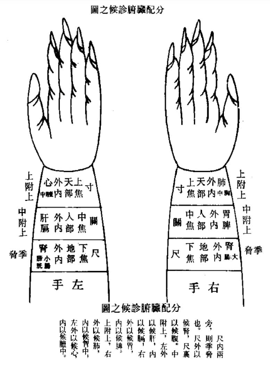
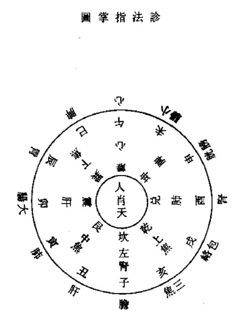
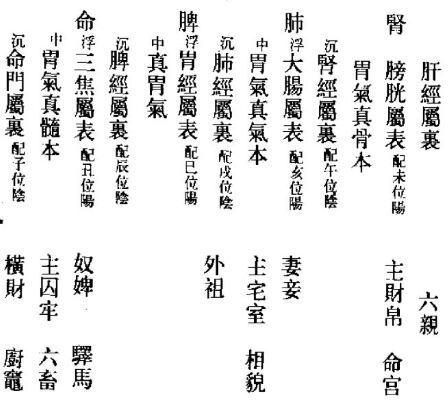
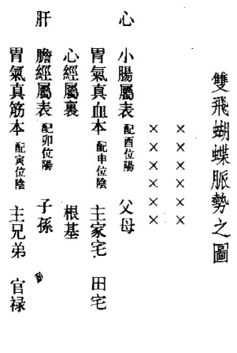
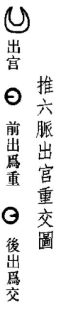
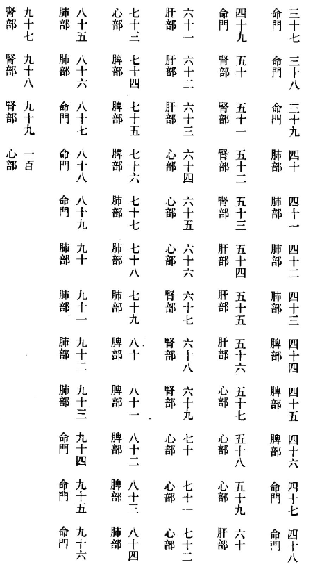
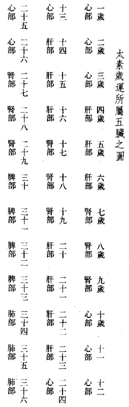

## 卷八十三  

脉法  

### 医学入门 三 【`明 李梴`】  

#### 妇人脉法  

经病前后，脉软如常。寸关虽调，尺绝痛肠。沉缓下弱，来多要防。微虚不利，间月何妨？浮沉一止，或微迟濇。居经三月，气血不刚。三月以上，经闭难当。心脾病发，关伏寸浮。心事不足，左寸沉结。少阳卑沉，少阴脉细。经前病水，水分易瘳。寸脉沉数，趺阳微弦。少阴沉滑，血分可愁。寸浮而弱，潮烦汗出。寸洪数虚，火动劳疾。趺阳浮濇，吞酸气窒。腹痛腹满，脉浮且紧。少阴见之，疝瘕内隐。带下崩中，脉多浮动。虚迟者生，实数者重。少阴滑数，气淋阴疮。弦则阴痛，或挺出肠。  

【`注 妇人脉比男子更濡弱者，常也。脉如常，虽月经或前或后，或多或少，或一月未来者，亦不成经病。惟寸关如常，尺绝不至，或至亦弱小者，小腹肠胃有积痛上抢心，月水不利。若沉而缓者，下虚，月经来多，反虚微不利不汗出者，其经二月必来，俗云间月。若三部浮沉一止，寸关微濇，微则胃气虚，濇则精血不足；尺微而迟，微则无精，迟则阴中寒。此为居经，三月一来。虽来或血渐少而后不通，会堕胎及产多者，谓之血枯。经曰：二阳之病发心脾，有不得隐曲，女子不月。原因心事不足，以致脾不磨食，故肺金失养而气滞不行，肾水不旺而血益日枯。初时参前参后，淋沥无时，脾胃衰甚，变为溏泄身肿；失治，甚为症瘕痨瘵。少阳脉卑，少阴脉细。经水不利，血化为水。瘀血闭塞胞门，名曰水分。先病水而后经断，故病易治。寸脉沉而数，数为阳实，沉为阴结。趺阳脉微而弦，微则无胃气，弦则不得息。少阴脉沉而滑，沉为在里，滑则为实；沉滑相搏，血结胞门，经络不通，名曰血分。先断经而后病水，故病难治。寸浮而弱，浮为气虚，弱为血分有热，故潮热自汗。男子尺脉虚数而寸沉微者为劳；女人寸脉虚数而尺沉微者为劳。劳者汗出潮咳，与男阴虚火动一般。趺阳脉浮而濇，浮则气滞，濇则有寒，令人腹满，吞酸，喜噫，其气时下，则腹中冷痛。浮则肠鸣腹满，紧则腹痛。少阴脉见浮紧，则为疝瘕腹痛。少阴脉浮而动，浮则为虚，动则为痛，或崩带，或阴户脱下。少阴滑数，或为气淋，或阴中生疮痛痒。少阴脉弦，则阴户掣痛，白肠挺出。`】  

妊孕初时，寸微五至。三部平匀，久按不替。妊孕三月，阴搏于阳。气衰血旺，脉正相当。肝横肺弱，心滑而洪。尺滑带散，久按益强。或关滑大，代止尤忙。渴且脉迟，其胎必伤。四月辨质，右女左男。或浮或沉，疾大实兼。左右俱盛，胎有二三。更审经脉，阴阳可参。但疾不散，五月怀躭。太急太缓，肿漏为殃。六七月来，脉喜实长。沉迟而濇，堕胎当防。脉弦寒热，当暖子房。八月弦实，沉细非良。少阴微紧，两胎一伤。劳力惊仆，胎血难藏。冲心闷痛，色青必亡。足月脉乱，反是吉祥。  

【`注 妊孕初时脉平而虚，寸脉微小，呼吸五至，浮沉正等，按之不绝，无他病而不月者，孕也，必三月后尺数。但寸关调而尺脉绝者，经病也。《素问》曰：阴搏阳别，谓之有子。言尺寸少阴动甚，别有阳脉搏手，心主血脉，肾为胞门故也。然血为阴，气为阳，血旺气衰，亦阴搏阳别之义。故诀云：肝为血兮肺为气，血为荣兮气为卫。阴阳配偶不参差，两脏通和皆例类。血衰气旺定无娠，血旺气衰应有体。寸微关滑尺带数，流利往来并雀啄。小儿之脉已见形，数月怀躭犹未觉。又云：两手关滑大相应，有形亦在通前语。叔和既以左肝右肺分气血衰旺，又以寸尺分气血。寸微为气衰，尺数为血旺，关滑者滑为血多气少也。然尺脉滑疾，带散带代，如雀啄稍停者，乃胎气盛闭塞故也。此时若作渴脉迟，欲为水肿，复腹痛者必堕。或疑与《脉诀》尺滑有间断为经病者不相反耶？盖经病尺滑必带缓弱迟濇，胎脉尺滑带数而实。两关左滑大为男，右滑大为女。又云关上一动一止者，一月；二动一止者二月；三四动一止者，三四月也。盖中冲应足阳明胃，主三四月；少冲应手太阳小肠，主五六月；太冲应手阳明大肠，主七八月。凡妊孕四月，形质已具。左手滑疾，实大为男；右手滑疾，实大为女；左右俱滑疾实大者双胎。又诸阳脉为男，诸阴脉为女。诀云：左手太阳浮大男，右手太阴沉细女。《脉经》云，左手浮大为男，右手浮大为女。左手沉实为男，右手沉细为女。尺脉左偏大为男，右偏大为女。左右俱浮大有力者二男，左右俱沉细有力者二女。诸阳为浮，诸阴为沉。凡浮大滑数诸阳脉皆为男也，凡沉细诸阴脉皆为女也。又诸阳脉在诸阳经为男，诸阴脉在诸阴经为女。若阴阳混浊则女作男生，男作女生。诀云：左手带纵两个儿，右手带横一双女。左手脉逆生三男，右手脉顺还三女。寸关尺部皆相应，一男一女分形证。盖左手带纵者，如心沉肝浮肾缓，皆夫乘妻脉，上下直看，往来流利不绝，气血之盛，故生两男。右手带横者，如肺弦脾沉肾细，皆妻乘夫脉，推之横看满指无间，气血之盛，故生两女。左手脉逆者，如心弦肝滑肾微浮，皆子乘母脉，自下溢上，往来流利，气血盛极，故生三男。右手脉顺者，如肺缓脾洪肾弦长滑，皆母乘子脉，自上流下，往来疾速，气血盛极，故生三女。认真纵即左手太阳浮大，男；横即右手太阴沉细，女。逆即左手沉实男，顺即右手沉细女。五月脉虽喜疾而不散，但大急为紧为数者必漏胎。大缓为迟者必腹胀而喘，为浮者必患水肿。六七月脉实大牢弦强紧者生，沉细而濇者当防堕胎。若丹田气暖胎动者可救，胎冷若冰者难治。脉弦发热恶寒，其胎逾腹，腹痛小腹如扇，子脏闭也，宜热药温之。少阴脉微紧，血养不周，双胎一死一存。胎动或因倒仆，或因惊恐，或因劳力，或因食热，或因房室，轻则漏血，重则血下如同月水，血干胎死。而气无血制，上冲心而腹闷痛，面目唇舌色见青者，子母俱死。此不独七八月然也，十个月内皆宜慎之。七八月脉实大弦强者生，沉细者死。足月身热脉乱者吉。`】  

临产六至，脉号离经。或沉细滑，若无即生。浮大难产，寒热又频。此是凶候，急于色征。面颊唇舌，忌黑与青。面赤母活，子命必倾。若胎在腹，子母归冥。  

【`注 一呼六至，或一呼一至，曰离经。经，常也。人呼吸一日一夜一万三千五百息，脉行八百十丈，周而复始，从初起之经再起。今因胎堕，胃脉已离常络之处，不从所起之经再起，故曰离经。脉沉细而滑，乃肾脏本脉已形。或脉沉如无者，即产。浮大者难产。若身重体热，寒热频作，此凶证也，急看面舌气色，逐胎救母。盖面乃心之华，舌乃心之苗。青则肝虚不能藏血，破浆早而胎胞干濇，不能转动；黑则肾水克火，是以子母俱死。惟面赤舌青者，乃心血流通，母活子死。若胎死不出，母命亦危。`】  

产后缓滑，沉细亦宜。实大弦牢，濇疾皆危。  
【`注 产后以胃气为主，缓滑者脾胃和也。实大弦牢，木克土也。沉细亦宜者，产后大虚，脉合证也。濇疾不调者，损血多而心绝也。`】  

#### 成童脉法  

童丱脉全，浮沉为先。浮表沉里，便知其源。大小滑濇，虚实迟快。各依大人，以审证治。  
【`注 一岁至六岁曰婴孩，察三关脉。七岁八岁曰龀，九岁十岁曰髫，始可一指探三部脉。而以一息七八至为无病。十一至十四岁为童丱，以一息五六至为常。浮数乳癎惊悸，虚濡慢惊瘛瘲。紧实者风癎，沉弦者食积。伏结者伤食，软细者虫疳。浮沉迟数，与大人一同，仍忌促结代散。`】  

#### 痈疽脉法  

痈疽脉数，浮阳沉阴。浮数不热，但恶寒侵。若知痛处，急灸或针。洪数病进，将有脓淫。滑实紧促，内消可禁。宜托里者，脉虚濡迟。或芤濇微，溃后亦宜。长缓易治，短散则危。结促代见，必死无疑。  

【`注 脉浮数带弦，当发热而反恶寒，或胸烦不知痛处，或知痛处，皆发痈疮，急宜灸或针。浮数发热而痛者，属阳易治；不数沉微不痛者，属阴难治。又浮为在表，沉为在里，不浮不沉则为在经。诸疮洪数者，里亦有脓结也。未溃脉滑实数促者，可以下之。将溃已溃，脉虚濡弱迟濇芤微者，宜补益托里。长缓易治者胃气胜也，短散结代者元气虚也。大抵未溃宜见诸阳脉，已溃宜见诸阴脉，庶病脉相宜。抑论紧则气血滞濇，故紧则多痛；芤主亡血，溃后得之则吉。促脉未溃为热蓄里，已溃则气衰也。`】  

#### 死脉总诀  

万机四脉既包含，生死何尝另有元。浮散沉无迟一点，数来无数病难痊。  
【`注 解索、鱼翔、釜沸，浮散也。虾游，沉无也。屋漏，迟一点也。雀啄、弹石，数来无数也。`】  

雀啄连来三五啄，  

【`注 雀啄脉在筋肉间，如雀之啄食，连连凑指，忽然顿絶，良久复来。`】  

屋漏半日一滴落。  

【`注 屋漏脉在筋肉间，如残溜之下，良久一滴，溅起无力。雀啄屋漏，皆脾胃衰绝之脉，心肺绝也。`】  

弹石硬来寻即散，  

【`注 弹石脉在筋肉间，举按劈劈然，肺绝也。`】  

搭指散乱真解索。  

【`注 解索脉如解乱绳之状，指下散散无复次第，五脏绝也。`】  

鱼翔似有又似无，  

【`注 鱼翔脉在皮肤，其本不动而末强摇，如鱼在水中，身首帖然，而尾独悠扬之状，肾绝也。`】  

鰕游静中跳一跃。  

【`注 鰕游脉在皮肤，始则冉冉不动，少焉瞥然而去，久之倏尔复来，脾胃绝也。`】  

更有釜沸涌如羹，旦占夕死不须药。  
【`注 釜沸脉在皮肉，有出无入，涌涌如羹上之肥，皆死脉也。若用药饵克伐立亡。暴见者急宜参、芪、归、附救之，多有复生。此数种脉，亦可总看得之。`】  

一般鬼贼脉堪推，客胜主脱死尤促。春得秋脉肺克肝，死在庚辛申酉里。夏得冬脉亦如然，还于壬癸为期耳。严冬诊得四季脉，戊己辰戌还是厄。秋得夏脉亦同前，为缘丙丁相刑克。季月夏季得春脉，克在甲乙病应极。  
【`注 脏气喜所生而畏所克，如肝得肺脉，死于秋，庚日笃，辛日死，时则申酉也；心得肾脉，死于冬，壬日笃，癸日死，时则亥子也；肾得脾脉，死于四季，戊日笃，己日死，时则辰戌丑未也；肺得心脉，死于夏，丙日笃，丁日死，时则巳午也；脾得肝脉，死于春，甲日笃，乙日死，时则寅卯也。`】  

春得冬脉只是虚，急宜补肾忌泄疏。若得夏脉缘心实，还应泻子自无虞。夏秋冬脉皆如是，在前为实后为虚。春中若得四季脉，不治多应病自除。  
【`注 诀云：得妻不同一治，生死仍须各推。假令春得肺脉为鬼，得心脉乃是肝儿。肾为其母，脾则为妻。春得脾而莫疗，冬见心而不治。夏得肺而难瘥，秋得肝亦何疑？此四时休旺之理，五行生克之义。但既以春得四季脉为不治自愈，又云春得脾而莫疗，何耶？盖春脉肝弦带缓者，为微邪无病。若肝弦全无，独见缓脉者，则土盛生金，反来克木，故曰得妻不同一治。夏秋冬脉仿此。`】  

六脉若失更无凭，可诊三脉于其足。太冲太溪冲阳穴，有无生死决之速。  
【`注 太冲穴肝脉，在两足大指行间上二寸动脉中。太溪穴，命门脉，在足内踝后跟骨上动脉陷中。凡病必诊太冲、太溪，应手动者生，止而不动者死。若伤寒必诊冲阳穴，在足跗内庭上五寸骨间动脉，乃足阳明胃经，动则为有胃气，止则为无胃气。是三脉虽不比手之六脉可通十二经，然手脉既失，亦可诊以断决死生。古人设此者，正欲冀其万一耳。`】  

#### 形色脉相应总诀  

形健脉病人不久，形病脉健亦将危。  
【`注 假如健人诊得浮紧而濇，似伤寒太阳经病脉，其人虽未头痛发热恶寒，此则不久即病，病即死也，谓之行尸。又如十五动一止，一年殂。其人虽未病，期应一年病即死也。病人脉健者，假如形容羸瘦，精神枯槁，盗汗不食，滑泄不止者，劳损之证，而脉反见洪健者亦死。`】  

色脉相生病自已，色脉相胜不须医。  
【`注经言见其色而不得其脉，反得相胜之脉者即死，得相生之脉者病即自已。盖四时之色以从前来者为实邪，从后来者为虚邪。例看：假令色红，心病热痰火颠狂斑疹等证，其脉当浮大而散；色青，肝病胁痛干呕便血等证，其脉当弦而急；色黄，脾病湿热肿胀伤食呕泄关格等证，其脉当中缓而大；色白，肺病气喘痰饮痿悴咳嗽等证，其脉当浮濇而短；色黑肾病腰脚疝瘕淋浊漏精等证，其脉当沉濡而滑。其间多动则为虚为火，静则为寒为实，皆当与脉证相应。又五积六聚，尤宜察色与脉相应。故言赤脉白脉，合色脉而言之也。又五色应五脏，间有绿色，乃任督阴阳之会也。`】  

肥人沉结瘦长浮，矮促长疏尽莫违。  
【`注 肥人肉厚，脉宜沉结；瘦人肉薄，脉宜浮长。人形矮则脉宜短促，人形长则脉宜疏长。相违相反而又不和者皆死。非但形体相应，虽皮肤滑濇宽紧，亦宜与脉相应。经言：脉数，尺之皮肤亦数；脉急，尺之皮肤亦急；脉缓，尺之皮肤亦缓；脉濇，尺之皮肤亦濇；脉滑，尺之皮肤亦滑是也。`】  

### 医宗必读 【`明 李中梓`】  

#### 新着四言脉诀  

四言脉诀，从来久矣。兹者补其缺略，正其差讹。仍旧者十之二三，新改者十之七八。复加注释，字字精确，文极简便，义极详明，使读者既无繁多之苦，亦无遗漏之憾也。  
脉为血脉，百骸贯通。大会之地，寸口朝宗。  
【`注 脉者，血脉也，血脉之中气道行焉。五脏六腑以及奇经，各有经脉气血流行，周而复始，循环无端，百骸之间，莫不贯通，而总会之处则在寸口。夫寸口左右手六部，皆肺之经脉也。何以各经之脉皆于此取乎？肺如华盖，居于至高，而诸脏腑皆处其下，各经之气无不上熏于肺，故曰肺朝百脉，而寸口为脉之大会也。`】  

诊人之脉，令仰其掌。掌后高骨，是名关上。  
【`注 凡诊脉令病人仰手，医者覆手诊之。掌后有高骨隆起，是即关部也。先将中指取定关部，方下前后二指于尺寸之上也。病人长则下指宜疏，病人短则下指宜密。`】  

关前为阳，关后为阴，阳寸阴尺，先后推寻。  
【`注 从鱼际至高骨，却有一寸，因名曰寸。从尺泽至高骨，有一尺，因名曰尺。界乎尺寸之间，因名曰关。关前寸为阳，关后尺为阴。寸候上焦，关侯中焦，尺候下焦。经曰：身半以上，同天之阳；身半以下，同地之阴也。先后者谓先候寸部，次候关部，又次候尺部也。推者，推其理。寻者，寻其象。各察其得何脉也。`】  

胞络与心，左寸之应。惟胆与肝，左关所认。膀胱及肾，左尺为定。胷中及肺，右寸昭彰。胃与脾脉，属在右关。大肠并肾，右尺班班。  
【`注 此遵《内经》脉法分配脏腑于两手也。《内经》诊法及胞络配心，胸中配肺，大肠列于右尺，小肠附于膀胱，三焦不应列于右尺，详见《脉法心参》。夫胞络与心脉皆在左手寸上，胆脉与肝脉皆在左手关上，膀胱及肾脉皆在左手尺上，胸中与肺脉皆在右手寸上，胃脉与脾脉皆在右手关上，大肠与肾脉皆在右手尺上。`】  

男子之脉，左大为顺。女人之脉，右大为顺。男尺恒虚，女尺恒盛。  
【`注 左为阳，故男子宜左脉大也。右为阴，故女人宜右脉大也。寸为阳，尺为阴。故男子尺虚，象离中虚也；女人尺盛，象坎中满也。`】  

关前一分，人命之主。左为人迎，右为气口。  
【`注 关前一分者，寸关尺各有三分，共得九分。今曰关前一分，仍在关上，但在前之一分耳。故左为人迎，辨外因之风，以左关乃肝胆脉，肝为风脏，故曰人迎紧盛伤于风。右为气口，辨内因之食，以右关乃脾胃脉，胃为水谷之海，脾为仓廪之官，故曰气口紧盛伤于食。勿以外因兼求六气，勿以内因兼求七情也。或以前一分为寸上，岂有左寸之心可以辨风，右寸之肺可以辨食乎？`】  

神门属肾，两在关后。人无二脉，必死不救。  
【`注 《难经》曰：上部无脉，下部有脉，虽困无能为害。夫脉之有尺，犹树之有根，枝叶虽枯槁，根本将自生。盖两尺属肾水，水为天一之元，人之元神在焉，故为根本之脉而称神门也。若无此二脉，则根本败绝，决无生理。`】  

脉有七诊，曰浮中沉。上下左右，七法推寻。  
【`注 浮者轻下指于皮毛之间，探其腑脉也，表也；中者略重指于肌肉之间，候其胃气也，半表半里也；沉者重下指于筋骨之间，察其脏脉也，里也。上者即上竟上者，胸喉中事也，即于寸内前一分取之；下者即下竟下者，少腹腰股膝胫足中事也，即于尺内后一分取之。左右者，即左右手也。凡此七法，名为七诊。别有七诊，谓独大独小、独寒独热、独迟独疾、独陷下也。`】  

又有九候，即浮中沉。三部各三，合而为名。每候五十，方合于经。  
【`注 每部有浮中沉三候，合寸关尺三部算之，共得九候之数也。夫每候必五十动者，出自《难经》，合大衍之数也。乃《伪诀》以四十五动为准，乖于经旨。必每候五十，凡九候，共得四百五十。两手合计九百，方与经旨相合也。`】  

五脏不同，各有本脉。左寸之心，浮大而散。右寸之肺，浮濇而短。肝在左关，沉而弦长。肾在左尺，沉石而濡。右关属脾，脉象和缓。右尺相火，与心同断。  
【`注 凡五脏各有平脉也，必知平脉而后知病脉也。`】  

若夫时令，亦有平脉。春弦夏洪，秋毛冬石。四季之末，和缓不忒。  
【`注 凡四时各有平脉也，然即上文五脏之脉，大同小异也。春者，东方肝木也。木始发荣，有干无枝，则近于劲，故曰弦。即弓弦也。夏者，南方心火也。万物畅茂，垂枝布叶，皆下曲如钩，钩即洪之别名，亦即上文之大也。秋者，西方肺金也。草木黄落，有枝无叶，则类于毛，即上文之浮濇也。冬者，北方肾水也。极寒之时，水凝如石，故名为石。土旺于四季之末，各十八日，脾土在中而兼五行也。和缓之义，详见下文。`】  

太过实强，病生于外。不及虚微，病生于内。  
【`注 外因风寒暑湿燥火六气之邪，脉必洪大、紧数、弦长、滑实而太过矣。内因喜怒忧思悲恐惊七情之伤，脉必虚微、细弱、短濇、濡芤而不及矣。`】  

四时百病，胃气为本。  

【`注 胃为水谷之海，资生之本，故曰有胃气则生，无胃气则死。胃气脉者，缓而和匀，不浮不沉，不大不小，不疾不徐，意思欣欣，悠悠扬扬，难以名状者也。不拘四季，一切百病，皆以胃脉为本。`】  

凡诊病脉，平旦为准。虚静凝神，调息细审。  
【`注经曰：常以平旦阴气未动，阳气未散，饮食未进，经脉未盛，络脉调匀，气血未乱，乃可诊有过之脉。又曰：诊脉有道，虚静为宝。言无思无虑以虚静其心，惟凝神于指下也。调息者，医家调匀自己之气息。细审者，言精细审察不可忽略也。`】  

一呼一吸，合为一息。脉来四至，平和之则。五至无疴，闰以太息。三至为迟，迟则为冷。六至为数，数即热证。转迟转冷，转数转热。  
【`注 医者，调匀气息，一呼脉再至，一吸脉再至，呼吸定息，脉来四至，乃和平之准则也。何以五至亦曰无疴乎？人之气息，时长时短，凡鼓三息，必有一息之长，鼓五息又有一息之长，名为太息。如历家三岁一闰，五岁再闰也。言脉必以四至为平，五至便为太过，惟正当太息之时，亦曰无疴。此息之长，非脉之急也。若非太息，正合四至也。至于性急之人，五至为平脉，不拘太息之例，盖性急脉亦急也。若一息而脉仅三至，即为迟慢而不及矣。迟主冷病。若一息而脉遂六至，即为急数而太过矣。数主热病。若一息仅得二至，甚而一至，则转迟而转冷矣。若一息七至，甚而八至九至，则转数而转热矣。一至二至，八至九至，皆死脉也。`】  

迟数即明，浮沉须别。浮沉迟数，辨内外因。外内于天，内因于人。天有阴阳，风雨晦明。人喜怒忧，思悲恐惊。  
【`注 浮脉法天，候表之疾，即外因也。沉脉法地，候里之病，即内因也。外因者，天之六气，风寒暑湿燥火是也。内因者，人之七情，喜伤心、怒伤肝、忧思伤脾、恐伤肾、惊伤心也。`】  

浮表沉里，迟寒数热。浮数表热，沉数里热。浮迟表寒，沉迟冷结。  
【`注 此以浮、沉、迟、数四脉提诸脉之纲也。脉象虽多，总不外此四脉。浮主表证，沉主里证。迟为寒，数为热。浮而且数，表有热也；沉而且数，里有热也。浮而且迟，寒在表也；沉而且迟，寒在里也。`】  

浮脉法天，轻手可得。泛泛在上，如水漂木。有力洪大，来盛去悠。无力虚大，迟而且柔。虚极则散，涣漫不收。有边无中，其名曰芤。浮小为濡，绵浮水面。濡甚则微，不任寻按。更有革脉，芤弦合看。  
【`注 此以浮脉提纲，而取洪、虚、散、芤、濡、微、革七脉之兼浮者统汇于下也。浮脉法天，轻清在上，故轻手即见，与肉分相应，如木之漂于水面也。洪脉者，如洪水之洪，有波涛汹涌之象。浮而有力，来盛去衰，即大脉也，即钩脉也。虚脉者浮而无力，且大且迟也。散脉者亦浮而无力，但按之如无，比于虚脉，则更甚矣，若杨花飘散之象。芤脉者，芤草中空，状如葱管。浮沉二候易见，故曰有边，独中候豁然难见，正如以指着葱，浮取得上面之葱皮，中取正在空处，沉按之又着下面之葱皮也。无中者非中候绝无，但比之浮沉，则无力也。若泥为绝无，是无胃气矣。旧说以前后为两边，与芤葱之义不合。濡脉者，浮而小且软也。微者浮而极小极软，比于濡脉则更甚矣。欲绝非绝，似有若无，八字可为微脉传神。革脉者，浮而且弦且芤，浮多沉少，外急内虚，状如皮革。仲景云：弦则为寒，芤则为虚，虚寒相搏，此名曰革。夫革脉牢脉皆大而弦，革则浮取而得，牢则沉候而见也。旧以牢革为一脉者非。`】  

沉脉法地，如水投石。沉极为伏，推筋着骨。有力为牢，大而弦长。牢甚则实，愊愊而强。无力为弱，柔小如绵。细直而软，如蛛丝然。  
【`注 此以沉脉提纲，而取伏、牢、实、弱、细五脉之兼沉者统汇于下也。沉脉法地，重浊在下，故重按乃得与筋骨相应，如石之坠于水底也。伏脉者，沉之极也，伏于下也。沉脉在筋骨之间，伏脉则推筋着骨，然后可见也。牢脉者沉而有力、且大、且弦、且长也。实脉者，浮中沉三候皆有力，更甚于牢脉也。弱脉者沉而极细软也。细脉者，沉细而直且软也。`】  

迟脉属阴，一息三至。缓脉和匀，春柳相似。迟细为濇，往来极滞。结则来缓，止而复来。代亦来缓，止数不乖。  
【`注 此以迟脉提纲，而取缓、濇、结、代四脉之兼迟者统汇于下。迟脉者往来迟慢，为不及之象。缓脉者一息四至，往来和匀，春风微吹柳梢，此确喻也，即胃气脉也。濇脉者，迟滞不利，状如轻刀刮竹，旧称一止复来者非也。结脉者，迟而时有一止也。代脉者，迟而中止，不能自还，且止有定数，如四时之有禅代，不愆其期也，故名曰代。`】  

数脉属阳，一息六至。往来流利，滑脉可识。有力为紧，切绳极似。数时一止，其名为促。数如豆粒，动脉无惑。  
【`注 此以数脉提纲，而取滑、紧、促、动四脉之兼数者统汇于下也。数脉者，往来急数，为太过之象。滑脉者滑而不滞，如珠走盘也。紧脉者，紧急有力，左右弹手，如绳者喻其紧，亦喻左右弹也。促脉者，数而时有一止，如疾行而蹶也。动脉者，形如豆粒，厥厥动摇，两头俱俯，中间高起，故短如豆粒。旧云上下无头尾，则上不至寸为阳绝，下不至尺为阴绝，是死绝之脉，非动脉也。仲景云：阳动则汗出，阴动则发热，由是则寸尺皆有动脉，谓独见于关者误矣。`】  

别有三脉，短长与弦。不及本位，短脉可原。过于本位，长脉绵绵。长而端直，状类弓弦。  
【`注 此短长与弦三脉，非浮沉迟数可括，故别列于此。短者短缩之象，长者相引之象，弦者劲而端直之象。按：戴同父曰：关不诊短。若短脉见于关上，是上不通寸为阳绝，下不通尺为阴绝矣。`】  

一脉一形，各有主病。脉有相兼，还须细订。  
【`注 前所载皆脉之形象，然有所主之病，有相兼之脉，更须细加考订。此以下至女胎三月句，凡十有三节，各明某脉主某病，而相兼之脉尽在其中矣。`】  

浮脉主表，腑病所居。有力为风，无力血虚。浮迟表冷，浮数风热。浮紧风寒，浮缓风湿。  
【`注 六腑属阳，其应在表，故浮主腑病也。浮而有力，则知风邪所干，邪气盛则实，有余之象。浮而无力，则知阴血亏损，正气夺则虚，不足之象也。脉浮主表，脉迟主冷，浮迟兼见，则为表冷也。浮脉主风，数脉主热，浮数兼见，则为风热也。紧脉为寒，浮紧兼见，则为风寒也。缓脉主湿，浮缓兼见，则为风湿也。`】  

浮虚伤暑，浮芤失血。浮洪虚火，浮微劳极。浮濡阴虚，浮散虚剧。浮弦痰饮，浮滑痰热。  
【`注 暑伤气，气虚则脉虚，故浮虚为伤暑也。失血之脉必芤，如吐血下血之类。芤脉自兼浮，非浮脉兼芤也。洪主火，洪而兼浮，知为虚火。微为气血俱虚，故主劳极，此亦微脉自有浮也。血属阴，应在下，濡脉按之而软，故为阴虚。散者散亡之义，虚极所致。剧即极也。弦者风木之象，浮亦为风，故为痰饮，乃风痰也。滑主痰证，滑本阳脉而又兼浮，则炎上之象，故为热痰也。`】  

沉脉主里，为寒为积；有力痰食，无力气郁。沉迟虚寒，沉数热伏。沉紧冷痛，沉缓水蓄。  
【`注 五脏属阴，其应在里，故沉主里病也。沉者阴象也，积者脏病也，故为寒积。沉而有力，有余之象，必有形之物凝滞于内。沉而无力，不足之象，乃无形之气郁结于中。沉迟皆偏于阴，所以虚寒。沉里数热，故热伏于里也。紧主诸痛，亦主于寒，得之沉分，非冷痛乎？湿家得缓，沉位居里，当水蓄矣。`】  

沉牢痼冷，沉实热极。沉弱阴亏，沉细虚湿。沉弦饮痛，沉滑食滞。沉伏吐利，阴毒积聚。  
【`注 仲景曰：寒则坚牢，有牢固之义，故云痼冷。牢脉在沉分，非兼见也。实脉为阳热之极也，实则三候皆强，不独在沉分也。按之无力为弱脉，故曰阴亏。细为不足，亦主湿侵，故曰虚湿。弦本主饮，亦主诸痛。滑虽主痰，若在脾部而沉分见之，为食滞也。寸伏则吐，尺伏则利。在阴证伤寒，则为阴毒积聚耳。`】  

迟脉主脏，阴冷相干。有力为痛，无力虚寒。  
【`注 五脏为阴，迟亦为阴，是以主脏，乃阴冷相干也。迟而有力，则因寒而凝滞，是以为痛。迟而无力，中空显然，故当虚寒。`】  

数脉主腑，主吐主狂。有力实热，无力虚疮。  
【`注 六腑为阳，数亦为阳，是以主腑吐者，阳气亢逆也。狂者热邪传里也。数而有力，实热可知。数而无力，虚疮可断。`】  

滑司痰饮，右关主食。尺为蓄血，寸必吐逆。  
【`注 滑为痰脉，右关沉滑，知有食停。两尺见之，蓄血可察。两寸见之，吐逆难免矣。`】  

濇脉少血，亦主寒湿。反胃结肠，自汗可测。  
【`注 尺中见濇，血少精伤也。关中见之，脾虚不能胜湿也。血液枯竭，上为反胃，下为结肠也。两寸见濇则为自汗，盖汗乃心之液而肺主皮毛也。`】  

弦脉主饮，木侮脾经。阳弦头痛，阴弦腹疼。  
【`注 木旺者脉必弦，木旺必来侮土，土虚不能制湿，而痰饮之证生焉。阳弦者寸也，寸主上焦，故当头痛。阴弦者尺也，尺主下焦，故当腹疼。`】  

长则气治，短则气病。细则气衰，大则病进。  
【`注 长乃肝之平脉，故曰气治。经曰：如循长竿末梢为平，如循长竿为病。短虽肺之平脉，若非右寸及秋令见之，即为病矣。脉以和平为贵，细者不及而气衰，大者太过而病进也。`】  

浮长风癎，沉短痞塞。洪为阴伤，紧主寒痛。缓大风虚，缓细湿痹。缓濇血伤，缓滑湿痰。  
【`注 浮风长火，风火相搏，则肝病而癎生。沉阴短虚，虚寒相合，则气滞而痞生。洪即大脉，火之亢也，阳亢者阴必伤。紧为寒脉，浮分则表为寒束而痛，沉分则里为寒滞而痛。缓为虚而大为风，缓大并至，故曰风虚。缓者湿气停滞，细者虚气不行而痹生焉。濇见即为血伤，挟缓则转伤也。滑见即为湿痰，挟缓则愈湿矣。`】  

濇小阴虚，弱小阳竭。阳微恶寒，阴微发热。阳动汗出，为痛为惊。阴动则热，崩中失血。虚寒相搏，其名为革。男子失精，女人漏血。  
【`注 濇自主血虚，兼小而愈虚矣。弱脉自然小，此非兼脉，但弱脉见，则阳气虚竭矣。微者大虚之脉，故在阳分见则气虚而恶寒，在阴分见则血虚而发热。寸动名阳，汗出者心肺之证，惊气入心，气滞则痛，亦心肺也。尺动名阴，热者肾水不足，崩中失血，皆肾经失闭蛰封藏之本也。仲景论革脉云：弦则为寒，芤则为虚，虚寒相搏，此名曰革，男子亡血失精，女人半产漏下。`】  

阳盛则促，肺痈热毒。阴盛即结，疝瘕积郁。代则气衰，或泄脓血。伤寒霍乱，跌打闷绝。疮疽痛甚，女胎三月。  
【`注 数而有止为促，岂非阳盛乎？肺痈热毒，皆火极所致者。迟而有止为结，岂非阴盛乎？疝瘕积郁，皆阴气凝滞也。至于代脉，真气衰败而后见也，泄脓血者，见之必死。惟伤寒心悸，或霍乱昏烦，或跌打损伤，或疮疽痛极，或怀三月胎，此五者见之，弗作死脉也。`】  

脉之主病，有宜不宜。阴阳顺逆，吉凶可推。  
【`注 病有阴阳，脉亦有阴阳，顺应则吉，逆见即凶。此以下至其死可测句，凡二十七节，详分某病见某脉吉，某病见某脉凶也。`】  

中风之脉，却喜浮迟。坚大急疾，其凶可知。  
【`注 中风多虚脉，以浮迟为顺。若反坚急，决无生理。`】  

伤寒热病，脉喜浮洪。沉微濇小，证反必凶。汗后脉静，身凉则安。汗后脉躁，热甚必难。阳证见阴，命必危殆。阴证见阳，虽困无害。  
【`注 此节言伤寒之顺逆也。虽受寒邪，传里必热，故曰热病。病既属热，脉以浮洪为吉，若沉微濇小，是证与脉反，故凶。汗后邪解，便当脉静身凉，若躁而热，所谓汗后不为汗衰，不可治矣。阳证而见沉、濇、细、弱、微、迟之阴脉，则脉与证反，命必危殆。阴证而见浮、大、数、动、洪、滑之阳脉，虽若与证反，在他证忌之，独伤寒为邪气将解之象，故虽危困无害也。`】  

劳倦内伤，脾脉虚弱。汗出脉躁，死证可察。  
【`注 劳倦伤脾，故脾脉虚弱为顺也。若汗出而脉反躁，疾则逆矣，安得不死？`】  

疟脉自弦，弦数者热。弦迟者寒，代散则绝。  
【`注 疟者风暑之邪，客于风木之腑。木来乘土，脾失转输，不能运水谷之精微，遂多停痰留饮。弦应风木，又主痰饮，无痰不成疟，故曰疟脉自弦。数热迟寒，自然之理，独见代散二脉，则命必绝矣。`】  

泄泻下痢，沉小滑弱。实大浮数，发热则恶。  
【`注 泻痢则虚，宜见沉小滑弱之虚脉。若反见实大浮数之脉，则身必发热而成恶候矣。`】  

呕吐反胃，浮滑者昌。弦数紧濇，结肠者亡。  
【`注 呕吐反胃，脾虚有痰也。浮为虚，滑为痰，是其正象，可以受补，故曰昌也。若弦数紧濇，则血液枯竭，遂致粪如羊屎，必死不治矣。`】  

霍乱之候，脉代勿讶。厥逆迟微，是则可嗟。  
【`注 霍乱之脉，洪大为佳。若见代脉，因一时清浊混乱，故脉不接续，非死脉也。微细而舌卷囊缩者，不可治耳。`】  

嗽脉多浮，浮濡易治。沉伏而紧，死期将至。  
【`注 嗽乃肺疾，脉浮为宜，兼见濡者，病将退也。若沉伏与紧，则相反而病深矣，不死何待？`】  

喘息抬肩，浮滑是顺。沉濇肢寒，均为逆证。  
【`注 喘证无非风与痰耳，脉以浮滑为顺；若反沉濇而四肢寒者，必死不治。`】  

火热之证，洪数为宜。微弱无神，根本脱离。  
【`注 热证而得洪数，乃正应也；若见微弱，脉证相反，根本脱绝，药饵不可施矣。`】  

骨蒸发热，脉数为虚。热而濇小，必殒其躯。  
【`注 骨蒸者，肾水不足，壮火僭上，虚数二脉其正象也。若见濇小之脉，所谓发热脉静，不可救药耳。`】  

劳极诸虚，浮软微弱。土败双弦，火炎则数。  
【`注 虚证宜见虚脉，若两手脉弦，谓之双弦。弦乃肝脉，右关见之，是肝脉乘脾，故曰土败。火热太过，脉必极数，甚而七至。劳证之脉，六至以上，便不可治。`】  

失血诸证，脉必现芤。缓小可喜，数大堪忧。  
【`注 芤有中空之象，失血者宜尔也。缓小亦为虚脉，顺而可喜；若数且大，谓之邪胜，故可忧也。`】  

蓄血在中，牢大却宜。沉濇而微，速愈者希。  
【`注 蓄血者，有形实证，牢大之脉，脉证相宜；倘沉濇而微，是挟虚矣。既不能自行其血，又难施峻猛之剂，安望其速愈耶？`】  

三消之脉，数大者生。细微短濇，应手堪惊。  
【`注 渴而多饮，为上消；消谷善饥，为中消；渴而便数有膏，为下消。三消皆燥热太过，惟见数大之脉为吉耳。细微短濇，死不可救。`】  

小便淋闭，鼻色必黄。实大可疗，濇小知亡。  
【`注 鼻头色黄，必患小便难，六脉实大者，但用分理之剂必愈；若逢濇小，为精血败坏，死亡将及矣。`】  

癫乃重阴，狂乃重阳。浮洪吉象，沉急凶殃。  
【`注 癫狂二证，皆以浮洪为吉，取其病尚浅也；若沉而急，病已入骨，虽有扁仓，莫之能疗矣。`】  

癎宜虚缓，沉小急实。或但弦急，必死不失。  
【`注 癎本虚痰，脉见虚缓，自应然也；若沉小急实，或虚而弦急者，肝之真脏脉见矣，安望其更生耶？`】  

心腹之痛，其类有九。细迟速愈，浮大延久。  
【`注 九种心腹之痛，皆宜迟细，易于施疗。如浮而大，是为中虚，不能取捷得之效也。`】  

疝属肝病，脉必弦急。牢急者生，弱急者死。  
【`注 肝主筋，疝则筋急，故属肝病也。肝脉弦急，是其常也。疝系阴寒之咎，牢主里寒之脉，亦其常也。如且弱且急，必有性命之忧。`】  

黄疸湿热，洪数偏宜。不妨浮大，微濇难医。  
【`注 湿蒸热壅，黄疸生焉。洪数也，浮大也，皆所宜也。一见微濇，虚衰已甚，必食少泻多，无药可疗矣。`】  

胀满之脉，浮大洪实。细而沉微，岐黄无术。  
【`注 胀满属有余之证，宜见有余之脉，浮大洪实是也。沉细而微，谓之证实而脉虚，虽岐黄神圣，莫可回生矣。`】  

五脏为积，六腑为聚。实强可生，沉细难愈。  
【`注 积也聚也，皆实证也。实脉强盛，是所当然。沉细为虚之诊，真气败絶，不可为已。`】  

中恶腹胀，紧细乃生。浮大维何？邪气已深。  
【`注 中恶者，不正之气也。紧细主吉，浮大则凶也。`】  

鬼祟之脉，左右不齐。乍大乍小，乍数乍迟。  
【`注 鬼祟犯人，左右二手脉象不一，忽大忽小，忽数忽迟，无一定之脉形也。`】  

痈疽未溃，脉宜洪大。及其已溃，洪大始戒。  
【`注 未溃属实，洪大为正脉也。若溃后则虚矣，亦见洪大，毋乃不可乎？`】  

肺痈已成，寸数而实。肺痿之形，数而无力。肺痈色白，脉宜短濇。浮大相逢，气损血失。肠痈实热，滑数可必。沉细无根，其死可测。  
【`注 肺痈而寸口数实，知脓已成矣。肺叶焦痿，火乘金也，故数而无力，肺痈几作，则肺气虚损。白者西方本色，所谓一脏虚则一脏之本色见也。短濇者，秋金之素体。若逢浮大，是谓火来乘金，克我者为贼邪，血气败坏之诊也。肠痈实也，沉细虚也，证实脉虚，死期将至矣。`】  

妇人有子，阴搏阳别。少阴动甚，其胎已结。滑疾不散，胎必三月。但疾不散，五月可别。左疾为男，右疾为女。女腹如箕，男腹如斧。  
【`注 此一节女科胎前之脉也。阴搏阳别者，寸为阳，尺为阴，言尺阴之脉搏指而动，与寸阳之脉迥然分别，此有子之诊也。或手少阴心脉独动而甚，心脏主血，故胎结而动甚也。动者往来流利之动，非厥厥如豆之动也。疾即数也，滑而且数，按之不散，三月之胎也。滑脉不见而但疾不散，五月之胎也。左为阳，故左疾为男胎；右为阴，故右疾为女胎。女胎腹形状如箕之圆也，男胎腹形状如斧之上小而下大也。`】  

欲产之脉，散而离经。新产之脉，小缓为应。实大弦牢，其凶可明。  
【`注 此一节产中脉也。散而离经，离经者离乎经常之脉也。胎动于中，脉乱于外，势之必至也。产后气血两虚，见小缓之虚脉为吉；若见实大弦牢，凶可知矣。`】  

奇经八脉，不可不察。直上直下，尺寸俱牢。中央坚实，冲脉昭昭。胸中有寒，逆气里急。疝气攻心，支满溺失。  
【`注 奇经者，无表里配偶之经也。八脉者，阳维也，阴维也，阳蹺也，阴蹺也，冲也，督也，任也，带也。直上直下，弦长相似，尺寸俱牢，亦兼弦长，是以有逆气里急之证。疝气攻心，正逆急也。支满者，胀也。溺失者，冲脉之邪干肾也。此以下凡五节，皆奇经脉也。`】  

直上直下，尺寸俱浮。中央浮起，督脉可求。腰背强痛，风癎为忧。  
【`注 直上直下，则弦长矣。尺寸俱浮，中央亦浮，则六部皆浮，又兼弦长，故其见证皆属风家。大抵冲脉主里，督脉主表也。`】  

寸口丸丸，紧细实长。男疝女瘕，任脉可详。  
【`注 寸口者，统寸关尺三部也。丸丸，动貌。紧细实长，寒邪盛而实也。男疝女瘕，即所谓苦少腹繞脐下引阴中切痛也。`】  

寸左右弹，阳蹺可决。尺左右弹，阴蹺可别。关左右弹，带脉之诀。  
【`注 左右弹，紧脉之象也。阳蹺主阳络，故应于寸；阴蹺主阴络，故应于尺。带脉如束带之状，在人腰间，故应于关。`】  

尺外斜上，至寸阴维。尺内斜上，至寸阳维。  
【`注 从右手手少阳三焦，斜至寸上手厥阴心胞络之位，是阴维脉也。从左手足少阴肾经，斜至寸上手太阳小肠之位，是阳维脉也。斜上者，不由正位而上，斜向大指名为尺外，斜向小指名为尺内。邪在阳维、阳蹺则发癎，癎动而属阳；邪在阴维、阴蹺则发癫，癫静而属阴故也。`】  

脉有反关，动在臂后。别由列缺，不干证候。  
【`注 反关脉者，脉不行于寸口，由列缺络入臂后手阳明大肠之经也。其以不顺行于关上，故曰反关。有一手反关者，有两手反关者，此得于有生之初，非病脉也。令病入覆手诊之，方可见耳。`】  

经脉病脉，业已昭详。将绝之形，更当度量。  
【`注经常之脉，主病之脉，皆明于前，而死绝之脉，亦不可不察也。`】  

心绝之脉，如操带钩。转豆躁疾，一日可忧。  
【`注经曰：脉来前曲后居，如操带钩，曰心死。前曲者，谓轻取则坚强而不柔，后居者谓重取则牢实而不动，如持革带之钩，全失冲和之气，但钩无胃，故曰心死。转豆者，即经所谓如循薏苡子，累累然状其短实坚强，真脏脉也。又曰心绝一日死。`】  

肝绝之脉，循刀责责。新张弓弦，死在八日。  
【`注经曰：真肝脉至中外急，如循刀刃。又曰：脉来急溢，劲如新张弓弦，曰肝死。又曰肝绝八日死。`】  

脾绝雀啄，又同屋漏。一似水流，还如杯覆。  
【`注 旧诀曰：雀啄连来四五啄，屋漏少刻一点落。若水流，若杯覆，皆脾绝也。经曰：脾绝四日死。`】  

肺绝维何？如风吹毛。毛羽中肤，三日而号。  
【`注经曰：如风吹毛曰肺死，又曰真肺脉至，如以毛羽中人肤，皆状其但毛而无胃气也。又曰肺绝三日死。`】  

肾绝伊何？发如夺索。辟辟弹石，四日而作。  
【`注经曰：脉来如夺索，辟辟如弹石，曰肾死。又曰肾绝，四日死。旧诀云：弹石硬来寻即散，搭指  
乱如解索。正谓此也。`】  

命脉将绝，鱼翔虾游。至如涌泉，莫可挽留。  
【`注 旧诀云：鱼翔似有又似无，虾游静中忽一跃。经云：挥浑革至如涌泉，绵绵其去如弦绝，皆死脉也。`】  

## 卷八十四  

脉法  

### 医宗必读 二 【`明 李中梓`】  

#### 脉法心参  

前者四言脉诀，皆言脉象，然而脉有精理，更当深求。兹曰心参，盖予之得乎心而应乎手者，亦有得乎心而不能喻诸口者。若能于此研穷，期于了了明通，方不愧为司命耳。  
《脉诀》，高阳生托王叔和之名者也。自《伪诀》讹传，脉法久晦，虽辟之者代有其人，奈习之者恬不知改，予欲起而正之，固知微尘无足岳之能，滴露乏添江之力。然天下万世，岂无明眼？虽信予言，或不及信《伪诀》，而信《伪诀》，何如其信《内经》耶？今以《内经》脉法为图，因以数言正其疵误。但细心阅之。则凫颈蛇足，自当立辨。  
此《内经》之三部候法也。腑不及胆者，寄于肝也；不及大小肠、膀胱者，统于腹中也。至《伪诀》以大小肠配于寸上，以三焦列于左尺，以命门列于右尺，及乎厥阴膻中，竟置而不言，不可不为之辨，使后学有确然可遵之法也。夫寸主上焦以候胸中，关主中焦以候膈中，尺主下焦以候腹中，此人身之定位，古今之通论也。大小肠皆在下焦腹中，《伪诀》越中焦而候之寸上，有是理乎？滑伯仁见及此，以左尺主小肠膀胱前阴之病，右尺主大肠后阴之病，可称千古只眼。《难经》及叔和、启元皆以三焦有名无形，已为误矣。陈无择创言三焦有形如脂膜，更属不经。《灵枢》曰：密理厚皮者三焦厚，粗理薄皮者三焦薄。又曰：勇士者三焦理横，怯士者三焦理纵。又曰：上焦出于胃上口，并咽以上，贯膈而布胸中；中焦亦并胃中，出上焦之后，泌糟粕蒸津液，化精微而为血；下焦者，别回肠注于膀胱而渗入焉。水谷者，居于胃中，成糟粕下大肠而成下焦。又曰：上焦如雾，中焦如沤，下焦如渎。既曰无形，何以有厚薄？何以有纵有横？何以如雾如沤如渎？何以有气血之别耶？且又曰：三焦出气以温肌肉，充皮肤。固已明指肌肉之内，脏腑之外为三焦也。《脉诀》不知其统主一身，妄列于右尺，何不思之甚哉？手厥阴一经，从无定论，金匮真言篇曰：心肝脾肺肾，五脏为阴；胆胃大肠小肠三焦膀胱，六腑为阳，此止十一经耳。则手厥阴之一经果何在乎？灵兰秘典篇曰：心者君主之官，神明出焉。肺者相傅之官，治节出焉。肝者将军之官，谋虑出焉。胆者中正之官，决断出焉。膻中者臣使之官，喜乐出焉。脾胃者，仓廪之官，五味出焉。大肠者，传导之官，变化出焉。小肠者，受盛之官，化物出焉。肾者作强之官，伎巧出焉。三焦者，决渎尺内两旁，则季胁也。尺外以候肾，尺里以候腹。中附上，左外以候肝，内以候膈；右外以候胃，内以候脾。上附上，右外以候肺，内以候胸中；左外以候心，内以候膻中。之官，水道出焉。膀胱者，州都之官，津液藏焉，气化则能出矣。观其以膻中足十二经之数，然则配手厥阴经者，实膻中也。及《灵枢》叙经脉又有胞络而无膻中，然而曰动则喜笑不休，正与喜乐出焉之句相合。夫喜笑者，心火所司，则知膻中与心应，即胞络之别名也。《灵枢》邪客篇曰：心者五脏六腑之大主，其脏坚固，邪弗能容，容之则心伤，心伤则神去，神去则死矣。故诸邪之在心者，皆在心之胞络。由是察之，胞络即为膻中，断无可疑。膻中以配心脏，自有确据。心肝脾肺俱各一候，惟肾一脏而分两尺之候者，为肾有两枚，形如豇豆，分列于腰脊之左右也。《刊误》以两尺候肾，深合经旨。《难经》、《脉诀》乃以左尺候肾水，右尺候命门相火，误矣。考《明堂》、《铜人》等经，命门一穴，在督脉第十四椎下陷中，两肾之间。肾虽水脏而相火寓焉，盖一阳居二阴之间，所以成乎坎也。独不思脉之应于指下者，为有经络循经朝于寸口。详考《内经》，并无命门之经络也。既无经络，何以应诊而可列之右尺乎？但当以左肾为水，右肾为火，不可以左为肾，右为命门也。  

分配脏腑诊候之图  
见图  

尺内两旁，则季胁也。尺外以候肾，尺里以候腹。中附上，左外以候肝，内以候膈；右外以候胃，内以候脾。上附上，右外以候肺，内以候胸中；左外以候心，内以候膻中。  

#### 人迎气口说  

关前一分，人命之主。左为人迎，右为气口。人迎以辨外因，气口以辨内因。又曰：人迎紧盛伤于风，气口紧盛伤于食。盖寸部三分，关部三分，尺部三分，三部合计共得九分。每部三分者，前一分、中一分、后一分也。此云关前一分，仍在关上之前一分耳。人多误认关前二字，竟以左寸为人迎，右寸为气口，误矣。须知左关前一分，正当肝部，肝为风木之脏，故外伤于风者，内应风脏而为紧盛也。右关前一分，正当脾部，脾为仓廪之官，故内伤于食者，内应食脏而为紧盛也。观其但曰伤于风，勿泥外因而概以六气所伤者亦取人迎也；但曰伤于食，勿泥内因而概以七情所伤者，亦取气口也。古人人迎气口有两法，在左右两手分之，左为人迎，右为气口。在右手一手分之，肺在寸为人迎，脾在关为气口。盖肺主皮毛，司腠理，凡风邪来客，先犯皮毛，皆肺经腠理不密所致也。  

#### 脉有不可以言传说  

脉之理微，自古记之。昔在黄帝，生而神灵，犹曰若窥深渊而迎浮云。许叔微曰：脉之理幽而难明，吾意所解，口莫能宣也。凡可以笔墨载，可以口舌言者，皆迹象也。至于神理，非心领神会，乌能尽其元微。如古人形容胃气之脉，而曰不浮不沉，此迹象也，可以中候求也。不疾不徐，此迹象也，可以至数求也。独所谓意思欣欣悠悠扬扬，难以名状，非古人秘而不言，欲名状之而不可得，姑引而不发，跃如于言词之表，以待能者之自从耳。东垣至此，亦穷于词说，而但言脉贵有神。惟其神也，故不可以迹象求言语告也。又如形容滑脉，而曰替替然如珠之圆转；形容濇脉，而曰如雨沾沙；形容紧脉而曰如切绳转索；形容散脉而曰如杨花散漫；形容任脉而曰寸口丸丸。此皆迹象之外，别有神理。就其所言之状，正惟穷于言语，姑借形似以揣摹之耳。盖悟理虽入微之事，然迹象未明，从何处悟入？思境未苦，从何处悟出？必于四言之诀二十七字之法，诵之极其熟，思之极其苦，夫然后灵明自动，神鬼求通。启元子曰：欲登泰岱，非径奚从？欲诣扶桑，无舟莫适。其是之谓乎？  

#### 因形气以定诊说  

逐脉审察者，一成之矩也。随人变通者，圆机之士也。肥盛之人，气居于表，六脉常带浮洪；瘦小之人，气敛于中，六脉常带沉数。性急之人，五至方为平脉；性缓之人，四至便作热医。身长之人，下指宜疏；身短之人，下指宜密。北方之人，每见实强；南方之人，恒多软弱。少壮之脉多大，老年之脉多虚。酒后之脉常数，饭后之脉常洪。远行之脉必疾，久饥之脉必空。室女尼姑多濡弱，婴儿之脉常七至。经曰：形气相得者生，参伍不调者死。其可不察于此乎？  

#### 诊贵提纲说  

脉者气血之先，阴阳之兆，贵得其纲领而提挈之也。左手为阳，右手为阴。关前为阳，关后为阴。浮取为阳，沉取为阴。数躁为阳，迟慢为阴。有力为阳，无力为阴。长大为阳，短小为阴。明乎此而脉之大端已在是矣。故曰：约而言之，只浮沉迟数，已见其梗概；博而考之，虽二十四字，未尽其精详。经曰：知其要者一言而终，不知其要流散无穷。此之谓也。  

#### 脉有相似宜辨  

洪与虚皆浮也：浮而有力为洪，浮而无力为虚。沉与伏皆沉也：沉脉行于筋间，重按即见；伏脉行于骨间，重按不见，必推筋至骨乃见也。数与紧皆急也：脉数以六至得名；而紧则不必六至，惟弦急而左右弹状如切紧绳也。迟与缓皆慢也：迟则三至，极其迟慢；缓则四至，徐而不迫。实与牢，皆兼弦、大、实、长之四象合为一脉也：实则浮中沉三取皆然，牢则但于沉候取也。洪与实皆有力也：洪则重按少衰，实则按之亦强也。革与牢皆大而弦也：革则浮取而得，牢则沉取而见也。濡与弱皆细小也：濡在浮分，重按即不见也；弱主沉分，轻取不可见也。细与微皆无力也：细则指下分明；微则似有若无，模糊难见矣。促、结、濇、代，皆有止者也：数，时一止为促；缓，时一止为结；往来迟滞，似止非止为濇；动而中止，不能自还，止有定数为代。  

#### 脉有相反宜参  

浮沉者，脉之升降也。迟数者，脉之急慢也。滑濇者，脉之通滞也。虚实者，脉之刚柔也。长短者，脉之盈缩也。洪微者，脉之盛衰也。紧缓者，脉之张弛也。牢革者，脉之内外也。动伏者，脉之出处也。促结者，脉之阴阳也。濡弱者，脉之穷于进退者也。芤弦者，脉之见于盛衰者也。经曰：前大后小，前小后大，来疾去徐，来徐去疾，去不盛来反盛，去盛来不盛，乍大乍小，乍长乍短，乍数乍疏，是又二脉之偶见者也。  

#### 脉位法天地五行说  

北方坎水之位，南方离火之位，东方震木之位，西方兑金之位，中央坤土之位。人身一小天地，故脉位应之。试南面而立，以观两手之部位：心属火，居寸，亦在南也；肾属水，居尺，亦在北也；肝属木，居左，亦在东也；肺属金，居右，亦在西也；脾属土，居关，亦在中也。以五行相生之理言之，天一生水，故先从左尺肾水，生左关肝木，肝木生左寸心火。心火为君主，其位至高，不可下，乃分权于相火，相火寓于右肾。肾本水也，而火寓焉。如龙伏海底，有火相随。右尺相火生右关脾土，脾土生右寸肺金，金复生水，循环无穷，此相生之理也。更以相克之理言之，相火在右尺，将来克金，赖对待之左尺实肾水也，火得水制，则不乘金矣。脾土在右关，将来克水，赖对待之左关实肝木也，土得木制，则不侮水矣。肺金在右寸，将来克木，赖对待之左尺实心火也，金得火制，则不贼木矣。右手三部皆得左手三部制矣，而左手三部竟无制者，独何欤？右寸之肺金，有子肾水可复母雠；右关之脾土，有子肺金可复母雠；右尺之相火，有子脾土可复母雠。是制于人者仍可制人，相制而适以相成也，此相克之理也。  

#### 长短二脉不诊于关说  

夫脉以过于本位，名之为长。如寸之过于本位，直可上溢鱼际；尺之过于本位，直可下通尺泽。至于关中，稍过于上即为寸部，稍过于下即为尺部，何从见其过于本位而名之为长乎？或曰：长为肝家本脉，见于《内经》者，然则亦不从关上诊欤？曰：凡尺寸之见长者，皆肝脉之应也，必欲于左关求之，是痴人前说梦矣。不及本位故名曰短。寸可短也，尺可短也。若欲于关上寻不及本位之短脉，是上不通寸为阳绝，下不通尺为阴绝，乃死脉也。岂可以死脉为短脉乎？尺关寸一气贯通，决无间断之理，必欲于关上求短脉，其可得乎？故愚谓长短二脉，不诊于关中，但见于尺寸也。  

#### 缓脉非病脉说  

缓乃胃气之脉，六部中不可一刻无者也。所谓缓而和匀，不疾不徐，不大不小，不浮不沉，意思欣欣悠悠扬扬，难以名状者，此胃气脉也。脉贵有神者，贵此胃气耳，安可以胃气脉为病脉乎？必缓中有兼见之脉，方可断病。如缓而大、缓而细之类是也。  

#### 革脉非变革之义  

革脉者，浮取之而挺然，重按之而豁然，正如鼓皮外虽绷急，中则空虚。故丹溪云：如按鼓皮。此的解也。皮即为革，故名为革。滑伯仁以革为变革之义，误矣。若曰变革，是怪脉也，而革果怪脉乎？则变革之义何居乎？  

#### 脉以胃气为本  

至哉坤元！万物资生，惟人应之，胃气是也。故脉以胃气为本。夫肝心肺肾四脏之气，各有偏胜，但赖胃气调剂之，使各得和平，故曰土位居中，兼乎五行。春胃微弦曰平，弦多胃少曰肝病，但弦无胃曰死。胃而有毛曰秋病，毛甚曰今病。夏胃微钩曰平，钩多胃少曰心病，但钩无胃曰死。胃而有石曰冬病，石甚曰今病。长夏胃微耎弱曰平，弱多胃少曰脾病，但代无胃曰死。软弱有石曰冬病，石甚曰今病。秋胃微毛曰平，毛多胃少曰肺病，但毛无胃曰死。毛而有弦曰春病，弦甚曰今病。冬胃微石曰平，石多胃少曰肾病，但石无胃曰死。石而有钩曰夏病，钩甚曰今病。四时长夏，皆以胃气为本。诊家于此精熟，则生克之故了然，或生或死，或病或不病，无遁情矣。  

#### 诊法与叔和不同  

王宗正曰：诊脉之法，当从心肺俱浮，肝肾俱沉，脾在中州。王叔和独守寸关尺部位，以测五脏六腑之脉者，非也。大抵从叔和而废此，固非；但守此说，不从叔和亦非。当合而参之可也。  

#### 重阴重阳  

寸脉浮大阳也，又兼疾脉，此阳中之阳也，名曰重阳。尺内沉细阴也，又兼迟脉，此阴中之阴也，名曰重阴。上部重阳，下部重阴，阳亢阴隔，癫狂乃成。  

#### 脱阴脱阳  

六脉有表无里，如濡脉之类，此名脱阴。六脉有里无表，谓之陷下，如弱脉之类，此名脱阳。六脉暴绝，此阴阳俱脱也。经曰：脱阴者目盲，脱阳者见鬼，阴阳俱脱者危。  

#### 阴阳相乘相伏  

浮取之候两关之前皆阳也。若见紧濇短小之类，是阳不足而阴乘之也。沉取之候，两关之后皆阴也。若见洪大数滑，是阴不足而阳乘之也。阴脉之中，阳脉间一见焉，此阴中伏阳也。阳脉之中，阴脉间一见焉，此阳中伏阴也。阴乘阳者必恶寒，阳乘阴者必内热。阴中伏阳者期于夏，阳中伏阴者期于冬。以五行之理推之，而月节可期也。  

#### 阴绝阳绝  

夫人唇为飞门，齿为户门，会厌为吸门，胃为贲门，太仓下口为幽门，大肠小肠会为阑门，下极为魄门，此为七冲门。此七门者，一气贯通，无有壅遏，壅遏则气闭而绝矣。寸口之动脉应之，故寸关尺一脉贯通，无有间绝，间绝则死。寸脉为上，上不至关为阳绝；尺脉为下，下不至关为阴绝。阳绝死于春夏，阴绝死于秋冬。  

#### 脉无根有两说  

一以尺中为根。人之有尺，犹树之有根，水为天一之元，先天命根也。王叔和曰：寸关虽无，尺犹不绝，如此之流，何忧殒灭？谓其有根也。若肾脉独败，是无根矣。一以沉候为根。经曰：诸浮脉无根者皆死，是谓有表无里，是谓孤阳不生。造化所以亘万古而不息者，一阴一阳互为其根也。阴既绝矣，孤阳岂能独存乎？二说似乎不同，实则一致。两尺为肾部，沉候之六脉皆肾也。然则两尺之无根，与沉取之无根，总之肾水绝也。  

#### 尺寸分经与络  

寸部者，经脉之应也；尺部者，络脉之应也。寸部热满，尺部寒濇，此络气不足，经气有余也，秋冬死，春夏生。寸部寒濇，尺部热满，此经气不足，络气有余也，春夏死，秋冬生。  

#### 一岁之中脉象不可再见  

春弦、夏洪、秋濇、冬石，各随时令而见，此为平也。如春宜弦而得洪脉者，至夏必死；得濇脉者，至秋必死；得石脉者，至冬必死。为真脏之气先泄也。其象先见于非时，当其时不能再见矣。  

#### 脉有亢制  

经曰：亢则害，承乃制。此言太过之害也。亢者过于上而不能下也，承者受也，亢极则反受制也。如火本克金，克之太过，则为亢。而金之子为水，可以制火，乘其火虚，来复母雠，而火反受其制矣。如吴王夫差起倾国之兵，以与晋争，自谓无敌，越王句践乘其空虚已入国中矣。在脉则当何如？曰：阳盛者脉必洪大，至阳盛之极而脉反伏匿，阳极似阴也。此干之上九，亢龙有悔也。阴盛者，脉必细微，至阴盛之极而脉反躁疾，阴极似阳也。此坤之上六，龙战于野也。凡过极者，反兼胜己之化也。  

#### 老少脉异  

老者脉宜衰弱，若过旺者病也。壮者脉宜充实，若衰弱者病也。虽然，老者脉旺而非躁，此禀之厚，寿之征也；如其躁疾，有表无里，此名孤阳，死期近矣。壮者脉细而和缓，三部同等，此禀之静，养之定也；若细而劲直，前后不等，死期至矣。  

#### 从证不从脉  

脉浮为表，治宜汗之，此其常也，而亦有宜下者焉。仲景云：若脉浮大，心下硬有热，属脏者攻之，不令发汗是也。脉沉为里，治宜下之，此其常也，而亦有宜汗者焉。少阴病始得之反发热，而脉沉者，麻黄附子细辛汤微汗之是也。脉促为阳，当用葛根芩连清之；若脉促厥冷为虚脱，非灸非温不可，此又非促为阳盛之脉也。脉迟为寒，当用干姜附子温之矣；若阳明脉迟不恶寒，身体濈濈汗出，则用大承气，此又非迟为阳寒之脉矣。四者皆从证不从脉也。世有切脉而不问证，其失可胜言哉！  

#### 从脉不从证  

表证汗之，此其常也。仲景曰：病发热头痛，脉反沉，身体疼痛，当救其里，用四逆汤，此从脉之沉也。里证下之，此其常也。日晡发热者，属阳明，脉浮虚者宜发汗，用桂枝汤，此从脉之浮也。结胸证俱当以大小陷胸下之矣，脉浮大者不可下，下之则死，是宜从脉而治其表也。身疼痛者，当以桂枝麻黄解之矣，然尺中迟者不可汗，以营血不足故也，是宜从脉而调其营矣。此皆从脉不从证也。世有问证而忽脉者，得非仲景之罪人乎？  

#### 七诊虽见九候皆从者不死  

此岐伯欲人融通脉理，不可一途而取也。七诊者，独大、独小、独迟、独疾、独寒、独热、独陷下也，此皆恶脉。今论其不死者，如少阳之至，乍大乍小；阳明之至，浮大而短；太阳之至，洪大而长；太阴之至，紧大而长；少阴之至，紧细而微；厥阴之至，沉短而数，是皆旺脉也。又如南政之岁，三阴司天则寸不应，三阴在泉则尺不应；北政之岁，三阴司天则尺不应，三阴在泉则寸不应，是皆运气使然也，故谓之从。从者顺四时五行而为之迁变，安得死哉！  

#### 冲阳太溪太冲  

冲阳者，胃脉也，在足跗上五寸骨闲动脉上，去陷谷三寸。盖土者万物之母，冲阳脉不衰，胃气犹在，病虽危，尚可生也。然于旺中又忌弦急。弦急者肝脉也，若见此脉，为木来克土，谓之贼邪不治。  
【`注 足跗，即脚面也。`】  

太溪者，肾脉也，在足内踝后跟骨上动脉陷中。盖水者天一之元，太溪不衰，肾犹未绝，病虽危，尚可生也。  
【`注 内踝后跟骨，即足跗后两旁圆骨，俗名孤拐骨。`】  

太冲者，肝脉也，在足大指本节后二寸陷中。盖肝者，东方木也，生物之始，此脉不衰，则生生之机尚可望也。女人专以此为主。  

#### 分人迎气口脉诀  

《脉赞》曰：关前一分，人命之主。左为人迎，右为气口。神门决断，在两关后。故曰人迎紧盛则伤于寒，气口紧盛则伤于食，此人迎气口所以有内伤外感之辨也。左为人迎，以候天之六气，风寒暑湿燥火之外感者也。人迎浮盛则伤风，紧盛则伤寒，虚弱则伤暑，沉细则伤湿，虚数则伤热，皆外所因，法当表散渗泄则愈。右为气口，以候人之七情，喜怒忧思悲恐惊内伤之邪。其喜则脉散，怒则脉激，忧则脉濇，思则脉结，悲则脉紧，恐则脉沉，惊则脉动，皆内所因，看与何部相应，即知何脏何经受病，方乃不失病机，法当温顺以消平之。其如诊按表里名义情状，姑如后说。但经所述谓神者脉之主，脉者血之府，气者神之御，脉者气之使。长则气治，短则气病，数则烦心，大则病进。文藻虽雅，义理难明。动静之辞，有博有约，博则二十四字不滥丝毫，约则浮沉迟数，总括纲纪，辞理灿然。浮为风为虚，沉为湿为实，迟为寒为冷，数为热为燥。风寒湿热属于外，虚实冷燥属于内。内外既分，三因须别。学者宜详观览，不可惮烦也。  

#### 内因脉  

喜则伤心脉必虚，思伤脾结脉中居。因忧伤肺脉必濇，怒气伤肝脉便濡。恐则伤肾脉沉是，缘惊伤胆动相须。脉紧因悲伤胞络，七情气口内因之。  

#### 外因脉  

紧则伤寒肾不移，虚因伤暑向胞推。濇缘伤燥须观肺，细缓伤湿要观脾。浮则伤风肝部应，弱为伤火察心知。六部各脉须当审，免使将寒作热医。  

#### 不内外因脉  

劳神役虑定伤心，虚濇之中仔细寻。劳役阴阳伤肾部，忽然紧脉必相侵。房帷任意伤心络，微濇之中宜忖度。疲极筋力便伤肝，指下寻之脉弦弱。饮食饥饱并伤脾，未可轻将一例推。饥则缓弦当别议，若然滑实饱无疑。叫呼损气因伤肺，燥弱脉中宜熟记。能通不内外中因，生死吉凶都在是。  

#### 死绝脉  

雀啄连来三五啄，屋漏半日一点落。弹石硬来寻即散，搭指散乱真解索。鱼翔似有亦似无，虾游静中跳一跃。寄语医家仔细看，六脉见一休下药。  

#### 动止脉  

一动一止两日死，两动一止四日尔，三动一止六日亡，四动一止八日事，五动一止只十日。十动一止一年去，春草生时即死期。二十一动二年往，清明节后始倾亡。三十动止三年次，立秋节后病则危。四十动止四年次，小麦一熟是死期。五十一止五年试，草枯水寒时死矣。此为太素脉元秘。  

#### 诸脉宜忌类  

伤寒热病宜洪大，忌沉细。咳嗽宜浮濡，忌沉伏。腹胀宜浮大，忌虚小。下痢宜微小，忌大浮洪。狂疾宜实大，忌沉细。霍乱宜浮洪，忌微迟。消渴宜数大，忌虚小。水气宜浮大，忌沉细。鼻衂宜沉细，忌浮大。心腹痛宜沉细，忌浮大弦长。头痛宜浮滑，忌短濇。中风宜浮迟，忌急实大数。喘急宜浮滑，忌濇脉。唾血宜沉弱，忌实大上气。浮肿宜浮滑，忌微细。中恶宜紧细，忌浮大。金疮宜微细，忌紧数。中毒宜洪大，忌微细。妇人带不宜迟滑，忌浮虚。吐血宜沉小，忌实大。肠澼下脓血宜浮小沉迟，忌数疾。妇人已产宜小实，忌虚浮。又宜沉细缓滑微小，忌实大弦急牢紧。内伤宜弦紧，忌小弱。风痹痿弱宜虚濡，忌紧疾急。温病发热甚忌脉反小。下痢身热脉忌数。腹中有积，脉忌虚弱。腹痛宜虚小迟，忌坚大疾。病热忌脉静。泄忌脉大。脱血而脉实病在中，脉虚病在外，脉濇皆所忌也。  

### 医学凖绳六要 【`明 张三锡`】  

#### 诊脉贵在用意  

脉法之难言也，尚矣。经曰：微妙在脉，不可不察。察之有纪，从阴阳始。始之有经，从五行生。夫人生两间，赖二气五行错而成形，脉亦因之。古今论脉者原无一定，《难经》言荣行脉中，卫行脉外。是不离乎血气，亦不独指血气也。陶节庵言非血非气，乃荣行之道路，先天后天之造化。然亦非确论。又有言脉为血气之先者，本之《素问》言脉者血之府，长则气治，短则气病，数则烦心，大则病进，等语是也。盖常论之：无极之真，二五之精，妙合而凝，昼夜循环，生生不息，包罗一身，灌溉脏腑，即一元之大气也。盈亏迟疾，动随气血，变见气口，气血盈则脉旺，亏则脉衰，寒则行泣而脉迟，热则行疾而脉数，皆有至理，妙不可言。然而审脏腑于九候，决吉凶于三指，苟非圆机之士，博古通今者，乌足以语此哉？自秦越人以来，纷纷议论。强分部位，起于晋之叔和，复为高阳生之《脉诀》所混，立论背经，遗害后世。嗣有滑伯仁氏《诊家枢要》一出，后世乃以浮沉迟数四脉为宗而该乎众脉，世亦莫有深究其奥者。大抵指下妙处，在意而不在象，若不深得诸家之精微，何由得其旨趋？今搜采类集于左，以为下手之凖则。若夫神而明之，又存乎人，非言语所可传者。  
锡初读《脉诀》以之诊病，有如博拳，殊多谬误，每以为恨。乃日夜钻研于《素》、《难》诸名家，改弦易辙，遵上中下左右表里断病，始得其窍，毫发不爽。迩来复得李月池公《脉学》熟读之，而《脉诀》之谬，千古之疑，一旦冰释，先生讵止有功医道？万世苍生，咸赖无夭枉矣。  

#### 脏腑部位  

诊脉之法，当从心肺俱浮，肾肝俱沉，脾在中州之说。王叔和守寸关尺分部位，以别五脏六腑者，非也。  
五脏六腑之气，昼夜循环，始于肺而终于肺，是肺为一身之主气，而寸口乃肺之动脉所行之处也。特借以候五脏六腑之气，前贤辨之详矣。至于诸经动脉，各从所行之处：手阳明大肠脉动合谷，手少阴心脉动极泉，手太阳小肠脉动天窻，手少阳三焦脉动禾髎，手厥阴心包络脉动劳宫，足太阳膀胱脉动委中，足少阴肾脉动太溪，足太阴脾脉动冲门，足阳明胃脉动冲阳，足厥阴肝脉动太冲，足少阳胆脉动听会。锡按此一章，乃医学一大宗旨也。夫何世人不解参究，认假为真，确守《脉诀》？诚所谓弃周鼎而宝康瓠也！或曰：二难已言尺寸矣，吾子何独言寸口耶？曰：二难言尺寸者，以关为界，从关至鱼际为一寸为阳，阳得寸内之九分；从关至尺泽为一尺为阴，阴得尺中一寸。乃以阴阳而言，未尝分经络也。曰：然则五脏六腑何借而候乎？曰：经不云乎？呼出心与肺，吸入肾与肝，呼吸之间，脾受谷味也，其脉在中。此轩岐赵人论脉秘密，三昧语也。精诚思之，则得之矣。  
大抵诊法，当以《素》、《难》上中下分属断病者为的。左寸为人迎，人迎紧盛者外感；右寸为气口，气口紧盛者内伤。内伤有二：一则饮食停滞，脉必盛而有力且滑，乃见心下饱胀、恶心、恶食等证；一则中气不足，火乘元气，故脉大按则空，乃见倦怠、自汗、手心热等虚证。浮沉定表里，迟数定寒热，有力无力定虚实。浮而有力为风，无力为虚。沉而有力为积，无力为气。迟而有力为痛，无力为冷。数而有力为热，无力为虚热。寸部属上焦，头面心胸之病；关部属中焦，腹中脏腑之病；尺部属下焦，腰足之病。  
吴草庐曰：医者于寸、关、尺取名之曰此心脉、此肺脉、此肝脉、此脾脉、此肾脉者，非也。五脏六腑，凡十二经。两手寸关尺者，手太阴肺经之一脉也，分其部位，以候他脏之气耳。脉始行肺，终于肝，而复会于肺。肺为气之门户，故名曰气口，而为脉之大会，以占一身焉。  

#### 妇人脉  

妇人女子，尺脉常盛而右手大，皆其常也。若肾脉微濇，或左手关后尺内脉浮，或肝脉沉急，或尺滑断绝不匀，皆经闭不调之候也。脉微弱而濇，年少得此为无子，中年得之为绝产。  
妇人脉三部浮沉正等，按之不绝者妊也。  
崔紫虚曰：妇人有病而无邪脉，此孕，非病。所以，不月有病，谓经闭，恶心，阻隔饮食，脉来和平是也。尺按之数而旺，亦然。左手尺脉滑实者男，右手浮滑者女。经曰：阴搏阳别，谓之有子。  
又法：尺脉左偏大为男，右偏大为女。  
经水不通，脉尺数寸微，其胎已三月也。  
脉滑重，以手按之散者，五月也。  

左右皆大产二子。  

孕妇脉弦急，憎寒壮热，唇爪俱青，面黄黑，是胎气损也。当再问胎动否？若不动反觉上攻，抢心闷绝，或下血，当作死胎治。  
凡产后须问恶露有无，及小腹有块痛否。娠或左或右，脉微弱，其胎必堕，以气血无养也，屡验。急宜补养。脉弦数亦堕，火盛也。  
滑而流利有神为胎。  

尺脉濇，艰于嗣。  

脉一呼一吸脉一至曰离经，为欲产也。脉法言沉细而滑为将产，未验。  
妇人半产漏下，脉小流连者生，急疾大数者死。  
新产，寸口脉洪疾不调者死，沉微附骨不绝者生。  
妊娠八月欲产，脉实大有力弦紧者生，沉细者危。  
脉细匀易产，脉缓气散难产。  

妇人妊娠四月，欲知男女，法三部俱滑而疾，在左为男，在右为女；遣向南行，从后呼之，左回是男，右回是女。又法：上圊时，夫从后呼之，亦同验。又法：其夫左乳房有核是男，右有核是女。  

#### 反 关脉  

平人正取无脉，即侧手于大指后外廉一路诊之乃得，名反关脉。此处名阳溪、列缺，属阳明大肠络脉。然此经与肺为表里，妻乘夫位，天地交泰生成，无病之脉也。  
有平生六脉极清虚，不禁寻按者，不可便断为虚。贵人多此，稍大易常，即是有病矣。  

#### 脾胃脉  

尺中弱甚似无根，脾胃于今脉尚存；大腑色黄犹进食，斯人终不赴幽冥。  

#### 小儿脉  

小儿三岁以下，看虎口三关纹：紫热红伤寒，青惊白色疳，黑纹知中恶，黄色应脾端。大抵黄色隐隐淡红为吉，黑色凶。其他纹色在风关为轻，气关渐重，命关尤重也。及三岁以上，乃以一指按其寸关尺，当以六七至为率，添则为热，减则为寒。若脉浮数表热为乳癎、风热、五脏壅。虚濡为惊风，紧实为风癎，紧弦为腹痛，弦急为气不和，牢实为便秘，沉细为寒。大小不匀为祟，或小或缓、或沉或短，皆为宿食不化。脉乱身热，汗出不食，食则吐，此为变蒸也。浮为风，伏沉皆为物聚，单细为疳劳。小儿但见憎寒壮热，即问曾出痘否？或时候发斑疹及痘，须防之。  

#### 太素脉伪  

贵人脉清虚，富者脉沉实。绵长多寿，躁急多夭。蹇濇主贫，浊滞主贱。此神定于中而不可易者。至如妻财子禄，乃术士妄言，间有凖者，亦是他术以切脉为名尔。亦曾究竟其说，谓如心脉主财，脉旺则财动；肝脉主贵，正旺则名成。譬如二经火动脉旺，岂可便断为财为贵耶？况非轩岐家事，正人君子自不被其惑也。男尺沉实有力则多男，濇弱则乏嗣；女尺滑实有力则多育，濇弱或偏肥偏瘦，则难于嗣，乃屡验者。  

### 伤寒六书 【`明 陶华`】  

#### 伤寒用浮中沉三脉法  

夫伤寒，治之得其纲领不难也。若求之多岐，则支离破碎而难矣。何谓也？脉证与理而已。予尝以浮中沉三脉详而治之，无所遁其情也。既云伤寒，则寒邪自外入内而伤之，其入则有浅深次第，自表达里，以此推之而不难也。若夫风寒之初入，必先太阳寒水之经，此经本寒标热，更有恶风、恶寒、头疼、脊强之证。寒郁皮毛，是为表证，若在他经，则无此证矣。脉若浮紧无汗为伤寒，以麻黄汤发之，得汗为解。浮缓有汗为伤风，用桂枝汤散邪，止汗为解。若无头痛恶寒，脉又不浮，此为表里罢而在中。中者何？表里之间也。乃阳明少阳之分脉，不浮不沉，在乎肌肉之间，谓皮肤之下也。然亦有二焉：若微洪而长，即阳明脉也，外证目痛、鼻干、不得眠，用葛根汤以解肌；脉弦而数，少阳脉也，其证胸胁痛而耳聋，如见此证此脉，以小柴胡汤和之。盖阳明少阳不从标本从乎中治也。过此则邪入里为热实，脉不浮而沉，沉则以指按至筋骨之间方是。若脉来沉实有力，外证则不恶风寒而反恶热，讝语大渴，六七日不大便，明其热入里而肠胃燥实也。轻则大柴胡汤下之，重则三承气汤选用，大便通而热愈矣。若脉来沉迟无力，此为阴证，便当看外证如何，轻则理中汤，重则姜附四逆汤以温之。今将浮中沉三脉列于后，可熟玩之。  
伤寒以脉大浮数动滑为阳，沉濇弱弦微为阴。然脉理精深，初学未能识察。予谓伤寒之中人，由浅入深，先自皮肤肌肉，次入肠胃筋骨，以浮中沉三脉候之，似乎无所遁乎其情矣。列而为三，下就注证治之法，则阴阳表里易见，使因脉以知证，缘证以明治，以此达彼，由粗入精，亦可以为初学之阶梯也。欲究其至极，必须潜心熟玩，仲景之书，庶几可以入道矣。  

浮  
初排指于皮肤之上，轻手按之便得，曰浮。此脉寒邪初入足太阳经，病在表之标，可发而去之。虽然，治之有二焉：寒伤荣，则无汗恶寒，用麻黄汤；风伤卫，则有汗恶风，用桂枝汤。一通一塞，不可同也。  
浮紧有力，无汗恶寒，头痛，项背强，发热，此为伤寒在表，宜发散。冬时用麻黄汤，余三时皆用羌活冲和汤。有渴加石膏、知母，无渴不用加。  
浮缓无力，有汗恶风，头疼项强，发热，此为寒风在表。冬时用桂枝汤，余三时皆用加减冲和汤。腹痛小建中汤，痛甚桂枝加大黄汤。  

中  
按至皮肤之下，肌肉之间，略重按之乃得，谓之半表半里证也。然亦有二焉，盖少阳阳明二经，不从标本，从乎中也。  
长而有力，此为阳明证，有头疼、眼眶痛、鼻干、不得眠、身发热、无汗，葛根汤解肌汤。若渴而有汗不解，或经汗过不解而渴，白虎汤或加人参。无汗不渴，并不可服，则为大忌。  
弦而数，此为少阳经，其证胸胁痛而耳聋，或往来寒热而呕，俱用小柴胡汤加减法。若两经合病，则脉弦而长，此汤加葛根、芍药。  

沉  
重手按至肌肉之下，筋骨之间方得，此为沉脉。亦有二焉。阴阳寒热在沉脉中分，若沉而有力则为阳为热，沉而无力则为阴为寒也。  
沉数有力为阳明之本，表解入里，恶寒头痛悉除，反觉恶热，欲揭衣被，扬手掷足，谵妄狂躁，口燥咽干，五六日不大便，轻则大柴胡汤，重则三承气汤选用。  
沉迟无力为寒，外证无热不渴，反怕风寒，或面上寒甚如刀刮，或腹满胀痛、泄利、小便清白，或大小腹痛，皆为阴证。轻则理中汤，重则四逆、姜附汤。  
伤寒至沉脉，方分阴阳，仔细体认，下药不可造次。倘有差失，咎将归己。凡诊脉必分三部九候，每部必先浮诊三候，轻轻手在皮肤之上候脉来三动是也；中诊三候；沉诊三候，三而三之而成九候。然后知病之浅深表里，以为处治之标的。岂可忽略于脉而欲求病之所在乎？明脉识证，辨名定经，得乎心而应乎手，如此而治有枉死者，吾不信也。若脉证不明，处方无法，狂妄行医，视人命如草芥，他日不受天殃，吾亦不信也。  

#### 辨脉虽浮亦有可下者脉虽沉亦有可汗者  

夫脉浮当汗，脉沉当下，固其宜也。其脉虽浮，亦有可下者，谓邪热入腑大便难也。大便不难，其敢下乎？其脉虽沉，亦有可汗者，谓少阴病身有热也。假若身不发热，岂敢汗乎？此取证不取脉也。  

#### 伤寒伏脉辨  

夫头疼发热恶寒，或一手无脉，或两手全无者，庸俗以为阳证得阴脉，便呼为死证不治。殊不知此因寒邪不得发越，便为隐伏，故脉伏必有邪汗也，当攻之。又有伤寒病至六七日以来，别无刑克证候，或昏沉冒昧，不知人事，六脉俱静，或至无脉，此欲正汗也，勿攻之。此二者便如久旱将雨，六合将晦，雨后庶物皆苏，换阳之吉兆，正所谓欲雨则天郁热，若晴霁天乃反凉，理可见也。当攻者发汗，冬用麻黄汤，三时用羌活冲和汤；勿攻者，止汗五味子汤。各有治法，当谨记之。  

#### 一提金脉要  

或人问曰：治伤寒先明脉证，脉证不明，取方无法，脉证既明，工中之甲。夫脉之一字，实先天后天之造化。何为先天？何为后天？何为脉也？答曰：人之阴阳，即为先天；人之气血，即为后天；脉者非气非血，乃气血之先，即营行之道路。又问曰：既知先后天之脉理，须明持脉之要，曰举、曰按、曰寻三字，若此不明，则阴阳表里虚实，何以别之？持脉者轻手循之曰举，重手取之曰按，不轻不重，委曲求之曰寻。初持轻手候之，脉见皮肤之间便得，曰浮，是太阳经脉也。有力者主寒邪在表，无汗为寒伤荣血，表实者宜汗之；无力者主风邪在表，有汗为风伤卫气，表虚者宜实之。脉附于肌肉之下，筋骨之间而得，曰沉，是三阴经脉也。其三阴俱是沉脉，妙在指下，有力无力中分：有力者主热邪在里为里实，宜下之；无力者主寒邪中里为里虚，宜温之。不轻不重，中而取之乃得，其脉应于血肉之间，阴阳相半。若见微洪，是阳明经脉也，主邪在表多里少，宜解肌；若见弦数，是少阳经脉也，主邪在半表半里，宜和解。前之所云阴阳表里，虚实寒热，俱在浮中沉三脉，有力无力中分，有力者为阳、为实、为热，无力者为阴、为虚、为寒。若浮沉中之不见，则委曲而求之。若隐若见，则阴阳伏匿之脉也，三部皆然。或曰：君之了然，非庸俗所能识也。其三脉中有进退焉，有伏脉焉，有可解不可解焉，有歇至焉，有躁乱焉。请备言其所由。答曰：脉大者为病进，大则邪气胜而正气无权；脉缓者为邪退，缓则胃气和而邪气无权。何谓伏脉？一手无脉曰单伏，两手无脉曰双伏。若病初起，头痛发热恶寒而脉伏者，缘阴邪陷于阳中，不得发越，此欲汗而当攻之，使邪气退而正气复，脉自至而病自除，如欲雨则天郁热，晴霁天乃反凉之可见也。若七八日以来，别无刑克证候，或昏冒不知人事，或脉全无者，此欲汗而勿攻之，如六合阴晦，雨后庶物皆苏，换阳之吉兆也。何谓可解不可解？脉浮缓在表者，以汗解之；脉沉实在里者，以下解之；脉沉迟在里者，以温解之。且夫浮汗沉下而温，固其宜也，然浮宜下、沉宜汗，其故又何耶？答曰：浮而下者，因大便难也。设使大便不难，岂敢下乎？沉而汗者，因表有热也。设使身不发热，岂敢汗乎？何谓歇至？如寒邪直中阴经，温之而断续者为歇至。何谓躁乱？因汗下后脉当静，今反盛者，曰躁乱，大凶之兆也。然则君之言有所据乎？吁，难言也！此出经常大法之格语也。客欣然喜而谢曰：予虽白首穷经，生平仰慕，不意邂逅，幸获开予茅塞。正谓鼷鼠而发千钧之弩，甚所不当，可谓切而磋琢而磨者也。较今庸俗，实酰鸡坎蛙，不知瓮外之有天，井外之有海耳。感君发明于后，岂非再来人乎？遂笔录以示之。  

伤寒之病，非比杂科，乃大方脉之首务也。其间脉理精深，艮震无常，死生反掌，甚所难明。苟或有称治伤寒者，未免羊质虎皮，然则名誉虚隆而实德则病矣。余早年盲学，昏昏如蝇触牖，后得汉长沙张仲景先师治法，所谓石函遗着，名曰遗芳嘉秘，玩而诵之，以开茅塞，手足舞蹈，不自知也。数试数验，岂不珍重哉！第恐吾老，子亦犹前之昏学，临病无措，故将遗旨应手得心诀法，纂以成集，名曰《伤寒证脉药截江网》《伤寒证脉药截江网》  

即《伤寒证脉截江网》，为《伤寒六书》之一，又名《伤寒截江网》。，与朝夕备览以看，省己之愚。原夫伤寒之脉，浮、大、动、数、滑为阳，沉、濇、弱、弦、微为阴。其弦、紧、浮、滑、沉、濇六者，为残贼之脉。故诸脉作病，春弦、夏洪、秋毛、冬石、土缓，为四季之正脉。浮沉迟数为客主。左为人迎，右为气口。呼出心肺为阳，吸入肾肝为阴。一呼一吸为一息。寸口为阳，尺泽为阴，中为关界。阳主气，阴主血。血为荣，气为卫。寒则伤荣，风则伤卫，理自然也。所谓伤寒之病，从浅入深，先以皮肤肌肉，次入筋骨肠胃，专以浮中沉迟数，辨其阴阳寒热及表里虚实而断之矣。诸浮为在表，轻手于皮肤之上便得之曰浮。略重指于皮肤之下，肌肉之上，阴阳各半得之，曰中，证属半表半里。诸沉为在里，重手于肌肉之下筋骨之间方得之，曰沉，属阴。诸迟为在脏，属寒；诸数为在腑，属热。阴阳寒热虚实，用在有力无力中分：有力者为阳、为热、为实，无力者为阴、为寒、为虚。杂病以弦为阳，伤寒以弦为阴。杂病以缓为弱，伤寒以缓为和。伤寒以大为病进，以缓为邪退。缓为胃脉，有胃气曰生，无胃气曰死。伤寒病中有神脉，如脉中有力即为有神，神者气血之先也。两手无脉曰双伏，一手无脉曰单伏，必有正汗也。寸口阳脉中或见沉细者，但无力者为阳中伏阴。尺部阴脉中或见沉数者，为阴中伏阳。寸口数大有力为重阳，尺部微而无力为重阴。寸口细微如丝为脱阳，尺部细微无力为脱阴。寸脉浮而有力，主寒邪表实，宜汗；浮而无力，主风邪，表虚，宜实。尺脉沉而有力，主阳邪在里，为实，宜下；无力主阴邪在里，为虚，宜温。寸脉弱而无力，切忌发吐；尺脉弱而无力，切忌汗下。初按来疾去迟名曰内虚外实，去疾来迟名曰内实外虚。尺寸俱同名曰缓，缓者和而生也。汗下后脉静者生，躁乱身热者死，乃邪气胜也。温之后脉来歇止者，正气脱而不复生也。纯弦之脉名曰负，负者死。按之解索名曰阴阳离，离者死。阴病见阳脉者生，阳病见阴脉者死。  

#### 三阴三阳脉证  

经云：尺寸俱浮大者，太阳受病也，当一二日发。以其脉上连风府，故头项痛、腰脊强。伤寒则发热恶寒，伤风则鼻塞恶风。然伤风有汗，伤寒无汗。  
尺寸俱长者，阳明受病也，当二三日发。以其脉挟鼻络于目，故身热、目疼、鼻干、不得卧。又曰不恶寒而作渴，皆为在经。不恶寒反恶热，自汗出，大便难，此为在腑。  
尺寸俱弦者，少阳受病也，当三四日发。以其脉循胁络于耳，故胸胁痛而耳聋、口苦、咽干、目眩、往来寒热而呕，此三经受病，未入于腑者，可汗而已。  
尺寸俱沉细者，太阴受病也，当四五日发。以其脉布胃中络于嗌，故腹满而咽干，或腹痛手足温，自利不渴。  
尺寸俱沉者，少阴受病也，当五六日发。以其脉贯肾络于肺，系舌本，故口燥舌干而渴，恶寒，口中和，默默欲寐，时时腹痛，又咽痛三证咽痛三证  
当指《伤寒论》辨少阴病脉证并治所述猪肤汤、桔梗汤及半夏汤主治之咽痛。  
尺寸俱微缓者，厥阴受病也，当六七日发。以其脉循阴器络于肝，故烦满而囊缩、唇青、舌卷、筋急，或渴不欲饮，食即吐蛔，此三经皆受病也，已入于腑者可下而已。此皆自阳经传来者，故宜下而去之。非若阴经自中之寒，此则为真阴证矣，当用四逆汤辈温之。  

### 图书编 【`明 章潢`】  

#### 脉论  

脉者何也？莫非气乎？气为卫，卫行脉外。莫非血乎？血为荣，荣行脉中。然则脉之一字果何物乎？尝试原之，必有说矣。盖人之渺躯，浑然中处，吾身之气血，即天地之阴阳也。天地之阴阳，所以一升一降者，必有主宰者焉。人身之气血，所以一周一转者，必有统御者焉。知此则知脉矣。古之脉字，从血从(派去氵)  ，所以使气血各依分派而行经络也。今之脉字从月从永，所以使肌肉以之长久而保天年也。脉者有三：一曰命之本，二曰气之神，三曰形之道。经所谓天和是矣。至于折一肢、瞽一目，亦不能害生，而脉不可须臾失矣，失则绝命害生也。春之生也，吾之脉与天地之气同升；夏之长也，吾之脉与天地之气同浮；秋之杀也，吾之脉与天地之气同隆；冬之藏也，吾之脉与天地之气同流。分而言之，曰气、曰血、曰脉。总而言之，惟脉运行气血而已。是气血盛则脉盛，气血衰则脉衰；气血和则脉平，气血乱则脉病；气血壮则脉大，气血微则脉小；气血热则脉数，气血寒则脉迟；长人则脉长，短人则脉短；性紧则脉紧，性缓则脉缓；室女尼冠则脉濡，婴儿稚子则脉急。脉为气血之体，气血乃脉之用也。然则气血能使脉之盛衰，而气血之胜衰，则又以谷致焉。盖谷入于胃，脉道乃行。谷气多则血气荣昌，脉亦盛矣。谷气少则血气微弱，脉亦衰矣。故经曰：四时以胃气为本，脉无胃气则死矣。论而至此，脉之一字，岂非太乙天真之元气乎？  

#### 诊脉方位不同  

医家之脉诀，三部九候，莫知其所由从。世谓宗叔和、秦越人以为发明《内经》，而《内经》谓：尺内两旁则季胁也，尺外以候肾，尺里以候腹。中附上，左外以候肝，内以候膈，右外以候胃，内以候脾。上附上，右外以候肺，内以候胸中，左外以候心，内以候膻中。前以候前，后以候后。上竟上者，胷喉中事也。下竟下者，少腹腰股膝胫足中事也。以是谛详之，三部之相属错而背，何欤？又轻按得腑脉，重按得脏脉，且深疑焉。以按之上下，分阴阳于腑脏，则九候之浮中沉，乃不能施矣。九候废而诊道荒，何以制方剂哉？是古今名家能奏功纪籍，皆幸而偶合者。夫脉者血之腑，呴之为气，濡之为血。气运脉之外，而血荣脉之中。故十二经十五络又八奇经，惟贮而官者为脏腑，以见于脉。若合系而独持之，则无所名于具矣。故心包络三焦不得为无位，两肾不得为自离，而叔和异之，并其可谛者。  

#### 诊脉当依时月  

人身血脉，与天地同周流，此理之必然者。一岁自春而冬，一日自子而亥，莫不相应。以十二月言：一月属肝，足厥阴经，至于十月，膀胱足太阳经。以十二时言：又每日自子时注胆，自亥时注三焦。则审脉者，如一月之内宜以肝为主，如每日子时即宜以胆为主矣。医家止知审六脉虚实，而当所旺所注之月与时，其虚实莫之辨焉，谓之善察脉理可乎？况脉有浮中沉之不同，药有表里和之不一。察其在气在血，定其行阴行阳，一循天时以调治之，吾亦罕见其人矣。  

#### 脉分三部五脏  

脉有三部：曰寸、曰关、曰尺。寸部法天，关部法人，尺部法地。寸部候上，自胸膈心肺咽喉头目之有疾也。关部候中，自胸已下小腹之有疾也，脾肝胆皆在中也。尺部候下，自小腹腰肾膝胻足也，大肠小肠皆在下也。皆《内经》所谓上以候上、下以候下是也。此与十二经配合不同，亦存之，以俟有定见者。  

#### 论诊脉大法  

夫疗病以识脉为先，识脉必明金木水火土之理，次察虚实贼微正之邪，更复辨其部位，则病若指其掌焉。芤、实、洪、弦、紧、伏、沉、濡、滑、浮、濇、弱、微、迟、缓，皆左右手之主脉也。左手三部，所主温、风、寒也。温、风、寒病得于外，是外邪所感，致五行不平也，皆客随主变。客既随主而变，所见者主脉而已。右手三部，所主燥、湿、暑也。燥湿暑病生于内，是内自伤，五行自不能平也，皆主随客变。主既随客而变，所见者客脉而已。此脉法之大概。及其互相变见，或左脉见之于右，或右脉见之于左，或阴阳更相乘，或阴阳更相伏，或一脉为十变，脉理精微，非一言可尽，然其要不越乎阴阳五行而已。且左右之脉，五行分之，各得三脉，五三一十五脉也。芤、实、洪应心，属火；弦、紧、伏应肝，属木；沉、濡、滑应肾，属水；浮、濇、弱应肺，属金；微、迟、缓应脾，属土。至于五行当更相平，一有不平，病即见焉。而又当详审乎主脉客脉之相合，何谓主？洪弦沉濇缓是也。何谓客？本部不应得之脉皆是也。能如是，可以尽知内伤外感，主客标本之别，判然在目。夫何谬哉？  

#### 论辨脏腑脉法  

盖五脏六腑之脉，详观《素》、《难》、《脉经》诸书，俱载脏脉周备。惟腑脉只言浮沉微甚，即阴阳刚柔之义。五脏属阴，六腑属阳，配合表里，分为六部，各司其职，固脏腑之脉同部见焉。脏脉主沉主微，腑脉主浮主甚。假令肺部如三菽之重，与皮毛相得者，肺脉也。浮于三菽者，太阳脉也。大抵脏脉来微，腑脉来甚者也。《难经》有云：然。迟者脏也，数者腑也，亦阴阳之意耳。但腑之脉分别五邪，必于本脏互相推求，明证定拟，则庶无差误矣。  

## 卷八十五  

脉法  

### 古今医统 【`明 徐春甫`】  

#### 脉诀辩妄  

脉自《内经》以下，历周秦汉，鲜有得其旨绪者。至晋  
王叔和氏以脉鸣时，撰有《脉经》，可谓详切。惜其谬以大小肠候之两寸，致有后人乘讹集为《脉诀》，遂致《脉经》几隐晦也。至宋  
庞安常氏始得经意，而有人迎气口之辩。嗣后论脉，未能或之先也。脉为医之关键，医不察脉则无以别证，证不别则无可以措治。医惟明脉则诚良医，诊候不明则为庸妄。脉其可以弗辩乎哉？况医道之创制，始于神农而阐于轩岐，先贤以论医论脉，必本乎《内经》。《内经》为轩岐问答之书，贯彻天人，该博义理，所谓三坟之书者是也。夫何六朝  

高阳生窃晋  
王叔和氏之名撰为《脉诀》，以左心、小肠、肝、胆、肾，右肺、大肠、脾、胃命为歌成帙？谓浅近易习，致使后学乐从，讹承惑固而不知觉。蔡西山、戴同父氏力为之辩，而辩之未尽辩也。右尺、命门、三焦，并无经脏可候之理，由辩而知其非者，仅千百之一二。小大肠候之两寸，就以王氏《脉经》，诚为妄谬。又况《脉诀》之妄以诬人乎？分以七表八里九道之名，夫何为也？以表言之，则实脉非表也；以里言之，则迟脉非里也；而道更不知为何道也！此其所以为妄者一也。又以脉状图之以示人，而弦脉固可图也，而数脉、迟脉、促脉、结脉皆以至数为状而可以图之乎？此其为妄者二也。夫以言而传之者，亦下学之事耳。上达者以神领，以心悟，而后得其妙焉。彼以左寸心与小肠同候，不知其祖述何圣？抑不知其祖述何经？既不祖述，必据以理之可准，义之可通而固可宗也。以理言之，则大小肠皆居下部之地，今乃越中部候之寸上，谓理之可准乎？抑义之可通乎？又谓左寸浮以候小肠之脉，设只单浮，则心脉无矣。经曰：心脉绝，死不治。心脉可以一日无乎？予逆推其小肠配于左寸之误也，彼盖因夫手少阴心经与手太阳小肠经为表里，误移于寸口合而诊之。其大肠配于右寸之误也，因夫手太阴肺经与手阳明大肠经为表里，误移于寸口合而候之。殊不知经络相为表里，诊候自有异同。《内经》以心配膻中，肺配胸中，以肝配膈，以脾配胃。两尺外以候肾，内候腹中。大肠、小肠、膀胱三腑尽属腹中，下部之位。故三部寸关尺之配诊，则各因其脏腑之位焉，何常泥于经络而候之也？况且命门并无经脏，三焦亦非一腑，而何可以候之右尺耶？原夫大小肠居小腹之下部，今而逆候寸口之上部，恶乎？宜乎？经络表里，部位诊候，各有所属，岂容强合以乱经位，此其为妄者三也。吾之浮以候表，主于外。心部之表候者，目赀汗腠之所属也。沉以候里，主于内。心部之里候者，精神气血之所属也。又谓女人与男子脉相反悖，致使后人有以左尺候心，右尺候肺者，殊不知男女之异者不过气血之少异，尺寸之强弱，五脏六腑定位，固亦可以异乎？此其为妄者四也。予其容以弗辩乎哉？今述《内经》脉候统属诊法，质疑刊误以正其非。君子观之，当自觉矣。  

#### 部位  

脉要精微篇曰：尺内两旁则季胁也。尺外以候肾，尺里以候腹。中附上，左外以候肝，内以候膈；右外以候胃，内以候脾。上附上，右外以候肺，内以候胸中；左外以候心，内以候膻中。前以候前，后以候后。上竟上者胷喉中事也，下竟下者少腹腰股膝胻足中事也。此《内经》寸关尺三部候法。至《难经》、《脉诀》易之以大小肠配于心肺，而此竟鲜有能究之者。然则三部孰有准于是哉？今世言脉之三部则是，而其内外之候法，若非心谷汪先生质疑之着，其孰从而知之？质疑曰：内外每部，有前后半部之分也。脉之上至应前半部为外，属阳；脉之下至应后半部为内，属阴。上至者，自后而进于前，阳生于阴也；下至者，自前而退于后，阴生于阳也。概而言之：脏腑近背之阳位者，以前半部候之；近腹之阴位者，以后半部候之。细而分之：如两尺内外前后两旁之交，犹夫季胁之位，界腰腹以分内外者也。两尺前之半部以候肾附腰脊之阳位者；两尺后之半部以候腹中之阴位者。自尺而附上为关，在左则前以候肝之居于左胁近背之阳位，后以候膈之当胃口之阴位者；在右则前以候胃之近脊之阳位，后以候脾之居于右胁近腹之阴位者。又上自关而附上为寸，在右则肺居上右之阳位，胸中居膻中穴上之阴位也。故于兹前后分而候之，至若前以候前，后以候后云者，则申上意而概言之也。以自关中溢寸候胸至头之事，以自关中尽尺候脐至足之事，则承上意而广言之也。此其为尺寸前后内外之候也。夫心肝脾肺俱各一候，惟肾一脏而当两尺之候，何哉？此阳一阴二之理也。夫心肝脾肺居于膈上阳位，其数奇，故各一形一候。惟肾居于膈下阴位，其数耦，故形如豇豆两枚，对附腰脊之左右而分候两尺，此水润下之理也。《脉经》及《刊误》，并以两尺候肾者，得此意也。《难经》、《脉诀》乃以左尺候肾属水，右尺候手厥阴，配之命门少阳三焦相火失之矣。夫命门者，《铜人》以背脊十四椎下一穴，谓之命门。据此内无正脏，外无正经，何以列部？且手厥阴经之脏，命名不一，有以心包络言者，有以七节之旁中有小心言者，有以代心主病言者，有以两肾静水动火言者，皆无稽之言也。考之金匮真言篇曰：肝、心、脾、肺、肾五脏为阴，胆、胃、大肠、小肠、膀胱、三焦六腑为阳，此以十一脏而配十二经，则手厥阴一经无脏之可配矣。考之灵兰秘典篇，岐伯对黄帝十二脏之问曰：心者君主之官，神明出焉；肺者相傅之官，治节出焉；肝者将军之官，谋虑出焉；胆者中正之官，决断出焉；膻中者臣使之官，喜乐出焉；脾胃者仓廪之官，五味出焉；大肠者传道之官，变化出焉；小肠者受盛之官，化物出焉；肾者作强之官，伎巧出焉；三焦者决渎之官，水道出焉；膀胱者州都之官，津液藏焉；气化则能出矣。观此膻中足十二脏之数，以备十二官之用，然则配手厥阴之经者，不在膻中与？诚以膻中乃心前空虚之处，与心同志为喜。喜笑者火之司也，则知司火以为心火之相应者也，常藏氤氲之气。《灵枢》谓之宗气，又谓之气海。其气之余，淫于胸之上焦，由肺布于一身，以为生生不息之运用，经谓少火生气是也。苟一失常，则外暑内热而燔灼脏腑，谓之相火、龙火，经谓壮火食气是也。是知膻中者，手厥阴心主相火之脏也。故本文以配心脏君火，分外内而同候左寸，此火炎上之理也。原手厥阴之经，起于胸中，络之三焦，由腋上行臂手之内，终于手之中指。然经与脏俱值身之上部，当候于寸，而以右尺候之可乎？又三焦者，手少阳之腑上下通者也。《灵枢》云：上焦如雾，中焦如沤，下焦如渎。此以胸为上焦，气之原也；膈为中焦，血之原也；腹为下焦，水之原也。位分不同而主治亦异，此本文所以有胸膈腹中之异候。原手少阳之经，起手无名指端，行肘臂外，循肩上头，一支下络膻中，属于胸膈腹之三焦，则非下焦之可得而专者，而专以右尺候之可乎？且腑不及胆者，何也？则于肝寄之矣。腑不及小肠大肠膀胱者何也？于腹中统之矣。抑是三腑者，皆居腹之下，宜以两尺后半部而分左右候之，小肠从心列左，大肠从肺列右，膀胱与小肠相通而同其候则是也。《难经》等书，舍其脏腑高低，拘之外经表里，以左寸候心小肠，右寸候肺大肠，则非也。考之《枢要》等书，亦多以左尺主小肠膀胱前阴之病，右尺主大肠后阴之病。今以经候前后外内之法言之：常诊一部之中，上下之至，软滑应时合位者，谓之中和之脉，为平。前后上下之至，有太过不及，失时反位者，谓反常之脉，为病。然必察上至下至脉状同异而分统属之候。盖因属之五行，气同则合上升，惟水润下；气异俱有升降，以分阴阳。故上下之至同者以统断之。寸关病在前候，两尺病在后候，上下之至异者以属断之。上至病在前候，下至病在后候，上下互见和乖，和主平而乖病也。上下相同，同中之有异者，主异者之候而为病也；上下相同，强弱之有尤者，主尤者之候而为病也。濇、滑、长、短、洪、细、芤、迟八脉有之，大法统属，兼审浮沉、虚实、阴阳、溢覆。浮以候表，通主皮毛、筋脉、头项、腰脊、肢节、筋肉之属也；沉以候里，通主脏腑、骨髓、咽喉、二便之属也。虚者不及，以为痒麻痿泄之证也；实者太过，以为胀壅疼秘之证也。上至为阳，以候上升之病也；下至为阴，以候下降之病也。上至出部为溢，下至出部为覆，所候同前。且以濇之不及一脉例之，如两尺前之上至，此肾之所候也。诊得浮濇主耳聋。盖肾藏精而寄窍于耳，耳得肾之精气，上荣而能聪听，今浮而濇，为肾不足，不能上荣于耳，则耳聋矣。沉濇主腰痛，盖肾附脊而外候于腰，腰得肾之精气，内滋而能转摇，今沉而濇，为肾不足，不能内滋于腰，则腰痛矣。左尺后之下至，此腹中小肠膀胱之所候也。浮濇主足膝冷麻，盖腹下焦之位也，阳气不足，不能外温足膝，故足膝为之冷麻矣。沉濇男主遗精，女主带下，腹中水精之经也。阳气不足，不能内固前阴，故精带而滑下矣。右尺后之下至，此腹中大肠之所候也。浮濇与左同断，沉濇主大便难，腹中为大肠之原也。大肠本多气多血之经，今沉而濇，为大肠气血不足，则气滞血燥而大便难矣。左关前之上至以候肝，浮濇则主肝血不能上荣而目昏；沉濇则主肝气内郁而胁胀。左关后之下至以候膈，浮濇则主中宫之湿，渗入囊中，故睪丸偏大兼急而为痛；沉濇则主中焦之气不能荣精于心肺。故滞于膈为胀甚为痛也。右关前之上至，浮濇主恶吐，沉濇主少食，此候胃阳以司纳受者也。右关后之下至，浮濇主四肢恶寒，沉濇主饮食难化，此候脾阴以司运化者也。右寸前之上至，所以候肺，浮濇主头痛，肺输气之脏也，其气宜充而不宜减，今浮兼濇，为肺之气不足，不能上充于头，故头无所滋禀而为虚痛耳；沉濇主痰滞，肺通气之脏也，其气宜利而不宜滞，今沉兼濇为肺之气不利，滞而为痰，或由痰遏肺窍而为咳嗽耳。右寸后之下至，所以候胸中，浮濇两膺刺痛，两膺俱胸之旁也，今沉兼濇，为胸中之气不足，不能外充两膺，故两膺气滞而刺痛耳。沉濇主短气，胸为上焦，气之原也，今沉兼濇为胸中之气不足，不能给肺之输送，故气短而不相续耳。夫心候诸左寸前之上至，浮濇主头眩以心血不能外荣于头，故火因之扇动而头眩耳；沉濇主虚汗，以心血不足，则火因之内蒸而为汗耳。膻中候诸左寸后之下至，浮濇主两臑恶寒，臑乃膻中手厥阴经过之分也。外经气不足则腠理失卫，邪因外袭，故近臑之处恶寒耳。沉濇主惊，膻中宗气之藏也，膻中之气不足，则火耗心血，神不内守，故惊悸而不宁耳。此举濇脉以见例，余可类推矣。  

#### 诊候有三  

上古诊法有三者：其一，诊十二经动脉，分天地人三部九候，以调虚实。其二，以喉旁人迎与手寸口参诊取四时，若引绳大小齐等曰平，偏盛曰病。其三，独取气口分寸关尺外内，以候脏胕吉凶。今废其二，惟气口之诊行于世，而且失其真。噫，可胜惜哉！  

#### 庞安常脉论  

察脉之要，莫急于人迎寸口，是二脉相应，如两引绳，阴阳均则绳之大小等。凡平人之脉，人迎大于春夏，寸口大于秋冬。何谓人迎？喉旁取之，《内经》所谓别于阳者也。越人不尽取诸穴之脉，但取手太阴之行度鱼际后一寸九分，以配阴阳之数，而得关格之脉，然不先求喉手引绳之义，则昧尺寸阴阳关格之所起。寸口倍于尺，则上鱼而为溢，故言溢者寸倍尺极矣。溢之脉，一名外关，一名内格，一名阴乘之脉。曰外关者，自关以上外脉也。阴拒阳而出，故曰内内  
原作「外」，据文义改。格。阴主于寸，动于尺，今自关以上溢于鱼际，而关以后脉伏行，是为阴壮乘阳而阳竭，阳竭则死。脉有是者死矣。此所谓寸口四倍于人迎，为关阴之脉者也。关以后脉当一寸而沉过者谓尺中倍寸口，至三倍则入寸而为覆，故言覆覆  
原作「寸」，据文意改。者尺倍寸极矣。覆之脉一名内关，一名外格，一名阳乘之脉。内关者，关以下内脉也。外格者，阳拒阴而内入也。阳生于阴，尺动于寸，今自关以下复入尺泽，而关以下脉伏行，则为阳亢乘阴而阴竭亦死。脉有是者死矣。此所谓人迎四倍于寸口，为格阳之脉也。经曰：人迎与寸口皆盛过四倍，则为关格。关格之脉羸不能极天地之精气而死。所谓关格者，覆溢是也。虽然，独覆独溢，则补泻以生之。尺部一盛泻足少阳补足厥阴，二盛泻足太阴补足少阴，三盛泻足阳明补足太阴，皆二泻而一补之。四盛则三极，导之以针，当尽取少阳太阴阳明之穴。脉弱者取三阳于足；脉数者取于手少阳二，当补于阴一，至寸而反之。脉有九候者，寓浮、中、沉于寸关尺也。越人不取十二经之穴，直以二经配合于手太阴，行度自尺至寸九分之位，复分三部，部中有浮、中、沉，以配天地人也。又曰中风木、伤寒金、湿水、热火。温度起于湿，湿则土病，土病而诸脏受害，其本生于金木水火四脏之变也。阳浮阴微为风湿，阳数阴实为温毒，阳濡阴急为湿温，阴阳俱盛为温疟。其治也：风湿取足厥阴木，手少阳火；温毒专取少阴火；伤寒取手太阴金，手少阴火；湿温取足少阴水。乡人皆谓我能于伤寒，我察伤寒与四温变证，辨其疑似而不可乱也。故定阴阳于喉手，配覆溢于寸尺，寓九候于浮沉，分四温于伤寒。此皆扁鹊略开其端，而余参以《内经》诸书，可究而得其说，审而用之，顺而治之，病不得逃焉。  

#### 脉有七诊九候  

七诊者，诊宜平旦一也，阴气未动二也，阳气未散三也，饮食未进四也，经脉未盛五也，络脉调匀六也，气血未乱七也。故乃可诊有过之脉也。九候者，三部各有浮中沉三候，三三为九候也。浮以候表，头面皮毛汗凑之属也；沉以候里，脏腑二便骨髓之属也；中者无过不及，非表非里而无疾之可议，《中庸》所谓天下之正道者也。反此者病。  

#### 神门命门人迎辨  

经脉别论篇曰：食入于胃，浊气归心，淫精于脉，脉气流经，经气归于肺，肺朝百脉，输精于皮毛，毛脉合精，行气于腑，腑精神明，留于四脏，气归于权衡，权衡以平，气口成寸，以决死生。又曰：气口者亦太阴也。是以五脏六腑之气味皆出于胃，变见于气口。盖以气口包括五脏六腑之总名也，此气口之所为寸口。而人迎、命门、神门之脉，又各有其经也。气口成寸之位，乌可以容三脉之紊，而三脉自有本位，岂可以容牵合也哉？脉要精微篇有尺而附上，上附上之分，自是三部寸关尺之议本于此也。《脉经》谓左手关前一分为人迎，误也。愚常考之《内经》，人迎诊候乃是阳明胃脉，位在结喉两旁动脉是也。《灵枢》五色篇曰：人迎盛坚者伤于寒，气口盛坚者伤于食。《纲目》释谓气口脉在两手掌后，手太阴之脉也；人迎脉在结喉两旁，足阳明之脉也。盖谓胃为六腑之源，故与气口配诊，以知疾病之端。庞安常论之详矣，兹不复赘。考之神门脉，《内经》有曰：神门绝，死不治。神门为手少阴心经之动脉，穴在掌后侧寸之分，与大渊相对。《脉经》谓两手尺前为神门，误也。又以右尺为命门，亦尝考之，命门在督脉十四椎下陷中，两肾之间，与脐相对。固为真元之根本，性命之所关，肾虽属水而实有相火寓于其中。太极所谓动者静之基，则是静而生水者本也，动而挟火者标也。虞天民谓命门象门中枨闑，同开阖之象，惟其静而涵养乎一阴之真，水动而开，鼓舞乎龙雷之相火，水为常而火为变也。可谓深得命门相火之旨者矣。王氏牵合以配三焦之过，而遂失其大经，弊延后世，无复觉焉。予自业医，问师心谷汪先生，首以此语。初尚未知，深契沉潜于兹二十余年，方有定见。渊乎至哉，经义昭然，但学者不加察耳。传弊日久，乘讹弗觉，今骤语之而不入也，故着《脉诀辩妄》以救之。惟其厘革故习，以沐新盘，端有仗于同志君子。  

#### 统属诊法候病  

候病所在，逐部诊视。合位应时，软滑者吉。  
【`注 合位，如肺应皮毛，心应血脉，脾应肌肉，肝筋肾骨之类是也。应时，如春弦、夏钩、秋毛、冬石，四季软滑是也。软滑，如经云脉弱以滑，是有胃气也。`】  

病脉反之，大小独异，上下之至，异同候分，统属为式。六部脉属五脏，应乎五行之气，气同则合上达，惟水下趋；气异俱有阴阳升降之义。  
【`注 如左寸主心属火，气同则合上炎，气异则分阴阳。右寸主肺属金，气同则合上光，气异则分明暗。左关主肝属木，气同则合上达，气异则分春秋。右关主脾属土，气同则合上升，气异则分寒温。两尺主肾属水，气同则合下流，气异则分溢覆。`】  

故脉前后状同，统候兼主其一。寸关病在前候，两尺病在后取。  
【`注 如左寸前以候心，后候膻中；右寸前以候肺，后候胸中；左关前候肝胆，后以候膈；右关前以候胃，后候脾宫；两尺前以候肾，后候腹中之类是也。`】  

前后之状异者，属候岐之为二：上至病在前候，下至病在后位。前后互现和乖，乖病和平。前后同中有异，异者病拟。  
【`注 如上下至俱弦，或弦兼濇，则取兼濇之候为病也。`】  

前后强弱相同尤者之候。病及前阳后阴，候病阴降阳升。前溢后复，出部升降仿此。洪细长短，濡芤滑濇，统中未详，属相出入，统属兼审，浮沉虚实。浮表经脉，皮毛腠理，四肢百节，头面背膂，沉里口舌，咽喉骨髓，五脏六腑，大便小水。两旁外内，亦分表里。侵外身热，侵内积滞。  
【`注经云：推而内之，外而不内，身有热也。推而外之，内而不外，有心腹积也是已。`】  

虚为不足，痒麻泻痿。实为有余，胀壅痛秘。统常属变，法稽经旨。附以管窥，条陈大意。  

#### 统候  

浮以候表，诸阳之位。浮实为邪，浮虚少气。浮盛按衰，里虚表实。浮有按无，无根之喻。平人寿夭，患者不起。心肺浮盛，风寒外郁。左关脉浮，腹胀溲濇。右关脉浮，胃虚停食。肝肾并浮，则为风水。  
【`注 其脉自沉，外证腹满不喘，曰石水。`】  

沉以候里，诸阴之位。沉实为积，沉虚少气。寸沉气郁，尺沉本位。喘嗽肺浮，转陷不吉。肝肾并沉，则为石水。  
【`注 寸口脉沉滑者，中有水气。面目肿大有热，或身体反肿而或恶风，一身悉肿，脉浮不渴，续自汗出而无大热者，皆曰风水。`】  

迟为阴盛，气血凝泣。迟实为疼，迟虚寒滞。消中夏月，沉迟俱忌。寸迟少气，尺血不给。  
数为阳盛，气血燔灼。数实为热，数虚为躁。浮数有力，寒伤经络。浮数无力，伤风痰嗽。浮数振寒，或脉时数。身有痛处，皆主痈作。沉数有力，实火内烁。沉数无力，虚劳为恶。杂病初迟，多宜补药。病退数存，未足为药。数退证危，真元以脱。数按不鼓，虚寒相搏。微数禁灸，洪数为火。乍数乍疏，魂归岱岳。细数而虚，虚劳阴弱。兼沉骨蒸，兼浮喘作。加之嗽汗，喉疼俱恶。数候多凶，匀健犹可。惟宜小儿，伤寒孕疟。左寸数兮，恶吐头疼。数紧头痛，数虚口疮。数止肿毒，数健为狂。短数心痛，洪数心烦。右寸数兮，肺金火烁。数紧喉痛，数滑喘嗽。沉滑骨蒸，夏逢难保。左关数紧胁痛，数止多因怒过。数长浑身壮热，数弦则是肝火。右关数兮口臭，浮数易饥易饱。左尺数而或止，俱主赤尿淋浊。数虚下部生疮，右尺数临粪燥。  
滑为血聚，为妊为痰，宿食水饮，积热食溢。洪滑热痰，咳喘眩运。一二部逢，女姙可决。但滑而散，三月之胎。短滑酒伤，或为水逆。脉弱以滑，是有胃气。滑杂大小，霍乱吐泻。秋逢浮滑，儿扶易瘥。沉滑反时，逢冬永决。滑数痰多，肌消死例。左寸短滑尺濇，女人血崩；右尺和滑为妊，间滑阻月。  
濇为血少，败血恶寒，滞下遗精，泻利汗泄。浮濇而短，肺之本体，浮濇恶寒，沉濇腹疼，紧数为痹，弦濇少血。濇甚痰多，最难扶济。数更细濇，虚劳永决。寸濇尺弦，腹痛可决。寸脉浮数，尺濇下利。血清沉弦，细濇腹疼，阴证之例。  
实为气壅，胀痛呕吐。脉实而满，四逆头热。春秋为顺，冬夏为逆。左寸逢实，心热咽干，右寸逢实，气壅痰厥。左关腹胀胁疼，右关食难化克。左尺小便濇难，右尺热凝粪结。  
虚为虚候，气血耗散，惊悸恍惚，倦痿汗出。虚大阳虚，病属内伤。夏虚伤暑，身热汗泄。轻按见虚，随位而别。左寸昏运，右寸下血。左关眼花，右关倦泄。左尺阴痿，右尺泻作。尺虚寸搏，血崩可决。肝肾并虚，则死不治。虚候宜补，右气左血。浮阳沉阴，尺寸仿例。  
洪为热候，随宜而制。浮洪无力，虚火宜益。沉洪有力，实火宜泻。洪紧痈疽，洪长壮热。洪濇而弦，谓之三克。加以浮沉，随位而决。浮洪沉小，表强里怯。浮细沉洪，反推洪转。细兮病退砒伤，洪数暴吐气弱。暮洪朝细，服药有效。脉形今昨，细洪互变。老人六脉浮洪，两寸洪盛俱逆。一部独洪病推，少壮逢洪可济。心微而肺洪盛，左胁一点之疼。心肝浮弦沉洪，肩背痛因提挈。肺脾浮洪沉濇，食少腹膨。浮细沉洪，睡中汗出。  
细为少气不足之候，前细后大气短，前大后细脱血。六脉匀细，男平而女怀胎。洪细不调，病忌泻兼厥逆。浮沉细为气虚不足，偏宜虚怯。  
紧为疼候，寒邪搏击。浮紧或濇兼之，俱属伤寒之始。无汗寒热鼻干，头背俱疼强直。左寸浮紧伤寒，沉紧则为心气。右寸浮紧头疼，兼大痰鸣喘急。沉紧滑为咳痰，沉洪紧为喉痹。左关浮紧筋疼，沉紧胁疼寒郁。右关浮紧腹膨，沉紧腹疼吐食。尺逢浮紧胻痛，按濇则为耳闭。沉紧溲濇腹疼，细紧小肠疝气。  
缓为风热，肤顽痿痹。洪缓湿热，细缓寒湿。小儿风热，缓生急死。浮缓伤风，兼大同议。自汗寒热而鼽，头背俱疼而急。寸逢浮缓，左右俱主伤风，左逢沉缓健忘，右为短气。左关浮缓风运，沉缓气虚。右关浮缓腹膨，沉缓少食。从容和缓为平。尺逢浮缓足痿。左尺沉缓溲频，月水多来；右尺浮缓泄泻，肠风入胃。  
长为气治，兼诸濡滑为平。心长神全，尺长期颐可卜。老逢长濡寿悠，急为胃气不足。浮洪而长，颠狂热深。伤寒热长，阳明热伏。沉细而长为积，高下须分。左寸胸膈虚胀，右寸痰郁。左关肝气胁疼，右关则属脾胃。兼洪伤于肉荤，兼滑伤于酒冰，兼濇鸡腐所伤，兼弦菜果之滞。兼濡酒伤则泻，兼急腹疼。左尺经水愆期，右尺疝气。  
短为气虚，胀痛虚吐。上短下长，痛在头项。下短上充，清在腰足。  
促为阳盛，为狂为怒。五积于中，脉因而阻。渐退则生，渐进不救。病后得之，幽期甚速。  
结为阴盛，阳无所附。浮结四肢浮肿，沉结大便下红。一结一升，再结二升。浮沉结而侵内，多阴少阳为虫。伤寒结代，心悸虚故。  
代为气衰，其死可卜。宜于风家，痛极妊妇。  
牢为里实，胃气不足，胁痛疲劳，胀满气促。  
革为虚寒，半产崩漏，虚泻失血，精气不固。暴病可坐，久病命殂。  
弦为气敛，痨疟拘急，积饮寒热，阴虚冷痹。浮弦无力，外伤风邪。弦紧为寒，弦缓为湿，弦滑为痰，弦细少气。春病无弦，失主非宜。秋深弦盛，金虚木实。弦状多同，土逢木抑。弦急而散，杂病不吉。大抵十人，九弦兼之。濡滑为胃，兼急则为疼痛，兼洪则为火炽。弦多胃少曰病，但弦无胃曰死。左浮弦濇，夏与秋逢为疟。按之即滑，热多寒少奚疑？弦兼洪盛，先宜解邪散热。右关虚弱，邪轻补剂方施。左浮弦濡，气虚脊痛。浮沉弦濇，痰盛荣亏。沉小弦濇，虚汗无分。盗自右洪弦急，阴虚火旺难医。左寸浮弦沉大，心气之痛；浮弦而大，按濇痫发如痴。右寸浮弦沉大，病因痰火所为。浮大虚为鼻窒，兼弦头痛。有时左关逢弦，须审浮沉之异。浮阳沉阴，内寒外热之持，浮阴沉阳，寒热反之。右关浮弦，胸膨噫气。浮弦按濇，易饱易饥。弦细倦眠，浮弦急为砂发。弦细而急，肝之真脏形脾。尺浮弦急，下部为痛。沉弦细濇，阴证寒羁。双弦为饮，并出而细。左寸稀涎上溢，关尺胁痛而推。  
动为体疼，劳惊崩泻。在阳出汗，在阴发热。  
散为血耗，表强里怯。浮洪兼散，夏月本体。伤寒逢散，证忌咳逆。寻常散多非宜，产后解索宜益。  
伏因有积，脉藏不出。伏细少气，伏数热厥。左寸脉伏，神不守舍。右寸逢伏，毒发寅午戌年。关尺伏逢为积，或因痛极。  
芤为失血之候，审位高低而出。在上吐衂痰红，在下崩漏下血。  
濡为气虚之候，表虚少气为原。左寸心惊噫气，左关体弱目昏。左尺伤精阴痿，小水频数血崩。右寸虚汗，或为痔漏下血。右关食积，右尺虚泻未宁。  
微为血少之候，不能冲灌其经。六脉俱微产绝，肝肾俱微同评。左寸微盗汗，右寸微恶寒。左关微胁胀，女微后患崩。右关微积食，尺微濇崩漏。浮洪按微渺，病者入幽冥。在左遗精崩带，在右虚泻肠鸣。  
弱为虚候，内伤血气，老人为宜，少壮为忌。左寸逢弱，盗汗心悸，右寸逢弱，身疼短气。左关弱兮筋痿，右关弱兮停食。左尺逢弱，骨髓浮频。右尺逢弱，临晚热至。  

#### 属候  

左寸前候乎心，心司血脉，汗舌其诊。浮滑头疼，眩运多痰。浮滑而洪，女子怀孕可决。浮短浮洪，浮弦细急头痛，浮濇头运恶寒。兼而同例，浮兼三克，头运有痰，沉濡濇弦，忧气郁结。沉洪口渴。沉滑心热痰涎。沉细溢前，心膈虚膨宜益。沉濇或兼之弦，沉短与芤汗出。沉短大濇，虚烦不眠。三克而沉，口干上热。  
左寸后候，膻中宗气。浮濇或并其弦，臂臑恶寒。浮迟三克臂疼，沉逢心惕。沉濇或并其弦，或矩或芤，惊悸。沉滑沉洪，掌心热郁。  
右寸前以候肺，皮腠气喉背鼻诊之。浮滑头目眩运多痰，浮濇兼弦，头痛恶寒同拟。浮洪或溢，头疼痰火升腾。浮弦溢前，气少背肩胀急。浮兼三克鼻崩，浮短头疼虚议。浮洪而紧牙痛，按虚下红。年高欬逆肺洪，其死可必。头痛浮细而坚，虚汗浮细无力。沉洪痰热，沉细而滑骨蒸。三克兼沉，咳嗽痰红火炽。沉滑兼短兼洪，沉濇或弦参入。沉短俱主咳痰，惟短兼主少气。右寸后候胸中，上焦输气之位诊之。浮濇或弦，胸膺刬痛。沉短或兼诸滑，沉濇短气。沉弦洪濇为痰，沉洪足热粪秘。  
左关前位，肝胆血筋目胁之司。脉常见濇，日后患风预决。春逢浮濇，秋来为病先知。浮洪或参弦濇，俱为目疼。浮洪长为壮热，肝火之熙。益主头疼目眩，女怀淫欲之思。浮濇或兼弦，浮洪无力。浮兼滑小短，六候弦推。浮细濇弦急膝胻强直，沉滑或眩杂，眩运奚疑？沉濇或弦并至，俱为胁胀。沉弦细濇，麻木作于四肢。沉洪体疼浮热，细长左积无疑。  
左关后以候膈，中焦生发之机。浮濇或弦并至，俱为偏坠。沉濇或弦并至，膈胀有时。沉濇洪弦膈热，沉短膈胀虚推。  
右关前候胃腑，纳受饮食之职。其脉浮兼有六，溢短洪细滑濇。加之浮小濇弦，恶哕须分虚实。浮濇弦大面热，浮滑按濇食滞。沉濇或参乎弦，沉短与之弱濇。沉小食少呕吐，沉短口淡无味。沉短滑为酒伤，芤见壮红伤胃。浮弦沉大喜饥，洪虚晚热来去。沉濇弦大，所兼有异。兼虚腹胀，兼实消食。沉短濇微，胃口积疼。沉小濇弦，噫气胸否。  
右关后候，乃脾之使，脾司运化四肢血气。其脉浮弦细濇，寒伤于脾。浮濇或并其弦，恶寒失卫。小濇弱易饥饱，沉洪实易消食。沉小虚弦体热，沉短气乏不给。沉濇弦大食泄，芤为痰红，甚则痢崩下血，因虚泻注。两尺前以候肾，腰耳瞳精骨髓。其应浮濇，浮弦而濇耳无闻，浮短胫清，浮滑而弦腰膝直。沉弦大或兼濇，洪虚口干饮水。沉急沉濇腰疼，缓细腰重伤湿。弱短弱濇耳鸣，芤见不能久视。  
两尺后之浮位，以候下部足胻。应指浮濇或弦，兼足清麻木。浮弦小急或浮紧，俱为膝疼。浮弦满濇脚气，浮短足难运行。右逢浮小短濇，肛门痔漏为急。  
左尺后沉候腹，下焦小膀前阴。应指沉短沉濇，间参弦至，遗精白带，老人小水频频。妊逢沉濇，则为胎漏。芤为茎衂，弱滑阴疼。至于沉滑沉大，或兼弦濇，微为尿赤，甚为小便浊淋。沉细阴囊湿痒，小水频数，兼软偏坠，兼之长复经凝。短弱小便后小腹虚疼，沉弦濇侵内，小腹血瘕。  
右尺后沉候腹，后阴大府之关。指下沉濇而或兼弦兼大，沉洪而健，俱为大便燥难。沉小或兼弦，俱为粪溏。沉弦洪无力，溏结相参。沉濇无力，虚泻宜固。沉逢三克，泻因食伤。沉滑洪滑热利，初兴宜下。沉短而濇久痢，宜补脾乡。沉短短滑与微俱为下血，长复为疝，弱濇失气亡阳。统属更仆难尽，姑且举其二三。诊家常变之要，幸勿视为迂谈！  

#### 高阳生脉诀假名  

高阳生，五代时人，着《脉诀歌括》。托为王氏叔和，而今本杂以洁古《伤寒脉入式歌》，又被熊宗立妄注，大为俗学之惑。叔和晋人也，自有《脉经》尚复抵牾，大段古书，难尽信也。脉家书甚多，当以《内经》为主。滑氏《诊家枢要》以浮沉迟数滑濇六者为提纲，予补以有力无力二者。丹溪以血气痰火为病之提纲，则脉滑在血分而有余为痰，凡有形者从之；濇在气分而有余为火，凡无形者从之。浮在表，沉在里。迟为寒，数为热。有力为实，无力为虚。执此提纲，脉可得而明矣。  

#### 论丹溪脉大必病进说  

甫按脉大则病进，脉之大者乃邪气之盛也。邪气盛，则正气虚可知矣。先是正气虚弱，然后邪气得以乘之，而恣其盛大之势。脉为气血之精华，果无邪气相干，则自雍容和缓。如蔡西山之所谓意思忻忻，难以名状。今脉之大者，谓其大而过于寻常畴昔之时，故知其为邪气所乘也。人虽病之未形，而邪已形于脉中，所以逆知病之必进也。为治之计，当先急则治其标，发散邪气，随后调其正气，庶几可矣。丹溪谓内伤者阳所乘，外感者邪客经。似以即病而言，非为未病而进之谓也。又谓脉血之所为属阴，经曰：浊气归心，淫精于脉。《举要》云：脉不自行，随气而至。可见脉亦不可外气而为言也。王海藏云：君兼臣权，尤其曲说。丹溪医之哲也，甫何敢辩？姑言之以俟知者。  

#### 脉法部位表里虚实主病提纲  

浮以候表，沉以候里。虚则病虚，实则邪实。各部所司，病宜分治。寸脉候上，心肺之位。关脉候中，肝脾之地。尺脉候下，膀胱肾水，大肠小肠，皆在于内。  

#### 左寸脉候  

表虚主病，浮而无力。主表虚自汗，腠理不固，寒气不卫，恶寒，寒战恶风。  
表实主病，浮而有力。主表邪盛，头痛发热，目赀赤濇，身疼或口干。  
里虚主病，沉而无力。主里虚悸怖惊恐，恶人声，精神恍惚，健忘，夜不寐。  
里实主病，沉而有力。为里实，心烦而躁，内热梦遗，恶热口渴，颠狂讝语。  

#### 左关脉候  

表虚主病，浮而无力。主表证，目视不明，目生花。  
表实主病，浮而有力。表邪证，主胁痛腹胀，目痛目胀。  
里虚主病，沉而无力。主里虚，为惊恐、为血痹、为多疑、为犹豫。  
里实主病，沉而有力。里邪实，主肥气，主多怒，为筋急或疝痛。  

#### 左尺脉候  

表虚主病，浮而无力。主表虚，为盗汗，为耳聋，膀胱癃，小便短。  
表实主病，浮而有力。表邪实，为淋沥，小便难，便赤，便浊。  
里虚主病，沉而无力。里虚证，为精冷不固，为足寒，为腰冷，腰重。  
里实主病，沉而有力。里实证，为肾气盛阴旺，腰痛膝痹，疝痛，左睪丸偏大。  

#### 右寸脉候  

表虚主病，浮而无力。表虚证，自汗恶寒恶风，皮肤搔痒，背恶寒，喷嚏，流清涕。  
表实主病，浮而有力。表实邪，盛，为发热头痛，头风眩运。  
里虚主病，沉而无力。主里虚，为气短不续，为寒嗽、虚喘、吐清痰。  
里实主病，沉而有力。里邪盛，咳嗽有痰积老痰，咳吐不出，气壅喘甚。  

#### 右关脉候  

表虚主病，浮而无力。主表虚，四肢不举，倦怠嗜卧，或面目浮肿。  
表实主病，浮而有力。主表实，主腹胀、胸膈、否满。  
里虚主病，沉而无力。主里虚胃寒，恶食泄泻，恶心呕吐翻胃。  
里实主病，沉而有力。里邪盛，寒积宿食，有陈积。  

#### 右尺脉候  

表虚主病，浮而无力。与左同。  

表实主病，浮而有力。主肠风，风痹，耳鸣。  
里虚主病，沉而无力。主肾虚，腰中如带五千钱，肾水不足，腰痹不能转摇。  
里实主病，沉而有力。主寒疝痛、腰痛，或为痢积。  

#### 七情脉  

七情之脉，内伤五志。喜则脉缓，悲短，忧濇，思结，恐沉，惊动，怒急七脉，宜先审而处治。  

#### 妊娠脉  

妊脉紧滑，见于右关，或吐伤损，他部相参。诊之左脉，或一部或二部之洪滑，六脉相等，或尺旺或中冲而悠扬。男女之别，须审阴阳：右肺盛，阴状多，具主弄瓦；左尺盛，阳状多，俱主弄璋。右关微弱与数，胎防有损。胎漏若逢右革，必堕堪伤。欲产脉歇止，或洪或细。临生右关弱，宜施补汤。  

#### 脉证相反  

脉证相反，医不可治。春夏浮濇，秋冬浮大。老人太过，少壮不及。心痛脾疼，失血泻痢。中恶金疮，浮洪俱忌。伤寒热病，腹满水气。中毒发狂，沉细不吉。产后溃痈，俱嫌洪实。咳嗽沉伏，虚痛搏指。喘急细微，痿痹紧急。中病脉紧，外病脉濇。汗出脉盛，头痛短濇。虚劳心数，风家脾缓。霍乱吐泻，脉微而濇。人瘦脉大，有喘形盛，脉微短气。更有伤寒，阳病而脉逢阴；二周寸陷，厥利而脉不至。脉微厥冷烦躁，脉迟而反消食。  

#### 脉证似反  

脉证似反非反，因之而变无伤。极实而有羸状，寒热痓脉沉细；极虚而有盛候，虚脉大而无常。病虚脉细，因服寒凉而搏指；阴虚出汗，误服参芪而脉强。伤寒粪秘，脉迟胃实宜下，痛风兼秘何妨？  

#### 人脉不应  

人脉不应，以证参详：人病而无恶证，脉和终吉；人安而有恶脉，病属膏肓。  

#### 各部不胜脉  

各部不胜，脏属求之：左关浮濇，左寸沉微，右寸洪数，尺中缓迟，右关弦急，本病非宜。  

#### 胜负扶抑脉  

概论不胜，春弦濇欺濇弦气等，病作秋时。无弦春病，无气死推。更有兼其所胜，春弦而缓，相持气多为平，气少长夏为病。无弦春病，无气可知死期。春弦钩扶易愈，春弦滑抑退迟。胜负扶抑，偶举可知。  

#### 平人止脉  

平人脉止，年支参究。年支三合，犹立鼎足。申子辰水，土为之附。巳酉丑金，亥卯未木。寅午戌火，五行四局。次审年支，三合所属。属部逢止，是脏不足。死于不胜之年，月支不胜有五。假如申年肾止，子年六月不禄。  

#### 真脏止脉  

真脏止脉，斯为不及。大衍数推，死期有异。盖脉之动，五脏之气应之。合乎先天五行生数之序，法以水一、火二、木三、金四、土五，五至为脏一周，十周大衍数备。五十无止，脏气俱平；五十中止，一脏无气。止数有常，死期可拟。数止之法，从止数起，凡五为周。不及求止当其数而止者，所应之脏气衰，至于自旺日干不能自旺而死。  

#### 无脉候  

无脉之候，所因不一。久病无脉，气绝者死。暴病无脉，气郁可治。伤寒痛风，痰积经闭，忧惊折伤，关格吐利，气运不应，斯皆勿忌。  

#### 南北政脉不应  

南北之政，先立其年。干分五运，支立司天。土运甲己，金运乙庚，水运丙辛，木运丁壬，火运戊癸。土君余臣，司天分列，六化图推。少阳之右，阳明治之；阳明之右，太阳治之；太阳之右，厥阴治之；厥阴之右，少阴治之；少阴之右，太阴治之。子午之上，少阴治之；丑未之上，太阴治之；寅申之上，少阳治之；卯酉之上，阳明治之；辰戌之上，太阳治之；巳亥之上，厥阴治之。当岁年支司天，移当中位为基。南政司天在寸，北政司天在尺。南政申己，土运喻君，位坎面离。少阴司天，两寸不应；少阴在泉，两尺不应。三阴在左，则左不应；三阴在右，则右不应。左右尺寸，少阴为定。北政乙庚、丙辛、丁壬、戊癸，喻之臣辅，位南面北居卑。少阴司天，两尺不应；少阴在泉，两寸不应。左右同前之应，脉无沉细俱宜。诸脉不应，反诊较之。  

【`注经文诸不应，反其诊则见矣。王注反诊谓覆手诊之，以沉为浮，以大为细，非其理也。`】  

尺寸反死。  

【`注 岁当阴脉，在寸反见于尺，尺之阳脉而移于寸。岁当阴脉，在尺反见于寸，寸之阳脉而移于尺。尺寸相反主死。子午卯酉四年有之。`】  

阴阳交危。  

【`注 岁当阴脉，在左反见于右，右之阳脉而移于左。岁当阴脉，在右反见于左，左之阳脉而移于右。左右相交主死。寅申巳亥辰戌丑未八年有之。`】  

歌曰：南政寸上尺居下，北政尺上寸下推。三阴司天不应上，在泉于下不应之。太阴须诊左寸尺，厥阴右手尺寸持。少阴脉兼两寸尺，此理微妙诚难知。  
【`注 南北政脉不应，须参看《运气易览》为详明矣。`】  

#### 六绝脉 【`其经病其脉绝者死`】  

冲阳绝，死不治。  

【`注 足阳明胃经脉，在足大指后陷中，有动脉应指是也。`】  

尺泽绝，死不治。  

【`注 手太阴肺经脉，在手臂曲纹陷中，有动脉应指是也。`】  

天府绝，死不治。  

【`注 手太阴肺经脉，在手臂内肩髃下，有动脉应指是也。`】  

太冲绝，死不治。  

【`注 足厥阴肝经脉，足内大指后二寸，动脉应指是也。`】  

神门绝，死不治。  

【`注 手少阴心经脉，在手掌内侧，有动脉应指是也。`】  

太溪绝，死不治。  

#### 久病死期候  

久病反候，春沉夏微，秋洪冬浮，过时命终。尺脉上不至关，阴绝，死于春夏；寸脉下不至关，阳绝，死于秋冬。  

#### 虚数死期  

细数无力，虚劳非宜。数而有间，月断死期。独审盛衰，三合相欺。如心独盛，申子辰危。数而无间，日断死期。旬余之内，如月而推。  

## 卷八十六  

脉法  

### 医门法律 【`清 喻昌`】  

#### 切脉论  

脉者，开天辟地，生人之总司有常而不间断者也。是故天有三垣九道，而七政并行于其间，若运璇玑者，天之脉也。地有九州四海，而经脉会通于其间，若施八索者，地之脉也。人有九脏、六腑、十二经、十五络，而营卫充贯于其间，若环转者，人之脉也。上古神圣，首重切脉。虽精微要渺，莫不显传。然以其精微要渺也，后人转摹转失，竟成不传之绝学。有志于切脉者，必先凝神不分，如学射者先学不瞬，自为深造，庶乎得心应手，通于神明。夫岂一蹴可几？然必下指部位分明，尽破纷纭，坦然由之无疑，乃有豁然贯通之日。否则童而习之，白首不得，徒以三指一按，虚应故事，可鄙孰甚！且如心与小肠同诊，肺与大肠同诊，有识者咸共非之。祗以指授无人，未免姑仍其陋。毋亦谓心之脉络小肠，小肠之脉络心，肺之脉络大肠，大肠之脉络肺，较他腑之不相络者，此为近之耶？不知此可以论病机，如心移热于小肠，肺移热于大肠之类，不可以定部位也。部位之分，当求详于《素问》而参合于《灵枢》。部位一定，胸中茅塞顿开，指下精袖毕透，何快如之！《素问》谓：尺内两旁则季胁也。尺外以候肾，尺里以候腹。中附上，左外以候肝，内以候膈；右外以候胃，内以候脾。上附上，右外以候肺，内以候胸中；左外以候心，内以候膻中。前以候前，后以候后。上竟上者，胷喉中事也；下竟下者，少腹腰股膝胫足中事也。又谓下部之天以候肝，地以候胃，人以候脾胃之气。中部之天以候肺，地以候胸中之气，人以候心。上部之天以候头角之气，地以候口齿之气，人以候耳目之气。后人谁不读之？祗以六腑茫无所属，不知叔和之《脉经》显明，是以有晋至今，几千年江河不返也。不知尺外以候肾，尺里以候腹二语，已详其义，何自昔相传之误耶？参之《灵枢》面部所主五脏六腑，兼统无遗，更何疑哉？黄帝授雷公察色之诀：谓庭者，首面也。阙上者，咽喉也。阙中者，肺也。下极者，心也。直下者，肝也。肝左者，胆也。下者，脾也。方上者，胃也。中央者，大肠也。挟大肠者，肾也。当肾者，脐也。面王以上者，小肠也。面王以下者，膀胱子处也。观面色五脏六腑之应，迎香外颧骨下为大肠之应。面王以上为小肠之应。面王以下为膀胱子户之应。合之尺外以候肾，尺里以候腹中，推论其位置，一一可得指明之矣。左尺为天一所生之水，水生肝木，木生君火，君火生右尺相火，相火生脾土，脾土生肺金，五脏定位原不殊。但小肠当候之于右尺，以火从火也。大肠当候之于左尺，以金从水也。三焦属火，亦候于右肾；膀胱属水，亦候于左肾。一尺而水火两分，一脏而四腑兼属，乃天然不易之至道。盖胸中属阳，腹中属阴。大肠、小肠、膀胱、三焦所传渣滓水液浊气皆阴。惟腹中可以位置，非若胃为水谷之海清气在上，胆为决断之官静藏于肝，可得位之于中焦也。至于上焦，重重膈膜遮蔽，清虚之宇，莲花之脏，惟心肺得以居之，而诸腑不与焉。所谓膈肓之上，中有父母者是也。心为阳，父也。肺为阴，母也。心主血，肺主气，共营卫于周身，非父母而何？然心君无为而治，肺为相傅，华盖而覆于心上，以布胸中之气，而燮理其阴阳。膻中为臣使，包裹而络于心下以寄喉舌之司，而宣布其政令，是心包为包裹心君之膜，而非腑矣。第心火寂然不动，动而传之心包，即合相火；设君火不动，不过为相火之虚位而已。三焦之火传入心包，即为相火。设三焦之火不上，亦不过为相火之虚位而已。《素问》谓手少阳与心主为表里。《灵枢》谓手厥阴之脉出属心包络，下膈历络三焦。手少阳之脉，散络心包，合心主。正见心包相火与手少阳相火为表里，故历络于上下而两相输应也。心君泰宁，则相火安然不动，而膻中喜乐出焉；心君扰乱，则相火翕然从之，而百度改其常焉。心包所主二火之出入，关系之重如此。是以亦得分手经之一而可称为腑耳。夫岂六腑之外更添一腑哉？至若大肠小肠，浊阴之最者，乃与心肺同列，混地狱于天堂，安乎不安乎？岂有浊气上干，三焦交乱，尚可称为平人乎？敢着之为法，一洗从前之陋。  
律一条  

凡诊脉不求明师传授，徒遵往法，图一弋获，以病试手，医之过也。  

#### 合色脉论  

合色脉之法，圣神所首重，治病之权舆也。色者目之所见，脉者手之所持，而合之于非目[目  
原作「脉」，据《医门法律》卷一合色脉论改。]非手之间，总以灵心为质。《内经》云：上古使蹴贷季理色脉而通神明，合之金木水火土四时八风六合，不离其常。是则色脉之要，可通神明。直以之下合五行休旺，上副四时往来，六合之间，八风鼓坼，不离常候，咸可推其变化而前知，况人身病机乎？又云：色之变化，以应四时之脉，此上帝之所贵以合于神明也。所以远死而近生，是色之变化于精明之间者，合之四时之脉，辩其臧否，蚤已得生死之征兆，故能常远于死而近于生也。常远于死而近于生，宁不足贵乎？其谓善诊者察色按脉，先别阴阳，审清浊而知部分，视喘息听音声而知所苦，观权衡规矩，按尺寸，观浮沉滑濇而知病所生。是由色脉以参合于视息听声，相时而求病所生之高下中外矣。精矣微矣！要未可为中人以下者道也。是以有取于上工、中工、下工三等。上工十全九，中工十全七，下工十全六。故云善调尺者不待于寸，善调脉者不待于色，又根本枝叶之分矣。然必能参合三者而兼行之，更为本末皆得之上工也。合之维何？五脏之色在王时见者，春苍、夏赤、长夏黄、秋白、冬黑。五脏所主外荣之常，白当肺当皮，赤当心当脉，黄当脾当肉，青当肝当筋，黑当肾当骨。五脏之脉，春弦、夏钩、秋毛、冬石，强则为太过，弱则为不及。四时有胃曰平，胃少曰病，无胃曰死。有胃而反见所胜之脉，甚者今病，微者至其所胜之时而病，合其色脉而互推之，此非显明易遵者乎？仲景亦出方便法门，谓寸口脉动者，因其王时而动。假令肝色青而反白，非其时色脉见，皆当病。盖两手太阴经之脉，总称寸口。因其王时而动者，肝王色青，其脉之动当微弦，设反见白色，反得毛脉，至其所不胜之时而死矣。惟本王之色脉青，而且弦，为得春令之正。此外不但白色毛脉为鬼贼，即见赤黄黑之色，得钩代石之脉，皆当主病，特有轻重之分耳。《内经》言法已详，仲景复以金针度之，学者可不明哉！  
律一条  

凡治病不合色脉，参互考验，得此失彼，得偏遗全，只名粗工。临证模糊，未具手眼，医之罪也。  

#### 诊脉要论  

浮沉迟数滑濇，即此六者之中而复有大相悬绝之要，则人多不能识也。夫浮为表矣，而凡阴虚者，脉必浮而无力，是浮不可以概言表，可升散乎？沉为里矣，而凡表邪初感之甚者，阴寒束于皮毛，阳气不能外达，则脉必先见沉紧，是沉不可以概言里，可攻内乎？迟为寒矣，而伤寒初退，余热未清，脉多迟滑，是迟不可以概言寒，可温中乎？数为热矣，而凡虚损之候，阴阳俱亏，气血败乱者，脉必急数，愈数者愈虚，愈虚者愈数，是数不可以概言热，可寒凉乎？微细类虚矣，而痛极壅闭者，脉多伏匿，是伏不可以概言虚，可骤补乎？洪弦类实矣，而真阴大亏者，必关格倍常，是弦不可以概言实，可消伐乎？夫如是者，是于纲领之中而复有大纲领者存焉。设不能以四诊相参，而欲孟浪任意，则未有不覆人于反掌间者。此脉道之所以难言，毫厘不可不辨也。  
人迎候阳，故一盛在少阳胆与三焦也，二盛在太阳膀胱小肠也，三盛在阳明胃与大肠也，四盛以上者，以阳脉盛极而阴无以通，故曰格阳。寸口候阴，故一盛在厥阴肝与心主也，二盛在少阴心与肾也，三盛在太阴脾与肺也，四盛以上者以阴脉盛极而阳无以交，故曰关阴。  
十一难曰：经言脉不满五十动而一止，一脏无气者，何脏也？然。人吸者随阴入，呼者因阳出，今吸不能至肾至肝而还，故知一脏无气者，肾气先尽也。然则五脏和者气脉长，五脏病者气脉短。观此一脏无气必先乎肾，如下文所谓二脏三脏四脏五脏者，当自远而近，以次而短，则由肾及肝，由肝及脾，由脾及心，由心及肺。故凡病将危者，必气促似喘，仅呼吸于胸中数寸之间。盖真阴绝于下，孤阳浮于上，此气短之极也。医而尚欲平之散之，未有不随扑而灭者。夫人之生死由乎气，气之聚散由乎阴，而残喘得以尚延者，赖一线之气未绝耳。此脏气之不可不察也。  

### 景岳全书 【`明 张介宾`】  

#### 脉神  

脉者，血气之神，邪正之鉴也。有诸中，必形诸外。故血气盛者脉必盛，血气衰者脉必衰；无病者脉必正，有病者脉必乖。矧人之疾病无过表里寒热虚实，只此六字，业已尽之。然六者之中，又惟虚实二字为最要，盖凡以表证、里证、寒证、热证，无不皆有虚实。既能知表里寒热，而复能以虚实二字决之，则千病万病可以一贯矣。且治病之法，无逾攻补；用攻用补，无逾虚实；欲察虚实，无逾脉息。虽脉有二十四名，主病各异，然一脉能兼诸病，一病亦能兼诸脉，其中隐微，大有元秘，正以诸脉中亦皆有虚实之变耳。言脉至此，有神存矣。倘不知要，而泛焉求迹，则毫厘千里，必多迷误。故予特表此义，有如洪涛巨浪中，则在乎牢执柁杆，而病值危难处，则在乎专辨虚实。虚实得真，则标本阴阳万无一失。其或脉有疑似，又必兼证兼理，以察其孰客孰主，孰缓孰急，能知本末先后，是即神之至也矣。  

#### 部位解  

左寸，心部也，其候在心与心包络，得南方君火之气，脾土受生，肺金受制，其主神明清浊。  
右寸，肺部也，其候在肺与膻中，得西方燥金之气，肾水受生，肝木受制，其主情志善恶。  

【`注 右二部所谓上以候上也，故凡头面、咽喉、口齿、颈项、肩背之疾，皆候于此。`】  

左关，肝部也，其候在肝胆，得东方风木之气，心火受生，脾土受制，其主官禄贵贱。  
右关，脾部也，其候在脾胃，得中央湿土之气，肺金受生，肾水受制，其主财帛厚薄。  
【`注 右二部居中，所以候中焦也。故凡于胁肋腹背之疾，皆候于此。`】  

左尺，肾部也，其候在肾与膀胱大肠，得北方寒水之气，肝木受生，心火受制，其主阴气之寿元。  
右尺，三焦部也，其候在肾与三焦、命门、小肠，得北方天一相火之气，脾土受生，肺金受制，其主阳气之寿元。  
【`注 右二部所谓下以候下也。故凡于腰腹、阴道及脚膝之病，皆候于此。又按本经曰：上竟上者，胷喉中事；下竟下者，少腹腰股膝胫中事。所以脉之形见上者候上，下者候下，此自然之理也。自王叔和云：心与小肠合与左寸，肺与大肠合于右寸，以致后人遂有左心小肠、右肺大肠之说，其谬甚矣。夫小肠大肠皆下部之腑，自当应于两尺。然脉之两尺左为水位，乃真阴之舍也；右为火位，乃元阳之本也。小肠属火，而火居火位，故当配于下之右；大肠属金，而金水相从，故当配于下之左，此亦其当然也。但二肠连胃，气本一贯，故在《内经》亦不言其定处，而但曰大肠小肠，皆属于胃，是又于胃气中总可察二肠之气也。然凡在下焦脏腑，无不各具阴阳。若欲察下部之阳者，当总在右尺；察下部之阴者，当总在左尺，则尽其要矣。或问曰：何以右尺为阳而属火？曰：尺为蛇武之乡，而地之刚居西北，所以手足之右强于左，是即左阴右阳之义也。`】  

#### 正脉十六部  

浮脉  
举之有余，按之不足。浮脉为阳，凡洪大芤革之属皆其类也。为中气虚，为阴不足，为风，为暑，为胀满，为不食，为表热，为喘急。浮大为伤风，浮紧为伤寒，浮滑为宿食，浮缓为湿滞，浮芤为失血，浮数为风热，浮洪为狂躁。虽曰浮为在表，然真正风寒外感者，脉反不浮，但其紧数而略兼浮者，便是表邪，其证必发热无汗，或身有酸疼，是其候也。若浮而兼缓，则非表邪矣。大郁浮而有力有神者为阳有余，阳有余则火必随之，或痰见于中，或气壅于上，可类推也。若浮而无力空豁者为阴不足，阴不足则水亏之候，或血不营心，或精不化气，中虚可知也。若以此等为表证，则害莫大矣。其有浮大弦硬之极，甚至四倍以上者，《内经》谓之关格。此非有神之谓，乃真阴虚极而阳亢无根，大凶之兆也。凡脉见何部，当随其部而察其证，诸脉皆然。  

沉脉  
轻手不见，重取乃得。沉脉为阴，凡细小隐伏反关之属皆其类也。为阳郁之候，为寒，为水，为气，为郁，为停饮，为症瘕，为胀实，为厥逆，为洞泄。若沉细，为少气、为寒饮、为胃中冷、为腰脚痛、为痃癖；沉迟为痼冷、为精寒；沉滑为宿食、为伏痰；沉伏为霍乱、为胸腹痛；沉数为内热；沉弦沉紧为心腹小肠疼痛。沉虽属里，然必察其有力无力，以辨虚实。沉而实者多滞多气，故曰下手脉沉，便知是气，气停积滞者宜消宜攻。沉而虚者，因阳不达，因气不舒，阳虚气陷者，宜温宜补。其有寒邪外感，阳为阴蔽，脉见沉紧而数，及有头疼身热等证者，正属表邪，不得以沉为里也。  

迟脉  
不及四至者皆是也。迟为阴脉，凡代缓结濇之属，皆其相类，乃阴盛阳亏之候，为寒为虚。浮而迟者内气虚，沉而迟者表气虚。迟在上则气不化精，迟在下则精不化气。气寒则不行，血寒则凝滞。若迟兼滑大者，多风痰顽痹之候；迟兼细小者，必真阳亏弱而然。或阴寒留蓄于中，则为泄为痛；或元气不荣于表，则寒栗拘挛。大都脉来迟慢者，总由元气不充，不可妄施攻击。  

数脉  
五至六至以上。凡急疾紧促之属，皆其类也。为寒热，为虚劳，为外邪，为痈疡。滑数洪数者多热，濇数细数者多寒。暴数者多外邪，久数者必虚损。数脉有阴有阳，今后世相传皆以数为热脉，及详考《内经》则但曰诸急者多寒，缓者多热；滑者阳气盛微有热；曰粗大者，阴不足阳有余，为热中也；曰缓而滑者，曰热中。舍此之外，则并无以数言热者。而迟冷数热之说，乃始自《难经》云：数则为热，迟则为寒。今举世所宗皆此说也。不知数热之说，大有谬误。何以见之？盖自余历验以来，凡见内热伏火等证，脉反不数，而惟洪滑有力，如经文所言者是也。至于数脉之辩，大约有七，此义失真，以至相传遗害者，弗胜纪矣。兹列其要者如左，诸所未尽，可以类推。一，外邪有数脉。凡寒邪外感，脉必暴见紧数。然初感便数者，原未传经，热自何来？所以只宜温散。即或传经日久，但其数而滑实，方可言热。若数而无力者，到底仍是阴证，只宜温中，此外感之数不可尽以为热也。若概用寒凉，无不杀人。一，虚损有数脉。凡患阳虚而数者，脉必数而无力或兼细小而证见虚寒。此则温之且不暇，尚堪作热治乎？又有阴虚之数者，脉必数而弦滑，虽有烦热诸证，亦宜慎用寒凉，若但清火必至脾泄而败。且凡患虚损者，脉无不数。数脉之病，惟损最多。愈虚则愈数，愈数则愈危。岂数皆热病乎？若以虚数作热数，则万无不败者矣。一，疟疾有数脉。凡疟作之时，脉必紧数；疟止之时，脉必和缓。岂作即有火而止则无火乎？且火在人身，无则无矣，有则无止时也，能作能止者，惟寒邪之进退耳。真火真热，则不然也。此疟疾之数，故不可尽以为热。一，痢疾有数脉。凡痢疾之作，率由寒湿内伤，脾肾俱损，所以脉数。但兼弦濇细弱者，总皆虚数，非热数也。悉宜温补命门，百不失一。其有形证多火，年力强壮者，方可以热数论治。然必见洪滑实数之脉，方是其证。一，痈疡有数脉。凡脉数身无热而反恶寒，饮食如常者，或身有热而得汗不解者，即痈疽之候也。然疮疡之发，有阴有阳，可攻可补，亦不得尽以脉数者为热证。一，痘疹有数脉。以邪毒未达也，达则不数矣。此当以虚实大小分阴阳，亦不得以数为热脉。一，症癖有数脉。凡胁腹之下有块如盘者，以积滞不行，脉必见数。若积久成疳，阳明壅滞而致口臭牙疳发热等证者，乃宜清胃清火。如无火证而脉见细数者，亦不得认以为热。一，胎孕有数脉。以冲任气阻，所以脉数，本非火也。此当以强弱分寒热，不可因其脉数，而执以黄芩为圣药也。按：以上数脉诸证，凡邪盛者多数，脉虚盛者尤多数脉，则其是热非热从可知矣。  

洪脉  
大而实也，举按皆有余。洪脉为阳，凡浮芤实大之属，皆其类也。为血气燔灼大热之候。浮洪为表热，沉洪为里热。为胀满，为烦渴，为狂躁，为斑疹，为头疼面热，为咽干喉痛，为口疮痈肿，为大小便不通，为动血。此阳实阴虚，气实血虚之候。若洪大至极，甚至四倍以上者，是即阴阳离绝关格之脉也。不可治。  

微脉  
纤细无神，柔弱之极，是为阴脉。凡细小虚濡之属，皆其类也。乃血气俱虚之候。为畏寒，为恐惧，为怯弱，为少气，为中寒，为胀满，为呕哕，为泄泻，为衄崩，为虚汗，为食不化，为腰腹疼痛，为伤精失血，为眩运厥逆。此虽气血俱虚，尤为元阳亏损，最是阴寒之候。  

滑脉  
往来流利，如盘走珠。凡洪大芤实之属，皆其类也。乃气实血壅之候。为痰逆，为食滞，为呕吐，为满闷。滑大滑数为内热，上为心肺头目咽喉之热，下为小肠膀胱二便之热。妇人脉滑数而经断者为有孕，若平人脉滑而和缓，此自营卫充实之佳兆。若过于滑大则为邪热之病。又凡病虚损者，多有弦滑之脉，此阴虚然也。泻痢者，亦多弦滑之脉，此脾肾受伤也，不得通以火论。  

濇脉  
往来艰濇，动不流利，如雨沾沙，如刀刮竹，言其象也。濇为阴脉，凡虚细微迟之属皆其类。为血气俱虚之候。为少气，为忧烦，为痹痛，为拘挛，为麻木，为无汗，为脾寒少食，为胃寒多呕，为二便违和，为四肢厥冷。男子为伤精；女子为失血，为不孕，为经脉不调。凡脉见濇滞者，多由七情不遂，营卫耗伤，血无以充，气无以畅，其在上则有上焦之不舒，在下则有下焦之不运，在表则有筋骨之疲劳，在里则有精神之短少。凡此总属阳虚，诸家言气多血少，岂以脉之不利犹有气多者乎？  

弦脉  
按之不移，硬如弓弦。凡滑大坚搏之属皆其类也。为阳中伏阴，为血气不和，为气逆，为邪胜，为肝强，为脾弱，为寒热，为痰饮，为宿食，为积聚，为胀满，为虚劳，为疼痛，为拘急，为疟痢，为疝痹，为胸胁痛，疮疽。论曰：弦洪相搏，外紧内热，欲发疮疽也。弦从木化，气通乎肝，可以阴，亦可以阳，但其弦大兼滑者，便是阳邪，弦紧兼细者便是阴邪。凡脏腑间胃气所及则五脏俱安，肝邪所侵则五脏俱病，何也？盖木之滋生在水，培养在土。若木气过强，则水因食耗，土为克伤。水耗则肾亏，土伤则胃损。肾为精血之本，胃为水谷之本，根本受伤，生气败矣，所以本不宜强也。矧人无胃气曰死。故脉见和缓者吉，指下弦强者凶。盖肝邪与胃气不和，缓与弦强相左，弦甚者土必败。诸病见此，总非佳兆。  

芤脉  
浮大中空，按如葱管。芤为阳脉，凡浮豁弦洪之属皆相类也。为孤阳亡阴之候。为失血脱血，为气无所归，为阳无所附，为阴虚发热，为头晕目眩，为惊悸怔忡，为喘息盗汗。芤虽阳脉而阳实无根，总属大虚之候。  

紧脉  
急疾有力，坚搏抗指，有转索之状。凡弦数之属皆相类也。紧脉阴多阳少，乃阴邪激搏之候。主为痛，为寒。紧数在表，为伤寒发热，为浑身筋骨疼痛，为头痛项强，为咳嗽鼻塞，为瘴为疟。沉紧在里，为心胁疼痛，为胸腹胀满，为中寒逆冷，为吐逆出食，为风癎反张，为痃癖，为泻痢，为阴疝。在妇人为气逆经滞，在小儿为惊风抽搐。  

缓脉  
和缓不紧也。缓脉有阴有阳，其义有三：凡从容和缓，浮沉得中者，此平人之正脉。若缓而滑大者多实热，如《内经》所言者是也。缓而迟细者多虚寒，即诸家所言者是也。然实热者必缓大有力，多为烦热，为口臭，为腹满，为痈疡，为二便不利；或伤寒温疟，初愈而余热未清者，多有此脉。若虚寒者，必缓而迟细，为阳虚，为畏寒，为气怯，为疼痛，为眩晕，为痹弱，为痿厥，为怔忡健忘，为食饮不化，为鹜溏飧泄，为精寒肾冷，为小便频数，女人为经迟血少，为失血下血。凡诸疮毒外证，及中风产后，但得脉缓者，皆易愈。  

结脉  
脉来忽止，止而复起，总谓之结。旧以数来一止为促，促者为热为阳极；缓来一止为结，结者为寒为阴极。通谓其为气，为血，为食，为痰，为积聚，为症瘕，为七情郁结。浮结为寒邪在经，沉结为积聚在内，此固结促之旧说矣。然以予之验，则促类数也，未必热；结类缓也，未必寒。但见中止者总是结脉，多由血气渐衰，精力不继，所以断而复续，续而复断，常见久病者多有之，虚劳者多有之，或误用攻击消伐者亦有之。但缓而结者为阳虚，数而结者为阴虚。缓者犹可，数者更剧。此可以结之微甚，察元气之消长，最显最切者也。至如留滞郁结等病，本亦此脉之证应然，必其形强气实而举按有力，此多因郁滞者也。又有无病而一生脉结者，此其素禀之异常，无足怪也。舍此之外，凡病有不退而渐见脉结者，此必气血衰残，首尾不继之候。速宜培本，不得妄认为留滞。  

伏脉  
如有如无，附骨乃见，此阴阳潜伏阻隔闭塞之候。或火闭而伏，或寒闭而伏，或气闭而伏。为痛极，为霍乱，为疝瘕，为闭结，为气逆，为食滞，为忿怒，为厥逆水气。凡伏脉之见，虽与沉微细脱者相类，而实有不同也。盖脉之伏者，以其本有如无，而一时隐蔽不见耳。此有胸腹痛剧而伏者，有气逆于经脉道不通而伏者，有偶因气脱不相接续而伏者。然此必暴病暴逆者乃有之，调其气而脉自复矣。若此数种之外，其有积困延绵，脉本细微而渐至隐伏者，此是残烬将绝之兆，安得尚有所伏？常见庸人诊此，无论久暂虚实，动称伏脉，而破气导痰等剂，犹然任意，此恐其就道稽迟而复行催牒耳。闻见略具，谅不至此。  

虚脉  
正气虚而无力无神也。有阴有阳。浮而无力为血虚，沉而无力为气虚，数而无力为阴虚，迟而无力为阳虚。虽曰微濡迟濇之属皆为虚类，然而无论诸脉，但见指下无神者，总是虚脉。《内经》曰：按之不鼓，诸阳皆然。即此谓也。故凡洪大无神者，即阴虚也；细小无神者，即阳虚也。阴虚则金水亏残，龙雷易炽，而五液神魂之病生焉。或盗汗遗精，或上下失血，或惊忡不宁，或咳喘劳热。阳虚则火土受伤，真气日损，而君相化源之病生焉。或头目昏眩，或膈塞胀满，或呕恶亡阳，或泻痢疼痛。救阴者壮水之主，救阳者益火之源。渐长则生，渐消则死。虚而不补，元气将何以复？此实死生之关也。医不识此，尚何望其他焉！  

实脉  
邪气实也，举按皆强，鼓动有力。实脉有阴有阳，凡弦洪紧滑之属皆相类也。为三焦壅滞之候。表邪实者，浮大有力，以风寒暑湿外感于经，为伤寒瘴疟，为发热、头痛、鼻塞、头肿，为筋骨肢体酸疼、痈毒等证。里邪实者，沉实有力，因饮食七情内伤于脏。为胀满，为闭结，为症瘕，为瘀血，为痰饮，为腹痛，为喘呕咳逆等证。火邪实者，洪滑有力，为诸实热等证。寒邪实者，沉弦有力，为诸痛滞等证。凡在气在血，脉有兼见者，当以类求。然实脉有真假，真实者易知，假实者易误。故必问其所因而兼察形证，必得其神，方是高手。  

#### 常变  

持脉之道，须明常变。凡众人之脉，有素大素小、素阴素阳者，此其赋自先天，各成一局也。邪变之脉，有倏缓倏疾、乍进乍退者，此其病之骤至，脉随气见也。故凡诊脉者，必须先识脏脉而后可以察病脉，先识常脉而后可以察变脉。于常脉中可察人之器局寿夭，于变脉中可察人之疾病吉凶。诊家大要，当先识此。  

#### 四诊  

凡诊病之法，固莫妙于脉。然有病脉相符者，有病脉相左者此中大有元理。故凡值疑似难明处，必须用四诊之法，详问其病由，兼辩其声色。但于本末先后中正之以理，斯得其真。若不察此，而但谓一诊可凭，信手乱治，亦岂知脉证最多真假，见有不确，安能无误？且常诊者知之犹易，初诊者决之甚难，此四诊之所以不可忽也。故《难经》以切居四诊之末，其意深矣。陶节庵亦曰：问病以知其外，察脉以知其内，全在活法二字，乃临证切脉之要诀也。此义惟汪石山言之最详，并附于后卷。  

#### 独活  

脉义之见于诸家者，六经有序也，脏象有位也，三部九候有则也。昭然若此，非不既详且备矣，及临证用之，则犹如望洋莫测，其孰为要津，孰为彼岸，予于初年亦尝为此所迷者，盖屡屡矣。今而熟察其故，乃知临岐亡羊，患在不得其独耳。兹姑以部位言之，则无不曰：心、肝、肾居左之三部，肺、脾、命居右之三部，而按部以索脏，按脏以索病，咸谓病无遁情矣。故索部位者，审之寸则似乎病在心肺也，审之关则似乎病在肝脾也，审之尺又似乎病在两肾也。既无无脉之部，又无无病之脉，而病果安在哉？孰是孰非，此难言也。再察其病倩，则有如头痛者一证耳，病本在上，两寸其应也。若以经脏言之，则少阳阳明之痛，不应在两关乎？太阳之痛，不应在左尺乎？上下无分，此难言也。又如淋遗一证耳，病本在下，尺中所主也。若气有不摄，病在右寸矣；神有不固，病在左寸矣。源流无辨，此难言也。诸如此类，百病皆然。使必欲以部位言，则上下相关，有不可泥也；使必欲以经脏言，则承制相移，有不可执也。言难尽意，绘难尽神，无弗然矣。是可见诸家之所胪列者，亦不过描摸影响，言此失彼，而十不得一，第觉其愈多愈繁，愈繁愈失，而迷津愈甚矣。故善为脉者，贵在察神，不在察形。察形者形千形万，不得其要；察神者惟一惟精，独见其真也。独之为义，有部位之独也，有脏气之独也，有脉体之独也。部位之独者，谓诸部无恙，惟此稍乖，乖处藏奸，此其独也。脏气之独者，不得以部位为拘也，如诸见洪者皆是心脉，诸见弦者皆是肝脉，肺之浮，脾之缓，肾之石，五脏之中，各有五脉，五脉互见，独乖者病，乖而强者即本脏之有余，乖而弱者即本脏之不足，此脏气之独也。脉体之独者，如经所云独小者病，独大者病，独疾者病，独迟者病，独热者病，独寒者病，独陷下者病，此脉体之独也。总此三者，独义见矣。夫既谓之独，何以有三？而不知三者之独，亦总归于独小、独大、独疾、独迟之类，但得其一而即见病之本矣。故经曰：得一之精，以知死生。又曰知其要者一言而终，不知其要则流散无穷，正此之谓者。虽然，独不易言也，亦不难言也。独之为德，为群疑之主也，为万象之源也。其体至圆，其用至活也。欲得之者，犹纵目于泰山之顶，则显者显，隐者隐，固若易中有难也；犹认针于沧海之中，则左之左，右之右，还觉难中有易也。然不有无岐之目，无二之心，诚不足以因彼之独，而成我之独也，故曰独不难知也，而惟恐知独者之难其人也。独自有真也，而又恐伪辩者假借以文其僻也。真独者兼善成于独善，伪独者毒己由于毒人。独之与毒，音虽若同而利害则天渊矣。故并及之以识防于此。  

#### 上下来去至止  

上下来去至止，此六字者深得诊家之要，乃滑伯仁所创言者。第滑氏之说，未尽其蕴，此中犹有精义，余并续而悉之。盖此六字之中，具有三候之法。如初诊之先，即当详审上下。上下之义，有升降焉，有阴阳焉，有脏象焉，有补泻焉。上下昭然，则证治条分而经济自见。此初候之不可不明也。及诊治之候，即当详察来去。来去之义，或指下之和气未来，形证之乖气未去，此进退可别矣。或何者为邪气渐去，何者为生气渐来，此消长有征矣。来去若明，则吉凶可辨而权衡在我，此中候之不可不察也。再统初中之全局，犹当详见至止。至止之义，即凡一举一动，当料其势所必至；一闻一见，当思其何所底止。知始知终，庶乎近神矣，此末候之不可不察也。凡此六字之义，其真诊家之纲领乎？故余续之如此。  

#### 胃气解  

凡诊脉须知胃气。如经曰人以水谷为本，故人绝水谷则死，脉无胃气亦死。又曰脉弱以滑，是有胃气。又曰邪气来也紧而疾，谷气来也徐而和。又曰五味入口藏于胃，以养五脏气。是以五脏六腑之气味，皆出于胃而变见于气口，是可见谷气即胃气，胃气即元气也。  
夫元气之来力和而缓，邪气之至力强而峻。高阳生曰：阿阿软若春杨柳，此是脾家脉四季，即胃气之谓也。故凡诊脉者，无论浮沉迟数，虽值诸病迭见，而但于邪脉中得兼软滑徐和之象者，便是五脏中俱有胃气，病必无害也。何也？盖胃气者，正气也。病气者，邪气也。夫邪正不两立，一胜则一负。凡邪气胜则正气败，正气至则邪气退矣。若欲察病之进退吉凶者，但当以胃气为主。察之之法，如今日尚和缓，明日更弦急，知邪气之愈进，邪愈进则病愈甚矣；今日甚弦急，明日稍和缓，知胃气之渐至，胃气至则病渐轻矣。即如顷刻之间，初急后缓者，胃气之来也；初缓后急者，胃气之去也，此察邪正进退之法也。至于死生之兆，亦惟以胃气为主。夫胃气中和，旺于四季，故春脉微弦而和缓，夏脉微钩而和缓，秋脉微毛而和缓，冬脉微石而和缓，此胃气之常，即平人之脉也。若脉无胃气，即名真脏脉见。真脏，何以当死？盖人有元气出自先天，即天气也，为精神之父；人有胃气，出乎后天，即地气也，为血气之母。其在后天必本先天为主持，在先天必赖后天为滋养，无所本者死，无所养者亦死。何从验之？如但弦、但钩、但毛、但石之类，皆真脏也，此以孤脏之气独见，而胃气不能相及，故当死也。且脾胃属土，脉本和缓，土惟畏木，脉则弦强。凡脉见弦急者，此为土败木贼，大非佳兆。若弦急之微者，尚可救疗，弦急之甚者，胃气其穷矣。  

#### 真辨  

据脉法所言，凡浮为在表，沉为在里，数为多热，迟为多寒，弦强为实，微细为虚，是固然矣。然疑似中尤有真辨，此其关系非小，不可不察也。如浮虽属表，而凡阴虚血少，中气亏损者，必浮而无力，是浮不可以概言表。沉虽属里，而凡表邪初感之深者，寒束皮毛，脉不能达，亦必沉紧，是沉不可以概言里。数为热，而真热者未必数，凡虚损之证，阴阳俱困，气血张皇，虚甚者数必甚，是数不可以概言热。迟虽为寒，凡伤寒初退，余热未清，脉多迟滑，是迟不可以概言寒。弦强类实，而真阴胃气大亏，及阴阳关格等证，脉必滑大而弦健，是强不可以概言实。微细类虚，而凡痛极气闭，营卫壅滞不通者，脉必伏匿，是伏不可以概言虚。由此推之，则不止是也。凡诸脉中皆有疑似，皆有真伪，诊能及此，其必得鸢鱼之学者乎？不易言也！不易言也！  

#### 从舍辨  

凡治病之法，有当舍证从脉者，有当舍脉从证者，何也？盖证有真假，脉亦有真假。凡见脉证有不相合者，则必有一真一假隐乎其中矣。故有以阳证见阴脉者，有以阴证见阳脉者，有以虚证见实脉者，有以实证见虚脉者。此阴彼阳，此虚彼实，将何从乎？病而遇此，最难下手，最易差错，不有真见，必致杀人。矧今人只知见在，不识隐微，凡遇证之实而脉之虚者，必直攻其证而忘其脉之真虚也，或遇脉之弦大而证之虚者，亦必直攻其脉而忘其证之虚也。其间似虚似实，疑本难明，当舍当从，孰知其要？医有迷途，莫此为甚。余尝熟察之矣：大都证实脉虚者，必其证为假实也；脉实证虚者，必其脉为假实也。何以见之？如外虽烦热而脉见微弱者，必火虚也；腹虽胀满而脉见微弱者，必胃虚也。虚火虚胀，其堪攻乎？此宜从脉之虚不从证之实也。其有本无烦热而脉见洪数者，非火邪也；本无胀滞而脉见弦强者，非内实也。无热无胀，其堪泻乎？此宜从证之虚，不从脉之实也。凡此之类，但言假实，不言假虚，果何意也？盖实有假实，虚无假虚。假实者病多变幻，此其所以有假也；假虚者，亏损既露，此其所以无假也。大凡脉证不合者，中必有奸，必先察其虚以求根本，庶乎不误，此诚不易之要道也。  
真实假虚之候，非曰必无，如寒邪内伤或食停气滞而心腹急痛，以致脉道沉伏或促或结一证，此以邪闭经络而然，脉虽若虚，而必有痛胀等证可据者，是诚假虚之脉，本非虚也。又若四肢厥逆或恶风怯寒而脉见滑数一证，此中热极生寒，外虽若虚，而内有烦热便结等证可据者，是诚假虚之病、本非虚也。大抵假虚之证，只此二条。若有是实脉而无是实证，即假实脉也；有是实证而无是实脉，即假实证也。知假知真，即知所从舍矣。近见有治伤寒者，每以阴脉作伏脉，不知伏脉之体虽细虽微，亦必隐隐有力，亦必明明有证，岂容任意胡猜以草菅人命哉？仁人必不然也。  
又有从脉从证之法，乃以病有轻重为言也。如病本轻浅，别无危候者，但因见在以治其标，自无不可，此从证也。若病关脏气，稍见疑难，则必须详辨虚实，凭脉下药，方为切当。所以轻者从证十惟一二，重者从脉十当八九，此脉之关系非浅也。虽曰脉有真假，而实由人见之不真耳，脉亦何从假哉！  

#### 逆顺  

凡内出不足之证，忌见阳脉，如浮洪紧数之类是也。外入有余之病，忌见阴脉，如沉细微弱之类是也。如此之脉，最不易治。  
凡有余之病，脉宜有力有神，如微濇细弱而不应手者，逆之兆也。凡不足之病，脉宜和缓柔软，若洪大搏击者，亦为逆也。  
凡暴病，脉来浮洪数实者为顺；久病，脉来微缓软弱者为顺。若新病而沉微细弱，久病而浮洪数实者，皆为逆也。凡脉证贵乎相合，设若证有余而脉不足，脉有余而证不足，轻者亦必延绵，重者即危亡之兆。经曰：脉小以濇，谓之久病；脉浮而滑，谓之新病。故有余之病，忌见阴脉；不足之病，忌见阳脉。久病忌见数脉，新暴之病而见形脱脉脱者死。  
凡元气虚败之证，脉有微极欲绝者，若用回阳救本等药，脉气徐徐渐出渐复者，乃为佳兆；若陡然暴出忽如复元者，此假复也。必于周日之后复脱如故，是必不治之证。若全无渐复生意者，自不必治。若各部皆脱而惟胃脉独存者，犹可冀其万一。  

#### 脉要歌 【`从《权舆》改正`】  

脉有三部，部有三候，逐部先寻，次宜总究。左寸心经火位，脉宜流利洪强。左关肝胆，弦而且长；尺部膀胱，沉静弥良。右寸肺金之主，轻浮充畅为宗；脾胃居于关部，和缓胃气常充；右尺三焦连命，沉滑而实则隆。四时相代，脉壮靡同。秋微毛而冬石，春则弦而夏洪。滑而微浮者肺恙，弦中兼细者脾殃。心病则血衰脉小，肝证则脉弦且长。大而兼紧，肾疾奚康？寸口多弦，头面何曾舒泰？关前若紧，胸中定是症殃。急则风上攻而头痛，缓则皮顽痹而不昌。微是厥逆之阴，数为亏损之阳。滑则痰涎而胸膈气壅，濇缘血少而背膊疼伤。沉是背心之气，洪乃胸胁之妨。若夫关中缓则饮食必少，滑实胃火煎熬。小弱胃寒逆冷，细微食少膨胀。卫之虚者濇候，气之滞者沉当。左关微濇兮血少，右关弦急兮过劳。洪实者血结之瘀，迟紧者脾冷之殃。至如尺内洪大，则阴虚可凭；或微或濇，便浊遗精。弦者腹痛，伏者食停。滑兮小腹急胀，妇则病在月经；濇兮呕逆番胃，弦强阴疝血崩。紧兮小腹作痛，沉微必主腰疼。紧促形于寸，此气满于心胸；紧弦见于关，斯痛攻乎腹胁。两寸滑数兮呕逆上奔，两关滑数兮蛔虫内嚙。心胸留饮，寸口沉潜。脐腹成症，关中促结。左关弦紧兮，缘筋脉之拘挛；右关沉滑兮，因食积之作孽。  
脉有浮沉迟数，诊有提纲大端。浮而无力为虚，有力为邪所搏。浮大伤风兮，浮紧伤寒。浮数虚热兮，浮缓风涎。沉缓滑大兮多热，沉迟紧细兮多寒。沉健须知积滞，沉弦气病淹淹。沉迟有力，疼痛使然。迟弦数弦兮，疟寒疟热之辨；迟滑洪滑兮，胃冷胃温之愆。数而有痛，恐发疮疡，若兼洪滑，热甚宜凉，阴数阴虚必发热，阳数阳强多汗黄。  
脉有七情之伤，而为九气之列。怒伤于肝者，其脉促而气上冲；惊伤于胆者，其气乱而脉动掣。过于喜者伤于心，故脉散而气缓；过于思者伤于脾，故脉短而气结。忧伤于肺兮，脉必濇而气沉；恐伤于肾兮，脉当沉而气怯。若脉促而人气消，因悲伤而心系挈。伤于寒者脉迟，其为人也气收；伤于热者脉数，其为人也气泄。  
脉体须明，脉证须彻。浮为虚而表显，沉乃实而里决。滑是多痰，芤因失血。濡散总因虚而冷汗，弦紧其为寒而痛切。洪则躁烦，迟为冷别。缓则风而顽木，实则胀而秘结。濇兮血少而寒，长兮癎而又热。短小元阳必病，坚强患乎满急。伏因痛痹伏藏，细弱真元内伤。结促惟虚断续，代云变易不常。紧急或缘泻痢，紧弦症痞相妨。数则心烦，大则病进。上盛则气高，下盛则气胀。大是血虚之候，细为气少之恙。浮洪则外证推测，沉弦为内疾斟量。阳芤兮吐衂立至，阴芤兮下血须防。盛滑则外疼可别，实紧则内痛多伤。弱小濇弦为久病，滑浮数疾是新殃。沉而弦紧，痃癖内痛；脉来缓滑，胃热宜凉。长而滑大者酒病，浮而缓豁者湿伤。坚而疾者为癫，迟而伏者必厥。洪大而疾则发狂，紧滑而细为呕哕。脉洪而疾兮因热结以成痈，脉微而濇兮必崩中而脱血。阴阳皆濇数，知溲屎之艰难；尺寸俱虚微，晓精血之耗竭。  
脉见危机者死，只因指下无神。不问何候，有力为神。按之则隐，可见无根。盖元气之来，力和而缓；邪气之至，力强而峻。弹石硬来即去，解索散乱无绪。屋漏半日而落，雀啄三五而住。鱼翔似有如无，虾游进退难遇。更有鬼贼，虽如平类；土败于木，真弦可畏。是亦危机，因无胃气。诸逢此者，见几当避。  

#### 宜忌歌  

伤寒病热兮洪大易治，而沉细难医。伤风咳嗽兮浮濡可攻，而沉牢当避。肿胀宜浮大，颠狂忌虚细。下血下痢兮浮洪可恶，消渴消中兮实大者利。霍乱喜浮大而畏微迟，头疼爱浮滑而嫌短濇。肠澼脏毒兮不怕沉微，风痹足痿兮偏嫌数急。身体中风，缓滑则生；腹心作痛，沉细则良。喘急浮洪者危，欬血沉弱者康。脉细软而不弦洪，知不死于中恶；脉微小而不数急，料无忧于金疮。吐血鼻衂兮吾不喜其实大，跌扑损伤兮吾则畏其坚强。痢疾身热而脉洪，其灾可恶；湿病体烦而脉细，此患难当。水泻脉大者可怪，亡血脉实者不祥。病在中兮脉虚为害，病在外兮脉濇为殃。  

#### 伤寒论脉  

伤寒之邪实无定体，或入阳经气分，则太阳为首；或入阴经精分，则少阴为先。其脉以浮紧而有力无力，可知表之虚实；沉紧而有力无力，可知里之虚实；中而有力无力，可知阴阳之凶吉。诊之之法，当问证以知其外，察脉以知其内。先病为本，后病为标。能参合脉证而知缓急先后者，乃为上工。  
诊法曰：浮脉为在表，故凡脉见浮紧而数者，即表邪也。再加以头项痛腰脊强等证，此即太阳经病。当求本经轻重而解散之。  
脉见洪长有力，而外兼阳明证者，即阳明在经之邪也。宜求本经之寒热以散之。  
脉见弦数而兼少阳之证者，即少阳经半表半里之病。宜和解而散之。  
沉脉为在里，病属三阴，详六经证辨中。但沉数有力，是即热邪传里也。若表证深入而内见大满大实，阳邪热结等证，治当从下也。  
沉紧无力，而外无大热，内无烦渴等病，此阴证也。若或畏寒厥冷，及呕吐腹痛泻痢者，此即阴寒直中，治宜温中也。  
脉大者为病进，大因邪气盛，病日甚也。脉渐缓者为邪退，缓则胃气至，病将愈也。此以大为病进，固其然也，然亦有宜大不宜大者，又当详辨。如脉体本大而再加洪数，此则病进之脉不可当也。如脉体本小，因服药后而渐见滑大有力者，此自阴转阳，必将汗解乃为吉兆。盖脉至不鼓者，由气虚而然，无阳岂能作汗也？论汗条中有按，当并阅之。  
按浮为在表，沉为在里，此古今相传之法也。然沉脉亦有表证，此阴实阳虚寒胜者然也；浮脉亦有里证，此阳实阴虚水亏者然也。故凡欲察表邪者，不宜单据浮沉，只当以紧数与否为辨，方为的确。盖寒邪在表，脉皆紧数，紧数甚者邪亦甚，紧数微者邪亦微。紧数浮洪有力者邪在阳分，即阳证也；紧数浮洪无力者邪在阴分，即阴证也。以紧数之脉而兼见表证者，其为外感无疑，即当治从解散。然内伤之脉亦有紧数者，但内伤之紧其来有渐，外感之紧发于陡然，以此辨之，最为切当。其有似紧非紧，但较之平昔稍见滑疾而不甚者，亦有外感之证，此其邪之轻者。或以初感而未甚者，亦多见此脉，是又不可不兼证而察之也。若其和缓而全无紧疾之意，则脉虽浮大，自非外邪之证。  
按陶节庵曰：夫脉浮当汗，脉沉当下，固其宜也。然其脉虽浮，亦有可下者，谓邪热入腑大便难也。设使大便不难岂敢下乎？其脉虽沉，亦有可汗者，谓少阴病身有热也。设使身不发热，岂敢汗乎？若此之说，可见沉有表而浮亦有里也。  

#### 矫世惑脉辨  

夫脉者本乎营与卫也，而营行脉之中，卫行脉之外。苟脏腑和平，营卫调畅，则脉无形状之可议矣。或者六淫外袭，七情内伤，则脏腑不和，营卫乖谬，而二十四脉之名状，层出而迭见矣。是故风寒暑湿燥火，此六淫也。外伤六淫之脉，则浮为风，紧为寒，虚为暑，细为湿，数为燥，洪为火，此皆可以脉而别其外感之邪也。喜怒忧思悲恐惊者，此七情也。内伤七情之脉，喜则伤心而脉缓，怒则伤肝而脉急，恐则伤肾而脉沉，悲则气消而脉短，惊则气乱而脉动，此皆可以脉而辨其内伤之病也。然此特举其常，而以脉病相应者为言也。若论其变则有脉不应病，病不应脉，变出百端，而难一一尽凭乎脉者矣。试举一二言之：如张仲景云：脉浮大，邪在表，可汗。若脉浮大心下有热属脏者，攻之，不令发汗。此又非浮为表邪可汗之脉也。又云：促脉为阳盛，宜用葛根黄芩黄连汤。若脉促厥冷为虚脱，非灸非温不可，此又非促为阳盛之脉也。又曰：迟脉为寒，沉脉为里。若阳明脉迟也恶寒，身体濈濈汗出，则用大承气。此又非诸迟为寒之脉矣。少阴病始得之反发热而脉沉，宜麻黄细辛汤汗之，此又非沉为在里之脉矣。凡此皆脉难尽凭之明验也。若只凭脉而不问证，未免以寒为热，以表为里，以阴为阳，颠倒错乱，而夭人寿者多矣。是以古人治病不专于脉而必兼于审证，良有以也。奈何世人不明乎此，往往有病，讳而不言，惟以诊脉而试医之能否。诊之而所言偶中，便视为良医，而倾心付托，其于病之根源一无所告，药之宜否，亦无所审，惟束手听命于医，因循遂至于死，尚亦不悟，深可悲矣！彼庸俗之人，素不嗜学，固无足怪。奈近世士大夫家，亦未免狃于此习，是又大可笑也！夫定静安虑，格物致知，乃《大学》首章第一义。而虑者，谓虑事精详；格物者，谓穷致事物之理；致知者，谓推及吾之所知。凡此数事，学者必尝究心于此矣。先正又言为人子者，不可不知医。病卧于床，委之庸医，比之不慈不孝。夫望闻问切，医家大节目也。苟于临病之际，惟以切而知之为能，其余三事，一切置而不讲，岂得谓知医乎？岂得为处事精详乎？岂得为穷致事物之理而推极吾之所知乎？且医之良亦不专于善诊一节，凡动静有常，举止不妄，存心忠厚，发言纯笃，察病详审，处方精专，兼此数者，庶可谓之良矣。虽据脉言证，或有少差，然一脉所主非一病，故所言未必尽中也。若以此而遂弃之，所谓以二卵而弃干城之将，乌可与智者道哉？姑以浮脉言之，《脉经》云：浮为风、为虚、为气、为呕、为厥、为痞、为胀、为满不食、为热、为内结等类，所主不下数十余病。假使诊得浮脉，彼将断其为何病耶？苟不兼之以望闻问而欲的知其为何病，吾谓戛戛乎其难矣。古人以切居望闻问之后，则于望闻问之间，已得其病情矣。不过再诊其脉，看病应与不应也。若脉与病应，则吉而易医；脉与病反，则凶而难治。以脉参病，意盖如此，曷以诊脉知病为贵哉？夫《脉经》一书，拳拳示人以诊法，而开卷入首，便言观形察色，彼此参伍以决死生，可见望闻问切，医之不可缺一也。噫！世称善脉，莫过叔和，尚有待于彼此参伍，况下于叔和者乎？故专以切脉言病，必不能不致于误也，安得为医之良！抑不特此，世人又有以太素脉而言人贵贱穷通者，此又妄之甚也。予尝考其义矣。夫太者始也，初也，如太极、太乙之太；素者质也，本也，如绘事后素之素。此盖言始初本质之脉也。此果何脉耶？则必指元气而言也。东垣曰：元气者，胃气之别名。胃气之脉，蔡西山所谓不长不短，不疏不数，不大不小，应手中和，意思欣欣难以名状者是也。无病之人，皆得此脉。以此脉而察人之有病无病则可，以此脉而察人之富贵贫贱则不可。何也？胃气之脉难以形容，莫能名状，将何以为贵贱穷通之诊乎？窃观其书，名虽《太素》，而其中论述略无一言及于太素之义，所作歌括，率多俚语，全无理趣。原其初意，不过托此以为僥利之媒。后世不察，遂相传习，莫有能辨其非者。又或为之语曰：太素云者，指贵贱穷通禀于有生之初而言也。然脉可以察而知之，非谓脉名太素也。予曰固也，然则太素之所诊者，必不出于二十四脉之外矣。夫二十四脉，皆主病言，一脉见则主一病，贫贱富贵何从而察之哉？假如浮脉，其诊为风，使太素家诊之，将言其为风耶？抑言其为贵贱穷通耶？二者不可得兼。若言其为风，则其所知亦不过病也。若遗其病，而言其为贵贱穷通，则是近而病诸身者尚不能知，安得谓之太素！则远而违诸身者，必不能知之也。盖贵贱穷通，身外之事，与身之气血了不相干，安得以脉而知之乎？况脉之变见无常，而天之寒暑不一，故四时各异其脉，必不能久而不变，是以今日诊得是脉，明日诊之而或非，春间诊得是脉，至夏按之而或否，彼太素者以片时之寻按，而断一生之休咎，殆必无是理。然纵使亿则屡中，亦是捕风捉影，仿佛形容，安有一定之见哉！噫，以脉察病，尚不知病之的，而犹待乎望闻问，况能知其他乎？且脉兆于岐黄，演于秦越，而详于叔和。遍考《素》、《难》、《脉经》，并无一字言及此者，非隐之也，殆有必不可诬者耳。巢氏曰：太素者善于相法，特假太素以神其术耳。诚哉言也！足以破天下后世之惑矣。又有善伺察者，以言餂人阴得其实，故于诊按之际，肆言而为欺妄，是又下此一等，无足论也。虽然，人禀天地之气以生，不能无清浊纯驳之殊，禀之清者血气清，而脉来亦清，清则脉形圆净，至数分明。吾诊乎此，但知其主富贵而已。若曰何年登科，何年升授，何年招财，何年得子，吾皆不得而知矣。禀之浊者血气浊，而脉来亦浊，浊则脉形不清，至数混乱。吾诊乎此，但知其主贫贱而已。若曰某时招悔，某时破财，某时损妻，某时克子，吾亦莫得而知矣。又有形浊而脉清者，此谓浊中之清，质清而脉浊者，此谓清中之浊。又有形不甚清，脉不甚浊，但浮沉各得其位，大小不失其等，亦主平稳而无大得丧也。其他言有所未尽，义有所未备，学者可以类推。是则吾之所谓知人者，一本于理而已矣，岂敢妄为之说以欺人哉？噫，予所以着为是论者，盖以世之有言太素脉者靡不翕然称美，不惟不能以理析，又从而延誉于人，纵使其言有谬，又必阴与之委曲影射，此所谓误己而误人者也。果何益之有哉！又有迎医服药者不惟不先言其所苦，甚至再三询叩，终于默默。至有隐疾而困医者，医固为其所困，不思身亦为医所困矣。此皆世之通患，人所共有，故予不得不详论之，以致夫叮咛之意，俾聋瞽者或有所开发焉。孟子曰：予岂好辩哉？予不得已也！  

#### 吴昆论《太素》可采之句  

《太素》之说，固为不经，然其间亦有可采者。如曰脉形圆净，至数分明，谓之清；脉形散濇，至数模糊，谓之浊。质清脉清，富贵而多喜；质浊脉浊，贫贱而多忧。质清脉浊，此为清中之浊，外富贵而内贫贱，失意处多得意处少也；质浊脉清，此为浊中之清，外贫贱而内富贵，得意处多失意处少也。若清不甚清，浊不甚浊，其得失相半而无大得丧也。富贵而寿，脉清而长；贫贱而夭，脉浊而促。清而促者富贵而夭，浊而长者贫贱而寿，此皆《太素》可采之句也。然亦不能外乎《风鉴》，故业《太素》者，不必师《太素》，但师《风鉴》，《风鉴》精而《太素》之说自神矣。至其甚者，索隐行怪，无所不至，是又巫家之教耳。孔子曰：攻乎异端，斯害也已，正士岂为之哉！  

#### 述古  

经曰：人迎盛坚者伤于寒，气口坚盛者伤于食。此本以阳明太阴之脉，分言表里。而王叔和以左为人迎，右为气口，因致后人每以左脉辨外感，右脉辨内伤，岂左无内伤而右无外感乎？谬甚谬甚！  
详《内经》三部九候篇，独小独大等独字，即医中精一之义，诊家纲领，莫切于此。今见诸家言脉，悉以六部浮沉凿分虚实，顾不知病本何在，既无独见，焉得确真！故宝命全形论曰：众脉不见，众凶弗闻，外内相得，无以形先。是诚察病之秘旨，必知此义，方可言诊。  
按玉机真脏篇病在中在外，中外二字乃指邪正为言也。盖邪气来于外，元气见于中。邪气之来皆有余，故太过，则病在外；元气之伤惟不足，故不及，则病在中也。又凡脾家有病，必有形见，故恶者可见。若其无病，则阴行灌濡，五脏攸赖，而莫知其然。故善者不可得见，是即所谓胃气也。  
详代脉之义，本以更代为言。如宣明五气篇曰：脾脉代者，谓胃气随时而更。此四时之代也。根结篇曰：五十动而不一代者，谓五脏受气之盛衰。此至数之代也。平人气象篇曰但代无胃曰死者，谓代无真脏不死也。由此观之，则凡见忽大忽小、乍迟乍数，倏而更变不常者，均谓之代。自王叔和云：代脉来数中止，不能自还，脉代者死。自后以此相传，遂失代之真义。  
凡肝脉但弦，肾脉但石，名为真脏者，以其无胃气也。若肝当弦而不弦，肾当石而不石，总由谷气不至，亦以其无胃气也。此举肝肾而言，则五脏皆然。  
按邪气脏腑病形篇曰：濇者多血少气微有寒。多血二字，乃传写之误也。观本篇下文曰：刺濇者无令其血出。其为少血可知。仲景曰：濇者营气不足，是亦少血之谓。  
详五色篇论人迎气口，盖人迎本足阳明之经，脉在结喉两旁；气口乃手太阴之经，脉在两手寸口。人迎为腑脉，所以候表；气口为脏脉，所以候里。故曰气口独为五脏主，此《内经》之旨也。所以后世但诊气口不诊人迎。盖以脉气流经，经气归于肺，而肺朝百脉，故寸口为脉之大会，可决死生，而凡在表在里之病，但于寸口诸部皆可察也。自王叔和误以左手为人迎，右手为气口，且云左以候表，右以候里，岂左无里而右无表乎？讹传至今，其误甚矣。  
按至真要大论云：脉至而从者，如阳证见阳脉，阴证见阴脉，是皆谓之从也。若阳证虽见阳脉，但按之不鼓，而指下无力，则脉虽浮大，便非真阳之候，不可误认为阳证。凡诸脉之似阳非阳者，皆然也。或阴证虽见阴脉，但按之鼓甚而盛者，亦不得认为阴证。  
按玉机真脏论篇之义，如前篇言病在中脉虚者为难治，后篇言病在中脉实坚者为难治；前言病在外脉濇坚者为难治，后言病在外脉不实坚者为难治。前后若乎相反，何也？盖实邪在中者，脉不宜虚，虚邪在中者，脉不宜实也。阳邪在表者，宜滑而软，不宜濇而坚；外邪方盛者，宜实而大，不宜虚而小也。此中各有精义或者以其为误，是不达耳。  
按胃气即人之阳气，阳气衰则胃气弱，阳气败则胃气绝，此即死生之大本也。所谓凡阳有五者，即五脏之阳也。五脏之气，必互相灌濡，故五脏之中必各兼五气，所谓二十五阳也。是可见无往而非阳气，亦无往而非胃气。无胃气，即真脏独见也，故曰死。  

### 身经通考 【`清 李潆`】  

#### 看脉之时  

平旦阴气未动，阳气未散，饮食未进，经脉未盛，络脉调匀，气血未乱，故可观五脏有余不足，六腑强弱，形之衰盛，以此参伍，决死生之分。夫脉者血之府也，长则气治，短则气病，数则烦心，大则病进，上盛则气高，下盛则气胀，代则气衰，细则气少，濇则心痛，浑浑革至如涌泉，病进而色弊绵绵，其去如弦绝死。是以人醉莫与诊视，自醉莫诊视他人。或乘车走马，必待宁息，方与诊视。终不及平旦为佳也。  

#### 六气分合六部图说  

以平治之纪为例，若太过之纪，其气未至而至，从节前十三日为度。不及之纪，其气至而未至，从节后十三日为度。太过之岁，从左尺浮分起，立春；不及之岁，从左关中分起，立春。依次而推之，此六气至理。如左关脉独弦大，已知雨水后惊蛰边有风热之证，盖弦主风、大主热也。如右尺沉分脉独缓滞而实大，已知芒种后夏至边有湿热之病，盖缓滞主湿实大主热也。若缓滞虚大，乃湿热相火为患。盖缓滞为湿，而虚大为相火也。  

#### 内经之脉  

以《内经》九候考之，人身分三才之部：上部天，两额之动脉；上部地，两颊之动脉；上部人，耳前之动脉。中部天，手太阴也；中部地，手阳明也；中部人，手少阴也。下部天，足厥阴也；下部地，足少阴也；下部人，足太阴也。上部天以候头角之气，地以候口齿之气，人以候耳目之气；中部天以候肺，地以候胸中之气，人以候心；下部天以候肝，地以候肾，人以候脾胃之气。江州王九达云：上部天以候头角，脉在额两旁瞳子髎、听会等处，足少阳胆经脉气所行也；地以候口齿，脉在鼻孔下两旁，近于巨髎之分，足阳明胃经脉气所行也；人以候耳目，脉在耳前陷中丝竹空、和髎等处，手少阳三焦经脉气所行也。中部天，手太阴肺经，脉在掌后寸口中，是名经渠，即手太阴肺经脉气所行也；地，手阳明大肠经，脉在手大指次指岐骨间，合谷之分，即手阳明大肠经脉气所行也；人，手少阴心经，脉在掌后锐骨之端，神门之分，即手少阴心经脉气所行也。下部天，足厥阴肝经，脉在气冲下三寸五厘之分，女子取太冲，在足大指本节后二寸陷中，即足厥阴肝经脉气所行也；地，足少阴肾经，脉在足内踝后跟骨上陷中太溪之分，即足少阴肾经脉气所行也；人，足太阴脾经，脉在鱼腹上越两筋之间箕门之分，即足太阴脾经脉气所行也。三而三之，谓之九候。上古诊法精详，故兼取十二经动脉；后世诊法简约，故独取寸口。《内经》云：气口成寸，以决死生。气口既可以决死生，则余经之动脉可以弗诊矣。况女子取太冲，如何可行？此今古之异也。  

#### 从证 不从脉  

凡病有从证而不从脉者。如久病无脉，是气将绝也，主必死。若不系久病，或暴病无脉，或伤寒痛风，或痰积经闭，或忧惊折伤，或气运不应，一时无脉，不可便以死断。当听其五音，察其五色，问其所欲所苦，或寒或热，看病参详治之。又如伤寒六七日不大便，目中不了了，无表证，脉虽浮亦有可下者；如大便不难，不可轻下。少阴病得之二三日，无里证，脉虽沉亦有可汗者，谓身热而表犹未解也，故用麻黄细辛汤之类微取其汗；如身不发热，不可轻汗。东垣云：形质、肌肉、颜色似不病者，此心病也，不形于脉。又大去血后勿以脉诊，脉虽数为假热，独参汤救之，血脱则补气也。五脏之轮至也，肺在一与六，心在二与七，脾在三与八，肝在四与九，肾在五与十。肺心在上属阳，主呼；肝肾在下属阴，主吸；脾居中间，阴中有阳，主呼吸之间。代止之脉在何脏何腑，以此断生死之期。  

### 石室秘箓 【`清 陈士铎`】  

#### 论脉诀  

脉诀，《内经》已畅言矣，王叔和又发明之，予又何言！虽然，尚有未备者，不可不一论之。脉诀大约言愈多则旨益晦，吾独尚简要以切脉，不必纷纷于七表八里也。切脉之最要者在浮沉，其次则迟数，又其次则大小，又其次则虚实，又其次则滑濇而已。知此十法，则凡人之病不能出其范围。至于死脉尤易观也，不过鱼虾之游，禽鸟之啄，屋漏弹石，劈索水流之异也。知十法之常，即可知六法之变，又何难知人之疾病哉？《灵枢》之形容脉象，不可为法也。  

## 卷八十七  

脉法  

### 太素脉诀 【`明 彭用光`】  

#### 太素脉并医学源流说  

夫上古圣人保爱万世无穷，有政令以全其性，有医药以济其生，二者并行，皆人道之施也。然医肇自轩岐，神农尝百草，黄帝着《内经》，伊尹作《汤液》，与夫著书立言垂世者，若《内经》其言深而要，其旨邃以弘，其考辨信而有征。若《太素》之传，实自东海冯真人在金灵山得于灵宝洞中神仙授受之术，向未有传而方书亦不载。至干德乙丑仲夏八日，真人始出洞游行，太素法遂传诸世，而得之者，皆口传心授，少著述以流布。嗣后亦间有知者，多自秘而弗传，书亦弗备。揆其大要，论贵贱，切脉之清浊，论穷通切脉之滑濇，论寿夭以浮沉，论时运以生克，论吉凶以缓急，皆亦仿佛《内经  
素问》虚实攻补，法天地人之奥旨，是《内经》者实为医家之祖。下此则秦越人、和、缓独能知晋侯之膏肓，未有著述，惟越人所著《八十一难经》皆发明《内经》之旨，而下此则淳于意、华佗之熊经鸱顾，固亦导引家之一术。至于以刳腹背湔肠胃而去疾，则涉于神怪矣。意之医状，司马迁备志之，又下此则张机之《金匮玉函经》伤寒诸论，诚千古不刊之典，第详于六气所伤，而于嗜欲饮食罢劳之所致者，略而不详。又下此则王叔和纂岐伯、华佗等书为《脉经》，叙阴阳内外，辨三部九候，分人迎气口，陈十二经络，洎夫三焦五脏六腑之病，最为着明。又下此则巢元方《病源》，编次不为无所见者，但论风寒二气而不着湿热之篇，乃其失也。又下此则王冰推五运六气之变，撰为《天元玉策》，周详切密，亦人之所难，苟泥之则拘滞而不通矣。又下此则王焘、孙思邈，以绝人之识，操慈仁恻隐之心，其叙《千金方》，以及粗工害人之祸，至为愤切。后人稍闯其垣，亦足以其术鸣于世，但不制伤寒之详，或不能无遗憾也。焘虽阐明《外台秘要，所言方证、符禁、灼灸之详，颇有所祖述，然论弃药行针，则一偏之见也。又下此则钱乙、庞安时、许叔微，俱在准绳尺寸之中，然而无所发明。安时虽能出奇应变，而终未能离于范围。三人皆得张机之粗者也，惟钱乙深造张机之阃奥，而撷其精微，建为五脏之方，各随所宜。谓肝有相火则有泻而无补，肾为真水则有补而无泻，皆启《内经》之秘，尤知者之所取法也。奈世知乙之浅，而不知其遗书散亡，出于阎孝忠所集者，多孝忠之意，初非乙之本真也。又下此则上谷张元素、河间刘完素、睢水张从政。元素之与完素，虽设为奇梦异人，以神其授受，实闻乙之风而兴起者焉。若从政则又宗乎完素者也。完素以古方今病决不能相值，治病一切不以方，故其书亦不传。其有存于今者，皆后来之所附会。其学则东垣李杲深得之。杲推明内外二伤而多注意于补脾土之设，盖以土为一身之主，土平则诸脏平矣。从政以吐汗下三法，风寒暑湿燥火六门，为医之关键，其治多攻利而效速，学者慎之。完素论风火之病，以《内经》病机气宜一十九条着为《原病式》，阃奥精微，有非大观官局诸医所可仿髴，究其设施则亦不越攻补二者之间也。近代名医，若吴中罗益，沧州吕复，皆承东垣之余绪；武林罗知悌，丹溪朱彦修，各挹完素之遗风。又若台之朱佐，越之滑寿，咸有著述。其于太素，北则孙武清，南则陶彭泽、赵石亭，皆以太素为时所崇重者，俱未有书编入，用光则私淑诸人者也。嗟乎！自有《内经》以来，医书多藏，愈久愈备愈繁，可以汗牛充栋，亦不为不多矣。若夫历代名医，今但举其最言之，至于炮制则宗雷公之法也。逮我圣朝，则《奇效良方》、《铜人腧穴针灸》书乃工部尚书许公绅、院使方贤、临江杨文翰等所集刊者。王慈溪《本草集要》，陶节庵《伤寒论》，皆足以为医家后学之准绳也。于乎医之有《内经》，犹儒道之有六经，无所不备。后贤著述，名医诸说，纂集删定汉、唐、宋、元及仲景、东垣、河间、丹溪四子之说，可谓医书之全备，犹学《庸》、《语》、《孟》为六经之阶梯，不可缺者也。故曰：外感法仲景，内伤法东垣，热病用河间，杂病用丹溪，贵贱寿夭法《太素》。思济堂曰：《素问》论病之因，《本草》着药之性，《脉诀》详证之源，《运气》法天之候，《太素》详命之吉凶。一以贯之，归之于《内经》，斯为医道之大成矣。是为说。  

#### 一日流注十二经络直诀  

呼为阳而应天，呼出心与肺；吸为阴而应地，吸入肾与肝。立相六千七百五十息是阴，六千七百五十息是阳。呼为阳，吸为阴也。荣卫相随，各行二十五度，六千七百五十周于身，漏水下百刻，凡人昼夜一万三千五百息。扁鹊云：人受天地之中以生，所谓冲气也。夫且五行之气，始自中原，播于诸脉。  
三焦经手少阳，起于小指次指之端，循手表腕至目锐眦。  
子时注胆。胆经足少阳，起于目锐眦，入大趾岐骨内出于端。  
丑时注肝。肝经足厥阴，起于足大趾聚毛之际，上循足跗上廉，上入肺中。  
寅时注肺。肺经手太阴，起于中焦，下络大肠；其支者，从腕后直出手次指内廉出其端。  
卯时注大肠。大肠经手阳明，起于手大指次指之端内侧，循指上廉；其支从缺盆上颈，贯颊入下齿中，上挟鼻孔。  
辰时注胃。胃经足阳明，起于鼻交頞中，下循鼻外，入上齿中；其支者，入大指间出其端。  
巳时注脾。脾经足太阴，起于足大趾之端，循趾内侧白肉际；其支者从胃上膈。  
午时注心。心经手少阴，起于心中，入掌内，循小指出其端。  
未时注小肠。小肠经手太阳，起于小指之端，循手外侧上腕；其支者，入耳中，别颊，上抵鼻，至目内眦，斜络于颧。  
申时注膀胱。膀胱经太阳，起于目内眦，上额交巅上；其支者，从膊内左右别下，循京骨，至小趾外侧。  
酉时注肾。肾经足少阴，起于足小趾之下，斜趣足心；其支者，从肾上贯肝膈入肺，注胸中。  
戌时注心包络。心包络经手厥阴，起于胸中，出属心包，下膈，循小指次指出其端。  
亥时注三焦。复于手太阴肺经。上合天，鸡鸣；下合地，潮水。其气与天地同流，加一至则热，减一至则寒。古人定吉凶，处百病，决死生、功名、贵贱，俱候此而已。《黄帝内经》云：凡人两手足皆有三阴脉三阳脉，以合为十二经脉也。手之三阴，从脏走至手；手之三阳，从手走至头；足之三阳，从头下走至足；足之三阴，从足上走入腹。络脉传注，周流不息，故经脉者，行血气通阴阳以荣于身者也。其始从中焦注手太阴、阳明，阳明注足阳明、太阴，太阴注手少阴、太阳，太阳注足太阳、少阴，少阴注手厥阴、少阳，少阳注足少阳、厥阴，厥阴复还注手太阴。其气常以平旦为纪，以漏水下百刻，昼夜行流，与天同度，终而复始也。  

#### 诊脉要法说  

凡诊太素脉，必五更天明方脉，以断有准。仓卒据难，血气未定，心乱不准也。  
凡诊脉之法：先要定得三部位分明白，又要晓得十二经络、五脏六腑，及五脏配合五行、四时、生克之理，又要知得脉之息数分明，别浮沉迟数滑濇，及诸脉阴阳主病之原也。何谓三部？谓人两手俱有寸关尺也。凡诊脉，先以中指揣摩掌后有小高骨就是关脉，然后下前后二指，关前至鱼际，得同身之一寸，故名为寸口，为阳；关后至尺泽穴，得同身之一尺，故名为尺部，为阴。又寸脉六分，其上三分入于寸内，是阳得寸内九分，为阳数九也；尺内七分，关下三分入于尺内，是阴得尺内一寸，阴数十也。终始一寸九分，此也。又长人脉长，当疏排指；短人脉短，当密排指。人瘦小则轻取之，人肥大则重取之。性急人脉急，性缓人脉缓。又有反关脉，在三部之后或背侧。若过寸口上至鱼际者，名曰鱼际脉。有左大右小者，有左小右大者。有人两手清微如无脉者，此阴脉主贵；有两手俱洪大者，此阳脉主贵。须用心诊视。凡诊脉，必须调平自己气息，男左女右。初轻按消息之，次中按消息之，再重按消息之；推而下消息之，推而内消息之，推而外消息之。如此然后自寸关尺逐部寻究。一呼一吸之间，要以脉行四至为率，闰以太息，脉五至，是为平脉也。五至为平者，人肖天应五行，又应春夏秋冬，各主一至，是心肝肺肾，再一至为四季脾脉，是金木水火土俱备，合天之一周岁为平者，此也。其有太过不及，则为病脉也。凡人十二经动脉循环一昼夜，五十周朝于寸口，会于平旦。《内经》凡诊平人之脉，常以平旦至，诊病脉则不以昼夜拘也。《难经》独取寸口者，即手太阴之经也。上古诊法有三：其一，各于十二经动脉见处，分为三部天地人，以候各脏腑；其二，以寸口与人迎参之，以验气至与轻清重浊，四时五行之大小，以究富贵贫贱寿夭，就中以迟数验虚实冷热之病；其三，独取寸口，以内外分脏腑，以高下定身形，以生克定荣枯，以清浊论穷通，斯《太素》与叔和取以为寸口脏腑之位也。  

#### 诊脉捷法说  

尝见诊太素，却身坐心行。然心为一身之主，心不定，脉不应，则断难准。此大戒也。  
人生资禀贯阴阳，受气冲和分贵贱；五脏六腑别根基，平生灾祸如神见。按之指下审清浊，用意推寻三部辨；阴阳更认部所主，便将表里细推断。脉息大小有沉浮，吉凶终是细寻求；急流多是贫贱辈，缓滑须称富贵流；此中更须辨四类，轻清重浊辨其由。大凡若诊他人脉，先将自己无忧惑，须调彼此气相和，莫令宿酒浮胸膈。要知祸福并贵贱，子后辰前方可见；疾病不拘早晚间，更湏依证看候变。凡诊时候勿欲速，二人相对须停足；童子语状诊十六，脉后方言灾与福。更看年月并日时，五行相生与相克，流年灾福细推详，用意推寻审消息。脉候中和分四季，弦洪毛石叮咛记；若逢洪紧并急缓，四体须防微恙至。凡断疾病并灾咎，须用依时分节候；春得秋脉忌逢金，更取庚申及辛酉；夏得冬脉也如然，须向五行相克取。三部脉候应须远，四十五动为体变；一万三千五百通，从此周流息数同。脉息来时有减加，究疾生死断无差；指下分候三部中，吉凶细诊无终穷。凡欲诊者先戒色，酒辛劳怒戒三日；久行坐卧醉皆忌，五更清宁诊方得。  

#### 诊脉法  

尺为里为阴，寸为表为阳。下指先诊息数匀，浮中沉里细推寻；寸关尺内分轻重，豆菽纤毫理更深。察候先须诊五行，四时先与推相生；更将表里认分明，用意推寻详死生。  

#### 诊男子贵贱寿夭脉  

男子左手为主肾，主寿夭。故男子以肾为一身之本，主子孙根基。此脉沉而有力，往来息匀分明，异乎常格者，此主平生贵显，衣禄丰盈；又应一身之根基，兼审寿数。若脉来去无力，乃是根基不耐末年贫寒，沉深匀滑，寿跻耄耋期颐。  

#### 诊夫妻子孙奴仆  

左肾脉沉而有力者，父母祖宗旺盛，家盈。右手脾脉，男子以之为妻才宫。若阿阿如春杨柳之状，往来息匀，主妻才丰盈；小而无力，妻才不得。若左关脉大而和，右关常缓而有力者，兄弟子孙众多，为贤相辅得兄弟之力。右尺部异于寻常，奴仆兴旺，主得他人相扶。  

#### 诊贫富脉  

脾脉为财禄，若得生旺往来息数匀缓，既贵且富；往来无凭据者，则财不聚，终难发达。先大后小，先富后贫；先小后大，先贫后富。此脉缓大，常人主巨富，为官至一品；沉缓而濇，主巨富极而悭吝也。  

#### 通元赋  

混沌既判，阴阳肇分。将察穷通，尽属五行之内；以明贵贱，须知部位为真。滑通流利，必为富贵之人；急濇迟滞，乃是贫穷之辈。贵人反得贱脉，不测灾来；贱人或得贵脉，勃然喜至。肝乃己身之位，要见相生；胆为官禄之宫，最宜健旺。心逢洪盛；当为廊庙之才；肝遇弦长，定主公卿之贵。缓居六部，心善而必宽和；紧遇三关，性躁而难急触。脾宫缓大，妻财定主丰盈；肾位沉滑，父母必然富寿。庚逢甲乙，背父母而走他乡；甲生丙丁，主子孙而荣祖业。命门沉滑，奴仆必主忠良；焦位轻清，驷马定须强盛。火带柔和，流利位列三公；脾来缓大，宽柔官高一品。肺逢浮缓，好贤善而济饥贫；肝部轻浮，多谋计而贪酒色。性好嗔而节俭，心不调匀；量爱博而宽和，脾之缓大。三关沉滞，为人必定贪愚；六部分明，作事定须正直。肾逢动滑，居官必主迁移；肝若微浮，破财而遭词讼。木来弦盛，常怀正直之心；水若散沉，定犯贪淫之乱。女人脉缓更调匀，可两国之封；男子脉弦并流利，有三公之位。脾宫缓大，生平乐事无忧；肾位滑沉，处世安然必寿。春逢金至，秋来必定多灾；冬遇木来，春到必须有喜。名标龙虎之榜，胆位弦长；得佐贤圣之君，心宫洪盛。先匀后濇，定知富屋之贫；先濇后匀，必是贪而暴富。三关生旺，虽逢疾病无危；六部受伤，纵遇迁移非久。年来克脉，忧官又恐灾临；脉若克年，加职仍兼进宝。水归火位，虽有子而难招；木入土宫，纵遇才而弗积。大沉阴滞，常招盗贼之名；脉大急粗，必主军徒之卒。肾来洪滑，妇人生二子以超群；心部细沉，女子克二夫而未了。欲知寿脉与短长，须看命门而与肾。沉滑则寿俱一百，伏绝而命在须臾。短伏而沉，主水溺之厄；濡沉而濇，遭虎蛇之伤。若逢迟滞有濇，防身遭而跌损；或遇滞沉无滑，非自轻而他伤。蹇牢自然饥冻，沉滑必主安居。短伏而市伤之刑，紧数主疾病之苦。是以鬼祟之脉，各从其位，以意推寻。心脉常浮，定是瘟劳血鬼；肝部频数，当是土地社神。肾脉弦急，定主落水而死；肺脉浮数，外路邪神刀伤。脾宫得紧数，犯土神而时疫同来，禳之则吉，药之必愈也。  
按赋中所论，生克年月日辰旺相而断灾祸。若富贵贫贱，则以轻清重浊滑濇粗细缓急而断，妙在心悟也。  

#### 通元说  

夫太素脉以心为立命。心，君也，一身主宰，祸福系焉。以小肠为迁移，盖志者心之所之禀令而行，吉凶悔吝所由生也。以肝为官禄，肝得木之生，为心之母，得天者厚也。以胆为福德，得肝之气受心之用也。以肾为寿元，肾得肺之生。以膀胱为疾厄，受脾之克也。以肺为父母，月孛之象初气之数自此出也。以大肠为妻子，计都之乡得肺之气配乎初气者也。以脾为田宅，所以滋养万物者也。以胃为财帛，胃得脾之余气，所以收藏万物者也。以命门为兄弟，是心之比肩也。以三焦为仆马，相火受命于心故也。以此考之，无不洞彻。且夫心脉为火，性炎而促。至不满九而用止于八。自干一、兑二、离三、震四、巽五、坎六、艮七、坤八，九则又为干矣。人遇之则为亢阳之数，孤负无比，尚何言至数之多哉！  
心主吉凶，管二十五岁以前气数，其体浮洪。若一数而止，大人遇之，为性高明刚健纯一而已；小人得之，则为性轻躁鲠直，当有盲聋之疾，然亦不失耿直之士。二数而止，兼德洪匀秀弦，主为性和悦，心事平坦，心恒敬人，人恒敬之，达则伊傅，穷则颜曾。三数而止，纯乎君子，聪明机变，爽丽光霁，待人接物，曲尽其情，端为文章之士，忠孝之人也。四数而止，主为性躁暴不能容物，治家严肃，与人诚信，心事激直，无利己损人之心，有凌霜傲雪之志，亦聪明文章之士，终末免喜怒不常，心却善耳。五数而止，主为性机变，多学多能，游说辩给，离合纵横，但处性不定，介乎君子小人之间，长于奔竞，易于动摇，非九流之士，则游侠之辈。六数而止，主为性险恶奸回，謟诈邪僻，造恶兴谤，反道悖德，小则贼人，大则贼国，最为心术之不善者也。七数而止，主为性愚顽无知，不辨菽麦，为耕田荷担之夫，勇而无谋，狠而好鬬，可谓愚夫愚妇者也。八数而止，主为性宽缓温和，容物纳污，怜孤念寡，轻财好施，乐道安贫，既不与人较，人亦不敢欺，主巨贵巨富，非君子长者之士，则山林隐逸之人；若更如珠走之明净，则福力深厚，逍遥八极之表，出乎尘俗之外者也。  
胆脉：自二十五至三十五已前气数，其体浮弦。若下指时便如筝弦，柔长秀丽，大小停匀，浮而应指分明不杂，得五十至而止，绿鬓三公，承祖父余泽；四十至而止者，参佐之任。或如至数不及，亦主一职一任之微。若至数混杂，大小不匀，则三十年前无功名之分，或奔涌不定，有官则失职常人官讼之事。  
肝脉：自二十五岁至五十岁已前气数，此人身最为紧关去处，其脉沉取弦长而秀。四十至者，位至三公。若间带微濇而有回曲搏指者，虽为三公，心亦欠休休之量。三十至者，位至参政监司郡守。二十至者，位至守令。十至已上，杂职散官，濇亦如之。若大小明净，往来如珠之利，则主风宪威权。加以肝脉滑者，则主生杀之权。若左三部俱弦而数，至数足者，主力扛九鼎，威镇一方，位至上将军，掌生杀开阃，割土封侯；至数次者，亦有千夫长、百夫长之应。其或奔涌，六脉俱弦，心应坎良，则为军贼，徒刑刺配。兼六脉俱克，则主斩首分尸。微若干沙，应指不明，则贫穷下贱之人。  
肺脉之体短而濇，若应指分明，至数长而匀透大远，又带微缓，主聪明颖悟过人，早年科甲，父母荣显，而文章兵权，非四亲具庆，则父母双全，尽菽水之欢，终彩衣之娱，人生所最难，造物所甚罕。三五数而止者，先克父；二四数而止者，先克母。奔涌无定，少年失怙恃之亲；滑缓相仍，终身无异姓之托矣。  
此部有反侧之脉，虽贵而偏刻性傲，主骨肉有伤，克此华盖三台之官。  
大肠之脉，其体微缓而短，若应指明凈，则妻子贤明，终身无克。三五数者，男多女少；二四数者，女多男少。若是奔涌洪实，则主克妻子；重以六脉俱克，则终身无子。孤独之人，或僧道师尼之流，若见滑脉，则是养子成家，馆甥待老矣。  
此脉若不奠位，濇微六部，方是孤独乏嗣。  
脾胃之脉，主五十岁已后晚年气数。其体微弱缓，五十至以上为富；缓大宽和，官高一品；缓滑主迁擢。三十至以上为中富，二十至以上为下富。其或至数不及，但应指分明，亦主康裕。浮而应指者，有财无田；沉而应指者，有田无财；浮沉相应，田财俱发。若是洪缓，主受祖业。沉缓而濇者，主得妻财，或妻子贤明，得力成家，但其鄙猥，权主内出。若见弦而沉微滑，则有不肖败家之子，淫欲之妻，自己猥鄙好饕，不能自振者也。若应指不明，乍弦乍数，乍小乍大，主终身贫困。若见奔涌，则荡散祖业，潦倒无成，奔波乞丐，废疾不耻之人也。  
左尺之脉沉而滑，右尺之脉洪而硕，此初得父母天地者也。所得厚者昌而寿，所得薄者促而妖，此一定不易之数。智者于此详观审察，先以左手尺脉定其寿夭之大体，沉滑则寿子孙旺，洪大则夭。后以右手尺脉定其岁数之多寡，若两尺俱无，主贫寿不足而多疾厄。左尺奔涌乍疏乍数者，淫欲轻狂；右尺奔涌者，主仆马有灾，或盗窃物财。此六脉之专，在五行之定数。合而言之，心脉匀洪弦秀，三焦洪缓沉匀，为君臣庆会格。有官者迁职升阶，无官者富有奇遇。若心脉沉缓，三焦洪弦，为君臣失位格。所主异是矣。六脉俱受父母气者，主得父母之爱异于他子。六脉子归母腹者，主得子如曾闵干蛊兴家。六脉之中胃脉中和，兄弟友恭，长幼有序，反则所主不同矣。仿此而推，子得母气，可求功名；母得子气，可求财帛也。  

#### 详论脉诗  

阴阳造化百千般，酒病劳伤莫与谈；指下推寻宜仔细，乍看不熟断应难。  
如神造化百千年，不用先天与后天；两字之中分祸福，若人悟得即成仙。  
太素须还四字量，日神月圣细推详；更看工巧分明别，肥瘦形容短与长。  
春要弦兮夏洪长，秋毛冬石要相当；重重胃气分祸福，妙旨精微不泛常。  

#### 论脉中性格  

寸口浮滑好聪明，更能宽缓是贤人；若是沉粗少智慧，撞指无力骨也贫。  
寸口脉小是贤良，沉沉毒害定难当；过浮性急须嗔怒，若见多因困里伤。  
小而明则贤；小而实则毒。小而滑则克子，于早年有子难存，晚有子。  
胆脉弦长心脉洪，为人志气足英雄；刚柔果断怀仁义，志气贤良有始终。  
此部主极贵台阁之职，皆如此脉之清弦而软也。五色形容看，金人肺脉强；便将流利断，逆顺用心量。脉与性相似，尊卑各异推；性急脉还急，性缓脉还缓。脉急终须悟，沉吟作事迟；均匀是君子，紧数是男儿。肝脉带轻浮，为人多机谋；贪花并恋酒，至老谈风流。肝脉来无缓，心顽胆常战；不慈偏好杀，处事尤居简。肝脉带弦长，为人性不良；不能容小事，言语决招殃。肝脉常轻盈，平生好结情；气高常性急，为人有谋成。心脉频来促，为人无始终；万般皆好学，到老尽归空。心脉不调匀，为人多喜嗔；平生多俭约，利己损他人。心脉来粗大，好游又好闲；生来多强念，不信世间难。肾脉缓而洪，聪明文学通；为人能厚重，机变振家风。肾脉微而数，生来多好淫；贪杯兼嗜酒，难放恋花心。脾脉缓而沉，轻微鲜有仁；好闲多性巧，惟乐度朝昏。脾缓好贤人，心慈济苦贫；为人多节俭，损己利他人。脾脉沉而滞，处世好清闲；不为僧与道，终是落空山。  

#### 五行四时生旺脉  

五行大体要相生，表里俱全最要兼；定取春秋冬夏季，祸福分明却不更。  
三部脉俱浮，胸高赋气粗；易招凶祸事，难得寿终途。三部脉俱弦，将虚作实看；若非屠割者，疑是患风颠。三部脉俱微，终身少嗣儿；可为僧与道，孙子亡荣枝。三部脉俱沉，男无女众临；却宜求侧室，方免作猿吟。三部脉分明，为人好洁清；智多兼性巧，处事实公平。三部脉俱滞，为人性僻粗；所谋多不胜，到老是愚夫。三部不调匀，多言更损神；不能求己过，只是好非人。三部脉流利，聪明智慧多；尤能贪酒色，更好与人和。芤主为妙质，名贵体无官；到处成庄屋，阴人绝嗣看。滑主人多智，边廷立大功；粗滑为窃盗，女散作淫通。实主清高节，谦和好济贫；不求荣进业，女有乏良人。紧为人好胜，先贵后闲居；节节庄田荫，因看异璧珠。缓须为进士，官高立大功；不特年龄永，妻仍郡后封。濇须家富贵，人富作偷儿；平生多拗性，宿疾更相宜。脉迟人性缓，处世好奢华；只恐年命促，争奈死期加。濡来身却贵，克子及刑妻；自主成家业，终当养儿孙。弱脉人不顺，聪明志不高；寿龄宜不永，荣业更何劳。  

#### 论阴阳见灾福  

心脉纯阳主有名，肝脉纯阳好子孙，脾脉纯阳求事快，肾脉纯阳妻位正。命脉纯阳奴仆旺，心脉纯阳富贵全，阳内肝脾乐一生，【`两手关脉滑缓大而润者，一生顺吉。`】 两肾浮阴最小人。 【`不滑而数。`】 沉滑必定是宫身， 【`阴脉润。`】 六部纯阴润静时，一生高贵少人知。  
肥人脉宽缓清细者，正是福德；瘦人脉大宽长秀者，正是发达。  

#### 定富贵诗  

有骨如无骨，纤纤指下长；脉来三部秀，定见是侯王。骨软皮肤滑，温圆类玉光；脉条长缓细，荣贵坐高堂。两手无疵黑，肌清脉润藏；心田无滞碍，富贵积仓场。  
以上三诗，皆轻清合度合格之脉也。  

#### 定贫贱诗  

面濇身手粗，脉来没定居；其人多不足，到老是穷夫。骨大皮肉黑，下手冷如冰；脉候又洪大，终是贫贱人。皮肉粗且硬，六部脉纷纭；平生足受顾，定是苦劳人。  
以上三诗，皆重浊失度失格之脉也。  

#### 天干五运流年例诀  

甲己化土运脾部，乙庚化金运肺部，丙辛化水运肾部，丁壬化木运肝部，戊癸化水运心部。  
潜溪曰：假如丙辛年，肾上流年不以数论生克。且如肾部本体惟该沉滑，春肝木旺，正二月之脉，当细弦而长，肾部亦宜滑弦为合时。反是则克矣。余仿此。以上五化相运者，以次推排，相生之义也。  

#### 天干脏腑所属  

甲胆乙肝丙小肠，丁心戊胃己脾乡，庚属大肠辛属肺，壬属膀胱癸肾藏，三焦亦向壬中寄，包络同居癸肾堂。  

#### 地支脏腑所属  

子胆，丑肝，寅肺，卯大肠，辰胃，巳脾，午心，未小肠，申膀胱，酉肾，戌命，亥三焦。  

#### 地支六气周岁例诀  

此每年主气，大寒后十五日，交下年初气。管事客气详后。  
寅卯初气，肝胆，左手关部所主。  

立春 【`正月节`】  
春分 【`二月中`】  

辰巳二气，心小肠，左手寸部所主。  
清明 【`三月节`】  
小满 【`四月中`】  

午未三气，三焦心包络，右手尺部所主。  
芒种 【`五月节`】  
大暑 【`六月中`】  

申酉四气，脾胃，右手关部所主。  

立秋 【`七月节`】  
秋分 【`八月中`】  

戌亥五气，肺大肠，右手寸部所主。  
寒露 【`九月节`】  
小雪 【`十月中`】  

子丑六气，肾膀胱，左手尺部所主。  
大雪 【`十一月节`】  
大寒 【`十二月中，每年大寒后十五日止，交下年气数。`】  

以上六气，皆推排风温热湿燥寒之六气，而分居于十二脏腑，为一周岁十二月之内以主之也。  

#### 阳腑阴脏所主  

右寸：手阳明大肠经金，主妻子；手太阴肺经燥金，主父母登科。为家宅行人，为道路，为亲属。五常配义。  
右关：足阳明胃经土，主财帛；是太阴脾经湿土，主爵禄田产。为妻妾，为田庄，为爵禄，为帛财。五常配信。  

诊法指掌图  
见图  

指掌图歌  

命宫心部小肠迁，官禄肝经胆福全；肾上寿元膀胱疾，肺为父母夫妻连。脾宫田宅胃财帛，兄弟命门焦仆绵；十二宫中皆有定，要看太素在心专。  
凡学太素脉须熟记此图  

右尺：手少阳三焦火，主仆从；手厥阴心包相火，主兵权寿裔。为奴仆，为兵将，为夫马。  
左寸：手太阳小肠火，主初限；手少阴心经君火，主吉凶善恶。为君主之贵，为仕禄，为文明。五常配礼。  
左关：足少阳胆经木，主中限；足厥阴肝经风木，主功名富贵。为宰相之官，为已身，为喜庆荣显。五常配仁。  
左尺：足太阳膀胱经水，主末运；足少阴肾经寒水，主根基寿夭。为技巧之官，为祖宗，为寿基，为后嗣。五常配智。  

#### 诊部位歌  

左心小肠肝胆肾，右肺大肠脾胃命；肾家之腑是膀胱，命脉外诊三焦病。女人之脉左右同，但于尺部常洪盛；小儿脉数是其宜，更向三关察形证。手上寸关尺一部，管了上中下三处；上焦头面咽喉病，中主肚腹两胁去。下部小腹腿足间，诊脉参详是公据；浮沉迟数四般脉，五藏六腑为凖则。浮主中风病在表，沉主在里及筋骨；迟脉为寒兼是虚，数者热多依此则。  
凡诊脉  
男诊乎左者，为其左属阳，阳数顺行，自东而西，所以先左而后右也。女属阴，阴数逆行，自西而东，故先右而后左也。男女左右之先后，盖体其阴阳逆顺耳，非男女左右为法反是也。  

双飞蝴蝶脉势之图  

心  
小肠属表【`配酉位阳`】  
父母  
胃气真血本【`配申位阴`】  
主家宅  
田宅  
心经属里  
根基  
肝  
胆经属表【`配卯位阳`】  
子孙  
胃气真筋本【`配寅位阴`】  
主兄弟  
官禄  
肝经属里  
六亲  
肾  
膀胱属表【`配未位阳`】  
主财帛  
命宫  
胃气真骨本  
【`沉`】  
肾经属里【`配午位阴`】  
肺  
【`浮`】  
大肠属表【`配亥位阳`】  
妻妾  
【`中`】  
胃气真气本  
主宅室  
相貌  
【`沉`】  
肺经属里【`配戌位阴`】  
外祖  
脾  
【`浮`】  
胃经属表【`配巳位阳`】  
【`中`】  
真胃气  
【`沉`】  
脾经属里【`配辰位阴`】  
命  
【`浮`】  
三焦属表【`配丑位阳`】  
奴婢  
驿马  
【`中`】  
胃气真髓本  
主囚牢  
六畜  
【`沉`】  
命门属里【`配子位阴`】  
横财  
厨灶  
女子未嫁夫宫在肺部，已嫁心为夫宫。以上各随脉气以决吉凶。脉合则吉，散失则凶。  

#### 六脉守宫  

心朱雀宫：脉宜洪匀，朱雀传喜，不许出宫。如出宫则主目下惊忧，阴小灾病，人事不和，忌三七日。脉若滑动急促，朱雀主灾。  
洪脉匀匀喜信传，出宫家下小忧煎；要防三七晨中应，急促来时灾祸延。  
肝青龙宫：脉宜弦长，青龙进财，不许出宫。若出宫则主兄弟不和，六亲不睦，官事留连，见贵不喜。脉若短促，青龙化煞。  
脉大弦长好进财，出宫亲族少和谐；留连见贵官无理，沉短青龙吉化灾。  
肾元武宫：脉宜沉石，元武刑狱，不许出宫。如出宫则主牢狱官灾，小人虚诈，恩中招害，防备失脱。脉若缓大散失，元武刑厄。  
沉石匀停事妥宁，命门俱出狱刑并；恩中招怨人虚诈，失脱官灾祸亦侵。  
肺白虎宫：脉宜匀平，白虎财喜，不许出宫。如出宫则主家宅不宁，妻妾灾病，谋事不遂，有喜折半。脉若大洪散失，白虎主灾。  
脉动匀平喜化财，出宫谋事主妻灾；妊娠若遇相灾半，沉紧家庭定不谐。  
脾勾陈宫：脉宜宽缓，勾陈进田，不许出宫。如出宫则主子孙灾病，田产退失，交易相挠，忌三七日。脉若弦长，勾陈化煞。  
宽缓和匀进土田，脉来刚急散忧煎；子孙交易田财退，三七之中见祸连。  
命螣蛇宫：脉宜匀静，螣蛇进财，不许出宫。如出宫则主官非破财，小人口舌，怪梦惊忧，奴婢为持。脉若沉实，螣蛇破财。  
脉沉匀静横财多，散失奴逃事不和；怪梦惊惶时出现，破财官讼厄难多。  

#### 诊视法  

大凡诊视，坐定调息己之气，呼吸平和；然后先以中指于彼者掌后高骨之旁，揣定关位；次以食指按寸口之位，又以无名指按尺下之位，人长则指疏，人短则指密。凡一指必三般诊，先轻以取其浮，次稍重以取其中，又最重以取其沉。寸口在上，主胸以上至头目；关在中，主脐以上至腹胁；尺在下，主脐下腰足二便。  

#### 四时脉  

春弦夏洪秋似毛，冬石依经分节气；阿阿缓若春杨柳，此是脾家居四季。  
四时脉皆以胃气为本，俱要带微弦、微洪、微毛、微石，是有胃气。平脉带清，主有福德，时运通达富贵也。  

#### 青城张仙十忌法  

饮食之后，喜怒之后，巳午之后，行房之后，争竞之后，醉酒之后，久行之后，久坐之后，病患之后，丧哀之后。  
右十忌法，盖以心为外，所拌血气失常，不可诊太素也。  

#### 七表阳脉论贵贱  

寸脉浮高足信邪，猖狂轻易祸常加；用心不正兼虚怯，淫乱招非讼不佳。  
寸脉浮主性猖狂，作事轻易，好色欲，喜怒不常，不别良贱，多信鬼神。  
关脉浮时性不调，是非唇吻自然招；祖财尽退还不足，生疾之时复不消。  
尺部脉浮定主孤，祖宅须移姊妹无；平生必遭多阻险，末主资财定是无。  
寸芤狠毒性多愚，骨肉分离后嗣疏；不作师巫僧道艺，为官在路必卑污。  
关芤狂毒性凶豪，财禄年年多破遭；兄弟分离多不足，官符患难一生劳。  
尺芤寿命不坚牢，财帛逢之终见耗；狂荡官家多性劣，损虚尿血相连遭。  
寸滑从来身近贵，一生多艺足人情；中年不顺人财散，子息妻奴少见成。  
关滑为人少祸灾，资身金玉自然财；营谋巧计多权枘，富贵中年似涌来。  
尺滑之人命福强，一家三代实豪良；妻生贵子添财禄，一世珍珠寿数长。  
心实之人性凶强，初年破荡带刑伤；义理不明惟任己，此生难脱是非场。  
关实心怀多执拗，居官安处惹闲非；家财不足子孙薄，破散田园又克妻。  
尺实多因是淫欲，破家荡产岂为福；少年家道虽丰富，老后心怀常不足。  
寸脉见弦要匀和，宜向公门得遂多；次娶贤妻频见子，徒劳鞠育见消磨。  
寸弦，为人性恶不能容事，招横财，主在公门立身，得财禄，多得妻财宝，子孙好只是多伤损，至老为四者之民，疾主胸中拘急之候。  
尺脉弦兮患难缠，绝多成败性偏嫌；无情骨肉子孙少，远游偏喜外人连。  
关弦性狠又非良，溺爱邪人变产庄；刑狱不逢遭水厄，男儿终是走他乡。  
寸紧为人志少良，家贫事  
六亲伤；僧医师道犹堪得，隶仆兼充衣食长。  
关紧性不良，多为淫荡郎；家贫并财破，散尽主离乡。  
关紧之人，主淫荡，好词讼，家财散，骨肉不和。  
尺紧只宜身奉公，居私有始必无终；路走奔忙无休日，每向人前口说空。  
寸脉洪多福，温匀是贵人；脉粗难保久，劳热已伤神。  
寸洪者，缓长主早年登显仕；若洪大者，患热劳。  
关洪俊雅多衣禄，为人英达播四方；衣食有余才智足，温匀必定坐朝堂。  
尺洪是福少年当，恣欲纵情福不昌；兄弟妻奴多克害，克来足脚患风疮。  

#### 七表脉吉凶诀  

浮脉火：寸浮作事好轻狂，横讼贪淫不善良；奴走人欺多信鬼，家瘟刑狱见灾殃。  
寸脉浮者，为性轻狂，作事易不别良贱，多信鬼神，常说人过也。惹祸招灾，小人败侮。病主中风发热头疼。  
关浮操事性多偏，多是多非破祖田；若也自身能独立，方纔可表有些钱。  
关脉浮者，性不耐事，多是多非，一生破败，不招祖业，奴婢不王，自立成家，方可保久。病主腹心疾。  
尺散浮多手足离，祖田不守好移居；萱堂早岁应亡却，作事多劳财不依。  
尺脉浮者，兄弟不睦，姊妹无情，幼年失母，不守祖宅，性好移居，为事多劳，主财不住。病主小便难。  
芤脉火：寸芤狠毒事多忘，子息艰难破祖庄；眷属无情常好杀，九流为业足风光。  
寸脉芤者，作事不定，心好健忘，子息少力，财谷少聚，田宅破败，狠毒好杀，戏弄多艺。病主吐血或鼻衂。  
关芤狂妄未亨通，财禄难存事不隆；口舌官灾重迭至，弟兄虽有也难终。  
关脉芤者，一生狂荡，作事不顺，财禄多破，口舌官灾时常不离，兄弟虽有难终。病主胷中有血。  
尺芤寿夭事无疑，东走西移不定居；财帛纵多终耗散，还应尿血病难除。  
尺脉芤者，主人寿夭，老人得之多主风痰，好善多不主财，心爱出入，常不在家。病主下虚尿血。  
滑脉水：寸滑多能事事知，王公获近横财随；鼓盆未免相刑克，春后花开得几时。  
寸脉滑者，主人多艺，好游南北，能招横财，得近王公，贵人钦重，更有口禄，刑克妻子。病主胸满吐逆。  
关滑多谋性不邪，宜为边将足才华；满堂金玉儿三四，福寿团圝在一家。  
关脉滑者，为人性执不信神佛，心多谋略，宜于边将，田宅盈腴，子息三四，奴婢多招。病主虚寒不能饮食矣。  
尺滑文章富足强，聪明伶俐姓名扬；子多尊重人随从，操节谋权事不长。  
尺脉滑者，主大富足，财帛有余，文章特达，聪明伶俐，为人尊重，主有权威，经纪不利。病主脐腹冷疼。沉滑吉而寿，浮滑不和。  
实脉火：寸滑情怀最克伤，财多口禄足资粮；弟兄不睦萱椿克，妻子俱刑见祸殃。  
寸脉实者，主好情性，最耐久长，财禄多聚，弟兄不和，椿萱有克，头妻长子有相刑。  
关实为人执拗多，是非官讼两无和；更兼妻子相刑克，家破财亡累被魔。  
关脉实者，性情冷淡，可与人交心腹，作事诚实，妻子刑伤，田宅破散，财谷不积。病主翻胃腹疾。  
尺实为人喜音律，贪花恋酒异常人；家财渐渐伶仃尽，只为淫邪丧此身。  
尺脉实而缓者，好音律，贪恋花酒，异于常人，钱财渐渐败落，家产渐渐伶仃。病主下焦热。  
弦脉木：寸弦性急事难容，正直无私主得公；妻子本来应有分，自身惹祸被伤凶。  
寸脉弦者，为人性急不耐事，主立公门，多招横财，得妻子分主好，子孙有伤杀厄。病主胷中拘急。  
关弦性僻最能偷，无耻邪淫下贱流；损子克妻家业破，刑名水厄两难留。  
关脉弦者，性偏不良，常好偷窃，邪淫无耻，损子克妻，田宅破败，多犯刑名，亦主水厄。病主上下拘急。若在右脉，难免灾在；左可减半。  
尺弦多患事多劳，骨肉无情似水滔；出姓可宜并入赘，在家妨祖寿难高。  
尺脉弦者，一生患难，为事失才，骨肉无力，子息寡少，出姓入赘，在家妨祖，寿年不高。病主胸腹满胀。  
紧脉火：寸紧猖狂最不良，九流人喜可安藏；宜为公吏衣财足，孤寡家中议短长。  
寸脉紧者，为人智短，猖狂轻薄，不与众和，宜为僧道，医卜公吏，爱说人短，家贫少子。病主头疼。  
关紧情偏爱讼诬，家财破散弟兄疏；妻儿若也无刑累，杀害他人可不诬。  
关脉紧者，为人性拗，多爱词讼，心常毒害，破散家财，骨肉不和争鬬，刑克妻子。病主胷膈痛。  
尺紧虚狂没始终，平生汨汨走西东；公门若也安身吉，未免身躯病痛聋。  
尺脉紧者，有始无终，虚诈不实，公家安身，一生爱走更佳，得安身常疾病，昏日  
贵龙钟。主脐下疾病。  
洪脉火：寸洪温润贵初年，显达声名有柄权；若是晚年洪大脉，心高志阔福双全。  
寸脉洪者，若得温润，早年富贵，名位显达，福禄双全。若得洪秀，晚年多禄，子孙荣贵。病主胸中烦热。上贵之脉。  
关供温润福无边，宜子宜孙两得全；定主为人多性急，有权有贵富多年。  
关脉洪者，为人性急，不容人犯，少受祖荫，妻子无穷，多好刚毅，财禄浩足，得人钦重。病主胃热烦满。公卿之位。  
尺洪好酒又贪饕，淫欲财消不可逃；兄弟子孙难得力，妻宫不利见重招。  
尺脉洪者，主爱酒色，贪饕淫欲，财帛失散，妻子要见重招，兄弟不得力，子孙难得。病主脐腹疼痛。匀洪主兵权。  

#### 八里阴脉吉凶  

寸微福薄无衣食，父母先亡兄弟孤；家道恰似汤沃雪，离乡别井走长途。  
关中脉见不宜微，微脉为人不遇时；若不犯刑为戍卒，定须作仆受贫饥。  
尺微长走不归家，父母先亡体不遮；到处奸偷为活计，恐因乖弄作妖邪。  
寸沉温润学神仙，九流僧道悟真篇；家道必能多破败，常人酒色被牵缠。  
关沉孤寡少妻儿，奉道修真谒贵官；衣食自能身不定，奈何心口有奸贪。  
尺沉勤苦足富贵，田宅荣华益贵昌；延寿更兼生贵子，为官定是列星郎。  
寸中脉缓去还粗，作事愚顽是窃徒；武职当权无破散，平人多讼妻妾无。  
关缓为人稳重深，平生富贵足珠珍；为官必定升台阁，父母妻儿受荫深。  
尺缓为人情性执，平生作事少端的；中年妻妾多离散，只恐忧官破产室。  
寸部脉濇寿不长，居官荫爵是难量；资财散尽离乡守，又恐中年破恶亡。  
关濇贪淫实可哀，克妻克子破家财；生平志气徒夸大，性僻人乖不可猜。  
尺濇平生多计较，却因酒色去资财；官符口舌常时有，多是多非更有灾。  
寸迟家业往来无，常是区区走路途；欺诈奸谋心莫测，一生灾祸少人扶。  
关迟常走不归家，浅薄情慵好自夸；有艺为僧皆自得，庶人孤独少荣华。  
尺脉迟来性不常，一生破散主离乡；无灾也自为僧道，孤路终须别父娘。  
寸伏胆大实无良，踪迹多游出外乡；孤独求谋多聚散，更兼气患满胸肠。  
关伏之人命不高，平生招事岂雄豪；资财破败无妻妾，枉死非灾不可逃。  
尺伏终难出众前，若求衣食窘绵绵；纵然饱食终无定，非祸灾侵添疾缠。  

#### 八里吉凶脉诀  

微脉金：寸微父母定遭刑，鳏寡无依独立茕；纵有家财终耗散，气虚未免足难行。  
寸脉微者，为人福薄，父母早刑，乞丐无依，左右辨之，男女反目，纵有家财，终须耗散。病主气血俱虚。  
关脉微者世艰辛，未免饥寒仆从人；不是官灾身入狱，纵饶刑害必充军。  
关脉微者，一生辛勤，不免饥寒，为人役使，主受官灾，身入牢狱，纵免刑害，后必充军。病主呕逆。  
尺微家破又离乡，人贱人轻受此殃；纵有妻儿也刑克，子孙掘窟又逾墙。  
尺脉微者，为人轻贱，破家离乡，为人所使，不招人重，妨克妻子，子孙为盗。病主小腹气及小便多。  
沉脉水：寸沉僧道好修行，必有神仙气象生；若也在家即破败，克妻丧子市中刑。  
寸脉沉者，拟是九流为道修之人，神仙气象，在家破败，克子害妻，死于市曹。病主胷中冷疼。  
关沉孤寡僧道高，艺术资身财横招；若是居家多蹭蹬，两妻刑克定难逃。  
关脉沉者，贫穷孤寡，宜为僧道，多有内术，活计自然，广招外财，若常人刑克二妻。病主逆冷。  
尺沉辛苦计谋乖，自置田庄福寿来；子贵自然佩金紫，重重衣食见添财。  
尺脉沉者，殷勤辛苦，能作活计，多招横财，田庄自置，福寿延长，子孙贵显，沉滑大吉。病主腰背痛。  
缓脉土：寸缓心粗胆气凌，平生好杀定曹刑；不招祖业儿官厄，宜在军中职任亨。  
寸脉缓者，心胆粗勇，赋性顽硬，恶性好杀，多犯刑宪，子受官厄，宜在军门职任方亨。病主皮肤疾。  
关缓为人德性宽，一生灾少只悭贪；妻儿好合登高寿，父母团圝福寿全。  
关脉缓者，为人稳重，作事纯厚，衣食有余，一生少灾，只是悭吝，妻子好合，父子双全。病主脾气。  
尺缓施为性最迟，心中多计更多疑；奸谋取事应成败，何必区区  
具巧机。  
尺脉缓者，为人性迟，作事疑惑，心中谲诈，多计多谋，成败无禄营运，巧算心机。病主脚软小便数。  
濇脉金：寸濇应为少信人，双亲不养背天真；居官享禄无高寿，子息艰难只一身。  
寸脉濇者，面目冷淡，心少忠信，不孝双亲，衣食不足，居官不久，子息寡少，寿年不高。病主胃脘不足。  
关濇平生疾病拘，少年贪色老年颓；弟兄纵有刑伤克，寿夭难过四十余。  
关脉濇者，一生多病，家不称意，少年爱色，颜不耐老，兄弟刑克，若论寿限不过四十。病主虚劳病气。  
尺濇操持有智谋，多因酒色讼拘留；是非只为悭贪得，妻妾贪淫暗里偷。  
尺脉濇者，操持有志，多因酒色财帛争讼，与人不周，妻妾多情，只为悭吝，惹是招非。病主小便数，妇人则血气之疾。  
迟脉土：寸迟一世受孤贫，退落家财有祸迍；纵有祖田难保守，弟兄内外不欢忻。  
寸脉迟者，主一生少遂财谷资产，进退有灾迍，子嗣艰于早年，弟兄残害，骨肉无倩，孤苦之身，出家可以延年，居家不利。病主胸满气疾冷痛。  
关迟常走不归家，父母妻儿总是嗟；僧道作工为活计，常人孤苦少荣华。  
关脉迟者，为人蹇薄，东走西逃，常不归家，性好慵懒，自夸工艺，为僧道尤可，俗人孤独。疾主中焦受寒腹痛。  
尺迟衣食渐多消，祖业田庄定不招；决是迁移他郡客，虽然子好病难饶。  
尺脉迟者，衣食渐消，祖业不守，流移外郡，方可保守，子孙纵好，未免多疾。病主下焦虚寒。  
伏脉水：寸伏为人胆气强，东西犹豫足风光；一生破败难超众，疾病相侵逆气妨。  
寸脉伏者，胆大心强，为事犹豫，轻薄颠狂，一生破败不能出众，心好游荡，疾病连绵。病主中气逆闷。  
关伏施为作事沉，难招子息事违心；田园不遂多零落，肠癖还招疾病临。  
关脉伏者，为人坎坷，作事沉滞，子息难招，事多违心，田园不遂，家业零落。病主肠癖瞑目。  
尺伏应为下贱家，无衣无食少荣华；沉沉疝气围脐痛，积块奔豚食不加。  
尺脉伏者，为人僻猥，无衣无食，奔波乞丐，下贱之人，居无产业，耕无田地，孤贫无比。病主疝气积块。  
濡脉水：寸濡颠狂性不闲，相思终日暗摧残；此身若也多孤弱，不顾危亡恋女颜。  
寸脉濡者，性好狂荡，不肯停住，贪淫好色，凡百作事有始无终，为贫穷下贱之人。病主气少精散。  
关濡为人怕较争，多儿稳住又多生；自然衣食成佳庇，只恐其人寿少亨。  
关脉濡者，为人沉重，一生怕事，不与人争，衣食自至，多得祖财，子孙蕃盛，只寿不高。病主脾气弱。  
尺濡迍邅下部虚，贪淫恋色病来拘；营谋处处俱无利，年少难过二十余。  
尺脉弱者，迍邅不利，下部虚寒，贪淫恋色，经营无利，少年得之寿不长久。病主下焦冷。  
弱脉水：寸弱为人只一年，一年过了一年缠；沉沉若也居床席，一月之中见祸连。  
寸脉弱者，一生孤苦贫穷下贱。止可一年，一年若可，不过二年；若过二年，一月必死。疾主疟疾胃气少也。  
关弱精神定少清，克妻克子见伶仃；若为僧道身安吉，父母同居也必刑。  
关脉弱者，多浊少清，克妻克子，孤苦伶仃，若为僧道少可安身，椿萱同室，也见相刑。病主血气病也。  
尺弱精神梦泄磨，为人下贱妄言多；压身小艺方为吉，未免难逃四十过。  
尺脉弱者，精神减少，妄语多罹，下贱小辈，若为小艺方可压身，纵过三十，四十难过。病主下元败弱。脉带滑则有寿而无产业。  

#### 论官贵清声少  

肝脉实大少清声，细紧为人必贱轻；若是浮高多短濇，沉沉不必问前程。  
夫肝胆之脉若实者，为官少清声；若细而紧者，为人则轻薄。若浮而高，为事多强；若沉者，为事决断不分明。  

#### 论肾脉见喜  

左右清沉在尺当，福福加喜庆无双；细看洪紧心流利，克日须知进禄乡。  
肾脉，北方水，澄则智，清则喜。再看寸口通洪而紧，分明只在本月内有喜。春得微洪弦，喜。四季中见之。脉虚者无喜也。  

#### 论贵脉先退后福之喜  

仕禄先看寸部来，分明流利任高才；沉沉寸口知君退，洪滑分明播九垓。  
夫官禄之脉，先看进退之位，寸口脉本体洪弦大而散。若沉细者为不仕禄。在官者退位，在私者灾。若洪而弦于寸口者，其人有天才；若兼寸口紧如一点明珠者，此人入座三台之位。  

#### 论福德脉  

指下分明似捻珠，寸关尺脉常与殊；三部流利知为吉，福德乡闾与众殊。  
诊福德之人，五脏之脉俱看，流利分明，不高不低，五十息不止及无断换者，此为巨福之人。心部见之，为上等福人也。若关尺中洪润，为中等福人。余无常者不贵。  

#### 论先富后贫  

洪大宽调是富儿，若求官职事难为；忽逢突起于心部，早富中贫实可知。  
凡心脉本要洪大平和，若见宽缓而慢，其人无官之分，是大富之人。如脉突起于心部，其人先富，后衰耗家贫。  

#### 论脉不利妻  

尺部脉濇大而伏者，主妻宫不利多病。  
两尺微沉短濇亏，堪嗟内助少光辉；妇道相宜多病苦，琴弦频续不芳菲。妆奁一物空携手，却用供他眷属肥；名门刚健多喧辱，若遇贞严也下微。  
大凡看妻妾之脉，以两尺见沉微濇之状，此内助不坚，虽执妇道，必多疾病，不能眉寿，乃琴弦频续之兆。却主妻家力怯，奁资空费，或供给妻族。若在名门，反有喧辱之事。如得贞淑之妻，亦恐出于下伦。  

#### 论得妻力脉  

脾家之脉主妻宫，清润匀长事不空；若非贞淑名门偶，必获奁资致大功。  
尺弦长大主便血，若无溢血是奇绝；得妻贤淑富房奁，婚姻纔了成家业。  
凡论脉以右关为妻，得脉清润温柔匀长，此乃有财喜之脉；亦主妻家旺夫，必然名门大族，贞淑之人，须获奁妆而致富。  

#### 论子孙光茂  

尺部弦长满指到，应知火脉洪匀好；岂特荣身利子孙，更兼数世传家宝。  

#### 定贫贱法  

脾脉纷纷似水洪，为人财利一生空；本部更加奔波涌，早起得钱晚又穷。  

#### 定军屠法  

指下纷纷似撒沙，心中不定是奸邪；若非军卒屠牛客，定是当年老贼家。  

#### 论三限脉  

火初水末木居中，一限匀和一限通；三限俱和匀静好，荣华一世足兴隆。  
寸关尺部分三限，应指匀和福自佳；三限若还无可取，不然终是定波喳。  

#### 论初限  

火初为限要和匀，圆洁须交应指明；本部之中无进退，定兴基业立声名。  
主早年登科，平人发财。  

心部伏沉并短濇，不足本部乃为殃；少年限正多迍滞，初主须知破耗伤。  
主早年偃蹇，平人破财。  

#### 论中限  

木为中主要弦长，指下匀和特异常；益旺资财人口进，加官进禄喜难量。  
主三十以后大发显。  

木逢短濇更沉微，伏匿乱散若过之；产破人亡官失禄，中年少得趁心时。  
主三十年以后迍邅。  

#### 论末限  

水为末限宜沉滑，本部匀和应指强；进官益禄多财帛，家道兴隆事事昌。  
主晚年发达长寿。  

尺部细短濇并濡，不及本部强施为；巧中成拙难成立，晚景波喳寿必亏。  
主晚年不顺。  

#### 八卦定初中末三运  

干一，兑二，离三，震四，巽五，坎六，艮七，坤八。  
男子以心部脉沉取，女子以肺部脉沉取，看其卦数以断初年，而皆以肝部脉沉取断中主。一数为干，二数为兑，余仿此。  
男子宜行东南运，属离震巽坤为顺；女人宜趋西北途，兑干坎良敛藏居。男女各由宜利虚，并无克剥晦滞疏；若使乖张或弛背，谋多成败复趦趄。  

#### 出身性情  

先以出身断德性，心宫沉取而数定；干兑之卦性温和，胸中平坦事无多。离卦光明仍爽丽，光风霁月如春和；震数心直口仍快，性直那容激触他。巽数为风无定凖，依违善恶语言邪；坎良无常沉狠毒，损人利己资包罗。坤主纳污能载物，性资迂缓可如何；细将八卦推情性，邪正分明决不讹。  

#### 四部论  

心断吉凶并善恶，肝推贵贱细消详；克剥但于肺部论，禄寿原知脾胃乡。心部忽如蝴蝶舞，三至一至喜重重；婚姻子女文书应，人口增添事事通。若还一止还复止，更加散乱无头绪；官司口舌忽然来，如向应声非妄语。短促而止事徒知，失脱破财于此取；三春心部洪弦利，人口婚姻升转意。三部数而止若何，虚惊破财而已矣；柔滑而长应若殊，天资明敏学优殊。如珠而清六脉克，僧道高标福有余；本宫窒塞不分明，心地惟知但损人。纵会藏形如见惑，安能脉底隐其情。  

#### 定穷  

脾脉宫中仔细攻，撒沙指下定为穷；奔波一世无停住，未免如颜陋巷中。  
脾脉上如撒沙应指，一世财帛不聚，未免如颜子居于陋巷也。  

#### 定通  

肝脉宫中用意明，指头下处有轻清；若居寸口三关利，作事殊常定畅亨。  
肝脉宫中及三关流利如珠走之明静，定主为人通达，士人一举高中，常人财获万倍。  

#### 定僧道  

肺脉分明似水珠，自然清净气神符；更看六脉无形状，德福清高与众殊。  

#### 定心脉富贵  

心脉分明弦秀洪，此人必定作三公；更兼三部俱无断，至老须持国柄隆。  

#### 定见尊重  

息数朝来不改常，一生沉重位高堂；诊来清利藏珠滑，自有洪名万世香。  
凡尊重之脉，见沉而隐隐不乱，分明无濇滞；又要看六部匀和相应安然，如珠在水中一般。此人声名高出人表也。  

#### 定智慧  

智慧须看肾水乡，洪和必定主文章；二仪尺寸来相应，迟缓高低计策长。  
凡智慧脉，湏有心火洪和相应顺也，肾沉滑无滞，此人必有大才，智谋俱全。  

#### 论心脉不遂  

指下轻浮及小迟，一生运蹇不须疑；若过浮高与沉细，便求官职定应迟。  

#### 论肝脉吉凶  

东方肝脉遇浮洪，定有虚惊主大凶；若无微小并沉细，处世敦崇禄再丰。  

#### 论肺脉灾福  

肺脉如毛仔细推，若还洪大主灾随；更看本部俱浮缓，此是豪家富贵儿。  

#### 论脾脉贵贱  

中央之脉号为脾，推取轻浮及缓迟；若不弦长浮更紧，此人食禄主恢肥。  

#### 论丙丁火灾福  

丙丁洪弦动在关，定知武职作郎官；若是应指频无定，必然灾咎且无官。  
丙丁弦长指下来，平生富贵有文才；若无撞指来相应，长子须知定栋材。  

#### 论戊己土灾福吉凶刑克不足职艺  

戊己太过细推之，少年繞路走东西；九流之内非豪贵，主是常人又克妻。  
戊己不及若更濡，必然离乡别处居；若见弦时必有病，平生业不在诗书。  

#### 杂断  

三部匀来总一同，此人豪富是英雄；两关脉大上朝寸，应是为官主诰封。  
大抵三关短复长，来时或紧去时忙；平生语急并身弱，贫困何年得显扬。  
八八男儿却反阴，尺中浮大寸中沉；女年七七阳中盛，反是须知定是凶。  
男儿八八脉沉清，左右相生福最深；须忧尺寸皆洪盛，卒厥来时力不任。  

#### 论些星肝脉  

甲乙慧官好些星，脉来洪缓润弦匀；心神容足多才艺，必作黄堂以上人。  

#### 论火星心脉  

火星作主在南方，举按洪浮阔且长；急促细弦人急躁，官高职显足辉光。  

#### 论星辰肾脉贵威权  

北方坎水星辰位，指下如珠似水流；十万兵权为上将，名标青史定封侯。  

#### 论罗(日侯)肾脉  

罗(日侯)高向肾中寻，着骨方来紧大沉；眼大赤光根本厚，多谋足智紫薇人。  

#### 论月孛命门脉  

月孛俱在命门乡，肤下如珠动不忙；为事多奸人性恶，平生恋事在花娼。  

#### 论太白肺脉贵威权  

太白金星位旺西，来时浮濇不须疑；中间秀润兼和顺，文武兵权定有之。  
西宫肺脉要推详，下指洪勺又紧长；塞外不为军将主，中年也作紫薇郎。  

#### 论贵贱澄湛格  

澄湛如同珠在水，凝然莹丽易推详；尺寸俱迟应大器，贤良从此誉垂扬。  

#### 清奇格  

清奇之格世罕逢，古怪形容众不同；脉来匀静清奇极，富贵才能勋业隆。  

#### 阳极格  

六部匀洪动且宽，匀长应指用心观；壁立威权难屈节，腾身凤阙跨金鞍。  

#### 阴极格  

六部俱弦静似无，恢肥骨胳福方殊；若遇形枯难奋发，初虽富贵末年枯。  

#### 青龙格  

青龙主喜有资财，尺寸纵横远信来；酒食佳宾须发嗣，只忧不顺反成灾。  

### 纵横逆顺四脉  

夫尺寸得纵横脉，主酒食佳宾丰盛，发嗣长久，吉庆。脉来不顺反成灾迍。如水部乘火、金乘木，曰纵；火乘水、木乘金，曰横；水乘金、火乘木，曰逆；金乘水、水乘木、木乘火，曰顺。  

#### 白虎格  

忽然右寸脉微沉，一岁之中孝服临；只恐缌麻从此至，过兼灾患及沉吟。  

#### 勾陈格  

右关脉动或沉芤，田宅婚姻虑隙雠；或见中央芤断绝，一年之内见倾舟。  
关脉浮而芤，田宅婚姻，事干争竞中决断者，有倾舟之患。  

#### 朱雀格  

左寸洪急事喧喧，印信争论不可言；复虑朝临并事至，为官禄败反缠绵。  

#### 螣蛇格  

左手尺脉或坚牢，回禄之灾不可逃；若是乡邻承此难，免教自己患思劳。  

#### 元武格  

右手三关脉紧弦，须招鬼贼祸来缠；若逢微缓频频动，富贵心闲似地仙。  
右三部脉弦急者，鬼贼为害。若微和平缓，匀清心闲，仙境富贵，容足之人也。  

#### 云鹤冲天格  

六部论时不濇弦，为官世代是根源；文武兼全须大用，喜同椿桂定延绵。  
若六部脉之中不濇不弦者，主世代为官，文武兼全也。  

#### 狮子入宫格  

四十不止命门中，缓大宽长第一翁；更若弦长并分寸，三台八座好英雄。  
三焦命门所配，其脉缓大宽长无急濇，主贵至一品，不然亦主三台八座之分也。  

#### 飞龙在海格  

木来弦急最无情，却有文章学业精；脉若沉濡而缓急，一生淹蹇没功名。  
左肝脉弦紧，览尽文章。或沉滞濇，一生淹蹇而功急不遂也。  

#### 鸳鹭带云格  

肺脉轻清事业高，最嫌浮大及坚牢；若还长短兼刑克，咳嗽声声必作痨。  
肺脉轻浮而匀，不大不小，主事业高完之人也。若逢大及坚牢，或长或短者，主劳嗽之人也。  

#### 蝶入花园格  

男子为阳尺脉弱，女人为阴尺脉弦；反之不及并太过，婚姻亏损破田园。  
男子尺常弱为顺，若太过为逆；女子尺常盛为顺，不及为逆。如此则婚姻损克，荡破田园也。  

#### 维雀失巢格  

肝胆前虚后实来，肉轻骨重用心裁；前实后虚身不正，螣蛇入位事当推。  
肝胆之脉前小后大，又云前虚后实，肉轻骨重者，贵。前大后小，前实后虚，立身不正，亦主六亲不正之事。  

#### 苍鹰折翅格  

六脉不顺事非常，牢格弦微缓更长；招引是非应晦滞，六亲惟恐有侵伤。  
六脉不顺及坚牢格弦之形，又微长缓不等者，此脉定有是非折伤之患。  

#### 鱼游浅水格  

两关脉溢上鱼际，狡猾人来夺骗钱；阳动而浮须享福，阴沉而濇祸初年。  
两关脉上鱼际出者，恐是狡人前来夺骗钱物。阳脉浮动者，必享早年之福；若阴脉沉濇者，主初年当灾病也。上鱼际者，谓脉出寸外动也。  

#### 二龙交战格  

血脉为脏是寻常，革濇沉微又缓长；阳盛杀人阴被害，阴阳俱盛两相伤。  
五脏六腑，血脉之精，若脉来往革濇沉微缓长不等之状，左寸为阳狂暴之脉，主杀人或鬬争打折狠戾等伤；若关中阴脉沉者，主被人害命。  

#### 秋雁横飞格  

脉来三部慢沉沉，冠世文章第一人；必辅帝王为宰相，世传清骨若珠珍。  
三部沉沉缓常和匀者，主贵格；不然，主文章冠世也。  

#### 龙蛇混杂格  

两寸沉濇破赀财，官事无休迭迭来；赴诏为官须退职，除非宽缓有三台。  
左右寸口却是两阳之位，若脉沉濇者，主破财；更有词讼不绝，为仕者退职。若脉宽大不沉濇，即有三台之位也。  

#### 入林缠虎格  

六部看时动不常，更寻沉实又浮长；万般不许人间会，为事生平性最强。  

#### 鸳鸯显石格  

男女生来六脉长，阴阳逆顺用心量；男儿破却女家户，女子破却男家庄。  
夫男女六脉俱有盛弦之脉，即是阴阳反逆，主男破女家，女破男家田庄也。  

#### 鱼游春沼格  

肝木弦实犯刑徒，偏向东西是假儒；若得宽长富贵客，豪雄足称结珍珠。  
肝脉强实者，主犯刑徒。脉见不和，此是衣冠假儒。若宽长，主荣华富贵。  
寸实而强尺又急，平生情性多乖失；更兼妻子损重重，做事到头终少吉。  
寸实而强，又兼尺紧而急，主人情性有乖，更忧家内老幼祸福不吉之事。  

#### 野鹤冲天格 【`冲天一作入山`】  

推令内而外不内，心腹计较少知音；推令外而内不外，应知他日必遭刑。  
两手六脉推其筋而取之，多内而不出外者，主人计较；外而不入内者，其人奸猾，他日见犯刑遭法也。  

#### 飞莺入柳格  

木来弦紧最无情，却有文章学业精；脉若沉濡而缓滞，一生多蹇少功名。  

#### 秋雁高飞格  

肺宫微薄急而强，几度重妻更反张：此是先贤留秘诀，临时指下细推详。  

#### 羊簪格  

六脉微微缓不通，官方鬼贼要相逢；若还顺逆依其位，不必求占并问神。  

#### 龟游荷叶格  

肾脉迢迢五十余，看时指下缓弦随；逸民之士遐龄寿，慕道休官世上无。  
肾脉弦缓而大浮者，有寿好静，慕道参禅，休官守己之士。  

#### 鹭飞千里格  

脉牢浮大尺中时，心内机谋面黑黧；三限俱亡无所住，离乡别井走东西。  

#### 鸿雁失行格  

阳实而强阴紧急，平生情性言乖失；须防妻子老幼伤，作事到头终少吉。  

#### 论五阳脉主吉凶  

心浮财喜肝危厄，脾浮有喜加财帛；肾浮子孙喜气临，此是脏腑之浮脉。  
心滑忧疾肝财喜，肺喜子孙脾禄位；肾滑为财喜亦然，肝滑应之类皆此。  
心肝脉实子孙喜，肺内喜脾忧兄弟；肾实失脱却为忧，此是脉实之大体。  
实而滑利者，喜吉之兆；若实而浊数者，病也。  
心脉弦时只自然，肺主惊恐脾忧煎；肾若弦时父母称，肝脉逢之兄弟贤。  
弦滑缓者，宜而吉；若数重浊者，不利而逆。  
心弦禄喜肝兄弟，肺主惊恐脾见逆；肾宫父母喜见弦，弦脉分明无差忒。  
心脉平和旺子孙，肝弦洪脉喜中珍；脾喜妻子胃财帛，洪脉其中意又存。  

#### 论五阴脉主吉凶  

心脉微时主关忧，肝为身病未全瘳；脾为手足忧病患，肾厄相逢水泽求。  
心脉水火肺防危，肝缠不起疾兄弟；脾名血光诸恶病，肾家惊恐不曾离。  
心缓须防忧孝服，肝缓不测祸灾生；肺逢失脱兼伤折，脾主忧灾肾子孙。  
心肝濇脉忧手足，肺遇危亡灾孝服；脾家必主财帛失，肾逢财破何如足。  
心肺伏时俱忧死，肝家伏兮虑子孙；脾逢更虑子生病，肾伏前逢主有迍。  

#### 推五阴五阳克应日例  

浮应庚辛滑戊己，甲乙弦之实壬癸；洪为火德应丙丁，此是五行真妙旨。微忧申酉沉亥子，缓逢寅卯濇辰戌；伏逢巳午便生殃，濡弱丑未为灾咎。  
假如诊得浮脉缓缓，如蝴蝶鬬舞者，应在庚辛之日有喜。若太过不及者，则有灾晦。若先期能预慎防闲，则或能减少。《太素》一书，正欲使人避凶趋吉。故程子曰：知之减半，慎之全无也。余仿此。用光近续增赵石亭条下，参验甚详。  

## 卷八十八  

脉法  

### 太素脉诀 二 【`明 彭用光`】  

#### 肝脉见喜  

弦脉由来本是肝，贵占凭此亦偏欢；亥卯未来多利益，寅卯天恩及转官。  
少阳厥阴，主功名贵达，显耀喜庆，全在此宫。  

#### 肝脉见贵  

要知职位胆中看，匀缓分明又在肝；诊得弦长终是贵，细沉定是主孤寒。  
胆气均匀即有官，少年仕路恐难攀； 【`若心部洪匀相生，主少年发达。`】 中年决定封侯印，名利文章一世安。  

#### 肝脉升沉流利者

【`即印绶官之贵禄，中年荣显。`】  

甲乙来而动更弦，为人尊重有威权；若还三按都无断，官高三品一生贤。  
甲乙太过细寻之，先抛头女与头儿；却有文章多艺学，中年破败各东西。  
要知职位少阳看，少阴洪应用心观；少年金榜及高第，至老人称号长官。  
初年发科，必手少阴寸部洪柔，与少阳相生，方显贵。  
厥阴指下尽来长，少阳之脉异寻常；紫诰定承辰戌里，中年决定佐朝堂。  
少阳之下最和柔，木到阴宫水顺流； 【`无制不弦，所以不悠久也。`】 为官只是多闲讼，居到朝堂便好休。  
定居职位胆为先，指下弦长珠显圆；此脉若当春季仲，更兼及第在初年。  
无珠力弱惟一阴，处世驱驰只是沉；常见一弦宜晚发，寅申巳亥不相应。  
三部宽长是上贤，更于胆脉带长弦；豁然应指如龙动，翊赞明君万万年。  
脉来弦缓更分明，须信为官显大名；更得宽长来不濇，终身荣贵作公卿。  

#### 肝脉清浊  

肝脉轻清贵禄荣，堂堂仪貌足人情；数分三分应亨泰，恭谨尤加目秀清。  
肝脉重浊性何如，狠毒无情騃不移；不是脉中无贵气，奈何生骨欠清奇。  

#### 心脉清浊  

春见夏体同。  

心脉轻清应在神，聪明接物庙堂人；旺看丙丁无凝滞，四七年来贵显身。  
心脉重浊主无神，性僻情乖终杀身；眼视不明终舌短，夭亡难得侍双亲。  

#### 肺脉清浊  

春见秋体同。  

肺脉轻清号俊才，皮肤润泽善恢谐；看看四九声名显，武略功勋蹈帝阶。  
肺脉重浊人无仪，性格贪淫礼更疏；贫贱一生无别事，杀因临忿损身躯。  

#### 肾脉清浊  

春见冬体同。  

肾脉轻清智巧多，待人处事更慈和；清吉调畅无忧滞，一大相逢贵奈何。  
肾脉重浊最无倩，少智多愚主贱贫；此部若无清一点，平生那得见光荣。  

#### 脾脉清浊  

春见四季同。  

脾脉轻清气象高，为人尊重更英豪；数逄戊己须荣显，晚节身安寿  
具遥。  
脾家重浊主风狂，无信欺人命不长；纵是左心清应指，也应浊富不贤良。  

#### 肝脉见煞  

肝微并濇兼沉滞，凡病如斯更莫医；尚有破财人不足，骨肉分离事可知。  

#### 肝脉主灾  

本部看看更动迟，须言灾病莫狐疑；频频举按还无应，夏至灾来骨肉离。  
震脏本来动滑芤，破财词讼足心忧；如毛寿夭分明断，密地心思不到头。  
甲乙如毛命不长，浮滑芤来事可伤；破财词讼多忧险，及到中年在外乡。  
甲乙分明指下迟，少年多病实难医；若还举按仍无力，奴婢逃走定难寻。  
三部按时但是弦，须知忿怒急连天；忽然浮大来无息，亦是忧惊事到缠。  

#### 肝脉见梦  

肝实频来指下宽，梦松高树又登山；如虚若在木中立，或在深林暗昧间。  

#### 春见肝脉  

肝脉沉弦四十至者，位至三公。  

春中得木是权期，柔更长条喜应时；若见火来居此位，清明时节福相随。  

#### 夏见肝脉  

夏得木位定无疑，金来克木哭妻儿；若到火宫便逢喜，但言二七九方知。  

#### 秋见肝脉  

木部之中忌金来，父母须防定有灾；水来相救无大厄，相生相顺福之媒。  

#### 冬见肝脉  

木到水位喜为先，来扶水位喜相连；望后即无三五至，一阳之后定官迁。  

#### 定流年春脉则例  

本内火来时，欣然事可宜；居官加禄位，求财万倍归。  
木内火来者，乃春该木旺而主事也。足厥阴经中见手少阴经，即子母相生而相逢，岂不欣欣然而不可乐乎？  
所以居官必升，求财必倍，家门有喜庆吉祥之事也。  

#### 春月顺时节宣  

《内经》曰：春月，阳气闭藏于冬者，渐发于外。故宜发散以畅阳气。故又曰：春三月，此谓发陈，天地俱生，万物以荣，夜卧蚤起，广步于庭，被发缓形，以使志生，生而勿杀，予而勿夺，赏而勿罚，此春气之应，养生之道也，逆之则伤肝，夏为寒变。故人当二月以来，摘取东引桃枝叶各一握，水三升，煎取二升，以来蚤朝空心服之即吐，却心膈痰饮，宿热即除不为害。春深，稍宜和平将息，绵衣晚脱，不可令背寒即伤肺，鼻塞咳嗽，但觉热即去之，觉冷即加之，加减俱在早起之时，若于食后日中，恐致感冒风寒。春不可衣薄，令人伤寒霍乱，消渴头痛。春冻未泮，衣欲下厚而上薄也。大风大雨，皆宜避之。东垣曰：木在时为春，在人为肝，在天为风，风者无形之清气也。其时脉当弦，而六部俱见于本脉之中，又必缓于四至五至，是谓有胃气。《脉经》云；阿阿缓若春杨柳，此是脾家居四季。夏秋冬效此。善调者，百疾不生。间有失调，或伤冬寒，至春发为温热之病。故曰：寒受热邪名曰伤寒。以左脉浮紧辨是。若当春伤风即病，左脉浮缓辨是。又有饮食不节，房室劳役过度，则为内伤发热之证，当以右脉盛大辨是。治法详后。《素问》云：春伤于风，夏生飧泄。潜溪论曰：慎起居，忍嗜欲，薄滋味，行阴骘，所以却病延年益寿云。  
以上春太素脉。  

#### 心部总论脉诀  

脉来宽缓更逢春，不作贤人亦贵身；更若弦洪来不滞，须知超显异群伦。  
心为一生之主，乃君尊之位也。登科、文明、吉凶、发富、清贵，全在此宫。  
心脉之中见土来，得财喜庆又添财；更加洪滑时时动，出去求财必得回。  
心脉均匀指下来，平生不滞更无灾；年纪定逢二七至，常流妻妾一怀胎。  
春得洪弦喜庆培，但看春夏喜须来；若非辅职并婚娶，即是生儿定有财。  
当春心脉见洪弦，看取清明节后边；君子辅官多喜庆，脉来宽缓一生贤。  

#### 心脉见贵  

得二数为伊傅，得三数为文章，忠孝纯全，乃成德君子。  
弦秀是文官，紧是武官。  

心脉分明弦秀洪，此人必定作三公；更寻三按俱无断，至老须持国柄隆。  
弦秀洪带缓，不实不虚者，大贵。  

心脉分明缓细频，先看粗濇后调匀；虽然今日为贫士，异日兴隆是贵人。  
主三十岁后发科甲，平人发富。  

#### 心脉见聪慧  

心脉生时紧又长，一生劳碌费心肠；若见匀洪并秀润，仪容体貌必文章。  

#### 心脉见灾  

心脉紧数出公私，沉细更加妇女低；口舌临门三七内，但宜防慎密关机。  
心宫滑实不调匀，性毒人嫌狡诈心；必定官灾刑害至，若逢结脉定增惊。  
惊忧之脉起于心，散数微浮去复沉；相克颠狂投指乱，更将急缓定灾迍。  
息数狂投洪散来，劳心撩乱暗思推；眼前尽是攒目事，怎奈星辰不护台。  
忽然无脉少精神，须有忧疑惊恐深；天性沉吟多毒害，要知心脉似棘林。  

#### 心脉见官灾父母患  

丙丁沉滑最堪忧，官事常常不得休；父母更防残疾死，他年必定是他州。  

#### 心脉见孤独  

心脉频来息不加，更来衰气实参差；为人至老常孤独，子死妻亡自主家。  

#### 心脉见孤贫  

心脉频来指下粗，太阴无力一身孤；若还见水少浮滑，女为婢妾子为奴。  

#### 心脉见忧惊  

面赤紫红三部数，狂言乱语如邪神；忽然实大并带滑，险怪虚惊不慢陈。  

#### 心脉见妇人淫乱  

欲识佳人一寸心，关前散乱及浮沉；枉将山岳为盟誓，不是幽居独展衾。  

#### 心脉主病死  

心脉濡弱细寻之，年内须防厄更危；若是伏迟须是死，分明洞断莫狐疑。  

#### 春见心脉  

心来木本两相随，必是须招异姓儿；若是水来居本位，其人忧事见灾危。  
水来火部相克，所以灾生。  

#### 心脉见病死  

丙丁微来更沉迟，得病今年早怨谁；若是似毛终是死，教君千万莫求医。  

#### 夏见心脉  

火来事大也难猜，须有忧惊定见灾；便是沉微灾必至，家中人死泪衣衫。  

#### 秋见心脉  

火旺相逢金位君，为官失职祸相随；莫教金水来相克，不见青天如是悲。  

#### 冬见心脉  

冬见心脉不相宜，遭枷下狱锁相随；若还远近行他事，此脉多忧定见非。  

#### 定流年夏脉则例  

火中如见土，夏喜足文才；洪缓当时应，无求财自来。  
火中见土者，手少阴经中见足太阴，乃子母相生之理，兼夏该心火旺相管事而得洪缓，足太阴子恋其母，岂不吉庆亨嘉？凡事皆顺，官必升迁，财禄大旺也。  

#### 夏月顺时节宣  

《内经》曰：夏月人身阳气发外，伏阴在内，是脱精神之时，特忌下利以泄阴气。故又曰：夏三月，此谓蕃秀，天地气交，万物华实，夜卧蚤起，无厌于日，使志无怒，使华英成秀，使气得泄，若所爱在外，此夏气之应，养长之道也，逆之则伤心，秋为痎疟。故人常宜宴居静坐，节减嗜欲，调和心志，此时心旺肾衰，精化为水，至秋乃凝，尤须保啬以固阴气，常食热物，使腹中温暖，生瓜果茄水冰冷淘粉粥蜂蜜，尤不可食，食多秋时必患痢疟。勿以冷水沐浴洗手而淋背，使人得虚热眼暗，筋脉厥逆，霍乱转筋，阴黄之疾。勿当星露风卧，勿眠中使人挥扇，汗体毛孔开展，风邪易入犯之，使人患风痹不仁，手足不遂，言语蹇濇之疾。年壮不觉为害，亦种病根。气衰之人，如桴鼓应响矣。酷暑尤宜思之。凡夏不宜极凉，极凉则心浥浮寒，而秋冬肺与肾有沉滞之患。然大热亦有所当避。《素问》曰：夏伤于暑，秋必痎疟。慎者却之。其或春伤于风，清气在下，至长夏而飧泄者，则右关足阳朋太阴之脉，弦紧大辨之。或脉伏者，此手少阳与胃应也，则霍乱吐泻转筋，四肢厥冷，身无疼痛，治法详后。乃心火旺，六部脉该微洪，于本部而缓也。经曰：夏伤于暑，秋必痎疟。潜溪论曰：夏至一阴生，当节嗜欲也。  
以上夏太素脉。  

#### 肺脉见贵  

庚辛忽见滑实来，一生刚气有文才；如逢撞指来相应，定折天边桂子回。  
颖悟登科，聪明黄甲，亲属全在，手阳明太阴浮濇取法。  
五至如珠登第贵，朝庭常傍赭黄袍；均匀满指实而有，行短犹兼寿不牢。  
三台华盖要轻浮，缓濇轻毛事必投；五十动中无实大，丈夫高折桂枝秋。  
夫肺者华盖也，轻指所得。又云指下无实大脉者，及第也。如有实大，皆常流也。  
登科须要肺浮轻，本部调匀显蚤荣；缓细分明无断数，伫看金榜挂声名。  
太白金星位正西，脉来浮濇不须疑；中间秀润须相合，刑名兵柄尽成威。  
西方肺脉要推详，下指洪紧又无长；塞外不为将军主，中年也作紫薇郎。  
三台八座之贵，此部浮洪紧而短，见之上贵之格也。  

#### 肺脉见梦  

肺脉频来虚更长，登山涉水问途忙；实须梦见刀兵起，虚主钟声鼓振堂。  

#### 肺脉见父贵  

右手如丝一两条，微微指下举全消；位高名职为人父，便是常流亦富饶。  

#### 肺脉见凶  

秋来诊得火来侵，外来克内木难存；身危宅暗多忧虑，财散人衰不可当。  
庚辛动滑两头虚，来不轻浮只缓微；再三举按无多应，定是他乡已破徒。  
肺脉如浮又不浮，男为浪子女孤愁；纵教不死为夫妇，也主离乡别处州。  

#### 肺脉见喜夫妇顺  

肺脉当秋应指浮，脾宽匀大缓相投；内还投内夫妇顺，才喜重重不用愁。  

#### 肺脉主贱好外游  

庚辛部内见弦长，少不中年在外乡；若然不作僧与道，也主离家别父娘。  

#### 肺脉主刑宪  

肺脉逢之实且弦，情性多刚作事偏；滑微兼缓情详察，徒刑之脉莫流传。  

#### 肺脉主无德  

烁金之脉见沉微，口是心非好贪淫；此等见人多笑语，会将喜口取人心。  

#### 肺脉见妻高  

肺脉原是主妻宫，外祖之家且一同；浮缓轻轻皆吉兆，庚辛定主夜生人。  

#### 肺脉见孝服  

肺宫白虎不堪云，食啖居堂本至迍；最忌丙丁来相克，庚辛之中泪惊人。  

#### 春见肺脉  

春见肺脉本相克，金水相克却沉吟；妻儿破散身无主，田产抛荒枉费心。  

#### 夏见肺脉  

水照金位金不安，秋若逢之加职看；一日福禄来相应，为官高选定升官。  

#### 秋见肺脉  

秋逢金脉是旺宫，遇火须忧是乱纷；木更逢到妻宫喜，喜上添财衣禄丰。  

#### 冬见肺脉  

金水相生是贵人，木来旺相喜逢春；必须用贵招财物，荣旺家风福气新。  

#### 定流年秋脉则例  

秋金脉浮滑，必定喜相加；忽然弦长应，得财以手拿。  
秋令肺金正旺，为当权司令之时，而得浮滑之脉，乃足少阴经入手太阴相生之地。又得忽然弦长，妻位之来，所以主有财喜获宝之事，大吉之兆也。  

#### 秋月顺时节宣  

《内经》曰：秋月当使阳气收敛，不宜吐及发汗，犯之令人脏腑消铄。故又曰：秋三月，此谓容平，天气以急，地气以明，蚤卧蚤起，与鸡俱兴，使志安宁，以缓秋形，收敛神气，使秋气平，无外其志，使肺气清，此秋气之应，养收之道也，逆之则伤肺，冬为飧泄。若知夏时多食冷物及生瓜果稍多，即宜以童子小便二升，并大腹槟榔五颗，细切，煎取八合，下生姜汁一合，和腊雪三分，早起空心分为两服，泻三行。夏月所食冷物及膀胱宿水，悉为驱逐而出，即不为患。此药是承气汤，虽年老之人，亦宜服之。泻后两三日，以薤白粥加羊肾，如无，猪腰子代之，空心补之，胜服补药也。秋当温足以冻脑，其时清肃之气与敛行之体也。自夏至以来，阴气渐旺，当薄衽席情欲以为寿基。其或夏伤于暑，至秋发为痎疟，木气终见，三焦二阳相合病也。阳上阴下交争，为寒为热，肺金不足，洒淅寒热，此皆往来未定之气也。以二少阳脉微弦剥辨是。又有夏食生冷，积滞留中，至秋变为痢疾，以足阳明太阴脉微弦濡而紧者是。秋脉当如毛，如脉洪则反时矣，治法详后。《素问》云：秋伤于湿，冬生咳嗽。潜溪论曰：养气完形，寡欲濇精，肺金司秋之正令也。  
以上秋太素脉。  

#### 肾脉见喜  

迁移须要水中清，交易之中便得成；若遇丑寅来本位，此时财谷尽丰盈。  
寿夭晚景，祖宗子孙，此足少阴主，全在此宫。  

#### 肾脉见贵  

尺中隐隐润兼长，福寿荣华安可当；莫教火大来相并，不为将相主封王。  
北方坎向肾中求，两尺迢迢似箭头；十万兵中为上将，名标清史定封侯。  
罗(日侯)要向肾中寻，看物方来紧大沉；眼大赤光颜色厚，多谋定计智尤深。  
北方肾脉深且长，来时沉滑不高昂；非惟有寿多才智，佐国忠臣尤异常。  
肾部忽然动滑时，为官必定有迁移；更看三部宽洪应，用意消详仔细推。  
肾水频来指下匀，少年仕路做官人；女子不逢加封号，定生二子尽超群。  
肾水深藏指下均，心宁多喜助天真；丹田自有婴儿在，佐国齐家一世清。  
左右滑澄两尺当，精神加喜福无双；细看弦滑心流利，克日须知进禄乡。  
细微沉滑通利津，定是高迁木寿椿；寸口莫嫌洪紧并，也知登禄在春深。  

#### 肾脉见寿长  

北方之脉本滑沉，指下来兼润带深；此是世间长寿客，名题金榜作公卿。  
此为男子一身之本，主至大之贵，在沉滑如珠。  

#### 肾脉见喜孕  

肾脉须当仔细寻，尺中三动忽然沉；此名妻孕何劳问，妙者须知不换金。  

#### 肾脉见仕禄及短寿  

壬癸迢迢指下宽，眼前虽任是郎官；只愁数短来无位，定知难得十年欢。  

#### 肾脉见才智  

才智还看肾水乡，宏才九窍足文章；二仪尺寸来相应，高低迟缓一般详。  
夫智慧之脉，肾必柔和流利，人多谋计。  
肾脉见旺吉又长，一生至贵寿高强；忽然缓缓来相应，求财何用作经商。  

#### 肾脉见情欲之喜  

尺脉本沉微，那堪紧数随；兰房明月夜，有客笑嘻嘻。  

#### 肾脉见福寿  

尺脉微微动滑珠，渊源福禄许安居；如珠至五加封号，常庶成家福倍殊。  
肾脉是天元，深藏福寿延；平生灾祸少，喜乐信相便。真元脉要坚，累累是珠联；百年无疾病，福禄满天年。  

#### 肾脉见灾并疾病  

三至虚迟复缓来，虽加封号却愚顽；生灾抱疾难为寿，田产多因体不完。  
水缓悠悠指下沉，一生羸瘦少精神；母氏少年多疾病，更兼父亦患痨人。  

#### 肾脉见淫重  

月孛要在命门乡，肤下如珠动又忙；为事多奸人性急，平生只恋在花娼。  

#### 肾脉见博学无成  

壬癸弦长动更柔，为人志气好风流；却又文章多道艺，奈何好学不到头。  

#### 肾脉见末年多灾  

壬癸如逢太过时，末年馋到病无疑；若见细沉多巧性，风流士子有三妻。  

#### 肾脉见病讼  

壬癸之中怕伏沉，来时动濇病源深；若见缓沉公事至，好将指下定灾迍。  

#### 肾脉见死灾  

壬癸沉来又似伏，举指按之都不足；何须买药请良医，须臾便见全家哭。  

#### 肾脉与命门见奴仆车马吉凶  

奴仆车马定三焦，轻按如丝定主招；如珠定主中奴断，忽管奴逃马坠腰。  

#### 肾与命门见官符失财大灾  

三焦相配命门宫，火怕土宫来旺时；不特火光并脱失，也应六畜化为泥。  
最忌相冲满指来，伏逢三按冷如灰；讼狱此生难得释，戊己教君退大财。  

#### 肾脉不宜妻妾  

左右尺脉频更芤，马年相克不和柔；此人必定伤妻妾，独守空房泪暗流。  

#### 肾脉主不利亲子  

左右尺中滞又微，更加脉息又乖时；须知不利亲男子，定是恩乡养外儿。  

#### 肾脉见病厄寿促  

来时沉濇去时微，此主平生疾病躯；更向尺中来短促，其人难过三旬余。  
肾与命门寄尺中，诊时须要定灾凶；忽然浮大来伤克，长夏见之命须终。  
泉鬼偏寻肾里藏，白浓瘦却不堪当；切忌沉濇并不见，患人不久入泉乡。  
肾脉若伏无脉时，逡巡更见死相期；若逢不及数并短，得病中年病莫医。  

#### 肾脉见修养长寿修短  

水部柔洪阴养阳，丹田血海热如汤；不施红粉如桃脸，百岁冰肌寿又康。  
洪滑至骨而出者贵寿。  

肾与命门该脉数，行来相克询消息；沉微定是安居死，紧滑须知出外亡。  
短伏必知溺水死，濡沉终是虎狼伤；微沉自害并他害，濇滞须知打扑伤。  
紧数须知连病重，蹇劳饥冻不虚扬；忽然短代并来滞，他日须知受市伤。  
贵人反得贱脉者，忠肝义胆之正士。  

#### 春见肾脉  

水生木位合相逢，水木相生喜不同；忽然金到为刑克，病情骨肉各西东。  

#### 夏见肾脉  

夏得水脉本相刑，指下多少是忧惊；夜梦狂神并猛虎，交秋馋遇命须倾。  

#### 秋见肾脉  

水入金宫频喜庆，水来金位水相生；此是人家添福寿，财帛万事总加临。  

#### 冬见肾脉  

冬见肾脉是本乡，金来和合更无妨；频频至数惟生福，水至天然达帝乡。  

#### 定流年冬脉则例  

冬月得弦长，荣身兼寿康；当时见弦濇，门宇添吉祥。  
冬月，足少阴寒水旺相之月，职掌权衡用事，而得足厥阴之脉，是母生其子，所以身吉家昌，为官必超迁内台，庶常必倍获财宝也。  

#### 冬月顺时节宣  

《内经》曰：冬月天地闭，血气藏伏，阳在内，心膈多热，切忌发汗以泄阳气。故又曰：冬三月，谓之闭藏，水冰地坼，无扰乎阳，蚤卧晚起，必待日光，使志若伏若匿，若有私意，若已有得，去寒就温，无泄皮肤，使气亟夺，此冬气之应，养藏之道也，逆之则伤肾，春为痿厥。故人当服浸酒之药，熟地、当归、五加皮、地榆、仙灵脾、牛膝、虎胫骨、独活、萆薢、枸杞子，绢兜浸酒，七日之后，早晚量服，以迎阳气。虽然亦不可过暖，绵衣虽晚着，使渐加厚。虽大寒不得向猛火烘炙，甚损人目睛。且手足能引火气入心，使人心脏燥热。衣服亦不宜火炙极暖。冬月天寒，阳气已自郁热，若更加之炙衣重裘，近火醉酒，则阳气太甚，故遇春寒闭塞之久，不即发散，至春夏之交，阴气既入，不能摄运阳气，必至有时行热疾，甚者狂走妄语，切宜忌之。亦不可过劳房室，不可触冒风寒。故曰：冬伤于寒，春必温病。故先王于是月闭关，俾寒热适中，此为至要。冬不欲极热，极热则肾受虚阳，而春夏肝与心有壅蔽之患。冬脉宜沉，按至骨而滑，六部亦然。如秋伤于湿，冬生咳嗽，是肾水受迫上行，与脾土相合为痰咳，则手太阴阳明及足二经脉洪实也。若冬寒伤肾，感邪即病，足太阴少阴本病，治法详后。经曰：冬伤于寒，春必温病。此时伤令也，其人慎避。《性理》云：病时药饵固不可缓，及愈后保护，引在赈荒论中。潜溪曰：人能为善，行方便好事，为一生之大药，何病之有？  
以上冬太素脉。  

#### 脾脉总论  

脾脉平均应指来，能为高贵有文才；如逢三按都无断，加官名誉震天雷。  
爵位田产，升迁妻妾，太阴足经取，全在此宫。  

#### 脾脉见喜  

脾缓财产更加添，宽缓轻轻不用占；戊己男宫须见喜，丙丁进契不须钱。  

#### 脾脉见成才能仕禄  

脾脉分明似捻珠，寸关尺部与常殊；停匀流利知为吉，福禄平生事不虚。  
脾脉宽缓好情怀，撞指心田不可猜；大小浮沉俱似缓，禄位高官显大才。  
夫脾脉中宫之土也，每季各旺十八日，其脉宜宽而缓，得旺相之本也，人有宽怀情意。若六月诊之宽缓，乃脾之正旺相之脉也，是有喜之脉。若撞指来往不足者，此人为事有隐情不可猜也。若见大小沉浮而缓者，此为旺相之脉也，此人有才智，须至老为显贵大家也。  

#### 脾脉见性巧无禄位  

戊己缓濇巧中看，大小非同子细参；心下为人多艺术，文章虽有不为官。  

#### 脾脉妻贵寿  

右关迟缓动阿阿，妻是名家淑女歌；五至动柔终是贵，妻宫文惠巧工多。  
缓主妻贞淑，弦主妻性急。  

少年封邑兼长寿，常庶人家福若何；三至脉来如枣核，贵官皮血疾偏颇。  
枣核，木克土也，以此推之。  

戊己太过细寻之，少年流荡走东西；若非九流三教内，定知常有二三妻。  

#### 脾脉见贱  

戊己芤时又似浮，无信凭谁不相投；切忌动来随指至，一生至死作奴俦。  

#### 脾脉见灾危  

戊己常来一向沉，若还迟细见灾临；非同困者皆忧命，按之无力死逡巡。  

#### 脾脉见犯土灾病  

中央之气土宫临，掘凿多因犯此迍；甲乙病人连怕进，肿头凹面减精神。  

#### 脾脉见恶死  

戊己来实更浮高，天然凶恶足强豪；若见伏时须赴法，忽然官讼有刑遭。  

#### 脾脉见死家宅不安  

土脉见水死家风，脾脉沉浮旺深冬；阴人小口须防厄，急命良医始见功。  

#### 脾脉见仕禄  

脾肾逢金气再宽，纵然无诏亦加官；关中若见浮兼滑，财帛徐徐尽自安。  

#### 脾脉见理奥  

脾怕水来居此边，诸般论脉合三天；有人会得三天事，医中称说是神仙。  

#### 脾脉见祟  

脾弦脉鬼主苍黑，浮濇须言西北神；忽然沉滑阴暗祟，更细浮大是亡人。  

#### 脾脉 总论  

本部之中脉再强，轻浮指下细推详，好学文章多致贵，规模相遇有风光。  

#### 春见脾脉  

春来得位乃荣敷，七十二日旺其因；戊己若来金位立，求财加取一番新。  

#### 夏见脾脉  

火到土位要知源，其人安乐十余年；若逢木来侵其土，夏末秋初命入泉。  
以此部切忌弦木。  

#### 秋见脾脉  

子母相逢最相宜，浮动来时有福为；金土相生财帛旺，秋冬稳稳更无疑。  

#### 冬见脾脉  

冬月属水土临间，其脉缓大实难堪；须宜致土免侵克，滋肾培根益寿安。  

#### 定流年四季脉则例  

脾官旺四季，缓滑足荣昌；居官当迁擢，财帛获仓箱。  
脾主季月十八日当权主事，若缓是本位。今得滑是足少阴入足太阴经，是为夫妻相合，所以官当升迁，求财必获也。  
以上四季太素脉。  

#### 定六亲  

肺为月孛母中堂，大肠妻子计都乡；忽然脉起来三至，定父先亡母后亡。四数却缘刑克母，奔波灾起见刑伤；若还应指无分晓，骨肉重重有不详。浮取大肠断妻子，五数贤名应不克；若逢三至定难为，先女后男方是吉。若为肺部大肠中，灾起浮来洪更紧；火居金部总非宜，知是刑伤两妻脉。短促而止来三至，到老无妻似出家；端中天命非人欲，本部分明而不杂。妻子分明多得力，更加祖业与匡持，如在蓬麻中自直。七至兄弟成而败，九至兄弟有如无。一生破家并换祖，回头祖业总是虚。若还沉缓来应指，定得妻财绰有余。本部浮沉应指明，势如奔涌不曾停；细君丑陋淫无比，狮子河东不绝声。女子肺脉洪福德，心部夫宫论刑克；主行仍于立命推，息数还同男女脉。子息须看小肠部，三至浮弦生意绪；流年参论不相生，心必非主儿如玉。  

#### 定性多怒  

三部按时俱是弦，肝宫左右叫连天；出身若得震离卦，喜怒不常心自贤。怨恶不藏难激触，接人光霁意悠然；此心明白能严断，定见应无倚与偏。  
若心部脉浮大散而止结，必主忧疑之事缠绵。  

#### 克定灾年  

心脉见水，即壬癸年见灾，十年一次。见木则甲乙年。余仿此。仔细认脉，万无一失。  

#### 逐年小限  

此逐年小限以推五运子母。  

土运如逢缓润中，无灾无害保安宁；弦长相值行年木，紧失多灾祸患生。  
此土运与心脉为子母。  

水运行年怕水宫，脉为缓短大为凶；大沉迟促如相克，轻则为灾重命终。  
此水运与肝脉为子母。  

木运弦长是木形，更兼标本脉匀停；行年流濇兼失脱，金克肝宫即祸生。  
此木运与肾脉为子母。  

庚辛部内见有形，主脉匀调百事成；大忌离来逢短濇，肺虚有疾祸殃临。  
此金运与脾脉为子母。  

火运行年入水中，脉无根本祸重重；若教弦脉归心部，子母相逢减半凶。  
此火运与肝脉为子母。  

#### 论五运行年生克  

假如十年行大运，行年属肾经等四季之正形，兼脉平稳，是为二运和匀。其年当有喜庆，各据贵贱大小而言。若心部无变，行肾经短失，定主灾祸。更心部沉实或散失，其父年内必死矣。虽曰年内死亡，然十二月中有紧慢。肾属水，应在子午卯酉日见也。又如心脉失本形而得脾脉形状，谓之母来乳子，虽曰未免灾殃，终为有救也。  

#### 五运六气论  

鬼臾区告黄帝曰：子午之上，少阴主之；少阴之上，君火主之。此子午所以为君火也。丑未之上，太阴主之；太阴之上，湿土主之。此丑未所以为土正位也。寅申之上，少阳主之；少阳之上，相火主之。此寅申所以为相火之位也。卯酉之上，阳明主之；阳明之上，燥金主之。此所以为阳明燥金之位也。辰戌之上，太阳主之；太阳之上，寒水主之。此辰戌所以为太阳湿土之位也。己亥之上，厥阴主之；厥阴之上，风木主之。此己亥所以为风木之位也。日月一年而十二会，主坐有蚀有不蚀。交则蚀，不交则不蚀。所以有交与不交，皆行黄道、行九道也。亦有交而不蚀者，同道而相避，日月之相合，数之交也。日望月到月蚀，日掩月则日蚀，犹水火之相克，水克火掩而克之，火不能克水心阳焉。此邵子康节篇衍义云。  

#### 阴阳反证  

四肢逆冷脉洪迟，此病虽危尚可医；忽然遍身如火热，脉微沉细等生稀。  
此兼叔和论病也。  

#### 阴阳交冲  

八八男儿脉反阴，尺中浮大寸中沉；女子七七男宫盛，此法须知不换金。  
男子八八脉澄清，左右相生福最深；左右反忧洪盛脉，来时厥厥力难停。  

#### 大惊脉  

其人指下脉上如核子是也。一云如沙子。候若得此脉，其人被大惊来。大抵四季之脉，假如春得冬脉则和平，水生木；春得土脉，生旺喜庆，木克土；春得秋脉，金克木，必死。余仿此。  

#### 推三学堂  

此论文学功名，推测象例也。  

肝为身学堂，肺为外学堂，肾为智慧学堂。  
此三部脉，流利秀静，士人得之全，一举过省；缺一全，获荐而已矣；三中有一，虽不请举，亦文章出俗之士，庸俗弗及。流利长匀之脉，反主岁内灾病不安，君子之器，非所当取。  

#### 分九品官格  

心脉流利条长为上三品，肝脉流利条长为中三品，肾脉流利条长为下三品。  

#### 推官出身  

凡左手三部脉流利秀长，自科甲出身官；三部秀匀，候王之脉。右手三部脉流利秀长，非延赏则外氏恩泽或恩宠官，主异路功名出身。  

#### 武官格局  

左手寸关脉急大出指，右手脾命脉出关急促者，为武职官脉。  

#### 公相脉  

心脉弦秀洪，乃三宫师保之位，在指下推详。  
凡公相之脉，既兼九品流利之形，更人迎脉长而秀丽，乃位极人臣也。所谓人迎位者，人多以手寸口为之，非也。人迎在鱼际，从后大指节背高骨之前虚陷中者是也。气口亦如此取，在右手求之。  

#### 将相脉  

凡将相之脉，不必左右手三部皆流利。若肝脉与肺脉流利，其余脉或沉或急，更要人迎气口脉条长，乃将相之脉。若人迎气口三脉等流利，乃出将入相之格。  
心肺二官洪秀清而缓急相等，参两尺洪缓如箭头者，此出将入相之脉也。  

#### 推心部脉官禄  

夫心者火也，为主，四脏为佐。在公则吉，私则凶。左右寸口管于公文，又主福禄之位。凡有官禄，进退乃清，分四季看。若凡心脉洪紧分明，须察禄位迁权。五掷洪紧分明，主五日有禄喜；二十掷分明，半月有禄喜。更看六指内脉满指而来安隐，便有喜乐之事，如春三月等脉者。又主人口退失，乃木生火，泄气故也。  
仕禄先看初寸来，分明流利弼天才；若居寸口知君退，移换文书正位来。  

#### 推肾部脉禄喜  

夫肾者水也，沉则智生而喜至，在公为公。为寸在左，为尺在右。察脉有喜事，五掷住而洪紧分明，五日喜；至十掷住而洪紧分明，七日内有官之人加禄，无官之人招田财喜；二十掷住者，半月内有禄；至四十掷洪紧流利住者，四个月内有喜至。仍以岁克应，万无一失。  
此论心肾二宫，而肝肺脾。赵石亭先生疑有阙文，当参春夏四季论中为详备。  
左右看时在尺常，福神加喜脉尤强；细看洪紧并流利，克日须知进禄乡。  
肾脉分明入水珠，自然安静气神苏；更看六脉无移动，福应乡闾与众殊。  

#### 推六脉出宫重交图  

见图  

右出宫之形，看在何部，少定克应。且如肾部脉出宫，若脉占表，是为膀胱，属未，应亥卯未日时；若脉占里，是为肾脉，属午，应寅午戌日时；若表里俱出，应在即日。重主过去，交主未来，克应亦如前法，以三合定之。  

#### 推迁移脉法  

假如问官员迁移，直要肾部与命门俱动。肾为迁移，命为驿马，又为厨灶。若一动一不动，不须再拟议，未遂定矣。若两有所动，迁移之兆。更看肝部人君贵人之位，脉气如何，若不偏不邪，无克无失，定主升陟，反此则出降矣。仍要本脉秀与心部脉皆好，方为全吉。不然吉事减半。言之位脉为次，又以三部定其过去未来之象。大抵审脉，但要表里五行四季得意，何必件件皆据成法而后言之？临时以意消详加减，达斯理矣。  
升迁全在青龙喜神动旺，两尺相合，心宫文书动应三合，吉兆。缓和守旧，滞濇不利。  
肾脉如逢动滑时，为官必定喜迁移；更须心脉宽洪应，禄秩多增入帝畿。  

#### 老病脉  

老病之人脉要微，连年纵患死难期；若逢弦紧并洪大，病者应须死莫疑。  
老病之脉宜细弱，若洪紧大者，少壮之脉，所以为逆，候病必死。  

#### 少年脉  

少年之脉紧而刚，憔悴多时死未忙；细弱又兼逢代者，难痊疾病定须亡。  
少年之脉宜洪盛有力，为相顺之脉，宜疗；怯弱者难痊。  

#### 论富贵官高  

全在辨别轻清、重浊、生克。  

一品 【`寸脉洪长宽缓迟大`】  
二品 【`寸脉洪实缓秀`】  
三品 【`寸脉洪弦洪大`】  
四品 【`寸脉长大缓实`】  
五品 【`寸脉浮洪不绝`】  
六品 【`寸脉浮实弦缓`】  
七品 【`寸脉长缓实秀`】  
八品 【`寸脉紧洪实大`】  
九品 【`寸脉弦缓宽大`】  
正从相同有官病 【`寸脉沉实不绝`】  
有官死者 【`寸脉弱而缓小`】  
有官见杀 【`寸脉沉虚并实`】  
官囚杀不见六亲 【`寸脉滑缓而粗`】  
初年为官 【`寸洪不绝`】  
中年为官 【`寸弦不绝`】  
末年为官 【`寸浮不绝`】  
官遭贼劫 【`寸濡尖藏`】  
官死尸不全 【`寸迟滑`】  
先官后贫 【`寸洪滞滑`】  
先贫后官 【`寸弦洪宽`】  
官无子绝气 【`寸脉紧缓`】  
官有生旺 【`寸脉带洪宽秀`】  
有官出家 【`寸脉芤伏`】  
休官为富 【`寸脉洪缓不绝`】  
休官为贱 【`寸洪不定`】  
官无祖业【`寸实宽缓`】  
官得横财 【`寸弦清秀`】  
官得祖业 【`寸洪缓实滑秀`】  
官得小人财 【`寸紧实不绝`】  
官得老人财 【`寸紧宽缓`】  
官得阴人财 【`寸紧多滑`】  
有学武艺 【`寸弦半宽`】  
官得贼人财 【`寸动洪滑`】  
为官落水死 【`寸沉细绝`】  
为官气死 【`寸脉弱不分明`】  
为官睡死 【`寸脉小缓不见`】  
为官风瘫【`寸促常弱`】  
为官落马死 【`寸微虚小`】  
为官夜梦惊死 【`寸短细沉退下`】  
为官征军死 【`寸滑雀啄`】  
有官热死 【`寸洪太过`】  
有官服毒死 【`寸濡沉伏`】  
为官雀目死 【`寸细伏小`】  
为官因家不和失位 【`寸微浮带芤`】  
为官被人夺位不得官，出门无事死 【`寸带细小弦`】  
为官虚名无实者死 【`寸滑脉细迟`】  
衣禄不绝【`寸洪宽大`】  
先贫后富 【`寸沉濡反洪`】  
先富后贫 【`寸脉牢洪`】  
为官之人一世无财，空费精神死 【`寸脉或滑或洪或沉`】  
为官初发 【`寸洪带滑`】  
为官未发【`寸脉沉缓带洪`】  
初发寿夭，中发者六亲得荣，未发者子孙富贵，代代荣华。脉有一十四道。脉之最难，有相生，有相克，有败，有绝，有孤，有官，有禄，有富，有贵，有贫，有贱，有夫克妻，妻克夫，夫克妻多者【`心脉细伏`】  
妻克夫多者 【`心洪大散`】  
夫克三妻 【`心紧散不明`】  
妻克三夫 【`心沉细不足`】  
父克子 【`心滑浊`】  
母克子 【`心微小`】  
子克父【`心洪弦大散`】  
子克母 【`心缓平散`】  
子得父旺 【`心洪缓滑清`】  
父得子旺 【`心浮滑不利`】  
母得子旺 【`心脉义秀`】  
子得母旺 【`心实宽大明凈`】  
得伊子多旺 【`心洪大实秀`】  
得女壻旺 【`心滑明凈`】  
不得子旺 【`心弦伏`】  
不得女壻旺 【`心沉濇不明`】  
子多得力 【`心脉细缓`】  
得外人旺 【`心紧宽秀`】  
得出家出去旺 【`心芤缓洪实`】  
得奴仆力旺 【`心缓明秀`】  
不得奴仆力 【`心促不明`】  
得田旺相 【`心宽大分明`】  
不得田旺 【`心缓浊`】  
得六畜旺 【`心弦明秀`】  
不得六畜 【`心微迟伏`】  
若论肺者为人之上，心脉为主，姊妹兄弟生旺，皆得相生。阴脉之法得兄弟 【`心洪秀分明`】  
得姊妹力 【`心浮大分明`】  
不得兄弟力 【`心缓宽细`】  
不得姊妹力 【`心动实浊`】  
得贵人财物田园六畜 【`寸脉洪不绝或缓大而宽`】  
有害贵人不得财物 【`寸长沉细分明不宽`】  
害贵人旺 【`心洪芤不绝`】  
关脉大行仔细推详，生死万事无差，祸福有准，刑克衰旺足夸。少夫娶克老妻 【`关弦濇不分明`】  
老人娶克少妻 【`关弦长秀`】  
妾生子贵旺【`关紧宽分明`】  
妻妾败家 【`关缓伏`】  
妻不一心 【`关沉短`】  
夫妻同死 【`关细沉缓微`】  
财物不散 【`关洪弦宽大`】  
有文官立 【`关洪大分明`】  
有武官立 【`关实宽秀`】  
有官子孙 【`关紧长分明`】  
有次妻旺 【`关芤秀分明`】  
夫妇有男女大旺 【`关洪大分明`】  
为官并庶民生子多疾目盲 【`关濇不秀`】耳聋【`关虚微`】  
哑 【`关长伏`】  
瘫癞 【`关促伏结`】  
痨蛊 【`关结弱`】  
音小 【`关濡软`】  
疮痕 【`微小不分`】  
痈疽 【`迟`】  
瘾疹 【`芤`】  
痒麻 【`实`】  
咳嗽 【`濇`】  
哮喘 【`浮濇`】  
颠痫 【`洪散`】  
车碾伤死 【`微弱`】  
妻妾媳妇生产难 【`结短`】  
投井河死 【`迟伏`】  
饿死【`结大`】  
冻死 【`迟濇不见`】  
有文才作死 【`牢沉不见`】  
自缢死 【`滑绝`】  
食不充口 【`沉濡`】  
喉闭死 【`微短`】  
身体臭 【`芤滑`】  
身体软弱【`弦秀分明`】  
有官好唱 【`紧虚`】  
有官好笑 【`微大宽长`】  
有官好哭 【`濇短`】  

#### 尺部脉  

仕庶官宦富贵疾证，喜怒忧思愁虑，房室起居，祸福生旺，春夏秋冬，风寒暑湿，一切疾病皆由尺中知之矣。  
为官显达 【`尺濇多秀`】  
长子财物丰足 【`尺起匀秀`】  
次子为官显达 【`清宽分明`】  
次子财物旺 【`沉宽细`】  
为官春旺 【`弦长秀`】  
为官夏旺 【`弦秀`】  
为官秋旺 【`滑宽`】  
为官冬旺 【`沉清秀`】  
为官四季旺 【`缓明秀`】  
鬼魅死 【`沉数不见`】  
鬼魅不死 【`浮`】  
痔漏 【`宽散`】  
妇人生子不死 【`紧数`】  
母死子活 【`洪大数`】  
母活子死 【`结洪秀`】  

六部轻清秀润为贵，重浊聚散为贱脉。云动静为一身根本，富贵宽弱安危之理，莫不由此而推。  

#### 心部克应  

浮应庚辛喜生财，滑忧戊己日生灾；洪在丙丁子孙庆，微长申喜酉闷忧。沉应亥子忧水厄，缓应孝服寅卯哀：实喜财在壬癸日，伏应巳午死哀哉。弦应甲乙孙平喜，濇主辰戌丑未日；手足病来若遇此，四个月辰恐不吉。清喜在外二四八，浊忧在外三六九；此是日与脉克应，吉凶祸福定日期。  
脉之克应，前已备载。若论之时于阴阳克应之时。  

#### 肝部克应  

滑 【`主财禄喜，应戊己日。`】  浮 【`主疾难，应庚辛。`】  弦 【`兄弟，应甲乙。`】  

洪 【`父母喜，应丙丁。`】  实 【`子孙喜，应壬癸。`】  微 【`金石伤，应申酉。`】  

沉 【`子孙血光，应亥子。`】  缓 【`失脱疾病，应寅卯。`】  濇 【`手足灾病，应辰戌丑未。`】  

伏 【`虑子孙，应巳午。`】  清 【`主喜应二四八日外。`】  浊 【`忧闷，应三六九。`】  

#### 肾部克应  

浮 【`子孙喜，应庚辛。`】  滑 【`财喜，应戊己。`】  实 【`忧失脱，应壬癸。`】  

弦 【`父母害，应甲乙。`】  洪 【`财喜，应丙丁。`】  微 【`水灾，应申酉。`】  

沉 【`惊忧，应亥子。`】  缓 【`忧子孙，应壬癸。`】  濇 【`破财，灾厄，应辰戌丑未。`】  

伏 【`阴暗，应巳午。`】  清 【`喜在外，应五七十日。`】  浊 【`忧在内，应六八十日。`】  

#### 肺部克应  

浮 【`进财喜，应庚申。`】  滑 【`财喜，应戊己。`】  实 【`忧失脱，应壬癸。`】  

弦 【`父母害，应甲乙。`】  洪 【`财喜，应丙丁。`】  微 【`水灾，应申酉`】  

沉 【`惊忧，应亥子。`】  缓 【`忧子孙，应寅卯。`】  濇 【`破财，灾厄，应辰戌丑未。`】  

伏 【`阴暗，应巳午。`】  清 【`喜在外，应五七十日。`】  浊 【`忧在内，应六八十日。`】  

#### 脾部克应  

浮 【`财喜，应庚辛。`】  滑 【`子孙，应戊己。`】  实 【`兄弟忧，应壬癸。`】  

微 【`手足病，应申酉。`】  弦 【`身虚，应甲乙。`】  缓 【`忧哭，应寅卯`】  

沉 【`血光，应亥子。`】  洪 【`子孙喜，应丙丁。`】  濇 【`小喜，应辰戌丑未。`】  

伏 【`子孙灾，应巳午。`】  清 【`子孙惊，应五七八日。`】  浊 【`忧在内，应四六八日。`】  

肾与命门同克则一也。  

凡看之时，要诊寸关尺。关前为阳，关后为阴。浮则为阳，沉则为阴。浮则在表，沉则在里。迟则为冷，数则为热。三至为迟，六至为数。表里阴阳，虚实内外。辨别春弦夏洪，秋浮冬沉，各随四季，仔细推详。下指之时，常以平旦为期。阳气未散于四肢，阴气未分于五脏，饮食未进，经脉未散，络脉调匀。彼醉莫诊，我醉莫诊；大怒大劳，大醉大饱，皆不可诊。务要静其心，调和气息，目无外视，耳无外听，方可诊脉，以决生死、吉凶、贵贱、祸福、灾危，万无一失耳。  

#### 推天元太素四季灾祸吉凶式  

心应在下，微洪为平，主喜；弦长为相生，主有财。浮为相克，小灾；沉为克我，主大病。  
肝应在春，弦长为平，主有喜；洪大为相生，仕禄财喜旺相。浮为克我，主大灾；沉为相生，有喜。  
肺应在秋，得春脉，克他，有小疾；得夏脉，克我，主大病。得秋脉旺相，有财喜；得冬脉旺相，加官财禄。【`平人主横灾厄。`】  

脾应在四季，得春脉，相克有灾；得夏脉相生，主有财。得秋脉，生他，主有喜；得冬脉，相克，主病患。  
肾应在冬，得春脉，有喜事；得夏脉，有小灾。主精不藏，得秋脉，母子相逢吉；得脾脉，相克，有灾害。  
以上仍参运气时令以消息断之，斯无遗矣。  

#### 诊女子太素  

太素曰：右尺部脉为女子之己身，兼主婢仆使女；右关为翁姑，又为财产；右寸为父。  
左关肝脉为夫主正宫，兼兄弟。  

左右寸脉常弱，为顺，有德性；若太过，为逆，无涵淑而性急。  
尺部常沉而缓带如珠之状，为顺，为有福德；大沉大急为逆。  
右关脉为尺相胜顺事，翁姑相安和气；为青龙辅荣旺其夫，蕃衍后嗣；为朱雀脉辅主勤俭起家，奴仆聚散；螣蛇脉辅则衣食称意；为元武脉辅兄弟多众，比和恊顺。蚤见青龙脉辅好淫乱，思男久矣。蚤见勾陈脉沉细，无青龙脉相辅，多妨丈夫，少年无子。  
女子以右手为主，诊灾福，亦如男子之法断之，亦验也。  

#### 论女子脉贵贱  

贵脉相逢，金水相生；贱脉无土制水，乃脾衰水旺也。且如女子左手为夫，右手为己身之脉，属水，须得脾相辅则可。若脾脉太弱，肾肝太旺，无土制水，平生淫乱，为翁姑不足，然一夫岂能慰其心足？而脉如柳絮轻飘应指，狂风上下，其女一生身心无定，劳碌贫贱。如得肺金生肾水，早年得父母之力，为人尊重，凡事贞洁而得贵格矣；荣身贵己。然得水而沉，故根基稳壮。夫为娼妾从何断之？心肺太过，脉俱弦濇硬之所主也。女子以右尺为主，今当浮，左肝为肾相生，多得夫主之意，子女亦繁多。若两尺脉先大后小，夫妻劳碌于晚年，凡事不如先；尺脉有力肝脉弱，平生不得丈夫之意，又生子不得力，终身波喳。肝脉太过尺脉弱者，无结果。夫为娼者先浮急，后沉和；弦而尺和者，先为娼后为良，荣安己身。心脉太过而尺弱者，无疑为婢。如逢息匀，多招婢仆而足富贵，治家勤俭过人，尤有机巧智变，聪明达上之所奇也。  

#### 论婚姻生克男女财产嫁赀成败  

凡男子六脉但弦盛，寸弱尺浮大，主破女家资，克妻；若女子，克夫家财产。  

#### 妇人 脉  

慢慢悠悠动似云，阴阳俱判旺中存；更逢三部俱洪秀，娇美才贤作贵人。  
轻来指下秀均匀，六部皆调慢腾腾；若逢水火皆明润，必贤蚤嫁贵官人。  
六部频频指下宽，平生无恙一身安；养女必招金紫婿，生男必定作郎官。  
阴阳关内再怕长，生来性格即非常；亲生三子俱无寿，临终只在女家亡。  
三指俱浮指下柔，太阴宫内也太浮；今生父母俱常别，随逐亲夫远处游。  

#### 论妇人怀孕  

尺中不绝须怀孕，三部浮沉也有期；血旺气衰终是有，气旺血衰定无儿。  
尺中按之不绝者，孕也；三部浮沉按之不绝者，亦有孕也。  
寸口脉来宽更缓，必因秋后是男儿；忽然沉滑日将近，紧细须知未有期。  
凡右手脉宽缓，秋季须产。脉沉滑紧细迟速，不可量也。  

#### 论生产  

孕本浮洪沉并滑，更将左右定阴阳；右手脉弦须是女，左边浮大是男郎。  

#### 论产难吉凶  

浮滑沉小却言生，紧劳弦急即须倾；细小不绝身应活，濇疾不调是死名。  
寸口沉细不绝者，生；濇疾不调者，死。  

#### 论梦多奇怪预彰吉凶并刑克  

肺脉轻清匀且奇，施为果断不卑微；吉凶之机形夜梦，荣枯得失报君知。  
一曰母得子旺长秀；二曰母克子心微小；三曰妻克夫心脉洪大散；四曰妻克二夫心沉细不定。  

#### 论女子贵格  

肺金肾水要相生，尊重堂堂淑且贤；稳壮根基身显贵，夫荣子旺有封章。  
凡女子之脉，肺金来生肾水，平生好清洁，为人尊重，多得父母之力，此为贵格，荣夫旺子。金得水而沉，根基稳壮，富贵双全，仍膺有诰敕之封。  

#### 论女子富格  

右关相胜顺公姑，荣贵必得左肝扶；三部息匀招奴婢，一呼百诺众钦崇。  
女子以右关为公姑财产，左关为夫子匀秀，清弦则顺事无疑矣。得肝相辅，荣旺夫家，蕃衍子孙。三部常顺息匀，多得奴仆女婢，更勤俭，有机谋起家，聪明过人，人所钦仰。  

#### 论女子淫荡  

脾微因无土制水，平生淫乱多夫婿；身心无定偏劳碌，更怕脉飘如柳絮。  
脾脉太弱，肾脉太旺，则主平生好淫，与公姑不睦，多招夫婿。若尺脉于指下如柳絮轻飘，主为人身性无定，一生贫贱劳碌，不得丈夫之意，终身波喳，衣食不充足。  

#### 论女人贱  

尺弱无疑为婢妾，肝弦心过必为娼；前浮后急沉弦过，来去先娼后必良。  
凡女子为娼，心脉太过而尺脉弱者，无疑为婢妾之属；更以肝胆之脉俱弦紧濇硬  
必为娼妓之流。若肝脉太过弱者，先浮后急，得沉和弦于尺下来去，必先娼，后为良人荣身，成主家计。  

#### 女人贞洁脉  

要知女子身贞洁，尺脉条条动是常；面色凝脂无别疾，肺中澄静获贞良。  
命宫脉洪盛，肾脉沉濇，好洁多子。血海旺，子宫沉濇，好淫无子。  

#### 室女思不遂  

室女尺脉浮洪盛而大匀，乃是思男之意，身体黄瘦。室女尺部洪紧大，有血脉旺行；微沉细濇乃血冷，带下崩中之疾也。不是贞洁之女，二尺脉绝败者死也。  

#### 女思淫痨瘵脉  

女子最嫌脉细微，不多应指定多思；四肢倦怠常潮热，寒热相兼不用医。  

#### 推女子少男多女  

脾脉散大而不匀至，多女少男。  

#### 推先男后女  

脾脉先小后大，生女；若先生男，主不育。  

#### 定双生男女  

妇人二尺皆洪滑而大，阴阳旺动，主双生男；若二尺皆疾而长，定生女。  

#### 定遗腹生子脉  

凡肾脉涌而向后者，其父已死而后生也。  

#### 论男女贵贱寿夭脉  

男子左手为主。左肾主一生寿夭，故男左肾为一生之本，主子孙根基。此脉沉而有力，往来息匀分明，异乎常生者，非病脉也，主平生贵显，仕宦之后衣禄丰盈；又应一身之根基，兼审寿数。脉来去迟，年少主贫；中年之后，凡事遂意，为官衣禄俱足。若来去无力，根基不耐，末年贫寒。  
女子右手为主。右肾脉弦大，主夫荣禄寿长；若沉小而无力，或急不利者，则贫贱之人也。若微而濇，平生多病，无子嗣，孤克之人也，衣食不足，缓滑，富家名门之女，有德性封诰之妇也。  
妇人女子之脉，当缓匀而洪润，沉中得滑，尺中大如珠而得沉实不浮者，乃为贵而有子，富而有寿，反此则为贫贱。若得细清而匀，但尺脉不实而浮者，亦贵而无子。芤者不寿。肺脉大者，性偏嫉妒之妇。脾脉缓匀，六部相生，乃德性贞洁，勤俭起家，纯全之脉。余皆详上条。  

#### 太素岁运所属五脏之图  

一岁  心部  
二岁  心部  
三岁  心部  
四岁  肝部  
五岁  肝部  
六岁  肝部  
七岁  肾部  
八岁  肾部  
九岁  肾部  
十岁  心部  
十一  心部  
十二  心部  
十三  心部  
十四  肝部  
十五  肝部  
十六  肝部  
十七  肾部  
十八  肾部  
十九  肾部  
二十  肝部  
二十一  肝部  
二十二  肝部  
二十三  肝部  
二十四  心部  
二十五  心部  
二十六  心部  
二十七  肾部  
二十八  肾部  
二十九  肾部  
三十  脾部  
三十一  脾部  
三十二  脾部  
三十三  脾部  
三十四  肺部  
三十五  肺部  
三十六  肺部  
三十七  命门  
三十八  命门  
三十九  命门  
四十  肺部  
四十一  肺部  
四十二  肺部  
四十三  肺部  
四十四  脾部  
四十五  脾部  
四十六  脾部  
四十七  命门  
四十八  命门  
四十九  命门  
五十  肾部  
五十一  肾部  
五十二  肾部  
五十三  肾部  
五十四  肝部  
五十五  肝部  
五十六  肝部  
五十七  心部  
五十八  心部  
五十九  心部  
六十  肝部  
六十一  肝部  
六十二  肝部  
六十三  肝部  
六十四  心部  
六十五  心部  
六十六  心部  
六十七  肾部  
六十八  肾部  
六十九  肾部  
七十  心部  
七十一  心部  
七十二  心部  
七十三  心部  
七十四  脾部  
七十五  脾部  
七十六  脾部  
七十七  肺部  
七十八  肺部  
七十九  肺部  
八十  脾部  
八十一  脾部  
八十二  脾部  
八十三  脾部  
八十四  肺部  
八十五  肺部  
八十六  肺部  
八十七  命门  
八十八  命门  
八十九  命门  
九十  肺部  
九十一  肺部  
九十二  肺部  
九十三  肺部  
九十四  命门  
九十五  命门  
九十六  命门  
九十七  肾部  
九十八  肾部  
九十九  肾部  
一百  心部  

运至百岁，复行运转于一岁，心部如初。余仿此推排之。然此太素百岁长生部运之说，惟在于保调者能之，故老子曰：我命在我不在天，其斯之谓欤！  
