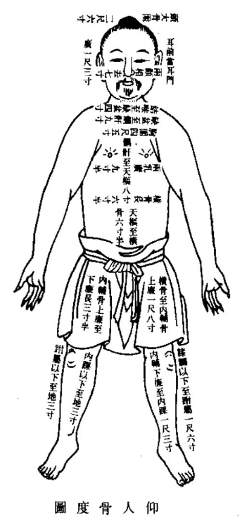
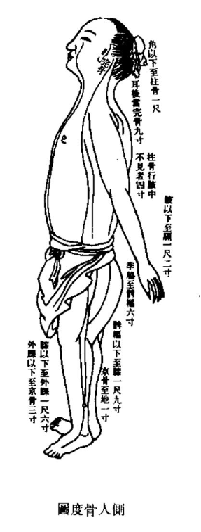
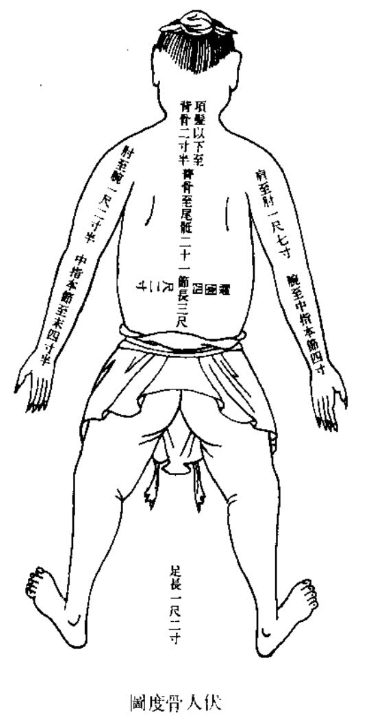

## 卷五十三  

### 经脉篇第十 【`下`】  

手太阴气绝则皮毛焦。太阴者，行气温于皮毛者也。故气不荣则皮毛焦，皮毛焦则津液去皮节，津液去皮节者则爪枯毛折，毛折者则毛先死。丙笃丁死，火胜金也。  

【`马莳曰：此言肺绝之证候死期也。肺经之荣在毛，合在皮，正以肺主气，行气以温于皮毛，惟气绝而不荣，则皮毛焦，是皮节之津液亦去，而爪枯毛折，不特皮毛之焦而已。故病至毛折，其毛已死。火日克金，死可必矣。`】  

【`张志聪曰：此论三阴三阳之气终也。皮脉肉筋骨，脏腑之外应也。脏腑者，雌雄之内合也。阴阳六气，本于脏腑之五行所生，气先死于外，而后脏腑绝于内也。手太阴之气，主于皮毛，是以太阴气绝则皮毛焦。手太阴主气，气主熏肤泽毛。故太阴者，行气温于皮毛者也。是以气不荣则皮毛焦。津液者，随三焦出气，以温肌肉淖泽于骨节，润泽于皮肤，气不荣则津液去皮节矣，津液去皮节则爪枯毛折矣。毛先死者，手太阴之气，先绝于外也。丙笃丁死，肺脏之气死于内也。　尚御公曰：按上古天元册文，丹黅苍素元之天气，经于五方分野，合化地之五行，而地之五行，上呈天之六气。五运行论曰：神在天为风，风生木，木生酸，酸生肝，肝生筋，筋生心，是人之立形定气，本于五行所生。故曰：其生五，其数三，谓生于五行，而终于三阴三阳之数。是以所生病者，脏腑五行之病生于内也。是动者，六气之运动于外而为病也。然是动所生之病，皆终于三阴三阳之气者，脏腑五行之气，本于天之所化，故天气先绝而后脏腑之气终也。　朱济公曰：夫人生于地，悬命于天，天地合气，命之曰人。盖人秉天地之气所生，配合天地阴阳运气，能明造化死生之道，则一点灵明，与太虚同体，万劫常存也。`】  

手少阴气绝则脉不通，脉不通则血不流，血不流则髦色不泽。故其面黑如漆柴者，血先死。壬笃癸死，水胜火也。  

【`马莳曰：此言心绝之证候死期也。心主脉，又主血，惟心气绝则血脉俱枯，髦色不泽，面色如漆柴然，水所刑也。此则血已先死，水日克火，死可必矣。`】  

【`张志聪曰：心主血脉，故手少阴气绝则脉不通，脉随气行者也。脉不通则血不流，血随脉气流行者也。夫心之合脉也，其荣色也。髦者，血气之所生也。故血脉不流则髦色不泽，面如漆柴。少阴气绝则血先死。壬笃癸死，心脏之火气灭也。`】  

足太阴气绝者，则脉不荣肌肉。唇舌者，肌肉之本也。脉不荣则肌肉软，肌肉软则肉萎人中满，人中满则唇反，唇反者肉先死。甲笃乙死，木胜土也。  

【`马莳曰：此言脾绝之证候死期也。脾主肌肉唇舌，为肌肉之本，故脾气不荣则肌肉软而舌萎，人中满而唇反，斯则肉已先死。木日克土，死可必矣。`】  

【`张志聪曰：足太阴之气生于脾，脾藏荣而外主肌肉，是以太阴气绝则脉不荣于肌肉矣。脾开窍于口，主为卫使之迎粮，故唇舌为肌肉之本，脉不荣则肉萎唇反，太阴之生气绝于外也。甲笃乙死，脾脏之气死于内也。`】  

足少阴气绝则骨枯。少阴者，冬脉也，伏行而濡骨髓者也。故骨不濡则肉不能着也。骨肉不相亲则肉软却，肉软却故齿长而垢，发无泽，发无泽者骨先死。戊笃己死，土胜水也。  

【`马莳曰：此言肾绝之证候死期也。肾主骨，其脉行于冬而濡骨髓，惟肾气绝则骨枯肉脱，齿槁发焦，其骨已死。土日克木，死可必矣。`】  

【`张志聪曰：足少阴之气主骨，故气绝则骨枯。冬脉者，谓五脏之脉气合四时，而外濡于皮肉筋骨者也。夫溪骨属骨，肉本于骨也，故骨不濡则肉不能着于骨，而骨肉不相亲矣。骨肉不相亲，则骨气外脱而齿长矣。夫肾主藏精而化血，发者血之余也。发无泽者，肾脏之精气绝而骨先死矣。`】  

足厥阴气绝则筋绝。厥阴者，肝脉也。肝者，筋之合也。筋者，聚于阴气而脉络于舌本也。故脉弗荣则筋急，筋急则引舌与卵，故唇青舌卷卵缩，则筋先死。庚笃辛死，金胜木也。【`阴气之气，当作器。`】  

【`马莳曰：此言肝绝之证候死期也。肝之合在筋，其筋下聚于阴器，而上络于舌本，故气绝则筋急，引舌与卵，其筋已先死。金日克木，死可必矣。`】  

【`张志聪曰：足厥阴之气主筋，故气绝则筋绝矣。厥阴者肝脉，肝者筋之合，谓厥阴之气合于肝脉，肝脏之气合于筋也。聚于阴气者，筋气之会于宗筋也。筋聚于阴器，而络于舌本，故脉不荣于筋，则筋急而舌卷卵缩矣。厥阴气绝，则筋先死。庚笃辛死，金胜木而肝脏之木气绝也。`】  

五阴气俱绝则目系转，转则目运，目运者为志先死。志先死则一日半死矣。  

【`马莳曰：此言手足阴经之绝者，而有病证死期也。五阴者，心肝脾肺肾皆属阴经也。不言心包络经者，以手少阴心经统之。耳目为五脏之精，故五脏绝则目系转而运，此乃志已先死，所以死在一日半也。曰一日半者，盖周五脏之表里，而半日则余之耳。`】  

【`张志聪曰：此总结五脏五行之气，本于先天之水火也。心系上系于目系，目系转者，心气将绝也。火之精为神，水之精为志，神生于精，火生于水，故志死而神先绝，所谓生则俱生，急则俱死也。天一生水，地二生火。一日半者，一二日之间，阴阳水火之气，终于天地始生之数也。`】  

六阳气绝则阴与阳相离，离则腠理发泄，绝汗乃出，故旦占夕死，夕占旦死。  

【`马莳曰：此言手足阳经之绝者，而有病证死期也。六阳者，胆胃大小肠膀胱三焦也。六阳经气绝，则阴经与阳经相离而不相运，致腠理开泄，绝汗如珠，其死在旦夕间也。`】  

【`张志聪曰：此言六腑三阳之气终也。阴阳离合论曰：未出地者，命曰阴中之阴；已出地者，名曰阴中之阳。盖三阳之气，根于阴而出于阳，是以六阳将绝，则阴与阳相离矣。离则阳气外脱，腠理发泄，绝汗乃出，而阳将终也。三阳者，应天之气，是以旦占夕死，夕占旦死，不能终天运之一周。　尚御公曰：此章与本经终始篇、《素问》诊要经终篇大义相同。`】  

经脉十二者，伏行分肉之间，深而不见，其常见者，足太阴过于外踝之上，无所隐故也。诸脉之浮而常见者，皆络脉也。六经络手阳明少阳之大络，起于五指间，上合肘中，饮酒者，卫气先行皮肤，先充络脉，络脉先盛，故卫气已平，荣起乃满，而经脉大盛。脉之卒然盛者，皆邪气居之，留于本末，不动则热，不坚则陷且空，不与众同。是以知其何脉之动也。雷公曰：何以知经脉之与络脉异也？黄帝曰：经脉者，常不可见也。其虚实也，以气口知之。脉之见者，皆络脉也。  

【`马莳曰：此详言经脉不可见，而络脉则可见也。经脉者，如肺经自中府以至少商是也。络脉者，如肺经之列缺旁行偏历是也。然十二经者，伏行于各经分肉之间，深而不可见，其常见者，仅有脾经之脉，过于外踝之上，与胃脉相通，无所隐焉故耳。凡诸脉之浮而常见者，皆络脉也。又有经络皆盛，其唯饮酒之时。即如手之六经，皆有络脉，其手阳明大肠经之络名曰偏历，手少阳三焦之络名曰外关，虽在臂腕之间，然皆起于手之五指，手阳明则起于食指，手少阳则起于无名指，上则合于肘中。唯饮酒时则卫气先行于皮肤，络脉先盛，至卫气已平，营气亦满，而经脉亦大盛。凡经络之脉，卒然动者，皆邪气居之。邪气者，酒气也。留于手之本末臂指间，设脉不动，则其热实不免。若脉不坚，则其人必虚，脉当陷且空也。大抵饮酒之脉，断宜动而且坚，与不饮酒之众人，其脉不相同也。是以即饮酒时，便可以知其脉起于何指者，系何脉之动也。及雷公又以经络之异，何法知之为问，盖欲于不饮酒时而知之也。帝言经脉之虚实，当诊气口脉以知之，然隐而不可见者，其常也。络脉则其脉常见，不必于气口知之矣。`】  

【`张志聪曰：此申明十二经脉之血气，与脉外皮肤之气血，皆生于胃腑水谷之精，而各走其道。经脉十二者，六脏六腑，手足三阴三阳之脉，乃荣血之荣行，伏行于分肉之内，深而不见者也。诸脉之浮而常见者，皆络脉也。支而横者为络，络之别者为孙。盖胃腑所生之血气，精专者独行于经隧，荣行于十二经脉之中，其出于孙络皮肤者，别行于经别。经别者。脏腑之大络也，盖从大络而出于络脉皮肤。下行者，从足太阴之络，而出于足胻之街，故其常见者，足太阴过于外踝之上，无所隐故也。上行者，从手阳明少阳之络，注于尺肤以上鱼，而散于五指，故曰，手阳明少阳之大络，起于五指间，上合肘中，谓行于皮肤之气血，从手阳明少阳之大络，散于五指间，复从五指之井溜于脉中，而与脉中之血气，上合于肘中也。夫阴阳六气主于肤表。经云：太阴为之行气于三阴，阳明者表也，亦为之行气于三阳。盖手太阴主气而外主皮毛，手阳明为太阴之合，故亦为之行气于肤表也。手少阳主气，为厥阴包络之腑，心主包络，主行血于脉中，少阳主行血于脉外，是以手阳明少阳之大络，主行胃腑所出之血气，而注于络脉皮肤之间。玉版篇曰：胃者，水谷血气之海也。海之所行云气者，天下也。胃之所出血气者，经隧也。经隧者，五脏六腑之大络也。缪刺篇曰：邪客于皮毛，入合于孙络，留而不去，闭塞不通，不得入于经，流溢于大络而生奇病也。是血气之行于脉外者，外内出入，各有其道，故复引饮酒者以证明之。夫酒者水谷之悍液，卫者水谷之悍气，故饮酒者，液随卫气而先行皮肤，是以面先赤而小便独先下，盖先通调四布于外也。津液随卫气先行皮肤，先充络脉，络脉先盛，卫气已平，荣气乃满，而经脉大盛。此血气之从皮肤而络，络而脉，脉而经，盖从外而内也。如十二经脉之卒然盛者，皆邪气居于脉中也。本末者，谓十二经脉之有本标也。如留于脉而不动则热，不留于脉则脉不坚而外陷于肤空矣。此十二经脉之流行出入，不与络脉大络之众同也。是以知何脉之动也，以气口知之。气口者，手太阴之两脉口也。此言荣血之行于十二经脉中者，乃伏行之经脉，以手太阴之气口知之。血气之行于皮肤，而见于络脉者，候见于人迎气口也。此节凡四转，盖以申明十二经脉之血气，与皮肤之气血，各有出入之道路也。再按十二经脉之始于手太阴肺，终于足厥阴肝，周而复始者，乃荣血之行于脉中也。十二经脉之皆出于井，溜于荣，行于经，入于合者，乃皮肤之气血，溜于脉中，而与经脉之血气，合于肘膝之间，本篇之所谓六经脉，手阳明少阳之大络，起于五指间上合肘中者是也。本经痈疽篇曰：余闻肠胃受谷，上焦出气，以温分肉而养骨节，通腠理，中焦出气如露，上注溪谷而渗孙脉，津液和调，变化而赤为血，血和则孙脉先满溢，乃注于络脉，皆盈乃注于经脉，阴阳已张，因息乃行，行有经纪，周有道理，与天合同，不得休止。此水谷所生之津液，随三焦出气以温肌肉，渗于孙络，化赤为血，而溢于经脉。本篇之所谓饮酒者，卫气先行皮肤，先充络脉，络脉先盛，卫气已平，荣血乃满，而经脉大盛是也。是脉外之气血，一从经隧而出于孙络皮肤，一随三焦出气以温肌肉，化而为赤，是所出之路有两歧也。其入于经也，一从指井而溜于经荣，一从皮肤而入于络脉，是所入之路亦有两歧也。其经脉之血气，行于脉外，从本标而出于气街，本篇之所谓留于本末，不动则热，不坚则陷且空，不与众同是也。此血气出入之路，而合于天地阴阳五运六气，乃本经之大关目，故不厌烦赘而详言之，学者亦不可不用心参究者也。夫血气之从经隧而出于孙络皮肤者，海之所以行云气于天下也。随三焦出气以温肌肉者，应司天在泉水随气而运行于肤表也。肤表之气血入于脉中，应天运于地之外，而复通贯于地中，经脉之血气，行于皮肤之外，犹地之百川流注于泉下，而复运行于天表也。此天地上下升降内外出入之相通也。人合天地阴阳之道，运行不息，可以与天地相参，如升降息则气立孤危，出入废则神机化灭矣。`】  

雷公曰：细子无以明其然也。黄帝曰：诸络脉皆不能经大节之间，必行绝道，而出入复合于皮中，其会皆见于外，故诸刺络脉者，必刺其结上甚血者。虽无结，急取之，以泻其邪而出其血，留之发为痹也。凡诊络脉，脉色青则寒且痛，赤则有热。胃中寒，手鱼之络多青矣。胃中有热，鱼际络赤，其暴黑者，留久痹也。其有赤有黑有青者，寒热气也。其青短者，少气也。凡刺寒热者，皆多血络，必间日而一取之，血尽乃止，乃调其虚实。其青而短者少气，甚者泻之则闷，闷甚则仆不得言，闷则急坐之也。  

【`马莳曰：此言刺络脉者，必出其血，诊络脉者，必别其色也。凡诸络脉，皆不能经历于大节之间，一如经脉之行也，必行于阻绝之道，而出入之，复合于皮中，如肺经列缺为络，别行于大肠经之偏历，直行似阻而旁行之也。其所会处皆见于外，故诸经刺络脉者，必即其络脉之上结而甚有血者以刺之，其间虽然有结，亦当急取之，以泻其邪而出其血。若将此血留之，必发之而为痹疾，所以不可留也。然欲诊络脉，有色可据，某经络脉之色青者，则寒且痛；某经络脉之色赤者，内必有热。若胃中有寒，则鱼际之络多青；若胃中有热，则鱼际之络多赤；若手鱼之络暴黑，则留之必为久痹。故上文曰，当泻其邪而出其血也。若鱼际之脉，赤黑青之兼见者，必为寒热气；若鱼际之脉青而且短者，必正气之衰少。但此寒热气者，理当刺之，刺之者，以其血络之多故也，必间日而一取之，候其血尽而止针，随即调其虚实，虚则补而实则泻也。至于色青而短，为元气衰少者，病势若甚，切不可泻，泻之则必闷，闷甚则必仆，须于初闷时不得言语，急静坐之，即可以不至于仆矣。`】  

【`张志聪曰：此复申明上文之义，盖假病刺以证血气之生始出入。《下经》曰：先度其骨节大小广狭而脉度定矣。盖十二经脉，皆循于骨节间而为长短之度，其络脉皆不能经大节之间，必行绝道而出入。绝道者，别道也，盖胃腑所出之血气，行于经别者，从经别而出于络脉，复合于皮中，其血气色脉之会合，皆见于外，故刺诸络脉者，必刺其结上甚血者，虽无结，急取之以泻其邪而出其血，留之发为痹也。经云：病在阴者名为痹。盖皮肤络脉之邪，留而不泻，则入于分肉筋骨之间而为痹，与邪居经脉之中，留于本末，不动则热之不同也。凡诊络脉，脉色青则有寒，赤则有热，盖浮络之血气，皆见于皮之部也。胃中寒，手鱼之络多青；胃中热，手鱼之络多赤。盖皮络之气血，本于胃俯所生，从手阳明少阳，注于尺肤而上鱼也。气者，三阴三阳之气，胃腑之所生也。少气甚者泻之则闷，气益虚而不能行于外也。闷甚则仆不能言者，谓阴阳六气，生于胃腑水谷之精，而本于先天之水火也。少阴之气厥于下，则仆而不得言，故闷则急坐之，以启少阴之气，即如上文之缓带被发，大杖重履而步之一法也。`】  

【`高士宗曰：上节以十二经脉，分别卫气血气之行于皮肤络脉；此节单论皮肤络脉，以复申明上文之义。`】  

【`黄载华曰：冲脉任脉，皆起于胞中，上循背里为经络之海。其浮而外者，循腹右上行，会于咽喉，别而络唇口，血气盛则充肤热肉，血独盛则淡渗皮肤，生毫毛，是脉外之血气，又从冲脉而散于皮毛，故曰复合于皮中，其会皆见于外。谓经别所出之血气，与冲脉所出之血气，会合于皮中，当知皮肤血气所出之道路有三径也。`】  

手太阴之别，名曰列缺，起于腕上分间，并太阴之经，直入掌中，散入于鱼际。其病实则手锐掌热；虚则欠(去欠)，小便遗数。取之去腕半寸，别走阳明也。 【`(去欠)，音去。数，音朔。半寸当作寸半。`】  

【`马莳曰：此下十二节，详言十二络穴，而此先以肺经言之也。夫不曰络而曰别者，以此穴由本经而别走邻经也。手太阴肺经之别穴，名曰列缺，起于腕上分肉之间，并本经太阴之经，入手阳明大肠经，以直入掌中，而散入于鱼际。其病如邪气盛而实，则手之锐掌当热；如正气衰而虚，则小便必遗而且数。凡取此穴者，必觅之去手腕寸半间，针二分，留三呼，泻五吸，灸三壮。以列缺乃别走阳明之穴，正以肺与大肠为表里也。`】  

【`张志聪曰：经别者，五脏六腑之大络也。别者，谓十二经脉之外，别有经络。阳络之走于阴，阴络之走于阳，与经脉缪处而各走其道，即缪刺篇之所谓大络者左注右，右注左，与经相干而布于四末，不入于经俞与经脉缪处者是也。玉版论之所谓：胃者，水谷血气之海也。海之所行云气者，天下也。胃之所出血气者，经隧也。经隧者，五脏六腑之大络也。盖胃腑所生之血气，其精专者独行于经隧，从手太阴肺脉，而终于足厥阴肝经，此荣血之循行于十二经脉之中，一脉流通环转不息者也。其血气之四布于皮肤者，从脏腑之别络而出，虽与经相干，与经并行，而各走其道，出于孙络，散于皮肤。故手太阴之经别曰列缺，手少阴之经别曰通里，足太阳曰飞扬，足少阳曰光明，与手足之井荥俞经合穴不相干也。曰太阴少阴，曰太阳少阳，与脏腑之经脉各缪处也。此胃腑之血气，四布于肤表之阳分者，从大络而出于孙络皮肤，从络脉而阴走于阳，阳走于阴，如江河之外别有江河，江可通于河，河可通于江，与经脉之荣血，一以贯通者不相同也。故手太阴之别名曰列缺，起于腕上分间。分间者，谓手太阴之经脉，与经别之于此间而相分也。并太阴之经者，并太阴之经脉而行也。散入于鱼际，谓入鱼际而散于皮肤，即上文之所谓诸络脉必行绝道，而出入复合于皮中，其会见于外也。实则手锐掌热，气盛于外也；虚则欠(去欠)小便遗数，气虚于内也。盖肤表之血气，由脏腑经隧之所生也。当取之去腕寸半，即列缺穴间。别走阳明者，阴络之从此而别走于阳也。`】  

【`尚御公曰：此篇病证与缪刺篇之不同。缪刺篇论邪客于皮肤孙络，溜于大络而生奇病，病从外而内也。此篇论本气之虚实，病从内而外也。故曰诸络脉必行绝道而出入。`】  

【`朱济公曰：如手太阴之列缺，手阳明之偏历，虽非井荥俞经，然以系经脉之穴，盖经别之各走其道，布于四末，与经相干于列缺、通里诸经之间，复别而上行，并经而入掌，散于络脉而合于皮中者也。`】  

【`张玉师曰：皮部论云，欲知皮部，以经脉为纪。阳明之阳，名曰害蜚，视其上下有浮络者，皆阳明之络也。少阳之阳名曰枢持，少阴之阴名曰枢儒。凡十二经络脉者，皮之部也。是皮部之络脉虽以经脉为纪，并循于十二经脉之部，然从大络而出，别走其道，与经脉缪处，故有害蜚枢持之别名，当于《灵》、《素》二经合参，其义始得。`】  

手少阴之别，名曰通里，去腕一寸半，别而上行，循经入于心中，系舌本，属目系。其实则支膈，虚则不能言。取之掌后一寸，别走太阳也。  

【`马莳曰：此言心经之络穴也。通里去腕一寸半，半字衍文，观掌后一寸，可见别而上行，循本经入于心中，系舌本，属目系。其邪气实则隔间若有所支而不畅，正气虚则不能言，盖心主言而经别络舌本也。取之当觅掌后一寸，乃别走太阳小肠经之通里穴，以心与小肠为表里也。针三分，灸三壮。`】  

【`张志聪曰：按心脉上侠咽，系目系，经别系舌本属目系，盖经别并经而行也。`】  

手心主之别，名曰内关，去腕二寸，出于两筋之间，循经以上系于心包，络心系。实则心痛，虚则为头强。取之两筋间也。  

【`马莳曰：此言心包络经之络穴也。夫手厥阴心包络经而谓之手心主者，以其代心经以行事。本经邪客篇云：必者五脏六腑之大主，诸邪之在心者，皆在心之包络。包络者，心主之脉也，皆如手少阴心主之脉行也。其别者名曰内关，去手腕上廉二寸之两筋间，循本经以上系于心包络。如心系间邪气盛而实，则心必痛；正气衰而虚，则头必强。取此穴者，觅之两筋间耳。`】  

【`张志聪曰：手心主之别络，与经相干于内关之间，去腕二寸，别经脉而出于两筋之内，循经并行，上系于心包络心系。实则心痛，心系与包络之相通也。虚则为头强，盖包络主行血脉，脉气虚故头强也。按十二经别，皆阳走阴而阴走阳。此不曰别走少阳，或简脱也。`】  

手太阳之别，名曰支正，上腕五寸，内注少阴。其别者，上走肘络肩髃。实则节弛肘废，虚则生肬，小者如指痂疥。取之所别也。【`肬。音尤。痂，音加。`】  

【`马莳曰：此言小肠经之络穴也。支正上手腕外廉五寸，内注于手少阴心经，以心与小肠为表里也。其别行者，上走于肘，络手阳明大肠经之肩髃穴。如邪气有余而实，则节弛而肘废；正气不足而虚，则大者为肬，盖赘瘤之类，小者为指间痂疥之类。凡此疾者，取此别穴而已。针三分，灸三壮。`】  

【`张志聪曰：上腕五寸，乃手太阳经之支正。太阳之经别布于四末，与经相干于支正之间，内注于手少阴之别络。其别行者，上走肘络肩髃。手太阳小肠主液，实则津液留滞，不能淖泽于骨，是以节弛肘废。《三因》曰气虚不行则生肬，小者如指上之痂疥，即皶痤之类，气郁之所生也。`】  

手阳明之别，名曰偏历，去腕三寸，别入太阴。其别者，上循臂乘肩髃，上曲颊遍齿。其别者，入耳合于宗脉。实则龋聋，虚则齿寒痹隔。取之所别也。【`龋，丘禹切。`】  

【`马莳曰：此言大肠经之络穴也。偏历去手腕后三寸，别走入于手太阴肺经。其支别者，上循臂之温溜、下廉、上廉、三里、曲池以乘肩髃，上曲颊，入上齿缝中。又其支别者，入耳合于宗脉也。诸节皆腑合于脏，脏合于腑，此则宗脉是肺经之大脉，犹言大气为宗气也。如邪气有余而实，则为龋而齿痛，为耳聋；正气不足而虚，则止为齿寒，为内痹，为隔塞不便，皆当取此穴以治之耳。`】  

【`张志聪曰：去腕三寸，乃手阳明经之偏历。手阳明之别络，布于四末，与经相干于偏历之间，而别入于太阴之经别。其别行者，上循臂乘肩髃，上曲颊，遍络于齿。又其别者，入耳中，合于宗脉。实则气滞，上为齿痛耳聋；虚则齿寒，内为痹隔。盖手阳明主行血气于皮肤，以温肌肉，虚则不行于外，故为齿寒而痹闭阻隔也。`】  

【`尚御公曰：取之别者，谓遍齿入耳之别络，非偏历也。十二络皆同。`】  

手少阳之别，名曰外关，去腕二寸，外绕臂，注胸中。合心主病，实则肘挛，虚则不收。取之所别也。  

【`马莳曰：此言三焦经之络穴也。外关去手腕外廉二寸，外绕于臂，注于胸中，以合手厥阴心主之脉，以三焦与心包络为表里也。邪气有余而实，则为肘挛；正气不足而虚，则手不能收，皆取此穴以治之耳。`】  

【`张志聪曰：去腕二寸，乃手少阳经之外关。少阳之别络，布于四末，与经相干于外关之间，外行繞臂，注胸中，合心主之大络病。实则肘挛，虚则不收，少阳厥阴之主筋也。`】  

足太阳之别名曰飞扬，去踝七寸，别走少阴。实则鼽窒头背痛，虚则鼽衂。取之所别也。  

【`马莳曰：此言膀胱经之络穴也。飞扬去足外踝上七寸，别走少阴肾经，以膀胱与肾为表里也。邪气有余而实，则为鼽而窒，为头与背痛；正气不足而虚，则为鼽为衂，皆当取此穴以治之耳。`】  

【`张志聪曰：踝上七寸，乃足太阳经之飞扬穴。足太阳之别络，与经相干于飞扬之间，不入于经俞，别走于足少阴之络。实则鼽窒背痛，虚则鼽衂，盖别络并经而循于头背也。`】  

足少阳之别，名曰光明，去踝五寸，别走厥阴，下络足跗。实则厥，虚则痿躄，坐不能起。取之所别也。  

【`马莳曰：此言胆经之络穴也。光明穴去外踝上五寸，别走足厥阴肝经，以胆与肝为表里也。下络足之跗面，即侠溪、地五会、临泣等处也。邪气有余而实，则气逆而为厥，以肝脉在下也。正气不足而虚，则为痿为躄，虽坐亦不能起，以肝主于筋也。皆取此穴以治之耳。`】  

【`张志聪曰：踝上五寸，乃足少阳经之光明，少阳之大络，与经相会于光明之间，别走于厥阴之别络，下络足跗。少阳主初阳之气，实则胆气不升而逆于下则为厥，气虚则为痿躄，坐不能起。`】  

足阳明之别，名曰丰隆，去踝八寸，别走太阴；其别者，循胫骨外廉，上络头项，合诸经之气，下络喉嗌。其病气逆则喉痹卒喑，实则狂颠，虚则足不收胫枯。取之所别也。  

【`马莳曰：此言胃经之络穴也。丰隆去外踝上八寸，别走足太阴脾经，以胃与脾为表里也。循胫骨外廉之上下巨虚等穴，上至头项而络之，以合于诸经之气，盖胃为五脏六腑之大海也。其头项之下，则络于喉嗌，故胃气一逆，则为喉痹，为卒喑也。邪气有余而实，则为狂颠；正气不足而虚，则足不能收，而胫亦枯槁，皆当取此穴以治之也。`】  

【`张志聪曰：去足踝八寸，乃足阳明经之丰隆。阳明之别络，与经相会于丰隆之间，而别走于足太阴之别络。其别行者，并经脉而循于胫骨外廉，上络头项十五大络之气血，皆本于胃腑水谷之所生，是以足阳明之络，与诸经之气相合，其病气逆则喉痹卒喑，经别之络于喉嗌也。实则气厥于下而为颠狂，血气虚则足不收胫枯，取之所别也。`】  

足太阴之别，名曰公孙，去本节之后一寸，别走阳明；其别者，入络肠胃。厥气上逆则霍乱，实则肠中切痛，虚则鼓胀。取之所别也。  

【`马莳曰：此言脾经之络穴也。公孙去足大指本节后一寸，别走足阳明胃经，以脾与胃为表里也。其别者，入络于肠胃之中。脾气上逆而厥则为挥霍扰乱，邪气有余而实则为肠中切痛，正气不足而虚则为鼓胀，皆取此穴以治之耳。`】  

【`张志聪曰：去足大指本节之后一寸，乃足太阴之公孙穴。太阴之别络，分布于足，与经相干于公孙之间，而别走于阳明之络，其别行者，入络肠胃。厥气上逆，则为霍乱，气有余而实，则为肠中切痛，不足而虚，则为鼓胀，当取之所别也。`】  

足少阴之别，名曰大锺，当踝后绕跟别走太阳；其别者，并经上走于心包下，外贯腰脊。其病气逆则烦闷，实则闭癃，虚则腰痛。取之所别也。  

【`马莳曰：此言肾经之络穴也。大锺穴当内踝后绕跟处，别走足太阳膀胱经，以肾与膀胱为表里也。又其别者，并本经脉气，以上走于手厥阴心包络经之下，而外则贯于腰脊间，其病气逆则为烦心，邪气有余而实，则为闭癃，以肾通窍于二便也。正气不足而虚，则为腰痛，皆取此穴以治之耳。`】  

【`张志聪曰：当踝后繞跟处，乃足少阴经之大锺。少阴之别络，与经相会于大锺之间，而别走于太阳；其别行者，并经而行，上走于心包络之下，外贯腰脊。其病气逆则烦闷，水气上乘于心也。实则闭癃，别走太阳，而膀胱之气不化也。虚则腰痛，腰者肾之腑也，按手少阳三焦手厥阴包络之气，皆本于肾脏之所生，故并经上走于心包下。盖包络之气，生于肾脏，注于络中，并经而上也。`】  

足厥阴之别，名曰蠡沟，去内踝五寸，别走少阳；其别者，经胫上睾结于茎。其病气逆则睾肿卒疝，实则挺长，虚则暴痒。取之所别也。  

【`马莳曰：此言肝经之络穴也。蠡沟去内踝上五寸陷中，别走足少阳胆经，以肝与胆为表里也。经于足胫以上于睾丸结于茎垂，其病气逆则睾丸肿胀而卒成疝气，邪气有余而实，则睾为挺长，正气不足而虚，则为暴痒，皆当取此穴以治之也。`】  

【`张志聪曰：去内踝五寸，乃厥阴经之蠡沟。厥阴之别络，分布于足，与经相干于蠡沟之间，而别走于少阳之络，胫足胻睪。睾丸，即阴子也。茎，阴茎，乃前之宗筋。挺，即阴茎也。取之所别者，取别走少阳之络，所谓阳取阴而阴取阳，左取右而右取左也。`】  

任脉之别，名曰尾翳，下鸠尾散于腹。实则腹皮痛，虚则痒搔。取之所别也。  

【`马莳曰：此言任脉经之络穴也。从尾翳下于鸠尾，散于腹中。邪气有余而实，则腹皮必痛；正气不足而虚，则痒而搔之，皆当取此穴以治之耳。`】  

【`张志聪曰：按任脉起于中极之下，以上毛际，循腹里，上关元，至咽喉，上颐循面入目。所谓尾翳者，即鸠尾之上，盖任脉之别络，出于下极，并经而上，复下于鸠尾，以散于腹络。气实则腹皮急，虚则痒搔，当取之所别络也。`】  

督脉之别，名曰长强，挟脊上项散头上，下当肩胛左右，别走太阳，入贯膂。实则脊强，虚则头重，高摇之，挟脊之有过者。取之所别也。  

【`马莳曰：此言督脉经之有络穴也。长强挟脊上项，散于头上，下则当于肩胛之左右。其别者则走于足太阳膀胱经，以入贯于膂筋之间。邪气有余而实，则脊必强；正气不足而虚，则头必重，且头重难支，必从高而摇之。此皆挟脊之有病所致也，皆当取此穴以治之耳。长强在脊骶骨端。`】  

【`张志聪曰：按督脉起于少腹，以下骨中央，女子入系庭孔。其孔，溺孔之端也。其络循阴器合篡间，繞篡后，别绕臀至少阴，与巨阳中络者合，少阴上股内后廉，贯脊属肾，与太阳起于目内眦上额交巅，上入络脑，还出别下项，循肩膊内，侠脊抵腰中，下循膂络肾，其男子循茎下至篡，与女子等；其少腹直上者，贯齐中央，上贯心入喉，上颐环唇，上系两目之下中央。盖督脉总督一身之阳，应天道之繞地环转，是以下行而上者，循茎至篡，从少腹贯齐中央，入喉上颐，环唇系目；其上行而下者，起于目内眦，上额交巅，下项侠脊，抵腰中，而环转于周身之前后也。其督脉之别络，出于长强之分，侠脊上行散于头上，是督脉之行于脊膂者，从头项而下行，别络之从下而上行于头项也。虚实者，本气之虚实。有过者，有过之脉，邪气之所客也。　尚御公曰：以有过之脉，总结于督脉之后，盖申明虚实者，乃本气之虚实，非邪气也。　朱永年曰：按任督之大络，与经脉交相逆顺而行，当知十二别络，虽循经并行，亦往来逆顺者也。`】  

脾之大络，名曰大包，出渊液下三寸，布胸胁。实则身尽痛，虚则百节尽皆纵。此脉若罗络之血者，皆取之脾之大络脉也。  

【`马莳曰：此言脾经又有大络穴也。脾固有公孙穴为络，又有大络名曰大包，出足少阳胆经渊液下之三寸，布于胸胁之中。邪气有余而实，则一身尽痛；正气不足而虚，则百节尽皆纵弛。此脉若罗纹之络，其络中必有血，皆当取此穴以治之耳。渊液：腋下三寸宛宛中，举臂取之。`】  

【`张志聪曰：大包乃脾经之穴名，在足少阳胆经渊液之下三寸。脾之大络，循脾经之大包，而四布于胸胁。实则身尽痛，虚则百节尽皆纵。罗络之血者，谓大络之血气，散于周身之孙络皮肤，若罗纹之纵横而络于身也。夫脾之有大络者，脾主为胃行其津液，灌溉于五脏四旁，从大络而布于周身，是以病则一身尽痛，百节皆纵。而血络之若罗纹，以络于周身足太阴之大络者，止并经而行，散血气于本经之部分，是以足太阴脾脏之有二络也。如曰脾足太阴之脉，兼是动所生而言也。曰足太阴之大络，曰脾之大络，分脾脏经气而言也。`】  

凡此十五络者，实则必见，虚则必下。视之不见，求之上下。人经不同，络脉异所别也。  

【`马莳曰：此结言取络穴之有法也。凡此十五络者，邪气实则其脉必见，正气虚则其脉陷下。若陷下而视之不见，则求之上下诸穴，即其不陷下者，而知此穴之为陷也。盖人之经脉不见有十二经之分，故络脉之异而别行者，亦有十五络耳。夫以十二经而谓之十五络者，以督任有二，脾有大包，故谓之十五也。按此篇以督之长强，任之尾翳为十五络，《难经》以阳蹺阴蹺之络为十五络，殊不知督脉所以统诸阳，任脉所以统诸阴，还以《灵枢》为的也。`】  

【`张志聪曰：凡此十五大络之血气，充实则外溢于孙络皮肤，故实则必见，虚则下陷于内之大络，故视之不见也。求之上下者，谓络脉之相交于上下阴阳之间，病在上者求之下，病在下者求之上，病在阴者取之阳，病在阳者取之阴也。夫十五大络，虽与经相干而布于四末，其气无常处，不入于经俞，与经脉缪处，故与人之经脉不同而络脉异所别也。`】  

【`尚御公曰：经脉有经脉之络脉，经别有经别之络脉，故曰络脉异所别也。`】

## 卷五十四  

### 经别篇第十一

黄帝问于岐伯曰：余闻人之合于天道也，内有五脏，以应五音、五色、五时、五味、五位也；外有六腑，以应六律。六律建阴阳诸经，而合之十二月、十二辰、十二节、十二经水、十二时、十二经脉者，此五脏六腑之所以应天道。夫十二经脉者，人之所以生，病之所以成，人之所以治，病之所以起。学之所始，工之所止也。粗之所易，上之所难也。请问其离合出入奈何？岐伯稽首再拜曰：明乎哉问也！此粗之所过，上之所息也。请卒言之！  

【`马莳曰：此帝问十二经之离合出入，而伯欲尽言之也。`】  

【`张志聪曰：此论十二经脉，十五大络之外，而又有经别也。五位，五方之定位。六律建阴阳者，建立六阴六阳以合诸经。诸经者，十二经脉，十二大络，十二经别也。六律分立阴阳，是以合天之十二月、十二节、十二时，合地之十二经水，人之十二经脉，此五脏六腑之所以应天道也。夫六脏脉属脏络腑，六腑脉属腑络脏，此荣血之流行于十二经脉之中，然经脉之外又有大络，大络之外又有经别，是以粗工为易而上工之所难也。离合者，谓三阳之经别离本经而合于三阴，三阴之经别离本经而合于三阳，此即缪刺篇所当巨刺之经，左盛则右病，右盛则左病，如此者必巨刺之，必中其经，非络脉也。按上章之所谓别者，言十二经脉之外，而有别络；此章之所谓别者，言十二经脉之外，而又有别经。此人之所以生此阴阳血气，病之所以成是动所生，及大络之奇病，经别之移易，治之所以分皮刺、经刺、缪刺、巨刺也。所生之经络多岐，所成之病证各别，所治之刺法不同，故上工之所难也。　尚御公曰：五脏为阴，六腑为阳。阳者，天气也，主外；阴者，地气也，主内。本篇以六腑应六律，以合阴阳诸经，盖五脏内合六腑，六腑外合十二经脉，故曰五脏六腑之所以应天道。`】  

【`朱永年曰：五运行论云：在脏为肝，在体为筋。在脏为肺，在体为皮。是五脏之外合于皮肉筋骨也。本脏篇曰：肺合大肠，大肠者皮其应。心合小肠，小肠者脉其应。是五脏内合六腑，六腑外合于皮肉筋骨也。盖五脏六腑，雌雄相合，离合之道，通变无穷。`】  

【`高士宗曰：人虽本天地所生，而统归于天道。`】  

足太阳之正，别入于腘中。其一道下尻五寸，别入于肛，属于膀胱，散之肾，循膂当心入散；直者从膂上出于项，复属于太阳，此为一经也。足少阴之正，至腘中，别走太阳而合，上至肾，当十四顀，出属带脉；直者系舌本，复出于项，合于太阳，此为一合。成以诸阴之别，皆为正也。【`顀，椎同。`】  

【`马莳曰：此言膀胱与肾经之为一合也。足太阳膀胱经，自有正经之脉，支别入于腘中央之委中穴。其一道下尻五寸，计承扶穴之处也。别络之脉，入于肛门，内属于膀胱，循脊膂当心而入散之。直者从膂即中膂内俞、膀胱俞等穴，以上出于项后，至前睛明穴，乃属于足太阳经，此为一经。足少阴肾经之正，由涌泉至内踝下，至于腘中，别走足太阳膀胱经，而合上至肾，当十四椎旁，有肾俞穴，出连带脉。直行者，上系舌本，复出于项，合于足太阳膀胱经，此与膀胱经为一合也。有阳经必有阴经，成以诸阴经之别，皆为正经之合耳。`】  

【`张志聪曰：此足太阳与足少阴为一合也。正者，谓经脉之外，别有正经，非支络也。足太阳之正，从经脉而别入于腘中。其一道者，经别之又分两岐也。肛乃大肠之魄门，别入于肛者，别从肛门而入属于膀胱，散之肾，复循脊膂上行当心而散。其直行者，从背膂上出于项，复属于太阳之经脉，此为一经别也。盖从经而别行，复属于太阳经脉，故名经别，谓经脉之别经也。足少阴之正，至腘中别走于太阳之部分，而与太阳之正相合，上行至肾，当脊之十四椎处，外出而属于带脉。其直行者，从肾上系舌本，复出于项，与太阳上出于项之经正，相合于项间，以为一合也。阴阳离合论曰：阳予之正，阴为之主。少阴之上，名曰太阳；太阴之前，名曰阳明；厥阴之表，名曰少阳。谓阳乃阴予之正而阴为之主，阳本于阴之所生，故曰成以诸阴之别。谓三阳之经，正合于三阴，以成手足三阴之经别，此三阳仍归于三阴之正，故曰皆为正也。是以三阳之别，外合于三阴之经，而内合于五脏三阴之别，止合三阳之经而不合于六腑也。　尚御公曰：按十二经脉之荣气流行，六阴脉属脏络腑，六阳脉属腑络脏。本篇三阴之经别，上至肾属心走肺，而皆不络于六腑。又如足太阳之脉，循膂络肾；膀胱之经别，则别入于肛，属膀胱，散之肾。足少阴肾脉，贯脊属肾络膀胱；其经别至腘中，别走太阳而上至肾，又出属带脉，而复出于项。手少阴心脉，起于心中，出络心系，下膈络小肠；其经别入于渊液两筋之间，属于心手厥阴。心包络之脉，起于胸中，出属心包下膈，历络三焦；而经别下渊液三寸，入胸中，别属三焦。手太阴肺脉，起于中焦，下络大肠，还循胃口，上隔属肺；其经别入渊液少阴之前，入走肺，散之太阳。此经脉与经别，出入不同，各走其道，而马氏以正为正经，宜与经脉篇之直行者相合，别者为络，宜与经脉篇之支者、别者相合。噫！经脉血气之生始出入，头绪纷纭，不易疏也。`】  

足少阳之正，绕髀入毛际，合于厥阴；别者入季胁之间，循胸里属胆，散之上肝，贯心以上挟咽，出颐颔中，散于面，系目系，合少阳于外眦也。足厥阴之正，别跗上，上至毛际，合于少阳，与别俱行。此为二合也。  

【`马莳曰：此言肝与胆经为一合也。足少阳胆经之正脉，循胁里出气街，入髀厌中，繞毛际，合于足厥阴肝经。其别者入季胁之间，循胸里属胆，散之上肝，贯心侠咽，出颐颔中，抵(出页)下加颊车，散于面，系目系，合足少阳于目之外眦也。足厥阴之正别足跗上，上至毛际，合于足少阳胆经。以二经相为表里，与胆经之别脉俱行，此肝胆之为一合，即上节而次第之，故曰二合。下仿此。`】  

【`张志聪曰：按足少阳之脉，起于目锐眦，循头面而下行于足跗，少阳之别，繞髀上行至目锐眦，而合于少阳之经，是经脉与经别，交相逆顺而行也。足厥阴之正，别行于跗上，上至毛际，而合少阳，与少阳之别合而偕行，此为二合也。　尚御公曰：与阳俱行，谓三阴之别，合于三阳之别俱行，而阳别成诸阴之别矣，故曰，成以诸阴之别。`】  

足阳明之正，上至髀，入于腹里属胃，散之脾，上通于心，上循咽出于口，上额颅，还系目系，合于阳明也。足太阴之正，上至髀，合于阳明，与别俱行，上结于咽，贯舌中。此为三合也。  

【`马莳曰：此言胃与脾经为一合也。前篇论胃经脉气之行，起于鼻之迎香穴，而下至厉兑。此节所论，则自下井荥俞经合而上行也。故言足阳明之正，由足次指上足跗，循胻外廉，入膝膑，抵伏兔，以上髀关，至气冲，入腹里，属胃络脾，上通于心，入缺盆，上循喉咙，出于口，上额颅，还系目系，合于足阳明之经隧也。足太阴脾经，与胃经为表里，亦上至髀关，合于足阳明胃经，与胃之别穴丰隆偕行，上结于咽，连舌本，散舌中，此胃与脾为第三合也。`】  

【`张志聪曰：股内为髀，伏兔后为髀关。足阳明之正，从足跗而上至髀，从腹胸而上头面，合手阳明之经脉于目下承泣四白间，盖亦与经脉相逆顺而行也。足太阴之正，别经脉而走阳明之髀分，与阳明之正相合而偕行，上结于喉，贯舌中，此为三合也。`】  

手太阳之正，指地，列于肩解，入腋走心，系小肠也。手少阴之正，别入于渊液两筋之间，属于心，上走喉咙，出于面，合目内眦。此为四合也。  

【`马莳曰：此言小肠与心经为一合也。手太阳小肠经之正脉，起于手小指之端，循手外侧上腕，出踝中直上，循臂骨下廉，出肘内侧两骨之间，上循臑外后廉，出肩解，绕肩胛，交肩上，故别于肩解，入缺盆，络心，循咽下鬲抵胃，属小肠，故入腋走心系小肠也。其曰指地者，以其脉之自上而下行也。手少阴心经之正脉，与小肠为表里也，起于心中，出属心系，下鬲络小肠，其直者，从心系却上肺，别入于腋下之渊液穴，属于心，上走喉咙，出于面，合目内眦。此为四合也。`】  

【`张志聪曰：阴阳系日月论曰，天为阳，地为阴；日为阳，月为阴。其合于人也，腰以上为天，腰以下为地。足之十二经脉，以应十二月，月生于水，故在下者为阴。手之十指，以应十日，日主火，故在上者为阳。手太阳之正指地者，谓手之太阳，下合于足太阳也。盖在脏腑十二经脉，有手足之分，论阴阳二气，止有三阴三阳，而无分手与足矣。故六腑皆出于足之三阳，上合于手也。手少阴之正，上出于面，亦与足太阳相合于目内眦之睛明，水火上下之相交也。夫手太阳少阴，皆属于火，天一生水，地二生火，火上水下，阴阳互交，故手太阳指地，而下交于足，手少阴上行，而合于膀胱之经。论天地水火有上下之相交，归于先天，合为一气，故人之脏腑经脉，所以应天道也。`】  

手少阳之正，指天，别于巅，入缺盆，下走三焦，散于胸中也。手心主之正，别下渊液三寸，入胸中，别属三焦，出循喉咙，出耳后，合少阳完骨之下。此为五合也。  

【`马莳曰：此言手三焦与心包络之为一合也。手少阳三焦经之正脉，起于手四指之端，循手表腕上贯肘，循臑外上肩，入缺盆，下于三焦，散于胸中，以其脉上别于巅，故曰指天也。手厥阴心包络经，乃手心主之脉也，别于腋下之天池穴，入胸中历络三焦，出循喉咙，出耳后，合于少阳完骨之下，此为五合也。天池：去乳后一寸，着胁直腋厥肋间，乃本经穴也。`】  

【`张志聪曰：少阳，初阳也，从阴而生，自下而上，故曰指天也。指地者，谓手合于足；指天者，谓足合于手也。盖分手足于二经，则为六合，论阴阳之气止三合矣。巅乃督脉之会，督脉应天道之环转一周，故从巅而别，下入缺盆，走三焦而散于胸中也。渊液：胆经穴，在腋下三寸。手心主之正，别经脉而下行于渊液之分，下渊液三寸，以入胸中，别属三焦，出循喉咙，上出耳后，合少阳经别于完骨之下。此为五合也。`】  

手阳明之正，从手循膺乳，别于肩髃，入柱骨，下走大肠，属于肺，上循喉咙，入缺盆，合于阳明也。手太阴之正，别入渊液少阴之前，入走肺，散之太阳，上出缺盆，循喉咙，复合阳明。此六合也。  

【`马莳曰：此言大肠与肺经为一合也。手阳明大肠经之正脉，起于大指次指之端，出合谷两骨之间，循臂入肘，循臑上肩，别循髃骨之前廉，上出柱骨，下入缺盆，络肺下鬲，属大肠，与肺为表里，上循喉咙，出缺盆，合于手阳明之经隧也。手太阴肺经之正脉，别于心包络经之渊液穴少阴心经之前，入走于肺，相合散之本经太阳之脉，上出缺盆，循喉咙，复合于阳明。此其为六合也。按比各经皆名曰正，则正者正经也，宜与经脉篇其直行者相合；别者络也，宜与经脉篇其支者其别者相合。今此篇之所谓正，较之经脉篇甚略，且非尽出正行之经，是其意之所重者在合，而于经脉之行，不必及其详耳。`】  

【`张志聪曰：手阳明之正，从手之经脉，循膺乳间，而别行上于肩髃，入柱骨，下走大肠，属于肺，复上循喉咙，出缺盆，而与手阳明经脉相合也。手太阴之正，别经脉于天府云门之际，入渊液之分，行太阴之前，入走肺于当心处，散之太阳，复上出缺盆，循喉咙，与少阳之正相合，此为六合也。夫阴阳六合，始于足太阳，而终于手太阴，复散之太阳，盖亦周而复始也。`】  

### 经水篇第十二

【`马莳曰：内论十二经脉合于十二经水，故名篇。`】  

黄帝问于岐伯曰：经脉十二者，外合于十二经水，而内属于五脏六腑。夫十二经水者，其有大小深浅广狭远近各不同，五脏六腑之高下小大，受谷之多少亦不等，相应奈何？夫经水者，受水而行之。五脏者，合神气魂魄而藏之。六腑者，受谷而行之，受气而扬之。经脉者，受血而荣之。合而以治，奈何？刺之浅深，灸之壮数，可得闻乎？岐伯答曰：善哉问也！天至高不可度，地至广不可量，此之谓也。且夫人生于天地之间，六合之内，此天之高地之广也，非人力之所能度量而至也。若夫八尺之士，皮肉在此，外可度量切循而得之，其死可解剖而视之。其脏之坚脆，腑之大小，谷之多少，脉之长短，血之清浊，气之多少，十二经之多血少气，与其少血多气，与其皆多血气，与其皆少血气，皆有大数。其治以针艾，各调其经气，固其常有合乎？  

【`马莳曰：此言十二经合十二水，而刺灸之数亦相合也。帝问人与天地本相参也，天地有十二经水，人身有十二经脉，十二经水者，有大小深浅远近广狭之异，十二经脉者，有高下小大受谷多少之殊，其相应者必有故也。且是五脏者，所以藏精神魂魄者也，故曰合神气魂魄而藏之。六腑者，所以化水谷而行津液者也，故曰，受五谷而行化之。又受谷所化精微之气，而扬之于脏腑者也。中焦并胃中，出上焦之后，此所受气者；泌糟粕，蒸津液，化其精微，上注于肺脉，乃化而为血以奉生身，故曰，经脉者，受血而荣之。今以脏腑经脉，而合之于十二经脉，以治其病，刺有浅深，灸有多寡，无不吻合，此其故又何也？伯言天地难以度量，人身犹可剖视，脏之坚脆，腑之大小，谷之多寡，脉之长短，血之清浊，十二经之气血多少，皆有大数，其治以针艾浅深多寡，宜其尽与十二经水相合也。此即下文刺阳明深六分等义。`】  

【`张志聪曰：此篇以十二经脉，内属于五脏六腑，外合于十二经水，经水有大小浅深广狭远近之不同，脏腑有高下大小受谷多少之不等，五脏主藏五脏之神志，六腑主行水谷之精气，经脉受荣血以荣行，帝问可以合一而为灸刺之治法乎？伯曰：天之高，地之广，不可度量者也。人生于天地六合之内，亦犹此天之高，地之广，非人力之所能度量。若夫有形之皮肉筋骨，外可度量切循，内可解剖而视。其于脏之坚脆，腑之大小，谷之多少，脉之长短，血之清浊，气之多少，十二经之多血少气，多气少血，血气皆多，血气皆少，皆有大数。大数者，即本脏篇之五脏坚脆，肠胃篇腑之大小，绝谷篇谷之多少，脉度篇脉之长短，根结篇布衣大人之血气，九针篇之多血少气，多气少血，皆有数推之。其治以针艾，调其经气，固其常有合于数者，即下文之六分五分，十呼七呼，以至于二呼一呼，此手足阴阳皆有合于数也。按前二章论十二经脉应天之六气，五脏六腑应五音六律五色五时，此复论脏腑经脉，应地之十二经水，是人合天地之道，而不可度量者也。`】  

黄帝曰：余闻之，快于耳不解于心，愿卒闻之。岐伯答曰：此人之所以参天地而应阴阳也，不可不察。足太阳外合于清水，内属于膀胱而通水道焉。足少阳外合于渭水，内属于胆。足阳明外合于海水，内属于胃。足太阴外合于湖水，内属于脾。足少阴外合于汝水，内属于肾。足厥阴外合于渑水，内属于肝。手太阳外合于淮水，内属于小肠而水道出焉。手少阳外合于漯水，内属于三焦。手阳明外合于江水，内属于大肠。手太阴外合于河水，内属于肺。手少阴外合于济水，内属于心。手心主外合于漳水，内属于心包。凡此五脏六腑十二经水者，外有源泉而内有所禀，此皆内外相贯，如环无端，人经亦然。故天为阳，地为阴。腰以上为天，腰以下为地。故海以北者为阴，湖以北者为阴中之阴；漳以南者为阳，河以北至漳者为阳中之阴，漯以南至江者为阳中之太阳。此一隅之阴阳也。所以人与天地相参也。【`渑，音免。漯，通合切。以，俱同已。`】  

【`马莳曰：此承上文而言十二经脉，合十二经水之数也。伯以人身脏腑而合十二经水者，盖天位乎上为阳，地位乎下为阴，而人之腰以上象天，腰以下象地，故经水以东西南北而分阴阳及阴阳中之阴阳，则人之脏腑，亦以东西南北而合十二经水也。所谓人与天地相参固如此。`】  

【`张志聪曰：夫三阴三阳，合天之六气，手足经脉，应地之经水。十二经脉外合于六气，内属于脏腑，是以手足之三阴三阳，外合于十二经水，而经水又内属于脏腑，此人之所以参天地而应阴阳也。清水乃黄河合淮处，分流为清河，肺属天而主气，膀胱为津液之腑，受气化而出，六腑皆浊，而膀胱之水独清，故足太阳外合于清水，内属于膀胱而通水道焉。渭水出于雍州，合泾、汭、漆、沮、沔水，而渭水独清，诸阳皆浊，而胆为中精之腑，独受其清，故足少阳外合于渭水，内属于胆。海水汪洋于地之外，而地居海之中，阳明居中土，为万物之所归，又为水谷之海，故足阳明外合于海水而内属于胃。湖水有五湖，即洞庭、彭泽、震泽之类，脾位中央，而灌溉于四旁，故足太阴外合于湖水，而内属于脾。汝水发源于河南天息山，河南居天地之中。夫天居地上见者一百八十二度半强，地下亦然，北极出地上三十六度，南极入地下亦三十六度，而嵩正当天之中极，盖天气包于地之外，又从中而通贯于地中，故名天息。肾主天一之水，而为生气之原，上应于喉，以司呼吸，故足少阴外合于汝水而内属于肾。渑水出于青州之临淄，而西入于淮，天下之水，皆从东去，渑水自东而来，故应足厥阴东方之肝木。淮水自海水而入于淮泗，小肠受盛胃之水液，而济泌于膀胱，故手太阳外合于淮水，内属于小肠。漯济乃西北之大水，漯合济而入于兖豫诸州，少阳为君主之相，阴阳相合，故手少阳合于漯水，而内属于三焦。江水自西蜀岷山发源，曲折万里，而东入于海，大肠传道水谷，济泌别汁，回肠十六折，而渗入膀胱，故手阳明外合于江水，内属于大肠。黄河源发于星宿海，自干位而来，千里一曲，故曰黄河之水天上来，肺属干金而主天，为水之生源，故手太阴外合于河水，而内属于肺。济水发源于王屋山，截河而流，水不混其清，故名曰清济，潜流屡绝，状虽微而独尊，故居四渎之一，心为君主之官而独尊，故手少阴外合济水，内属于心。漳水有二：一出于上党沾县大黾谷，名为清漳；一出上党长子县鹿谷山，名为浊漳。二漳异源，而下流相合。夫血者神气，阴中之清，心所主也，合厥阴包络而流行于经脉之中，犹二水之合流，故手心主外合于漳水，内属于心包。此人之所以参天地而应阴阳也。愚按：膀胱为水腑，主受藏津液，津液乃随三焦出气，以温肌肉，三焦下俞出于委阳，并太阳之正，入络膀胱，约下焦，是中焦所生之津液，即随中焦之气而出，膀胱所藏之津液，即随下焦之气而出，运行于肤表以温肌肉，充皮肤，故示从容论曰：怯然少气者，是水道不行，形气消索也。曰通水道者，谓水道之上通于天，非独下出之溲便也。若夫泉在地之下，地居天之中，水随天气上下环转于地之外，而复通贯于地中，故曰，外有源泉，而内有所禀。盖地禀在泉之水而以外为十二经水之源流，内外相贯，如环无端，而人亦应之。水热穴论曰：肾者，至阴也。至阴者，盛水也。肺者，太阴也。少阴者，冬脉也。故其本在肾，其末在肺，皆积水也。是肾脏之精水，膀胱之津水，皆随肺主之气，而运行于肤表，故腰以上为天，腰以下为地，天地上下之皆有水也。海以北者，谓胃居中央，以中胃之下为阴，肝肾之所居也。湖以北者，乃脾土所居之分，故为阴中之阴，脾为阴中之至阴也。漳以南者为阳，乃心主包络之上，心肺之所居也。盖以上为天为阳为南，下为地为阴为北也。河以北至漳者，谓从上焦而后行于背也。漯以南至江者，谓从中焦而前行于腹也。此以人之面南而背北也。盖人生于天地之间，六合之内，以此身一隅之阴阳，应天地之上下四旁，所与天地参也。`】  

黄帝曰：夫经水之应经脉也，其远近浅深，水血之多少各不同，合而以刺之奈何？岐伯答曰：足阳明，五脏六腑之海也，其脉大血多，气盛热壮，刺此者不深勿散，不留不泻也。足阳明刺深六分，留十呼。足太阳深五分，留七呼。足少阳深四分，留五呼。足太阴深三分，留四呼。足少阴深二分，留三呼。足厥阴深一分，留二呼。手之阴阳，其受气之道近，其气之来疾，其刺深者，皆无过二分，其留皆无过一呼，其少长大小肥瘦，以心撩之，命曰法天之常。灸之亦然。灸而过此者，得恶火则骨枯脉濇。刺而过此者，则脱气。【`撩，音聊。`】  

【`马莳曰：此言灸刺有多少之数也。足阳明胃经多气多血，其脉大，其热壮，刺之者必深六分，留十呼。凡泻者必先吸入针，又吸转针，候呼出针。凡补者必先呼入针，又呼转针，又吸出针。后世令病人咳嗽以代呼，口中收气以代吸，气有出入，亦与呼吸相同。今曰深六分，则入之至深者也；曰留十呼，是言泻法有十呼之久。盖入针必吸，转针必吸，至十呼出针，但补法不言吸数，以理论之，其吸与呼同数也。后世凡《针灸聚英》等书，言吸若干者，皆言补法，先呼后吸；呼若干者，皆言泻法，先吸后呼。故针赋有云：补者先呼后吸，泻者先吸后呼，正此义也。足太阳膀胱经，多血少气，故刺之者深五分，较足阳明减一分也；泻之者留七呼，则呼后出针，其呼数较足阳明减三呼矣。足少阳胆经，少血多气，刺之者，止深四分，较足太阳减一分也；泻之者留五呼，则呼后出针，其呼数较足太阳亦减二呼矣。此乃足三阳经之针数也。足太阴脾经，多气少血，止深三分，较足少阳减一分也；留四呼，则又减一呼矣。足少阴肾经，少血多气，止深二分，较足太阴减一分也；留三呼，则又减一呼矣。足厥阴肝经，多血少气，止深一分，较足少阴减一分也；留二呼，则又减一呼矣。此乃足三阴经之刺数也。大凡手之阴阳六经，与足经同而针法异，正以手之六经，在上近于肺，故肺受胃之谷气而行诸经，诸经受肺之大气而行各经，其受气之道近，故其气之来也甚疾，所以刺之者，皆无过二分，其留之者，皆无过一呼也。凡人之少长大小肥瘦，皆当以心料之，命曰法天之常道也。其灸数之多寡亦然。若灸之而过此数者，则非善火，乃恶火也，其骨当枯，其脉当濇。刺之而过此数者，其气当脱矣。`】  

【`张志聪曰：此论灸刺之法，以手足之阴阳，气血之多少，合经水之浅深，以应天之常数。夫数出河图，始于一而终于十。二乃阴之始，十乃阴之终。海水者，至阴也，故从阳明以至于厥阴。厥阴者，两阴交尽，阴极而阳生也。天一生水，地六成之，从六分而至一分者，法天之常也。腰以上为天，故手之阴阳，受气之道近，其气之来疾，故宜浅刺而疾出也。终始篇曰：刺肥人者，以秋冬之齐；刺瘦人者，以春夏之齐。是以少长大小肥瘦，以心撩之，量其浅深疾徐，所以发天时之常也。灸法亦然。若灸而过此法，命曰恶火，则骨为之枯，脉为之濇。刺而过此法，则脱气矣。`】  

黄帝曰：夫经脉之小大，血之多少，肤之厚薄，肉之坚脆，及腘之大小，可为度量乎？岐伯答曰：其可为度量者，取其中度也。不甚脱肉，而血气不衰也。若夫度之人，痟瘦而形肉脱者，恶可以度量刺乎？审切循扪按，视其寒温盛衰而调之，是谓因适而为之真也。【`度，去声。量，龙张切。`】  

【`马莳曰：此言人之肉不脱，血气不衰者，可以度量而针灸之。反此者，则不可度量，而止可调治也。`】  

【`尚御公曰：夫天阙西北，地陷东南，至高之地，冬气常在，至下之地，秋气常在，而人亦应之。是以五方之民，有疏理致理，肥脂瘦痟之不同，故可为度量者，取其中度也。中度者，即瘦而不甚脱肉，虽弱而血气不衰，是谓适其中而为度之正也。`】  

【`莫云从曰：上节法天之常，此因地之理，以适人之厚薄坚脆，所以人与天地参也。`】  

### 经筋篇第十三

【`马莳曰：经皆有筋，筋皆有病，各有治法，故名篇。`】  

足太阳之筋，起于足小指，上结于踝，邪上结于膝；其下循足外侧，结于踵，上循跟，结于腘；其别者，结于踹外上腘中内廉，与腘中并上结于臀，上挟脊上项；其支者，别入结于舌本；其直者，结于枕骨，上头下颜结于鼻；其支者，为目上网，下结于頄；其支者，从腋后外廉结于肩髃；其支者，入腋下上出缺盆，上结于完骨；其支者，出缺盆，邪上出于頄。其病小指支跟肿痛，腘挛，脊反折，项筋急，肩不举，腋支缺盆中纽痛，不可左右摇。治在燔针劫刺，以之为数，以痛为输，名曰仲春痹也。【`頄，音仇。髃，音偶。网，当作纲。`】  

【`马莳曰：此详言膀胱经之筋，其病为仲春痹，而刺之有法也。足太阳之筋，起于足小指外侧之至阴穴，由通谷、束骨、京骨、金门、申脉，结于踵跟之仆参、昆仑，又上循跟出于外踝，由附阳、飞扬、承山、承筋、合阳，结于腘中央之委中穴。其别者，从飞扬络穴，与腘中相并而行委阳、浮郄、殷门等穴，以上结于臀，上会阳，下中次上四髎、白环俞，直至大椎，计二十一穴，开中行一寸五分，挟脊上于项之天柱、玉枕等穴。其直者，则结于玉枕之下枕骨上，由是而上至于头以前，下于颜，结于鼻。又其支者，自睛明为目上纲，下结于目下之頄。又其支者，从腋后外廉，结于手阳明经之肩髃。又其支者，入于腋下，上出于缺盆，上结于完骨。又其支者，出于缺盆，斜上出于目下之頄。及其为病，则足小指支跟，当为肿为痛，为腘中筋挛，为脊中反折，为项筋急，为肩不举，为腋支缺盆中痛，不可左右摇。治之者，当以燔针劫刺之，刺之而已。知则准其刺之之数，其所取之俞穴，即痛处是也。此证当发于二月之时，故名之曰仲春痹也。`】  

【`张志聪曰：此篇论手足之筋，亦如经脉之起于指井，而经络于形身之上下，以应天之四时六气十二辰十二月，盖亦秉三阴三阳之气所生也。足太阳之筋，起于足小指之至阴穴间，循踝膝腨腘以上臀至项，结于脑后枕骨而上头至前，复下于颜，结于鼻而为目上之纲维，此皆循脉而上经于头。其支者亦如经脉之支别，从经筋而旁络也。故其病为小指肿痛，腘挛，脊反折，项筋急，经筋之为病也。肩不举，腋支缺盆中纽痛，不可左右摇，支筋之为病也。燔针，烧针也。劫刺者，如劫夺之势，刺之即去，无迎随出入之法。知者，血气和而知其伸舒也。以痛为俞者，随其痛处而即为所取之俞穴也。夫在外者皮肤为阳，筋骨为阴。病在阴者名曰痹。痹者，血气留闭而为痛也。卯者二月，主左足之太阳，故为仲春之痹。盖手足阴阳之筋，应天之四时，岁之十二月，故其为病亦应时而生，非由外感也。`】  

足少阳之筋，起于小指次指，上结外踝，上循胫外廉，结于膝外廉；其支者，别起外辅骨，上走髀，前者结于伏兔之上，后者结于尻；其直者，上乘(月少)季胁上，走腋前廉，系于膺乳，结于缺盆；直者，上出腋贯缺盆，出太阳之前，循耳后，上额角，交巅上，下走颔，上结于頄；支者，结于目眦为外维。其病小指次指支转筋，引膝外转筋，膝不可屈伸，腘筋急，前引髀，后引尻，即上乘(月少)季胁痛，上引缺盆膺乳，颈维筋急，从左之右，右目不开，上过右角，并蹺脉而行，左络于右，故伤左角，右足不用，命曰维筋相交。治在燔针劫刺，以知为数，以痛为输，名曰孟春痹也。  

【`马莳曰：此言胆经之筋，其病为孟春痹，而刺之有法也。足少阳之筋，起于足小指之次指，即第四指之窍阴穴，由侠溪、地五会、临泣，结于外踝下之丘墟，上循胫外廉悬锺、阳辅、光明、外丘、阳交，结于膝外廉之阳陵泉。其支者，别起外辅骨，上走于髀，其在前则结于足阳明胃经伏兔之上，其在后则结于督脉经之尻尾上。其直者，上乘(月少)之季胁，上走于腋之前廉，系于膺乳间，上结于缺盆中。又其直者，上出于腋，贯于缺盆，出太阳之前，循耳后，上额角，交巅上，下走于颔，上结于頄。又其支者，结于目眦为外维，如论疾诊尺篇诊目痛，脉从外走内者，少阳病是也。及其为病，则小指之次指，当为转筋，引于膝外转筋，其膝不可屈伸，其腘中之筋甚急，前引于髀，即上走髀前者结于伏兔之上是也；后引于尻，即后者结于尻是也。即上乘(月少)之季胁而痛，上引缺盆、膺乳、颈维之筋皆急，从左以之于右，其右目必不能开，正以甲木在东也。上过右角，并蹺脉而行，左络于右，故伤左角，其右足不能举用者，为左所伤也，命曰维筋相交。治之者当以燔针劫刺之，以知病为刺之数，以痛处为俞穴。此证当发于正月之时，故名之曰孟春痹也。`】  

【`张志聪曰：足少阳之筋，起于小指次指相交之窍阴井穴，而上循于头目，皆并脉而经于骨也。维筋者，阳维之筋也。阳维之脉，与足少阳之脉，会于肩井、风池、脑空、目窻、承泣、阳白于目之上下。故从左之右，则右目不开。盖春阳之气，从左而右。维筋左右之交维也，左络于右，故伤左角者，病从左而右也。右足不用者，复从上而下也。盖维者为一身之纲维，从左之右，右之左，下而上，上而下，左右上下交维，故命曰维筋相交。此足少阳之筋，交于阳维之筋而为病也。寅者，正月之生阳也，主左足之少阳，故为孟春之痹。`】  

足阳明之筋，起于中三指，结于跗上，邪外上加于辅骨，上结于膝外廉，直上结于髀枢，上循胁属脊；其直者，上循骭，结于膝膝：原本注明缺字，据《太素》卷十三经筋补。；其支者，结于外辅骨，合少阳；其直者，上循伏兔，上结于髀，聚于阴器，上腹而布至缺盆，而结上颈，上挟口合于頄，下结于鼻，上合于太阳。太阳为目上网，阳明为目下网。其支者，从颊结于耳前。其病足中指支胫转筋，脚跳坚，伏兔转筋，髀前肿，溃疝，腹筋急，引缺盆及颊，卒口僻，急者目不合，热则筋纵，目不开，颊筋有寒，则急引颊移口，有热则筋弛纵，缓不胜收，故僻。治之以马膏，膏其急者；以白酒和桂，以涂其缓者。以桑钩钩之，即以生桑炭置之坎中，高下以坐等，以膏熨急颊，且饮美酒，啖美炙食，不饮酒者自强也，为之三拊而已。治在燔针劫刺，以知为数，以痛为输，名曰季春痹也。  

【`马莳曰：此言胃经之筋，其病为季春痹而治之有法也。足阳明之筋，起于足之中三指，盖历兑穴起于次指，而其筋则自次指以连三指，结于足跗，上冲阳、解溪等穴，斜外而上加于辅骨下巨虚、条口、上巨虚、三里，上结于膝之外廉三里，以直上结于髀枢，上循胁，属于脊。其直行者，又上循骭，结于膝膝：同注[一]。。其支行者，结于外辅骨，合于足之少阳。其直者，上循本经之伏兔，上结于本经之髀关，而聚于阴器，又上于腹中而布之，以上至于缺盆，复结于上颈，挟于口，合于目下之頄，结頄下之鼻中，其上合于足太阳经，故彼太阳为目之上纲，此阳明为目之下纲。又其支者，从颊结于耳前。及其为病，则足之中指支胫，当为转筋，其脚之筋跳而且坚，其伏兔亦为转筋，其髀前为肿，为溃疝，为腹筋急，上引缺盆及颊，为猝然口歪而僻，其目当不能合也。然热则筋脉纵缓，当不能开也。以缓不能收，故为僻如此。寒则颊筋急引其颊以移其口，治之者，以马膏熬膏，其寒而急者，用白酒和桂末以涂之，其热而缓者，用桑木为钩，钩而架之，即以桑炭置之地坎之中，不拘高卑，而人坐于其上，以坐等之，亦以前膏熨其急颊，且饮美酒，啖美炙肉，虽不善饮，亦自强之。又为之三拊其急颊而止。又用燔针以劫刺之，以知病为刺数，以痛处为输穴。此证当发于三月之时。故名之曰季春痹也。按本经论疾诊尺篇曰：诊目痛赤脉，从上下者太阳病，从下上者阳明病。`】  

【`张志聪曰：足阳明之筋，起于中三指，乃厉兑之外间，循髀股而上经于颈，结于口鼻耳目之间，其病支胫伏兔转筋，脚跳而坚，经筋之为病也。溃疝腹中急者，聚于阴器，上布于腹也。口僻口移者，筋上挟口也。目不开合者，太阳为目上纲，阳明为目下纲也。太阳寒水主气而为开，故寒则筋急而目不合。阳明燥热主气而为阖，故热则筋纵而目不开。颊筋有寒，则急引颊移口而为僻，有热则筋纵缓不收而为僻，盖左筋急则口僻于左，左筋缓则口僻于右也。马膏者，以马之脂膏熬膏。钩，构也。以桑之钩曲者而钩架之，高下如座之相等，即以生桑炭置之坎中，令坐于上，如左颊筋急而口僻于左者，以白酒和桂以涂其右颊之缓者，以马膏熨左之急颊。主左之缓急更变，即以其法易之。且饮以美酒，啖以炙食，不饮酒者，自强饮之，为之三拊而止，此治口颊喎僻之法也。其转筋溃疝诸证，治在燔针劫刺，以知为数，以痛为输。辰者三月，主左足之阳明，故为季春之痹。夫在足阳明饮以美酒，啖以美食者，诸筋皆由胃腑之津液以濡养，故阳明主润宗筋，宗筋主束骨而利机关也。　尚御公曰：在阳明有寒热之开合，在少阴有阴阳之俯仰，此阳中有阴，阴中有阳，少阴主先天之阴阳，阳明主后天之阴阳也。`】  

足太阴之筋，起于大指之端内侧，上结于内踝；其直者络于膝内辅骨，上循阴股，结于髀，聚于阴器，上腹结于脐，循腹里结于肋，散于胸中，其内者着于脊。其病足大指支，内踝痛，转筋痛，膝内辅骨痛，阴股引髀而痛，阴器纽痛，下引脐两胁痛，引膺中脊内痛。治在燔针劫刺，以知为数，以痛为输，名曰孟秋痹也。【`孟秋，当作仲秋。`】  

【`马莳曰：此详言脾经之筋，其病为孟秋痹，而刺之有法也。足太阴之筋，起于大指之端内侧隐白穴，上结于内踝骨下之商丘。其直行者，络于膝内辅骨之地机、阴陵泉，上循阴股结于髀，而聚于阴器，又上腹结之于脐，循腹里之腹结、大横、腹哀等穴，以结于肋，散之于胸中，其在内者，则着之于脊。及其为病，则足大指内踝痛，其痛乃转筋也。为膝之内辅骨痛，为阴股引髀而痛，为阴器之纽痛，为下引于脐及两胁作痛，为引膺中及脊内痛。治之者以燔针劫刺之，以知病为刺数，以痛处为输穴。此证当发于七月之时，故名之曰孟秋痹也。`】  

【`张志聪曰：足太阴之筋，起于大指内侧之隐白间，循膝股而上于胸腹，其内者着于脊，其病在筋经之部分而为痛。酉者八月，主左足之太阴，故为仲秋之痹。`】  

足少阴之筋，起于小指之下，并足太阴之筋，邪走内踝之下，结于踵，与太阳之筋合，而上结于内辅之下，并太阴之筋，而上循阴股，结于阴器，循脊内挟膂，上至项，结于枕骨，与足太阳之筋合。其病足下转筋，及所过而结者皆痛，及转筋病在此者，主癎瘈及痉，在外者不能俯，在内者不能仰。故阳病者腰反折不能俯，阴病者不能仰。治在燔针劫刺，以知为数，以痛为输，在内者熨引饮药，此筋折纽纽发数甚者死不治，名曰仲秋痹也。【`数甚之数，音朔。仲秋，当作孟秋。`】  

【`马莳曰：此言肾经之筋，其病为仲秋痹，而刺之有法也。足少阴之筋，起于小指之下涌泉穴，出于内踝下，并足太阴脾经之筋，斜趋内踝之下然谷、太溪，而结于踵之照海、复溜、水泉，又与太阳膀胱之筋合，而上结于内辅骨之下，又并太阴脾之筋，以上循阴股，结于阴器，循脊内挟膂，以上至于项，结于枕骨，又与太阴之筋合。其病当为足下转筋，及所过之处而凡有结者皆痛，及为转筋之病，凡此所过之处，又主癎瘈及痉疾等证。病在于外，主不能俯，病在于内，主不能仰。盖在外不能俯者，正以阳病之腰反折，故不能俯，其病在后也。在内不能仰者，以阴病之腹不舒，故不能仰，其病在前也。治之者，用燔针以劫刺之，以知病为刺数，以痛处为输穴。且其在内有病者，当熨之导引之饮之以药，若此筋折纽而纽痛，病发数数加甚者，当死不治。此证当发于八月之时，故名之曰仲秋痹也。`】  

【`张志聪曰：足少阴之筋，起于足小指之下，斜趋涌泉，上循阴股，结于阴器，循脊内挟于膂筋，上至项，结于枕骨，与足太阳之筋相合，此脏腑阴阳之筋气相交也。其病足下转筋，及所过而结者皆痛，病在此所过所结者，主癎瘈痉强，此经筋之为病也。在外在内者，病阴阳之气也。少阴之上，君火主之，少阴为阴阳水火之主宰，故有外内阴阳之见证，阳外而阴内也。纽折者，癎瘈强痉也。如纽发频数而甚者死不治，盖少阴主藏津液，所以濡筋骨而利关节，阳气者柔则养筋，纽折数甚，精阳之气绝也。申者七月之生阴也，主左足之少阴，故为孟秋之痹。`】  

【`尚御公曰：少阴之气，从本从标。刺禁篇曰：心部于表，肾治于里，少阴本阴而标阳，本内而标外也。`】  

【`余伯荣曰：足少阴之筋，与足太阳之筋，上合于颈项，此脏腑阴阳之气交也。病在外在阳者，病太阳之气，故腰反折不能俯；在内在阴者，病少阴之气，故不能仰。如伤寒病在太阳，则有反折之痉强，在少阴则蜷卧矣。`】  

足厥阴之筋，起于大指之上，上结于内踝之前，上循胫，上结内辅之下，上循阴股，结于阴器，络诸筋。其病足大指支内踝之前痛，内辅痛，阴股痛，转筋，阴器不用，伤于内则不起，伤于寒则阴缩入，伤于热则纵挺不收，治在行水清阴气。其病转筋者，治在燔针劫刺，以知为数，以痛为输，名曰季秋痹也。  

【`马莳曰：此详言肝经之筋，其病为季秋痹，而刺之有法也。足厥阴之筋，起于大指之上大敦穴，上结于内踝之前中封，上循于胫，上结内辅骨之曲泉，以上循阴股之阴包等穴，结于阴器以络诸筋。其病当为足大指支内踝之前痛，为内辅骨痛，为阴股痛，或转筋，为阴器不用。若伤于内则阴器不起，若伤于寒则阴器缩入，若伤于热则阴器纵挺不收，治在行其水以清阴气。其病为转筋者，治在用燔针以劫刺之，以知病为刺数，以痛处为输穴。此证当发于九月之时，故名之曰季秋痹也。`】  

【`张志聪曰：足厥阴之筋，起于足大指之大敦，循胫股而结于阴器络诸筋。阴器乃宗筋之会，厥阴主筋，故连络于三阴三阳之筋也。其病乃筋之所过而结者为痛，为转筋，为阴器不用。伤于内则阴痿不用，伤于寒则阴器缩入，伤于热则阴挺不收，厥阴从中见少阳之火化，故有寒热之分。夫金气之下，水气治之，复行一步，木气治之。厥阴之木气本于水，故治在行水以清厥阴之气。其病在有形之筋而为转筋者，治在燔针劫刺矣。`】  

手太阳之筋，起于小指之上，结于腕，上循臂内廉，结于肘内锐骨之后，弹之应小指之上，入结于腋下；其支者后走腋后廉，上绕肩胛，循颈出走太阳之前，结于耳后完骨；其支者入耳中；直者出耳上，下结于颔，上属目外眦。其病小指支肘内锐骨后廉痛，循臂阴入腋下，腋下痛，腋后廉痛，绕肩胛引颈而痛，应耳中鸣痛，引颔目瞑，良久乃得视，颈筋急则为筋瘘颈肿。寒热在颈者，治在燔针劫刺之，以知为数，以痛为输。其为肿者，复而锐之。本支者，上曲牙，循耳前，属目外眦，上颔，结于角。其病当所过者支转筋，治在燔针劫刺，以知为数，以痛为输，名曰仲夏痹也。  

【`马莳曰：此详言小肠经之筋，其病为仲夏痹，而治之有法也。手太阳之筋，起于手小指之上少泽穴，结于手外侧之腕骨、阳谷、养老等穴，以上循臂内廉，结于肘内锐骨后之小海穴，以手而弹之，则应在手小指之上，入结于腋下。其支行者，后走腋之后廉，上绕肩胛，盖由肩贞、臑俞、天宗、秉风、曲垣、肩外俞以入肩中俞，循颈以出走手太阳之前，结于耳后之完骨。又其支者，入于耳中，又其直行者，出于耳上，下结于颔，上属于目之外眦。及其为病，则为手小指支肘内锐骨后廉痛。又其筋循臂阴入腋下，故为腋下痛。又为腋后廉痛。又为绕肩胛引颈而痛。其颈痛，应耳中鸣而痛，其颈痛，又引于颔而痛，且其痛时目瞑良久，乃得开视。其颈筋如急，则为筋瘘，为颈肿。其颈筋如有寒热，则治之者，当用燔针以劫刺之，以知病为刺数，以痛处为输穴。若颈肿者，刺而又刺曰复，用锐针以刺之。凡筋之为本支者，上曲牙，又循其耳前，属于目外眦上颔，以结于耳角，其病当所过之处，则为支转筋，治之者用燔针以劫刺之，以知病为刺数，以痛处为输穴。此证当发于五月之时，故名之曰仲夏痹也。`】  

【`张志聪曰：手太阳之筋，起于手小指之少泽，循臂肘肩项，而上结于耳颔目眦之间，其在筋之所过而结者，为痛为肿为筋瘘。其寒热在颈者，治在燔针劫刺，颈肿者，复以锐针刺之。本支者，本于直者而支行也。本筋与支筋，皆属于目外眦筋之分行而复连络也。午者五月，主手太阳，故名曰仲夏痹也。　尚御公曰：太阳之上，寒气主之，少阴之上，热气主之，故在手太阳有寒热之在颈，在手少阴有阴阳之俯仰，当知十二经筋应三阴三阳之六气，亦无分手与足也。`】  

手少阳之筋，起于小指次指之端，结于腕，上循臂，结于肘，上绕臑外廉，上肩走颈，合手太阳；其支者，当曲颊入系舌本；其支者，上曲牙，循耳前，属目外眦，上乘颔，结于角。其病当所过者即支转筋舌卷。治在燔针劫刺，以知为数，以痛为输，名曰季夏痹也。  

【`马莳曰：此详言三焦经之筋，其病为季夏痹，而刺之有法也。手少阳之筋，起于手小指之次指，即第四指之端关冲穴，由液门、中渚，结于手表腕上之阳池，上循臂之外关、支沟、会宗、三阳络，以结于肘之四渎、天井，上绕臑之外廉即臑会穴，以上于肩端之肩髎、天髎，走于颈之天牖，以合于本经之太阳。又其支者，当曲颊前以入系于舌本。又其支者，上于曲牙，循于耳前之角孙、耳门、和髎，以属目外眦之丝竹空，且上乘于颔，结于角。及其为病，则凡筋所经过者，即为支之转筋，为舌卷。治之者，用燔针以劫刺之，以知病为刺数，以痛处为输穴，此证当发于六月之时，故名之曰季夏痹也。`】  

【`张志聪曰：手少阳之筋，起于小指次指端之关冲，循腕臂肘臑而上肩颈，当曲颊处，入系舌本。其支者，上曲牙，循耳前，属目外眦，复上乘颔，结于额角。其病当所过之处，即支分而转筋舌卷。治在燔针劫刺，以知为度，即以痛处为所取之俞穴。未者六月，乃少阳主气，故名曰季夏痹也。`】  

手阳明之筋，起于大指次指之端，结于腕，上循臂，上结于肘外，上臑结于髃；其支者，绕肩胛挟脊，直者从肩髃上颈；其支者上颊，结于頄，直者上出手太阳之前，上左角，络头下右颔。其病当所过者支痛及转筋，肩不举，颈不可左右视。治在燔针劫刺，以知为数，以痛为输，名曰孟夏痹也。  

【`马莳曰：此详言大肠经之筋，其病为孟夏痹，而刺之有法也。手阳明之筋，起于食指之端商阳穴，由二间、三间、合谷以结于腕上之阳溪穴，循臂上结于肘外之肘髎，又上臑以结于肩之髃骨。其支者，绕于肩胛挟脊，其直者，循肩髃以上颈之天鼎穴。又其支者，上颊结于頄。又其直者，上出于太阳之前，上于左角，以络于头下于右颔。凡其病所过者，为支痛及为转筋，为肩不举，为颈不可左右以视。治者用燔针以刺之，以知病为次数，以痛处为输穴。此证当发于四月之时，故名之曰孟夏痹也。`】  

【`张志聪曰：三月四月，乃两阳合明，故名曰孟夏痹也。`】  

手太阴之筋，起于大指之上，循指上行，结于鱼后，行寸口外侧，上循臂，结肘中上臑内廉，入腋下，出缺盆，结肩前髃，上结缺盆，下结胸里，散贯贲，合贲下，抵季胁。其病当所过者支转筋痛，甚成息贲，胁急，吐血。治在燔针劫刺，以知为数，以痛为输，名曰仲冬痹也。【`贲，音奔。`】  

【`马莳曰：此详言肺经之筋，其病为仲冬痹，而刺之有法也。手太阴之筋，起于手大指端之少商穴，循指上行，结鱼际之后，行寸口之外侧，上循臂，以结于肘中之尺泽，上臑之内廉，入于腋下三寸之天府，以出于缺盆，结于肩前之髃骨，又上结于缺盆，下结胸里，散贯于贲。贲者，鬲也，胃气之所出。胃出谷气以传于肺，肺在鬲上，故胃为贲门。合贲下，抵季胁。凡其病当所经过者，为支转筋，痛甚则成为息贲，又为胁急，为吐血。治之者，用燔针以劫刺之，以知病为刺数，以痛处为输穴。此证当发于十一月之时，故名之曰仲冬痹也。`】  

【`张志聪曰：手太阴之筋，起于手大指端之少商间，循臂肘上臑，入腋下，结于肩之前髃，上结于缺盆，下结于胸里，散贯于胃脘之贲门间，合于贲门而下抵季胁。其病当筋之所过者，为支度转筋，而痛甚则成息贲，胁急，吐血。盖十二经筋，合阴阳六气，气逆则为喘急息奔，血随气奔则为吐血。子者十一月，太阴主气，故名曰仲冬痹也。`】  

手心主之筋，起于中指，与太阴之筋并行，结于肘内廉，上臂阴，结腋下，下散前后挟胁；其支者，入腋散胸中，结于臂。其病当所过者支转筋，前及胸痛息贲。治在燔针劫刺，以知为数，以痛为输，名曰孟冬痹也。  

【`马莳曰：此详言心包络之筋，其病为孟冬痹，而刺之有法也。手心主之筋，起于手中指之中冲，与手太阴之筋并行，结于肘之内廉、曲泽，上臂阴，以结于腋下之天泉、天池，下散于在前在后之挟胁处。其支者则入于腋，散于胸中，结于臂。及其为病，凡筋所经过者为支转筋，其筋及于前为胸痛，为息贲。治之者，用燔针以劫刺之，以知病为刺数，以痛处为输穴。此证当发于十月之时，故名之曰孟冬痹也。`】  

【`张志聪曰：前及胸痛，散于胸中，结于贲门，故成息奔也。亥者十月，主两阴交尽，故名曰孟冬痹也。`】  

手少阴之筋，起于小指之内侧，结于锐骨，上结肘内廉，上入腋交太阴，挟乳里，结于胸中，循臂下系于脐。其病内急，心承伏梁，下为肘网网：《太素》及《甲乙》均作纲。其病当所过者，支转筋筋痛。治在燔针劫刺，以知为数，以痛为输。其成伏梁唾脓血者，死不治。经筋之病，寒则反折筋急，热则筋弛纵不收，阴痿不用，阳急则反折，阴急则俯不伸。焠刺者，刺寒急也。热则筋纵不收，无用燔针。名曰季冬痹也。  

【`马莳曰：此详言心经之筋，其病为季冬痹，而刺之有法也。手少阴之筋，起于手小指之内侧少冲穴，结于掌后锐骨端之神门，上结肘内廉之青灵，上入腋间，以交于手太阴，挟乳里，结于胸中，循臂下系于脐。其病当为内急，及心承伏梁，下为肘网。凡筋所经过者，为支转筋，而筋则痛。治之者，用燔针以劫刺之，以知病为刺数，以痛处为输穴。如其已成伏梁，而吐血不止，当死不治。大凡经筋之病，寒则反折筋急，热则筋必弛纵不收，阴痿不用。且寒急有阴阳之分，背为阳，阳急则反折，腹为阴，阴急则俯不伸。故制为焠刺者，正为寒也。彼热则筋纵不收，不得用此燔针。此证当发于十二月之时，故名曰季冬痹也。`】  

【`张志聪曰：手少阴之筋，起于手小指侧之少冲间，循肘腋，交于手太阴之筋，挟乳里，结于胸中，循臂下系于脐。其病于内，为内急，为心承伏梁，如梁之伏于心下，而上承于心也。其病在外，当筋之所过者为转筋，筋痛治在燔针劫刺。其成伏梁而唾脓者，此病在心脏，故为死不治。其病在气，而为筋经之病者，寒则反折筋急，热则筋纵不收。阳急则反折，阴急则俯不能伸。盖少阴本阴而标阳，故有寒热阴阳之证，少阴之从本从标也。丑者十二月，少阴主气，故为季冬之痹。夫天为阳，地为阴，日为阳，月为阴，岁半以上，天气主之，岁半以下，地气主之。故三阳之气，主于春夏，三阴之气，主于秋冬。此阴阳之所以系天地日月，而人亦应之。`】  

【`尚御公曰：腹为阴，背为阳，阳急则反折，阴急则不伸，手少阴之筋，止循于胸腋脐腹，而不经于背，所谓阳急则反折者，病足少阴之筋也。足少阴之筋，循脊内挟膂，上至项，此阴阳相合，水火气交，故手足少阴，皆有阴阳寒热之俯仰。`】  

【`张开之曰：此下六篇，论筋之所经，骨脉之度量，荣卫之循行，止论筋有痹证者，盖假病以明筋之合于三阴三阳，天之四时六气。`】  

足之阳明、手之太阳筋急，则口目为僻，眦急不能卒视，治皆如右方也。  

【`马莳曰：此申言胃与小肠二经之筋，其有病当治法如前也。足之阳明胃经，手之太阳小肠经，其筋若急，则口与目皆为喎僻，其目眦亦急不能猝然视物。治之者，用燔针以劫刺之，以知病为刺数，以痛处为输穴，故曰，治法如右方也。前俱详言，而又申言之，叮咛之意也。`】  

【`尚御公曰：此申明手足阴阳之筋，皆分循气左右，故复以口目之喎僻以证之。足阳明之筋，上挟口为目下纲，手太阳之筋，结于颔，属目外眦，故二经之左筋急，则口僻于左，而当刺其左，右筋急，则口僻于右，而当取之右。如左目不能卒视，其病在左，右目不能卒视，其病在右，如两目皆急，则左右皆病，故治法皆如右方，而其病则有左右之分也。`】  

## 卷五十五  

### 骨度篇第十四

【`马莳曰：此言人身之骨，皆有度数，故名篇。`】  

黄帝问于伯高曰：脉度言经脉之长短，何以立之？伯高曰：先度其骨节之大小广狭长短，而脉度定矣。  

【`马莳曰：此言人身之脉度，由骨度而定也。脉度，脉之度数。下文将言骨之度数，而先以是启之耳。`】  

【`张志聪曰：此言经脉之长短，从骨节之大小广狭长短，而定其度数，故曰，骨为干，脉为营，如藤蔓之营附于木干也。`】  

黄帝曰：愿闻众人之度。人长七尺五寸者，其骨节之大小长短各几何？伯高曰：头之大骨，围二尺六寸。  

【`马莳曰：此言头之大骨有度也。`】  

【`张志聪曰：此言头之大骨度数。众人，谓天下之大众。长七尺五寸者，上古适中之人也。适中之人，则头骨亦适中矣。头骨适中，通体之骨皆适中矣。`】  

胸围四尺五寸。腰围四尺二寸。  

【`马莳曰：此言胸围、腰围各有其度也。`】  

【`张志聪曰：此胸骨、腰骨围转一周之总数也。`】  

发所覆者，颅至项尺二寸。发以下至颐长一尺，君子终折。结喉以下至缺盆中，长四寸。缺盆以下至(骨曷)骭，长九寸，过则肺大，不满则肺小。(骨曷)骭以下至天枢，长八寸，过则胃大，不及则胃小。天枢以下至横骨，长六寸半，过则回肠广长，不满则狭短。横骨，长六寸半。横骨上廉以下，至内辅之上廉，长一尺八寸。内辅之上廉以下，至下廉，长三寸半。内辅下廉，下至内踝，长一尺三寸。内踝以下至地，长三寸。膝腘以下至跗属，长一尺六寸。跗属以下至地，长三寸。故骨围大则太过，小则不及。【`(骨曷)，音结。骭，音干。`】  

仰人骨度图  
见图  

【`马莳曰：此言仰人之骨度，盖纵而数之也。颅，头颅也。颅之皮生发，发所覆者即颅也，颅至项，长一尺二寸。颔下为U，发际已下至颐，长一尺，君子终折。言士君子之面部三停齐等，可以始中终而三折之也，众人未必然耳。巨骨上陷中为缺盆，亦穴名，即足阳明胃经穴也。结喉已下至缺盆中，长四寸。(骨曷)骭，骨名，一名尾翳，一名鸠尾。蔽骨之端，在臆前蔽骨下五分，人无蔽骨者，从岐骨际下行一寸。缺盆以下至(骨曷)骭，长九寸。若过于九寸而始至(骨曷)骭，则其肺必大；若不满九寸而即至(骨曷)骭，则其肺必小。天枢，在脐旁二寸，足阳明胃经穴也。(骨曷)骭以下至天枢，长八寸。若过于八寸而始至天枢，则其胃必大；若不及八寸而即是天枢，则其胃必小。然天枢无形，以脐之高下为验也。横骨，即曲骨下，盖脐下四寸为中极，中极下一寸为曲骨，曲骨之分为毛际，毛际下乃横骨也。天枢以下至横骨，长六寸半。若过于六寸半而始至横骨，则回肠广阔而长；若不满六寸半而即是横骨，则回肠狭而且短。且横骨之横，长当有六寸半耳。内辅者，膝内辅骨也。横骨之上廉以下，至内辅骨之上廉，长一尺八寸。内辅骨之上廉，以下至外辅骨之下廉，仅长三寸半。内踝者，足跟前两旁起骨为踝，在外为外踝骨，而在内为内踝骨也。内辅骨之下廉，以下至内踝骨，长一尺三寸。内踝骨以下至地，仅长三寸。腓肠上膝后曲处为腘，膝在前，腘在后，因至下之长相同，故并及之。足面为跗，跗属者，自内踝以前而统之，以跗去内踝骨不远，故膝腘以下至跗属，则长一尺六寸；跗属以下至地，仅长三寸。上节头之大骨为围，此节腰骨为围者，大则以下之数皆太过，小则以下之数皆不及。自发所覆者至此，皆仰人之骨度也。`】  

【`张志聪曰：此言头颅前后上下并仰面之骨度也。发所覆者，谓自前额颅之发际，上巅顶至后项之发际，计发所覆者，度一尺二寸。发以下至颐者，谓从前额颅之发际以下，至于两颐，计长一尺。君子终折者，谓从发际之始，以至发际之终，可折中而度量。盖君子之人，面方广而发际高，发所覆者，从颅至项，度一尺一寸，发以下至颐，长一尺一寸也。此言天下之众，有君子小人不同，有太过不及不等。结喉下两旁巨骨陷中为缺盆，盖形如缺盆，因以为名。(骨曷)骭，骨名，一名尾翳，即鸠尾骨也。自两旁缺盆而下至(骨曷)骭，计长九寸。过则肺大，不满则肺小，盖(骨曷)骭之内，心肺所居也。天枢，在脐旁二寸，乃足阳明之穴，从两旁(骨曷)骭，而下至天枢，计长八寸。过则胃大，不及则胃小。盖自鸠尾以至于脐，胃腑之所居也。横骨，在毛际横纹中，自天枢而下至横骨，计长六寸半。过则回肠广大，不满则狭短，盖自脐以至少腹，大肠之部分也。横骨，横长亦六寸半。内辅者，内之辅骨也。内辅之上廉，长一尺八寸者，在上之腿度也。内辅之上廉，以下至下廉，长三寸半者，膝之连骸，一名膝盖骨。内辅下廉，下至内踝，长一尺三寸者，在下之腿度也。曰内辅，内踝者，以足八字分立，则内骨偏向于面也。踝者，下廉之腿骨，与足骨相连之凹处，在内者为内踝，在外者为外踝，内踝以下至地，长三寸者，足跟骨也。膝腘者，膝前下之腿骨，跗者，足面上之跗骨，即足阳明之动脉处，自膝前而下，至于跗面，计长一尺六寸也。属者，概足面而言也。跗属以下至地，长三寸者，从足面而下，至足底之骨也。骨围大者，骨之粗大也。小者，骨之细小也。`】  

角以下至柱骨，长一尺。行腋中不见者，长四寸。腋以下至季胁，长一尺二寸。季胁以下至髀枢，长六寸。髀枢以下至膝中，长一尺九寸。膝以下至外踝，长一尺六寸。外踝以下至京骨，长三寸。京骨以下至地，长一寸。  

【`马莳曰：此言侧人之度，亦纵而数之也。耳上之旁为骨角，肩胛上际会处为柱骨，挟项后发际大筋外廉陷中，自角以下至柱骨，长一尺。肩上胁下际为腋，自柱骨行于腋下之隐处，长四寸。胁骨之下为季胁，腋以下至季胁，长一尺二寸。捷骨之下为髀枢，一名髀厌，股外为髀，季胁以下至髀枢，长六寸。髀枢以下至膝之中，长一尺九寸。膝以下至外踝骨，长一尺六寸。京骨，足太阳膀胱经穴名，在足外侧大骨下赤白肉际陷中。外踝骨以下至京骨，长三寸。京骨已下至地，长一寸。自角以下至此，皆侧人之骨度也。`】  

侧人骨度图  
见图  

【`张志聪曰：耳上之旁为角，肩胛上之颈骨为柱骨，自角以下至柱骨，长一尺。肋下臑内为腋，自柱骨至腋中，计长四寸。胁骨以下为季胁，自腋以下至季胁，计长一尺二寸。捷骨之下为髀枢，在臀之两旁，即足少阳之环跳穴处，自季胁以下至髀枢，计长六寸。髀枢以下至膝盖骨内之中分，计长一尺九寸，即上之腿数也。膝以下至外踝，长一尺六寸，即下之腿数也。外踝以下至京骨，长三寸。京骨以下至地，长一寸，此侧身之骨度也。按胁骨名扁骨，横于胁下，有渗理而无髓空。此节不度胁骨之长短，而止以腋下至季胁长一尺二寸者，盖以形身之度数，概皮肉脉骨而量其长短，经脉循骨度而直行于上下也。`】  

耳后当完骨者，广九寸。  

【`马莳曰：此言左右完骨之相去约有九寸，盖横而言之也。耳后高骨曰完骨，入发际四分，盖亦承上文侧人之状而备言之耳。`】  

【`张志聪曰：广，横阔也。耳后当完骨者，从耳以至于脑后也。按手足少阳阳明之脉，纵横经络于头面左右，故复度头面之广数。`】  

耳前当耳门者，广一尺三寸。两颧之间，相去七寸。两乳之间，广九寸半。  

【`马莳曰：此又言仰人之骨度，盖横而数之也。左右耳前之耳门，相去一尺三寸。目下高骨为颧，两颧之门相去七寸。两乳之间，相去九寸半。`】  

【`张志聪曰：耳前当耳门者，从耳而至于鼻准也。按此当云，从左耳而至鼻凖，由鼻凖而至于右耳也。若从耳至鼻凖，广一尺三寸，其度则太过矣。`】  

两髀之间，广六寸半。  

【`马莳曰：此又言侧人之两髀，其度数各广六寸半。`】  

足长一尺二寸，广四寸半。肩至肘，长一尺七寸。肘至腕，长一尺二寸半。腕至中指本节，长四寸。本节至其末，长四寸半。  

【`马莳曰：此言手足之度数也。自足而言，其长一尺二寸，广则四寸半。自手而言，肩至肘长一尺七寸。肘至于腕，长一尺二寸半。腕至中指之本节，长四寸。本节至指之末，长四寸半。`】  

伏人骨度图  
见图  

【`张志聪曰：本节者，指掌交接之骨节。末者，指尖也。`】  

项发以下至背骨，长二寸半。膂骨以下至尾骶二十一节，长三尺，上节长一寸四分分之一，奇分在下，故上七节至于膂骨九寸八分分之七。【`骶，音底。`】  

【`马莳曰：此言伏人之骨度也。项发以下至背骨者，自项后之发际，至背骨之大椎也，长二寸半。脊骨为膂，膂骨以下至尾骶，共二十一节，计长三尺，上节每节长一寸四分一厘，其奇分之九厘在下节。故膂骨以下，计有七节，乃自膈俞而上至膂骨之数也。每节长一寸四分一厘，则七得七寸，四七二寸八分，共九寸八分。又每节一厘，共计九寸八分七厘，故曰九寸八分分之七也。`】  

【`张志聪曰：七节之旁，乃膈俞也。脏腑之气，皆从内隔而出，如逆伤脏气则死，刺伤腑气，皆为伤中，故曰，七节之旁。中有小心，而本经论五脏之背俞，亦兼论上焦之膈俞，不可妄刺者也。`】  

此众人骨之度也，所以立经脉之长短也。是故视其经脉之在于身也，其见浮而坚，其见明而大者多血，细而沉者多气也。  

【`马莳曰：此结言骨度可以定脉度之长短，而遂言视经脉血气之法也。显者多血，微者多气，多则可泻，而少则可补矣。`】  

【`张志聪曰：此总结骨之度数，定经脉之长短也。经脉之浮而坚，明而大者多血，细而沉者多气。此篇论骨气而结经脉之血气者，血脉资始于肾骨之精气，盛则经脉之血气亦盛矣。　尚御公曰：肾藏精气而主骨。血者，神气也。此六篇论筋骨血脉，本于少阴之阴阳。　张开之曰：肾脏之精液，奉心神化赤而为血气者，精气也。故浮为阳而主血，沉为阴而主气。`】  

### 五十营篇第十五

【`马莳曰：脉之营行有五十度，故名篇。`】  

黄帝曰：余愿闻五十营奈何？岐伯答曰：天周二十八宿，宿三十六分。人气行一周，千八分，日行二十八宿。人经脉上下左右前后二十八脉，周身十六丈二尺，以应二十八宿，漏水下百刻，以分昼夜。故人一呼脉再动，气行三寸；一吸脉亦再动，气行三寸；呼吸定息，气行六寸。十息气行六尺，日行二分。二百七十息，气行十六丈二尺，气行交通于中，一周于身。水下二刻，日行二十五分。五百四十息，气行再周于身。水下四刻，日行四十分。二千七百息，气行十周于身。水下二十刻，日行五宿二十分。一万三千五百息，气行五十营于身。水下百刻，日行二十八宿。漏水皆尽，脉终矣。所谓交通者，并行一数也，故五十营备得尽天地之寿矣。凡行八百一十丈也。  

【`马莳曰：此篇详言经脉之行，昼夜有五十度之数也。营者，运也。五十营者，谓五十度也。经脉之行于昼者二十五度，行于夜者二十五度，故曰五十营。伯言人身经脉之行，上合于天星之度，下合于漏水之下者也。天周二十八宿，即角、亢、氏、房、心、尾、箕、斗、牛、女、虚、危、室、壁、奎、娄、胃、昴、毕、觜、参、井、鬼、柳、星、张、翼、轸也。按本经卫气行篇云：岁有十二月，月有十二辰。子午为经，卯酉为纬。天周二十八宿而一面七星，四七二十八宿，房昴为纬，虚张为经，是故房至毕为阳，昴至心为阴，阳主昼，阴主夜者是也。每宿析为三十六分，积而推之，十宿得三百六十分，二十宿得七百二十分。八宿三八得二百四十分，六八得四十八分，共得一千八分。人之脉气，其昼夜一周，亦合此一千八分之数。而日之所行者，已周二十八宿，正以人之经脉，上下升降，左右前后，共二十八脉。盖十二经有十二脉，而左右相同则为二十四脉，加以阳蹺、阴蹺、督脉、任脉，共计二十八脉。其脉总计长短之数，凡手之三阴三阳，足之三阴三阳；两蹺督任周身，共有一十六丈二尺，上应天之二十八宿，下应漏水百刻，以分为昼夜运行之度也。故人一呼脉再动，其脉气行三寸；一吸脉亦再动，其脉气行三寸。呼吸总为一息，则其脉气行六寸。积至十息，则其脉气行六尺。而天之日，其行为七厘五毫。按正文云二分，今细推之，其所谓二分者误也。假如曰二分，则百息当行二十分，千息当行二百分，万息当行二千分，加三千五百息，又当行七百分，原数止得一千八分，今反多得一千六百九十二分，想此经向无明注，遂致误传未正。今考其会，当云，日行七厘半，则一万三千五百息，正合日行一千八分之数也。由是而悉推之，则一百三十五息，脉行八丈一尺，水下一刻，日行十分六厘；二百七十息，脉行十六丈二尺，气行交通于中，而一周于身。其水下计二刻，日行二十分一厘二毫。按正文曰：二十五分，盖误写一厘二毫为五分也。若据此数，则下又五百四十息，水下四刻，当云五十分，不应四十分。且据二十五分而推之，则一万三千五百息，水下百刻，当得一千二百五十分，比原数多得二百四十二分也。至五百四十息，其脉气当再周于身，水下四刻，日行四十分二厘二毫。至二千七百息，其脉气十周于身，水下二十刻，日行五宿二十一分六厘。自此以下。当云五千四百息，气行二十周于身，水下四十刻，日行十一宿七分二厘；又当云八千二百息，气行三十周于身，水下六十刻，日行十六宿二十八分八厘。又当云一万八百息，气行四十周于身，水下八十刻，日行二十二宿一十四分四厘。积至一万三千五百息，气行五十营于身，水下百刻。日又行五宿二十一分六厘，则共行二十八宿，其漏水皆尽而脉气终矣。吾前所谓气行交通于中，一周于身者，并五十营而皆如始时一周之数也。故五十营备者，必无病而得以尽天地所赋之寿矣。否则如根结篇之所谓不应数者名曰狂生也。`】  

【`张志聪曰：按邪客篇曰，宗气积于胸中，出于喉咙，以贯心脉而行呼吸焉。营气者，泌其津液，注之于脉，化而为血，以荣四末，内注五脏六腑，以应刻数焉。此宗气上贯于心主之脉，偕营气荣行于脉中，以应呼吸漏下者也。五味篇曰：谷始入于胃，其精微者，出于胃之两焦，以溉五脏，别出两行营卫之道，其大气之抟而不行者，积于胸中，命曰气海，出于肺，循喉咙，故呼则出，吸则入。夫肺主气而主皮毛，人一呼则八万四千毛窍皆阖，一吸则八万四千毛窍皆开。此宗气之散于脉外之皮毛而行呼吸者也。故所谓交通者，谓皮肤经脉之宗气，外内交通，而并行一百刻之数也。夫天主气，地主血脉，故五十营而外内之气行周备，斯得尽天地之寿矣。凡经脉外内之宗荣，皆行八百一十丈也。`】  

### 营气篇第十六

【`马莳曰：此篇论营气运行，故名篇。`】  

黄帝曰：营气之道，内谷为宝。谷入于胃，乃传之肺，流溢于中，布散于外，精专者行于经隧，常营无已，终而复始，是谓天地之纪。故气从太阴出注手阳明，上行注足阳明；下行至跗上，注大指间与太阴合；上行抵髀，从髀注心中，循手少阴，出腋下臂，注小指，合手太阳；上行乘腋，出(出页)内，注目内眦，上巅下项，合足太阳；循脊下尻，下行注小指之端，循足心，注足少阴；上行注肾，从肾注心，外散于胸中；循心主脉，出腋下臂，出两筋之间，入掌中，出中指之端，还注小指次指之端，合手少阳；上行注膻中，散于三焦；从三焦注胆出胁，注足少阳；下行至跗上，复从跗注大指间，合足厥阴；上行至肝，从肝上注肺；上循喉咙，入颃颡之窍究于畜门。其支别者，上额循巅下项中，循脊入骶，是督脉也。络阴器，上过毛中，入脐中，上循腹里，入缺盆，下注肺中，复出太阴。此营气之所行也，逆顺之常也。  

【`马莳曰：此言营气之运行，一如宗气之所行也。宗气者，大气也。大气积于胸中，出喉咙，司呼吸，以行经隧，始于手太阴肺经，终于肝经，积至一万三千五百息，脉行八百一十丈，如前篇五十营之所论者是也。营气者，阴气也，由中焦之气阳中有阴者，随中焦之气，以降于下焦，而生此阴气。故气之清者为营，又谓之营气出于中焦者是也。然此营气者，必成于水谷所化精微之气，故曰，营气之道，内谷为宝。非谷气不能生此营气，非营气不能生血也。道者，脉气所由行之经隧也，正以谷入于胃，则精微之气，即升之而为宗气者，由中焦传肺经之中府以上云门，而行手太阴肺，遂行手阳明大肠、足阳明胃、足太阴脾、手少阴心、手太阳小肠、足太阳膀胱、足少阴肾、手厥阴心包络、手少阳三焦、足少阳胆、足厥阴肝，流溢于脏腑之中，布散于经脉之外。此营气者，阴性精专，必随宗气以运行于经隧之中，始于手太阴肺经，终于足厥阴肝经，终而复始，是谓天地之纪，亘万古而不易者也。试以其脉气之行，一如宗气所行者言之。故气从太阴肺经，出注手阳明大肠经，上行注足阳明胃经。下行至跗，即足面之冲阳、陷谷、内庭、厉兑等处，皆胃经穴，上注大指间隐白脾经穴，与太阴合，即足太阴脾经。上行抵髀之阴陵泉、血海、箕门等穴，俱在髀之内廉，属脾经穴，注心中，循手少阴，出腋下臂之极泉青灵等处，注小指少泽穴，此皆属手少阴心经穴也。合手太阳，即小指外侧，属小肠经，上行乘腋臑俞等处小肠经穴，出(出页)即目下颧髎等处小肠经穴也。内注目内眦睛明，足太阳膀胱经穴也；上巅之曲差、五处、通天、络却等处，足太阳膀胱经穴也；下项之天柱、大杼等穴，亦膀胱经穴也；合足太阳膀胱而循脊，自背中脊开一寸五分，有大杼至会阳等穴；开三寸，有附分至秩边等穴，皆属足太阳膀胱经也；下尻下行注足小指之端，即膀胱经至阴穴，复循指斜趋足心之涌泉穴，而注足少阴肾经。上行注肾，从肾注心，即手厥阴心包络经，外散于胸中。循心主脉，即心包络经，出腋之天池、天泉等穴，属心包经；下臂之曲泽、郄门、间使、内关等穴，亦属心包经也；出两筋间之太陵穴，入掌中之劳宫，出中指之端中冲穴；皆属心包经也。还注手小指次指之端，即四指端关冲穴，属手少阳三焦经也，合手少阳三焦经也。此手少阳三焦经，乃手厥阴心包络经之腑，与右肾为合者也。上行至膻中，散于三焦。经脉篇云：循臑外上肩，交出足少阳之后，入缺盆，交膻中，散络心包下膈，循属三焦。此三焦乃前三焦，非上文手少阳之三焦，即营卫生会篇所谓宗气出于上焦，营气出于中焦，卫气出于下焦之三焦也。从此三焦注于胆经，出胁注足少阳之京门、带脉、五枢等处，下行至跗之丘墟、临泣、地五会等处，皆胆经穴也。复从跗上，注大指间，合足厥阴大指之大敦穴，上行至肝，从肝上注肺，复循肺经上循喉咙，入颃颡之后究于畜门。其支别者，上额之神庭，循巅之上星、顖会、前顶、百会、后顶等处，下项中之强间、脑户，及风府、痖门等处，循脊入骶之长强，是皆属督脉也。又络前之阴器，上过毛中，入脐中之任脉经，自会阴至神阙，上循腹里，入缺盆，自水分至天突，皆属任脉也。下注肺中，复出于手太阴肺经。此营气之所行，或逆数，或顺数，皆合常脉，其运行之次无相失也。`】  

【`张志聪曰：颃颡，鼻之内窍。畜门，鼻之外窍。究，终也。此言营气所行，外内逆顺之常也。逆顺者，谓经脉内外之血气，交相逆顺而行也。夫营卫者，精气也，乃中焦水谷之精，生此营卫二气。清空行于脉中，浊气行于脉外，此营气与宗气，偕行于二十八脉之中，以应呼吸漏下者也。中焦之汁，化赤而为血，以奉生身，命曰营气，此独行于经隧之血，而名营气，营于十二经脉之中，始于手太阴肺，终于足厥阴肝，此与营卫之营气，循度应漏之不同也。是以本篇论营气之行，外荣于十二经脉，内荣于五脏六腑，其支者行于督脉，复注于肺中，而任脉及两蹺不与焉。其营气、宗气行于脉中，以应呼吸，漏下者行于二十四脉，并任督两蹺，共二十八脉，以应二十八宿者也。`】  

【`尚御公曰：营气、宗气行于脉中者，应呼吸漏下，昼夜而为五十营也。营卫相将，偕行于皮肤肌腠之间者，日行阳二十五度，夜行阴二十五度，外内出入者也。本篇之营气，营于脉中，始于手太阴肺，终于足厥阴肝，昼夜止环转一周，是谓天地之纪。盖天道运行于地之外，昼夜止环转一周而过一度者也。再按平脉篇曰：营卫不能相将，三焦无所仰。夫营行脉中，卫行脉外，乃各走其道，外内逆顺而行者也。相将而行者，乃脉外之营，与卫气偕行于肌腠之间，故曰三焦无所仰。盖腠者肌肉之文理，乃三焦通会之处，三焦之气，仰借营卫而游行也。　金西铭问曰：营血之不荣于任脉两蹺者何也？曰：任脉起于胞中，阳蹺乃足太阳之别脉，阴蹺乃足少阴之别脉，胞中为血海，膀胱乃津液之腑，肾主藏精，皆有流溢于中之精血贯通，故营血不营焉。又问曰：营气之不行于冲脉、带脉、阳维、阴维者，何也？曰：冲任二脉，虽并起于胞中任脉，统任一身之阴，与督脉交通，阴阳环转者也。冲脉上循背里，为经络之海，其浮而外者，循腹上行至胸中而散，充肤热肉生毫毛。盖主行胞中之血，充溢于经脉皮肤之外内，不与经脉循度环转。越人曰：阳维阴维者，维络于身，溢蓄不能环流灌溉诸经者也。故阳维起于诸阳之会，阴维起于诸阴之交。带脉者有如束带，围绕于腰，统束诸脉，此皆不与经脉贯通，故不循度环转。　莫云从问曰：脏腑之气本于五运六气之所生，营气之行，始于手太阴肺，终于足厥阴肝，与五行逆顺之理，不相符合，请详示之！曰：血脉生于后天之水谷，始于先天之阴阳，肺属天而主脉，其脉环循胃口，是以胃腑所生之精血，先从肺脉而行腹走手，而手走头，头走足，而足走腹，脏腑相传，外内相贯，此后天之道也。以先天论之，肾主天一之水，心包络主地二之火，肝主天三之木，肺主地四之金，脾主天五之土，是以肾传之包络，包络传之肝，肝传之肺，肺传之脾，脾复传于少阴。少阴之上，君火主之，君火出于先天之水中，后天之太阳也。故复从手少阴心，而传于足少阴肾，肾主先天之水，肺主后天之气，督脉环绕于前后上下，应天运之包乎地外，血脉之生始出入，咸从天气以流行，故人之所以合于天道也。`】  

### 脉度篇第十七

【`马莳曰：此言脉之度数，故名篇。`】  

黄帝曰：愿闻脉度。岐伯答曰：手之六阳，从手至头，长五尺，五六三丈。手之六阴，从手至胸中，三尺五寸，三六一丈八尺，五六三尺，合二丈一尺。足之六阳，从足上至头，八尺，六八四丈八尺。足之六阴，从足至胸中，六尺五寸，六六三丈六尺，五六三尺，合三丈九尺。蹺脉从足至目，七尺五寸，二七一丈四尺，二五一尺，合一丈五尺。督脉、任脉各四尺五寸，二四八尺，二五一尺，合九尺。凡都合一十六丈二尺，此气之大经隧也。  

【`马莳曰：此言脉有度数也。夫手止有三阳，而今曰六阳者，以左右手各有三阳，故谓之六阳。下文称手之六阴，及足之六阳六阴，皆仿此。从手至头者，太阳自小指之少泽，至头之听宫；阳明自手次指之商阳，至头之迎香；少阳自手四指之关冲，至头之禾髎也。各长五尺，则五六共有三丈也。手之六阴，太阴自手大指之少商，至胸中之中府；少阴自手小指之少冲，至胸中之极泉；厥阴自手中指之中冲，至胸中之天池。各长三尺五寸，三六计一丈八尺，五六得三尺，共有二丈一尺也。足之六阳，太阳自足小指之至阴，至头之睛明；阳明自足次指之厉兑，至头之头维；少阳自足四指之窍阴，至头之瞳子髎。各长八尺，六八计四丈八尺也。足之六阴，太阴自足大指之隐白，至胸中之大包；少阴自足心之涌泉，至胸中之俞府；厥阴自足大指之大敦，至胸中之期门。各长六尺五寸，六六计三丈六尺，五六得三尺，共有三丈九尺也。蹺脉从足至目，长七尺五寸，二七计一丈四尺，二五得一尺，共有一丈五尺也。按蹺脉有阳蹺、阴蹺，阳蹺自足申脉行于目，阴蹺自足照海行于目，然阳蹺左右相同，阴蹺亦左右相同，则蹺脉宜乎有四。今曰二七一丈四尺，二五一尺，则止二脉者何也？观本篇末云：蹺脉有阴阳，何脉当其数？岐伯答曰：男子数其阳，女子数其阴，则知男子之所数者左右阳蹺，女子之所数者左右阴蹺也。督脉在后，任脉在前，各长四尺五寸，二四得八尺，二五得一尺，共有九尺也。由上十二经及蹺脉督任，大都共有一十六丈二尺，此乃脉气之大经隧也。`】  

【`张志聪曰：五十营章论气之流行，此章论脉之度数，故曰，此气之大经隧，谓营气、宗气所容行之大隧，故维脉不与焉。手足六阳六阴者，经脉分循于两手两足，三阴三阳分而为六也。蹺脉亦分循左右而上，故合一丈五尺。夫背为阳，腹为阴。督脉主阳，起于目内眦，上额交巅，入络脑，还出别下项，侠脊抵腰中，下循膂络肾；任脉主阴，起于中极之下，以上毛际，循腹里上关元，至咽喉上颐，循面入目。任脉从会阴之分，而上行至目；督脉从目繞头而下，至脊之十四椎。故各长四尺五寸，盖气行于任督二脉，阴阳通贯而行也。`】  

【`尚御公曰：督脉围繞于周身之前后上下，止言四尺五寸，与任脉相等者。二十八脉，皆分阴阳而行，故蹺脉之阴阳，男子数其阳，女子数其阴。`】  

经脉为里，支而横者为络，络之别者为孙。盛而血者疾诛之，盛者泻之，虚者饮药以补之。  

【`马莳曰：此承上文而言经络孙络之义，及有用针用药之法也。经脉为里者，如手太阴肺经，自中府至少商，乃直行之经在于里，里者即上文之所谓经隧也。其支而横者，即如肺经有列缺穴，横行手阳明大肠经者为络也。其络之别者为孙，犹有子而又生孙，较之正络为尤盛也。但曰络曰孙，而血脉盛者急责之。急责之者，正以邪气盛者当泻之也。若正气虚者，则止饮药以补之耳。`】  

【`张志聪曰：此承上文而言脉度之十六丈二尺，止以经脉为数。支而横者络脉孙络也。夫经脉内营于脏腑，外络于形身，浮而见于皮部者皆络脉也。盛而血者，邪盛于外，血留于络脉，故当疾诛之。盛者邪客于外，故当泻之。虚者本虚于内，故当饮药以补之。盖言血气本于脏腑之所生也。`】  

五脏常内阅于上七窍也：故肺气通于鼻，肺和则鼻能知香臭矣；心气通于舌，心和则舌能知五味矣；肝气通于目，肝和则目能辨五色矣，脾气通于口，脾和则口能知五谷矣，肾气通于耳，肾和则耳能闻五音矣。五脏不和则七窍不通，六腑不和则留为痈。故邪在腑则阳脉不和，阳脉不和则气留之，气留之则阳气盛矣。阳气太盛则阴脉不利，阴脉不利则血留之，血留之则阴气盛矣。阴气太盛则阳气不能荣也，故曰关。阳气太盛，则阴气弗能荣也，故曰格。阴阳俱盛，不得相荣，故曰关格。关格者，不得尽期而死也。  

【`马莳曰：此言五脏上通于七窍，遂即脏腑不和者，以决其脉之至于关格而死也。七窍者，阳窍也。阳窍在于面部，目二，鼻二，耳二，口舌一；若阴窍二，则前阴后阴，乃在下部者也，总名曰九窍。五脏虽在内而上通于七窍，故鼻为肺之窍，必肺和而后鼻能知香臭也。舌为心之窍，必心和而后舌能知五味也。目为肝之窍，必肝和而后目能辨五色也。口为脾之窍，必脾和而后口能知五谷也。口知五谷，即舌知五味，故分之虽有二，而实为一窍也。肾气通于耳，必肾和而后能闻五音也。若五脏不和，则五脏主内，不能通此七窍矣。彼六腑不和，则六腑主表，当留结为痈。故邪在六腑，则阳经之脉不和而气留于表者，阳气太盛；阳气太盛，则阴经不能相和而阴脉不利；阴脉不利，则血在于内者，亦已留滞而阴气太盛。夫此阴经之气太盛，则手足六阴俱病，而气口之脉，一盛、二盛、三盛、四盛，其病正在厥阴、少阴、太阴也，致使六阳经之脉气，不能运而入于内矣，其名曰关。关者，关六阳在外，而使之不得入于内也。阳经之气太盛，则手足六阳经俱病，而人迎之脉，一盛，二盛、三盛、四盛，其病正在少阳、太阳、阳明也，致使六阴经之脉气，不能运而出外矣，其名曰格。格者，拒六阴在内，而使之不得出于外也。阴脉阳脉俱盛，不得相荣，其名曰关格。关格者，不得尽其寿期而死。《难经》三十七难误以六阴脉盛为格，六阳脉盛为关，致后世不曰脉体，而指曰鬲证，尤误之误也。`】  

【`张志聪曰：夫手足之六阳，内通于六腑，六阴内通于六脏。十二经脉之血气，由脏腑之所生，故虚者饮药以补之，是脏腑之气荣于脉内者也。此复论脏腑之气，通于脉外之皮肤七窍，以应天地之纪。阅，历也。五脏常内阅于七窍，是以五脏不和则七窍不通矣。在内者六腑为阳，在外者皮肤为阳。本经曰：阳气有余，荣气不行，乃发为痈。是以六腑不和则血气留滞于皮腠而为痈，此病从内而外也。故邪在腑者，谓邪在于表阳则阳脉不和，谓左之人迎不和也，阳脉不和则气留之，气留之则阳气盛矣。阳气太盛则阴脉不利，谓右之气口不利也，阴脉不利则血留之，血留之则阴气盛矣。阴气太盛则阳气不能荣也，故曰关，谓关阴于内，阳气不得以和之。阳气太盛，则阴气弗能荣也，故曰格，谓格阳于外，阴气不得以和之。如是则阴阳俱盛，不得相荣，故曰关格，关格者，不得尽期而死也。此病因于外也。夫五脏六腑，应天地之五运六气，有升降出入之神机，上节论出入于脉中，此论运行于脉外。`】  

【`张玉师曰：不得尽期者，不得尽天地之寿，此注当合五十营注参看。`】  

黄帝曰：蹺脉安起安止？何气荣水？岐伯答曰：蹺脉者，少阴之别，起于然骨之后，上内踝之上，直上循阴股入阴，上循胸里，入缺盆，上出人迎之前，入頄，属目内眦，合于太阳阳蹺而上行。气并相还则为濡目，气不荣则目不合。  

【`马莳曰：此言阴蹺之起止也。帝问蹺脉起止者阳蹺、阴蹺，而伯止以阴蹺答之，未及于阳蹺也。人身气血，如水之流，帝遂以蹺脉起止，何气荣水为问。伯言阴蹺脉者，乃足少阴肾经之别脉也，起于然骨之下照海穴，出内踝上，又直上而循阴股，以入于阴，上循胸里，入于缺盆，上出人迎之前，入于目下之頄，属于目内眦睛明穴，合于足太阳膀胱经之阳蹺而上行。二蹺之气相并而周旋之，则能润泽于目，否则目气不荣，而目不能合矣。`】  

【`张志聪曰：此节论流溢之精气，从蹺脉而布散于脉外，脉外之血气，从蹺脉而通贯于脉中，气并相还，内外交通者也。夫肾为水脏，受藏水谷之精，水者，流溢于肾脏之精水也。何气荣水者，谓阴蹺之脉，乃足少阴之别直上循阴股，入于肾阴脉内之荣气宗气，而营肾脏之水，上循胸里，交于手少阴之心神而化赤，上注于目内眦，合于太阳阳蹺而上行。阴蹺、阳蹺之气相并，经脉外内之气交相往还，则为濡目。如气不荣则目不合，谓流溢于脉外之气不荣于目也。再按本经大惑篇曰：病有不得卧者，卫气不得入于阴，常留于阳，留于阳则阳气满，阳气满则阳蹺盛，不得入于阴，则阴气虚，故不瞑矣。病有不得视者，卫气留于阴，不得行于阳，留于阴则阴气盛，阴气盛则阴蹺满，不得入于阳，则阳气虚，故目闭也。此脉外之卫气，复内通于蹺脉外内之血气，相并而往还也。`】  

【`尚御公曰：脉外之阴气虚则目不瞑，气不荣则目不合者，脉外之阴气不荣于目也。此节始论蹺脉之起止，而复曰气不荣则目不合，谓脉内之阴气，流溢于脉外者也。夫脉度者，乃荣气、宗气行于脉中，以应呼吸漏下。若夫荣血之流行，始于手太阴肺，终于足厥阴肝，其支者，止环转督脉一周，而蹺脉不与焉。盖蹺脉主营运肾脏之精水于脉中而为血者也。举足行高曰蹺，盖取其从下行上之义。`】  

黄帝曰：气独行五脏，不荣六腑，何也？岐伯答曰：气之不得无行也，如水之流，如日月之行不休，故阴脉荣其脏，阳脉荣其腑，如环之无端，莫知其纪，终而复始。其流溢之气，内溉五脏，外濡腠理。  

【`马莳曰：此言脏腑之气，流行而不息也。阴脉者，即手足六阴经之脉也，所以运之于五脏也。阳脉者，即手足六阳经之脉也，所以运之于六腑也。阴出之阳，如肺经行于大肠也。阳入之阴，如胃行于脾也。如环无端，流行不已，内溉于脏腑，外濡于腠理，岂曰独行于五脏，而不荣于六腑者哉？`】  

【`张志聪曰：此承上文复申明经脉外内之气，荣于脉中，濡于脉外也。按卫气日行于阳二十五度，夜行于阴二十五度，周于五脏，其始入于阴，常从足少阴入于肾，肾注于心，心注于肺，肺注于肝，肝注于脾，脾复注于肾为一周。脉外之血气相将，妇随夫转，是止荣于五脏，而不荣于六腑。上文论脉外之血气，则为濡目，故帝有此问，伯言气之不得无行于六腑也。荣于脉中者，如水之流，而运于脉外者，如日月之行，随天道之运行无息，故阴脉荣其脏，阳脉荣其腑，如环之无端，莫知其纪，终而复始。其流溢之气，内溉五脏，外濡腠理。腠理者，皮肤肌肉之纹理，五脏募原之肉理也。`】  

【`张玉师曰：荣气之行，肾传于心包络，包络传之肝，肝传之肺，肺传之脾，脾传之心。水火木金土，先天之五行也。卫气之行，肾注于心，心注于肺，肺注于肝，肝注于脾，脾复注于肾，交相胜制，后天之五行也。故曰，此顺逆之常也。盖脉内之气顺行，脉外之气逆行，有顺有逆，斯成天地之纪。`】  

黄帝曰：蹺脉有阴阳，何脉当其数？岐伯答曰：男子数其阳，女子数其阴；当数者为经，不当数者为络也。【`其数之数，去声；余，上声。`】  

【`马莳曰：此承首节而言男子数其阳蹺，女子数其阴蹺，故谓之蹺脉有二也。然男子以阳蹺为经，阴蹺为络，女子以阴蹺为经，阳蹺为络，其有经络之分者如此。`】  

【`张志聪曰：阴蹺之脉，从足上行，应地气之上升，故女子数其阴。阴蹺属目内眦，合阳蹺而上行，是阳蹺受阴蹺之气，复从发际而下行至足，应天气之下降，故男子数其阳。`】  

【`尚御公曰：阴蹺乃足少阴之别，阳蹺乃足太阳之别。男子之宗荣注于太阳之阳蹺，女子之宗荣注于少阴之阴蹺。气之所注者，故为大经，隧气不荣者为络脉也。上节论少阴之精水，从阴蹺而上并于阳蹺，此节论荣气、宗气之行于蹺脉，有男女阴阳之分，二节是当分看。`】  

### 营卫生会篇第十八

【`马莳曰：论营卫所由生会，故名篇。《难经》将篇内与营俱行之营字下，多一卫字，故后世不知营在脉中，卫在脉外，又不分前后三焦，及不知清者为营，浊者为卫之义，惜哉！`】  

黄帝问于岐伯曰：人焉受气？阴阳焉会？何气为营？何气为卫？营安从生？卫于焉会？老壮不同气，阴阳异位，愿闻其会！岐伯答曰：人受气于谷，谷入于胃，以传于肺，五脏六腑，皆以受气，其清者为营，浊者为卫，营在脉中，卫在脉外，营周不休，五十而复大会，阴阳相贯，如环无端。卫气行于阴二十五度，行于阳二十五度，分为昼夜，故气至阳而起，至阴而止。故曰，日中而阳陇为重阳，夜半而阴陇为重阴。故太阴主内，太阳主外，各行二十五度，分为昼夜。夜半为阴陇，夜半后而为阴衰，平旦阴尽而阳受气矣。日中而阳陇，日西而阳衰，日入阳尽而阴受气矣。夜半而大会，万民皆卧，命曰合阴。平旦阴尽而阳受气，如是无已，与天地同纪。【`陇，同隆。重，并平声。`】  

【`马莳曰：此详言营卫之生会，与天地之行同其度也。帝问人身之气，必有所由受，阴升阳降，必有所由会，曰营曰卫，各以何气成之？又生于何所？而会于何所？且老壮之气不同，男女之位必异，果何自而知其所会？伯言人身之气，受之于谷气者也。始焉谷入于胃，而后能生精微之气，此气出于中焦，以传于肺，而肺传之五脏六腑，则五脏六腑，皆得以受此精微之气矣。其大气积于胸中者为上焦，所谓宗气流于海者是也。上焦即任脉经膻中穴，又名上气海；脐上四寸曰中脘穴为中焦；脐下一寸曰阴交穴为下焦。此三焦者，上焦降于中焦，而中焦降之下焦，下焦升于中焦，而中焦升之上焦，犹天道下济，地道上行之象也。上焦为阳，中焦则上半为阳，下半为阴，下焦则为阴。然中焦之下半为阴者，由上焦之气降于中焦，而中焦之气，随上焦之气以降于下焦，而生此营气。营气者，阴气也。故曰，清者为营，言由上中二焦之清气，降而生之者也。下焦之为阴者，阴极阳生，升于中焦，随中焦之上半为阳者，以升于上焦，而生此卫气。卫气者，阳气也。始时阳气甚微，而至此则阳气甚盛，故曰，阳受气于上焦，义见《素问》调经论。然此卫气者，乃下焦之浊气升而生之，故曰，浊者为卫。宗气积于胸中，出喉咙以司呼吸，而行于十二经隧之中。营则阴性精专，随宗气以行于经隧之中，所以营之行者，在于经脉之中也。卫则阳性慓悍滑利，不能入于经脉之隧，故不随宗气而行，而自行于各经皮肤分肉之间，所以卫之行者，在于经脉之外也。营气之随宗气而行者，一呼脉行三寸，一吸脉行三寸，呼吸定息则脉行六寸，而一刻之中，计一百三十五息，脉行八丈一尺，二刻之中，计二百七十息，脉行十六丈二尺为一周身，积至一昼一夜为百刻，则一万三千五百息，脉行八百一十丈矣。是行于昼者二十五度，行于夜者二十五度，交会手太阴肺经，而终于足厥阴肝经，至五十度而复大会于肺经也。阴经行尽，而阳经继之，阳经行尽，而阴经继之，阴阳相贯，真如环之无端也。如肺经行大肠胃行脾经之类，是营气之行者如此。彼卫气于平旦之时，遂出于目之睛明穴，以行于足太阳膀胱，遂行于手太阳小肠，又行于足少阳胆，手少阳三焦，足阳明胃，手阳明大肠，行于阳经者二十五度。至日西而阳尽，则行于足少阴肾，手少阴心，手太阴肺，足厥阴肝，足太阴脾，行于阴经者亦二十五度。故卫气自足太阳膀胱而起，至足太阴脾而止者如此。故曰，平旦者，天之阳也，至日中则为阳之阳，乃阳气之隆盛也，谓之曰重阳。夜者，阴也，至夜半则为阴之阴，乃阴气之隆盛也，谓之曰重阴。故营气随宗气以行于经隧之中，始于手太阴，而复大会于手太阴，此太阴之所以主内也。卫气不随宗气而行，而自行于各经皮肤分肉之间，始于足太阳，而复会。于足太阳，此太阳之所以主外也。营气、卫气各行于昼二十五度，各行于夜亦二十五度，分为昼夜各为五十度也。且所谓夜半而阴隆为重阴者，宁无阳以继之？须知夜半后而为阴衰，则至平旦之时，阴气已尽，而阳复受气矣。所谓日中而阳隆为重阳者，宁无阴以继之？须知日已西而为阳衰，则日入为阳已尽，而阴复受气矣。此乃天地运行之纪，万古不磨者也。故至于夜半之时，为阴气已尽，阳气方生，阴阳大会，万民正于此而皆卧，命曰合阴。合阴者，皆静而卧，真阴胜之候也。然至于平旦，则阴气已尽，阳复受气，营卫之行，如是无已，真与天地同其运行之纪也。按李东垣《此事难知集》释清气为营，浊气为卫二节，非经旨也。`】  

【`张志聪曰：此章论营卫之生始会合，因以名篇。首节论营卫之所生，而各走其道，下节论营卫之会合，相将而行，外内出入，此阴阳离合之道也。谷入于胃，以传于肺，五脏六腑，皆以受气者，此营血之荣于五脏六腑十二经脉也。其清者为营，浊者为卫，乃别出两行营卫之道，营在脉中，卫在脉外，营周不休，昼夜五十营，而复大会于手太阴。阴阳相贯，如环无端，此营气之行于脉中，循度环转，以应呼吸漏下者也。卫气夜行于阴二十五度，日行于阳二十五度，分为昼夜，故气至阳则卧起而目张，至阴则休止而目瞑。日中阳气陇而卫气正行于阳，故为重阳。夜半阴气陇而卫气正行于阴，故为重阴。太阴主地，太阳主天，卫气日行于太阳之肤表，而夜行于五脏之募原，乃太阴所主之地中也。外内各行二十五度，分为昼夜，此卫气之所行也。夜半为阴陇，夜半后为阴衰，平旦阴尽而阳受气矣。日中而阳陇，日西而阳衰，日入阳尽而阴受气矣。夜半而阴阳大会，天下万民皆卧，命曰合阴，此天气夜行于阴，而与阴气会合，天道昼夜之阴阳也。平旦卫气行于阴尽，而表阳复受此卫气，如是昼夜出入之无已，与天地阴阳之同纪也。`】  

黄帝曰：老人之不夜瞑者，何气使然？少壮之人不昼瞑者，何气使然？岐伯答曰：壮者之气血盛，其肌肉滑，气道通，营卫之行不失其常，故昼精而夜瞑。老者之气血衰，其肌肉枯，气道濇，五脏之气相搏，其营气衰少而卫气内伐，故昼不精，夜不瞑。  

【`马莳曰：上节言老壮不同气，故此复以老人之夜不瞑，少壮之昼不瞑者而问之。气道通者，脉气之道也。营卫之行不失其常者，如上节之论营卫是也。`】  

【`张志聪曰：此论营与卫合偕行于皮肤肌腠之间，分为昼夜，而外内出入者也。血气者，充肤热肉淡渗皮毛之血气，肌肉者，在外皮肤之肌肉，在内募原之肌肉，气道者，肌肉之纹理，三焦通会元真之处，营卫之所游行出入者也。故肌肉滑利，气道疏通，则营卫之行不失其出入之常度，故昼精明而夜瞑合。如肌肉干枯气道涩滞，则五脏之气相搏，而不能通调于外内矣。夫营血者，五脏之精气也。五脏不和则营气衰少，营气衰则不能外营于肌肉，而卫气内伐矣。卫气内伐而不得循行五脏，故昼不精而夜不瞑也。此言营卫相将，卫随营行者也。夫经言营行脉中，卫行脉外者。论营卫二气，分阴阳清浊之道路也。平脉篇曰：营为血，卫为气。本经曰：化而为血，命曰营气，盖经脉之外，有充肤热肉之血气，皆为营气，当知脉外有营，与卫气相将出入者也。是以本经论营卫之生始离合，计五篇有奇，五十营篇论营气之行于脉中，卫气行篇论卫气之行于脉外，营气篇论营血之营于六脏六腑十二经脉，此篇论营卫之生各有所从来，各走其道，而复会合于皮肤肌腠之间，营卫相将，偕行出入，卫气篇论脉内之血气，从气街而出于肤表，故与卫气相合而偕行。夫脉内之血气顺行，则脉外之气血逆转，此阴阳离合外内逆顺之常也。阴阳之道，通变无穷，千古而下，皆碍于营行脉中卫行脉外之句，而不会通于全经，以致圣经大义，蒙昧久矣。`】  

黄帝曰：愿闻营卫之所行，皆何道从来？岐伯答曰：营出于中焦，卫出于下焦。 【`下当作上。`】  

【`马莳曰：此言营卫之所由生也，义见上节注中。`】  

【`张志聪曰：帝承上文之义，复问营卫相将之所行，皆何道从来而行于脉外也。夫清者为营，浊者为卫，此入胃水谷之精气，别出两行营卫之道。营行脉中，卫行脉外，乃精气也。中焦受气取汁，化而为血，以奉生身，莫贵于此，故独行于经隧，命曰营气。此血之气名营气，故曰营出中焦，与精气之少有别也。决气篇曰：上焦开发宣五谷味，熏肤充身泽毛，若雾露之溉，是谓气。五味篇曰：辛入于胃，其气走于上焦，上焦者，受气而营诸阳者也。卫者，阳明水谷之悍气，从上焦而出，卫于表阳，故曰卫出上焦。夫充肤热肉之血，乃中焦水谷之津液，随三焦出气以温肌肉，充皮肤。故痈疽章曰：肠胃受谷，上焦出气，以温分肉而养骨节，通腠理；中焦出气如露，上注溪谷而渗孙脉，津液和调，变化而赤为血。血和孙脉先满溢，乃注于络脉，皆盈乃注于经脉，阴阳已张，因息乃行，行有经纪，周有道理，与天合同，不得休止。夫溪谷者，肌肉之分会也，是津液先和调于分肉孙络之间，变化而赤为血，血和而后孙络满溢，注于络脉经脉，故中焦之津液，化而为血，以奉生身者，谓血荣于身形之肌肉也。独行于经隧，命曰营气，谓血注于孙脉经脉也。此血之气，命曰营气，与应呼吸漏下之营气少别，故外与卫气相将昼夜出入，内注于经脉，因息乃行，与天道之运行于外，而复通贯于中之合同也。余伯荣曰：此论营卫出于两焦，下节论上焦与营，俱行中焦，蒸化营气。此节乃承上启下之文。`】  

黄帝曰：愿闻三焦之所出。岐伯答曰：上焦出于胃上口，并咽以上贯膈，而布胸中，走腋，循太阴之分而行，还至阳明，上至舌，下足阳明，常与营俱行于阳二十五度，行于阴亦二十五度，一周也。故五十度而复大会于手太阴矣。  

【`马莳曰：此言上焦乃宗气之所出，与营气同行于经隧之中也。帝问三焦之所出，而伯先以上焦答之。上焦者，即膻中也，宗气积焉。其宗气受水谷精微之气，出于胃之上口，即上脘也。并咽以上贯膈，出喉咙，司呼吸，一呼脉行三寸，一吸脉行三寸，而布于胸中，即肺经之中府、云门也。走腋之侠白、尺泽，下臂之孔最、列缺、经渠、鱼际，又下大指之少商，此正循手太阴经之分而行，还至手阳明大肠经，上至舌，又下足阳明胃经，又行脾、行心、行小肠、行膀胱、行肾、行心包、行三焦、行胆、行肝，常与营气俱行于昼二十五度，行于夜二十五度，故五十度而复大会于手太阴肺经矣。`】  

【`张志聪曰：此复论三焦之所出，兼证营卫之生会。上焦出于胃上口者，上焦所归之部署也。并胃咽以上贯膈而布胸中，出走腋，下循太阴之云门中府之分而行，还至阳明之天鼎、扶突，而上至舌，复下于足阳明之分，常与营俱行于阳二十五度，行于阴亦二十五度，一周也，故五十度而复大会于手太阴。盖从胸腋太阴之分而出行，故复大会于太阴也。夫手之三阴，从脏走手，足之三阴，从足走脏。营气行于二十八脉之中，二百七十息，以应漏下二刻为一周，则阴阳外内经脉脏腑，俱已循行。盖以一日分为昼夜而为五十营，非日行于阳而夜行于阴也。凡日行于阳二十五度，行于阴亦二十五度，乃营卫之行于脉外阴阳出入者也。越人首设问难，即将经义混淆，而后人非之。后人又以营在脉中，行阳二十五度，行阴二十五度，是犹百步五十步相笑之故智耳。按《金匮要略》曰：若五脏元真通畅，人即安和，病则无由入其腠理。腠者，是三焦通会元真之处，为血气所注。理者，是皮肤脏腑之纹理也。盖三焦乃初阳之气运行于上下，通合于肌腠，不入于经俞，是以上焦之气，常与营俱行阳二十五度，行阴二十五度者，与充肤热肉之营血，间行于皮肤脏腑之纹理也。上焦出胃上口，上贯膈，布胸中，走腋下，至阳明，上至舌，此论上焦气之所出，与经脉之循臂肘，上肩胛，入缺盆，出耳颊之不同也。再按三焦乃少阳之相火生于肾阴，从下而上，通会于周身之腠理，脏腑之募原，总属一气耳，归于有形之部署，始分而为三。气之在上者，即归于上部，主宣五谷之气味，即从上而出，熏肤充身泽毛。气之在中者，即归于中部，主蒸化水谷之津液而为营血，即从中而出，以奉生身。气之在下者，即归于下部，主济泌别汁，即从下而出，以行决渎。此气由阴而生，从下而上，归于上中下之三部，即从上中下而分布流行。马氏以下焦之气升于中上，上焦之气降于中下，诚为臆说也。`】  

黄帝曰：人有热饮食下胃，其气未定，汗即出，或出于面，或出于背，或出于身半，其不循卫气之道而出，何也？岐伯曰：此外伤于风，内开腠理，毛蒸理泄，卫气走之，固不得循其道。此气慓悍滑疾，见开而出，故不得从其道，故命曰漏泄。  

【`马莳曰：此言人用热饮食而汗出者，以感风邪而开腠理也。饮食之热者，下于胃中，气尚未定，汗遂外出，或面或背，或于半身，并无定所。彼卫气之行于分肉者，自有所行之路，而此汗之出，不循卫气之道者，正以外伤于风，得热饮食以致内开腠理，毛蒸理泄，卫气已循分肉而走出。此热饮食之气，慓悍滑疾，见腠理之开，而遂出为汗，不得从卫气之道也，名之曰漏泄耳。`】  

【`张志聪曰：此申明卫气出于上焦，从上焦之气而分布于周身者也。上焦出于胃上口，上贯膈，布胸中，由腋而出于太阴之分，至手阳明之扶突，下足阳明之人迎，而后布散于皮腠，常与营俱行阳而行阴，卫气从上焦之气而出，所出之道路，从来上未至于面，后未至于背。今饮食下胃，其营卫宗气，未有定分，而先汗出于面，或出于背，此卫气之不循道而出也。卫气布于周身，无所不被其泽，若汗出于身半，此卫气之偏沮也。盖卫气者，水谷之悍气，其性慓悍滑疾，如腠理不密，即见开而出，故不得从其道。此假风邪汗出，以证明卫气循上焦之道路而出，上焦与营俱行，而营与卫又相将出入于外内者也。故曰，上焦如雾，谓气之游行于肤表，熏肤充身泽毛，若雾露之灌溉也。　张开之曰：此章论卫气始出之从来，第七十六篇论卫气昼夜出入之道路，所行不同，各宜体析。`】  

黄帝曰：愿闻中焦之所出。岐伯答曰：中焦亦并胃中，出上焦之后。此所受气者，泌糟粕，蒸津液，化其精微，上注于肺脉，乃化而为血，以奉生身，莫贵于此。故独得行于经隧，命曰营气。【`泌，音必。`】  

【`马莳曰：此言营气出于中焦，乃化血而行经隧者也。营气者，阴气也，本属下焦，而由中焦之气降以生之，故曰营气出于中焦。是中焦之气，亦并胃之中脘，出于上焦之下，此乃营气之所受也。营气泌别糟粕，蒸其津液，化其精微，随宗气以上注于肺，而行于十二经之中。凡心中所生之血，赖此营气而化，以奉养生身，乃至贵而无以尚焉者也。但阴性精专，故得独行于经隧耳。此以卫气之在外者而较之，则营气在内，如将之守营，故名之曰营气者以此。《素问》生气通天论云：阴在内，阳之守也。正谓此耳。`】  

【`张志聪曰︰此论营出于中焦，中焦亦并胃中，在胃中脘之分，中焦所归之部署也。此所受气者，主泌水谷之糟粕，蒸精液，化其精微，上注于肺脉，奉心神化赤而为血，以奉生身，莫贵于此，故独得行于经隧，命曰营气，此津液化血而名营气也。`】  

黄帝曰：夫血之与气，异名同类，何谓也？岐伯答曰：营卫者，精气也。血者，神气也。故血之与气，异名同类焉。故夺血者无汗，夺汗者无血。故人生有两死而无两生。  

【`马莳曰：此言血气本为同类，而人不可以两伤之也。承上文而言营气化血，则血之与气，其名虽异，而其类则同，故古经有是言，而帝乃援以问之。此气字兼营卫言，盖营卫虽分阴阳，皆出于谷气所化之精气也。伯言营为水谷之精气，卫为水谷之悍气，虽有阴阳之殊，而均之为水谷之精气也。血则由营气所生，乃气之神化者也。有精气然后有神气，故谓之异名同类也。惟其异名同类，则邪在气者，可伤气而不可伤血；邪在血者，可伤血而不可伤气，不可以两伤也。试观上文言营气泌糟粕，蒸津液，化其精微，上注于肺脉，化而为血，则血以营气而化，以液而成，汗即心之液，是血与汗亦一物而异名也。故夺血而泻之者，无得再发其汗；夺汗而发之者，无得再去其血。若夺血者又夺汗，夺汗者又夺血，则两者受伤，人必有死而无生，故谓之有两死而无两生者此也。`】  

【`张志聪曰：此承上文而言营卫生于水谷之精，皆由气之宣发。营卫者，水谷之精气也。血者，中焦之精汁，奉心神而化赤，神气之所化也。血与营卫，皆生于精，故异名而同类焉。汗乃血之液，气化而为汗，故夺其血者则无汗，夺其汗者则无血。无血者死，无汗者亦死，故人有两死而无两生。无两生者，谓营卫血汗，总属于水谷之精也。此言中焦之精汁，皆由气之所化而为营为卫，为血为汗，有如水中之沤气，发于水中，则为沤泡，气散则沤亦破泄矣。`】  

黄帝曰：愿闻下焦之所生。岐伯答曰：下焦者，别回肠，注于膀胱而渗入焉。故水谷者，常并居于胃中，成糟粕而俱下于大肠，而成下焦。渗而俱下，济泌别汁，循下焦而渗入膀胱焉。【`济，上声。`】  

【`马莳曰：此言下焦之所司，见卫气之所生也。下焦者，在脐下一寸阴交之处，由上焦在膻中，中焦在中脘较之，而此则属下焦也。胃纳水谷，脾乃化之，化已入于小肠，小肠之下口在左，则膀胱相着，但膀胱无上口而有下口，在右则大肠接之。按《针灸聚英》言回肠即大肠，当脐右。本经肠胃篇言回肠当脐左。以义推之，应当脐右，其左字疑误。此下焦之气渣滓则别入于回肠，而在后以出之；水液注渗于膀胱，而在前以出之。故知水谷者，常并居于胃中，入小肠成糟粕，以俱下于大肠，其精微之气，由上中二焦以降大肠而成下焦。若水液则渗而俱下济泌别汁，循此下焦之气而渗入膀胱焉。但此下焦之气，阴中有阳者，升于中上二焦以生阳气，乃谓之卫气也。故曰，卫气出于下焦。`】  

黄帝曰：人饮酒，酒亦入胃，谷未熟而小便独先下，何也？岐伯答曰：酒者，熟谷之液也，其气悍以清，故后谷而入，先谷而液出焉。  

【`马莳曰：此言酒之所以先谷气而出，乃承上文有渗入膀胱之语，故遂以酒之先谷而下者问之。正以酒为熟谷之液，其气至悍而清，故虽后谷而入，必先谷而下，化秽液出也。`】  

【`张志聪曰：饮酒者，先行皮肤，则水津四布，而下输膀胱矣。三焦下俞出于委阳，并太阳之正，入络膀胱，约下焦，气化而出，故小便独先下。此承上文而言下焦之气，主决渎水液之意也。`】  

黄帝曰：善。余闻上焦如雾，中焦如沤，下焦如渎，此之谓也。  

【`马莳曰：此帝述素所闻者而证之也。宗气出于上焦，出喉咙以司呼吸，而行于十二经隧之中，弥沦布濩，如天之有雾也。营气并胃中，出上焦之下，泌别糟粕，蒸为精微之气，而心中之血，赖之以生，凝聚浮沉，如水中之有沤也。胃纳水谷，脾实化之，糟粕入于大肠，水液渗入膀胱，故三焦为决渎之官，膀胱为州都之官，正以下焦如渎之渗泄乎水也。然下焦之阴中有阳者，从是升中上二焦而卫气生矣。此篇清者为营，浊者为卫，营在脉中，卫在脉外，一十六字，乃圣神之宗旨也。`】  

【`张志聪曰：按此篇论营卫之生会。夫水谷之精气，清者为营，浊者为卫，营在脉中，卫在脉外，此营卫之生也。阴阳异位，又何会焉。故复论三焦之所出，以明其会焉。卫出上焦，而上焦常与营俱行阳二十五度，行阴亦二十五度。营出中焦，而中焦之津液，随三焦之气，以温肌肉，化赤为血，以奉生身。营卫之行，不失其常，此营卫之会也。故独得行于经隧，命曰营气，言与卫相将于脉外，而又独得行于经隧之中，是肌腠经脉之外内，皆有此营也。阴阳血气之离合出入，非熟读诸经，细心体会，不易悉也。`】  

## 卷五十六  

### 四时气篇第十九

【`马莳曰：篇内首节有四时之气，故名篇。`】  

黄帝问于岐伯曰：夫四时之气，各不同形。百病之起，皆有所生。灸刺之道，何者为定？岐伯答曰：四时之气，各有所在。灸刺之道，得气穴为定。故春取经血脉分肉之间，甚者深刺之，间者浅刺之；夏取盛经孙络，取分间，绝皮肤；秋取经腧，邪在腑，取之合；冬取井荥，必深以留之。  

【`马莳曰：此言灸刺之道，顺四时之气而已。春取经，当是取络。春取络之血脉分肉间，如手太阴肺经列缺为络之类，当视其病之轻重，而为刺之浅深也。夏取盛经孙络处分间盛经，如手阳明大肠经阳溪为经之类。孙络即脉度篇所谓支而横者为络，络之别者为孙也。视其经穴孙络处分间，止于皮肤绝刺之不至于深入也。秋取各经之俞穴，如手太阴肺经太渊为俞之类；若在腑，则取六阳经之合穴，如手阳明大肠经曲池为合之类。冬取井荥，冬气入深，必当深刺以久留之。`】  

【`张志聪曰：此篇论四时之气，出入于皮肤脉络，而皮肉筋骨，乃六腑之外合。故百病之起，有因于在外之皮肤脉肉筋骨，而及于内之六腑者；有因病六腑之气，而及于外合之形层者。内因外因，皆有所生，知其气之出入，则知所以治矣。四时之气，各有所在，故春取经脉于分肉之间，夏取盛经孙络分肉皮肤，盖春夏之气从内而外也。秋取经俞，邪在腑，取之合，此秋气之复从外而内也。冬取井荥，必深而留之，谓冬气之藏于内也。此人气之出入，应天地之四时，是以灸刺之道，得气穴为定。按本脏篇曰：肺合大肠，大肠者皮其应；心合小肠，小肠者脉其应；肝合胆，胆者筋其应；脾合胃，胃者肉其应；肾合三焦膀胱，三焦膀胱者，腠理毫毛其应。乃脏合腑，而腑合于形层，是以有病温疟皮水之在外者，有肠中不便腹中常鸣之在腑者。`】  

温疟汗不出，为五十九痏。  

【`马莳曰：此言刺温疟之法也。《素问》疟论帝曰：先热而后寒者何也？岐伯曰：此先伤于风而后伤于寒，故先热而后寒也。亦以时作，故曰温疟。另有先寒而后热为寒疟，但热而不寒为瘅疟。然温疟汗不出者，当取五十九俞以刺之。`】  

【`张志聪曰：此外因之邪，病在于骨髓也。《素问》疟论曰：温疟者，得之冬中于风，寒气藏于骨髓之中，至春则阳气大发，邪气不能自出，因遇大暑，脑髓烁，肌肉消，腠理发泄，或有所用力，邪气与汗皆出。此病藏于肾，其气先从内出之于外也。是以汗不出则邪不能去，当为五十九痏，以第四针五十九刺骨。`】  

风(疒水)肤胀，为五十七痏，取皮肤之血者尽取之。【`(疒水)，即水。`】  

【`马莳曰：此言刺风水之法也。肤胀者，即本经水胀论之所谓肤胀，盖寒气客于皮肤之间，(鼓空)(鼓空)然不坚，腹大身尽痛，皮厚，按其腹窅而不起，腹色不变，此其候也，当取五十七俞以刺之。`】  

【`张志聪曰：此外因之邪，病在于皮肤也。(疒水)，水病也。因汗出遇风，风水之邪，留于皮肤而为肿胀也。为五十七痏，取皮肤之血者，尽取之，盖邪在皮肤，当从肤表而出。`】  

飧泄，补三阴之上，补阴陵泉，皆久留之，热行乃止。 【`飧，音孙。`】  

【`马莳曰：此言飧泄之疾，当补脾经之阴陵泉也。三阴者，足太阴脾经也。阴陵泉，乃脾经之合穴。脾气虚，故飧泄，宜补之。必久留其针，候针下热行乃止针。一说补三阴之上者，补三阴交，乃足三阴脉气之所交，宜补之。因有二穴，故用二补字，及有一皆字。`】  

【`张志聪曰：此内因之病，在脾而为飧泄也。脾为湿土，乃阴中之至阴，脾气虚寒则为飧泄，故当补三阴之上，补阴陵泉，皆久留之，候热气行至乃止。三阴之上，足三阴交穴。阴陵泉，脾之合穴也。　朱济公问曰：经义止病在六腑，奚又有脾脏之飧泄？曰：阳明不从标本，从中见太阴之化，脾与胃以膜相连，阴阳相合，为脏腑血气之生原，是以下篇论五脏病而兼论胃，此篇论六腑病而兼论脾。`】  

转筋于阳治其阳，转筋于阴治其阴，皆卒刺之。 【`卒，同焠。`】  

【`马莳曰：此言刺转筋者，当分阴阳而卒刺之也。凡手足之外廉皆属阳经，若转筋于阳，则治其阳经。凡手足之内廉皆属阴经，若转筋于阴，则治其阴经。皆当焠然刺之，而不使病人知之，则刺易入而病易去也。`】  

【`张志聪曰：筋有阴阳以应四时十二月，故转筋于阳治其阳，转筋于阴治其阴。焠刺者，烧针劫刺，以取筋痹。`】  

徒(疒水)水，先取环谷环谷：当是脐中也。见《太素》卷二十三杂刺杨上善注。下三寸，以铍针针之。已刺而筒之，而内之，入而复之，以尽其水，必坚。来缓则烦闷，来急则安静。间日一刺之，(疒水)尽乃止。饮闭药，方刺之时徒饮之，方饮无食，方食无饮，无食他食，百三十五日。【`铍，音披。筩，音勇。内，同纳。`】  

【`马莳曰：此言刺水肿之法也。上文言风水者，有风有水也；此曰徒(疒水)，则有水无风也。先取环谷下三寸，以铍针针之。筩，直也。已刺而直其针以纳之，既入而又复之，必欲尽去其水，水方尽时，其肉必坚，且水来缓则内必烦闷，来急则内必安静。间日一刺之，候水去尽而止针。但水未尽之时，小便必闭，今水已去尽，必饮通闭之药，以利其水，防其再肿。然服闭药之法，方刺之时即但饮之，方饮之时无用食物，或食物时无饮此药，且又不可食异品他食，如此守之，至一百三十五日之外，其病始不复矣。`】  

【`张志聪曰：此内因脾胃虚寒，而水溢于肉理也。徒，众也。土位中央，主灌溉于四旁，土气虚则四方之众水，反乘侮其土而为水病也。夫溪谷有三百六十五穴会。肉之大会为谷。大会者，手足股肱之大肉也。环谷者，取手足之分肉以泻其水也。筒，筒也，以如筒之针而内之，入而复出，以尽其水。水肿于肌肉则浮而软，水尽则肉必坚矣。来缓则烦闷，来急则安静者，水虽在于肌腠，而其原在内也。饮闭药者，谓水乃尽，当饮充实脾土之药，勿使水之复乘也。方刺之时，欲使水尽出于外，故徒饮之。盖脾主肌肉，(疒水)病之因本于脾，脾水尽而后能土气充实也。夫饮入于胃，上输于脾肺，食气入胃，淫散于心肝，饮食并入，借三焦之气，蒸化精微，济泌别汁，中焦气虚，则水谷不能分别矣。是以方饮无食，方食无饮，盖言土气虚而水聚于中者，由三焦元气虚也。三焦者，通会元真于肌腠，三焦元真之气虚，则肤腠空疏而水溢于内矣。无食他食者，惟食谷食以养土气也。土之成数在十，而分王于四时八节调养，百三十五日者。逾九节候而土气复也。`】  

着痹不去，久寒不已，卒取其三里。  

【`马莳曰：此言刺寒痹之法也。《素问》痹论云：以湿胜者为着痹。又曰：其多汗而濡者，此其逢湿甚也。盖着有沉着之意，必其重而难去者也。今久冷不已，当卒取三里而刺之，不使病人明知也。`】  

【`张志聪曰：此邪留于骨节而为痹也。盖湿流于关节，故久寒不已，当卒取其三里，取阳明燥热之气以胜其寒湿也。　沈亮宸曰：溪谷属骨。此承上文肌腠未尽之水，流于关节则为着痹，故取阳明之三里，从腑以泻脏也。`】  

骨为干。  

【`沈亮宸曰：此承上文而言骨之为病，在骨之髓节也。干者如木干之坚劲，是故温疟之邪，藏于骨髓，湿痹之气，流于关节，其骨如干而不受邪伤也。`】  

【`莫云从曰：五运行论云，肾生骨髓，髓生肝。骨空论论骨节之交，皆有髓空，以渗精髓。盖邪害空窍，而直骨坚劲不受邪伤，即骨之酸痛，病在髓节而应于骨也。`】  

肠中不便，取三里，盛泻之，虚补之。  

【`马莳曰：此言刺大便不通之法也。肠，大肠也。大肠不通，当取三里穴以刺之。其不便由于邪气之盛者则泻之，由于正气之虚者则补之耳。`】  

【`沈亮宸曰：此病在三焦而为肠中不便也。三焦之气，蒸化水谷，济泌别汁。水谷者，常并居于胃中，成糟粕而俱下于大肠，是以肠中不便者，三焦之气虚也。三焦之部署，在胃腑上中下之间，故独取足阳明之三里，邪盛者泻之，正虚者补之。`】  

疠风者，素刺其肿上，已刺，以锐针针其处，按出其恶气，肿尽乃止。常食方食，无食他食。【`疠，音癞。`】  

【`马莳曰：此言刺疠风之法也。按《素问》风论云：疠者有营卫热胕，其气不清，故使鼻柱坏而色败，皮肤疡溃，风寒客于脉而不去，名曰疠风。骨空论、长刺节论皆谓之大风也。当平日刺其肿上，已刺，数以针之锐者，针其患处，仍以手按出其恶毒之气，必肿尽乃止针，不尽不止也。凡食品如常者始食之，若异品他食，宜无食也。`】  

【`张志聪曰：此邪病之在脉也。肿者脉中之营热，出于胕肉而为肿也。恶气者，恶厉之邪，留而不去，则使其鼻柱坏而色败，皮肤疡溃，故当出其恶气，肿尽乃止。常食方食，无食他食者，谓当淡其饮食，无食他方之异品也。`】  

腹中常鸣，气上冲胸，喘不能久立，邪在大肠，刺肓之原、巨虚上廉、三里。  

【`马莳曰：此言刺邪在大肠者之法也。腹中常鸣者，以水与火相激而成声也。气上冲于胸，发而为喘，不能久立，乃邪在大肠，故病如是也。当刺肓之原，又取巨虚上廉及三里穴以刺之。盖大肠属上廉，小肠属下廉，故此篇邪在大肠宜刺巨虚上廉，而下节邪在小肠宜刺巨虚下廉也。`】  

【`张志聪曰：此邪在大肠而为病也。大肠为传导之官，病则其气反逆，是以腹中常鸣。气上冲胸，喘不能久立。膏肓即脏腑之募原，膏在上而肓在下，肓之原在脐下一寸五分，名曰脖胦，乃大肠之分。巨虚上廉在三里下三寸。取巨虚、三里者，大肠属胃也。`】  

小腹控睾，引腰脊，上冲心，邪在小肠者，连睾系，属于脊，贯肝肺，络心系，气盛则厥逆上冲，肠胃熏肝，散于肓，结于脐，故取之肓原以散之，刺太阴以予之，取厥阴以下之，取巨虚下廉以去之，按其所过之经以调之。  

【`马莳曰：此言刺邪在小肠之法也。人有小腹中控其睾丸，引腰脊间，上冲于心者，邪在小肠也。盖小肠连睾系属于脊，贯肝与肺，络心之系。今邪气盛则厥逆上冲于肠胃，熏于肝，散于任脉，经肓之原，结于脐中之神阙，故当刺肓之原以散其结，又刺手太阴肺经穴以予其补，又取足厥阴肝经穴以下其邪，以小肠之脉，连睾属脊贯肝肺也。又取足阳明胃经下巨虚以去其邪，又按小肠脉所过之经以调其气可也。`】  

【`沈亮宸曰：控睾引腰脊上冲心者，小肠之疝气也。肓乃肠外之脂膜，故取肓之原以散之，刺手太阴以夺之，取足厥阴以下之，取巨虚下廉以去小肠之邪，按其所过之经以调其气。`】  

善呕，呕有苦，长太息，心中憺憺，恐人将捕之。邪在胆，逆在胃，胆液泄则口苦，胃气逆则呕苦，故曰呕胆。取三里以下胃气逆，则刺少阳血络以闭胆逆，却调其虚实以去其邪。  

【`马莳曰：此言刺邪在胆者之法也。病有善呕而呕出苦味，又长太息，其心中憺憺然之静中，似恐有人将捕之，此邪在胆经也。盖胆邪逆于胃，故胆液泄则口苦而呕，故曰呕胆。此证当取足阳明胃经三里以下胃气之逆。则刺当作侧刺，盖胆之经络在肋之后旁，故曰侧刺足少阳胆经之血络以出其血，而止胆之逆，却又调两经之虚实，虚则补而实则泻，以终去其邪而不使之复也。`】  

【`张志聪曰：此邪在胆而为病也。呕有苦，胆气逆在胃也。胆气欲升，故长太息以伸之。病则胆气虚，故心中憺憺，恐人将捕之。病在胆，逆在胃者，木邪乘土也。胆汁通于廉泉玉英，故胆液泄则口苦。胆邪在胃，故胃气逆则呕苦也。取三里以下胃气之逆，刺少阳之血络以闭胆逆，调其虚实以去其邪。`】  

饮食不下，膈塞不通，邪在胃脘。在上脘则刺抑而下之，在下脘则散而去之。  

【`马莳曰：此言刺邪在胃脘者之法也。凡饮食不下，而膈膜之前齐鸠尾，后齐十一椎者，膈塞不通，此乃邪在胃脘也。胃脘，上下脘之总名。则刺，当作侧刺。如在上脘，卧针刺之，当抑而下之，即本经上膈篇之所谓气为上膈，故治之者如此。如在下脘，则刺下脘，当散而去之，即上隔篇之所谓虫为下膈，故治之者如此。`】  

【`张志聪曰：此邪在胃脘而为病也。饮食不下，膈塞不通，如邪在上脘，则不能受钠水谷，故当抑而下之。如邪在下脘，则不能传化糟粕，故当散而去之也。`】  

【`沈亮宸曰：饮食不下，膈塞不通，病在上也。然下焦阻塞，则上焦亦为之不利。盖水谷入口，则胃实而肠虚，食下则肠实而胃虚。如下气闭而食不下，则胃实而上焦膈塞矣。是以经文总言其病，而治则分上下也。`】  

小腹痛肿，不得小便，邪在三焦约，取之太阳大络，视其络脉与厥阴小络结而血者。肿上及胃脘，取三里。  

【`马莳曰：此言刺邪在三焦者之法也。三焦者，即后三焦合于右肾者也。小腹痛而腹肿，难以小便，其邪在于三焦，而三焦有邪约之也，当取足太阳大络而刺之，即飞扬穴。又必视其络脉与足厥阴肝经有结血者，尽取之。若少腹肿及于胃脘，则取胃经之三里穴以刺之。`】  

【`张志聪曰：此邪在膀胱而为病也。三焦下俞出于委阳，并太阳之正，入络膀胱，约下焦，实则闭癃，虚则遗溺。小腹肿痛，不得小便，邪在三焦约也，故当取足太阳之大络。小络，孙络也。足太阳厥阴之络，交络于跗腘之间，视其结而血者去之。盖肝主疏泄，结在厥阴之络，亦不得小便矣。如小腹肿，上及胃脘，取足三里。`】  

睹其色，察其以，知其散复者，视其目色，以知病之存亡也。一其形，听其动静者，持气口人迎以视其脉，坚且盛且滑者病日进，脉软者病将下，诸经实者病三日已。气口候阴，人迎候阳也。  

【`马莳曰：此言凡候病者，当尽望闻问切之法也。凡人有病，须知睹病人之气色，察病人之所为，知其病气之或散或复，其要在于视其目中之色，以知其病之存亡也。盖目为五脏之精华，故尤以是为主。又以一其形之肥瘦，听其身之动静，其要又在于诊其脉体，以知其病之进退也。持其右手寸部之气口，左手寸部之人迎以视之，其脉且坚且盛且滑者，在气口为内伤日进，在人迎为外感日进也。其脉不坚不盛不滑而软者，在气口为内伤将退，在人迎为外感将退也。纵或诸经尚实，然气口人迎已软，其病至三日而可已耳。盖气口为内，所以候手足六阴经之病；人迎为外，所以候手足六阳经之病也。《素问》六节脏象论，本经终始、禁服等篇皆云：气口一盛，病在足厥阴；一盛而躁，病在手厥阴。气口二盛，病在足少阴；二盛而躁，病在手少阴。气口三盛，病在足太阴；三盛而躁，病在手太阴。故曰，气口候阴也。人迎一盛，病在足少阳；一盛而躁，病在手少阳。人迎二盛，病在足太阳；二盛而躁，病在手太阳。人迎三盛，病在足阳明；三盛而躁，病在手阳明。故曰，人迎候阳也。`】  

【`张志聪曰：睹其色者，分别五行之色也。如色青者，内病在胆，外病在筋；色赤者，内病在小肠，外病在脉也。察其以者，察其所以然之病，或病因于外，或病因于内，或因于外而病及于内者，或因于内而病及于外者。散者，邪散而病已也。复者，病在外而复及于内，病在内而复及于外也。视其目色者，察其血色也。盖在外之皮肉筋骨，内应于六腑，六腑内合五脏。外内之病，皆本于五行之色，而五脏之血色，皆见于目，故视其目色，以知病之存亡也。一其形者，静守其神，形与神俱也。听其动静者，持气口人迎，以视脉之坚滑软静，而知病之进退也。诸经实者，邪在经脉也。气口人迎，候三阴三阳之气也。　沈亮宸曰：五脏六腑，应天之五运六气，五运主中，六气主外，五运主岁，六气主时，五脏内合六腑，六腑外应六气，阴阳相合，外内交通。故本篇首定四时，末论脏腑阴阳血气，乃人与天地相参，阴阳离合之大道也。`】  

### 五邪篇第二十

【`马莳曰：内论五脏之邪，故名篇。`】  

邪在肺，则病皮肤痛，寒热，上气喘，汗出，咳动肩背。取之膺中外俞，背三节五脏之旁，以手疾按之，快然，乃刺之；取之缺盆中以越之。  

【`马莳曰：此言刺肺邪诸病之法也。凡邪在于肺，皮为肺之合，故皮肤痛，发为寒热，气上而喘。汗出者，以腠理疏也。咳动肩背者，以肺为五脏华盖，而肩乃肺经脉气所行也。当取膺中外俞云门、中府等穴以刺之，又取背三节旁之肺俞，及取五椎旁之心俞穴，然先以手速按其处，自觉快爽，乃刺之耳。又必取缺盆穴，使邪气从此而上越也。`】  

【`张志聪曰：此承上章复论邪在五脏而病于外也。夫六腑之应于皮肉筋骨者，脏腑雌雄之相合也。五脏之外应者，阴阳之气，皆有出有入也。肺主皮毛，故邪在肺则病皮肤痛。寒热者，皮寒热也。盖脏为阴，皮肤为阳。表里之气，外内相乘，故为寒为热也。上气喘者，肺气逆也。汗出者，毛腠疏也。咳动肩背者，咳急息肩肺俞之在肩背也。膺中外俞，肺脉所出之中府、云门处。背三节五脏之旁，乃肺俞旁之魄户也。缺盆中者，手阳明经之扶突，盖从腑以越阴脏之邪。`】  

邪在肝，则两胁中痛，寒中，恶血在内，行善掣节，时脚肿。取之行间以引胁下，补三里以温胃中，取血脉以散恶血，取耳间青脉以去其掣。  

【`马莳曰：此言刺肝邪诸病之法也。凡邪在于肝，则两胁中痛，盖肝之经脉，贯胸中，布胁肋也。胃中必寒，木旺则土衰也。恶血在内，以肝气不疏也。行善牵掣其关节，时或脚肿，以肝之经脉，自足大指上行内踝，入阴器以上季胁及肋也。当取足厥阴肝经行间穴以引出胁下之邪，补足阳明胃经三里以温其胃中之寒，取肝经血脉外见者以散其在内之恶血，取耳间青脉以去其所行之掣节。`】  

【`张志聪曰：肝脉循于两胁，故邪在肝则胁中痛。两阴交尽，是为厥阴，病则不能生阳，故为寒中。盖邪在肝，胁中痛，乃病经脏之有形。寒中，病厥阴之气也。内，脉内也。行善掣节者，行则掣节而痛，此恶血留于脉内，脉度循于骨节也。时脚肿者，厥阴之经气下逆也。当取足厥阴肝经之行间以引胁下之痛，补足阳明之三里以温寒中，取血脉以散在内之恶血。耳间青脉，乃少阳之络，循于耳之前后，入耳中，盖亦从腑阳以去其掣节。`】  

邪在脾胃，则病肌肉痛。阳气有余，阴气不足，则热中善饥。阳气不足，阴气有余，则寒中肠鸣腹痛。阴阳俱有余，若俱不足，则有寒有热。皆调于三里。  

【`马莳曰：此言刺脾胃诸病之法也。凡邪在脾胃，则病肌肉痛，以脾主肌肉也。胃为阳经，若邪气有余，则不足者不能胜有余也，其病为胃胜，当为热中而善饥。盖火与阳为类，而火消谷则易饥耳。反此而脾为阴经，胃之正气不足，脾之邪气有余，其病为脾胜，当为寒中而肠鸣腹痛也。设脾胃俱邪气有余，或正气俱不足，则胃当为热而脾当为寒也。当取足阳明胃经三里穴以调之，有余则泻，而不足则补耳。`】  

【`张志聪曰：脾胃主肌肉，故邪在脾胃，则肌肉痛。脾乃阴中之至阴，胃为阳热之腑，故阳明从中见太阴之化，则阴阳和平，雌雄相应。若阳气有余，阴气不足，则热中而消谷善饥。若阳气不足，阴气有余，则寒中而肠鸣腹痛。阴阳俱有余者，邪病之有余，俱不足者，正气之不足，皆当调之三里而补泻之，亦从腑而和脏也。`】  

邪在肾，则病骨痛阴痹。阴痹者，按之而不得，腹胀腰痛，大便难，肩背颈项痛，时眩。取之涌泉、昆仑，视有血者尽取之。  

【`马莳曰：此言刺肾邪诸病之法也。邪在于肾则病骨痛，以肾主骨，而阴痹当在阴分也。阴痹者，痛无定所，按之而不可得，即痹论之所谓以寒胜者为痛痹也。其小腹胀，以肾脉入小腹也。其腰痛，以腰为肾之腑也。其大便难，以肾通窍于二便也。其肩背颈项痛，此皆膀胱经脉所行，以肾与膀胱为表里也。且时时眩晕，亦兼膀胱与肾邪也。当取肾经之涌泉穴，又取膀胱经之昆仑穴，视有血者，则二经尽取之可也。`】  

【`张志聪曰：在外者筋骨为阴，病在阴者名曰痹。阴痹者，病在骨，按之而不得者，邪在骨髓也。腹胀者，脏寒生满病也。腰者肾之腑，肾开窍于二阴，大便难者，肾气不化也。肩背颈项痛，时眩者，脏病而及于腑也。故当取足少阴之涌泉，足太阳之昆仑，视有血者尽取之。`】  

邪在心则病心痛，喜悲，时眩仆，视有余不足而调之其输也。  

【`马莳曰：此言刺心邪诸病之法也。邪在心，故心必痛，且善悲，时或眩仆，或邪气有余，或正气不足，皆病如是也。当视其有余不足而调之，实则泻而虚则补，皆取其神门之为俞穴者以刺之耳。本经邪客篇云：少阴心脉，心者五脏六腑之大主，精神之所舍也，其脏坚固，邪弗能容，容之则心伤，心伤则神去，神去则死矣。故诸邪之在心者，皆在心之包络，包络者，心主之脉，故独无腧焉。其外经病而内不病，故独取其经于掌后锐骨之端。`】  

【`张志聪曰：邪在心，邪薄于心之分也。喜为心志，心气病则虚，故喜悲，神气伤，故时眩仆，视有余不足而调其输也。按皮脉肉筋骨，五脏之外合也。邪在心而不病脉者，手厥阴心主包络主脉也。诸邪在于心者，皆在于心之包络，包络者，心主之脉也。本输者，皆因其气之虚实疾徐以取之，故邪在心。邪在于包络，心之分也。视有余不足而调之者，因心气之虚实而调之也。此邪薄于心之分，以致心气之有余不足，邪不在心，故不外应于脉。　沈亮宸曰：邪干脏则死，非独伤于心也。曰邪在肺、邪在肝者，邪薄于五脏之分，病脏气而不伤其脏真，故首言三节五脏之旁，以手疾按之，快然，乃刺之。盖五脏之旁，乃五脏之气舍也，病在气当取之气，取之气，故以手按之则快然。曰三节、曰五脏之旁，俱宜体会。`】  

### 寒热病篇第二十一

【`马莳曰：篇内所论诸证，不止寒热，然首节所论在寒热，故名篇。但此寒热主外感言，与瘰疬之寒热不同。`】  

【`张志聪曰：按以上三章，经旨相连，故无君臣问答之辞。其病在腑脏经气之不同，故分为三章。此章通论阴阳之经气为病，故篇名寒热。寒热者，阴阳之气也。`】  

皮寒热者，不可附席，毛发焦，鼻槁腊，不得汗，取三阳之络，以补手太阴。肌寒热者，肌痛，毛发焦而唇槁腊，不得汗，取三阳于下以去其血者，补足太阴以出其汗。骨寒热者，病无所安，汗注不休，齿未槁，取其少阴于阴股之络；齿已槁，死不治。骨厥亦然。【`腊，思亦切。`】  

【`马莳曰：此言寒热不同，而刺之亦异也。邪之在人，其始寒热在于皮，正以肺主皮毛，开窍于鼻，故皮痛而不可近席，毛发焦燥，鼻孔枯腊。腊者，干也。如不得汗，当取足太阳膀胱经之络穴飞扬以泻之，盖太阳为三阳也。又当取手太阴肺经之络穴列缺以补之，正以太阳主表，故宜泻其邪，而肺主皮毛，必宜补之于既泻之后也。既而寒热在于肌肉，正以脾主肌肉，又主唇，故肌痛及毛发焦而唇槁腊也。如不得汗，当取足太阳于下，以去其血，又补足太阴脾经，以出其汗也。不言穴者，必俱是络穴耳。其终也，寒热在于骨，病既不安，汗亦不休。如齿未槁，当取足少阴肾经之络穴大锺以刺之；倘齿已槁，则死不治矣。外有骨发为厥之证，亦验其齿以治之耳。`】  

【`张志聪曰：上二章，论五脏六腑以及外合之皮肉筋骨为病，此章论病三阴三阳之经气而为寒为热也。病在皮，故不可附席。皮肤之血气以滋毛发，皮气伤故毛发焦也。肺主皮毛，开窍在鼻，故鼻为之干枯。此邪在表而病太阴太阳之气，当从汗解，如不得汗，宜取太阳之络以发汗，补手太阴以资其津液焉。脉外之血气，充肤热肉生毫毛，故病在肌，则肌肉痛而毛发焦也。脾主肌肉，开窍于口，故唇口槁腊。如不得汗，当取三阳于下，以去其血，补足太阴，以资水谷之汗。三阳，太阳也。盖寒热虽在肌，而汗从表出也。骨寒热者，病少阴之气也。病无所安者，阴躁也。少阴为生气之原，汗注不休者，生气外脱也。齿未槁者，根气尚存，取足少阴于阴股之络以去其邪。齿已槁，死不治矣。此邪病少阴之气，邪正相搏，故为寒热，邪去则愈，正脱则死矣。骨厥者，谓肾脏为病，而肾气厥逆也。夫圣人南面而立，前曰广明，后曰太冲。太冲之地，名曰少阴；少阴之上，名曰太阳。是少阴为生阳之本，然肾脏亦为生气之原，故曰，骨厥亦然。盖以分别骨寒热者，病少阴之气也。　沈亮宸曰：此条有三节，病在三阴之气，故曰取三阳之络，曰取少阴于阴股之络，而不言经穴。上章之病在五脏，则曰行间、三里、昆仑、涌泉，而不言三阴三阳。`】  

骨痹举节不用而痛，汗注烦心，取三阳之经补之。  

【`马莳曰：此言刺骨痹之法也。骨痹已成，节不能举而痛，汗注于外，心烦于内，正以肾主骨，又其脉之支者，从肺出络心，注胸中，故病如是也。当取足太阳膀胱之经穴昆仑以补之，盖膀胱与肾为表里也。`】  

【`张志聪曰：骨痹举节不用而痛，汗注烦心，病在少阴之气而入深也，故当取太阳之经补之，以去其邪。夫经脉为里，浮见于皮部者为络，上节论三阴之气而为寒热者，病在于肤表，故取之络，此病气入深，故取之经。此篇论三阴三阳之经气为病，有病在气而不及于经者，有病在气而转入于经者，有经气兼病者，盖阴阳六气，合手足之六经也。`】  

【`沈亮宸曰：冬者，盖藏血气在中，内着骨髓，通于五脏。骨痹，冬痹也。汗注烦心，病通于脏也。邪气者，常随四时之气血而入客也。故下文曰，冬取经输。经输者，治骨髓，故取三阳之经，以发越阴脏之痹。`】  

身有所伤，血出多，及中风寒，若有所堕坠，四支懈惰不收，名曰体惰。取其小腹齐下三结交。三结交者，阳明太阴也，齐下三寸关元也。  

【`马莳曰：此言刺体惰之法也。身有所伤，出血已多，而伤处中乎风寒，或有所堕坠，不必身伤出血也。四支懈惰，其名曰体惰，当取小腹齐下三结交之穴以刺之。盖本经为任脉，而足阳明胃、足太阴脾经之脉，亦结于此，故谓之三结交也，即齐下三寸之关元穴耳。`】  

【`张志聪曰：此言皮肤之血气有伤，当取之阳明太阴也。夫首言皮腠之寒热者，病三阴之气也，此言皮腠之血气受伤，亦取之太阴阳明，阴阳血气之相关也。身有所伤血出多，伤其血矣。及中风寒，伤其营卫矣。夫人之形体，借气煦而血濡，血气受伤，故若有所堕坠，四支懈惰不收，名曰体惰。夫充肤热肉之血气，生于阳明水谷之精，流溢于中，由冲任而布散于皮腠，故当取小腹齐下之阳明、太阴、任脉之关元，以助血气之生原。三结交者，足太阴阳明，与任脉交结于小腹齐下也。　沈亮宸曰：首言三阴之气，本于里阴，而外主于皮毛肌骨；下节论三阳之气，从下而生，而上出于颈项头面；此言肤表之血气，亦由下而上，充于皮肤，盖阴阳血气，皆从下而上也。`】  

厥痹者，厥气上及腹，取阴阳之络，视主病也，泻阳补阴经也。颈侧之动脉人迎，人迎，足阳明也，在婴筋之前；婴筋之后，手阳明也，名曰扶突；次脉手少阳也，名曰天牖；次脉足太阳也，名曰天柱。腋下动脉，臂太阴也，名曰天府。  

【`马莳曰：此言刺厥痹之法也。痹病在内，厥气上逆以及于腹，当取阴经之络，即下文手太阴肺经之天府是也。刺阳经之络，即下文足阳明胃经之人迎，手阳明大肠经之扶突，手少阳三焦经之天牖，足太阳膀胱经之天柱是也。于阳经则泻之，于阴经则补之。但人迎之穴，乃颈侧之动脉，在婴筋之前。婴筋者，颈之竖筋也。扶突穴，在婴筋之后。天牖穴，其脉次于扶突之后。天柱穴，其脉次于天牖之后。天府穴，乃腋下之动脉，其脉行于臂，故不称曰手太阴，而曰臂太阴也。`】  

【`张志聪曰：此言阳气生于阴中，由下而上也。厥痹者，痹闭于下，以致三阳之气，厥逆止及于腹，而不能上行于头项也。取阴阳之络，视主病者，视厥痹之在何经也。泻阳者，泻其厥逆而使之上也。补阴者，阳气生于阴中也。次脉者，从喉旁而次序于项后，即本输篇之所谓一次脉二次脉也。盖三阳之经气，皆循颈项而上充于头面也。腋下动脉，手太阴也。太阴，统主阴阳之气者也。`】  

阳明头痛，胸满不得息，取之人迎。  

【`马莳曰：上节五穴总治厥痹之证，而此下五节，则分言五穴可以治诸证，此节则以人迎所治之病而言之也。阳明胃经邪盛，头痛胸满不得息，当取之人迎穴耳。`】  

【`张志聪曰：此下五节，承上文而分论厥逆之气，各有所见之证，各随所逆之经以取之。阳明头痛，阳明之气厥逆于腹，不得循人迎而上充于头，是以头痛。逆于中焦，故胸满不得息。当取之人迎以通其气。`】  

暴喑气鞕，取扶突与舌本，出血。 【`鞕，同梗。`】  

【`马莳曰：此节以扶突所治之病言之也。暴时喑痖，而气梗于喉，当取扶突穴，及舌本之风府穴，以其皆系督脉经也。`】  

【`张志聪曰：夫金主声，心主言，手阳明主气而主金，故阳明气逆于下，则暴喑而气梗矣。取扶突与舌本出血，则气通而音声出矣。`】  

暴聋气蒙，耳目不明，取天牖。  

【`马莳曰：此节以天牖所治之病言之也。`】  

【`张志聪曰：手少阳之脉，入耳中，至目锐眦，少阳之气厥于下，则上之经脉不通，是以暴聋气蒙，耳目不明，当取之天牖。`】  

暴挛癎眩，足不任身，取天柱。  

【`马莳曰：此节以天柱所治之病言之也。挛，拘挛也。癎，癫癎也。眩，眩晕也。合三证而足不任身，皆当取之天柱穴耳。`】  

【`张志聪曰：足太阳主筋，故气厥则暴挛而足不任身矣。太阳之脉，起于目内眦之睛明，气不上通，故癎眩也。当取之天柱。`】  

暴瘅内逆，肝肺相搏，血溢鼻口，取天府。  

【`马莳曰：此节以天府所治之病言之也。暴时大热，而在内之气逆，乃肝肺两经之火邪，相为搏击，以致血溢于鼻口，当取之天府穴耳。`】  

【`张志聪曰：瘅，消瘅。暴瘅，暴渴也。肝脉贯肺，故手太阴之气逆，则肝肺相搏。肺主气而肝主血，气逆于中，则血亦留聚而上溢矣。肺乃水之生源，搏则津液不生而暴瘅矣。皆当取手太阴之天府，以疏其搏逆。夫暴疾，一时之厥证也。此因于气厥，故用数暴字。`】  

此为大牖五部。  

【`马莳曰：此句总结上文五节，其穴为天牖五部也。大牖当作天牖。曰天牖五部者，举一穴以统五穴耳，犹后世立汤药之方，举一品以概众品也。`】  

【`张志聪曰：牖，窗也。头面之穴窍，如楼阁之大牖，所以通气者也。气厥于下，以致在上之经脉不通，而为耳目不明、暴喑癎眩诸证。盖言三阳之气，由下而生，从上而出，故总结曰，此为大牖五部，以下复论其经络焉。`】  

【`沈亮宸曰：人迎、扶突、天牖、天柱，头气之街也。腋下动脉，胸气之街也。`】  

【`莫云从问曰：本输篇论次脉乃手足三阳之六经，此节止言手阳明少阳、足阳明太阳为大牖，何也？曰：太阳之气，生于膀胱水中；少阳之气，本于命门相火；阳明之气，生于中焦胃腑。在经脉有手足之六经，在二气止论三阴三阳也。其手阳明舆太阴为表里，主行周身之气，故合为五大牖焉。`】  

臂阳明有人頄遍齿者，名曰大迎。下齿龋，取之臂，恶寒补之，不恶寒泻之。足太阳有入頄遍齿者，名曰角孙。上齿龋，取之在鼻与頄前，方病之时其脉盛，盛则泻之，虚则补之；一曰取之出鼻外。足阳明有挟鼻入于面者，名曰悬颅。属口对入系目本，视有过者取之，损有余，益不足，反者益。【`恶，去声。頄，音仇。龋，丘禹切。`】  

【`马莳曰：此言齿龋者，当即上下齿而分经以治之也。臂阳明，即手阳明大肠经也，以其脉行于臂，故不称曰手而曰臂也。手阳明之脉，其支者从缺盆上颈，循天鼎、扶突，上贯于颊，入下齿缝中，还出挟口，交人中，左之右，右之左，上挟鼻孔，循和髎、迎香以交于足阳明，故曰臂阳明有入頄遍齿者，其名曰大迎。正以大迎出足阳明穴，而手阳明之脉，则入而交之也。齿有痛病，谓之龋，故下齿病龋者，当取此臂阳明之穴。如恶寒饮者，虚也，宜补之。不恶寒饮者，实也，宜泻之。又足太阳膀胱经之脉，亦入頄遍齿，其所入之脉，乃手少阳三焦经之角孙穴。其上齿龋者，正足阳明胃经脉气之所历，取之在鼻与頄前，乃地仓、巨髎等穴也。如正痛之时，其脉必盛，盛则宜泻之，或虚则宜补之。一曰，当取之出于鼻外，即本经之禾髎、迎香等穴也。又足阳明胃经之脉，有挟鼻孔入于面者，其脉会于足少阳胆经之悬颅穴，属口对入，以系于目本，当视其有病者所以取之。邪气有余则损，正气不足则益。益者补也，正以不足与有余相反，故益之耳。`】  

【`张志聪曰：上节论三阳之气，循次而上出于大牖，此复论气从络脉以相通，所谓络绝则径通，如环无端，莫知其纪也。盖气之出于大牖者，从气街而出于脉外，气之行于脉中者，从络脉而贯于脉中，外内环转之无端，故莫知其纪也。颧鼻交卢为頄。臂阳明有入頄遍络于齿者，名曰大迎，大迎乃足阳明之经穴，此手阳明之气，从络而贯于足阳明之经，故下齿痛当取之臂阳明。足太阳有入頄遍络于齿者，名曰角孙，角孙乃手少阳之经穴，此足太阳之气，贯于手少阳之经，故上齿痛者，当取之鼻与頄前，乃太阳之络脉也。按营血宗气之所营行者，经脉也，足太阳之络，不入于齿中，此非经脉，亦非支别，乃微细之系，以通三阳之气者也。故方病之时，其脉盛乃气之太过也，太过则泻之，不及则补之，足阳明当作手太阳，盖三阳之气，上出于天牖者，循手之阳明少阳，足之阳明太阳，而经脉之贯通，则有手足六脉之相交矣。故手太阳有挟鼻入于面者，名曰悬颅，悬颅乃足少阳之经穴，此手太阳之气，从络脉而通于足少阳之经也。属口对入上系目本，视有过者取之。过，病也。如病在太阳，而太阳之络有余，少阳之经不足，则当损太阳之有余，益少阳之不足。反是者，又当益太阳也。　沈亮宸曰：反者当从有过上看。推此二句，当知太阳之气，从络脉而贯于少阳之经，少阳之气，从络脉而通于太阳之经也。以上四脉亦然。`】  

【`莫云从问曰：阳明手足相交，自然之道也。太阳之与少阳相合，其义何居？曰：太少之气，本于先天之水火，犹两仪所分之四象，是以正月二月主于太少，五月六月主于太少，太少之相合也。阳明者，两阳合明，故曰阳明，主于三月四月，此阳明之自相交合也。夫阴阳之道，推变无穷，明乎经常变易之理，始可与言阴阳矣。　朱济公问曰：太阳之气主皮毛，阳明之气主肌腠，少阳之气主枢胁，今论三阳之气，又皆循经而上出于头面焉。曰：此升降出入之道也。阴阳之气，出入于外内，故皮寒热者，取之太阳太阴，肌寒热者，取三阳于下，升降于上下。故邪中于面则下阳明，中于项则下太阳，中于颊则下少阳。三阳之气，运行于肌表，故中于阳则溜于经，经气外内之相通也。此升降出入之无息者也，一息不运，则失其机矣。`】  

其足太阳有通项入于脑者，正属目本，名曰眼系。头目苦痛，取之在项中两筋间，入脑乃别。阴蹺、阳蹺，阴阳相交，阳入阴，阴出阳，交于目锐眦。阳气盛则瞋目，阴气盛则瞑目。  

【`马莳曰：此言头目痛者，当取玉枕，而又言睛明为阴阳二蹺之所交，乃寤寐之所以分病也。足太阳膀胱经有通项入于脑者，名曰玉枕，此正属于目之根，两眼中之系，皆系于此，故名之曰眼系。凡苦头痛或苦目痛者，皆取之。其脉在项中两筋间，入于脑，与阴蹺、阳蹺相别，实各阴阳诸经交会之所也。又阳蹺之脉入于阴，阴蹺之脉出于阳，交于目锐眦之睛明穴。阳蹺之气盛，则目瞋而不得闭；阴蹺之气盛，则目瞑而不得开也。`】  

【`张志聪曰：此言足太阳之气，贯通于阳蹺、阴蹺也。其者，承上文而言，言其足太阳又有通项入于脑者，正属目本，名曰眼系，在项中两筋间入脑，乃别络于阴蹺、阳蹺，而阴阳相交于目锐眦。阳蹺之气入于阴蹺，阴蹺之气出于阳蹺，如阳蹺之气盛则张目，阴蹺之气盛则瞑目，此太阳之气，又从眼系而贯通于阴阳之蹺脉也。按脉度篇曰：蹺脉者，太阴之别，起于然谷之后，循胸上行，属目内眦，合于太阳阳蹺而上行气并相还则为濡目。此言阴蹺之脉，起于足少阴而上通于太阳阳蹺。此节论太阳之气，通于阳蹺、阴蹺，故曰，男子数其阳，女子数其阴。盖阴蹺之脉通少阴之精水于阳蹺，阳蹺之脉通太阳之气于阴蹺。男子以气为主，故男子数其阳；女子以精血为主，故女子数其阴。气为阳而血为阴也。　莫云从曰：足少阴太阳，乃阴阳血气之生原，阴蹺、阳蹺主通阴阳，血气从下而上交于目，目者，生命之门也。`】  

热厥，取足太阴少阳，皆留之。寒厥，取足阳明少阴于足，皆留之。 【`少阳当作少阴，少阴当作少阳。`】  

【`马莳曰：此言刺寒热二厥之法也。按《素问》厥论曰：阳气衰于下则为寒厥，阴气衰于下则为热厥，盖以热厥为足三阳气胜，则所补在阴，故当取足太阴少阴以补之，皆留其针也。寒厥为足三阴气胜，则所补在阳，故当取足阳明少阳于足者以补之，皆留其针也。`】  

【`张志聪曰：此论阴阳之气不和，而为寒厥热厥也。盖在表之阴阳不和，则为肌皮之寒热，发原之阴阳不和，则为寒厥热厥矣。　俞伯荣曰：取之于足者，谓阳气生于下也。`】  

舌纵涎下烦悗，取足少阴。  

【`马莳曰：此言刺舌纵涎下烦闷之法也。病有舌纵而不收，其涎自下，内则烦闷者，皆足少阴肾经之衰也，当取肾经之穴以补之。`】  

【`张志聪曰：此言上下之阴阳不和也。少阴之上，君火主之，而下为水脏，水火之气，上下时交。舌纵涎下烦悗者，肾气不上资于心火也，故当取足少阴以通水阴之气。`】  

振寒洒洒鼓颔，不得汗出，腹胀烦悗，取手太阴。  

【`马莳曰：此言刺振寒为病之法也。凡振寒而洒洒然鼓其颔间，汗不得出，腹内作胀而烦闷，此乃元气不足也，当取手太阴肺经以补之。`】  

【`张志聪曰：此言表里之阴阳不和也。《内经》云：阳加于阴谓之汗。肤表为阳，腹内为阴。在内之阴液，借表阳之气宣发而为汗。振寒洒洒鼓颔不得汗出，腹胀烦悗者，表里之阴阳不和也，故当取手太阴以疏皮毛之气，以行其汗液焉。手太阴主通调水液，四布于皮毛者也。　莫云从曰：上节论上下，此节论表里，乃阴阳之升降出入。篇名寒热者，皆阴阳之不调也。`】  

刺虚者，刺其去也。刺实者，刺其来也。  

【`马莳曰：此言刺虚实者之法也。凡刺虚者，当乘其气之去而随之，随之者所以补之也。凡刺实者，当乘其气之来而迎之，迎之者所以泻之也。`】  

【`张志聪曰：此总论阴阳寒热之不调，因邪正虚实之有碍也。虚者正气之不足，实者邪气之有余，盖邪气实则正气虚矣。故刺虚者，刺其气之方去，所谓追而济之也。刺实者，刺其气之方来，所谓迎而夺之也。迎之随之，以意和之，可使气调，可使病已也。`】  

春取络脉，夏取分腠，秋取气口，冬取经输，凡此四时，各以时为齐。络脉治皮肤，分腠治肌肉，气口治筋脉，经输治骨髓。【`齐、剂同。`】  

【`马莳曰：此言四时各有所刺者，以其各有所治也。春取络脉者，以络脉治皮肤也，如肝经蠡沟为络之类。夏取分腠者，以分腠治肌肉也，如夏取心与小肠分肉腠理之类。秋取气口者，以气口治筋脉也，秋属肺经，故取之。冬取经输者，以经输治骨髓也，如肾经太溪为俞、复溜为经之类。`】  

【`张志聪曰：此以人之形层浅深，与四时之气为齐也。盖人之血气，应天地之阴阳出入，故春取络脉，夏取分腠，春夏之气从内而外也；秋取气口，冬取经输，秋冬之气复从外而内也。此人之气血，随天地四时之气，而外内出入者也。齐者，所以一之也。凡此四时，以应人之阴阳出入，故各以时为齐。故取络脉者以治皮肤，取分腠以治肌肉，取气口以治筋脉，取经输以治骨髓，此又以四时之法，以治皮肉筋骨之浅深。盖天气有四时之出入，而人有阴阳之形层，故各以时为齐也。`】  

五脏身有五部：伏兔一；腓二，腓者，腨也；背三；五脏之腧四；项五。此五部有痈疽者死。【`腓，音肥。腨，音善。`】  

【`马莳曰：此言痈疽生于五部者，必死也。五脏在内，而关系于身者有五部：其一在伏兔；其二在腓腹，腓腹者，腨也，其穴名承筋；其三在背，背之中曰督脉，而背旁四行，皆足太阳膀胱经穴；其四在五脏之俞，其五在项，亦系督脉与足太阳经。此五部有痈疽者，必死也。此言痈疽之不可治，而自下节至末，皆言有可治之所，盖出汗正所以去邪也。然当知用药亦犹是耳。`】  

【`张志聪曰：夫在外者，皮肤为阳，筋骨为阴。痈疽所发，在于皮肉筋骨之间。此言五脏各有五部，而一部之阴阳不和，即留滞而为痈矣。伏兔，肾之街也。腨者，脾之部也。背者，肺之俞也。五脏俞者，谓五椎之心俞也。项者，肝之俞也。本经曰：痈疽之发，不从天下，不从地出，积微之所生也。故五部之有痈疽者，乃五脏渐积之郁毒，外应于血气之不和而为痈疽，故五部有此者死。按上章论五脏之邪，外应于皮肉筋骨，此言五脏各有五部，而一部中皆有阴阳血气之流行，所谓阴中有阳，阳中有阴也。`】  

【`余伯荣曰：痈疽之发，有因于风寒外袭者，有因于喜怒不测，食饮不节，荣卫不和，逆于肉理，乃发为痈。阴阳不通，两热相搏，乃化为脓。然有发于肫臂而死者，有发于项背而生者，此又以邪毒之重轻，正气之虚实，以别其死生，然病及五脏者必死。故因于外邪者，善治治皮毛，其次治肌肉。因于内伤者，使五脏之郁气四散于皮肤，弗使痈肿于一部，所谓始萌可救，脓成则死。此上工之治未病也。`】  

病始手臂者，先取手阳明太阴而汗出。  

【`马莳曰：此承上文而言病始手臂者，而有先刺之法也。手臂乃手阳明大肠经、手太阴肺经脉气所行，故病始手臂者，先取此二经刺之以出汗，则其邪可去矣。`】  

【`张志聪曰：此分别形身上下，各有所主之阴阳也。夫身半以上，手太阴阳明皆主之，故病始于臂者，先取手阳明太阴而汗出。`】  

病始头首者，先取项太阳而汗出。  

【`马莳曰：此承上文而言病始于头首者，而有先刺之法也。项上于头，乃是太阳膀胱经脉气所行，故病始于头首者，先取此经刺之以出汗，其邪可去矣。`】  

【`张志聪曰：太阳之气，生于膀胱，而上出于头项，故病始于头首者，先取项太阳而汗出。`】  

病始足胫者，先取足阳明而汗出。  

【`马莳曰：此承上文而言病始足胫者，而有先刺之法也。足胫外廉，乃足阳明胃经脉气所行，故病始于足胫者，先取此经刺之以出汗，其邪可去矣。`】  

【`张志聪曰：身半以下，足太阴阳明皆主之，故病始足胫者，先取足阳明而汗出。曰始者，谓病始于下者下行极而上，始于上者上行极而下。曰先者，谓手足之阴阳，虽各有所主，然三阴三阳之气，上下升降，外内出入，又互相交通者也。`】  

臂太阴可汗出，足阳明可汗出。故取阴而汗出甚者，止之于阳；取阳而汗出甚者，止之于阴。  

【`马莳曰：此承上文而言肺胃两经，皆可以发汗。若汗多者，阴取之阳，阳取之阴也。臂太阴者，即手太阴肺经也。此经与足阳明胃经皆可发汗。若刺肺经而汗出太甚，则泻胃经以止之，盖阳泻则阴胜也。刺胃经而汗出太多，则泻肺经以止之，盖阴泻则阳胜也。`】  

【`张志聪曰：汗乃阴液，生于阳明。太阴主气行于肤表，水津四布乃气化以通调，故臂太阴可汗出。水谷之津液，从腠理发泄，汗出溱溱，故足阳明可汗出。然汗液必由气之宣发，气得液而后能充身泽毛，故取阴而汗出甚者，止之于阳，取阳而汗出甚者，止之于阴，盖阳为阴之固，阴为阳之守也。`】  

【`沈亮宸曰：此篇论阴阳之不调，而为寒热之证，宜从汗解，故总结汗法数条。`】  

凡刺之害，中而不去则精泄，不中而去则致气。精泄则病甚而恇，致气则生为痈疽矣。【`中，并去声。`】  

【`马莳曰：此承上文而言行针者之误有二也。凡刺者泻实既中其害，则当去其针，而久之不去，则精气反泄，所以病益甚而恇羸也。既不中其害，则当留针以再泻，而遂乃去之，则邪气仍致，所以生为痈疽也。盖皆指泻实而言耳。`】  

【`张志聪曰：泄精者，谓阴阳血气生于精，过伤则并伤其根原矣。痈疽者，谓阴阳血气荣行于皮肉筋骨之间，邪气留客，致正气不行则生痈疽矣。本篇论阴阳寒热，缘邪正之实虚，故以此节重出于篇末，盖以戒夫治病者，慎勿再实实而虚虚也。`】  

### 癫狂篇第二十二

【`马莳曰：内论癫狂诸证，故名篇。但首无起语，疑是岐伯所言也。`】  

目眦：外决于面者为锐眦，在内近鼻者为内眦；上为外眦，下为内眦。  

【`马莳曰：此言目眦分为内外而又各统其上下也。眦，眼角也。目眦外决于面者为锐眦，在内近鼻者为内眦；眼之上泡属于外眦，眼之下泡属于内眦也。盖人身脏腑之神，以目为主，故先以目眦言之，示人以观神之法也。`】  

【`张志聪曰：锐眦内眦者，睛外之眼角也。太阴之气主约束，而主乎外内之目眦也。太阳为目上纲，阳明为目下纲，太阳阳明之气，主于上下之目眦也。手太阴主天，足太阴主地。太阳为开，阳明为阖。天地之气，昼明夜晦，人之两目，昼开夜阖，此人应天地之昼夜开阖者也。一息之中，有开有阖，以应呼吸漏下者也。天地开阖之气不清，阴阳出入之气混浊，则神志昏而癫狂作矣。是以治癫狂之法，独取手足之太阴太阳阳明焉。夫肺主皮毛，目之拳毛，天气之所生也。肌肉之精为约束，地气之所生也。目眦之外内上下，又统属天地阴阳之气而为开阖者也。`】  

癫疾始生，先不乐，头重痛，视举目赤甚，作极已而烦心，候之于颜，取手太阳、阳明、太阴，血变而止。【`乐，音洛。`】  

【`马莳曰：此已下八节，皆论癫疾诸证，而此下三节，则即其始作之证而刺之也。凡癫疾始生，其意先不乐，其头先重而痛，其所视举目先赤，三者已甚，遂癫疾乃作，至于作极，则其心大烦，当候之于颜以知之。乃取手太阳小肠、手阳明大肠、手太阴肺三经以刺之，候至血变而止针。`】  

【`张志聪曰：夫癫狂之疾，乃阴阳之气，先厥于下，后上逆于巅而为病。故通评虚实篇曰：癫疾厥狂，久逆之所生也。又曰：厥成为癫疾。夫少阴者先天之水火，太阴者后天之地天，天地水火之气，上下平交者也，厥则不平而为病矣。水之精为志，火之精为神，先不乐者神志不舒也。举视目赤者，心气上逆也。癫甚作极，已而心烦者，厥逆之气，上乘于太阴阳明，而复乘于少阴之心主也。五色篇曰：庭者，颜也。首面上于阙庭，王宫在于下极，盖谓天阙在上，王宫在下，故候之于颜者，候天之气色也。身半以上为阳，手太阴、阳明皆主之。故取手太阴、阳明以清天气之混浊，取手太阳以清君主之心烦。心主血，血变则神气清而癫疾止矣。`】  

癫疾始作，而引口啼呼喘悸者，候之手阳明、太阳，左强者攻其右，右强者攻其左，血变而止。  

【`马莳曰：此又刺癫疾始作之法也。其口牵引，或啼或呼，喘急惊悸者，候之手阳明大肠、手太阳小肠二经。左强右强，凡证脉俱不病也，其不强者为病。故左强攻右，右强攻左，至血出色变而止针。`】  

【`张志聪曰：此论厥气上乘，致开阖不清而为癫疾也。啼悸者，太阳之气混乱也。喘呼者，阳明之气不清也。太阳主开，阳明主阖，故当候之手阳明、太阳。夫天地开阖之气，左旋而右转，故左强者攻其右，右强者攻其左。`】  

【`莫云从曰：手太阳者，心之表；手阳明者，肺之表。在心为啼悸，在肺为喘呼，因开阖不清而啼悸喘呼者，病在表而及于内也。`】  

癫疾始作，先反僵，因而脊痛，候之足太阳阳明太阴、手太阳，血变而止。  

【`马莳曰：此又刺癫疾先作之法也。癫疾始作，先反僵仆，随即脊痛，当取足太阳膀胱经、足阳明胃经、足太阴脾经、手太阳小肠经以刺之，候至血变而止针。`】  

【`张志聪曰：癫疾始作，先反僵者，厥气逆于寒水之太阳也。因而脊痛者，寒气乘于地中也。脊乃坤土之高阜者，故当候之足太阳阳明太阴。按首节论厥气上乘于天及太阳君火，次节论开阖之不清，此节论厥气逆于水土之中，盖天地水火之气不清而为癫疾也。复取手太阳者，水火神志相交，足太阳之水邪上逆，必致心主之神气昏乱，故俟其血变则神气清矣。`】  

治癫疾者，常与之居，察其所当取之处，病至视之，有过者泻之，置其血于瓠壶之中，至其发时，血独动矣。不动，灸穷骨二十壮。穷骨者，骶骨也。  

【`马莳曰：此言治癫疾之法也。凡欲治癫疾者，常与之居，察其病在何经，当取何穴，及病已发时，视其有病之经泻之，即以所刺之血，置之瓠壶之中，至于此病又发，其血当独动，如血不动，宜灸脊尽之骶骨长强穴二十壮。`】  

【`张志聪曰：此言治癫疾者，当分别天地水火之气而治之。太阳之火日也。随天气而日繞地一周，动而不息者也。地水者，静而不动者也。常与之居者，得其病情也。察其所当取之处视之，有过者泻之，谓视疾之在于手足何经而取之也。瓠壶，葫芦也。致其血于壶中，发时而血独动者，气相感召也。如厥气传于手太阴太阳，则血于壶中独动，感天气太阳之运动也。不动者，病人于地水之中，故当灸骶骨二十壮。经云：陷下则灸之。此疾陷于足太阳太阴，故当灸足太阳之骶骨。二者阴之始，十乃阴之终，地为阴而水为阴也。`】  

【`朱永年曰：《素问》长刺节论云：初发岁一发，不治则月一发，名曰癫疾。夫岁一发者，日一岁而一周天，日以应火也。月一发者，月一月而一周天，月以应水也。`】  

骨癫疾者，顑齿诸腧分肉皆满，而骨居汗出，烦悗，呕多沃沫，气下泄不治。 【`顑，苦感切。`】  

【`马莳曰：此言骨癫疾之证，而决其不可治者。癫疾成于骨病，故曰骨癫疾。其颔齿中诸穴分肉邪气闭满，尪羸太甚，唯骨独居，汗出于外，烦悗于内，此或有可治者。若至于在上作呕，沃沫出多，在下气泄，则上下交病，此不可治之证也。`】  

【`张志聪曰：齿者骨之余，分肉属骨，是以骨癫疾者，顑齿诸分肉皆满。骨居者，骨肉不相亲也。汗者，血之液，汗出烦悗者，病在足少阴肾，而上及于手少阴心也。呕多沃沫，太阴阳明之气上脱也。肾为生气之原。气下泄，少阴之气下泄也。阴阳上下离脱，故为不治。　莫云从曰：病入骨髓，虽良医无所用其力，故不列救治之法。此下三证，病在有形之筋骨，故不言太少之阴阳。`】  

筋癫疾者，身倦挛，急大，刺项大经之大杼脉。呕多沃沫，气下泄，不治。  

【`马莳曰：此言筋癫疾有可治之穴，有不可治之证也。筋癫疾者，癫病成于筋也。其身倦怠拘挛，其脉急大，当刺足太阳膀胱经之大杼穴。若在上多呕沃沫，在下泄气，此不可治之证也。`】  

【`张志聪曰：病在筋，故身倦挛而脉急大。足太阳主筋，故当刺膀胱经之大杼。呕多沃沫，气下泄者，病有形之脏腑，而致阴阳之气脱也。`】  

脉癫疾者，暴仆，四肢之脉皆胀而纵。脉满，尽刺之出血；不满，灸之挟项太阳，灸带脉于腰相去三寸，诸分肉本输。呕多沃沫，气下泄，不治。  

【`马莳曰：此言脉癫疾有可治之穴，有不可治之证也。脉癫疾者，癫疾成于脉也。猝时僵仆，四肢之脉皆胀满而弛纵，如其脉果满，则尽刺之以出其血。如其脉不满，则灸足太阳膀胱经挟项之天柱穴，又灸足少阳胆经之带脉穴，此穴相去于腰，计三寸许，及诸经分肉之本穴，盖指四肢之脉，皆胀而纵之所也。设在上呕多沃沫，在下泄气，则不可治矣。`】  

【`张志聪曰：经脉者，所以濡筋骨而利关节，脉癫疾，故暴仆也。十二经脉，皆出于手足之井荥，是以四肢之脉皆胀而纵。脉满者病在脉，故当尽刺之以出其血。不满者，病气下陷也。夫心主脉而为阳中之太阳，不满者陷于足太阳也。十二脏腑之经俞，皆属于太阳，故当灸太阳于项间，以启陷下之疾。带脉起于季胁之章门，横束诸经脉于腰间，相去季胁三寸，乃太阳经俞之处也。诸分肉本俞，溪谷之俞穴也。盖使脉内之疾，仍从分肉气分而出。`】  

癫疾者，疾发如狂者，死不治。  

【`马莳曰：此言癫疾太甚如狂者，其证不可治也。`】  

【`张志聪曰：夫阴盛者病癫，阳盛者病狂。癫疾发如狂者，阴阳之气并伤，故死不治。夫阴阳离脱者死，阴阳两伤者亦死。`】  

狂始生，先自悲也。喜忘苦怒善恐者，得之忧饥。治之取手太阴阳明，血变而止，及取太阴阳明。  

【`马莳曰：此以下六节，皆论狂疾诸证，而此一节则刺始生之得于忧饥者之法也。凡狂始生时，悲者肺之志，忘者心之病，怒者肝之志，恐者肾之志，今诸证皆见，皆得之于忧饥也。当取手太阴肺、手阳明大肠、足太阴脾、足阳明胃等经以刺之，候其血出色变而止针。`】  

【`张志聪曰：此以下论狂疾之所生，有虚而有实也。先自悲者，先因于肾虚也。经云：水之精为志，精不上传于志而志独悲，故泣出也。喜忘善恐者，神志皆虚也。苦怒者，肝气虚逆也。盖肝木神志，皆肾精之所生也，此得之忧饥。夫忧则伤肺，饥则谷精不生，肺伤则肾水之生源有亏，谷精不生则肾精不足矣，阴不足则阳盛而为狂。取手太阴阳明者，逆气上乘于手太阴阳明，泻出其血而逆气散矣。及取足太阴阳明者，补足太阴阳明，资谷精以助肾气也。此节首论阴虚以致阳狂，即末节之所谓短气，息短不属，动作气索。补足少阴，去血络也。盖癫狂乃在上之见证，厥逆乃在下之始因，故篇名癫狂，而后列厥逆。上工之治未病者，治其始萌也。夫癫疾多因于阴实，狂疾有因于阴虚，故越人曰，重阴者癫，重阳者狂，盖阴虚则阳盛矣。夫阴虚阳盛，则当泻阳补阴矣。然阴精生于阳明，而阳气根于阴中，阴阳互相资生之妙用，学者细心体会，大有裨于治道者矣。`】  

狂始发，少卧不饥，自高贤也，自辩智也，自尊贵也，善骂詈，日夜不休。治之取手阳明太阳太阴、舌下少阴，视之盛者皆取之，不盛释之也。  

【`马莳曰：此言刺始发狂证之法也。上节言始生，而此曰始发，则病已成而发也。凡狂始发时，不欲卧，不言饥，自以为高贤辩智而尊贵，其骂詈无有止时。当取手阳明大肠、手太阳小肠、手太阴脾及舌下之廉泉穴与手少阴心等处。又必视其血脉盛者皆取之，如不盛则释之而不取也。`】  

【`张志聪曰：此心气之实狂也。夫阴气盛则多卧，阳气盛则少卧。食气入胃，精气归心，心气实故不饥。心乃君主之官，虚则自卑下，实则自尊高。阳明实则骂詈不休，心火盛而传乘于秋金也。肺者心之盖，火炎上则天气不清矣。故当取手太阳之腑以泻君火之实，取手阳明太阴以清乘传之邪。舌下少阴，心之血络也。此病心之神志而不在血脉，故当视之如盛者并皆取之，如不盛则释之而不取也。盖病在无形之神志，皆从腑以清脏，腑为阳而主气也。如入于血络，则取本脏之脉络矣。`】  

狂言，惊，善笑，好歌乐，妄行不休者，得之大恐，治之取手阳明太阳太阴。 【`好，去声。乐，音洛。`】  

【`马莳曰：此言刺狂之得于大恐者之法也。其证狂言又惊，又善笑，又好歌乐，又妄行不休，此皆得之于大恐也。当取手阳明大肠、手太阳小肠、手太阴肺等经以刺之。`】  

【`张志聪曰：此肾病上传于心，而为心气之实狂也，得之大恐则伤肾。阴虚阳盛，故狂言而发惊。经云：心气实则善笑，虚则善悲。实则心志郁结，故好歌乐以伸舒之。神志皆病，故妄行不休也。取手太阳以清心气之实，取手阳明太阴以资肾气之伤。`】  

狂，目妄见，耳妄闻，善呼者，少气之所生也。治之取手太阳太阴阳明、足太阴、头两顑。  

【`马莳曰：此言刺狂之生于少气者之法也。妄有见闻而口则善呼，乃正气衰所致也。当取手太阳小肠、手太阴肺、足太阴脾等经及头与两顑之穴以治之。`】  

【`张志聪曰：此因肾气少而致心气虚狂也。心肾水火之气，上下相济，肾气少则心气亦虚矣。心肾气虚，是以目妄见耳妄闻。善呼者，虚气之所发也。当取手太阳太阴阳明以清狂妄，补足太阴阳明以资谷精。盖水谷入胃，津液各走其道，肾为水脏，受藏五脏之精气生于精也。本经曰：胃气上注于肺，其悍气上冲头者，循咽上走空窍，循眼系入络脑，出顑，下客主人，循牙车，合阳明，并下人迎，此阳明之气上走空窍，出于头之两顑。不曰足阳明而曰头两顑者，盖取阳明中上二焦之气，以纳化水谷也。按此节即下文之少气身漯漯也，言吸吸也，盖始见在下之虚，即补少阴之阴，今发于上而为狂，又当用治狂之法矣。`】  

狂者，多食，善见鬼神，善笑而不发于外者，得之有所大喜。治之取足太阴太阳阳明，后取手太阴太阳阳明。  

【`马莳曰：此言刺狂之得于大喜者之法也。狂有多食，善见鬼神，善笑而不发于外者，此乃得之有所大喜也。当取足太阴脾、足太阳膀胱、足阳明胃，后又取手太阴肺、手太阳小肠、手阳明大肠等经以治之。`】  

【`张志聪曰：此喜伤心志而为虚狂也。心气虚，故欲多食；神气虚，故善见鬼神也。因得之大喜，故善笑不发于外者，冷笑而无声也。食气入胃，浊气归心，故当先补足太阴阳明以养心精，补足太阳之津以资神气，后取手太阴太阳阳明以清其狂焉。按因于足少阴者，先取手而后取足，因于手少阴者，先取足而后取手，皆上下气交之妙用。`】  

狂而新发，未应如此者，先取曲泉左右动脉，及盛者见血，有顷已。不已，以法取之，灸骨骶二十壮。  

【`马莳曰：此言刺灸狂之新发，而不使甚者之法也。上节狂证俱为太甚，然狂新发未应如此，当先取足厥阴肝左右曲泉穴以刺之。及脉之盛者，皆出其血，有顷病当自已。如不已则灸骨骶二十壮。曰，以法取之，则如前置血于瓠之中而验之也。`】  

【`张志聪曰：此总结以上之狂疾，如从下而上者，则当先取肝经之曲泉。应者，谓因于下而应于上也。盖言狂乃心气虚实之为病，如因于肾气之实虚，皆从水而木，木而火也。故狂而新发，未见悲惊喜怒，妄见妄闻，如此之证者，先取曲泉左右之动脉，盛者见血即已。盖病从木气清散而不及于心神矣。如不已，用灸法以取之。骶骨，乃督脉之所循，督脉与肝脉会于头项，故灸骨骶，引厥阴之脉气复从下散也。按脊骨之尽处为骶骨，乃足太阳与督脉交会之处。曰穷骨，曰骶骨，曰骨骶，盖亦有所分别也。`】  

风逆，暴四肢肿，身漯漯，唏然时寒，饥则烦，饱则善变，取手太阴表里、足少阴阳明之经，肉清取荥，骨清取井经也。  

【`马莳曰：此言有风逆者，当验其证取其穴也。风由外感，厥气内逆，暴时四肢作肿，其身漯漯然而无所拘束，唏然冷笑而觉寒，未食而饥则甚烦，既食而饱则多变不宁，当取手太阴肺、手阳明大肠二经之为表里者而刺之，又取足少阴肾、足阳明胃二经以刺之。其肉冷，则取各经之荥穴；若骨冷，则取各经之井穴经穴以刺之，盖亦指上四经而言耳。`】  

【`张志聪曰：经云，厥成为癫疾。盖因厥气上逆而成癫疾也。夫肾为水脏，风行则水涣。风逆者，因感外淫之风，以致少阴之气上逆也。风淫末疾，故暴肿四肢，漯漯寒湿也。唏然，寒栗貌，乃风动水寒之气而见此证也。风伤肾水，则心气亦虚，故饥则烦，风木之邪，贼伤中土，故饱则善变也。取手太阴表里以清风邪，足少阴阳明之经以调逆气。肉清者，凉出于肌腠，故取荥火以温肌寒，盖土主肌肉，火能助土也。骨清者。尚在于水脏，故取井木以泻水邪也。`】  

【`余伯荣曰：取手太阴表里者，取汗也。如用麻黄以通毛窍，配杏子以利肺金，盖里气疏而后表气通也。`】  

厥逆为病也，足暴清，胸将若裂，肠若将以刀切之，烦而不能食，脉大小皆濇，暖取足少阴，清取足阳明，清则补之，温则泻之。  

【`马莳曰：此又言刺厥逆之法也。有厥逆为病者，其足暴冷，上胸下肠，痛如裂切之状，烦闷不能进食，脉来或大或小，俱带濇滞。如身体温暖，则取足少阴肾经以泻之，如身体清冷，则取足阳明胃经以补之。`】  

【`张志聪曰：此足少阴之本气厥逆而为病也。少阴之大络，起于肾，下出于气街，循阴股内廉，斜入腘中，下出内踝之后，入足下。少阴之气逆于内，故足暴清也。胸将若裂，肠若将以刀切之，烦而不能食者，厥气从腹而上及于心胸也。血脉资始于肾，脉来或大或小皆濇者，肾气逆而致经脉之不通也。肾为生气之原，如身体暖者，实逆也，故当取足少阴以泻之。清者，虚逆也，故当补足阳明，以资肾脏之精气。以上二节，一因外感之厥，一因本气之厥，皆为癫疾之生，始见厥证，而先以治厥之法清之，即所以治未病也。`】  

厥逆，腹胀满，肠鸣，胸满不得息，取之下胸二胁；咳而动手者，与背腧，以手按之立快者是也。  

【`马莳曰：此又言刺厥逆之法也。有厥逆者，其腹胀满，其肠则鸣，胸中满而不得息，当取其胸之下左右二胁之间，盖取足厥阴肝经之穴也。如病人咳嗽而穴应医人手者，当取背俞穴以刺之。所谓咳而动手者，若以手按之，其必立快也。`】  

【`张志聪曰：此言厥逆之气，上乘于太阴阳明而将成癫疾也。腹胀满者，乘于足太阴阳明也。肠鸣者，乘于手阳明也。胸满不得息者，乘于手太阴也。胸下二胁，乃手太阴中府、云门之动脉处。背腧者，肺之俞也，取之下胸二胁。咳而动手者，再以手按其背腧，而病人立快者，是厥逆之气上乘是成癫疾矣。病在气，故按之立快。盖言厥癫疾者，在气而不在经也。`】  

内闭不得溲，刺足少阴太阳与骶上以长针。  

【`马莳曰：此言刺不得溲之法也。内闭不得小便，当刺足少阴肾足太阳膀胱二经，及肾脉之骶骨上。其骶骨上，宜用长针以刺之，`】  

【`张志聪曰：此乘上文而言厥逆之气，惟逆于下而不上乘者也。逆气在下，故内闭不得溲，当刺足少阴太阳与骶上，以泻逆气而通其溲便焉。夫足少阴先天之两仪也，手足太阴阳明，后天之地天也。先后天之气，上下相通者也。是以少阴之厥气上乘，则开阖不清而成癫疾，故当取之太阴阳明。如厥气在下，止病下之闭癃，其过只在足少阴太阳矣。`】  

气逆则取其太阴阳明厥阴，甚取少阴阳明动者之经也。  

【`马莳曰：此言气逆者而有刺之之法也。有气逆者，当取足太阴脾、足阳明胃、足厥阴肝三经。如病甚则取足少阴肾之经穴复溜，足阳明胃之经穴解溪也。`】  

【`张志聪曰：此言逆气上乘而为狂疾者，则取其太阴阳明厥阴也。夫狂始生得之忧饥，治之取手太阴阳明，乃取足太阴阳明，盖少阴之气，上逆于太阴阳明，而始生狂疾，故取太阴阳明。然又有足少阴之逆气，上乘于心而为狂疾者，则取厥阴也。盖水气传于肝木，肝木传于心火，是以狂而新发未应如是者，先取曲泉左右之动脉也。甚者，逆气太盛也，故当取足少阴之本经以泻之。少阴之气，上与阳明相合，少阴气甚则阳明亦甚矣。阳明脉盛则骂詈不休，故并取阳明动者之经。`】  

少气，身漯漯也，言吸吸也，骨酸体重，懈惰不能动，补足少阴。  

【`马莳曰：此又言刺少气之法也。有少气者，身漯漯然而无所拘束，言吸吸然而无所接续，骨酸体重懈惰不能动，当取足少阴肾经以补之。`】  

【`张志聪曰：此足少阴之气少而欲为虚逆也。漯漯，寒栗貌。吸吸，引伸也。盖心主言，肺主声，借肾间之动气而后发，肾气少，故言语之气不接续也。肾为生气之原而主骨，肾气少，故骨酸体重懈惰不能动，当补足少阴以治其始萌。`】  

短气，息短不属，动作气索，补足少阴，去血络也。  

【`马莳曰：此言刺短气之法也。有短气者，息短而不连属，动作而气索然，当补足少阴肾经。其有血络则去之也。`】  

【`张志聪曰：此虚气上乘而将作虚狂也。所谓少气者，气不足于下也。短气者，气上而短，故息短而不能连属，若有动作，则气更消索矣。当补足少阴之不足，而去其上逆之血络焉。上节治其始萌，故止补其少阴，此将欲始作，故兼去其血络。按足少阴虚实之厥逆，为癫狂之原始，故首论癫狂，后论厥逆。善治者，审其上下虚实之因，分别调治，未有不中乎肯綮者矣。`】  

## 卷五十七  

### 热病篇第二十三

【`马莳曰：篇内所言诸病，而论热病更多，故名篇。`】  

偏枯，身偏不用而痛，言不变，志不乱，病在分腠之间，巨针取之，益其不足，损其有余，乃可复也。  

【`马莳曰：此言刺偏枯之法也。有患偏枯者，半体不能举用而疼痛，言固如常，志亦不乱。其病当不在内，而在于分肉腠理之间，宜用巨针取之。虚则补之，实则泻之，斯可复于无病也。`】  

【`张志聪曰：此篇论外感风寒之热，内有五脏之热，外内阴阳邪正之为病，而先论其外因焉。经曰：虚邪偏客于身半，其入深内居营卫，营卫稍衰，故真气去，邪气独留，故为偏枯。是风寒之邪，偏中于形身，则身偏不用而痛。夫心主言，肾藏志，言不变，志不乱，此病在于分腠之间，而不伤于内也。以巨针取之，益其正气之不足，损其邪气之有余，而偏伤之，正气乃可复也。按此篇与刺热论大义相同，故刺热论中亦用五十九刺之法。`】  

痱之为病也，身无痛者，四肢不收，智乱不甚，其言微知，可治；甚则不能言，不可治也。病先起于阳，后入于阴者，先取其阳，后取其阴，浮而取之。【`痱，音肥。`】  

【`马莳曰：此言刺痱病之法也。痱者，风痱也，其病身体无痛，但四肢不收耳。上节偏枯曰痛，而此痱病曰不痛；上节身偏曰不用，而此曰四肢俱不收。此其所以为偏枯与痱病之辨也。如神智虽乱而不至于甚，人言虽不尽晓，而亦微有所知，此病尚有可治。若智乱太甚，自己全不能言，则不可治也。如病先起于阳经，而后入于阴经者，必先取其阳而后取其阴，当浮其针以取之。盖阳在表，病先起于表，故宜浮而取之。但经文不言病先起于阴，后入于阳者，先取其阴，后取其阳，沉而取之之意。须知病先起于阴者，其病终不可治，故不言之。抑亦即病先起于阳者，以反推之耶？以理详之，终为不治之证，否则经文言之悉矣，观前后篇可知也。`】  

【`张志聪曰：痱者，风热之为病也。身无痛者，邪入于里也。风木之邪，贼伤中土，脾藏智而外属四肢，四肢不收，智乱不甚者，邪虽内入，尚在于表里之间，脏真之气未伤也。其言微者，此伤于气，故知可治。甚则不能言者，邪入于脏，不可治也。夫外为阳，内为阴，病先起于分腠之间，而后入于里阴者，先取其阳，后取其阴，浮而取之者，使外受之邪仍从表出也。　沈亮宸曰：风之为病也，善行而数变，上节论偏客于形身，此论在于表里之间，入内而干脏则死。浮而取之，外出则愈。二节之中，有左右外内出入邪正虚实死生之别。`】  

热病三日，而气口静、人迎躁者，取之诸阳五十九刺，以泻其热而出其汗，实其阴以补其不足者。身热甚阴阳皆静者，勿刺也；其可刺者，急取之，不汗出则泄。所谓勿刺者，有死征也。  

【`马莳曰：此已下二十节，皆言热病，而此一节则言热病证脉相应者，当刺之以出汗而泄邪，证脉不相应者，不必刺也。热病已三日，而气口脉静，其人迎脉躁者，乃病在六阳经也，此正证脉相应，当取之诸阳经以泻之。如前终始篇所谓人迎一盛病在足少阳，一盛而躁病在手少阳；人迎二盛病在足太阳，二盛而躁病在手太阳；人迎三盛病在足阳明，三盛而躁病在手阳明；人迎四盛且大且数者，名曰溢阳，溢阳为外格。此可见人迎脉躁者，为病在诸阳也，当取之诸阳经以泻之，如上文终始篇所谓泻足少阳等语是也。又行五十九刺之法，下文病本篇所谓五十九刺者是也，皆所以泻其实而出其汗耳。又从而实其阴经，以补其不足者，即终始篇所谓人迎一盛泻足少阳而补足厥阴，一盛而躁泻手少阳而补手厥阴；人迎二盛泻足太阳而补足少阴；二盛而躁泻手太阳而补手少阴；人迎三盛泻足阳明而补足太阴，三盛而躁泻手阳明而补手太阴者是也。若身本热而脉口固静，人迎不躁，乃阴经阳经皆静也，是谓证脉不相应，刺之无益，勿刺之可也。但如上文所谓气口静、人迎躁者，宜急取诸阳经以泻之，急取诸阴经以补之。其急取诸阳者，纵不汗出，其邪亦从此而泄矣。吾所谓身热甚而阴阳皆静，为不必刺者，以其有死征也。盖邪盛脉宜躁，今邪盛而热甚，正以正气衰而脉不能躁，不谓之死征而何？`】  

【`沈亮宸曰：热病三日，三阳为尽，三阴当受邪。如气口静而人迎躁者，此邪尚在阳而未传于阴也，故当取诸阳为五十九刺，以泻其热而出其汗，实其阴以补其不足，勿使邪气之入阴也。若身热甚而阴阳之脉皆静者，此邪热甚而阴阳之正气皆虚，有死征而勿刺也。其可刺者急取之。如邪在阳分即出其汗，在阴分即从下泄，此邪虽甚而正气未脱，故当急泻其邪。`】  

【`张开之曰：夫热病者，皆伤寒之类也。六经相传，七日来复，在三阳三阴之气分而不涉于经，故候在人迎气口。不汗则泄，即《素问》之所谓未满三日者可汗而已，其满三日者可下而已。`】  

热病七日八日，脉口动，喘而短者，急刺之，汗且自出，浅刺手大指间。  

【`马莳曰：此言热病而脉口之脉证俱见者，当刺手太阴肺经也。终始篇谓脉口三盛，病在手太阴者，热病已七八日，其脉口之脉甚动，证则喘而短气，当急取手太阴肺经之少商，则汗当自出。但刺之者，宜浅刺手之大指间，即少商穴也。`】  

【`张志聪曰：此热病七日八日，而邪仍在表阳者，急从汗解也。表阳之邪，七日来复，八日不解，将作再经而有传阴之害矣。如脉口动，喘而短者，邪尚在于肤表，急取手太阴之少商，使之汗，则邪自共并而出矣。按《素问》有喘脉喘而短者，谓脉之喘动于寸口，而不及于尺，故知其可汗解也。`】  

【`余伯荣曰：此即《伤寒论》之太阳病脉浮紧，无汗发热，身疼痛，八九日不解，表证仍在，麻黄汤主之。夫麻黄汤即取手大指汗出之剂也。仲景伤寒立论，缘本于《灵》、《素》诸经，学者引伸触类，头头是道，何必守针？`】  

热病七日八日，脉微小，病者溲血，口中干，一日半而死，脉代者一日死。  

【`马莳曰：此又言热病脉证不相应者为必死也。热病已七八日，其脉虽微小，其证则甚热，下为溲血，而上为口干，此邪盛而正虚也，当至一日半而死。若脉之微小中而兼代脉来见者，死促，在一日间耳。`】  

【`张志聪曰：此外热不解，内传少阴而为死证也。六经传遍七日来复，八日不解，又作再经矣。微细，少阴之脉也。少阴之上，君火主之。病者溲血，病足少阴之水脏也。口中干，病手少阴之君火也。一日半死者，死于一二日之间，阴阳水火之气终也。夫脉始于肾而主于心，脉代者已绝于下，故一日而死也。`】  

【`沈亮宸曰：巨阳者为诸阳主气，故伤寒热病本于太阳，太阳与少阴为表里，故《伤寒论》曰：伤寒一日，太阳受之，脉若静者，为不传，颇欲吐，若躁烦脉数急者为传也。此太阳之邪，传于少阴，少阴标阴而本热，故阳烦而阴躁也。本经之再经七八日，即伤寒论之初经一二日也。少阴从本从标，故《伤寒论》有急下急温之证。本经之溲血口中干，一日半死者，标本皆病也。`】  

热病已得汗出，而脉尚躁，喘，且复热，勿刺肤。喘甚者死。  

【`马莳曰：此又言热病脉证不相应者为必死也。热病已得汗出，则邪宜退矣，其脉不宜躁，而今尚躁，其证不宜喘，不宜热，而今反喘，且复热。夫躁与热则邪气盛，喘则正气虚，勿刺其肤，刺之无益也。若至于喘甚，则必死矣。`】  

【`张志聪曰：热病已得汗，而脉尚躁者，阳热甚而不从汗解也。喘而且复热者，邪入于里，故勿刺肤。喘甚者，邪盛在里，而阴气受伤，故死。`】  

热病七日八日，脉不躁，躁不散，数，后三日中有汗，三日不汗，四日死。未曾汗者，勿腠刺之。【`数，音朔。`】  

【`马莳曰：此又言热病脉证不相应者为必死也。热病已七八日，脉虽不躁，然亦不散，且带数，是邪尚未退，当再过三日之中，宜有汗出而愈。若不汗出，乃正气衰而不能为汗，至于四日当死也。且未曾汗出，勿刺其肤腠，刺之无益也。`】  

【`张志聪曰：热病七八日脉不躁者，外已解也。脉即躁而不散，数，此邪热虽末去，而正气不伤，后三日乃再经之十一日又复传于里阴，必得阴液之汗而解。故未曾汗者，勿腠刺之，当取汗于阴也。如三日不汗，乃阳热盛而阴气已绝，故至四日而死。上节论热病在外，虽得汗而不解，邪复传于里阴，此论邪入于阴，如有汗而不死，谓阳可入阴，而阴亦可出于阳也。以上论外因风寒之热，病有表里阴阳邪正虚实之死生。`】  

热病先肤痛，窒鼻，充面，取之皮，以第一针五十九。苛轸鼻，索皮于肺；不得，索之火。火者，心也。  

【`马莳曰：此言热病之邪在皮者，当取之皮。如病不已，必补心以胜肺也。肺属金，其合在皮，今热病之始，肤痛鼻塞，面亦充然而浮，乃病在于皮也，当取之皮以泻之。所谓刺皮无伤肉之义也。用第一针名镵针者，以刺五十九穴之皮。且身体苛重，鼻上生疹，皆皮病也。此其求之于皮，即所以求之于肺也。如刺之而病不得退，则当求之于火，所谓火者，心也，补其心经，以致火王则金衰，肺热自可退耳。`】  

【`张志聪曰：此以下论内因之热，病在五脏，当取诸外合之皮肉筋骨，如不得解，当以五行胜制之法治之。热病先肤痛鼻窒者，热在肺而病气先应于皮肤鼻窍也。故当以第一之镵针取之皮，用五十九刺之法，以泻五脏之热。若皮苛鼻轸，当索皮于内合之肺。再不得解，索之于火，火者心也。当取心脏之气，以胜制其金焉。盖五脏内合五行之气，外合皮肉筋骨之形，病气先在于外合之形，故先取之形，次索之脏气，再以五行胜制之法治之，盖先标而后本也。前章论外因之热，病在六气；此论内因之热，病在五行。`】  

热病先身濇倚而热，烦悗，干唇口嗌，取之脉，以第一针五十九。肤胀口干，寒汗出，索脉于心；不得，索之水。水者，肾也。  

【`马莳曰：此言热病之邪在脉者，当取之脉，如病不已，心补骨以胜心也。心属火，其合在脉，今热病之始，其身濇滞倚着而热，心则烦闷，唇口与嗌皆干，乃病在于脉也，当取之脉以泻之，所谓刺脉无伤皮也。用第一针名曰镵针者，以刺五十九穴之脉，正以肤胀口干，冷汗出，皆脉病也。此其求之于脉，即所以求之于心也。如刺之而病不得退，则当求之于水，所谓水者，肾也，补其肾经，致水王则火衰，心热自可退耳。`】  

【`张志聪曰：此热在心主之包络，而病见于脉也。经脉者，所以行血气而荣阴阳，病在血脉，故先身濇倚而热。烦悗者，相火盛而心不安也。唇口嗌干者，火炎上也。当取之脉，以第一针为五十九刺之法以泻其热。若肤胀者，脉盛而胀于皮肤也。仍口干而寒汗出者，热在内而蒸发其阴液也，当索脉于心。索脉于心者，刺脉而久留之，以候心气之至也。如不得解，当索之水。水者，肾也。取肾气以胜制其火也。按此节当以第三针取脉，用第一针者，以络脉之在皮肤，故曰肤胀，盖在皮肤间而取诸络，皮肤络脉之相通也。`】  

热病嗌干，多饮善惊，卧不能起，取之肤肉，以第六针五十九。目眦青，索肉于脾；不得，索之木。木者，肝也。  

【`马莳曰：此言热病之邪在肉者，当取之肉，如病不已，必补肝以胜脾也。脾属土，其合在肉，今热病而嗌干，故多饮，且善惊悸，四肢懈倦，卧不能起，乃病在于肉也，当取之肤肉以泻之。所谓刺肉无伤筋也。用第六针名曰员利针者，以刺五十九穴之肉，正以目眦色青，乃木来克土，主肉病也。此其求之于肉，即所以求之于脾也。如刺之而病不得退，则当求之于木，所谓木者，肝也。补其肝木，以致木王则土衰，脾热自可退耳。`】  

【`张志聪曰：喉主天气，嗌主地气，嗌干多饮者，脾热上行也。脾热盛则及于胃，故善惊。脾主肌肉四肢，故卧不能起。当取之肤肉，以第六针为五十九刺之法，以泻其热。脾主约束，若目眦青者，脾病未去也，当索肉于脾。不得，索之木。木者，肝也，取肝木之气，以胜制其土。`】  

热病面青脑痛，手足躁，取之筋间，以第四针于四逆。筋躄目浸，索筋于肝；不得，索之金。金者，肺也。  

【`马莳曰：此言热病之邪在筋者，当取之筋，如病不已，必补肺以胜肝也。肝属木，其合在筋，今热病而面青，肝色见也。脑痛，肝邪随督脉会于巅也。手足躁者，以脾主四肢，而肝热有余，故四肢热。又木病在四末也，乃病在筋，当取之筋以泻之，所谓刺筋无伤骨也。用第四针名曰锋针者，以刺四肢之厥逆，正以肝主筋，今筋躄足不能行；肝主目，今目浸泪出不收，皆筋病也。此其求之于筋，即所以求之于肝也。如刺之而病不已，则当求之于金。所谓金者，肺也，补其肺金，以致金王则木衰，肝邪自可退耳。`】  

【`张志聪曰：色主春，面青者，肝木之病，色见于面也。肝脉上额循巅下项中，故脑痛。肝主筋，诸筋皆起于四肢之指井并经而循于形身，故手足为之躁扰，当取之筋间，以第四针刺手足之四逆。肝开窍于目，筋之精为黑眼，若筋躄而目浸淫，当索筋于肝；不得，索之金。余者，肺也，取肺金之气，以胜制其肝木。`】  

热病数惊，瘈瘲而狂，取之脉，以第四针，急泻有余者。癫疾毛发去，索血于心；不得，索之水。水者，肾也。  

【`马莳曰：此言热病之邪在血脉，当取之血脉，如病不已，必补水以胜心也。心属火，其合在血脉，故上文已言热病在脉，而此又言热病在血者，又当取之血也。热病数惊，心邪有余也。瘈瘲者，热极生风也。狂则邪尤甚矣。其病在脉，当用第四针曰锋针者，以急泻心脉有余之邪，正以脉病则血病，故发为狂疾，血之热也。毛发亦去，发为血余也。此其求之于血，正所以求之于心也。如刺之而病不退，则当求之于水。所谓水者，肾也，补其肾水，以致水王则火衰，心邪自可退耳。`】  

【`张志聪曰：心病热，故数惊。本经曰：心脉急甚为瘈瘲。心气实则狂也，当取之脉，以第四针急泻其血络之有余者。癫疾，脉癫疾也。发者，血之余。若癫疾而毛发去，当索血于心，不得，索之水。水者，肾也，取肾水之气，以胜制其心火。`】  

热病身重骨痛，耳聋而好瞑，取之骨，以第四针五十九刺。骨病不食，啮齿耳青，索骨于肾；不得，索之土。土者，脾也。  

【`马莳曰：此言热病之邪在骨也，当取之骨。如病不已，必补脾以胜肾也。肾主水，其合在骨，今热病而身体重，其骨痛耳聋，肾开窍于耳也。又好瞑目，阴病则目瞑也。乃病在于骨也，当取之骨，用第四针曰锋针者，以刺五十九穴之骨。且其热病而不能食，又啮其齿，齿为骨余也。耳又青，肾窍在耳，肾衰故耳青也。此其求之于骨，正所以求之于肾也。如刺之而病不已，则当求之于土。所谓土者脾也，补其脾经，以致土王则水衰，肾邪自可退耳。`】  

【`张志聪曰：肾为生气之原，热伤气故身重，肾主骨，故骨痛也。肾开窍于耳，肾气逆，故耳聋，病在少阴，故欲寐也。当取之骨，以第四针为五十九刺之法以刺骨。若病而不欲食者，肾气实也。经曰：肾是动病饥不欲食。啮齿者，热盛而咬牙也，齿者骨之余，耳者肾之窍，若啮齿耳青，当索骨于肾；不得，索之土。土者脾也，取脾土之气，以胜制其水焉。夫五脏者，形脏也，五行者，五脏之气也。病气出于外合之皮肉筋骨，故先治其外，不得，故复内索于五脏五行之气焉。`】  

热病不知所痛，耳聋不能自收，口干，阳热甚，阴颇有寒者，热在髓，死不可治。  

【`马莳曰：此言热病在髓者不可治也。热病而痛无定所，耳中聋不能有闻，四肢懈惰不能收持，口中干枯，此阳经热甚，而阴经颇有寒意，若迁延日久，阴经亦已热甚，遂至热在于髓，则死不可治矣。`】  

【`张志聪曰：本篇首章论外因之热，上章论内因之热，此以下复论外内之热，合并而交争者也。凡病皆生于风雨寒暑，阴阳喜怒，饮食居处，故有因外邪而病热者，有因内伤而病热者，有因于外而不因于内者，有因于内而不因于外者，有外内之兼病者。此章与《素问》刺热论合参，大义自明矣。热病不知所痛者，外因之热入于内也。耳聋不能自收口干者，肾脏之热乘于上也。阳热甚而阴颇有寒者，在内之热交争于外也。热在髓者，外因之热交争于内也。凡病出于外者生，深入于内者死。`】  

热病头痛，颞颥目瘈，脉痛，善衂，厥热病也，取之以第三针，视有余不足。寒热痔。  

【`马莳曰：此言厥热之诸证治法也。热病头痛，其颞颥与目善瘈，而筋脉动，脉亦作痛，鼻中善衂，此乃厥气上逆而成热病也。取之以第三针曰鍉针者，以刺之，视其有余则泻，不足则补。且厥热之病，又必发之而为寒热，结之而为痔疾也。`】  

【`张志聪曰：此外因之热，与肝热交争也。肝脉上巅顶，热病头痛者，表邪之热交于肝脉也。颞颥目瘈者，口目振战之貌，此肝脏之热逆于上也。脉痛善衂者，表邪之热迫于经也，此厥阴肝经之热，与外热交逆而为病也。当以第三针取脉，视其外内之有余不足而治之。经云：风客淫气，精乃亡，邪伤肝也。因而饱食，筋脉横解，肠癖为痔。如外感风邪之热，内因饱食而热，外内不解，则往来寒热而为痔矣。按外交内争之热皆在气，而不涉于经，此节论热入于经，故曰厥热。谓外内之热厥，逆于厥阴之经而为病也。盖有热在气，而皆出入于气分者，有病在气，而转入于经者，经气外内之相通也。`】  

【`莫云从曰：在经气外内之间，故为寒热，在筋脉故为痔，筋在脉外之气分也。`】  

热病体重，肠中热，取之以第四针于其腧及下诸指间，索气于胃胳，得气也。 【`胳，当作络。`】  

【`马莳曰：此言热病在胃者，当取之胃，所以去其邪气也。热病而身体重，以胃土主肉，故体重也。其肠中必热，当取之以第四针曰锋针者，以刺胃经之俞穴陷谷，及下诸指间，即厉兑、内庭等穴也。此其索气于胃之经络，则邪气必因之而泄矣。`】  

【`张志聪曰：此外因之热，与脾热交争也。热病体重者，脾热出于外也。热病肠中热者，外热入于内也。取之于第四针于其腧，腧主土也。及下诸指间，乃足太阴之隐白、阳明之厉兑也。大肠小肠属胃，索气于胃络，得手太阳阳明之气，则肠中之外邪随气而出矣。`】  

热病挟脐急痛，胸胁满，取之涌泉与阴陵泉，取以第四针，针嗌里。  

【`马莳曰：此言热病在肾脾者，有诸证，有治法也。热病挟脐急痛，其胸胁皆满，乃脾肾二经之邪也，当取肾经之涌泉，脾经之阴陵泉以泻之。其所用者，乃第四针曰锋针者，针其嗌咽之里可也。`】  

【`张志聪曰：此外淫之热，与心热并交也。《内经》云：环脐而痛者，病名伏梁，此风根也。热病挟脐急痛者，外淫之风邪，客于心下而为伏梁也。胸胁满者，内因之心热逆于内也。取足少阴之涌泉，索水气以济心火，取足太阴之阴陵泉，补中土以散心腹之伏梁。嗌里，舌下也，取第四针针嗌里，以泻外内心下之热邪。`】  

热病而汗且出，及脉顺可汗者，取之鱼际、太渊、大都、太白，泻之则热去，补之则汗出。汗出太甚，取内踝上横脉以止之。  

【`马莳曰：此言热病之汗可出则出之，可止则止之也。热病而汗且出，但未甚出也，其脉亦顺，非不可治之脉也。故法有可汗者，当取手太阴肺经之鱼际、太渊，脾经之大都、太白，泻此四穴则热自去，补此四穴则汗自出。若汗出太甚，则又取内踝上横脉曰三阴交者以泻之，则汗自止矣。`】  

【`张志聪曰：此外因之热，与肺热相交，可俱从汗解矣。热病而汗且出及脉顺者，外内之热皆在于肤表也。故取手太阴之鱼际、太渊，补足太阴之大都、隐白。盖泻肺经则热去，补脾土则津液生而汗出矣。内踝上横脉，即足太阴之三阴交，盖汗随气而宣发于外，取气下行则汗止矣。夫外内之热入深者，死不可治，外出者易散而愈。《金匮玉函》曰：非谓一病，百病皆然，在外者可治，入里者死。然因于内者，从内而外；因于外者，从外而内。是以上工治皮毛，其次治肌肉，其次治经脉，其次治六腑，其次治五脏。治五脏者，半死半生也。`】  

热病已得汗而脉尚躁盛，此阴脉之极也，死；其得汗而脉静者，生。  

【`马莳曰：此言热病汗后脉躁者死，反是则生也。热病已得汗，脉宜静，今反躁盛者，此乃阴经之脉，衰弱已极，故有阳脉而无阴脉也。其人主于死，若得汗之后，而脉遂能静，则有阴以配阳，必能以有生矣。此节所重者，脉之顺逆也。`】  

【`张志聪曰：此下二节，总结上文而言外内之热，皆宜从汗而外解也。夫外为阳，内为阴，热病已得汗而脉尚躁盛者，此内因之热，外虽汗出，而里热不解，此内热之极也，死。其得汗而脉静者，热已清而脉平和，故生。`】  

热病者，脉尚躁而不得汗者，此阳脉之极也，死；脉盛躁得汗静者，生。  

【`马莳曰：此言热病脉盛而不得汗者死，反是则生也。热病脉躁盛，宜得汗，今反不得汗者，此乃阳经之脉，衰弱已极，故表虚而不能发汗也，其人主于死。若脉躁盛而汗出脉静者，必有生矣。此节所重者，证之顺也。`】  

【`张志聪曰：热病者，脉尚躁，病外因之热而及于经也。不得汗者，不得从乎外解，此外热之极也，故死。脉盛躁，得汗而脉静者，外淫之邪，从表汗而散，故生。`】  

热病不可刺者有九：一曰，汗不出，大颧发赤，哕者死；二曰，泄而腹满甚者死；三曰，目不明，热不已者死；四曰，老人婴儿，热而腹满者死；五曰，汗不出，呕下血者死；六曰，舌本烂，热不已者死；七曰，欬而衂，汗不出，出不至足者死；八曰，髓热者死；九曰，热而痉者死。腰折，瘛瘲，齿噤齘也。凡此九者，不可刺也。【`齘，音械。`】  

【`马莳曰：此言热病不可刺者九，以其必至于死也。其一曰，热病汗不得出，大颧骨之上，发而为赤，胃邪盛也　谷气与邪气相争发而为哕，胃气虚也，此其所以死也。其二曰，热病下则为泄，而腹尤甚满，不以泄减，脾气衰也，此其所以死也。其三曰，目以热而不明，热又甚而不已，肝气衰也，此其所以死也。其四曰，凡老人婴儿热病而腹满者，脾邪盛也，此其所以死也。其五曰，热病而汗既不出，心气衰也，血或呕或下，则邪尤盛也，此其所以死也。其六曰，舌本已烂，热犹不已，心邪盛也，此其所以死也。其七曰，热病咳而且衂，肺邪盛也，其热已极，汗犹不出，心气衰也，纵汗出而不至足，此即上节阳脉之衰，此其所以至于死也。其八曰，热病而髓甚热，热则髓枯，肾气衰也，此其所以至于死也。其九曰，热病发而为痉，盖热极生风而为强病也，此其所以至于死也。凡此九者，其腰必折，其病发为瘛瘲，其齿必噤且齘，皆死征已见，刺之无益也。`】  

【`张志聪曰：一曰，汗不出者，外淫之热，不得从汗解也。刺热论曰：肝热病者左颊先赤，心热病者颜先赤，脾热病者鼻先赤，肺热病者右颊先赤，肾热病颐先赤。大颧赤者，满颧面皆赤，此五脏之热甚也。哕者外内之热，交争于中，而致胃气绝也。二曰，泄而腹满甚者，正气阴液不泄，而外热之邪填于内也。三曰，目不明，热不已者，内热甚而外内不清也。四曰，老人婴儿热而腹满者死，夫老人者，外内之血气已衰，婴儿者，表里之阴阳未足，腹满者，热逆于中，不得从外内散也。五曰，汗不出，呕下血者，外热不解，而入于阴之经也。六曰，舌本烂，热不已者，内热盛而逆于上之脉也。七曰，咳而衂汗不出者，咳者内热上逆于肺也，衂者，表热外迫于经也。夫肺主皮毛而朝百脉，外内之热，咸从肺气以汗解，汗不出者，气绝于上也，出不至足者，气绝于下也。八曰，髓热者，热在髓，死不可治也。九曰，热而痉者，太阳之气终也。太阳气终则肾气亦绝，是以腰折瘛瘲齿噤齘也。太阳少阴，阴阳生气之根原也。夫刺者，所以致气而却邪也。凡此九者，邪热甚而正气已绝，刺之无益也。`】  

所谓五十九刺者：两手外内侧各三，凡十二痏；五指间各一，凡八痏，足亦如是；头入发一寸旁三分各三，凡六痏；更入发三寸边五，凡十痏；耳前后口下者各一，项中一，凡六痏；巅上一；顖会一；发际一；廉泉一；风池二；天柱二。  

【`马莳曰：此明上文之五十九穴也。鱼际在大指内侧，商阳在次指内侧，中冲在中指内廉，关冲在四指外廉，少冲在小指内廉，少泽在小指外侧。或外内廉或侧，各三，则手有六经，计六井穴，左右手共十二痏也。曰痏者，盖刺疮曰痏，故即痏为数也。五指间各一，则每指第三节尽处缝间，计有四处，左右共八痏也。其足所刺八处，亦如是也。头入发一寸旁三分，此分字去声，犹言三处也。盖督脉之上星在头，直入发一寸，今足太阳膀胱经之五处穴，在上星旁一寸半，其曰承光，曰通天，则又在五处之上也。四旁各三，计有六穴，故刺之者凡六痏也。更入发三寸边五，谓临泣、目窻、正营、承灵、脑空，此皆足少阳胆经之穴，去督脉中行各三寸，左右共十穴，故刺之者凡十痏也。耳前听会穴，左右共二，耳后完骨穴，左右共二，俱系足少阳胆经；口下承浆穴，系任脉经；项中风府穴，系督脉经，凡所以刺之者，六痏也。巅上一谓百会穴，顖会一，发际一，前发际谓神庭，后发际谓风府，系督脉经穴。廉泉一，系任脉经穴。风池二，系足少阳胆经穴。天柱二，系足太阳膀胱经穴。由前计之，共有五十九穴也。按此与《素问》水热穴论中五十九穴不同。要知彼之五十九穴，所以刺水病，而此则刺热病。病有不同，故穴因以异。成无己注《伤寒论》乃两入之，盖不考诸穴所在耳。既曰治伤寒，则当从《灵枢》，而不宜以治水之穴入矣。`】  

【`张志聪曰：此申明上文之五十九穴也。两手内侧者，肺之少商，心之少冲，心包络之中冲，左右各三，计六痏。外侧者，手阳明之商阳，手太阳之少泽，手少阳之关冲，左右各三，计六痏。两手外内各三，共十二痏。五指间各一，凡八痏。足亦如是者。手足第三节缝间，共十六痏也。头入发一寸旁三分各三者，乃足太阳膀胱经之五处、承光、通天，两旁各三，凡六痏。更入发三寸边五者，乃足少阳胆经之临泣、目窻、正营、承灵、脑空五穴，左右凡十痏。曰入发旁三分，曰更入发三寸边者，谓太阳经去中行之督脉共三寸而两分也，少阳经去督脉两边各三寸也。耳前后各一者，手少阳三焦经之禾髎在耳前，足少阳胆经之浮白在耳后。口下一者，任脉之承浆。项中一者，督脉之大椎耳。前后左右之四脉，合任督共六痏也。巅上一者，督脉之百会。顖会一者，督脉之上星。发际一者，前发际乃督脉之神庭，后发际乃督脉之风府。廉泉，任脉穴，在颔下结喉上四寸。风池，足少阳胆经穴，在耳后两旁发际陷中。天柱，足太阳膀胱经穴，在项后两旁发际大筋外陷中。凡此五十九穴，各分别表里阴阳，五脏十二经之热病而取之。`】  

气满胸中，喘息，取足太阴大指之端，去爪甲如韭叶。寒则留之，热则疾之，气下乃止。  

【`马莳曰：此以下七节，另言杂证，与上热病无涉。而此一节，则言刺气证之法也。凡气满于胸中，而其息喘促者，则病在上者取之下，当刺足太阴脾经之隐白穴，在足大指之端，去爪甲如韭叶。如寒而有此证，则久留其针以补之，使至于温。如热而有此证，则疾去其针，使至于寒。候其气下不喘，乃止针也。`】  

【`张志聪曰：本篇首论外淫之热，次论内因之热，次论外内交争，然皆在气分而不涉于经，此复论内因之病，入于三阴之经，外因之病，入于三阳之经，故取手足之指井及血络焉。太阴居中土，厥逆从上下散，足太阴脾脉，上膈注心中，气满胸中喘息者，经气逆于上也，故取足太阴大指之隐白，使逆气下行，则快然如衰矣。`】  

心疝暴痛，取足太阴厥阴，尽刺去其血络。  

【`马莳曰：此言刺心疝之法也。有患心疝而暴时作痛者，当取足太阴脾经、足厥阴肝经，凡有血络者，尽刺去其血可也。`】  

【`张志聪曰：疝乃少腹阴囊之疾，心疝者，病在下而及于上，故曰病心疝者，少腹当有形也。足太阴之脉，从腹上注心中。足厥阴之脉，络阴器，抵小腹，上贯膈注于肺。此病足太阴厥阴之经，而上为心疝，故取足太阴厥阴于下，去其血络则心痛止矣。`】  

喉痹，舌卷，口中干，烦心，心痛，臂内廉痛不可及头，取手小指次指爪甲下，去端如韭叶。  

【`马莳曰：此言刺喉痹之法也。《素问》阴阳别论云：一阴一阳结谓之喉痹，则喉痹明系手厥阴心包络、手少阳三焦经也。其病舌卷而短，口中作干，心烦且痛，臂之内廉亦痛，不能举之以上及于头，当取手小指之次指即第四指也，系手少阳三焦经，其穴在次指之端，名关冲，去爪甲如韭叶者，是也。`】  

【`张志聪曰：心包络之脉，起于胸中，出属心包络，上通于心，下络三焦，是主脉所生病者，烦心心痛，相火上炎，则喉痹舌卷，口中干。取小指次指之井穴，乃手少阳经之关冲，泻其相火，则诸病自平矣。`】  

目中赤痛，从内眦始，取之阴蹺。  

【`马莳曰：此言刺目中赤痛之法也。目中赤痛，从内眦始者，乃足太阳膀胱经之睛明穴也。膀胱与肾为表里，当取肾经之照海穴以补之，所谓病在上者取之下，而补阴则阳退也。此穴乃阴蹺脉气所发，故曰取之阴蹺也。按前癫狂篇以目外眦为锐眦，而眼之上属于外眦，以内近鼻者为内眦，而眼之下属于内眦，此篇以目之赤痛，从内眦始者，刺肾经，正以睛明属膀胱者，与肾为表里也。又本经论疾诊尺篇有云：脉从上下者，太阳病。则眼之上似乎属膀胱经，推之与眼之下属内眦者相同矣。殊不知太阳之脉气尽行于头，故其病自上而下者如此，非有彼此不同也。至于下文所谓从下上者阳明病，从外走内者少阳病，义亦如此。须知从内走外者，亦太阳病也，特未之明言耳。`】  

【`张志聪曰：此论外淫之邪，入于三阳之经，而证见于上中下也。目中赤痛，从内眦始，病足太阳之经而在上也。太阳之脉，起于目内眦，与阴蹺阳蹺会于睛明，故当取之阴蹺以清阳热。`】  

风痉，身反折，先取足太阳及腘中，及血络，出血。中有寒，取三里。  

【`马莳曰：此言刺风痉之法也。感风而体强者曰风痉，其身反折而不能伸，此乃足太阳膀胱经证也。当先取足太阳膀胱经之委中穴，其有血络者出之。如有寒而不止于风，则取足阳明胃经之三里以刺之。`】  

【`张志聪曰：此风邪入于太阳之经而证见于中也。夫阳病者不能俯，阴病者不能仰。太阳之经脉循于背，风入于中，则筋脉强急而身反折矣。先取足太阳之委中，出其血。络中有寒者，取足阳明之三里以补之。盖经脉血气，阳明水谷之所生也。`】  

癃，取之阴蹺及三毛，上及血络，出血。  

【`马莳曰：此言刺癃者之法也。膀胱不利为癃，谓小便不通也。膀胱与肾为表里，当取肾经之照海穴以刺之，乃阴蹺脉气所发也。及肝经之大敦穴，在足大指外侧之三毛。上及二经之有血络者，皆取之出血。李东垣曰：肾主闭藏，肝主疏泄，则取之两经也宜矣。`】  

【`张志聪曰：此病足太阳之经而在下也，三焦下俞出于委阳，并太阳之正，入络膀胱，约下焦，实则闭癃，故亦取之阴蹺。盖阴蹺与阳蹺，相交于太阳之睛明，阳入于阴，阴出于阳。阳蹺乃足太阳之别，泻其阴蹺，则太阳之经邪，从蹺脉而出矣。三毛，足厥阴之大敦，肝所生病者为闭癃，故及三毛之经，上有血络者，以出其血。夫太阳之气主于肤表，邪之中人，始于皮毛，是以皮毛之邪，而转入于太阳之经也。按前章论外因之邪，在于表阳之气分，是以七日来复，八日再经，如与五脏之气交争，则为外内出入。此复论外内之病转入于经，外者入阳，内者入阴，各不相干涉矣。　沈亮宸曰：四时篇论小腹痛肿，不得小便，邪在三焦约，取之太阳大络，视其络脉与厥阴小络结而血者，此癃在太阳三焦，亦兼取厥阴之络。盖厥阴之气，生于膀胱水中，母能令子实，实则泻其子也。按本经以针合理数，以人配天地阴阳，乃修身养性治国治民之大本，其于救民之疾苦，分表里阴阳邪正虚实，阴阳血气经络脏腑，五行六气生克补泻，各有其法，学者以针刺之理，引而伸之，施于药石，妙用无穷。`】  

男子如蛊，女子如怚，身体腰脊如解，不欲饮食，先取涌泉见血，视跗上盛者，尽见血也。【`怚，音粗。`】  

【`马莳曰：此言刺男女成胀郁证之法也。怚，当作疽。男子有胀病，如犯蛊毒相似；女子有郁病，如成疽疾相似。其身体腰脊俱如解分，不相连属，又不欲饮食，此病在上者当取之下，宜先取肾经涌泉穴，以见血，又视足面之为跗上者，其血络盛处，尽取之以见血，盖指足阳明胃经也。`】  

【`张志聪曰：通篇论外因内因之病，此复结外内之正气焉。盖外内之病，皆伤人之阴阳血气，而阴阳血气，本于先天之精气，生于后天之谷精，从内而外者也。先天之精，肾脏之所主也；水谷之精，胃腑之所生也。脐下丹田为气海，胞中为血海。男子以气为主，女子以血为主。故曰男子如蛊，女子如怚。怚，当作阻，形容其血气之留滞于内也。身体腰脊如解，形容血气之病于外也。身体，脾胃之所主也。腰脊，肾之腑也。不欲饮食，胃气逆也。此外内之邪，而伤其外内之正气也。故当先取肾脏之涌泉，再取胃腑之趺阳，于跗上尽见其血者，通其经而使血气之外行也。盖言千般病难，不越外内二因，而外内之病，总伤人之阴阳血气，知其生始出入之本原，能使血气调和，阴阳固密，非惟苛疾不生，更可延年不老，圣人之教化大矣。女子如阻者，如月经之阻隔也。男子无月事之留阻，故曰如蛊。`】  

### 厥病篇第二十四

【`马莳曰：首节有厥头痛、厥心痛等病，故名篇。然此厥之为义，乃气逆而以此连彼之谓也，实与《素问》之厥论不同。`】  

厥头痛，面若肿，起而烦心，取之足阳明太阴。厥头痛，头脉痛，心悲善泣，视头动脉反盛者，刺尽去血，后调足厥阴。厥头痛，贞贞头重而痛，泻头上五行行五，先取手少阴，后取足少阴。厥头痛，意善忘，按之不得，取头面左右动脉，后取足太阴。厥头痛，项先痛，腰脊为应，先取天柱，后取足太阳。厥头痛，头痛甚，耳前后脉涌有热，泻出其血，后取足少阳。真头痛，头痛甚，脑尽痛，手足寒至节，死不治。头痛不可取于腧者，有所击堕，恶血在于内。若肉伤痛未已，可则刺，不可远取也。头痛不可刺者，大痹为恶，日作者，可令少愈，不可已。头半寒痛，先取手少阳阳明，后取足少阳阳明。【`行，音杭。`】  

【`马莳曰：此言头痛有厥痛，有真痛，其诸证皆有刺之之法也。厥头痛者，邪气逆于他经，上干于头而痛也。其气不循经隧，而有逆行之意，故亦名之曰厥。真头痛者，邪气专入头脑而痛，非由他经之所干也。有厥头痛者，面肿于外，心烦于内，当取足阳明胃经、足太阴脾经以刺之。有厥头痛者，心悲而善泣，当视其头之动脉反盛者刺之，以尽去其血，后调足厥阴肝经以刺之。有厥头痛者，贞贞然而不移，其头甚重而痛，当泻头上之五行，每行有五，共二十五穴，其中行督脉经之上星、顖会、前顶、百会、后顶穴是也。次两旁，即足太阳膀胱经之五处、承光、通天、络却、玉枕穴是也。又次两旁，即足少阳胆经之临泣、目窻、正营、承灵、脑空穴是也。又先取手少阴心经，后取足少阴肾经之穴以刺之。有厥头痛者，其意善忘，按其痛处又无定所，当取头面左右之动脉，后取足太阴脾经之穴以刺之。有厥头痛者，其项先痛，而腰脊随痛以应之，当取足太阳膀胱经之天柱穴，复取本经之他穴以刺之。有厥头痛者，头痛已甚，其耳前后之脉，涌起而热，当泻其热脉之血，后取足少阳胆经之穴以泻之。有真头痛者，头痛最甚，其脑尽痛，如手足尽冷，皆至于节，当为死不治也。有头痛不可取腧穴以刺之者，以其有所击堕，恶血在于内，亦能令人头痛，所以不可取于腧穴也。若击堕之处，肉有所伤，而头痛未已，可取针以侧刺其头痛之处，不必远取诸穴以刺之也。则，同侧。有头痛不可刺者，以其素成大痹而为恶患，亦能令人头痛，若此痛日发者，止可令其略愈，不能使之终已也。有头之半冷痛者，先取手少阳三焦经、手阳明大肠经，后取足少阳胆经、足阳明胃经以刺之。`】  

【`张志聪曰：此章论经气五脏厥逆为病也。夫三阴三阳，天之六气也；木火土金水，地之五行也。在天呈象，在地成形。地之五行，化生五脏；天之六气，配合六经。是五脏相通，移皆有次，六气旋转，上下循环，若不以次相传，则厥逆而为病矣。再按在天丹黅苍素元之气，经于五方之分，化生地之五行，地之五行，上呈三阴三阳之六气，此天地阴阳五运六气互相生成者也，而人亦应之。故曰，东方生风，风生木，木生酸，酸生肝；南方生热，热生火，火生苦，苦生心。此五脏之形气，生于地之五行而本于天之六气，十二经脉外合六气而本于脏腑之所生，脏腑经气之相合也。《灵》，《素》经中，凡曰太阳、少阳、阳明、太阴、少阴、厥阴，此论在六气，或有及于六经，若曰肝心脾肺肾，此论在脏腑经脉，而或涉于六气，此阴阳离合之道也。夫阴阳出入，寒暑往来，皆从地而出，自足而上，是以贤人上配天以养头，下象地以养足，中傍人事以养五脏。苛失其养，则气厥而为头痛，脏厥而为心痛矣。阳明之气，上出于面，厥气上逆于头，故为头痛面肿，阳明是动则病心欲动，故起而心烦，此阳明之气，上逆于头，而为厥头痛也，故当取之足阳明。阳明从中见太阴之化，故兼取之太阴。此厥逆在气而不及于经也。夫三阴三阳之气，皆从下而上，有厥在气而不及于经者，有厥在气而转入于经脉者，经气外内相通，可离而可合也。是以上文止论气厥，此以下论气厥而上及于经脉焉。逆在脉，故头脉痛，厥阴为阖，阖折则气绝而喜悲。逆在气，故心悲善泣。视头动脉反盛者，刺之尽去其血，以泻脉厥，后调足厥阴以通其气逆焉。此厥阴之气，厥逆于上，转入于经而为厥头痛也。贞贞，固而不移也。头上五行，取足太阳经之五处、承光、通天、络却、玉枕。少阴太阳主水火阴阳之气，上下标本相合，是以先泻太阳，次取手少阴，后取足少阴也。此少阴之气，厥逆于上，转及于太阳之经而为厥头痛也。经云：气并于上，乱而喜忘。脾藏意，太阴之气厥逆，则脾脏之神志昏迷，故意善忘也。头主天气，脾主地气。按之不得者，地气上乘于天，入于头之内也。先取头面左右之动脉，以泻其逆气，后取足太阴以调之，盖头面左右之动脉，足阳明之脉也，此太阴之气，厥逆于上，及于头面之脉，而为厥头痛也。夫阴阳六气，皆循经而上，太阳之脉，从头项而下循于腰脊，太阳之厥头痛，项先痛而腰脊为应，此逆在气而应于经，故先取项上之天柱以泻其逆，后取足太阳以调之。此太阳之气，上逆于头而为厥头痛也。少阳之上，相火主之，火气上逆，故头痛甚，而耳前后脉涌有热，先泻出其血，而后取其气。此少阳之气厥入于头项经脉而为厥头痛也。上论三阴三阳之气厥而为头痛，不因于外邪也。若真头痛者，非六气之厥逆，乃客邪犯脑，故头痛甚脑尽痛。头为诸阳之首，脑为精水之海。手足寒至节，此真气为邪所伤，故死不治。至于击堕伤头而为头痛者，不可取之俞也。夫有所击堕，恶血在于内，若肉伤痛未已，可则在此痛处而刺之，不可远取之俞。盖言痛在头而取之下者，乃在下之气厥逆于上，经气上下交通，若有所伤而痛者，非经气之谓也。其大痹而为头痛者，亦不可刺其俞也。大痹者，风寒客于筋骨而为恶也。日作者，当取之筋骨，可令少愈，如不止，不可已，宜再取。盖风寒之邪，深入于筋骨，故不可取之俞，而亦不能即愈。若寒邪客于经脉，则为偏头痛。盖寒伤荣，故为寒痛。手足三阳之脉，上循于头，左者络左，右者络右，伤于左则左痛，伤于右则右痛，非若厥气上逆而通应于头也。手足少阳阳明之脉，皆分络于头之左右，先取手而后取足者，手经之脉，上于头而交于足经也。不取太阳者，太阳之在中也。按《灵》、《素》二经，凡论六气后列经证一条，论六经后列气证一则，此先圣之婆心，欲后学之体认。　沈亮宸曰：千般疢难，不越三因：厥头痛者，内因之气厥也。真头痛者，淫邪犯脑也；大痹者，风寒逆于脉外也；头半痛者，寒邪客于脉中也，此外因之疾也。有所击堕者，不内外因也。以此详之，病由都尽。若人能慎养，内使血气和调，阴阳顺序，外使元真通畅，腠理固密，不令淫邪干忤，更能保身忍性，无有击堕之虞，可永保其天年，而无夭枉之患矣。`】  

厥心痛，与背相控，善瘈，如从后触其心，伛偻者，肾心痛也，先取京骨、昆仑；发狂不已，取然谷。厥心痛，腹胀胸满，心尤痛甚，胃心痛也，取之大都、太白。厥心痛，痛如以锥针刺其心，心痛甚者，脾心痛也，取之然谷、太溪。厥心痛，色苍苍如死状，终日不得太息，肝心痛也，取之行间、太冲。厥心痛，卧若徒居，心痛间，动作痛益甚，色不变，肺心痛也，取之鱼际、太渊。真心痛，手足青至节，心痛甚，旦发夕死，夕发旦死。心痛不可刺者，中有盛聚，不可取于腧。肠中有虫瘕及蛟蛔，皆不可取以小针。心肠痛，憹作痛，肿聚，往来上下行，痛有休止。腹热喜渴，涎出者，是蛟蛔也，以手聚按而坚持之，无令得移，以大针刺之，久持之，虫不动，乃出针也。 (并心)腹，憹痛，形中上者。 【`瘕，音贾。蛔，音贿。 (并心)，音烹。`】  

【`马莳曰：此言心痛者，有厥痛，有真痛，其诸证皆有刺之之法也。厥心痛者，邪气入于五脏，五脏气来干心而痛，如下文肾心痛之类是也。真心痛者，邪气自入于心而痛，非由他经之所干也。有厥心痛者，心与背相控引而痛，且善瘈如惊风之状，如从背后向前来触其心，而形似伛偻者，正以肾经有邪，而心因以痛，谓之肾心痛也。肾与膀胱为表里，当先取膀胱经之京骨、昆仑二穴。如发针而痛未已，又取肾经之然谷穴以刺之。有厥心痛者，腹胀胸满，心尤痛甚，乃胃经有邪，而心因以痛，谓之胃心痛也。胃与脾为表里，当取脾经之大都、太白以刺之。有厥心痛者，其痛如以锥针刺其心，心遂痛甚，乃脾经有邪，而心因以痛，谓之脾心痛也。当取肾经之然谷、太溪二穴以刺之。有厥心痛者，其色苍苍然如死状，终日欲一太息而不可得，乃肝经有邪，而心因以痛，谓之肝心痛也。当取肝经之行间、太冲二穴以刺之。有厥心痛者，卧若独居，其心觉痛，间或动作，其痛益甚，是动静皆痛也。面色不变，乃肺经有邪，而心因以痛，谓之肺心痛也。当取肺经之鱼际、太渊穴以刺之。有真心痛者，手足之色，青至指节，心痛更甚，此乃邪入于心，其死在旦夕间也。有心痛不可取于腧穴者，以其中有盛聚，而心因以痛，与外之腧穴无涉，故不可取于腧穴也。有肠中有虫瘕及蛟蛔而痛者，皆当取以大针，而不可取以小针也。然何以验之？其心与肠痛，懊憹不能自宁，或时肿聚，或时往来上下而行，但痛有休止耳。又腹中热，口中渴，且出涎，是乃蛟蛔为祟也。刺之之法，当以手撮聚按捺而坚持之，无令得以移动，遂以第九大针刺之。且其手宜久持之，虫不能动，遂乃出针。然欲知有虫，不但如前病证而已。 (并心)至于腹而懊憹作痛，其虫形中上而升者，即可以虫治也。`】  

【`张志聪曰：此论五脏之经气厥逆，而为厥心痛也。脏真通于心，心藏血脉之气也，是以四脏之气厥逆，皆从脉而上乘于心。背为阳，心为阳中之太阳，故与背相控而痛，心与背相应也。心脉急甚为瘈瘲，如从后触其心者，肾附于脊，肾气从背而上注于心也。心痛故伛偻而不能仰，此肾脏之气，逆于心下而为痛也。先取膀胱经之京骨、昆仑，从腑阳而泻其阴脏之逆气；如发针不已，再取肾经之然谷，此脏气厥逆从经脉相乘，与六气无涉，故不曰太阳少阴，而曰昆仑、然谷。胃气上逆，故腹胀胸满，胃气上通于心，故心痛尤甚。脾与胃以膜相连，而为胃之转输，故取脾经之大都、太白，以输胃之逆气，上乃从腑泻脏，此复从脏泻腑，皆雌雄相合，经气交通之妙用。夫五脏之血气，皆从胃腑而生，故经中凡论五脏，多兼论其胃焉。脾脉上膈注心中，故痛如以锥刺其心。然谷当作漏谷，太溪当作天溪。肝主色而属春生之气，肝气厥逆，故色苍苍如死状。肝病则胆气亦逆，故终日不得太息。此肝气逆乘于心，而为肝心痛也。故取本经之行间太冲以疏其逆气。夫肺主周身之气，卧若徒然居于此者，气逆于内而不运用于形身也。动作则逆气内动，故痛或少间，而动则益甚也。夫心之合脉也，其荣色也，肺者心之盖，此从上而逆于下，故心气不上出于面而色不变也。取肺经之鱼际、太渊以泻其逆。若四脏厥逆而为心痛者，从经脉而薄于心之分也。心为君主之官，神明出焉，故心不受邪，若伤其脏真而为真心痛者，不竟日而死矣。盖心乃太阳之火，应一日而繞地一周，心气伤故不终日而死。夫寒热，天之气也，青赤，五行之色也，故真头痛者，寒至节，真心痛者，青至节也。有心痛之因于气者，又不可取之于腧，盖盛聚者，五脏之逆气太盛聚于中而为心痛，非循脉之上乘也。此论五脏之经脉厥逆，而末结气证一条，盖以证明经气之各有别也。故止曰不可取于腧，而不言其治法也。若虫瘕蛟蛔，亦能为心痛也。虫瘕者，症瘕而成形也。蛟蛔者，蛔虫也。蛟蛔生于肠胃之中，蛟蛔而为心痛者，六腑之气，亦上通于心也。虫瘕积于肠胃之外，虫瘕而为心痛者，心主神明正大端居于上，即宫城郛郭之间，亦不容其邪也。皆不取以小针者，谓不涉于经络皮肤也。憹者，懊憹不安也。肿聚者，蛊聚而壅于胸腹之间，上行则痛，归下则安，故痛有休止也。虫瘕蛟蛔，皆感湿热以生聚，故腹热；虫欲饮，故喜渴；虫动则廉泉开，故涎下也。见此诸证，是蛟蛕也。以手聚按而坚持之，无令得移，以大针刺之，久持之，虫不动，则虫已毙而乃出针也。若腹 (并心)满而心中懊憹作痛者，乃瘕聚之形类，从中而上者也。`】  

耳聋无闻，取耳中。耳鸣，取耳前动脉。耳痛不可刺者，耳中有脓，若有干耵聍，耳无闻也。耳聋，取手小指次指爪甲上与肉交者。先取手，后取足。耳鸣，取手中指爪甲上，左取右，右取左。先取手，后取足。【`耵，音顶。聍，乃顶切。`】  

【`马莳曰：此言刺耳病诸证之法也。有耳聋无闻者，取耳中听宫穴以刺之，系手太阳小肠经。有耳鸣者，取耳中动脉，即耳门穴，系手少阳三焦经。有耳痛不可刺者，以耳中有脓故也。若脓积而为干耵聍，则耳必无闻，须出此干耵聍而痛可止。有耳至聋者，当取手小指之次指爪甲上与肉交者，即手少阳三焦经关冲穴也。先取此手穴，后取足少阳胆经之窍阴以刺之。有耳鸣者，当取手之中指爪甲上，即手厥阴心包络经中冲穴。左鸣取右，右鸣取左，先取手经，后取足厥阴肝经大敦穴以刺之。`】  

【`张志聪曰：此言经气之厥逆，从经而气，从足而手，自下而上也。故逆在上之经络而为耳聋耳鸣者，即从耳间之络脉以取之。若气之上逆而为耳聋耳鸣者，当取手足之指井，先取手而后取足。盖六气止合六经，其逆盛而躁者在手，故阴阳二气厥逆，而为耳聋耳鸣者，从足而手，手而头也。若有脓而痛者，有干耵聍而耳聋无闻者，此又与经气无涉，故不可刺耳间之络脉，及手足之指井也。按小指次指者，乃手少阳之关冲。手中指者，乃手厥阴之中冲。后取足者，乃足厥阴之大敦。手足三阴之脉，皆不上循于头，亦非左络右而右络左，此因气之上逆而为耳聋耳鸣也。盖耳者肾之窍，厥阴主春，少阳乃初生之气，皆生于肾脏之水中，所生气之厥逆，则母脏之外窍不通，是以取手足之指井，乃经气之所出也。夫首论厥头痛者，因气厥而及于经，次论厥心痛者，因脏厥以及于脉，乃脏腑经气之相通也。此复论厥在经络者，即取之络厥，在气分者，即取手足之指井以疏其气，此经气离合之道也。阴阳出入，寒暑往来，皆从地而出，自足而上，是以先取阳而后取阴，气从阴而阳也。先取手而后取足，气从足而手也。`】  

足髀不可举，侧而取之，在枢合中，以员利针，大针不可刺。  

【`马莳曰：此言足髀不能举者，有当取之穴，当用之针也。足髀皆不能举者，当侧卧而取之于髀枢中，即足少阳胆经之环跳穴也。用第六员利针以刺之，其第九大针不可刺也。`】  

【`张志聪曰：此承上文而言经气之厥逆于下者，即从下而取之也。夫阴阳之气，虽从下而生，然上下升降，环转无端，故有从下而逆于上者，有从上而逆于下者，皆随其所逆而取之也。足髀不可举者，少阳之气厥于下也。侧而取之者，侧卧而取之也。枢合中，乃髀枢中之环跳穴，必深取而后得之。以员利针，而大针不可刺者，此逆在气而不在经，故当浅刺肤腠之间以疏气，不必深取于经穴也。`】  

病注下血，取曲泉。  

【`马莳曰：此言下血者有当刺之穴也。凡病注下血者，以肝不能纳血也，当取肝经之曲泉以刺之。`】  

【`张志聪曰：病注下血者，此厥在气而入于经也。厥阴肝经主血，此厥阴之气厥于经，故当取本经之曲泉以止血。夫气为阳，血为阴，上为阳，下为阴，故气从下而上逆于经络者，则为气闭之耳聋耳鸣，气从上而下逆于经络者，则为病注下血。`】  

风痹淫泺，病不可已者，足如履冰，时如入汤中，股胫淫泺，烦心头痛，时呕时闷，眩已汗出，久则目眩，悲以喜恐，短气不乐，不出三年死也。【`乐，入声。`】  

【`马莳曰：此言风痹之有诸证者，不出三年死也。夫病名风痹者，其邪气淫泆消泺，病难得愈，足如履冰之寒，又如入汤之热，寒热无常，下则股胫淫泺不宁，中则心烦而不静，上则头痛不安，时呕时悗，眩晕既已，则汗出，久则又眩，悲哀既已，则或喜或恐，或短气，或不乐，此其阴阳不和，脏腑不营，营卫不交，血气偏胜，其死当在三年之内耳。`】  

【`张志聪曰：此论厥气之分乘于上下也。风痹淫泺，乃痹逆之风邪，淫泺于上下，盖风之善行而数变也。夫阴阳之道，分则为三阴三阳，应于经脉，则又有手足之分，合而论之，总归于阴阳二气。水火者，阴阳之征兆也。心肾者，水火之形脏也。风邪淫泺于上下，故病不可已。盖寒之则伤心主之火，热之则伤肾脏之阴，病不可治，故不可已也。淫泺于下，故足如履冰，感寒水之气也。时或淫泺于上，则如入汤中，感火热之气也。股胫淫泺，淫及于下之足胫，烦心头痛，淫及于上之头首也。时呕时闷，有时而逆于中也。诸脉皆会于目，眩者，淫于经脉之血分也。毛腠疏则汗出，汗出者，淫于毛腠之气分也。水之精为志，火之精为神，志与心精共凑于目，故久则目眩也。喜为心志，恐为肾志，心悲名曰志悲，悲以喜恐者，心肾之神志伤而悲泣也。肾为生气之原，短气者，伤其肾气也。不乐者，伤其心气也。不出三年死者，不过尽水火阴阳之数周也。此篇论厥逆为病，有经气五脏阴阳邪正之分。`】  

## 卷五十八  

### 病本篇第二十五

【`张志聪曰：内无问答辞，乃申明上下文厥逆之义。`】  

先病而后逆者，治其本。先逆而后病者，治其本。先寒而后生病者，治其本。先病而后生寒者，治其本。先热而后生病者，治其本。先泄而后生他病者，治其本。必且调之，乃治其他病。先病而后中满者，治其标。先病而后泄者，治其本。先中满而后烦心者，治其本。有客气，有同气，大小便不利，治其标。大小便利，治其本。病发而有余，本而标之，先治其本，后治其标。病发而不足，标而本之，先治其标，后治其本。谨详察间甚，以意调之。间者并行，甚为独行。先大小便不利，而后生他病者，治其本也。【`间，去声。`】  

【`马莳曰：此言凡病皆当先治其本，唯中满及大小便不利者，则不分为本为标而先治之也。夫先病曰本，后病曰标。故凡先生初病，而后病势逆者，必先治其初病之为本。若先病势逆而后生他病者，则必以病势逆之为本而先治之也。凡先生寒病而后生他病者，必先治寒病之为本，若先生他病而后生寒病者，则又以他病之为本而先治之也。凡先生热病而后生他病者，必先治热病之为本。若先生泄病而后生他病者，则亦以泄病之为本而先治之也。盖病有不同，必且先调其本，乃治其他病耳。唯有先生他病而后中满者，则不治其本，而必先治中满之为标。至于先生他病而后生泄病者，则亦治其他病之为本，而不治其泄病之为标也。然不唯中满为标者之当治，虽先生中满而后生烦心之病，则中满为本亦必先治中满矣。夫不分为本为标，而必先治中满者，何也？正以人之病气有二，病本不相同，而乃彼此相传者，谓之客气也。有二病之气，本相同类，而乃彼此相传者，谓之同气也。即如先中满而后大小便不利者，乃病之同气也。正以有中满之病者，必至于大小便之不利耳。此则必先治大小便不利者之为标，而不治中满之为本也。若大小便利者，则先治中满之为本，而不必治大小便之利者矣。且百病之标本当分，而虚实之大势宜审，即如病发而有余，则邪气胜也，当先治其本以泻其邪，而后治其标，则诸病可渐平矣。所谓本而标之也。此凡病先治其本之谓也。病发而不足，则正气虚也，当先治其标以去他病，而后治其本，则本体自可补，所谓标而本之也。此中满大小便不利，先治其标之谓也。且百病之生也，有五脏相克，而病势日甚者谓之甚，如肝克脾，脾克肾之类是也。有五脏间传而病势未甚者，谓之间，如肝传心，心传脾之类是也。谨当察其间甚，以意调之。间者，病证并行而势轻；甚者，病证独行而势重。所谓中满与大小便不利者，即并行之病也。故先大小便不利，而后生他病者，亦治大小便不利之为本，而后治他病之为标也。盖以中满对别病而言，固必先治中满，若以中满对大小便不利而言，则又先治大小便之不利也。此与《素问》标本病传论相同，乃治病者之枢要也。`】  

【`张志聪曰：此承前数章之义，分别标本外内先后之治法焉。先逆先寒先热者，先病天之六气也。先病者，先病人之经气也。先病而后逆者，人之形体先病，而后致气之厥逆，故当先治其本病。先逆而后病者，先感天之六气，病吾身之阴阳，以致气逆而为病者，故当先治其天之本气。先寒而后生病者，先感天之寒邪，而致生六经之病，故当先治其本。寒先病而后生寒者，吾身中先有其病，而后生寒者，当先治其本。病先热而后生病者，先感天之热邪，而致生形身之病。故当先治其天之本热。天之六气，风寒热湿燥火也。人之六气，六经三阴三阳也。人之阴阳，与天之六气相合，故有病本而及标者，有病标而及本者。此节以先病为本，后病为标。泄者，脾胃之病也，脾属四肢，而主肌肉他病者，因脾病于内，而生四肢形体之病，故当先治其本病，必且调其脾胃，而后治其他病焉。中满者，腹中胀满，脾胃之所生也。先病而后中满者，因病而致中满也。则当先治中满之标病，而后治其本病。先病而后泄者，因病而致飧泄也，当先治其本病而泄自止矣。脾所生病者，上走心为噫，先中满而后烦心者，脾病上逆于心也，故当治其本病。夫人之脏腑形骸经脉血气，皆本于脾胃之所生，上节论天之客气，与人之阴阳外内交感而为病，此论人之本气为病，又当以脾胃为根本也。所谓先病先逆先寒先热先泄中满之为病，有客气而有同气者也。客气者，天之六气也。同气者，吾身中亦有此六气，与天气之相同也。有客气之为病者，有本气之为病者，皆伤人之正气。伤则气不化而二便不利矣。故大小便不利者治其标，大小便利者治其本。盖客气之病，从外而内，本气之病，从内而外，大小便不利者，病气皆入于内，故当治其标而从下解大小便利者，病气皆在于外，故当治其外之本病。六微旨论曰：少阳之上，火气治之；阳明之上，燥气治之；太阳之上，寒气治之；厥阴之上，风气治之；少阴之上，热气治之；太阴之上，湿气治之。所谓本也。本之下，气之标也。盖以风寒暑湿燥火六气为本，以三阴三阳六气为标。有余者，邪气之有余，不足者，正气之不足。故病发而有余，本而标之，先治其风寒暑湿之本气，而后调其三阴三阳之标，谓当先散其邪而后调其正气，如病发而不足，标而本之，当先调其阴阳，而后治其本气，此标本邪正虚实之治要也。再当谨察其间甚，以意调之，问者，邪正虚实之相间，故当并行其治。盖以散邪之中，兼补其正，补正之内，兼散其邪。甚者谓邪气独盛，或正气独虚，又当独行其治。如邪气甚者独泻其邪；正虚甚者，独补其正，此补泻间甚之要法也。如先大小便不利，而后生他病者，当治其二便之本。`】  

### 杂病篇第二十六

【`马莳曰：内论杂病不一，故名篇。`】  

厥挟脊而痛至顶，头沉沉然，目(目巟)(目巟)然，腰脊强，取足太阳腘中血络。厥胸满面肿，唇漯漯然，暴言难，甚则不能言，取足阳明。厥气走喉而不能言，手足清，大便不利，取足少阴。厥而腹响响然多寒气，腹中(榖去木改水)(榖去木改水)，便溲难，取足太阴。【`(榖去木改水)，音谷。`】  

【`马莳曰：此言刺厥病诸证之法也。厥逆为病，挟脊而痛至于其顶，头则昏沉而不能举，目则(目巟)(目巟)然而不明，腰脊皆强而不能屈伸，此乃足太阳膀胱有邪也，当取其腘中之穴曰委中者，以去其血络也。厥逆为病，胸满面肿，其唇则漯漯然而有涎出唾下之意，猝暴难言，甚则全不能言，此乃足阳明胃经有邪也，当取胃经之穴以刺之。厥逆为病，其气上走于喉而不能言，手足皆冷，大便不利，当取足少阴肾经之穴以刺之。厥逆为病，腹中响响然而气善走布，且多有寒气，又(榖去木改水)(榖去木改水)然而有声，大小便甚难，当取足太阴脾经之穴以刺之。`】  

【`张志聪曰：此论客气厥逆于经而为杂病也。足太阳之脉，起于目内眦上额交巅，从巅入络脑，还出别下项，挟脊抵腰中。太阳之气主于肤表，客气始伤太阳，则经气厥逆而为头目项脊之病，故当取足太阳腘中血络以泻其邪。足阳明之脉，起于鼻，交頞中，挟口环唇，循喉咙，入缺盆，下膈。本经曰：中于面则下阳明。盖中于面之皮肤则面肿，下于阳明之经则为胸满唇漯漯诸证。喉咙者，气之所以上下也。阳明之脉循喉咙，逆则气机不利，故暴难言，甚则不能言也。当取足阳明之经以泻其邪。足少阴肾脉，循喉咙，挟舌本，厥气上逆于喉，故不能言。肾为生气之原，气逆故手足清。肾开窍于二阴，故大便不利，当取足少阴以通其逆气。腹乃脾土之郛廓，气厥于内，故腹响响然。太阴湿土主气，为阴中之至阴，故寒气多而(榖去木改水)(榖去木改水)然如水湿之声也。地气不升，则天气不降，故溲便难，取足太阴以散厥逆。`】  

嗌干，口中热如胶，取足少阴。  

【`马莳曰：此言刺嗌干口热之法也。嗌咽干燥，口中甚热，其津液如胶之稠，当取足少阴肾经之穴以补之，水王则火衰也。`】  

【`张志聪曰：夫所谓厥者，有病在下而气厥于下者，有病在下而厥气上逆者。如上节之厥气走喉而不能言，乃少阴之气上逆于喉也。此邪病少阴之气而气厥于下也。盖心肾水火之气上下时交，少阴之气厥逆于下，而不上交于心，则火热甚而嗌干，口中热如胶矣。取足少阴以散逆气，而通水阴之上济。`】  

膝中痛，取犊鼻，以员利针，发而间之。针大如牦，刺膝无疑。  

【`马莳曰：此言膝痛者，有当刺之穴，当用之针也。膝中痛，当取足阳明胃经之犊鼻穴以刺之。其所用之针，则第六曰员利针者，必发其针而又间刺之，非止一刺而已也。此针取法于牦针，微大其末，反小其身，令可深纳，长一寸六分，刺膝用之而无疑也。`】  

【`张志聪曰：按以上乃邪客阴阳之气而为气厥，即有见经证者，乃邪在气而迫及于经也。此以下复论邪入于经，而经脉之厥逆，故曰针大如牦，刺膝无疑。九针论曰：六者，律也。律者，调阴阳四时而合十二经脉。虚邪客于经络而为暴痹者也，故为之治针，必令尖如牦，且圆且锐，中身微大，以取暴气。此邪客于足阳明之经而为膝中痛者，当以如牦之针而刺膝痛之无疑也。意言邪在气而致气厥者，当取之气穴，邪客于经络而为经痛者，当取之经穴无疑也。　张开之曰：暴痹者，不从气而转入，乃直中于脉而为脉痹也。犊鼻乃足阳明胃经穴，不因于气，故曰取犊鼻，而不曰阳明。以下取手足之三阳者，经气之合病也。`】  

喉痹，不能言，取足阳明；能言，取手阳明。  

【`马莳曰：此言喉痹者，当审其能言不能言，而分经以刺之也。`】  

【`张志聪曰：喉痹者，邪闭于喉而肿痛也。足阳明之脉，循喉咙挟于结喉之旁，故邪闭则不能言矣，当取之足阳明。手阳明之脉，在喉旁之次，故能言者取手阳明。`】  

疟，不渴间日而作，取足阳明；渴而日作，取手阳明。  

【`马莳曰：此言疟证者，当审其渴不渴，间作日作，而分经以刺之也。`】  

【`张志聪曰：疟气随经络，沉以内薄，间日而作者，其气舍深内薄于阴而不得出。足阳明之脉，属胃络脾，应地气之在下，其道远，故间日而作。地为阴，故不渴。手阳明之脉，属大肠络肺，应天气之在上，其道近，故日作。天为阳，故渴也。　沈亮宸曰：按《素问》疟论云：其间日者，邪气与卫气客于六腑，而有时相失，不能相得，故休数日乃作。夫手阳明者肺之腑，手太阳者心之腑，手少阳者心主包络之腑，此三腑者，主气主火而应于上，故渴而日作。足阳明者脾之腑，足太阳者肾之腑，足少阳者肝之腑，此三腑者，主血主水而在下，故不渴而间日作。独取手足阳明者，身半以上手阳明皆主之，身半以下足阳明皆主之。`】  

齿痛，不恶清饮，取足阳明；恶清饮，取手阳明。 【`恶，去声。`】  

【`马莳曰：此言齿痛者，当审其恶冷饮不恶冷饮，而分经以刺之也。胃经恶热不恶寒，大肠恶寒不恶热，故刺之者如此。`】  

【`张志聪曰：手足阳明之脉，徧络于上下之齿。足阳明主悍热之气，故不恶寒饮，手阳明主清秋之气，故恶寒饮。　莫云从曰：齿痛，病在手足阳明之脉，恶清饮不恶清饮，手足阳明之气也。此因脉以论气，因气以取脉，脉气离合之论，盖可忽乎哉！`】  

聋而不痛者，取足少阳；聋而痛者，取手阳明。  

【`马莳曰：此言耳聋者，当审其痛与不痛，而分经以刺之也。`】  

【`张志聪曰：手足少阳之脉，皆络于耳之前后，入耳中。手少阳秉三焦之相火，故聋而痛。手阳明当作手少阳。`】  

衂而不止，衃血流，取足太阳；衃血，取手太阳。不已，刺宛骨下；不已，刺腘中出血。【`宛，同腕。衃，铺杯切。`】  

【`马莳曰：此言衂血者，当审其血之多寡，病之难易，而分经以刺之也。鼻中出血曰衂血。至败恶凝聚，其色赤黑者曰衃。衃血成流，则血去多而不止于衃血也，当取足太阳膀胱经以刺之。其腘中出血，仍是膀胱经之委中穴也。若止曰衃血则不成流，而去之似少也，当取手太阳小肠经穴以刺之。其腕骨下即手少阴心经之通里穴，正以心与小肠为表里也。`】  

【`张志聪曰：阳络伤则衂血，手足太阳之脉，交络于鼻上。足太阳主水，故衃血流；手太阳主火，故衃血而不流。此邪薄于皮毛之气分而迫于络脉也。故取手足太阳以行气，不已，刺手之经脉于腕骨下；不已，刺足之经脉于腘中。`】  

【`莫云从曰：取气先足而手，取经脉先手而足，经气上下环转之不息。`】  

腰痛，痛上寒，取足太阳阳明；痛上热，取足厥阴；不可以俯仰，取足少阳。  

【`马莳曰：此言腰痛者，当审其痛处之冷热，及不可以俯仰，而分经以刺之也。`】  

【`张志聪曰：足太阳阳明少阳厥阴之脉，皆循腰脊而上行太阳。阳明主寒水清金之气，故痛上寒者，取足太阳阳明。厥阴风木主气，秉中见少阳之火化，故痛上热者，取足厥阴。不可以俯仰者，少阳之枢折也，故取之少阳。　沈亮宸曰：腰脊者，身之大关节也。厥阴主春，少阳主夏，阳明主秋，太阳主冬。寒暑往来之气，厥逆则为腰脊之病，故独取此四经焉。`】  

中热而喘，取足少阴腘中血络。  

【`马莳曰：此言刺热喘之法也。足少阴，肾经也。腘中血络，足太阳膀胱经委中穴也。`】  

【`张志聪曰：足少阴之脉，上行者，贯膈，注胸中，入肺络心；下行者，循阴股内廉，斜入腘中。中热而喘者，厥逆于下，而不得上交于心，故取足厥阴腘中血络。　莫云从曰：嗌干，口中热如胶，乃水火之气上下不济，故曰取足少阴。中热而喘，乃上下之经脉不交，故取腘中血络。`】  

喜怒而不欲食，言益小，取足太阴；怒而多言，取足少阳。  

【`马莳曰：此言善怒者，当审其欲食不食，难言多言，而分经以刺之也。`】  

【`张志聪曰：此下论阴阳喜怒饮食居处，而成内因厥逆之杂病也。暴喜伤心，暴怒伤肝。食气入胃，散精于心肝，食饮不节，肝心气逆，故不欲食也。音主长夏，肝心气逆，则中气不舒，故言益小也，当取足太阴以疏脾气，则食气得以转输，而音声益彰矣。肝主语而在志为怒，怒而多言，厥阴之逆气太甚，故当取中见之少阳，以疏厥阴之气。`】  

颔痛，刺手阳明与顑之盛脉出血。  

【`马莳曰：此言刺顑痛之法也。手阳明当是商阳穴。顑之盛脉，是胃经颊车穴。`】  

【`张志聪曰：此言手足阳明之经气厥逆，皆能为颔痛也。手阳明之脉，从缺盆上颈贯颊。足阳明之气，上走空窍，循眼系，出顑下客主人，循牙车，合阳明，并下人迎。颔在腮之下，人迎之上，此病阳明之气，下合阳明之经而为颔痛，故不曰取足阳明，而曰顑之盛脉，盖气逆于顑而致脉盛也。　莫云从曰：足阳明之脉，起于鼻交頞中，入齿中，挟口环唇，交承浆，循颊车，上耳前，从大迎，下人迎。阳明之气，上冲于头，走空窍，循眼系，入络脑，出顑下客主人，循牙车而下，始与阳明之脉相合，而并下人迎。`】  

项痛，不可俯仰，刺足太阳；不可以顾，刺手太阳也。  

【`马莳曰：此言项痛者，当审其不可俯仰，不可顾，而分经以刺之也。按俯仰属背与腰，故曰足太阳；而顾则属肩与项，故曰手太阳也。`】  

【`张志聪曰：手足太阳之脉，皆循项而上，故皆能为项痛。足太阳之脉，挟脊抵腰中，故不可俯仰者，取足太阳。手太阳之脉，绕肩胛，故不可以顾者，取手太阳也。`】  

小腹满大，上走胃至心，淅淅身时寒热，小便不利，取足厥阴。腹满，大便不利，腹大，亦上走胸嗌，喘息喝喝然，取足少阴。腹满，食不化，腹响响然，不能大便，取足太阴。  

【`马莳曰：此言小大腹满者，当审其诸证而分经以刺之也。小腹满者，小腹也。腹满者，大腹也。小腹满者，小便不利，大腹满者，大便不利。小腹满者，其满大，上走胃至心，不及胸咽也。身若淅淅然，时发寒热，当取足厥阴肝经以刺之。大腹满者，其满大，亦上走胸咽，不止胃与心也。故喘息喝喝然，此则当取足少阴肾经以刺之。又有大腹满者，其所食不化，腹中响响然布气，此当取足太阴脾经以刺之。然凡大腹满者，其大便不利则一也。`】  

【`张志聪曰：此三阴之经气厥逆于下，而皆能为腹满也。口问篇曰：夫百病之始生也，皆生于风雨寒暑，阴阳喜怒，饮食居处，大惊卒恐，则血气分离，阴阳破散，经络厥绝，脉道不通，阴阳相逆，血气不次，乃失其常。如惊怒则伤足厥阴肝，卒恐则伤足少阴肾，饮食不节则伤足太阴脾，脏气伤则经络厥绝，脉道不通，而皆为胀满也。足厥阴肝脉，抵小腹，挟胃，上贯膈。厥阴之经脉厥逆，故小腹满大；厥气上逆，则走胃至心。厥阴者，阴极而一阳初生，故身淅淅然时有寒热之变。肝主疏泄，小便不利者，厥阴之气逆也。夫肾者，胃之关也，开窍于二阴。腹胀满而大便不利者，肾气逆而关门不利也。足少阴之脉，上贯肝膈，入肺中，循喉咙，气逆则及于经，故亦上走胸嗌，而喘息喝喝然，此少阴之气逆也。足太阴主输运水谷，脾气厥逆，故腹满而食饮不化。足太阴是动则病腹胀善噫，得后气则快然如衰。腹响响然不能大便者，气逆于中也。故当取足三阴之经以通厥逆之气。`】  

心痛，引腰脊，欲呕，取足少阴。心痛腹胀，啬啬然，大便不利，取足太阴。心痛，引背不得息，刺足少阴；不已，取手少阳。心痛，引小腹满，上下无定处，便溲难，刺足厥阴。心痛，但短气不足以息，刺手太阴。心痛，当九节次之，按已刺，按之立已；不已，上下求之，得之立已。  

【`马莳曰：此言心痛者，当审其诸证，而分经以刺之也。有心痛者，其痛后则引之于腰脊前则欲呕，当取足少阴肾经以刺之。有心痛者，其腹中胀满，啬啬然，大便为之不利，当取足之太阴脾经以刺之。有心痛者，其痛后引至背前，则不得喘息，当取足少阴肾经以刺之。如不已，又取手少阳三焦经以刺之。有心痛者，其痛引至小腹而满，或上或下，痛无定处，大小便皆难，当取足厥阴肝经以刺之。有心痛者，短气不足以息，当取手太阴肺经以刺之。有心痛者，其痛当背第九节以刺之，乃督脉经筋缩穴之处也。宜先按之，按已而刺，刺后按之，其痛当立已。如不已，则上而八椎，下而十椎，又复求之，其痛必立已矣。`】  

【`张志聪曰：腰脊，肾之外腑也。肾与胃戊癸合化，心痛引腰脊而欲呕者，肾气上逆而为心痛也，当取之足少阴。啬啬，畏寒貌。太阴为阴中之至阴，阴寒故腹胀而啬啬然。大便不化者，土气不化也。此足太阴之气厥而为心痛，故当取本经以疏逆气。肾脉从肾贯膈，入肺中，出络心。心痛引背不得息，少阴之经脉厥逆于上而为心痛也，故当刺足少阴。不已者，肾脏之气逆也。少阳属肾三焦之气，发源于肾脏，上布于胸中，故当取手少阳以泻肾气之逆。足厥阴肝脉，抵小腹，别贯膈，上注肺。心痛引小腹满者，厥阴之经络上逆也。上下无定处，溲便难者，厥阴之气逆也。此经气并逆，当刺足厥阴之经，经脉通则气亦疏利矣。肺主气而司呼吸，心系上连于肺，心痛但短气不足以息者，但逆在肺而为心痛也，当刺手太阴以通肺气之逆。夫足太阴少阴厥阴而为心痛者，脏气上逆而为痛也。肺乃心之盖，故但短气不足以息。此病在本脏而应于心也，四脏皆然，故无真心痛之死证。然五种心痛，因脏气之上乘而为痛也。次者，俞穴之旁也。九节次之者，肝俞次旁之魂门也。肝脏之魂，心脏之神，相随而往来出入，故取之魂门以通心气。按已而刺，出针而复按之，导引气之疏通，故心痛立已。九节之上，乃膈俞旁之膈关，下乃胆俞次之阳纲。心气从内膈而通于外，故不已当求之上以通心神，求之下以舒魂气。得之者，得其气也。《金匮玉函》曰：经络受邪，入脏腑，为内所因。前章之厥心痛，乃五脏之血脉相乘，故有真心痛之死证。此因气而痛，故按摩导引可立已也。前章刺血脉，曰昆仑、然谷、鱼际、太渊；此取脏气，曰太阴、厥阴、少阴、少阳。`】  

【`沈亮宸曰：七节之旁，中有小心。如逆伤心气者，环死，故取之魂门，以通心气，不得已而求之膈关也。　余伯容曰：前章之厥心痛，论经脉相乘，而有兼乎气者。此厥气为痛，而有及于经者。`】  

颔痛，刺足阳明曲周动脉，见血立已；不已，按人迎于经，立已。  

【`马莳曰：此言刺颔痛之法也。颔痛者，当取足阳明胃经颊车穴以刺之，此穴在耳下曲颊端动脉，环繞一周，故曰曲周也。如见血，其病立已。如不已，当按人迎穴于本经以刺之，其病必已也。`】  

【`张志聪曰：颔痛，当作顑痛。顑，面也。顑痛者，邪伤阳明之气也。阳明之脉曲折于口鼻颐颊之间，故取阳明曲周动脉，见血立已。此气分之邪，随血而解，如不已，按人迎于经立已。前三句，论经气之相通，所谓中于面则下阳明是也。后二句，论阳明之气上冲于头，而走空窍，出顑循牙车，而下合于阳明之经，并下人迎，言如不从曲折之络脉而解，当导之入人迎而下行，其痛可立已也。盖阳明居中土，为万物之所归，邪入于经，则从肠胃而出矣。`】  

【`余伯荣曰：如寒伤太阳剧者，必衂，衂乃解，此皆气分之邪，可随血而愈。`】  

气逆上，刺膺中陷者与下胸动脉。  

【`马莳曰：此言刺气逆之法也。凡气逆者，上刺膺中陷者中，即足阳明胃经膺窗穴也。及下胸前之动脉，当是任脉经之膻中穴也。盖在中谓之胸，胸之旁为膺耳。`】  

【`张志聪曰：气逆上者，气逆于上而不下行也。膺胸间，乃足阳明经脉之所循，刺之使在上之逆气，下通于经也。此言阳明之气，从人迎而下循于膺，从膺以下胸，从胸而下脐也。`】  

腹痛，刺齐左右动脉，已刺，按之立已；不已，刺气街，已刺，按之立已。  

【`马莳曰：此言腹痛者，当刺足阳明胃经天枢穴。如不已，又刺本经之气冲也。`】  

【`张志聪曰：此承上文而言阳明之气，循经而下行也。足阳明之脉，从膺胸而下挟齐，入气街中。腹痛者，阳明之经厥也，故当刺齐左右之动脉。不已，刺气街，按之立已。夫腹气有街与冲脉于齐左右之动脉间，刺气街而按之者，使经脉之逆气，从气街而出于肤表也。此论阳明之气，上冲于头而走空窍，出顑循牙车而下合阳明经，并下人迎，循膺胸而下出于齐之气街。是阳明气出入于经脉之外内，环转无端，少有留滞，则为痛为逆矣。　沈亮宸曰：阳明之气，从人迎而直下于足跗，通贯于十二经脉，故上之人迎，与下之冲阳，其动也若一。气街者，气之径路也，盖络绝不通，然后从别径而出，非竟出于气街也。故先刺挟齐左右之动脉，不已，而后取之气街。`】  

痿厥为四末束悗，乃疾解之，日二。不仁者，十日而知。无休，病已，止。哕，以草刺鼻，嚏，嚏而已。无息而疾迎引之，立已。大惊之，亦可已。【`嚏，音帝。`】  

【`马莳曰：此言刺痿厥病在四末者之法也。四末，四肢也。凡痿病厥病，而手足四肢挛束悗乱，当刺四肢之穴以速解之。每日解之者，必二次。甚有不仁而无知者，切其肉不痛者是也。解之至于十日，则二十次矣，其肉亦当有知。此法行之无休，候病既已而止针。岁疑作脏，谓每脏以草刺鼻，必嚏，如嚏既已，当自屏其气，无得呼吸以成息，而急以原草，迎其气以引出之，其病可立已。设以大惊之事惊之，其病亦可已也。`】  

【`张志聪曰：此复论阳明之气，不能分布于四末而为痿厥也。痿者，手足痿弃而不为我所用。厥者，手足清冷也。夫阳明为阖，气不通则阖折，阖折则气无所止息，而痿疾起矣。阳受气于四末，阳明之气不行，故手足逆冷也。阳明居中土，为水谷之海，海之所以行云气于天下也，是以上文论阳明之气，不能升降于上下，此论不得分布于四方。按悗，闷也。为四末束悗者，束缚其手足，使满闷而疾解之，导其气之通达也。夫按之束之，皆导引之法，犹尺蠖之欲信而先屈也。身半以上为阳，身半以下为阴。昼已前为阳，昼已后为阴。日二者，使上下阴阳之气，表章而交通也。不仁者，荣血不行也。十日者，阴数之周也。岁当作哕，呃逆也。言其发声如车銮之声而有伦序，故名曰哕。此阳明所受之谷气，欲从肺而转达于肤表，肺气逆还于胃，气并相逆，复出于胃，故为哕。故以草刺鼻，取嚏以通肺气，肺气疏通，则谷气得以转输而呃逆止矣。无息，鼻息不通也。疾迎引之，连取其嚏也。夫谷入于胃，散精于心肝，大惊则肝心之气分散，胃之逆气亦可从之而外达也。按胃络上通于心，肝脏之脉挟胃，此言阳明之气，从肺气而出于气分，亦可从肝心而出于血分也。此章论杂病之因，有因于气者，有厥在经脉者，有经气之并逆者。首论太阳而末结阳明，盖太阳为诸阳主气，阳明乃血气之生原，故行于上下四旁气分血分。夫人之百病，不越外内二因，外内之病，皆能令血气厥逆，是以凡病多本于郁逆也。`】  

### 周痹篇第二十七

【`马莳曰：痹病之痛，随脉以上下，则周身而为痹，故名。`】  

黄帝问于岐伯曰：周痹之在身也，上下移徙随脉，其上下左右相应，间不容空。愿问此痛在血脉之中耶？将在分肉之间乎？何以致是？其痛之移也，间不及下针，其慉痛之时，不及定治，而痛已止矣。何道使然？愿闻其故！岐伯答曰：此众痹也，非周痹也。黄帝曰：愿闻众痹！岐伯对曰：此各在其处，更发更止，更居更起，以右应左，以左应右，非能周也，更发更休也。黄帝曰：善刺之奈何？岐伯对曰：刺此者，痛虽已止，必刺其处，勿令复起。  

【`马莳曰：此因帝问周痹而伯指之为众痹也。周痹者，周身上下为痹也。众痹者，痹在各所为痛也。帝问周痹上下移徙随脉其上下左右相应，但不知痛在血脉之中，抑在分肉之间？及其痛之移而去也，不及下针，针其蓄聚痛处之时，不及定治而痛已止。其痛也何由，而其去也何路？伯言此众痹也，非周痹也。盖众痹者，病在一处，则痛亦在一处，随发随止，随止随起，特以左右之脉相同，故左可应右，右可应左耳，非能周身而痛也。刺之者，痛虽已止，亦当刺其原痛之处，勿令复起可也。`】  

【`张志聪曰：此篇论经脉与络脉之缪处也。经脉者，脏腑之十二经脉，循行于上下者也。络脉者，脏腑之十二大络，阴走阳而阳走阴，左之右而右之左者也。痹者，风寒湿邪，杂合于皮肤分肉之间，邪在于皮肤而流溢于大络者为众痹，在于分肉而厥逆于经脉者为周痹。帝以上下左右血脉分肉概而问之，然虽总属于阴阳血气，而有皮肤肌肉之浅深，经脉络脉之缪处，故伯有周痹众痹之分焉。慉痛，动而痛也。不及定治者，邪客于左则右病，右盛则左病，左右移易，故不及下针也。按玉版篇曰：人之所受气者谷也，谷之所注者胃也，胃者水谷血气之海也，海之所以行云气者天下也。胃之所以出血气者经隧也，经隧者五脏六腑之大络也。此言胃腑所出之血气，从大络而布于皮肤，犹海之行云气于天下，故邪客于皮肤，流溢于大络者，名曰众痹，谓邪在天下之广众也。各在其处者，邪溢于大络与经脉缪处也。更发更止更居更起者，左痛未已而右脉先病也。以右应左以左应右者，左盛则右病右盛则左病也。更发更休，故非能周也。病在左而右痛，病在右而左痛，故刺其痛处，而病虽已止，然必刺其所病之处，而勿令复起也。`】  

帝曰：善。愿闻周痹何如？岐伯曰：周痹者，在于血脉之中，随脉以上，随脉以下，不能左右，各当其所。黄帝曰：刺之奈何？岐伯对曰：痛从上下者，先刺其下以过之，后刺其上以脱之。痛从下上者，先刺其上以过之，后刺其下以脱之。  

【`马莳曰：此言刺周痹之有法也。周痹者，在于血脉之中，随脉以上，或随脉以下，非比众痹之在于左右，各当一处者之有定所也。故刺之者，其脉从上而下，当先刺其下之痛处以遏绝之，后乃刺其上之痛处，以脱痛根而不使之复下。其痛从下而上，当先刺其上之痛处以遏绝之，后乃刺其下之痛处，以脱病根而不使之复上。此则求之上下，而不求之左右，乃治周痹之法也。`】  

【`张志聪曰：手足三阴三阳之脉，从下而上，从上而下，交相往还，故周痹在于血脉之中，随脉气上下，而不能左之右而右之左也。各当其所者，与络脉各居其所也。过者，使邪气过在分肉皮肤以外出；脱者，使病本之更脱于脉中也。　沈亮宸曰：经脉之上下，络脉之左右，应司天在泉左右间气，盖脏腑之经脉络脉，总合于天之六气也。后刺以脱之，与必刺其处同义。`】  

黄帝曰：善。此痛安生？何因而有名？岐伯对曰：风寒湿气，客于外分肉之间，迫切而为沫，沫得寒则聚，聚则排分肉而分裂也，分裂则痛，痛则神归之，神归之则热，热则痛解，痛解则厥，厥则他痹发，发则如是。  

【`马莳曰：此言邪气聚于分肉之间，故周痹发于血脉之中也。帝问周痹之病，从何而生？又何因而有周痹之名？伯言风寒湿三气杂至合而为痹者是也。盖以三气始客于外分肉之间，迫于分肉而为沫，沫得寒则聚，聚则排分肉而各分裂之。惟分裂则痛，痛则心专在痛处，而神亦归之，神归即气归也，所以痛处作热，热则痛散而暂解，虽时暂解，其气尚逆而为厥，厥则三气随血脉以上下者，或痛从上而下，或痛从下而上，则彼之为痹，发于血脉之中，非众痹之发于一处者可同也。故不发则已，发则大略如是而已。此非痛之所由生，而周痹之所以有名乎？`】  

【`张志聪曰：此言周痹之因，乃邪客于分肉之间，而厥逆于脉也。分肉，肌肉之腠理。沫者，风湿相搏，迫切而为涎沫也。沫得寒则聚，聚则排分肉而分裂其腠理，故痛。痛则心专在痛处，而神亦归之，神归之则热，热则痛解，解则厥逆于脉中。厥于脉中则彼之周痹发，发则如是之随脉上下也。此内不在脏，而外未发于皮，独居分肉之间，真气不能周，故命曰周痹。`】  

帝曰：善。予已得其意矣。 【`此句衍文。`】 此内不在脏，而外未发于皮，独居分肉之间，真气不能周，故命曰周痹。故刺痹者，必先切循其下之六经，视其虚实，及大络之血，结而不通，及虚而脉陷空者而调之，熨而通之。其瘛坚，转引而行之。黄帝曰：善，予已得其意矣，亦得其事也。九者，经巽之理，十二经脉阴阳之病也。  

【`马莳曰：此承上文而又详周痹所以有名之义，遂及刺之之法也。伯言此周痹者，内不在于五脏，而外不发于皮肤，独居于分肉之间，所谓迫切为沫，沫聚为痛，神归为热，痛解为厥，厥逆而痹发也。盖由真气不能周于身，而邪气随脉以上下，故命曰周痹。刺此者，必先切循其足之三阴三阳，视其虚实，及大络之血，结而不通，及虚而脉陷空中者，或补或泻而调之，又且熨而通之。其有瘛且坚者，乃转引而行之，此乃治周痹之法也。帝则通其意而又通其事，知九针为用最大，故叹九者，乃至恒至顺之理，凡十二经之病，不可不用者。`】  

【`张志聪曰：夫邪之客于形也，必先舍于皮毛，留而不去，则腠理开，开则抵深而入于分肉，留而不去，入舍于络脉，留而不去，入舍于经脉，内连五脏。此邪在于分肉而厥逆于脉中，故内不在脏，而外未出于皮，独居分肉之间，真气不能周，故命曰周痹。真气者，五脏元真之气，三焦通会于肌腠之间，所受于天，与谷气并而充身者也。邪沫凝聚于腠理，则真气不能充身故曰周。谓因痹而不周也。下之六经，谓脏腑十二经脉，本于足而合于六气也。夫邪在于分肉，则分肉实而经脉虚，厥逆于脉中，则经脉实而分肉虚，故当视其虚实而取之，此刺周痹之法也。大络之血，结而不通，邪在于大络也。及虚而脉陷空者，络气虚而陷于内也。熨而通之，启其陷下之气通于外也。瘛坚者，络结而掣瘲坚实，故当转引而行之，此调治众痹之法也。按邪在分肉，内则入于脉中，外则出于皮肤，故曰外未发于皮，谓经脉分肉之邪，当仍从皮毛而出也。事者，谓揆度奇恒之事。盖邪在于皮肤，留而不去，不得入于经，流溢于大络，而生奇恒之病。故帝曰，余已得其意矣，谓得其邪在分肉经脉之意矣。亦得其事也，言亦得知其邪在大络之事也。九针者，乃经常巽顺之理，所以明十二经脉阴阳之病也。`】  

### 口问篇第二十八

【`王芳侯曰：此篇论先后天之阴阳为病。`】  

黄帝闲居，辟左右而问于岐伯曰：予已闻九针之经，论阴阳逆顺六经已毕，愿得口问。岐伯避席再拜曰：善乎哉问也！此先师之所口传也。黄帝曰：愿闻口传！岐伯答曰：夫百病之始生也，皆生于风雨寒暑，阴阳喜怒，饮食居处，大惊卒恐，则血气分离，阴阳破散，经络厥绝，脉道不通，阴阳相逆，卫气稽留，经脉虚空，血气不次，乃失其常。论不在经者，请道其方。  

【`马莳曰：此言有当口传者，以其不着于经中也。`】  

【`张志聪曰：九针之经，谓上古之《针经》。帝欲于经传之外，而有口传心受者。阴阳六经之外，有别走其道者，外因内因之外，有奇邪之为病者，故设此问。辟左右者，此上帝之所贵，非其人勿传也。伯言百病之生，不出外内二因，外因者，因于风雨寒暑。内因者，因于喜怒惊恐饮食居处。皆伤营卫血气，阴阳经脉，若论不在经者，请言其所在之病。`】  

黄帝曰：人之欠者，何气使然？岐伯答曰：卫气昼日行于阳，夜半则行于阴。阴者主夜，夜者卧。阳者主上，阴者主下。故阴气积于下，阳气未尽，阳引而上，阴引而下，阴阳相引，故数欠。阳气尽，阴气盛，则目瞑。阴气尽，而阳气盛，则寤矣。泻足少阴，补足太阳。  

【`马莳曰：此言人之所以欠，及所以寐与寤，而有刺之之法也。欠，气相引也。人之所以欠者，正以卫气昼日行于阳经，夜半则行于阴经，阴经专主于夜而行之。夜之时，则必卧。惟卫气之为阳者，主于上行；营气之为阴者，主于下行。兹以阴气积于下，阳气以夜半之时，亦在于下而未得尽上，故阳气乘夜半之后，乃相引而上，阴气则相引而下，阴阳相引，故数数为欠也。至人之所以寤寐者，以夜半之时，万民皆卧，命曰合阴。斯时卫气已尽，营气方盛，故目瞑而寐。至夜半之后，则阴气已尽，阳气方盛，当从此而寤矣。彼不寐而多为欠者，以足少阴肾经有邪，故不能寐，宜泻其照海穴。阳蹺虚故多欠，宜补足太阳膀胱经之申脉穴也。`】  

【`张志聪曰：此论阴阳之气，上下出入。阳者，天气也，主外主上；阴者，地气也，主内主下。然又有升降出入之机，而人亦应之。人之卫气，日行于阳，夜行于阴，行于阴则阳气在内，阴气在外，阳气在下，阴气在上。夜半一阳初升，至天明卫行于阳而寤，然在下之阳气，未尽行于上，阳欲引而上，阴欲引而下，阴阳相引，故数欠。此阴阳之上下也。日暮在外之阳气将尽，而阴气渐盛，则目瞑而卧。平旦在外之阴气将尽，而阳气渐盛则寤矣。此阴阳之外内也。当补足太阳以助阳引而上，泻足少阴以引阴气而下。少阴太阳标本相合，为阴阳之主宰。`】  

黄帝曰：人之哕者，何气使然？岐伯曰：谷入于胃，胃气上注于肺，今有故寒气与新谷气俱还入于胃，新故相乱，真邪相攻，气并相逆，复出于胃，故为哕。补手太阴，泻足少阴。【`哕，于月切。`】  

【`马莳曰：此言人之所以哕而有刺之之法也。人之谷气入于胃，胃得谷气而化之，遂成精微之气，以上注于肺，而行之五脏六腑。今有寒气之故者在于胃中，而又有谷气之新者以入于胃，则新故相乱，真气与邪气相攻，彼此之气并而相逆，所以复出于胃而为哕也。应补手太阴肺经，及泻足少阴肾经可也。`】  

【`张志聪曰：此言人之所受谷气，由胃海之布散于天下者也。胃为水谷之海，肺属天而外主皮毛。谷入于胃，乃传之肺，肺朝百脉，输精于皮毛，毛脉合精，行气于腑，五脏六腑，皆以受气，是入胃之水谷，借肺气转输于皮毛，行于脏腑，如肺有故寒气而不能输布，寒气与新谷气俱还入于胃，新故相乱，真邪相攻，气并相逆于胃，而胃腑不受，复出于胃，故呃逆也。夫肾者，至阴也。至阴者，盛水也。肺者，太阴也。少阴者，冬脉也。故其本在肾，其末在肺，皆积水也。是在下之寒水，上通于天者也。故当补手太阴以助天之阳气，泻足少阴以下肺之寒邪。肺之寒者，乃肾水之寒气也。此篇论人身之应天地阴阳，奇邪之走空窍，非外因之形寒，亦非饮冷之寒气也。`】  

【`姚士因曰：按《金匮玉函》云，哕逆者，橘皮竹茹汤主之。盖橘之色黄臭香，味甘而辛，乃中土之品也。辛味走肺，皮性走皮，是助胃气走肺，而外出于皮毛者也。竹性寒而凌冬不雕，得冬令寒水之气，用茹者，助水气之运行于肤表，不凝聚于肺中，配人参、甘草、生姜、大枣，以助中土之气。先圣立方之法，咸从经得之。学者引而伸之，天下之能事毕矣。`】  

黄帝曰：人之唏者何气使然？岐伯曰：此阴气盛而阳气虚，阴气疾而阳气徐，阴气盛而阳气绝，故为唏。补足太阳，泻足少阴。  

【`马莳曰：此言人之所以唏而有刺之之法也。哀痛不泣曰唏。人之所以唏者，以阴气盛且疾，阳气虚且徐且绝，故为唏耳。治之者，宜补阳而泻阴，当于足太阳膀胱经阳蹺脉气所出者补之，足少阴肾经阴蹺脉气所出者泻之。`】  

【`张志聪曰：此论阴阳之不相和也。太阳少阴，乃水火阴阳之本，雌雄相合，标本互交。若阴气盛而阳气虚，则阴气疾而阳气徐矣；阴气疾而阳气徐，则阴阳不能相将而阴与阳绝矣。故当补足太阳之阳，泻足少阴之阴，以和其阴阳焉。唏者，欷歔悲咽也。盖阳气盛则多喜笑，阴气盛则多悲哀。`】  

黄帝曰：人之振寒者，何气使然？岐伯曰：寒气客于皮肤，阴气盛，阳气虚，故为振寒寒栗。补诸阳。  

【`马莳曰：此言人之所以振寒而有刺之之法也。振寒者，身寒而振动也。盖以寒气客于皮肤，其阴气盛，阳气虚，故阴盛则为寒，且寒而战栗。当补诸阳经以温之，则阳胜而阴衰矣。`】  

【`张志聪曰：此言阳气之在外也。诸阳之气，主于肌表，故寒气客于皮肤，借阳气以化热，若阴气盛而阳气虚，则为振寒战栗，当补诸阳。诸阳者，谓三阳也。　吴懋先曰：寒气即太阳寒水之气，故当补诸阳。`】  

黄帝曰：人之噫者，何气使然？岐伯曰：寒气客于胃，厥逆从下上，散复出于胃，故为噫。补足太阴阳明。一曰补眉本也。  

【`马莳曰：此言人之所以噫而有刺之之法也。噫，不平声也。盖以寒气客于胃中，厥逆之气，后下而上，其气之散也，复出于胃，故为噫。当补足太阴脾经足阳明胃经以温之。一曰，取足太阳膀胱经之在眉本名攒竹者以刺之。`】  

【`张志聪曰：此言土位中央，而气出于上下也。寒气客于胃，厥逆之气上走心为噫，得后气则快然如衰，是厥气出于胃，从脾气而上下散，故当补足太阴阳明以助其分散焉。眉本，乃足太阳之经。寒气客于胃者，乃太阳寒水之气也。一曰，补太阳之阳气于上，而客中之寒气可散矣。　姚士因曰：肾为水脏，太阳之上，寒气主之。哕者寒气在于肺，噫者寒气在胃中。一泻少阴之寒，一补太阳之阳，补泻虽别，其义则同。`】  

黄帝曰：人之嚏者，何气使然？岐伯曰：阳气和利满于心，出于鼻，故为嚏。补足太阳荣眉本，一曰眉上也。  

【`马莳曰：此言人之所以嚏而有刺之之法也。嚏，喷嚏也。盖以人之阳气，平和顺利，满溢于心，故上升于鼻而为嚏。当补足太阳膀胱经曰攒竹者以刺之。一曰在眉近于上者是也。`】  

【`张志聪曰：此言太阳之气，与心气之相和也。太阳之上，寒水主之；少阴之上，君火主之。阴阳互交，标本相合，故心为阳中之太阳，太阳与心气之相合也。是以阳气和利，则上满于心，出鼻而为嚏。鼻乃肺之窍，肺乃心之盖也。太阳之气生于膀胱，膀胱乃津液之腑，阳气和利上满于心，则阳气盛矣，故当取足太阳之荣于眉本，使津液上资，则阴阳相平矣。夫太阳之气，主于肤表。一曰补眉上以取太阳之气，使气行于外，则不满于心矣。`】  

黄帝曰：人之亸者，何气使然？岐伯曰：胃不实则诸脉虚，诸脉虚则经脉懈惰，筋脉懈惰则行阴用力，气不能复，故为亸。因其所在，补分肉间。【`亸，音多，上声。`】  

【`马莳曰：此言人之所以亸而有刺之之法也。盖以胃者，五脏六腑之海也。胃虚则诸脉虚而筋脉懈惰，复乃强力入房，所以气不能复而为亸也。当因其所在，以补其分肉间耳。`】  

【`张志聪曰：此言筋脉皆本于胃腑之所生也。亸者，垂首斜倾懈惰之态。筋脉皆本于水谷之所资养，故胃不实则诸脉虚，诸脉虚则筋脉懈惰，盖经脉者，所以濡筋骨而利关节者也。夫阳明主润宗筋，阳明虚则宗筋纵，是以筋脉懈惰，则阳明之气行于宗筋，而用力于阴器，行阴用力，则阳明气不能复养于筋脉，故为亸。因其所在行阴，故补分肉间，以取阳明之气外出。`】  

黄帝曰：人之哀而泣涕出者，何气使然？岐伯曰：心者，五脏六腑之主也。目者，宗脉之所聚也，上液之道也。口鼻者，气之门户也。故悲哀愁忧则心动，心动则五脏六腑皆摇，摇则宗脉感，宗脉感则液道开，液道开故泣涕出焉。液者，所以灌精濡空窍者也。故上液之道开则泣，泣不止则液竭，液竭则精不灌，精不灌则目无所见矣，故命曰夺精。补天柱，经挟颈。  

【`马莳曰：此言人之所以泣涕而有刺之之法也。盖人泣涕出于目，本于心，形于口鼻，正以心为五脏六腑之主，目为宗脉之所聚，又为液气上升之道路，口鼻为气之门户，故凡悲哀愁忧者，则心主动而五脏六腑随之以摇，摇则宗脉动而液道开，泣涕之所以出也。且此液者，所以灌精濡空窍者也，故上液之道一开，则泣不止而液竭，精不灌而目盲，其名曰夺精。当补足太阳膀胱经之天柱穴，此经乃挟于后之项颈者是也。`】  

【`张志聪曰：此言五脏之液，内濡百脉，膀胱之津，外濡空窍。夫水谷入胃，津液各走其道，酸先入肝，苦先入心，甘先入脾，辛先入肺，咸先入肾，五脏主藏水谷之津者也。膀胱者，州都之官，津液藏焉。复还入胃中以资脏腑，是脏腑膀胱之津，交相资益者也。是故泣不止则液竭，液竭则精不灌。盖液者，又所以灌精濡空窍者也。宗脉者，上液之道也。液道开而泣不止，则液竭，而濡空窍之精不能灌于目，而目不明矣，故命曰夺精，谓夺其外濡空窍之精也。当补膀胱经之天柱于挟颈间，以资津液上灌，盖液随气行者也。夫口鼻耳目皆为空窍，故曰口鼻者，气之门户也。谓津液随气而上濡空窍，故精不灌则目不明。`】  

黄帝曰：人之太息者，何气使然？岐伯曰：忧思则心系急，心系急则气道约，约则不利，故太息以伸出之。补手少阴心主，足少阳留之也。  

【`马莳曰：此言人之所以太息而有刺之之法也。人之心皆有系，唯忧思则心系紧急，而气道敛约，约则出气不利，故太息以伸出之。当补手少阴心经、手厥阴心包经络，及足少阳胆经，皆留其针以补之也。`】  

【`张志聪曰：此言上焦之宗气，与下焦之生气相通而行呼吸者也。夫宗气积于胸中，出于喉咙，以贯心脉而行呼吸。忧思则心系急，心系急则气道敛约，约则不利，故太息以伸出之，当补手少阴心主、足少阳留之。留之者，候气之至也。盖肾为生气之原，少阳属肾，乃肾中所生之初阳，上通于心主包络，故补手少阴心主，以通上焦之气，补足少阳留之，以候下焦之生气以上交。　王芳侯曰：本经凡曰手少阴心主，乃包络之经以相而代行君令者也。凡曰足少阳，乃兼手少阳而言。盖六腑皆出于足之三阳，上合于手者也。`】  

黄帝曰：人之涎下者，何气使然？岐伯曰：饮食者，皆入于胃，胃中有热则虫动，虫动则胃缓，胃缓则廉泉开，故涎下。补足少阴。  

【`马莳曰：此言人之所以涎下而有刺之之法也。人之涎何自而下，正以饮食入胃，则胃缓而虫动，胃气之在上脘者，势缓而不下降，所以在上之廉泉开而涎下也。当取足少阴肾经以补之。盖补阴则任脉下盛，而上之廉泉通，廉泉通而涎下于内，不下于外矣。`】  

【`张志聪曰：此言足少阴之气，上与阳明相合，而主化水谷者也。虫者，阴类也。阴类动，则肾气不交于阳明而胃气缓矣。气不上交，则水邪反从任脉而上出于廉泉，故涎下。当补足少阴以助下焦之生气上升，而水邪自下矣。　姚士因曰：少阴阳明戊癸相合，而后能化水谷之精微。故曰，饮食者，皆入于胃，谓不合则胃缓，缓则不能化饮食矣。不合则热，热则虫动矣。上节论少阴之气，上与宗气相合以行呼吸，此论与阳明相合，以化饮食之精微，下节论与宗脉相合，而通会于百脉。盖荣卫血气，本于后天水谷之所资生，然必借下焦先天之气以合化。`】  

黄帝曰：人之耳中鸣者，何气使然？岐伯曰：耳者，宗脉之所聚也。故胃中空则脉虚，虚则下溜，脉有所竭者，故耳鸣。补客主人，手大指爪甲上与肉交者也。  

【`马莳曰：此言人之所以耳鸣而有刺之之法也。耳为宗脉之所聚，胃为宗脉之所生，唯胃中空则宗脉虚而下流，其在上之脉气随竭，耳遂为之鸣也。当补足少阳胆经之客主人穴，及手大指爪甲上之少商，盖此乃手太阴肺经穴也。`】  

【`张志聪曰：此言经脉之血气，资生于胃而资始于肾也。夫肺朝百脉，宗脉者，百脉所宗，肺所主也。耳者，宗脉之所聚也，百脉之血气水谷之所生也。故胃中空则宗脉虚，虚则脉气下溜矣。脉中之血气有所竭，故耳鸣也。当补客主人，与手太阴之少商。客主人乃足少阳之脉，补之以引下溜之脉气上行。`】  

【`王芳侯曰：客主人者，谓经脉为客脉中之主人。在肾下溜者，下陷于肾中也，故取在上之脉以引启之。`】  

黄帝曰：人之自嚙舌者，何气使然？ 【`缺岐伯曰。`】 此厥逆走上，脉气辈至也。少阴气至则嚙舌，少阳气至则嚙颊，阳明气至则嚙唇矣。视主病者，则补之。【`嚙，音业。`】  

【`马莳曰：此言人之所以嚙舌而遂及嚙颊嚙唇者，各有刺之之法也。凡人之嚙舌者，皆气逆走上所致也。且各经脉气以辈而至，故手少阴心经之气至则嚙舌，以舌为心经之窍也。手少阳三焦之气至则嚙颊，以颊为三焦经之脉路也。手阳明大肠经之气至则嚙唇，以唇为大肠经之脉路也。各视主病之经以补之耳。`】  

【`张志聪曰：此总结脉气生于中焦后天之水谷，本于下焦先天之阴阳，中下之气相合而行者也。齿者，肾气之所生也，少阴之脉，挟舌本，少阳之脉循于颊，阳明之脉挟口环唇下。如肾脏之生气厥逆走上，与中焦所生之脉气相辈而至，则舌在齿之内而反向外矣，唇在齿之外而反向内矣，颊在齿之旁而反向中矣，此盖假嚙舌嚙唇以明阳明所生之血脉，本于先天之生气相合而偕行者也。`】  

凡此十二邪者，皆奇邪之走空窍者也。故邪之所在，皆为不足。故上气不足，脑为之不满，耳为之苦鸣，头为之苦倾，目为之眩。中气不足，溲便为之变，肠为之苦鸣。下气不足，则乃为痿厥心悗。补足外踝下留之。  

【`马莳曰：此承上文而言十二邪之走空窍者，以正气不足而然也。由上文十二项观之，皆不正之邪，走于空窍者也。故邪之所在，皆由正气不足，而邪得以乘之。惟上气不足，则脑空耳鸣头倾目眩矣。中气不足，则便变肠鸣矣。下气不足，则为痿为厥而心为之悗矣。皆当补足外踝下留之，即足太阳膀胱经昆仑穴是也。`】  

【`张志聪曰：此总结十二邪者，皆缘膀胱所藏之津液，不能灌精濡空窍故也。所谓奇邪者，外不因于风雨寒暑，内不因于阴阳喜怒饮食居处，皆缘津液不足而空窍虚无。故邪之所在，皆为之不足，盖因正气不足，而生奇邪之证也。故上气不足者，脑为之不满，耳为之苦鸣，头为之苦倾，目为之眩。中气不足者，溲便为之变，肠为之苦鸣。下气不足者，则为痿厥心悗，盖不足于下则为痿厥，不得上交于心，则心悗矣。补足外踝下留之，乃取太阳之昆仑穴，候太阳之气至也。盖太阳者，三阳也，三阳者，天之业。膀胱之津水，随气运行以濡空窍，故取之昆仑。昆仑乃津水之发原，上通于天者也。`】  

黄帝曰：治之奈何？岐伯曰：肾主为欠，取足少阴。肺主为哕，取手太阴足少阴。唏者阴与阳绝，故补足太阳，泻足少阴。振寒者补诸阳。噫者补足太阴、阳明。嚏者补足太阳眉本。亸因其所在，补分肉间。泣出补天柱经侠颈，侠颈者头中分也。太息补手少阴、心主、足少阴留之。涎下补足少阴。耳鸣补客主人、手大指爪甲上与肉交者。自嚙舌视主病者则补之。目眩头倾，补足外踝下留之。痿厥心悗，刺足大指间上二寸留之，一曰足外踝下留之。  

【`马莳曰：上文各项所治之经既条答矣，而此复因帝问治法，遂重言以申之也。`】  

【`张志聪曰：上节总论膀胱之津液，不能灌濡空窍，以致上中下气皆为之不足，此复分论十二邪者，各有补泻阴阳之法。盖膀胱者，津液之腑，受脏腑之津而藏之，复还入胃中以资益脏腑，互相交通者也。故各因其邪之所在而补泻之。足大指间上二寸，乃足太阴之太白，脾脏之土俞也。此篇论太阳之津水，随气运行于肤表，复从中土而上交于心，应司天在泉之气，运行于地之外，复贯通于地中，是以上气不足，补足太阳之昆仑。下气不足，不得从中而上通于心者，刺足太阴之俞以通土气。然本于足太阳之津气贯通，故一曰足外踝下留之，仍取太阳之津气也。　姚士因曰：欠者，足太阳少阴之气相引而上下也。哕者，少阴寒水之气客于肺也。唏者，太阳与少阴之气不和也。振寒者，寒水之气客于皮肤，而太阳之阳气虚于表也。噫者，太阳寒水之气客于胃也。嚏者，太阳之阳气满于心也。亸者，筋脉之气行阴用力前阴者，足少阴太阳之会也。哀泣者，太阳之津液竭也。太息者，下焦之生气不交于上也。涎下者，膀胱之水邪上溢也。耳鸣者，宗脉之气溜陷于下焦也。自嚙者，下焦之气厥逆走上也。此皆足太阳与少阴之津气为病。太阳之气生于膀胱，少阳之气发于肾脏，肾与膀胱，雌雄相合，皆为水脏而为生气之原。膀胱之津水，随太阳之气运行于肤表，以濡空窍，应六气之旋转，肾脏之精气，贯通于五脏，应五运之神机，此皆不在六经阴阳逆顺之论，故帝辟左右而问曰，愿闻口传。`】  

### 师传篇第二十九

黄帝曰：予闻先师有所心藏，弗着于方，予愿闻而藏之，则而行之，上以治民，下以治身，使百姓无病，上下和亲，德泽下流，子孙无忧，传于后世，无有终时，可得闻乎？岐伯曰：远乎哉问也！夫治民与自治，治彼与治此，治大与治小，治国与治家，未有逆而能治之也。夫惟顺而已矣。顺者非独阴阳脉论气之逆顺也，百姓人民，皆欲顺其志也。黄帝曰：顺之奈何？岐伯曰：入国问俗，入家问讳，上堂问礼，临病人问所便。黄帝曰：便病人奈何？岐伯曰：夫中热消瘅则便寒，寒中之属则便热。胃中热则消谷，令人悬心善饥，脐已上皮热。肠中热则出黄如糜，脐已下皮寒。胃中寒则腹胀，肠中寒则肠鸣飧泄。胃中寒，肠中热，则胀而且泄。胃中热，肠中寒，则疾饥小腹痛胀。黄帝曰：胃欲寒饮，肠欲热饮，两者相逆，便之奈何？且夫王公大人血食之君，骄恣纵欲，轻人而无能禁之，禁之则逆其志，顺之则加其病，便之奈何？治之何先？岐伯曰：人之情莫不恶死而乐生。告之以其败，语之以其善，导之以其所便，开之以其所苦，虽有无道之人，恶有不听者乎？黄帝曰：治之奈何？岐伯曰：春夏先治其标，后治其本；秋冬先治其本，后治其标。黄帝曰：便其相逆者奈何？岐伯曰：便此者，饮食衣服亦欲适寒温。寒无凄怆，暑无出汗。食饮者热无灼灼，寒无沧沧。寒温中适，故气将持，乃不致邪僻也。【`恶死之恶，去声。恶有之恶，音乌。`】  

【`马莳曰：此详言便病人之法也。病有中热消瘅，则以寒为便，中寒之属，则以热为便也。如胃中热则消谷，令人悬心而善饥，其脐已上之皮当热。若肠中有热，则后出黄色如糜，而脐已下之皮则当冷也。又如胃中寒则腹当为胀，若肠中寒，则肠中鸣而为飧泄也。又如胃中寒而肠中热，则胃中寒者当胀，而肠中热者必泄也。又如胃中热而肠中寒，则胃中热者当速饥，而肠中寒者小腹必痛且胀也。此肠胃之寒热不同，似为难便，帝之所以有胃欲寒饮，肠欲热饮为问，则胃有寒时，当饮之以热，而热奈非其性，肠有热时，当饮之以寒，而寒奈非其性，两者相逆，便之甚难。况王公大人血食之君，禁其欲则其志逆，顺其欲则其病加，固难于便而治法难于先也。殊不知人情恶死而乐生，凡致死之事，告之以其败，开之以其所苦，凡致生之事，语之以其善，导之以其所便，则逆之者未有不乐从者也。且治有所先，法不容贬。春夏阳气在外，病亦在外，故先治其后病之标，而后治其先病之本。秋冬阳气在内，病亦在内，故先治其先病之本，而后治其后病之标。此治之者必有所先，不得以顺其志而可舍法以徇之也。至于饮食衣服之类，则彼固有所便，而吾亦可以曲全之耳。故饮食衣服，必欲其适乎寒温。彼之衣服，欲寒而法不可寒，但使之寒不至于凄怆；暑热而法不可热，但使之热不至于出汗可也。又彼食饮，欲热而法不可热，但使之热无灼灼；欲寒而法不可寒，但使之寒无沧沧可也。寒温中适，则正气自持，乃不致有邪僻矣。凡此者，皆所以便病人也。否则治民与自治，治彼与治此，治小与治大，治国与治家，入国则问俗，入家则问讳，上堂则问礼，未有可以逆而治之者，而独于临病人之际，可不问其所便也哉？`】  

【`吴懋先曰：气之逆顺者，阴阳寒暑之往来也。志者，心之所之也。骄恣纵欲，恶死乐生，意之所发也。便者，所以更人之逆也。热者更之寒，寒者更之热也。热中寒中者，寒热之气，皆由中而发内而外也。脐以上皮热者，肠中热，脐以下皮寒者，胃中寒，寒热外内之相应也。寒热者，阴阳之气也。`】  

【`姚士因曰：本标者，内为本而外为标也。春夏之气，发越于外，故当先治其标，后治其本；秋冬之气，收藏于内，故当先治其本，后治其标。知本末之先后，气可令调，为万民式，天之道毕矣。若饮食衣服，乃日用平常之事，所当适其和平，则阴阳之气可以持平，不致邪僻之所生也。便其相逆者，谓胃欲寒饮，肠欲热饮，两者相逆，便之奈何？夫胃中热，肠中寒，则胃欲寒饮，肠欲热饮矣。如胃中寒，肠中热，则胃欲热饮，肠欲寒饮矣。此寒热之在内也。故饮食者热无灼灼，寒无沧沧，则在内之寒热可调矣。四时之气，寒暑在外也，时值凉寒，无使其凄怆，时值暑热，无使其汗出，则在外之阴阳可调矣。`】  

黄帝曰：本脏以身形支节腘肉，候五脏六腑之小大焉。今夫王公大人临朝即位之君而问焉，谁敢扪循之而后答乎？岐伯曰：身形支节者，脏腑之盖也，非面部之阅也。黄帝曰：五脏之气，阅于面者，予已知之矣。以支节知而阅之奈何？岐伯曰：五脏六腑者，肺为之盖，巨肩陷咽，候见其外。黄帝曰：善。岐伯曰：五脏六腑，心为之主，缺盆为之道， (骨舌)骨有余以候(骨曷)骭。黄帝曰：善。岐伯曰：肝者主为将，使之候外，欲知坚固，视目小大。黄帝曰：善。岐伯曰：脾者主为卫，使之迎粮，视唇舌好恶，以知吉凶。黄帝曰：善。岐伯曰：肾者主为外，使之远听，视耳好恶以知其性。【`(骨舌)，音括。好，恶，并去声。`】  

【`马莳曰：此言身形支节，可以候五脏也。本脏，本经篇名。帝问本脏以身形支节腘肉，候五脏六腑之小大，则王公大人临朝即位之君，分至尊也。从而问之，谁敢扪循其支节腘肉而后答之。扪之固难，答之无据。伯言支节为脏腑之盖，非比面部易阅，故五脏之气阅于面，帝虽知之，然支节亦有可阅而知，不必手扪循之也。肺为脏腑之盖，凡巨肩陷咽者，肺之小大高下坚脆偏正可候矣。心为脏腑之主，而气之升降，其道在于缺盆，即其(骨曷)骭之骨端曰 (骨舌)骨者，有余以形于外，则可以验 (骨舌)骭，而知其心之坚脆小大高下偏正矣。肝为将军之官，使之候视乎外，故欲知肝之小大高下坚脆偏正，当视其目之小大耳。脾主为卫，使之在外以迎粮，故视唇舌好恶而知脾之小大高下坚脆偏正矣。肾主为外，使之远听，故视耳之好恶，而知肾之小大高下坚脆偏正矣。`】  

【`张志聪曰：此言望而知之者。斯可谓国士也。夫人生于地，悬命于天，天地合气，命之曰人。在天主气，在地成形，此天之生命，所以立形定气，而视寿夭者，必明乎此。是以五脏之气见于色，脏腑之体应乎形，既能阅于面而知五脏之气，又当阅其形以知脏腑之形。知气知形，斯可谓望知之神。(骨曷)骭，胸骨也。肝乃将军之官，故主为将。脾乃转运之官，故主为卫。肾开窍于耳，故主为外，言其听之远也。坚固者，五脏之有坚脆也。吉凶者脏安则吉，脏病则凶也。性者，五脏有端正偏倾之性也。`】  

黄帝曰：善。愿闻六腑之候。岐伯曰：六腑者，胃为之海，广骸、大颈、张胸，五谷乃容。鼻隧以长，以候大肠。唇厚、人中长，以候小肠。目下果大，其胆乃横。鼻孔在外，膀胱漏泄。鼻柱中央起，三焦乃约。此所以候六腑者也。上下三等，脏安且良矣。  

【`马莳曰：此言身形可以候六腑也。三焦乃约，三焦为决渎之官，约而不漏也。身形上中下三停相等，则脏腑在内者安且善矣。`】  

【`张志聪曰：鼻乃肺之窍，大肠者肺之腑，故鼻以候大肠。口乃脾之窍，小肠受盛脾胃之浊，而上属于胃，故唇与人中以候小肠。目乃肝之窍，故目下以候胆。膀胱者津液之腑，气化则出，鼻孔在外，谓鼻孔之气出在外，则膀胱漏泄，盖上窍通而下窍泄也。三焦者决渎之官水道出焉，气约则止，不约则遗。鼻柱中央起者，谓鼻之吸气，从中央而起，则三焦乃约。盖上气吸入则下约，上气呼出则下通，上下开阖之相应也。此言脏腑之形，外内相应者，亦由气之所感也。上下三等，谓天地人三部之相等也。`】
