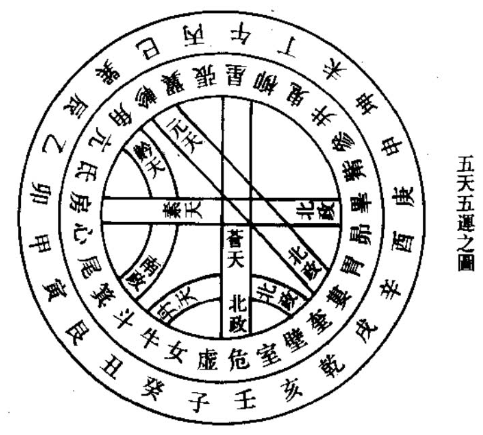
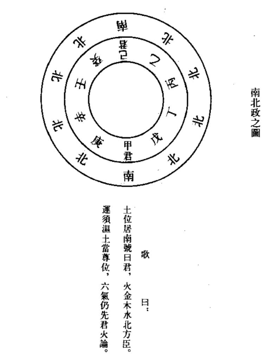
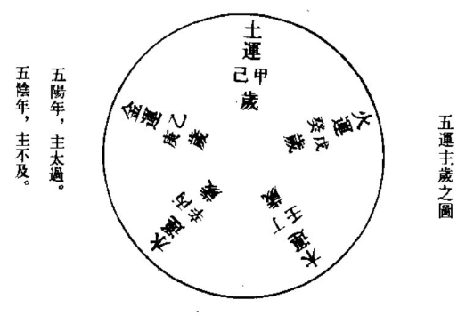
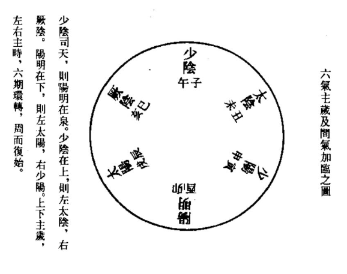
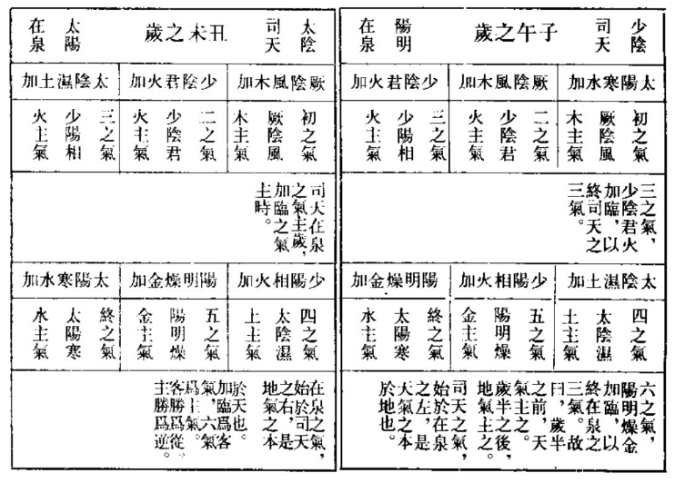
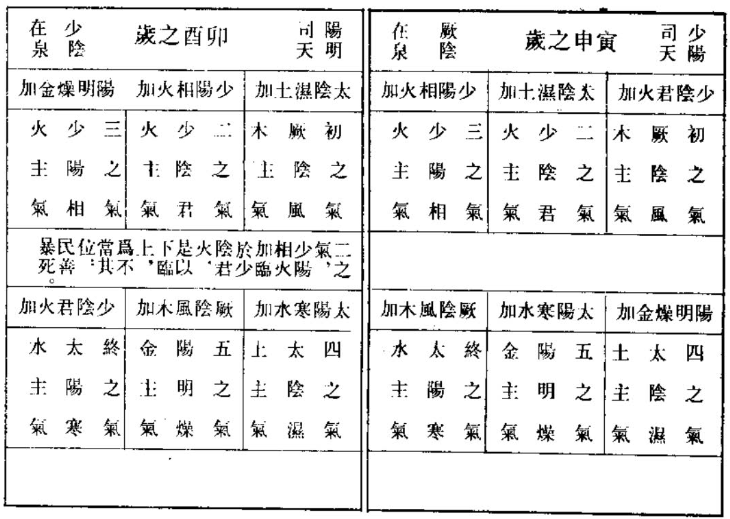
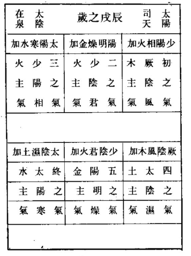
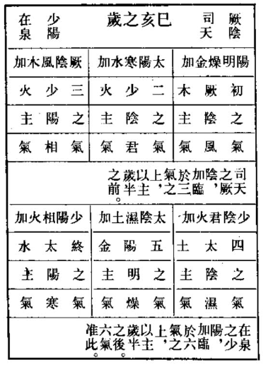

## 卷三十一  

### 天元纪大论篇第六十六  

【`马莳曰：自此篇及后五运行大论、六微旨大论、气交变大论、五常政大论、六元正纪大论、刺法论、本病论、至真要大论诸篇，皆论五运六气南北政。凡天时民病人事等义，至详至备，为医籍中至宝。其刺法、本病二篇，则遗亡矣。学者熟究，明其大义，则每年每月气候病证，治法无有不应。按《运气类注》云：五运属阴，守于地内；六气属阳，周于天外。其化生于人也，五运化生五脏属内，六气化生六腑十二经属外。其变病于人也，五运内变病于五脏，甚则兼外；六气外变病于六腑十二经，甚则入内。内外变极，然后死也。五运有乎气、太过、不及之殊，六气有常化、淫胜、反胜、相胜之异。五运平气者，其岁化生皆当本位，如平木气敷和之纪，其色苍其味酸之类是也。其变病皆在本脏，如木平气之病在肝也。太过者，岁变平气为太过，其化生皆兼非位，如太过发生之纪，其色青黄白，其味酸甘辛，如兼非位之土金是也。其变病皆在已所胜之脏，如木太过则木胜脾土而脾病也。其胜乃本气有余而胜，故不为他气报复，间有复者，是不务其德，暴虐失常也。不及者，岁变平气为不及，其化生亦兼非位，如木不及委和之纪，其果枣李，其味酸辛，亦兼非位之土金是也。其变病皆己所不胜者，乘虚胜之而本脏病，胜极则己所生者报复其胜，而胜者之脏亦病，如木不及则金胜之而肝病，胜则火复金雠而肺亦病也。其胜乃乘我之虚而胜，胜之根本不固，故为化气报复。凡此五运之气，皆有定纪者也。六气常化者，天地六位之化，各守常位，生病各当本处，其天地之常化，如厥阴司天，少阳在泉之岁，风化居上，火化居下，风病行于上，热病行于下之类，而不出他位也。其六位之常化，如厥阴司天之岁初之气化风燥，民病寒于右之下。二之气化寒热，民病热于中之类而不杂他气也。凡此六气之常化，皆有定纪，犹五运平气也。淫胜者，天地之气变常内淫而胜也。天地内淫而上胜于下，则己所胜之脏经，受邪而病甚。如厥阴司天风淫所胜，其病在足太阴脾经也。地气内淫而外胜于内，非病在足阳明胃经也。凡此六气之淫胜，犹五运之过，皆有胜无复。其胜之盛，虽有定纪，其胜之动否，则无定纪而不可必也。反胜相胜者，六位之左右变常，乘虚而胜也。其乘天地之虚而胜者为反胜，左右自有相胜，乘虚而胜者为相胜。皆视所虚之气侮不胜己者胜之，胜极则仍为虚者之子复之。如所虚之气属太阴，则所胜之气属厥阴，而病在脾胃经，所复之气属阳明，而病在肝胆经。盖天地岁气犹王也，左右步气犹诸侯，左右胜天地，犹诸侯僭乱，故曰反胜。左右自相胜，犹诸侯自相攻伐，故曰相胜。凡此六气之反胜、相胜，五运不及，故皆有胜有复。其气其动皆无定纪，但随虚而胜，随胜而复也。诸五运皆有定纪者，阴静有常也。六气少有定纪者，阳动多变也。五运之乎气之常化为常，其化生为常之常，变病为常之变，五运之太过不及，与六气之淫胜、反胜、相胜为变，其化生为变之常，变病为变之变，太过淫胜为变之盛，不及反胜、相胜为变之虚，察其常变以定生死，详其虚实以断补泻。王注不得经旨，不分常变，释六气胜复，无定纪之变，为有定纪之常，不分盛虚，释左右乘虚之相胜，为司天之淫胜，是则运气之义不明，自此始矣。后虽有林氏校正，孙氏考误，与夫托名所著《元珠密语》、《天元玉册》及诸家运气图说之类，然皆不能出王氏之右，而救其失，反使运气之义愈晦，而书愈繁。至于河间所注病机，其形容病化之情状，推究火热之众多，真有发前人未发之妙，奈何又以运气之所属皆为盛，而不察其所属各有盛虚，以盛虚所兼非位之化，皆为似而不察，其所兼之盛者似虚者，是为重失矣。夫王氏释变气为常气，相胜为淫胜，则人不识变，而占运气不应年辰。河间释运气之所属皆为盛，所兼非位之化皆为似，则人不识虚，而施治法不对病证。遂使世俗皆愀然不信而弃之也。其不知变者，曰某气司天属阴寒，今又炎热，某运合太过，今反不及，此乃上古之天道，非可占之于今世也。其不知虚者，曰某病属热，投寒剂不痊，某证当泻，施泻法反剧，此乃北方之治法，非可用之于南人也。惟戴人云，病如不是当年气，看与何年气运同，便向某年求活法，方知都在至真中之歌，似破世之惑，又引而不发。呜呼，有定纪之年辰，与无定纪之胜复，相错常变，今独求年辰之常，不求胜复之变，岂得运气之真哉？六气之盛寒盛热，与虚寒虚热，同其所属，今独求寒热之所属，不求寒热之盛虚，岂得寒热之情哉？苟以常变盛虚，观运气寒热，则古今南北，皆可一以贯之，而所谓参天地，赞化育，可知已。本篇末有署曰：天元纪，故名篇。`】  

【`张志聪曰：此篇总论五运主岁，六气司天，皆本乎天之运化，故曰天元纪大论。`】  

黄帝问曰：天有五行，御五位，以生寒暑燥湿风，人有五脏，化五气，以生喜怒忧思恐。论言五运相袭，而皆治之，终期之日，周而复始，予已知之矣。愿闻其与三阴三阳之候，奈何合之？鬼臾区稽首再拜对曰：昭乎哉问也！夫五运阴阳者，天地之道也，万物之纲纪，变化之父母，生杀之本始，神明之府也，可不通乎？故物生谓之化，物极谓之变，阴阳不测谓之神，神用无方谓之圣。夫变化之为用也，在天为元，在人为道，在地为化。化生五味，道生智，元生神。神在天为风，在地为木；在天为热，在地为火；在天为湿，在地为土；在天为燥，在地为金；在天为寒，在地为水。故在天为气，在地成形，形气相感而化生万物矣。然天地者，万物之上下也；左右者，阴阳之道路也；水火者，阴阳之征兆也；金木者，生成之终始也。气有多少，形有盛衰，上下相召而损益彰矣。帝曰：愿闻五运之主时也何如？鬼臾区曰：五气运行，各终期日，非独主时也。帝曰：请闻其所谓也。鬼臾区曰：臣积考《太始天元册》文曰，太虚寥廓，肇基化元，万物资始，五运终天，布气真灵，总统坤元，九星悬朗，七曜周旋，曰阴曰阳，曰柔曰刚，幽显既位，寒暑弛张，生生化化，品物咸章，臣斯十世，此之谓也。【`夫，音扶。`】  

【`王冰曰：御谓临御，化谓生化也。天真之气，无所不周，器象虽殊，参应一也。论谓六节脏象论，运谓五行应天之五运，各周三百六十五日而为纪者也。故曰，终期之日，周而复始也。帝以六合五数未参同，故问之也。道谓化生之道，纲纪谓生长化成收藏之纲纪也，父母谓万物形之先也，本始谓生杀皆因而有之也。夫有形禀气而不为五运阴阳之所摄者，未之有也。所以造化不极，为万物生化之元始者，何哉？以其是神明之府故也。然合散不测，生化无穷，非神明运为不能也。所谓化变者，圣神之道也。化施化，变散易，神无期也，圣无思也。气之施化故曰生，气之散易故曰极，无期禀候故曰神，无思测量故曰圣。由化与变，故万物无能逃五运阴阳，由圣与神，故众妙无能出幽元之理，深乎妙用，不可得而称之。天道元远，变化无穷。道谓妙用之道，经术政化，非道不成。在地为化，谓化生万物，非土气孕育，则形质不成也。化生五味，谓金石草木，根叶华实，酸苦甘淡辛咸，皆化气所生，随时而有也。智通妙用，唯道所生，故曰道生智。元远幽深，故生神也。神之为用，触遇元通，契物化成，无不应也。风者，教之始天之使，又天之号令。木东方之化，热应火为用，火南方之化；湿应上为用，土中央之化；燥应金为用，金西方之化；寒应水为用，水北方之化。神之为用，如上五化。木为风所生，火为热所炽，金为燥所发，水为寒所资，土为湿所全，盖初因而成立也。虽初因之以化成，卒因之以败散尔。岂五行之独有是哉？凡因所因而成立者，悉因所因而散落尔。气谓风热湿燥寒，形谓木火土金水，此造化生成之大纪，天覆地载，上下相临，万物化生，无遗略也。由是故万物自生自长，自化自成，自盈自虚，自复自变也。夫变者何？谓生之气极本而更始化也。天有六气御下，地有五行奉上。当岁者为上主司天，承岁者为下主司地。不当岁者二气居右，北行转之；二气居左，南行转之。金木水火运北面正之常，左为右，右为左，则左者南行，右者北行而反也。以水火之寒热，彰阴阳之先兆也。木主发生应春，春为生化之始。金主收敛应秋，秋为成实之终。终始不息，其化常行，故万物生长化成收藏自久。气有多少，谓天之阴阳多少不同秩也。形有盛衰，谓五运之气有太过不及也。由是多少盛衰，天地相召，而阴阳损益，昭然可见也。一运之日，终三百六十五日四分度之一，乃易之非主一时，当其王相囚死而为绝法也。气交之内迢然而别有之也。　《天元册》所以纪天真元气运行之纪也。自神农之世，鬼臾区十世祖，始诵而行之。此太古占候灵文，洎乎伏羲之时，已镌诸玉版，命曰册文，太古灵文，故命曰《太始天元册》也。太虚谓空元之境，真气之所充，神明之宫府也。真气精微，无运不至，故能为生化之本始，运气之真元矣。终天，谓一岁三百六十五日四分度之一也。终始更代，周而复始也。言五运更统于太虚，四时随部而迁复，六气分居而异主，万物因之以化生，非曰自然，其谁能始？故曰万物资始。夫太虚真气无所不至也，气齐生有故禀气含灵者，抱真气以生焉。总统坤元，言天元气常司地气，化生之道也。九星上古之时也。上古世质人淳，归真返朴，九星悬朗，五运齐宣。中古道德稍衰，标星藏曜，故计星之见者七焉。九星，谓天蓬、天芮、天冲、天辅、天禽、天心、天任、天柱、天英，此盖从标而为始也。七曜，谓日月五星，为举动吉凶之信也。周谓周天之度，旋谓左循天度而行五星之行，犹各有进退高下小大矣。阴阳，天道也；柔刚，地道也。天以阳生阴长，地以柔化刚成也。幽显既位，言人神各得其序；寒暑弛张，言阴阳不失其宜也。人神各守所居，无相干犯；阴阳不失其序，物得其宜。天地之道且然，人神之理亦犹也。上生，谓生之有情有识之类；下生，谓生之无情无识之类。上化，谓形容彰显者也；下化，谓蔽匿形容者也。有情有识，彰显形容，天气主之；无情无识，蔽匿形质，地气主之，禀元灵气之所化育尔。`】  

【`马莳曰：此言五运治政令于内，合于六气之治政令于外者也。五行者，金木水火土也。在天则为天干之五行，如甲乙属木之类。然在运则为气化之五行，如甲己化土之类；在中运则为甲己太宫少宫之类。在地则为地支之五行，如子丑寅卯之类。然在岁气则为子午，属少阴君火之类。故天有五行生六气，天之六气又生在地有形之五行，无非五行之妙也。五位者，东西南北中央也。寒暑燥湿风火者，即六气也。五脏者，心肝脾肺肾也。五气者，五脏之气也。喜怒思忧恐者，五志也。论者，谓六节脏象论也。三阴者，少阴太阴厥阴也。三阳者，少阳太阳阳明也。帝问天地初分之时，天分五气，地列五行，五行定位，布政于四方，五气分流，散支于十干，当是时黄气横于甲己，白气横于乙庚，黑气横于丙辛，青气横于丁壬，赤气横于戊癸，故甲己应土运，乙庚应金运，丙辛应水运，丁壬应木运，戊癸应火运。天有此五行之气，以御于东西南北中央之五位，而寒暑燥湿风火所由以生。不言火者，暑该之也。后五运行大论有东方生风、南方生热等语，及在天为风、在天为热等语，皆是也，正谓之六气也。在人则有心肝脾肺肾之五脏，以化五脏之气，而喜怒思忧恐之五志，所由以生也。六节脏象论有云：五日谓之候，言五日即有一候，如立春初五日东风解冻之类。三候谓之气，言半月有三候则为一气，如立春正月节为一气之类。六气谓之时，言六气则有三月而为一时，如自立春、雨水、惊蛰、春分、清明、谷雨而为春，自立夏、小满、芒种、夏至、小暑、大暑而为夏之类。四时则合春夏秋冬而为一岁，皆各从其所旺之时而主治之。木而火，火而土，土而金，金而水，水而木，五运之气，相为承袭而皆治之。每终一岁之日，周而复始，今岁之候如此，明岁之候亦然，故曰不知年之所加，气之盛衰，虚实之所起，不可以为工矣。帝言已知五运相袭而皆治之，终期之日，周而复始，但五运者，地之木火土金水，治政令于内政也。三阴三阳者，天之风热湿燥寒，治政令于外者也。故五运相袭而治者，其于三阴三阳外治之候，如何合之？区言太极分为阴阳，阴阳分为五行，故五行一阴阳，阴阳一太极。彼五运乃天地初分之气，而列之于五方者也。阴阳者，虽有三阴三阳之分，而天气运气地气举不能外之也。天干主于降，地支主于升，而五运则主于升降，而行于天地之间，乃谓之中运也。是之谓天地之道也。万物以之而为纲纪，其变化以之而为父母，其生杀以之而为本始，真有神明以为之府也，可不通此理乎？盖万物之初生谓之化，物之已极谓之变，其阴阳莫测谓之圣，神用无方谓之神。由化与变，故万物无能逃五运阴阳。由圣与神，故众妙无能出幽元之理。其变化神圣之为用也，合天地人之理而一之者也。在天为元，其理元远，而元之所生者为神。在人为道，其性咸备，而道之所生者为智。在地为化，孕育万物，而化之所生者为五味。惟元生神而为风为热为湿为燥为寒，此乃三阴三阳之气也。故风之气为木，热之气为火，湿之气为土，燥之气为金，寒之气为水，而成五运之形。由是在天之气，与在地之形相感，而化生万物也。然天地者，万物之上下，谓岁上下见阴阳之所在也。左右者，阴阳之道路，如五运行大论曰：左右者，诸上见厥阴，左少阴，右太阳；见少阴，左太阴，右厥阴；厥阴在上，则少阳在下，左阳明，右太阴；少阴在上，则阳明在下，左太阳，右少阴之类是也。此在天三阴三阳之气，右旋于外以加地也。水火者，阴阳之征兆，谓以水火之寒热，彰信阴阳之先兆也。金木者，生成之终始，谓木主发散应春，春为生化之始，金主收敛应秋，秋为成实之终也。此在地五运之形，左转于内以临天也。天上之气有多少，地下之形有盛衰，故天上多少之气，与地下盛衰之形，相召而损益彰，以为物极之变也。其气之多与形之盛相召者益，益为变之盛也。气之少与形之衰相召者损，损为变之虚也。盖物生之化者，天地之常气，在五运曰平气，在六气曰常化也。物极之变者，天地之变气在五运曰太过不及，在六气曰淫胜反胜相胜也。其变之盛者，则五运之太过，六气之淫胜也。其变之虚者，则五运之不及，六气之反胜相胜也。凡此五运六气，所谓变化盛虚，本经后篇千言万语，皆所以发明此四者也。五运气行，各终期日，非独主时者，言木火土金水，治政各终一岁之期日，不独治岁内六步之时令也。六节脏象论但论五运不及六气，但论主时不及治岁，今始于此篇论五运六气相感相召而治，不独五运也。次论五运各治一岁，不独主时也。帝复问其所谓，区乃以《太始天元册》文，征之太虚者，无极也。廖廓者，无有边际之义。肇基，开始也。化元者。生化万物之根元也。五运者，木火土金水运也。承上文言太虚肇基万物之化元，而万物得之以成其始，五运流行，与天终始而不变也。真灵者，即太虚之精也。天以六气布其真灵，右旋于外，以加于地；地以五运左旋于内，以临于天。然天包地而地随天，则干元之资始，实所以总统坤元之资生也。故于干元资始，而曰乃统天；坤元资生，而曰乃顺承天，正此节之大旨。九星：天蓬一，水正之宫也；天芮二，土神之应宫也；天冲三，木正之宫也；天辅四，木神之应宫也；天禽五，土正之宫也；天，心六金神之应宫也；天柱七，金正之宫也；天任八，火神之应宫也；天英九，火正之宫也。七曜，谓日月金木水火土星也。运行于天，有迟有速，有顺有逆，犹人君之有政事也。阴阳柔刚，言天道资始，阴阳而已，地道资生，刚柔而已。两阴交尽，故曰幽；两阳合明，故曰显。幽显之配，寒暑之异也。生生化化，品物咸章者，言生生不绝，化化无穷也。臣斯十世，此区自言传习此义，十世于兹，不敢废坠也。`】  

【`张志聪曰：天有五行者，丹黅苍素元之五气也。五位，五方之位，地之五行也。寒暑燥湿风，天之六气也。盖言天之五气，经于十干之分；十干之气，以化地之五行；地之五行，以生天之六气也。五脏，五行之所生也。五气，五行之气，风热湿燥寒也。喜怒忧思恐，五脏之神智也。夫在天为气，在地成形，形气相感而万物化生，人本乎地之五行而成此形，以有形之五脏，化五气，生五志，而复通乎天气也。三阴三阳者，子午之岁，少阴主之；丑未之岁，太阴主之；寅申之岁，少阳主之；卯酉之岁，阳明主之；辰戌之岁，太阳主之；巳亥之岁，厥阴治之。盖五运独主一岁，三阴三阳之主岁，有司天在泉间气客气，故曰，五运相袭，而皆治之。帝言五运之气递相沿袭，而一岁皆为之主治，终期年之三百六十五日，周而复始，其与三阴三阳之主岁相合，何以候之？曰，天之十干，运化地之五行；地之五行，上呈三阴三阳之六气。故曰，五运阴阳者，天地之道也。六微旨论曰：物之生从于化，物之极由乎变。变化之相薄，成败之所由也。五常政论曰：气始而生化，气散而有形，气布而蕃育，气终而象变。阴阳者，天地之道也，阴中有阳，阳中有阴，莫可穷测，用施于四时，变化乎万物，无可矩量者也。五味，五行之所生也，万物之有情有性者，莫不具五行之气味，故曰化生五味也。能循乎天理之自然，则是非邪正，自然分别，而运无不周，故曰道生智也。夫风寒热燥湿，天之阴阳也。木火土金水，地之阴阳也。故在天为气，在地成形，形气相感而万物化生也。天地者，万物之上下，言天覆地载，而万物化生于其间。左右者，阴阳之道路，言阴阳之气，左右旋转之不息。水火为阴阳之征兆，言天一生水，地二生火，火为阳，水为阴，阴阳不可见，而水火为阴阳之征验。盖水火即阴阳，在先天止有水火，至后天而始备五行。木主春令，其气生长而生万物，金主秋令，其气收敛而成万物，故为生成之始终。夫在天为气，而气有多少；在地成形，而形有盛衰。上下相感，而太过不及之气，昭然彰着矣。时，四时也，谓木运主春，火运主夏，土运主长夏，金运主秋，水运主冬也。然五运之气，各终期年之三百六十五日，终而复始，非独主于时也。盖五运主时，乃四时寒热温凉之气。主岁者，五行太过不及之年也。《天元册》乃太古之文，所以纪天真元气运行之书也。太虚，谓空元之境，大气之所充，神明之宫府也。化原，造化之本元也。终天者，日日行一度，五运各主一岁，终周天之三百六十五度四分度之一也。万物借化元而始生五行，终天运而无已。真灵者，人与万物也。总统坤元者，地居天之中，天包乎地之外也。九星悬朗于天下，应九州之分野。七曜，虞书谓之七政。周谓周天之度，旋谓左循天度而行。阴阳柔刚者，《易》曰，立天之道曰阴与阳，立地之道曰柔与刚也。阳主昼，阴主夜，幽显既位者，阴阳定位也。寒暑弛张者，寒暑往来也。天地絪缊，黄物化醇，此所以生生不息，化化无穷，而品物成章矣。所谓积考《太始天元册》文者，此之谓也。`】  

帝曰：善。何谓气有多少，形有盛衰？鬼臾区曰：阴阳之气，各有多少，故曰三阴三阳也。形有盛衰，谓五行之治，各有太过不及也。故其始也，有余而往，不足随之；不足而往，有余从之。知迎知随，气可与期。应天为天符，承岁为岁直，三合为治。　　【`王冰曰：由气有多少，故随其升降分为二别也。气至不足，太过迎之；气至太过，不足随之。天地之气，亏盈如此，故云形有盛衰也。始，谓甲子岁也。始甲子之岁，三百六十五日，所禀之气当不足也。次而推之，终六甲也。故有余已则不足，不足已则有余。亦有岁运非有余非不足者，盖以同天地之化也。若余已复余，少已复少，则天地之道变常，而灾害作，苛疾生矣。应天，谓木运之岁，上见厥阴；火运之岁，上见少阳少阴；土运之岁，上见太阴；金运之岁，上见阳明；水运之岁，上见太阳。此五者天气下降，如合符运，故曰应天为天符也。承应，谓木运之岁，岁当亥卯；火运之岁，岁当寅午；土运之岁，岁当辰戌丑未；金运之岁，岁当巳酉；水运之岁，岁当申子。此五者岁之所直，故曰承岁为岁直也。三合，谓火运之岁，上见少阴，年辰临午；土运之岁，上见太阴，年辰临丑未；金运之岁，上见阳明，年辰临酉。此三者天气运气与年辰俱会，故云三合为治也。岁直亦曰岁位，三合亦为天符。`】  

【`马莳曰：此承上文而明气有多少，形有盛衰之义，不外乎天气地气运气而已。阴阳之气各有多少者，谓三阴三阳之气各分多少，阴多者为太阴，次少者为少阴，又次者为厥阴也。阳多者为太阳，次少者为阳明，又次者为少阳也。形有盛衰，谓五行之治，各有太过不及者也。五运之形各有盛衰，土有太少宫，金有太少商，水有太少羽，木有太少角，火有太少征，而太者太过，少者不及也。六微旨大论曰：天气始于甲，地气始于子，子甲相合，命曰岁立。《运气全书》曰：运有盛衰，气有虚实，更相迎随以司岁也。阳盛阴衰，如土运甲阳而己阴。阴虚阳实，如六气子实而丑虚。迎随如六十甲子，一阳一阴，盛衰虚实，递相接送以司岁。次而推之，以终六甲，故有余已则不足随，不足已则有余从，亦有岁运非有余非不足者，盖以同天地之化也。若余已复余，少已复少，则天地之道变常，而灾害苛疾至矣。知其来而迎之，知其往而随之，则岁气自可与期也。应天为天符者，六微旨大论曰：木运之岁，上见厥阴之类。盖司天与运气相符，故曰应天为天符也。又六元正纪大论曰，戊子戊午，太征，上临少阴；戊寅戊申，太征，上临少阳；丙辰丙戌，太羽，上临太阳。如是者三。丁巳丁亥，少角，上临厥阴；乙卯乙酉，少商，上临阳明；己丑己未，少宫，上临太阴。上者，谓司天也，如是者三。承岁为岁直者，当年十干建运，与年辰十二律五行相会，故又曰岁会，气之平也。不分阴年阳年，乃自取四时正中之月，为四直承岁子午卯酉是也。其土无定位，各寄王于四季之末，一十八日有奇，则通论承岁辰戌丑未是也。计有八年，如木运之岁，岁当寅卯之类。六微旨大论曰：非其位则邪，当其位则正。邪则变甚，正则微。帝曰：何谓当位？岐伯曰：木运临卯，火运临午，金运临酉，水运临子，所谓岁会，气之平也，然岁直亦曰岁会，则直为值之义耳。三合者，谓火运之岁，上见少阴，年辰临午，即戊午岁也；土运之岁，上见太阴，年辰临丑未，即己丑己未岁也；金运之岁，上见阳明，年辰临酉，即乙酉岁也。此三者，天气运气与年辰俱会，故曰三合为治也。三合亦为天符。六微旨大论曰：太乙天符，谓天运与岁俱会也。按应天为天符三句，止论天符岁会太乙天符，不论及同天符同岁会之义，盖天符主司天而言，岁会主年辰而言，同天符同岁会主在泉而言之矣。六元正纪大论云：甲辰甲戌，太宫，下加太阴；壬寅壬申，太角，下加厥阴；庚子庚午，太商，下加阳明，如是者三。癸巳癸亥，少征，下加少阳；辛丑辛未，少羽，下加太阳；癸卯癸酉，少征，下加少阴，如是者三。帝曰：加者何谓？岐伯曰：太过而加同天符，不及而加同岁会也。下者，即在泉也。运气与在泉合，其气化阳年曰同天符，阴年曰同岁会。故六十年中，太乙天符四年，天符十二年，岁会八年，同天符六年，同岁会六年。五者分而言之，共三十六年；合而言之，止有三十二年。经言二十四岁者，不言岁会也，不可不审。`】  

【`张志聪曰：太阳少阳少阴，运行先天而主有余；阳明太阴厥阴，运行后天而主不足，此三阴三阳之气有多少也。形谓五行之有形也。五形之治，各有太过不及者，谓五运之主岁，如诸壬年之木运太过，则诸丁年之木运不及矣；诸戊年之火运太过，诸癸年之火运不及矣；诸甲年之土运太过，诸己年之土运不及矣；诸庚年之金运太过，诸乙年之金运不及矣；诸丙年之水运太过，诸辛年之水运不及矣。如甲年之土运太过，则乙年之金运不足随之；子年之少阴有余，则丑年之太阴不足随之。所谓有余而往，不足随之也。如乙年之金运不及，则丙年之水运有余从之；丑年之太阴不足，则寅年之少阳有余从之。所谓不足而往，有余从之也。迎，往也。随，来也。知岁运之往来，则太过不及之气，可与之相期而定矣。其六十岁之中，又有天符岁会三合主岁，此为平气之年，无太过不及者也。所谓天符者，土运之岁，上见太阴之类，乃五运之气，与司天之气相合，故为天符直会也。谓木运临卯，火运临午，土运临四季，金运临酉，水运临子，乃地支之主岁，与五运之主岁，五行之气，正值会合，故曰岁合。三合者谓司天之气，五运之气，主岁之气，三者相合，又名太乙天符，此皆平气之年，无太过不及者也。俱详注六微旨论。`】  

帝曰：上下相召，奈何？鬼臾区曰：寒暑燥湿风火，天之阴阳也，三阴三阳上奉之。木火土金水火，地之阴阳也，生长化收藏下应之。天以阳生阴长，地以阳杀阴藏。天有阴阳，地亦有阴阳。木火土金水火，地之阴阳也，生长化收藏，故阳中有阴，阴中有阳。所以欲知天地之阴阳者，应天之气动而不息，故五岁而右迁；应地之气静而守位，故六期而环会。动静相召，上下相临，阴阳相错，而变由生也。帝曰：上下周纪，其有数乎？鬼臾区曰：天以六为节，地以五为制。周天气者，六期为一备。终地纪者，五岁为一周。君火以明，相火以位。五六相合，而七百二十气为一纪。凡三十岁千四百四十气，凡六十岁而为一周。不及太过，斯皆见矣。　　【`王冰曰：太阳为寒，少阳为暑，阳明为燥，太阴为湿，厥阴为风，少阴为火，皆其元在天，故曰，天之阴阳也。木，初气也；火，二气也；相火，三气也；土，四气也；金，五气也；水终气也。以其在地应天，故云下应。然气在地，故曰地之阴阳。天有阴，故能下降；地有阳，故能上腾。阴阳交泰，故化变由之成也。阴阳之气，极则过亢，故各兼之。阴阳应象大论曰：寒极生热，热极生寒。又曰：重阴必阳，重阳必阴。言气极则变也，故阳中兼阴，阴中兼阳。《易》之卦，离中虚，坎中满，此其义象[象：原脱，据《素问?天元纪大论篇》王冰注文补。]也。五岁而右迁，谓天有六气，地有五位，天以六气临地，地以五位承天，盖以天气不加君火故也。以六加五，则五岁而余一气，故迁一位，若以五承六，则常六岁乃备尽天元之气，故六年而环会，所谓周而复始也。地气左行，往而不返，天气东转，常自火运数五岁已，其次气正当君火之上，法不加临，则右迁君火气上以临相火之上，故曰五岁而右迁也。由斯动静，上下相临，而天地万物之情，变化之机可见矣。天地之道，变化之微，其由是而生焉。六节，谓六气之分。五制，谓五位之分。位应一岁，气统一年，故五岁为一周，六年为一备。备谓备历天气，周为周行地位，所以地位六而言五者，天气不临君火也。然君火在相火之右，但立名于君位，不立岁气，故天之以气不偶，其气以行君火之政，守位而奉天之命，以宣行火令尔。以名奉天，故曰君火以明。守位禀命，故曰相火以位。历法一气十五日，因而乘之，积七百二十气即三十年，积千四百四十气即六十年也。经云：有余而往，不足随之；不足而往，有余从之。故六十年中，不及太过，斯皆见矣。`】  

【`马莳曰：此承上文论上下相召之义，而合之以周纪之数也。上文言气有多少，形有盛衰，上下相召而损益彰，故帝以上下相召之义问之。区言上者天也，下者地也，上下相召者，天右旋之阴阳加于地下，地左转之阴阳临于天上，而相召以治岁治步也。天之阴阳，风热燥湿寒，又增火为六数者，在天之热，分为暑火二气，故三阴三阳各上奉之也。地之阴阳，木火上金水，亦增火为六数者，在地之火分为君相二形，故生长化收藏各下应之也。生长者天之道，藏杀者地之道。天阳主生，阳中有阴，故以阳生阴长。地阴主杀，阴中有阳，故以阳杀阴藏。天地虽高下不同，而各有阴阳之运用。天惟有阴，故能下降；地惟有阳，故能上升，是以谓之各有阴阳也。即如木火土金水火，地之阴阳也，生长化收藏，故阳中有阴，阴中有阳。所以欲知天地阴阳者，天之阴阳下加地气，共治岁也，则应天之气，动而不息，盖地之治岁，君火不主运，惟五运循环，故天之六气加之，常五岁而右余一气，与地迁移一位而动不息也。地之阴阳，上临天气，共治步也，则应地之气静而守位，盖地之治步，其木君相土，金水皆各主一步以终期，故其上临天之六气共治也。常六期齐周复于始治之步，环会而静守位也。故治岁动者与治步静者相召，外旋上者与内运下者相临，则阴阳相错，而损益盛虚之变所由生也。天以六为节，地以五为制者，上下相召之数也。盖天之六气各治一岁，故六期一备；地之六位，其君火以明，相火以位，故五岁一周。五六相合，凡三十岁为一纪，六十岁为一周，其间相错之阴阳，或气类同多而益，为太过之盛者，或气类异少而损，为不及之虚者，斯皆可见其变也。`】  

【`张志聪曰：寒暑燥湿风火，天之六气也。太阳之上，寒气主之；少阴之上，热气主之；阳明之上，燥气主之；太阴之上，湿气主之；厥阴之上，风气主之；少阳之上，火气主之。是三阴三阳，上奉天之六气也。木火土金水火，地之五行也。在春主木而主生，在夏主火而主长，长夏主土而主化，在秋主金而主收，在冬主水而主藏，是以生长化收藏下应之。盖天之五气，运化地之五行，地之五行，上呈天之六气，是以上下相感召，而三阴三阳之气，天地之所共有，故下文曰，天有阴阳，地亦有阴阳也。夫岁半以上，天气主之，是春夏者，天之阴阳也，故天以阳生阴长。岁半以下，地气主之，是秋冬者，地之阴阳也，故地以阳杀阴藏。盖司天之气，主上半岁，在泉之气，主下半岁，故曰岁半以上，天气主之，岁半以下，地气主之。然司天之气，始于地之左，在泉之气，本乎天之右。天地之气互相感召，而共主一岁，又非独天主上半岁，而地主下半岁也。夫风寒暑湿燥火，三阴三阳上奉之，是天有阴阳也。木火土金水火，生长化收藏，下应之，是地有阴阳也。夫天为阳，而天有三阴三阳之气，是阳中有阴也。地为阴，地有三阴三阳之气，是阴中有阳也。应天之气者，丹黅苍素元之气也，动而不息。五岁而右迁者，自甲而乙，乙而丙，内而丁，丁而戊，五运之气已终，而复起五运也。应地之气者，木火土金水火之气也。静而守位，六期而环会者，自子而丑，丑而寅，六岁已周，至午岁而复起少阴也。动静相召者，天地之气相感也。上下相临者，天之五气，下御地之五行，地之木火土金水火，上临天之六气，是以天五地六，天六地五，阴阳交错而变生。三十年之一纪，六十岁之一周也。夫天之五气，经于十干之分，运化地之五行，是天五地五也。地之木火七金水火，分主十二支之位，子午少阴君火司天，丑未太阴湿土司天，寅申少阳相火司天，卯酉阳明燥金司天，辰戌太阳寒水司天，巳亥厥阴风木司天，是地六天六也。是以上文云，应天之气，五岁而右迁，应地之气，六期而还会，下文云，周天气者，六期为一备，终地纪者，五岁为一周也。上下周纪者，天干地支，五六相合，凡三十岁为一纪，六十岁为一周也。天以六为节者。以三阴三阳为节度也。地以五为制者，以五行之位为制度也。周天气者，子属少阴君火司天，丑属太阴湿土司天，寅属少阳相火司天，卯属阳明燥金司天，辰属太阳寒水司天，巳属厥阴风木司天，六期为三阴三阳之一备。终地纪者，甲主土运，乙主金运，丙主水运，丁主木运，戊主火运，五岁五运之一周，是以君火以明而在天，相火以位而在下。盖言地以一火而成五行，天以二火而成六气也。十五日为一气，五运六气相合而主岁，一岁凡二十四气，计七百二十气为一纪。纪，小会也。盖以五六为三十，六五亦为三十，故以三十岁为一会，自甲子而终于癸亥，凡六十岁为一周，其太过不及之气，于此皆可见矣。`】  

帝曰：夫子之言，上终天气，下毕地纪，可谓悉矣。余愿闻而藏之，上以治民，下以治身，使百姓昭著，上下和亲，德泽下流，子孙无忧，传之后世，无有终时，可得闻乎？鬼臾区曰：至数之机，迫迮以微，其来可见，其往可追，敬之者昌，慢之者亡，无道行私，必得天殃，谨奉天道，请言真要。帝曰：善言始者，必会于终。善言近者，必知其远。是则至数极而道不惑，所谓明矣。愿夫子推而次之，令有条理，简而不匮，久而不绝，易用难忘，为之纲纪。至数之要，愿尽闻之。鬼臾区曰：昭乎哉问！明乎哉道！如鼓之应桴，响之应声也。臣闻之：甲己之岁，土运统之；乙庚之岁，金运统之；丙辛之岁，水运统之；丁壬之岁，木运统之；戊癸之岁，火运统之。帝曰：其于三阴三阳合之奈何？鬼臾区曰：子午之岁，上见少阴；丑未之岁，上见太阴；寅申之岁，上见少阳；卯酉之岁，上见阳明；辰戌之岁，上见太阳；巳亥之岁，上见厥阴。少阴所谓标也，厥阴所谓终也。厥阴之上，风气主之；少阴之上，热气主之；太阴之上，湿气主之；少阳之上，相火主之；阳明之上，燥气主之；太阳之上，寒气主之。所谓本也，是谓六元。帝曰：光乎哉道！明乎哉论！请着之玉版，藏之金匮，署曰天元纪。【`迮，音窄。`】  

【`王冰曰：安不忘危，存不忘亡，大圣之至教也。求民之瘼，恤民之隐，大圣之深仁也。行私谓传非其人，授于情狎，及责求民利者，然必申誓戒于君主，乃明言天道至真之要旨。数术明着，应用不差，故远近于言，始终无谬也。太始，谓天地初分之时，阴阳析位之际，天分五气，地列五行，五行定位，布政于四方，五气分流，散支于十干。终谓当三甲六甲之终，三阴三阳为标，寒暑燥湿风　　火为本，故云所谓本也。天真元气分为六化，以统坤元生成之用，征其应相，则六化不同，本其所生，则正是真元之一气，故曰六元也。`】  

【`马莳曰：此承上文而明五运所统，三阴三阳所合，合者为标，而主之者为本也。言天地初分之时，黄气横于甲己，故甲己应土运，而甲己之岁，土运统之。白气横于乙庚，故乙庚应金运，而乙庚之岁，金运统之。黑气横于丙辛，故丙辛应水运，而丙辛之岁，水运统之。青气横于丁壬，故丁壬应木运，而丁壬之岁，木运统之。赤气横于戊癸、故戊癸应火运，而戊癸之岁，火运统之。然子午之岁，上见少阴热气；丑未之岁，上见太阴湿气；寅申之岁，上见少阳相火；卯酉之岁，上见阳明燥气；辰戌之岁，上见太阳寒气；巳亥之岁，上见厥阴木气。则上见少阴太阴少阳阳明太阳厥阴者，不过谓之标耳。标者，犹所谓上首也。自少阴子午而数至厥阴已亥，故曰厥阴为三甲六甲之终也。实由天有风气，以为厥阴之主；天有热气，以为少阴之主；天有湿气，以为太阴之主；天有相火，以为少阳之主；天有燥气，以为阳明之主；天有寒气，以为太阳之主，则有此天之六元以为之本也。何也？天真元气，分为六化，以统坤元生成之用，征其应用，止是真元之一气，故曰六元也。须知天地之数五，而火热居三，可见天地间热多于寒，火倍于水，而人之病化可推也。惟运分为五，则上文地五岁一周之数，标分为六，则上文天六期一备之数，皆从兹始也。`】  

【`张志聪曰：此以下复申明五运六气之主岁，周而复始，循环无端，使天下万世，子孙黎民，知天地阴阳之数，不罹灾眚之患，此皆圣人忧民之心，德泽下流之不穷也。至数者，太过不及之定数。机者，先期而动也。言气机之动甚微，能追思已往之气，则其来者可知。如敬畏者，则灾眚可避，忽慢者，必罹天殃。无道，谓不修养生之道。行私，谓放纵嗜欲也。真要，至真之要道也。夫阴阳之道，自始至终，由近至远，简而明，易而难，有条有理，有纪有纲也。然阴阳之道，昭也明也，能明乎斯道，如桴鼓声响，未有不相应者矣。运，化运也。统者，五运相袭而皆治之也。合者，以五运而合六气，以天干而合地支也。标，高也。子午为少阴君火，君为尊，故以少阴为始，而标见于上，厥阴为阴之尽，故以厥阴为终。阴极而一阳之子又复矣。风寒暑湿燥火，在天之六气也。三阴三阳合于地之十二支，而上奉天之六气，是以天气为本，而三阴三阳为标。故下文曰，本之下，中之见也。见之下，气之标也。六元者，谓天有此三阴三阳之六气，地亦有此三阴三阳之六气，天地浑元，上下相召，是以六气司天而六气在泉也。着之玉版，藏之金匮，垂永久，示贵重也。`】  

## 卷三十二  

### 五运行大论篇第六十七  

 【`马莳曰：内论司天在泉左右及南北政等义，皆五运以为运行，故名篇。`】  

黄帝坐明堂，始正天纲，临观八极，考建五常，请天师而问之曰：论言天地之动静，神明为之纪，阴阳之升降，寒暑彰其兆。予闻五运之数于夫子，夫子之所言，正五气之各主岁耳。首甲定运，予因论之。鬼臾区曰：土主甲己，金主乙庚，水主丙辛，木主丁壬，火主戊癸。子午之上，少阴主之；丑未之上，太阴主之；寅申之上，少阳主之；卯酉之上，阳明主之；辰戌之上，太阳主之；巳亥之上，厥阴主之。不合阴阳，其故何也？岐伯曰：是明道也。此天地之阴阳也。夫数之可数者，人中之阴阳也，然所合数之可得者也。夫阴阳者，数之可十，推之可百，数之可千，推之可万。天地阴阳者，不可【`可　《素问?天元纪大论》无此字。`】以数推以象之谓也。帝曰：愿闻其所始也。岐伯曰：昭乎哉问也！臣览《太始天元册》文，丹天之气，经于牛女戊分；黅天之气，经于心尾己分；苍天之气，经于危室柳鬼；素天之气，经于亢氏昴毕；元天之气，经于张翼娄胃。所谓戊己分者，奎壁角轸，则天地之门户也。夫候之所始，道之所生，不可不通也。【`夫，音扶。第一三六数字，并去声，余上声。黅，音今。`】  

【`王冰曰：明堂，布政宫也。八极，八方目极之所也。五常，谓五气行天地之中者也。首甲，谓甲子年也。上古圣人，仰观天象，以正阴阳。夫阴阳之道，非不昭然，而人昧宗元，迷其本始，则百端疑议，从是而生。黄帝恐至理真宗，便因诬废，愍念黎庶，故启问之。天师知道出从真，必非谬述，故对上曰，是明道也，此天地之阴阳也。使智识褊浅，不见源由，虽所指弥远，其知弥近，得其元始，桴鼓非遥。夫戊土属干，己土属巽，《遁甲经》曰，六戊为天门，六己为地户是也。`】  

【`马莳曰：此复论前文五运六气所化阴阳之义也。五天之象所经星宿为运气之化，皆干与支同属者及连位者齐化也。彼土主甲己，及丑未之上，太阴主之者，正由黅天之气，经于心尾己分之象，而心尾者甲地，己分者中宫，故甲与丑连位，己与未同属，而齐化湿土也。金主乙庚，及卯酉之上，阳明主之者，正由素天之气，经于亢氐昴毕之象，而氐亢者乙地，昴毕者庚地，故乙与卯同属，庚与酉连位，而齐化燥金也。水主丙辛，及辰戌之上，太阳主之者，正由元天之气，经于张翼娄胃之象，而张翼者丙地，娄胃者辛地，故丙与辰连位，辛与戌同属，而齐化寒水也。木主丁壬，及巳亥之上，厥阴主之者，正由苍天之气，经于危室柳鬼之象，而危室者壬地，柳鬼者丁地，故壬与亥同属，丁与巳连位，而齐化风木也。火主戊癸，及子午之上，少阴主之，寅申之上，少阳主之者，正由丹天之气，经于牛女戊分之象，而牛女者癸地，戊分者中宫，故癸与子同属，戊与午连位，而齐化火热也。干之甲乙属木位东，丙丁属火位南，庚辛属金位西，壬癸属水位北，戊己属土位中宫。支之寅卯配甲乙，巳午配丙丁，申酉配庚辛，亥子配壬癸。辰位东南，未位西南，戌位西北，丑位东北，为四维，属戊己。故乙卯同属木，丁巳同属火，己未同属土，辛酉同属金，壬癸亥子同属水也。甲寅位东之首，癸丑位北方尾，而甲丑连位癸寅连位也。丙位南之首，辰位东之尾，而丙辰连位也。戊己位木火金水中间，在天地为门户，在四时为长夏，南连午，西连申，而戊己午申连位，故戊己无方位，而经独表戊分己分也。辛戌皆位酉之尾，而辛戍连位也。独戊火连申夹未土于中，癸火连寅夹丑土于中者，盖湿土在中火，游行其间，在天居土前，在地居土后，而土火常相混也，故土旺长夏火热之内。丹溪发明湿热相火为病，十居八九，及有湿郁生热，热久生湿之论，良以此也。其五天之象所经星宿分野，独当五运之干位，不及六气之支位者，盖干之与支，即根本之与枝叶，经言干则支在其中矣。故其化皆干与支之同属者连位。齐化者，是根本与枝叶同化者也。夫五气之至，各有五色，经于分野，气太过则先天而至，气不及则后天而至，尝以寅卯前候之自然可见，故曰，候之所始，道之所生，不可不通也。`】  

【`张志聪曰：天纲，天之度数也。八极，地之八方也。五常，五行政令之常也。神明者，日月斗星也。纪者，以日月纪度，星斗定位也。寒暑者，阴阳之征兆也。予闻五运之数于夫子者，言五运之气，以论于六节脏象论中矣，予因论之。鬼臾区复以五运六气相合主岁而论者，即上篇天元纪论也。不合阴阳者，五运六气之阴阳不相合也。伯言臾区所论五运六气相合而主治者，是明天地阴阳之道也。夫数之可数者，人中之阴阳也。所谓人中之阴阳者，其生五，其气三，三而成天，三而成地，三而成人，三而三之，合则为九，九分为九野，九野为九脏，以应天六六之节，此人中之阴阳，与天地相合，其所合之数，可得而数者也。若夫天地之阴阳者，数之可十可百，推之可万可千，难以数推，止可以象推之。象者，即下文之丹黅苍素元之天象，南面北面之图象是也。然五行之化运，皆始于五方之天象。丹赤色，火之气也。牛女在癸度，经于牛女戊分，戊癸合而化火也。黅黄色，土之气也。心尾在甲度，经于心尾己分，甲己合而化土也。苍青色，木之气也。危室在壬度，柳鬼在丁度，丁壬合而化木也。素白色，金之气也。亢氐在乙度，昴毕在庚度，乙庚合而化金也。元黑色，水之气也。张翼在丙度，娄胃在辛度，丙辛合而化水也。戊己居中宫，为天地之门户。`】  

帝曰：善。论言天地者万物之上下，左右者阴阳之道路，未知其所谓也。岐伯曰：所谓上下者，岁上下见阴阳之所在也。左右者，诸上见厥阴，左少阴，右太阳；见少阴，左太阴，右厥阴；见太阴，左少阳，右少阴；见少阳，左阳明，右太阴；见阳明，左太阳，右少阳；见太阳，左厥阴，右阳明。所谓面北而定其位，言其见也。帝曰：何谓下？岐伯曰：厥阴在上，则少阳在下，左阳明，右太阴；少阴在上，则阳明在下，左太阳，右少阳；太阴在上，则太阳在下，左厥阴，右阳明；少阳在上，则厥阴在下，左少阴，右太阳；阳明在上，则少阴在下，左太阴，右厥阴；太阳在上，则太阴在下，左少阳，右少阴。所谓面南而命其位，言其见也。上下相遘，寒暑相临，气相得则和，不相得则病。帝曰：气相得而病者，何也？岐伯曰：以下临上，不当位也。帝曰：动静何如？岐伯曰：上者右行，下者左行，左右周天，余而复会也。帝曰：予闻鬼臾区曰，应地者静。今夫子乃言下者左行，不知其所谓也。愿闻何以生之乎？岐伯曰：天地动静，五行迁复，虽鬼臾区其上候而已，犹不能遍明。夫变化之用，天垂象，地成形，七曜纬虚，五行丽地。地者，所以载生成之形类也。虚者，所以列应天之精气也。形精之动，犹根本之与枝叶也。仰观其象，虽远可知也。帝曰：地之为下否乎？岐伯曰：地为人之下，太虚之中者也。帝曰：冯乎？岐伯曰：大气举之也。燥以干之，暑以蒸之，风以动之，湿以润之，寒以坚之，火以温之。故风寒在下，燥热在上，湿气在中，火游行其间，寒暑六入，故令虚而化生也。故燥胜则地干，暑胜则地热，风胜则地动，湿胜则地泥，寒胜则地裂，火胜则地固矣。【`冯，音凭。`】  

【`王冰曰：诸上以面向北而言，上南下北，左西右东也。主岁者位在南，故面北而言其左右；在下者位在北，故面南而言其左右也。上天位，下地位也。面南，左东也，右西也，下上异而左右殊也。木火相临，金水相临，水木相临，火土相临，土金相临，为相得也。木土相临，土水相临，水火相临，火金相临，金木相临，为不相得也。上临下为顺，下临上为逆，亦郁抑而病生，上临相火，君火之类也。假令土临火。火临木，木临水，水临金，金临土，皆为以下临上，不当位也。以子临父，不亦逆乎？动静，言天地之行左右也。天垂六气，地布五行。天顺地而左回，地承天而东转。木运之后，天气常余，余气不加于君火，却退一步，加临相火之上，是以每五岁已退一位而右迁，故曰左右周天余而复会，言天地之道，常五岁毕则以余气迁加，复与五行座位，再相会合而为岁法也。周天谓天周地位，非周天之六气也。不能遍明，无求备也。观五星之东转，则地体左行之理，昭然可知。根本之与枝叶，言有形之物，未有不依据物而得全者。地之为下否者，言转不居为下乎？为否乎？地为人之下者，言人之所居，可谓下矣。征其至理，则是太虚之中一物尔。冯者，言太虚无碍地体，何冯而止住也？大气，谓造化之气，任持太虚者也。所以太虚不屈。地久天长者，盖由造化之气任持之也。气化而变，不任持之，则太虚之器亦败坏矣。夫落叶飞空，不疾而下，为其乘气，故势不得速焉。凡有形处地之上者，皆有生化之气任持之也。然器有大小不同，坏有迟速之异，及至气不任持，则大小之坏一也。然地体之中凡有六入，一曰燥，二曰暑，三曰风，四曰湿，五曰寒，六曰火。受燥故干性生焉，受暑故蒸性生焉，受风故动性生焉，受湿故润性生焉，受寒故坚性生焉，受火故温性生焉，此谓天之六气也。干热动泥裂固，此六气之用也。`】  

【`马莳曰：此言天右旋于外，而寒暑六入以举其地，地受天六入以为五行，左转化生人物于天之中也。天地万物之上下，左右阴阳之道路者，天右旋六节之位也。上下，谓在上者司天之位，在下者在泉之位。左右，谓在上之左右即司天左间右间之位，在下之左右即在泉左间右间之位也。故天之三阴三阳，于其六位右旋，如巳亥岁上见厥阴，而左间少阴，右间太阳，至子午岁厥阴右旋下降，则上见少阴，而左间太阴，右间厥阴，常如此逐岁自上旋降于右也。面北命其位言其见者，谓司天之位在南而面北，命其左右，则西南为左间之位，东南为右间之位，而言其所见之阴阳也。厥阴在上，则少阳在下，而左间阳明，右间太阴，至厥阴右旋下降，而少阴在上，则阳明在下，而左间太阳，右间少阳，常如此随司天旋转也。面南命其位言其见者，谓地之位在北而面南，命其左右，则东北为左间之位，西北为右间之位，而言其所见之阴阳也。白天地万物之上下，至此独论天右旋之气也。上下相遘，寒暑相临，气相得则和，不相得则病者，言天之右旋繞地方位，而其气与地方位气相遘相临，其遘同类相生之气则和，不同类相制之气则病也。或气虽同类，相得亦病者，惟相火临于君火，为不当位故也。后六微旨大论篇云：君位臣则顺，臣位君则逆，逆则病近害速者是也。动静何如者，帝谓天动能临于地，地静不能临天，而难上下相遘寒暑相临之语。伯言上者右行，下者左行，则知天常于上，自右降东南而旋回以临地，地常于下，自左升东北而循显明木君相土金水之位，循环临天而皆动也。故左右临动，各皆周天，过则复相会也。应地者静，帝复难下者左行之言也。伯言天地之体动静虽殊，而其用之变化，在地则五行丽地，而载生成之形类运于内，在天则七曜纬虚，而列应天之精气运于外，其形类与精气之相随运动，犹根本之与枝叶，同乎一气而不殊，故但仰观七曜之象，周旋虽远，可知其动也。自上下相遘至此，通论天右旋地左转之气也。地之为下否者，帝谓天象周旋，皆转于地下，而地居其上，今曰下者左行，则地之左行为下，得非否乎？伯言地为人之下，太虚之中者，则上下之义始明矣。盖以其所属言之，则司天在泉之气，属天者为上，五行之属地者为下。以其所在言之，则司天者为上，在泉者为下，而地之五行居中，伯以所属言之，故曰，下者左行。帝以所在言之，故难地之左行非下也。冯者，附也。地居太虚之中，何所凭附而不坠也。大气举之，谓风寒暑湿燥火六节，大气旋转于外，任持其地，而干蒸动润坚温以入其体也。故其入也，风寒在下，而风居东，寒居北；燥热在上，而燥居西，热居南；湿气居中央，火于未入之前在湿上，已入之后在湿下，而游行上下之间也。自地之为下至此，原地气一皆本于天也。`】  

【`张志聪曰：此论六气之上下左右也。司天在上，在泉在下，万物化生于其间，故天地为万物之上下。左右者，间气也，间气者纪步，故为阴阳之道路。如子午岁少阴在上，则阳明在下之类，此三阴三阳上下所在也。如见厥阴在上，则少阴在左，太阳在右之类，此三阴三阳在上之左右也。如巳亥岁厥阴在上，则少阳在下，阳明在少阳之左，太阴在少阳之右之类，此三阴三阳在下之左右也。相临者，加临之六气也。此言司天在泉之气，则上下相遇，左右间气之气，则四时加临，如太阳寒水之气，加临于上半岁，则少阴少阳暑热之气，加临于下半岁。如暑热之气加临于上半岁，则寒水之气，加临于下半岁。盖上下主岁，上下左右六气纪时，如与时相得则和，与时相逆则病矣。气相得者，如少阴君火之气，与少阳相火之气相合，君臣相得也。君位在上，臣位在下，如君火加临于相火之上为顺，相火加临于君火之上，是为下临上，不当其位也。举此君臣之上下加临而言，则六气之顺逆可类推矣。夫司天在泉之气，六期而环会也。动静者，天地之道也。在上者司天，在下者纪地，如子年少阴在上，则阳明在下矣。周天之三百六十五日，则在上者右行于太阴，在下者左行于太阳也。上下左右，周司天之六岁，尚余午未申酉戌亥之六岁，又环转而复会也。上之所谓面南面北者，盖以左皆在东，右皆在西，此以图象无分南北，平以观之，是在下者左行，则在上者右行矣。总以六气之图，推看静者地之体也。生谓动之所生，天地动静，谓司天在泉之气，繞地而环转也，五行迁复，谓五运相袭，周而复始也。其上谓鬼臾区之上至于十世，止能占候其天之动象，地之静形，犹不能遍明天地阴阳之运行也。复言在上之天气右旋，在下之地气左转也。变化之用者，谓天地阴阳之运动也。在天则无形而垂象，在地则有迹而成形。纬虚谓七曜，亦经纬于太虚之间，繞地而环转也。五行丽地者，五方五气之所生，而成形以章着于地也。地者，所以载生成之物类。精者，天乙所生之精水，应天之精气者，在天为气，在下为水也。形谓地之体，静而不动。形精之动者，谓地下在泉之气旋转，犹根本不动而枝叶动摇，然根气又与枝叶之相通也。仰观其天象。见日月五星之繞地右旋，道虽深远，可得而知矣。地之为下者，谓天居上而地居下也。太虚者，虚元之气也，言地居太虚之中，大气举之，无所冯依者也。风寒暑湿燥火，在天无形之气也。干蒸动润坚温，在地有形之征也。天包乎地，是以在天之上，在泉之下，在地之中，八极之外，六合之内，无所不至，盖言太虚之气，不惟包乎地之外，而通贯乎地之中也。寒水在下，而风从地水中生，故风寒在下。燥乃干金之气，热乃太阳之火，故燥热在上。土位中央，故湿气在中。火乃太极中之元阳，即天之阳气，故游行于上下之间。《易》曰：日月运行，一寒一暑，寒暑往来，而六者之气，皆入于地中，故令有形之地，受无形之虚气，而生化万物也。此下复结上文六入之义。`】  

帝曰：天地之气，何以候之？岐伯曰：天地之气，胜复之作，不形于诊也。脉法曰：天地之变，无以脉诊，此之谓也。帝曰：间气何如？岐伯曰：随气所在，期于左右。帝曰：期之奈何？岐伯曰：从其气则和，逢其气则病。不当其位者病，迭移其位者病，失守其位者危，尺寸反者死，阴阳交者死。先立其年，以知其气，左右应见，然后乃可以言死生之逆顺。　　【`王冰曰：不形于诊，言平气及胜复，皆以形证观察，不以诊知也。无以脉诊，言天地以气不以位，故不当以脉知之。随气所在，期于左右者，于左右尺寸四部分位承之，以知应与不应过与不过也。违，谓当沉不沉，当浮不浮，当濇不濇，当钩不钩，当弦不弦，当大不大之类。不当其位，谓见于他位也。迭移其位，谓左见右脉，右见左脉，气差错故尔。失守其位，谓已见于他乡本宫见贼杀之气，故病危。尺寸反，子午卯酉四岁有之。反谓岁当阴在寸而脉反见于尺，岁当阳在尺而脉反见于寸，尺寸俱乃谓反。若尺独然，或寸独然，是不应气，非反也。阴阳交者，寅申巳亥丑未辰戌八年有之。交谓岁当阴在右脉反见左，岁当阳在左脉反见右，左右交见是谓交。若左独然，或右独然，是不应气，非交也。`】  

【`马莳曰：此言天地之气，及胜复之作，统贯六位，难以诊候。惟间气偏治一位，故可随其所在，期之于尺寸左右也。候，诊候也，盖五运以甲己土运为尊，六气以少阴君火为尊，故以甲己土运为南政，乃南面而行令，其余四运为北政，以臣事之，则面北而受令者也。又以少阴为君主，凡脉之司天在泉，而尺寸不应者，皆以少阴而论之，其脉主于沉也。是以期之之法，阳之所在，其脉应谓不沉也；阴之所在，其脉不应谓沉也。北政之岁，人气面北而寸北尺南，地左间之气在右寸，右间之气在左寸，天左间之气在左尺，右间之气在右尺，所以少阴在泉，则左间太阴，右间厥阴，而两寸之脉俱不应，厥阴在泉，则左间少阴，右间太阳，而少阴在左，其右寸之脉不应。太阴在泉，则左间少阳，右间少阴，而少阴在右，其左寸之脉不应。故至真要大论曰：北政之岁，三阴在下，则寸不应者此也。少阴司天，则左间太阴，右间厥阴，而两尺之脉俱不应。厥阴司天，则左间少阴，右间太阳，而少阴在左，其左尺之脉不应。太阴司天，则左间少阳，右间少阴，而少阴在右，其右尺之脉不应也。故至真要大论曰：北政之岁，三阴在上，则尺不应者此也。南政之岁，人气面南而寸南尺北，天左间之气在右寸，右间之气在左寸，地左间之气在左尺，右间之气在右尺，所以少阴司天，则左间太阴，右间厥阴，而两寸之脉俱不应。厥阴司天，则左间少阴，右间太阳，而少阴在左，其右寸之脉不应。太阴司天，则左间少阳，右间少阴，而少阴在右，其左寸之脉不应。故至真要大论曰：南政之岁，三阴在天，则寸不应者此也。少阴在泉，则左间太阴，右间厥阴，而两尺之脉俱不应。厥阴在泉，则左间少阴，右间太阳，而少阴在左，其左尺之脉不应。太阴在泉，则左间少阳，右间少阴，而少阴在右，其右尺之脉不应也。故至真要大论曰：南政之岁，三阴在泉，则尺不应者此也。从其气则和者，阴阳各当尺寸本位也。违其气则病者，即下文阴阳或不当其位，或迭移其位，或失守其位，或尺寸反，或阴阳交也。所谓不当其位者，乃阴阳之见，不当尺寸本位也。所谓迭移其位者，乃阴阳皆迭移转一位也。仍如南政少阴司天，阴皆在寸，阳皆在尺。迭相左转者，则阴皆移左而左不应，阳皆移右而右应。迭皆右转者，则阴皆移右而右不应，阳皆移左而左应之类也。所谓失守其位者，谓本位他位，皆失守不见也。如阴失守则尺寸皆无阴，阳失守则尺寸皆无阳，非如迭移而相反相交见于他位也。所谓尺寸反者，假如北政少阴司天，阳在寸，阴在尺，而阳反见尺，阴反见寸之类也。所谓阴阳交者，假如北政太阴司天，阳在左，阴在右，而阳反见右，阴反见左之类也。如本篇云，不当其位者病，迭移其位者病，止南政少阴司天在泉，北政少阴司天在泉。本篇云，失守其位者危，论南北二政内行之法，甲己为南政，岁四运为北政，南政司天在泉，皆行土运，其余北政皆以在泉行运。如北政，巳亥厥阴司天，则行在泉，少阳火运；又如寅申少阳司天，则行在泉，厥阴木运。余仿此。惟有北政辰戌年太阳司天，当行在泉，太阴土运，缘北政以臣不敢行君之令，故行金运，是土之子，以足木火金水四运焉。`】  

[南政司天脉歌]　 【`北政在泉同。`】  

南政司天北在泉，厥阴右寸不虚言。太阴左寸休能应，少阴两寸尽沉潜。  

[北政司天脉歌]　 【`南政在泉同。`】  

北政司天南在泉，厥阴左尺却空闲。太阴右尺不相应，少阴两尺尽皆残。  

[南北二政司天在泉脉宜应否歌诀]　　子午南少北卯酉，两手沉寸口。  

【`如子午年南政少阴司天，卯酉年北政少阴在泉，南政甲子、甲午，北政乙卯、乙酉、丁卯、丁酉、辛卯、辛酉、癸卯、癸酉，是少阴司天在泉，主两手寸口脉俱不应。`】  

子午北少南卯酉，两手尺欠有。  

 【`如子午年北政少阴司天。卯酉年南政少阴在泉，北政丙子、丙午、戊子、戊午、庚子、庚午、壬子、壬午，南政己卯己酉，亦少阴司天在泉，两手尺俱不应。`】  

丑未南太北辰戌，左手寸不出。  

 【`如丑未年南政太阴司天，辰戌年北政太阴在泉，南政己丑、己未，北政丙辰、丙戌、戊辰、戊戌、庚辰、庚戌、壬辰、壬戌，太阴司天在泉，左手寸不应。`】  

丑未北太南辰戌，右尺脉无力。  

 【`如丑未年北政太阴司天，辰戌年南政太阴在泉，北政乙丑、乙未、丁丑、丁未，辛丑、辛未、癸丑、癸末、南政甲辰、甲戌，亦太阴司天在泉，右手尺不应。`】  

巳亥南厥北寅申，右寸脉潜形。  

 【`如巳亥年南政厥阴司天，寅申年北政厥阴在泉，南政己巳、己亥，北政丙寅、丙申、戊寅、戊申、庚寅、庚申、壬寅、壬申，厥阴司天在泉，右手寸不应。`】  

巳亥北厥南寅申，左尺定无根。  

 【`如巳亥年北政厥阴司天，寅申年南政厥阴在泉，北政乙巳、乙亥、辛巳、辛亥、癸巳、癸亥、丁巳、丁亥，南政甲寅、申，亦厥阴司天在泉，左手尺不应。`】  

【`本篇云尺寸反者死，止以南北二政少阴司天在泉论，盖少阴司天，则司天之左右皆阴，在泉则在泉之左右皆阴，阴脉主沉，以君为主，故南政少阴司天在泉，北政少阴司天在泉。诀云：子午南少北卯酉，两手沉寸口。子午北少南卯酉，两手尺欠有。今寸该沉而不沉则反应，尺该应而不应则反沉，是谓尺寸反者死也。又云阴阳交者死，此除少阴司天在泉，止以厥阴太阴司天在泉论，则厥阴司天，左少阴而右太阳，在泉亦左少阴而右太阳，太阴司天则左少阳而右少阴，在泉则左太阳而右少阴，若其脉阳见阴，而阴见阳，是谓阴阳交者死也。`】  

【`张志聪曰：天地之气者，五运六气也。胜复之作者，淫胜郁复也。言气运之变而为民病者，非诊候之可知也。盖每岁有司天之六气，在主岁之五运，有间气之加临，有四时之主气，人在天地气交之中，一气不和，即为民病，是天地四时之气而为民病者，不能以脉诊而别某气之不和也。按平脉篇曰：伏气之病，以意候之。今月之内，欲有伏气，假令旧有伏气，当须脉之。盖天地之气淫胜，则所不胜之气郁伏矣，民感之而为病者，亦郁伏于内而不形于诊也。故欲知伏气之病，当以意候之，候今月之内，有何气之不和，则知民有伏气之病矣。郁伏之气复发，而民病始作，然后发见于脉，故曰假令旧有伏气，当须脉之。此与暴感风寒暑湿之邪，而卒病伤寒中风，即见于脉诊者之不同。故曰，天地之气，无以脉诊，此之谓也。间气者，加临之六气也。以上之左右，下之左右，兼于其间，共为六气，故曰间气。每一气加临于四时之中，各主六十日，故曰间气者纪步，步者以六十日零八十七刻半为一步也。六微旨论曰：天枢之上，天气主之。天枢之下，地气主之。又曰，加者，地气也；中者，天气也。盖以在下之气左转，在上之气右旋，各主六十日　　以终一岁，故曰随气所在，期于左右，谓随在上在下之气之所在，而期于左右之旋转也。如子年少阴在上，则阳明在下；少阴在上，则厥阴在左太阴在右，阳明在下；则太阳在左，少阳在右。盖以地之左转而主初气，故以太阳主正月朔日之寅初一刻为始，次厥阴，次少阴，以司天之气，终三气而主岁半以上，次太阴，次少阳，次阳明，以在泉之气，终六气而主岁半以下，各加临六十日，以终一岁也。六气环转相同，盖司天之气，始于地而终于天，在泉之气，始于天而终于地，此地天升降之妙用也。间气者，加临之客气也。而一岁之中，又有主时之六气，如主从其客则和，主违其客则病矣。如子午岁初之气，系太阳寒水加临，主气系厥阴风木，如寒胜其风为从，风胜其寒则逆。故下经曰，主胜逆，客胜从，六气皆然。不当其位者，即上文之所谓以下临上也。迭移其位者，如初之气，太阳寒水加临而反热；三之气，少阴君火加临而反寒。本位之气，互相更迭，气之反也，故为民病六气皆然。失守其位，谓失守其所主之本位也。如丑未岁太阴司天，则初之客气主气，并主厥阴风木，而清肃之气，乘所不胜而侮之，是金气失守其位矣。至五之气，阳明燥金主岁，而本位反虚。风木之子气复雠，火热烁金则为病甚危，所言侮反受邪，此之谓也。南政北政之岁有寸不应、尺不应之分。如应不应者而反应之，是为尺寸相反。又有左右尺寸之不应者，盖左为阳，右为阴，寸为阳，尺为阴，如阴阳交相应者死。夫六气之加临，先立其主气之年，以知其司天在泉之气，则间气之应见于左右，或从或违，然后乃可以言死生之逆顺也。`】  

帝曰：寒暑燥湿风火，在人合之奈何？其于万物，何以生化？岐伯曰：东方生风，风生木，木生酸，酸生肝，肝生筋，筋生心。其在天为元，在人为道，在地为化，化生五味。道生智，元生神，化生气。神在天为风，在地为木，在体为筋，在气为柔，在脏为肝。其性为暄，其德为和，其用为动，其色为苍，其化为荣，其虫毛，其政为散，其令宣发，其变摧拉，其眚为陨，其味为酸，其志为怒。怒伤肝，悲胜怒；风伤肝，燥胜风；酸伤筋，辛胜酸。南方生热，热生火，火生苦，苦生心，心生血，血生脾。其在天为热，在地为火，在体为脉，在气为息，在脏为心。其性为暑，其德为显，其用为躁，其色为赤，其化为茂，其虫羽，其政为明，其令郁蒸，其变炎烁，其眚燔焫，其味为苦，其志为喜。喜伤心，恐胜喜；热伤气，寒胜热；苦伤气，咸胜苦。中央生湿，湿生土，土生甘，甘生脾，脾生肉，肉生肺。其在天为湿，在地为土，在体为肉，在气为充，在脏为脾。其性静兼，其德为濡，其用为化，其色为黄，其化为盈，其虫倮，其政为谧，其令云雨，其变动注，其眚淫溃，其味为甘，其志为思。思伤脾，怒胜思；湿伤肉，风胜湿；甘伤脾，酸胜甘。西方生燥，燥生金，金生辛，辛生肺，肺生皮毛，皮毛生肾。其在天为燥，在地为金，在体为皮毛，在气为成，在脏为肺。其性为凉，其德为清，其用为固，其色为白，其化为敛，其虫介，其政为劲，其令雾露，其变肃杀，其眚苍落，其味为辛，其志为忧。忧伤肺，喜胜忧；热伤皮毛，寒胜热，辛伤皮毛，苦胜辛。北方生寒，寒生水，水生咸，咸生肾，肾生骨髓，髓生肝。其在天为寒，在地为水，在体为骨，在气为坚，在脏为肾。其性为凛，其德为寒，其用为【`缺`】 ，其色为黑，其化为肃，其虫鳞，其政为静，其令 【`缺`】 ，其变凝冽，其眚冰雹，其味为咸，其志为恐。恐伤肾，思胜恐；寒伤血，燥胜寒；咸伤血，甘胜咸。五气更立，各有所先，非其位则邪，当其位则正。帝曰：病之生变何如？岐伯曰：气相得则微，不相得则甚。帝曰：主岁何如？岐伯曰：气有余则制己所胜而侮所不胜，其不及则己所不胜侮而乘之，己所胜轻而侮之，侮反受邪。侮而受邪，寡于畏也。帝曰：善。　　【`王冰曰：合谓中外相应，生谓承化而生，化谓成立众象也。东方生风者，东者日之初，风者教之始，天之使也，所以发号施令，故生自东方也。阳升风鼓，草木敷荣，故曰风生木，此和气之生化也。若风气施化，则飘扬鼓坼，其为变极，则木拔草除。运乘丁卯、了丑、丁亥、丁酉、丁未、丁巳之岁，则风化不足，若乘壬申、壬午、壬辰、壬寅、壬子、壬戌之岁，则风化有余于万物也。木生酸，谓凡物之味酸者，皆始自木气之生化。酸生肝，谓酸味入胃，生养于肝脏也。肝生筋者，入肝则自肝脏布化生成于筋膜也。酸气荣养筋膜毕已，自筋流化，乃入于心，故曰筋生心。丑之终，东方白，寅之初，天色反黑，太虚皆暗，在天为元，象可见也。道者，正理之道，生养之政化也。化，生化也，有生化而后有万物，万物无非化气以生成。化生五味者，以金玉土石草木菜果根茎枝叶花谷实核无识之类，皆地化生也。智，正知虑远也。知正则不疑于事，虑远则不涉于危，以道处之，理符于智也。神用无方，深微莫测，迹见形隐，物鲜能期，由是则元冥之中，神明栖据，隐而不见，故曰元生神。飞走蚑行鳞介毛倮羽五类变化，内属神机，虽为五味所该，然其生禀则异，故曰化生气也。此上七句，通言六气五行生化之大法，非独东方有之也。神在天为风者，鸣紊启坼，风之化也。振拉摧拔，风之用也。岁属厥阴在上，则风化于天，厥阴在下则风行于地。在地为木者，长短曲直木之体也。干举机发，木之用也。在体为筋者，维结束络，筋之体也。繻纵卷舒，筋之用也。木化宣发，风化所行，则物体柔耎故为柔。在脏为肝者，肝有二布叶，一小叶如木，甲坼之象也，各有支络脉游中，以宣发阳和之气，魂之宫也，为将军之官，谋虑出焉。乘丁岁则肝脏及经络见，受邪而为病也。胆腑同。暄，温也，肝木之性也。为和者。以敷布和气于万物，木之德也。风摇而动，无风则万类皆静，故为动。苍，薄青色，有形之类，乘木之化，则皆见薄青之色，今东方之地，草木之上，色皆苍，遇丁岁则苍物兼白及黄色不纯也。荣，美色也。四时之中，物见华荣，颜色鲜丽者，皆木化之所生也。其虫毛者，万物发生，如毛在皮也。其政为散者，发散生气于岁物也。其令宣发者，阳和之气舒而散也。其变则摧拔已成者也。大风暴起，草泯木坠，故其眚为陨。夫物之化之变而有酸味者，皆木气之所成败也。今东方之野，生味多酸，则为酸可见。其志为怒，而怒伤肝者，凡物之用极，皆能自伤，怒发于肝，故反伤肝脏也。悲发而怒止，胜之信也。风伤肝者，亦犹风之折木也。风生于木而反折之，用极而衰也。燥胜风者，风自木生，燥为金化，风余则制之以燥，肝盛则治之以凉，凉清所行，金之气也。酸伤筋者，酸泻肝气，泻甚则伤其肝气也。气血肉骨同辛金味，故胜木之酸，酸余故胜之以辛也。南方生热，盖热乃阳盛所生，相火君火之政也。热盛之气，火运盛明，故曰热生火。火者盛阳之生化，热气施化则炎暑郁燠，其为变极则燔灼销镕，运乘癸酉、癸未、癸巳、癸卯、癸丑、癸亥岁，则热化不足，若乘戊辰、戊寅、戊子、戊戌、戊申、戊午岁，则热化有余，盖火有君火相火，故又云火也。火生苦，谓凡物之味苦者，皆始自火之生化也。甘物遇火体焦则苦，苦从火化，其可征也，苦生心，谓苦物入胃，化入于心，故诸癸岁则苦化少，诸戊岁则苦化多。心生血者，苦味自心化已，则布化生血脉也。苦味营血已，自血流化，生养夫脾，故曰血生脾。在天为热者，亦神化气也。暄暑郁蒸，热之化也。炎赫沸腾，热之用也。岁属少阴，少阳在上，则热化于天，在下则热行于地也。在地为火者，光显焫明，火之体也。燔燎焦然，火之用也。在体为脉者，流行血气，脉之体也。壅泄虚实，脉之用也。络脉同在脏为心者，心形如未敷莲花，中有九空，以导引天真之气，神之宇也。心为君主之官，神明出焉。乘癸岁则心与经络受邪而为病，小肠腑亦然。暑，热也，心之性也，为显者，明显见象，定而可取，火之德也。为躁者，火性躁动，不专定也。为赤者，凡生化之物，乘火化者悉表备赭丹之色，今南方之地，草木之上，皆兼赤色，乘癸岁则赤色之物，兼黑及白也。其虫羽者，参差长短，象火之形也。为明者，明曜彰见，无所蔽匿，火之政也。其令郁蒸者，言盛热之气如蒸也。热甚炎赫，烁石流金，火之极变也。燔焫山川，旋及屋宇，火之灾也。凡物之化之变，而有苦味者，皆火气之所合散也。今南方之野，生物多苦，则为苦可见也。喜马心，志伤心，言其过也。喜发于心而反伤心，亦犹风之折木也，过则气竭故见伤。恐为水气，恐至则喜乐皆泯故胜喜。天热则气伏不见，人热则气促喘急，热之伤气，理亦可征，此皆谓大热也。小热之气，犹生之气也。寒盛则热退，阴盛则阳衰，制热以寒，是求胜也，故寒胜热。苦之伤气，以其燥也，若加以热，则伤尤甚，饮酒之人，气促多则喘急，此其信也。苦寒之物，偏服岁久，益火滋甚，亦伤气也。酒得盐而解，物理昭然。火苦之盛，制以水咸，故咸胜苦。中央生湿者，中央土也，高山土湿，泉出地中，水源山隈，云生岩谷，则其象也。夫性内蕴动而为用，则雨降，云腾生湿，不信然乎？湿生土者，湿气内蕴，土体乃全。湿则土生，干则土死。死则庶类雕丧，生则万物滋荣，此湿气之化尔。湿气施化，则土宅而云腾雨降，其为变极则骤注土崩。运乘己巳、己卯、己丑、己亥、己酉、己未之岁，则湿化不足，乘甲子、甲戌、甲申、甲午、甲辰、甲寅之岁，则湿化有余也。土生甘，谓凡物之味甘者，皆始自土之生化也。甘物入胃，先入于脾，故诸己岁则甘少化，诸甲岁则甘多化，故曰甘生脾。甘味入脾，自脾脏布化，生长脂肉，故曰脾生肉。甘气营肉已，自肉流化，乃生养肺脏，故曰肉生肺也。在天为湿者，言神化也。柔润重泽，湿之化也。埃郁云雨，湿之用也。岁属太阴在上，则湿化于天，太阴在下，则湿化于地也。在地为土者，敦静安镇，聚散复形，群品以生，土之体也。含垢匿秽，静而下民，为变化母，土之德也。在体为肉者，复裹筋骨，气发其间，肉之用也。疏密不时，中外否闭，肉之动也。土气施化，则万象盈，故气为充。在脏为脾者，脾形象马蹄，内包胃脘，象土形也。经络之气，交缔于中，以营运真灵之气，意之舍也，为仓廪之官，化物出焉。乘己岁则脾及经络，受邪而为病也。胃腑亦然。兼，谓兼寒热暄凉之气也。津温润泽，土之德也，故曰为濡化，谓兼诸四化，并己为五化，所谓风化、热化、燥化、寒化、周万物而为生长化成收藏也。为黄者，物乘土化，则表见黅黄之色，今中央之地，草木之上，皆兼黄色，乘己岁则黄色之物，兼苍及黑也。为盈者土化所及，则万物盈满。倮者倮露，皮革无毛介也。其政为谧者，土性安静也。云雨湿气布化之所成，其变动注者，地之动则土失性，风摇不安也。注淫，皆久雨也。其眚则为久雨，崩溃垣岸，复为土矣。凡物之化之变而有甘味者，皆土化之所终始也。今中原之地，物味多甘，淡则为甘可见。思以成务，过思则劳于智而伤脾。怒为肝志，怒则不思，忿而忘祸，则胜可知矣。思甚不解，以怒制之，调性之道也。湿伤肉者，湿甚为水，水盈则肿，水下去已，形肉已消，伤肉之验近可知矣。风乃木气，故胜土湿。甘伤脾者，亦过节也。酸胜甘者，甘余则制之以酸，所以救脾气也。西方生燥者，阳气已降，阴气复升，气爽风劲，故生燥也。燥生金者，气劲风切，金鸣声远，此则燥化，能令万物坚定也。燥之施化于物如是，其黑变极，则天地凄惨，肃杀气行，人悉畏之，草木雕落。运乘乙丑、乙卯、乙巳、乙未、乙酉、乙亥之岁，则燥化不足，乘庚子、庚寅、庚辰、庚午、庚申、庚戌之岁，则燥化有余，岁气不同，生化异也。凡物之辛味者，皆始自金化之所成，故曰金生辛。辛生肺者，辛物入胃，先入于肺，故诸乙岁则辛少化，诸庚岁则辛多化也。肺生皮毛者，辛味入肺，自肺脏布化，生养皮毛也。皮毛生肾者，辛气自入皮毛，乃流化生气，入肾脏也。在天为燥，言神化也。雾露清劲，燥之化也。肃杀雕零，燥之用也。岁属阳明在上，则燥化于天，阳明在下，则燥行于地也。从革坚刚，金之体也。锋刃铦利，金之用也，故曰为金。在体为皮毛者，柔韧包裹，皮毛之体，渗泄津液，皮毛之用。物乘金化则坚成，故曰为成。在脏为肺者，肺之形似人肩，二布叶，数小叶中有二十四空，行列以分布诸脏清润之气，主藏魄也，为相傅之官，治节出焉，乘乙岁则肺与经络受邪而为病。大肠腑亦然。金以清凉为德化，故曰性凉德清也。为固者，金用坚定也。为白者，物乘金化，则表彰缟素之色。今西方之野，草木之上，色皆根白，乘乙岁则白色之物，兼赤及苍也。为敛者，金化流行，则物体坚敛也。凡虫之外被介甲者，金坚之象也。劲者，前锐也。雾露者，凉气化生也。其变肃杀者，天地惨凄，人所不喜，则其气也，其眚则青干而雕落。夫物之化之变而有辛味者，皆金气之所离合也。今西方之野，草木多辛，则为辛可见。愁忧则气闭塞而不行，肺藏气，故忧伤肺。喜为心志，故胜忧。火气薄烁则物焦干，故热气盛则皮毛伤。以阴消阳，故寒胜热。辛伤皮毛，亦过节也，辛热又甚焉。苦火味，故胜金之辛。北方生寒者，阳气伏，阴气升，政布而大行，故寒生也。寒生水者，寒资阴化，水所由生，此寒气之生化尔。寒气施化则水冰雪雹，其为变极，则水涸冰坚。运乘丙寅、丙子、丙戌、丙申、丙午、丙辰之岁，则寒气大行，乘辛未、辛巳、辛卯、辛丑、辛亥、辛酉之岁，则寒化少。水生咸，谓凡物之咸味者，皆始水化之所成结也。沧海味咸，盐从水化，则咸因水产焫然。咸生肾者，咸物入胃，先归于肾，故诸丙岁咸物多化，诸辛岁咸物少化也。肾生骨髓者，以咸味入肾，自肾脏布化，生养骨髓也。髓生肝者，成气自生骨髓，乃流化生气，入肝脏也。在天为寒，言神化也。凝惨冰雪，寒之化也。凛冽霜雹，寒之用也。岁属太阳在上，则寒化于天，太阳在下，则寒行于地。为水者，以阴气布化，流于地中，则为水泉。澄澈流衍，水之体也。漂荡没溺，水之用也。为骨者，以强干坚劲，骨之体也。包裹髓脑，骨之用也。为坚者，以柔耎之物，遇寒则坚，寒之化也。在脏为肾者，肾脏有二形，如红豆相并，而曲附于膂，筋外有脂裹，里白表黑，主藏精也，为作强之官，伎巧出焉。乘辛岁则肾脏及经络，受邪而为病也。膀胱腑同。凛寒肾之性，水以寒为德化也。为黑者，物禀水成，则表被黑色，今北方之野，草木之上，色皆兼黑，乘辛岁则黑色之物，兼黄及赤也。鳞，谓鱼蛇之族类。其政为静者，以水性澄澈而清静也。变则寒甚故凛冽。其眚冰雹者，以非时而有及暴过也。凡物之化之变而有咸味者，皆水化之所凝散也。今北方川泽，地多咸卤，则为咸可见。恐为肾志，恐甚动中则伤肾，亦太过也。寒伤血者，肾胜心也。寒甚血凝，故伤血。燥胜寒者，寒化则水积，燥用则物坚，燥与寒兼，故相胜也。天地之化，物理之常也。咸伤血者，味过于咸，则咽干引饮，伤血之义可知。渴饮甘泉，咽干自已。甘为土味，故胜水咸。各有所先者，当其岁时气乃先，然必先立运气，始知非位与当位也。木居火位，火居土位，土居金位，金居水位，水居木位，如是者为相得。又木居水位，水居金位，金居土位，土居火位，火居木位，如是者虽为相得，终以子僭居父母之位，下凌上尤为小逆。木居金土位，火居金水位，土居水木位，金居火木位，水居火土位，如是者为不相得，故病甚也。皆先立运气及司天之气，则气之所在，相得与不相得可知矣。木余则制土，轻忽于金，以金气不争，故木恃其余而欺侮也。又木少金胜，土反侮木，以木不及，故土妄凌之也。四气率同，侮反受邪，言或以己强盛，或遇彼衰微，不度卑弱，妄行凌忽，虽侮而求胜，故终必受邪。受邪，谓受己所不胜之邪也。然外强中干，邪胜真弱，寡于敬畏，由是纳邪，故曰寡于畏也。`】  

【`马莳曰：此言天外旋转大气，六入地中，生化人物。其在人脏腑形体则合，其在万物，则有以生化之也。东方生风者，天六入之风，居东方地体中，为生生之始也。自风而生木酸，肝筋心矣。凡东方性用德化政令之类，皆本乎风，而内合人之肝气者也。故肝居左，象风之生于东。筋为屈伸，象风之动也。南方生热者，天六入之热，居南方地体中，为生长之始也。自热而生火苦心血脾矣。凡南方性用德化政令之类，皆本乎热，而内合人之心气者也。故心居前，象热之生于南，血为人之神，象火之明曜也。中央生土者，天六入之湿，居中央地体中，为生化之始也。自湿而生土甘脾肉肺矣。凡中央性用德化政令之类，皆本乎湿，而内合人之脾气者也。故脾居腹，象湿之生于中央，肉充一身，象土之充实大地也。西方生燥者，天六入之燥，居西方地体中，为生收之始也。自燥而生金辛肺皮毛肾矣。凡西方性用德化政令之类，皆本乎燥，而内合人之肺气者也。故肺居右，象燥之生于西，皮毛干于身，表象气之燥也。北方生寒者，天六入之寒，居北方地体中，为生藏之始也。自寒而生水咸肾骨肝矣。凡北方性用德化政令之类，皆本乎寒，而内合人之肾气者也。故肾居后，象寒之生于北，骨为百骸，象寒之坚也。五气更立，各有所先其所先，非其位则邪，当其位则正者，谓前五方之气，各治一部之令者也。五气更立治令，皆各有所先其所先者，风之立非春令，热之立非夏令，湿之立非长夏令，燥之立非秋令，寒之立非冬令，是皆非其位之立为胜复之邪也。风当春令立，热当夏令立，湿当长夏令立，燥当秋令立，寒当冬令立，是皆当其位之立为本气之正也。盖必先立其运，然后知非位与当位也。气相得则微，不相得则甚者，言非位所立之邪，生变之病，其邪与治令之气，相得则病微，不相得则病甚也。主岁者，亦谓前五方之气，各治一岁之政者也。岁气有余则制所胜，而侮所不胜，如岁木治政之气有余，则制土气而湿化减少，侮金气而风化大行也。其不及则己所不胜侮而乘之，己所胜轻而侮之，如岁木治政之气不及，则金气时侮而乘之，燥化乃行，土气轻而侮之，湿气反布也。侮反受邪，侮而受邪，寡于畏者，金侮木不及，从而乘之，则木之子火，报复其胜而侮金反受邪也。侮金受邪，则其不及之木，寡于畏而气复疏伸也。自上节天地之气，何以候之，至此原人气一皆本于天地。`】  

【`张志聪曰：寒暑燥湿风火，乃天地之气，而合于人民万物者也。五方生天之五气，五气生地之五行，五行生五味而生五脏，五脏生外合之五体，盖人乘天地五方之气味而生成者也。至于阴阳不测之变化，运行于天地人之间，为元为道为化，为有形之五行五体五脏，皆神用无方之妙用也。柔者，风木之气也。性者，五行之性也。德化者，气之祥也。政令者，气之章也。变眚者，气之易也。用者，体之动也。毛虫木森森之气也。夫天有五行，御五位以生寒暑燥湿风；人有五脏，化五气以生喜怒忧思恐。是人秉五气五味所生，而复伤于五气五志，犹水之所以载舟而亦所以覆舟也。是以上古之人，饮食有节，起居有常，顺天地之变易，以和调其阴阳，故能苛疾不起，而常保其天命。今时之人，能知岁运之变迁，避胜复之灾眚，不唯可以治人，而亦可以养生。推而广之，可以救斯民于万世，功莫大焉。息者，火气之蕃盛也。显，明也。躁，火之动象也。其虫羽者，火化之游行于虚空上下也。郁盛蒸热也。炎燥燔焫，热之极也，极则变，变则为灾眚矣。充者，土气充贯于四旁也。静者土之性，兼者土王四季，兼有寒热温凉之四气也。化生万物，土之用也。倮虫，肉体之虫，土所生也。在地为土，在天为湿，湿气上升而为云为雨也。动主淫溃，湿之极也。成者，万物感秋气而成也。肃杀者，物过盛而当杀，于时为金，又兵象也。苍，老也。落者，肃杀盛而陨落也。夫在春曰风伤肝，在夏曰热伤气，在长夏曰湿伤肉，在冬曰寒伤血，谓四时之本气自伤也。在秋曰热伤皮毛，为所胜之气伤也。盖言五脏之有受伤于四时之本气者，抑亦有受伤于所胜之气者，举一脏之不同，而可以类推于五脏也。坚者，寒气之化也。凛，寒凛也。肃，静也。静者，水之政令也。鳞虫，水所生也。凝冽，寒之极也。冰雹，水之变也。夫在春曰风伤肝，在长夏曰湿伤肉，是自伤其本体也。在夏曰热伤气，在冬曰寒伤血，谓伤其所胜也。亦举二脏之不同，而可类推于五脏也。五气，五方之气也。更立，四时之更换也。各有所先者，如春之风，夏之热，秋之凉，冬之寒，各先应期而至也。各当其所主之位，四时之正气也。如冬时应寒而反热，夏时应热而反寒，非其所主之位则邪，邪者为万物之贼害也。上节之不当其位，谓客气加临之位。此节之位，谓四时主气之位。结复论五运之气，主岁主时，而兼论六气之上下左右，盖五六相合而后成岁也。故篇名五运行，而未结五运之太过不及。`】  

五天五运之图  
见图  

南北政之图  
见图  

五运主岁之图  
见图  

六气主岁及间气加临之图  
见图  

六气主岁太过不及之图  
见图  

六气主时之图  
见图  

子午之岁  

少阴司天  
阳明在泉  
太阳寒水加  
厥阴风木加  
少阴君火加  
初之气  
厥阴风  
木主气  
二之气  
少阴君  
火主气  
三之气  
少阳相  
火主气  
三之气，少阴君火加临，以终司天之三气。  
太阴湿土加  
少阳相火加  
阳明燥金加  
四之气  
太阴湿  
土主气  
五之气  
阳明燥  
金主气  
终之气  
太阳寒  
水主气  
六之气，阳明燥金加临，以终在泉之三气。故曰，岁半之前，天气主之。岁半之后，地气主之。司天之气，始于在泉之左，是天气之本于地也。  

丑未之岁  

太阴司天  
太阳在泉  
厥阴风木加  
少阴君火加  
太阴湿土加  
初之气  
厥阴风  
木主气  
二之气  
少阴君  
火主气  
三之气  
少阳相  
火主气  
司天在泉之气主岁，加临之气主时。  
少阳相火加  
阳明燥金加  
太阳寒水加  
四之气  
太阴湿  
土主气  
五之气  
阳明燥  
金主气  
终之气  
太阳寒  
水主气  
在泉之气，始于司天之右，是地气之本于天也。加临为客气，六气为主气。客胜为从。主胜为逆。  

寅申之岁  

少阳司天  
厥阴在泉  
少阴君火加  
太阴湿土加  
少阳相火加  
初之气  
厥阴风  
木主气  
二之气  
少阴君  
火主气  
三之气  
少阳相  
火主气  
阳明燥金加  
太阳寒水加  
厥阴风木加  
四之气  
太阴湿  
土主气  
五之气  
阳明燥  
金主气  
终之气  
太阳寒  
水主气  

卯酉之岁  

阳明司天  
少阴在泉  
太阴湿土加  
少阳相火加  
阳明燥金加  
初之气  
厥阴风  
木主气  
二之气  
少阴君  
火主气  
三之气  
少阳相  
火主气  
二之气，少阳相火加临于少阴君火，是以下临上，为不当其位：民善暴死。  
太阳寒水加  
厥阴风木加  
少阴君火加  
四之气  
太阴湿  
土主气  
五之气  
阳明燥  
金主气  
终之气  
太阳寒  
水主气  

辰戌之岁  

阳明司天  
少阴在泉  
少阳相火加  
阳明燥金加  
太阳寒水加  
初之气  
厥阴风  
木主气  
二之气  
少阴君  
火主气  
三之气  
少阳相  
火主气  
厥阴风木加  
少阴君火加  
太阴湿土加  
四之气  
太阴湿  
土主气  
五之气  
阳明燥  
金主气  
终之气  
太阳寒  
水主气  

巳亥之岁  

厥阴司天  
少阳在泉  
阳明燥金加  
太阳寒水加  
厥阴风木加  
初之气  
厥阴风  
木主气  
二之气  
少阴君  
火主气  
三之气  
少阳相  
火主气  
司天之厥阴，加临于三气之上，以主岁半之前。  
少阴君火加  
太阴湿土加  
少阳相火加  
四之气  
太阴湿  
土主气  
五之气  
阳明燥  
金主气  
终之气  
太阳寒  
水主气  
在泉之少阳，加临于六气之上，以主岁半之后。六气准此。  

【`张志聪曰：岁运七篇，总以后项图象推之，其五运六气，司天在泉，间气加临，主时主岁，总括于中矣。再以天时民病，合而推之，已了然在目，不必多赘也。`】  

## 卷三十三  

### 六微旨大论篇第六十八  

【`马莳曰：内言天道六六之节，地理应六节等义，故名篇。`】  

【`张志聪曰：此篇分论六节，应天应地，主岁主时，及加临之六气，故曰六微旨大论，言阴阳之数，其旨甚微。`】  

黄帝问曰：呜呼远哉，天之道也！如迎浮云，若视深渊。视深渊尚可测，迎浮云莫知其极。夫子数言谨奉天道，予闻而藏之，心私异之，不知其所谓也。愿夫子溢志尽言其事，令终不灭，久而不绝。天之道可得闻乎？岐伯稽首再拜，对曰：明乎哉问天之道也！此因天之序，盛衰之时也。帝曰：愿闻天道六六之节盛衰何也？岐伯曰：上下有位，左右有纪。故少阳之右，阳明治之；阳明之右，太阳治之；太阳之右，厥阴治之；厥阴之右，少阴治之；少阴之右，太阴治之；太阴之右，少阳治之。此所谓气之标，盖南面而待之也。故曰，因天之序，盛衰之时，移光定位，正立而待之，此之谓也。少阳之上，火气治之，中见厥阴；阳明之上，燥气治之，中见太阴；太阳之上，寒气治之，中见少阴；厥阴之上，风气治之，中见少阳；少阴之上，热气治之，中见太阳；太阳之上，湿气治之，中见阳明。所谓本也。本之下，中之见也。见之下，气之标也。本标不同，气应异象。帝曰：其有至而至，有至而不至，有至而太过，何也？岐伯曰：至而至者和。至而不至，来气不及也。未至而至，来气有余也。帝曰：至而不至，未至而至，何如？岐伯曰：应则顺，否则逆，逆则变生，变生则病。帝曰：善。请言其应。岐伯曰：物，生其应也。气，脉其应也。　　【`王冰曰：深渊净滢而澄澈，故视之可测其深浅，浮云飘泊而合散，故迎之莫诣有边涯。言苍天之象加渊，可视乎鳞介，运化之道犹云，莫测其去留。六气深微，其于运化当如是喻矣。道者，运化生成之道也。上下谓司天地之二气，余左右四气，在岁之左右也。标，末也。圣人南面而立，以阅气之至也。移光谓日移光，定位谓面南观气，正立观岁，数气之至，则气可待之也。少阳南方火，故上见火气治之，与厥阴合，故中见厥阴也。阳明西方金，故上燥气治之，与太阴合，故燥气之下，中见太阴也。太阳北方水，故上寒气治之，与少阴合，故寒气之下，中见少阴也。厥阴东方木，故上风气治之，与少阳合，故风气之下，中见少阳也。少阴东南方君火，故上热气治之，与太阳合，故热气之下，中见太阳也。太阴西南方土，故上湿气治之，与阳明合，故湿气之下，中见阳明也。本，谓元气也。气别为王则文言着矣。本者应之元，标者病之始。病生形用求之标，方施其用求之本，标本不同求之中，见法万全。至，谓天之六气也。初之气，起于立春前十五日，余二三四五终气，次至而分治六十日余八十七刻半，如时至而气至，和平之应，此为平岁也。假令甲子岁气有余，于癸亥岁未当至之期，先期而至也。乙丑岁气不足，于甲子岁当至之期，后时而至也。故曰，来气不及，来气有余也。言初气之至期如此。岁气有余，六气之至皆先期；岁气不及，六气之至皆后时。先时后至，后时先至，各差十三日而应也。当期为应，愆期为否。天地之气，生化不息，无止碍也。不应有而有，应有而不有，是造化之气失常，失常则气变，变常则气血纷挠而为病。天地变而失常，则万物皆病也。夫物之生荣有常时，脉之至应有常期，有余岁早，不及岁晚，皆依时至。`】  

【`马莳曰：此言天道右转，有六节之盛衰者，乃天道之常，正所谓上者右行，又因所见而命标本中气之所在，又因气应而察病变之所生也。天道六六之节盛衰者，天之三阴三阳，右旋天外，更治岁政，每岁各一盛衰，至六岁周遍，通得盛衰之节六六也。上下有位，左右有纪者，谓每岁阴阳盛衰之位。上下，谓司天在泉二位也。左右，谓司天之左间右间，及在泉之左间右间为四纪也。凡天右旋之阴阳，临司天之位者，其天之气盛，至三之气始布；临在泉之位者，其地之气盛，至终之气始布。而上下二位、有二节阴阳盛衰也。临司天之左间者，其气至四之气盛；右间者，其气至二之气盛。临在泉之左间者，其气至初之气盛；右间者，其气至五之气盛，而左右四纪，有四节阴阳盛衰也。故此六节阴阳，每岁各一盛衰，而数得六。寅申岁少阳旋来司天，治之为初六；少阳之右，卯酉岁阳明旋来司天，治之为六二；阳明之右，辰戌岁太阳旋来司天，治之为六三；太阳之右，巳亥岁厥阴旋来司天，治之为六四；厥阴之右，子午岁少阴旋来司天，治之为六五；少阴之右，丑未岁太阴旋来司天，治之为六六。太阴之右，周而复始，始于少阳治，故曰，六六之节盛衰也。凡此三阴三阳，为治之气，皆所谓六气之标也，南面待之者，明前少阳之右云云者，皆南面立而待之，乃右居西，而从西旋过东也。少阳之上，火气治之，中见厥阴；阳明之上，燥气治之，中见太阴；太阳之上，寒气治之，中见少阴；厥阴之上，风气治之，中见少阳；少阴之上，热气治之，中见太阳；太阴之上，湿气治之，中见阳明者，其火燥风寒热湿为治之气，皆所谓六气之本也。其中见之气，乃六气之中气也。通前六气之标言之，则本居上，标居下，中气居本标之中，故曰本之下，中之见也，见之下，气之标也。中气者，三阴三阳，各犹夫妇之配合相守，而人之脏腑经脉皆应之也。故少阳本标之中见厥阴，厥阴本标之中见少阳，而互为中气相守，则人之胆三焦少阳经，亦络肝心包，肝心包厥阴经，亦络胆三焦而互交也。阳明本标之中见太阴，太阴本标之中见阳明，而互为中气相守，则人之胃大肠阳明经亦络脾肺，脾肺太阴经亦络胃大肠而互交也。太阳本标之中见少阴，少阴本标之中见太阳，而互为中气相守，则人之膀胱小肠太阳经亦络肾心，肾心少阴经亦络膀胱小肠而互交也。本标不同，气应异象者，谓太阳少阴二气也。太阳之上，寒气治之，是标阳本寒，不同其气应，则太阳所至为寒，生中为温，而寒温异象也。少阴之上，热气治之，是标阴本热，不同其气应，则少阴所至为热，生中为寒，而热寒异象也。至于脉从病反，如瓜甜蒂苦，葱白叶青，参补芦泻，麻黄发汗、根节止汗之类，皆太阳少阴本标不同之气异象也。其有至而至，有至而不至，有至而太过者，言阴阳旋来治岁之候至，而其气化亦应候至者，为至而至者和也。候至而其气化不至者，为至而不至，旋来之气不及也。候未至而气化先至者，为未至而至，旋来之气有余也。故气化应候至者为顺，未至而至、至而不至者为逆。逆则胜复之变生，变生则病作矣。物生其应，气脉其应者，复说应则顺之义也。即六元正纪大论所谓厥阴所至为风生之类，是物生之应；厥阴之至，其肝弦之类，是气脉之应也。`】  

【`张志聪曰：天之道者，阴阳之道也，言阴阳之道，高远而渊深也。夫有形者尚可测，在天之为气者，莫知其极也。夫天包乎地，六气繞地环转，故不曰在地而曰在泉。视深渊尚可测者，喻六气之在泉也。因天之序者，天以六为节，因六气而环序也。盛衰者，六气之有太过不及也，六六者，谓司天之三阴三阳，上合天之六气也。上下有位者，言少阴在上则阳明在下，太阴在上则太阳在下，少阳在上则厥阴在下，厥阴在上则少阴在下，太阳在上则太阴在下，厥阴在上则少阳在下，六期环转，而各有上下之定位也。左右有纪者，如少阴在上则厥阴在左、太阴在右，太阴在上则少阴在左、少阳在右，少阳在上则太阳在左、阳明在右，阳明在上则少阳在左、太阳在右，太阳在上则阳明在左、厥阴在右，厥阴在上则太阳在左、少阴在右，各随气之在上，而有左右之定纪也。故少阳之右，阳明治之，阳明之右，太阳治之，盖以右位之阴阳，转迁于上而主岁也。气之标者，标见于上也。夫天气右旋，故南面观之，而待其循序环转也。移光者，日月运行也。以日行一周天，以定一气之位。正立，正南面而立也。夫三阴三阳，有六气之化，有上下之本标，有中见之标本也。风寒暑湿燥火，天之阴阳也，三阴三阳上奉之，故以天气为本而在上，以三阴三阳之气标见于下也。然三阴三阳之六气，虽上下相应，而各有不同。少阴标阴而本热，太阳标阳而本寒，是本标之不同也。少阴太阳从本从标，太阴少阳从本，阳明厥阴不从标本，从乎中也。故有从本而得者，有从标而得者，有从标本而得者，有从中见而得者，是气应之异象也。其三阴三阳之主岁，而各有太过不及也。至而至者，此平气之年，无太过不及，四时之气，应期而至，气之和平也。如春应温而寒，夏应热而温，此应至而不至，来气之不及也。如未至春而先温，未至夏而先热，此未应至而先至，来气之有余也。按天元正纪大论曰：凡此阳明太阴厥阴司天之政，气化运行后天，太阳少阳少阴司天之政，气化运行先天。盖不及之岁，则司天之气后天时而至；有余之岁，则司天之岁先天时而至。又阳年主实，阴年主虚，其天符岁会之年，是为平气，无太过不及者也。如不及之岁，应至而不至，有余之岁，应未至而至，是为应则顺。如不及之岁，反未至而至，有余之岁，反至而不至，是为否则逆。逆则变生，变则为民之灾病矣。请言其应者，谓应太过不及之气也。物生其应者，如厥阴司天，毛虫静、羽虫育，少阳司天，草木早荣，太阴司天，万物以荣，此生物以应司天之候也。气脉其应者，如太阳司天，寒临太虚，阳气不令，阳明司天，阳专其令，炎暑大行、太阴司天，阴专其政，阳气退避；又厥阴之至，其脉弦，少阴之至，其脉钩，太阴之至，其脉沉，少阳之至，大而浮，阳明之至，短而濇，太阳之至，大而长，此皆气脉其应也。`】  

帝曰：善。愿闻地理之应六节气位何如？岐伯曰：显明之右，君火之位也。君火之右，退行一步，相火治之；复行一步，土气治之；复行一步，金气治之；复行一步，水气治之；复行一步，木气治之；复行一步，君火治之。相火之下，水气承之；水位之下，土气承之；土位之下，风气承之；风位之下，金气承之；金位之下，火气承之；君火之下，阴精承之。帝曰：何也？岐伯曰：亢则害，承乃制，制则生化，外列盛衰，害则败乱，生化大病。帝曰：盛衰何如？岐伯曰：非其位则邪，当其位则正。邪则变甚，正则微。帝曰：何谓当位？岐伯曰：木运临卯，火运临午，土运临四季，金运临酉，水运临子，所谓岁会，气之平也。帝曰：非其位何如？岐伯曰：岁不与会也。帝曰：土运之岁，上见太阴；火运之岁，上见少阳少阴；金运之岁，上见阳明；木运之岁，上见厥阴；水运之岁，上见太阳。奈何？岐伯曰：天与之会也。故《天元册》曰天符。帝曰：天符岁会何如？岐伯曰：太乙天符之会也。帝曰：其贵贱何如？岐伯曰：天符为执法，岁会为行令，太乙天符为贵人。帝曰：邪之中也奈何？岐伯曰：中执法者，其病速而危；中行令者，其病徐而持；中贵人者，其病暴而死。帝曰：位之易也何如？岐伯曰：君位臣则顺，臣位君则逆。逆则其病近，其害速；顺则其病远，其害微。所谓二火也。帝曰：善。愿闻其步何如？岐伯曰：所谓步者，六十度而有奇，故二十四步，积盈百刻而成日也。【`中，并去声。`】  

【`王冰曰：日出谓之显明，则卯地气分春也。自春分后六十日有奇，斗建卯正，至于巳正，君火位也。自斗建巳正未之中，三之气分，相火治之，所谓少阳也。君火之位，所谓少阴，热之分也。天度至此，暄淑大行，居热之分，不行炎暑，君之德也。少阳居之为僭逆，大热早行，疫疠乃生；阳明居之为温凉不时；太阳居之为寒雨间热；厥阴居之为风湿，雨生羽虫；少阴居之为天下疵疫，以其得位，君令宣行故也。太阴居之为时雨。火有二位，故以君火为六气之始也。相火则夏至日前后各三十日也。少阳之分，火之位也。天度至此，炎热大行。少阳居之为热暴，至草萎河干，炎亢湿化晚布；阳明居之为凉气间发；太阳居之为寒气间至，热争冰雹；厥阴居之为风热大行，雨生羽虫；少阴居之为大暑炎亢；太阴居之为云雨雷电。退谓南面视之在位之右一步，凡六十日八十七刻半，余气同法。复行一步，土气治之，雨之分也，即秋分前六十日有奇，斗建未正至酉之中，四之气也。天度至此，云雨大行，湿蒸乃作。少阳居之为炎热沸腾，云雨雷雹；阳明居之为清雨雾露；太阳居之为寒雨害物；厥阴居之为暴风雨摧拉，雨生倮虫；少阴居之为寒热气反用，山泽浮云，暴雨溽蒸；太阴居之为大雨霪霔也。复行一步金气治之，燥之分也，即秋分后六十日有奇，自斗建酉正至亥之中，五之气也。天度至此，万物皆燥。少阳居之为温清更正，万物乃荣；阳明居之为大凉燥疾；太阳居之为早寒；厥阴居之为凉风大行，雨生介虫；少阴居之为秋湿热病时行；太阴居之为时雨沉阴也。复行一步，水气治之，寒之分也，即冬至前后各三十日，自斗建亥至丑之中，六之气也。天度至此，寒气大行。少阳居之为冬温，蛰虫不藏，流水不冰；阳明居之为燥寒劲切；太阳居之为大寒凝冽；厥阴居之为寒风飘扬，雨生鳞虫；少阴居之为蛰虫出见，流水不冰；太阴居之为凝阴寒雪地气湿也。复行一步，木气治之，风之分也，即春分前六十月有奇也，自斗建丑正至卯之中，初之气也。天度至此，风气乃行，天地神明，号令之始，天之使也。少阳居之为温疫至；阳明居之为清风雾露朦昧；太阳居之为寒风切冽，霜雪水冰；厥阴居之为大风发荣，雨生毛虫；少阴居之为热风伤人，时气流行；太阴居之为风雨凝阴不散也。复行一步，君火治之，热之分也，复春分始也，自斗建卯正至巳之中，二之气也。凡此六位，统一年六六三百六十日，六八四百八十刻，六七四十二刻，其余半刻分而为三，约终三百六十五度也，余奇细分率之可也。相火之下，水气承之者，热盛水承，条蔓柔弱，凑润衍溢，水象可见。水位之下，土气承之者，寒甚物坚，水冰流涸，土象斯见承下明矣。土位之下，风气承之者，疾风之后，时雨乃零，是则湿为风吹。化而为雨，风位之下，金气承之者，风动气清，万物皆燥，金承木下，其象昭然。金位之下，火气承之者，锻金生热则火流金，乘火之上，理无妄也。君火之下，阴精承之者，君火之位，大热不行，盖为阴精制承其下也。诸以所胜之气乘于下者，皆折其慓盛，此天地造化之大体尔。若非太过非不及，是谓平运主岁。平岁之气，物生脉应，皆必合期无先后也。岁不与会者，不与本辰相逢会也。天之与会者，天气与运气相逢会也。太乙天符之会，是谓三合，一者天会，二者岁会，三者运会也。执法犹相辅，行令犹方伯，贵人犹君主。执法官人之绳准，自为邪僻，故病速而危。方伯无执法之权，故无速害病，但执持而已。贵人义无凌犯，故病则暴死。相火居君位，是臣位居君位故逆。君火居相火，是君位居臣位，故顺。远近谓里之远近。奇谓八十七刻又十分刻之五也。夫周天之度，三百六十五度四分度之一也。二十四步，正四岁也。四分度之一，二十五刻也。四岁气成积已盈百刻，故成一日度一日也。`】  

【`马莳曰：此论地道左迁以外，列为盛衰，正所谓下者左行，而有当位非位之正变，又因邪之所在而命其有微甚也。地理应六节气位者，地之四方分为六步，更治时令，以应天外六节气位之治也。显明之右，君火之位者，日出显明卯地之右，在方属东南，在时属春分，卯中之后，为君火之位也。君火之右，退行一步，相火治之者，地气至南方，相火位行令，治夏至前后三之气，以应司天之政布，其运主戊癸岁以应司天之政治岁也。复行一步，土气治之者，地气至西南，土位行令，至秋分前四之气，以应司天左间之气盛，其运主甲己岁，以应司天之政治岁也。复行一步，金气治之者，地气至西北，金位行令，治秋分后五之气，以应在泉右间之气，其运主乙庚岁，以应司天之政治岁也。复行一步，水气治之者，地气至北方，水位行令，治冬至前后终之气，以应在泉之气布，其运主丙辛岁，以应司天之政治岁也。复行一步，木气治之者，地气至东北，木位行令，治春分前初之气，以应在泉左间之气盛，其运主丁壬岁，以应司天之政治岁也。复行一步，君火治之者，地气至东南，君火位行令，治春分后二之气，以应司天右间之气盛，其运周岁，相火代之不主岁，故余皆曰复行，惟相火曰退行也。六步各行本方之气，入于中国，故木于东方治令，时春气西行，而中国皆东方温气，岁泉左间所居之气也。君相于南方治令，时夏气北行，而中国皆南方热气，与天右间所居之气也。金于西方治令，时秋气东行，而中国皆西方凉气，与天左间所居之气也。水于北方治令，时冬气南行，而中国皆北方寒气，与泉右间所居之气也。六气之下，各有所制之气承之者，盖五行之气，一极则一生，而循环相承，无一息间断也。相火之下，水气承之者，夏相火极水生承之，从微渐化，至冬着也。水位之下，土气承之者，冬水极土生承之，从微渐化，至长夏着也。土位之下，水气承之者，长夏土极木生承之，从微渐化，至春着也。木位之下，金气承之者，春木极金生承之，从微渐化，至秋着也。金位之下，火气承之者，秋金极火生承之，从微渐化，至夏着也。君火之下，阴精承之者，夏君火极阴精承之，从微渐化，至冬着也。其义与阴阳家水胎于午、金胎于卯等说，大同小异，而皆循环相承以为胎也。亢，过极也。亢则害，承乃制，制则生化，外列盛衰，害则败乱，生化大病者，言六位之气，过极则必害作，承气乃生于下，制之使不过也。故制则从微化着，承者自外列盛，极者自外列衰，而生化循环，害作则败坏扰乱，而生化大病也。外列，谓天之六气运列于外者，非即谓下承之气也。故下文帝复问盛衰何如，而答以当其位则正，非其位则邪，所谓同者盛之，异者衰之也。下文又以天符岁会言之，则当其位者可知矣。盛衰非其位则邪，当其位则正者，复明上文制则生化，外列盛衰之盛衰也。盖制亢下承生化之盛衰，惟岁气和平，则其所化，循序渐进，从微至着，而皆当六位之正，其岁气有太过不及，则其所化无序，或躐等陵节，或乘危往胜，故变或兼化而为半。非其位之邪，变或复胜而为全，非其位之邪也。木运临卯，即丁卯岁；火运临午，即戊午岁；土运临四季，即甲辰、甲戌、己未、己丑岁；金运临酉，即乙酉岁；水运临子，即丙子岁。所谓岁会气之平者，言此八岁皆岁与五运相会而气和平，又为太乙天符，其盛衰皆能循序，当六位之正，此正所谓岁会之义也，如余岁不与运会，则气有太过不及，其盛衰皆无序而非其位也。至于土运之岁，上见太阴，即己丑、己未岁；火运之岁，上见少阳，即戊寅、戊申岁，上见少阴，即戊子、戊午岁；金运之岁，上见阳明，即乙卯、乙酉岁；木运之岁，上见厥阴，即丁巳、丁亥岁；水运之岁，上见太阳，即丙辰、丙戌岁。内己丑、己未、戊午、乙酉，以为太乙天符，此乃司天与运气相会，故《天元册》名曰天符。然天符中之己丑、己未、戊午、乙酉，岁会中之戊午、己丑、己未、乙酉，乃天符岁会相同，又名曰太乙天符也。太乙者，至尊无二之称也。帝遂以此三者分之，所拟贵贱何如为问，伯言天符之岁，犹之执法之臣，法不可假，故邪中执法，其病速而危。假如戊子日，戊为火运，子为火气，亦是天符，此日得病者困半也。岁会之岁，犹之行令之臣，当有主之者在，故邪中行令，其病徐而持。假如甲辰，甲为土运，辰为土支，乃岁会也。年月日时，同太乙天符之岁，犹之君主之贵人也。故邪中贵人者，其病暴而死。假如戊午日，戊为火运，午为火支，又为火气，即太乙天符，此日病者死。帝又以位之易者为问，伯言以少阴君火，而位于少阳相火之位则为顺，顺则其病远而害微也。以少阳相火，而位于少阴君火之位则为逆，逆则其病近而害速也。惟二火以易位言耳。步者，帝复问地之六步也。六十度有奇者，地之六步，绕天一周，凡三百六十五度，以为一岁之日数，而每步各得六十度有奇也。故一日为一度，六十日八十七刻半为一步而不盈日，积二十四步凡四岁，则其余奇积盈百刻而成日，于岁终以为一纪也。曰六位下承之气，其所以为正化之常者，为兼化胜复之变者，为和者，为乖者之详，可得闻之，而一证之以经旨乎？曰至诚无息者，道体也。阴阳五行，在天地间流行，一极一生，而更互相承，循环无端者，与道为体也。故其相承以阴阳言，则冬至阴极阳生承之，夏至阳极阴生承之也。以五行言之，则五行即阴阳之相承，特有盛稚之分耳。故火盛阳，水盛阴，木稚阳，金稚阴，土负阴抱阳为冲气。其在阴阳相承，则冬至阴极，阳生承之。始于长夏，土之冲气极，木稚阳生承之。次于秋，金之稚阴极，火盛阳生承之。终于冬，生之盛阴极，土冲气生承之也。夏至阳极，阴生承之。终于春，木之稚阳极，金稚阴生承之。次于夏，君火之盛阳极，阴精生承之。终于夏，相火之盛阳极，阴生承之，而一岁一周也。其在五行自相承，则君火相火之下，阴精水气承之。水位之下，土气承之者，初岁也。土位之下，木气承之者，二岁也。木位之下，金气承之，金位之下，火气承之者，凡三岁周而复始也。故混而阴阳，分而五行，常如是更互相承，循环无端者，实由相承之体，至诚无息而然也。以其相承之体言之，则至诚无息，随极而承，无常变和乖之殊。以其流行之用言之，则极于平气之纪，而当其位承之者，为正化之常而为和，极于太过不及之纪，而非其位承之者，为兼化胜复之变而为乖也。其常者，则循序渐进，以为四时之周流。其变者，则或肆威太过，而綦极于非位；或势位不及，而夭极于非位。故所承者，皆随其极制于下，而躐等陵节，变其本气，以为旦夕之暴化。是故半变者，本气半衰，下承半盛而为半，非位之兼化。全变者，本气全衰，下承全盛而为全，非位之胜复。和而变者为德化政令，乖而变者为灾害眚伤也。经所谓发生之纪，其变振拉摧拔之类，乃太过之兼化。木不胜德则收气复之类，乃太过之胜复。委和之纪，其动緛皮拘缓之类，乃不及之兼化。肃杀炎赫沸腾之类，乃德化政令之胜复。水发而雹雪风发而毁折之类，乃灾害眚伤之兼化。厥阴所至为飘怒大凉，少阴所至为大暄寒之类，乃灾害眚伤之胜复也。故均是至诚无息之体，但其所极所承者，自常变和乖之不齐，则其应见者，有正化兼化胜复及微甚灾祥之各异也。`】  

【`张志聪曰：此论六节应地而主时也。节，度也。气位，六气所主之步位也。显明者，寅正立春节候，乃初之气也。显明之右，乃少阴君火之位，主二之气也。退行一步者，从右而退转一位也。君火之右，乃少阳相火之位，主三之气也。复行一步者，复行一位也。复行一位，乃太阴湿土，主四之气也。复行一位，乃阳明燥金，主五之气也。复行一位，乃太阳寒水，主六之气也。复行一位，乃厥阴风木，主初之气也。复行一位，乃少阴君火之所，主周而复始也。六气以君火为尊，故以少阴为始。然五行之中，有生有化，有制有克，如无承制而亢极则为害，有制克则生化矣。治，主也，谓六气定位而各有所主也。承者，谓承奉其上而制之也。阴精者，天乙所生之精水也。如木位之下，乃阳明燥金，太阳寒水母子之气以承之，母气制之，则子气生化其木矣。如金位之下，乃君相二火，太阴湿土母子之气承之，母气克之，则子气生化其金矣。土位之下，乃厥阴风木君相二火，母子之气以承之，木制其土，则火气生化矣。余三气相同，是为制则生化也。如火亢而无水以承之，则火炎铄金，而水之生原绝矣。无水以制火，则火愈亢矣。如水亢而无土以承之，则水滥火灭，而土之母气绝矣。无土以制水，则水愈亢矣。是以亢则为五行之贼害，害则生化承制之气，皆为败乱，而生化大病矣。外列盛衰者，谓外列主岁之气，有盛有衰，如主岁之气与主时之气，交相亢极，则为害更甚，故曰害则败乱，生化大病也。夫太过不及之岁，而有盛衰之气也，非其位者，谓气来有余，则制己所胜，而侮所不胜，此岁气之盛也。气来不及，则己所不胜，侮而乘之，己所胜，轻而侮之，此岁气之衰也。此皆不守本位而交相乘侮，则邪僻内生矣。当其位者，乃平气之年，无太过不及之乘侮，而各当其本位，此气之正也。邪则变甚，正则变微也。若平气之岁，则无盛衰，木运临卯火运临午之类。会，合也，以天干之化运，与地支之主岁相合，故为岁会，此平气之年也。如非岁会之年，则有太过不及之相承，是为不当其位矣。若司天之气，与五运之气相合，是为天符。上见者，谓司天之气，见于岁运之上也。土运之岁，上见太阴，火运之岁，上见少阳之类是也。天符与岁会相合，名太乙天符，乃戊午、己丑、己未、乙酉四岁，此乃司天之气，五运之气，主岁之气，三者相合，故又名曰三合。夫地理之应六节，乃主时之六气不易之位也。然又有加临之六气，随司天在泉六期环转，故曰位之易也。如少阴君火，加临于少阳相火之上，是为君位臣则顺。如少阳相火，加临于少阴君火之上，是为臣位君则逆。所谓二火之顺逆也。类而推之，余四气亦有母子之分，如母加于子为顺，子加于母为逆。步，位也，以一气各主六十日零八十七刻半，故为六十度而有奇。四岁之中，共计二十四步，每步气盈八十七刻半，共积盈二千一百刻，以二千刻分为四岁之气盈五日，尚积盈一百刻而成有余之一日也。`】  

帝曰：六气应五行之变何如？岐伯曰：位有终始，气有初中上下不同，求之亦异也。帝曰：求之奈何？岐伯曰：天气始于甲，地气始于子，子甲相合，命曰岁立。谨候其时，气可与期。帝曰：愿闻其岁，六气始终，早晏何如？岐伯曰：明乎哉问也！甲子之岁，初之气，天数始于水下一刻，终于八十七刻半；二之气，始于八十七刻六分，终于七十五刻；三之气，始于七十六刻，终于六十二刻半；四之气，始于六十二刻六分，终于五十刻；五之气，始于五十一刻，终于三十七刻半；六之气，始于三十七刻六分，终于二十五刻。所谓初六，天之数也。乙丑岁，初之气，天数始于二十六刻，终于一十二刻半；二之气，始于一十二刻六分，终于水下百刻；三之气，始于一刻，终于八十七刻半；四之气，始于八十七刻六分，终于七十五刻；五之气，始于七十六刻，终于六十二刻半；六之气，始于六十二刻六分，终于五十刻。所谓六二，天之数也。丙寅岁，初之气，天数始于五十一刻，终于三十七刻半；二之气，始于三十七刻六分，终于二十五刻；三之气，始于二十六刻，终于一十二刻半；四之气，始于一十二刻六分，终于水下百刻；五之气，始于一刻，终于八十七刻半；六之气，始于八十七刻六分，终于七十五刻。所谓六三，天之数也。丁卯岁，初之气，天数始于七十六刻，终于六十二刻半；二之气，始于六十二刻六分，终于五十刻；三之气，始于五十一刻，终于三十七刻半；四之气，始于三十七刻六分，终于二十五刻；五之气，始于二十六刻，终于一十二刻半；六之气，始于一十二刻六分，终于水下百刻。所谓六四，天之数也。次戊辰岁，初之气，复始于一刻，常如是无已，周而复始。帝曰：愿闻其岁候何如？岐伯曰：悉乎哉问也！日行一周，天气始于一刻；日行再周，天气始于二十六刻；日行三周，天气始于五十一刻；日行四周，天气始于七十六刻；日行五周，天气复始于一刻。所谓一纪也。是故寅午戌岁气会同，卯未亥岁气会同，辰申子岁气会同，巳酉丑岁气会同，终而复始。帝曰：愿闻其用也。岐伯曰：言天者求之本，言地者求之位，言人者求之气交。帝曰：何谓气交？岐伯曰：上下之位，气交之中，人之居也。故曰，天枢之上，天气主之；天枢之下，地气主之；气交之分，人气从之。万物由之，此之谓也。帝曰：何谓初中？岐伯曰：初凡三十度而有奇，中气同法。帝曰：初中何也？岐伯曰：所以分天地也。帝曰：愿卒闻之！岐伯曰：初者地气也，中者天气也。帝曰：其升降何如？岐伯曰：气之升降，天地之更用也。帝曰：愿闻其用何如？岐伯曰：升已而降，降者谓天；降已而升，升者谓地。天气下降，气流于地；地气上升，气腾于天。故高下相召，升降相因，而变作矣。【`分，去声。`】  

【`王冰曰：位，地位也。气，天气也。气与位互有差移，故气之初，天用事，气之中，地主之，地主则气流于地，天用则气腾于天，初与中皆分天步而率刻尔。初中各三十日，余四十三刻四分刻之三也。子甲相合，命曰岁立，则甲子岁也。谨候水刻早晏，则六气悉可与期。甲子之岁，初之气，天数始于水下一刻者，常起于平明寅初一刻艮中之南也。终于八十七刻半者，子正之中夜之半也。外十二刻半，入二气之初，诸余刻同入也。二之气，始于八十七刻六分者，子中之左也。终于七十五刻者，戌之后四刻也。外二十五刻，入次三气之初率。三之气，始于七十六刻者，亥初之一刻也。终于六十二刻半者，酉正之中也。外三十七刻半差入后。四之气，始于六十二刻六分者，酉中之北也。终于五十刻者，未后之四刻也。外五十刻差入后，五之气，始于五十一刻者，申初之一刻也。终于三十七刻半者，午正之中，昼之半也。外六十二刻半差入后。六之气，始于三十七刻六分者，午中之南也。终于二十五刻者，辰正之后四刻也。外七十五刻差入后。天地之数，二十四气乃大会而同，故命曰，初六天数也。乙丑岁，初之气，天数始于二十六刻者，巳初之一刻也。终于一十二刻半者，卯正之中也。二之气，始于一十二刻六分者，卯中之南也。终于水下百刻者，丑后之四刻也。三之气，始于一刻者，又寅初之一刻也。终于八十七刻半者，子正之中也。四之气，始于八十七刻六分者，子中正东也。终于七十五刻者，戌后之四刻也。五之气，始于七十六刻者，亥初之一刻也。终于六十二刻半者，酉正之中也。六之气，始于六十二刻六分者，酉中之北也，终于五十刻者，未后之四刻也。一六为初六，二六为六二名次也。丙寅岁，初之气，天数始于五十一刻者，申初之一刻也。终于三十七刻半者，午正之中也。二之气，始于三十七刻六分者，午中之酉也。终于二十五刻者，辰后之四刻也。三之气，始于二十六刻者，巳初之一刻也。终于一十二刻半者，卯正之中也。四之气，始于一十二刻六分者，卯中之南也。终于水下百刻者，丑后之四刻也。五之气，始于一刻者，寅初之一刻也。终于八十七刻半者，子正之中也。六之气，始于八十七刻六分者，子中之左也。终于七十五刻者，戌后之四刻也。故命曰，六三，天数也。丁卯岁，初之气，天数始于七十六刻者，亥初之一刻也。终于六十二刻半者，酉正之中也。二之气，始于六十二刻六分者，酉中之北也。终于五十刻者，未后之四刻也。三之气，始于五十一刻者，申初之一刻也。终于三十七刻半者，午正之中也。四之气，始于三十七刻六分者，午中之西也。终于二十五刻者，辰后之四刻也。五之气，始于二十六刻者，巳初之一刻也。终于一十二刻半者，卯正之中也。六之气，始于一十二刻六分者，卯中之南也。终于水下百刻者，丑后之四刻也。故命曰六四，天数也。始自甲子年，终于癸亥岁，常以四岁为一小周，一十五周为一大周，以辰命岁，则气可与期，日行一周，天气始于一刻者，甲子岁也。日行再周，天气始于二十六刻者，乙丑岁也。日行三周，天气始于五十一刻者，丙寅岁也。日行四周，天气始于七十六刻者，丁卯岁也。日行五周，天气复始于一刻者，戊辰岁也。余五十五岁循环，周而复始也。法以四年为一纪，循环不已，余三岁一会同，故有三合也。气会同如阴阳法以是为三合者，缘其气会同也。不尔则各在一方，义无由合。本谓天六气，寒暑燥湿风火也，三阴三阳，由是生化，故云本，所谓六元者也。位，谓金木火土水君火也。天地之气，上下相交，人之所处也。上下之位，气交之中，言自天之下，地之上，则二气交合之分也。人居地上，故气交之中，人之居也。是以化生变易，皆在气交之中。天枢，当齐之两旁也，所谓身半矣。伸臂指天，则天枢正当身之半也。三分析之，上分应天，下分应地，中分应气交。天地之气，交合之际，所遇寒暑燥湿风火胜复之变之化，故人气从之，万物生化，悉由此而合散也。奇，谓三十日余四十三刻又四十分刻之三十也。初中相合，则六十日余八十七刻半也。以各余四十分刻之三十，故云中气同法也。以初中而知气高下生人病主之也。气之初，天用事，天用事则地气上腾于太虚之内。气之中，地气主之，地气主则天气下降于有质之中，升极则降，降极则升，升降不已，故彰天地之更用也。气之初，地气升，气之中，天气降，升已而降，以下彰天气之下流，降已而升，以上表地气之上应。天气下降，地气上腾，天地交合，泰之象也。天地之气，升降常以三十日半下上，下上不已，故万物生化，无有休息，而各得其所也。变作者，气有胜复，故变生也。`】  

【`马莳曰：此论天之阴阳，与地之阴阳，相错而变生，所谓动静相召，上下相临，阴阳相错者也。六气应五行之变者，帝复取上文天道六六之节，及地理应六节气位二节之义，合而问之也。言天六气风热湿火燥寒之盛衰，相应地五行木君火相火土金水之治令者，同一岁步，而其气错之变，何如求之也。位即步也，位有终始者，即天六气之盛者，应地五行之治令者，同在一步，而其候有终始也。气有初中者，即每步始终之盛，而治令之气，分为前后，前半步为初气，主地气升，后半步为终气，主天气降也。天上地下之气，相错于位之终始，气之初中不同，而求之之法亦异也。天气始于甲，地气始于子者，求位有终始之法也。言天地之气，皆自甲子岁始，求之者，谨按其始终之时，则其气候之至，可与之期也。岁六气始终早晏者，盖天地二气之始终，有步候之分，其在步候，则一岁六步，每步天地之气，始终各治六十日八十七刻半，其在岁候，则每岁天地之气，始终各治三百六十五日二十五刻，今帝先问一岁六步之气，始终之候早晏也。甲子之岁，始于水下一刻，终于八十七刻半者，甲子岁六步，其天之气，少阴司天，而左间太阴，右间厥阴，阳明在泉，而左间太阳，右间少阳，皆各于所在之步，更盛而相应地气，同治其令。今初之气，则在泉左间，太阳寒气盛，相应地东北木气治令，而同主春分前六十日八十七刻半，始终之候早晏也。二之气，始于八十七刻六分，终于七十五刻者，司天右间厥阴风气盛，相应地东南君火治令，而同主春分后六十日八十七刻半，始终之候早晏也。三之气始于七十六刻，终于六十二刻半者，司天少阴热政布，相应地南方相火治令，而同主夏至前后六十日八十七刻半，始终之候早晏也。四之气，始于六十二刻六分，终于五十刻者，司天左间湿气盛，相应地西南土气治令，而同主秋分前六十日八十七刻半，始终之候早晏也。五之气，始于五十一刻，终于三十七刻半者，在泉右间火气盛，相应地西北金气治令，而同主秋分后六十日八十七刻半，始终之候早晏也。终之气，始于三十七刻六分，终于二十五刻者，在泉阳明燥气盛，相应地北方水气治令，而同主冬至前后六十日八十七刻半，始终之候早晏也。天地之气，在甲子岁六步，始终之候早晏，余岁同例推之也。岁候者，帝因步候而问及岁候也。盖天地于一岁之政，天气之司天在上者，共主一岁，地气之主运者，居中配之，凡二气之候，同其始终于一岁也。日行一岁，日行一周天也。气始于一刻者，甲子岁司天，少阴热气在泉，阳明燥气中运大宫土气之候，始同治其岁也。日行二周，天气始于二十六刻者，乙丑岁司天，太阴湿气在泉，太阳寒气中运少商金气之候，始同治其岁也。日行三周天气始于三十一刻者，丙寅岁司天，少阴火气在泉，厥阴风气中运太羽水气之候，始同治其岁也。日行四周天气始于七十六刻者，丁卯岁司天，阳明燥气在泉，少阴热气中运少角水气之候，始同治其岁也。此天地之气，在初纪四岁始终之候，余纪同例推之也。用者，用前岁步始终之候，求天地之气也。言天者求之本，言地者求之用，言人者求之气交者，言用前岁步始终之候也。言求天气者，则求风寒暑湿燥火之本气，其标与中气不必求之也。言求地气者，则求木火土金水火之位气，其下承之气不必求之也。言求人气者，则求气交中所应见之气，其不应见者不必求之也。就甲子岁初之气言之，则言求天气者，求司天之热，在泉之燥，泉左间之寒也。言求地气者，求中运之土，本部之木也。言求人气者，则求气交所应见者，或热或燥，或寒或土或木，五者之气为常，非是五者，皆胜复之邪变也。气交者，天地二气之交接，以人之身半天枢为界。天枢之上，至司天之位属天气主之；天枢之下，至在泉之位属地气主之。天地二气，于天枢交接之界分，属人气之所从，万物之所由，故曰气交也。凡此天地始终之候，亘古不易之体也。初凡三十度有奇，中气同法者，求气有初中之法也。言每步六十日八十七刻半，其前三十日有奇则为初气而月属阳，主天枢已下之气皆升，后三十日有奇，则为中气而月属阴，主天枢已上之气皆降。以甲子天岁之气言之，天枢已下者，谓在泉燥气，泉左间寒气，中运土气，本部水气，皆上升也。天枢己上者，谓司天热气下降也。升已而降，降者流地，降已而升，升者腾天，故高下相召，升降相随，而氤氲错杂，胜侮相乘，而定变常化于气交而作胜复也。盖天地之气，各皆均平，则于升降之间，各守界分，而应岁步本位始终之常化。其有盈虚多少，则盈而同类多者胜，胜则越出岁步之本位，虚而同类少者侮，侮则为非岁步本位之气，气乘来胜，故常化变而胜复作矣。皆天地升降之气，随时变化之用也。曰天之阴阳六节，惟司天在泉二节，统盛一岁，余四节独盛一步者，何也？曰司天在泉二节，正当天地之中，其升降常在中国相持，故统盛一岁，余四节各居四方，其升降不在中国，惟治令一方所居之气，随春令西行，夏令北行，秋令东行，冬令南行，入归中国盛之，故此四节各随四时之令，独盛一步也。若夫胜复作而出位变常者，虽不居治令之力，亦入中国往复也。曰天气以风暑湿火燥寒为序，而湿居火前；地气以木火土金水为序，而土居火后。夫湿土一气，其位不同何也？曰，在天为气，故天以三阴三阳之气多少为序；在地成形，故地以五行之形相生为序。其以气之多少为序者，从少渐多，则阴之序始厥阴，厥阴者，一阴也；次少阴，少阴者，二阴也；终太阴，太阴者，三阴也。阳之序始少阳，少阳者，一阳也；次阳明，阳明者，二阳也；终太阳，太阳者，三阳也。此则天气以阴阳之多少为序，而湿居火前也。其以形之相生为序者，生生不已，则其气始于木初之气，木生火，故君火为二之气，相火为三之气，火生土，故土为四之气；土生金，故金为五之气；金生水，故水为终之气而复生木。此则地气以五行之相生为序，而土居火后也。王太仆以少阳次太阳，陈无择以湿土生相火，皆昧经旨也。`】  

【`张志聪曰：此论加临之六气，与主时之气相应，而各有不同也。五行者，谓厥阴风木主初气，君相二火主二气、三气，太阴湿土主四气，阳明燥金主五气，太阳寒水主六气，此主时之五行，守定位而不移者也。如加临之六气，应主时之五行，则更变不同矣。位有终始者，谓主时之六位，始于厥阴，终于太阳，有一定之本位也。气有初中者，谓加临之六气，始于地之初气，而终于天之中气也。上下不同者，谓客气加于上，主气主于下，应各不同，是以求之亦异也。天干之气始于甲，地支之气始于子，子甲相合而岁立矣。先立其岁以候其时，则加临之六气，可与之相期而定矣。其岁者，谓其一岁之中，有加临之六气也。始终者，始于一刻，终于八十七刻半也。早晏者，如卯子辰岁，天气始于一刻，气之早也。如寅未亥岁，天气始于七十六刻，气之晏也。天数者，以一岁之日数，应周天之三百六十五度四分度之一也。初之气，始于寅正朔日子初之水下一刻，终于六十日零八十七刻半。六气共计三百六十日零五百二十五刻，是三百六十五日零二十五刻，此初之六气应天之数也。乙丑岁初之气，始于甲子岁三百六十六日之二十六刻，终于六十一日之一十二刻半，计六十日零八十一刻半，六气共计三百六十五日零二十五刻，所谓六气之二，以应天之数也。丙寅岁初之气，始于前二岁七百三十一日之五十一刻，终之气、终于一千九十六日之七十五刻，计三百六十五日零二十五刻，所谓三岁之六气也。丁卯岁初之气，始于一千九十六日之七十五刻，终于一千四百六十一日之水下百刻，是每年各三百六十五日零一一十五刻，四年共计一千四百六十日，又积盈百刻而成一日也。每年计朔虚六日，气盈五日零二十五刻，二十岁中之气盈朔虚，其积余二百二十五日，是以三岁一闰，五岁再闰，十有九岁七闰，而除三日之有奇也。此论六气之纪步也。复论一岁之气，以应周天之数焉。周天三百六十五度四分度之一日，一日繞地一周而过一度，每岁计三百六十五日零二十五刻，是日行一岁一周天，而复行于再周，四岁共积盈百刻而为一纪也。若天数之与地支会同，是以四岁而为一纪，寅午戌岁皆主日行三周；天气始于五十一刻，卯来亥岁皆主日行四周；天气始于七十六刻，辰申子岁皆主日行一周；天气始于一刻，巳酉丑岁皆主日行二周；天数始于二十六刻，四会而地支已周，终而复始。用者，阴阳升降之为用也。本者，天以风寒暑湿燥火之六气为本。位者，三阴三阳之步位也。气交者，天地阴阳之气，上下出入之相交也。上下之位，天地定位也。天枢之上下者，天包乎地，地居天之中也。人与万物生于天地气交之中，人气从之而生长壮老已，万物由之而生长化收藏也。夫岁半之前，天气主之，而司天之初气，又始于地之左；岁半之后，地气主之，而在泉之初气，又始于天之右，是上下之相交也。而一气之内，又有初中之分，有奇者，各主三十日零四十三刻七分五厘，地主初气，天主中气，是一气之中，而又有天地阴阳之交会，故曰阴中有阳，阳中有阴。夫以司天在泉之气，皆始于地之初气，而终于天之中气，故曰，初者地气也。又司天之气，始于地之左，而地中有天；在泉之气，始于司天之右，而天中有地，皆气交之妙用也。天气主降，然由升而降，是所降之气，从地之升；地气主升，然由降而升，是所升之气，从天之降，此天地更用之妙也。天气流于地，地气腾于天，高天下地之气，交相感召，因升而降，因降而升，升降相因，而变化作矣。`】  

帝曰：善。寒湿相遘，燥热相临，风火相值，其有间乎？岐伯曰：气有胜复，胜复之作，有德有化，有用有变，变则邪气居之。帝曰：何谓邪乎？岐伯曰：夫物之生从于化，物之极由乎变，变化之相薄，成败之所由也。故气有往复，用有迟速，四者之有，而化而变，风之来也。帝曰：迟速往复，风所由生，而化而变，故因盛衰之变耳。成败倚伏游乎中，何也？岐伯曰：成败倚伏生乎动，动而不已则变作矣。帝曰：有期乎？岐伯曰：不生不化，静之期也。帝曰：不生化乎？岐伯曰：出入废则神机化灭，升降息则气立孤危。故非出入则无以生长壮老已，非升降则无以生长化收藏，是以升降出入，无器不有。故器者生化之宇，器散则分之，生化息矣。故无不出入，无不升降，化有小大，期有近远，四者之有，而贵常守，反常则灾害至矣。故曰，无形无患，此之谓也。帝曰：善。有不生不化乎？岐伯曰：悉乎哉问也！与道合同，惟真人也。帝曰：善。【`间，去声。`】  

【`王冰曰：抚掌成声，沃火生沸，物之交合，象出其间，万类交合，亦由是矣。天地交合，则八风鼓坼，六气交驰于其间，故气不能止者，反成邪气。天地胜复，时寒暑燥湿风火六气，互为邪也。夫气之有生化也，不见其形，不知其情，莫测其所起，莫究其所止，而万物自生自化，近成无极，是谓天和。见其象，彰其动，震烈刚暴，飘泊骤卒，拉坚摧残，折折鼓慓，是谓邪气，故物之生也静而化成，其毁也躁而变革，是以生从于化，极由乎变，变化不息，此成败之由来也。天地易位，寒暑移方，水火易处，当动用时，气之迟速往复故不常在，虽不可究识意端，然微甚之用，而为化为变，风所由来也。人气不胜，因而感之，故病生焉。若倚伏者，祸福之萌也。有祸者，福之所倚也。有福者，祸之所伏也。由是故祸福互为倚伏。物盛则衰，乐极则哀。是福之极，故为祸所倚。否极之泰，未济之济，是祸之极，故为福所伏。故吉凶成败，自然之理。彼动静之理，气有常运，其微也为物之化，其甚也为物之变。化流于物，故物得之以生；变行于物，故物得之以死。由是成败倚伏，生于动之微甚迟速尔。岂惟气独有是哉？人在气中，养生之道，进退之用，皆然也。期者，言人之期，可见者二，天地之期不可见也。夫二可见者，一曰生之终也，二曰变易与土同体。然后舍小生化，归于大化，以死后犹变化未已，故可见者二。天地终极，人寿有分，长短不相及，故人见之者鲜矣。不生化，言亦有不生不化者乎？出入谓喘息，升降谓化气也。夫毛羽倮鳞介，及飞走跂行，皆生气根于身中，以神为动静之主，故曰神机。然金玉土石，镕埏草木，皆生气根于外，假气以成立主持，故曰气立。故无出入升降之四者，则神机与气立皆绝也。夫因气以成形者，假出入息以为化主，因物以全质者，本阴阳升降之气以作生源，若非此道，则无能致生者也。故包藏生气者，皆谓生化之器，触物然矣。夫窍横者，皆有出入去来之气；窍竖者，皆有阴阳升降之气往复于中。何以明之？则壁窻户牖两面伺之，皆承来气冲击于人，是则出入气也。夫阳升则井寒，阴升则水暖，以物投井，及叶坠空中，翩翩不疾，皆升降所碍也。虚管既满，捻上悬之，水固不泄，为无升气而不能降也。空瓶小口，顿溉不入，为气不出而不能入也。由是观之，升无所不降，降无所不升；无出则不入，无入则不出。夫羣品之中，皆出入升降，不失常守，而云非化者，未之有也。有失无失，有情无情，去出入、已升降而云存者，未之有也。故曰，升降出入，无器不有。器，谓天地及诸身也。宇，谓屋宇也。以其身形包藏腑脏，受纳神灵，与天地同，故皆名器也。诸身者，小生化之器宇；太虚者，广生化之器宇也。生化之器，自有小大，无不散也。夫小大器皆生有涯，分散有远近也。故真生假立，形器者无不有升降。近者不见远，谓远者无涯，远者无常，见近而叹其有涯矣。既近远不同期，合散殊时节，即有无交竞，异见常乖，及至分散之时，则近远同归于一变也。四者，谓出入升降，有出入升降则为常守。有出无入，有入无出，有升无降，有降无升，则非生之气也。若非胎息道成，居常而生，则未之有屏出入息，泯升降气而能存其生化者，故贵常守。然出入升降生化之元主，故不可无之，若反常之道，则神去其室，生化微绝，非灾害而何哉？夫喜于遂，悦于色，畏于难，惧于祸，外恶风寒暑湿，内繁饥饱爱欲，皆以形无所隐，故常婴患累于人间也。不生不化，言人有逃阴阳，免生化，而不生不化，无始无终，同太虚自然也。夫惟真人与道合一耳。`】  

【`马莳曰：帝问其有间乎者，盖承上文天地初中升降之义，而问寒暑燥热风火等气，其于升降相遘相临相值之交接处，有空隙之间乎否也？伯言气有胜复者，言天地相遘相临相值者，凡五气有盈虚多少，常于升降之交接处，强弱侵陵，乘势胜复，无空隙之间也。故其胜复之作于升降交接处，有为敷和、彰显、溽蒸、清洁、凄沧之德者，有为生荣、蕃茂、丰备、紧敛、清谧之化者，有为曲直、燔烁、高下、散落、沃衍之用者，有为摧拉、炎燥、淫溃、肃杀、凝冽之变者，惟变则邪气居之，于人为病死也。帝问何为邪乎？言何故而变为邪也。伯言物之生从于化，物之极由乎变者，言变化二气，犹阴阳昼夜之相反，而物之生从化，极由变，故变之于化更相薄物，则化者成之所由而为正气，变者败之所由而为邪气。是故谓变为邪也。气有往复，用有迟速者，言变化之气皆有往复，其往复之用，皆有迟速也。如后篇气交变大论所谓春有鸣条律畅之化，则秋有雾露清凉之政者，是其化气往复之类是也。冬有惨凄残贼之胜，则夏有炎暑燔烁之复者，是变化往复之类，又皆其往复之用迟者也。所谓少阴所至为太暄寒，阳明所至为散落温者，是其往复之用速者也。凡变化必有此往复迟速四者播扇，然后化之正风，变之邪风，始来薄人也。成败倚伏游于中，即冬伤于寒，春必病温，春伤于风，夏必飧泄，及仲景所谓伏气伏寒之类是也。帝问迟速往复播扇，风所由生而化而变，故因运气盛衰之变，而常然生风者耳。人感其风以为成败者，则倚伏游行于中，不于当时随感而发作者何也？伯言成败倚伏生于动，动而不已则变作者，倚伏之义始明矣。所谓伤寒属内伤十居八九者，盖言成败倚伏游于中者，皆生于人之所动，人动有节而自养，则其气和，而所感者亦化，气之和来居，以为成身之生气倚伏游于中焉。人动无节而烦劳，则其气乖，而所感者亦化气之乖来居，以为败身之病根倚伏游于中焉。至于动而不已，烦劳无休，而重感变气以启之，然后旧之倚伏者，始发而变作矣。有期乎者，兼动静而问，但生化以动为期，不生化以静为期。上已言成败倚伏生于动，故此但言静之为期而死耳。期者，变作之期也。言变动而不以之动作也。不生不化，静之为期而列矣。故曰不生不化，静之期也。故动物静，则以口鼻出入之息废，而神机化灭为期，植物静，则以根柯升降之化已，而气立孤危为期也。故动物非息出入，则无以生长壮老已，植物非化升降，则无以生长化收藏，是以升降出入，无器不有。故动植之器，乃化生之宅宇，气散则出入升降各相离分，而生化息矣。器，谓天地及诸身也。宇，谓屋宇也。以其身形包藏腑脏与天地同，故皆名器。诸身者，小生化之气宇，太虚者，广生化之气宇也。夫无不出入，无不升降，化有小大，自蠢动之微，至天地之广，期有远近，自蜉蝣之朝生暮灭至聃彭之寿年千百，凡此出入升降四者，何物不有，而贵常守，否则灾害至矣。故曰无形无患者，盖言动而不已则变作，人能忘形而常守出入升降之气，不至烦劳，则自无化灭之患。正此四者之有而贵常守，反常则灾害至之谓也。帝又问人之阴阳免生化而不生不化者乎？伯言真人与道为一，生化与天地同久，而不假于生化也。`】  

 【`张志聪曰：此论六气临御于天地上下之间，有胜复之作，有德化之常，有灾眚之变，人与万物生于天地气交之中，莫不由阴阳出入之变化，而为之生长壮老已。能出于天地之外，而不为造化之所终始者，其唯真人乎！遘，谓六气之遇合。临，谓六气之加临。值，谓六气之直岁。胜复，淫胜郁复也。德化者，气之祥。用者，体之动。变者，复之纪。邪者，变易之气也。五常政大论曰：气始而生化，气终而象变。是以生长收藏，物之成也。灾眚变易，物之败也。故人与万物生长于阴阳变化之内，而成败倚伏于其中。气有往复，谓天地之气有升有降也。用有迟速，谓阴阳出入有迟有速也。风者，天地之动气，能生长万物，而亦能害万物者也。动者，升降出入之不息也。万物之成败，由阴阳之变化，是以成败之机，倚伏于变化之中，如不生不化，静而后已，盖言天地之气，动而不息者也。不生化，言有不生不化之期乎？夫天地开辟而未有不运动生化者也。出入，阖辟也。机，枢机也。神机者，阴阳不测之变化也。夫阖辟犹户扇，枢即转枢，盖舍枢则不能阖辟，舍阖辟则无从转枢，是以出入废则神机之化灭矣。升降，寒暑之往来也。夫阴阳升降，皆出乎地，天包乎地之外，是以升降息，在外之气孤危，孤则不生矣。《下经》曰，根于外者，命曰气立，气止则化绝；根于中者，命曰神机，神去则机息也。已，死也。生长壮老已，指动物而言。生长化收藏，指植物而言。凡有形者谓之器，言人与万物生于天地气交之中，有生长壮老已，皆由乎升降出入之气化，是以无器不有此升降出入也。凡有形之物，无不感此天地四方之气，而生而化，故器者，乃生化之宇，器败则阳归于天，阴归于地，而生化息矣。故万物无不有此升降出入，亦由成败而后已。然天地之气化动静，又有小大近远之分，如朝菌不知晦朔，蟪蛄不知春秋，此化之小者也。灵蓂大椿，以千百岁为春，千百岁为秋，此化之大者也。夫天地之气，阳动阴静，昼动夜静，此期之近者也。天开于子，地辟于丑，天地开辟，动而不息，至戌亥而复，天地浑元静而不动，此期之远者也。而人生于天地之间，有此升降出入之气，而贵常守此形，常怀忧患，如反常则灾害并至。故曰无形无患，谓能出于天地之间，脱履形骸之外，而后能无患也。然生于天地之间，而不为造化之所囿者，其惟真人乎！真人者，提挈天地，把握阴阳，寿敝天地之外，而无有终时，是不与天地之同动静者也。`】  

## 卷三十四  

### 气交变大论篇第六十九  

【`马莳曰：此篇专明气交之变，乃五运太过不及，德化政令常变胜复为病之事，故名篇。`】  

黄帝问曰：五运更治，上应天期。阴阳往复，寒暑迎随。真邪相薄，内外分离。六经波荡，五气倾移。太过不及，专胜兼并。愿言其始，而有常名。可得闻乎？岐伯稽首再拜，对曰：昭乎哉问也！是明道也！此上帝所贵，先师传之，臣虽不敏，往闻其旨。帝曰：余闻得其人不教，是谓失道，传非其人，慢泄天宝。余诚菲德，未足以受至道，然而众子哀其不终，愿夫子保于无穷，流于无极，余司其事，则而行之，奈何？岐伯曰：请遂言之也。《上经》曰，夫道者，上知天文，下知地理，中知人事，可以长久，此之谓也。帝曰：何谓也？岐伯曰：本气位也。位天者，天文也；位地者，地理也；通于人气之变化者，人事也。故太过者先天，不及者后天，所谓治化而人应之也。　　【`王冰曰：期，三百六十五日四分日之一也。专胜，谓五运主岁太过也。兼并，谓主岁之不及也。常名，谓布化于太虚，人身参应病之形诊也。至道者，非传之难，非知之艰、行之难，圣人愍念苍生，同居永寿，故屈身降志，请受于天师，太上贵德，故后己先人，苟非其人，则道无虚授。黄帝欲仁慈惠远，博爱流行，尊道下身，拯乎黎庶，乃曰，余司其事，则而行之。夫道者，大无不包，细无不入，故天文地理人事，咸通三阴三阳，司天司地，以表定阴阳生化之纪，是谓位天位地也。五运居中，司人气之变化，故曰通于人气。先天后天，谓生化气之变化所主时也。`】  

【`马莳曰：此帝欲闻道，而伯以运气即道告之也。五运更治，上应天期者，即六节脏象论、天元纪大论皆云，五运相袭，而皆治之，终期之日，周而复始也。阴阳往复，寒暑迎随，即天元纪大纶云，有余而往，不足随之，不足而往，有余从之，知迎知随，气可与期也。真邪者，真气邪气也。内外者，表里也。六经者，手足各有六经也。专胜，谓五运主岁太过也。兼并，谓主岁不及也。位天位地者，谓三阴三阳司天司地也。五运居中，司人气之变化，故曰通于人气也。先天后天，谓生化气之变化所主时也。太过岁化先时而至，不及岁化后时而至也。`】  

【`张志聪曰：上应天期者，每运主期年之三百六十五日，上应周天之三百六十五度也。迎随，往来也。真邪相薄者，有德化之祥，有变易之气也。六经，三阴三阳之六经；五气，五脏之气也。此言民感胜复之气而为病也。专胜兼并者，太过不及之岁所胜之气，专胜有胜复之气。兼并如委和之纪，是谓胜生，其果枣李，其谷稷稻，其味酸辛，其色白苍，其畜犬鸡，其音角商是也。始者，天气始于甲，地气始于子，子甲相合而岁运立矣。无极者，大圣之业。事者，阴阳通变之事。《上经》谓上世先师所传之经，能知天地人三才之道，可通于无穷，究于无极也。气位者，五运六气各有司天纪地，主岁主时之定位也。位天者，在天之呈象；位地者，地理之应六节也。人居天地气交之中，随四时阴阳之变化者，人事也。故运气之太过者，四时之气，先天时而至；岁运之不及者，四时之气，后天时而至，此岁运之变化而人应之也。如苍黅丹素元，天之象也。风寒暑湿燥火，天之气也。`】  

帝曰：五运之化，太过何如？岐伯曰：岁木太过，风气流行，脾土受邪，民病飧泄，食减体重，烦冤肠鸣，腹支满，上应岁星。甚则忽忽善怒，眩冒巅疾。化气不政，生气独治，云物飞动，草木不宁，甚而摇落，反胁痛而吐甚，冲阳绝者，死不治，上应太白星。岁火太过，炎暑流行，金肺受邪，民病疟，少气，咳喘血溢，血泄注下，嗌燥，耳聋，中热，肩背热，上应荧惑星。甚则胸中痛，胁支满，胁痛，膺背肩胛间痛，两臂内痛，身热骨痛，而为浸淫。收气不行，长气独明，雨水霜寒，上应辰星。上临少阴少阳，火燔焫，水泉涸，物焦槁，病反谵妄狂越，咳喘息呜，下甚血溢泄不已，太渊绝者死不治，上应荧惑星。岁土太过，雨湿流行，肾水受邪，民病腹痛，清厥，意不乐，体重烦冤，上应镇星。甚则肌肉萎，足萎不收，行善瘈，脚下痛，饮发，中满，食减，四肢不举。变生得位，藏气伏，化气独治之，泉涌河衍，涸泽生鱼，风雨大至，土崩溃，鳞见于陆，病腹满溏泄，肠鸣反下，甚而太溪绝者，死不治，上应岁星。岁金太过，燥气流行，肝木受邪，民病两胁下少腹痛，目赤痛，眦疡，耳无所闻；肃杀而甚，则体重烦冤，胸痛引背，两胁满，且痛引少腹，上应太白星。甚则喘，咳逆气，肩背痛，尻阴股膝髀腨胻足皆病，上应荧惑星。收气峻，生气下，草木敛，苍干雕陨，病反暴痛胠胁，不可反侧，咳逆甚而血溢，太冲绝者死不治，上应太白星。岁水太过，寒气流行，邪害心火，民病身热，烦心，躁悸，阴厥，上下中寒，谵妄，心痛，寒气早至，上应辰星。甚则腹大胫肿，喘咳，寝汗出，憎风，大雨至，埃雾朦郁，上应镇星。上临太阳，雨冰雪霜不时降，湿气变物，病反腹满，肠鸣，溏泄，食不化，渴而妄冒，神门绝者死不治，上应荧惑、辰星。　　【`王冰曰：太过谓岁气有余，木余则土气卑屈，故飧泄食不化而下出也。脾虚故食减体重，烦冤肠鸣，腹支满也。岁木气太盛，岁星光明，逆守星属，分皆灾也。忽忽善怒，眩冒巅疾者，凌犯太甚，遇于金故自病也。木余土抑，故不能布政于万物。生气，木气也，太过故独治而生化。风不务德，非分而动，则太虚之中，云物飞动，草木不宁，动而不止，金则胜之，故甚则草木摇落也。胁反痛，木乘土也。冲阳，胃脉也。木气胜而土气乃绝，故死也。金复而太白逆守属星者，危也。其灾之发害于东方，人之内应，则先害于脾，后伤肝也。此诸壬岁也。少气，谓气少不足以息也。血泄，谓血利便血也。血溢，谓血上出于七窍也。注下，谓水利也。中热，谓胸心之中也。背为胸中之腑，肩接近之，故胸心中及肩背热也。火气太盛，则荧惑光芒，逆临宿属，分皆灾也。身热骨痛浸淫者，火无德令，纵热害金，水为复雠，故火自病。金气退避，火气独行，水气折之，故雨零冰雹，及遍降霜寒而杀物也。水复于火，天象应之，辰星逆凌，乃露灾于物也。戊午戊子岁，少阴上临，戊寅戊申岁，少阳上临，是谓天符之岁。太渊，肺脉也。火胜而金绝，故死。火既太过，又火热上临，两火相合，故形斯候。荧惑逆犯，宿属皆危，此诸戊岁也。清厥，谓足逆冷也。意不乐，如有隐忧。土来刑水，天象应之，镇星逆犯宿属，则灾。脾主肌肉，外应四肢，其脉起于足中指之端，循核骨内侧，斜出络跗，故病肉痿、足不收、行善瘈、足下痛等证也。得位，谓季月也。化气太过，故水脏伏匿，而化气独治。土胜木复，故风雨大至，水泉涌，河渠溢，干泽生鱼。湿既盛矣，风又鼓之，故土崩溃。土崩溃谓垣颓岸仆，山落地入也。河溢泉涌，枯泽水滋，鳞物丰盛，故见于陆地也。太溪，肾脉也。土胜而水绝，故死。木来折土，天象逆临，加其宿属，正可忧也。此诸甲岁也。两胁，谓乳下两旁也。少腹，谓齐下两旁髎骨内也。目赤，谓白睛色赤。痛，谓渗痛。眦，谓四际睑睫之本。金气已过，肃杀又甚，木气内畏，感而病生。金盛应天，太白明大，加临宿属，心受灾害，喘咳、逆气、肩背痛等病，火气复之自生病也。天象示应在荧惑，逆加守宿属则可忧也。金气峻虐，木气被刑，火未来复，则咳逆甚而血溢也。敛，谓已生枝叶，敛附其身也。太冲，肝脉也。金胜而木绝故死。当是之候，太白应之，逆守星属，病皆危也。此诸庚岁也。悸，心跳动也。谵乱语妄，妄见闻也。天气水盛，辰星莹明，加其宿属，灾乃至。水盛不已，为土所乘，故彰前候。埃雾朦郁，土之气，肾之脉，从足下上行入腹，从肾上贯肝鬲，入肺中，循喉咙，故腹大胫肿喘咳也。肾为阴，故寝则汗出而憎风。夫土气胜，折水之强，故镇星明盛，以昭其应。丙辰丙戌岁，太阳上临，是谓天符之岁，寒气太甚，故雨化为冰雪，雨冰则雹也。霜不时降，彰其寒也。土复其水，则大雨霖霪，湿气内深，故物皆湿变。神门，心脉也。水胜而火绝，故死。水盛太甚，则荧惑减曜，辰星莹明，加以逆守宿属，则危亡也。此诸丙岁也。`】  

【`马莳曰：此即五运之岁气太过者，而各详其民病物变星应之异也。太过者，岁气有余也。惟岁之木气太过，则风气流行，而木来克土，脾受木邪，故民病有为飧泄者，脾虚不能化食也；为食减者，脾虚不能进食也；为体重者，脾主肉，脾不运水，故体重也；为烦冤者，脾脉从胃别上膈注心中也；为肠鸣者，中气不足，肠为之苦鸣也；为腹支满者，脾虚则腹满、肠鸣、飧泄、食不化也。木之精气，上为岁星，故上与岁星而相应也。甚则木邪有余，肝气太过，忽忽然不时多怒，眩冒而顶巅沉重，正以肝脉随督脉会于巅也。化气者，土气也。生气者，水气也。水余上抑，故化气不能布政于万物，而水气太过，故生气独治而生化。风不务德，非分而动，则太虚之中，云物飞动，草木不宁，动而不止，金则胜之，故甚则草木摇落也。为民病者，在胁则痛，盖肝脉贯鬲布胁肋也。在胃则吐，水来侮土，而胃气不足也。冲阳，系足阳明胃经穴，在足跗上五寸，去陷骨上三寸骨间动脉，《伤寒论》谓之趺阳脉。其脉绝者，胃气绝也，故死不治。金星为太白而来复之，则肝受灾矣，故亦上应于太白星也。岁之火气太过，则炎暑流行，而火来克金，肺受火邪，故民病有为疟，为少气，为咳喘，为血溢，为血泄，为注下，为嗌燥，为耳聋，为中热，为肩背热。火之精气为荧惑星，故上应荧惑星也。甚则火邪有余，心气太过，为胸中痛，胁支满，胁痛，凡膺背肩胛间两臂皆痛，正以手少阴心经之脉支别者，循胸出胁，直行者，从心系却上肺，下出腋下，下循臑内后廉下肘，内循臂内后廉，抵掌后锐骨之端，故诸病有如是也。又为身热骨痛，又为浸淫，盖火有余则身热，水不胜火故骨痛，其痛流布于周身，故为浸淫也。收气者，金气也。长气者，火气也。火盛金衰，所以收气不行，而长气独明。然火气独行，而金之子水，乃往折之，故有雨水霜寒也。水精之气，上为辰星，故上应辰星也。且戊为太过之火，而上临少阴为戊子、戊午，或临少阳为戊寅、戊申，名曰天符，其火当燔焫，其水泉当涸，其物当焦槁，其在民病上而火盛，则为谵妄狂越，为咳喘，为息鸣，下而火盛，则血之溢泄不已，皆火盛金衰之病耳。太渊系手太阴肺经穴，在掌后陷中，脉会于此，其脉绝者，肺气绝也，故死不治，其星仍应在荧惑也。岁之土气太过，则湿气流行，而土来克水，肾水受邪，故民病有为大小腹痛，为清厥，为意不乐，为体重，为烦冤。土之精上为镇星，故上应于镇星也。甚则土邪有余，脾经为病，为肌肉萎，为足萎不收，为行善瘈，为脚下痛，为水饮发，为中满，为饮食减少，为四肢不举，正以足太阴脾经之脉，起于足大指之端，循指内侧上内踝前廉，上腨后循胫上膝股内前廉，入腹属脾络胃，故诸病有如是也。此皆变之生于得位者，谓土旺时月也。藏气者，水气也。化气者，土气也。土盛水衰，所以藏气隐伏，而化气独治。然土气独行，而水之子为木者，风气折之，故风雨大至，泉涌河衍，涸泽生鱼，土随崩溃，鳞见于陆也。其在民病，又为腹满，为溏泄，为肠鸣反下，皆脾病耳。太溪足少阴肾经穴，在足内踝后骨上动脉陷中，甚至其脉绝者，是肾气绝也，故死不治。岁星属木，岁星来现，则脾必受刑，其应在岁星也。以土不务德，木来折之耳。岁之金气太过，则燥气流行，而金来克木，肝受木邪，故民病有为两胁下少腹痛，为目赤痛，为目眦生疮疡，为耳无所闻，至于肃杀，甚则为体重，为烦冤，为胸痛引背，为两胁满，为痛引少腹，正以肝脉起于足大指丛毛，上循足跗上廉上内踝上腘内廉，入毛中，过阴器，抵少腹，上贯膈布胁肋，循喉咙入颃颡，连目系，上出额，与督脉会于巅。足少阳胆经之脉，其支者从耳后入耳中，出走耳前，至目锐眦，故诸病有如是，其应当在太白星也。甚则金邪有余，肺气太过，为喘咳逆气，为肩背痛，为尻阴股膝髀腨胻足皆痛，正以金虚不能生水，遂使肾经亦病。盖足少阴肾经之脉，起于足小指之下，斜趋足心，循内踝上腨内出腘内廉上股内，故病如是也。惟金气太过，而火气折之，其应当在荧惑星也。收气者，金气也。生气者，木气也。金气太过，故收气峻；而金来克木，故生气下。凡草木之类，皆敛之而为苍干雕陨也。至于民病，有为暴痛，为胠胁不可反侧者，肝病也。有为咳逆太甚而血溢者，肺病也。太冲系足厥阴肝经穴，在足大指本节后二寸动脉应手，其脉绝者，肝气绝也，故死不治。惟金盛木衰，其应当在太白星也。岁之水气太过，则寒气流行，而水来克火，心受水邪，故民病有为身热，为烦心，为躁为悸，为阴厥，为上下中之皆寒，为谵妄，为心痛者，皆心病也。其寒气当早至，水精之气，上为辰星，其应在于辰星也。甚则水邪有余，肾经为病，为腹大，为胫肿，为喘咳，正以肾脉之所过，故病如是。肾为阴，故寝则汗出而憎风也。然岁水太过，则藏气乃盛，长气失政，故大雨时至，而水气洪盛也。水盛不已，为土所乘，故为埃雾朦郁者，土之气也。惟土气折水之强，其上应者，当在镇星，水胜土复也。且丙为太过之水，而丙辰、丙戌太羽，上临太阳，名曰天符，其雨冰雪霜，不时下降，其水湿之气，变乎物类，及为民病者，为腹满、肠鸣、溏泄、食不化，此皆长夏之候，脾气虚也。水来克火，故心失其职，当为渴而妄冒。神门系手少阴心经穴，在掌后锐骨端陷中，其脉绝者，心气绝也，故死不治。其上应之星，当为荧惑与辰星也。火为水克，故荧惑见；上来复水，故辰星见。`】  

【`张志聪曰：岁木太过，则制胜其土，而为脾病，飧泄、食减、肠鸣、腹满，皆脾土之病。脾主肌肉四肢，故体重烦冤者，土伤则不能制水，水气上乘于心也。上应岁星，光芒倍大。岁星，木星也。木运太过，诸壬岁也。若善怒、眩冒、巅疾，皆肝之病，此淫胜太过，而木反自伤也。化气，土气也，风木太过，是以化气不能章其政令。生气木气也，风胜则动，是以在上之云物飞动，在下之草木不宁，反胁痛而吐甚者，淫极而反招损也。食气入胃，散精于肝，肝气虚逆，故味甚。冲阳，胃脉也。木淫而土气绝，故为死证，上应太白星明。太白，金星也。盖岁运太过，畏星失色，而兼其母，岁木太过，则镇星失色，而火之荧惑亦无光矣。荧惑失明，故太白得见，而复胜其木，此交相承制，自然之理也。又岁火太过，火胜则克金，故金肺受邪。痎疟，暑热病也。壮火食气，故少气。肺受火热，故喘咳也。肺朝百脉，阳脉伤则血溢于上，阴脉伤则血泄于下也。肺乃水之生源。嗌燥者，火热烁金也。肾开窍于耳，水源已竭，则肾虚而耳聋矣。中热者，热淫于内也。肩背者，肺之俞也。荧惑，火星也。火气胜，故上应荧惑、光芒倍大，火运太过，诸戊运也。膺胸之内，心主之宫城也。背为阳，心为阳中之太阳，故胸中膺背肩胛间痛胁支满痛、两臂内痛，手少阴之所行也。身热骨痛者，火亢而水亦伤也。浸淫，火热疮也。此皆心火亢极而自伤也。雨水霜寒，寒水之气复也。上应辰星当明。辰星，水星也。上临者，司天之气。上临岁运，所谓天符之岁也。戊子，戊午岁，上临少阴，戊寅、戊申岁，上临少阳，司天与岁运相合，火气更甚，故水泉涸而物焦枯也。按诸阳年主太过，故止有戊子、戊午、戊寅、戊申及丙辰、丙戌，有司天上临，与岁运相合，其余木金土岁，无上临也。病反者，火亢极而反自伤也。谵妄狂越，热极之变证，喘咳息鸣者，火上炎而铄金也。心主血脉，下甚则迫血下泄而不已也。太渊，肺金之俞穴也。火亢极而金气已绝，故为不治之死证，上应荧惑，光芒倍大。荧惑，火星也。夫在地为土，在天为湿，故岁土太过，雨湿流行。六元正纪论曰，太阴所至为云雨。盖湿土之气，上升而为云为雨也。腹痛，谓大腹小腹作痛，乃肾脏之病，土胜而水伤也。藏气法时论曰，肾病者身重，肾虚者大腹小腹痛。肾为生气之原，肾气受邪，故手足厥逆而冷也。意之所存谓之志，肾藏志，志不舒，故意不乐也。人之行动，借气呴而血濡，肾乃血气之生原，故体重烦冤者，水不能济火也。岁土太过，故上应镇星增明。镇星，土星也。土运太过，诸甲岁也。肌肉四肢，脾土之所主也。饮者，脾气不能转输，而为痰饮、水饮也。中满食减，土虚而不能主化也。此淫胜太甚，则反虚其本位而自伤也。故于四季月之十八日，土气得位之时，而反变生此病，然以中土而可类推于他脏，如金病在秋，水病在冬，皆反病在于本位之时也。土胜则制水，是以脏气伏也。泉涌河衍，涸泽生鱼，湿淫太过也。风雨大至，木气来复也。土崩溃，鳞见于陆，土败而水泛也。腹满、溏泄、肠鸣，脾土之虚证也。太溪，肾脉也。反下甚而太溪绝者，土败而水反下甚也。水泛甚则肾气绝矣。上应岁星倍明，木反胜也。又岁金太过，燥气流行，则肝木受病矣。两胁下，少腹痛，肝病也。肝开窍于目，故目痛眦疡。肝虚则耳无所闻，脏气法时论曰，肝病者两胁下，痛引少腹，虚则目(目巟)(目巟)无所见，耳无所闻。体重者，肃杀而甚无生动之气也。烦冤者，肝气逆而不舒也。本经曰，肾虚脾虚肝虚，皆令人体重烦冤。玉机真脏论曰，肝脉不及，则令人胸痛引背，下则两胁支满。按上节之两胁下，少腹痛，病肝脏之气也。下节复言两胁满，且痛引少腹者，病肝脏之经脉也。盖运气与脏气相合，是以太过不及之气，先病脏气而后及于经脉，与四时所感风寒暑湿之邪，先从皮毛而后入于经脉，从经脉而入于脏腑者之不同也。太白，金星也。金气胜，故上应太白增光，金运太过，诸庚岁也。肃杀太甚，则金气自虚，而火气来复也。喘咳逆气，肺病也。肺俞在肩背，故肩背痛尻阴股膝髀胻皆病者，金气虚而下及于所生之水脏也。夫金淫太过，则反虚其本位，金虚不能生水，则火无所畏，而得以复之矣。故上应荧惑增光。若收气峻利，而生气下伏，是以草木敛而苍干雕落矣。暴痛胠胁，不可反侧者，肝胆病也。肝脉贯肺中，故咳逆甚。肝主藏血，故血溢也。太冲，肝之俞脉也。金气强甚，上应太白增光。按上节之所谓燥气流行，民病两胁下少腹痛者，谓岁运之太过于岁半以下，故至夏而火气得以复之。此言收气峻，病反暴痛胠胁者，复淫胜于岁半以下也。秋冬在金水当令之时，故至太冲脉绝，五运之气同义。又水运太过，寒气流行，故邪害心火；寒气上乘，迫其火气外炎，故身热心烦。心悸者，水气上凌于心也。躁者，火气不交于阴也。阴气寒甚，故厥逆于上。上下中寒者，三焦之火衰也。心神不宁，故谵妄也。寒主冬令，此岁气流行，故寒气早至。辰星，水星也。水气太甚，故上应辰星倍明。岁水太过，诸内岁也。夫水淫甚而自伤，所谓满招损也。脏气法时论曰，肾病者，腹大胫肿，喘咳，寝汗出憎风。盖水邪泛溢，土不能制之，则腹大胫肿，水气上逆，则喘咳也。太阳之气，生于水中，而主于肤表，水泛则源竭，太阳之气，无从资生，表阳虚，故汗出憎风也。大雨至，埃雾朦郁，水淫而土气复也。六元正纪论曰，太阴所至为湿生，终为注雨。埃雾朦郁者，土之湿气上蒸也。土气复，故上应镇星倍明。上临太阳者，寒水司天之气，加临于上，乃丙辰丙戌二岁，即天符岁也。寒水交盛，是以雨冰雪霜不时降。冰雪者，寒水之变易也。雨水下降，则土湿而物变，民病腹满、肠鸣、溏泄、食不化者，皆水泛土败之证也。脾土不能转输其津液，故渴。湿气冒明，故妄冒也。神门，心脉也。水气甚强，故上应荧惑失色，辰星倍明。`】  

帝曰：善。其不及何如？岐伯曰：悉乎哉问也！岁木不及，燥乃大行，生气失应，草木晚荣，肃杀而甚，则刚木辟着，柔萎苍干，上应太白星。民病中清，胠胁痛，少腹痛，肠鸣，溏泄，凉雨时至，上应太白星。其谷苍，上临阳明，生气失政，草木再荣，化气乃急，上应太白、镇星。其主苍早。复则炎暑流火，湿性燥，柔脆草木焦槁，下体再生，华实齐化，病寒热、疮疡、痱胗、痈痤，上应荧惑、太白，其谷白坚。白露早降，收杀气行，寒雨害物，虫食甘黄。脾上受邪，赤气后化，心气晚治，上胜肺金，白气乃屈，其谷不成，咳而鼽，上应荧惑、太白星。岁火不及，寒乃大行，长政不用，物荣而下，凝惨而甚，则阳气不化，乃折荣美，上应辰星。民病胸中痛，胁支满，两胁痛，膺背肩胛间及两臂内痛，郁冒朦昧，心痛暴喑，胸腹大，胁下与腰背相引而痛，甚则屈不能伸，髋髀如别，上应荧惑、辰星，其谷丹。复则埃郁大雨，且至黑气乃辱，病骛溏腹满，食饮不下，寒中肠鸣，泄注腹痛，暴挛痿痹，足不任身，上应镇星、辰星，元谷不成。岁土不及，风乃大行，化气不令，草木茂荣，飘扬而甚，秀而不实，上应岁星。民病飧泄霍乱，体重腹痛，筋骨繇复，肌肉瞤酸，善怒。藏气举事，蛰虫早附，咸病寒中，上应岁星、镇星，其谷黅。复则收政严峻，名木苍雕，胸胁暴痛，下引少腹，善太息，虫食甘黄，气客于脾，黅谷乃减，民食少失味，苍谷乃损，上应太白、岁星。上临厥阴，流水不冰，蛰虫来见，藏气不用，白乃不复，上应岁星，民乃康。岁金不及，炎火乃行，生气乃用，长气专胜，庶物以茂，燥烁以行，上应荧惑星。民病肩背瞀重，鼽嚏血便注下，收气乃后，上应太白星，其谷坚芒。复则寒雨暴至，乃零冰雹霜雪杀物，阴厥且格，阳反上行，头脑户痛，廷及脑顶发热，上应辰星，丹谷不成，民病口疮，甚则心痛。岁水不及，湿乃大行，长气反用，其化乃速，暑雨数至，上应镇星。民病腹满身重，濡泄，寒疡流水，腰股痛发，腘腨股膝不便，烦冤、足痿，清厥，足下痛，甚则附肿。藏气不政，肾气不衡，上应辰星，其谷秬。上临太阴，则大寒数举，蛰虫早藏，地积坚冰，阳光不治，民病寒疾于下，甚则腹满浮肿，上应镇星，其主黅谷。复则大风暴发，草偃木零，生长不鲜，面色时变，筋骨并辟，肉瞤瘛，目视(目巟)(目巟)，物疏璺，肌肉胗发，气并膈中，痛于心腹，黄气乃损，其谷不登，上应岁星。 【`痱，音费。繇，音摇。璺，音问。`】  

【`王冰曰：清凉时至，加之薄寒，是谓燥气。燥，金气也。后时谓之失应。天地凄沧，日见朦昧，谓雨非雨，谓晴非晴，人意惨然，气象凝敛，是为肃杀甚也。辟着，谓辟着枝茎，干而不落也。柔萎，谓柔木之叶，青色不变而干卷也。木气不及，金气乘之，太白之明，光芒而照其空也。金气乘木，肝之病也。乘此气者，肠中自鸣而溏泄者，即胠胁少腹痛之疾也。微者善之，甚者止之，遇夏之气，亦自止也。遇秋之气，而复有之，凉雨时至，谓应时而至也。金土齐化，故凉雨俱行，火气来复，则夏雨少。金气胜木，太白临之，加其宿属分皆灾也。金胜毕岁，火气不复，则苍色之谷不成实也。此诸丁岁也。丁卯、丁酉岁，阳明上临，是谓天刑之岁，金气承天，下胜于木，故生气失政，木华晚启，金气抑木，故秋夏始荣，结实成熟，化气急速，故晚成也。金气胜木，天应同之，故太白之见，光芒明盛。木少金胜，天气应之，故镇星太白润明也。苍色之物早雕，木少金乘之，故若火气复金，夏生大热，故万物湿性，时变为燥，流火烁物，故柔脆草木及蔓延之类，皆上干死而下体再生。若辛热之草，死不再生也。小热者死少，大热者死多。火大复已，土气间至，则凉雨降，其酸苦甘咸性寒之物，乃再发生。新开与先结者，齐承化而熟，火复其金，太白减曜，荧惑上应则益光芒，加其宿属，则皆灾。以火反复，故白坚之谷，秀而不实也。阳明上临，金自用事，故白露早降，寒凉大至，则收杀气行，以太阳居土湿之位，寒湿相合，故寒雨害物，少于成实，金行伐木，假途于土，子居母内，虫之象也。故甘物黄物，虫蠹食之。清气先胜，热气后复，复已乃胜，故火赤之气后生化也。赤后化谓草木赤华及赤实者，皆后时而再荣秀也。其五脏则心气晚王，胜于肺，心胜于肺，则金之白气乃屈退也。金谷，稻也。鼽，鼻中水出也。金为火胜，天象应同，故太白芒减，荧惑益明也。若岁火不及则木胜，故寒乃大行，长政不用，则物容卑下，火少水盛，天象出见，辰星益明，此诸癸岁也。胸胁痛满诸病，以其脉行于是也。火气不行，寒气禁固，髋髀如别，屈不得伸，水行乘火，故荧惑芒减，丹谷不成，辰星临其宿属之分，则皆灾也。埃郁大雨，土之气复寒之气必以湿，湿气内淫，则生腹疾身重诸病也。土复于水，故镇星明润，临犯宿属，则民受病灾矣。岁土不及，水无德也。木气专行，故化气不令生气独擅，故草木茂荣。飘扬而甚，是木不以德。土气薄少，故物实不成。不实，谓秕恶也。土不及，木乘之，故岁星之见，润而明也，此诸巳岁也。风客于胃，故病飧泄霍乱等病。土气不及，木与齐化，故藏气举事，蛰虫早附于阳气之所，人皆病中寒之疾，筋骨摇动，复常则已也。土抑不伸，若岁星临宿属，则皆灾也。金气复木，故名木苍雕。金入于土，母怀子也，故甘物黄物，虫食其中。金入土中，故气客于脾。金气大来，与土复仇，故黅减实谷不成也。太白芒盛，岁减明也。己亥、己巳岁，厥阴上临，其岁少阳在泉，火司于地，故垫虫来见，流水不冰也。金不得复，故岁星之象如常，民康不病。若岁金不及，则火不务德而袭金危，炎火既流，则夏生大热，生气举用，故庶物蕃茂，燥烁气至，物不胜之，烁胜则烁石流金，涸泉焦草，山泽燔烁，雨乃不降，炎火大盛，天象应之，荧惑之见大明也，此诸己岁也。瞀，闷也。受热邪，故生是病。收，金气也。火先胜，故收气后。火气胜金，金不能盛，若荧惑逆守宿属之分，皆受病。寒气折火，则见冰雹先伤而霜雪后损，皆寒气之常也。其灾害，乃伤于赤化也。诸不及而为胜所犯，子气复之者，皆归其方。阴厥，谓寒逆也。水行折火，以救困金，天象应之，辰星明莹，赤色之谷，为霜雹损之。湿乃大行，谓数雨也。化速，谓物早成也。火湿齐化，故暑雨数至，乘水不及，而土胜之，镇星之象，增益光明，逆凌留犯，其又甚矣。藏气不能由其政令，故肾气不能内致和平，辰星之应，当减其明，或遇镇星临属宿者乃灾，此诸辛岁也。辛丑、辛未岁，上临太阴，太阳在泉，故大寒数举，土气专胜，故镇星益明。黅谷，应天岁威也，木复其土，故黄气反损，而黅谷不登，木气暴复，岁星下临宿属分者灾。`】  

【`马莳曰：此即五运之岁气不及者，而各详其民病物变星应之异也。岁之木气不及，则金之燥气大行，而木之生气失应，草木失时而晚荣，至于肃杀而甚，则木之刚者，枝茎辟着，干而不落也。木之柔者，萎而苍干。其应在太白星光芒而照，金伤木之不胜也。为民病者，其中清冷，其胠胁少腹皆痛，乃肝病也。其肠鸣，其溏泄，以木少则脾土无畏侮，反受邪也。凉雨者，金气也。惟木衰金盛，故凉雨时至，其应亦在太白星也。其谷则苍色，金胜而火不复，谷不成实也。岁木不及，而上临阳明，是丁卯、丁酉，即天刑运也。金岁承天，下胜于木，故生气失政，草木再荣，言后时始荣也。木气既少，土气无制，故化气生长急速也。其上之所应者，太白镇星润而明，凡苍色之物，又早雕落也。至于火气复金，则炎暑流火，凡湿性之物反燥，柔脆之草木，上体焦槁，下体再生，其间先开先结者，齐承化而成熟。为民病者，当为寒热，为疮疡，为痱疹，为痈为痤，皆火证也。其在上所应之星，当在荧惑与太白星。火复其金，荧惑光芒，太白减曜也。其谷色白而坚，秀而不实也。然阳明上临，金自用事，故白露早降，寒凉大至，则收杀气行，寒雨害物，少于成实，凡甘物黄物，虫皆食之，以甘黄皆属土，而在人则为脾土受邪。夫心气晚旺，方能胜于肺金，则金之白气，乃屈而退也，其金之谷则不成。其民病为咳为鼽，皆肺病也。其在上所应之星，则荧惑与太白星，其荧惑则益明，而太白则芒减也。岁之火气不及，则水来克火，而寒乃大行。长政者，火气也。此则长政不行，而物之荣者，特荣于下而不发于上。至于凝惨已甚，则荣美乃折。其辰星之上应，当益明也。为民病者，为胸中痛，为胁支满，为两胁痛，为膺背肩胛间及两臂内痛，为郁冒朦昧，为心痛，为暴喑，为胸腹大，胁下与腰背相引而痛，甚则腰背屈不能伸，凡为髋髀之所，与大体似别，此皆心受水抑，故诸病有如是也。其上应者，当荧惑芒减，辰星益明，水盛火衰也。其丹谷不成，亦水盛火也。至于复寒之气，则土来胜水，埃郁大雨，皆土之用也。黑气者，水气也。水气乃屈，土湿流行，亦成民病，为骛溏，为腹满，为饮食不下，为寒中，为肠鸣，为泄注，为腹痛，为暴挛，为痿为痹，为足不任身，此皆湿之为病也。其上应者，当为镇星明润，辰星减芒，至于元色之谷当不成耳。岁土之不及者，则风乃大行，而木来乘土，化气不令。盖化气者，土气也，惟化气不令，生气独擅，草木虽得茂荣，然风乃飘扬而甚，秀而不实，正以土气薄少也。其上应者，当岁星之明见耳。凡为民病，为飧泄，为霍乱，为体重，为腹痛，为筋骨繇复，为肌肉瞤酸，皆脾气不足之病也。为善怒，肝气有余也。藏气者，水气也。土不胜水，水与齐化，故藏气举事，在物为蛰虫早附于阳气之所在，人咸病中寒之疾，其上应者岁星与镇星，木星显而土星微也。其谷则黅，土气早成也。及夫金气复木，则收气乃行，遂为收敛严峻，名木苍雕。为民病者，为胸胁暴痛，下引少腹，为善于太息，皆肝胆病也。虫之所食，味甘色黄。邪之所客，尚在于脾。谷之黄者，皆以减去。民病少食失味，皆土气不足之故也。彼苍谷者属木，亦以金复而损。其上之所应者，当太白芒盛，岁星减明也。己为土气之不及，而上临厥阴，则为己巳、己亥，其岁少阳在泉，火司于地，故流水不冰，蛰虫来见，其藏气者，水气也，不能举用，而火司于地，金不得复，其上应者，当为岁星如常也。夫火宜克于水，而在泉有火，则火未全克，斯民亦幸而康宁。岁之金气不及，则火来克金，而炎火乃行。生气者，木气也。长气者，火气也。金不胜木，则生气乃用，而火来乘金，则长气专胜。惟生气乃用，故庶物以茂。惟长气专胜，故燥烁以行其上应者，当在荧惑星之明也。为民病者，为肩背瞀重，为鼽，为嚏，为血便注下，皆肺金之为病也。收气者，金气也。火先胜，故收气乃后。其上应者，当在太白星之微也。其谷坚者，止见其芒，以金气不足，而坚芒早露也。至于水气来复，则寒雨暴至，乃零冰雹霜雪杀物，为民物者阴气治事，故足三阴之厥且革，而足三阳之厥，上行头脑户痛，延及脑项发热，皆火气不能胜阴耳。其上应者，当在辰星之明也。惟水胜侮火，故在物为丹谷不成，而在人为口生疮，甚则心痛，皆心气不足所致耳。岁之水气不及，则上来克水，而湿乃大行。长气者，火气也。水气不足，故火气反用。惟长气反用，故其化乃速。惟湿乃大行，故暑雨数至，其上应者。当在镇星明也。为民病者，为腹满，为身重，为濡泄，为寒冷疮疡流水，为腰股痛发，为腘腨股膝不便，为烦冤，为足痿，为清厥，为脚下痛，甚则为胕肿，此皆病于肾水不足者，正以藏气不政，肾气不平故耳。其上应者，当为辰星之微也。其谷之所生者秬。夫辛为水气之不及，而上临太阴，则为辛丑、辛未，其岁为太阳在泉，故大寒数举，在物则蛰虫早藏，在地则积有坚冰，在天则阳光不治，在人则下有寒疾，甚则为腹满浮肿，此皆水气不足所致耳。其上应者，当为镇星之明，而土气终有余也。惟土气有余，故谷主于黄。至于木复其土，则风气大行，而大风暴发，草仆木落。凡生长二气，皆不鲜明，在人则为面色时变，为筋骨并辟，为肉之瞤瘛，为目视(目巟)(目巟)，在物则为风所裂而为疏璺，在肌肉则为风疹所发，为肝气并于鬲中，而痛及心腹。凡物受木侮，故黄气乃损，其谷不登，上之所应者，当在岁星之明耳。`】  

【`张志聪曰：岁气不及，则己所不胜，侮而乘之，是以主岁之木运不及，则金之燥气大行，木之生气，失时而应，是以草木晚荣。辟，刑也。着，附也。肃杀之气太甚，故虽坚刚之木，亦受其刑伤，而柔萎者则苍干矣。金气反胜，故上应太白增光。水运不及，六丁岁也。中清者，清凉之气，乘于中而中气冷也。食气入胃，散精于肝，行气于筋，肝气虚逆，而更兼中清，故肠鸣溏泄也。金气清凉，故凉雨时至，金能生水也。金气胜，故上应太白，光芒倍大。夫五谷受在地五行之气而生长化收藏者也。木受金制，故其谷色苍，阳明燥金，临于司天之上，乃丁卯丁酉二岁，所谓天刑岁也。岁木不及，而又上临金气，是以木之生气失政，草木受金刑而再荣，木不及则不能制土，故化气乃急，金土之气胜，上应太白镇星光明。木受金制，故主苍色早见，即制则生化之义。按诸阴年主不及，故止有丁卯、丁酉及己巳、己亥、辛丑、辛未岁，其诸癸诸乙岁。无司天之合胜也。复者，母郁而子复也。流火，大火流下也。夏秋之交，大火西流，暑热铄金矣。长夏湿土主气，因暑热而湿性反燥，故万物柔脆，草木焦槁，火主长气，故下体再生。夫夏主华而秋主成实，火制其金，是以华实齐化。寒热疮疡痈胗，皆暑热病也。上应荧惑增光，太白减曜，其谷色白而坚实也。盖秋主收成，因火制之，故早实也。又上临阳明之岁，金气用事，故至夏秋之交，白露早降，收杀气行，而火复在后也。盖不及之岁，所胜之气妄行，而反自虚其位，故复气得以胜之。今上临阳明，金气原盛，金气盛则金之子气亦能胜火，木之子欲复之，而金之子能胜之，是以赤气后化也。寒雨，寒水之气，金之子也。长气后发，而收藏之令早行，故万物为之贼害，而其谷不成也。虫感雨湿之气而生，夏秋之交，土气用事，而反为寒雨所胜，是以虫食甘黄，而脾土受邪也。肺开窍于鼻，故咳而鼽也。上应荧惑复曜，太白减明。盖阳明燥金司天，则少阴君火主终之气，故赤气后化而白气始屈也。其谷不成，当与其谷白坚对看。盖火主长气，金主收成，上节火制其金，是以华实齐化，其谷坚成，此收杀气盛，寒雨早行，而长气后发，四时失序，故其谷不成也。岁火不及，水反胜之，故寒乃大行，而长政不用也。夫万物得长气而荣美，夏长之气被寒折于上，故物荣而下。凝惨，阴寒之气也。太阳之气，生于寒水之中，如凝惨太甚，则阳气不生化矣。万物得阳气而荣，阳气不化而荣美乃折矣。上句言寒胜于上，则长气不能上荣；下句言寒凝于下，则阳气不能施化于上。水气胜，当上应辰星增曜。岁火不及六癸岁也。火运不及，寒乃胜之，则阳气不能施化，故为胸胁膺背诸痛，所谓寒胜为痛痹也。郁冒朦昧，寒湿之气冒明也。水寒乘心，故心痛。心主言，故暴瘖。夫太阳主诸阳之气，生于寒水之中，寒淫太甚，则生阳自虚。屈不能伸者，其病在筋，太阳主筋，阳气虚不能养筋也。太阳气之为病，腰似折，髀不可以曲，腘如结，踹如裂，是为踝厥，上应荧惑失色，辰星倍明。火受制，故其谷丹。埃，上。郁，蒸也。湿土之气，郁蒸于上，是以大雨且至，所谓地气升而为云为雨也。六元正纪论曰，太阴所至为湿生，终为注雨溽下也。土气复而水气乃下伏也。骛溏腹满，足不任身，皆寒湿之证。盖水寒太甚，而又湿土复之，故为此诸病。上应镇星增明，辰星减曜，寒湿相胜，而无燥热之化，是以元谷不成。土运不及，木反胜之，故风乃大行，而土之化气，不能章其政令也。风主生物，土主成物，故草木虽茂荣，而多不成实也。上应岁星增光。土运不及，六己岁也。瞤，动也。飧泄霍乱，体重腹痛，肌肉瞤酸，皆风木伤土之病。筋骨摇动，乃厥阴少阳之病。风木太过，故筋骨复摇而善怒也。土气不及，则水无所制，故藏气举事，而蛰虫早归附也。成病寒中者，水寒上乘而火土衰也。上应岁星增光，镇星失色。土受其制，故其谷黅。土弱水亢，金乃复之，故收政严峻，而名木苍雕，病胸胁暴痛，下引少腹，肝木之病也。《灵枢经》曰：胆病者善太息。盖木郁则胆气不舒，故太息以伸出之。虫感寒湿之气而生，虫食甘黄。水气客脾，水侵土也。盖土运不及，而藏气举事，故金虽复之，而子亦随之，金气复则苍谷乃损，水气胜则黅谷乃减，民病食少失味，上应太白增光。又上临厥阴，己巳己亥岁也。厥阴在上，则少阳在下，是以流水不冰蛰虫不藏，而藏气不用，谓岁半以下，得少阳之火，而冬令不寒也。岁运之木，虽不务其德，而乘侮其土，然值厥阴司天木气不虚，故白乃不复，上应岁星增光。按胜气在于岁半以前，复气在于岁半以后。秋冬之时，木气已平，金气不复，故民乃得康矣。当知胜气妄行，反自虚其本位，而子母皆虚，故复气得以复之。如本气不虚，则子气亦实，复气亦畏其子而不敢复矣。金运不及，则所胜之火气乃行，金不能制木，故木之生气乃用。火之长气专胜，生长之气盛，故庶物以茂，火气专胜，故燥烁以行，上应荧惑，光芒倍大。岁金不及，六乙岁也。肺俞在肩背，故民病肩背。低目俯首曰瞀。经脉篇曰，肺气动则病缺盆中，痛甚则交两手而瞀。鼽嚏肺病，血便注下，火迫血液下注也。金受其制，是以收气至秋深而后乃行，上应太白失色。收气乃后，故其谷后成，坚芒成实也。金弱火亢，水乃复之，故寒雨暴至，继以冰雹杀物，乃寒水之变也。厥，逆。格，拒也。秋冬之时，阳气应收藏于阴脏，因寒气厥逆，且格阳于外，致阳反上行，而头脑户痛，延及脑顶发热，上应辰星倍明，水胜其长气，是以丹谷不成。水寒之气上乘，迫其心火外炎，故民病口疮，甚则心痛。水运不及，土乃胜之，故湿气大行。水弱而不能制火，故长气反用，火土合化，故上化气乃速，而暑雨数至。六元政纪论曰，太阴所至为化，为云雨。上应镇星倍明，水运不及六辛岁也。湿土太过，伤及肾阴，故为此诸病。《灵枢经》曰：阳气有余，荣气不行，乃发为痈；阴阳不通，两热相搏，乃化为脓。又曰：寒邪客于经络之中，不得复反，则为痈肿。此寒毒而无热化，故发为寒疡流水而无脓也。寒气上凌，故烦冤也。水之藏气不能章其政令，水脏之肾气不得平衡，上应辰星失色。秬，黑黍也。土制其水，故秬谷得成。司天之气，上临太阴，乃辛丑辛未岁也。太阴湿土司天，则太阳寒水在泉，是以大寒数举，而蛰虫早藏也。寒气数举，故阳光不治于上；寒水在泉，故民病寒疾于下。甚则腹满浮肿者，湿淫太过，而脾土受伤也。土应镇星增曜，下主黅谷有成，水弱土胜，木后复之，故大风暴发，草偃木落，而生长不鲜泽也。阳明属土，所主在面，故面色时变，辟，刑伤也。阳明主润宗筋，诸筋皆属于骨，阳明之中土气伤，是以筋骨并辟也。瞤瘛，动掣也。(目巟)(目巟)者，眼目不明，因风胜而伤血也。物裂曰璺，物因风而破裂也。胗，疹也。风气入于膈中，在上则痛于心，在下则痛于腹也。上主成物，土气伤，故其谷不登，上应岁星，光芒涪大。`】  

帝曰：善。愿闻其时也。岐伯曰：悉乎哉问也！木不及，春有鸣条律畅之化，则秋有雾露清凉之政；春有惨凄残贼之胜，则夏有炎暑燔烁之复。其眚东，其脏肝，其病内舍胠胁，外在关节。火不及，夏有炳明光显之化，则冬有严肃霜寒之政；夏有惨凄凝冽之胜，则不时有埃昏大雨之复。其眚南，其脏心，其病内舍膺胁，外在经络。土不及，四维有埃云润泽之化，则春有鸣条鼓折之政；四维发振拉飘腾之变，则秋有肃杀霖霪之复。其眚四维，其脏脾，其病内舍心腹，外在肌肉四肢。金不及，夏有光显郁蒸之令，则冬有严凝整肃之应；夏有炎烁燔燎之变，则秋有冰雹霜雪之复。其眚西，其脏肺，其病内舍膺胁肩背，外在皮毛。水不及，四维有湍润埃云之化，则不时有和风生发之应；四维发埃昏骤注之变，则不时有飘荡振拉之复。其眚北，其脏肾，其病内舍腰脊骨髓，外在溪谷踹膝。夫五运之政，犹权衡也。高者抑之，下者举之。化者应之，变者复之。此生长化成收藏之理，气之常也。失常则天地四塞矣。故曰，天地之动静，神明为之纪，阴阳之往复，寒暑彰其兆，此之谓也。　　【`王冰曰：春气之化和气也。胜，金气也。复，火气也。火复于金，悉因其木，故灾眚之作，皆在东方。余眚同夏气之化火德也。胜，水虐也。复，土变也。南方，火也。四维为东南、东北、西南、西北方，日在四隅月也。飘荡振拉，大风所作，失常之理，则天地四时之气，闭塞而无所运行，故动必有静，胜必有复，乃天地阴阳之道。`】  

【`马莳曰：此承上文而言岁气不及其胜必随复，亦有不胜则不复也。岁木不及，金当来克，如金不克之，而春有鸣条律畅之化，则至秋之时，金无所复，而有雾露清凉之政，各不相悖也。如金来克之，而春有惨凄残贼之胜，则木生火，火克金，而夏有炎暑墦烁之复。惟木被金凌，则木生于东，其灾眚当见于东方也。在人之脏属于肝，肝之分部，内在胠胁，外在关节，故病见于此耳。又岁火不及，水当来克，如水不克之，而夏有炳明光显之化，则至冬之时，水无所复，而有严肃霜寒之政，各不相悖也。如水来克之，而夏有惨凄凝冽之胜，则火生土，土来克水，而不时有埃昏大两之复，曰不时者，上主四季也。惟火被水凌，则火主于南，其灾眚当见于南方也。在人之脏属于心，心之分部，内在膺胁，外在经络，故病见于此耳。又岁土不及，木当来克，如木不克之，而日在四隅之月，四维有埃云润泽之化，则至春之时，木无所复，而有鸣条鼓折之政，各不相悖也。如木来克之，而四维发振拉飘腾之变，则土生金，金克木，而秋有肃杀霖霪之复。惟土主四维，其灾眚当见于四维也。在人之脏属于脾，脾之分部，内在心腹，外在肌肉四肢，故病见于此耳。又岁金不及，火当来克，如火不克之，而夏有光显郁蒸之令，则至冬之时，水无所复，而有严凝整肃之应，各不相悖也。如火来克之，而夏有炎烁燔燎之变，则金生水，水克火，而秋有冰雹霜雪之复，惟金主于西，其灾眚当见于西方也。在人之脏属于肺，肺之分部，内在膺胁肩背，外在皮毛，故病见于此耳。又岁水不及，土当克水，如土不克之，而四维有湍润埃云之化，则四维之日，土无所复，而不时有和风生发之应，各不相悖也。如土来克之，而四维发埃昏骤注之变，则水生木，木克土，而不时有飘荡振拉之复。惟水主于北，其眚当见于北方也。在人之脏属于肾，肾之分部，内在腰脊骨髓，外在溪谷腨膝，故病见于此耳。夫五运之政犹权衡，然高则亢，故当抑之，此太过之岁也。下则卑，故当举之，此不及之岁也。化则顺，故当应之；变则极，故当复之，此合太过不及之岁而皆然也。然皆生长化收藏之理，气随时运，不失其常，否则天地四塞矣。故阴阳应象大论、五运行大论皆曰，天地之动静，神明为之纲纪。其五运行大论曰，阴阳之升降，寒暑彰其兆。今曰，往复者，即升降之义，正此五运犹权衡数语之谓也。`】  

【`张志聪曰：时谓四时，亦有五运之胜复也。至真要论曰：初气至三气，天气主之，胜之常也。四气至终气，地气主之，复之常也。盖五运主岁，所胜之气在岁半以前，所复之气在岁半以后，若夫四时之胜复，随所主之时以胜之，亦随所主之时以复之，与岁运不同。夫一岁之中，有岁运之胜复，有四时之胜复，知岁与时而运始详。木不及则金当胜之，如春有鸣条律畅之化，则秋有雾露清凉之政，此各守四时之本位，无胜无复，气之和者也。如春有惨凄残贼之胜，则夏有灾暑燔烁之复，其灾眚当主于东方，其脏在肝，其病内舍胠胁，肝之分也。外在关节，肝主筋也。余四时同义。按不及谓岁运之不及，岁运不及，必有胜有复，如得时气之和，则无胜复矣。水不胜火，则火有明显之德化矣。无胜则无复，冬得以章其寒肃之政令矣。埃昏大雨之复土复水也。其灾眚当主于南方，其脏为心，其病内舍膺胁，盖膺胁之内，心之分也。外在经络，心主血脉也。埃云润泽，土之德化也。鸣条鼓拆，木之政令也。此气之和平，无胜复也。振拉飘腾，木淫而胜土也。肃杀霖霪，秋金之复也。土王四时，故曰四维，曰不时。心者胃脘之分，腹者脾土之郛郭也。光显郁蒸，火之化也。六元正纪论曰：少阳所至为火，生终为蒸溽。此德化之常也。膺胸之内，肺之分也。胁内乃云门、天府之分，肺脉之所出，肩背肺俞之分，皮毛肺所主也。水不及则土胜之，湍润埃云，土之德化也。和风生发，木之和气也。埃昏骤注，土之淫胜也。飘荡振拉，风木之复也。腰脊者，肾之府。骨髓者，肾所主。溪谷者，骨所属。踹膝者，肾脉之所循也。夫五运阴阳之政令，犹权衡之平，高而亢者，必有所抑，因太过也。卑而下者，必有所举，因不及也。德化者四时应之，变易者随时复之，此生长化收藏之理，四时之常气也。失常则天地四时之气皆闭塞矣。夫应天之气，动而不息，应地之气，静而守位。神明者，九星悬朗，七曜周旋也。此承上文而言盛衰胜复，即天地之动静，生长化收藏，即阴阳之往复。动静不可见，有神明之纪可察，阴阳不可测，有寒暑之兆可知，此天地阴阳之道也。`】  

帝曰：夫子之言五气之变，四时之应，可谓悉矣。夫气之动乱触遇，而作发无常会，卒然灾合，何以期之？岐伯曰：夫气之动变固不常在，而德化政令灾变，不同其候也。帝曰：何谓也？岐伯曰：东方生风，风生木，其德敷和，其化生荣，其政舒启，其令风，其变振发，其灾散落。南方生热，热生火，其德彰显，其化蕃茂，其政明曜，其令热，其变销烁，其灾燔焫。中央生湿，湿生土，其德溽蒸，其化丰备，其政安静，其令湿，其变骤注，其灾霖溃。西方生燥，燥生金，其德清洁，其化紧敛，其政劲切，其令燥，其变肃杀，其灾苍陨。北方生寒，寒生水，其德凄沧，其化清谧，其政凝肃，其令寒，其变凓冽，其灾冰雪霜雹。是以察其动也，有德有化，有政有令，有变有灾，而物由之，而人应之也。　　【`王冰曰：振，怒也。发，出也。散，谓物飘零而散落也。骤注，急雨也。紧，缩也。切，急也。肃杀，谓风动草树，声若干也。杀气太甚，则木青干而落也。凄沧，薄寒也。凓冽，甚寒也。冰雪霜雹，寒气凝结所成。水复火，则非时而有也。夫德化政令，和气也。动静胜复，施于万物，皆悉生成。变灾，杀气也。其出暴速，其动骤急，其行损伤，虽皆天地自为动静之用，然物有不胜，其动者且损、且病、且死焉。`】  

【`马莳曰：此详四时之德化政令灾变，人物之所不能外也。帝问五运太过不及之气，发作无常，卒然生灾，何以期而知之？伯言四时之德化政令变灾，各有所属，物必由之，人必应之，观其所动属于何时，则可以期之矣。`】  

【`张志聪曰：此节复论五运四时之气，有德化之常，有灾眚之变，必察其动而后知之。盖言太过之岁有淫胜，不及之岁有胜复，此岁运之常，可与之期者也。然五运之气，生于五方，五方之气，合于四时，在岁运虽有淫胜郁复之变，在四时又有德化政令之和，与岁运不同其候也。故必察其气之动也。是德是化，是政是令，是变是灾，万物由之而或成或败，人应之而或病或康，此气运之有岁有时，有常有变，又不能于先期而必者也。`】  

帝曰：夫子之言岁候，其太过不及，而上应五星。今夫德化政令灾眚变易，非常而有也。卒然而动，其亦为之变乎？岐伯曰：承天而行之，故无妄动、无不应也。卒然而动者，气之交变也，其不应焉。故曰，应常不应卒，此之谓也。帝曰：其应奈何？岐伯曰：各从其气化也。帝曰：其行之徐疾逆顺何如？岐伯曰：以道留久，逆守而小，是谓省下。以道而去，去而速来，曲而过之，是谓省遗过也。久留而环，或离或附，是谓议灾与其德也。应近则小，应远则大。芒而大倍常之一，其化甚大，常之二其眚即也。小常之一，其化减小，常之二，是谓临视，省下之过，与其德也。德者福之，过者伐之，是以象之见也，高而远则小，下而近则大，故大则喜怒迩，小则祸福远。岁运太过，则运星北越，运气相得，则各行其道。故岁运太过，畏星失色而兼其母，不及则色兼其所不胜。肖者瞿瞿，莫知其妙。闵闵之当，孰者为良。妄行无征，示畏侯王。帝曰：其灾应何如？岐伯曰：亦各从其化也。故时至有盛衰，凌犯有逆顺，留守有多少，形见有善恶，宿属有胜负，征应有吉凶矣。帝曰：其善恶何谓也？岐伯曰：有喜有怒，有忧有丧，有泽有燥，此象之常也，必谨察之。帝曰：六者高下异乎？岐伯曰：象见高下，其应一也，故人亦应之。【`卒，音猝。伐、罚同。见、现同。`】  

【`王冰曰：德化政令，气之常也。灾眚变易，气卒交会而有胜负者也。常谓四时之气，不差晷刻者，不常不久也。以道谓顺行，留久谓过应留之日数也。省下，谓察天下人君之有德有过者也。顺行已去，已去辄逆行而速，委曲而经过，是谓遗其过而辄省察之也。环，谓如环之绕，盘回而不去也。火议罪，金议杀，土木水议德也。近，谓犯星常在。远，谓犯星去久。大小，谓喜庆及罚罪事。甚，谓政令大行也，金火有之。省谓省察人有德有过者也。故侯王人吏，安可不深思诫慎耶？若有德，则天降福以应之；有过，则天降祸以淫之。象之见，见物之理也。象见高而小，既未即祸，亦未即福。象见下而大，福既不远，祸亦未遥。岁运太过者，谓火运火星木运木星之类也。北越，谓北而行也。运气相得，则无克伐之嫌，故守常而各行于中道。兼其母，谓木失色而兼黑，火失色而兼苍，土失色而兼赤，金失色而兼黄，水失色而兼白也。兼所不胜，谓木兼白色，火兼黑色，土兼苍色，金兼赤色，水兼黄色也。妄行无征，示畏侯王，谓不议天意，私心度之，妄言灾咎，卒无征验，适卒以示畏之兆于侯王，荧惑于庶民矣。五星之至，相王为盛，囚死为衰。东行凌犯为顺灾轻，西行凌犯为逆灾重。留守日多则灾深，留守日少则灾浅。星喜润则为见善，星怒躁忧丧则为见恶。宿属谓所生月之属二十八宿，及十二辰相分所属之位也。命胜星，不灾不害，不胜星，为灾小重；命与星相得，虽灾无害。灾者，狱讼疾病之谓也。虽五星凌犯之事，时遇星之囚死时月，虽灾不成。然火犯留守逆临则有诬谮狱讼之忧，金犯则有刑杀气郁之忧，木犯则有震惊风鼓之忧，土犯则有中满下利跗肿之忧，水犯则有寒气冲稸之忧，故曰徽应有吉凶也。夫五星之见也，从夜深见之。人见之喜，星之喜也；见之畏，星之怒也；光色微曜，乍明乍暗，星之忧也；光色迥然，不彰不莹，不与众同，星之丧也；光色圆明，不盈不缩，怡然莹然，星之喜也；光色勃然临人，芒彩满溢，其象懔然，星之怒也。观象睹色，则中外之应，人天咸一矣。`】  

【`马莳曰：此详言岁气上应五星，其所应者，从岁气之化，其行之徐疾逆顺者，合人君之德过，且有星色之可验。有灾应之可据，有善恶之可辨也。上文言岁候有太过不及，而上与岁星、荧惑、镇星、太白、辰星相应，但岁候之德化政令，而有灾眚变易，皆非常而有者，若卒然而动，则五星亦卒然而变乎？伯言岁候承天而行，故无妄动，五星无不与之相应，其卒然而动，乃气之交变也，五星未必卒然应之。故曰，应常不应卒也。夫上文之胜复，皆上应之。而此言应常不应卒者，盖无大变易则不应，但其胜复则当色有燥泽之异，无分小大以应之也。所谓应之常者，亦惟岁星之化，以风应之；荧惑之化，以热应之；镇星之化，以湿应之；太白之化，以燥应之；辰星之化，以寒应之。气变则应，故各从其气化也。星之所行，有徐有速，有逆有顺者，有省下之义，有省遗过之义，有议灾与德之义，有省下过与德之义。故道者，五星运行之路也，或留久而过于应留之日数，或逆守而小于本然之星体，是谓省下之为人君者，其有德有过何如也。始以道而去，非留守，非逆守，然去而速来，或委曲而过其日数，是谓省人君之过。始虽少改，继有所遗，故见象如此也。有久留不去，环繞盘回，或离或附，是谓无所常时，议其过而欲灾之，又议其有德而欲免之，故见象又如此也。凡应之近者，则其象必大，即下文所谓下而近则大，大则喜怒迩也。今应近则星应大，反高远而小，凡应之远者，则其象必小，即下文所谓高而远则小，小则祸福远也。今应远则星应小，反下而大，其大何如，较常大者一倍，则政化甚大，盖得令而适中者也。若大者二倍，则太过矣，其灾眚即至。小者何如，较常小者一倍，则政化减小，盖失令而非中者也。若小者二倍，则太不及矣，其眚亦即至。是皆临视人君，省其道过与德。故有德则锡之以福，有过则罚之以祸，是以象之见也。凡高而远者，其象则小，小则祸福之应亦远。凡下而近者，其象必大，大则喜怒之至必迩。试观岁运太过，则壬岁岁星，戊岁荧惑，甲岁镇星，庚岁太白，丙岁辰星，皆运星也，从北而越行。盖极星在北，顾人君有德有过，自有凌犯退避之象。若运气相得，而非太过不及，则运星各行缠度而无北越。且其太过之岁，木能克土，镇星为畏，当失其黄色而兼赤。火能克金，太白为畏，当失其白色而兼黄。土能克水，辰星为畏，当失其元色而兼白。金能克木，岁星为畏，当失其苍色而兼元。水能克火，荧惑为畏，当失其赤色而兼苍也。至于不及之岁，则木不胜金，其色兼白，火不胜水，其色兼元，土不胜木，其色兼苍，金不胜火，其色兼赤，水不胜土，其色兼黄。由此推之，则运气相得之岁，五星固各行以道，而又各如其本色也。凡此诸星之色，其肖象甚为可畏，瞿瞿然宜惊顾也，莫知其妙有如此者。闵闵者，《说文》以为病，又以为伤痛也。如有过无德，则独当其病，尚知何星之为善耶？彼有不知天象妄行无征之说，以示畏于侯王，而卒无所验，致使侯王懈修德之心，此又得罪于主上者也。帝问星象既异，灾应何如？伯言各从其岁气之所化也。故岁有太过不及，则时之至也，有盛有衰，其凌犯有逆有顺，其留守之日有多有少，其形见有善有恶，其宿属有胜有负，其征应有吉有凶，灾应安得而同耶？帝又以星之善恶为问，伯言星有喜怒、忧丧、泽燥之反，乃天象之常，必谨察之可也。帝又以六者之高下为问，盖以何者宜高，何者为下也。伯言象之所见者，不分高下，其为应一也。故人之应于下者，亦各有以致之耳。`】  

【`张志聪曰：此承上文而言岁运之太过不及，必上应五星，今云德化政令灾眚变易，又非一定常有之气，如卒然而为德化政令，卒然而为灾眚变易，其于五星亦为之变乎？而不知五星之应岁运，而不应时气之卒变也。承天者谓五运之气，上承天干之化运，承天运而行之，故无妄动，无不上应于五星也。卒然而动者，乃四时气交之变也，其不上应于五星焉。故曰，应常不应卒，此之谓也。常者，谓五运主岁，有太过不及之气，有淫胜郁复之常。卒者，谓五方四时之气，卒然而为德化政令，卒然而为灾眚变易也。盖四时之气生于五方，五方之气，在地五行之气也。因时气而变岁气者，地气之变易天气也。气化者，五运之化气也。甲己运化土，乙庚运化金，丙辛运化水，丁壬运化木，戊癸运化火，五阳年主太过，五阴年主不及，而各上应乎天之五行。徐疾逆顺，谓五星之行徐行疾，顺行逆行也。道，五星所行之道路也。留久，稽留而延久也。逆守，逆而不进，守其度也。小者，光芒不露也。省下，谓察其分野之下，君民之有德有过也。去而速来，曲而过之，谓既去而复速来，委曲逡巡，而过其度也。省遗过，谓省察有未尽，而复省其所遗之过失也。久留者，守其位而不去也。环，旋转也。或离或附，欲去不去也。议灾与德者，谓君民之有过者，议降之以灾，有德者，议降之以福也。应，谓祸福之应。远近，谓分野之远近也。芒，五星之光芒也。化，谓淫胜郁复之气化也。如胜复之气盛，则上应之星，光倍常而大。胜复之气减，则上应之光芒倍常而小。若光芒之大，倍于平常之二，其灾眚即至也。若小于平常之二倍，是谓临视，谓临上而视下，省察其君民之有德者，降之以福，有过者伐之以灾。喜怒者，星象之有喜有怒也。君民有德，星象喜之；君民有过，星象怒之。祸福者，所降之祸福也。光芒倍大，其眚即也。留守而小，欲君民之省过也。首言星象之大小，应分野之远近，次言星象之大小，因胜复之甚减，末言星象之大小，应祸福之疾迟。运星北越，谓十二年天符之岁，运气之更盛者也。运星，主岁之星，北越，谓越出本度而近于北也。北乃太乙所居之宫，北越而与天枢相合，故又各曰太乙天符。运气相得者，谓木运临卯，火运临午，土运临四季，金运临酉，水运临子，此运气与岁气相得，乃平气之年，是以运星各自行其本度，而无侵凌之盛强。如岁运太过，则主岁之星不守其度，而侵侮其所不胜，是以畏星失色也。如岁木太过，则岁星乘所不胜之土，而镇星失色矣。如岁土太过，则镇星乘所不胜之水，而辰星失色矣。兼其母者，谓畏星之母，亦兼失其色，盖畏星之母，即胜星之子，谓亢则害而不能生化其子气也。如不及之岁，则所不胜之星，亦兼见其色，如岁木不及，则所胜之太白增光，而所不胜之土气无畏，其镇星亦兼见其色矣。五运相同，肖取法也。瞿瞿，却顾貌。谓取法星象之吉凶，莫能知其微妙。闵闵，多忧也。忧瞻星象喜怒燥泽之当，当以孰法为良，盖甚言其星象之不易占，使不求良法而妄言占象，则所言之吉凶皆无征验矣。反以祸福之说，而示畏于侯王，此天官家之不学无术也。灾应谓五星之变，下应民物之灾眚，各从其五运之气化也。五星之应时而至，有盛有衰，彼此凌犯，有顺有逆，留守之日，有多有少，所见之象，有喜润之善，有忧怒之恶。五宿之属，有胜星之胜，有畏星之负，下应于君民，有福德之吉，有灾病之凶。泽，光润也。燥，干枯也。按班固曰：五行精气，其成形在地，则结为木火土金水；其成象在天，则木合岁星居东。火合荧惑居南，金合太白居西，水合辰星居北，土合镇星居中央，分旺四时，则春木夏火秋金冬水，各王七十二日，土王四季，辰戌丑未之月各十八日，合之为三百六十日。其为色也，则木青火赤金白水黑土黄。其为分野，各有归度，旺相休废，其色不同。旺则光芒，相则内实，休则光芒无角不动摇，废则光少。色白圜者丧，赤圜者兵，青圜者夏水，黑圜者疾多死，黄圜者吉。白角者哭泣之声，赤角者犯我城，黑角者水行穷兵。太史公曰：五星同色，天下偃兵，百姓安宁，五谷蕃昌，春风秋雨，冬寒夏暑，日不食朔，月不食望，是为有道之国，必有圣人在乎其位也。夫六者之象，虽高远而小，下近而大，其应一也。故人应之而为吉凶祸福，亦无有分别也。`】  

帝曰：善。其德化政令之动静损益，皆何如？岐伯曰：夫德化政令，灾变不能相加也。胜复盛衰，不能相多也。往来小大，不能相过也。用之升降，不能相无也。各从其动而复之耳。　　【`王冰曰：天地动静，阴阳往复，以德报德，以化报化，政令灾眚及动复亦然，故曰不能相加也。胜盛复盛，胜微复微，不应以盛报微，以化报变，故曰不能相多也。胜复之数，多少皆同，故曰往来小大，不能相过。木之胜金必报，火土金水皆然，未有胜而无报者，故用之升降，不能相使无也。从动而复，谓动必有复，察动以言复也。`】  

【`马莳曰：此言岁气之德化政令，灾变胜复，往来升降，各从其动而复之，皆自有相称之妙。上文有德化政令，故帝以动静损益问之。`】  

【`张志聪曰：往来小大者，太过为大年，不及为小年。有余而往，不足随之，不足而往，有余从之，故曰不能相过也。用，谓阴阳气之为用也。天地阴阳之气，升已而降，降已而升，寒往则暑来，暑往则寒来，故曰不能相无也。从其动而复之者，谓胜复之往来，阴阳之升降，各从其气之动而复之。六微旨论曰：成败倚伏生乎动，动而不已则变作矣。`】  

帝曰：其病生何如？岐伯曰：德化者气之祥，政令者气之章，变易者复之纪，灾眚者伤之始。气相胜者和，不相胜者病，重感于邪则甚也。　　【`王冰曰：变易，纲之纪，谓复纪为报复之纲纪也。重感，谓年气已不及，天气又见克杀气，是为重感。`】  

【`马莳曰：此言民病之生，亦存乎人之所感也。上文言民病，故帝以病何从生问之。伯言岁候有德化，乃气之祥瑞者也。岁候有政令，乃气之彰著者也。岁候有变易，乃报复乙纪也。岁候有灾眚，乃伤物之始也。人之气与岁气相胜则病，不生而为和，否则病生，又否则重感于邪而病更甚矣。`】  

【`张志聪曰：此言病生于变易也。岁气之有德有化，乃气之和祥，有政有令，乃气之彰着也。变易者，报复之纪；灾眚者，乃民病所伤之始也。气谓变易之气。按六节脏象论曰：变至则病，所胜则微，所不胜则病，因而重感于邪则死矣。故非其时则微，当其时则甚也。盖谓春时变长夏之气，长夏变冬气，冬变星热之气，夏变秋气，秋变春气，所谓得五行时之胜，乃时气相胜变气，故为和平。如岁木不及，岁金太过，春时反变为肃杀；如岁火不及，岁水太过，夏时而反寒气流行，是时气与变气不相胜，则病矣。故非其所胜之时则微，当其所胜之时则甚也。重感于邪者，谓四时不正之邪也。`】  

帝曰：善。所谓精光之论，大圣之业，宣明大道，通于无穷，究于无极也。余闻之，善言天者，必应于人；善言古者，必验于今；善言气者，必彰于物；善言应者，同天地之化；善言化言变者，通神明之理。非夫子孰能言至道欤？乃择良兆，而藏之灵室，每旦读之，命曰气交变，非斋戒不敢发，慎传也。　　【`王冰曰：太过不及，岁化无穷，气交迁变，流于无极。然天垂象，圣人则之，以知吉凶，何者？岁太过而星大或明莹，岁不及而星小或失色，故吉凶可指而见也。吉凶者何？谓物禀五常之气以生成，莫不上参应之，有否有宜，故曰吉凶斯至矣。故曰，善言天者，必应于人也。言古之道，而今必应之，故曰善言古者，必验于今也。化气生成，万物皆禀，故言气应者以物明之，故曰善言应者，必彰于物也。气化之应，如四时行，万物备，故善言应者，必同天地之造化也。物生谓之化，物极谓之变，言万物化变，终始必契于神明运为，故言化变者，通于神明之理。圣人智周万物，无所不通，故言必有发，动无不应之也。灵室，谓灵兰秘室，黄帝之书府也。`】  

【`张志聪曰：精光之论，论神明之理也。大圣之业，通于无穷者，上以治民，下以治身，德泽下流，传之后世，无有终时也。盖天地阴阳之道，上帝之贵也，非斋戒不敢发，敬谨之至，恐传非其人，慢泄天宝也。`】  

## 卷三十五  

### 五常政大论篇第七十上  

【`马莳按林亿曰：详此篇统论五运有平气不及太过之事，次言地理有四方高下阴阳之异，又言岁有不病而脏气不应，为天气制之而气有所从之说，仍言六气五类相制胜而岁有胎孕不育之理。而后明在泉六化，五味有厚薄之异，而以治法终之，此篇之大概如此。而专名五常政大论者，举其所先者言也。`】  

【`张志聪曰：言五运有政令之常，有常而后有变。上章论五运之气，有余而往，不足随之，不足而往，有余从之。太过不及，为民病物变，上应五星，故曰气交变大论。此篇论五运主岁，有平气有太过有不及，各主果谷虫畜草木生物数声色味生长收藏，皆五行政令之常，故曰五常政大论。运气七篇，大略相同，而各有条理，学者各宜体认。`】  

黄帝问曰：太虚寥廓，五运回薄，衰盛不同，损益相从。愿闻平气何如而名？何如而纪也？岐伯对曰：昭乎哉问也！木曰敷和，火曰升明，土曰备化，金曰审平，水曰静顺。帝曰：其不及奈何？岐伯曰：木曰委和，火曰伏明，土曰卑监，金曰从革，水曰涸流。帝曰：太过何谓？岐伯曰：木曰发生，火曰赫曦，土曰敦阜，金曰坚成，水曰流衍。　　【`王冰曰：敷和，谓敷布和气，物以生荣。升明，谓火气高明。备化，谓广被化气，周于群品，审平，谓金气清审平而定。静顺，谓水体清静，顺于物也。委和，谓阳和之气，委屈少用。伏明，谓明曜之气，屈伏不申。卑监，谓土虽卑，犹监万物之生化。从革，谓从顺革易，坚成万物。涸流，谓水少，故流注干涸也。发生，谓宣发生气，万物以荣，赫曦，谓盛明。敦阜，谓土余，故高厚。坚成，谓气爽风劲，坚成庶物。流衍，谓泮溢也。`】  

【`马莳曰：此言岁分平气太过不及，而有三气之纪名也。回薄者，回繞而依薄也。气盛则损，气衰则益，故气之平，必有名以纪之。伯言木岁平气，名曰敷和，敷布其和气也。火岁平气，名曰升明，火升而显明也。土岁平气，名曰备化，土以化物为德，其化及群品而周备也。金岁平气，名曰审平，气至金而平定，而其气详审也。水岁平气，名曰静顺，水性本顺，而其气又沉静也。至于木岁不及，名曰委和，盖气以敷和为平，而不及则和气委屈也。火岁不及，名曰伏明，盖气以升明为平，而不及则明显有所伏也。土气不及，名曰卑监，上于五运为尊，而不及则气之卑者，得以制之也。金气不及，名曰从革，金性至刚，而不及则从彼气以变革也。水气不及，名曰涸流，水以流衍为性，而不及则水少而流涸也。至于岁木太过，名曰发生，盖木主生气，而木盛则发生也。岁火太过，名曰赫曦，曦乃日光，而其气则烜赫也。岁土太过，名曰敦阜，土本高厚，而其气尤敦厚也。岁金太过，名曰坚成，金以成物为德，而气盛则甚坚也。岁水太过，名曰流衍，水盛则泮衍洋溢也。`】  

【`张志聪曰：太虚，谓空冥之境。寥廓，幽远也。回薄，旋转也。盛衰，太过不及也。有盛衰则损益相从矣。平气乃岁会之纪，气之平者也。若五运之平气，而各有纪名也。东方生风，风生木，木得其平，则敷布阳和之气，以生万物，火性炎上，其德显明。土主化物，而周备于四方。金主肃杀，得其和平，不妄刑也。水体清静，性柔而顺。复言五运不及，而各有纪名也。木气不及，则不能敷布阳和而委弱矣。火气不及，则光明之令不升，而下伏矣。土气不及，则卑下坚守，而不能周备于四方矣。金性本刚，不及则从火化而变革矣。水气不及，则源流干涸矣。若五运太过，而亦各有纪名也。木气有余，发生盛也。赫曦，光明显盛之象。敦厚，阜高也。金体坚刚，用能成物，衍满而溢也。`】  

帝曰：三气之纪，愿闻其候。岐伯曰：悉乎哉问也！敷和之纪，木德周行，阳舒阴布，五化宣平，其气端，其性随，其用曲直，其化生荣，其类草木，其政发散，其候温和，其令风，其脏肝，肝其畏清，其主目，其谷麻，其果李，其实核，其应春，其虫毛，其畜犬，其色苍，其养筋，其病里急支满，其味酸，其音角，其物中坚，其数八。升明之纪，正阳而治，德施周普，五化均衡，其气高，其性速，其用燔灼，其化蕃茂，其类火，其政明曜，其候炎暑，其令热，其脏心，心其畏寒，其主舌，其谷麦，其果杏，其实络，其应夏，其虫羽，其畜马，其色赤，其养血，其病瞤瘈，其味苦，其音征，其物脉，其数七。备化之纪，气协天休，德流四政，五化齐修，其气平，其性顺，其用高下，其化丰满，其类土，其政安静，其候溽蒸，其令湿，其脏脾，脾其畏风，其主口，其谷稷，其果枣，其实肉，其应长夏，其虫倮，其畜牛，其色黄，其养肉，其病否，其味甘，其音宫，其物肤，其数五。审平之纪，收而不争，杀而无犯，五化宣明，其气洁，其性刚，其用散落，其化坚敛，其类金，其政劲肃，其候清切，其令燥，其脏肺，肺其畏热，其主鼻，其谷稻，其果桃，其实壳，其应秋，其虫介，其畜鸡，其色白，其养皮毛，其病咳，其味辛，其音商，其物外坚，其数九。静顺之纪，藏而勿害，治而善下，五化咸整，其气明，其性下，其用沃衍，其化凝坚，其类水，其政流演，其候凝肃，其令寒，其脏肾，肾其畏湿，其主二阴，其谷豆，其果栗，其实濡，其应冬，其虫鳞，其畜彘，其色黑，其养骨髓，其病厥，其味咸，其音羽，其物濡，其数六。故生而勿杀，长而勿罚，化而勿制，收而勿害，藏而勿抑，是谓平气。【`瞤，音纯。否，同痞。`】  

【`王冰曰：阳舒阴布，五化宣平，谓自当其位，不与物争，故五气之化，各布政令于四方，无相干犯也。随，谓顺于物化也。曲直，材干皆应于肝。生荣，谓木化宣行，则物生荣而美。其类草木，谓木体坚高，草形卑下，然各有坚脆刚柔蔓结条屈者。春气发散，物禀以生，木之政也。和乃春之气令。风谓木之令行以和风。其脏肝，谓五脏之气，与肝同。清为金令，木性暄，故畏清。阳升明见，故主目，麻，苍色。李，味酸也。其实核，谓中有坚核者。四时之中，春化同木，故应春。木化宣行，则毛虫生。故其虫毛。犬，谓如草木之生无所避也。色苍者，木化宣行，则物浮苍翠也。养筋者，酸入筋也。里急支满者，木气所生也。味酸者，木化敷和则物酸味厚。其音角，调而直也。中坚，象土中之有木也。八者，木之成数也。升明之纪，真气高，火炎上也。火躁疾，故性速。燔灼皆火之用，长气盛，故物蕃茂。其类火，谓五行之气，与火同类。德合高明，火之政。炎暑，气之至令。热，谓热至乃令行也。其脏心者，心气应火也。寒为水令，心性暑热故畏寒，火以烛幽，舌申明故主舌。麦色赤，杏味苦。络，谓中有支络者。四时之气，夏气同，故应夏。其虫羽，火化宣行则羽虫生。马，谓健决躁速，火类同之。色赤，同火明也。瞤瘈，火之性动也。味苦者，外明气化，则物苦味纯也。其音征，和而美也。脉，谓中多支脉，火之化也。七者，火之成数。备化之纪，其土德静，分助四方，赞成金木水火之政。土之气厚，应天休和之气，以生长收藏，终而复始，故曰五化齐修。气平，谓土之生平而正也。其性顺，谓应顺群品悉化成也。其用高下，谓田土高下皆应之。其化丰满，谓丰满万物，非土化不可。类土者，五行之化上类同也。土体厚，土德静，故政化安静。脾气同土，故脏脾。风，木令也，脾性虽四气兼并，然独畏木也。土体包容，口主受纳，故主口。稷色黄，枣味甘。其实肉，谓中有肌肉者。倮无毛羽鳞甲，故土同之。成彼稼穑，土之用也。牛之应用，其缓而和，故土同之。色黄同土，厚静养肉也。土性壅碍，故病否。备化气丰，则物味甘厚，故味甘。其音宫，大而重也。其物肤，谓物禀备化之气，则多肌肉也。五者土之生数，正土不虚加也。犯，谓刑犯于物也。收而不争，杀而无犯，匪审平之德，何以能为是哉？金气以洁白莹明为事，故气洁。金性刚，故摧缺于物。其用散落，谓金用则万物散落也。收敛坚强，为金之化。审平之化金类同，故类金。惟其类金，故化急速而整肃。其脏腑，谓肺气之用，同金化也。热，火令也。肺性凉，故畏火热。其主鼻，谓肺藏气鼻通息也。其谷稻，色白也。其果桃，味辛也，其实壳，谓外有坚壳者。其应秋，谓四时之化，秋气同也。介，外被坚甲者。鸡之性善鬬，象金用也。其色白，色同也，其养皮毛，坚同也。咳为有声之病，金之应也。审平化治，则物辛味正。其音商，和利而扬也。其物外坚者，金化宣行，则物体外坚也。九者，金之成数也。又静顺之纪，其水之性下，所以德全。江海所以能为百谷主者，以其善下之也。其气明者，清净明昭，水气所主，其性归流于下也。沃沫衍溢，用非净事，故沫生而流溢也。其化凝坚，以藏气布化，则水物凝坚也。其类水，以静顺之化，与水同类也。井泉不竭，河流不息，则流寅之义。凝肃，寒来之气候也。水令宣行，则寒司物化，故其令寒。其脏肾者，肾脏之用，同水化也。湿，土气也。肾性凛，故畏土湿。其谷豆，色黑也。其果栗，味咸也。其实濡，中有津液也。四时之化，与冬气同。其虫鳞，水化生也。其畜彘，善下也。其色黑，色同也。其养骨，髓气入也。其病厥，倒行不顺也。咸，味同也。羽，深而和也。其物濡者，水化丰洽，则庶物濡润也。六者，水之成数也。`】  

【`马莳曰：此详言岁运平气之纪也。木气之平，为敷和之纪，故木德周行，阳气舒而阴气布。凡生长化收藏之五化，无不宣平。木之气端正，木之性顺从，木之用曲直咸宜，木之化生发荣美。五行之木，类同草木，木之政主于发散，木之侯主于温和，在天之令为风，在人之脏为肝。肝之性暄，故畏金令之清冷。肝之外候为目，在五谷为麻，在五果为李。凡果必有核，其实核当坚。在五时为春，在五虫为毛，在五畜为犬，在五色为苍。肝主筋，故人之当养者在筋，不养则病，病则为里急支满也。在五味为酸，在五音为角。凡物得木气者，其中必坚，天以三生木，而地以八成之，故其数八。火气之平，为升明之纪，故火主南方，为正阳，而治德之所施者周普。凡生长化收藏之五化，无不均衡。火之气甚高，火之性最速，火之用燔灼，火之化蕃茂。五行之火，类与火同。火之政明曜，火之候炎暑，火之令热。在人之脏为心，心属火，火畏水，水性寒，故心畏寒。舌为心窍，故其主在舌。在五谷为麦，在五果为杏，其实中当有络，在五时为夏，在五虫为羽，在五畜为马，在五色为赤。心主血脉，故所养在血脉，血脉不养，则病形于目为瞤，形于体为瘈。在五味为苦，在五音为征，凡物得火气者，其物多脉。地以二生火，而天以七成之，故其数七。土气之平，为备化之纪，以土为化气也。天主生，土为地主成；天主覆，土为地主载，其化气协于上天之休德。土王于四时，故德流于四政。凡生长化收藏之五化，无不齐修。土之气平正，土之性柔顺，土之用可高可下，土之化为丰为满。五行之土，类与土同。土之政主于安静，土之候溽湿蒸热，土之令以湿，在人之脏为脾，脾主土，木主风，故木能克土，则脾之所畏者惟风。口为脾窍，故其主在口。在五谷为稷，在五果为枣。土主肉，故果之实多肉。在五时为长夏，在五虫为倮，在五畜为牛，在五色为黄。脾主土，又主肉，故所养在肉，脾不养则其病为否塞。在五味为甘，在五音为宫。凡物得土气者，则其肤必厚。天以五生土，而地以十成之，故其数五，土常以生也。金气之平，为审平之纪。收气者，金气也。杀气者，亦金气也。惟气得其平，故收而不争，杀而无犯。凡生长化收藏之五化，无不宣明。金之气洁，金之性刚，金之用则散落，金之化为坚敛。五行之金，类同于金。金之政劲肃，金之候清切，金之令为燥，在人之脏属于肺，肺属金，金畏火，火主热，故畏热。鼻为肺窍，故其主鼻。在五谷为稻，在五果为桃。金性坚，其果实之谷当坚。在五时为秋，在五虫为介，在五畜为鸡，在五色为白。肺主皮毛，故所养者当在皮毛，皮毛不养则伤肺，故其病咳。在五味为辛，在五音为商。凡外得金之气者，其外必坚。地以四为金，而天以九成之，故其数九。水气之平，为静顺之纪。藏气者，水气也，惟气之平，故藏而勿害。水性下，故治而善下。凡生长化收藏之五化，咸各整齐。水之气明，水之性下，水之用沃衍，水之化凝坚，五行之水，类同于水。水之政流演。水之候凝肃，水之令寒。在人之脏为肾，肾属水，土性湿，故肾畏湿。肾开窍于二阴，故其主在二阴。在五谷为豆，在五果为栗，水以濡之，故其实必濡。在五时为冬，在五虫为鳞，在五畜为彘，在五色为黑。肾主骨髓，故所养在于骨髓。肾为足经，故其气逆则病为厥。在五味为咸，在五音为羽。凡物得水气者，皆濡而润，天以一生水，而地以六成之，故其数六。凡此平气之岁，惟生气主岁则木，气平，金为收气者，不能纵其杀。长气主岁则火气平，水为藏气者，不能纵其罚。化气主岁则土气平，木为生气者，不能纵其制。收气主岁则金气平，火为长气者，不能纵其害。藏气主岁则水气平，土为化气者，不能纵其抑。是谓天气平，地气正，五化之气，不以胜克为用，故曰平气也。`】  

委和之纪，是谓胜生，生气不政，化气乃扬，长气不平，收令乃早，凉雨时降，风云并兴，草木晚荣，苍干雕落，物秀而实，肤肉内充，其气敛，其用聚，其动緛戾拘缓，其发惊骇，其脏肝，其果枣李，其实核壳，其谷稷稻，其味酸辛，其色白苍，其畜犬鸡，其虫毛介，其主雾露凄沧，其声角商，其病摇动注恐，从金化也。少角与判商同，上角与正角同，上商与正商同。其病肢废痈肿疮疡，其甘虫，邪伤肝也。上宫与正宫同，萧飋肃杀，则炎赫沸腾，眚于三，所谓复也。其主飞蠹蛆雉，乃为雷霆。伏明之纪，是谓胜长，长气不宣，藏气反布，收气自政，化令乃衡，寒清数举，暑令乃薄，承化物生，生而不长，成实而稚，遇化已老，阳气屈伏，蛰虫早藏，其气郁，其用暴，其动彰伏变易，其发痛，其脏心，其果栗桃，其实络濡，其谷豆稻，其味苦咸，其色元丹，其畜马彘，其虫羽鳞，其主冰雪霜寒，其声征羽，其病昏惑悲忘，从水化也。少征与少羽同，上商与正商同，邪伤心也。凝惨凓冽，则暴雨霖霪，眚于九，其主骤注雷霆震惊，沉霒淫雨。卑监之纪，是谓减化，化气不令，生政独彰，长气整，雨乃愆，收气平，风寒并兴，草木荣美，秀而不实，成而秕也。其气散，其用静定，其动疡涌分溃痈肿，其发濡滞，其脏脾，其果李栗，其实濡核，其谷豆麻，其味酸甘，其色苍黄，其畜牛犬，其虫倮毛，其主飘怒振发，其声宫角，其病留满否塞，从木化也。少宫与少角同，上宫与正宫同，上角与正角同，其病飧泄，邪伤脾也。振拉飘扬，则苍干散落，其眚四维，其主败折虎狼，清气乃用，生政乃辱。从革之纪，是谓折收，收气乃后，生气乃扬，长化合德，火政乃宣，庶类以蕃，其气扬，其用躁切，其动铿禁瞀厥，其发咳喘，其脏肺，其果李杏，其实壳络，其谷麻麦，其味苦辛，其色白丹，其畜鸡羊，其虫介羽，其主明曜炎烁，其声商征，其病嚏咳鼽衂，从火化也。少商与少征同，上商与正商同，上角与正角同，邪伤肺也。炎光赫烈，则冰雪霜雹，眚于七，其主鳞伏彘鼠，藏气早至，乃生大寒。涸流之纪，是谓反阳，藏令不举，化气乃昌，长气宣布，蛰虫不藏，土润水泉减，草木条茂，荣秀满盛，其气滞，其用渗泄，其动坚止，其发燥槁，其脏肾，其果枣杏，其实濡肉，其谷黍稷，其味甘咸，其色黅元，其畜彘牛，其虫鳞倮，其主埃郁昏翳，其声羽宫，其病痿厥坚下，从上化也。少羽与少宫同，上官与正宫同。其病癃闭，邪伤肾也。埃昏骤雨，则振拉摧拔，眚于一，其主毛显狐狢，变化不藏，故乘危而行，不速而至，暴疟无德，灾反及之，微者复微，甚者复甚，气之常也。【`霒，音阴。`】  

【`王冰曰：委和之纪，是谓胜生。木少故生气不政，土宽故化气乃扬。火无忤犯，故长气自平。木气既少，故收令乃早。凉，金化也。雨，湿气也。风，木化也。云，湿气也。草木晚荣，苍干雕落者，金气有余，木不能胜也。岁生虽晚，成者满实，上化气速，故肤肉内充也。气敛，兼金气也。用聚，不布散也。经，缩短也。戾，了戾也。拘，急也。缓，不收也。大屈卒申，惊骇象也。内应肝脏，果应枣李，枣土李木实也。核木谷金，稷稻金上谷也。味酸之物，熟兼辛也。苍色之物，熟兼白也。犬鸡，木从金畜也。毛介，毛从介者也。凄沧，金之化也。角商，角从商者也。摇动注恐。木受邪也。此皆木不自攻，故化从金。少角与判商同者，少角木不及，故半与商金化同也。上角与正角同者，上见厥阴，与敷和岁化，同谓丁亥、丁巳岁上之所见者也。上商与正商同者，上见阳明，则与平金岁化，同丁卯、丁酉岁上见阳明也。肢废痈肿疮疡，金刑木也。甘虫，子在母中也。虽化悉与金同，然其所伤则归于肝木。上宫与正宫同者，土盖其木，与未出等也。木未出土，与无木同，土自用事，故与正土运岁化同也。上见太阴，就谓上宫丁丑、丁未岁，上见太阴司天化之也。复，报复也。飞，羽虫也。蠹内生虫如蛆蝇，此物内自化者尔。雉，鸟耗也。伏明之纪，是谓胜长者，藏气胜长也。火之长气，不能施化，故水之藏气反布于时，金土之义，与岁气素无干犯，故金自行其政，上自平其气也。寒清数举，暑令乃薄者，火气不用也。火令不振，故承化生之物，皆不长也。物实成熟，苗尚稚短，及遇化气未长，而气已老矣。阳气屈伏，蛰虫早藏者，阳不用而阴胜也。若上临癸卯癸酉岁，则蛰反不藏。变易，谓不常其象见也。其发痛，由心所生。其脏心，岁运之气，通于心也。栗水桃金果也。络，支脉也。濡，有汁者也。豆水稻金谷也。苦咸者，苦兼咸也。元丹者，色丹之物，熟兼元也。马彘，火从水畜。羽鳞，羽从鳞也。冰雪霜寒，乃水之气。征羽，征从羽也。火之躁动，不拘常律，阴冒阳火，故昏惑不治。心气不足，故喜悲善忘，此皆火弱水强，故伏明之纪，半从水之政化也。少征与少羽同者，火少故半同水化也。上商与正商同者，岁上见阳明，则与平金岁化，同癸卯及癸酉岁上见阳明也。邪伤心，谓受病者心也。凝惨凓冽，水无德也。暴雨霖霪，土之复也。九，南方也。骤注震惊者，天地气争而生是变气交之内，害及粢盛及伤鳞类也。沉阴淫雨，湿变所生。卑监之纪，是谓减化，谓化气减少也。生政独彰者，土少而木专其用也。不相干犯，则平整。化气减，故雨愆期。风，木也。寒，水也。土少，故寒气得行。生气独彰，故草木敷荣而端美，荣秀而美。气生于木，化气不满，故物实中空，是以秕恶。气散，谓气不安静，水且乘之，从木之风，故施散也。静定，谓虽不能专政于时物，然或举用，则终归土德而静定也。其发濡滞，土性也。其脏脾，谓主脏病也。李木栗。水果也。濡，中有汁者。核，中坚者。豆水麻，木谷。酸甘，甘味之物，熟兼酸也。苍黄，色黄之物，外兼苍也。牛犬土从木畜。倮毛，倮从毛也。飘怒振发，木之气用。宫角，宫从角也。留满否塞，土气壅碍故也。此皆不胜，故从木化。少宫与少角同者，土少故半从木化。上宫与正宫同者，上见太阴，则与平土运生化同，己丑己未，其岁见也。上角与正角同者，上见厥阴，则悉是敷和之纪，己亥己巳，其岁见也。飧泄，风之胜也。纵诸气金病即自伤脾。振拉飘扬，木无德也。苍干散落，金之复也。败折虎狼，谓诸四足之兽，害于粢盛及生命也。生政乃辱，谓金气行则木气屈也。从革之纪，是谓折收者，火折金收之气也。后谓不及时，收气不能以时而行，则生气自应布扬而用也。长化合德，火政乃宣者，火土之气同生化也。气扬，顺火也。躁切，谓少虽后用，用则切急随火躁也。铿咳声禁，谓二阴禁止也。瞀，闷也。厥气，上逆也。咳，金之有声，喘肺藏气也。其脏肺，主脏病也。李木杏，火果也。谷络，谓外有谷，内有支络之实也。麻木麦，火谷，又色赤也。苦辛，谓苦味胜辛，辛兼苦也。白丹，赤加白也。鸡羊金从火，土之兼化也。介羽，介从羽也。明曜炎烁，为火之胜。商征，商从征也，嚏咳鼽衂，为金之病，从火化者，火气来胜，故屈己以从之也。少商与少征同者，金少故半同火化。上商与正商同者，上见阳明则与平金运生化同，乙卯乙酉，其岁上见也。上角与正角同者，上见厥阴，则与平木运生化同，乙巳乙亥，其岁上见也。邪伤肺，谓有邪之胜则归肺也。水复之作，雹形如半珠。七，西方也。鳞伏彘鼠，谓突戾潜伏，岁主纵之，以伤赤实及羽类也。生大寒者，水之化也。涸流之纪，阴气不及，反为阳气代之，故谓反阳。化气乃昌者，少水而土盛也。草木条茂者，长化之气丰而厚也。坚止谓便泻。水少不濡，则干而坚止，藏气不能固，则注下而奔速。燥槁者，阴少而阳盛故尔。枣，土杏火果也。濡，水肉土化也。黍，火稷土谷也。甘咸，甘入于咸味甘美也。黅元，黄加黑也。彘牛，水从土畜也。鳞倮，鳞从倮也。羽宫，羽从宫也。痿厥坚下，谓水土参拜，此皆不胜于土，故从土化。少羽与少宫同者，水土各半化也。上宫与正宫同者，上见太阴，则与平土运生化同，辛丑辛未岁上见之。癃，小便不通。闭，大便干濇不利也。邪伤肾，邪胜则归肾也。埃昏骤雨，为土之虐，振拉摧拔，为木之复。一，北方也。毛显，谓毛虫，麋鹿獐麂猯兔虎狼，显见伤于黄，实兼害倮虫之长也。变化，谓为魅狐狸当之。不藏，谓害粢盛，鼠猯兔狐狢当之，所谓毛显不藏也。复通言五行气少，而有胜复之大凡也。乘彼孤危，恃乎强盛，不召而往，专肆威刑，怨祸自招，又谁咎也。`】  

【`马莳曰：此详言岁运不及之纪也。岁木不及，为委和之纪。生气者，木气也。化气者，土气也。长气者，火气也。收气者，金气也。木气不及，金能胜之，是谓胜生，乃丁卯、丁酉、丁巳、丁亥、丁丑、丁未之岁也。盖丁壬为木运，而丁乃木之不及，故金得以胜之。其生气不政者，失其政也。化气乃扬，木不胜土，故上宽则化气扬也。木衰则火不盛，故长气自平。木衰则金盛，故收令乃早。凉为金化，云雨为湿气，风为木令，三气并行，故凉雨时降，风云并兴也。草木为木之类，金克之，而其荣最晚，苍干雕落者多。凡物之秀者，必有成实。其肤肉内充，以土气扬而金气坚也。其气收敛，其用翕聚，兼金气也。其动緛戾拘缓，其发惊骇，其脏之病者在肝，凡五果、五谷、五味、五色、五畜、五虫、五音之类，皆木从金化，故各兼见也。在天为雾露凄沧，在病为摇动注恐，盖雾露属木，而凄沧则金化也。摇动属木，而注恐则金化也。此则不及之木，为少角而半，与商金化同也。故丁巳、丁亥，上见厥阴，是上之所见者属角，而与敷和之岁化相同，谓之与正角同也。丁卯、丁酉，上见阳明，是上之所见者属商，而与审平之岁化同，谓之与正商同也。金来刑木，故病为肢废痈肿疮疡，木不胜土，故所生之虫惟甘，此皆邪气伤肝故也。至于丁丑、丁未，上见太阴，是上之所见者属宫，而与备化之岁化相同，谓之与正宫同也。萧飋肃杀，金无德也。炎赫沸腾，火为木来复也。大约木被金刑，火来复金，其眚必见于三。三者，东方也，正以天三生木也。此其所以谓之复也。及物象有飞虫、蠹虫、蛆虫、雉鸟，天象有雷、有霆，皆火之炎赫沸腾者然耳。岁火不及，为伏明之纪，长气属火，藏气属水，收气属金，火气不及，水能胜之，是谓胜长，乃癸卯、癸酉、癸丑、癸未、癸巳、癸亥之岁也。盖戊癸为火运，而癸乃火之不及，故水得以胜之。其长气不宣者，失其政也。藏气反布者，水气盛也。水不犯金，故收气自行其政。水不犯土，故化令自得其平。寒清数举，暑令乃薄，火为水乘也。化令乃衡，物生承之，虽由木气而生，而火之长气不宣，故物有生而不长也。惟其生而不长，故有成实而犹有稚者，正以遇土化之候，而物已老矣。是以阳气屈伏，蛰虫早藏。其气郁，火不显明也。其用暴，火性不灭也。其动或彰或伏，变易不常，水火相见也。其发为痛。痛由心生，心由水伤也。凡五脏五果、五谷、五味、五色、五畜、五虫、五音之类，皆火从水化，故兼见也。在天为冰雪霜寒，水之气也。在病为昏惑悲忘，盖阴冒阳火，故昏惑；而心气不足，故喜悲善忘也。此则不及之火为少征，而火从水化，当与少羽同。癸卯癸酉，上见阳明，是上之所见者属商，而与审平之岁化相同，谓之与正商同也。此皆邪气伤心，人之所以受病耳。凝惨凓冽，水无德也。暴雨霖霪，土来复也。大约火被水刑，土来复水，其眚必见于七。七者，南方也，以五气成火也。其天象为骤注雷霆震惊，沉霒淫雨，皆湿变之所生也。岁土不及，为卑监之纪。化气属土，生气属木，长气属火，收气属金，土气不及，木能胜之，是谓减化，乃己巳、己亥、己卯、己酉、己丑、己未之岁也。盖甲己为土运，而己乃土之不及，故木得以胜之。其化气不令者，火失其令也。生政独彰者，木政独行也。木与火金无犯，故长气整而收气平，化气减故雨愆期也。风为木。寒为水，土少则木能胜土，土不胜水，而风寒并兴，其草木亦荣美。但化气不令，虽秀而不能成实，纵成而亦秕也。其气散，风使然也。其用静定，土德然也。其动为疮疡、为呕涌、为裂溃、为痈肿，肉被风动也。其发濡湿而凝滞，亦土性也。其脏之病皆在脾。凡五脏五果、五谷、五味、五色、五畜、五虫、五音之类，皆土从木化，故兼见也。在天为飘怒振发，木之气也；在病为留注否塞，土之病也，皆从木化故耳。此则不及之土为少宫，而土从木化，当与少角同，故己丑己未，上见太阴。是上之所见者属宫，而与备化之岁化相同，谓之上宫与正宫同也。己巳己亥，上见厥阴，是上之所见者属角，而与敷和之岁化相同，谓之上角与正角同也。其病为飧泄，邪伤脾也。至于振拉飘扬，木无德也。苍干散落，金来复也。上为木克，金来复木，其眚见于四维。四维者，四隅也，虎狼之类，四足之兽也。主于败折粢盛及生命者，金气杀也。万物以清气乃用，所以生政独被挫辱，此其复之为害者如此。岁金不及，为从革之纪。收气属金，生气属木，长气属火，化气属土，金气不及，火能折之，是谓折收，乃乙丑、乙未、乙巳、乙亥、乙卯、乙酉之岁也。盖乙为金之不及，故火得以胜之。其收气乃后者，失其政也。生气乃扬者，金不能制也。火不犯土，故长化合德，火政乃宣。惟长化合德，故庶类以蕃。火之气扬，金随火用则躁切。火之动而为病，则铿然而咳，为禁止而二阴不通，为瞀闷，为气逆而厥。其发咳喘，其病在肺。凡五果、五谷、五味、五色、五畜、五虫、五音，皆金从火化，故兼见也。在天则明曜炎烁，在病则嚏咳鼽衂，皆从火化也。此则不及之金为少商，而金从火化，当与少征相同。故乙卯乙酉，上见阳明，是上之所见者属商，而与审平之岁化相同，谓之上商与正商同也。乙巳乙亥，上见厥阴，是上之所见者属角，而与敷和之岁化相同，谓之上角与正角同也。皆邪气伤肺也。至于炎光赫烈。火无德也。冰雪霜雹，水来复也。地以四生金，而天以九成之，其眚当见于九。九者，西方也。凡物之为麟为伏，如彘鼠之类，皆纵之以伤赤实及羽物之类。其藏气则早至而乃生大寒也。岁水不及，为涸流之纪。藏令属水，化气属土，长气属火，水气不及，是阴气不及也，而阳气反来代之，是反阳也，乃辛未、辛丑、辛卯、辛酉、辛巳、辛亥之岁也。盖辛为水之不及，故土得以胜之，其藏令不举者，水失其令也。化气乃昌者，土气盛也。上不犯火，故长气宣布。藏气失令，故蛰虫不藏。土主湿，故土润，土胜水，故水泉减，惟化气乃昌，而长气宣布，故草木条茂，荣秀满盛。其气凝滞，从土化也。其用渗泄，不能流也，其动而为病，则为坚止，盖以水少不濡，则便干而且止也。其发燥而枯槁，亦水少也。在人之脏为肾，故病在肾也。凡五果、五谷、五味、五色、五畜、五虫、五音之类，皆水从土化，故各兼见也。主于埃郁昏翳，土气胜也。此则不及之水为少羽，而水从土化，当与少宫相同，故串丑、辛未，上见太阴，是上之所见者属宫，而与备化之岁化同，谓之上宫与正宫同也。肾属水，其病为癃閟，以邪气伤肾也。至于埃昏骤雨，土之虐也。振拉摧拔，木来复也。天以一生水，故其眚见于一。一者，北方也。毛虫属木，凡虫之有毛者，不隐以伤黄实及伤倮虫之类。其狐狢变化不藏，以害粢盛，以藏气衰也。大凡胜气乘彼孤危而行，恃其强盛。不速而至，暴疟无德，至于子来复雠，灾反及之，其胜微则复微，胜甚则复甚，乃五气之常也。即如木弱金胜，暴疟仓卒，是无德也。木被金害，火必雠之，金受火燔，则灾及也。微甚相复，其自然之理，迭相贞胜者乎？`】  

【`张志聪曰：木运不及，是谓委和，则所胜之气，胜其生气矣。金气胜，则木之生气不能章其政令矣。木政不章，则土气无畏，而化气乃扬，木衰则火气不盛，故长气自平，金气盛，故收令乃早也。凉为金化，风为木化，云雨为土化，此以木运不及，故兼有金土之化也。生气不政，故草木晚荣。收令乃早，故苍干刑落。化气与秋成之气专令，是以物秀而实，肤肉内充。收敛，金之气也。生聚，木之用也。动者，病机动于内，发者，病证发于外也。緛戾拘缓，皆筋之为病也。金匮真言曰：东方肝木，其病发惊骇，其脏主肝。其果之枣李，实之核壳，谷之稷稻，味之酸辛，色之苍白，畜之犬鸡，虫之毛介，声之角商，因木运不及，故兼从金土之化也。其主雾露凄沧，金之胜也。其病摇动注恐，肝之病也。此从金化故也。判，半也。少角与判商同者，总谓六丁年木运不及之岁也。角乃木音，木运不及，故主少角，金兼用事，故半与商金同其化也。上角与正角同者，乃丁巳、丁亥二岁，上见厥阴司天，岁木不及，而得司天之助，故与敷和之正角同也。上商与正商同者，乃丁卯、丁酉二岁，上临阳明司天，故曰上商。木运不及，半商同化，而又值阳明司天，则金全用事，与审平之正商相同也。故其病支废痈肿疮疡，其甘虫皆金气盛而邪伤肝也。上宫与正宫同者，乃丁丑、丁未二岁，上临太阴司天，故曰上官。岁木不及，化气乃扬，而又得司天之助，是土得以自专，与备化之纪相同，故上宫与正宫同也。萧飋肃杀，金淫甚也。炎赫沸腾，火来复也。其灾眚当主于东方震位，所谓复也。蠹生于木，飞乃火象，言主复者，乃木中所生之火也。蛆乃蝇之子，蛆入灰中，脱化为蝇，蝇喜暖恶寒，昼飞夜伏。雉为离禽，皆火复之气化也。雷之迅者曰霆，木郁极而火繞之，其气则为雷霆。火运不及，则水胜其长，是以火之长气不宜，而水之藏气反布。火气伏明，则金无所畏，故收气得自主其政。火不及，则所生之土气不盛，是以化令平衡。寒清数举，暑令乃薄，水胜火也。承土之化气平衡，故物得以生。长气不宣，故生而不长。生而不长，故稚小即已成实，遇长夏之化气即老矣。寒清数举，故阳气屈伏。藏气用事，故蛰虫早藏。其气郁，水制其火也。其用暴，火性欲发也。彰者，火之政令也。彰伏则变易而为寒矣。故其发为痛，盖寒胜则痛也。其脏主心，其果之栗桃，实之络濡，谷之豆稻，味之苦咸，色之元丹，畜之马彘，虫之羽鳞，声之征羽，皆火运不及，故兼从金水之化也。冰雪霜寒，水之变易也。昏惑悲忘，心神不足也。因从水化而心火受亏也。少征与少羽同者，总谓六癸岁也。征为火音，火运不及，故曰少征。水兼用事，故少征与少羽同其化也。上商与正商同者，乃癸卯、癸酉二岁，上临阳明司天，故曰上商，金无所畏，而又得司天之助，是火运之纪，而行审平之政，故上商之岁，与正商之气同也。金水兼胜，邪伤心也。凝惨凓冽，寒淫甚也。暴雨霖霪，土来复也。灾眚当在离位之南方。沉霒，阴云蔽日也。骤注淫雨，土之变也。雷霆震惊，火郁发也。土运不及，则化气乃减，木反胜之，是以化气不能施其令，而生政独彰也。木火相生，故长气整。化气不令，故雨乃愆期。土气不及，故收气自平。木水专令，故风寒并兴。生气章而长气整，故草木荣美。化气不令，故虽秀而不实，成而秕也。发散，木之气。静定，土之用也。疡涌诸证，逆于肉理，乃生痈肿也。濡滞，水乘土病也。其脏在脾，其果李栗，其实濡核，其谷豆麻，其味酸甘，其色苍黄，其畜牛犬，其虫倮毛，其声宫角，因土运不及，故兼从水木之化也。飘怒振发，木气胜也。留满否塞，脾气伤也。少宫与少角同者，总谓六己岁也，宫为土音，土运不及，是为少宫，木兼用事，故少官与少角同其化也。上官与正宫同者，乃己丑、己未二岁，上临太阴湿土司天，故曰上宫，土运不及，而得司天之助，是少宫之纪，行备化之气，故与正宫相同也。上角与正角同者，谓己巳，己亥二岁，上临厥阴司天，故曰上角，少宫少角之纪，而角得司天之助，木反独专，故与正角之岁相同也。其病飧泄，邪伤脾也。振拉飘扬，木淫甚也。苍干雕落，金复木也。其灾眚当在四维，乃乾坤艮巽之方也。散折，金之用也。虎狼，西方之兽也。辱，屈也。金气复而生政始辱也。金运不及，则收政乃折矣。收气在后，则木无所畏，而生气乃扬。长化合德，故庶物以蕃。升扬，火之气也。躁切，金之用也。金主声铿。禁者，声不出也。瞀，肺病也。厥，气上逆也。欬喘，火刑肺也。其脏主肺，其果之李杏，实之壳络，谷之麻麦，味之苦辛，色之白丹，畜之鸡羊，虫之介羽，声之商征，皆金运不及，而兼木火之化也。明曜炎烁，火之胜也。嚏欬鼽衂，金之病也。少商与少征同者，总谓六乙岁也。商主金音，金运不及，故为少商，火兼用事，故少征同其化也。上商与正商同者，乃乙卯、乙酉二岁，上临阳明司天，故曰上商，金运不及，而得司天之助，则金气平而不为火胜，与审平之气相同，故上商与正商同也。上角与正角同者，乃乙巳、乙亥二岁，上临厥阴司天，故曰上角，生气乃扬，而又得司天之助，故与正角之岁相同也。水火相胜，故邪伤肺也。炎光赫烈，火淫甚也。冰雪霜雹，水来复也。其灾眚是兑之西方。其主鳞伏彘鼠，皆水之虫兽也。水寒不及，阳反胜之，水之藏令不举，土之化令乃昌，水令不举，则火无所畏，故长气得以宣布。阳热反盛，是以蛰虫不藏。土润水泉减，土胜水也。草木条茂，荣秀满盈，得长化之气也。濡滞，土之气也。渗泄，水之用也。其动坚止，土制水而成积也。其发燥槁，阴液虚也。其脏为肾，其果之枣杏实之濡肉，谷之黍稷味之甘咸，色之黅元，畜之彘牛，虫之鳞倮，声之羽宫，因水运不及，故兼从火土之化也。埃郁昏翳，土之胜也。痿厥坚下，肾之病也。此水运不及，而反从土化也。少羽与少宫同者，总谓六辛岁也。羽为水音，水运不及，故曰少羽，土兼用事，故与少宫同化也。土宫与正宫同者，谓辛丑、辛未二岁，上临太阴司天，故曰上宫，土兼用事，而又得司天之助，故少羽之纪，反与正宫之岁相同。癃闭，邪伤肾而肾气乃不化也。埃昏骤雨，土淫甚也。振拉摧拔，木气复也。其灾眚当在坎之北方。毛乃丛聚之象，感春森之气，而生狐狢，以毛显而为裘，故其主狐狢。复结言五运不及，则所胜之气，乘危而行，不速而至，惟淫胜而无和祥之德，以致子来复雠，灾反及之。胜微则复微，胜甚则复甚，此胜复之常气也。`】  

发生之纪，是谓启(东攵)。土疏泄，苍气达，阳和布化，阴气乃随，生气淳化，万物以荣。其化生，其气美，其政散，其令条舒，其动掉眩巅疾，其德鸣靡启坼，其变振拉摧拔，其谷麻稻，其畜鸡犬，其果李桃，其色青黄白，其味酸甘辛，其象春，其经足厥阴少阳，其脏肝脾，其虫毛介，其物中坚外坚，其病怒，太角与上商同。上征则其气逆，其病吐利。不务其德，则收气复，秋气劲切，甚则肃杀，清气大至，草木雕零，邪乃伤肝。赫曦之纪，是谓蕃茂。阴气内化，阳气外荣，炎暑施化，物得以昌。其化长，其气高，其政动，其令明显，其动炎灼妄扰，其德暄暑郁蒸，其变炎烈沸腾，其谷麦豆，其畜羊彘，其果杏栗，其色赤白元，其味苦辛咸，其象夏，其经手少阴太阳、手厥阴少阳，其脏心肺，其虫羽鳞，其物脉濡，其病笑疟，疮疡，血流，狂妄，目赤。上羽与正征同。其收齐，其病痓，上征而收气后也。暴烈其政，藏气乃复，时见凝惨，甚则雨水霜雹切寒，邪伤心也。敦阜之纪，是谓广化。厚德清静，顺长以盈，至阴内实，物化充成，烟埃朦郁，见于厚土，大雨时行，湿气乃用，燥政乃辟。其化圆，其气丰，其政静，其令周备，其动濡积并稸，其德柔润重淖，其变震惊，飘骤崩溃，其谷稷麻，其畜牛犬，其果枣李，其色黅元苍，其味甘咸酸，其象长夏，其经足太阴阳明，其脏脾肾，其虫倮毛，其物肌核，其病腹满，四肢不举。大风迅至，邪伤脾也。坚成之纪，是谓收引。天气洁，地气明，阳气随阴治化，燥行其政，物以司成，收气繁布，化治不终。其化成，其气削，其政肃，其令锐切，其动暴折疡疰，其德雾露萧飋，其变肃杀雕零，其谷稻黍，其畜鸡马，其果桃杏，其色白青丹，其味辛酸苦，其象秋，其经手太阴阳明，其脏肺肝，其虫介羽，其物壳络，其病喘喝，胸凭仰息。上征与正商同。其生齐，其病咳，政暴变则名木不荣，柔脆焦首，长气斯救，大火流，炎烁且至，蔓将槁，邪伤肺也。流衍之纪，是谓封藏。寒司物化，天地严凝，藏政以布，长令不扬。其化凛，其气坚，其政谧，其令流注，其动漂泄沃涌，其德凝惨寒氛，其变冰雪霜雹，其谷豆稷，其畜彘牛，其果栗枣，其色黑丹黅，其味咸苦甘，其象冬，其经足少阴太阳，其脏肾心，其虫鳞倮，其物濡满，其病胀上羽而长气不化也。政过则化气大举，而埃昏气交，大雨时降，邪伤肾也。故曰，不恒其德，则所胜来复，政恒其德，则所胜同化，此之谓也。【`(东攵)，古陈字。`】  

【`王冰曰：发生之纪，是谓启(东攵)。谓物乘木气发生，而启陈其容质也。岁木有余，金不来胜，生令布化，故物舒荣。木化宣行，则物容端美也。其政散，谓布散生荣，无所不至。其令条舒，谓端直舒启，万物随之，发生之化，无非顺理也。鸣靡启坼，风气所生。麻稻，木化齐金也。鸡犬，齐孕育也。李齐桃实也。青黄白者，青加于黄白自正也。酸甘辛者，酸入于甘辛齐化也。象春，谓如春气布散阳和也。其脏肝脾，肝胜脾也。木余故毛齐介育，中坚谓有核之物，齐等于皮壳外坚之类。木余故怒。太角与上商同者，太过之木气，与金化齐等，上见少阴少阳，则其气逆行。壬子、壬午岁，上见少阴，壬寅、壬申岁，上见少阳，木余遇火，故气不顺而吐利也。恃己太过，凌犯于土，土气屯极，金为复雠，金行杀令，故邪伤肝。赫曦之纪，物遇太阳，则蕃而茂，故谓蕃茂。阴气内化，阳气外荣者，阴阳之气，得其序也。长气多，故物得以昌。长化行则物容大，高气达则物色明。其政动者，革易其象不常也。鸣显，谓火之用而有声，火之燔而有焰，象无所隐，则其信也。暄暑郁蒸者，热化所生长于物也。炎烈沸腾者，胜复之极也。麦豆，火齐水化也。羊彘，齐孕育也。杏栗等实也。赤白元者，赤加白正黑也。苦辛咸者，辛物兼苦，与咸化齐成也。象夏者，如夏气之热也。其脏心肺，心胜肺也。其虫羽鳞，火余故鳞羽齐化也。脉火物，濡水物，水火齐也。上羽与正征同者，上见太阳，则天气且制太过之火，反与平火运生化同，戊辰、戊戌岁上见之，若平火运同，则五常之气，无相凌犯，故金收之气，生化同等。上征而收气后者，上见少阴少阳，则其生化自政，金气不能与之齐化，戊子、戊午岁上见少阴，戊寅、戊申岁上见少阳火盛，故收气后化寒。邪伤心者，不务其德，轻侮致之也。敦阜之纪，土余而化气广被于物，故谓广化。土性顺用，无与物争，故德厚而不躁。顺火之长育，使万物化气。盈，满也。至阴，土之精气。夫万物所以化成者，皆以至阴之灵气，生化于中也。化气丰圆，以其清静，静而能久，故政常存，气缓故周备。静而柔润，故厚德常存。震惊，乃雷霆之作。飘骤，暴风雨至也。大雨暴注，则山崩土溃，随水流注也。稷麻，土木齐化也。牛犬，齐孕育也。枣李，土齐木化也。黅元苍者，黄色加黑苍自正也。甘咸酸者，甘入于咸酸齐化也。长夏六月之气，土化同土余，故毛倮齐化，肌土核木化也。腹满四肢不举者，土性静也。大风迅至，乃木盛怒，故脾土伤。坚成之纪，是谓收引者，阳气收，阴气用，故万物收敛，秋气高洁，与金气同明。阳气随阴治化，谓阳顺阴而生化也。燥气行化，万物专司其成熟无遗也。若收杀气早，土之化不得终其用矣。锐切者，气用不屈，劲而急也。雾露萧飋，为燥之化。萧飋，风声也。静为雾露，用则风生。肃杀雕零，陨坠于物也。稻黍，金火齐化也。鸡马，齐孕育也。桃杏，金火齐实也。白青丹者，白加于青丹自正也。辛酸苦者，辛入酸苦齐化也。其象气爽清洁，如秋之化。其脏肺肝者，肺胜肝也。金余故介羽齐育，壳金络火化也。喘喝胸凭仰息，金气余也。上征与正商同者，上见少阴少阳，则天气见抑，故其生化与平金岁同，庚子、庚午岁，上见少阴，庚寅、庚申岁，上见少阳，上火制金，故生气与之齐化。火乘金肺，故病欬。变谓太甚，政太甚则生气抑，故木不荣，草首焦死。政暴不已，则火气发怒，故火流炎烁，至柔条蔓草脆之类，皆干死也。火乘金气，故肺伤。流衍之纪，是谓封藏者，阴气大行，则为天地封藏之化也。严凝，阴之气。藏政以布，长令不扬，谓藏气用则长化止，故令不发扬。化凛气坚，谓寒气及物则坚定也。流注，水之象。凝惨寒雾，寒之化也。冰雪霜雹，谓非时而有者。豆稷，水齐土化也。彘牛，齐孕育也。栗枣，水土齐实也。黑丹黅者，黑加于丹正黄也。咸苦甘者，咸入于苦甘化齐焉。气序凝肃其象，则似冬之化。其脏肾心，肾胜心也。水余故鳞倮齐育。濡水满土化也。胀为水余，上羽而长气不化者，上见太阳，则火不能布化以长养，丙辰丙戌之岁，上见天符水运也。暴寒数举，是谓政过。火被水凌，土来仇复，故天地昏翳，土水气交，大雨斯降而邪伤肾也。不恒，谓恃己有余，凌犯不胜。恒谓守常之化，不肆威刑，如是则克己之气，岁同治化也。`】  

【`马莳曰：此详言岁运太过之纪也。岁木太过，为发生之纪，乃壬寅、壬申、壬子、壬午、壬辰、壬戌之岁也。启，开也。陈，布也。四气调神论曰：春三月，此谓发陈。则此篇曰启陈，皆就其生发之气象而形容之也。生气上达，故土体疏泄。木之色曰苍，木专其政，故苍气上达。少阳之气，发生于万物之表，厥阴之气，营运于万物之中，故阳和布化而阴气乃随也。木为生气，淳化万物以荣。其化土生，其气生气自美。其政发散，其令舒畅，其动掉眩巅疾，其德鸣靡启坼，其变振拉摧拔，凡五谷、五畜、五果、五虫，皆木齐金化，故各见其二也。其色青黄曰，其味酸甘辛，木能胜土，而木盛齐金，故三者并见也。其气象为春，万物乐育也。其经属足厥阴肝经，足少阳胆经，皆主木也。其脏肝脾，木胜土也其物中坚主核，外坚主壳，金木同也。其病怒，木气余也。此则太过之木为太角，而金不能胜木，故与金化齐等，谓之与上商同也。故壬子、壬午上见少阴，壬寅、壬申上见少阳。木余遇火则为上征，而气上逆，其病为吐利也。惟木不务其德，则金来复之，收气当胜生气也。故秋气劲切，甚则肃杀。清气者，秋气也。清气大至，草木雕零，邪乃伤肝矣。岁火太过，为赫曦之纪，乃戊辰、戊戌、戊子、戊午、戊寅、戊申之岁也。蕃茂，万物蕃盛而茂，盖自其气象而言也。四气调神论曰：夏三月，此谓蕃秀。与此义同。少阴之气，从内而化。太阳之气，从外而荣。炎暑施其化气，而物得以昌，其化气即长气也，其长气甚高速也。其政动者，变易不常，其令鸣而有声，显而无隐，其动炎灼妄扰，其德暄暑郁蒸，其变炎烈沸腾，凡五谷、五畜、五果、五虫，皆火齐水化，故各见其二也。其色赤白元，其味苦辛咸，火能胜金，而火胜齐水，故三者并见也。其气象为夏，万物熏育也。其经属手少阴心经，手太阳小肠经，手厥阴心包络经，手少阳三焦经，皆主火也。其脏心肺，火兼金也。其物脉濡，盖火主脉，故物有脉以络之。水主濡，故物有液以濡之也。其民病为笑，为疟，为疮疡，为血流，为狂妄，为目赤，皆火盛也。故戊辰、戊戌上见太阳，则天气且制，故太过之火，反与平火运生化相同，是谓上羽与正征同也?若平火运同，则五常之气，无相凌犯，金之收气，生化同等，所谓其收齐也。故民病有为痓证者，火盛金刚也。至于戊子、戊午，上见少阴，戊寅、戊申，上见少阳，是谓上征而收气当后也。气交变大论云：岁火太过，上临少阴少阳，火燔焫，水泉涸，物焦槁者，正谓此耳。惟火不务其德，而暴烈其政，则藏气属水，水乃复之。时见凝惨，甚则雨水霜雹切寒，乃寒邪伤心也。岁土太过，为敦阜之纪，乃甲子，甲午、甲辰、甲戌，甲寅、甲申之岁也。广布其化，亦自气象而言也。土德至厚至清至静，故万物随长气以盈满也。土之精至阴，故至阴内实，物化充成也。厚土者，土山也。烟埃朦郁者，土气也。大雨者，湿气也。惟湿气用，故燥政辟，自然之理也。土之化圆，土之气丰，土之政静，土之令周备，土之动濡渍并稸，上之德柔顺重淖，土之变震惊飘骤崩溃。凡五谷、五畜、五果、五虫，皆土齐木化，故各见其二也。其色黅元苍，其味甘咸酸，土能胜水，而土盛齐木，故三者并见也。其气象为长夏，六月之气也。其经属足太阴脾经，足阳明胃经。其脏脾肾，土胜水也。其物肌核，土主肌而木主核也。至于木来复土，则土必为病，其病腹满者，土居中也。四肢不举者，脾主四肢也。大风属木，迅然而至，则邪伤脾矣。岁金太过，为坚成之纪，乃庚子、庚午、庚寅、庚申、庚辰、庚戌之岁也。收引者，阳气收敛而阴气引用也。天地之气明洁，秋气清也。阳气随而阴气以治化，阴王阳微也。燥气专行其政，物至此而有成也。收气属金，化气属土，收代其化，故收气繁布，而化治不终也。其化主成，其气主削，其政主肃，其令锐切，其动而为病，则为暴折，为疡疰，盖暴折主金气有余，而疡疰则金主皮肤也。其德主无声之雾露，有声之萧飋，燥之化也。其变主肃杀雕零，金气盛也。凡五谷、五畜、五果、五虫，皆金齐火化，故各见其二也。其色白青丹，其味酸辛苦，金能克木，而金盛齐火，故三者兼见也。其气象为秋，金气盛也。其经手太阴肺经，手阳明大肠经，其脏肺肝，金木兼也。其物谷络，金主谷而火主络，以金齐火化也。其病喘喝，胸凭仰息，金气余也。故庚子庚午，上见少阴，庚寅庚申，上见少阳，上火制金，故生气与之齐化，上与平金之岁化相同，是谓上征与正商同也。火乘肺金。故病为咳。方其金政暴变，则名木不荣。凡柔脆之木，俱已焦首，至长气属火，木之子也，乃来救之，故大火西流，乃七月也。正肺金司令时，则炎烁且至，草蔓将槁，火邪乃伤肺也。岁水太过，为流衍之纪，乃丙子、丙午、丙寅、丙申、丙辰、丙戌之岁也。封藏者，阴气已上，阳气已下，天地之化，至此而藏。四气调神论曰：冬三月，此谓闭藏。凡物气之化，寒气司之，天地间皆严凝之气，藏政属水，长令属火。故藏政已布，长令不扬也。其化凛然，其气至坚，其政静谧，其令流注，其动漂泄沃涌，水性之动也。其德凝惨寒氛，水性之寒也。其变冰雪霜雹，四者皆水，非时而有也。凡五谷、五畜、五果、五虫之类，皆水齐土化，故物兼见也。其色黑丹黅，其味咸苦甘，水能克火，而水盛齐土，故三者兼见也。其气象为冬，水之盛也。其经足少阴肾经，足太阳膀胱经。其脏肾心，水火兼也。其物濡满，濡主水而满主土也。其病胀，水气有余也。故丙辰、丙戌，上见太阳，乃天符水运也。则太阳属水，畏气属火，天气不能布化以长养，是谓上羽而长气不化也。及其暴政已过，土来复仇，则化气大举，而埃昏气交，大雨时降，土邪乃伤肾也。故曰，凡五气恃己有余，凌犯不胜，是谓不恒其德，则所胜来复，如不肆威刑，政有恒德，则所胜同化，如木盛而与金土同化之义也。正此岁气之谓欤！　　按《体仁汇编》、《伤寒备览》等书，凡平气太过不及岁诸病，皆有汤方，虽未必尽中病情，姑备此以俟采择。发生之纪用苍朮汤，治脾胃感风，飧泄注下，肠鸣腹满，四肢重滞，忽忽善怒，眩冒眩晕，或左胁偏疼。赫曦之纪，用麦门冬汤，治肺径受热上气喘咳，吐血痰壅、嗌干耳聋，泄泻，胸胁满痛，连肩背两臂膊痛息高。敦阜之纪，用附子山茱萸汤，治肾经受湿，胸痛寒厥，足痿不收，腰腿痛，行步艰难，甚则中满不下，或腹鸣溏泄。坚成之纪，用牛膝木瓜汤，治肝虚，遇岁气燥湿，更胁连小腹拘急疼痛，耳聋目赤，咳逆，肩背连尻阴股膝骨腨胻皆痛，悉主之。流衍之纪，用川连茯苓汤，治心虚为寒冷所中，心热手足反寒，心腹肿痛，喘咳自汗，甚至于大肠便血。委和之纪，用苁蓉牛膝汤，治肝虚为燥热所伤，胠胁并，小腹痛，肠鸣溏泄，或发热遍体，疮疡咳嗽，肢满鼻鼽。伏明之纪，用黄芪茯苓汤，治心虚挟寒，心胸中痛，两胁连肩背支满，噎塞郁冒昧，髋髀挛痛不能屈伸，或不能利，溏泄，饮食不进，腹痛，手足痿瘁不能任身。卑坚之纪，用白朮厚朴汤，治脾虚风冷所伤，心腹胀满疼痛，四肢筋骨重弱，肌肉瞤动酸麻，善怒，霍乱吐泻，或胸胁暴痛，下引小腹，善太息，食少短气。从革之纪，用紫苑汤，治肺虚咳嗽，喘满自汗，衂血，肩背瞀重，血便注下，或脑户连顖顶痛，发热，口疮心痛。涸流之纪，用五味子汤，治肾气虚，坐卧湿地，腰脐重着疼痛，腹胀满，濡泄无度，行步艰难，足痿清厥，甚则浮肿，面色不常，或筋骨并臂瞤目视(目巟)(目巟)，膈中及咽痛。辰戌之岁，六气主客加临，治法用甘温以平之，酸苦以补火，抑其运气，扶其不胜。用静顺汤，治身热头痛，呕吐气郁，中满瞀闷，少气足痿注下，赤白肌腠疮疡，发为痈疽。卯酉之岁，六气主客加临，治法宜咸寒以抑火，辛甘以助金，汗之清之散之安其运气。用审平汤，治中热面浮鼽，小便赤黄，甚则淋，或厉气行善暴仆，振栗谵妄，寒疟，痈肿便血。寅申之岁，六气主客加临，治法宜咸寒平其外，辛温治其内，宜酸渗之泄之，清之发之。用升明汤，治气郁热血溢，目赤，咳逆，头痛胁满，呕吐，胸臆不利，聋瞑渴，身重心痛，阳气不藏，疮疡烦躁。丑未之岁六气主客加临，治法用酸以平其上，甘温治其下，以苦燥之温之，甚则发之泄之，赞其阳火，令御其寒。用备化汤，治关节不利，筋脉拘急，身重痿弱，或温疠盛行，远近咸若，或胸腹满闷，甚则浮肿寒疟，血溢腰脽痛。子午之岁，六气主客加临，治法宜咸以平其上，苦热以治其内，咸以软之，苦以发之，酸以收之。用正阳汤，治关节禁固，腰痛气郁热，小便淋，目赤心痛，寒热更作，喘咳或鼻鼽溢，咽喉痛，发黄瘅，喘甚则连小腹而作寒中。巳亥之岁，六气主客加临，治法宜用辛凉以平其上，咸寒以调其下，畏火之气，无妄犯之。用敷和汤，治中热而及右胁下寒，耳鸣泪出，掉眩，燥湿相搏，或病黄瘅，浮肿，时作温疠。凡六气数起于上，而终于下。岁半之前，自大寒后，天气主之；岁半之后，自大暑后，地气主之；上下交互，气交主之。司气以热，用热无犯；司气以寒，用寒无犯；司气以凉，用凉无犯；司气以温，用温无犯。司气同其主亦无犯，异主则少犯之，是谓四畏。若天气及时，可依时及胜其主则可犯。以平为期，不可过也。`】  

【`张志聪曰：岁木太过，是谓发生。布散阳和，发生万物之象也。土得其制化，故主疏泄。苍气，木气也。厥阴之上，风木治之，是以阳和布化于上，而阴气乃随于下也。生气有余，故万物感之而荣茂芳美。发散，木之政也。条舒，阳和之令也。掉眩巅疾，风气淫于上也。鸣，风木声也。靡，散也，启坼，即发陈之义，应春之气也。振拉摧拔，风之变易也。其谷之麻稻，畜之鸡犬，果之李桃，色之青黄白，味之酸甘辛，虫之毛介，物之中坚外坚，因木气太盛，彼此交相承制而生化也。其象应春，其经合于足厥阴肝，足少阳胆，其脏应于肝脾，其病怒，肝气盛也。太角与上商同者，谓气之太过，自有承制，有承制则有生化，如太角之岁，木运太过，则金气承之，而所生之谷为稻麻，所生之果为李桃，其畜鸡犬，其虫毛介，皆感木金之气而生化，与上商之岁相同也。盖诸壬岁无阳明之上临，故曰太角与上商同，如有阳明司天，则当云上商与正角同。盖言虽无司天之上临，而有自然之承制也。上征者，谓司天上临，少阴君火，少阳相火，乃壬子、壬午、壬寅、壬申四岁，木运有余，而上临火气，子居母上，则其气逆，逆于上则吐，逆于下则利也。木淫太过，则金气来复，秋气劲切，甚则肃杀，草木雕零，邪乃伤肝。岁火太过，是谓赫曦。长气盛故草木蕃茂。少阴之上，君火主之，故阴气内化，阳气外荣。炎暑施化，司夏令也。物得以昌，受长气也。夏主长，故其化长。火气升，故其气高。火性动，故其政动。火光明，故其令明。炎灼妄扰者，手足躁扰也。暄暑郁蒸，气之和祥也。炎烈沸腾，极则变易也。其谷之麦豆，畜之羊彘，果之杏栗，虫之羽鳞，物之脉濡，色之赤白元，味之苦辛咸，交相承制而生化也。其象应夏，其经合于手少阴心，手太阳小肠，手厥阴心包络，手少阳三焦四经。其脏心者，火脏也。合于肺者，即五脏生成篇之所谓：肺之合皮也。其荣毛也，其主心也之义。五脏皆然。《灵枢经》曰：心气实则笑不休。本经曰：夏伤于暑，秋必痎疟。疮疡血流，狂妄目赤，皆火热之为病也。上羽者，上临太阳，寒水司天，乃戊辰、戊戌二岁，火运太过，得水制之，则火气已平，故与升明正征之相同也。火气平而金不受伤，故其收气得与生长化气之相平也。上羽之岁，乃太阳司天。痓者，太阳之为病也。上征者，上临君相二火，乃戊子、戊午、戊寅、戊申四岁，火热更甚，故收气乃后。暴烈其政，火淫甚也。水气复之，故时见凝惨。甚则雨水冰雹，而心乃受伤也。土运太过，是谓敦阜。土气盛而化气布于四方，故为广化。厚德清静，土之体也。顺长以盈，火土合化也。太阴之上，湿土主之，故至阴内实，物化充成，盖太阴为阴中之至阴，阴气内实，而后化成万物于外。烟埃朦郁，土之气也。厚土者，见于山陵之间也。大雨时行，湿气上蒸，终为注雨也。辟，避也。夏秋之交，湿土主令，湿气盛，是以秋之燥气乃辟。圆，圆遍也。丰，盈充也。静者，土之政，周备，土之令也。稸，聚也。湿则濡滞而成积聚也。柔润重淖，土之德也。震惊崩溃，气之变也。其谷之稷麻，畜之牛犬，虫之倮毛，果之枣李，色之黅元苍，味之甘咸酸，皆交相承制而生化也。其经合于足太阴脾，足阳明胃，其脏合于脾肾。其腹满四肢不举，水湿之为病也。土气太过，风乃复之，则脾反受伤矣。岁金太过，名曰坚成。秋令主收，是谓收引。天气洁，地气明，金气清也。阳明之上，燥气主之，是以阴金治化于上，而阳明之气，在下随之。秋主收成，故燥行其政。物以司成，秋主收而长夏主化，收气早布，是以化洽不终。成者，秋之化。削者，金之气也。肃者，金之政。锐切，金之令也。暴折，筋受其伤。疡疰，皮肤之疾也。雾露萧飋，气之祥也。肃杀雕零，气之变也。其谷之稻黍，畜之鸡马，果之桃杏，虫之介羽，物之壳络，色之白青丹，味之辛酸苦，交相承制而生化也。其象应秋，其经合于手太阴肺，手阳明大肠。其脏合于肺肝，其病喘喝胸温仰息，金气太盛而肺气实也。上征者，上临少阴少阳二火，乃庚子、庚午、庚寅、庚申四岁，金气太过，得火制之，金气已平，故与审平之正商相同也。金气平，故木之生气不屈，得与四气齐等。其病咳，火伤肺也。肃杀太甚，则草木受伤，长气来复以救之，是以大火西流，而肺反受伤也。水运太过，是为流衍。冬主闭藏，故谓封藏。寒气司化，故天气严凝。水政以布，故火令不扬。凛冽，寒之化也。坚凝，寒之气也。谧，安静也。流注，水之性也。漂泄沃涌，水注之为病也。凝惨寒雾，寒气之和者也。冰雪霜雹，寒极而变易也。其谷之豆稷，畜之彘牛，果之栗枣，虫之鳞倮，物之濡满，色之黑丹黅，味之咸苦甘，皆交相承制而生化也。其象应冬，其经合于足少阴肾，足太阳膀胱。其脏合于肾心。其病胀者，水盛而乘土也。上羽者，谓上临太阳，寒水司天，乃丙辰、丙戌二岁，水气太盛，故火气不能施化也。水政太过，则土来复之。埃昏，湿气上蒸也。气交者，湿气上升而为云，天气下降而为雨也。大雨时降，肾反受邪也。夫五运之气，如恃强而不恒其德，则所胜之气来复，所谓侮反受邪，寡于畏也。如政令和平，各守其理则所胜之气同化矣。同化者，即春有鸣条律畅之化，则秋有雾露清凉之政是也。`】  

帝曰：天不足西北，左寒而右凉；地不满东南，右热而左温。其故何也？岐伯曰：阴阳之气，高下之理，太少之异也。东南方，阳也，阳者其精降于下，故右热而左温。西北方，阴也，阴者其精奉于上，故左寒而右凉。是以地有高下，气有温凉。高者气寒，下者气热。故适寒凉者胀，温热者疮。下之则胀已，汗之则疮已。此腠理开闭之常，太少之异耳。帝曰：其于寿夭何如？岐伯曰：阴精所奉其人寿，阳精所降其人夭。帝曰：善。其病也，治之奈何？岐伯曰：西北之气，散而寒之；东南之气，收而温之。所谓同病异治也。故曰，气寒气凉，治以寒凉，行水渍之。气温气热，治以温热，强其内守。必同其气，可使平也，假者反之。帝曰：善。一州之气，生化寿夭不同，其故何也？岐伯曰：高下之理，地势使然也。崇高则阴气治之，污下则阳气治之。阳胜者先天，阴胜者后天。此地理之常，生化之道也。帝曰：其有寿夭乎？岐伯曰：高者其气寿，下者其气夭，地之小大异也。小者小异，大者大异。故治病者，必明天道地理，阴阳更胜，气之先后，人之寿夭，生化之期，乃可以知人之形气矣。　　【`王冰曰：高下，谓地形，太少，谓阴阳之气，盛衰之异。今中原地形，西北方高，东南方下。西方凉，北方寒，东方温，南方热，气化然矣。阳精下降，故地以温而知之于下矣。阳气生于东而盛于南，故东方温而南方热，气之多少明矣。阴精奉上，故地以寒而知之于上矣。阴气生于西而盛于北，故西方凉而北方寒。君面巽而言，臣面干而对也。西北东南，言其大概也。夫以气候验之，中原地形所居者，悉以居高则寒，处下则热也。夫阴精所奉，高之地也。阳精所降，下之地也。散谓温浴，使中外条达，收谓温中不解表也。今世俗皆反之，依而疗之，则反甚矣。夫寒方以寒，热方以热，温方以温，凉方以凉，是正法也，是同气也。行水渍之，谓汤浸渍也。先天，谓先天时也。后天，谓后天时也。悉言土地生荣枯落之先后也。物既有之，人亦如然。大，谓东南西北相远万里许也。小，谓居所高下，相近二十里三十里或百里许也。地形高下悬倍不相计者，以近为小，则十里二十里；高下平慢气相接者，以远为小，则三百里二百里，地气不同乃异也。夫不明天地之气，又昧阴阳之候，则以寿为夭，以夭为寿，虽尽上圣救生之道，毕经脉药石之妙，犹未免世之诬斥也。`】  

【`马莳曰：此论天下之地势，病体治法寿夭，有自四方而合言之者，有自一方而分言之者。天之不满者西北，其在正北则为左，而其气乃寒；正西则为右，而其气乃凉。地之不满者东南，其在正东则为左，而其气常温；正南则为右，而其气常热。伯言天气为阳，西北方高，东南方下，而阳精下降，故南热而东温。地气为阴，东南方下，西北方高，而阴精上升，故北寒而西凉。故地之高者，得阴气以为凉，而其气常寒。寒凉之地，腠理开少而闭多，阴气凝滞，腹必成胀，下之则胀已。地之下者，得阳气以为温，而其气常热。温热之地，腠理开多而闭少，邪气易感，体必生疮，汗之则邪散，故疮已。此虽不能尽然，而特有大小之异耳。故地之高者，阴精所奉，则阳不妄泄，寒气外持，邪不数中，而正气监守，其人必寿。地之下者，阳精所降，则阳气耗散，发泄无度，风湿数中，真气倾竭，其人必夭。故凡有病者，西北二方，皮肤闭，腠理密，人皆食热，宜散之寒之。东南二方，皮肤疏，腠理开，人皆食冷，宜收之温之。故曰，西北寒凉者，其气寒凉而人多用热，当治之以寒凉，及行水以渍之，东南温热者，其气温热而人多用寒，当治之以温热，皆当内守强固，必同其四气以治之，则可使病之平复也。若西北二方，有冷病者，借东南温热之法以治之，东南二方，有热病者，借西北寒凉之法以治之，是反其正法以治之耳。彼一州之地，有生化寿夭不同者，亦以一州之内，地势有高下耳。高则阴气升之，而治阴胜者则阴性迟，而凡土地之人物荣枯，皆后天而至，所以其人多后天而寿也。下则阳气降之，而治阳胜者，则阳性速，而凡土地之人物荣枯，皆先天而至，所以其人多先天而夭也。且其地有小大异，小则寿夭小异，大则寿夭大异。故治病者，必上明天道，下明地理，西北阴胜而气厚，东南阳胜而气先，及寿夭生化之期，则人之形气可识，而治法可施矣。`】  

【`张志聪曰：夫天有阴阳，地有阴阳，故论天之五运，而复论地之四方。左寒右凉，左热右温者，从后天之卦象也。盖后天之卦，离南坎北，震东兑西，以天地开辟而后有四方也。阴阳之气者，谓四方有寒热之气。高下之形者，谓地土有高下之形。太少者，四象也，因四方之气象而各有异也。精者，即天一所生之精水也。天气包乎下，精气通乎天，故阴阳应象论曰，天有精，地有形，盖天为阳而精为阴，阴阳上下之环转也。故阳精降于下，则阳气升于上，是以右热而左温。阴精奉于上，则阳气藏于下，故左寒而右凉。西北势高，东南地陷，故高者气寒，下者气热也。适生于寒凉之方，阴气上奉则阳气下藏，故多胀，所谓脏寒生满病也。往处于温热之方，阴气下降则阳气上升，故多疮，所谓痛痒疮疡皆属于火也。故下之则阴精降而阳气自升，故胀者已。汗乃阴液，汗之则阴液升而阳气自降。故疮者愈。此精气出入于肌腠之间，上下升降，一阖一开，乃自然之常理。人生于天地气交之中，有四方寒热之异，当从其气而调之，自然苛疾不起。盖阴精所奉之处，则元气固藏，故人多寿。阳精所降之方，则元气阳外泄，故人多夭。曰阴精曰阳精，当知地有精而天有精，盖在地为阴，在天则为阳也。西北气寒，寒固于外，则热郁于内，故宜散其外寒，凉其内热。东南气热，则阳气外泄，里气虚寒，故宜收其元阳，温其中冷，所谓为病虽同而治法则异也。西北之气寒凉，则人之阳热，遏郁于内，故当治以寒凉。行水渍之者，用汤液浸渍以取汗，开其腠理，以使阳气通畅。东南之气温热，则人之腠理开，而阳气外弛，故当治以温热，强其元阳，固守于内。是闭者开之，开者闭之，气之升长者收而藏之，气之收藏者升而散之，必使其气之和同而始平也。如西北之人，病寒邪而假热者，又当治以温热。如东南之人，病热邪而假寒者，又当治以寒凉。所谓假者反之。乃至一方之气，而亦有阴阳寒热之不同也，如山陵高阜之地则多阴寒，污下卑湿之地则多阳热。阳胜者，四时之气，先天时而至，阴胜者，四时之气，后天时而至。盖寒暑往来，皆从地之出也。此地理高下厚薄之分，阴阳出入之常也。生化之道者，谓生长化收藏之气，阳气治之，气多生长，阴气治之，气多收藏。高者，其气收藏，故多寿。下者，其气发越，故多夭。一州之气，有大小之异也。高下之小者小异，大者大异。异，谓寿夭之异。天道者，天之化运也。地理者，地之四方也。阴阳更胜者，五运六气之有太过不及，有淫胜郁复也。气之先后者，太过者先天，不及者后天，污下者先天，高厚者后天也。明人之寿夭，气之生化，乃可以知人之形气矣。《灵枢经》曰：形与气相任则寿，不相任则夭。皮与肉相果则寿，不相果则夭。血气经络胜形则寿，不胜形则夭。形充而皮肤缓者则寿，形充而皮肤急者则夭。平人而气胜形者寿，病而形肉脱，气胜形者死，形胜气者危矣。`】  

帝曰：善。其岁有不病，而脏气不应不用者，何也？岐伯曰：天气制之，气有所从也。帝曰：愿卒闻之！岐伯曰：少阳司天，火气下临，肺气上从，白起金用，草木眚，火见燔焫，革金且耗，大暑以行。咳嚏鼽衂，鼻窒口疡，寒热胕肿。风行于地，尘沙飞扬，心痛胃脘痛，厥逆鬲不通，其主暴速。阳明司天，燥气下临，肝气上从苍起，木用而立，土乃眚，凄沧数至。木伐草萎，胁痛目赤，掉振鼓栗，筋痿不能久立，暴热至，土乃暑，阳气郁发，小便变寒热如疟，甚则心痛，火行于槁，流水不冰，蛰虫乃见。太阳司天，寒气下临，心气上从，而火且明，丹起金乃眚，寒清时举，胜则水冰，火气高明，心热烦，嗌干，善渴，鼽嚏，喜悲数欠，热气妄行，寒乃复，霜不时降，善忘，甚则心痛，土乃润，水丰衍，寒客至，沉阴化湿气变物，水饮内稸，中满不食，皮(疒帬)肉苛，筋脉不利，甚则胕肿，身后痈。厥阴司天，风气下临，脾气上从，而土且隆黄起，水乃眚，土用革，体重，肌肉萎，食减口爽，风行太虚，云物摇动，目转耳鸣，火纵其暴，地乃暑，大热消烁，赤沃下，蛰虫数见，流水不冰，其发机速。少阴司天，热气下临，肺气上从，白起金用，草木眚，喘呕寒热，嚏鼽衂鼻窒，大暑流行，甚则疮疡燔灼，金烁石流，地乃燥，凄沧数至，胁痛善太息，肃杀行，草木变。太阴司天，湿气下临，肾气上从，黑起水变，埃冒云雨，胸中不利，阴痿气大衰，而不起不用，当其时，反腰脽痛，动转不便也。厥逆地乃藏阴，大寒且至，蛰虫早附，心下否痛，地裂冰坚，少腹痛，时害于食，乘金则止水，增味乃咸，行水减也。　　【`王冰曰：从谓从事于彼。不及营于私应用之。少阳司天寅申之岁候也。临，谓御于下；从，谓从事于上；起，谓价高于市；用，谓用行刑罚也。临从起用同之，火气燔灼，故曰生疮。疮谓身疮，疡谓头疮。寒热谓先寒而后热，则疟疾也。肺为热害，水且救之，水守肺中，故为胕肿。胕肿谓肿满，按之不起，此天气之所生也。厥阴在泉，故风行于地。风淫所胜，故心胃痛，厥鬲之病生焉。少阳厥阴，其化急速，故病气起发疾速。阳明司天，卯酉之岁候也。木用，谓木功也。胁痛目赤诸病之起，天气生焉。少阴在泉，热监于地，而小便变如疟心痛诸病之起，地气生焉。太阳司天，辰戌之岁候也。寒清时举，太阳之令也。火气高明，谓燔焫于物也。不时，谓太早及偏害。不循时令，不普及于物也。心烦嗌干诸病之起，天气生焉。太阴在泉，湿监于地，而水饮中满诸病之源始，地气生焉。厥阴司天，巳亥之岁候也。土隆土用。革谓土气有用，而革易其体，亦谓土功事也。云物摇动，是谓风高，目转耳鸣，此病所生，天之气也。少阳在泉，火盛于地，而为大热消烁之病，病之宗兆，皆地气生焉。少阳厥阴之气，变化卒急，其为疾病，速若发机，故曰，其发机速。少阴司天，子午之岁候也。热司天气，故喘呕寒热之病生，天气之作也。金烁石流，天之交也。变，谓变易容质也。胁痛太息，地气生也。太阴司天，丑未之岁候也。水变，谓甘泉变咸也。云雨，土化也。脽，谓臀肉所有之病，天气生焉。止水，井泉也。行水，河渠流注者也。止水虽长，乃变常甘美而为咸味也。病少腹痛，时害食者，地气生焉。`】  

【`马莳曰：此承上文而言地虽相同，然以司天之气制之，则岁有不病也。帝问西北有成胀而下，及宜散而寒之，东南有成疮而汗，及宜收而温之，则地既相同，人宜同病，但一岁之内，而人有不病，其脏气有不应不用者，何也？伯言司天之气有以制之，则人气相从，而岁有不病耳。故凡寅申之岁，少阳相火司天也，火气下临，克彼肺金，而肺气上从白色，被克而见，金动则草木受眚，火盛则变金为耗。革，谓变易也。大暑行而肺多病，为咳为嚏，为鼽为衂，为鼻窒，为口疡，为寒热，为胕肿。然少阳司天，则厥阴风木在泉也，故风行于地，尘沙飞扬，为心与胃脘皆痛，为厥逆，为鬲塞不通，则是木能克土之证也。且风之为象甚迅，宜病之来也，主于暴速耳。凡卯酉之岁，阳明燥金司天也，燥气下临，克彼肝木，而肝气上从苍色，被克而见，然卯酉为不及之岁，则木反侮之，土乃受眚，金盛则时常凄沧，木伐草萎。胁为肝之分部，目为肝之外候，筋为肝之所合，故为胁痛，为目赤，为振掉鼓栗，为筋痿不能久立，皆肝病也。然阳明燥金司天，则少阴君火在泉也，故暴热至，土乃热，阳气郁，人之受病者，为小便变为寒热如疟，甚则为心痛，水为肺子，火盛则水亦槁，时则流水不冰，而蛰虫乃见也。凡辰戌之岁，太阳寒水司天也，寒气下临，克彼心火，而心气上从，丹色被克而明，丹色起，金乃受眚，水盛则火乃受病，为心热烦，为嗌干，为善渴，为鼽，为嚏，为喜悲，为数欠，皆心肺病也。热气虽时妄行，而寒气即复，霜不时降，则又为善忘，甚则为心痛，则又心病之至也。然厥阴司天，则太阴湿土在泉，故土乃润水丰衍者，湿之盛也。寒气客至者，湿盛则寒生也。沉阴化者，湿之象也。湿气变物者，物受湿变也。在人则有水饮内稸，为中满不食，为皮(疒帬)肉苛，为筋脉不利，甚则为胕肿，为身后痈，皆土水之病也。凡巳亥之岁，厥阴风木司天也，风气下临，克彼脾土，而脾气上从黄色，被克而起，然巳亥为不及之岁，则土反侮之，故土用则水乃受眚，木盛则土必受革，为体重，为肌肉萎，为食减口爽，皆脾病也。且风行于太虚，而云物摇动，风之象也，则民病又有为目转，为耳鸣，皆肝胆之木受病也。然厥阴司天，则少阳相火在泉也，火纵其暴，地乃热，大热燥铄万物之赤沃下，及蛰虫数见，流水不冰，皆热盛故耳。凡子午之岁，少阴君火司天也，热气下临，克彼肺金，而肺气上从白色，被克而起，金动则草木受眚，火盛则肺必多病，为喘呕，为寒热，为嚏为鼽，为衂，为鼻窒。且大暑流行甚则为疮疡燔灼，金烁石流之气也。然少阴司天，则阳明燥金在泉也，故地乃燥。凄沧数至，则民病有为胁痛，为善太息，皆肝受金克之病耳。当是时，肃杀行则草木变矣。凡丑未之岁，太阴湿土司天也，湿气下临，克彼肾水，而肾气上从黑气，被克而起，水受其变，然丑未为不及之岁，则木反悔之，故埃冒云雨，民病有为胸中不利，为阴痿，其肾气大衰而不起不用，时则腰脽皆痛，动转不便，及为厥逆，皆肾之为病也。然太阴司天，则太阳寒水在泉也，故地乃藏阴，大寒且至，垫虫早附，民病为心下否痛，水克火也。地裂冰坚，少腹亦痛，时害于食。且水往乘金则金气来助，止水乃增其咸，而行水则不能增耳。由此观之，则司天主岁，有不病之气，故西北东南有不病之岁，所以岁有不病，而脏气不与相应也。`】  

【`张志聪曰：此论天有五运，地有五方，而又有司天在泉之六气，交相承制者也。岁有不病者，不因天之五运地之五方而为病也。脏气者。五脏之气，应合五运五行，不应不用者，不应五运之用也，此因司天之气制之，而人之脏气从之也。按司天在上，在泉在下，五运之气，运化于中，此论五运主岁，有司天之气以制之，而反上从天化，下论司天在泉之气，主生育虫类，而五运有相胜制，以致不育不成，后论五运之气，主生化蕃育，而少阳在泉，则寒毒不生，阳明在泉，则湿毒不生，太阴在泉，则燥毒不生，乃上中下之交相贯通，五六之互为承制，理数之自然也。其金平之纪，其脏肺，其色白，其类金，皆五运五行之用也。上从者，因司天之气下临，畏其胜制而从之也。盖五运之气，根于中而运于外，司天之气，位于上而临于下，肺气上从白起金用，皆上从司天之气，而不为五运之所用，金用于上，则草木眚于下，金从火化，则变革而且耗。欬嚏鼽衂鼻窒，皆肺病也。口疡寒热胕肿，火热证也。此金之运气。而反从火化者也。此论运气上从天化，与天刑岁运少有分别。少阳司天，则厥阴在泉，故风行于地，风胜则动，故尘沙飞扬。《灵枢经》曰：厌阴心包络所生病者，烦心，心痛，胃脘痛者，木克土也。土位中央，中鬲不通，则上下厥逆也。风气迅速，故其主暴速。按此章重在天气制之，脏气上从，有司天则有在泉，故兼论其在泉之气。立者，木之体也。盖言五行之体在地，而其用上从于天，木从天化，故下为土眚。金气下临，故木伐草萎。胁痛目赤，振掉筋痿，皆肝木之病。阳明司天，则少阴君火在泉，故暴热至而土乃暑也。郁，长也。阳热甚，故小便变而寒热如疟，所谓夏伤于暑，秋必痎疟也。心痛者，火淫于内也。槁，草木枯槁也。谓火行于草木枯槁之时，故流水不冰，而垫虫不藏也。火者，火之体，明者，火之用也。寒气下临，脏气上从，火性炎上，水性润下，是以火性高明于上，而水寒冰凝于下也。夫在地为水，在天为寒，火气妄行于上，故霜寒以复之，心热烦嗌干善渴，火炎于上也。肺者，心之盖。鼽嚏善悲，火热铄金也。火为阳，水为阴，数欠者，阳引而上，阴引而下也。善忘者，寒复而神气伤也。太阳司天，则太阴湿土在泉，故土乃润。水丰衍者，土能制水也。按辰戌之岁，太阳司天，则寒水之客气，加临于三之气，湿土之主气，主于四之气，故曰寒客至。沉阴化，谓长夏之交，水湿相合，无火土之畏化，是以湿气变物也。水饮中满，皮痹肉苛，皆水湿之为病也。身后痈者，痈发于背也。本经曰：诸痈肿者，寒气之变也。太阳寒水主气，而经脉循于背，故为身后肿。土平之纪，其类土，其脏脾，其色黄土且隆者，土体丰厚于下也。黄起者，土用上从于天也。土从木化，则受其胜制，故土用变革而为体重食减之脾病也。目转耳鸣，风淫于上也。厥阴风木司天，则少阳相火在泉，木火相生，故火纵其暴，地乃暴者，太阴湿土，亦暑热也。赤沃下者，虽沃若之木叶，亦焦赤而下落矣。至冬令严藏之时，而蛰虫不见，流水不冰。火性速而少阳主枢，故其发机速，草木眚，大暑流行，热甚于春夏也。金铄石流，热淫于秋冬也。意言司天之气，虽主岁半以前，而又统司一岁，在泉之气，止司岁半以后，故曰风行于地，曰土乃暑，曰湿气变物，皆从长夏而起运也。少阴司天，则阳明燥金在泉，故地乃燥，凄沧数至，清肃之气也。胁痛善太息，肝胆之病也。肃杀行则草木变，黑起水变，用行而体变也。埃冒云雨，湿土之气化也。胸中不利，水气上乘也。阴痿者，肾气衰于下也。夫阳气生于肾阴。而运用于肤表，肾气大衰，故阳气不起不用。阳气不起，则手足为之厥逆，当其冬令之时，肾脏主气，而反腰脽痛，动转不便，因肾气上从而大衰于下也。太阴司天，则太阳寒水在泉，故地乃藏阴而蛰虫早附也。心下否者，上下水火之气不交也。地裂冰坚者，寒水之变易也。少腹痛者，肾病于下也。时害于食者，水上乘土也。夫肾为本，肺为末，皆积水也。乘金则止者，水气上乘于肺则止耳。夫心气通于舌，心和则知五味。水增味乃咸者，水盛而上乘于心也。此水气太过之为病，故行水则病减也。以上论五运之气，因天气制之，而五脏五行之气，反从之而上同天化也。　张介宾曰：五行各有所制，制气相加，则受制者不得不应，应则反从其化而为用矣。如热甚者，燥必随之，此金之从火也。燥甚者，风必随之，此木之从金也。风甚者，尘霾随之，此土之从木也。湿蒸甚者，霖注随之，此水之从土也。阴凝甚者，雷电随之，此火之从水也。故《易》曰：云从龙，风从虎。夫龙得东方木气，故云从之。云者，土气也。虎得西方金气，故风从之。风者，木气也。此承制相从之理，不可不知。`】  

## 卷三十六  

### 五常政大论篇第七十下  

帝曰：岁有胎孕不育，治之不全，何气使然？岐伯曰：六气五类，有相胜制也。同者盛之，异者衰之，此天地之道，生化之常也。故厥阴司天，毛虫静，羽虫育，介虫不成；在泉，毛虫育，倮虫耗，羽虫不育。少阴司天，羽虫静，介虫育，毛虫不成；在泉，羽虫育，介虫耗不育。太阴司天，倮虫静，鳞虫育，羽虫不成；在泉，倮虫育，鳞虫不成。少阳司天，羽虫静，毛虫育，倮虫不成；在泉，羽虫育，介虫耗，毛虫不育。阳明司天，介虫静，羽虫育，介虫不成；在泉，介虫育，毛虫耗，羽虫不成。太阳司天，鳞虫静，倮虫育；在泉，鳞虫耗，倮虫不育。诸乘所不成之运，则甚也。故气主有所制，岁立有所生。地气制己胜，天气制胜己。天制色，地制形。五类衰盛，各随其气之所宜也。故有胎孕不育，治之不全，此气之常也，所谓中根也。根于外者亦五，故生化之别，有五气、五味、五色、五类、五宜也。帝曰：何谓也？岐伯曰：根于中者命曰神机，神去则机息；根于外者命曰气立，气止则化绝。故各有制，各有胜，各有生，各有成。故曰，不知年之所加，气之同异，不足以言生化，此之谓也。　　【`王冰曰：厥阴司天，谓乙巳、丁巳、己巳、辛巳、癸巳、乙亥、丁亥、己亥、辛亥、癸亥之岁也。静谓静退，不先用事也。羽为火虫，气同地也。火制金化，故介虫不成，谓白色有甲之虫少孕育也。在泉则地气制土，黄倮耗损，岁乘木运，其又甚也，羽虫不育，少阳自抑之，是则五寅五申岁也。少阴司天，谓五子、五午之岁也。静谓胡越燕百舌鸟之类，是岁黑色毛虫，孕育少成，在泉则地气制金，白介虫不育，岁乘火运，斯复甚焉，是则五卯、五酉岁也。太阴司天，谓乙丑、丁丑、己丑、辛丑、癸丑、乙未、丁未、己未、辛未、癸未之岁也。倮虫，谓人及虾蟆之类也。羽虫，谓青绿色者，则鹦鹉鴷鸟，凡翠碧青绿色有羽之鸟也。岁乘金运，其复甚焉。在泉则地气制水，黑鳞不育，岁乘土运，而又甚乎，是则五辰、五戌岁也。少阳司天，谓甲寅、丙寅、戊寅、庚寅、壬寅、甲申、丙申、戊申、庚申、壬申之岁也。倮虫谓青绿色者也。羽虫谓黑色诸有羽翼者，则越燕百舌鸟之类是也。在泉则地气制金，白介耗损，岁乘火运，其又甚也。毛虫不育，天气制之，是则五巳五亥岁也，阳明司天，谓乙卯、丁卯、己卯、辛卯、癸卯、乙酉、丁酉、己酉、辛酉、癸酉岁也。羽为火虫，故为育也。介虫，诸有赤色甲谷者也。赤介不育，天气制之。在泉则地气制木，黑毛虫耗，岁乘金运，损复甚焉。是则五子、五午岁也。羽虫不就，以上见少阴也。太阳司天，谓甲辰、丙辰、戊辰、庚辰、壬辰、甲戌、丙戌、戊戌、庚戌、壬戌之岁也。倮虫育，地气同也。鳞虫静，谓黄鳞不用也。是岁雷霆少举，以天气抑之也。在泉则天气制胜，黄黑鳞耗，是则五丑、五末岁也。当乘所不能成之运，悉少能孕育也。斯并运与气同者，运乘其胜，复遇天符及岁会者，十孕不全一二也。天气随己不胜者制之，谓制其色也。地气随己所胜者制之，谓制其形也。故又曰，天制色，地制形也。是以天地之间，五类生化，互有所胜，互有所化，互有所生，互有所制矣。五类衰盛，各随其气之所宜则蕃息也。夫天地间有生之物，凡此五类，五谓毛、羽、倮、鳞、介也。然生气之根本，发自身形之中，中根也。非是五类，则生气根系，悉因外物以成立，去之则生气绝矣。根于外者亦五，谓五味、五色类也。然木火土金水之形类，悉假外物色象，乃能生化，外物既去，则生气离绝也。五气、五味、五色、五类、五宜，是二十五者，根中根外悉有之。五气，谓臊、焦、香、腥、腐。五味，谓酸、苦，甘，辛、咸。五色，谓青、黄，赤、白、黑。五类有二，其一谓毛、羽、倮、鳞，介，其二谓燥、湿、液，坚、软。夫如是等于万物之中，互有所宜也。若诸有形之类根于中者，生源系天，其所动静，皆神气为机发之主，故其所为也，物莫之知，是以神舍去则机发，动用之道息矣。根于外者，生源系地，故其所生、长，化、成、收、藏，皆为造化之气所成立，故其所出也，物莫之知，是以气止息则生化结成之道绝灭矣。其木火土金水，燥湿液坚柔，虽常性不易，及乎外物去，生气离，根化绝止，则其常体性颜色，皆必小变移其旧也。有制有胜，有生有成，谓根中根外，悉如是也。`】  

【`马莳曰：此言岁有胎孕不育不全者，以六气五类之气相胜制也。六气，司天在泉之气有六也。五类，毛、羽、倮、介、鳞也。帝问一岁之内，凡胎孕有不育者，而岁气之同有不能全。伯言六气五类，有相胜相制，气之同者，则其胎孕盛，气之异者，则其胎孕衰，此乃天地之道，生化之常耳。故五巳、五亥之岁，乃厥阴风木司天也。毛虫属木，羽虫属火，介虫属金，惟厥阴风木司天，则少阳相火在泉，故毛虫静者，木用事而毛虫无恙也。羽虫育者，木同地化也。介虫不成者，火制金化也。若五寅、五申之岁，主厥阴风木在泉，则少阳相火司天矣。其毛虫育者，木王也。倮虫耗者，木胜土也。羽虫不育者，少阳之火自抑也。凡称不育不成者，非悉无也，皆谓少耳。五子、五午之岁，乃少阴君火司天，则阳明燥金在泉矣。故羽虫静者，火用事而羽虫无恙也。介虫育者，地金王也。毛虫不成者，地金胜木也。若五卯、五酉之岁，主少阴君火在泉，则阳明燥金司天矣。其羽虫育者，火气王也。介虫耗而不育者，火胜金也。五丑、五未之岁，乃太阴湿土司天，则太阳寒水在泉矣。故倮虫静者，土用事而倮虫无恙也。鳞虫育者，地水王也。羽虫不成者，水胜火也。若五辰、五戌之岁，主太阴湿土在泉，则太阳寒水司天矣。其倮虫育者，土气王也。鳞虫不成者，土胜水也。五寅五申之岁，乃少阳相火司天，则厥阴风木在泉矣。故羽虫静者，火用事而羽虫无恙也。毛虫育者，木同地化也。倮虫不成者，地木胜土也。若五巳、五亥之岁，主少阳相火在泉，则厥阴风木司天矣。其羽虫育者，火气王也。介虫耗者，火胜金也。毛虫不育者，木同火化也。五卯、五酉之岁，乃阳明燥金司天，则少阴君火在泉矣。介虫静者，金用事而介虫无恙也。羽虫育者，地火王也。介虫不成者，火胜金也。若阳明燥金在泉，则少阴君火司天矣。介虫育者，金气王也。毛虫耗者，金胜木也。羽虫不成者，水为火复也。五辰、五戌之岁，乃太阳寒水司天，则太阴湿土在泉矣。鳞虫静者，水用事而鳞虫无恙也。倮虫育者，地气同也。若五丑、五未之岁，主太阳寒水在泉，则太阴湿土司天矣。其鳞虫耗者，土胜水也。倮虫不育者，木为水复也。凡乘木之运，则倮虫不成；乘火之运，则介虫不成；乘土之运，则鳞虫不成；乘金之运，则毛虫不成；乘水之运，则羽虫不成。此则乘所不成之运者，则悉少孕育也。故六气主有所制，岁立主有所生，在泉之地气，则制己所胜，如厥阴在泉，而木能胜土之类，但其所制者，则在五类之形，如倮虫不育之类。司天之气，则制其胜己，如厥阴司天，而金能克木，但其所制者，则在五类之色，如介虫不白之类。所以五类盛衰，各随其气之所宜，气盛则盛，气衰则衰。至有胎孕不育，治之不全者，乃气之常也。此其生气之根本，发自身形之中，外无根而根在于内，所谓中根也。至于根生于外者，凡金玉土石草木之类，则假外气以生。亦以五行而分者有五，故凡生化有别，其气味色类，宜各有五者，不以动植而殊也。何也？盖根于中者，以生气根于身中，而神气为静动之主，命曰神机，若神去则机息。六微旨大论云：出入废则神机化灭，故非出入则无以生、长、壮、老、已者，是也。根于外者，以生气根于身外，而假气以成立主持，命曰气立，若气止则化绝。六微旨大论云：升降息则气立孤危，故非升降则无以生、长、化、收、藏者，是也。故凡制胜生成，皆各有之，苟不知年之所加，气之同异，不足以言生化者，正此之谓也。`】  

【`张志聪曰：此论司天在泉之六气，主胎育虫类，而五运有相胜制，是以所主之不全也。五类者，五运之气，与五行生物之同类也。如五运六气之相同者，则所主之生物蕃盛，如五运六气之相异者，则所主之生物衰微，此天地之道，生化之常也。是以厥阴司天，则少阳在泉，故主毛虫静而羽虫育。静，谓安静而能长成也。育，生育也。介虫不成，谓癸巳、癸亥岁，受火运之胜制，而金类之虫不成也。按毛虫三百六十而麟为之长，羽虫三百六十而凤为之长，倮虫三百六十而人为之长，鳞虫三百六十而龙为之长，介虫三百六十而龟为之长，此五类之虫，于天地之生物备矣。厥阴在泉，故主毛虫育。木胜土，故主倮虫耗。下文曰，地气制己胜是也。羽虫不成，谓丙寅、丙申岁，受水运之胜制，故火类之虫不育。少阴司天，则阳明在泉，故主羽虫静，而介虫育。毛虫不成，谓庚子、庚午岁受金运之胜制，是以木类之虫不成。少阴在泉，故主羽虫育。地气制己胜，故主介虫耗。少阴在泉，乃阳明司天之岁，如癸卯、癸酉岁，受火运之胜制，当至介虫不育，故曰介虫耗不育。盖谓耗则所胜微，不育则胜制甚，故下文曰，诸乘所不成之运则甚，谓受五运之所乘制，以致不育不成，乃胜制之甚者也。太阴司天，则太阳在泉，故主倮虫静而鳞虫育，如辛丑、辛未岁，受水运之胜制，则火类之虫不成。太阴在泉，故主倮虫育。制己所胜，当主鳞虫耗，如甲辰、甲戌岁，受土运之胜制，当主鳞虫不成。按太阴湿土司天，太阳寒水在泉，寒湿相合，而无生长之气，故不曰耗而曰不成。少阳司天，则厥阴在泉，故主羽虫静而毛虫育。倮虫不成者，谓壬寅、壬申岁，受木运之胜制，而土类之虫不成。少阳在泉，故主羽虫育。制己所胜，故主介虫耗，如乙巳、乙亥岁，受金运之胜制，则木类之虫不育。阳明司天，则少阴在泉，故主介虫静而羽虫育，如癸卯、癸酉岁，受火运之胜制，则金类之虫不成。阳明在泉，故主介虫育。制己所胜，故主毛虫耗。如逢丙子、丙午岁，受水运之胜制，则火类之虫不成。太阳司天，则太阴在泉，故主鳞虫静而倮虫育。太阳寒水在泉，乃太阴湿土司天，水湿合化，则土不能制水矣。耗，散也。鳞虫耗者，土崩溃而鳞见于陆也。如丁丑、丁未岁受木运之胜制，则土类之虫不成。诸乘所不成之运则甚者，总结上文而言诸乘所不成之运气则胜制之甚者也。　金西铭曰：经文止曰不成，今又疏出运气有相胜制，恐与经义不合欤？曰：参究经旨，贵在精微，若云顺文训释，何异糠秕中尘垢。试观厥阴司天，则胜己之虫不成；少阴太阴司天，则生我之虫不成；少阳司天，则我生之虫不成；阳明司天，则曰介虫静，又曰介虫不成。奚既静而又不成耶？太阳司天，不曰某虫不成，要知太阴少阴司天，亦可以我生之虫不成；少阳司天，亦可以生我之虫不成。阳明司天，逢岁运之胜制，故虽育而不成。太阳司天，或值天符之岁，则无不成之虫。六气之中，皆可互相推转，书不尽言，言不尽意，当于错综中求之，其义自得。再按六元正纪论曰：五运之化，或从天气而逆地气，或从地气而逆天气，如戊寅、戊申岁，以火运而值少阳司天，是从天气而逆地气矣。如癸巳、癸亥岁，以火运而值少阳在泉，是从地气而逆天气矣。从天气则无有不成之虫，逆地气则当介虫不育，从地气则当羽虫育，逆天气则当介虫不成。以五运之从逆，合六十年推之，五类之不育不成始备。气主者，谓五运为五气之主。岁立者，谓岁半以前，天气主之，岁半以后，地气主之，司天在泉之六气以立岁，六气有所生而五运有所制，故有不育不成。地气制己胜者，如厥阴在泉，倮虫耗，少阴在泉，介虫耗，制己所胜之虫类，故曰地制形。六元正纪论曰：天气不足，地气随之，地气不足，天气随之，运居于中而常先也。是五运之气，运化于天地之中，而常先胜于司天在泉之气者也。上文曰少阳司天，火气下临，白起金用，阳明司天，燥气下临，苍起白用，是司天之气，又能制胜己之运气，而使白起、丹起、苍起、黄起。故曰，天制色，此皆五运六气之各有制，各有胜，各有生，各有成，五类衰盛，各随其气之所宜，故有胎孕不育，治之不全，此胜制之常也。夫五运之气根于中，而生化气味色类之于外也。其苍黅丹素元之气，经于五方之分化，生五行以应生长化收藏之五气，故所谓中根也。犹根本之于枝叶，根于中而生发于外也。根于外者，谓天地阴阳之气，以生育草木昆虫，而草木昆虫，皆有五者之气味色类，仍本于五行之所生，故曰生化之别，有五气五味也。五类五宜者，谓五类之虫，各有五行，气之所宜也。然五运之气，运化于天地之中，司天在泉之气，循行于天地之外，各有制胜，有生成，交相承制者也。神者，阴阳不测之谓。机者，五运之旋机也。神在天为风，在地为木，在天为热，在地为火，在天为湿，在地为土，在天为燥，在地为金，在天为寒，在地为水，出入于天地之间，而为生物之生长壮老已，故曰，根于中者，命曰神机，神去则机息矣。气立者，谓天地阴阳之气，上下升降，为万物之生长化收藏，故曰，根于外者，名曰气立，气止则化绝矣。此天地五行之气，升降出入，动而不息，各有胜制，各有生成，万物由之，人气从之。故不知五运六气之临御，太过不及之异同，不足以言生化矣。按上文曰岁立，此节曰气立，盖谓司天在泉之气以立岁也。六气包乎地之外，而通贯乎地之中，故曰根于外。`】  

帝曰：气始而生化，气散而有形，气布而蕃育，气终而象变，其致一也。然而五味所资，生化有薄厚，成熟有少多，终始不同，其故何也？岐伯曰：地气制之也，非天不生、地不长也。帝曰：愿闻其道。岐伯曰：寒热燥湿，不同其化也。故少阳在泉，寒毒不生，其味辛，其治苦酸，其谷苍丹。阳明在泉，湿毒不生，其味酸，其气湿，其治辛苦甘，其谷丹素。太阳在泉，热毒不生，其味苦，其治淡咸，其谷黅秬。厥阴在泉，清毒不生，其味甘，其治酸苦，其谷苍赤，其气专，其味正。少阴在泉，寒毒不生，其味辛，其治辛苦甘，其谷白丹。太阴在泉，燥毒不生，其味咸，其气热，其治甘咸，其谷黅秬。化淳则咸守，气专则辛化而俱治。故曰，补上下者从之，治上下者逆之，以所在寒热盛衰而调之。故曰，上取下取，内取外取，以求其过。能毒者以厚药，不胜毒者以薄药，此之谓也。气反者，病在上，取之下；病在下，取之上；病在中，旁取之。治热以寒，温而行之；治寒以热，凉而行之；治温以清，冷而行之；治清以温，热而行之。故消之削之，吐之下之，补之泻之，久新同法。【`能，音耐。`】  

【`王冰曰：始，谓始发动。散，谓流散于物中。布，谓布化于结成之形所。终，亟于收藏之用。故始动而生化，流散而有形，布化而成结，终极而万象皆变也。即事验之，天地之间，有形之类，其生也柔弱，其死也坚强，凡如此类，皆谓变易生死之时形资，是谓气之终极也。然天地虽无情于生化，而生化之气，自有异同尔。何者？以地体之中，有六入故也。气有同异，故有生有化，有不生有不化，有少生少化，有广生广化矣。故天地之间，无必生必化，必不生必不化，必少生少化，必广生广化，各随其气分所好所恶，所异所同也。今举寒热燥湿四气，不同则温清异化，可知之矣。如少阳在泉，巳亥岁气化也。夫毒者，皆五行标盛暴烈之气所为也。今火在地中，其气正热，寒毒之物，气与地殊，生死不同，故生少也。火制金气，故味辛者不化。少阳之气，上奉厥阴，故其岁化苦酸也。六气主岁，唯此岁通和，木火相承，故无间气。苦丹地气所化，酸苍天气所生。余所生化，悉有上下胜克，故皆有间气矣。阳明在泉，子午岁气化也。燥在地中，其气凉清，故湿温毒药，少生化也。金木相制，故味酸者少化也。阳明之气，上奉少阴，故其岁化辛与苦也。辛素地气，苦丹天气，甘间气，所以间金火之胜克，故兼治甘。太阳在泉，丑未岁气化也。寒在地中，与热味化，故其岁物，热毒不生。水胜火，味故当苦也。太阳之气，上奉太阴，故其岁化生淡咸，太阴土气，上生于天，气远而高，故甘之化薄而为淡，所以淡亦属甘。淡黅天化，咸秬地化也。厥阴在泉，寅申岁气化也。温在地中，与清殊性，故其岁物，清毒不生，木胜其土，故味甘少化也。厥阴之气，上合少阳，合气既无乖忤，故其治化酸与苦也。酸苍地化，苦赤天化，气无胜克，故不间气以甘化也。厥阴少阳在泉之岁，皆气化专一，其味纯正，然余岁悉上下有胜克之气，故皆有间气间味矣。少阴在泉，卯酉岁气化也。热在地中，与寒殊化，故其岁药寒毒甚微，火气烁金，故味辛少化也。少阴阳明，主天主地，故其所治苦与辛焉。苦丹为地气所育，辛白为天气所生，甘间气，所以间止克伐也。太阴在泉，辰戌岁气化也。地中有湿，与燥不同，故干毒之物不生化也。土制于木，故味咸少化。太阴之气，上承太阳，故其岁化甘与咸。甘黅地化，咸秬天化，寒湿不为大忤，故间气同而气热者应之。化淳，谓少阳在泉之岁也。火来居水，而反能化育，是水咸自守，不与火争化也。气专，谓厥阴在泉之气，木居于水而复下化，金不受害，故辛复生化，与咸俱王也。上谓司天，下谓在泉。司天地气太过，则逆其味以治之，司天地气不及，则顺其味以和之。上取，谓以药制有过之气，制而不顺则吐之。下取，谓以迅疾之药除下病，攻之不去则下之。内取，谓食及以药内之审其寒热而调之。外取，谓药熨令所病气调适也。当寒反热，以冷调之；当热反寒，以温和之；上盛不已，吐而脱之；下盛不已，下而夺之，谓求得气过之道也。药厚薄，谓气味厚薄者。取之下，谓寒逆于下，而热攻于上，不利于下，气盈于上，则温下以调之。取之上，谓寒积于下，温之不去，阳藏不足，则补其阳。旁取谓气并于左，则药熨其右，气并于右，则药熨其左以和之，必随寒热为适。凡是七者，皆病无所逃，动而必中，斯为妙用矣。夫气性有刚柔，形证有轻重，方用有大小，调制有寒温，盛大则顺气性以取之，小耎则逆气性以伐之，气殊则主必不容，力倍则攻之必胜，是则谓汤饮调气之制也。故必量气盛虚，而行其法，病之新久，无异道也。`】  

【`马莳曰：此言五味所资者，有生化成熟不同，正以地气制之，而详推其用药之法也。帝问万物之生化者，气之始发也，既而气流散于物则为有形，又既而气布化于结成之形则为蕃育，及至于物象之变，如生则柔弱而死则坚强之类者，气之终也，始终不外乎一气而已。然而五味所资以养人者，其生化有厚薄，成熟有多少，终始不同，其故何也？伯言此乃在泉之气有以制之也。非天之不生，而地之不长也。何也？以寒热燥湿，清温不同其化故耳。故巳亥之岁，少阳相火在泉也。火在地中，故寒毒之物不生。所谓毒者，五行暴烈之气所成也。火制金气，故味辛者不化。少阳之气，上奉厥阴，故其岁化所治者苦之与酸，苦属火而酸属木。其谷之所生者苍之与丹，苍属木而丹属火。苦丹为地气所化，酸苍为天气所生。然六气主岁，惟此岁通和，木火相承，故无间气，余所生化，悉有上下胜克，则皆有间气矣。卯酉之岁，阳明燥金在泉也，燥在地中，故湿毒之物不生。金制木气，故味酸者不化。燥气胜湿，故气之湿者不行。阳明之气，上奉少阴，故其岁化所治者辛苦甘，辛属金而苦属火。其谷之所生者丹素，丹属火而素属金。辛素为地气所生，苦丹为天气所生，甘为间气所生，所以间金火之胜克，故兼治甘也。丑未之岁，太阳寒水在泉也，寒在地中，故热毒之物不生。水胜火味，故味苦者不化。太阳之气，上奉太阴，故其岁化所治者淡咸，淡属土而咸属水，以淡为甘之薄味也。其谷之所生者黅秬，黅属土而秬属水。淡黅为天气所生，咸秬为地气所生也。寅申之岁，厥阴风木在泉也，风气与火气相合，则温在地中，故清毒之物不生。木胜其土，故味甘者少化也。厥阴之气，上合少阳，气无乖忤，故其岁化所治者酸苦，酸属木而苦属火。其谷之所生者苍赤，苍属木而赤属火。酸苍为地气所生，苦赤为天气所生也。气无胜克，故不间气以甘化耳。惟此厥阴在泉之岁，少阳司天，水火相合，气化专一，味亦纯正，故曰其气专，其味正。余岁则有上下相克之气，皆有间气与间味矣。卯酉之岁，少阴君火在泉也，热在地中，故寒毒之物不生。火胜其金，故味之辛者不化。少阴之火，上奉阳明，故其岁化所治者辛苦甘。辛属金，苦属火，而甘则间气所生也。其谷之所生者白丹，白属金而丹属火。苦丹为地气所育，辛白为天气所生也。辰戌之岁，太阴湿土在泉也，湿在地中，故燥毒之物不生。土胜其水，故味之咸者少化也。寒湿不为大忤，故间气同而气热者应之。太阴之气，上奉太阳，故其岁化所治者甘咸，甘属土而咸属水。其谷黅秬，黅属土而秬，属水。甘黅为地气所化，咸秬为天气所化也。凡此诸气在泉，惟少阳在泉之岁，火来居泉，而反能化育是水咸自守，不与火争化，乃化之至淳者也。厥阴在泉之岁，木居于水，而复下化，金不受害，故辛复生化，与咸俱王，是气之至专者也。上文厥阴在泉，而曰其气专，其味正，正谓此耳。盖此两岁上下之气，无克伐之嫌，故辛得与咸，同应王而生化，余岁则上下有胜克之变，故其中间其味兼化以缓其制，抑余苦咸酸三味不同其生化也。是以天地之间，药物辛甘者居多耳。故司天地者，上下也。其司天地之气，不及而补之，则当顺其味以和之，司天地之气，太过而泻之，则当逆其味以治之，皆以所在之或寒或热，或盛或衰，而善调之。故曰，凡治病者，或取之上而吐之，或取之下而下之，或取之内而内消之，或取之外而熨解之，皆求人身之有病者何在。其耐毒药者，以气味之厚者治之，不耐毒药者，则止以气味之薄者治之耳。上文上下内外，皆正治也。然有反气而治者，则病在上取之下，盖气壅于上而宜降之也。病在下取之上，盖气滞于下而宜升之也。病在中者则旁取之，盖病在于中，而经脉行于左右，则或灸或刺，或熨或按，皆当取之于旁也。不惟是也，病之热者当以寒药，然性寒者，则与病逆，必温而行之可也。病之寒者，当以热药，然性热者，则与病逆，必凉而行之可也。病之温者，当以清药，然性清者，则与病逆，必冷而行之可也。病之清者，当以温药，然性温者，则与病逆，必热而行之可也。不惟是也，凡消之削之，吐之下之，补之泻之，皆量其顺逆而行之，不以病之久新而异其法也。`】  

【`张志聪曰：此论五运之气，主生化万物，而受在泉之气以制之，非天地之不生长也。气，谓五运之化气，气始而生化者，得生气也。气散而有形者，得长气也。气布而蕃育者，得化气也。气终而象变者，感收藏之气，物极而变成也。此五运之气，主生长化收藏，自始至终，其致一也。夫化生五味，五味所资者，以五运所化之味，而反资助其地气也。盖言五运之气主生化，而因地气以制之，是以生化有厚薄，成熟有多少也。寒热燥湿，乃司天在泉之六气，与五运不同其化，是以五运所主之生化蕃育，因地气以制之，致有厚薄多少也。毒，独也，谓独寒独热之物类，则有偏胜之毒气矣。少阳相火在泉，故寒毒之类不生，寒热不同其化矣。如辛巳、辛亥岁，寒水化运，值少阳在泉，地气制之，以致寒毒不生，乃地气制胜其化运也。夫五色五味，五运之所主也。如少阳司天，则白起金用，是色从天制，所谓天制色也。少阳在泉，其味辛，是味从地制，所谓地制形也。此化运之色味，因司天在泉之胜制畏而从之。故曰五味所资，谓化运之五味，反资助其地气也。治，主治也。少阳在泉，则厥阴司天，故所主之苦酸，其谷主苍丹者成熟。从天地之气，而不从运化也。按审平之纪，其色白，其味辛，如值少阳司天，则白色反从天化，少阳在泉，则辛味反资地气，是天地之气，胜制其运气也。如厥阴司天，介虫不成，厥阴在泉，羽虫不育，是五运之气，胜制其司天在泉也。故曰，各有制，各有胜，各有生，各有成。谓五运六气各有生成，如逢胜制则不生不成矣。阳明燥金在泉，是以湿毒之物类不生。酸，木味也。敷和之纪，其色苍，其味酸，如值壬子、壬午之岁，阳明在泉，地气制之，而木运之味，反从地化，故其味主酸。夫阳明不从标本，从中见太阴湿土之化，故其气主湿，所主之味辛苦甘，亦兼从上化也。其谷主丹素者成熟。从司天在泉之气化，下篇所谓岁谷是也。太阳寒水在泉，故热毒之类不生，寒热不同其化也。如癸丑、癸未岁，火主化运，火畏水制，而火味反资从其地气，故其味苦。淡附于甘，故所主之味淡咸。其谷主黄元者成熟。厥阴在泉，则清毒不生，土畏木制，故其味甘，其所主之味酸苦。其谷主苍赤者成熟。厥阴不从标本，从中见少阳之火化，而在泉之气味，又从中见所主之苦热，故其气专，其味正。少阴君火在泉，是以寒毒不生，金畏火制，故其味辛。少阴在下，则阳明在上，阳明在上，燥气治之，中见太阴，阳明从中见湿土之化，故所主之味辛苦甘。兼从中见之土味也。其谷主白丹者成熟。太阴湿土在泉，是以燥毒之物类不生，水畏土制，故其味咸。太阴在下，则太阳在上，故其气热，谓太阳之从本从标，味从地化而气从天化也。其所主之味甘咸，其谷主黅秬者成熟。夫五味所资其化气者，因胜制而从之也。化淳者，谓阳明从中见湿土之化，燥湿相合，故其化淳一。金从土化，故味之咸者，守而勿敢泛溢，畏太阴之制也。气专者，厥阴从中见少阳之主气，故味之辛者，与甘酸苦味俱主之。盖辛受火制，制则从火化也。夫寒热燥湿，在泉之六气也。酸苦甘辛咸，五运之五味也。以燥湿之化淳则咸守，相火之气专则辛化，盖因地气制之，而味归气化也。上下，谓司天在泉之气，补助从顺也。如少阳在泉，则厥阴司天，当用苦酸之味以补之，盖助其上下之气也。如司天之气，风淫所胜，平以辛凉，热淫所胜，平以咸寒，如诸气在泉，寒淫于内，治以甘热，火淫于内，治以咸冷，谓淫胜之气，又当反逆以平之，故以所在之寒热盛衰而调之。谓盛则治之，衰则补之，则上下之气和调矣。夫司天在泉之气，升降于上下，五运之气，出入于外内，各求其有过者取而治之，能胜其毒者治以厚药，不能胜毒者治以薄药，此治岁运之法也。气反者，谓上下外内之病气相反也。如下胜而上反病者，当取之下，上胜而下反病者，当取之上，外胜而内反病者，当取之外旁。至真要论曰：上胜而下俱病者，以地名之，下胜而上俱病者，以天名之，即此义也。治热以寒温而行之者，盖寒性与热气不合，故当温而行之。所谓寒因热用，热因寒用，其始则同，其终则异，可使破积，可使溃坚，可使气和，可使必已，此反治之法也。治温以清，冷而行之，治清以温，热而行之，此正治之法也。盖竟以清冷治温热，以温热治清冷，所谓逆者，正治是也。消之削之，内取外取也，吐之下之，上取下取也。补之泻之，补上补下，洽上治下也。久者谓伏气之病，新者感而即发也。`】  

帝曰：病在中而不实不坚，且聚且散，奈何？岐伯曰：悉乎哉问也！无积者，求其脏，虚则补之，药以祛之，食以随之，行水渍之，和其中外，可使毕已。　　【`王冰曰：药祛食随，谓食以无毒之药，随汤丸以追逐之，使其尽也。又行水渍之，使中外通和，气无流碍，则释然消散，真气自平。`】  

【`马莳曰：此言病有在中而聚散不常者，当审虚实，兼药食，和中外以治之也。帝问病有在中者，而按之不实不坚，且聚且散，是果何法以治之？伯言审其有积无积，如无积者，则求其病之在于何脏，其脏虚者，宜有以补之，故药以祛其病，食以随其欲，不专于用药可也。又必用药之汤水以渍之，则药食调其中，而汤水治其外，庶几中外和，而病可已矣。`】  

【`张志聪曰：此论五运之气为病，而有治之之法也。病在中者，根于中也。不实不坚，且聚且散者，神机之出入于外内也。如敷和之纪，其脏肝，其病里急支满，备化之纪，其脏脾其病否，盖五运之气，内合五脏，故无积者，当求其脏也。脏气虚则补之，先用药以祛其邪，随用食以养其正，行水渍之以取汗，和其中外，使邪从外出，可使毕已矣。　张玉师曰：积者，邪积于五脏之间，无积则邪干脏气，故当求其脏。`】  

帝曰：有毒无毒，服有约乎？岐伯曰：病有久新，方有大小，有毒无毒，固宜常制矣。大毒治病，十去其六；常毒治病，十去其七；小毒治病，十去其八，无毒治病，十去其九。谷肉果菜，食养尽之。无使过之，伤其正也。不尽，行复如法。必先岁气，无伐天和。无盛盛，无虚虚，而遗人夭殃。无致邪，无失正，绝人长命。　　【`王冰曰：大毒，下品药毒，毒之大也。常毒，中品药毒，次于下也。小毒，上品药毒，毒之小也。上品中品下品无毒药，悉谓之平。大毒之性烈，其为伤也多。小毒之性和，其为伤也少。常毒之性，减大毒之性一等，加小毒之性一等，所伤可知也。故至约必止之，以待来证尔。然无毒之药，性虽和平，久而多之，则气有偏胜，则有偏绝，久攻之则脏气偏弱，既弱且困，不可长也，故十去其九而止。服至约已，则以五谷、五肉、五果、五菜随五脏宜者食之，已尽其余病，药食兼行亦通也。法，谓前四约也。余病不尽，然再行之，毒之大小，至约而止，必无过也，若不察虚实，但思攻击，而盛者转盛，虚者转虚，万物之病，从兹而甚，真气日消，病势日侵，殃咎之来，苦夭之兴，难可逃也。夫补实财致邪，攻虚为失正，正气既失，则为死之由矣，所谓伐天和也。`】  

【`马莳曰：此言约方有法，而药食皆先之岁气也。帝问凡药有毒无毒，服之者有所约乎？伯言病有久者，则方必大，病有新者，则方必小，故药有大毒、常毒、小毒、无毒之分，则去病以六分、七分、八分、九分而止，当量其病之新故，而制方大小以用之。至于谷肉果菜，以食为养，但尽其所宜，无使过之以伤其正耳。夫药食兼行如此，如病有未尽，又行之复如前法也。然岁有六气，分主有南面北面之政，必先知六气所在，人脉至尺寸应之。太阴所在，其脉沉；少阴所在，其脉钩；厥阴所在，其脉弦；太阳所在，其脉大而长；阳明所在，其脉短而濇；少阳所在，其脉大而浮。如是六脉，则为天和。不知之者，呼为寒热，攻寒令热脉不变，而热疾已生，制热令寒脉如故，而寒疾已起。故凡用药以治病者，必先岁气，无伐天和可也。又当知病有虚实，如邪气实者而又补之，是之谓盛盛也。又谓之致邪也。正气虚者而又泻之，是之谓虚虚也。又谓之失正也。斯则遗人以夭殃，而绝其长命耳。`】  

【`张志聪曰：约，规则也。病有久新者，谓病之能毒不能胜毒也。方有大小者，谓有可以厚药止可以薄药也。毒者，有大寒大热及燥湿偏胜之毒气，故止可攻疾中病即止，过则伤正矣。是以大毒之药治病，病去其六，即止后服，常毒治病，病去其七即止之。小毒治病，病去其八即止之。即无毒之药，亦不可太过，所谓久而增气，物化之常也。气增而久，夭之由也。脏气法时论曰：毒药攻邪，五谷为养，五果为助，五畜为益，五菜为充，气味合而服之，以补精益气。故以药石治病，谷肉食养，使病尽去之，又无使过之，伤其正也。如病不尽，复以药石治养如前法。又必先知岁运之盛衰，衰则补之，盛则泻之，补则从之，泻则逆之，无伐天运之中和，无盛盛，无虚虚，而遗人夭殃。邪则祛之，正则养之，无绝人长命。`】  

帝曰：其久病者，有气从不康，病去而瘠，奈何？岐伯曰：昭乎哉，圣人之问也！化不可代，时不可违。夫经络以通，血气以从，复其不足，与聚齐同，养之和之，静以待时，谨守其气，无使倾移，其形乃彰，生气以长，命曰圣王。故《大要》曰，无代化，无违时，必养必和，待其来复，此之谓也。帝曰：善。【`经络以通，以字同已。`】  

【`王冰曰：化，造化也。代大匠斫犹伤其手，况造化之气，人能以力代之乎？夫生长收藏，各应四时之化，虽巧智者，亦无能先时而致之，明非人力所及。由是观之，则物之生长收藏之化，必待其时也。物之成败理乱，亦待其时。《大要》，上古经法。引古之要旨，以明时化之不可违，不可以力代也。`】  

【`马莳曰：此言人病而瘠者，当顺化奉时以待之也。帝问岁气有久病者，气乃不康，及病去而瘠。伯言天地有自然之化，不可以人力代，故无代化也。人物有成败之时，不可以私智违，故无违时也。今久病而不康，及病去而瘠者，其经络已通，血气已顺，当复其不足之脏，而与足者同，必养之和之，而静以待时，则形自彰而不瘠矣。`】  

【`张志聪曰：此论人之形体，亦由气运之所资养者也。夫神去则机息，气止则化绝，神气之不可不调养也。然而神气犹主人，形骸若器宇，形与神俱，而后可终其天年，是形之不可不调养也。气从者，谓神气已调，不康而瘠，谓身不康而形尚瘦也。化，谓五运之化气。代，更代也。时，谓六气之主时，如敷和之纪，其脏肝，其养筋。升明之纪，其脏心，其养血。备化之纪，其脏脾，其养肉。审平之纪，其脏肺，其养皮毛。静顺之纪，其脏肾，其养骨髓。是形之皮肉筋骨，皆由化运之所资养，不可更代者也。又如春气养筋，夏气养血脉，长夏气养肌肉，秋气养皮毛，冬气养骨髓，是形之皮肉筋骨，又皆由四时气之所养而时不可违也。脉络者，所以行气血而荣阴阳，血者，神气也，如经络以通，血气以从，复其神气之不足，而与无病者之相同，是神气已复，但身不康健，而形尚瘦瘠，故当存养其神，和调其气，静以待时，谨守其气，无使倾移，其形得时化之养，渐乃彰着矣。此气运养身之大要也。`】  
