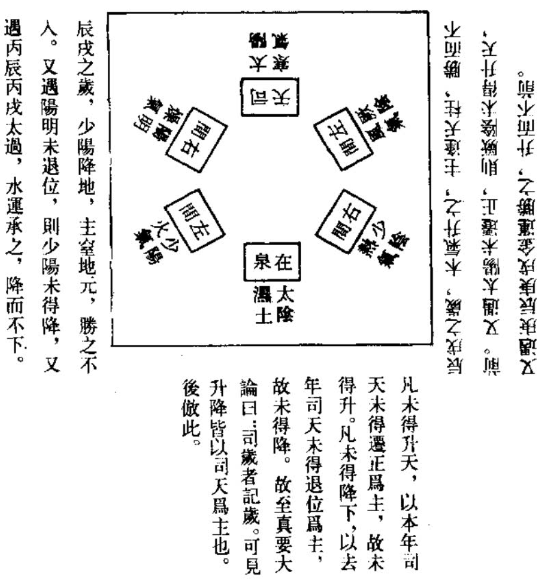
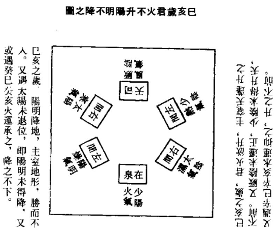
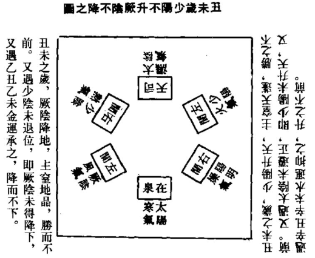
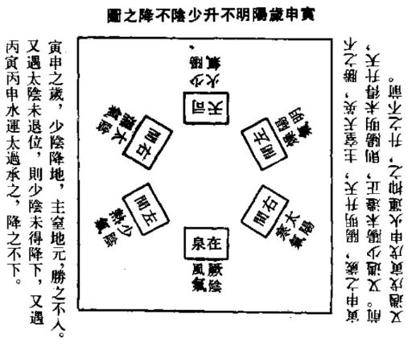
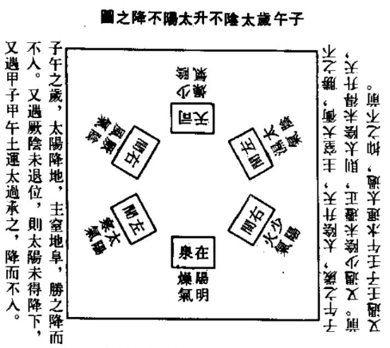
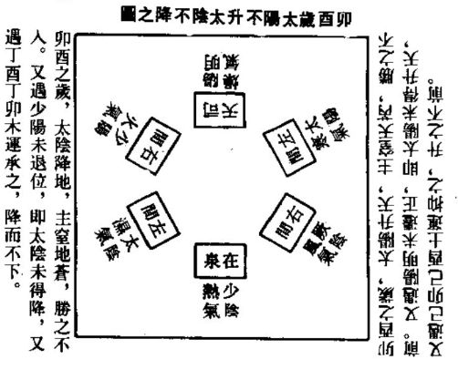

## 卷四十二  

### 至真要大论篇第七十四 【`中`】  

帝曰：气之上下何谓也？岐伯曰：身半以上，其气三矣，天之分也，天气主之。身半以下，其气三矣，地之分也，地气主之。以名命气，以气命处，而言其病。半，所谓天枢也。故上胜而下俱病者，以地名之；下胜而上俱病者，以天名之。所谓胜至，报气屈伏而未发也。复至则不以天地异名，皆如复气为法也。【`分，去声。`】  

【`王冰曰：身之半，正谓齐中也，当伸臂指天，舒足指地，以绳量之。中，正当齐也。故曰，半所谓天枢也。天枢正当齐两旁同身寸之二寸。其气三者，假如少阴司天，则上有热中有太阳兼之三也。六气皆然。司天者其气三，司地者其气三，故身半以上三气，身半以下三气也。以名言其气，以气言其处，以气处寒热而言其病之形证也。如足厥阴气居足及股胫之内侧，上行于少腹循胁；足阳明气在足之上胻之外股之前，上行腹齐之旁，循胸乳上面；足太阳气起于目，上额络头，下项背，过腰横过髀枢股后，上行入腘贯腨，出外踝之后，足小指外侧；足太阴气循足及股胫之内侧，上行腹胁之前，足少阴同之；足少阳气循胫外侧，上行腹胁之侧，循颊耳至目锐眦在首之侧，此足六气之部主也。手厥阴少阴太阴气，从心胸横出，循臂内侧至中指小指大指之端；手阳明少阳太阳气，并起手表，循臂外侧上肩及胛上头，此手六气之部主也。欲知病诊，当随气所在以言之。当阴之分，冷病归之；当阳之分，热病归之。故胜复之作，先言病生寒热者，必依此理也。彼气既胜，以未能复，抑郁不畅而无所行，进则困于雠嫌，退则穷于怫塞，故上胜至则下与俱病，下胜至则上与俱病。上胜下病，地气郁也，故从地郁以名地病。下胜上病，天气塞也，故从天塞以名天病。夫以天名者，方顺天气为制，逆地气而攻之；以地名者，方从天气为制则可。假如阳明司天，少阴在泉，上胜而下俱病者，是怫于下而生也。天气正胜，天可逆之，故顺天之气方同清也。少阴等司天，上下胜同法。六元正纪大论云：上胜则天气降而下，下胜则地气迁而上。此之谓也。胜至未复而病生，以天地异名为式，复气以发，则所生无问上胜下胜，悉皆依复气为病，寒热之主也。`】  

【`马莳曰：此言人气之上下，合于司天在泉之分，而上下为病者，其治法复与胜同也。帝疑六气之在人身分为上下，伯言身半以上为天，其气有三，少阴君火，应心与小肠，阳明燥金，应肺与大肠，少阳相火，应三焦与心包络，乃天之分也，而天之气主之。身半以下为地，其气亦有三，太阴湿土，应脾与胃，厥阴风木，应肝与胆，太阳寒水，应肾与膀胱，乃地之分也，而地之气主之。以少阴阳明等名而命其气，以气而命其心与小肠肺与大肠等处，凡各经之病，可以指而言之。夫所谓半者，即天枢穴以为界也。故上部胜而齐之下有病者，即以地分名之。下部胜而齐之上有病者，即以天分名之。此上胜则下复，下胜则上复，亦犹之天地也。治法何如？所谓胜至之时，特报气屈伏而未发耳。至于报复一至，则不分在天在地之异名，而其治胜之法，一如治复之法。故上文曰，凡治诸胜复者，寒者热之，冷者温之，温者清之，清者温之，一十二句，乃治法之大要也。`】  

【`张志聪曰：此论人身之上下，以应天地之上下也。夫岁半以上，天气主之，乃厥阴风木、少阴君火、少阳相火。岁半以下，地气主之，乃太阴湿土、阳明燥金、太阳寒水。在人身厥阴风木之气，与督脉会于巅顶，是木气在于火气之上矣。君火之下，包络相火主气，是木火火之三气，在身半以上也。脾土居阳明胃金之上，阳明居太阳膀胱之上，是土金水之三气，在身半以上也。以木火土金水之名，以命其上之三气，下之三气，以上下之三气而命其在天在地之处，以天地之处而言其三阴三阳之病，则胜复之气可知矣。半者，所谓天枢之分，在齐旁二寸，乃阳明之穴名，盖以此而分形身之上下也。夫所谓枢者，上下交互而旋转也。故在天地，乃上下气交之中名天枢，在人身，以身半之中名天枢也。如身半以上之木火气胜，而身半以下之土金水三气俱病者，以地名之，谓病之在地也。如身半以下之土金水胜，而身半以上之木火气病者，以天名之，谓病之在天也。盖以人身之上下，以应天地之上下，故以天地名之。如胜至则报复之气，屈伏于本位而未发也。复至则如复气而为法，不必以天地而名之，如厥阴少阴少阳之复，其气发于四气五气之时，阳明太阳之复，其气归于初气二气之木火，故不必以木火居岁半以上，而以天名之，金水主岁半以下，而以地名之，皆如复气之所在而为成法也。`】  

帝曰：胜复之动，时有常乎？气有必乎？岐伯曰：时有常位，而气无必也。帝曰：愿闻其道也。岐伯曰：初气终三气，天气主之，胜之常也。四气尽终气，地气主之，复之常也。有胜则复，无胜则否。　　【`王冰曰：时有常位而气无必，谓虽位有常而发动有无，不必定之也。`】  

【`马莳曰：此言胜复之时有常位，而其气之有无不可必也。盖自初气以至三气，司天之气主之，太过则胜其所胜，不及则不胜来胜，此胜之常也。自四气以至终气，在泉之气主之，则子为母复之，复之常也。此其时之有常位也。但有胜则复，无胜则不复，此又气不可必者如此。`】  

【`张志聪曰：帝问胜复之气，随四时之有常位乎？其气之动，随四时之可必乎？伯言木火土金水四时有定位，而胜复之气，不随所主之本位而发，故气不可必也。盖谓六气各主一岁，主岁之气胜，则春将至而即发，是太阴、阳明、太阳之气，皆发于春夏矣。如六气之复，乃郁极而后发，故发于岁半之后，是厥阴、少阴、少阳之复，皆发于秋冬矣。故曰，初气终三气，天气主之，胜之常也。四气尽终气，地气主之，复之常也。有胜则复，无胜则否，是以胜复之气，不随四时之常位而不可必也。`】  

帝曰：善。复已而胜何如？岐伯曰：胜至则复，无常数也，衰乃止耳。复已而胜，不复则害，此伤生也。　　【`王冰曰：胜微则复微，故复已而又胜，胜甚则复甚，故复已则少有再胜者也。假有胜者，亦随微甚而复之尔。然胜复之道虽无常数，至其衰谢，则胜复皆自止也。有胜无复，是复气已衰，衰不能复，是天真之气已伤，败甚而生意尽。`】  

【`马莳曰：此言胜之不可以无复，复之不可以无胜，皆自其气衰而止也。帝承上文而言有胜则复，无胜则不复，但复之既已，而彼之胜气又当何如也。伯言始而胜至则复，其胜甚则复甚，胜微则复微，无常数也，至于其胜气之衰乃止耳。然复已而胜者，则胜气又必复之，若不复之，则天时循环之气，虽有必然，而人身脏腑之气，不能相继，此其伤生必矣。`】  

【`张志聪曰：此申明有胜则复，展转不已，必待其胜气衰而后乃止耳。复已而胜者，如火气复而乘其金，已则金气又复胜之，金气复而侮其火，已则火气又复胜之，所谓胜至则复，无常数也。如胜气衰而后乃止耳。故复气已而受复之气又复胜之，如火气复而胜其金，则金气又当复胜，如不复胜，此金为火气所害，而金之生气伤矣。故必待其胜衰而后平，如有胜则有复也。`】  

帝曰：复而反病，何也？岐伯曰：居非其位，不相得也。大复其胜，则主胜之，故反病也。所谓火燥热也。帝曰：治之奈何？岐伯曰：夫气之胜也，微者随之，甚者制之；气之复也，和者平之，暴者夺之。皆随胜气，安其屈伏，无问其数，以平为期，此其道也。　　【`王冰曰：少阳，火也。阳明，燥也。少阴，热也。少阴少阳在泉为火，居水位。阳明司天为金，居火位。金复其胜，则火主胜之。火复其胜，则水主胜之。余气胜复，则无主胜之病气也。故又曰，所谓火燥热也。随谓随之安，谓顺胜气以和之也。制谓制止，平谓平调，夺谓夺其盛气也。治此者不以数之多少，但以气平和为准度尔。`】  

【`马莳曰：此言复之所以反病而有治之之法也。帝问胜者复之，则必能胜之矣，然复之而反有所病者，何也？伯言复气之所居者，已非其位，则彼此之气不相得，而又大复其胜，则主气反来胜之，所以复气之反病也。即如少阴为君火，阳明为燥金，少阳为暑热，今少阴少阳在泉，则火居水位，阳明司天，则金居火位，故火复其胜，则水主胜之，金复其胜，则火主胜之，此正居非其位，气不相得，而大复其胜则主反胜之之谓。惟火燥热之三气乃尔也。故治之者，方其气之胜也，胜微则随其气而调之，胜甚则即所畏以制之。及其气之复也，复气之和者则平调之，复气之暴者则即其盛而夺之，皆随胜复之胜气，以使之屈伏，不必问其数之多寡，而惟至于病气之平焉斯已矣。`】  

【`张志聪曰：复而反病者，复气之反病也。如火气复而乘于金位，金气复而乘于火位，皆居非其位不相得也。是以大复其胜，则主胜之，故反病也。如火气大复，而乘于阳明，则五位之主气胜之，如金气大复，而乘于少阴，则二位之主气胜之，故复气之反病也。所谓火热燥也。余气皆然。此即胜至则复，胜衰则止之意。盖言胜复之气，宜于渐衰，而不宜于复大也。微者随之，顺其气以调之也。甚者制之，制以所畏也。和者平之，平调其微邪。暴者夺之，泻其强盛也。但随胜气以治，则屈伏之气自安矣。然不必问其胜复之展转，惟以气平为期，此其治胜复之道也。`】  

帝曰：善。客主之胜复奈何？岐伯曰：客主之气，胜而无复也。帝曰：其逆从何如？岐伯曰：主胜逆，客胜从，天之道也。帝曰：其生病何如？岐伯曰：厥阴司天，客胜则耳鸣掉眩，甚则咳；主胜则胸胁痛，舌难以言。少阴司天，客胜则鼽嚏颈项强，肩背瞀热，头痛少气，发热，耳聋目瞑，甚则胕肿，血溢，疮疡，咳喘；主胜则心热烦躁，甚则胁痛支满。太阴司天，客胜则首面胕肿，呼吸气喘；主胜则胸腹满，食已而瞀。少阳司天，客胜则丹胗外发，及为丹熛疮疡，呕逆喉痹，头痛嗌肿，耳聋血溢，内为瘛瘲；主胜则胸满咳，仰息，甚而有血，手热。阳明司天，清复内余，则咳衂嗌塞，心鬲中热，咳不止而白血出者死。太阳司天，客胜则胸中不利，出清涕，感寒则咳；主胜则喉嗌中鸣。厥阴在泉，客胜则大关节不利，内为痉强拘瘛，外为不便；主胜则筋骨繇并，腰腹时痛。少阴在泉，客胜则腰痛，尻股膝髀腨胻足病瞀热以酸，胕肿不能久立，溲便变；主胜则厥气上行，心痛发热，鬲中众痹皆作，发于胠胁，魄汗不藏，四逆而起。太阴在泉，客胜则足痿下重，便溲不时，湿客下焦，发而濡泻，及为肿隐曲之疾；主胜则寒气逆满，食饮不下，甚则为疝。少阳在泉，客胜则腰腹痛而反恶寒，甚则下白溺白；主胜则热反上行而客于心，心痛发热，格中而呕，少阴同候。阳明在泉，客胜则清气动下，少腹坚满，而数便泻；主胜则腰重腹痛，少腹生寒，下为骛溏，则寒厥于肠，上冲胸中，甚则喘不能久立。太阳在泉，寒复内余，则腰尻痛，屈伸不利，股胫足膝中痛。帝曰：善。治之奈何？岐伯曰：高者抑之，下者举之，有余折之，不足补之。佐以所利，和以所宜，必安其主客，适其寒温。同者逆之，异者从之。帝曰：治寒以热，治热以寒，气相得者逆之，不相得者从之，余已知之矣，其于正味何如？岐伯曰：木位之主，其泻以酸，其补以辛；火位之主，其泻以甘，其补以咸；土位之主，其泻以苦，其补以甘；金位之主，其泻以辛，其补以酸；水位之主，其泻以咸，其补以苦。厥阴之客，以辛补之，以酸泻之，以甘缓之；少阴之客，以咸补之，以甘泻之，以咸收之；太阴之客，以甘补之，以苦泻之，以甘缓之；少阳之客，以咸补之，以甘泻之，以咸软之；阳明之客，以酸补之，以辛泻之，以苦泄之；太阳之客，以苦补之，以咸泻之，以苦坚之，以辛润之；开发腠理，致津液通气也。　　【`王冰曰：客，谓天之六气；主，谓五行之位。气有宜否，故各有胜复之者。胜而无复，谓客自多少，以其胜与常胜殊。客承天命，部统其方，主为之下，固宜祇奉天命，若不顺而胜，则天命不行，故为逆。客胜于主，承天之道，故为顺也。阳明司天，清气内复，谓复旧居也。白血，谓咳出浅红色血，似肉似肺者。大关节，腰膝也。隐曲之疾，谓隐蔽委曲之处病也。骛溏，言如鸭之后也。高者抑之，制其胜也。下者举之，济其弱也。有余折之，屈其锐也。不足补之、全其气也。虽制胜扶弱，而客主须安一气，失所则矛楯更作，榛棘互兴，各伺其便，不相得志，内淫外并，而危败之由作矣。同，谓寒热温清气相比和者。异，谓水火金木土不比和者。气相得，则逆所胜之气以治之；不相得，则顺所不胜气以治之。治火胜负，欲益及欲泻者，皆以其味胜与不胜皆折其气也。何者？以其性躁动也。治热亦然。至于君相二火之气，其治虽殊，其气用则一矣。客之部主各六十一日，居无常所，随岁迁移。客胜则泻，客而补主，主胜则泻，主而补客，应随当缓当急以治之。`】  

【`马莳曰：此言客主之气，有胜无复，其民病则异，其治法则统，其正味则各有所主也。盖司天在泉，有胜则有复，至于客主之气，则有胜而无复。但客承天命，而主为之下，如主不能奉天之命，而反胜客气则为逆，祇奉天命，而客气胜主则为从，此乃天之道也。试言己亥之岁，厥阴司天，初气本厥阴风木为主，而阳明燥金客气加之；二气本少阴君火为主，而太阳寒水客气加之；三气本少阳相火为主，而厥阴风木客气加之。如客气各胜主气，则为耳鸣，为掉眩，甚则为咳；如主气各胜客气，则为胸胁痛，为舌难以言者，乃病之大略也。子午之岁，少阴司天，初气本厥阴风木为主，而太阳寒水客气加之；二气本少阴君火为主，而厥阴风木客气加之；三气本少阳相火为主，而少阴君火客气加之。如客气各胜主气，则为鼽，为嚏，为颈项强，为肩背瞀热，为头痛，为少气，为发热，为耳聋为目瞑，甚则为胕肿，为血溢，为疮疡，为咳为喘；如主气各胜客气，则为心热，为烦躁，甚则为胸痛，为支满也。丑未之岁，太阴司天，初气本厥阴风木为主，而厥阴风木客气加之；二气本少阴君火为主，而少阴君火客气加之；三气本少阳相火为主，而太阴湿土客气加之。如客气各胜主气，则为首面胕肿，为呼吸气喘；如主气各胜客气，则为胸腹满，食已而瞀也。寅申之岁，少阳司天，初气本厥阴风木为主，而少阴君火客气加之；二气本少阴君火为主，而太阴湿土客气加之；三气本少阳相火为主，而少阳相火客气加之。如客气各胜主气，则为丹胗外发，及为丹熛，为疮疡，为呕逆，为喉痹，为头痛，为嗌肿，为耳聋，为血溢，内为瘛瘲；如主气各胜客气，则为胸满，为咳而仰息，甚而为有血，为手热也。卯酉之岁，阳明司天，金居火位，无客胜之理，而阳明为不及之岁，火来胜之，至在泉之时，金之子为母复雠，则水复即金复也。故谓之曰清复，其清复内余，肺尚受伤，民病为咳为衂，为嗌塞，为心鬲中热，为咳不止而白血出者当死。盖血出似唾，其色虽白，实谓之血。《灵枢》营卫生会篇谓营气化血。夫营气者，阴气也，阴气既衰，不能化血，而仅有白血，此世人之所不知者也。但病至于此，深可慨也。辰戌之岁，太阳司天，初气本厥阴风木为主，而少阳相火客气加之；二气本少阴君火为主，而阳明燥金客气加之；三气本少阳相火为主，而太阳寒水客气加之。如客气各胜主气，则为胸中不利，为出清涕，感寒则咳；如主气各胜客气，则为喉嗌中鸣也。寅申之岁，厥阴在泉，四气本太阴湿土为主，而阳明燥金客气加之；五气本阳明燥金为主，而太阳寒水客气加之；终气本太阳寒水为主，而厥阴风木客气加之。如客气各胜主气，则为大关节不利，内则为痉强拘瘛，外为大小不便；如主气各胜客气，则为筋骨繇并，腰腹时痛。卯酉之岁，少阴在泉，四气本太阴湿土为主，而太阳寒水客气加之；五气本阳明燥金为主，而厥阴风木客气加之；终气本太阳寒水为主，而少阴君火客气加之。如客气各胜主气，则为腰痛及尻股膝髀腨胻足病瞀热以酸，且腑肿不能久立，为溲便变；如主气各胜客气，则为厥气上行，为心痛，为发热，为鬲中，为众痹皆作，发于胠胁，为魄汗不藏，为四肢厥逆而起也。辰戌之岁，太阴在泉，四气本太阴湿土为主，而厥阴风木客气加之；五气本阳明燥金为主，而少阴君火客气加之；终气本太阳寒水为主，而太阴湿土客气加之。如客气各胜主气，则为足痿，为下重，为便溲不时，为湿客下焦，发为泄泻，及为肿于隐曲之处也；如主气各胜客气，则为寒气逆满，为饮食不下，甚则为疝也。巳亥之岁，少阳在泉，四气本太阴湿土为主，而少阴君火客气加之；五气本阳明燥金为主，而太阴湿土客气加之；终气本太阳寒水为主，而少阳相火客气加之。如客气各胜主气，则为腰腹痛而反恶寒，甚则为大便下白，而溺亦下白；如主气各胜客气，则为热反上行而客于心，为心痛，为发热，为格中而呕。盖此乃为相火，而少阴则为君火，故与少阴之在泉者同候也。子午之岁，阳明在泉，四气本太阴湿土为主，而太阴湿土客气加之；五气本阳明燥金为主，而少阳相火客气加之；终气本太阳寒水为主，而阳明燥金客气加之。如客气各胜主气，则为清气动下，少腹坚满而数便泻；如主气各胜客气，则为腰重，为腹满，为少腹生寒，为下为鹜溏，为寒气厥逆于肠，上冲胸中，甚则为喘不能久立也。丑未之岁，太阳在泉，然太阳以水居水位，不必言客主之胜，其寒气复胜之余，则为腰尻痛，屈伸不利，为股胫足膝中痛也。然所以治之者，大约病在高者，则抑而下之，病在下者，则举而升之。如李东垣云，高者抑之，非高者固当抑也，以其本下而失之太高，故抑之而使下，若本高何抑之有？下者举之，非下者固当举之也，以其本高而失之太下，故举而使之高，若本下何举之有是也。病为邪气有余则泻之，病为正气不足则补之，佐以所利，和以所宜，必使主客各安，而寒温相适，寒热温清，与民病之气相同者，则逆而正治之，不相得而异者，则异者从治之，此其治主客之大体也。帝言此义，固已知之，然主客之位，其正味各有所主，伯言木位之主气，春分前六十一日为初之气，其泻以酸，其补以辛。火位之主气，则君火之位，春分后六十一日为二之气，相火之位，夏至前后各三十日为三之气，其泻以甘，其补以咸。土位之主气，秋分前六十一日为四之气，其泻以苦，其补以甘。金位之主气，秋分后六十一日为五之气，其泻以辛，其补以酸。水位之主气，冬至前后各三十日为终之气，其泻以咸，其补以苦。厥阴之客气，以辛补之，以酸泻之，以甘缓之。盖其辛补酸泻者，与主气同，而又必以甘缓之也。少阴之客气，以咸补之，以甘泻之，以咸收之，盖其甘泻咸补与主气同，而补之者，正所以收之也。太阴之客气，以甘补之，以苦泻之，以甘缓之，盖其补甘泻苦者，与主气同，而补之者，正所以缓之也。少阳之客气，以咸补之，以甘泻之，与主气同，而补之者，正所以软之也。阳明之客气，以酸补之，以辛泻之，以苦泄之，盖其酸补辛泻者，与主气同，而又必以苦泄之也，太阳之客气，以苦补之，以咸泻之，盖其苦补咸泻者，与主气同，而又必以苦坚之，以辛润之也。此皆所以开发腠理，致其津液，以通各经之气耳。`】  

【`张志聪曰：此论四时主气客气之胜复也。按前篇论初之气二之气者，乃加临之客气而为民病也。后论厥阴所至为和平，太阴所至为埃溽，论主气之有德化变病也。此章复论主气客气有彼此相胜之顺逆也。客气者，乃司天在泉及左右之间气，在天之六气也。天包乎地之外，从泉下而六气环转，天之道也。主气者，五方四时之定位，地之道也。坤顺承天，故主胜为逆，客胜为从，顺天之道也。厥阴司天，风木之客气胜于上，故耳鸣掉眩。厥阴经脉贯鬲上注肺，甚则咳者，上淫之气内入于经也。主胜则胸胁痛，肝脉布胸胁也。厥阴少阳主筋。二经之筋病则舌卷，故难以言。盖客气之从上而下，主气之从内而上也。盖主岁之三气，乃厥阴风木，君相二火，胸胁痛者，厥阴之初气甚舌难以言者，二火之气胜也。少阴司天之初气，乃太阳寒水，二之气乃厥阴风木，三之气乃少阴君火，鼽嚏耳聋目瞑，厥阴之气胜也。头项强，肩背瞀热，头痛，甚则胕肿，太阳寒水之气胜也。少气发热，血溢疮疡咳喘，君火之气胜也。初之主气，乃厥阴风木，二之气君火，三之气相火，主胜则心热烦躁者，君相二火之气胜也。甚则胁痛支满者，厥阴之初气胜也。盖君火司岁，故先火胜而甚则及于厥阴也。夫司天之气，客气有三，主气有三，在泉之气，客气有三，主气有三，主客之胜而为民病，有以三气分而论之者，有合而论之者，盖书不尽言，言不尽意，神而明之，存乎其人。太阴司天，客胜则首面胕肿，湿淫于上也。呼吸气喘，淫及于内也。主胜则胸腹满者，初气之木胜伤土也。经云：肺是动，病甚则交两手而瞀。乃二气三气之火，上炎而为肺病也。胕，肿也。非足跗也。少阳司天，初气三气乃君相二火，二之气乃太阴湿土。丹胗即斑疹，因火热而发于外者也。丹熛即赤游，发于外而欲游于内者也。呕逆瘛瘲，湿土之气合于内也。疮疡嗌肿诸证，亦皆感湿热而生，盖亦自上而下，从外而内也。肺乃心之盖，主胜则胸满咳仰息者，主气之二火，欲上炎而外出也。仰息者，肺病而不得偃息也。甚而有血手热者，火发于外也。君相二经之脉，皆循于手，故为手热。阳明司天，清复内余者，清肃之客气入于内，而复有余于内也。欬衄嗌塞，心鬲中热，皆肺病也。肺属金而主天，是以阳明司天之气余于内，而病在肺也。白血出者，血出于肺也。阳明司天，天之气也。脏属阴而血为阴，血出于肺则阳甚而阴绝矣。此盖言天为阳，地为阴。人居天地气交之中，腑为阳，脏为阴，气为阳，血为阴，外为阳，内为阴，是以阳明之不言主客者，谓阳明金气司天，则干刚在上，胜于内则与肺金相合，故不言主客者，论天之道也。太阳司天，其气在表，肺主皮毛，故受司天之客气，即为胸中不利，出清涕而咳。曰感寒则咳者，谓太阳与寒水之有别也。按水热穴论曰：肾者至阴也，至阴者盛水也。肺者太阴也，少阴者冬脉也。故其本在肾，其脉在肺，皆积水也。盖水在地之下，故曰至阴，大地之下皆水，故为盛水也。与肺金之上下交通，丽皆积水者，水上连乎天，而天包乎下也。是以主胜则喉嗌中鸣，乃在下寒水之气，而上出于肺也。大关节者，手足之十二节也，厥阴在泉，始之客气，乃阳明燥金，厥阴主筋，筋燥是以关节不利。次之客气，乃太阳寒水，太阳为诸阳主气，阳气者柔则养筋。寒气淫于内，则太阳受之，故内为痉强拘瘛，即痓证也。终之客气，乃在泉之风木，故外为不便，不便者，亦筋骨之不利也。骨繇者，节缓而不收也。所谓骨繇者摇故也。在泉之主气，乃太阴湿土，阳明燥金，太阳寒水。筋骨繇并，腰腹时痛者，三气之为病也。少阴在泉，四之客气，乃太阳寒水，故为腰尻股胻足病，皆太阳之经证，同气相感也。次之气，乃厥阴风木，瞀热以酸，胕肿不能久立，乃脾土之证，盖木淫而土病也。终之客气，乃少阴君火，主气乃太阳寒水。溲便变者，水火相交，火淫于下也。主胜则厥气上行，心痛发热者，乃寒水之主气，上乘于在泉之君火也。五之主气，乃阳明燥金，客气乃厥阴风木。众痹者，各在其处，更发更止，更居更起，以右应左，以左应右。鬲中众痹皆作，发于胠胁，乃阳明之气，乘于厥阴之经也。四之主气，乃太阴湿土，客气乃太阳寒水。魄汗，表汗也。汗乃阴液。膀胱者，津液之所藏。四逆而起者，土气上逆也。以土胜水，是以津液不藏，而汗出于表也。夫以众痹似属阳明十二经中，惟手足阳明之脉，左之右，右之左，而交于承浆，故曰以右应左，以左应右。太阴在泉，足痿下重，便溲不时者，在泉之湿气，客于太阴之经而下及于内也。湿客下焦，发面濡泻及为肿者，因客淫于下，而太阴之主气自病也。隐曲者，乃男女之前阴处，故曰隐曲，谓隐藏委曲之处也。终之主气，乃太阳寒水，客气乃司天之湿土，是以主胜则寒气逆满，盖水淫而上乘于土，故逆满也。四之主气，乃太阴湿土，客气乃厥阴风木。食饮不下，甚则为疝者，湿气上逆，而病及于厥阴之经也。五之主气，乃阳明燥金，客气乃少阴君火，火能制金，故不上胜也。少阳在泉，始之客气乃少阴君火，主气乃太阴湿土，次之客气乃太阴湿土，主气乃阳明燥金，终之客气，乃少阳相火，主气乃太阳寒水。腰腹痛而反恶寒者，客胜而太阳之主气病也。太阳之气伤，故恶寒也。甚则溺白下白者，病及于阳明太阴之主气也。盖金主气，气化则溺出，溺白者，气不化而溺不清也。下白者，土气伤而大便色白也。因客胜而主气反病，故曰反。主胜则热上客心，心痛发热者，君相二火之客气，反上行而自病也。格中而呕者，太阴之客气自病也。因主胜而客反自病，故曰反。曰客，曰少阴同候，谓火性炎上，故二火皆有反逆之自病也。阳明在泉，清气动下者，清肃之天气而动于下也。少腹坚满而数便泻者，太阳寒水之病也。主胜则腰重腹痛，少腹生寒者，太阳寒水之气发于下也。下为鹜溏者，水下泄也。寒厥于肠，上冲胸中，甚则喘者，寒气逆乘阳明之大肠，而上及于胃中之肺脏也。《灵枢经》曰：气上冲胸，喘不能久立。邪在大肠，大肠与肺胃相合，而并主金气。此与阳明司天之大义相合。太阳在泉，寒复内余者，太阳寒水之客气入于内而复内有余也。腰尻股胫足痛者，太阳之经证也。屈伸不利者，太阳之主筋也。夫太阳者，水中之阳，天之气也。寒水者，天一所生之水也。水上通乎天，天行于地下，故曰司天，曰在泉。六气随天气而繞地环转，故在阳明司天，而曰清复内余，在太阳在泉，而曰寒复内余。谓司天在泉之气，上下相通，人居于天地气交之中，而上下之气，复有余于人之内也。故俱不言主气客气，盖司天在泉，一气贯通，皆论天之道也。高者抑之，谓主气之逆于上也。下者举之，谓客气之乘于下也。有余者，胜气也。不足者，所不胜之气而为病也。佐以所利者，利其所欲也。如肝欲散，急食辛以散之，是以厥阴之胜，佐以苦辛。心欲软，急食咸以软之，是以少阴之胜，佐以苦咸。脾欲缓，急食甘以缓之，是以太阴之胜，佐以辛甘。肺欲收，急食酸以收之，是以燥淫所胜，佐以辛酸。肾欲坚，急食苦以坚之，是以寒淫所胜，佐以甘苦。和以所宜者，和其五味之所宜也。如厥阴色青，宜食甘，少阴少阳色赤，宜食酸，太阴色黄，宜食咸，阳明色白，宜食苦，太阳色黑，宜食辛。安其主客者，使各守其本位也。适其寒温者，治寒以热，治热以寒，治温以凉，治凉以温也。同者逆之，谓气之相得者，宜逆治之。如主客之同司火热，则当治以咸寒，如同司寒水，则当治以辛热，温凉亦然，此逆治之法也。异者从之，谓不相得者当从治之，如寒水司天，加临于二火主气之上，客胜当从二火之热以治寒，主胜当从司天之寒以治热，余气皆然，此平治异者之法也。木位之主，厥阴所主之位也，此乃四时不易之定位，故曰位。如未至所主之时，而阳春之气先至，此气之盛也，宜泻之以酸。如至而未至，此气之衰也，宜补之以辛。盖木性升，酸则反其性而收之，故为泻，辛则助其发生之气，故为补。火位之主，谓二之气，乃君火所主之位，三之气，乃相火所主之位，如未至三月而暄热之气先至，未至五月而灸暑之气先至，此来气有余，宜泻之以甘，盖从子而泄其母气也。如至而不至，此气之不及也，宜补之以咸，盖以水济火也。土位之主，四之气也。如主气之时，埃蒸注雨，气之盛也，宜苦以泄之，泻其敦阜之气。如化气不令，风寒并兴，主气之不足也，宜补之以甘，盖气不足者，补之以味也。金位之主，五之气也。如未及时而清肃之气早至，此气之盛也，其泻宜辛以散之。如至秋深而暑热尚在，气之不及也，其补宜酸以收之。水位之主，终之气也。如未及时而天气严寒，冰雪霜雹，气之盛也，宜泻之以咸，盖咸能泄下，从其类而泻之也。如已至而天气尚温此，气之不及也，宜补之以苦，盖苦味阴寒，而炎上作苦，助太阳标本之位也。所谓调之正味，以平为期，勿使四时不平之气而为民病也。客乃加临之六气，而有太过不及之正味，六气运行，无有定位，如客之外至，故曰客。常以正月朔日平旦视之，如厥阴之客，气来不及，宜补之以辛，气来有余，宜泻之以酸，以甘缓之，盖主气有余，则气行于外，客气太过，则气乘于内，故当兼用五脏所欲之味以调之。少阴之客，以咸补之，咸当作酸。脏气法时论曰：心苦缓，急食酸以收之。按论主气先言泻而后言补，论客气先曰补而后曰泻。盖补泻之道，有宜补而不宜泻者，有宜泻而不宜补者，有宜先补而后泻者，有宜先泻而后补者，有补泻之兼用者，神而明之，在乎其人。腠者，三焦通会元真之处；理者，皮肤脏腑之文理也。夫水谷入于口，津液各走其道，故三焦出气以温肌肉，充皮肤为其津。盖气充肌腠，津随气行，辛味入胃，能开腠理，致津液而通气，故主润。`】  

帝曰：善。愿闻阴阳之三也何谓？岐伯曰：气有多少异用也。帝曰：阳明何谓也？岐伯曰：两阳合明也。帝曰：厥阴何也？岐伯曰：两阴交尽也。　　【`马莳曰：此明三阴三阳及阳明厥阴之义也。帝承上文而问阴阳止二，今曰少阳、太阳、阳明、少阴、太阴、厥阴，而皆列之为三者，何也？伯言太阴为正阴，而次少为少阴，又次为厥阴，太阳为正阳，而次少为少阳，又次为阳明。以其气有多少异用，故各有三者之分耳。然太少之义易知，而阳明厥阴之疑未释。伯言足之十二经，合于十二月，故寅者五月之生阳也，主左足之少阳，六月建未，则为右足之少阳，皆两足第四指脉气所行也。二月建卯，主左足之太阳，五月建午，则为右足之太阳，皆足小指外侧已上脉气所行也。三月建辰，主左足之阳明，四月建巳，则为右足之阳明，皆两足次指已上脉气所行也。然正二五六月为少阳太阳，而三四为辰巳月居于其中，则彼两阳合明于其前，故曰阳明也。七月建申，主阴之生，主右足之少阴，而十二月建丑，则为左足之少阴，皆两足心以上脉气所行也。八月建酉，主右足之太阴，而十一月建子，则为左足之太阴，皆两足大指内侧已上脉气所行也。九月建戌，主右足之厥阴，而十月建亥，则为左足之厥阴，皆两足大指外侧已上脉气所行也。然七八十一十二月为少阴太阴，而九十为戌亥月，则为两足之阴已尽，故曰厥阴也。厥者尽也。`】  

【`张志聪曰：此言阴阳之有太少，则气有盛衰，而治有轻重矣。阴阳之中，有太阳少阳，有太阴少阴，则气有多少异用也。三阴三阳，有多气少血者，有多血少气者，有气血皆多者，是以用药之有异也。夫阳明主阳盛之气，故多气而多血。厥阴主于阴尽，而一阳始蒙，气之微者也。故为阴中之少阳而少气。`】  

帝曰：气有多少，病有盛衰，治有缓急，方有大小，愿闻其约奈何？岐伯曰：气有高下，病有远近，证有中外，治有轻重，适其至所为故也。《大要》曰，君一臣二，奇之制也。君二臣四，偶之制也。君二臣三，奇之制也。君三臣六，偶之制也。故曰，近者奇之，远者偶之。汗者不以奇，下者不以偶。补上治上，制以缓；补下治下，制以急。急则气味厚，缓则气味薄，适其至所，此之谓也。病所远而中道气味之者，食而过之，无越其制度也。是故平气之道，近而奇偶，制小其服也；远而奇偶，制大其服也。大则数少，小则数多。多则九之，少则二之。奇之不去则偶之，是谓重方。偶之不去则反佐以取之，所谓寒热温凉，反从其病也。　　【`王冰曰：脏位有高下，腑气有远近，病证有表里，药用有轻重，调其多少，和其紧慢，令药气至病所，故勿太过与不及也。奇，谓古之单方。偶，谓古之复方也。单复一制，皆有小大。故奇方云，君一臣二，君二臣三；偶方云，君二臣四，君三臣六也。病有小大，气有远近，治有轻重所宜，故云制也。汗药不以偶方，气不足以外发泄，下药不以奇制，药毒攻而致过，治上补上，方迅急则止不住而迫下，治下补下，方缓慢则滋道路而力又微。制急方而气味薄，则力与缓等。制缓方而气味厚，则势与急同。如是为缓不能缓，急不能急，厚而不厚，薄而不薄，则大小非制，轻重无度，则虚实寒热，脏腑纷挠，无由致理，此岂神灵之可望哉？无越其制度者，假如病在肾，而心之气味饲而冷，足仍急过之，不饲以气味，肾药凌心，心复益衰。余上下远近例同。近远，谓腑脏之位也。心肺为近，肾肝为远，脾胃居中，三阳胞(月直)胆亦有远近，身三分之，上为近，下为远也。或识见高远，权以合宜，方奇而分两偶，方偶而分两奇，如是者近而偶制，多数服之，远而奇制，少数服之，则肺服九，心服七，脾服五，肝服三，肾服二，为常制矣。故曰，小则数多，大则数少也。夫方与其重也宁轻，与其毒也宁善，与其大也宁小。是以奇方不去，偶方主之，偶方病在，则反其佐以同病之气而取也。夫热与寒背，寒与热违，微小之熟为寒所折，微小之冷为热所消，甚大寒热则心能与违性者争雄，能与异气者相格，声不同不相应，气不同不相合，如是则且惮而不敢攻之，攻之则病气与胜气抗衡，而自为寒热，以开闭固守矣。是以圣人反其佐以同其气，令声气应合，复令寒热参合，使其终异始同，燥润而败，坚刚必折，柔脆自消尔。`】  

【`马莳曰：此言约方之法，不越奇偶，而必当曲尽其制也。帝承上文而问阴阳之气，有多有少，故民病有盛有衰，而治之者有缓有急，其方宜有大有小也。约方之法奈何？伯言阴阳之气岁，有司天在泉，则有高有下也。民病有脏腑在上为近，脏腑在下为远，其证候有中有外，治法有轻有重，但使药力适其所至之所，以复其旧耳。故制方之大要，不过奇偶二法而已。盖主病之为君，佐君之为臣，君用其一而臣佐以二，君用其二而臣佐以三，是数在三五，皆奇之制。君用其二而臣佐以四，君用其三当作二。而臣佐以六，是数在六八，皆偶之制。故病在上者谓之近，近则不必数之多，宜以奇方用之。然欲以取汗则不以奇而以偶，盖非偶不足以发散也。观此则近者奇之，为不足而补，而汗者不以奇，为有邪而治之也。病在下者谓之远，远则不可数之少，宜以偶方用之。然欲以下利则不以偶而以奇，盖非奇不足以专达也。观此则远者偶之，为不足而补，而下者不以偶，为有邪而治之也。但补上治上，其制用缓，非缓则及于下矣，故缓则用其气味之薄者，使适其所至之所，以复其故耳。补下治下，其制用急，非急则滞于上矣，故急则用其气味之厚者，使适其所至之所，以复其旧耳。彼病所远而药食气味止于中道，则累及其中，即如肾之药食入心，则心反为肾药所凌也，当食之而过此中道，无越制度，自然能至远所矣。是故平气之道，凡在上而近者，或奇以补之，或偶以汗之，惟其近则制宜小，小则数宜多，多则可以味至于九也。凡在下而远者，或偶以补之，或奇以下之，惟其远则制宜大，大则数宜少，少则可以味止于二也。此则病有远近，故不分奇偶而大约小以治上大以治下如此。若奇偶之制，则奇之数少而大，偶之数多而小者，又其大体然也。然与其大也宁小，与其重也宁轻，与其毒也宁善，其始也用奇，奇之不去则偶之，是谓之重方也，即后之所谓逆者正治也。其既也用偶，偶之不去则反其佐以取之，所谓反其佐以取之者，即药之寒热温凉，反有同于病之寒热温凉，乃因其性而利导之，即后之所谓从者反治也。此又奇偶先后之用，曲尽其妙者如此。`】  

【`张志聪曰：气有高下者，有天地人之九候也。远近者，浅深上下也。中外者，表里也。轻重者，大小其服也。盖适其至病之所在为故也。大要者，数之大要也。夫数之始于一而戍于三，圆之象也。以二偶而成六，方之象也。地数二，本数三，甲己合而土气化也。君二臣六，乾坤位而八卦成也。少则二之，阴数之始也。多则九之，阳数之终也。奇偶者，天地之数也。近者谓病之在上而近，故宜用奇方以治之，天气之在上也。远者谓病之在下而远，故宜用偶数以治之，地气之在下也。汗乃阴液，故宜用偶而不以奇，盖直从下而使之上，犹地气升而后能为云为雨也。下者宜用奇而不以偶，盖从上而使之下，从天气之下降也。补者，补正气之不足，治者，治邪气之有余。在上者宜缓方，在下者宜急方。急则用气味之厚者，缓则用气味之薄者。盖厚则沉重而易下，薄则轻清而上浮，奇偶缓急，各适其上下远近，至其病之所在而已矣。病所远者，谓病之在上在下，而远于中胃者也。中道气味之者，谓气味之从中道而行于上下也，故当以药食并用而制度之。如病之在上而近于中者，当先食而后药。病在下而远于中者，当先药而后食。以食之先后，而使药味之过于上下也。是故上下之病，近于中道，而用奇方偶方者，制小其服，病远于中而用奇方偶方者，宜制大其服，大服小服者，谓分两之轻重也。大则宜于数少而分两多，盖气味专而能远也。小则宜于数多而分两少，盖气分则力薄而不能远达矣。此平上中下三气之道也。所谓重方者，谓奇偶之并用也。反佐以取之，谓春病用温，夏病用热，秋病用凉，冬病用寒，顺四时寒热温凉之气，而反从治其病也。`】  

帝曰：善。病生于本，余知之矣，生于标者治之奈何？岐伯曰：病反其本，得标之病。治反其本，得标之方。　　【`王冰曰：此言少阴太阳之二气，余四气标本同。`】  

【`马莳曰：此言治标之病，其方即治本者而推之也。按标本之义，至广至详，有天地运气之标本，有人身脏腑之标本，有病体之标本，有治法之标本。天元纪大论曰：子午之岁，上见少阴；丑未之岁，上见太阴；寅申之岁，上见少阳；卯酉之岁，上见阳明；辰戌之岁，上见太阳；巳亥之岁，上见厥阴少阴，所谓标也。厥阴所谓终也。盖言子丑卯辰巳申之岁为对化，对司化令之虚，谓之曰标。午未酉戌亥寅之岁为正化，正司化令之实，谓之曰终。又曰，厥阴之上，风气主之；少阴之上，热气主之；太阴之上，湿气主之；少阳之上，相火主之；阳明之上，燥气主之；太阳之上，寒气主之，所谓本也。是谓六元。盖言三阴三阳为标，寒暑燥湿风火为本也。又六微旨大论曰：少阳之右，阳明治之；阳明之右，太阳治之；太阳之右，厥阴治之；厥阴之右，少阴治之；少阴之右，太阴治之；太阴之右，少阳治之。此所谓气之标，盖南面而待之也。少阳之上，火气治之中见厥阴；阳明之上，燥气治之，中见太阴；太阳之上，寒气治之，中见少阴；厥阴之上，风气治之，中见少阳；少阴之上，热气治之，中见太阳；太阴之上，湿气治之，中见阳明，所谓本也。本之下，中之见也。见之下，气之标也。本标不同，气应异象，盖言三阴三阳为治之气，皆所谓六气之标也。少阳之上十八句，其火燥风寒热湿为治之气，皆所谓六气之本也。其中见之气，乃六气之中气也。通前六气之标言之，则本居上，标居下，中气居本标之中，故曰本之下，中之见也。见之下，气之标也。然中气者，三阴三阳，各有夫妇之配合相守，而人之脏腑经脉皆应之。故少阳本标之中见厥阴，厥阴本标之中见少阳，而互为中气相守，而人之胆与三焦为少阳经，亦络肝与心包之厥阴经，而肝与心包又络胆与三焦而互交也。阳明本标之中见太阴，太阴本标之中见阳明，而互为中气相守，则人之胃与大肠为阳明经，亦络脾肺之太阴经，而脾肺又络胃与大肠经而互交也。太阳本标之中见少阴，少阴本标之中见太阳，而互为中气相守，则人之膀胱小肠为太阳经，亦络肾与心之少阴经，而肾与心又络小肠膀胱而互交也。本标不同，气应异象者，谓太阳少阴二气也。太阳之上，寒气治之，是标阳本寒，不同其气，应则太阳所至为寒，生中为温，而寒温异象也。少阴之上，热气治之，是标阴本热，不同其气，应则少阴所至为热，生中为寒，而热寒异象也。此乃天地运气之标本也。又标本病传论及《灵枢》病本篇皆以先病为本，后病为标，惟中满小大便不利二病，或为本，或为标，皆不分标本而先治其标，其余百病皆先治其本也。此乃病体先后分标本也。又汤液醪醴论曰：病为本，工为标。此以病人医人分标本也。此节所谓本者，盖以风寒暑湿燥火为本也。所谓标者，以三阴三阳为标也。如天之本在风，标在厥阴，则人之病在肝，而厥阴之中见少阳，则又在于胆。天之本在火，标在少阳，则人之病在胆，而少阳之中见厥阴，则又在于肝，故病生于本似易知，而治标之方则难必，殊不知病自本始，则知标病之所由来也。治之者，亦即其本而推之，则得标之所以立其方矣。假如本在于风，则标之方亦在于风耳。大义又见下文之下节。`】  

【`张志聪曰：此论三阴三阳之有本有标也。病生于本者，生于风寒热湿燥火也。生于标者，生于三阴三阳之气也。如太阳为诸阳之首而本于寒水，少阴为阴中之太阴而本于君火，阳明乃阳盛之气而本于清肃，厥阴主阴极而本于风木之阳，此阴阳中又有标本之不同也。病反其本者，如病寒而反得太阳之热化，病热而反见少阴之阴寒，病在阳而反见清肃之虚寒，病在阴而反得中见之火热，所谓病反其本，得标之病也。治反其本者，如病本寒而化热，则反用凉药以治热，如病本热而化寒，则反用热药以治寒，如病在阳明而化虚冷，则当温补其中气，如病在厥阴而见火热，又当逆治其少阳，所谓治反其本，得标之方。少阳少阴，标本相同，皆从阳热阴湿而治。`】  

帝曰：善。六气之胜，何以候之？岐伯曰：乘其至也。清气大来，燥之胜也，风木受邪，肝病生焉。热气大来，火之胜也，金燥受邪，肺病生焉。寒气大来，水之胜也，火热受邪，心病生焉。湿气大来，土之胜也，寒水受邪，肾病生焉。风气大来，木之胜也，土湿受邪，脾病生焉。所谓感邪而生病也。乘年之虚，则邪甚也。失时之和，亦邪甚也。遇月之空，亦邪甚也。重感于邪，则病危矣。有胜之气，其必来复也。帝曰：其脉至何如？岐伯曰：厥阴之至，其脉弦；少阴之至，其脉钩；太阴之至，其脉沉；少阳之至，大而浮；阳明之至，短而濇；太阳之至，大而长。至而和则平，至而甚则病，至而反者病，至而不至者病，未至而至者病，阴阳易者危。　　【`王冰曰：肝病生谓流于胆，肺病生谓流于回肠大肠，心病生谓流于三焦小肠，肾病生谓流于膀胱，脾病生谓流于胃也。外有其气而内恶之，中外不喜，因而遂病，是谓感也。甚，谓岁气不足，外邪凑之也。失时之和，谓六气临统，与位气相克，感之而病，亦随所不胜，而与内脏相应，邪复甚也。遇月之空，谓上弦前下弦后，月轮中空也。重感于邪，谓年已不足，邪气大至，是一感也。年已不足，天气克之，此时感邪，是重感也。内气召邪，天气不佑，病不危可乎？然天地之气，不能相无，故有胜之气，其必来复也。脉若软虚而滑，端直以长，是谓弦。实而强则病，不实而微亦病，不端直长亦病，不当其位亦病，位不能弦亦病。来胜去衰，如偃带钩，是谓钩。来不胜，去反盛则病，来盛去盛亦病，来不盛去不盛亦病，不偃带钩亦病，不当其位亦病，位不能钩亦病。沉，下也，按之乃得，下诸位脉也。沉甚则病，不沉亦病，不当其位亦病，位不能沉亦病。浮，高也。大，谓稍大诸位脉也。大浮甚则病，浮而不大亦病，不大不浮亦病，不当其位亦病，位不能大浮亦病。往来不利，是谓濇也。往来不远，是谓短也。短甚则病，濇甚则病，不短不濇亦病，不当其位亦病，位不能短濇亦病。往来远，是谓长。大甚病，长甚亦病，长而不大亦病，大而不长亦病，不当其位亦病，位不能长大亦病。去其太甚则为平调，不弱不强，是谓和也。弦似张弓弦，滑如连珠，沉而附骨，浮高于皮，濇而止住，短如麻黍，大如帽簪，长如引绳，皆谓至而太甚。应弦反濇，应大反细，应沉反浮，应浮反沉，应短濇反长滑，应软虚反强实，应细反大，是皆为气反常平之候，有病乃如此也。至而不至者，气位已至而脉气不应也。未至而至者，谓按历占之，凡得节气当年六位之分，当如南北之岁，脉象改易而应之。气序未移而脉先变易，是先天而至，故病阴阳易者，谓不应天常，气见交错，失其恒位。更易见之，阴位见阳脉，阳位见阴脉，是易位而见也。二气之乱，故气危。`】  

【`马莳曰：此言六气之胜，气有可候而脉有可诊也。清气大来，可以候燥之胜，乃阳明燥金所司也，故金来胜木，则风木受邪。肝病乃生。热气大来，可以候火之胜，乃少阴少阳所司也，故火来胜金，则金燥受邪，肺病乃生。寒气大来，可以候水之胜，乃太阳寒水所司也，故寒来胜火，则心病乃生。湿气大来可以候上之胜，乃太阴湿土所司也，故土来胜水，肾病乃生。风气大来，可以候木之胜，乃厥阴风木所司也，故木来胜土，脾病乃生。正以岁木不足，则外有清邪，岁火不足，则外有寒邪，岁土不足，则外有风邪，岁水不足，则外有热邪，岁金不足，则外有湿邪，乃乘年之虚，斯邪之所以甚耳。且六气有主气，有客气，主气主乎四时，春温夏热，秋凉冬寒者，其宜也。而客气加之，或主胜，或客胜，则失时之和，亦邪之所以甚耳。八正神明论曰：月始生则血气始精，卫气始行。月郭满则血气实，肌肉坚。月郭空则肌肉减，经络虚，卫气去形独居。故遇月之空，亦邪之所以甚耳。此则重感于邪，病之所以危也。但有胜之气，必有复之气，其机又相因者耳。六气之至，必有其脉，厥阴之至，其脉弦，软虚而滑，端直以长也。少阴之至，其脉钩，来盛去衰，如偃带钩也。太阴之至，其脉沉，沉者不浮也。少阳之至，大而浮，大则不小，浮则不沉也。阳明之至，短而濇，短则不长，濇则不利也。太阳之至，大而长，大则不小，长则不短也。如六脉之至而和平则为平脉，如六脉之至而甚如太弦太钩之类，六脉之至而反，如应弦反濇、应大反细、应沉反浮、应浮反沉、应濇反滑、应滑反濇应长反短、应短反长之类，如气候已至而脉气不至，如气候未至而脉气先至，此皆不免于病也。上文感邪而生病，诸脉见矣，如脉宜见于寸为阳位，而反见于尺，脉宜见于尺为阴位，而反见于寸，此皆必至于危也。上文重感于邪则病危，其阴阳必反矣。`】  

【`张志聪曰：风寒热湿燥，在天四时之五气，木火土金水，在地四时之五行。五气之胜五行，五行而病五脏，是五脏之外合五行，而五行之上呈五气也。乘年之虚者，主岁之气不及也。如木运不及则清气胜之，火运不及则寒气胜之，土运不及则风气胜之，金运不及则热气胜之，水运不及则湿气胜之，此岁运之不及，而四时之胜气又乘而侮之。失时之和者，四时之气衰也，如春气不足则秋气胜之，夏气不足则冬气胜之，长夏之气不足则春气胜之，秋气不足则夏气胜之，冬气不足则长夏之气胜之。遇月之空者，月廓空之时也。重感于邪者，乘年之虚，失时之和，遇月之空，是谓三虚而感于邪，则病危矣。有胜之气，其必来复者，春有惨凄残贼之胜，则夏有炎暑燔烁之复；夏有惨凄凝冽之胜，则四维有埃昏大雨之复；四维发振拉飘腾之变，则秋有肃杀霖霪之复；秋有炎烁燔燎之变，则冬有冰雹霜雪之复；冬有埃昏骤注之变，则春有飘荡振拉之复。此四时之胜而必有复也。夫六气之应六脉也，厥阴主木，故其脉弦；少阴主火，故其脉钩；太阴主土，故其脉沉；少阳主火，故大而浮；阳明主金，故短而濇；太阳主水而为诸阳主气，故大而长。如脉至而和则为平人，脉至而甚则为病脉，所至之脉与时相反者病，及时而脉不至者病，未及时而脉先至者病，如三阴主时而得阳脉，三阳主时而得阴脉者危。`】  

## 卷四十三  

### 至真要大论篇第七十四 【`下`】  

帝曰：六气标本所从不同，奈何？岐伯曰：气有从本者，有从标本者，有不从标本者也。帝曰：愿卒闻之。岐伯曰：少阳太阴从本，少阴太阳从本从标，阳明厥阴不从标本，从乎中也。故从本者化生于本，从标本者有标本之化，从中者以中气为化也。帝曰：脉从而病反者，其诊何如？岐伯曰：脉至而从，按之不鼓，诸阳皆然。帝曰：诸阴之反，其脉何如？岐伯曰：脉至而从，按之鼓甚而盛也。是故百病之起，有生于本者，有生于标者，有生于中气者，有取本而得者，有取标而得者，有取中气而得者，有取标本而得者，有逆取而得者，有从取而得者，逆正顺也。若顺逆也。故曰，知标与本，用之不殆，明知逆顺，正行无间，此之谓也。不知是者，不足以言诊，足以乱经。故《大要》曰，粗工嘻嘻，以为可知，言热未已，寒病复始，同气异形，迷诊乱经，此之谓也。夫标本之道，要而博，小而大，可以言一而知百病之害。言标与本，易而勿损，察本与标，气可令调。明知胜复，为万民式，天之道毕矣。　　【`王冰曰：从本从标从中，皆以其为化主之用也。化，谓气化之元主也。有病以元主气，用寒热治之。脉从而病反，言病热而脉数，按之不动，乃寒盛格阳而致之，非热也。诸阴之反，言形证是寒，按之而脉气鼓击于手下盛者，此为热盛拒阴而生病，非寒也。反佐取之，是为逆取。奇偶取之，是为从取。寒病治以寒，热病治以热，是为逆取。若寒盛格阳，治热以热，热盛拒阴，治寒以寒之类，皆谓之逆。外虽用逆，中乃顺也。故曰，此逆乃正顺也。若寒格热而治以寒，热拒寒而治以热，外则虽顺，中气乃逆，故方若顺是逆也。嘻嘻，言心意怡悦，以为知道终尽也。六气之用，粗之与工，得其半也。厥阴之化，粗以为寒，其乃是温；太阳之化，粗以为热，其乃是寒。由此差互，用失其道，故其学问识用，不达工之道半矣。太阳少阴，各有寒化热，量其标本，应用则正反矣。何以言之？太阳本寒而标热，少阴本热而标寒，方之用亦如是。厥阴阳明中气亦尔。厥阴之中气为热，阳明之中气为湿，此二气亦反其类太阳少阴也。然太阳与少阴有标本，用与诸气不同，故曰同气异形也。夫一经之标本，寒热既殊，言本当究其标，论标合寻其本，言气不穷其标本，论病未辨其阴阳，虽同一气而生且阻寒温之候，故心迷正理，治益乱经，呼曰粗工，允膺其称尔。夫天地变化，尚可尽知，况一人之诊，而云冥昧，得经之要，持法之宗，为天下师，尚卑其道，万民之式，岂曰大哉！`】  

【`马莳曰：此言六气各有所从之标本，而百病皆当知标本。从者取也。六气有从本而取之者，正以少阳之本火，太阴之本湿，本末同，故从本也。何也？以气化从本而生也。有从本从标而取之者，正以少阴之本热，其标阴，盖君火生于午，午者一阴生之位，火本热而其气当阴生之初，故标本异，而君火属少阴也。太阳之本寒，其标阳，盖水居北方子，而子者一阳生之位，水本寒而其气当阳生之初。故标本异而寒水属太阳，故从本从标也。何也？以气化从本标而生也。有不从本标而从中气以取之者，阳明之中太阴，厥阴之中少阳，本末与中不同，故不从标本从乎中者。何也？以气化从中气而生也。其有病热而脉鼓，是脉从也，若按之不鼓，乃寒盛格阳所致，非热也。凡诸阳脉之不鼓者，可以类推其非阳病矣。病寒而脉沉，是脉从也，若按之鼓甚而盛，乃热盛拒阴所致，非寒也。凡诸阴脉之太鼓者，可以类推其非阴病矣。此脉之从而病之所以反也。是故百病之生，有生于本者，有生于标者，有生于中气者，气化与是身相须也。人之治病者，有取本而得者，有取标而得者，有取中气而得者，有兼取标本而得者，有逆取而得之者，即寒病治以热，热病治以寒，如上文反其佐以取之者是也。有从取而得者，即寒病治以热，热病治以寒，如上文奇之不去，则偶之者是也。但逆取而得之者，人皆以为逆，而不知寒盛格阳，治宜以热，热盛格阴，治宜以寒，外虽若逆，而中则甚顺，正其所以为顺也，若寒格阳而治以寒，热格寒而治以热，则外虽若顺，中气乃逆，此其所以为逆也。`】  

【`张志聪曰：风寒暑湿燥火六气为本，三阴三阳为标，阴湿之土，而标见太阴之阴。初阳之火，而标见少阳之阳。是标之阴阳，从本化生。故太阴少阳从本，少阴之本热，而标见少阴之阴，太阳之本寒，而标见太阳之阳。阴中有阳，阳中有阴，有水火寒热之化，故少阴太阳，从本从标。阳明之上，燥气治之，中见太阴，厥阴之上，风气治之，中见少阳。盖阳明司四时之秋令，而太阴主四气之清秋，厥阴为两阴交尽，阴尽而一阳始生，是以阳明厥阴，从中见之化也。脉从者，阳病而得阳脉，阴病而得阴脉也。如太阳阳明之病，其脉至而浮，是脉之从也。其病反阴寒者，太阳之病从本化，阳明之病，从中见之阴化也。故脉虽浮而按之不鼓也。如少阴厥阴之病，其脉至而沉，是脉之从也。其病反阳热者，少阴之病从标化，厥阴之病，从中见之火化也。故脉虽沉而按之鼓甚也。是脉有阴阳之化，而病有标本之从也。且如太阳病，头痛发热，烦渴不解，此太阳之病本也。如手足挛急，或汗漏脉沉，此太阳之病标也。如少阴病，脉沉者急温之，宜四逆汤，此少阴之病标也。如少阴病，得之二三日，口燥咽干者，急下之，宜大承气汤，此少阴之病本也。如阳明病，发热而渴，大便燥结，此阳明之病阳也。如胃中虚冷，水谷不别，食谷欲呕，脉迟恶寒，此阳明感中见阴湿之化也。如厥阴病，脉微手足厥冷，此厥阴之病阴也。如消渴气上冲心，心中疼热，此厥阴感中见少阳之火化也。如太阴标阴而本湿，故当治之以四逆辈。少阳标阳而本火，则宜散之以清凉。治伤寒六经之病，能于标本中求之，思过半矣。夫百病之生，总不出于六气之化，如感风寒暑湿燥火而为病者，病天之六气也。天之六气，病在吾身，而吾身中又有六气之化，如中风天之阳邪也，病吾身之肌表，则为发热咳嚏，在筋骨则为痛痹拘挛，在肠胃则为下利飧泄，或为燥结闭癃，或直中于内，则为霍乱呕逆，或为厥冷阴寒，此表里阴阳之气化也。如感吾身之阳热则为病热，感吾身之阴寒则为病寒，感吾身之水湿则为痰喘，感吾身之燥气则为便难，如中于腑则暴仆而卒不知人，中于脏舌即难言而口唾涎沫。又如伤寒天之阴邪也，或中于阴，或中于阳，有中于阳而反病寒者，有中于阴而反病热者，是吾身之阴中有阳，阳中有阴，标本阴阳之气化也。如感吾身中之水湿，则为青龙五苓之证；如感吾身中之燥热，又宜于白虎承气诸汤。此止受天之一邪，而吾身中有表里阴阳变化之不同也。又如夏月之病，有手足厥冷而成姜桂参附之证者，盖夏月之阳气，尽发越于外，而里气本虚，受天之风暑，而反变为阴寒，皆吾身之气化，非暑月之有伤寒也。是以神巧之士，知标本之病生，则知有标本之气化，知标本之气化，则能用标本之治法矣。故知标与本，用之不殆，明知顺逆，正行无间。此之谓也。逆者以寒治热，以热治寒，故曰逆正顺也。从者以热治热，以寒治寒，故曰若顺逆也。如阴阳寒热之中，又有病热而反寒者，如厥深热亦深之类是也。又有病寒而反热者，如揭去衣被，欲入水中，此孤阳外脱，急救以参附之证。粗工嘻嘻以为可知，言热未已，寒病复始，同气异形，迷诊乱经，此之谓也。标本之道，虽为要约，而其用则广博，虽为微小，而其用则宏大，可以言一而知百病之害者，惟知标本故也。言标与本，则施治平易而无伤损，察本与标，则六气虽变，可使均调。明知标本胜复，则足以为民式。六气在天之道毕矣。按经云：夏伤于暑，冬伤于寒。即受凄沧寒水之气，亦不过病疟，即过食生冷水冰，亦止病下利，若曰，夏月伤寒，则当冬时病暑，此皆不知气化之故耳。`】  

帝曰：胜复之变，早晏何如？岐伯曰：夫所胜者，胜至已病，病已愠，愠而复已萌也。夫所复者，胜尽而起，得位而甚。胜有微甚，复有少多，胜和而和，胜虚而虚，天之常也。帝曰：胜复之作，动不当位，或后时而至，其故何也？岐伯曰：夫气之生，与其化衰盛异也。寒暑温凉，盛衰之用，其在四维。故阳之动，始于温，盛于暑；阴之动，始于清，盛于寒。春夏秋冬，各差其分。故《大要》曰，彼春之暖，为夏之暑；彼秋之忿，为冬之怒。谨按四维，斥候皆归。其终可见，其始可知，此之谓也。帝曰：差有数乎？岐伯曰：又凡三十度也。帝曰：其脉应皆何如？岐伯曰：差同正法，待时而去也。《脉要》曰，春不沉，夏不弦，冬不濇，秋不数，是谓四塞。沉甚曰病，弦甚曰病，濇甚曰病，数甚曰病，参见曰病，复见曰病，未去而去曰病，去而不去曰病。反者死。故曰气之相守司也，如权衡之不得相失也。夫阴阳之气清，静则生化治，动则苛疾起，此之谓也。　　【`王冰曰：此言阳盛于夏，阴盛于冬，清盛于秋，温盛于春，天之常候，然其胜复气用，四序不同，其何由哉？寒暑温凉，盛衰之用，其在四维者，言春夏秋冬四正之气，在于四维之分也。即事验之，春之温，正在辰巳之月；夏之暑，正在午未之月；秋之凉，正在戌亥之月；冬之寒，正在丑寅之月。春始于仲春，夏始于仲夏，秋始于仲秋，冬始于仲冬。故丑之月，阴结层冰于厚地；未之月，阳焰电掣于天垂；戌之月，霜清肃杀而庶物坚；辰之月，风扇和舒而陈柯荣秀。此则气差其分，昭然而不可蔽也。然阴阳之气，生发收藏，与常法相会，征其气化，及在人之应，则四时每差，其日数与常法相违，从差法乃正当之也。彼春之暖，为夏之暑；彼秋之忿，为冬之怒，言气之少壮也。阳之少为暖。其壮也为暑；阴之少为忿，其壮也为怒。此悉谓少壮之异气，证用之盛衰，俱立盛衰于四维之位，则阴阳终始应用，皆可知矣。度者，日也。差同正法，待时而去，谓脉亦差以随气应也。待差日足应王气至而乃去也。四塞者，天地四时之气，闭塞而无所运行也。但能应天和气，是则为平。若形见太甚，则皆病脉。参谓参和诸气。来见，复见，谓再见已衰已死之气也。去，谓王已而去者也。日行之度，未出于差，是为天气未出，日度过差，是谓天气已去，而脉尚在，既非得应，故曰病也。若夏见沉，秋见数，冬见缓，春见濇，是谓反也。犯违天命，生其能久乎？权，衡秤也。天地之气，寒暑相对，温清相望如持秤也。高者否，下者否，两者齐等，无相夺伦，则清静而生化，各得其分也。动，谓变动常平之候，而为灾眚也。苛，重也。林亿云：按六元正纪大论曰，差有数乎？曰，后皆三十度而有奇也。此云三十度者，此文为略也。又按上文秋不数，是谓四塞。此反者死之。注云，秋见数，是谓反，盖以脉差只在仲月，差之度尽，而数不去，谓秋之季月，而脉尚数，则为反也。`】  

【`马莳曰：此言胜复之变，其报以称，其动以渐，其应以脉也。夫所胜者胜至已病，正愠愠然而复气已萌，正以所复者，胜尽而起，得复之位而甚，视其胜之微甚，而为复之多少，彼胜和则复和，设胜甚而虚则复亦甚而虚，此乃天道之常，正胜复之不早不晏者也。然有动不当位，后时而至者，亦六气之所生，随其化有盛衰之异耳。故寒暑温凉者，乃盛衰之用也。何也？春夏秋冬，为四正之气，而必四维为之始，故阳之动，必始于温而盛于暑，所谓彼春之暖，为夏之暑者，是也。阴之动，必始于凉而盛于寒，所谓彼秋之忿，为冬之怒者，是也。此春夏秋冬，各差其分，然必始于四维，而后盛于四正。故所谓谨按四维，斥候皆归，则始终可知可见者是也。彼其数之差者，大凡计三十度四十三刻有奇耳。然脉气之应，亦与差同法，待后时之至，则前脉去。故《脉要》有曰，春脉宜弦，然由冬脉之沉者以驯至之，故尚有沉意；夏脉宜数，然由春脉之弦者以驯至之，故尚有弦意；秋脉宜濇，然由夏脉之数者以驯至之，故尚有数意；冬脉宜沉，然由秋脉之濇者以驯至之，故尚有濇意。若春不沉，夏不弦，冬不濇，秋不数，是谓天地之气四塞不通也。但春可带沉，而沉甚则为病；夏可带弦，而弦甚则为病；冬可带濇，而濇甚则为病；秋可带数，而数甚则为病。或诸脉参见，或重复来见，或时未去而脉先去，或时已去而脉不去，皆不免于病。若夏见沉脉，秋见数脉，冬见缓脉，春见濇脉，则为反者死矣。故曰，气之相守司也，自温而暑，自凉而寒，如权衡然。人能顺此阴阳之气，养以清静则生化治，若躁动则苛疾起，以不能顺时也。`】  

【`张志聪曰：此章言日月运行，一寒一暑，四时之气。由微而盛，由盛而微，从维而正，从正而维，寒温互换，凉暑气交，胜复之气，有盛有衰，随时先后，是以有早有晏也。阳之动，始于温，盛于暑，阴之动，始于清，盛于寒，是由微而甚也。如春之沉，夏之弦，秋之数，冬之濇，是冬之余气，尚交于春，春之余气，尚交于夏，夏之余气，尚交于秋，秋之余气，尚交于冬，是由盛而微也。所谓正者，春夏秋冬之正方也。维者，春夏之交，夏秋之交，秋冬之交，冬春之交，四隅之四维也。四时之气，从维而正，复从正而维，寒温气交，凉暑更互，环转之不息也。是以胜至已病，病已愠，愠而复已萌者，谓复气已发萌于胜气之时也。如春有惨凄残贼之胜，是金气之胜木也。夏有炎暑燔烁之复，是火气之复金也。而火气已萌于胜病愠愠之时，是复气之早发于本位之三十度也。所复之气，俟胜尽而起，至炎夏所主之本位而甚，是胜气早而复气将来亦早也。是以胜气甚则复气多，胜气微则复气少，胜气和平而复亦和平，胜气虚衰而复亦虚衰，此天道之常也。如胜复之作，动不当位，后时而至者，此胜复之晏也。夫气之生，生于前之气交，如夏气之生于季春也。气之化，化于后之气交，如春气之流于孟夏也。胜复之气有盛衰，是以有早晏之异也。盖气之盛者，胜于本位以前所生之三十度；气之衰者，流于本位以后所化之三十度，故不当其位也。如金气衰而胜于春夏之交，则复气亦衰，而复于夏秋之交矣。是胜虚而虚，后时而至也。此四时之气，前后互交，是以胜复之盛衰，随四时之气交，而或前或后也。故曰，盛衰之用，其在四维。又曰，谨按四维，斥候皆归，其终可见，其始可知，谓胜复之早晏，皆归于四维之斥候，或早而在于始之前三十度，或晏而在于终之后三十度也。复以脉候而证明气化之交通，故曰，是谓四塞，谓春夏秋冬之气，不相交通，则天地四时之气皆闭塞矣。正者，四时之正位也，言脉同四时之正法，而前后相交，待时而去者，待终三十度而去也。如春之沉，尚属冬之气交，终正月之三十日，而春气始独司其令也。春不沉则冬气不交于春，夏不弦则春气不交于夏，秋不数则夏气不交于秋，冬不濇则秋气不交于冬，是四时之气不相交通而闭塞矣。夫四时之气，盛于主位之时，而微于始生，衰于交化，是以甚则病也。参见者，谓春初之沉弦并见，夏初之弦数并见也。复见者，已去而复见也。未去而去者，未及三十度而去也。去而不去者，已至三十日应去而不去也。反者，谓四时反见贼害之脉也。故曰，气之相守司也，如权衡之不得相失也。言四时之气，守于本位，司于气交，犹权衡之不相离也。四时阴阳之气，清静则生化治。生化者，生于前而化于后也。动者，气之乱也。按生者，生于主时之前三十度；化者，化于主时之后三十度。故曰，其终可见，其始可知，见化之终，则知生之始，生化之无穷也。`】  

帝曰：幽明何如？岐伯曰：两阴交尽，故曰幽。两阳合明，故曰明。幽明之配，寒暑之异也。　　【`王冰曰：两阴交尽于戌亥，两阳合明于辰巳，《灵枢》系日月论云：亥十月，左足之厥阴。戌九月，右足之厥阴。此两阴交尽，故曰厥阴。辰三月，左足之阳明。巳四月，右足之阳明。此两阳合于前，故曰阳明。然阴交则幽，阳合则明，幽明之象，当由是也。寒暑位西南东北，幽明位西北东南，幽明之配，寒暑之位，诚斯异也。`】  

【`马莳曰：承上节有四维二字，遂问阴乃称幽，阳乃称明，其义何居？伯言西北为幽，是在左为北，而在右为西，两阴之交，尽于此矣。东南称明，是在左为东，而在右为南，是两阳于此合明也。正幽明之所以相配，而寒暑因之以异耳。`】  

【`张志聪曰：幽明者，阴阳也。两阴交尽，阴之极也，故曰幽。两阳合明，阳之极也，故曰明。阴极则阳生，阳极则阴生，寒往则暑来，暑往则寒来，故幽明之配，寒暑之异也。此复申明阳之动，始于温，盛于暑，阴之动，始于清，盛于寒，四时之往来，总属阴阳寒暑之二气耳。`】  

帝曰：分至何如？岐伯曰：气至之谓至，气分之谓分，至则气同，分则气异，所谓天地之正纪也。　　【`王冰曰：言冬夏二至，是天地气主岁至其所在也。春秋二分，是间气，初二四五四气，各分其政于主岁左右也。故曰至则气同，分则气异也。所言二至二分之气配者，此所谓是天地气之正纪也。`】  

【`马莳曰：此言时有分至之义，乃天地之正纪也。立春、春分、立夏、夏至、立秋、秋分、立冬、冬至，此八节也。然冬夏言至者，以六气言之，则五月半司天之气，至其所在，十一月半在泉之气，至其所在。以四时之令言之，则阴阳至此为极至，故谓之曰至也。然二至之前，为芒种、小满、立夏，为大雪、小雪、立冬，二至之后，为小暑、大暑，为小寒、大寒，其寒热之气无甚异也，故曰至则气同。春秋二分者，以六气言之，则二月半初气终而交二之气，八月半四气尽而交五之气，若以四时之气言之，则阴阳寒暄之气，至此而分，其昼夜分为五十刻，则乃阴阳之中正也，故曰分则气异。此乃天地之正纪也。`】  

【`张志聪曰：气至，谓冬夏之二至。气分，谓春秋之二分。此承上文以申明彼春之暖，为夏之暑，彼秋之忿，为冬之怒，言二至之时，总属寒暑阴阳之二气，气分之时，则有温凉之不同也。`】  

帝曰：夫子言春秋气始于前，冬夏气始于后，余已知之矣。然六气往复，主岁不常也，其补泻奈何？岐伯曰：上下所主，随其攸利，正其味则其要也，左右同法。《大要》曰，少阳之主，先甘后咸；阳明之主，先辛后酸；太阳之主，先咸后苦；厥阴之主，先酸后辛；少阴之主，先甘后咸；太阴之主，先苦后甘。佐以所利，资以所生，是谓得气。　　【`王冰曰：以分至明六气分位，则初气四气，始于立春立秋前各一十五日为纪法，三气六气，始于立夏立冬后各一十五日为纪法，由是四气前后之纪，则三气六气之中，正当二至日也。故曰，春秋气始于前，冬夏气始于后也。然以三百六十五日易一气，一岁已往，气则改新，新气既来，旧气复去，所宜之味，天地不同，补泻之方，应知先后，故复以问之也。主，谓主岁。得，谓得其性用也。得其性用，则舒卷由人，不得性用，则动生乖忤，岂祛邪之可望乎？适足以伐天真之妙气尔。如是先后之味，皆谓有病，先泻之而后补之也。`】  

【`马莳曰：此言六气主岁，各有宜用之正味也。司天主上半岁，在泉主下半岁，随所宜用，其要以正味为主。司天之左右间与司天同，在泉之左右间与在泉同，大要半岁所主，其六味各有先后也。故曰，少阳之主，先甘后咸等云云也。`】  

【`张志聪曰：春秋之气始于前者，言春在岁半以上之前，秋在岁半以下之前，夏冬之气，在二气之后，谓四时之主气也。六气往复，主岁不常者，谓加临之客气，六期环转无有常位也。此章论四时之主气，前后交通，得气之清静者也。若受客胜以动之，又不能循序而苛疾起矣。是以上下所主及左右之间气，当随其攸利，正其味以调之，乃其要也。大要宜先泻而后补之，盖以佐主气之所利，资主气之所生，是谓得四时之气，生化而交通也。按前章论客气之补泻，先补而后泻者，在客之本气而论也。此复以先泻而后补者，为四时之主气而言也。按春之暖为夏之暑，秋之忿为冬之怒，故春秋之气始于前。再按客胜为顺，然客胜则主气不能清静生化也。故大要以先泻后补。`】  

帝曰：善。夫百病之生也，皆生于风寒暑湿燥火，以之化之变也。经言盛者泻之，虚者补之。余锡以方士，而方士用之，尚未能十全，余欲令要道必行，桴鼓相应，犹拔刺雪污，工巧神圣，可得闻乎？岐伯曰：审察病机，无失气宜，此之谓也。帝曰：愿闻病机何如？岐伯曰：诸风掉眩，皆属于肝；诸寒收引，皆属于肾；诸气膹郁，皆属于肺；诸湿肿满，皆属于脾；诸热瞀瘛，皆属于火；诸痛痒疮，皆属于心。诸厥固泄，皆属于下；诸痿喘呕，皆属于上。诸禁鼓栗，如丧神守，皆属于火；诸痉项强，皆属于湿；诸逆冲上，皆属于火；诸胀腹大，皆属于热；诸躁狂越，皆属于火；诸暴强直，皆属于风；诸病有声，鼓之如鼓，皆属于热；诸病胕肿，疼酸惊骇，皆属于火；诸转反戾，水液浑浊，皆属于热；诸病水液。澄澈清冷，皆属于寒；诸呕吐酸，暴注下迫，皆属于热。故《大要》曰，谨守病机，各司其属，有者求之，无者求之，盛者责之，虚者责之，必先五胜，疏其血气，令其调达，而致和平，此之谓也。【`丧，去声。`】  

【`王冰曰：风寒暑湿燥火，天之六气也。静而顺者为化，动而变者为变，故曰之化之变。针曰工巧，药曰神圣。病机，病之机要也。得其机要，则动小而功大，用浅而功深也。诸风掉眩者，以风性动，故木气同之。收敛引急也。寒物收缩，故水气同。诸气膹郁，皆属于肺者，如高秋气凉，雾气烟集，凉至则气热，复甚则气殚，象肺可知也。膹，谓膹满；郁，谓奔迫也。气之为用，故金气同之。诸湿肿病，皆属于脾者，盖土薄则水浅，土厚则水深，土平则干，土高则湿，故湿气与土气同之。诸痛痒疮，皆属于心者，盖心寂则痛微，心躁则痛甚，百端之起，皆自心生，痛痒疮疡，故生于心下，谓下焦，肝肾气也。夫守司于下，肾之气也。门户束要，肝之气也。故诸厥固泄，皆属下也。厥，谓气逆。固，谓禁固。诸有气逆上行及固不禁，出入无度，燥湿不恒，皆由下焦之主守也。上，谓上焦，心肺气也。炎热薄烁，心之气也。承热分化，肺之气也。热郁化上，故病属上焦。诸禁鼓栗，如丧神守者，热之内作也。诸痉项强，太阳伤湿也。诸逆冲上，亦如火炎上之性用，故属火。诸胀腹大，皆热郁于内，肺胀所生，故属热。诸躁狂越，皆热盛于胃及四末，故亦属热。诸暴强直，皆阳内郁而阴行于外，故属风。反戾，筋转也。水液，小便也。诸病水液，澄澈清冷，皆属于寒，谓上下吐出溺出也。有无求之，虚盛责之，言悉由也。如大寒而甚，热之不热，是无火也；热来复去，昼见夜伏，夜发昼止，时节而动，是无火也，当助其心。又如大热而甚，寒之不寒，是无水也；热动复止，倏忽往来，时动时止，是无水也，当助其肾。内格呕逆，食不得入，是有火也。病呕而吐，食久反出，是无火也。暴速注下，食不及化，是无水也。溏泄而久，止发无恒，是无水也。故心盛则生热，肾盛则生寒，肾虚则寒动于中，心虚则热收于内。又热不得寒，是无火也。寒不得热，是无水也。夫寒之不寒，责其无水，热之不热，责其无火，热之不久，责心之虚，寒之不久，责肾之少。有者泻之，无者补之，虚者补之，盛者泻之。居其中间，疏其壅塞，令上下无碍，气血通调，则寒热自和，阴阳调达矣。是以方有治热以寒，寒之而水食不入，攻寒以热，热之而昏躁以生，此则气不疏通，壅而为是也。纪于水火，余气可知。故曰，有者求之，无者求之，盛者责之，虚者责之，令气通调妙之道也。五胜，谓五行更胜也。先以五行寒暑温凉湿酸咸甘辛苦相胜为法也。`】  

【`马莳曰：此言病机有十九条而有善治之法也。拔刺雪污者，《灵枢》九针十二原篇曰：五脏有疾，譬犹刺也，犹污也。刺虽久，犹可拔也。污虽久，犹可雪也。夫善针者，取其疾也，犹拔刺也，犹雪污也。工巧神圣之去疾，其分量高下皆有四者之分也。诸风掉眩，皆属于肝者，言在天为风，在地为木，而在体为肝，故诸风证见而为掉为眩，皆属于肝也。盖肝主风木，故病如木之动，肝脉随督脉会于巅，故头旋眩而运也。《医学纲目》云：风木盛则肝太过而病化风，如木太过，发生之纪病掉眩之类，俗谓之阳痓急惊等病，治以凉剂是也。燥金盛则肝为邪攻，而病亦化风，如阳明司天，燥金下临，病掉眩之类，俗谓之阴痓慢惊等病，治以温剂是也。刘河间曰：掉，摇也。眩，昏乱旋运也。风，主动也。盖风气甚而头目眩运，由风木旺必是金衰不能制木，而木复生火，风火皆属阳，多为兼化，阳主乎动，两动相搏，则为之旋转。故火本动也，焰得风则自然旋转。如春分至小满为二之气，乃君火之位，自大寒至春分七十三日为初之气，乃风木之位，故春分之后，风火相搏，则多起飘风，即旋风也，四时皆有之，由五运六气，千变万化，冲荡击搏，推之无穷，安得失时而谓之无也？但有微甚而已，眩运而呕吐者，风热甚也。诸寒收引，皆属于肾者，言肾属水，水生寒，故诸寒证见而收敛引急，皆属于肾，盖以寒水甚则肾太过而病化寒，如太阳所至为屈伸不利之类，仲景用乌头汤等剂是也。湿土胜则肾为邪攻而病亦化寒，如湿气变病，筋脉不利之类，东垣用复煎健步等剂是也。诸气膹郁，皆属于肺者，《医学纲目》云：燥金甚则肺太过而病化膹郁，如岁金太过，甚则咳喘之类，东垣谓之寒喘治以热剂是也。火热甚则肺为邪攻而病亦化膹郁，如岁火太过病咳喘之类，东垣谓之热喘治以寒剂是也。刘河间曰：膹，谓膹满也。郁，谓奔迫也。痿，谓手足痿弱无力以运动也。大抵肺主气，气为阳，阳主轻清而升，故肺居上部，病则真气膹满，奔迫不能上升，至于手足痿弱，不能收持，由肺金本燥，燥之为病，血液衰少，不能荣养百骸故也。经曰：指得血而能摄，掌得血而能握，足得血而能步。故秋金旺则露气朦郁而草木萎落，病之象也。诸湿肿满，皆属于脾者，盖脾属土，土能制水，今脾气虚弱不能制水，水渍妄行而周身浮肿。故凡诸湿肿满，皆属脾土。故《医学纲目》云：湿土盛则脾太过而病化湿，如湿胜则濡泄之类，仲景用五苓等去湿是也。风木胜则脾为邪攻而病亦化湿，如岁木太过病飧泄之类，如钱氏用宣风等剂是也。至于诸热瞀瘛，皆属于火者，盖瞀谓神昏也，瘛谓肉动也，少阴少阳之火，热甚则为斯疾也。诸痛痒疮，皆属于心者，盖心属火，故火甚则疮痛，火微则疮痒，皆属之于心。故《医学纲目》云：火热甚则心太过而病化火热。如岁火太过，诸谵妄狂越之类，俗谓之阳躁谵语等病，治以攻剂是也。寒水胜则心为邪攻而病亦化火热，如岁水太过，病躁悸烦心谵妄之类，俗谓之阴躁郑声等病，治以补剂是也。至于诸厥固泄，皆属于下者，盖肾肝司其下焦，或气逆而为厥，或不泄而为固，或不固而为泄，皆属之于下焦也。诸痿喘呕，皆属于上者，盖心肺司其上焦，痿论谓：五脏使人痿者，因肺热叶焦，发为痿躄，又发之为喘为呕，皆属之于上焦也。诸禁鼓栗，如丧神守，皆属于火者，盖心藏神，又主火，凡诸有所禁，不能运持，而鼓动战栗，如丧失守神，皆属于火，以火极则寒也。诸痉项强，皆属于湿者，盖感风而体强曰痉，今诸痉项强而不和者，乃湿极则反兼风化也。诸逆冲上，皆属于火者，盖火之为性炎于上也。诸胀腹大，皆属于热者，刘河间曰：热胜于内，则气逆而为肿，阳热气甚则为腹胀，火主长而高茂，形貌彰显，升明舒荣，皆肿胀之象也。诸躁狂越，皆属于火者，刘河间曰：躁动烦热而不宁，火之体也。热甚于外，则肢体躁扰，热甚于内，则神志躁动。狂者，狂乱而无止定也。越者，乖越礼法而失常也。肾主志故耳。心火旺则肾水衰，乃失志而狂越也。诸暴强直，皆属于风者，盖风性急卒，暴强劲直而不和柔，故皆属于风也。诸病有声，鼓之如鼓，皆属于热者。凡病鼓击之如有声然，此其内有火热也。诸病胕肿，疼酸惊骇，皆属于火者，凡病胕肿，以热胜于内而阳气郁滞也。火实制金，不能平木，则木旺而为火化，故酸疼也。惊骇亦火胜，故皆属于火也。诸转反戾，水液浑浊，皆属于热者，盖诸转反戾，凡转仄反戾之状，如?匜之类，非水火湿热无以变其质，其小便之水液浑浊，皆水得热而浑浊，故皆属于热也。诸病水液澄澈清冷，皆属于寒者，盖凡小便之水液澄澈清冷，以内主寒而不浊，故皆属于寒也。诸呕吐酸暴注下迫，皆属于热者，凡人之为病，在上则诸呕吐酸，在下则暴注下迫，此其上易越而下易迫者，皆属于热也。此病机者，计十有九。大要谨守病机，各司其属，其在太过所化之病为盛，盛者真气也。其在受邪所化之病为虚，虚者假气也。故有其病化者，恐其气之假，故有者亦必求之。无其病化者，恐其邪隐于中，凡寒胜化火，燥胜化风，及寒伏反躁，热伏反厥之类，故无者亦必求之。其病之化似盛者，恐其盛之未真，故盛者亦必责之。其病之化似虚者，恐其虚之未真，故虚者亦必责之。皆用此一十六字为法，庶几补泻不差也。`】  

【`张志聪曰：夫百病之始生也，皆生于风雨寒暑，阴阳喜怒，饮食居处，大惊卒恐，则血气分离，阴阳破散。以上七篇，统论五运六气之邪，皆外感天地之气而为病。然人身之中，亦有五行六气，或喜怒暴发，或居处失宜，或食饮不节，或卒恐暴惊，皆能伤五脏之气而为病。是以此经言锡之方士，而方士用之，尚未能十全也。要道者，天地人三才之道也。桴鼓相应者，谓天地人之五行六气，如声气之感应也。拔刺者，谓天地阴阳之邪，犹刺之从外入，宜拔而去之。雪污，当是雪汗，谓在内所生之病机，使之如汗而发雪也。天地人三才之道并用，外内阴阳之法并施，斯成工巧神圣之妙。盖天地之道，胜复之作，不形于诊，重在望闻，内因之病，偏于问切也。病机者，根于中而发于外也。气宜者，五脏五行之气各有所宜也。五脏内合五行，五行内生六气，是以五脏之气病于内，而六气之证见于外也。诸厥固泄，皆属于下者，从上而下也。诸痿喘呕，皆属于上者，从下而上也。夫在上之阳气，下逆则为厥冷；在下之阴气，上乘则为痿痹；在上之水液，下行则为固泄；在下之水液，上行则为喘呕。亦犹天地阴阳之气，上下相乘，而水随气之上下也。其病机十九，皆五脏之气而发见于形气也。火者，少阳包络之相火。热者，君火之气也。诸禁鼓栗，热极生寒也。如丧神守，相火甚而心神不安也。风者木火之气，皆能生风。反戾，了戾也。夫所发之病机，各有五脏五行之所属。有者，谓五脏之病气有余。无者，谓五脏之精气不足。盛者，责其太甚。虚者，责其虚微。如火热之太过，当责其无水也。故必先使五脏之精气皆胜，而后疏其气血，令其调达，致使五脏之气平和，此之谓神工也。`】  

帝曰：善。五味阴阳之用何如？岐伯曰：辛甘发散为阳，酸苦涌泄为阴；咸味涌泄为阴，淡味渗泄为阳。六者或收或散，或缓或急，或燥或润，或软或坚，以所利而行之，调其气使其平也。　　【`王冰曰：涌，吐也。泄，利也。渗泄，小便也。言水液自回肠泌别汁，渗入膀胱之中，自胞气化之，而为溺以泄出也。`】  

【`马莳曰：此言五味有阴阳之用，皆所以平病之气也。味有辛甘，皆主于发散其汗而为阳，味有酸苦，皆所以上主于涌，下主于泄而为阴。其咸味亦所以上主于涌，下主于泄而为阴；其淡味则下注渗泄而为阳。此渗泄者，主利小便，而上文涌泄之泄，则利大便也。凡此六者，则酸以收之，辛以散之，甘以缓之，酸以急之，苦以燥之，辛以润之，咸以软之，苦以坚之，皆以所利而调其病气，使之平耳。`】  

【`张志聪曰：五味阴阳之用，调五脏者，有发有散，有涌有泄。六者之中，或收或散，或缓或急，或燥或润，或软或坚。如肝苦急而欲散，心苦缓而欲软，脾苦湿而欲缓，肺苦逆而欲收，肾苦燥而欲坚，各随其所利而行之，调其五脏之气而使之平也。`】  

帝曰：非调气而得者，治之奈何？有毒无毒，何先何后？愿闻其道。岐伯曰：有毒无毒，所治为主，适大小为制也。帝曰：请言其制。岐伯曰：君一臣二，制之小也；君一臣三佐五，制之中也；君一臣三佐九，制之大也。寒者热之，热者寒之，微者逆之，甚者从之，坚者削之，客者除之，劳者温之，结者散之，留者攻之，燥者濡之，急者缓之，散者收之，损者益之，逸者行之，惊者平之。上之下之，摩之浴之，薄之劫之，开之发之，适事为故。帝曰：何谓逆从？岐伯曰：逆者正治。从者反治。从少从多，观其事也。帝曰：反治何谓？岐伯曰：热因寒用，寒因热用，塞因塞用，通因通用。必伏其所主，而先其所因，其始则同，其终则异。可使破积，可使溃坚，可使气和，可使必已。帝曰：善。气调而得者何如？岐伯曰：逆之从之，逆而从之，从而逆之，疏气令调，则其道也。　　【`王冰曰：夫病生之类有四：一者，始因气动而内有所成；二者，不因气动而外有所成；三者，始因气动而病生于内；四者，不因气动而病生于外。内成者，谓积聚、症瘕、瘤气、瘿起、结核、癫癎之类也。外成者，谓痈肿、疮疡、痂疥、疽痔、掉瘛、浮肿、目赤、瘭胗、胕肿、痛痒之类也。生于内者，谓留饮、澼食、饥饱、劳损、宿食、霍乱、悲恐、喜怒、想慕、忧结之类也。生于外者，谓瘴气、贼魅、虫蛇、蛊毒、蜚尸鬼击、冲薄坠堕、风寒暑湿、斫射刺割捶扑之类也。如是四类，有独治内而愈者，有兼治内而愈者有独治外而愈者，有兼治外而愈者，有先治内后治外而愈者，有先治外后治内而愈者，有须齐毒而攻击者，有须无毒而调引者，凡此之类，方法所施，或重或轻，或缓或急，或收或散，或润或燥，或软或坚，但能破积愈疾，解急脱死，则为良方，非必以先毒为是，后毒为非，无毒为非，有毒为是，必量病轻重大小制之者也。夫病之微小者，犹夫火也，遇草而焫，得木木：原本作水，据《素问?至真要大论》王冰注文改。而燔，可以湿伏，可以水灭，故逆其性气以折之攻之。病之大甚者，犹龙火也，得湿而焰，遇水而燔，不知其性以水湿折之，适足以光焰诣天，物穷方止矣。识其性者，反常之理，以火逐之，则燔灼自消，焰光扑灭。逆之谓以寒攻热，以热攻寒，从之谓攻以寒热，虽从其性用，不必皆同，故下文曰逆者正治，从者反治，从少从多，观其事也。此之谓乎？适事为故者，量病证候适事用也。逆者正治，从者反治者，逆病气而正治，则以寒攻热，以热攻寒，虽从顺病气，乃反治法也。从少，谓一同而二异；从多，谓二同而三异也。言尽同者，是奇制也。夫大寒内结，稸聚疝瘕，以热攻除寒，格热反纵，反纵之则痛发尤甚，攻之则热不得前，方以蜜煎乌头，佐之以热，蜜多其药服已便消，是则张公从此而以热因寒用也。有火气动服，冷已过热为寒格，而身冷呕哕，嗌干口苦，恶热好寒，众议攸同，咸呼为热，冷治则甚，其如之何？逆其好则拒治，顺其心则加病，若调寒热逆冷热必行则热物冷服，下嗌之后，冷体既消，热性便发，由是病气随愈，呕哕皆除，情且不违，而致大益，醇洒冷饮，则其类矣，是则以热因寒用也。所谓恶热者，凡诸食余气主于生者，林亿云：病热者寒攻不入，恶其寒胜，热乃消除，从其气则热增，寒攻之则不入，以豉豆诸冷药酒渍或温服之，酒热气同，固无违忤，酒热既尽，寒药已行，从其服食，热便随散，此寒因热用也。或以诸冷物热齐和之、服之、食之，热复围解，是亦寒因热用也。又热食猪肉及粉葵乳，以椒姜橘热齐和之，亦其类也。又热在下焦，治亦然。假如下气虚乏，中焦气壅，胠胁满甚，食已转增，粗工之见，无能断也。欲散满则恐虚其下，补下则满甚于中，散气则下焦转虚，补虚则中满滋甚，医病参议言意皆同。不救其虚，且攻其满，药入则减，药过依然。故中满下虚，其病常在，乃不知疏启其中，峻补于下，少服则资壅，多服则宣通，由是而疗，中满自除，下虚斯实。此则塞因塞用也。又大热内结，注泄不止，热宜寒疗，结复须除，以寒下之，结散利止，此则通因通用也。又大寒凝内，久利溏泄，愈而复发，绵历岁年，以热下之，寒去利止，亦其类也。投寒以热，凉而行之，投热以寒，温而行之，始同终异，斯之谓也。诸如此等，其徒实繁，略举宗兆，犹是反治之道，斯其类也。逆，谓逆病气以正治；从，谓从病气而反疗。逆其气以正治，使其从顺，从其病以反取，令彼和调，故曰逆从也。不疏其气，令道路开通，则气感寒热而为变，始生化多端也。`】  

【`马莳曰：此言病有气不调而得者，亦有气调而得者，皆不外正治反治二法而已。承上文而言五味有阴阳之用，必调其气而使之平矣。然有气不调而病气不平者，惟药分有毒无毒，而以所治为主，适其方之大小为制耳。故君用其一，而臣辅以二，或辅之以三，佐则有五，或臣辅以三，佐则有九，此其制有大小之分也。但寒则治之以热，热则治之以寒，此逆治也。必病微而后逆治，若甚则从治之。及坚者削之一十九法，治法始备，皆适其事以为其故也。盖病热而治之以寒，病寒而治之以热，此乃以逆治之也。逆者，乃正治之法也。以热治寒，而佐之以寒，以寒治热，而佐之以热，此乃以顺治之也。顺者，乃反治之法也。特观其病之轻重，以为药之多少耳。是以反治之法，其妙何如。热以治寒，而佐以寒药，乃热因寒用也。寒以治热，而佐以热药，乃寒因热用也。又下气虚乏，中焦气壅，欲散满则恐虚其下，欲补下则满甚于中，况少服则资壅，多服则宣通，遂乃峻补其下，以疏启其中，则中满自除，下虚自实，乃塞因塞用也。又大热内结，或大寒凝内，久利不止，遂以热下之，及以寒下之，乃通因通用也。此则病体何主，必欲伏之，如以热治寒，以寒治热之谓。药宜何用，必当先之，如因寒因热，因塞因通之谓。其所用之药，始与人同，而内行四法，终与人异，凡可以破积溃坚，和气已病者，皆自此而得之矣。然帝之所问，虽曰非调气而得，而用药若此，则正所以调气而平也。《医学纲目》云：非调气而得者已下，言内气不调得病者之治法也。盖内气不调而得病，故所病寒热之邪，但可于其气之微者逆治之，如气甚而逆治，则正邪格拒，不胜邪，命将难全，故但当从其寒热之邪于外，伏其所主之剂于中，然后正邪相入，而邪就擒矣。东垣所谓姜附寒饮，承气热服，及仲景于白通汤加尿胆治少阴。丹溪于芩柏汤皆熟炒，治色目妇人恶寒之类是也。帝又以气调而得病者为问，岂知法不外乎逆从二端，而各法分用之外，又或相因而用，则调气之道尽矣，奚必以他求哉？《医学纲目》云：气调而得者以下，言内气本调，因外邪得病者之治法也。盖内气调而得病，故不分寒热之甚微，或逆治之，或从治之皆可，更不须惧其邪正格拒，正固则邪自退矣。`】  

【`张志聪曰：帝言上文论调五脏之气而使之平，然五脏之病，又当以有毒无毒之药治之。或调或治，何先何后？愿闻其道。岐伯曰：以有毒无毒所治之病为主，然适其方之大小为制也。主病之谓君，佐君之谓臣，应臣之谓使。盖病之甚者制大其服，病之微者制小其服；能毒者制大其服，不能毒者制小其服。温者，补也。盖补药多属甘温，泻药多属苦寒。摩者，上古多用膏摩而取汗。浴者，用汤液浸渍也。薄，迫也。此皆治病之要法，各适其事而用之。逆者以寒治热，以热治寒，故为正治。从者热病从热，寒病从寒，故为反治。微者逆之，甚者从之，如病之过甚者从多，不太甚者从少，观其从事之何如耳。热因寒用，寒因热用者，治热以寒，温而行之；治寒以热，凉而行之。其始则同，其终则异也。塞因塞用，通因通用者，如诸呕吐酸，乃热邪坚积于中，而壅塞于上，即从之而使之上涌，所谓塞因塞用，而可使破积也。如暴注下迫，乃热邪坚积于中，而通泄于下，即从之而使之下泄，所谓通因通用，而可使溃坚也。必伏其所主之病，而先其所因，则可使气和而病可必已矣。气调而得者，谓得其逆从之道，而使其气之调也。如气之从于上下者，宜逆之；逆于上下者，宜从之。盖阳气在上，阴气在下，气之从也；阳气下行，阴气上行，气之逆也。是气之不可不从，而又不可不逆者也。是以气之从者，逆而从之；气之逆者，从而逆之。令其阴阳之气，上下和调，此逆从调气之道也。上论治病之逆从，此论调气之逆从。`】  

帝曰：善。病之中外何如？岐伯曰：从内之外者调其内，从外之内者治其外。从内之外而盛于外者，先调其内而后治其外；从外之内而盛于内者，先治其外而后调其内。中外不相及，则治主病。　　【`王冰曰：从内调内，从外调外，言各绝其源也。先调其内而后治其外，先治其外而后调其内，谓先除其根属，后削其枝条也。中外不相及，自各一病也，故治主病。`】  

【`马莳曰：此言治表里之病有三法，有本标，有先后，有分主也。病有从内而之外，则内为本而外为标，有从外而之内，则外为本而内为标，皆止调其本而不必求之标也。病有从内之外而外病盛，有从外之内而内病盛，皆当先治其病之为本，而后调其标之病盛也。然有病在内而不及之外，病在外而不及之内，则各自为病，中外不相及，或以治内，或以治外，皆治其主病耳。`】  

【`张志聪曰：夫病之有因于外邪者，有因于内伤者；有感于外邪而兼之内有病者，有内有病机而又重感于外邪者。岁运七篇，统论外因之邪病，此章复论内因之病机，然又有外内之兼病者，故帝复有此问焉。从内之外者，内因之病，发于外也，故当调其内。从外之内者，外因之病，而及于内也，故当治其外。从内之外而盛于外者，此内因之病发于外，而与外邪相合，故盛于外也，是当先调其内病，而后治其外邪。从外之内而盛于内者，此外因之邪及于内，而与内病相合，故盛于内也，又当先治其外邪而后调其内病。此调治内外之要法也。如止内有病而不感外邪，或止感外邪而无内病，中外不相及者，则当治其主病焉。　王子律曰：内因之病，脏腑之气病也，故曰调之。外因之病，六淫之邪也，故曰治之。`】  

帝曰：善。火热复恶寒发热，有如疟状，或一日发，或间数日发，其故何也？岐伯曰：胜复之气，会遇之时有多少也。阴气多而阳气少，则其发日远；阳气多而阴气少，则其发日近。此胜复相薄，盛衰之节。疟亦同法。　　【`王冰曰：阴阳齐等，则一日之中，寒热相半，阳多阴少，则一日一发，而但热不寒，阳少阴多，则隔日发而先寒后热，虽复胜之气，若气微则一发后六七日乃发，时谓之愈而复发。或频三日发而六七日止，或隔十日发而四五日止者，皆由气之多少，会遇与不会遇也。俗见不远，乃谓鬼神暴疾，而又祈祷避匿，病势已过，旋至其毙，悲哉悲哉！`】  

【`马莳曰：此言病有似疟，而治法亦同也。病有始而火热，继有恶寒，又复发热，状同于疟，其发或一日或间数日者，正以人身有阳气者卫气也，阴气者营气也。阳气入于阴，则阴不胜其阳而为热；阴气出于阳，则阳不胜其阴而为寒。二者互有胜复，而会遇之时有多少，故其病之如疟也。然其日有远近者，亦以阴阳之气有多少，阴气多而阳气少，则阴性精专，所以发日之远也。阳气多而阴气少则阳性慓悍，所以发日之近也。此乃阴阳胜复相薄，有盛有衰之节，治之者亦与疟同法耳。`】  

【`张志聪曰：此复论人身中之阴阳外内也。火热者，因火热而为病。夫火热伤气，此言病在气而不在经也。复恶寒发热有如疟状者，此阴阳外内之相乘也。夫阳在外，阴往乘之，则恶寒；阴在内，阳往乘之，则发热也。或一日发，或间数日发者，此阴阳胜复之气，会遇之时有多少也。如阴气多而阳气少，则火热留于阴久，故其发日远。如阳气多而阴气少，则热随阳气而常盛于外，故其发日近。此阴阳胜复之作，盛衰之有节耳。夫疟者，感外淫之邪病也。此章论人身中之阴阳，外内相乘，与外因不相干涉，盖以证明上节之外内，乃外因之外，内因之内，与此章之不同也。故曰，疟亦同法，言病邪之疟，亦如阴阳胜复之相薄，阴乘阳而阳乘阴也。`】  

帝曰：论言治寒以热，治热以寒，而方士不能废绳墨而更其道也。有病热者寒之而热，有病寒者热之而寒，二者皆在，新病复起，奈何治？岐伯曰：诸寒之而热者取之阴，热之而寒者取之阳，所谓求其属也。帝曰：善。服寒而反热，服热而反寒，其故何也？岐伯曰：治其王气，是以反也。帝曰：不治王而然者，何也？岐伯曰：悉乎哉问也！不治五味属也。夫五味入胃，各归所喜攻。酸先入肝，苦先入心，甘先入脾，辛先入肺，咸先入肾。久而增气，物化之常。气增而久，夭之由也。　　【`王冰曰：二者皆在，新病复起，谓治之而病不衰退，反因药寒热而随生寒热病之新者也。亦有止而复发者，亦有药在而除，药去而发者，亦有全不息者，方士若废绳墨，则无更新之法，欲依标格，则病势不除，因药病生，新旧相对，欲求其愈，将奈之何？诸寒之而热者取之阴，热之而寒者取之阳，言益火之源以消阴翳，壮水之主以制阳光，故曰，求其属也。夫粗工褊浅，学未精深，以热攻寒，以寒疗热，治热未已，而冷疾已生，攻寒日深，而热病更起，热起而中寒尚在，寒生而外热不除，欲攻寒则惧热不前，欲疗热则思寒又止，岂知脏腑之源，有寒热温凉之主哉？取心者不必齐以热，取肾者不必齐以寒，但益心之阳，寒亦通行，强肾之阴，热之犹可。或治热以热，治寒以寒，自万举万全也。故物体有寒热，气性有阴阳，触王之气，则强其用也。夫肝气温和，心气暑热，肺气清凉，肾气寒冽，脾气兼并之故也。春以清治肝而反温，夏以冷治心而反热，秋以温治肺而反清，冬以热治肾而反寒，盖由补益王气太甚也。补王太甚，则脏之寒热气自多矣。夫入肝为温，入心为热，入肺为清，入肾为寒，入脾为至阴，而四气兼之，皆为增其味而益其气，故各从其本脏之气用尔。故久服黄连苦参而反热者，此其类也。余味皆然。故曰，久而增气，物化之常也。气增不已，益以岁年，则脏气偏胜则有偏绝，脏有偏绝，则有暴夭者，故曰气增而久，夭之由也。`】  

【`马莳曰：此言正治而病不愈者，以其不求之所属，或专治王气，或偏用五味也。帝问治寒以热，治热以寒，乃方士不能废之道也。然以寒治热，而热病仍在，以热治寒，而寒病不去，甚至新病复起者，何也？伯言人有五脏，肾经属水为阴，今寒之而仍热者，当取之阴经，所谓壮水之主，以制阳光者是也。心经属火为阳，今热之而仍寒者，当取之阳经，所谓益火之源，以消阴翳者是也。此皆求之以本经之所属也。然有治其所属病不愈者，心王于夏而复补其王气，则热太过而水不生，故虽用寒药而热不去也。肾王于冬而复补其王气，则寒太过而火不生，故虽用热药而寒不去也。然有不治王气而病不愈者，伯言不治五味之所属也。五味入胃，各归于所喜攻之脏。故酸先入肝，苦先入心，甘先入脾，辛先入肺，咸先入肾，惟五味偏用则五脏互伤。生气通天论曰：味过于酸，肝气以津，脾气乃绝。味过于咸，大骨气劳，短肌，心气抑。味过于甘，心气喘满，色黑，肾气不衡。味过于苦，脾气不濡，胃气乃厚。味过于辛，筋脉沮弛，精神乃央。故凡日久而增其气者，物化之常也。今服药气增，而又久服之，则药气偏胜者，必致脏气偏绝而夭者，有由然矣。`】  

【`张志聪曰：此言用寒热之不应者，更有治之法也。夫寒之而不寒者，真阴之不足也。热之而不热者，真阳之不足也。是以病不解而久用寒热，偏胜之病反生，故当求其属以衰之。属，谓五脏同类之水火寒热也。取之阴取之阳者，谓当补其阴而补其阳也。夫以寒治热，以热治寒，此平治之法也。补阴以胜热，补阳以胜寒，乃反佐之道也。夫四时有寒热温凉之气，五脏有酸苦辛咸之味，五味四气，皆当和调而用之。若偏用则有偏胜之患矣。故偏用其寒，则冬令之寒气王矣，是以服热而反寒。如偏用其热，则夏令之热气王矣，是以服寒而反热。此用气之偏而不和者也。如偏用其苦，则苦走心而火气盛矣。如偏用其咸，则咸走肾而水气盛矣，此用味之偏而不调者也。凡物之五味，以化生五气，味久则增气，气增则阴阳有偏绝之患矣。盖甚言其气味之不可偏用者也。`】  

帝曰：善。方制君臣，何谓也？岐伯曰：主病之谓君，佐君之谓臣，应臣之谓使，非上下三品之谓也。帝曰：三品何谓？岐伯曰：所以明善恶之殊贯也。　　【`王冰曰：上药为君，中药为臣，下药为佐使，所以异善恶之名位，服饵之道，当从此为法。治病之道，不必皆然，以主病者为君，佐君者为臣，应臣之用者为使，皆所以赞成方用也。三品上中下品，此明药善恶不同性用也。`】  

【`马莳曰：此明君臣佐使之义，所以制方，而非如善恶三品之谓也，帝以方制君臣为疑，伯言用药以治病，其主病而最多者为君，佐君而数少者为臣，应臣而又少者为使，此君臣佐使，非如上中下三品之谓也。神农分为三品者，所以明善恶之殊贯也。殊贯者，异等也。今曰，君臣佐使，特为制方云耳，岂同于神农之说哉？`】  

【`张志聪曰：善恶殊贯，谓药有有毒无毒之分。按《神农本草》计三百六十种，以上品一百二十种为君，主养命以应天，无毒，多服久服不伤，人欲益气延年，轻身神仙者，本上品。以中品一百二十种为臣，主养性以应人，有毒无毒，斟酌其宜，欲治病补虚羸者，主中品。以下品一百二十种为佐使，以应地，多毒，不可久服，欲徐寒热邪气，破积聚除固疾者，本下品。本经所用气味，或用补以和调其血气，或用泻以平治其淫邪，是以主病之为君，佐君之为臣，应臣之为使，非神农上中下三品之谓也。二帝各有其妙用焉。`】  

帝曰：善。病之中外何如？岐伯曰：调气之方，必别阴阳，定其中外，各守其乡。内者内治，外者外治。微者调之，其次平之；盛者夺之，汗之下之。寒热温凉，衰之以属，随其攸利，谨道如法，万举万全，气血正平，长有天命。帝曰：善。　　【`王冰曰：病之中外，谓调气之发，今此答未尽，故复问之。夫病有中外，治有表里。在内者，以内治法和之；在外者，以外治法和之，气微不和，以调气法调之。其次大者，以平气法平之。盛甚不已，则夺其气，令其衰也。假如小寒之气，温以和之，大寒则热以取之，甚寒则下夺之，夺之不已则逆折之，折之不尽则求其属以衰之。小热之气，　以和之；大热之气，寒以取之；甚热之气，则汗发之。发之不尽则逆制之，制之不尽则求其属以衰之。故曰汗之下之。寒热温凉，衰之以属，随其攸利，守道以行，举无不中，故能驱役草石，召遣神灵，调御阴阳，蠲除众疾，血气保平和之候，天真无耗竭之由。夫如是者，盖以舒卷在心，去留从意，故精神内守，寿命灵长。`】  

【`马莳曰：此言病分中外而治之有法也。前第三十二节问病之中外何如，伯以本标之义答之。此复问者，欲明表里用药之义也。伯言调病气之方，必别阴经阳经，阳经为表，阴经为里，定其中外以各守其乡。病之微者，则止调之而已；其不止于微者，则平治之；其驯至于盛，则夺其病气。在外则汗之，在内则下之。凡以寒治热，以热治寒，以温治凉，以凉治温，随其所属以衰其病，则法全而寿永矣。`】  

【`张志聪曰：此总结外内之义。按本篇前数章，统论外淫之邪，末章复论内因之病，其间又有外内之交感者，各有调治之法焉。至于气之寒热温　，味之咸酸辛苦，皆调以和平，随其攸利，谨道如法，万举万全，故能使血气正平，而长有天命也。`】  

## 卷四十四  

### 着至教论篇第七十五  

【`张志聪曰：道出于天，圣人以天道教人，故名篇。`】  

黄帝坐明堂，召雷公而问之曰：子知医之道乎？雷公对曰：诵而颇能解，解而未能别，别而未能明，明而未能彰，足以治羣僚，不足至侯王。愿得受树天之度，四时阴阳合之，别星辰与日月光，以彰经术，后世益明，上通神农，着至教，疑于二皇。帝曰：善。无失之。此皆阴阳表里，上下雌雄相输应也。而道上知天文，下知地理，中知人事，可以长久，以教聚庶，亦不疑殆，医道论篇，可传后世，可以为宝。　　【`王冰曰：足以治群僚，不足至侯王，至当是治，盖布衣与血食主疗殊也。树天之度，言高远之可及也。四时阴阳合之，言顺气序也。`】  

【`马莳曰：此雷公求教之殷，而帝以医道通于三才者教之也。解，粗解也。解有当否，别有分绪，明则不惑，彰则通显。群僚之情易通，侯王之心难必，故治有难易也。树天之度，犹今云量天尺也。非真欲受，此言备示天人合一之理，如受树天之度。以人身合四时阴阳别列星辰日月之度，则经术以彰，后世益明矣。疑于二皇，疑当是拟，二皇者伏羲、神农也。帝言医道合于三才，必尽知之，斯可以继先而传后矣。`】  

【`张志聪曰：明堂，布政之官也。八窻四达，上圆下方，在国之南，故称明堂。夫求民之瘼，恤民之隐，大圣之用心，故召引雷公，问拯济生灵之道。由诵而解，解而别，别而明，明而彰，皆渐积日进之功，盖天纵之圣，自能先知先觉以明此道，在群僚之肾者，非讲习讨论，不能贯通于心，故止可主于臣僚之位，而不能至圣人之聪明睿知也。树天之度者，立端表以测天之四时阴阳星辰日月之度，以着于经书，乃传于后世也。疑于二皇者，谓上合于伏羲神农，取天地之道以垂教后世。上下，谓天运之环转于上下，人亦应之，腰以上为天，腰以下为地。表里，中外也，即所谓根于中而运于外也。雌雄，阴阳之相合也。言明乎阴阳之道，则上知天文，下知地理，中知人事，可以垂永久以教众庶，合于医道论篇，可传于后世，以为保命养生之大宝。`】  

雷公曰：请受道。讽诵用解。帝曰：子不闻《阴阳传》乎？曰：不知。曰：夫三阳天为业，上下无常，合而病至，偏害阴阳。雷公曰：三阳莫当，请问其解。帝曰：三阳独至者，是三阳并至，并至如风雨，上为巅疾，下为漏病，外无期，内无正，不中经纪，诊无上下，以书别。雷公曰：臣治疏愈，说意而已。帝曰：三阳者，至阳也，积并则为惊，病起疾风，至如礔礰，九窍皆塞，阳气滂溢，干嗌喉塞，并于阴则上下无常，薄为肠澼，此谓三阳直心，坐不得起，卧者便身全，三阳之病。【`中，去声。`】  

【`王冰曰：天为业，言三阳之气，在人身形所行居上也。《阴阳传》，上古书名。上下无常，言气乖通不定在上下也。合而病至，谓手足三阳气相合而为病至也。阳并至则精气微，故偏损害阴阳之用也。莫当，言气并至而不可当也。并至，谓手三阳足三阳气并合而至也。上为巅疾，下为漏病，三阳经脉所行也。所谓并至如风雨者，言无常准也。夫三阳并至，上下无常，外无色气可期，内无正经之常，所至之时，皆不中经脉纪纲，所病之证，又复上下无常，以书记铨量，乃应分别尔。雷公言臣之所治，稀得人愈，请言深意而已。疑心至阳者，至盛之阳也，六阳并合，故曰至盛之阳。积，谓重也，言六阳重并，洪盛莫当，阳气愤郁，惟盛是为，滂溢无涯，故嗌干窍塞也。阴，谓脏也，然阳薄于脏，为病亦上下无常定之诊，若在下为病，便数赤白，足太阳脉循肩下至腰，故坐不得起，卧便身全也。所以然者，起则阳盛鼓，故常欲得卧，卧则经气均，故身安全。`】  

【`马莳曰：此言三阳并合者，并于上下而诸证生也。三阳，太阳也。业，事也。上下，手足也。正，亦期也。三阳在人为表之表，其尊为父，事与天同，故手足太阳经不循常脉，合而为病，则阳气太盛，诸部阴阳各经，皆被偏害，正以三阳独至，即三阳并至也。其势疾如风雨。并于上则为巅顶之疾，并于下则为泄漏之病。盖足太阳之脉，起目内眦，上额交巅，其直行者，从巅入络脑，还出别下项，从肩膊内侠脊抵腰中，入循(月吕)，络肾属膀胱。手太阳脉，起于手，循臂上行，交肩上，入缺盆，络心，循咽下膈，抵胃属小肠。故上为巅疾，下为漏病者，二经之脉也。并于内似专于外，然外无可以为期而诊之。并于下似专于内，然内亦无可以为期而诊之。不中经脉之纪，难以手足为分，此皆势如风雨故也。吾言若此，亦惟于书而知之耳。书者，即前《阴阳传》也。然公以仅能说意自歉。帝言三阳者，至盛之阳也，二经积并，即手太阳之里为心，足太阳之里为肾，心失神，肾失志，则皆为惊，大势如疾风，如礔礰，九窍闭塞，阳气滂溢，其嗌干，其喉塞，正以心肾之脉，皆上通于嗌喉也。此则上并于阳，故病在上，至于下并阴分，则不常在于上，而又在于下，所以阳气依薄，传为肠澼也。且如欲知此等疾者，不必前证尽形而后可知，凡三阳并合，则必直当其心，坐不得起，起不得卧者，便是身患三阳之病之人也。`】  

【`张志聪曰：言非生知之圣，必讽诵讲解而后能明此道。三阳者，至阳也。至阳者，天之阳也。富有之谓业，言天之大而无外也。上下无常，天行健也。合而病至者，以天之阴阳不和，合于人之病至，则有阴阳偏害之大患矣。此言天为阳，地为阴，在上为阳，在下马阴，日为阳，夜为阴，一昼一夜，天道繞地一周，阴阳相贯，上下气交，昼夜环转之不息，而人亦应之。气为阳，血为阴，火为阳，水为阴，亦昼夜环转之不息也。一阴一阳，雌雄相应，少阴与太阳相合，太阴与阳明相合，厥阴与少阳相合，故气从太阴出注阳明，阳明行于太阳，太阳合于少阴，少阴行于少阳，少阳合于厥阴，厥阴复出于太阴，阴阳相贯，如环无端。若三阳并至，则为偏害之患。莫当者，言人之阴气，不能当三阳之并至。独至者，三阳合并而为一阳也。天之风气为阳，雨水为阴，三阳并至，则阳气上行而为巅疾，下行而为漏泄，犹天之阳气独盛，而在下之泉水竭也。若三阳并至，外无阴阳出入之可期，内无生阳之阴，正不中经脉之纪纲，故不能以《脉经》上下篇之书别。盖言此在气并，而不形于血脉之诊也。治，理数也，言于天地阴阳之理甚疏，止可闻其大意而已。至阳者，谓阳之至盛而无极，有如天之疾风，若礔礰之雷火骤至，阳盛则为惊也。九窍，为水注之气，使九窍之水气皆竭，而阳气溢于窍中。夫肺属天而主气，与肾水上下交通，阳独盛而水液竭，故使嗌干喉塞也。并于阴则使阴气之上下无常，薄于阴液则为肠澼下痢，盖阳甚而血液将绝，即所谓下为漏泄也。三阳者，太阳也。太阳者，巨阳也，为诸阳主气，而与少阴标本相合，故心为阳中之太阳，是太阳之气，在表而合于天之气，在上而合于君火之阳。直，当也，谓三阳并至，正当于心，是三阳之合并于太阳也。夫三阳之离合也，合则为一，离则有三，太阳为开，阳明为阖，少阳为枢。起者，太阳之主开也。卧者，阳明之主阖也。坐者，不起不卧，少阳中枢之象也。盖言三阳之气，合则正当于心，分出于形身则为坐不得起，卧之象便身全，三阳之病矣。此申明三阳者，乃二阳合并于太阳，有离而有合也。上节论三阳之气，滂溢于外窍而内薄于阴，此言太阳之气，正当于心而分出于形身之外。`】  

且以知天下，何以别阴阳、应四时、合之五行？雷公曰：阳言不别，阴言不理，请起受解以为至道。帝曰：子若受传，不知合至道，以惑师教，语子至道之要。病伤五脏，筋骨以消。子言不明不别，是世主学尽矣。肾且绝，惋惋，日暮从容不出，人事不殷。　　【`王冰曰：病伤五脏，筋骨以消。不明不别，言病之深重。尚不明别，若轻微者，亦何开谕令得遍知耶？世主学教之道，从斯尽矣。肾脉且绝，则心神内烁，筋骨脉肉，日晚酸空也。诸脏气俱少不出者，当人事萎弱不复。所以然者，是肾不足，非伤损也。`】  

【`马莳曰：此言至道之要，在于五脏受伤，而曷即肾之一经以观之也。帝复晓之曰：子知天下之人，何以别阴阳诸经，而应之四时，合之五行乎？公以不别不明为歉，帝遂以至道之要告之。凡病伤五脏者，筋骨已消。于今不明不别，是世主之学废尽矣。故观肾经将绝，必惋惋然自旦至暮，精志不爽也。痿弱不能出，人事不能殷，是其证如此。推之他物受伤，亦犹是也。`】  

【`张志聪曰：天下者，谓人居天下，何以别阴阳，以应天之四时，合地之五行乎？合至道，谓人合天地之道也。人之阴阳，合天之四时水火。人之五脏，合地之五方五行。五脏之气，外合于皮肉筋骨。如病伤五脏，则在外之筋骨以消，是以不明别阴阳之气。五脏所合之皮肉筋骨，则传世之主学尽矣。盖言阴阳五行，各有分别，此论阴阳水火之气，而不病五脏之有形，如所谓肾巳绝，是肾之水液阴气并绝，非脏伤之骨消也。夫天一生水，在上为天，在下为泉，天包乎地，水通乎天，阴阳相贯，上下循环，在人则太阳在上，精水在下，如三阳并至，并于阴而上下无常，薄为肠澼，则肾之精气且绝矣。惋惋，惊叹貌。殷，盛也。古者日中为市，人事正殷，至日暮阳尽而阴受气，则万民皆卧。盖言在天之道，阳气为阳，精水为阴；昼为阳，夜为阴。在人之道，三阳为阳，精液为阴；昼出为阳，夜入为阴。盖以比天之阴阳，昼出夜卧，阴阳和平，可长保其天年。若能和于阴阳，调于四时，亦可寿敝天地。如有阳无阴，有阴无阳，且毙在旦夕，又焉能如天之长地之久乎？是以天下万民，应天之道，至阳尽而阴受气之时，惊叹其日暮，则从容不出，人事不殷。盖以天之阴阳，比类人之阴阳，绝者绝而生者生，在天之道，不过阴阳亢极，岂至于有阳无阴有昼无夜哉？`】  

### 示从容论篇第七十六 【`从，音匆，下并同。`】  

【`张志聪曰：得天之道，出于自然，不待勉强。即孔氏之所谓从容中道，圣人也。故示以从容之道，因以名篇。`】  

黄帝燕坐，召雷公而问之曰：汝受术诵书者，若能览观杂学，及于比类，通合道理，为余言子所长。五脏六腑，胆胃大小肠，脾胞膀胱脑髓，涕唾哭泣悲哀，水所从行，此皆人之所生，治之过失，子务明之，可以十全，即不能知，为世所怨。雷公曰：臣请诵《脉经》上下篇甚众多矣。别异比类，犹未能以十全，又安足以明之？　　【`王冰曰：脑髓骨脉胆女子胞，此六者，地气之所生也，皆藏于阴而象于地，故藏而不泻，名曰奇恒之腑。夫胃大肠小肠三焦膀胱，此五者天气之所生也，其气象天，故泻而不藏，此受五脏浊气，故名曰传化之腑。是以古之治病者，以为过失也。`】  

【`马莳曰：此帝言雷公未能知比类之理，而公果以不明白对也。`】  

【`张志聪曰：此篇论精水并至而阳气伤也。上章论阳气盛而精水绝，此篇论精水盛而阳气伤，阴阳水火之不可偏者也。夫五脏主藏精者也，肾为水脏，受五脏之精而藏之，故曰肾且绝。肾虽藏精而为水脏，然津液之生，原出于胃腑水谷之精微，脾主为胃行其津液，大肠主津，小肠主液。膀胱者，津液之所藏，与肾脏雌雄相合，通于脑髓，出于上窍，而为涕唾哭泣。此人之津水所从行，亦如天之精水在泉而上通于天也。胆主藏津汁，通于廉泉玉英者，津液之道也。胞者，水之所由泄也。悲哀者，谓心悲志悲，故泣出也。此言肾液之上通于心，而出于上窍也。雷公止知经脉之道，而不知天之阴阳，故帝即于有形之脏腑形骸而问之，殊不知有形之中，有无形之气也。`】  

帝曰：子别试通五脏之过，六腑之所不和，针石之败，毒药所宜，汤液滋味，具言其状，悉言以对，请问不知。雷公曰：肝虚、肾虚、脾虚，皆令人体重烦冤，当投毒药、刺灸、砭石、汤液，或已或不已，愿闻其解。帝曰：公何年之长而问之少？余真问以自谬也。吾间子窈冥，子言上下篇以对，何也？夫脾虚浮似肺，肾小浮似脾，肝急沉散似肾，此皆工之所时乱也，然从容得之。若夫三脏，土木水参居，此童子之所知，问之何也！【`长，上声。少，去声。夫，并平声。`】  

【`王冰曰：过谓过失，所谓不率常候而生病者也。毒药攻邪，滋味充养，试公之问，知与不知尔。窈冥，谓不可见者，则形气荣卫也。肝虚、肾虚、脾虚，则上下篇之旨也。脾虚脉浮，候则似肺，肾小浮上，候则似脾，肝急沉散，候则似肾者，何也？以脏相近，故脉象参差而相类也。是以工惑乱之，为治之过失矣。犹宜从容安缓审比类之而得三脏之形候。盖浮而缓曰脾，浮而短曰肺，小浮而滑曰心，急紧而散曰肝，搏沉而滑曰肾，不能比类，则疑乱弥甚。三脏参居，言脾合土，肝合木，肾合水，三脏皆在鬲下，居止相近也。`】  

【`马莳曰：此公以三脏之虚者为问，而帝举脉之相似者晓之，欲其知比类之义也。请问不知，言有不知者，则当请问也。烦冤者，烦闷也。余真问以自谬，言我发问，而子对不相应，是我之自招其谬也。吾所问者，乃窈冥之理，今子言上下篇，则非我发问之心也。八正神明论曰：观其冥冥者，言形气荣卫之不形于外，而工独知之。然而不形于外，故曰观于冥冥焉。彼三脏之虚，不过上下篇之言耳，非吾之所问也。子今欲知比类之义，试观三脏相似之脉，遂可以比类而观之矣。浮而缓者，脾也。浮而短者，肺也。小浮而滑者，心也。急紧而散者，肝也。搏沉而滑者，肾也。乃五脏之正脉也。今脾脉虚浮似肺，肾脉小浮似脾，肝脉急沉而散似肾，此皆工之有时乱诊，而不能比类者也。子若明从容篇以比类之，则窈冥之妙得矣。若夫三脏者，脾合土，肝合木，肾合水，土木水相参而居，其本虚者虽童子犹能知之，必于其相参者，而求相似之脉，则子之当问者也。`】  

【`张志聪曰：此帝即有形之脏腑形骸而问之。盖以有形之中，有无形之气者也。夫三脏之经脉，外络于形身，上贯于心膈，故皆令人体重烦冤，然雷公止知经脉脏腑形骸，而不知人合于天之道，故责其年长而尚未知。子以余真问脏腑肠胃之有形，因以自谬耶？然吾问子者，窈冥也。窈冥者，天之道也。子何以经脉之上下篇以对耶？夫肝肾脾者，太阴少阴厥阴之三阴也。脾虚浮似肺者，太阴之为开也。肾小浮似脾者，少阴之为枢也。肝急沉散似肾，厥阴之为阖也。盖因气而见于脉，此皆工之所时乱而不能知其因也。然须从容得之。从容者，天之道也。天道者，阴阳之道也。五脏者，应地之五行也。比言天道而不论地之五行。若夫以五脏之五行，而上木水参居于下，此童子之所知，又何问之有？`】  

雷公曰：于此有人头痛，筋挛，骨重，怯然少气，哕噫腹满，时惊不嗜卧，此何脏之发也？脉浮而弦，切之石坚，不知其解，复问所以三脏者，以知其比类也。帝曰：夫从容之谓也。夫年长则求之于腑，年少则求之于经，年壮则求之于脏，今子所言皆失，八风菀热，五脏消烁，传邪相受。夫浮而弦者，是肾不足也。沉而石者，是肾气内着也。怯然少气者，是水道不行，形气消索也。咳嗽烦冤者，是肾气之逆也。一人之气，病在一脏也。若言三脏俱行，不在法也。　　【`王冰曰：脉有浮弦石坚，故云问所以三脏者，以知其比类也。夫年之长者甚于味，年之少者劳于使，年之壮者过于内，过于内则耗伤精气，劳于使则经中风邪，恣于味则伤腑，故求腑求经求脏之异也。脉浮为虚，弦为肝气，以肾气不足，故脉浮弦也。沉石，言其坚着，谓肾气内衰，薄着而不行，肾气不足，故水道不行。肺脏相冲，故形气消散。咳嗽烦冤者，肾气内着，上归于母也。不在法，言经不然也。`】  

【`马莳曰：此公承帝意而遂举病脉难明者，以比类三脏。帝言病在肾脏而无关于三脏也。头痛似三阳，筋挛似肝，骨重似脾，怯然少气似肺，哕噫腹满不嗜卧似胃与脾，时惊似心与肝，其脉浮而弦似肝，切之石坚似肾，此证脉之难解者也。故公欲以三脏而比类之。帝言从容篇中有之，大凡年之长者过于味，六腑所以受物者也，做当求之于腑，以知其病。年之少者难于役，经脉所以任劳者也，故当求之于经，以察其伤。年之壮者纵于欲，五脏所以藏精者也，故当求之于脏，以验其衰。即前诸证与脉，正当求之于肾脏也。而子以三脏比类则失之矣。何也？八风菀热为外感，五脏消烁为内伤，内外之邪，转相传受，今浮而弦者，是肾不足也。盖浮脉为虚，弦则肝风入之，非肾气不足而何？沉而石者，是肾气内着也。盖肾本宜沉，而坚着如石，非肾气不行而何？其怯然少气者，是水道不行，形气消索致然也。咳嗽烦冤者，是肾气之逆，正以肾脉上通于肺，子虚上窃母气，故气逆则然也。至于头痛者，水亏火灸也。筋挛者，肾水不能滋筋也。骨重者，肾主骨也。哕噫者，肾脉上贯肝鬲也。腹满者，肾脉入腹也。时惊者，肾神为志，志失则惊也。不嗜卧者，经脉篇云，肾病痿厥则不嗜卧。而今非痿厥，则精衰不嗜卧也。此乃一人之气，病在一脏。若言三脏俱行，非诊病之法也。吾告子以比类之法，而子欲以无关三脏者，比类一脏，真失之矣。`】  

【`张志聪曰：厥阴根起于大敦，其经气与督脉上会于巅顶而主筋。头痛筋挛，厥阴经气之为病也。少阴根起于涌泉，为生气之原而主骨，骨重少气，少阴经气之为病也。太阴根起于隐白，与胃以膜相运，哕噫腹满，时惊不嗜卧，太阴经气之为病也。是以脉浮，开脉也。弦者，枢脉也。石坚，阖脉也。雷公不解其因，故复问以三脏之脉证，以知其比类于窈冥焉。从容者，气之谓也。三阴者，长女、中女、少女也。太阴为长女，故当求之于腑，腑阳而主开也。少阴为少女，故当求之于经，经气内连脏腑，外络形身，主外内出入之枢也。厥阴处于两阴中之交尽，故为中女，是以求之于脏，脏阴而主阖也。此因三阴之气而见证之头痛筋挛，脉之浮弦而石，故当求之于三阴气之开阖枢，若止论其脉证，非从容之谓也。夫三阴之气，离则为三，合则为一，一者精水之少阴也。夫三阳之气，合并于太阳者，天之阳也。是以三阴之气，合并于少阴，少阴者，在下之精水也。盖合而为一阴一阳者，天之道也。离则为三阴三阳者，人之道也。人道通于天道，皆可分而可合者也。八风菀热，人之阳气行于上下四旁也。五脏消烁，传邪相受，谓五行之气，运于天地之中，有相生而有胜克也，夫浮而弦者，此肾气之出于肝脾而肾不足也。沉而石者，是肝脾之气下归于肾，主肾气内着也。夫在泉之水，随气而运行于天表，是以怯然少气者，乃水道不行，故使形气之消索也。咳嗽烦冤者，是肾气之上逆于心肺也。此五脏之三阴，总归于一气，一气而复贯通于五脏者也。知天道之气交，阴阳之离合，而后能从容中道。若言肝脾肾三脏俱行，不在阴阳离合之法也。`】  

雷公曰：于此有人四肢懈堕，喘嗽血泄，而愚诊之以为伤肺，切脉浮大而紧，愚不敢治。粗工下砭石，病愈多出血，血止身轻，此何物也？帝曰：子所能治，知亦众多，与此病失矣。譬以鸿飞，亦冲于天。夫圣人之治病，循法守度，援物比类，化之冥冥，循上及下，何必守经？今夫脉浮大虚者，是脾气之外绝，去胃外归阳明也。夫二火不胜三水，是以脉乱而无常也。四肢懈堕，此脾精之不行也。喘咳者，是水气并阳明也。血泄者，脉急血无所行也。若夫以为伤肺者，由失以狂也，不引比类，是知不明也。夫伤肺者，脾气不守，胃气不清，经气不为使，真脏坏决，经脉旁绝，五脏漏泄，不衂则呕，此二者不相类也。譬如天之无形，地之无理，白与黑相去远矣。是失吾过矣。以子知之，故不告子。明引比类从容，是以名曰诊轻，是谓至道也。【`解、懈同。堕、惰同。化之冥冥之化，当作托。`】  

【`王冰曰：以为伤肺而不敢治，是乃狂见法所失也。鸿飞冲天，偶然而得，岂其羽翮之能哉？粗工下砭石，亦犹是矣。经，谓经脉。足太阴络支别者，入络肠胃，是以脾气外绝，不至胃外归阳明也。二火，谓二阳脏，三水，谓三阴脏，二阳脏者，心肺也，以在鬲上，则三阴脏者，肝脾肾也，以在鬲下故然。三阴之气，上胜二阳，阳不胜阴，故脉乱而无常也。土主四肢，故四肢解堕，脾精不化，故使之然。肾气逆入于胃。故水气并于阳明。泄，谓泄出也。然脉气数急，血溢于中，血不入经，故为血泄，以脉奔急而血溢，故曰血无所行也。知不明，言所识不明，不能比类以为伤肺，犹失狂言耳。夫肺气伤则脾外救，故云脾气不守，肺脏损则气不行，不行则胃满，故云胃气不清。肺者，主行荣卫阴阳，故肺伤则经脉不能为之行使也。真脏，谓肺脏也，若肺脏损坏，皮膜决破，经脉旁绝而不流行，五脏之气，上溢而漏泄者，不衂血则呕血也。何者？肺主鼻胃应口也。然口鼻者气之门户，今肺脏已损，胃气不清，血不上衂，则下流于胃中。故不衂出则呕出也。然伤肺伤脾，衂血泄血，标出且异，本归亦殊，故此二者不相类也。是以伤肺伤脾，形证悬别，譬天地之相远，如黑白之异象也。是，犹此也。言雷公于此见病疏者，是吾不告子比类之道，故自谓过也。若明引形证，比量类例，合从容之旨，轻微者亦不失矣。何哉？以从容之道，至妙者也。从容，上古经篇名。`】  

【`马莳曰：此有证脉相似者，公以为伤肺，而帝则为伤脾，此真未得比类之义也。上文言病在一脏，难以三脏比类，公遂即一脏之病以言之。有人四肢懈惰，咳喘则血泄，是病之似肺者也。脉浮大而紧，是脉之似肺者也。公虽以为伤肺，犹未敢治，彼粗工治以砭石，多出其血，血止身轻，此所以疑而问也。帝言子所能治，人亦皆知，然以此等病而属之于肺则失之矣。彼粗工以砭石愈之，譬如鸿飞冲天，亦偶然耳。夫古昔圣人治病，虽循守法度，援物比类，然必托之冥冥，不滞形迹，正所谓观其冥冥也。循手经以及足经，何必固守经法。今子所言，乃伤脾也，非伤肺也。夫脉浮大而虚者，是脾气内伤，外溢内绝，去内胃腑，而归外胃经，故脉之浮大而虚者如此。且言人之脉乱无常者，何也？正以二阳脏者，心肺也，在鬲上为阳曰二火。三阴脏者，脾肝肾也，在鬲下为阴曰三水。惟二火不能胜三水，是以水火相击，脉乱无常也。子以脾病为肺病，岂以脉乱之故而误言欤？若夫所谓四肢懈惰者，正以脾主四肢，而脾之精气不行于四肢也。喘咳者，正以肾不能主水，水气并归于胃也。喘咳则血泄者，正以咳则气急，则血不行于经而泄于外也。此本伤脾，而子以为伤肺，由其失于狂见，而不引比类，知之不明故耳。试以伤肺言之，肺经受伤，土气被窃，故脾不能守，而胃不能清。肺经经脉之气，不为所使，其真脏已坏，经脉旁绝，肺为脏长，五脏气泄，不为衂而出于鼻，则为呕而出于口，比之伤脾，大不同也。子今所言，譬如天地不分其形理，白黑不辨其真伪，是失也，吾之过也。吾以为子曾知此，故不告子，今子不知，非吾不告之故乎？子当明引比类从容等篇大义观之，则诊病必易轻，名曰诊轻，吾向所谓至道之要，正谓此哉！`】  

【`张志聪曰：此承上文，复申明肾之精水，贯乎地中而上通于天也。夫地居人之下，大气举之，无所冯依，而水天运转于地之外，然复通贯于地之中，上与天气相交，而为云为雨，是以风胜则地动，湿胜则地泥。于此有人者，言即于此肾脏，而有人病四肢懈堕诸证也。此何物者，言如此之病，当以何物比类也。夫四肢懈堕，脾土病也。喘咳者，水气并于阳明也。血泄者，脉急血无所行也。粗工之所用砭石而病愈者，治在经脉也。故子之所能亦多知治经脉之法。若夫一脏之精气，贯通于中土，上乘于肺金，则子与此病之大义失之矣，是以圣人之治病，循阴阳之法度，引物比类，譬以鸿飞亦冲于天，盖鸿乃水鸟或渐于干，或渐于陆而冲于天，是鸿之有序而渐进于上，犹在下之精水，通贯于地中，而上交于天，犹人之肾精，中贯于脾胃，而上合于肺也。故圣人察造化之冥冥，循水天之上下，又何必仅守其经乎？夫肌肉腠理主气分，经脉之中主血分，脾土之气，通会乎肌腠，阳明之气，循行于脉中。脾气外绝者，不行于肌腠也。脾与胃以膜相运，雌雄相合，去胃外归阳明者，去中胃而外归阳明之经也。二火者，心之君火，心主包络之相火，三水者，太阴所至为湿生，终为注雨，是地之水湿也。太阳之上，寒水主之，通天之寒水也，肾为水脏，天一之癸水也。夫三水太盛，则火不能胜之，是以脉乱无常。盖心主血，心主包络主脉，水并于脉中，而君主之阳不能胜，故脉乱而血妄行也。四肢懈堕者，脾土之精气，不行于肌腠也。喘咳者，下焦之水气，并于阳明之经包。血泄者，水气并于脉中，则脉急而无所循行，故血妄行而下泄也。若夫以为伤肺者，由失其比类之义而以狂论也。不援物比类，是以知之不明也。盖言肾精之上交于肺者，必由中上而上也。今反乘于脉中，故君相之火伤也。上章论三阳并至而精水绝，此言三水盛而火不能胜，天地水火阴阳之气，宜和平而不宜偏胜者也。水邪之直伤于肺者，由上崩而水泛也。脾气不守土坏，而不能制其水矣。胃气不清，水邪之入于胃矣。胃气伤，故经气不为使。真脏者，脾肾之脏真也。坏决者，土坏而水决也。胃主经脉，水入于胃，是以经脉旁绝。五脏，主藏精者也。上分王于四脏，土气不守，是以五脏之津液，皆为之漏泄，与《伤寒论》之所谓脾气孤弱，五液注下之义相同。水在胃则呕，在肺则衂，此水邪直伤于胃肺，与鸿渐之循序而冲天者，不相类也。按下焦之精水，上通于肺者，无渗入于脾土，土之湿气上蒸而为云，肺之天气下降而为雨，乃地天之交泰也。上论脾气归于阳明，以致水随气而亦走于经脉，此言脾气不守，真脏坏决，致水邪直上，二者皆失天地自然之道也。无形者，气也。理者，皮肤脏腑之文理，乃无形之气，通会于中，有形之水，渗灌于内，犹地之有理路，水气通灌于中，故掘地而得泉也。是以人之形身，譬如天有无形之气，地有无形之理，水随气而渗灌于中，复上交于天也。干为金，白者，金之色，黑者，水之色也。吾以子知之，故不告子，子止以经脉之上下篇而论，是与黑白之理相去远矣。与吾所论窈冥之道，失之过矣。今明引比类从容，是谓至道，其于经脉之论宜轻，而重在天之大道，是以名曰诊轻。按以上二篇，论天地之道，合人之水火阴阳，以人之阴阳不和，复证天地之道。`】  

### 疏五过论篇第七十七  

【`马莳曰：疏，陈也。内有五过，故名篇。`】  

【`张志聪曰：五者在内五中之情，而外见于色脉。`】  

黄帝曰：呜呼远哉！闵闵乎若视深渊，若迎浮云。视深渊尚可测，迎浮云莫知其际。圣人之术，为万民式。论裁志意，必有法则，循经守数，按循医事，为万民副。故事有五过四德，汝知之乎？雷公避席再拜曰：臣年幼小，蒙愚以惑，不闻五过与四德，比类形名，虚引其经，心无所对。　　【`王冰曰：呜呼远哉！叹至道之无极也。闵闵乎，言妙用之不穷也。深渊清澄，见之必定，故可测。浮云缥寓，际不守常，故莫知。慎五过则敬顺四时之德气矣。然德者道之用，生之主，故不可不敬顺之也。盖天降德气，人赖而生，主气抱神，上通于天，未经师授，心匪生知，功业微薄，故卑辞也。`】  

【`马莳曰：此帝以五过四德告公，而公以未闻为对也。`】  

【`张志聪曰：此论诊道，亦当合于天道也。夫人之气为阳，精水为阴；卫为阳，营血为阴。阴阳和平，而后血气乃行，经脉乃匀，故当先度其志意之得失，饮食居处，阴阳喜怒，然后察其色脉，斯得万举万全，而无过失之咎。视深渊尚可测，迎浮云莫知其极，言天道之难明也。惟圣人从容得之，施于仁术，垂于后世，为万民式。副，功也。四德，谓天之四时，有生长收藏之德化。如不知四时阴阳逆从之理，是谓四失矣。`】  

帝曰：凡未诊病者，必问尝贵后贱，虽不中邪，病从内生，名曰脱营。尝富后贫，名曰失精。五气留连，病有所并，医工诊之，不在脏腑，不变躯形，诊之而疑，不知病名。身体日减，气虚无精，病深无气，洒洒然时惊。病深者，以其外耗于卫，内夺于荣。良工所失，不知病情，此亦治之一过也。凡欲诊病者，必问饮食居处。暴乐暴苦，始乐后苦，皆伤精气，精气竭绝，形体毁沮；暴怒伤阴，暴喜伤阳，厥气上行，满脉去形。愚医治之，不知补泻，不知病情，精华日脱，邪气乃并，此治之二过也。善为脉者，必以比类奇恒从容知之，为工而不知道，此诊之不足贵，此治之三过也。诊有三常，必问贵贱，封君败伤，及欲侯王，故贵脱势，虽不中邪，精神内伤，身必败亡。始富后贫，虽不伤邪，皮焦筋屈，痿躄为挛，医不能严，不能动神，外为柔弱，乱至失常，病不能移，则医事不行，此治之四过也。凡诊者必知终始，有知余绪，切脉问名，当合男女，离绝菀结，忧恐喜怒，五脏空虚，血气离守，工不能知，何术之语。常富大伤，斩筋绝脉，身体复行，令泽不息，故伤败结留，薄归阳，脓积寒炅，粗工治之，亟刺阴阳，身体解散，四肢转筋，死日有期。医不能明，不问所发，唯言死日，亦为粗工，此治之五过也。凡此五者，皆受术不通，人事不明也。故曰，圣人之治病也，必知天地阴阳，四时经纪，五脏六腑，雌雄表里，刺灸砭石，毒药所主。从容人事，以明经道，贵贱贫富，各异品理，问年少长勇怯之理，审于分部，知病本始，八正九候，诊必副矣。【`中，去声，下同。乐，并音洛。菀、郁同。解、懈同。少，长，并去声。`】  

【`王冰曰：脱营者，神屈故也。贵之尊荣，贱之屈辱，心怀眷慕，志结忧惶，故虽不中邪，而病从内生，血脉虚减，故名曰脱营。富而从欲，贫夺丰财，内结忧煎，外悲过物，然则心从想慕，神随往计，荣卫之道，闭以迟留，气血不行，积并为病，故名曰失精。此病初由想恋所为，故未居脏腑，事因情念所起，故不变躯形，医不悉之，故诊而疑也。次则气血相逼，形肉消烁，故身体日减。阴阳应象大论曰：气归精，精食气。今气虚不化，精无所滋故也。及病气深，谷气尽，阳气内薄，故恶寒而惊。洒洒，寒貌。病深者，由血为忧煎，气随悲减，故外耗于卫，内夺于营也。失，谓失问其所始也。盖以饮食居处有不同，故必问之也。喜则气缓，悲则气消，然悲哀动中者，竭绝而失生，故精气竭绝，形体残毁，心神沮丧矣。怒则气逆，故伤阴，喜则气缓，故伤阳。厥，气逆也，逆气上行，满于经络，则神气殚散，去离形骸矣。愚医不知喜怒哀乐之殊情，概为补泻而同贯，则五脏精华之气日脱，邪气浑浊而乃并于正真之气矣。奇恒，谓气候奇异于恒常之候也。从容谓分别脏气虚实，脉见高下，几相似也。如示从容论曰：脾虚浮似肺，肾小浮似脾，肝急沉散似肾。此皆工之所宜，从容分别而得者。至于贵则形乐志乐，贱则形苦志苦，苦乐殊贯，故先问也。封君败伤，降君之位封公卿也。及欲侯王，谓情慕尊贵而妄为不已也。精神内伤，身必败亡，乃忧惶煎迫，怫结所为也。皮焦筋屈，痿躄为孪，以五脏气留连病有所并而为是也。严，谓戒所以禁非也。动，所以令从命也。外为柔弱，言委随而顺从也。然戒不足以禁非，动不足以从令，委随任物，乱失天常，病且不移，何医之有？终始，谓气色也。脉要精微论曰：知外者终而始之，明知五气色象，终而复始也。余绪，谓病发端之余绪也。切，谓以指按脉也。问名，谓问病证之名也。男子阳气多而左脉大为顺，女子阴气多而右脉大为顺，故宜以候，常先合之。离，谓离间亲爱。绝，谓绝念所怀。菀，谓菀积思虑。结，谓结固余怨。夫间亲爱者魂游，绝所怀者意丧，积所虑者神劳，结余怨者志苦。忧愁者闭塞而不行，恐惧者荡殚而失守，盛忿者迷惑而不治，喜乐者殚散而不藏。由是八者，故五脏空虚，血气离守，工不思晓，又何言哉？斩筋绝脉，言非分之过损也。身体虽以复旧而行，且令津液不为滋息也。何者？精气减耗也。泽者，液也。阳，谓诸阳脉之六腑，今非分伤败筋脉之气，血气内结，留而不去，薄于阳脉，则化为脓，久积腹中，则外为寒热，粗工不知寒热为脓积所生，以为常热之疾，概施其法，数刺阴阳经脉，气夺病甚，故身体解散而不用，四肢废运而转筋。如是故知死日有期也。矢诊不备三常，疗不慎五过，不求余绪，不问持身，亦为粗略之医。有是五者，但可名受术之徒，乌足以通悟精微之理？以人间之事，尚懵然也。观圣人之治病，备识如此，工宜勉之！`】  

【`马莳曰：此帝示以五过，而末即圣人之治病者勉之也。人有尝贵后贱，眷念故位，虽不中邪，病从内生。营气者，阴气也，阴气已脱，名曰脱营。亦有尝富后贫，悲伤故物，名曰脱精。五气者，五脏之精气也。留连并病，二者得病之初，脏腑难据，躯形不变，医诊而疑，不知病名，不敢妄拟。既而身体日减，气虚无精，渐至病深无气，阳衰畏寒，觉洒洒然有时而惊，病深如此，以其外卫内营，俱已耗夺故也。此治病者之一过也。凡欲诊病者，必同昔今，饮食居处，苦乐素暴，先后皆能致伤精气，精气竭绝则形体毁沮，且怒则气逆，故暴怒伤阴，喜则气缓，故暴喜伤阳，阴阳受伤，厥逆气上，故脉满形脱。愚医不谙补泻之法，罔知得病之情，使彼精华日脱，邪气日并，此治病者之二过也。古经有比类奇恒从容诸篇，皆至道之要，如前示从容论者，其大略也。善为脉者，知之为工，而不善脉者，不知为失，此治病者之三过也。世有贵者，有贱者，有封君败伤及希至王侯者，诊脉当用此三常之法。彼故贵脱势与始富后贫之士，本皆不中邪也，内必伤其精神，外必败其身体，皮焦筋屈，痿躄为挛，医须力禁其非，严以制之，今既不能严，以动其神气，又从而顺之，以乱其常性，所以病不能移，而此工医事，亦未能行也。此治病者之四过也。凡诊者五色生克，必分终始，病势相因，必知余绪，又必切其脤体，问其病名，合其男女，凡离绝菀结，忧恐喜怒，致使五脏空虚，血气离守，此皆内伤之证候也。工不能知，奚取其术？况病人者，尝富大伤，筋若斩而脉若绝，身体虽行，而津液无绝息，故败结归阳，积成脓血，发为寒热，彼粗工亟刺阴阳，适使身体四肢解散转筋，去此不远。当此之时，唯言死日，真陋工也。此治病者之五过也。若此者，正以受业不通，不明人事故耳。思昔圣人之治病也则不然。上知天道，下知药石，中知人事，所以诊病之下，能副万民之望也。`】  

【`张志聪曰：此病生于志意而不因于外邪也。夫尝贵后贱，尝富后贫，则伤其志意，故虽不中邪，而病从内生。夫脾藏营，营舍意，肾藏精，精舍志，是以志意失而精营脱也。五气留连，谓五脏之神气留郁于内，而不得疏达。并者，谓并病于五脏也。五脏之气，外合于皮肉筋骨，是以身体日减，气虚无精，病深无气，言气生于精，精生于气，精气之并伤也。洒洒，消索貌。盖以为久尝之富贵，不意失之，故时惊也。此病不在脏腑，不在躯形，精气日虚，营卫日耗，即有良工，不知因名，此治之一过也。夫味归形，气归精，味伤形，气伤精，热伤气，寒伤形。乐者必过于温饱，苦者必失于饥寒，是以饮食失节，寒温失宜，皆伤精气。精气竭绝则形体毁沮矣。喜怒不中，则阴阳不和，而厥气上行，脉满去形。盖身半以上为阳，身半以下为阴，肌腠气分为阳，经脉血分为阴，阴阳和平，则营卫血气，上下循环，外内出入，如暴喜伤阳，则气并于阳而为厥逆，暴怒伤阴，则血并于阴而为脉满。盖肌形之血气，并于脉中，故谓满脉去形也。盛者泻之，不足者补之。愚医治之不知补泻，不知病情，致使精华日脱，阴阳寒热之邪气相并，此治之二过也。夫行奇恒之法，以太阴始，五脏相通，移皆有次，神转而不回者也。病则各逆传其所胜，回则不转，乃失其相生之机。故善为脉者，必以比类奇恒从容得之，为工不知，治之三过也。夫比类者，言候五脏脉气之顺逆，以比类奇恒之脉，或顺或逆也。工以诊脉之顺逆，不必比类奇恒，故曰，此诊之不足贵。故善诊者，当先察其精气神，而后切其血脉也。封君败伤，故贵脱势，及欲侯王而不可得，此忧患缘于内，是以精神内伤。《灵枢经》曰：忧恐忿怒伤气。是三者皆不能守而失其常矣。始富后贫则伤其志意，志意者，所以御精神，收魂魄，适寒温，和喜怒者也。是故营卫调，志意和则筋骨健强，腠理致密。故伤其志意，则精神不能内守，外为筋骨挛躄之病，营卫不调，腠理不密，故外为柔弱，而三者亦失其常矣。严，穷究也。动神，谓运动其神。移者，移精变气也。《灵枢》终始篇曰：谨奉天道，请言终始。终始者，经脉为纪，持其脉口人迎，以知阴阳有余不足，平与不平，天道毕矣。所谓平人者不病，不病者，脉口人迎应四时也。上下相应而俱往来也，六经之脉，不结动也，本末之寒温之相守司也，形肉血气必相称也，是谓平人。少气者，脉口人迎俱小而不称尺寸也。如是者则阴阳俱不足，补阳则阴竭，泻阴则阳脱，如是者可将以甘药，不可饮以至剂，如此者弗灸，不已者因而泻之，则五脏气坏矣。人迎一盛病在足少阳，一盛而躁病在手少阳，人迎二盛病在足太阳二一盛而躁病在手太阳，人迎三盛病在足阳明，三盛而躁病在手阳明，人迎四盛且大且数，名曰溢阳，溢阳为外格。脉口一盛病在足厥阴，一盛而躁在手心主。脉口二盛病在足少阴，二盛而躁在手少阴，脉口三盛病在足太阴，三盛而躁在手太阴，脉口四盛且大且数者，名曰溢阴，溢阴为内关。人迎与脉口俱盛四倍以上，命曰关格，关格者与之短期。故凡诊者，必知终始。余绪，谓更知灸刺补泻之绪端。当合男女，谓针刺之要，男内女外。坚拒勿出，谨守勿内，是谓得气也。左为人迎而主血，右为气口而主气。离绝者，言阴阳血气，各有左右之分别也。是以血气皆病，则气郁于右而血结于左。盖因忧恐伤右部之肺肾，喜怒伤左部之心肝，以致五脏空虚，血气各离其所守之本位，工不知人迎气口有阴阳气血之分，又何术之语哉？夫病在左而及于右，阴阳血气之相乘也。天一生水，肾水生肝木，肝木生心火，肾主藏精，肝主藏血，心主生血，故左三部皆主血而为阴。地二生火，命门相火生脾土，脾土生肺金，火乃先天元气，脾胃主生气，肺主周身之气，故右三部主气而为阳。如病在阴者久，则阴病极而归于阳，病在阳者久，则阳病极而归于阴。故终始篇曰：病先起于阴者，先治其阴而后治其阳。病先起于阳者，先治其阳而后治其阴。此左右阴阳之相乘，而医之又不可不知也。如尝富而一旦丧其资斧，则大伤其神魂，是以心主之脉，肝主之筋，有若斩绝，此伤左之血脉也。然右关之脾脏未伤，故身体尚复能行令命也。泽，液也。谓肺肾所主之精气未伤，而尚生长之不息也。然病虽先起于阴，久则将及于阳，故伤败心肝之血而结于左，则留薄于气分，而复归于阳，左右血气皆伤，而脓积寒炅也。《灵枢经》曰：夫痈疽之生，脓血之成也，不从天下，不从地出，结微之所生也。又曰：寒气化为热，热胜则腐肉而为脓。此因伤阴而留薄归阳，是以脓积于阴阳寒热之间。夫阴阳血气俱伤，补阳则阴竭，泻阴则阳脱，如是者止可饮以甘药，而不宜灸刺，粗工不知亟刺阴阳，以致身体解散，则脾气伤矣。四肢转筋，则胃气绝矣。夫脾胃者，五脏之生原，生气已绝，丧无日矣。即有良医，不明阴阳相乘之道，不问受病所发之因，止知阴阳坏而与之死期，此亦为粗工，盖不能謇其因而施救治之法也。凡此五者，皆发于五中而不因于外感。医者，当知天地阴阳之气，日用事物之常，莫不各有当然之理，顺之则志意和调，逆之则苛疾暴起，此皆受术不通，人事不明，致有五者之责。故诊脉之道，当外合天地阴阳四时经纪，内通五脏六腑雌雄表里，或宜于灸刺砭石，或当用药石所主，从容人事以明经道，审贵贱贫富之情，察少长勇怯之理，脉各有分部，病发有原始，候四时八正之气，明三部九候之理，诊道始备而必副矣。`】  

治病之道，气内为宝。循求其理，求之不得，过在表里。守数据治，无失俞理。能行此术，终身不殆。不知俞理，五脏菀熟，痈发六腑。诊病不审，是谓失常。谨守此治，与经相明，上经下经，揆度阴阳，奇恒五中，决以明堂，审于终始，可以横行。　　【`王冰曰：凡治病之道，必在于形气之内求有过者，是为圣人之宝也。求之不得，则以脏腑之气阴阳表里而察之。守数，谓血气多少及刺深浅之数也。据治，谓据穴俞所治之旨而用之也。但守数据治而用之，则不失穴俞之理矣。熟，热也。五脏积热，六腑受之，阳热相薄，热之所过，则为痈矣。失常，谓失经常正用之道也。与经相明，谓前气内循求俞会之理也。上经言气之通天，下经言病之变化。此二经揆度阴阳之气，奇恒五中，皆决于明堂之部分也。揆度者，度病之深浅也。奇恒者，言奇病也。五中者，谓五脏之气色也。夫明堂者，所以视万物，别白黑，审长短，故曰决以明堂也。审于终始者，谓审察五色囚王终而复始也。夫道循如是，应用不穷，万举万当，故可以横行于世矣。`】  

【`马莳曰：此言治病之道，以气为宝，又求之表里俞理经旨气色，可以横行天下矣。人身之中，唯气而已。宗气者，大气也。犹天地之有太极也，卫气者，阳气也，犹太极之动而生阳也。营气者，阴气也，犹太极之静而生阴也。天地间惟气以为升降，而水则从气者也。故天包水，水承地，而一元之气，升降于太虚之中，水不得而与也。故潮之往来，特随气耳，非潮自能然也。人身亦惟以气为主，而血则犹水，不可以血即为气也。彼谓血即为营昔，非经旨也。《灵枢》营卫生会篇谓：营气化血，以奉生身，则营气始能化血，焉可以血为营耶？帝知此义，乃总指而示之曰，治病之道，气内为宝，真万世医旨之格言也。循求其理，即所论之义是也。或求之不得，则求之诸经表里之病脉，求之诸经表里之俞穴肉理，斯为上术也。然上经下经，中有揆度阴阳奇恒五中诸篇，无不悉知大义，又即明堂部位五色生克休旺明之，则此医者可以横行天下矣。`】  

【`张志聪曰：此论针刺之道，当以内气为宝，循求其脉理，求之不得，其病在表里之气分矣。《针经》曰：在外者皮肤为阳，筋骨为阴。盖针刺之道，取皮脉肉筋骨之病而刺之，故求之俞理不得，其过在表里之皮肉筋骨矣。守数，谓血气之多少及刺浅深之数也。《针经》曰：刺之害中而不去则泄精，不中而去则致气。泄精则病益甚而恇，致气则生痈疡。又曰：疾浅针深，内伤良肉，皮肤为痈。病深针浅，病气不泻，支大为脓。夫在内者，五脏为阴，六腑为阳，谓菀热在内，而痈发于在外之皮肉间也。诊病不审，谓不审病者之情，故为失常。上经言气之通于天，下经言病之变化。揆者，方切求之，言切求其脉理也。度者，得其病处以四时度之也。奇恒之病，发于五中，五脏之色，见于明堂，审其脏腑经脉之始，三阴三阳已绝之终，谨守此法，则无往而非道矣。`】  

## 卷四十五  

### 征四失论篇第七十八  

【`马莳曰：内有四失，故名篇。`】  

黄帝在明堂，雷公侍坐。黄帝曰：夫子所通书受事众多矣，试言得失之意，所以得之，所以失之。雷公对曰：循经受业，皆言十全，其时有过失者，愿闻其事解也。帝曰：子年少智未及耶？将言以杂合耶？夫经脉十二，络脉三百六十五，此皆人之所明知，工之所循用也。所以不十全者，精神不专，志意不理，外内相失，故时疑殆。【`少，去声。`】  

【`王冰曰：外，谓色。内，谓脉也。精神不专于循用，志意不从于条理，所谓粗略，揆度失常，故色脉相失而时自疑殆也。`】  

【`马莳曰：此公以医事不能十全者，由于精神志意之未及也。十全者，即上文全十之义也。`】  

【`张志聪曰：谓持诊之道，谨守神志，始得其情，无有过失，方为十全。杂合，言不专一也。持诊者，当守其精神，调其志意，内得于心而外应于手。如失此精神志意，故时殆而不能十全。`】  

诊不知阴阳逆从之理，此治之一失也。受师不卒，妄作杂术，谬言为道，更名自功，妄用砭石，后遗身咎，此治之二失也。不识贫富贵贱之居、生之薄厚、形之寒温，不适饮食之宜，不别人之勇怯，不知比类，足以自乱，不足以自明，此治之三失也。诊病不问其始忧患，饮食之失节，起居之过度，或伤于毒，不先言此，卒持寸口，何病能中？妄言作名，为粗所穷，此治之四失也。是以世人之语者，驰千里之外，不明尺寸之论，诊无人事治数之道，从容之葆，坐持寸口，诊不中五脉，百病所起，始以自怨，遗师其咎。是故治不能循理，弃术于市，妄治时愈，愚心自得。呜呼！窈窈冥冥，孰知其道？道之大者，拟于天地，配于四海，汝不知道之谕受，以明为晦。【`中，并去声。葆，同保。`】  

【`王冰曰：脉要精微论曰：冬至四十五日，阳气微上，阴气微下，夏至四十五日，阴气微上，阳气微下，阴阳有时，与脉为期。又曰：微妙在脉，不可不察，察之有纪，从阴阳始。由此故诊不知阴阳逆从之理，为一失矣。不终师术，惟妄是为，易古变常，自功循己，遗身之咎，为二失也。贫贱者劳，富贵者侠，侠则邪不能伤，易伤以劳，劳则易伤以邪，其于劳也，则富者处贵者之半，其于邪也，则贫者居贱者之半，例率如此。又勇者难感，怯者易伤，二者不同，盖以其神气有壮弱也。观其贫贱富贵之义，则生之薄厚，形之寒温，饮食之宜，理可知矣。不知比类，用必乖违，适足以汨乱心绪，岂通明之可望乎？故为三失也。忧谓忧惧，患谓患难。饮食失节，言甚饱也。起居过度，言溃耗也。或伤于毒，谓病不可拘于脏腑相乘之法而为疗也。卒持寸口，谓不先持寸口之脉和平与不和平也。然工巧不备四术，故诊不能中病之形名，是合经而妄作粗略，故为四失也。夫工之得失，即为世人之毁誉，虽千里之外可至也。然其不明尺寸之论诊，当以何事而见知于人耶？治，王也。葆，平也。言诊数当王之气高下，而为比类之原本，使不能深学道术，而致诊差违，不中五脉，百病之所始，徒申怨谤之词，遗过咎于师氏也。夫不能修学至理，乃衒卖于市廛，是谓弃术于市。或百虑而一得，何自功之有耶？窈窈冥冥，言元远也。至道元远，谁得知之？拟于天地，言高下之不可量也。配于四海，言深广之不可测也。然不能晓谕于道，则受明道而成暗昧也。`】  

【`马莳曰：此正以四失示公，而戒其不可以明为晦也。第一失者，不知阴阳逆顺之理也。凡阴阳逆顺之理，非止一端，左手人迎为阳，春夏洪大为顺，沉细为逆，右手气口为阴，秋冬沉细为顺，洪大为逆，男子左手脉大为顺，女子右手脉大为顺，外感阳病，见阳脉为顺，阴脉为逆，阴病见阳脉为顺，阴脉为逆，内伤阳病，见阳脉为顺，阴脉为逆，阴病见阴脉为顺，阳脉为逆。又色见上下左右，各在其要，上为逆，下为从。女子右为逆，左为从，男子左为逆，右为从也。第二失者，不受师术之正，妄效杂术之邪，以非为是，苟用砭石也。第三失者，不适病人之情，不明比类之义也。第四失者，不究始时致病之由，妄持寸口之脉，不中病情，伪指病名也。是以世人之言，远驰千里之外，至于尺寸之切，人事治数之道，从容和保之术，全未知之。虽轻持寸口而诊不中，百病随起，始以自怨，并咎于师，晚矣。此所谓治不循理，术弃于市，偶有所愈，愚心方且自得，是数者皆本明之道，而使之自晦也，见亦左矣。`】  

【`张志聪曰：阴阳之理，有顺有逆，诊者不知，治之失也。针砭之道，必得师传，忌务杂术，若自诩功能，必遗身咎。夫用针之道，当适人贫富贵贱之所居，则知形志之苦乐矣。薄厚，谓肌肉之厚薄。《针经》曰：肌肉瘦者易于脱气，易损于血，刺此者浅而疾之。年质壮大，血气充盈，皮革坚固，因加以邪，刺此者深而留之。膏者其肉淖，而粗理者身寒，细理者身热，脂者其肉坚，细理者热，粗理者寒，此形之寒温也。又曰：已饱勿刺，已刺勿饱，已饥勿刺，已刺勿饥，已渴勿刺，已刺勿渴，已醉勿刺，已刺勿醉，故当适饮食之所宜。勇者谓壮士，真骨坚肉，缓节监监然，刺此者深而留之，多益其数。怯者谓婴儿，其肉脆血少气弱。刺此者以毫针浅刺而疾发，日再可也。比类者，比类天地阴阳日月星辰之道，不明此道，足以自乱，此治之三失也。若持诊之道，不得人之志意苦乐，饮食起居，或偏伤于五气五味之毒，不审问而失言此数者，卒持寸口，何病能中？妄言作名医，反为粗工所穷，此治之四失也。然世人多夸大其语，而不明寸尺之微，失寸尺之毫厘，而有千里之谬，盖人之日用事物，饮食起居，莫不有理，如失其和平，皆能为病，诊无人事之审，是忽近而图远也。葆，宝同。言治诊之道，惟天理人事之为葆也。夫不明五脉百病之诊，此皆受师不卒，更自为功，精神不专，志意不理，如弃术于巿，招众人之所怨恶也。设妄治之而或有时愈，庸愚之心以为自得，此亦行险以僥幸耳，岂真学问之功哉？窈窈冥冥，天之道也。复叹其诊治之道，若视深渊，若迎浮云，视深渊尚可测，迎浮云莫知其极，言道大之难明也。四海，谓地居水之中，天运于地之外。夫天有日月星辰之晦明，人有昼夜出入之血气，如不受师之传谕，不明道之体原，是以天道之明而为晦矣。`】  

### 阴阳类论篇第七十九  

【`马莳曰：首节有阴阳之类，故名篇。`】  

【`张志聪曰：谓三阴三阳之各有类聚，因以名篇。`】  

孟春始至，黄帝燕坐，临观八极，正八风之气，而问雷公曰：阴阳之类，经脉之道，五中所主，何脏最贵？雷公对曰：春，甲乙，青，中主肝，治七十二日，是脉之主时，臣以其脏最贵。帝曰：却念上下经，阴阳从容，子所言贵，最其下也。　　【`王冰曰：孟春始至，谓立春之日也。观八极，谓视八方远际之色。正八风，谓候八方所至之风，朝会于太乙者也。五中，谓五脏。东方甲乙，春气主之，青色内通于肝，故曰青中主肝也。然五行之气，各王七十二日，五积而乘之，则终一岁之数三百六十日，故云治七十二日也。夫四时之气，以春为始，五脏之应，肝脏合之，公故以其脏为最贵。从容，谓安缓比类也。帝念《脉经》上下篇阴阳比类形气不以肝脏为贵，最其下也。`】  

【`马莳曰：此雷公以阴阳诸经，惟肝为贵，而帝则非之也。阴阳者，阴经阳经也。五中者，古经篇名。公言春主甲乙，其色青，内主于肝，肝治七十二日，是肝脉主时为一岁之首，其脏宜为最贵。帝言即念上下经有阴阳从容诸篇，则为最下者也。`】  

【`张志聪曰：此论经脉之道，五中所主，五脏之气，合于三阴三阳，三阴三阳之气，上通于天道也。夫天道者，昭昭为阳，冥冥为阴，春夏为开，秋冬为阖，寒暑往来为枢，其合于人也，三阳为阳，三阴为阴，太阴太阳为开，阳明厥阴为阖，少阴少阳为枢。肺主气而上合昭昭，肾主水而下合冥冥，盖在天四时之气，通于人之阴阳，阴阳之气，内合五脏，五脏之气，外见于经脉，非经脉之主时也。故帝责其最下。何脏最贵者，意谓肺主气，肾主水，以二脏合天道之最贵也。`】  

雷公致斋七日，旦复侍坐。帝曰：三阳为经，二阳为维，一阳为游部，此知五脏终始。三阳为表，二阴为里，一阴至绝作朔晦，却具合以正其理。　　【`王冰曰：经谓经纶，所以济成务，维谓维持，所以系天真，游谓游行，部谓身形部分也。故主气者济成务。化谷者系天真，主色者散布精微，游行诸部也。观其经纶维系游部之义，则五脏之终始可知矣。三阳太阳，二阴少阴也，少阴与太阳为表里，故曰三阳为表，二阴为里。一阴厥阴，厥犹尽也，以阴尽为义也。征其气王则朔，适言其气尽则晦，既见其朔，又当其晦，故曰一阴至绝作朔晦也。然征彼俱尽之阴，合此发生之木，以正应五行之理，而无替循环，故云却具合以正其理也。`】  

【`马莳曰：此言六经为人身之表里，而其意似以太阳太阴为贵也。三阳者，足太阳膀胱经也，从目内眦上头分为四道，下项并正别脉上下六道，以行于背，为人身之大经。二阳者，足阳明胃经也，从鼻起下咽分为四道，并正别脉六道，上下行腹，为人身之维系。一阳者，足少阳胆经也，起自外眦络头分为四道，下缺盆并正别脉六道，上下为人身之游行诸部者也。曰经，曰维，曰游部，此可以知五脏终始，赖此三经以为之表也。故三阳为之表，则二阴为之里，二阴者，足少阴肾经也。二阳为之表，则三阴为之里。三阴者足太阴脾经也。一阳为之表，则一阴为之里，一阴者，足厥阴肝经也。《灵枢》阴阳系日月篇云：亥为左足之厥阴，戌为右足之厥阴，两阴俱尽，故曰厥阴。厥者，尽也，而应之者戌亥，则一阴几于绝矣。岂知一阴至绝而有复作之理？朔晦相生之妙具于其中。盖阴尽为晦，阴生为朔，气尽为晦，气生为朔，既见其晦，又见其朔，厥阴之绝而复作，合当以彼晦朔之妙，而正厥阴之理也。`】  

【`张志聪曰：七日取七日来复，天道运转之义。三阳者，天之道也，在天为至阳，应于四时，有春夏之开，秋冬之阖，寒暑往来之枢，合之于人，太阳主开而为经，阳明主阖而为维，少阳主枢而为游部，以此而知五脏之终始，盖因天之四时，以应肝木之主岁首，肾水之主岁终也。夫经者径也，维者络也，周天二十八宿而一面七星，四七二十八星，房昴为纬，虚张为经，是故房至毕为阳，昴至星为阴，是天之阳而又分阴阳也。太阳主开而为阳，故三阳为经，阳明主阖而为阴，故二阳为维，是人之阳而又分阴阳也。游部者，游行于外内阴阳之间，外内皆有所居之部署。三阳者，太阳也，乃至阳之气而主表。二阴者，少阴也，乃至阴之气而主里。一阴者，厥阴也，厥阴为阴中之少阳，乃阴尽而阳生，是以一阴至绝作晦朔，观之却具合阳生于阴，阴阳消长之理。夫月始生，则人之血气始精，卫气始行，月廓满，则血气实，肌肉坚，月廓空，则肌肉减，经络虚，卫气去，形独居。是人之肌肉卫气，随月之消长，从阴而复生长于外也。是以一阴绝而复生，犹月之晦而始朔。上节论阴阳之经纬，以知五脏之始终，此以月之晦朔，以应人之表里阴阳生长虚实，盖月行一月而一周天也。`】  

雷公曰：受业未能明。帝曰：所谓三阳者，太阳为经。三阳脉至手太阴，弦浮而不沉，决以度，察以心，合之阴阳之论。所谓二阳者阳明也，至手太阴弦而沉急不鼓，炅至以病，皆死。一阳者少阳也，至手太阴上连人迎，弦急悬不绝，此少阳之病也，专阴则死。三阴者，六经之所主也，交于太阴，伏鼓不浮，上空志心。二阴至肺，其气归膀胱，外连脾胃。一阴独至，经绝气浮不鼓，钩而滑。此六脉者，乍阴乍阳，交属相并，缪通五脏，合于阴阳，先至为主，后至为客。　　【`王冰曰：未能明言，未明气候之应兑也。太阳者，阳气盛大也。太阴，谓寸口脉气所行。太阳之脉，洪大以长，今弦浮不沉，则当约以四时高下之度而断决之，察以五脏异同之候而参合之，以应阴阳之论，知其臧否。两阳合明，故曰，二阳者阳明也。鼓，谓鼓动。阳明之脉，浮大而短，今弦而沉急不鼓者，是阴气胜阳，木来乘土也。然阴气胜阳，木来乘土，而反热病至者，是阳气之衰败也，犹灯之焰，欲灭反明，故皆死。一阳者，少阳也，阳气未大，故门少阳。入迎，谓结喉两旁同身寸之一寸五分，脉动应手者也。弦谓阳之脉，今急悬不绝，是经气不足，故曰，少阳之病也。悬，谓如悬物之动摇。专，独也，言其独有阴气而无阳气则死。三阴者，太阴也，诸脉皆至手太阴者何耶？以是六经之主故也。六经，谓三阴三阳之经脉，所以至手太阴者何，以肺朝百脉之气，皆交会于气口也。脉伏鼓击而不上浮者，是心气不足，故上控引于心而为病也。杨上善云：肺脉浮濇，此谓平也，今见伏鼓，是肾脉也。足少阴脉，贯脊属肾，上入肺中，从肺出络心，肺气下入肾志，上入心神也。二阴，谓足少阴肾之脉别行者，入跟中以上至股内后廉，贯脊属肾络膀胱，其直行者，从肾上贯肝鬲，入肺中，故上至于肺，其气归于膀胱，外连于脾胃。若一阴独至，肺经气内绝，则气浮不鼓于手，若经不内绝，则钩而滑也。阴见阳脉，阳见阴脉，故云乍阴乍阳也。所以然者，以气交会故尔。当审比类以知阴阳也。夫脉气乍阴见阳，乍阳见阴，何以别之？当以先至为主，后至为客也。至，谓至寸口也。`】  

【`马莳曰：此言六经之脉，皆会于寸口，而可以决死生也。所谓三阳者，即前太阳也，其脉会于手太阴肺经之寸口太渊穴。夫太阳之脉，洪大以长，今弦浮而不沉，当决以四时高下之度，察以心神推悟之机，合以阴阳篇中之论而吉凶之可也。所谓二阳者，即前阳明也，其脉亦至于手太阴肺经之寸口。夫阳明之脉，浮大而短，今弦而沉，不复振鼓，是阴气胜也，候热来已病，阴气来乘阳土也，此皆死脉死证也。所谓一阳者，即前少阳也，其脉亦至于手太阴肺经之寸口，而又上连于人迎之动脉，即胃经穴名也。在结喉两旁一寸半动脉应手。据六节脏象论《灵枢》禁服五味四时气等篇，其脉见于左手寸部。夫弦为少阳之脉，今急悬太甚而不绝，是经气不足，乃少阳之为病也。悬者，如悬物之摇动也，然此乃阳部见阳脉而犹有可生，若专有阴脉来现则死矣。所谓三阴者在手，则为手太阴肺经也，为手足六经之所王，正以百脉朝会，皆交于手太阴经也。夫太阴之脉，浮濇为本，今见伏脉，又似鼓不浮，是肾脉干肺也。肾之神为志，肺虚则肾虚，其志亦空虚无依耳。曰上空者，盖肾神上薄也。曰志心者，志虽肾之神，而实心之所之之谓也。所谓二阴者，即前足少阴肾经也，其脉亦至于肺之寸口。所谓一阴者，即前足厥阴肝经也，一阴亦至于肺经之寸口。夫厥阴之脉，弦弱而长，今独至肺经，其经气若绝，则脉气浮而不鼓，或未绝，则钩而兼滑，尚有阳气在也。此六脉者，或阴脉见阳，或阳脉见阴，正乍阴乍阳也。盖由阴阳之气，交相连属，互为合并，纰缪通贯于五脏之间，其气相合故也。然以何脉为主？何脉为客？须知先至者为主，后至者为客。阳脉先至，阴脉后至，则阳为主而阴为客，阴脉先至，阳脉后至，则阴为主而阳为客，此乃诊法之要耳。`】  

【`张志聪曰：此言太阳之气，在表而合于天，在上而应于日，与手太阴少阴之相合也。手太阴者，肺也，肺主表而主天，心乃君火之阳以应日。太阳之气生于水中，肺主气而发原于肾，是以三阳脉至于手太阴，则阴阳相合，皆从阴而枢出于阳也。弦者，枢脉也。浮而不沉者，太阳太阴之主开也。决，判断也，以此而察度之，以心合之，正合于阴阳之类论。盖太阳主表，肺主皮毛，应天气之包乎地之外，是太阳与手太阴之同类也。太阳之气，坎中之满也，少阴与太阳标本相合，故心为阳中之太阳，犹日之随天气而繞地环转，是太阳与手少阴之同类也。故以此察其阴阳，断其行度，正合于阴阳之论。阴阳类论，论天之道也。若二阳与手太阴少阴之手相类也，二阳者，阳明也，阳明主阖，至手太阴弦而沉急不鼓者，太阴之开，反从阳明之阖，不能鼓动而外出也。是以炅至而为阳明太阴之病者皆死。盖太阴之气，主开而反沉，是天气之不运行矣。阳明主清凉之金气，反为炅热所伤，是以二气皆死，乃阴阳类而不相合者也。炅者，日中之火气也。此言阳明之气，不与天气相合，而亦不与太阳之相合也。夫一阳与手太阴之不相类也，一阳者，少阳也，少阳主枢，枢者从阴而出于阳，从阳而入于阴，外内出入之无息者也。如至手太阴，上连人迎，弦急不绝者，少阳惟从太阴之开，而不能枢转复入，此少阳为太阴之所病也。如专于阴而不能枢出于阳，是少阳之气绝于内矣。三阴者，五脏六经之所主也，五脏内合五行，五行者，木火土金水火地之阴阳也。太阴者，脾土也。三阴之气，交于太阴，犹六气之归于地中，燥胜则地干，暑胜则地热，风胜则地动，湿胜则地泥，寒胜则地裂，火胜则地固，故脉伏鼓而不浮，乃六气伏鼓于地中而不浮于外，是以上空志心，谓不及于心肾也。二阴者，少阴也，少阴主水，二阴至肺者，肺肾之相合也。其气归膀胱者，阴阳雌雄之相应也。外连脾胃者，水津通贯于地中也。上节言太阴之土气，不及于心肾，此言二阴之气，上通于天，下归于泉，中复通贯于地中。盖言少阴之气，与手足太阴足太阳阳明之相类也。一阴者，厥阴也，厥阴为阴中之生阳，是以经绝者，阴脉之伏于内也。气浮者，生阳之气浮于外也。不鼓者，厥阴之主阖也。不钩者，厥阴主相火而非心火也。滑者，阴阳经气外内出入之相搏也。此承上文而言二阴之气，与肺脏脾胃膀胱相通，是少阴之有类聚也。厥阴，乃阴中之少阳，为一阴之独使。故曰一阴独至，谓一阴之无类聚也。六脉，手足三阴之六脉也。乍阴乍阳者，谓阴中有阳，或阴或阳之交至也。交属相并，缪通五脏，合于阴阳者，谓六经之气属阴属阳，交相合并，互通五脏，五脏之气，合于五行之阴阳也。然心肾二脏，并主少阴，脾肺二脏，并主太阴，肝与包络，并主厥阴，原无手经足经之别，不过以先至为主，后至为客。如心之阳脉先至，即以心为主而肾为客，肾之阴脉先至，即以肾为主而心为客。乍阴乍阳，或先或后，各有主客之类合也。前三阳为经节论阳中有阴，此论阴中有阳。`】  

雷公曰：臣悉尽意受传经脉，颂得从容之道，以合从容，不知阴阳，不知雌雄。帝曰：三阳为父，二阳为卫，一阳为纪。三阴为母，二阴为雌，一阴为独使。　　【`王冰曰：公言臣所颂今从容之妙道，以合上古从容而比类形名，犹不知阴阳尊卑之次，不知雌雄殊目之义，请言其旨，以明着至教，阴阳雌雄相输应也。父，所以督济群小，言高尊也。卫，所以却御诸邪，言扶生也。纪，所以纲纪形气，言其平也。母，所以育养诸子，言滋生也。雌者阴之目，一阴之脏，外合三焦，三焦主谒导诸气，名为使者，故云独使也。`】  

【`马莳曰：此即六经而示以阴阳雌雄之义也。三阳者，即太阳也，太阳为表之经，覆庇群生，尊犹父也。二阳者，即阳明也。阳明为表之维，捍卫诸部，所以为卫也。一阳者，即少阳也，少阳为表之游部，布络诸经，所以为纪也。三阴者，即太阴也，太阴为里之经，长养诸经，尊犹母也。二阴者，即少阴也，少阴为里之维，生由此始，所以为雌也。一阴者，即厥阴也，厥阴为里之游部，将军谋虑，所以为独使也。`】  

【`张志聪曰：公言得从容之道，以合于天道，不复知有阴阳雌雄之类论也。帝言三阴三阳之外内，而各有雌雄之相类也。三阳为父，太阳之为干也。三阴为母，太阴之为坤也。二阳为卫，阳明之气，主卫于外也。二阴为雌，少阴之为里也。一阳为纪，少阳为出入游部之纪纲，一阴为独使，谓厥阴为外内阴阳之独使，比盖言三与三类，二与二频，一与一类，各有内外雌雄之相合也。`】  

二阳一阴，阳明主病，不胜一阴，脉软而动，九窍皆沉。　　【`王冰曰：一阴，厥阴，肝木气也。二阳，阳明，胃土气也。木土相薄，故阳明主病也。木伐其土，土不胜木，故云不胜一阴。脉软而动者，耎为胃气，动谓木形，土木相持，则胃气不转，故九窍沉滞而不通利也。`】  

【`马莳曰：此言胃肝为病者，肝胜而胃负也。二阳者，足阳明胃经也。一阴者，足厥阴肝经也。胃经主病而肝来侮之，则木能克土，胃不能胜肝也。据其脉当耎而动，软者，病在胃而胃气未绝也。动者，木气王而正来侮土也。故胃气不转，则九窍皆沉滞而不通矣。此乃主负客胜者也。`】  

【`张志聪曰：此承上文而言二阳为卫而主外又不同厥阴之主阖也。二阳一阴者，阳明与厥阴之类聚也。二阳为卫，是阳明主病当在外，不胜一阴者，不能胜厥阴之阖也，脉软而动者，阳欲外出而无力也。阳明主生津液，九窍为水注之气，阳明不能外出，是以九窍之气皆沉。　闵士先曰：阴阳之有开阖枢者，乃阴中有阳，阳中有阴，开者类开，阖者类阖也。三阳为父，三阴为母者，谓阳主外而阴主内，各有外内雌雄之相类也。`】  

三阳一阴，太阳脉胜，　一阴不能止，内乱五脏，外为惊骇。　　【`王冰曰：三阳足太阳之气，故曰太阳胜也。木生火，金盛阳燔木，木复受之，阳气洪盛，内为狂热，故内乱五脏也。肝主惊骇，故外形惊骇之状也。`】  

【`马莳曰：此言膀胱与肝为病者，膀胱胜而肝负也。三阳者，足太阳膀胱经也。一阴者，足厥阴肝经也。膀胱主病，而肝来侮之，则木来乘水，当是时膀胱为表，肝为里，膀胱邪盛，有自表之里之势，肝经不得而止之，致使内乱五脏之神，外有惊骇之状。`】  

【`张志聪曰：此阴阳类而开阖之不合也。三阳主开，一阴主阖，二气类聚而太阳脉胜，是一阴不能止其开，则内乱五脏，外为惊骇。盖三阴之气，缪通五脏，阴不能内守而从阳外出，是以五脏内乱。经云：东方肝木，其病发惊骇。上节论阴阳类而阳不胜其阴，此论阴阳类而阴不胜其阳。`】  

二阴二阳，病在肺，少阳脉沉，胜肺伤脾，外伤四肢。二阴二阳皆交至，病在肾，骂詈妄行，巅疾为狂。　　【`王冰曰：二阴，谓手少阴心之脉也。二阳，亦胃脉也。心胃合病，邪上下并，故内伤脾，外伤肺也。所以然者，胃为脾腑，心火胜金故尔。脾主四肢，故脾伤则外伤于四肢矣。少阴脉谓手掌后同身寸之五分，当小指神门之脉也。二阴，谓肾水之脏也。二阳，谓胃土之腑也。土气刑水，故交至而病在肾也。以肾水不胜，故胃盛而巅疾为狂。`】  

【`马莳曰：此言手经心与大肠与病者，心胜而大肠负，足经肾与胃为病者，胃胜而肾负也。二阴者，在手则为少阴心经，在足则为少阴肾经也。二阳者，在手则为阳明大肠经，在足则为阳明胃经也。试以心与大肠为病者言之：心有病而大肠乘之，则金来侮火，火当克金，故病在肺，肺与大肠为表里也。其手少阴心经之脉本宜洪也，而今有病，则虚而为沉矣。既以胜肺，又且伤脾，盖脾乃火之子，母虚则子伤也。脾主四肢，脾伤则四肢亦伤矣。此乃主胜客负者也。又以肾与胃经为病者言之：肾经有病而胃脏乘之，其病交甚，然土能克水，病终归肾，故水衰则火盛，骂詈妄行，巅疾与狂之病作矣。巅疾者，火上升也。狂者，阴不胜阳也。`】  

【`张志聪曰：此二阴二阳相类而为病也。夫肾精之上通于肺者，从脾土而上升，若鸿渐之冲于天也。二阴二阳相类，而病在肺者，肾水从阳明而直乘于肺，是以肺反病也。少阴脉沉，是心肾不交矣。水不济火，则火热炎上而胜肺，水不灌于土中，则土燥而脾气损伤，外伤四肢，盖土受水津之湿，而后能灌溉于四旁。皆交至者，言二阴二阳之经气，交属相并，而上至于阳明也。病在肾者，谓肾气病而精液少，其虚气反上奔也。病气传于阳明，是以骂詈妄行，巅疾为狂。上节论精水行于脉外，此论肾气上逆于脉中。`】  

二阴一阳，病出于肾，阴气客游于心脘，下空窍堤，闭塞不通，四肢别离。　　【`王冰曰：一阳谓手少阳三焦心主火之腑也。水上干火，故火病出于肾，阴气客游于心也。何者？肾之脉，从肾上贯肝隔，入肺中，其支别者，从肺中出络心，注胸中，故如是也。然空窍阴客上游，胃不能制，是土气衰，故脘下空窍皆不通也。堤者，谓如堤堰不容泄漏，胃脉循足心脉络手，故四肢如别离而不用也。`】  

【`马莳曰：此言肾与三焦为病者，肾胜而三焦负也。二阴者，足少阴肾经也。一阳者，手少阳三焦也。肾与三焦为病，则肾属水，三焦属火，三焦与心包络为表里，其病出于肾脉，而少阴之气，客游于心脘之下，水来侮火也。盖肾脉之所行也。然阴气上游，胃不能制，肠胃空窍，阴气为堤，闭塞不通。肾脉循足三焦之脉在手，故四肢别离不用也。`】  

【`张志聪曰：夫水从中土而上交于肺，复随天气而运行于上下四旁。二阴谓少阴所主之两肾，一阳乃肾脏所生之少阳，空窍谓汗空，乃肺主之毛窍，如水不随气，而运行于肤表，则空窍闭塞不通矣。堤，所以防水者也。水不渗入于土中之理路，则堤闭塞不通，而四肢不能受气于中上矣。此缘肾脏病而津液少，不能渗灌于脾肺，其虚气反从少阳而客游于心下也。愚按随太阳之气而运行于肤表者，膀胱之水也，故表汗出于太阳膀胱者，州都之官，津液藏焉。气化则出，是水液之运行于上，受天气而复降于下也。又曰：津液当还入胃中，是津液生于胃腑水谷之精，复还入胃中，而上交于肺，是汗液皆由气化而出，非止溲也。其渗于中土而上交于肺者，肾脏之精水也。故曰，肾者，至阴也。至阴者，盛水也。肺者，太阴也。少阴者，冬脉也。故其本在肾，其末在肺，皆积水也。此少阴之水，上交于手足之太阴，而外通于皮腠也。至于肾脏膀胱，上与心交者，乃标本相合，上下之互交者也。能明乎天地阴阳之道，斯为神智上工，若止求之脉证，帝所谓粗工耳。`】  

一阴一阳代绝，比阴气至心，上下无常，出入不知，喉咽干燥，病在土脾。　　【`王冰曰：一阴厥阴脉，一阳少阳脉，并木之气也。代绝者，动而中止也。以其代绝，故为病也。木气生火，故病生而阴气至心也。若受纳不知其味，窍泻不知其度，而喉咽干燥者，喉咙之后属咽为胆之使，故病则喉咽干燥，虽病在脾土之中，盖由肝胆之所为尔。`】  

【`马莳曰：此言肝胆为病者，其气必至心，而其病必及脾也。一阴者，足厥阴肝经也。一阳者，足少阳胆经也。代绝者，脉之动而中止也。肝胆为病，脉当代绝，其厥阴之气，必至于心，正以心为木之子耳。然肝胆之气，上至头首，下至腰足，中至腹胁，故病发上下无常处也。至于物有所出，不知其度，口有所入，不知其味，喉咽干燥，此皆病之在脾者也。何也？木来克土也。`】  

【`张志聪曰：此复申明肾水之上通脾肺者，随阴中之生阳而出也。一阴，厥阴也，一阳，少阳也，乃阴中之生阳也。若一阴一阳之气代绝，则水不能随之上升，止阴气自至于心下。上下无常者，或上或下也。古者以腹中和小便利为知，出入不知，谓脾肺燥而不能出灌于四肢，不利于小便也。是以水液不能上交于肺，则喉咽干燥矣。不能渗灌于中土，则土燥而脾病矣。上节论阴气隐少阳而客游于心下，此言少阳绝而阴气自上至心，皆主肾液，不能通贯于脾肺。`】  

二阳三阴，至阴皆在，阴不过阳，阳气不能止阴。阴阳并绝，浮为血瘕，沉为脓胕。阴阳皆壮，下至阴阳，上合昭昭，下合冥冥。诊决死生之期，遂合岁首。　　【`王冰曰：二阳阳明，三阴手太阴至阴脾也。故曰，至阴皆在也。然阴气不能过越于阳，阳气不能制心，今阴阳相薄，故脉并绝断而不相连续也。脉浮为阳气薄阴，故为血瘕。脉沉为阴气薄阳，故为脓聚而胕烂也。若阴阳皆壮而相薄不已者，渐下至于阴阳之内为大病矣。阴阳者，谓男子之阳道，女子之阴器，以其能盛受也。昭昭，谓阳明之上，冥冥，谓至阴之内，幽暗之所也。`】  

【`马莳曰：此言胃肺脾经为病者，阴阳离绝而诸病生死期至也。二阳者，足阳明胃经也。三阴者，手太阴肺经也。然脾亦属足太阴，故曰至阴皆在也。至阴者，脾也，胃脾肺经为病，则在阴经者，不能出过于阳以为和，在阳经者，不能入止于阴以为和，阴阳之气，并至阻绝，是以阳不入阴者，其脉为浮，浮则内有血瘕之证。阴不出阳者，其脉为沉，沉则外有脓胕之证也。积至阴阳各盛，则男子之病下至阳道，女子之病下至阴分，专为大病，此乃上合昭昭至明可见之所，下合冥冥至暗难见之地，皆阴阳离绝所致也。如欲诊死生之期，宜以岁首合之，如甲寅为正月，则乙卯为二月之类，其死在何月，可以其经而合之也。`】  

【`张志聪曰：此复结阴阳类而各司开阖也。二阳者，阳明之主阖也。三阴者，太阴之主开也。脾为阴中之至阴，至阴皆在者，言脾胃之气，皆在于中而为开为阖者，乃二阳三阴之气也。阴欲开而不能遇于阳之阖，阳欲阖而不能止其阴之开，阴阳之气不相和合，而阳与阴绝，阴与阳绝矣。如脉浮则病在脾而为血瘕，沉则病在胃而为脓胕，盖阴阳之气不从，而血为之病也。阴阳皆壮者，谓太阴之肺，少阴之心，太阳之阳，皆壮盛于上，而可上合昭昭之天，下至阴阳者，下至少阴之精，太阳之水皆壮盛于下，而可下合冥冥之泉。以天之道，诊决死生之期，遂合四时之岁首，盖言此遂可以肝脉应春，此总结人气之通于天道也。`】  

雷公曰：请问短期。黄帝不应，雷公复问。黄帝曰：在经论中。雷公曰：请闻短期。黄帝曰：冬三月之病，病合于阳者，至春正月脉有死征，皆归出春。冬三月之病，在理已尽，草与柳叶皆杀，春阴阳皆绝，期在孟春。【`《太素》末句无春字。`】  

【`王冰曰：经论，上古经也。病合于阳，谓前阴合阳而为病者也。虽正月脉有死征，阳已发生，至王不死，故出春三月而至夏初也。里谓二阴肾之气也。肾病而正月脉有死征者，以枯草尽，青柳叶生出而皆死也。理，里也。春阴阳皆绝，期在孟春者，谓立春之后，而脉阴阳皆悬绝，期死不出正月也。`】  

【`马莳曰：比言冬病阳脉者，其人当死于春也。冬三月之病。病合于阳脉者，未必死于冬时，可至春正月间以延之。虽脉有死征，亦皆归于出春，微者，证也，外之证候未佳也。若冬三月之病，死证悉见，在理已尽，亦可延至地有草柳有叶之时，其人始杀者，何也？有死征而无死脉也。以物生而人死，故亦以杀名之。安使交春之初，阳脉亦绝，有同阴脉，止期在孟春而已，安能至此草柳俱见之日乎？`】  

【`张志聪曰：不应者，谓在经论中有之，责其却念上下经，而不博览于群书也。经论乃上古所传之经，闻谓愿闻经中所论之短期，以下论上合昭昭，下合冥冥，遂合四时以决死生之期。冬三月之病，水之为病也。病合于阳者，合病太阳之气也。至春正月有死征之脉见，皆归于所出之春气。盖春气之本于冬，而阳气之生于水，阳气已病，复从春气外出，故死。理，谓土中之理路。上文言水病之合于阳者，随太阳之气而外转者也。此言在理已尽者，谓水之从地理而上通于天也。冬三月之病，水之病也。在理已尽者，水竭而不能通于地理也。故至草与柳叶所生之时，而天地阴阳之气皆杀。夫春取榆柳之火，柳得先春之气者也。草木得春气而生，人病感春气而死。阴阳之气，始于岁首，故交春而阴阳皆绝，期在孟春而死。`】  

春三丹之病曰阳杀，阴阳皆绝，期在草干。　　【`王冰曰：阳病不谓伤寒温热之病，谓非时病热，脉洪盛数也。春三月阳气尚少，未当全盛而反病热脉应夏气者，经云：脉不再见，夏脉当洪数，无阳外应，故必死于夏至也。以死于夏至阳气杀物之时，故云阳杀也。若不阳病，但阴阳之脉皆悬绝者死，在于霜降草干之时也。`】  

【`马莳曰：比言春月为病，阴不胜阳者死，阴阳皆绝者即死也。春三月为病者，正以其人秋冬夺于所用，阴气耗散，不能胜阳，故春虽非盛阳，交春即病为阳而死，名曰阳杀。若使其脉阴阳俱绝，则不能满此三月而始死也。期在旧草尚干之时，即应无望其草生柳叶之日也。`】  

【`张志聪曰：春三月，阳气正盛，病伤其气，故曰阳杀。阴阳者，谓木火之阳，厥阴少阴之所主，皆绝者，无生长之气也，故期在肃杀之时而死。`】  

夏三月之病至阴，不过十日，阴阳交，期在濂水。　　【`王冰曰：夏三月之病至阴，谓热病也。评热病论曰：温病而汗出辄复热，而脉躁疾，不为汗衰，狂言不能食者，病名曰阴阳交。六月病暑，阴阳复交，二气相持，故乃死立秋之候也。`】  

【`马莳曰：此言夏月病脾者易死，而阳脉有阴者期于秋也。夏三月阳气甚盛，脾衰病热，是至阴有病也。至阴者，脾也，脾热病则五脏危，土成数十，故不过十日而死耳。若其脉阳中有阴，是谓阴阳交也，则脾未全绝，期在七月水生之候，其水濂静之日而死矣。`】  

【`张志聪曰：阴谓岁半以下，阳气病伤，故交阴即死。在夏之阴阳交病，病少阴之火也。濂水，水之清也，在三秋之时。`】  

秋三月之病，三阳俱起，不治自己。阴阳交合者，立不能坐，坐不能起。三阳独至，期在石水。二阴独至，期在盛水。　　【`王冰曰：秋阳气衰，阴气渐出，阳不胜阴，故自已也。立不能坐，坐不能起者，以气不由其正用故尔。有阳无阴，故云独至。着至教论曰：三阳独至者，是三阳并至，由此则但有阳而无阴也。冬月水冰如石之时，故云石水。火墓于戌冬，阳气微，故石水而死也。二阴独至，亦谓并至而无阳也。盛水，谓雨雪皆解为水之时则止，谓正月中气也。`】  

【`马莳曰：此言秋时膀胱与肾为病者，有证候脉体死期也。三阳者，足太阳膀胱经也。膀胱病脉俱起，则膀胱属水，秋气属金，金能生水，当不治自已也。若膀胱有阳病而见阴脉，有阴病而见阳脉，是阴阳相合，其证当行立坐卧俱不宁也。以金为主，当善调之而愈。诊其脉，唯有阳而无阴，是三阳之脉独至也。当不死于秋而死于冬，期在石水而已。石水者，水凝如石之候也。若有肾脉来见，有阴而无阳，是二阴之脉独至也，当不死于冬而死于春，期在盛水而已。盛水者，正月雨水之候也。`】  

【`张志聪曰：秋三月，乃阳明主令，阳明者，两阳合明，间于二阳之中，三阳俱起，是谓干刚中正，勿药有喜。七月八月，乃太阴主气。九月十月，乃阳明主气。至秋令而阴阳交合者，太阴阳明之合病也。太阴欲开，而不能胜阳明之阖，阳明欲阖，而不能止太阴之开，是以立不能坐，坐不能起。复总结太阳少阴为水火阴阳之主，标本互合，阴阳气交，如三阳独至，是有阳而无阴矣。二阴独至，是有阴而无阳矣。石水，坚冰之时，孤阳而无阴气之和，又值水性坚凝，故死。盛水立春雨水之时，独阴而无阳气之和，又值春阳外泄，故死也。`】  

### 方盛衰论篇第八十  

【`马莳曰：内有不足有余虚实等义，皆所以较其盛衰也，故名篇。`】  

【`张志聪曰：春时之阳气方盛，阴气方衰，秋时之阴气方盛，阳气方衰，此天气之盛衰也。少者之气方盛，老者之气方衰，此人气之盛衰也。`】  

雷公请问：气之多少，何者为逆？何者为从？黄帝答曰：阳从左，阴从右，老从上，少从下，是以春夏归阳为生，归秋冬为死。反之则归秋冬为生。是以气多少逆皆为厥。　　【`王冰曰：阳气之多少皆从左，阴气之多少皆从右，从者为顺，反者为逆。阴阳应象大论曰：左右者，阴阳之道路也。归秋冬，谓反归阴也。归阴则顺杀伐之气，故死，反之谓秋冬则归阴为生。若阳气之多少反从右，阴气之多少反从左，是为不顺，故曰气少多逆也。如是从左从右之不顺者，皆为厥。厥谓气逆，故曰，皆为厥也。`】  

【`马莳曰：此言气在左右老少四时皆有顺逆，而逆之则为厥也。气之属阳者，在左为顺，气之属阴者，在右为顺。老者谷衰，故在上为顺。少者欲甚，故在下为顺。是以春夏或病，或脉归阳为生，若阴病阴脉如秋冬者为死，反之则秋冬归阴为生。若阳病阳脉如春夏者为死。是以人之气有多少，逆之则皆能为厥也。`】  

【`张志聪曰：气之多少，问阴阳之气有多有少。逆者，谓四时老少之气，逆行从顺也。夫四时之气，春夏为阳，秋冬为阴。阳从左者，谓春夏之气从左而行于右。阴从右者，谓秋冬之气从右而行于左。老者之气，从上而下，犹秋气之从上而方衰于下。少者之气，从下而上，犹春气之从下而方盛于上。是以春夏之气，归于阳之从左而右，气之顺也，故为生气。归于秋冬之从右而左，气之逆也，故为死气。反之谓秋冬之气，归于阴之从右而左为生，归于春夏之从左而右为逆。是以气之无论多少，逆者皆为厥也。此节总提四时老少之气，而先论其天气之顺逆焉。`】  

问曰：有余者厥邪？答曰：一上不下，寒厥到膝，少者秋冬死，老者秋冬生。气上不下，头痛巅疾，求阳不得，求阴不审，五部隔无征，若居旷野，若伏空室，绵绵乎属不满日。　　【`王冰曰：有余者厥，言少之不顺者为逆，有余者则成厥逆之病矣。夫一经之气，厥逆上而阳气不下者，何以别之？寒厥到膝是也。四肢者诸阳之本，当温而反寒，上故曰寒厥也。秋冬谓归阴则从右发生其病也。少者以阳气用事，故秋冬死。老者以阴气用事，故秋冬生。巅疾，头首之疾也，谓之阳脉，又似阴盛，谓之阴脉，又似阳盛，故曰，求阳不得，求阴不审也。五部，谓五脏之部。隔，谓隔远。无征，犹言无可验也。然求阳不得其热，求阴不审是寒，五脏部分又隔远而无可验，故曰求阳不得，求阴不审，五部隔无征也。夫知是者，乃从气久逆所作，非由阴阳寒热之气所为也。若居旷野，言心神散越，若伏空室，谓志意沉潜散越，以气逆而痛甚未止，沉潜以痛定而复恐再来也。绵绵乎，谓动息微也。身虽绵绵乎且存，然其心所属望，将不得终其尽日也。故曰，属不满日也。`】  

【`马莳曰：此言阴气有余为寒厥，老少之生死，系于时病证之难据，濒于危也。按厥论言足经三阴之气，起于五指之里，集于足下，而聚于膝上，故阴气胜，则从五指至膝上寒，但其寒不在外廉而在内廉耳。此曰，一上不下，寒厥到膝者有以也。然少者以阳气用事，而秋冬发为寒厥，则阳衰之甚也，故曰死。老者以阴气用事，而秋冬发为寒厥，则阴气未衰也，故曰生。且其为病也，气上不下，故为头巅之病，而其证尤有可畏，谓之阳证，又似夫阴，谓之阴证，又似夫阳，真求阳不得，求阴不审也。五脏部分，似隔远而无可信验，若是者，乃气逆日久所致也。病者，心神散越，若居旷野，以气逆而痛犹未止，志意沉潜，若伏空室，以痛定而复恐再来，其动息虽微，而此心属望，若不能满此一日也。其证如此，不亦有可畏哉！`】  

【`张志聪曰：此问人气之逆，乃有余者厥耶？一者，一阴之气也，一上不下，寒厥到膝，阴气自下而上，从井而至合也。阴气上行，秋冬之令也。故老者为顺，少者为逆，此盖以人之阴阳，而应天地之四时也。气者，一阳之气也，气上不下，头痛巅疾，阳气自下而直上于巅顶也。愚谓此下当有少者春夏生，老者春夏死句，或简脱耶？按此二节，论人之阴阳二气，自下而上，以应天之四时，年之老少，重在不下二字。盖一日之中，一时之间，阴阳出入，上下循环，有四时老少之气，如上而不下，则为厥逆，岂果寒厥到膝，而老者秋冬可生？盖阴阳二气，上下相同，犹天之寒暑往来，四时之收藏生长。夫肌腠气分为阳，经脉血分为阴，阴气生于阳，阳气生于阴，故曰所出为井者，阳气从阴而出于脉外之处为井，所入为合者，阴气从阳分而入于经脉之中，亦从井至合而与营血相会，故曰所入为合。盖自井至合，则五行之气已周，复散行而上也。试观寒厥之病，始于肘膝，而不能回阳，则渐至额颅皆冷，此阴阳血气，生始出入之要道，学者不可不细加参求。夫老从上，少从下，此老幼百年之四时也。阳从左，阴从右，此天地一岁之四时也。朝则为春，日中为夏，日入为秋，夜半为冬，此一日之有四时也。是老者一岁之中有春夏，一日之中有春夏，少者一岁之中有秋冬，一日之中有秋冬。能顺一岁一日之四时，则百岁之气皆顺矣，岂老者止行秋冬之令，而少者单行春夏乎？此盖以天之四时，合人之阴阳，以人之顺逆，应天之四时，是以不明天地人参合之道，求阳而不得其气，求阴而不能审其微，以五部而候五时之气，若隔绝而无征验矣。夫四时之气，生于五方，人之形身，乃神气之屋宇，若居旷野，不知四时之气也，若伏空室，不知人之阴阳也，绵绵乎天道之细微也。属，合也，不知天道之微，而欲合人之阴阳，尚不能满一日之四时，而况能知百岁之阴阳乎？是以少气之厥，形之于梦，而合于四时，更见其微渺之极也。`】  

是以少气之厥，令人妄梦，其极至迷。三阳绝，三阴微，是为少气，是以肺气虚，则使人梦见白物，见人斩血籍籍，得其时则梦见兵战。肾气虚，则使人梦见舟船溺人，得其时则梦伏水中，若有畏恐。肝气虚，则梦见菌香生草，得其时则梦伏树下，不敢起。心气虚，则梦救火阳物，得其时则梦燔灼。脾气虚，则梦饮食不足，得其时则梦筑垣盖屋。此皆五脏气虚，阳气有余，阴气不足，合之五诊，调之阴阳，以在经脉。　　【`王冰曰：气之少有厥逆，则令人妄为梦寐，其厥之盛极，则令人梦至迷乱。三阳之脉悬绝，三阴之诊细微，是为少气之候也。白，象金之色。斩者，金之用也。籍籍，梦死状也。得时，谓秋三月也。金，为兵革，故梦见兵战。舟船溺人，皆水之用。肾象水，故梦形之。梦伏水中，冬三月也。菌香生草，草木之类也。肝合草木，故梦见之。梦伏树下，春三月也。心合火，故梦救火。阳物，亦火之类也。燔灼，夏三月也。脾纳水谷，虚故梦饮食不足。得其时，谓辰戌丑未之月，各王十八日，筑垣盖屋，皆上之用也。腑者阳气，脏者阴气，《灵枢经》备有调阴阳，合五诊，故引之曰，以在经脉也。经脉，则《灵枢》之篇目也。`】  

【`马莳曰：此言阴气不足者为热厥，而五脏之妄梦为征也。少气之厥，气字当是阴字，上文言有余者为厥，乃阴气有余，当为寒厥，此言少阴之厥，乃阴气不足，当为热厥。惟其阴气之虚，令人妄梦昏迷，盖以三阳之气阻绝，三阴之气甚微故也。是故五脏者，阴也，阴气虚则妄梦形。肺属金，如肺气虚则梦见白物者，金之色也，见人斩血籍籍者，金之用也。籍籍，众多也。若得秋之时，而金旺助肺，则衰犹未甚。梦见以兵相战，其脏气实不安也。肾属水，肾气虚则梦见舟船溺人，弱之甚也。如得冬之时，而水来助，肾衰犹未甚，则梦伏水中，若有畏恐，其脏气实不安也。肝主木，肝气虚则梦见菌香生草，木之类也。若得春之时，而木来助，肝衰犹未甚，则梦见伏于树下，不敢起，其脏器实不安也。心属火，心气虚则梦见救火属阳等物，火之象也。若得夏之时，而火来助，心衰犹未甚，则梦见燔灼，其脏气实不安也。脾属土，脾气虚则梦见饮食不足，内虚之象也。如得四季之时而土来助，脾衰犹米甚，则梦筑垣盖屋，其脏气实不安也。此皆五脏气虚，阳气有余，阴气不足，所以有是梦而成是厥也。当合之五诊之法，调之阴阳之分，以察经脉之度，斯可以治此证耳。`】  

【`张志聪曰：少气之厥，气虚而上逆也。梦者，魂魄神气之所游荡，是以上行其极而至迷。迷者，远而迷也。夫有余之厥，自下而上，少气之厥，令人妄梦而合四时，是四时之气，合五脏之神，五脏之阴阳，下行至足，阳气起于足五指之表，阴气起于足五指之里，循足上行，见于经脉，应于四时。绝者，阳不与阴合也。五脏之阴气，不得阳气以和之，则三阴微而五脏之气少矣。斩血，刑伤也。籍籍，狼籍也。得其时，谓得其秋令之时，则梦见兵战，盖得时气之助而金气盛也。梦见舟船溺人，肾水之虚弱也，得冬令之水气，故梦伏水中，若有畏恐，肾志虚也。菌香，香蕈之小者，盖虽有生气而无根。梦伏于树下，得春令之木气也。不敢起者，虽得时气之助，而亦不能胜。救火，心气虚也。阳物，龙也，乃龙雷之火游行也。得其时气之助，则君相二火并炎，故梦燔灼。脾气虚则梦取，故为饮食不足，梦筑垣盖屋，得时令之土气也。凡此五脏气虚，乃阳气有余，阴气不足，当合之五诊，调之阴阳，以在经脉而合于四时。`】  

诊有十度：度人脉，度脏，度肉，度筋，度俞度。阴阳气尽，人病自具。脉动无常，散阴颇阳。脉脱不具，诊无常行。诊必上下，度民君卿。受师不卒，使术不明。不察逆从，是为妄行。持雌失雄，弃阴附阳。不知并合，诊故不明。传之后世，反论自章。　　【`王冰曰：度各有其二，故二五为十度也。夫诊备阴阳虚盛之理，则人病自具之。脉动无常数者，是阴散而阳颇调理也。若脉诊脱略而不具备者，无以常行之诊也。察候之，则当度量民及君卿三者，调养之殊异尔。何者？忧乐等分不同其秩故也。不明而授与人，反古之迹，自然章露。`】  

【`马莳曰：此言诊有十度之法，而失其法者，后遗身咎也。诊本五度，而此曰十度，盖脉脏肉筋俞左右相同，则谓之十度亦可也。有脉度，故《灵枢》有经脉、脉度等篇。有脏度，故《灵枢》有本脏、肠胃、平人绝谷等篇。有肉度，故《灵枢》有卫气失常等篇。有筋度，故《灵枢》有经筋篇。有俞度，故《素问》有气府、气穴，《灵枢》有本输等篇。是皆各经阴阳之气，人身诸病无所不具，况人之脉动无常，阴颇似阳，故诊亦无常。脉有贵贱，当诊有上下，度民君卿，今医工受师，不终其业，传术不明其理，不察逆从，不守雌雄，不辨阴阳，不知并合，诊之所以不明也。`】  

【`张志聪曰：此言持诊之道，四时五诊之外，而更有十度也。度，度量也。十度者，度人脉、度脏、度肉、度筋、度俞、度阴阳气、度上下、度民、度君、度卿也。度人脉者，度人合天地而成三部九候也。度脏者，度五脏之奇恒逆从也。度肉者，度人之形与气相任则寿，不相任则夭，皮与肉相果则寿，不相果则夭，如病而形肉脱者死。度筋者，手足三阴三阳之筋，各有所起，经于形身，病则宜用燔针劫刺也。度俞者，五脏五俞，五五二十五俞，六腑六俞，六六三十六俞，经脉十二，络脉十五，凡二十七气，以上下所出为井，所溜为荣，所注为俞，所行为经，所入为合。二十七气所行，皆在五俞。度阴阳气者，度脏腑表里阴阳之气。尽者，谓尽此法而人病自具也。脉动无常，散在阴而又颇在阳，此病在情志，是以阴阳莫测，脉脱不具，必问而后得之。度上下者，度气之通于天病之变化也。度民者，度其尝富后贫，暴乐暴苦也。度君者，度王公大人骄姿纵欲，禁之则逆其志，顺之则加其病，当告之以其败，语之以其善，导之以其所便，开之以其所苦。人之情，莫不恶死而乐生，恶有不听者乎？度卿者，度其尝贵后贱，封君败伤，故贵脱势，及欲侯王。是以受师不卒，使术不明，不察逆从，是为妄行。持雌失雄，弃阳附阴，不知并合，诊故不明，传之后世，反论自章。雌雄，谓阴阳之配合。并合，血气之合并也。`】  

至阴虚，天气绝。至阳盛，地气不足。阴阳并交，至人之所行。阴阳并交者，阳气先至，阴气后至。是以圣人持诊之道，先后阴阳而持之。奇恒之势，乃六十首。诊合微之事，追阴阳之变，章五中之情，其中之论取虚实之要，定五度之事。知此，乃足以诊。是以切阴不得阳，诊消亡；得阳不得阴，守学不湛。知左不知右，知右不知左，知上不知下，知先不知后，故治不久。知丑知善，知病知不病，知高知下，知坐知起，知行知止。用之有纪，诊道乃具，万世不殆。起所有余，知所不足，度事上下，脉事因格。　　【`王冰曰：至阴虚，天气绝而不降，至阳盛，地气微而不升，是所谓不交通也。至，谓至盛。交，谓交通。唯至人乃能调理使行也。阴阳之气并行，而交通于一处者，则当阳气先至，阴气后至。何者？阳速而阴迟。《灵枢经》曰：所谓交通者，并行一数也。由此则二气亦交会于一虑也。起所有余，知所不足，言起己身之有余，则当知病人之不足。度事上下之宜，脉事因而至于微妙矣。`】  

【`马莳曰：此设言阴阳偏虚者，天地不交，惟至人则阴阳并交，惟圣人则持诊有道也。地位乎下，为至阴，若至阴虚则天气绝而不降，何也？以其无所升也。天位乎上，为至阳，若至阳盛则地气无自而足，何也？以其无所降也。此设言也。故人有阳气，阳气者，卫气也。人有阴气，阴气者，营气也。能使阴阳二气，交会于一处者，惟至人乃能行之。所谓并交者，阳气先至，则阴气后至，正以阳速而阴迟也。《灵枢》五十营篇所谓交通者，并行一数也。是以圣人于此，有持诊之道，先阳后阴而持之耳。奇恒者，古经篇名，六十首，古人诊法。合微阴阳五中者，皆古经篇名。五度，即前十度也。诊消亡，诊法灭亡也。守学不湛者，守学不明也。凡左右上下，前后丑善，病否高下，坐起行止，皆不能知者，是后人不明诊法也。故必诊道乃具，万世不殆。大凡医人因己有余，不能量人之不足，兹能起己有余，知人不足，则必无妄治之患。又能度其事之上下，脉之因革，则诊法无不备矣。`】  

【`张志聪曰：至阴者，肾之精也。盖在天为气，在下为水，在气为阳，在肾为精，气生于水，阳生于精，是以至阴虚，天气绝。至阳者，天之阳也，天地之气，日月运行，寒暑往来，交相和平者也。如天气盛则地气不足矣。故太阴阳明篇曰：阳者，天气也，主外，阴者，地气也，主内。故阳道实，阴道虚。故喉主天气，咽主地气，阳受风气，阴受湿气。是人之阴阳上下，表里气血，以配天地之阴阳者也。阴阳并交者，谓阴阳寒暑之交相出入也。阳气先至者，谓四时之气始于一，阳初动也。至人者，和于阴阳，调于四时，呼吸精气，独立守神，而复归于无极，故曰阴阳并交。至人之所行，先后阴阳而持之者，按尺寸以候脉之来去也。奇恒之势，各以六十为首。即诊要经终、脉解诸篇所论是也。合微之事者，声合五音，色合五行，脉合阴阳也。阴阳之变者，天地阴阳之气，有德化政令，变易灾眚。五中之情，五内之情志也，取虚实之要，定五度之事者，取虚实而定五度也。五度者，度神之有余有不足，气有余有不足，血有余有不足，形有余有不足，志有余有不足也。又有五实死，五虚死。其时有生者，如浆粥入胃，泄注止，则虚者活。身汗得后利，则实者活。此皆圣人持诊之要道，不可不知。然持诊之道，有阴阳逆从，有左右前后上下之诊论，在脉要精微篇中。湛，甚也。丑善，脉证之有善恶也。有余之病则起而行，不足之病，多坐而卧，知起之所为有余，则知所以不足，盖知此即可以知彼，知一可以知十也。事者，谓其通变也。上下者，气之通于天，病之变化也。格，穷究也。言当先度其上下之通变，因而穷究其脉之通变。`】  

是以形弱气虚，死；形气有余脉气不足，死；脉气有余形气不足，生。是以诊有大方，坐起有常，出入有行，以转神明，必清必静，上观下观，司八正邪，别五中部，按脉动静，循尺滑濇寒温之意，视其大小，合之病能，逆从以得，复知病名，诊可十全，不失人情，故诊之或视息视意，故不失条理，道甚明察，故能长久。不知此道，失经绝理，亡言妄期，此谓失道。　　【`王冰曰：形弱气虚，中外俱不足也。脏衰故脉不足，脏盛故脉气有余。坐起有常则息力调适，故诊之方法，必先用之。所以贵坐起有常者何？以出入行运，皆神明随转也。上观，谓气色。下观，谓形气。八正，谓八节之正候。五中，谓五脏之部分。然后按寸尺之动静而定死生矣。视息，谓数息之短长，候脉之至数，故诊之法，或视喘息也。知息合脉，病处必知，圣人察候条理，斯皆合也。失道，谓失精微至妙之道也。`】  

【`马莳曰：此言形气宜相得，不宜相失，而备此法者，为十全也。玉机真脏论曰：形气相得，谓之可治，形气相失，谓之难治。然形，有形者也，气，无形者也，其气必于脉乎验之，是以形弱气虚者死，盖二者俱不足也。形气有余而脉气不足者亦死，盖形以脉为主也。若脉气有余而形气不足，则血气足而神气充，即可以有生矣。是以诊有大法，凡为医工者，其自己坐起有常，出入有道，神明转舒，清静内守，上下皆观，八正有邪则司之，五中有部则别之，然后按病人之脉，动静滑濇，其寒温大小，或逆或从，随定病名，斯可以为十全矣。`】  

【`张志聪曰：形弱气虚者死，此又无论其脉之平与不平，度其形气而知其死矣。形气有余脉气不足者死，脉气有余形气不足者生，是当以形证腑气通变审之，而后可必其死生也。转神明者，运己之神，以候彼之气也。上观下观者，若视深渊，若迎浮云也。八正者，日月星辰四时之气也。别五中部，先别五脏之脉也。按脉动静，侯其浮沉迟数也。循尺滑濇寒温之意，谓脉滑者，尺之皮肤亦滑，脉濇者，尺之皮肤亦濇。尺肤滑其淖泽者风也，尺肤濇者风痹也。尺肤热甚，脉甚躁者，病温也。尺肤寒，其脉小者泄少气。尺肤炬然先热后寒者，寒热也。尺肤先寒久大之而热者，亦寒热也。故善调尺者，不待于寸，善调脉者，不待于色，能参合而行之者，可以为上工也。视其脤之大小，合之病能，病能者，奇恒之病也。逆从者，神转不回，回则不转也。能正其病名，而后诊可十全，不失其人情矣。视息者，候呼吸之往来，脉之去至也。视意者，闭户塞牖，系之病者，数问其情，以从其意。得神者昌，失神者亡，亡言者，亡妄之言，不知诊道，妄与生死之期，此失经绝理，是谓失道矣。`】  

### 解精微论篇第八十一  

【`马莳曰：内言工之所知，自有至道。然涕泣等义，其理精微，故名篇。`】  

【`张志聪曰：精者天一所生之精，微者天道之幽远也。此九九数终，复归于真元之论。`】  

黄帝在明堂，雷公请曰：臣授业，传之行，教以经论、从容、形法、阴阳、刺灸、汤药所滋，行治有贤不肖，未必能十全。若先言悲哀喜怒，湿燥寒暑，阴阳妇女，请问其所以然者。卑贱富贵，人之形体所从，群下通使，临事以适道术，谨闻命矣。请问有毚愚仆漏之问不在经者，欲闻其状。帝曰：大矣！　　【`王冰曰：言所自授，用可十全，然传所教习，未能必尔也。贤，谓心明智远。不肖，谓拥造不法。　，狡也。仆，顿也，犹不渐也。漏，脱漏也，谓经有所未解者。`】  

【`马莳曰：此公言经之所传者，未必能行，而经之未备者，欲闻其状也。经论中有从容、形法，阴阳等篇，刺灸，汤药等法，但今人有能有不能，此贤否之所由判也。然七情内伤，天时外感，有所以然，分异情殊，狡愚仆脱，经所未载，尤不可不审也。`】  

【`张志聪曰：悲哀喜怒，人之情。燥湿寒暑，天之气。阴阳者天之道，妇女者天癸之所生。此通天之道，故极赞其大焉。`】  

公请问：哭泣而泪不出者，若出而少涕，其故何也？帝曰：在经有也。复问：不知水所从生，涕所从出也。帝曰：若问此者，无益于治也。工之所知，道之所生也。　　【`王冰曰：道之所生，言涕水皆道气之所生也。`】  

【`马莳曰：此因公所问而两抑之，非经之所未备，亦非大道之所生也。哭者，哀声自口出也。泣者，梢有声而涕泪所由出也。泪者，水出于目，而涕者，液出于鼻也。人有哭泣而泪不出，或有泪出而涕则少，故公举而问之，殊不知经之所已具也，又问目中之水，鼻中之涕，何所从生？殊不知此乃无益于医治，而工之所知，自有大道之所生者在也。`】  

【`张志聪曰：在经有者，谓《灵枢经》有悲哀涕泣之论，精液下通于上，应水之上通于天，此通天之大道，非止有裨于治也。工止知涕泣之所由出，而不知道之所由生。`】  

夫心者五脏之专精也，目者其窍也，华色者其荣也。是以人有德也，则气和于目。有亡，忧知于色。是以悲哀则泣下，泣下水所由生。水宗者，积水也。积水者，至阴也。至阴者，肾之精也。宗精之水所以不出者，是精持之也。辅之裹之，故水不行也。夫水之精为志，火之精为神，水火相感，神志俱悲，是以目之水生也。故谚有曰，心悲名曰志悲，志与心精共凑于目也。是以俱悲则神气传于心精，上不传于志而志独悲，故泣出也。涕泣者，脑也。脑者，阴也。髓者，骨之充也。故脑渗为涕。志者，骨之主也。是以水流而涕从之者，其行类也。夫涕之与泣者，譬如人之兄弟，急则俱死，生则俱生，其志以早悲，是以涕泣俱出而横行也。夫人涕泣俱出而相从者，所属之类也。　　【`王冰曰：专，任也，言五脏精气，任心之所使，以为神明之府，是故能焉。神内守，明外鉴，故目其窍也。华色，其神明之外饰。德者，道之用，人之生也。天布德，地化气，故人因之以生。气和则神安，神安则外鉴明矣。气不和则神不守，神不守则外荣减矣。故曰，人有德也气和于目，有亡也忧知于色也。目为上液之道，故水火相感，神志俱悲，水液上行，方生于目，水火相感，故曰，心悲名曰志悲，神志俱升，故志与心神，共奔凑于目也。脑为地气所生，皆藏于阴而象于地。故言脑者，阴阳上烁也，烁则消矣。充，满也。言髓填于骨，充而满也。鼻窍通脑，故脑渗为涕，流于鼻中，涕泣同源，故死生俱。所属，谓脑也。何者，上文云涕泣者脑也。`】  

【`马莳曰：此言悲则泣下，而泣则泪生，涕出者，皆由于心肾之精所使也。吾虽谓子无益于治，试以哭泣而涕泪交出之义言之。盖心者主悲，而心悲则水生，况肾志亦曰悲也。肾者主水，而志悲则水下，况脑涕亦水类也。心神肾志，哭泣涕泪相应而至者也。何也？心者，五脏之专精也。目者，专精之外窍也。色者，专精之外荣也。是以人有道德则心和，心和则气和，气和则目和，人有失忘则心忧，心忧则气忧，气忧则色忧，由内达外者如此。故心悲则泣下，泣下则水生，正以肾者主五脏之液，是水之宗也。水之宗者，水之积也。肾为阴中之至阴，阴之至者，肾之精也。宗精之水，先此未下者，是精持之也。持之者，辅之裹之也，所以水不下也。夫肾属水，其所藏之精曰志；心属火，其所藏之精曰神。今者水火相感，神志俱悲，是以目中之水所由生也。彼谚谓心悲，又谓志悲，可见肾之志与心之精为神者，共凑于目，是以心志俱悲，则精皆上传于心之神，不下传于肾之志，而志亦专悲，与心相同，所以水从泣下也。其有涕者，何也？涕所生者，属于脑也。脑者，属于阴也。脑为髓之海，髓为骨之充，涕为水之液，故脑渗液为涕也。况肾之合为骨，则志亦为骨之主，由是水流而涕从者，其类同耳。夫涕之从泣，譬如人之兄弟，有急难则俱死，不必赴难则俱生，今曰心志俱悲，是以涕泣俱出而横行。何也？以其所属之类同也。`】  

【`张志聪曰：五脏，主藏精者也。心者，五脏六腑之主，故为五脏之专精。心开窍于目，故目者心之窍。五脏生成篇曰：心之合脉也，其荣色也，其主肾也。故华于色者，心之荣也。有德者，见于色而知心气之和也。悲哀则动其心志，故泣下而水所由生。水宗者，宗脉之所聚，上液之道也。肾脏之精水，由宗脉而上通于心，外注于目，故曰目者，宗脉之所聚也。如志不悲则精持于下，辅之裹之，水精不出于宗脉，故水不行于上也。此言精水之在下，必动其肾志而后上行。夫心肾相通，神志交感，心悲而未有不动其志者。故谚有之曰，心悲名曰志悲，盖心之所之谓之志，心志之合一也。心者，五脏之专精故水精，与心精，共凑于目而为泣。若神生于精，志生于心，离中有虚，坎中有满，水火上下之互交也。《灵枢经》曰：所生之来谓之精，两精相搏谓之神。是神气之生于精也，故曰俱悲则神气传于心，谓心脏所藏之神气，本于肾精之所生。又曰：心有所忆谓之意，意之所存谓之志。是志之生于心也。故曰，精上不传于志，谓精不上传于志，而志独悲于上，故泣出也。上节言心悲，名曰志悲，此言志悲，即是心悲，心志之合一也。夫涕之所从来者，由肾精之上通于脑，脑渗下而为涕也。脑者，阴髓也。　骨之精髓充于骨，髓从骨空而上通于脑，故脑渗之为涕也。夫志者骨之主也，是以水流而涕从之者，其行与志悲，而肾精出于目之为泣者相同类也，然涕泣皆出于肾水而分两岐，犹兄弟之生于一母而分伯仲也。故肾死脉来开辟如弹石之急，则兄弟死则俱死，生则俱生，而出为涕泪也。是以其志早悲，则涕泣俱出而横行也。夫人涕泣俱出而相从者，缘肾脏所属之同类也。`】  

雷公曰：大矣！请问人哭泣而泪不出者，若出而少，涕不从之，何也？帝曰：夫泣不出者，哭不悲也。不泣者，神不慈也。神不慈则志不悲，阴阳相持，泣安能独来？夫志悲者，惋惋则冲阴，冲阴则志去目，志去则神不守精，精神去目，涕泣出也。且子独不诵不念夫经言乎？厥则目无所见。夫人厥则阳气并于上，阴气并于下。阳并于上，则火独光也。阴并于上，则足寒，足寒则胀也。夫一水不胜五火，故目眦盲，是以冲风泣下而不止。夫风之中目也，阳气内守于精，是火气燔目，故见风则泣下也，有以比之。夫火疾风生乃能雨，此之类也。　　【`王冰曰：泣不出者，谓泪也。不泣者，谓哭也。水之精为志，火之精为神。水为阴，火为阳，故曰阴阳相持，安能独来？惋，谓内烁。冲，犹升也。神志相感，泣由是生，故内烁则阳气升于阴。阴，脑也。去目，谓阴阳不守目也。志去于目，故神亦浮游。夫志去目则光无内照，神失守则精不外明，故曰精神去目，涕泣出也。并，谓合并于本位。眦，视也。一水，目也。五火，谓五脏之厥阳。火气燔目，谓风迫阳伏不发，故内燔也。阳并则火独光盛于上，不明于下。是故目者阳之所生，系于脏，故阴阳和则精明也。阳厥则光不上，阴厥则足冷而胀也。言一水不可胜五火者，是手足之阳为五火。下一阴者，肝之气也。冲风泣下而不止者，言风之中于目也。是阳气内守于精，故阳气盛而火气燔于目。风与热交，故泣下。是故火疾而风生乃能雨，以阳火之热，而风生于泣，以此譬之类也。`】  

【`马莳曰：此言泪不出者，由于心志之不悲，验之人身之病，又譬之天之生雨而自明也。`】  

【`张志聪曰：雷公始悟人道之通于天道，故复赞其大焉。夫泣出于神而志，涕出于志而神，故神不慈则志不悲，而精不出，志动则神不守而涕泣俱来，是神守则志守，志动则神动也。慈，悲也。阴阳相持，谓水火之神志，主持于内则精不出也。惋惋，惊动貌。冲阴，谓志上冲于脑也。夫目系上属于脑，故志上冲阴，则志去走于目，志去则神不独守其精，精神并去，出于目而涕泣皆出也。然神志相守，水火相交者也。经，谓《灵枢》口问诸篇。厥，谓水火不相交而相逆也。骨之精为瞳子，肾之精气，不上贯于目，故目无见也。并者，谓诸阳之气合并于上，诸阴之气合并于下也。心乃阳中之太阳，而为五脏之专精，故阳并于上，不得阴气以和之，则火独光于上也。肾为水脏，受藏五脏之精，阴脉集于足下而聚于足心，故阴并于下，不得阳气以和之则足寒，足寒则脏寒生满病也。一水，谓太阳之水，五火，五脏之阳气也。夫太阳之水，随气而运行于肤表，犹水之随天气而环转于上下少阴之水火，以应天之日月交相会合而不相离者也。是以阴阳厥逆则目眦盲。皆者，谓太阳之两睛明以应天之日月也。夫人气之与天气相通也，风者天之气也，阳气者神气也，火气者阳气也，谓神气内守于精，阳气外通于目，见风则气随，风动而神不守精，致精神共去于目而泣下也。比者，以天之精气神，而比类人之精气神也。风乃天之阳气，火之精为神，雨乃水精之上通于天而复下降者也。火疾风生乃能雨者，谓气生于神，神生于精，精随神气而运者也。夫天之日月精水，随天气而运行无息；人之精神，亦随气而环转无端；人之两目，应天之日月昼夜而开阖者也。按本经八十一篇，所论之道天地人，所用之数三六九，盖人生于天地气交之中，通天之道，应地之理，地居人之下，大气举之，无所冯依，是天包乎地之外，而运行无息者。数之始于一而成于三，三而两之成六，三而三之成九，乃自从无极而生天地阴阳之数也。圣人提挈天地，把握阴阳，呼吸精气，独立守神，能养精气神以配天，吸天之精气神以自养，至于不生不化，与道合同，出乎天地之外，复归于无极而无有终时，是以立数万余言。后七篇单论天道以应人九九数，终解明精气神以复于天真，盖欲使天下后世子孙黎民，不罹苛疾之患，同归生长之门，圣人之软化大矣。求道之士，若能研穷此经，存养真性，皆可寿敝无穷，超凡入圣。`】  

## 卷四十六  

补遗  

### 刺法论篇第七十二  

【`马莳曰：按比与本病二篇，皆正本所遗，其本病论乃所以发明此篇内有折其郁气，资其化源语，大义见六元正纪大论中，但彼引而不发。至此二篇，始有下手处，惟升之不前，降之不入，故成五郁。惟不退位，故不迁正。司天不得迁正，则刚失守而后三年成五疫。司地不得迁正，则柔失守而后三年成五疠。后世不知司天在泉，天之右旋，地之左旋，及夫五郁者，以其不知此二篇升降之意也。不能治疫疠者，以其不知二篇退位迁正，刚柔失守之义也。`】  

黄帝问曰：升降不前，气交有变，即成暴郁，余已知之。何如预救生灵，可得却乎？岐伯稽首再拜，对曰：昭乎哉问！臣闻夫子言，既明天元，须穷刺法，可以折郁扶运，补弱全真，泻盛蠲余，令除斯苦。帝曰：愿卒闻之。岐伯曰：升之不前，即有甚凶也。木欲升而天柱窒抑之，木欲发郁，亦须待时，当刺足厥阴之井。火欲升而天蓬窒抑之，火欲发郁，亦须待时，君火相火同刺包络之荣。土欲升而天冲窒抑之，土欲发郁，亦须待时，当刺足太阴之俞。金欲升而天英窒抑之，金欲发郁，亦须待时，当刺手太阴之经。水欲升而天芮窒抑之，水欲发郁，亦须待时，当刺足少阴之合。　　【`马莳曰：此言六元欲升天以作左间，而逢天星中运抑之，必致发郁，其法各有所刺也。天元，并前六元正纪大论中所谓六元，皆是天元纪大论也。刺法，即本篇名。升者，自在泉右间，而升为天之左间也。天柱，金正之宫。天蓬，水正之宫。天冲，木正之官。天英，火正之宫。天芮，土神之应官。本病篇云：辰戌岁木气升天，主逢天柱，胜而不前。盖言辰戌岁太阳迁正作司天，则往年阳明司天之岁，厥阴在地作右间者，至此岁欲升天作天左间，遇天柱金司，胜之不前。又庚辰庚戌金运先天中运胜之不前，故云木欲发郁，待时可散。在人肝经为病，当刺足厥阴肝经之井穴大敦。又云：巳亥岁君火升天，主窒天蓬，胜之不前。又厥阴未迁正，少阴未得升天，水运以至，其中君火欲升而中水运抑之。言巳亥岁厥阴迁正已作司天，去年辰戌岁少阴在地作地之右间，今岁升天欲作天之左间，遇天蓬水司，胜之不前；或遇厥阴未遥正，则少阴未得升天，又辛巳辛亥水运抑之，故云火欲发郁，待时可散。在人心经为病，其君火不升，当刺手厥阴心包络宫之荣穴劳宫。又云：丑未岁少阳升天，主窒天蓬，胜之不前，或遇太阴未迁正，即少阳未升天，水运以至者，升天不前。盖言丑未之岁，太阴迁正已作司天，去年子午之岁少阳在地已作地之右间，今岁升天欲作天之左间，遇天蓬水司窒之不前，又遇太阴未迁正，即少阳未得升天，故云相火不升，亦刺手厥阴心包络之荣穴劳宫也。又云：子午之岁，太阴升天，主窒天冲，胜之不前。又或遇壬子木运先天而至者，中木运抑之，升天不前。盖言子午之岁，少阴迁正已作司天，去年巳亥之岁太阴在地已作地之右间，今岁升天欲作天之左间，遇天冲木司，胜之不前；又或遇少阴未迁正，则少阳未得升天，又遇壬子壬午木运先天而至，中运抑之，故云，土欲发郁，待时而散。在人脾经为病，当刺足太阴之俞穴太白。又云：寅申之岁，阳明升天，主窒天英，胜之不前。又或遇戊寅戊申火运先天而至，金欲升天，火运抑之。盖言寅申之岁，少阳相火迁正司天，去年丑未之岁阳明在地已作地之右间，今岁升天欲作天之左间，遇天英火司抑之，胜之不前。又或少阳未得迁正，则阳明未得升天，又遇戊寅戊申火运先天而至，则金欲升天，火运抑之，故云，金欲发郁，待时而散。当刺手太阴肺经之经穴经渠。又云：卯酉之岁，太阳升天，主窒天芮，胜之不前。又遇阳明未迁正，即太阳未升天，又遇己卯己酉土运、以至水欲升天，上运抑之。故此篇云，水欲发郁，待时而散。在人肾经为病，当刺足少阴肾经之合穴阴谷也。`】  

帝曰：升之不前，可以预备。愿闻其降，可以先防。岐伯曰：既明其升，必达其降也。升降之道，皆可先治也。木欲降而地晶窒抑之，降而不入，抑之郁发散而可得位。降而郁发，暴如天间之待时也。降而不下，郁可速矣。降可折其所胜也，当刺手太阴之所出，刺手阳明之所入。火欲降而地元窒抑之，降而不入，抑之郁发散而可入。当折其所胜，可散其郁，当刺足少阴之所出，刺足太阳之所入。土欲降而地苍窒抑之，降而不下，抑之郁发散而可入，当折其胜，可散其郁，当刺足厥阴之所出，刺足少阳之所入。金欲降而地彤窒抑之，降而不下散，抑之郁发散而可入，当折其胜，可散其郁，当刺心包络所出，刺手少阳所入也。水欲降而地阜窒抑之，降而不下，抑之郁发散而可入，当折其土，可散其郁，当刺足太阴之所出，刺足阳明之所入。　　【`马莳曰：此言六元欲入地以作左间，而逢地晶中运抑之，必致发郁，其法各有所刺也。地晶，西方金司，地元，北方水司，地苍，东方木司，地彤，南方火司，地阜，中央土司。后本病篇云：丑未之岁，厥阴降地，主窒地晶，胜而不前。又或遇少阴未退位，即厥阴未降下，金运已至中运抑之，降之未下，抑之变郁。盖言丑未之岁，太阴迁正已作司天，去年子午之岁，厥阴退位已作天之右间，今岁欲入地以作地之左间，遇地晶金司，降之不下，又遇少阴仍复布政，未得退位，故厥阴亦未降下，又遇乙丑乙未金运抑之，降之未下，抑之变郁，故此篇云，降而郁发，其急亦如升天左间之待时也。在人肝胆受病，须折其所胜，刺太阴肺经之井穴少商、阳明，大阳经之合穴、曲池也。后本病篇云：寅申之岁，少阴降地，主窒地元，胜之不入。又或遇丙寅、丙申水运太过，先天而至，君火欲降，水运承之，降而不下。盖言寅申之岁，少阳迁正已作司天，去年丑未之岁少阴退位已作天之右间，今岁入地欲作地之左间，遇地元水司降之不下，又遇太阴未退位，则少阴未得降下，又遇丙寅、丙申水运太过，先天而至，中运抑之，降之不下，致抑之变郁。故比篇云，当折其所胜，可散其郁。在人心经为病，须刺足少阴肾经之井穴涌泉，足太阳膀胱经之合穴委中也。后本病篇云：辰戌之岁，少阳降地，主窒地元，胜之不入。又或遇水运太过，先天而至，水运承之，降而不下。盖言辰戌之岁，太阳迁正已作司天，去年卯酉之岁，少阳退位已作天之右间，今岁入地欲作地之左间，遇地元水司，降之不入，又遇阳明未退位，则少阳未得降下，又遇丙辰、丙戌水运太过，先天而至，降而不下，其刺法一如前少阴之所刺耳。后本病篇云：卯酉之岁，太阴降地，主窒地苍，胜之不入，又或少阳未退位，即太阴末得降，或木运以至丁酉丁卯，木运承之，降而不下。盖言卯酉之岁，阳明迁正已作司天，去年寅申之岁太阴退位已作天右间，今岁入地欲作地左间，遇地苍木司，降之不下，又遇少阳未退位，则太阴未得降，又遇丁卯、丁酉木运抑之，降而不下，致抑之变郁。故此篇云，当折其所胜，可散其郁。在人脾胃受病，当刺足厥阴肝经之井穴大敦，足少阳胆经之合穴阳陵泉。后本病篇云：巳亥之岁，阳明降地，主窒地彤，胜而不入。又或遇太阳未退位，即阳明未得降，火运以至癸巳癸亥，承之不下。盖言巳亥之岁，今年厥阴迁正已作司天，去年辰戌之岁阳明退位已作天之右间，今岁入地欲作地之左间，遇地形窒之，降之不下，又遇太阳未退位，则阳明未得降，又遇癸巳癸亥火运抑之，降而不下。故此篇云，当折其所胜，可散其郁。在人肺与大肠受病，当刺手厥阴心包络经之井穴中冲，手少阳三焦经之合穴天井。后本病篇云：子午之岁，太阳降地，主窒地阜，胜而不入。又或遇甲子甲午，土运太过，先天而至，土运承之，降而不入。盖言子午之年，少阴迁正已作司天，去年巳亥之岁太阳退位已作天之右间，今年入地欲作地之左间，遇地阜土司，胜之不入，又或遇甲子甲午土运抑之，胜而不入。故此篇云，当折其所胜，可散其郁。在人贤与膀胱经受病，当刺足太阴脾经之井穴隐白，足阳明胃经之合穴三里。`】  

辰戌岁少阴不升少阳不降之图  
见图  

巳亥岁君火不升阳明不降之图  
见图  

帝曰：五运之至，有前后与升降，往来有所承抑之，可得闻刺法乎？岐伯曰：当取其化源也。是故太过取之，不及资之。太过取之，次抑其郁，取其运之化源，令折郁气。不及扶资，以扶运气，以避虚邪也。资取之法，令出密语。　　【`马莳曰：此承上文而言折其郁气，资取化源之法也。按六元正纪大论凡辰戌之纪阳明之纪等下，有曰折其郁气取其化源者，正此之谓也。令出密语者，乃《元珠密语》也。上文言木气不升者，刺肝本经，而木气不降者，刺肺与大肠，火气不升者，刺心包络经，而火气不降者，刺肾与膀胱，土气不升者，刺脾本经，而土气不降者，刺肝与胆，金气不升者，刺肺本经，而金气不降者，刺三焦与心包络，水气不升者，刺肾本经，而水气不降者，刺脾与胃者，何也？假如木气不升则成郁，故泻肝经之郁，而木气不降，则泻胜我者之经，故泻肺与大肠也。皆折其郁气，资其化源耳。其所刺者，则太过取之，其不刺者，乃不及则资之也。`】  

丑未岁少阳不升厥阴不降之图  
见图  

寅申岁阳明不升少阴不降之图  
见图  

黄帝问曰：升降之刺以知其要，愿闻司天未得迁正，使司化之失其常政，即万化之或其皆妄，然与民为病，可得先除，欲济群生，愿闻其说。岐伯稽首再拜曰：悉乎哉问！言其至理。圣念慈悯，欲济群生。臣乃尽陈斯道，可申洞微。太阳复布，即厥阴不迁正，不迁正，气塞于上，当泻足厥阴之所流。厥阴复布，少阴不迁正，不迁正即气留于上，当刺心包络脉之所流。少阴复布，太阴不迁正，不迁正即气留于上，当刺足太阴之所流。太阴复布，少阳不迁正，不迁正则气塞未通，当刺手少阳之所流。少阳复布，则阳明不迁正，不迁正则气未通上，当刺手太阴之所流。阳明复布，太阳不迁正，不迁正则复塞其气，当刺足少阴之所流。  

子午岁太阴不升太阳不降之图  
见图  

卯酉岁太阳不升太阴不降之图  
见图  

【`马莳曰：此言司天未得迁正之义，而有刺民病之法也。后本病篇云：正司中位，是谓迁正位。司天不得其迁正者，即前司天已遇交司之日，即遇司天太过有余日也。即仍旧治天数，新司天未得迁正也。辰戌之后，巳亥继之，今太阳复布其政，则厥阴不得迁正以司天，在人肝经为病，气塞于上，当泻足厥阴肝经之荣穴行间。巳亥之后，子午继之，今厥阴复布其政，则少阴不得迁正以司天，在人心经为病，气塞于上，当刺心包络经之荣穴劳宫。子午之后，丑未继之，今少阴复布其政，则太阴不得迁正以司天，在人脾经为病，气塞于上，当泻足太阴脾经之荣穴大都。丑未之后，寅申继之，今太阴复布其政，则少阳不得迁正以司天，在人三焦为病，气塞于上，当刺手少阳三焦经之荣穴液门。寅申之后，卯酉继之，今少阳复布其政，则阳明不得迁正以司天，在人肺经为病，气未通于上，当泻手太阴肺经之荣穴鱼际。卯酉之后，辰戌继之，今阳明复布其政，则太阳不得迁正以司天，在人肾经为病，复塞其气，当刺足少阴肾经之荣穴然谷。`】  

帝曰：迁正不前，已通其要。愿闻不退，欲折其余，无令过失，可得明乎？岐伯曰：气过有余，复作布正，是名不退位也。使地气不得后化，新司天未可迁正，故复布化令如故也。巳亥之岁，天数有余，故厥阴不退位也。风行于上，木化布天，当刺足厥阴之所入。子午之岁，天数有余，故少阴不退位也。热行于上，火化布天，当刺手厥阴之所入。丑未之岁，天数有余，故太阴不退位也。湿行于上，雨化布天，当刺足太阴之所入。寅申之岁，天数有余，故少阳不退位也。热行于上，火化布天，当刺手少阳之所入。卯酉之岁，天数有余，故阳明不退位也。当刺手太阴之所入。辰戌之岁，天数有余，故太阳不退位也。寒行于上，凛水化布天，当刺足少阴之所入。故天地气逆，化成民病，以法刺之，预可平疴。　　【`马莳曰：此言不退位之义，而民病有当刺之法也。伯言气过有余，复作布政，是名不退位也，惟当退位而不退位，故当迁正而不迁正，其义本相因也。地气不得后化者，惟司天不得逐正，则降地者不得降而施其化也。巳亥之岁，天数有余，故厥阴不退位，至子午之岁，犹尚治天，在人肝气有余，当刺足厥阴肝经之合穴曲泉。子午之岁，天数有余，故少阴不退位，至丑未之岁，犹尚治天，在人心气有余，当刺手厥阴心包络经之合穴曲泽。丑未之岁，天数有余，故太阴不退位，至寅申之岁，犹尚治天，在人脾气有余，当刺足太阴脾经之合穴阴陵泉。寅申之岁，天数有余，故少阳不退位，至卯酉之岁，犹尚治天，在人三焦之气有余，当刺手少阳三焦经之合穴天井。卯酉之岁，天数有余，故阳明不退位，至辰戌之岁，犹尚治天，在人肺气有余，当刺手太阴肺经之合穴尺泽。辰戌之岁，天数有余，故太阳不退位也，至巳亥之岁，犹尚治天，在人肾气有余，当刺足少阴之合穴阴谷。`】  

黄帝问曰：刚柔二干，失守其位，使天运之气皆虚乎？与民为病，可得平乎？岐伯曰：深乎哉问！明其奥旨。天地迭移，三年化疫，是谓根之可见，必有逃门。假令甲子刚柔失守，刚未正柔，孤而有亏，时序不令，即音律非从，如此三年变大疫也。详其微甚，察其浅深，欲至而可刺刺之，当先补肾俞，次三日可刺足太阴之所注。又有下位己卯不至，而甲子孤立者，次三年作土疠，其法补泻，一如甲子同法也。其刺已毕，又不须夜行及远行，令七日洁清净斋戒，所有自来。肾有久病者，可以寅时面向南，净神不乱思，闭气不息七遍，以引颈咽气顺之，如咽甚硬物，如此七遍后，饵舌下津，令无数。假令丙寅刚柔失守，上刚干失守，下柔不可独主之，中水运非太过，不可执法而定之。布天有余而失守，上正天地不合，即律吕音异，如此即天运失序，后三年变疫。详其微甚，差有大小，徐至即后三年至，甚即首三年，当先补心俞，次五日可刺肾之所入。又有下位地甲子、辛巳，柔不附刚，亦名失守，即地运皆虚，后三年变水疠，即刺法皆如此矣。其刺如毕，慎其大喜，欲情于中，如不忌，即其气复散也。令静七日，心欲实令少思。假令庚辰刚柔失守，上位失守，下位无合，乙庚金运，故非相招，布天未退，中运胜来，上下相错，谓之失守，姑洗林锺，商音不应也。如此即天运化易，三年变大疫。详其天数，差有微甚，微即微三年至，甚即甚三年至，当先补肝俞，次三日可刺肺之所行。刺毕，可静神七日。慎勿大怒，怒必真气却散之。又或在下，地甲子、乙未失守者，即乙柔干，即上庚独治之，亦名失守者，即【`缺二字。`】 孤主之，三年变疠，名曰金疠，其至待时也。详其地数之等差，亦推其微甚可知迟速耳。诸位乙庚失守，刺法同肝，欲平即勿怒。假令壬午刚柔失守，上壬未迁正，下丁独然，即虽阳年亏及不同，上下失守相招，其有期差之微甚，各有其数也。律吕二角，失而不和，同音有日，微甚如见。三年大疫，当刺脾之俞。次三日，可刺肝之所出也。刺毕，静神七日，勿大醉歌乐，其气复散；又勿饱食，勿食生物，欲令脾实气无滞，饱无久坐，食无大酸，无食一切生物，宜甘宜淡。又或地下甲子、丁酉失守其位，未得中司，即气不当位，下不与壬奉合者，亦名失守，非名合德，故柔不附刚，即地运不合，三年变疠，其刺法一如木疫之法。假令戊申刚柔失守，戊癸虽火运阳年，不太过也。上失其刚，柔地独主，其气不正，故有邪干，迭移其位，差有浅深，欲至将合，音律先同，如此天运失时，三年之中火疫至矣。当刺肺之俞。刺毕，静神七日，勿大悲伤也。悲伤，即肺动而其气复散也。人欲实肺者，要在息气也。又或地下甲子、癸亥失守者，即柔失守位也，即上失其刚也，即亦名戊癸不相合德者也。即运与地虚，后三年变疠，即名火疠。是故立地五年以明失守，以穷法刺。于是疫之与疠，即是上下刚柔之名也，穷归一体也。即刺疫法只有五法，是总其诸位失守，故只归五行而统之也。　　【`马莳曰：此详言刚柔失守之义也。后本病篇云：假令甲子阳年土运太窒，如癸亥天数有余者，年虽交得甲子，厥阴犹尚治天，地已迁正，阳明在泉，去岁少阳已作地之右间，即厥阴之地，阳明故不相和奉者也。癸巳相会，土运太过虚，反受木胜，故非太过也。何以言土运太过？况黄锺不应太窒，木既胜而金还复，金既复而少阴如至，即木胜如火而金复微，如此则甲己失守，后三年化成土疫，晚至丁卯，早至丙寅，土疫至也。大小善恶，推其天地，详乎太乙，又只如甲子年，如甲至子而合应交司而治天，即下己卯未迁正，而戊寅少阳未退位者，亦甲己下有合也。即土运非太过，而木乃乘虚而胜土地。金次又行复胜之，即反邪化也，阴阳天地殊异尔。故其大小善恶，一如天地之法旨也。盖言甲子本阳年，土运太过，而气亦太窒，去年癸亥天数有余，今年虽交甲子，去年厥阴犹尚治天，然司地既已迁正，阳明在泉，去年少阳司地，今已退位而作地之右间，但厥阴犹在天，则地之阳明，乃金上刑木，不相和奉。癸亥在天，己卯在泉，天地不合德，故癸巳相会，土运太过者为虚，反受木胜，其音黄锺，不应太窒，今气太过而窒，反受木胜，则土之子金必还复之，金既复之，如少阴一来司天，即木虽胜之，其如火至则金又必微，若此者，乃甲己失守，刚失其守，后三年化成土疫，迟则至己卯年，早则至丙寅年而发，斯时上疫当至。凡土疫或大或小，或善或恶，推其本年得当司天之数，详其病时，太乙游于何宫，则大小善恶之异辨矣。此乃司天之失守。至于在泉之失守者何如？又只如甲子年，合应交司治天矣。即己卯者阳明也，未得迁正在泉，而去年少阳未得退位，犹尚在泉，亦甲己下有所合，今甲与戊相对，子与寅配位，虽土运非太过，而木亦乘虚胜土，土之子金，又行复以胜之，后三年化为土疠，其状一如土疫。盖疫自天来，疠从地至，即反生邪化也。要之阴阳之分，特有天地之异，然疠之大小善恶，其法与天疫无异，故此篇云，假令甲子刚柔失守，刚未正柔，孤而有亏云云。所谓刚未正者，即甲子未得迁正司天也。柔孤而亏者，即己卯未得迁正司地也。然土疫至者，其肾必虚，当先补肾俞。又次三日，刺足太阴脾经之俞穴太白，所以泻其土气也。又在泉下位己卯未迁正，而戊寅少阳未退位，则在运虽非太过，而木乃乘虚胜土，次三年亦作土疠，其法补泻一如甲子同法也。但其所刺已毕。又必有法，如不须夜行云云也。如后本病篇云：假令丙寅阳年太过，如乙丑天数有余者，虽交得丙寅，太阴尚治天也，地已迁正，厥阴司地，去岁太阳已作右间，即天太阴而地厥阴，故地不奉天化也。乙辛相会，水运太虚，反受土胜，故非太过，即太簇之管太羽，不应土胜而雨化，水复即风，此者丙辛失守其会，后三年化成水疫，晚至己巳，早至戊辰，甚即速，微即徐，水疫至也。大小善恶，推其天地数，乃太乙游宫，又只如丙寅年，丙至寅且合，应交司而治天，即辛巳未得迁正，而庚辰太阳未退位者，亦丙辛不合德也。即水运亦小虚而小胜，或有复，后三年化疠，名曰水疠，其状如水疫，治法如前。盖言丙寅阳年太过，去岁乙丑天数有余，虽交得丙寅，太阴犹尚治天，然地已迁正，厥阴已在泉，去年太阳退位，已作地之右间，即司天太阴，而司地厥阴，则木刑于上，不奉天化，乃乙丑与辛巳辛亥相会，水运太虚，反受土胜，故虽土非太过，其太簇之管太羽，不应土胜而为雨化，水之子，木来复之，则为风也，若此者，丙辛失守其会，后三年化成水疫，迟则自丙寅至己巳四年而发，早则自丙寅至戊辰三年而发，其甚微在徐速间。凡水疫之大小善恶，当推其本年司天司地之数，及太乙出游之宫可也。至于在泉之失守者何如？又只如丙寅年少阳至作司天，即辛巳厥阴未得迁正，在泉，而庚辰太阳未得退位，亦丙辛不相合也。即水运亦小虚小胜，及有所复，后三年化为水疠，治法一如司天之法耳。故此篇云，假如丙寅刚柔失守，丙未迁正治天，下辛巳独治其泉，上位丙失其刚干，故中水运不得为太过，反受土胜之。下文曰：上刚干失守，下柔不可独主之。中水运非太过，不可以诸丙年作为水之太过，当推之司天之数而知有亏，不可执法而定之。太阴尚治天，布天有余，而丙寅失守，上正乃天地不合，即律吕之音亦异，所谓柔干至而吕有音，应刚干未迁而律管无声，即少羽鸣响而太羽无声也。如此即天运失守，后三年变成水疫。甚则三年至戊辰，微则至己巳。但水疫必来克火，当先补心俞，次五日，可刺肾之合穴阴谷。又有下位地甲子辛巳，柔不附刚，亦名失守，即地运皆虚，后三年变水疠，即刺法皆如此矣。即前木病所谓辛巳未得迁正，而庚辰太阳未得退位者，亦丙辛不合德云云也。但其刺已毕，又必慎其大喜云云也。后本病篇云：假如庚辰阳年太过，如己卯天数有余者，虽交得庚辰年，阳明犹尚治天，地已迁正，太阴司地，去年少阴已作右间，即司天阳明，而司地太阴土上生金，地下奉天，至于上为乙而下为巳，乙巳相会则金运太虚，反受火胜，故非太过也。即姑洗之宫太商不应火胜宫化，金之子水复之则为寒刑，若此者，乙庚失守，其后三年当化成金疫，速则自庚辰至壬午年而发，徐则自庚辰至癸未年而发，又当推其本年司天在泉之数，及太乙出游之宫可也，其在泉之失守者何如？又只如庚辰司天，应时迁正而治天，即下乙未未得迁正，乃地下甲午少阴未得退位，是乙庚未合德也，即下乙未干失其刚，亦金运小虚也，有小胜，或无复，后三年化疠，名曰金疠，其状如金疫也。故此篇云，假如庚辰刚柔失守，盖言乙得其位，上失其庚，即所谓柔失其刚也。虽得其岁，即庚未得中位也，乙得下位以治其地，上位庚失其刚干，故中金运不得太过，反受火胜之也。且乙未在下主地孤立，上无刚干正之，天运已虚，所谓上位失守，下位无合也。姑洗上管庚辰，太商不如，林锺下管乙未，少商独应，如此者即天运化易，三年变为金疫，详其天数，差有微甚，大差七分，即气过一百五日为甚，甚则三年而至，小差五分，即气过七十五日为微，微亦三年而至，但金疫必克肝木，当先补肝俞。次三日，可刺肺之经穴经渠。针毕，可静神七日云云也。又或在下地甲子乙未失守者，即乙柔干失守，即上庚独治之，三年变为金疠，速则一二年，迟则三年而至，推其迟速，详其本年之地数与太乙出游之宫，凡诸位乙庚失守，其刺法同，但肝欲平勿怒可也。又后本病篇云：假令壬午阳年太过，如辛巳天数有余，虽交壬午，厥阴犹尚治天，地已迁正，丁酉阳明在泉，去岁丙申少阳已作地之右间，即天为厥阴，地为阳明，金上刑木，地不奉天，须知丁西与辛巳不相合德，今丁辛虽相会，木运太虚，反受金胜，故非太过，即蕤宾之管太角不应，金来侮木，则金行燥胜，木之子火化热复，即三年化成风疫，甚则速，微则徐，其疫之大小善恶，当推本年之天数与太乙出游之宫可也。在泉之失守者何如？又只如至壬午应时迁正治天，其下丁酉未得迁正，即地下丙申少阳未得退位，即壬丙相对，午申相配，乃丁壬不得合德，比谓失守，即丁柔干失刚，亦木运小虚，有小胜小复，后三年化为木疠，其状如风疫，治法如前。故此篇云，假令壬午刚柔失守，下得其位，上失其主，即司天布正，木运反虚，虽交岁而天未迁正，中运胜之，即地见丁酉，独主其运，故行燥胜，天未热化，是名二虚，上壬未迁正，下丁独然，即虽阳年，亏及不同，此谓上下失守，必得天数复位，始为相招，其有期差之微甚，各有其数，上律蕤宾下吕南吕，上太角不应，下少角应，故二角失而不和也。候壬午迁正之日，即上下角同声相应，微甚如见。三年大疫，微即至乙酉年而至，甚则至甲申年而至，甚速微徐也。脾虚必受其殃，当补脾俞。次三日，可刺肝之井穴大敦。刺毕，静神七日云云也。在泉之失守者何如？又或地下甲子丁酉失守其位，未得迁正以为正司，即气不当位，下为丁酉，上不与壬午奉合，亦名失守，乃柔不附刚，即地运不合，三年变为木疠，又名风疠，其刺法一如木疫之法耳。又后本病篇云：假令戊申阳年太过，去年丁未天数有余者，未得退位，今年虽交戊申，太阴犹尚治天，地已迁正，厥阴在泉，即癸亥已治地，去年壬戌太阳已退位作地右间，即天丁未地，癸亥木上刑土，不奉天化，丁癸相会，火运太虚，反受水胜也。非戊癸相合，故火运不应。夷则之管上太征不应下管，癸亥少征应之即下见癸亥主司地，同声不相应，即上下天地不相合德，故不相应，此戊癸失守其会，后三年化为火疫，速至三年庚戌而发，其疫之大小善恶，当推疫至之年，内合司天在泉之数，及太乙出游之宫可也。在泉之失守者何如？又只如戊申少阳已应时迁正司天，其下癸亥未得迁正，即地下壬戌太阳未退位，故癸亥未得迁正也。即戊壬相对，申戌相配，此非戊癸合德，乃下柔干失守，见火运小虚，有小胜或无复，后三年化为火疠，治法一如前治火疫之法耳，可寒之泄之也。故此篇云，假令戊癸刚柔失守，盖言戊与癸合天地二甲子，即戊申合癸亥，今下位癸亥主地，正司上位，戊申过丁未，天数未退而复布天，故戊癸不合，刚柔失守，戊未正司癸下独治，故虽阳年不为太过，反受水胜，正曰，上失其刚柔，地独主其气不正，故有水邪干之，天数过差，亦有多少，欲至将合，必得音律相同，如此天运失时，三年之中，火疫至矣，当补肺俞，防火之克，刺毕，静神七日云云也。又或地下甲子癸亥失守者，即柔失守位，即上失其刚，亦名戊癸不相合德，即运与地虚，后三年变为火疠，其刺法一如治大疫之法耳。`】  

黄帝曰：余闻五疫之至，皆相染易，无问大小，病状相似，不施救疗，如何可得不相移易者？岐伯曰：不相染者，正气存内，邪不可干，避其毒气。天牝从来，复得其往。气出于脑，即不邪干。气出于脑，即室先想心如日。欲将入于疫室，先想青气自肝而出，左行于东，化作林木；次想白气自肺而出，右行于西，化作戈甲；次想赤气自心而出，南行于上，化作焰明；次想黑气自肾而出，北行于下，化作水；次想黄气自脾而出，存于中央，化作土。五气护身之毕以想头上，如北斗之煌煌，然后可入于疫室。又一法于春分之日，日未出而吐之。又一法于雨水日后三浴，以药泄汗。又一法小金丹方：辰砂二两水磨，雄黄一两，叶子雌黄一两，紫金半两，同入合中，外固，了地一尺，筑地宾，不用炉，不须药制，用火二十斤煅之也，七日终。候冷七日取，次日出合子埋药地中。七日取出，顺日研之。三日，炼白沙蜜为丸，如梧桐子大。每日望东吸日华气，一口冰水下一丸，和气咽之，服十粒，无疫干也。　　【`马莳曰：天牝者，鼻也，毒气从鼻而来，可嚏之从鼻而出。想五气毕后，另各可行一法。其一法于春分日用远志去心，以水煎之，日未出饮二盏而吐，吐之不疫。其一法雨水后三浴，以药泄汗，可以免疫。其一法用辰砂、紫金、雌雄二黄，俱为末制，用如后法。`】  

黄帝问曰：人虚即神游失守位，使鬼神外干，是致夭亡，何以全真？愿闻刺法。岐伯稽首再拜曰：昭乎哉问！谓神移失守，虽在其体，然不致死，或有邪干，故令夭寿。只如厥阴失守，天以虚，人气肝虚，感天重虚，即魂游于上，邪干厥大气，身温犹可刺之，刺其足少阳之所过，复刺肝之俞。人病心虚，又遇君相二火司天失守，感而三虚，遇火不及，黑尸鬼犯之，令人暴亡。可刺手少阳之所过，复刺心俞。人脾病，又遇太阴司天失守，感而三虚，又遇土不及，青尸鬼邪犯之于人，令人暴亡，可刺足阳明之所过，复刺脾之俞。人肺病，遇阳明司天失守，感而三虚，又遇金不及，有赤尸鬼干人，令人暴亡，可刺手阳明之所过，复刺肺俞。人肾病，又遇太阳司天失守，感而三虚，又遇水运不及之年，有黄尸鬼干犯人正气，吸人神魂，致暴亡，可刺足太阳之所过，复刺肾俞。【`以、已同。`】  

【`马莳曰：后本病篇云：人或恚怒，气逆上而不下，即伤肝也。又遇厥阴司天，天数不及，即少阴作接间至，是谓天虚也。此谓天虚人虚也。又遇疾走恐惧，汗出于肝，肝为将军之官，谋虑出焉。神位失守，神光不聚，又遇木不及年，或丁年不符，或壬年失守，或厥阴司天虚也，有白尸鬼，见之令人暴亡也。盖言恚怒伤肝则人虚矣。又厥阴司天，少阴接至，又木不及壬，丁年不符，或壬年失守，是天虚也。又汗出于肝，是谓三虚。白尸鬼见之，金克木也。故此篇云，只如厥阴失守云云也。魂游于上，刺足少阳胆经之原穴丘墟，次刺肝俞。又后本病篇云：人忧愁思虑即伤心，又或遇少阴司天，天数不及，太阴作接间至，即谓天虚，此人气天气同虚也。又遇惊而夺精，汗出于心，因而三虚，神明失守。心为君主之官，神明出焉。神失守位，即神游上丹田，在太乙帝君泥丸宫下。神既失守，神光不聚，却遇火不及之岁，有黑尸鬼，见之令人暴亡。故此篇云，人病心虚，又遇君相二火云云也。刺手少阳三焦经之原穴者阳池也，复刺心俞。又后本病篇云：人饮食劳倦即伤脾，又或遇太阴司天，天数不及，即少阳作接间至，即谓之虚也。此即人气虚而天气虚也。又遇饮食饱甚，汗出于胃，醉饱行房，汗出于脾，因而三虚，脾神失守。脾为谏议之官，知周出焉。神既失守。神光失位而不聚也，却遇土不及之年，或巳年或申年失守，或太阴天虚，青尸鬼见之，令人卒亡。故此篇云，人脾病云云也。刺足阳明胃经之原穴者冲阳也，复刺脾俞。又后本病篇缺肺经脉别论，无汗出于肺，此篇云，人肺病云云，刺手阳明大肠之原穴合谷，复刺肺俞。又后本病篇云：人久坐湿地，强力入水，即伤肾。肾为作强之官，伎巧出焉。因而三虚，肾神失守。神志失位，神光不聚，却遇木不及之年，或辛不会符，或丙年失守，或太阳司天，天虚有黄尸鬼至，见之令人暴亡。故此篇云，人肾病云云也。刺足太阳膀胱经之原穴者京骨也，又刺肾俞。`】  

黄帝问曰：十二脏之相使，神失位使神彩之不圆，恐邪于犯，治之可刺，愿闻其要。岐伯稽首再拜曰：悉乎哉问！至理道真宗，此非圣帝，焉究斯源？是谓气神合道，契符上天。心者，君主之官，神明出焉，可刺手少阴之原。肺者，相傅之官，治节出焉，可刺手太阴之原。肝者，将军之官，谋虑出焉，可刺足厥阴之原。胆者，中正之官，决断出焉，可刺足少阳之原。膻中者，臣使之官，喜乐出焉，可刺心包络所流。脾为谏议之官，知周出焉，可刺脾之原。胃为仓廪之官，五味出焉，可刺胃之原。大肠者传道之官，变化出焉，可刺大肠之原。小肠者受盛之官，化物出焉，可刺小肠之原。肾者作强之官，伎巧出焉，刺其肾之原。三焦者，决渎之官，水道出焉，刺三焦之原。膀胱者，州都之官，精液藏焉，气化则能出矣，刺膀胱之原。凡比十二官者，不得相失也。　　【`神彩者，凡五脏六腑，神全则有光彩员满，形现于外也。自心者君主之官至末，见《素问》灵兰秘典论。惟脾为谏议之官，知周出焉，胃为仓廪之官，五味出焉，而灵兰秘典论止曰，脾胃者，仓廪之官，五味出焉，与此异耳。凡刺各经之原者，皆所以补之也。六腑以原穴为原，五穴以俞穴为原。刺手少阴之原穴者，神门也。刺手太阴肺经之原穴者，太渊也。刺足厥阴肝经原穴者，太冲也。刺足少阳胆经之原穴者，丘墟也。刺心包络之荥穴者，劳宫也。脾为谏议之官，知周出焉。按《灵枢》本神篇云：心有所忆谓之意。故知周万物，皆从意生也。刺脾之原穴者，太白也。刺胃之原穴者，冲阳也。刺大肠之原穴者，合穴也。刺小肠之原穴者，腕骨也。刺肾之原穴者，太豁也。三焦者，非《灵枢》营卫生会篇之三焦，乃《灵枢》本脏篇之三焦也。本脏篇云：肾合三焦膀胱，言右肾合三焦以为腑，左肾合膀胱以为腑。故三焦为决渎之官，水道所出；膀胱为州都之官，津液所藏。刺手少阳之原穴者，阳池也。刺膀胱之原穴者，京骨也。`】  

是故刺法有全神养真之旨，亦法有修真之道，非治疾也，故要修养和神也。道贵常存，补神固根，精气不散，神无不分。然即神守而虽不去，亦全真人，神不守，非达至真。至真之要，在乎天元，神守天息，复入本元，命曰归宗。　　【`马莳曰：此言人贵守神，守神则为全真，末示人以守神全真之诀也。言此刺法论中有全神养真之旨，非俟有疾而始治之也。其要在修养和神而已。天元，元牝也，儿在母腹，息通天元，人能绝想念亦如此。命曰返天息，则神自守，复入本元，命曰归宗。`】  

### 本病论篇第七十三  

【`马莳曰：此篇推本郁疫疠病之所由生，与前篇相须，故名篇。`】  

黄帝问曰：天元九窒，余已知之。愿闻气交何名失守？岐伯曰：谓其上下升降，迁正退位，各有经论，上下各有不前，故名失守也。是故气交失，易位，气交乃变，变易非常，即四时失序，万化不安，变民病也。帝曰：升降不前，愿闻其故。气交有变，何以明知？岐伯曰：昭乎问哉！明乎道矣。气交有变，是谓天地机。但欲降而不得降者，地窒刑之。又有五运太过，而先天而至者，即交不前。但欲升而不得其升，中运抑之。但欲降而不得其降，中运抑之。于是有升之不前，降之不下者；有降之不下，升而至天者；有升降俱不前。作如此之分别，即气交之变，变之有异，常各各不同，灾有微甚者也。　　【`此明气交有变之义，即升降不前之谓也。释义见前篇第一二节。`】  

帝曰：愿闻气交遇会胜抑之由，变成民病轻重何如？岐伯曰：胜相会，抑伏使然。是故辰戌之岁，木气升之，主逢天柱，胜而不前，又遇庚戌，金运先天，中运胜之，忽然不前，木运升天，金乃抑之，升而不前，即清生风少，肃杀于春，露霜复降，车木乃萎。民病瘟疫早发，咽嗌乃干，四肢满，肢节皆痛。久而化郁，即大风摧拉，折陨呜紊。民病卒中偏痹，手足不仁。是故巳亥之岁，君火升天，主窒天蓬，胜之不前，又厥阴未迁正，则少阴未得升天，水运以至其中者，君火欲升，而中水运抑之，升之不前，即清寒复作，冷生旦暮。民病伏阳而内生烦热，心神惊悸，寒热间作，日久成郁，即暴热乃至，赤风肿翳，化疫温疠，暖作赤气瘴而化火疫。皆烦而躁渴，渴甚治之，以泄之可止。是故子午之岁，太阴升天，主窒天冲，胜之不前，又或遇壬子木运，先天而至者，中木运抑之也，升天不前，即风埃四起，时举埃昏，雨湿不化。民病风厥涎潮，偏痹不随，胀满久而伏郁，，即黄埃化疫也。民病夭亡，脸支府黄疸满闭，湿令弗布，雨化乃微。是故丑未之年，少阳升天，主窒天蓬，胜之不前，又或遇太阴未迁正者，即少阴未升天也。水运以至者，升天不前，即寒氛反布，凛冽如冬，水复涸，冰再结，喧暖乍作。冷复布之，寒暄不时。民病伏阳在内，烦热生中，心神惊骇，寒热间争，以久成郁，即暴热乃生，赤风气肿，翳化成郁，疠乃化作，伏热内烦，痹而生厥，甚则血溢。是故寅申之年，阳明升天，主窒天英。胜之不前，又或遇戊申戊寅，火运先天而至，金欲升天，火运抑之，升之不前，即时雨不降，西风数举，咸卤燥生。民病上热喘嗽，血溢。久而化郁，即白埃翳雾，清生杀气，民病胁满悲伤寒，鼽嚏嗌干，手坼皮肤燥。是故卯酉之年，太阳升天，主窒天芮。胜之不前，又遇阳明未迁正者，即太阳未升天也。土运以至，水欲升天，土运抑之，升之不前，即湿而热蒸，寒生雨间，民病注下，食不及化，久而成郁，冷来客热，冰雹卒至。民病厥逆而哕，热生于内，气痹于外，足胫酸疼，反生心悸、燠热暴烦而复厥。　　【`马莳曰：此承上文而论升之所以不前，则成五郁，当有天时民病之异也。释义见前篇第一节。`】  

黄帝曰：升之不前，余已尽知其旨。愿闻降之不下，可得明乎？岐伯曰：悉乎哉问也！是谓天地微旨，可以尽陈斯道，所谓升已必降也。至天三年，次岁必降，降而入地，始为左间也。如此升降往来，命之六纪也。是故丑未之岁，厥阴降地，主窒地晶，胜而不前，又或遇少阴未退位，即厥阴未降下，金运以至，中金运承之，降之下，抑之变郁，木欲降下，金承之，降而不下，苍埃远见，白气承之，风举埃昏，清燥行杀，霜露复下，肃杀布令。久而不降，抑之化郁，即作风燥相伏，暄而反清，草木萌动，杀霜乃蛰未见，惧清伤藏。是故寅申之岁，少阴降地，主窒地元，胜之不入，又或遇丙申丙寅水运太过，先天而至，君火欲降，水运承之，降而不下，即彤云才见，黑气反生，暄暖如舒，寒常布雪，凛冽复作，天云惨凄，久而不降，伏之化郁，寒甚复热，赤风化疫，民病面赤心烦，头痛目眩也。赤气彰而温病欲作也。是故卯酉之岁，太阴降地，主窒地苍，胜之不入，又或少阳未退位者，即太阴未得降也，或木运以至，木运承之，降而不下，即黄云见而青霞彰，郁蒸作而大风雾翳埃胜，折损乃作，久而不降也。伏之化郁，天埃黄气，地布湿蒸，民病四肢不举，昏眩，支节痛，腹满(月真)臆。是故辰戌之岁，少阳降地、主窒地元，胜之不入，又或遇水运太过，先天而至也，水运承之，降而不下，即彤云才见，黑气反生，暄暖欲生，冷气卒至，甚即冰雹也。久而不降，伏之化郁，冷气复热，赤风化疫，民病面赤心烦头痛目眩也，赤气彰而热病欲作也。是故巳亥之岁，阳明降地，主窒地彤，胜而不入，又或遇太阴未退位，即阳明未得降，即火运以至之，火运承之不下，即天清而肃，赤气乃彰，暄热反作，民皆昏倦，夜卧不安，咽干引饮，懊热内烦，大清朝暮暄还复作，久而不降，伏之化郁，天清薄寒，远生白气，民病掉眩，手足直而不仁，两胁作痛，满目(目巟)(目巟)。是故子午之年，太阳降地，主窒地阜，胜之降而不入，又或遇土运太过，先天而至，土运承之，降而不入，即天彰黑气，暝暗凄惨，才施黄埃，而布湿寒化，令气蒸湿，复令久而不降，伏之化郁，民病大厥，四肢重怠，阴痿少力，天布沉阴，蒸湿间作。　　【`马莳曰：详降之不入则成五郁，有天时民病也。`】  

帝曰：升降不前，晰知其宗。愿闻迁正可得明乎？岐伯曰：正司中位，是金迁正位。司天不得其迁正者，即前司天以遇交司之日，即遇司天太过有余日也。即仍旧治天数，新司天未得迁正也。厥阴不迁正，即风暄不时，花卉萎萃，民病淋溲，目系转，转筋，喜怒，小便赤。风欲令，而寒由不去，温暄不正，春正失时。少阴不迁正，即冷气不退，春冷后寒，暄暖不时。民病寒热，四肢烦痛，腰脊强直，木气虽有余，而位不过于君火也。太阴不迁正，即云雨失令，万物枯焦，当生不发，民病手足肢节肿满，大腹水肿，(月真)臆不食，飧泄，胁满，四肢不举，雨化欲令，热犹治之，温煦于气，亢而不泽。少阳不迁正，即炎灼弗令，苗莠不荣，酷暑于秋，肃杀晚至，霜露不时，民病痎疟骨热，心悸惊骇，甚时血溢。阳明不迁正，则暑化于前，肃于后，草木反荣，民病寒热鼽嚏，皮毛折，爪甲枯焦，甚则喘嗽息高，悲伤不乐，热化乃布，燥化未令，即清劲未行，肺金复病。太阳不迁正，即冬清反寒，易令于春，杀霜在前，寒冰于后，阳光复治，凛冽不作，雾云待时，民病温疠至，喉闭嗌干，烦躁而渴，喘息而有音也。寒化待燥，犹治天，气过失序，与民作灾。　　【`马莳曰：此详言新司天未得迁正，以旧司天未得退位，而有天时民病之异也。释义见前篇第四节。`】  

帝曰：迁正早晚，以命其旨，愿闻退位，可得明哉？岐伯曰：所谓不退者，即天数未终，即天数有余，名曰复布政，故名曰再治天也。即天令如故而不退位也，厥阴不退位，即大风早举，时雨不降，湿令不化，民病温疫疵发风生，民病皆肢节痛，头目痛，伏热内烦，咽喉干引饮。少阴不退位，即温胜春冬，蛰虫早至，草木发生，民病膈热咽干，血溢惊骇，小便赤濇，丹瘤(疒轸)疮疡留毒。太阴不退位而取，寒暑不时，埃昏布作，温令不去，民病四肢少力，食饮不下，泄注淋满，足胫寒，阴痿闭塞，失溺，小便数。少阳不退位，即热生于春，暑乃后化，冬温不冻，流水不冰，蛰虫出见，民病少气，寒热更作，便血上热，小腹坚满，小便赤沃，甚则血溢。阳明不退位，即春生清冷，草木晚荣，寒热间作，民病呕吐暴注，食饮不下，大便干燥，四肢不举，目瞑掉眩。　　【`马莳曰：此详言旧司天未得退位，则新司天未得迁正，而有天时民病之异也。释义见前篇第五节。`】  

帝曰：天岁早晚，余以知之，愿闻地数，可得闻乎？岐伯曰：地下迁正，升及退位不前之法，即地上产化，万物失时之化也。　　【`马莳曰：此言司地之未得退位迁正，由于司天之未得退位迁正，而天时民病当与司天同也。`】  

帝曰：余闻天地二，甲子十干十二支，上下经纬天地，数有迭移，失守其位，可得昭乎？岐伯曰：失之迭位者，谓虽得岁正未得正位之司，即四时不节，即生大疫注。《元珠密语》云：阳年三十年，除六年天刑，计有太过二十四年。除此六年，皆作太过之用令不然之旨。今言迭支迭位，皆可作其不及也。假令甲子阳年，土运太窒，如癸亥天数有余者，年虽交得甲子，厥阴犹尚治天，地已迁正，阳明在泉，去岁少阳以作右间，即厥阴之地阳明，故不相和奉者也。癸巳相会，土运太过，虚反受木胜，故非太过也。何以言土运太过？况黄锺不应太窒，木既胜而金还复，金既复而少阴如至，即木胜如火而金复微，如此则甲己失守，后三年化成土疫。晚至丁卯，早至丙寅，土疫至也。大小善恶，推其天地，详乎太乙，又只如甲子年，如甲至子而合应交司而治天，即下己卯未迁正，而戊寅少阳未退位者，亦甲己下有合也。即土运非太过，而木乃乘正而胜土也。金次又行复胜之，即反邪化也，阴阳天地殊异尔。故其大小善恶，一如天地之法旨也。故令丙寅阳年太过，如乙丑天数有余者，虽然得丙寅，太阴尚治天也，地已迁正，厥阴司地，去岁太阳以作右间，即天太阴而地厥阴，故地不奉天化也。乙辛相会，水运太虚，反受土胜，故非太过，即太簇之管太羽，不应土胜而雨化，水复即风，此者丙辛失守其会，后三年化成水疫。晚至己巳，早至戊辰，甚即速，微即徐，水疫至也。大小善恶，推其天地数，乃太乙游宫，又只如丙寅年，丙至寅且合，应交司而治天，即辛巳未得迁正，而庚辰太阳未退位者。且丙辛不合德也，即水运亦小虚而小胜，或有复，后三年化疠，名曰水疠，其状如水疫，治法如前。假令庚辰阳年太过，如己卯天数有余者，虽交得庚辰年也，阳明犹尚治天，地以迁正，太阴司地，去岁少阴以作右间，即天阳明而地太阴也，故地下奉天也。乙巳相会，金运太虚，反受火胜，故非太过也。即姑洗之管太商，不应火胜热化，水复寒刑，此乙庚失守，其后三年，化成金疫也。速至壬午，徐至癸未，金疫至也。大小善恶，推本年天数及太乙也。又只如庚辰，如庚至辰且应，交司而治天，即下乙未未得迁正者，即地甲午少阴未退位者。且乙庚不合德也，即下乙未干失刚，亦金运小虚也，有小胜，或无复，后三年化疠，名曰金疠，其状如金疫也。治法如前。假令壬午阳年太过，如丰也。丁辛相合会，未运太虚，反受金胜，故非太过也。即蕤宾之管太巳天数有余者，虽交后壬午年也，厥阴犹尚治天，地已迁正，阳明在泉，去岁丙申少阳以作右间，即天厥阴而地阳明，故地不奉天者角，不应金行燥胜，火化热复，甚即速，微即徐，疫至大小善恶，推疫至之年，天数及太乙，又只如壬至午，且应交司而治之，即下丁酉未得迁正者，即地下丙申少阳未得退位者，且丁壬不合德也。即丁柔干失刚，亦木运小虚也。有小胜小复，后三年化疠，名曰木疠，其状如风疫也，治如前。假令戊申阳年太过，如丁未天数太过者，虽交后戊申年也，太阴犹尚治天，地已迁正，厥阴在泉，去岁壬戌太阳以退位作右间，即天丁未地，癸亥故地不奉天化也。丁癸相会，火运太虚，反受水胜，故非太过也。即夷则之管上太征不应，此戊癸失守其会，后三年化疫也。速至庚戌，大小善恶，推疫至之年，天数及太乙，又只如戊申。如戊至申且迁交司而治天，即下癸亥未得迁正者，即地下壬戌太阳未退位者，见戊癸未合德也。即下癸柔干失刚，见火运小虚也。有小胜，或无复也，后三年化疠，名曰火疠也。治法如前。治之法，可寒之泄之。　　【`马莳曰：此言刚柔失守之义，释义见前篇第六节。按凡言治法如前者，皆如前篇刺肝俞等穴之谓。`】  
