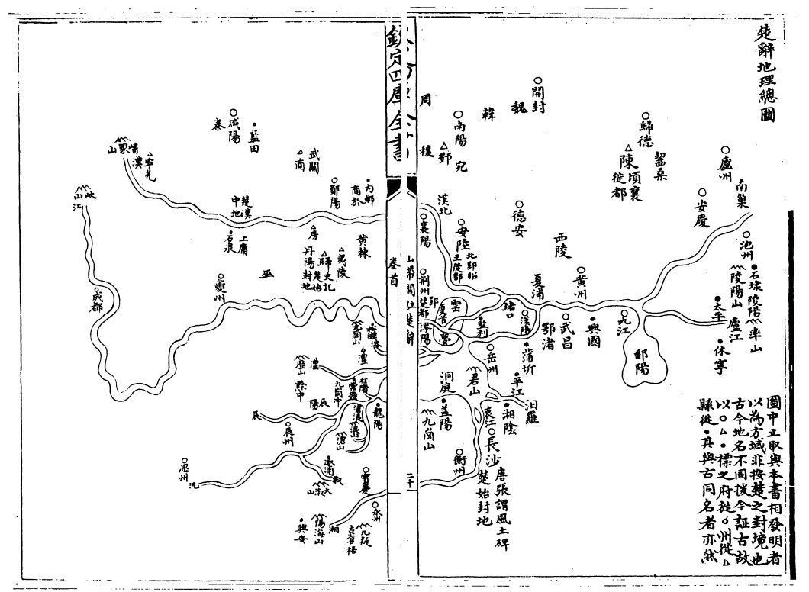
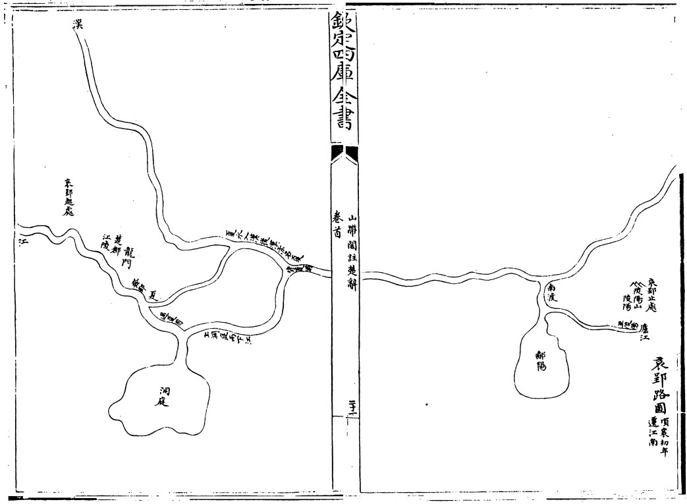
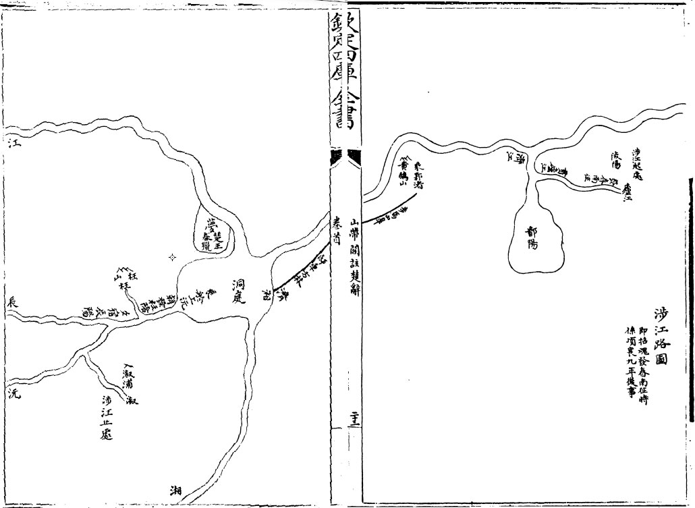
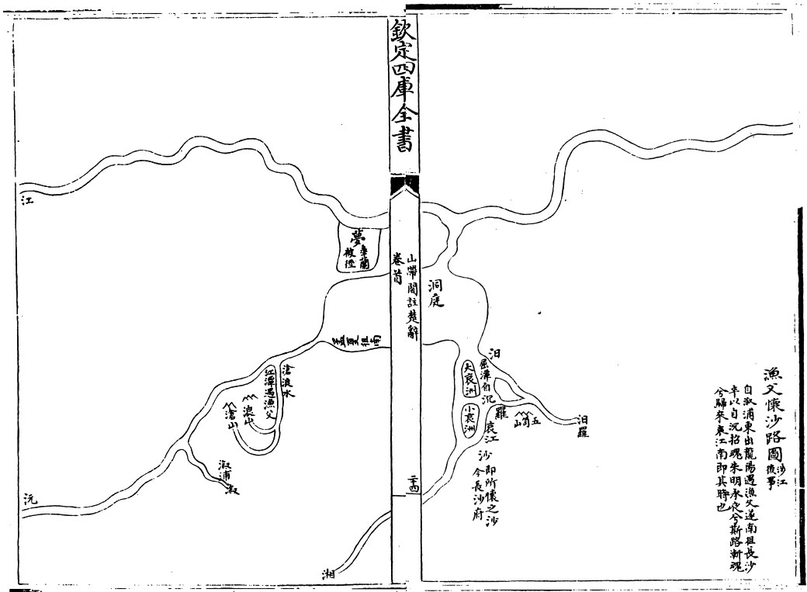

## 山带阁注楚辞巻首  
  
武进蒋骥撰  
  
篇目  
离骚  
九歌  
东皇太一　云中君湘君　湘夫人大司命少司命东君　河伯山鬼　国殇礼魂  
天问  
九章  
惜诵　涉江　哀郢　抽思怀沙　思美人惜往日橘颂悲回风  
逺游  
卜居  
渔父  
招魂  
大招  

宋洪庆善朱晦庵考定原赋止于渔父篇余采黄维章林西仲语并载招魂大招以正汉志二十五篇之数【`说见招魂余论`】然大招自汉以来巳相传爲原作而招魂篇名具见史记屈原传赞则固非二子创论也其作文次第年代幽逺无可参核窃尝以意推之首惜诵次离骚次抽思次思美人次卜居次大招次哀郢次涉江次渔父次怀沙次招魂次悲回风次惜往日终焉初失位志在洁身作惜诵已而决计爲彭咸作离骚十八年后放居汉北秋作抽思逾年春作思美人其三年作卜居此皆怀王时也怀王末年召还郢顷襄即位自郢放陵阳三年怀王归葬作大招居陵阳九年作哀郢巳而自陵阳入辰溆作涉江又自辰溆岀武陵作渔父适长沙作怀沙招魂其秋作悲回风逾年五月沈湘作惜往日盖察其辞意稽其道里有可徴者故列疏于诸篇而目次则仍其旧以存疑也若九歌天问橘颂逺游文辞浑然莫可推诘固弗敢强为之说云武进蒋骥  

### 屈原列传　

汉 司马迁  

屈原者名平楚之同姓也爲楚怀王左徒博闻强志明于治乱于辞令入则与王图议国事以岀号令岀则接遇賔客应对诸侯王甚任之上官大夫与之同列争宠而心害其能怀王使屈原造爲宪令屈平属草藁未定上官大夫见而欲夺之屈平不与因谗之曰王使屈平爲令众莫不知每一令岀平伐其功曰以爲非我莫能爲也王怒而疏屈平屈平嫉王听之不聪也谗谄之蔽明也邪曲之害公也方正之不容也故忧愁幽思而作离骚离骚者犹离忧也夫天者人之始也父母者人之本也人穷则反本故劳苦倦极未尝不呼天也疾痛惨怛未尝不呼父母也屈平正道直行竭忠尽智以事其君谗人间之可谓穷矣信而见疑忠而被谤能无怨乎屈平之作离骚盖自怨生也国风好色而不淫小雅怨诽而不乱若离骚者可谓兼之矣上称帝喾下道齐桓中述汤武以刺世事明道徳之广崇治乱之条贯靡不毕见其文约其辞微其志洁其行廉其称文小而其指极大举类迩而见义逺其志洁故其称物芳其行廉故死而不容自疏濯淖汚泥之中蝉蜕于浊秽以浮游尘埃之外不获世之滋垢皭然泥而不滓者也推此志也虽与日月争光可也屈平旣绌其后秦欲伐齐齐与楚从亲惠王患之乃令张仪佯去秦厚币委贽事楚曰秦甚憎齐齐与楚从亲楚诚能絶齐秦愿献商于之地六百里楚怀王贪而信张仪遂絶齐使使如秦受地张仪诈之曰仪与王约六里不闻六百里楚使怒去归告怀王怀王怒大兴师伐秦秦发兵击之大破楚师于丹浙斩首八万虏楚将屈匄遂取楚之汉中地怀王乃悉发国中兵以深入击秦战于蓝田魏闻之袭楚至邓楚兵惧自秦归而齐竟怒不救楚楚大困明年秦割汉中地与楚以和楚王曰不愿得地愿得张仪而甘心焉张仪闻乃曰以一仪而当汉中地臣愿请往如楚如楚又因厚币用事者臣靳尚而设诡辩于怀王之宠姬郑袖怀王竟听郑袖复释去张仪是时屈平旣疏不复在位使于齐顾反谏怀王曰何不杀张仪懐王悔追张仪不及其后诸侯共击楚大破之杀其将唐昧时秦昭王与楚婚欲与怀王防怀王欲行屈平曰秦虎狼之国不可信不如无行怀王稚子子兰劝王行奈何絶秦欢怀王卒行入武关秦伏兵絶其后因留懐王以求割地怀王怒不听亡走赵赵不内复之秦竟死于秦而归葬长子顷襄王立以其弟子兰爲令尹楚人旣咎子兰以劝怀王入秦而不反也屈平旣嫉之虽放流睠顾楚国系心怀王不忘欲返冀幸君之一悟俗之一改也其存君兴国而欲反覆之一篇之中三致志焉然终无可奈何故不可以反卒以此见怀王之终不悟也人君无愚智贤不肖莫不欲求忠以自为举贤以自佐然亡国破家相随属而圣君治国累世而不见者其所谓忠者不忠而所谓贤者不贤也怀王以不知忠臣之分故内惑于郑袖外欺于张仪疏屈平而信上官大夫令尹子兰兵挫地削亡其六郡身客死于秦为天下笑此不知人之祸也易曰井渫不食为我心恻可以汲王明并受其福王之不明岂足福哉令尹子兰闻之大怒卒使上官大夫短屈原于顷襄王顷襄王怒而迁之屈原至于江濵被发行吟泽畔顔色憔悴形容枯槁渔父见而问之曰子非三闾大夫欤何故而至此屈原曰举世混浊而我独清众人皆醉而我独醒是以见放渔父曰夫圣人者不凝滞于物而能与世推移举世混浊何不随其流而扬其波众人皆醉何不餔其糟而啜其醨何故怀瑾握瑜而自令见放爲屈原曰吾闻之新沐者必弹冠新浴者必振衣人又谁能以身之察察而受物之汶汶者乎宁赴常流而葬于江鱼腹中耳又安能以皓皓之白而防世之温蠖乎乃作怀沙之赋其词曰陶陶孟夏兮草木莽莽伤怀永哀兮汩徂南土眴兮窈窕孔静幽墨冤结纡轸兮离愍之长鞠抚情效志兮俛诎以自抑刓方以为圜兮常度未替易初本繇兮君子所鄙章画职墨兮前度未改内直质重兮大人所盛巧匠不斵兮孰察其揆正元文幽处兮蒙谓之不章离娄微睇兮瞽以为无明变白而为黒兮倒上而为下鳯凰在笯兮鸡雉翔舞同糅玉石兮一槩而相量夫党人之鄙妒兮羌不知吾所臧任重载盛兮陷滞而不济怀瑾握瑜兮穷不得余所示邑犬羣吠兮吠所怪也诽俊疑杰兮固庸态也文质疏内兮众不知吾之异采材朴委积兮莫知余之所有重仁袭义兮谨厚以为丰重华不可牾兮孰知余之从容古固有不并兮岂知其故也汤禹久逺兮邈不可慕也惩违改忿兮抑心而自强离湣而不迁兮愿志之有象进路北次兮日昧昧而将暮含忧虞哀兮限之以大故乱曰浩浩沅湘兮分流汩兮修路幽拂兮道逺忽兮曽唫恒悲兮永叹慨兮世既莫吾知兮人心不可谓兮怀情抱质兮独无匹兮伯乐既没兮将焉程兮人生有命兮各有所错兮定心广志余何畏惧兮曽伤爰哀永叹喟兮世溷不吾知心不可谓兮知死不可让兮愿勿爱兮明以告君子兮吾将以为类兮于是怀石遂自投汨罗以死屈原既死之后楚有宋玉唐勒景差之徒者皆好辞而以赋见称然皆祖屈原之从容辞令终莫敢直谏其后楚日以削数十年竟为秦所灭自屈原沈汨罗后百有余年汉有贾生为长沙王太傅过湘水投书以吊屈原  
太史公曰余读离骚天问招魂哀郢悲其志适长沙观屈原所自沈渊未尝不流涕想见其为人及见贾生吊之又怪屈原以彼其材游诸侯何国不容而自令若是读服鸟赋同死生轻去就又爽然自失矣  

### 屈原外传

唐 沈亚之  

昔汉武爱骚令淮南作传大概屈原巳尽于此故太史公因之以入史记外有二三逸事见之杂纪方志者尤详屈原痩细美髯丰神朗秀长九尺好竒服冠切云之冠性洁一日三濯缨事怀襄间蒙谗负讥遂放而耕吟离骚倚耒号泣于天时楚大荒原堕泪处独产白米如玉江陵志有玉米田即其地也尝游沅湘俗好祀必作乐歌以乐神辞甚俚原因栖玉笥山作九歌托以风谏至山鬼篇成四山忽啾啾若啼啸声闻十里外草木莫不萎死又见楚先王庙及公卿祠堂图画天地山川神灵琦玮僪佹与古圣贤怪物行事因书其壁呵而问之时天惨地愁白昼如夜者三日晩益愤懑披蓁茹草混同鸟兽不交世务采栢实和桂膏歌逺游之章托游仙以自适王逼逐之于五月五日遂赴清泠之水其神游于天河精灵时降湘浦楚人思慕谓为水仙每值原死日必以筒贮米投水祭之至汉建武中长沙区回白日忽见一人自称三闾大夫谓曰闻君尝见祭甚善但所遗并蛟龙所窃今有惠可以楝树叶塞上以五色丝转缚之此物蛟龙所惮回依其言世俗作糉并带丝叶皆其遗风晋咸安中有呉人顔珏者泊汨罗夜深月明闻有人行吟曰曾不知夏之为丘兮孰两东门之可芜珏异之前曰汝三闾大夫耶忽不见其所之江陵志又载原故宅在秭归乡北有女嬃庙至今衣石尚存时当秋风夜雨之际砧声隠隠可听也嘻异哉原以忠死直古龙比者流何以没后多不经事特千古骚魂郁而未散故鬻熊虽久不祀三闾之迹犹时彷佛占断于江潭泽畔蒹葭白露中耳  

### 楚世家节畧  

孟子曰诵其诗读其书不知其人可乎是以论其世也汉史传原既多畧而不详余仿林西仲本复辑楚世家怀襄二王事迹着于篇因兼采诸书附以所见将使读屈子之文者有所参考又以知楚之治乱存亡系于屈子一人而为万世逆忠逺徳者大戒也若林氏取原赋二十五篇凿空而分注之则吾岂敢  
怀王【`名槐威王子在位三十年`】  
元年张仪始相秦惠王  
四年秦惠王初称王  
六年楚使柱国昭阳攻魏破之襄陵【`今山西平阳府有襄陵县`】得八邑又移兵攻齐齐患之陈轸为齐说昭阳引兵去秦使张仪与楚齐魏盟齧桑【`史记正义曰在梁与彭城之间`】  
按张仪传秦使仪与齐楚大臣会齧桑归而免相相魏以为秦仪所至结交权贵左右卖国如此则是盟也庸知非即与上官靳尚等相结以预为浸润屈原之地乎  
十一年苏秦约从六国共攻秦楚为从长至函谷关【`在今河南府灵寳县`】秦出兵击六国六国皆引归  
按战国防齐助楚攻秦取曲沃当在是年之前后盖屈子为怀王左徒王甚任之故初政精明如此惜往日所谓国富强而法立也  
十六年秦欲伐齐患楚与齐亲使张仪约楚絶齐许以商于地六百里【`今邓州内乡县有商于城`】王大说遂絶齐秦不予地王怒兴师伐秦【`楚祸始此`】  
洪庆善补注引新序云秦欲吞灭诸侯屈原为楚东使齐以结强党秦患之使张仪之楚赂贵臣上官靳尚之属内赂夫人郑袖共谮屈原原放于外乃作离骚当怀王之十六年张仪相楚集注遂谓屈原放在十六年余按结齐本屈子谋屈子不去仪必不敢行其诈而屈子于王受知有素去之亦未易易也味惜诵致愍及离骚九死未悔之言盖始而见疎既而去朝固非一朝一夕之为矣然则仪之行赂谮原岂俟十六年至楚之时而原之得罪亦岂必在十六年哉本传屈平既绌其后秦欲伐齐云云其非同时可知矣  
十七年与秦战丹阳【`今荆州府归州屈子本居`】秦大败我军斩甲士八万虏大将屈匄遂取汉中郡【`今陜西汉中府`】楚悉国兵复袭秦大败于蓝田【`今陜西西安府`】韩魏闻楚困袭楚至邓【`今属河南南阳府`】楚引兵归【`张仪传于是楚割两城以与秦平`】  
十八年【`秦本纪惠王十四年伐楚取召陵当在是年世家失载`】秦约分汉中之半【`靳尚説郑袖所谓上庸六县也`】以和楚王曰愿得张仪不愿得地仪至王囚欲杀之靳尚说郑袖言于王岀之仪因说王叛从约与秦亲仪去屈原使从齐来谏曰何不诛张仪王悔使人追仪弗及  
按张仪传秦要楚欲得黔中地以武关外易之楚王曰愿得张仪而献黔中地仪使楚楚用郑袖言赦之仪因説楚王事秦楚王已得张仪而重出黔中地许之屈原曰前大王见欺于仪仪至臣以为且烹之今纵弗杀又听其邪说不可王曰许仪而得黔中美利也卒许仪与秦亲其文与世家及原传小异当以仪传为允盖是时楚弱秦强非欲易地曷为分汉中以求和至其不杀张仪固惑于郑袖之言亦縁重去黔中地耳然则原谏王时仪固尚在楚也又按新序云原既放于外而张仪欺楚楚王悔复用原使齐今考本传曰王怒而疏屈平屈平忧愁幽思而作离骚十八年亦曰屈平既疏不复在位是十八年之前原苐疏而不用未尝放于外也观离骚但言齌怒言穷困而不言路阻居蔽可见矣然本传又云虽放流系心怀王及抽思有来集汉北语意者使齐之后原复立朝遂乘间自申故愈撄众怒而迁之汉北欤兹歴情以陈辞众果以我为患其明徴也抽思思美人卜居诸篇盖皆十八年后作也  
二十年齐湣王欲为从长恶楚与秦合遗书楚王王用昭睢议复合于齐  
二十四年倍齐而合秦秦昭王初立厚赂楚楚往迎妇二十五年与秦盟于黄棘【`正义曰在房襄二州境`】秦复与楚上庸【`今郧阳府房州亦汉中地`】  
二十六年齐韩魏为楚负从亲共伐楚楚使太子质秦请救秦兵至三国引去  
二十七年秦大夫与楚太子鬭太子杀之亡归  
二十八年秦与齐韩魏共攻楚杀楚将唐昧取重丘【`在今东昌府`】  
四国连兵交伐遂为众恶所归矣太史公特序入原传者甚其败也  
二十九年秦复攻楚大破楚军死者二万【`六国年表作三万`】杀将军景缺【`纲目有取襄城句襄城今属河南开封府`】王恐乃复使太子质齐以求平  
按此武关之衅所由啓也是时秦所惮者独有一齐故楚怀始与齐亲而张仪设诈以絶之既合于齐而秦复厚赂以要之今之设质求平盖有以深中秦之忌矣原始为楚东结齐援诚良防也十八年使齐之行殆以原素睦于齐欲令谢过以复旧好不幸又为张仪连横之説所愚自后倐合倐离反覆无定至于诸国交攻丧师无日使原立朝岂容黙黙而已哉益知谏释张仪之后当复以谗见放也兹因秦伐而求平于齐岂悔心之萌而原所以复还也欤  
三十年秦复伐楚取八城秦昭王遗楚书欲会武关【`在今西安府商州`】结盟昭睢谏王毋行王用子兰言往会秦闭武关与王西至咸阳朝章台如藩臣要其割巫黔中郡【`巫今属四川夔州黔中今湖广常徳府辰州府`】王怒弗许秦留之楚太子自齐归立为王  
屈原谏不载盖互文耳  
顷襄王【`名横怀王子在位三十六年`】  
元年秦攻楚大败楚军斩首五万取析十五城【`年表作十六城括地志曰邓州内乡县本楚析邑`】  
屈子迁于江南陵阳当在是年仲春  
二年怀王亡逃归秦觉之遮楚道乃从间道走赵赵不纳欲走魏秦追至遂复入秦发病  
天下虽大无所容身读大招凌浃行魂无逃只二语可胜悲恸  
三年怀王卒于秦秦归其丧于楚秦楚絶  
六年秦遗楚书约决战王患之复与秦平  
七年楚迎妇于秦  
十四年与秦昭王好防于宛【`今河南南阳府`】结和亲  
十六年与秦好会于鄢【`楚惠王徙都处今襄阳府宜城县`】秋复与秦防禳【`今河南南阳府`】  
黄维章谓原死于顷襄十年林西仲谓死于十一年皆以哀郢有九年不复之言故耳然岂必哀郢甫成即投渊死哉今考哀郢在陵阳巳九年其后又涉江入辰溆又由辰溆东出龙阳遇渔父遂往长沙作怀沙其秋又有悲回风任石何益之言后以五月五日毕命湘水则在长沙亦非一载也故约畧其死当在顷襄十三四年或十五六年若王姜斋论哀郢谓指襄王徙陈则为时太逺未必及见矣且其时长沙曾为秦取原尚得晏然安身其地乎  
十八年楚人有以弋説王报怨于秦者王遣使诸侯复为从  
十九年秦伐楚楚军败割上庸汉北地予秦【`正义谓割上庸房金均三州及汉水之北与秦盖怀王时原所迁之地为秦有矣`】  
二十年秦将白起拔我西陵【`纲目赧王三十六年白起攻楚取鄢邓西陵鄢邓注见前西陵纲目注即后所烧之夷陵余按秦本纪徐广注云西陵属江夏正义曰西陵故城在黄州黄山西其説为是若夷陵有西陵之称乃孙吴所改不足为据`】  
二十一年秦将白起遂拔郢【`今荆州府江陵县`】烧先王墓夷陵【`今荆州府夷陵州自是楚都及屈子秭归故居皆为秦有年表又有遂东至竟陵句竟陵今安陆府`】楚兵散不复战东北保于陈城【`纲目楚徙都陈今开封府陈州`】  
二十二年秦复拔巫黔中郡【`巫黔中注并见前黔中即渔父歌沧浪及渉江所迁辰阳溆浦之地`】  
按原死骨肉未寒而国势土崩瓦解如此战国防载白起语云楚王恃其国大不恤其政羣臣相妒以功谀谄用事良臣斥疏百姓心离故得引兵深入多倍城邑以有功也呜呼国以一人兴以一人亡敌国知之矣  
二十三年王收东地兵十余万复西取秦所拔江旁十五邑为郡距秦  
按韩非曰秦与荆战大破荆袭郢取洞庭五渚江南则是时屈子自沉之长沙亦入秦矣其后始皇制曰荆王献青阳以西青阳即长沙地其即此所复取之十五邑乎  
二十七年复与秦平入太子为质于秦  
三十六年王病太子亡归秋王卒太子完立  
襄王子考烈王立二十五年卒子幽王立十年卒子哀王立二月兄负刍弑之负刍立五年为秦所灭  

### 楚辞地图  

余所考订楚辞地理与屈子两朝迁谪行踪既散着于诸篇犹恐览者之未察其详也次为图如左  
  
楚辞地理总图  

  
抽思思美人路图  

  
哀郢路图  

  
涉江路图  

  
渔父懐沙路图

  