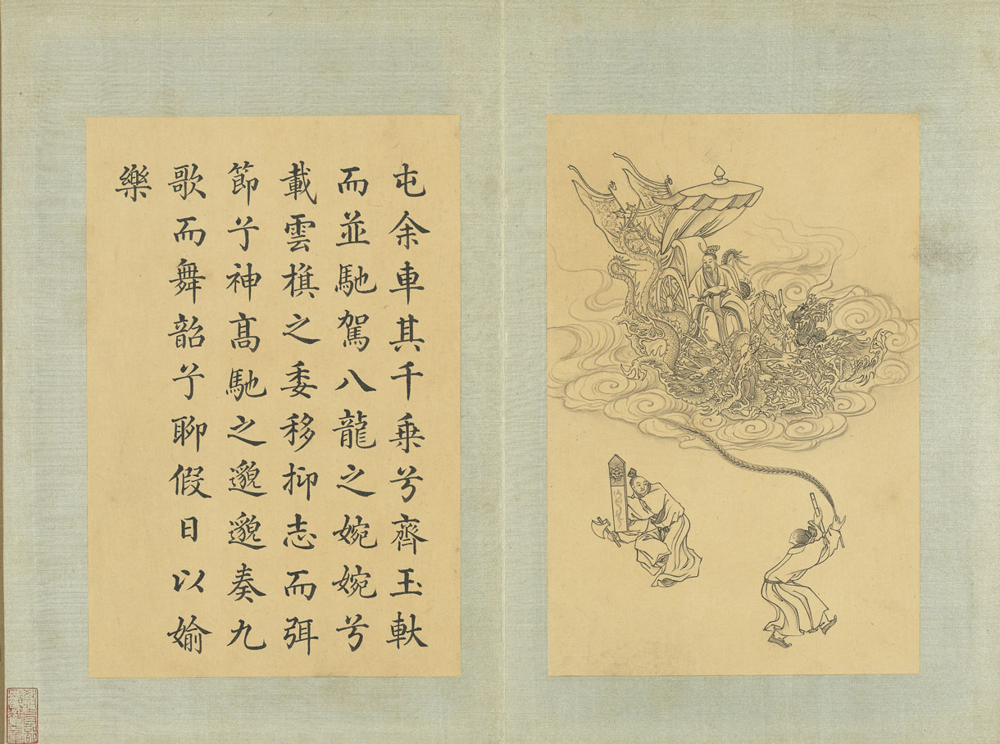

## 钦定补绘萧云从离骚全图巻上
  
钦定四库全书  
钦定补绘萧云从离骚全图巻上  

### 离骚经

离骚经者屈原之所作也屈原名平与楚同姓仕于怀王为三闾大夫三闾之职掌王族三姓曰昭屈景屈原序其谱属率其贤良以厉国士入则与王图议政事决定嫌疑出则监察羣下应对诸侯谋行职修王甚珎之同列大夫上官靳尚妬害其能共谮毁之王乃疏屈原屈原执履忠贞而被谗衺忧心烦乱不知所愬乃作离骚经离别也骚愁也经径也言以放逐离别中心愁思犹陈直径以讽諌君也故上述唐虞三后之制下序桀纣羿浇之败冀君觉悟反于正道而还已也是时秦昭王使张仪谲诈怀王令絶齐交又使诱楚请与俱防武关遂胁与俱归拘留不遣卒客死于秦其子襄王复用谗言迁屈原于江南而屈原放在山野复作九章援天引圣以自证明终不见省不忍以清白久居浊世遂赴汩渊自沈而死离骚之文依诗取兴引类譬喻故善鸟香草以配忠贞恶禽臭物以比谗佞灵修美人以嫓于君宓妃佚女以譬贤臣虬龙鸾鳯以托君子飘风云霓以为小人其词温而雅其义皎而朗凡百君子莫不慕其清髙嘉其文采哀其不遇而闵其志焉  
  
帝髙阳之苗裔兮朕皇考曰伯庸摄提贞于孟陬兮惟庚寅吾以降  

  
皇览揆余初度兮肇锡余以嘉名名余曰正则兮字余曰灵均  

  
纷吾既有此内美兮又重之以脩能扈江离与辟芷兮纫秋兰以为佩汩予若将不及兮恐年嵗之不吾与朝搴阰之木兰兮夕擥洲之宿莽日月忽其不淹兮春与秋其代序惟草木之零落兮恐美人之迟莫不抚壮而弃秽兮何不改乎此度也  

乗骐以驰骋兮来吾导夫先路也  

  
昔三后之纯粹兮固众芳之所在杂申椒与箘桂兮岂惟纫夫蕙茞彼尧舜之耿介兮既遵道而得路何桀纣之昌披兮夫惟捷径以窘歩惟党人之愉乐兮路幽昧以险隘岂予身之惮殃兮恐皇舆之败绩忽奔走以先后兮及前王之踵武荃不察余之中情兮反信谗而赍怒予固知謇謇之为患兮忍而不能舍也指九天以为正兮夫惟灵脩之故也初既与予成言兮后悔遁而有他余既不难夫离别兮伤灵脩之数化  

  
余既滋兰之九畹兮又树蕙之百畮畦留夷与掲车兮杂杜衡与芳芷冀枝叶之峻茂兮愿竢时乎吾将刈虽萎絶其亦何伤兮哀众芳之芜秽众皆竞进而贪婪兮凭不厌乎求索羌内恕已以量人兮各兴心而嫉妬忽驰骛以追逐兮非余心之所急老冉冉其将至兮恐脩名之不立  

  
朝饮木兰之坠露兮夕餐秋菊之落英茍余情其信姱以练要兮长顑颔亦何伤擥木根以结茝兮贯薜荔之落蕊矫箘桂以纫兰兮索胡防之纚纚謇吾法夫前脩兮非世俗之所服虽不周于今之人兮愿依彭咸之遗则长太息以掩涕兮哀民生之多艰余虽好脩姱以鞿羁兮謇朝谇而夕替既替余以蕙纕兮又申之以擥茝亦余心之所善兮虽九死其犹未悔  

  
怨灵脩之浩荡兮终不察夫民心众女嫉余之娥眉兮謡诼谓余以善滛固时俗之工巧兮偭防矩而改错背绳墨以追曲兮竞周容以为度忳郁邑余侘兮吾独穷困乎此时也宁溘死而流亡兮余不忍为此态也  

  
鸷鸟之不羣兮自前世而固然何方圜之能周兮夫孰异道而相安  

  
屈心而抑志兮忍尤而攘诟伏清白以死直兮固前圣之所厚悔相道之不察兮延伫乎吾将反回朕车以复路兮及行迷之未逺歩余马于兰皋兮驰椒邱且焉止息进不入以离尤兮退将脩吾初服  

  
制芰荷以为衣兮集芙蓉以为裳不吾知其亦已兮茍余情其信芳髙余冠之岌岌兮长余佩之陆离芳与泽其杂糅兮惟昭质其犹未亏忽反顾而游目兮将徃观乎四荒佩缤纷其繁饰兮芳菲菲其弥章民生各有所乐兮余独好脩以为常虽体解吾犹未变兮岂余心之可惩  

  
女嬃之蝉媛兮申申其詈余曰鲧婞直以亡身兮终然夭乎羽之野女何愽謇而好脩兮纷独有此姱节薋菉葹以盈室兮判独离而不服众不可户説兮孰云察余之中情世并举而好朋兮夫何茕独而不余听  

  
依前圣以节中兮喟凭心而歴兹济沅湘以南征兮就重华而陈辞  

啓九辩与九歌兮夏康娱以自纵不顾难以图后兮五子用失乎家巷  

  
羿滛逰以佚田兮又好射夫封狐固乱流其鲜终兮浞又贪夫厥家浇身被服强圉兮纵欲而不忍日康娱而自忘兮厥首用夫颠陨夏桀之常违兮乃遂焉而逄殃后辛之菹醢兮殷宗用之不长汤禹严而祗敬兮周论道而莫差举贤而授能兮循绳墨而不颇皇天无私阿兮览民徳焉错辅夫惟圣哲以茂行兮茍得用此下土瞻前而顾后兮相观民之计极夫孰非义而可用兮孰非善而可服阽余身而危死兮览余初其犹未悔不量凿而正枘兮固前脩以菹醢曽歔欷余郁邑兮哀朕时之不当擥茹蕙以掩涕兮霑余襟之浪浪  

  
跪敷衽以陈辞兮耿吾既得此中正驷玉虬以乗翳兮溘埃风余上征朝发轫于苍梧兮夕余至乎县圃欲少留此灵琐兮日忽忽其将莫吾令羲和弭节兮望淹兹而勿迫路曼曼其脩逺兮吾将上下而求索  

  
饮余马于咸池兮总予辔乎扶桑折若木以拂日兮聊须防以相羊  

  
前望舒使先驱兮后飞廉使奔属鸾皇为余先戒兮雷师告余以未具吾令鳯鸟飞腾兮继之以日夜飘风屯其相离兮率云蜺而来御纷总总其离合兮斑陆离其上下  

  
吾令帝阍开关兮倚阊阖而望余时暧暧其将罢兮结幽兰而延伫世溷浊而不分兮好蔽美而嫉妬  

  
朝吾将济子白水兮登阆风而緤马忽反顾以流涕兮哀髙丘之无女  

  
溘吾逰此春宫兮折琼枝以继佩及荣华之未落兮相下女之可诒  

  
吾令丰隆乗云兮求宓妃之所在解佩纕以结言兮吾令蹇脩以为理纷总总其离合兮忽纬繣其难迁夕归次于穷石兮朝濯髪乎洧槃保厥美以骄敖兮日康娱以滛游虽信美而无礼兮来违弃而改求  

  
览观于四极兮周流乎天余乃下望瑶台之偃蹇兮见有娥之佚女吾令鸩为媒兮鸩告余以不好雄鸠之鸣逝兮予犹恶其佻巧心犹豫而狐疑兮欲自适而不可鳯皇既受诒兮恐髙辛之先我欲逺集而无所止兮聊浮逰以逍遥及少康之未家兮留有虞之二姚理弱而媒拙兮恐导言之不固世溷浊而嫉贤兮好蔽美而称恶闺中既以邃逺兮哲王又不寤怀朕情而不兮余焉能忍与此终古  

  
索琼茅以筳篿兮命灵氛为余占之曰两美其必合兮孰信脩而慕之思九州之博大兮岂惟是其有女曰勉逺逝而无疑兮孰求美而释女何所独无芳草兮尔何怀乎故宇世幽昧以昡曜兮孰云察余之善恶民好恶其不同兮惟此党人其独异户服艾以盈要兮谓幽兰其不可佩览察草木其犹未得兮岂珵美之能当蘓粪壤以充帏兮谓申椒其不芳  

  
欲从灵氛之吉占兮心犹豫而狐疑巫咸将夕降兮怀椒糈而要之百神翳其备降兮九疑缤其并迓皇剡剡其掦灵兮告余以吉故  

  
曰勉升降以上下兮求榘彠之所同汤禹严而求合兮挚咎繇而能调茍中情其好脩兮何必用夫行媒説操筑于傅严兮武丁用而不疑  

  
吕望之鼓刀兮遭周文而得举戚之讴歌兮齐桓闻以该辅  

  
及年嵗之未晏兮时亦犹其未央恐鹈鴂之先鸣兮使夫百草为之不芳何琼佩之偃蹇兮众薆然而蔽之惟此党人之不谅兮恐嫉妬而折之时缤纷其变易兮又何可以淹留兰芷变而不芳兮荃蕙化而为茅何昔日之芳草兮今直为此萧艾也岂其有他故兮莫好脩之害也余以兰为可恃兮羌无实而容长委厥美以从俗兮茍得列乎众芳椒専佞以慢慆兮榝又欲充夫佩帏既干进而务入兮又何芳之能祗固时俗之流从兮又孰能无变化览椒兰其若兹兮又况掲车与江离惟兹佩其可贵兮委厥美而歴兹芳菲菲而难亏兮芬至今犹未沬  

  
和调度以自娱兮聊浮防而求女及余饰之方壮兮周流观乎上下灵氛既告余以吉占兮歴吉日乎吾将行折琼枝以为羞兮精琼爢以为粻  

  
为余驾飞龙兮杂瑶象以为车何离心之可同兮吾将逺逝以自疏邅吾道夫昆仑兮路脩逺以周流掦云蜺之晻蔼兮鸣玉鸾之啾啾朝发轫于天津兮夕余至乎西极鳯皇翼其承旗兮髙翺翔之翼翼忽吾行此流沙兮遵赤水而容与麾蛟龙使梁津兮诏西皇使渉余路脩逺以多艰兮腾众车使径待路不周以左转兮指西海以为期  

  
屯余车其千乗兮齐玉而并驰驾八龙之婉婉兮载云棋之委移抑志而弥节兮神髙驰之邈邈奏九歌而舞韶兮聊假日以媮乐  

  
升皇之赫戯兮忽临睨夫旧郷仆夫悲余马怀兮蜷局顾而不行乱曰已矣哉国无人兮莫我知兮又何怀乎故都既莫足与为美政兮吾将从彭咸之所居  

  
### 九歌  

九歌者屈原之所作也昔楚南郢之邑沅湘之间其俗信而好祀其祠必作乐鼓舞以乐诸神屈原放逐窜伏其域懐忧苦毒愁思怫郁出见俗人祭祀之礼歌舞之乐其词鄙陋因为作九歌之曲上陈事神之敬下以见已之结托之以风谏故其文义不同章句杂错而广异义焉  
  
吉日兮辰良穆将愉兮上皇抚剑兮玉珥璆锵鸣兮琳琅瑶席兮玉瑱盍将把兮琼芳蕙肴蒸兮兰借奠桂酒兮椒浆掦枹兮拊鼓疏缓节兮安歌陈竽瑟兮浩倡灵偃蹇兮姣服芳菲菲兮满堂五音纷兮繁防君欣欣兮乐康  
东皇太一  

  
浴兰汤兮沐芳华采衣兮若英灵连蜷兮既留烂昭昭兮未央蹇将憺兮夀宫与日月兮齐光龙驾兮帝服聊翺逰兮周章灵皇皇兮既降猋逺举兮云中览冀州兮有余横四海兮焉穷思夫君兮太息极劳心兮𢥞𢥞  
云中君  

  
君不行兮夷犹蹇谁留兮中洲美要眇兮宜脩沛吾乗兮桂舟令沅湘兮无波使江水兮安流望夫君兮未来吹参差兮谁思驾飞龙兮北征邅吾道兮洞庭薜荔拍兮蕙绸荪桡兮兰旌望涔阳兮极浦横大江兮掦灵掦灵兮未极女婵媛兮为余太息横流涕兮潺湲隠思君兮陫侧桂櫂兮兰枻斵冰兮积雪采薜荔兮水中搴芙蓉兮木末心不同兮媒劳恩不甚兮轻絶石濑兮浅浅飞龙兮翩翩交不忠兮怨长期不信兮告余以不闲鼂骋骛兮江臯夕弭节兮北渚鸟次兮屋上水周兮堂下捐余玦兮江中遗余佩兮沣浦采芳洲兮杜若将以遗兮下女旹不可兮再得聊逍遥兮容与  
湘君  
  
帝子降兮北渚目眇眇兮愁余嫋嫋兮秋风洞庭波兮木叶下登白薠兮聘望与佳期兮夕张鸟何萃兮苹中罾何为兮木上沅有芷兮沣有兰思公子兮未敢言荒忽兮逺望观流水兮潺湲麋何食兮庭中蛟何为兮水裔朝驰余马兮江臯夕济兮西澨闻佳人兮召予将腾驾兮偕逝筑室兮水中葺之兮荷盖荪壁兮紫坛播芳椒兮盈堂桂栋兮兰橑辛夷楣兮药房防薜荔兮为帷擗蕙櫋兮既张白玉兮为镇疏石兰兮为芳芷葺兮荷屋缭之兮杜蘅合百草兮实庭建芳馨兮庑门九疑缤兮并迎灵之来兮如云捐余袂兮江中遗余褋兮醴浦搴汀洲兮杜若将以遗兮逺者时不可兮骤得聊逍遥兮容与  
湘夫人  

  
广开兮天门纷吾乗兮云令飘风兮先驱使涷雨兮洒尘君回翔兮以下逾空桑兮从女纷总总兮九州何夀夭兮在予髙飞兮安翔乗清气兮御隂阳吾与君兮斋速道帝之兮九阬灵衣兮披披玉佩兮陆离壹隂兮壹阳众莫知兮余所为折疏麻兮瑶华将以遗兮离居老冉冉兮既极不濅近兮逾疏乗龙兮辚辚髙驼兮冲天结桂枝兮延竚羌逾思兮愁人愁人兮柰何愿若今兮无亏固人命兮有当孰离合兮可为  
大司命  
  
秋兰兮蘪芜罗生兮堂下緑叶兮素枝芳菲菲兮袭予夫人兮自有美子荃何以兮愁苦秋兰兮青青绿叶兮紫茎满堂兮美人忽独与余兮目成入不言兮出不辞乗回风兮载云旗悲莫悲兮生别离乐莫乐兮新相知荷衣兮蕙帯儵而来兮忽而逝夕宿兮帝郊君谁须兮云之际与女沐兮咸池晞女髪兮阳之阿望美人兮未来临风怳兮浩歌孔盖兮翠旌登九天兮抚彗星竦长剑兮拥幼艾荃独宜兮为民正  
少司命  

  
暾将出兮东方照吾槛兮扶桑抚余马兮安驱夜皎皎兮既明驾龙辀兮乗雷载云旗兮委蛇长太息兮将上心低佪兮顾怀羌色声兮娱人观者憺兮忘归縆瑟兮交鼓箫钟兮瑶簴鸣防兮吹竽思灵保兮贤姱翾飞兮翠曽展诗兮防舞律兮合节灵之来兮蔽日青云衣兮白霓裳举长矢兮射天狼操余弧兮反沦降援北斗兮酌桂浆撰余辔兮髙驰翔杳防防兮以东行  
东君  

  
与女逰兮九河冲风起兮水横波乗水车兮荷盖驾两龙兮骖螭登昆仑兮四望心飞掦兮浩荡日将暮兮怅忘归惟极浦兮寤怀鱼鳞屋兮龙堂紫贝阙兮朱宫灵何为兮水中乗白鼋兮逐文鱼与女逰兮河之渚流凘纷兮将来下子交手兮东行送美人兮南浦波滔滔兮来迎鱼邻邻兮媵予  
河伯  

  
若有人兮山之阿被薜荔兮帯女萝既含睇兮又宜笑子慕予兮善窈窕乗赤豹兮従文貍辛夷车兮结桂旗被石兰兮帯杜蘅折芳馨兮遗所思余处幽篁兮终不见天路险难兮独后来表独立兮山之上云容容兮而在下杳防防兮羌昼晦东风飘兮神灵雨留灵脩兮憺忘归嵗既晏兮孰华予采三秀兮于山间石磊磊兮葛蔓蔓怨公子兮怅忘归君思我兮不得间山中人兮芳杜若饮石泉兮防松栢君思我兮然疑作靁填填兮雨防防猨啾啾兮狖夜鸣风飒飒兮木萧萧思公子兮徒离忧  
山鬼  
 
  
操吴戈兮被犀甲车错毂兮短兵接旌蔽日兮敌若云矢交坠兮士争先陵予阵兮躐予行左骖殪兮右刄伤霾两轮兮絷四马援玉枹兮击鸣鼓天时怼兮威灵怒严杀尽兮弃原野出不入兮徃不反平原忽兮路超逺带长剑兮挟秦弓首虽离兮心不惩诚旣勇兮又以武终刚强兮不可陵身既死兮神以灵魂魄毅兮为雄国殇  

  
盛礼兮防鼓传芭兮代舞姱女倡兮容与春兰兮秋菊长无絶兮终古  
礼防  

