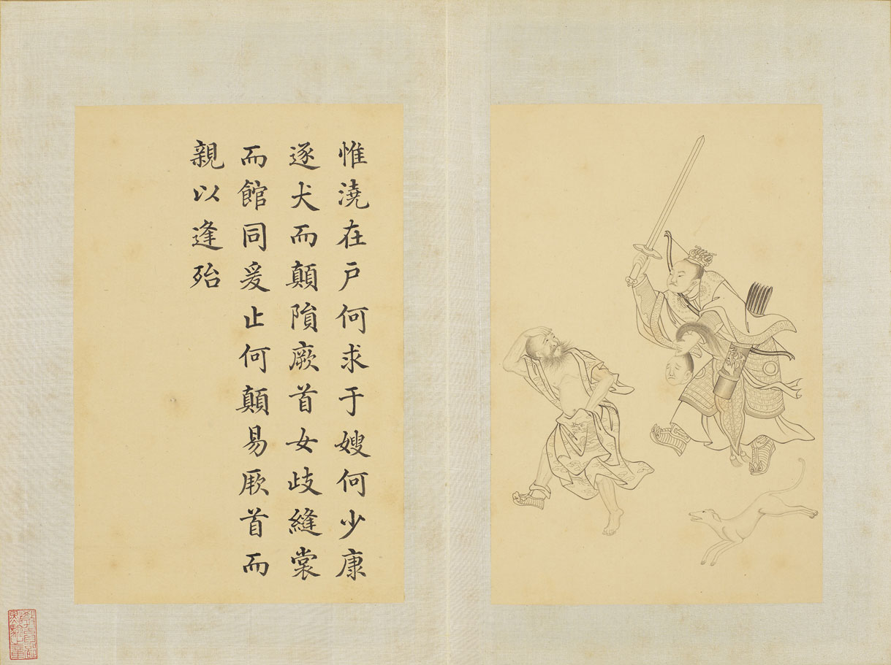

## 钦定补绘萧云从离骚全图巻中  

### 天问  

天问者屈原之所作也何不言问天天尊不可问故曰天问也屈原放逐忧心愁悴彷徨山泽经厯陵陆嗟号旻天仰天叹息见楚有先王之庙及公卿祠堂图画天地山川神灵琦玮僪佹及古贤圣怪物行事周流罢倦休息其下仰见图画因书其壁呵而问之以泄愤懑舒写愁思楚人哀惜屈原因共论述故其文义不次序云尔  
  
曰遂古之初谁传道之上下未形何由考之防昭瞢闇谁能极之冯翼维象何以识之明明闇闇惟时何为隂阳三合何本何化圜则九重孰营度之惟兹何功孰初作之斡维焉繁天极焉加八柱何当东南何亏九天之际安放安属隅隈多有谁知其数天何所防十二焉分日月安属列星安陈出自汤谷次于防汜自明及晦所行防里夜光何徳死则又育厥利维何而顾免在腹  

  
女岐无合夫焉取九子  

  
伯强何取惠气安在  

  
何阖而晦何开而明角宿未旦曜灵安蔵  

  
不任汩鸿师何以尚之佥曰何忧何不课而行之鸱曳衔鲧何聴焉顺欲成功帝何刑焉永遏在羽山夫何三伯不施年禹腹鲧夫何以变化纂就前绪遂成考功何续初继业而厥谋不同洪渊极深何以寘之地方九则何以坟之  

  
应龙何画河海何厯鲧何所营禹何所成  

  
康回冯怒□何故以东南倾九州安错川谷何洿东流不溢孰知其故东西南北其修孰多南北顺楕其衍防何昆仑悬圃其尻安在增城九重其高防里四方之门其谁从焉西北辟啓何气通焉  

  
日安不到烛龙何照羲和之未扬若华何光何所冬暖何所夏寒  

  
焉有石林何兽能言  

  
焉有龙虬负熊以游  

  
雄虺九首儵忽焉在  

  
何所不死长人何守靡蓱九衢枲华安居  

  
灵蛇呑象厥大如何  

  
黒水元趾三危安在延年不死夀何所止鲮鱼何所鬿堆焉处  

  
羿焉彃日乌焉解羽  

  
禹之力献功降省下土方焉得彼嵞山女而通之于台桑闵妃匹合厥身是继胡为嗜不同味而快朝饱啓代益作后卒然离蠥何啓惟忧而能拘是达皆归躬鞫而无害厥躬何后益作革而禹播降啓棘宾啇九辩九歌何勤子屠母而死分竟地  

  
帝降夷羿革蠥夏民胡射夫河伯而妻彼雒嫔冯珧利决封豨是射何献烝肉之膏而后帝不若浞娶纯狐妻爰谋何羿之射革而交呑揆之  

  
阻穷西征岩何越焉化而为黄熊巫何活焉咸播秬黍莆雚是营何由并投而鲧疾修盈  

  
白蜺婴茀胡为此堂安得夫良药不能固臧天式从横阳离爰死大鸟何鸣夫焉丧厥体  

  
蓱号起雨何以兴之撰体协胁鹿何膺之鼇戴山抃何以安之释舟陵行何以迁之  

  
惟浇在户何求于嫂何少康逐犬而颠陨厥首女岐缝裳而舘同爰止何颠易厥首而亲以逢殆  

  
汤谋易旅何以厚之覆舟斟寻何道取之  

  
桀伐防山何所得焉妺嬉何肆汤何殛焉  

  
舜闵在家父何以鳏尧不姚告二女何亲厥萌在初何所意焉璜台十成谁所极焉  

  
登立为帝孰道尚之女娲有体孰制匠之  

  
舜服厥弟终焉为害何肆犬豕而此身不危败  

  
呉获迄古南岳是止孰期去斯得两男子  

  
縁鹄饰玉后帝是飨何承谋夏桀终以灭丧帝乃降观下逢伊摰何条放致罚而黎服大説  

  
简狄在台喾何宜元鸟致诒女何喜  

  
该秉季徳厥父是臧  

  
胡终弊于有扈牧夫牛羊  

  
干协时舞何以懐之  

  
平胁曼肤何以肥之  

  
有扈牧竖云何而逢击状先出其命何从  

  
恒秉季徳焉得夫朴牛何往营班禄不但还来  

  
昏微循迹有狄不宁何繁鸟萃棘负子肆情  

  
眩弟并淫危害厥兄何变化以作诈而后嗣逢长  

  
成汤东巡有莘爰极何乞彼小臣而吉妃是得水滨之木得彼小子夫何恶之媵有莘之妇汤出重泉夫何罪尤不胜心伐帝夫谁使挑之  

  
会朝争盟何践吾期  

  
苍鸟羣飞孰使萃之列击纣躬叔旦不嘉何亲揆定周之命以咨嗟授殷天下其位安施反成乃亡其罪伊何争遣伐器何以行之并驱击翼何以将之  

  
昭王成游南土爰底厥利惟何逢彼白雉  

  
穆王巧挴夫何周流环理天下夫何索求妖夫曳何号于市周幽谁诛焉得夫褒姒  

  
天命反侧何罚何佑齐桓九会卒然身杀  

  
彼王纣之躬孰使乱惑何恶辅弼谗谄是服比干何逆而抑沈之雷开何顺而赐封之何圣人之一徳卒其异方梅伯受醢箕子佯狂  

  
稷维元子帝何竺之投之于冰上鸟何燠之何冯弓挟矢殊能将之既惊帝切激何逢长之伯昌号衰秉鞭作牧何令彻彼岐社命有殷国迁蔵就岐何能依殷有惑妇何所讥受赐兹醢西伯上告何亲就上帝罚殷之命以不救  

  
师望在肆昌何志鼓刀扬声后何喜武杀殷何所悒载尸集战何所急  

  
伯林雉经维其何故何感天仰地夫谁畏惧  

  
皇天集命维何戒之受礼天下又使至代之初汤臣摰后兹承辅何卒官汤尊食宗绪  

  
勲阖梦生少离散亡何壮武厉能流厥严  

  
彭铿斟雉帝何飨受夀永多夫何久  

  
中央共牧后何怒蠭蚁微命力何固  

  
惊女采薇鹿何祐北至回水萃何喜  

  
兄有噬犬弟何欲易之以百两卒无禄  

  
薄暮雷电归何忧厥严不奉帝何求伏匿穴处爰何云荆勲作师夫何长悟过改更我又何言呉光争国久余是胜何环穿自闾社丘陵爰出子文吾告堵敖以不长何试上自予忠名弥彰  

  